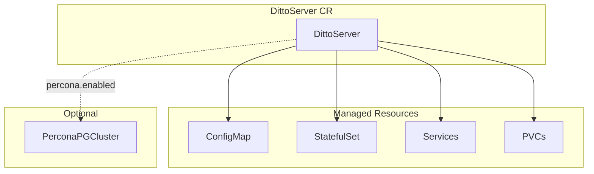
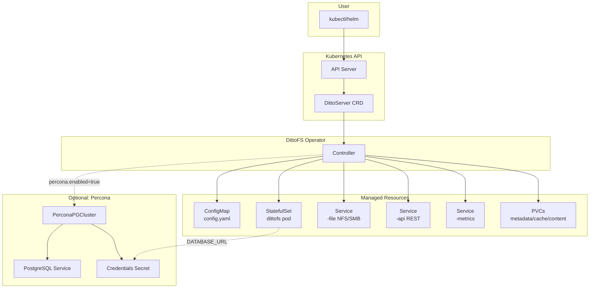

# Phase 6: Documentation and Deployment - Research

**Researched:** 2026-02-05
**Domain:** Kubernetes Operator Documentation, Helm Charts, Scaleway Kapsule
**Confidence:** HIGH

## Summary

This phase covers documentation and deployment validation for the DittoFS Kubernetes operator. The research investigated Helm chart generation patterns for Kubebuilder operators, CRD documentation best practices, Mermaid diagram syntax for architecture visualization, troubleshooting patterns for common Kubernetes issues, and Scaleway-specific LoadBalancer configuration.

The standard approach is to use the helmify tool to generate Helm charts from existing Kustomize manifests, structure documentation in topic-specific files (INSTALL.md, CRD_REFERENCE.md, PERCONA.md, TROUBLESHOOTING.md), use Mermaid flowcharts for architecture diagrams, and document troubleshooting in symptom/cause/solution format.

**Primary recommendation:** Generate the Helm chart using helmify from Kustomize output, document all CRD fields with tables showing type/default/validation/examples, and validate on Scaleway with proper LoadBalancer annotations.

## Standard Stack

The established tools for this domain:

### Core

| Tool | Version | Purpose | Why Standard |
|------|---------|---------|--------------|
| helmify | latest | Convert Kustomize to Helm | Standard tool for Kubebuilder operators, preserves structure |
| Mermaid | 11.1.0+ | Architecture diagrams | Native GitHub rendering, no external tools needed |
| kubectl | 1.29+ | Installation and validation | Universal Kubernetes CLI |
| helm | 4.1.0 | Package management | Standard for operator distribution |

### Supporting

| Tool | Version | Purpose | When to Use |
|------|---------|---------|-------------|
| kustomize | latest | Build installer manifests | Already in Makefile, generates install.yaml |
| Percona Operator | v2.x | PostgreSQL for metadata | Required prerequisite for Percona integration |

### Alternatives Considered

| Instead of | Could Use | Tradeoff |
|------------|-----------|----------|
| helmify | kubebuilder helm/v2-alpha | Native but alpha, helmify more mature |
| helmify | Manual Helm chart | Time-consuming, error-prone |
| Mermaid | Draw.io | External files to maintain, not version-controlled as code |

**Installation:**
```bash
# helmify (for chart generation during development)
brew install arttor/tap/helmify

# OR via go install
go install github.com/arttor/helmify/cmd/helmify@latest
```

## Architecture Patterns

### Recommended Documentation Structure

```
k8s/dittofs-operator/
├── README.md              # Overview + quick start (brief)
├── docs/
│   ├── INSTALL.md         # kubectl + Helm installation
│   ├── CRD_REFERENCE.md   # Complete CRD field reference
│   ├── PERCONA.md         # Percona integration guide
│   └── TROUBLESHOOTING.md # Common issues and solutions
└── chart/                 # Helm chart
    ├── Chart.yaml
    ├── values.yaml
    ├── crds/
    │   └── dittoservers.yaml
    └── templates/
        ├── deployment.yaml
        ├── rbac/
        ├── service.yaml
        └── _helpers.tpl
```

### Pattern 1: CRD Field Documentation Table Format

**What:** Document each CRD field in a consistent table format
**When to use:** CRD_REFERENCE.md for all spec and status fields
**Example:**
```markdown
| Field | Type | Default | Required | Description |
|-------|------|---------|----------|-------------|
| `spec.image` | string | `marmos91c/dittofs:latest` | No | Container image for DittoFS server |
| `spec.replicas` | int32 | `1` | No | Number of replicas (0 or 1 only) |
| `spec.storage.metadataSize` | string | - | **Yes** | Size for metadata PVC (e.g., "10Gi") |
```

**Validation rules inline:**
```markdown
**Validation:** `minimum=0`, `maximum=1`
```

### Pattern 2: Mermaid Flowchart for Architecture

**What:** Use Mermaid flowchart syntax for architecture diagrams
**When to use:** README.md overview, INSTALL.md deployment flow
**Example:**
```markdown


### Pattern 3: Troubleshooting Entry Format

**What:** Symptom/Cause/Solution format for troubleshooting entries
**When to use:** TROUBLESHOOTING.md
**Example:**
```markdown
### LoadBalancer External IP Pending

**Symptom:** Service shows `<pending>` in EXTERNAL-IP column
```bash
kubectl get svc dittofs-sample-file -n dittofs-system
# EXTERNAL-IP: <pending>
```

**Cause:** LoadBalancer Services require external infrastructure (cloud controller) to assign IPs. On bare metal or local clusters, no such infrastructure exists by default.

**Solution:**
1. **Cloud platforms:** Check cloud controller is running with proper permissions
2. **Bare metal:** Install MetalLB and configure IP pool
3. **Development:** Use `kubectl port-forward` or `minikube tunnel`

**Debug commands:**
```bash
kubectl describe svc dittofs-sample-file -n dittofs-system
kubectl logs -n kube-system -l app=cloud-controller-manager
```
```

### Anti-Patterns to Avoid

- **All-in-one README:** Don't put everything in README.md; split by topic for maintainability
- **Outdated examples:** Don't embed hardcoded versions; use placeholders like `VERSION` or reference `latest`
- **Missing prerequisites:** Always list prerequisites before installation steps
- **Undocumented validation:** Every field with validation rules must document them

## Don't Hand-Roll

Problems that look simple but have existing solutions:

| Problem | Don't Build | Use Instead | Why |
|---------|-------------|-------------|-----|
| Helm chart from Kustomize | Manual YAML conversion | helmify | Preserves structure, handles RBAC, CRDs correctly |
| Architecture diagrams | External image files | Mermaid | Version-controlled, renders in GitHub |
| CRD field extraction | Manual documentation | Extract from types.go | Single source of truth, less drift |
| Service account tokens | Inline credentials | Kubernetes Secrets + secretRef | Security best practice |

**Key insight:** Helm chart generation should be automated from Kustomize output to ensure consistency. Manual chart creation diverges from actual deployed resources.

## Common Pitfalls

### Pitfall 1: CRD Installation Order

**What goes wrong:** Installing operator before CRDs exist causes crash loops
**Why it happens:** Helm installs CRDs and resources together; if CRD registration is slow, webhook validation fails
**How to avoid:** Use `crds/` directory in Helm chart (Helm installs CRDs first), document kubectl apply order for raw manifests
**Warning signs:** `no matches for kind "DittoServer"` errors in operator logs

### Pitfall 2: Scaleway LoadBalancer Annotation Drift

**What goes wrong:** Manual LoadBalancer changes via Scaleway console are overwritten
**Why it happens:** Scaleway CCM reconciles Service annotations; any external changes are reverted
**How to avoid:** Always configure via Service annotations in CR or Helm values
**Warning signs:** LoadBalancer settings reset after operator reconciliation

### Pitfall 3: Percona Prerequisites Not Installed

**What goes wrong:** DittoServer CR accepted but stuck in Pending forever
**Why it happens:** Percona operator not installed; PerconaPGCluster CR cannot be created
**How to avoid:** Document prerequisite check: `kubectl get crd perconapgclusters.pgv2.percona.com`
**Warning signs:** `no matches for kind "PerconaPGCluster"` in operator logs

### Pitfall 4: PVC Stuck in Pending

**What goes wrong:** StatefulSet pods stuck in Pending because PVCs cannot bind
**Why it happens:** No matching StorageClass, CSI driver not installed, or capacity exceeded
**How to avoid:** Document StorageClass verification: `kubectl get storageclass`
**Warning signs:** `PersistentVolumeClaim is not bound` events on pod

### Pitfall 5: Helm CRD Upgrade Limitations

**What goes wrong:** CRD changes not applied on `helm upgrade`
**Why it happens:** Helm intentionally does not upgrade CRDs to prevent data loss
**How to avoid:** Document manual CRD update step: `kubectl apply -f crds/`
**Warning signs:** New fields not available after operator upgrade

## Code Examples

Verified patterns from official sources:

### Helm Chart values.yaml Structure

```yaml
# Source: Helm best practices + helmify output pattern
# values.yaml

# Operator image
image:
  repository: ghcr.io/marmos91/dittofs-operator
  tag: ""  # Defaults to Chart.appVersion
  pullPolicy: IfNotPresent

# Manager configuration
manager:
  replicas: 1
  resources:
    limits:
      cpu: 500m
      memory: 128Mi
    requests:
      cpu: 10m
      memory: 64Mi

# RBAC
rbac:
  create: true

# Service Account
serviceAccount:
  create: true
  name: ""

# Metrics
metrics:
  enabled: true
  port: 8443
```

### Makefile Target for Helm Chart Generation

```makefile
# Source: helmify documentation
HELMIFY ?= $(LOCALBIN)/helmify

.PHONY: helmify
helmify: $(HELMIFY)
$(HELMIFY): $(LOCALBIN)
	test -s $(LOCALBIN)/helmify || GOBIN=$(LOCALBIN) go install \
		github.com/arttor/helmify/cmd/helmify@latest

.PHONY: helm
helm: manifests kustomize helmify ## Generate Helm chart from kustomize manifests
	$(KUSTOMIZE) build config/default | $(HELMIFY) chart
```

### Mermaid Architecture Diagram



### Scaleway LoadBalancer Service Annotations

```yaml
# Source: Scaleway documentation
apiVersion: v1
kind: Service
metadata:
  name: dittofs-sample-file
  annotations:
    # Reserve specific IP (prevents deletion when service deleted)
    # service.beta.kubernetes.io/scw-loadbalancer-ip-ids: "fr-par-1/11111111-1111-1111-1111-111111111111"

    # Specify availability zone
    service.beta.kubernetes.io/scw-loadbalancer-zone: "fr-par-1"

    # Load balancing algorithm (roundrobin, leastconn, first)
    service.beta.kubernetes.io/scw-loadbalancer-forward-port-algorithm: "roundrobin"
spec:
  type: LoadBalancer
  # Optional: Use reserved flexible IP
  # loadBalancerIP: 51.159.24.7
```

### Status Conditions Documentation Table

```markdown
| Condition | Status | Meaning |
|-----------|--------|---------|
| `Ready` | True | DittoServer is fully operational |
| `Ready` | False | One or more sub-conditions not met |
| `Available` | True | StatefulSet has minimum ready replicas |
| `Available` | False | No replicas ready |
| `ConfigReady` | True | ConfigMap exists and contains valid config |
| `ConfigReady` | False | ConfigMap missing or invalid |
| `DatabaseReady` | True | PostgreSQL (Percona) cluster is ready |
| `DatabaseReady` | False | Percona cluster not ready or not found |
| `Progressing` | True | Change is being applied (scaling, updating) |
| `Progressing` | False | All resources up to date |
```

## State of the Art

| Old Approach | Current Approach | When Changed | Impact |
|--------------|------------------|--------------|--------|
| Manual Helm charts | helmify from Kustomize | 2024 | Consistent charts, less maintenance |
| External diagram files | Mermaid in Markdown | 2021 | GitHub native rendering |
| TCP probes for health | HTTP probes on API port | This project | More accurate health detection |
| kubebuilder helm plugin alpha | helmify stable | 2025 | Production-ready chart generation |

**Deprecated/outdated:**
- Helm 2: Requires Tiller, security concerns - use Helm 4.x
- `crd-install` hooks: Removed in Helm 3, use `crds/` directory

## Open Questions

Things that couldn't be fully resolved:

1. **Scaleway-specific StorageClass names**
   - What we know: Scaleway Kapsule has default StorageClasses
   - What's unclear: Exact names available in `dittofs-demo` cluster
   - Recommendation: Document discovery command `kubectl get storageclass`, use examples with placeholder

2. **Percona Operator exact version compatibility**
   - What we know: v2.x API used (`pgv2.percona.com/v2`)
   - What's unclear: Minimum compatible version, tested combinations
   - Recommendation: Document tested version in PERCONA.md, note API version requirement

## Sources

### Primary (HIGH confidence)
- [Helm Best Practices](https://helm.sh/docs/chart_best_practices/) - Chart structure, values, CRDs
- [Helm CRD Handling](https://helm.sh/docs/chart_best_practices/custom_resource_definitions/) - crds/ directory pattern
- [Kubebuilder Helm Plugin](https://book.kubebuilder.io/plugins/available/helm-v2-alpha) - Native chart generation
- [helmify GitHub](https://github.com/arttor/helmify) - Makefile integration patterns
- [Mermaid Architecture Diagrams](https://mermaid.js.org/syntax/architecture.html) - Syntax reference

### Secondary (MEDIUM confidence)
- [Scaleway LoadBalancer Docs](https://www.scaleway.com/en/docs/kubernetes/reference-content/kubernetes-load-balancer/) - Annotation patterns
- [Percona Operator Docs](https://docs.percona.com/percona-operator-for-postgresql/) - Installation patterns
- [Kubernetes PVC Troubleshooting](https://www.kubernet.dev/fixing-kubernetes-pvc-pending-status-a-comprehensive-troubleshooting-guide/) - Common issues

### Tertiary (LOW confidence)
- WebSearch results on Kubernetes troubleshooting patterns (validated against official K8s docs)

## Metadata

**Confidence breakdown:**
- Standard stack: HIGH - Official documentation for all tools
- Architecture: HIGH - Based on Helm best practices and helmify documentation
- Pitfalls: MEDIUM - Based on community patterns, may need validation on Scaleway

**Research date:** 2026-02-05
**Valid until:** 60 days (documentation patterns stable, verify Scaleway annotations if issues arise)
