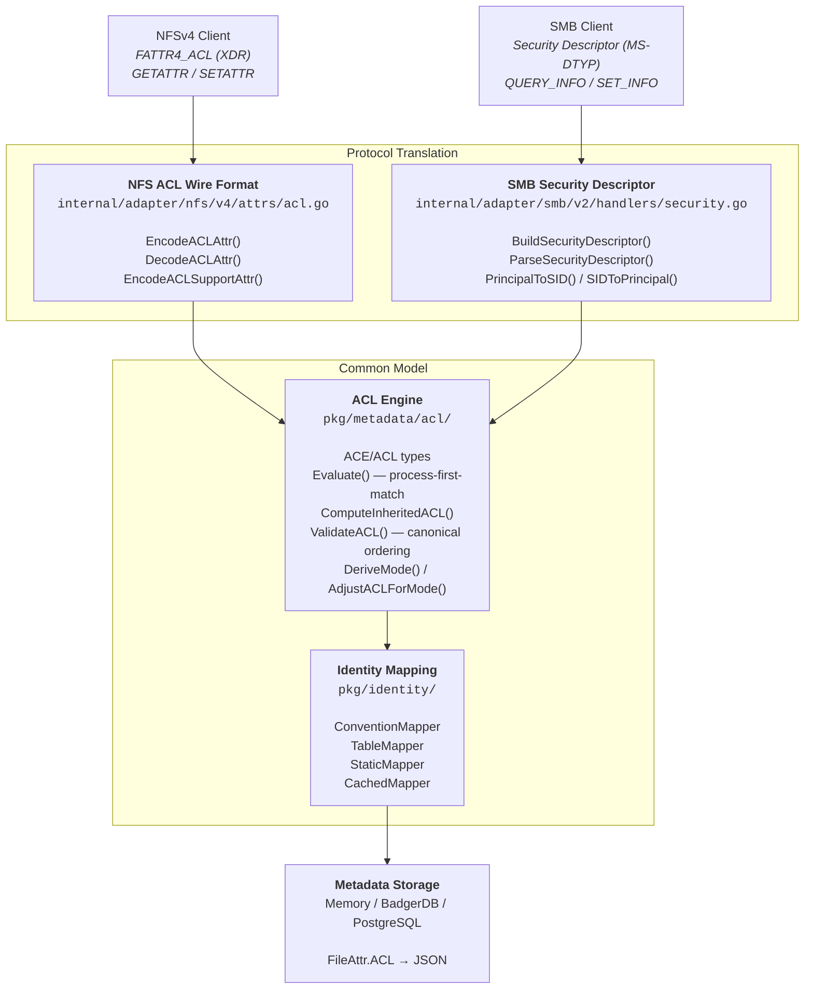

# Cross-Protocol ACL Architecture

DittoFS implements a unified ACL model that works seamlessly across both NFSv4 and SMB protocols. A single ACL set on a file via one protocol is immediately visible and enforceable from the other.

## Architecture



## Why NFSv4 ACLs as the Common Model?

RFC 7530 (NFSv4) deliberately designed its ACL model to be interoperable with Windows ACLs. This was not an accident — it was a primary design goal. The result is that the core semantics are identical:

| Concept | NFSv4 (RFC 7530) | Windows (MS-DTYP) | Same? |
|---------|-------------------|--------------------|-------|
| ACE types | ALLOW, DENY, AUDIT, ALARM | ACCESS_ALLOWED, ACCESS_DENIED, SYSTEM_AUDIT, SYSTEM_ALARM | Identical values |
| Access mask bits | 16 permission bits (READ_DATA=0x01, WRITE_DATA=0x02, ...) | Same 16 bits (FILE_READ_DATA=0x01, FILE_WRITE_DATA=0x02, ...) | Identical values |
| Inheritance flags | FILE_INHERIT, DIRECTORY_INHERIT, NO_PROPAGATE, INHERIT_ONLY | OBJECT_INHERIT, CONTAINER_INHERIT, NO_PROPAGATE, INHERIT_ONLY | Identical semantics |
| Canonical ordering | Explicit deny → explicit allow → inherited deny → inherited allow | Same | Identical |
| Evaluation | Process-first-match | Process-first-match | Identical |

Because the bit values are identical by design, no translation is needed for permission semantics. The only differences between the two protocols are:

1. **Wire format**: NFS uses XDR encoding, SMB uses binary Security Descriptors
2. **Identity format**: NFS uses `user@domain` strings, SMB uses Security Identifiers (SIDs)

## The Common ACL Model

The protocol-agnostic ACL implementation lives in `pkg/metadata/acl/` with zero dependencies on NFS or SMB wire formats.

### ACE Structure

```go
type ACE struct {
    Type       uint32  // ALLOW (0), DENY (1), AUDIT (2), ALARM (3)
    Flag       uint32  // Inheritance and audit flags
    AccessMask uint32  // Permission bits
    Who        string  // "user@domain", "OWNER@", "GROUP@", or "EVERYONE@"
}

type ACL struct {
    ACEs []ACE  // Maximum 128 entries
}
```

### Special Identifiers

Three special identifiers are resolved dynamically at evaluation time against the file's current owner/group:

| Identifier | Meaning | NFS | SMB |
|------------|---------|-----|-----|
| `OWNER@` | File owner | Direct | Maps to CREATOR OWNER SID (`S-1-3-0`) |
| `GROUP@` | File owning group | Direct | Maps to CREATOR GROUP SID (`S-1-3-1`) |
| `EVERYONE@` | All principals | Direct | Maps to Everyone SID (`S-1-1-0`) |

### Access Mask Bits

All 16 permission bits are protocol-universal:

```
Bit 0x00000001  READ_DATA / LIST_DIRECTORY
Bit 0x00000002  WRITE_DATA / ADD_FILE
Bit 0x00000004  APPEND_DATA / ADD_SUBDIRECTORY
Bit 0x00000008  READ_NAMED_ATTRS
Bit 0x00000010  WRITE_NAMED_ATTRS
Bit 0x00000020  EXECUTE / SEARCH
Bit 0x00000040  DELETE_CHILD
Bit 0x00000080  READ_ATTRIBUTES
Bit 0x00000100  WRITE_ATTRIBUTES
Bit 0x00010000  DELETE
Bit 0x00020000  READ_ACL
Bit 0x00040000  WRITE_ACL
Bit 0x00080000  WRITE_OWNER
Bit 0x00100000  SYNCHRONIZE
```

### Evaluation Algorithm

Process-first-match per RFC 7530 Section 6.2.1:

1. Process ACEs sequentially in stored order
2. Skip ACEs with `INHERIT_ONLY` flag (they apply to children, not this file)
3. For each matching ACE:
   - **ALLOW**: Mark undecided bits as allowed
   - **DENY**: Mark undecided bits as denied
   - **AUDIT/ALARM**: Skip (store-only, not evaluated for access)
4. Once a bit is decided (allowed or denied), later ACEs cannot change it
5. Early termination when all requested bits are decided
6. Access granted only if ALL requested bits are in the allowed set

### Canonical Ordering

ACLs are validated to follow Windows canonical ordering:

1. Explicit DENY ACEs (no `INHERITED_ACE` flag)
2. Explicit ALLOW ACEs (no `INHERITED_ACE` flag)
3. Inherited DENY ACEs (`INHERITED_ACE` flag set)
4. Inherited ALLOW ACEs (`INHERITED_ACE` flag set)
5. AUDIT/ALARM ACEs may appear anywhere

### Inheritance

When a file or directory is created, ACEs are inherited from the parent:

- **Files**: Include parent ACEs with `FILE_INHERIT` flag, clear all inheritance flags, set `INHERITED_ACE`
- **Directories**: Include parent ACEs with `DIRECTORY_INHERIT` flag, preserve inheritance flags (can propagate to grandchildren), set `INHERITED_ACE`
- If `NO_PROPAGATE_INHERIT` is set, inheritance stops at the first child

### Mode Synchronization

Unix mode bits (rwx) and ACLs are kept in sync:

- **`DeriveMode()`**: Scans OWNER@/GROUP@/EVERYONE@ ALLOW ACEs to compute mode bits for display
- **`AdjustACLForMode()`**: When `chmod` changes mode bits, only OWNER@/GROUP@/EVERYONE@ ACEs are updated. All explicit user/group ACEs are preserved unchanged.

### nil vs Empty ACL

- **`nil` ACL**: No ACL set — fall back to classic Unix permission checking (mode bits)
- **`&ACL{ACEs: []}`**: Explicit empty ACL — denies ALL access

## NFS Integration

**File**: `internal/adapter/nfs/v4/attrs/acl.go`

NFSv4 ACLs are the native format, so translation is zero-cost:

- **GETATTR** with `FATTR4_ACL`: Calls `EncodeACLAttr()` — directly encodes internal ACEs to XDR
- **SETATTR** with `FATTR4_ACL`: Calls `DecodeACLAttr()` — directly decodes XDR to internal ACEs, validates canonical ordering
- **FATTR4_ACLSUPPORT**: Reports support for all 4 ACE types (ALLOW, DENY, AUDIT, ALARM)

Identity strings (`user@domain`) are used as-is in the `Who` field.

## SMB Integration

**File**: `internal/adapter/smb/v2/handlers/security.go`

SMB uses Windows Security Descriptors, which require translation:

### Building a Security Descriptor (QUERY_INFO)

When an SMB client queries file security:

1. Owner SID constructed from file UID: `S-1-5-21-0-0-0-{UID}`
2. Group SID constructed from file GID: `S-1-5-21-0-0-0-{GID}`
3. DACL built by iterating internal ACEs:
   - Each ACE's `Who` converted to SID via `PrincipalToSID()`
   - ACE type, flags, and mask bits written directly (same values)
4. Binary self-relative Security Descriptor assembled with 4-byte alignment

### Parsing a Security Descriptor (SET_INFO)

When an SMB client sets file security:

1. Binary SD header parsed to find Owner, Group, DACL offsets
2. Owner SID → UID via `sidToUID()`
3. Group SID → GID via `sidToUID()`
4. DACL parsed: each binary ACE decoded, SID converted to principal via `SIDToPrincipal()`
5. Result stored as internal ACL via `SetFileAttributes()`

### SID Mapping

| NFS Principal | Windows SID | Direction |
|---------------|-------------|-----------|
| `OWNER@` | `S-1-3-0` (CREATOR OWNER) | Bidirectional |
| `GROUP@` | `S-1-3-1` (CREATOR GROUP) | Bidirectional |
| `EVERYONE@` | `S-1-1-0` (Everyone) | Bidirectional |
| `{uid}@localdomain` | `S-1-5-21-0-0-0-{uid}` | Bidirectional |
| `alice@EXAMPLE.COM` | `S-1-5-21-0-0-0-{hash}` | NFS → SMB only (lossy) |

## Identity Mapping

**Package**: `pkg/identity/`

The identity mapping system resolves NFS `user@domain` principals to Unix credentials (UID/GID):

| Mapper | Strategy | Use Case |
|--------|----------|----------|
| `ConventionMapper` | If domain matches configured realm, resolve username | Default for Kerberos environments |
| `TableMapper` | Explicit mapping table (principal → username) | AD environments with custom mappings |
| `StaticMapper` | Static configuration map | Small deployments with known users |
| `CachedMapper` | TTL-based cache wrapping any mapper | Performance (default 5-minute TTL) |

During ACL evaluation, the mapper resolves the requesting user's principal to a `ResolvedIdentity` containing UID, GID, and supplementary GIDs. This is used to match against ACE `Who` fields and special identifiers.

## Cross-Protocol Scenarios

### Scenario 1: NFS Client Sets ACL, SMB Client Reads It

```
1. NFS client: SETATTR with FATTR4_ACL
   ACEs: [ALLOW OWNER@ 0x1F01FF, DENY EVERYONE@ 0x02]

2. Stored internally as:
   ACL.ACEs = [{Type:ALLOW, Who:"OWNER@", Mask:0x1F01FF},
               {Type:DENY, Who:"EVERYONE@", Mask:0x02}]

3. SMB client: QUERY_INFO (Security)
   → BuildSecurityDescriptor()
   → ACE 1: ALLOW, SID=S-1-5-21-0-0-0-{ownerUID}, Mask=0x1F01FF
   → ACE 2: DENY,  SID=S-1-1-0 (Everyone), Mask=0x02
   → Windows Explorer shows correct permissions
```

### Scenario 2: SMB Client Sets ACL, NFS Client Reads It

```
1. SMB client: SET_INFO (Security Descriptor)
   DACL: [ALLOW S-1-1-0 0x1F01FF]  (Everyone, Full Control)

2. ParseSecurityDescriptor()
   → SIDToPrincipal(S-1-1-0) → "EVERYONE@"
   → Stored as: ACL.ACEs = [{Type:ALLOW, Who:"EVERYONE@", Mask:0x1F01FF}]

3. NFS client: GETATTR with FATTR4_ACL
   → EncodeACLAttr()
   → ACE: ALLOW "EVERYONE@" 0x1F01FF
   → nfs4_getfacl shows correct ACL
```

### Scenario 3: Mixed Protocol Access Control

```
1. SMB client creates file with ACL:
   [ALLOW S-1-5-21-0-0-0-1000 READ_DATA, DENY S-1-1-0 WRITE_DATA]

2. NFS client (UID 1000) tries to read → evaluateACLPermissions()
   → ACE 1: "1000@localdomain" matches UID 1000 → READ allowed
   → Access granted

3. NFS client (UID 1000) tries to write → evaluateACLPermissions()
   → ACE 1: matches but no WRITE bit → undecided
   → ACE 2: "EVERYONE@" matches → WRITE denied
   → Access denied
```

## Tradeoff Analysis: ACL Abstraction Approaches

A key design question is whether DittoFS should use a **proprietary ACL abstraction** instead of NFSv4 ACLs as the canonical model. We evaluated three approaches.

### Approach A: NFSv4 ACLs as Canonical (Current)

This is what DittoFS implements today. The internal ACL model uses NFSv4-style ACEs (RFC 7530 Section 6), stored as `acl.ACL` in `pkg/metadata/acl/`.

**Strengths:**
- Minimal code — one model shared by both protocols
- Zero translation cost for NFS clients (the internal model **is** the wire format)
- Battle-tested specification designed by the IETF specifically as the Unix/Windows common model
- Evaluation engine, inheritance, validation all work for both protocols without branching

**Weaknesses:**
- `Who string` is NFS-centric — real Windows SIDs must be fabricated (`S-1-5-21-0-0-0-{hash}`)
- Real AD SIDs lose identity on round-trip (hash-based RID is one-way)
- No SACL container separate from DACL
- Owner/Group live in `FileAttr`, not bundled with the ACL

### Approach B: Proprietary DittoFS ACL Abstraction

A fully custom ACL model with first-class support for both identity systems:

```go
type Principal struct {
    Kind    PrincipalKind  // User, Group, Special (Owner, OwningGroup, Everyone)
    Name    string         // Control plane username
    UID     *uint32        // Unix ID (optional)
    SID     *SID           // Windows SID (optional)
}

type ACE struct {
    Type      ACEType      // Allow, Deny, Audit, Alarm
    Flags     uint32       // Inheritance flags (same bits — they're protocol-universal)
    Mask      uint32       // Permission bits (same bits — they're protocol-universal)
    Principal Principal
}

type SecurityDescriptor struct {
    Owner Principal
    Group Principal
    DACL  []ACE
    SACL  []ACE
}
```

**Strengths:**
- First-class SID support — real AD SIDs preserved on round-trip
- SACL container for auditing
- Owner/Group bundled with ACL (natural for SMB)
- Protocol-neutral identity model — neither NFS nor SMB is "special"

**Weaknesses:**
- **NFS loses its zero-cost translation** — now both protocols need a translation layer
- More code to maintain (~500-800 lines of new translation + migration)
- Migration of all stored ACLs in metadata backends (JSON schema change)
- Risk of subtle semantic drift from both protocol specs
- The permission bits and evaluation algorithm would be **identical anyway** — only the identity model actually changes
- NFSv4 ACLs were *designed by the IETF* to be this common model; rebuilding it reinvents the wheel

### Approach C: Enhanced NFSv4 Model (Recommended)

**Key insight:** The only real gap between Approach A and B is the **identity model**. The ACE types, access mask bits, inheritance flags, evaluation algorithm, and canonical ordering are all protocol-universal. Rebuilding the entire ACL model is overkill when only the `Who` field needs enrichment.

```go
// Enhanced ACE (backward compatible)
type ACE struct {
    Type       uint32 `json:"type"`
    Flag       uint32 `json:"flag"`
    AccessMask uint32 `json:"access_mask"`
    Who        string `json:"who"`                // Preserved for NFS (backward compatible)
    SID        *SID   `json:"sid,omitempty"`       // Windows SID when set via SMB
}
```

Plus a control plane SID mapping table:

| Principal (NFS) | SID (Windows) | Username (CP) |
|---|---|---|
| `alice@EXAMPLE.COM` | `S-1-5-21-xxx-1001` | `alice` |
| `admins@EXAMPLE.COM` | `S-1-5-32-544` | (group) |

**Strengths:**
- Real AD SIDs preserved on round-trip (stored in `SID` field)
- NFS still zero-cost for the common case (reads `Who`)
- SMB reads `SID` when present, falls back to fabrication when not
- Backward compatible — existing stored ACLs work unchanged (`SID` is `omitempty`)
- Minimal migration — add optional field, add mapping table
- If we ever need full Approach B, this is a stepping stone

**Weaknesses:**
- Doesn't bundle Owner/Group into ACL (but this is a display concern, not a semantic one)
- Doesn't provide SACL container (can be added incrementally)

### Verdict

**Approach C** is recommended because:

1. The permission semantics (mask bits, ACE types, inheritance, evaluation) are already protocol-universal by RFC design. Rebuilding them gains nothing.
2. The only real gap is identity (`string` vs `SID`), which is a targeted fix.
3. Approach B costs NFS its zero-cost translation — the most common protocol path.
4. Approach C is backward compatible — no migration of existing ACLs needed.
5. If we ever need full Approach B, Approach C is a stepping stone (the SID field is already there).

---

## Known Limitations

1. **Non-DittoFS SIDs are lossy**: Real Active Directory SIDs (e.g., `S-1-5-32-544` for Administrators) are stored as string representations but mapped to UID 65534 (nobody) when parsed back. Round-trip fidelity is lost for AD domain SIDs.

2. **Hash-based SID generation**: Named principals without numeric UIDs (e.g., `alice@EXAMPLE.COM`) produce a hash-based RID when converted to SID. This is deterministic but could theoretically collide.

3. **No SACL support**: System ACLs for Windows auditing are always NULL in Security Descriptors. AUDIT/ALARM ACE types can be stored but are not exposed to SMB clients as a SACL.

4. **Owner/Group not in ACL**: Windows Security Descriptors bundle owner, group, and DACL together. DittoFS stores owner (UID) and group (GID) separately in file attributes. This is transparent to clients but means owner/group changes don't trigger ACL-related events.

## Future Improvements

The [tradeoff analysis](#tradeoff-analysis-acl-abstraction-approaches) recommends Approach C (Enhanced NFSv4 Model). The implementation roadmap:

### Phase 1: SID Field on ACE

Add optional `SID` field to `acl.ACE` (`json:"sid,omitempty"`). When an SMB client sets an ACL with a real AD SID, store it alongside the `Who` string. SMB reads `SID` when present, falls back to fabrication when not. NFS ignores the field entirely.

- **Backward compatible**: Existing stored ACLs work unchanged (field is `omitempty`)
- **Eliminates**: SID round-trip limitation for all new ACLs

### Phase 2: Control Plane SID Mapping Table

Add a mapping table linking NFS principals, Windows SIDs, and control plane usernames:

| Principal (NFS) | SID (Windows) | Username (CP) |
|---|---|---|
| `alice@EXAMPLE.COM` | `S-1-5-21-xxx-1001` | `alice` |
| `admins@EXAMPLE.COM` | `S-1-5-32-544` | (group) |

Extend `IdentityMapper` to query this table for SID → principal resolution (and vice versa).

### Phase 3: SACL Container

Add optional SACL field on `FileAttr` for audit/alarm ACEs separate from the DACL. This enables SMB clients to set and query system ACLs independently.

### Phase 4: AD/LDAP Integration

Extend `IdentityMapper` with an LDAP-backed implementation for real domain principal and group resolution. Combined with Phase 2, this enables full Active Directory interoperability.

Each phase is incremental and backward compatible. Phase 1 alone closes the primary gap.

## References

- [RFC 7530 Section 6](https://tools.ietf.org/html/rfc7530#section-6) — NFSv4 ACL specification
- [MS-DTYP Section 2.4](https://docs.microsoft.com/en-us/openspecs/windows_protocols/ms-dtyp/) — Windows Security Descriptor format
- [RFC 7530 Section 6.4.1](https://tools.ietf.org/html/rfc7530#section-6.4.1) — Mode/ACL synchronization
