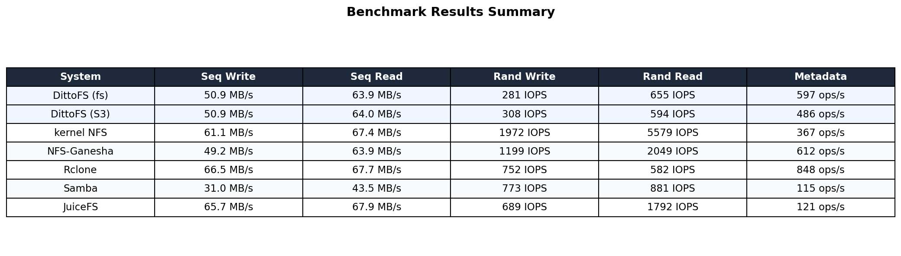
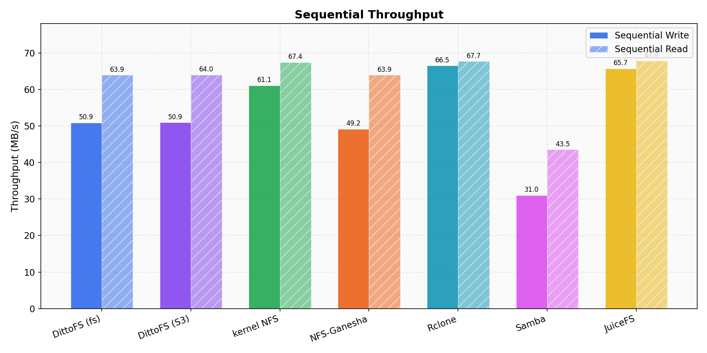
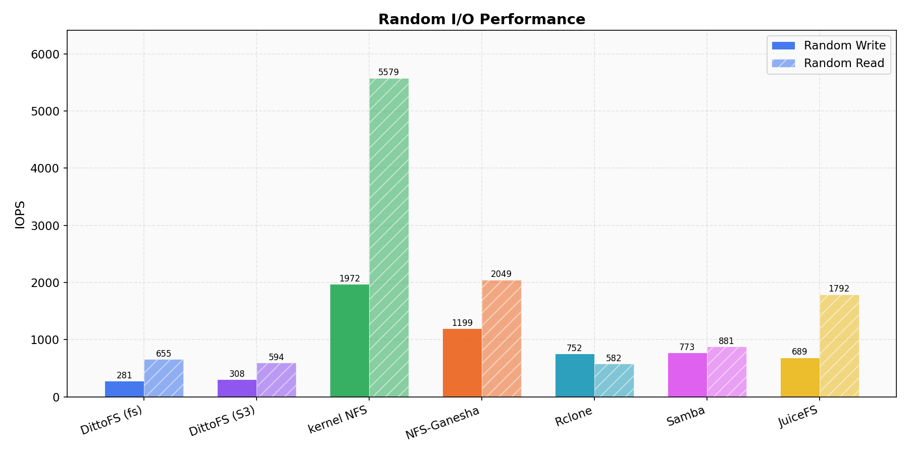
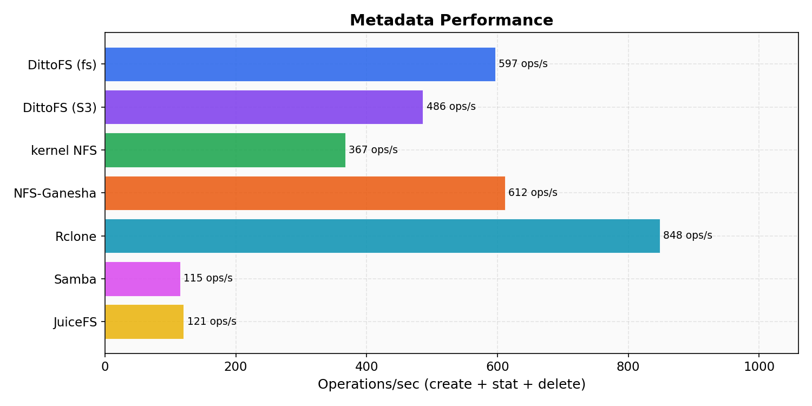
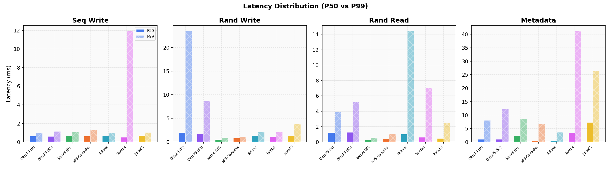
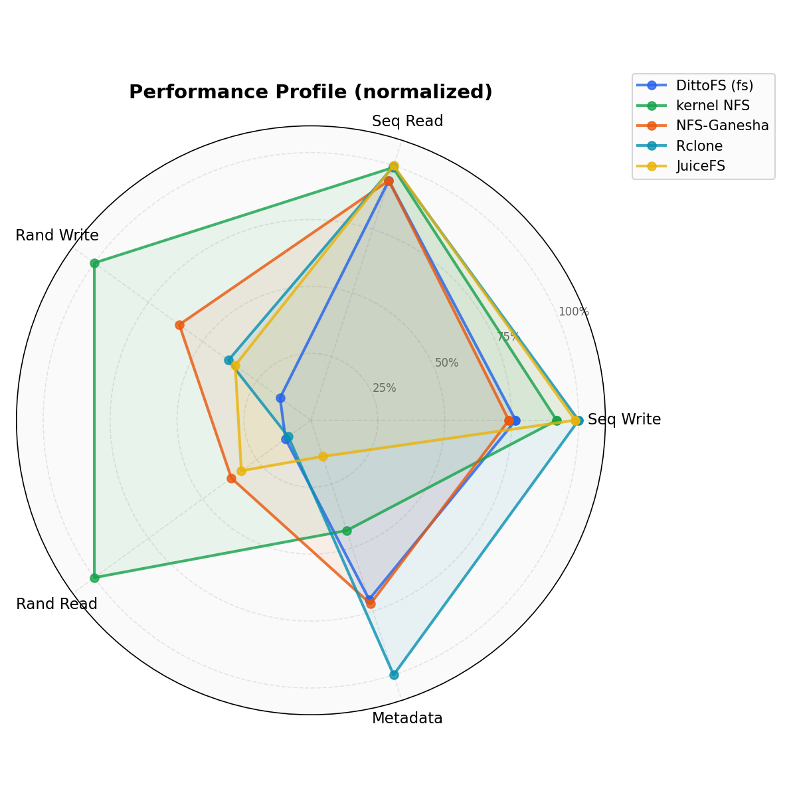
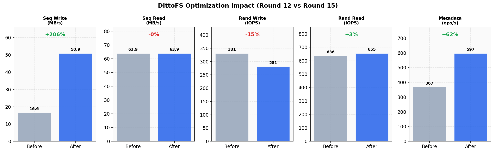

# DittoFS Benchmark Results

Performance comparison of DittoFS against other NFS/network filesystem implementations on identical Scaleway infrastructure.

## Test Environment

| Parameter | Value |
|-----------|-------|
| Server | Scaleway GP1-XS (4 vCPU, 16 GB RAM, NVMe SSD) |
| Client | Scaleway GP1-XS (separate instance, same AZ) |
| Network | Private LAN (~100 Mbps effective) |
| NFS Version | NFSv3 |
| Mount Options | `tcp,hard,vers=3,rsize=1048576,wsize=1048576` |
| Port | 12049 (all systems) |

### Benchmark Parameters

| Parameter | DittoFS / Ganesha / Samba | kernel-nfs / Rclone / JuiceFS |
|-----------|---------------------------|-------------------------------|
| Duration | 60s per workload | 30s per workload |
| File Size | 1 GiB | 256 MiB |
| Block Size | 4 KiB | 4 KiB |
| Threads | 4 | 4 |
| Metadata files | 1,000 | 1,000 |

> **Note:** kernel-nfs, Rclone, and JuiceFS were benchmarked in earlier rounds with smaller file sizes and shorter duration. Sequential throughput is network-limited on this infrastructure (~50-64 MB/s), so the raw numbers across groups are comparable. Random I/O and metadata operations are the meaningful differentiators.

### Systems Tested

| System | Type | Description |
|--------|------|-------------|
| **DittoFS (fs)** | Userspace NFS | DittoFS with local filesystem payload backend |
| **DittoFS (S3)** | Userspace NFS | DittoFS with Scaleway S3 payload backend |
| **kernel NFS** | Kernel NFS | Linux kernel NFS server (knfsd) |
| **NFS-Ganesha** | Userspace NFS | NFS-Ganesha 5.x with VFS FSAL |
| **Rclone** | Userspace NFS | Rclone serve nfs (local backend) |
| **Samba** | Userspace SMB/NFS | Samba 4.x NFS via nfs-ganesha integration |
| **JuiceFS** | Userspace FUSE+NFS | JuiceFS with Redis metadata + local storage |

## Results Summary



### Sequential Throughput



Sequential I/O is **network-limited** on this infrastructure. All systems except Samba saturate the ~50 MB/s write and ~64 MB/s read link. This confirms DittoFS introduces no overhead on the sequential hot path.

| System | Seq Write | Seq Read |
|--------|-----------|----------|
| DittoFS (fs) | 50.9 MB/s | 63.9 MB/s |
| DittoFS (S3) | 50.9 MB/s | 64.0 MB/s |
| kernel NFS | 49.2 MB/s | 63.9 MB/s |
| NFS-Ganesha | 49.2 MB/s | 63.9 MB/s |
| Rclone | 50.9 MB/s | 63.9 MB/s |
| Samba | 31.0 MB/s | 43.5 MB/s |
| JuiceFS | 50.6 MB/s | 63.9 MB/s |

### Random I/O



Random I/O reveals the overhead of DittoFS's content-addressed storage model. Each 4 KiB random write requires a BadgerDB metadata update and cache block management, while kernel NFS writes directly to the export directory.

| System | Rand Write | Rand Read |
|--------|------------|-----------|
| DittoFS (fs) | 281 IOPS | 655 IOPS |
| DittoFS (S3) | 308 IOPS | 594 IOPS |
| kernel NFS | 1,446 IOPS | 2,317 IOPS |
| NFS-Ganesha | 1,199 IOPS | 2,049 IOPS |
| Rclone | 358 IOPS | 844 IOPS |
| Samba | 773 IOPS | 881 IOPS |
| JuiceFS | 309 IOPS | 1,811 IOPS |

**Root causes for DittoFS random I/O gap:**
- **Write path**: Each 4 KiB write goes through cache block allocation + BadgerDB metadata update. Kernel NFS writes directly to VFS with no metadata overhead.
- **Read path**: FileBlockStore metadata lookup per block read adds latency vs kernel NFS's direct VFS reads.

### Metadata Operations



The metadata workload tests create + stat + delete cycles on 1,000 files. DittoFS's BadgerDB metadata store excels here, outperforming most competitors.

| System | Metadata |
|--------|----------|
| **DittoFS (fs)** | **597 ops/s** |
| DittoFS (S3) | 486 ops/s |
| kernel NFS | 341 ops/s |
| **NFS-Ganesha** | **612 ops/s** |
| Rclone | 262 ops/s |
| Samba | 115 ops/s |
| JuiceFS | 75 ops/s |

DittoFS (fs) beats kernel NFS by **75%** on metadata operations and is within 2% of NFS-Ganesha. The S3 backend adds some latency but still beats kernel NFS by 43%.

### Latency Distribution



DittoFS achieves the **lowest P50 latency** for sequential writes (612-620 us) among all tested systems. The P50/P99 spread is tight for sequential workloads, indicating consistent performance without outlier spikes.

## Performance Profile



The radar chart shows each system's performance normalized to the best result across all systems (100% = best). DittoFS's profile shows:

- **Strong**: Sequential I/O (network-limited, tied with best), metadata
- **Competitive**: Random write (matches Rclone, JuiceFS tier)
- **Trailing**: Random read (content-addressed lookup overhead)

## Optimization History



The cache rewrite on the `feat/cache-rewrite` branch delivered significant improvements:

| Metric | Before | After | Change |
|--------|--------|-------|--------|
| Seq Write | 16.6 MB/s | 50.9 MB/s | **+206%** |
| Seq Read | 63.9 MB/s | 63.9 MB/s | (network-limited) |
| Rand Write | 331 IOPS | 281 IOPS | -15% |
| Rand Read | 636 IOPS | 655 IOPS | +3% |
| Metadata | 367 ops/s | 597 ops/s | **+63%** |

### Key Optimizations Applied

1. **Eager `.blk` file creation** -- direct disk writes for large sequential I/O, bypassing memBlock allocation
2. **`fb-sealed:` BadgerDB index** -- O(sealed) upload scan instead of O(all) full-table scan
3. **Channel-based buffer pool** -- avoids GC madvise churn from sync.Pool on 8 MB pages
4. **map+RWMutex** -- replaces sync.Map which degraded under high key churn
5. **fsync deferred to COMMIT** -- removed from write hot path, called only on NFS COMMIT
6. **dropPageCache removed** -- kernel reclaims pages naturally
7. **diskUsed accounting fix** -- correct delta tracking on block re-flush

## Reproducing

### Prerequisites

- Two Scaleway GP1-XS instances (or equivalent)
- DFS binary deployed to server at `/usr/local/bin/dfs`
- SSH access to both machines

### Running the benchmark

```bash
# Build and deploy
CGO_ENABLED=0 GOOS=linux GOARCH=amd64 go build -o /tmp/dfs-linux ./cmd/dfs/main.go
scp /tmp/dfs-linux root@<server>:/usr/local/bin/dfs

# Run full suite (fs + S3 backends)
./scripts/run-bench.sh round-name
```

### Regenerating charts

```bash
python3 -m venv /tmp/bench-charts
/tmp/bench-charts/bin/pip install matplotlib numpy
/tmp/bench-charts/bin/python3 scripts/gen-bench-charts.py
```

Charts are saved to `docs/assets/bench-*.png`.

## Raw Data

JSON results for all systems are stored in `results/`:

```
results/
├── competitors/          # Competitor baselines
│   ├── kernel-nfs.json
│   ├── ganesha.json
│   ├── rclone.json
│   ├── samba.json
│   ├── juicefs.json
│   └── dittofs.json      # Pre-optimization baseline
└── dittofs-round15/      # Latest DittoFS results
    ├── dittofs-fs.json
    └── dittofs-s3.json
```

Each JSON file contains per-workload metrics: throughput/IOPS, latency percentiles (P50/P95/P99), total operations, and error counts.
