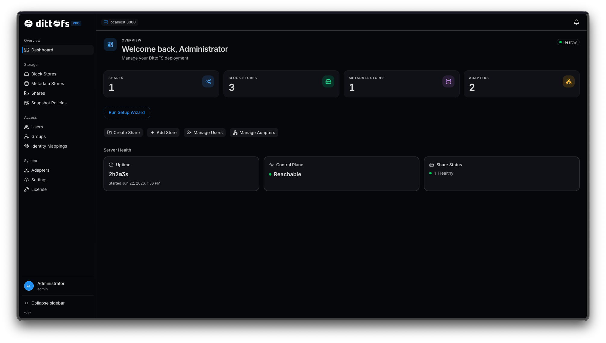
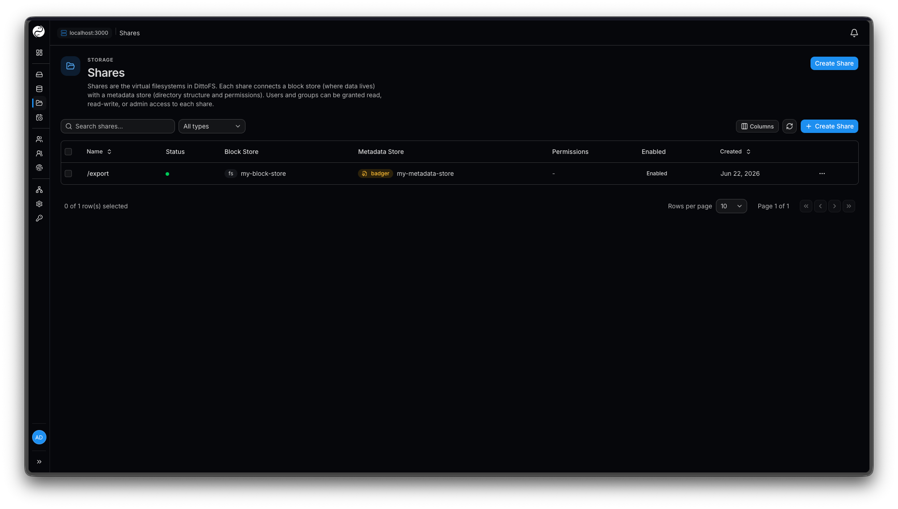
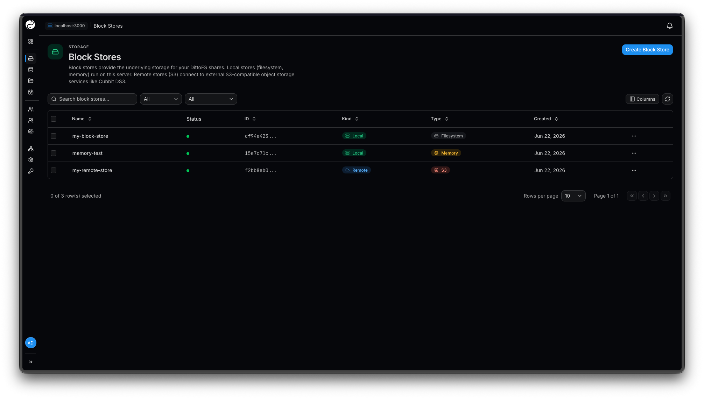
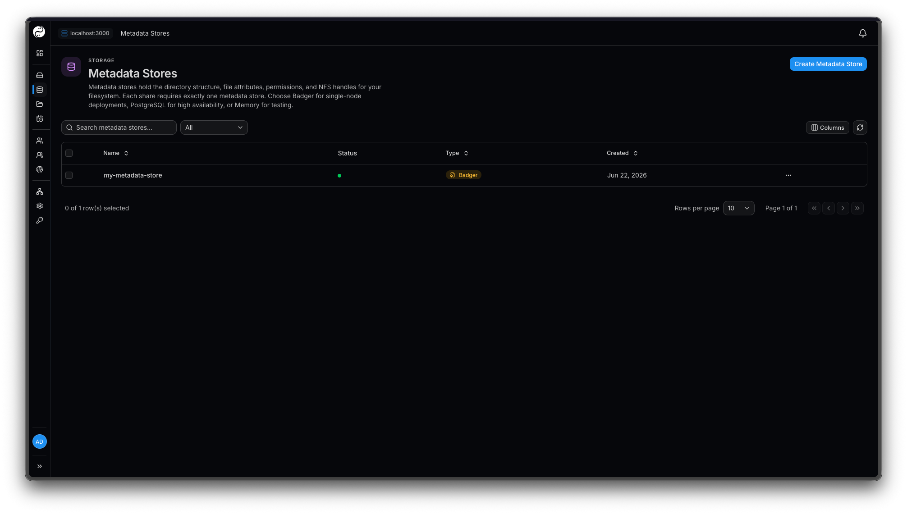
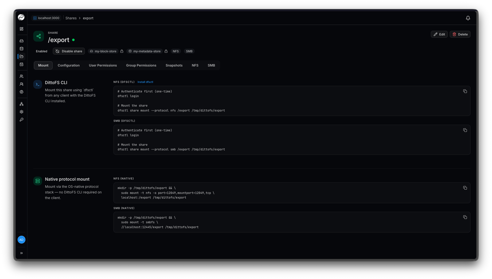
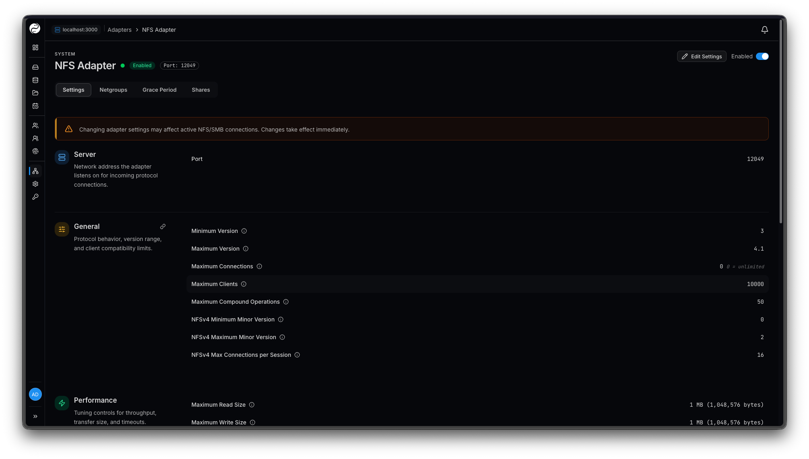
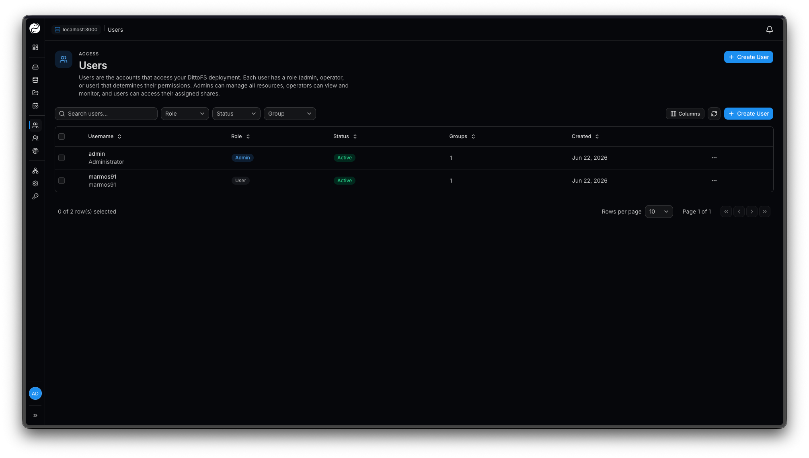

# DittoFS Pro

**DittoFS Pro** is the premium edition of DittoFS. It wraps the open-source
DittoFS server with a modern web dashboard, so administrators and users can
manage their entire deployment — stores, shares, adapters, users, and access
control — visually, without touching the CLI.

Everything `dfsctl` does today is available through the dashboard, plus
license management and white-label branding. It ships as a single Go binary
with the UI embedded, and as a Docker image, and works fully air-gapped with an
offline license.

Learn more at [dittofs.io](https://dittofs.io).

## Dashboard

Manage your entire DittoFS deployment from the browser.

<table>
  <tr>
    <td width="50%"> <b>Shares</b> — connect a block store and a metadata store into a virtual filesystem.</td>
    <td width="50%"> <b>Block stores</b> — local (filesystem/memory) and remote (S3) backends.</td>
  </tr>
  <tr>
    <td width="50%"> <b>Metadata stores</b> — Badger, PostgreSQL, or Memory.</td>
    <td width="50%"> <b>Mount instructions</b> — per-share CLI and native NFS/SMB commands.</td>
  </tr>
  <tr>
    <td width="50%"> <b>Adapters</b> — tune NFS/SMB protocol and performance knobs.</td>
    <td width="50%"> <b>Access control</b> — users, roles, and groups.</td>
  </tr>
</table>

## How it relates to open-source DittoFS

DittoFS Pro builds **on top of** this open-source server — it imports DittoFS as
a Go module and talks to the same control-plane and auth endpoints. The core
filesystem, protocols, stores, and adapters documented in this repository are
identical; Pro adds the dashboard, licensing, and branding layer around them.

New control-plane APIs introduced for Pro are additive and remain backward
compatible with existing DittoFS deployments.

## Roadmap

DittoFS Pro is actively expanding toward enterprise deployments. Planned
additions include:

- **Monitoring dashboard** — live metrics, throughput, and health across stores,
  shares, and adapters.
- **Enterprise-grade features** — capabilities aimed at large, multi-tenant, and
  regulated environments.
- **Enterprise support** — SLAs and direct support for production deployments.

See [dittofs.io](https://dittofs.io) for the latest.
