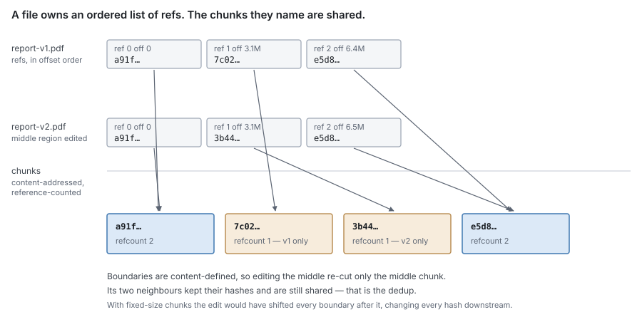
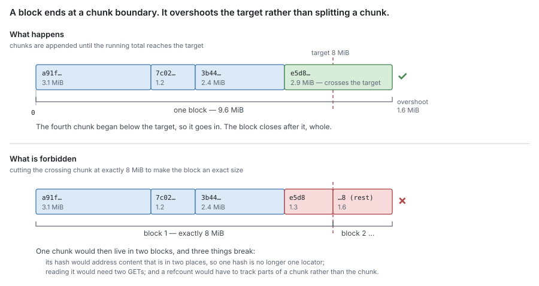
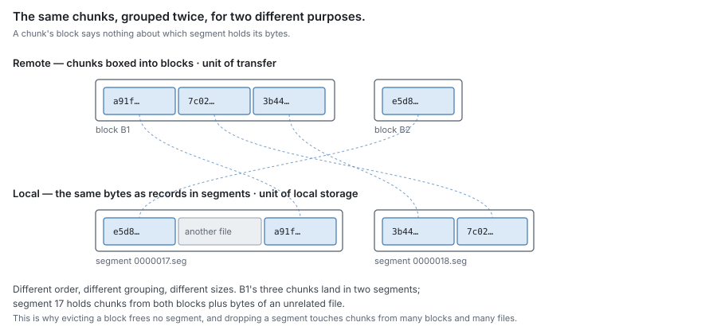
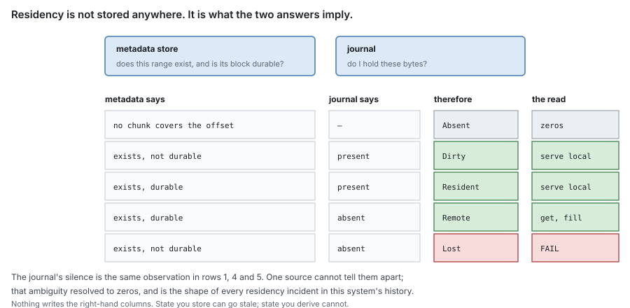
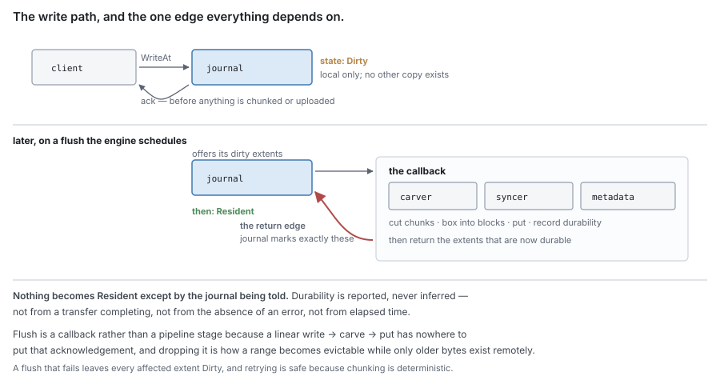
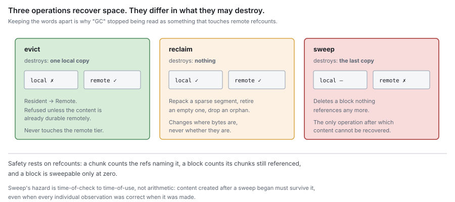

# RFC 0 — the data lifecycle

**Status:** draft.
**Audience:** anyone implementing or reviewing a component in `pkg/block/` or
`pkg/metadata/`.
**Rationale and history:** `.planning/2026-09-23-residency-decision-record.md`.
This document states what the system *is*; that one states why. Where a rule
here looks arbitrary, the reason is there.

This is the root of the RFC set. It defines the terms, the data model, the
residency function, the operations and the invariants that no single component
can enforce alone. Every other RFC in the set inherits these and does not
redefine them.

The key words **MUST**, **MUST NOT**, **SHOULD**, **SHOULD NOT** and **MAY** are
to be interpreted as in RFC 2119.

---

## 1. Scope

DittoFS stores file content in two tiers. The **journal** is the local tier: it
holds bytes on this machine. The **remote tier** holds them durably elsewhere.
"Journal" names the component throughout this set; where a sentence contrasts
the two sides, "remote tier" is its counterpart.

This document specifies how content moves between them, how its location is
known, and what must remain true throughout.

It does not specify wire protocols, authentication, or the filesystem namespace
beyond its relationship to content.

### 1.1 The component set

| RFC | Component | Owns | Does not own |
| --- | --- | --- | --- |
| **0** | — | terms, data model, residency, lifecycle, invariants, failure model | component internals |
| **1** | journal | local bytes: on-disk format, placement, crash safety, capacity | what data exists; remote durability |
| **2** | carver | bytes → chunks → blocks: boundaries, identity, packing | I/O, files, when to carve |
| **3** | syncer | transferring blocks to and from the remote tier | what to transfer, or why |
| **4** | block metadata | chunks, refs, blocks, refcounts, durability | byte placement, transport, namespace |
| **5** | namespace metadata | files, directories, handles, permissions, locks | content bytes |
| **6** | engine | composition, policy, the facade adapters call | every format and algorithm above |
| **7** | GC | mark/sweep and remote deletion | local space ([§8.1](#8.1%20Evict), [§8.2](#8.2%20Reclaim)) |

### 1.2 Component autonomy

A component **MUST NOT** import another component in this set.

Where a component requires a capability it does not own, it **MUST** declare an
interface for that capability in its own package, named for the need rather than
for the provider. The engine supplies an implementation at composition time.
Each component **MUST** build and pass its tests with every such interface
stubbed.

A capability **MUST NOT** be negotiated by type assertion on an interface the
provider does not declare it satisfies. A capability that is absent **MUST**
produce a build failure, not a silent fallback.

> [!note]
> The type-assertion prohibition is specific: an assertion that fails
> yields a working program with silently degraded behaviour — an unindexed
> lookup, a disabled guard — and no test observes it. A declared parameter
> cannot fail this way.

Conformance is checked by a per-component import-graph test.

## 2. Terminology

### 2.1 Entities

**File** — a namespace entry with an identity, attributes, and an ordered list
of chunk references.

**FileAttr** — a file's size, ownership, mode, timestamps and identifiers.

**Chunk** — a run of bytes identified by the BLAKE3-256 hash of its content.
Chunks are content-addressed, reference-counted, and shared: one chunk MAY be
referenced by many files. Boundaries are content-defined (FastCDC), so inserting
bytes early in a file re-cuts only the chunks around the insertion.

Chunk boundaries are sought within a configured size range. The range bounds
where a boundary may be *placed*; it does not bound chunk size absolutely. The
final chunk of a file is emitted whole at whatever size remains, so a file
smaller than the extent minimum is exactly one chunk. **Content MUST NOT be
padded to a chunk size.**

**ChunkRef** — one file's use of one chunk at one offset. A file's content is
fully described by its ordered list of chunk refs. Many refs MAY name one chunk.

**Block** — the unit of transfer to and from the remote tier: a whole number of
chunks addressed by one remote key. A block targets a configured size and MAY
exceed it by at most one chunk, because **a block boundary is always a chunk
boundary**. A chunk **MUST NOT** span two blocks ([§2.2](#2.2%20How%20a%20file%20relates%20to%20its%20chunks)).

**Segment** — a local append-only file of records, capped at a configured size,
sealed when full and immutable thereafter.

**Record** — one framed run of bytes within a segment, carrying a header with
its identity, length and checksum.

**Extent** — a contiguous `(offset, length)` region of one file's bytes. This is
the only term for that concept: "range", "region" and "span" are not separate
terms and **MUST NOT** be introduced as though they were. An extent is a value,
not a thing that is stored; where a component keeps state about one, it keeps it
*against* the extent.

A **block** and a **segment** are unrelated groupings. A block groups chunks for
remote transfer; a segment groups records for local storage. They are formed by
different processes, at different times, from different inputs. A chunk's block
says nothing about which segment holds its bytes, and a segment's contents say
nothing about any block.

### 2.2 How a file relates to its chunks

A file does not contain its content. It contains an ordered list of references to
chunks, and the chunks are shared.



The refs are ordered and belong to the file. The chunks are content-addressed and
belong to nobody: the same chunk is named by every ref whose content hashes to
it, and its refcount is how many refs those are. This is the whole of
deduplication — there is no copying step and no second representation, only a
second ref naming a chunk that already exists.

Because boundaries are content-defined, an edit disturbs only the chunks it
falls inside. Editing the middle of a file re-cuts the middle chunk; the chunks
either side keep their hashes and stay shared. Under fixed-size chunking the
edit would shift every boundary after it, so every subsequent chunk would hash
differently and nothing downstream of the edit would dedup.

#### A chunk is never split across blocks

Chunks are grouped into blocks for transfer. The grouping accumulates chunks
until the running total reaches the configured target, and then **ends at that
chunk's boundary** — so a block is usually a little larger than the target,
never a little different in composition.



Overshoot is the price of a rule that holds everywhere else. If a chunk could be
cut to make a block an exact size, then:

- its hash would name content living in two blocks, so **one hash would no
  longer be one locator** — and a chunk's hash being its address is what makes
  it findable, shareable and countable at all;
- reading that chunk would require two transfers, and reading it during a
  partial fetch would require knowing it was split;
- a refcount would have to describe parts of a chunk rather than a chunk, so
  "is this chunk still referenced" — the question sweep depends on ([§8.3](#8.3%20Sweep)) — would
  stop having a single answer.

The rule costs at most one chunk of overshoot per block. Breaking it costs the
identity property the entire content-addressed model rests on.

#### Blocks and segments group the same chunks differently

A block is a remote grouping of chunks. A segment is a local file of records.
They are built by different processes, at different times, from different
inputs, and neither can be derived from the other.



A chunk's block says nothing about which segment holds its bytes, and a
segment's contents say nothing about any block. This is why evicting a block
frees no segment, and why dropping a segment affects chunks belonging to many
blocks and many files.

### 2.3 Operations

| Term | Means |
| --- | --- |
| **write** | stage bytes in the journal and acknowledge the client |
| **sync** | make durable in the journal |
| **flush** | the journal's pass: offer dirty extents, accept durability reports |
| **chunk** | place one content-defined boundary |
| **box** | group chunks into one block |
| **put** / **get** | make durable in the remote tier / retrieve from it |
| **fill** | place retrieved remote bytes into the journal |
| **evict** | release local bytes that are durable remotely ([§8.1](#8.1%20Evict)) |
| **reclaim** | recover local space without losing content ([§8.2](#8.2%20Reclaim)) |
| **sweep** | delete a remote block that nothing references ([§8.3](#8.3%20Sweep)) |

These words are disjoint and **MUST NOT** be used interchangeably. In
particular, *evict*, *reclaim* and *sweep* differ in what they may destroy:
eviction destroys a local copy, reclamation destroys nothing, and sweep destroys
the last copy.

## 3. Identity

A file carries two identifiers.

| Identifier | Type | Lifetime | Purpose |
| --- | --- | --- | --- |
| `ID` | UUID | for the life of the file | identity. Survives rename, relink, and rewriting of content. The journal keys content by this value. |
| `ObjectID` | 32 bytes | changes with every content change | BLAKE3 Merkle root over the file's chunk hashes in offset order. Whole-file content identity. |

`ID` **MUST** be stable across every namespace operation. `ObjectID` **MUST**
change whenever the file's chunk list changes.

The journal's `FileID` **MUST** be a distinct type constructible only from a
file `ID`, so that a value of another kind cannot reach it by conversion.

`ObjectID` describes content that is complete and stable. It **MUST NOT** be
read as a residency or durability signal.

### 3.1 Deduplication

Two mechanisms operate, at different granularities and for different reasons.

**Chunk deduplication** is the mechanism that avoids storing or transferring
duplicate bytes. A chunk whose hash is already known is referenced rather than
stored again; its refcount increases. It catches partial overlap between files.

**Whole-file deduplication** is an optimisation over the same result. Given a
file's `ObjectID`, an implementation MAY determine that some existing file has
exactly the same chunks in the same order, and reference them without carving,
hashing or resolving chunks individually. Chunk deduplication reaches the same
stored state; whole-file deduplication reaches it with less work.

An implementation **MUST NOT** rely on whole-file deduplication for
correctness. It is an accelerator, and a system that skips it is correct and
slower.

## 4. Residency

### 4.1 The two oracles

Content location is described by two independent sources, each authoritative for
exactly one question.

> The **journal** answers: *do I hold these bytes on this disk, and at what
> offset?*
>
> The **metadata store** answers: *does this extent exist, which chunk covers it,
> which block holds it, and is that block durable remotely?*

The journal **MUST NOT** record whether content exists or whether it was ever
written, and **MUST NOT** be consulted about remote durability — it is not
authoritative for it. It **MAY** record that it has been *told* an extent is
durable, for the two internal purposes [RFC 1 §2](rfc-1-journal.md#2.%20The%20model%20it%20presents) permits: selecting flush
candidates, and refusing an unsafe release. That record is never an answer.

The metadata store **MUST NOT** record where bytes sit on local disk.

**Neither oracle consults the other.** The journal requires no interface from the
metadata store and **MUST NOT** acquire one. An extent it does not hold is reported
as absent, with no judgement about why; resolving that absence is the engine's,
in [§6.1](#6.1%20Resolution). A design in which the journal asks what exists reintroduces the single
oracle this section exists to remove.

### 4.2 The residency function

An extent's residency is not stored. It is computed from the two answers:

| metadata | journal | residency | read behaviour |
| --- | --- | --- | --- |
| no chunk covers the offset | — | **Absent** | zeros |
| chunk exists, block not durable | present | **Dirty** | serve locally |
| chunk exists, block durable | present | **Resident** | serve locally |
| chunk exists, block durable | absent | **Remote** | get, fill, serve |
| chunk exists, block not durable | absent | **Lost** | fail |



An implementation **MUST NOT** persist the resolved residency of an extent, and
**MUST NOT** maintain a cache of it that can outlive either input.

The function is total: every combination of the two answers yields exactly one
residency. **Absent** and **Lost** are distinct, and an implementation **MUST**
distinguish them — returning zeros for **Lost** is data loss reported as data.

> [!note]
> The distinction is the reason for the split. A single source cannot
> tell "never written" from "no longer held", because both are the absence of a
> local record. Two sources can, because only one of them is responsible for
> knowing what exists.

### 4.3 Reporting

An extent becomes **Resident** only when the journal is told that the
corresponding block is durable remotely. An implementation **MUST NOT** infer
remote durability from the completion of a transfer, the absence of an error, or
elapsed time. Durability is reported by the component that observed it, to the
component that records it.

## 5. The write path

### 5.1 Write

1. The namespace layer authorises the write and updates size and mtime.
2. The journal stages the bytes and appends a record.
3. The client is acknowledged.

The client **MUST NOT** be acknowledged before the bytes are recoverable from
the journal under the configured durability policy. Content **MUST NOT** be
chunked, hashed or transferred on this path.

The resulting extent is **Dirty**.

### 5.2 Flush

Flush is initiated by policy and driven by the journal, which offers its dirty
extents and accepts a report of what became durable:

```
journal.Flush(id, fn)
    │  offers dirty extents
    └──► fn:  carver  — cut chunks, group into blocks
              syncer  — put blocks
              metadata — record chunks, refs, blocks, durability
    ◄──── returns the extents now durable remotely
journal marks exactly those extents
```



The callback returns the extents that became durable. The journal **MUST** mark
exactly those, and **MUST NOT** mark an extent for which no report was received.

> [!note]
> The callback shape exists because the acknowledgement has nowhere to
> live in a linear `write → carve → put` pipeline. The return edge is the only
> path by which an extent becomes **Resident**.

A flush that fails leaves every affected extent **Dirty**. Failure **MUST** be
retryable without duplicating stored content: re-offering the same extent and
re-deriving the same chunks **MUST** converge on the same chunk identities,
which follows from chunking being deterministic ([RFC 2](rfc-2-carver.md)).

## 6. The read path

### 6.1 Resolution

1. The journal is asked for the extent. It returns the bytes it holds, and the
   extents it does not.
2. For each extent it does not hold, metadata is consulted for the covering
   chunk and its block.
3. The residency function ([§4.2](#4.2%20The%20residency%20function)) determines the outcome:
   - **Absent** — the extent is a hole. Return zeros.
   - **Remote** — get the block, fill ([§6.2](#6.2%20Fill)), serve.
   - **Lost** — fail. An implementation **MUST NOT** return zeros.

### 6.2 Fill

Fill is the only operation that makes an extent locally present without a client
write. It transitions **Remote → Resident**.

Fill **MUST NOT** overwrite an extent that the journal holds. Retrieved content
reflects a past state, and a concurrent write to the same extent is newer by
definition; the write wins.

Filling is discretionary. An implementation **MAY** decline to fill a retrieved
extent, serving it without retaining it. Declining is appropriate when retaining
would displace content more likely to be read again, including under local
capacity pressure and during large sequential reads.

Whether to fill is policy and belongs to the engine ([RFC 6](rfc-6-engine.md)). The mechanism and
its concurrency safety belong to the journal ([RFC 1](rfc-1-journal.md)).

## 7. Mutation and removal

**Overwrite.** New bytes are staged at the same offsets and become new chunks at
the next flush. Superseded chunk refs are dropped from the file's list. The
chunks themselves persist until their refcounts reach zero.

**Truncate.** Chunk refs beyond the new size are dropped; a ref straddling the
boundary is narrowed. A narrowed ref **MUST NOT** continue to describe content
past the new size.

**Delete.** The namespace entry and all the file's chunk refs are removed, and
each named chunk's refcount is decremented. Deletion **MUST NOT** remove content
from the remote tier; that is sweep ([§8.3](#8.3%20Sweep)), and it is asynchronous.

## 8. Reclamation

Three operations recover space. They differ in what they may destroy, and
**MUST** be kept distinct in both code and discussion.



### 8.1 Evict

Evict releases local bytes whose content is durable in the remote tier,
transitioning **Resident → Remote**.

Evicting an extent that is not durable remotely produces **Lost** and is data
loss. An implementation **MUST NOT** evict a **Dirty** extent. This is the
definition of the operation, not a check applied to it.

Eviction **MUST NOT** modify the remote tier.

The order is: record that the content is no longer local, then release the
bytes. A crash between the two leaves content that metadata believes is remote
and the journal still holds, which is **Resident** — correct, if wasteful. The
reverse order leaves content believed local that is gone, which is **Lost**
misreported as **Resident**, and reads it as zeros.

### 8.2 Reclaim

Reclaim recovers local space without changing what content exists. A reclaim pass
**MUST** be content-preserving — it changes where bytes are, never whether they
are.

Reclaim is the umbrella; the mechanisms under it are **repack** (relocating live
records out of a sparse segment and unlinking it), retiring a segment that holds
nothing, and removing an unattachable file. [RFC 1 §8.2](rfc-1-journal.md#8.2%20Repack) specifies them.

**"Compaction" is deliberately not used for any of these.** In an LSM that word
names an operation that merges runs and *drops* superseded entries; in a
log-structured queue it names one that keeps only the latest value per key. Both
discard content. Reclaim never does.

### 8.3 Sweep

Sweep deletes blocks from the remote tier. It is the only operation in this
system that deletes content anywhere, and the only one after which content
cannot be recovered.

Safety rests on reference counting, specified in [RFC 4](rfc-4-block-metadata.md):

- a chunk carries the number of chunk refs naming it
- a block carries the number of its chunks whose refcount is nonzero
- a block is sweepable only when that number is zero

A block **MUST NOT** be deleted while any chunk it contains is referenced.

Reference counts are read at different instants from the state they describe. An
implementation **MUST** ensure that content created or referenced after a sweep
began cannot be deleted by that sweep, even when every individual observation
was correct when made. [RFC 7](rfc-7-gc.md) specifies the protocol.

## 9. Invariants

These hold across components. No component can enforce any of them alone.

| # | Invariant |
| --- | --- |
| **I1** | An extent that exists is never read as zeros. Zeros are returned only for **Absent**. |
| **I2** | A **Dirty** extent is never evicted. |
| **I3** | A remote block is never deleted while any chunk it contains is referenced. |
| **I4** | Fill never overwrites content the journal holds. |
| **I5** | Remote durability is reported, never inferred. |
| **I6** | No component imports another component in this set. |
| **I7** | Every stored record has a named reclamation path, and that path holds at the record's maximum size. |
| **I8** | A serialization conflict is retried, never surfaced to the caller as an I/O error. The retry is bounded by the caller's deadline, and the backoff between attempts is randomised. |

An implementation is conformant when all eight hold under concurrent operation,
across crash and restart, and in every condition in [§10](#10.%20Failure%20model).

Each invariant **MUST** be tested at the component that consumes the data, not
the one that produces it. A test placed beside a producer can pass while the
value is discarded downstream.

### 9.1 Records and their reclamation

I7 constrains the records themselves rather than the content they describe, and
it binds every component that persists anything. It is an invariant and not a
cost because components sharing a storage engine share its thresholds and its
triggers: one component's unbounded record fills the store another component's
records live in.

**An implementation MUST be able to name what reclaims a stored record's
superseded copies, and that answer MUST hold at the record's maximum size rather
than its typical one.** A record that grows with use therefore **MUST** either be
bounded, or carry a statement of what produces the trigger that reclaims it. An
implementation that can state neither has an unbounded store and no way to see
it.

Where an engine relocates values past a threshold into a store reclaimed by a
different trigger, a record that can cross that threshold **MUST** be bounded
below it — by segmenting it, by spilling it into sibling records, or by not
letting it grow. Relying on the relocated store's own reclamation pass is
conformant only where the workload that writes the record is shown to produce
that pass's trigger.

**A bound MUST be computed from the record's worst-case encoding**, not from a
fixture's. A sample whose values encode shorter than the worst case reports a
margin the implementation does not have.

> [!note]
> This failure is invisible rather than merely expensive. Where the
> relocated store's reclamation is driven by pressure on the store the record
> left, each commit leaves a whole superseded copy behind while adding almost
> nothing to the pressure that would reclaim it. Growth is unbounded and no
> counter reports it, because by the engine's own accounting nothing is wrong.

Conformance is checked per record type, at the record's maximum size: assert no
single stored value reaches the engine's relocation threshold, then rewrite the
record repeatedly and assert the relocated store does not grow. A correctness
assertion **MUST NOT** stand in — an implementation that is leaking returns
exactly the right data.

[RFC 1 §5.2](rfc-1-journal.md#5.2%20The%20index%20is%20bounded%20by%20extent%20count%2C%20not%20by%20bytes) bounds the placement index by the same reasoning and requires its
pressure be observable, but it is not an instance of I7: that index is held in
memory and never stored, so nothing reclaims it and the failure is exhaustion
rather than invisible growth.

### 9.2 Conflicts and their retries

I8 constrains what a caller is allowed to observe when two operations serialize
against each other. It binds every component whose store detects write-write
conflicts optimistically, which is every backend in this set: a conflict is how
such a store reports that it did its job, not that it failed.

**A serialization conflict MUST be retried, and MUST NOT reach the caller as an
I/O error.** The conflict itself is expected and correct — the store observed two
writers touching one key and aborted the loser so the winner's commit stays
serializable. Turning that into a protocol-layer error tells a client its write
failed when nothing is wrong with its write, with the store, or with the data.

**The retry MUST be bounded by the caller's deadline rather than by a fixed
attempt count.** A fixed budget encodes a guess about how much contention is
possible, and a key hot enough to exceed it exists in every deployment large
enough to matter. When the budget is the bound, the error a client sees is a
statement about the constant, not about the system.

**Backoff between attempts MUST be randomised.** Backoff computed as a function
of the attempt number alone is not backoff: every loser of the same conflict
waits the same interval and collides again on the next attempt, so a budget is
consumed by a herd that re-forms each round rather than by genuine contention.
An implementation whose "jitter" term is derived from the attempt counter has
this defect regardless of how generous the budget is.

> [!note]
> A retried closure re-runs against state that has changed since it was
> first called. Whether it may close over values read before the transaction
> opened, or must re-read the rows it modifies, is **not settled here** — an
> implementation that closes over pre-read state can re-propose a decision the
> conflict was raised to prevent, which delays a lost update rather than
> preventing it. Recorded so the question is inherited rather than rediscovered.

Conformance is checked by driving concurrent writers at one deliberately shared
key and asserting two things together: that conflicts **occur**, and that
**none** reaches the caller. Asserting that no conflicts occur tests the wrong
property — a workload that never conflicts exercises nothing, and a store that
reports none is more likely miscounting than serializing. A correctness
assertion **MUST NOT** stand in: every surviving writer's data is intact in the
run that surfaces the error, because the error is raised instead of a write, not
alongside a wrong one.

## 10. Failure model

Every condition below has exactly one specified behaviour.

| Condition | Behaviour |
| --- | --- |
| **Remote tier unavailable** | Writes continue into the journal while capacity allows. No extent becomes **Resident**, so no extent becomes evictable. Reads of **Remote** extents fail; they **MUST NOT** return zeros. |
| **Journal at capacity, remote available** | Evict ([§8.1](#8.1%20Evict)); if nothing is evictable, reclaim ([§8.2](#8.2%20Reclaim)); then accept the write. |
| **Journal at capacity, remote unavailable** | Refuse the write. Every local extent is **Dirty**, and I2 forbids evicting it, so refusal is the only behaviour that does not lose data. |
| **Metadata unwritable** | Flush fails; extents stay **Dirty**; [§10.1](#10.1%20Capacity%20is%20a%20bound%2C%20not%20a%20target) applies. |
| **Crash** | On restart the journal rebuilds its placement index from its segments; a torn tail is truncated to the last record that verifies. Metadata recovers by its backend's own durability. The two recover independently and **MAY** disagree; [§10.2](#10.2%20No%20state%20requires%20intervention%20to%20leave) applies. |
| **Local content corrupt** | A record failing verification quarantines its segment: excluded from reclaim and eviction, its extents resolve as **Lost**. |

### 10.1 Capacity is a bound, not a target

The journal's capacity limit **MUST** be enforced by reservation taken before
a write is accepted. An implementation that tests a counter without reserving
against it permits any number of concurrent writers to pass a single test, and
the limit bounds nothing.

Refusal at the limit is a specified outcome, not a failure of the design. The
alternative — accepting content that cannot be made durable and cannot be
released — has no exit.

### 10.2 No state requires intervention to leave

Every condition in this section **MUST** resolve on its own once the underlying
cause is removed. An implementation **MUST NOT** have a state reachable by
normal operation from which it cannot return without operator action.

In particular: sustained inability to flush **MUST** be reported as a health
condition of the share, and **MUST NOT** be represented only as log output.

Recovery after a crash is required to be *truthful*, not to make the two oracles
agree. A chunk that metadata knows about and whose bytes did not survive is
**Lost**, and reads of it fail. Reconciling the two by assuming agreement
reintroduces the failure this model exists to prevent.

## 11. Open questions

1. **Whole-file deduplication's cost** ([§3.1](#3.1%20Deduplication)) — it requires an index and a
   Merkle computation per file to save work that chunk deduplication performs
   anyway. Whether it earns that on real workloads is unmeasured.
2. **Fill policy** ([§6.2](#6.2%20Fill)) — this document specifies that filling is
   discretionary and names the conditions under which declining is appropriate.
   It does not specify a policy. [RFC 6](rfc-6-engine.md) must, and the right one is unmeasured.
3. **Eviction granularity** ([§8.1](#8.1%20Evict)) — this document constrains eviction by
   durability, not by unit; the unit is [RFC 1](rfc-1-journal.md)'s to choose. The trade-off this
   question originally named — eviction precision against the number of open
   segments — is not a trade-off: [RFC 1 §8.4](rfc-1-journal.md#8.4%20Open%20descriptors) bounds open descriptors
   independently of segment count, so segment size expresses reclamation
   granularity alone. What remains unmeasured is the right default for it, and
   whether per-extent hole punching degrades at scale ([RFC 1 §12](rfc-1-journal.md#12.%20Open%20questions)).
