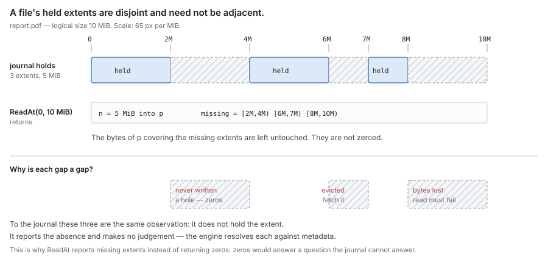
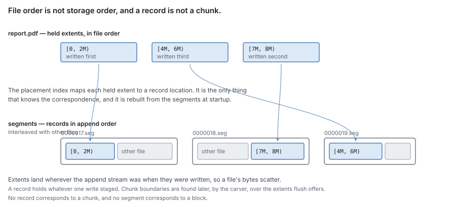
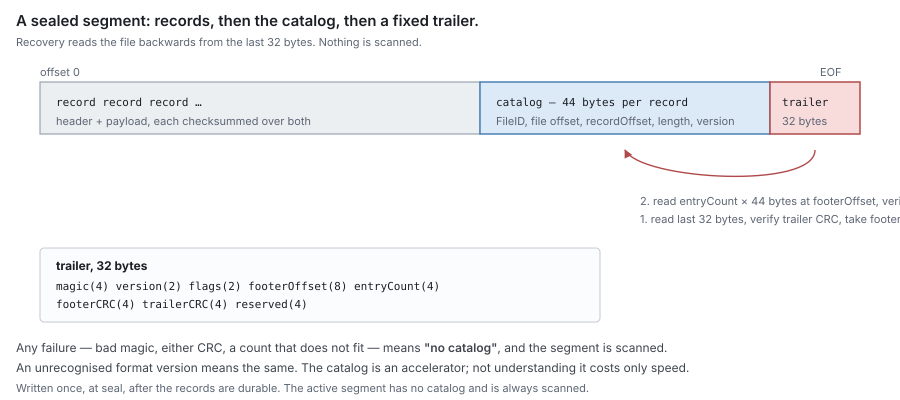
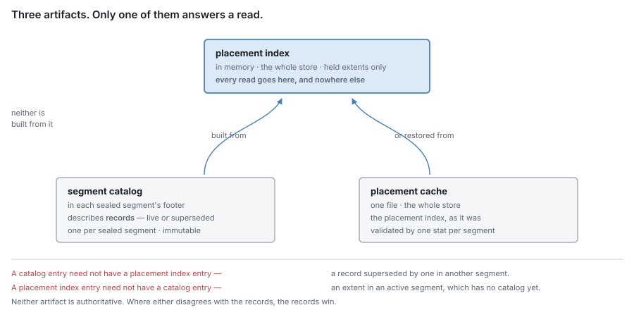
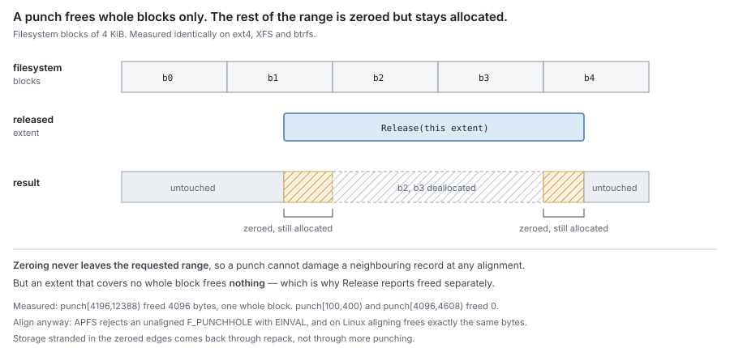
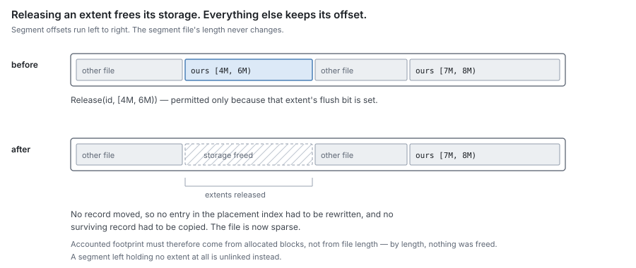
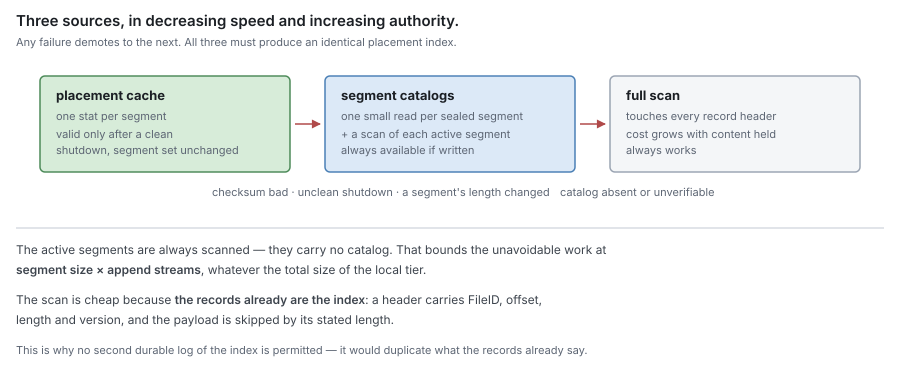
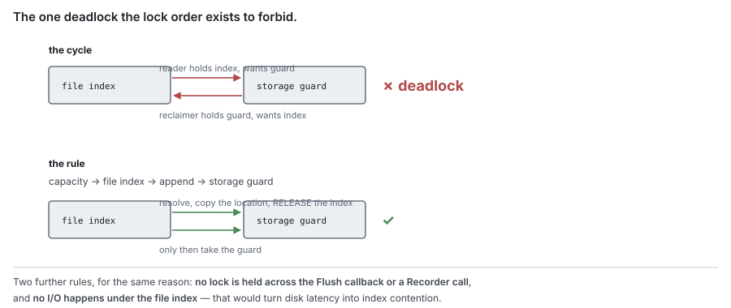

# RFC 1 — the journal

**Status:** draft.
**Depends on:** [RFC 0](rfc-0-data-lifecycle.md), for the terms, the residency function and the invariants.
Nothing here redefines them.
**Audience:** anyone changing `pkg/block/journal`.

The key words **MUST**, **MUST NOT**, **SHOULD**, **SHOULD NOT** and **MAY** are
to be interpreted as in RFC 2119.

---

## 1. Purpose

The journal holds bytes on this machine, durably against
process and machine failure, and it answers exactly one question about them:

> **Do I hold these bytes, and at what offset?**

It is the component the client's write is acknowledged against, and the component
a read is served from when the bytes are here.

### 1.1 Non-goals

The journal **MUST NOT**:

- decide whether an extent that it does not hold is a hole, evicted, or lost — it
  reports only that it does not hold it ([§3.2](#3.2%20Read));
- return zero bytes for an extent it does not hold;
- know what a chunk or a block is;
- know which remote tier exists, or speak to one;
- import another component in this set ([RFC 0 §1.2](rfc-0-data-lifecycle.md#1.2%20Component%20autonomy)).

The journal has no dependency on the metadata store, the syncer or the carver,
and requires no interface from any of them. Its dependency set is the standard
library and `golang.org/x/sys`, and an import test **MUST** enforce that.

### 1.2 What it knows about content

The journal's unit is a **extent of one file's bytes**, named by a `FileID` and a
byte offset. It knows nothing about the structure of that content.

In particular, a **record is not a chunk**. A record is whatever one write
staged, possibly coalesced with adjacent writes. Chunk boundaries are
content-defined and are found later, by the carver, over the extents the journal
offers at flush. The journal **MUST NOT** assume any relationship between its
records and any chunk, block or remote object.

### 1.3 It is testable on its own

The journal's dependencies are the ones [§1.1](#1.1%20Non-goals) allows, and each is supplied:

| Dependency | In production | In a test |
| --- | --- | --- |
| a directory on a filesystem | the configured journal path | `t.TempDir()` on a real filesystem |
| time | the Go runtime clock | `testing/synctest`, for the sync timer and every wait |
| an event recorder | the engine's metrics | none, or one that records calls ([§3.8](#3.8%20Event%20reporting)) |

No metadata store, no carver, no syncer, no block store. A check **MUST** be
writable as: open a journal on a temporary directory, drive the interface of
[§3](#3.%20Interface), assert on what comes back and what is on disk.

**The filesystem is real, never faked, for correctness.** Hole-punch alignment,
torn tails, and whether a write survived are properties of real storage
([§11.5](#11.5%20What%20must%20not%20stand%20in%20for%20the%20real%20thing)); a fake filesystem answers them however it was written to.

**Storage loss is simulated beneath the journal, not by killing it.** The
journal reaches its segment files through a narrow, package-internal seam — open,
write at an offset, sync, punch, close — that production satisfies with the
operating system's file. A test wraps the real file and remembers every write
since the last sync; a simulated crash discards exactly those and reopens the
journal on the same directory. This is the loss [§6](#6.%20Durability%20and%20ordering) is written against: a
killed process leaves its unsynced writes in the page cache, so killing it proves
a durability the journal does not have ([§11.3](#11.3%20Environments%20a%20check%20set%20must%20cover)). The seam is not an interface
the journal exposes, and nothing outside its package supplies one.

**Time is virtual.** The sync timer ([§6.2](#6.2%20Sync%20policy)), write stalls and every bounded wait
run inside a `synctest` bubble, so a check of a 30-second expiry takes
microseconds and gives the same answer every run. The journal therefore **MUST
NOT** read time from anywhere a bubble cannot fake.

**Concurrency checks run under the race detector,** with at least two files on
at least two append streams ([§11.3](#11.3%20Environments%20a%20check%20set%20must%20cover)).

## 2. The model it presents

For each `FileID`, the journal maintains a set of **held extents**: disjoint
`(fileOffset, length)` extents whose bytes it can produce, each mapped to a
location in local storage.

For each held extent it also records one bit of **flush state**: whether the
extent has been reported durable elsewhere ([§4.2](#4.2%20Segments)). This bit exists for two
purposes and no others — selecting what to offer at flush, and refusing an
unsafe release ([§6.1](#6.1%20Ordering%20rules)). It **MUST NOT** be consulted to answer a read, and the
journal **MUST NOT** expose it as an answer about remote durability; the journal
is not authoritative for that ([RFC 0 §4.1](rfc-0-data-lifecycle.md#4.1%20The%20two%20oracles)).

> [!note]
> The bit can only be wrong in the safe direction. It is set solely by
> being told, so the journal can believe a durable extent is still dirty — which
> costs a redundant flush and a refused eviction — but can never believe a dirty
> extent is durable, which would lose data. That holds only because every report
> is about a version: an extent is marked only where no held record in it is
> newer than the content reported durable ([§3.3](#3.3%20Flush), [§9.2](#9.2%20Flush%20state%20after%20recovery)). A report applied by
> position alone can mark a newer write durable.

Held extents are **disjoint and need not be adjacent**. A file is routinely
described by several extents with unheld gaps between them, and
an implementation **MUST NOT** assume a file's held content is contiguous, nor
that it begins at offset zero.



The gaps carry no explanation. An extent never written, an extent released by
eviction, and an extent whose bytes were lost are the same observation to the
journal — it does not hold them — and it **MUST** report all three identically.
Resolving which is which is [RFC 0 §6.1](rfc-0-data-lifecycle.md#6.1%20Resolution), and it belongs to the engine.



Nothing relates an extent's position in the file to its position in storage.
Extents land wherever the append stream stood when they were written, so a
sequential file is stored out of order, interleaved with other files.

`FileID` **MUST** be a distinct type constructible only from a file `ID`
([RFC 0 §3](rfc-0-data-lifecycle.md#3.%20Identity)). A journal instance serves exactly one share, so a `FileID` never
has to distinguish two shares and **MUST NOT** encode a share.

## 3. Interface

Signatures are indicative; the obligations are normative.

### 3.1 Write

```go
WriteAt(id FileID, off int64, p []byte) (n int, err error)
```

Stages `p` at `off` and makes it durable according to the configured policy
([§6.2](#6.2%20Sync%20policy)). On return with `err == nil`, the extent `(off, len(p))` is held, is
**Dirty**, and **MUST** survive process death.

`WriteAt` **MUST** reserve capacity before accepting bytes ([§7](#7.%20Capacity)) and **MUST**
fail rather than exceed the configured limit.

A write overlapping a held extent supersedes it. The journal **MUST** serve the
newer bytes thereafter, and **MUST NOT** require the caller to invalidate first.

### 3.2 Read

```go
ReadAt(id FileID, off int64, p []byte) (n int, missing []Extent, asOf Seq, err error)
```

Fills `p` from held extents. Every sub-extent of `(off, len(p))` that the journal
does not hold **MUST** be reported in `missing`, and the corresponding bytes of
`p` **MUST** be left untouched.

`ReadAt` **MUST NOT** zero-fill an extent it does not hold, and **MUST NOT**
return a short read in place of a `missing` entry. The caller distinguishes
hole from eviction from loss ([RFC 0 §6.1](rfc-0-data-lifecycle.md#6.1%20Resolution)); the journal supplies only the
absence.

`missing` **MUST** be exact: an implementation **MUST NOT** widen it to a whole
segment, record or block for convenience, because the caller pays a remote
transfer per entry.

`asOf` is the file's change sequence at the moment of the read: the highest
sequence number of any operation that has changed the file's extents ([§3.4](#3.4%20Fill), [§5.3](#5.3%20Versions)). A caller that fetches
a `missing` extent passes it back to `Fill`.

### 3.3 Flush

```go
Flush(id FileID, limit int64, fn func(o Offer, report func(durable []Extent)) error) error

FlushMany(ids []FileID, limit int64, fn func(offers []Offer, report func(id FileID, durable []Extent)) error) error

type Offer struct {
    ID      FileID
    Dirty   []Extent
        Oldest  Version     // the oldest content version among the offered records
    Newest  Version     // the newest
    Offered io.ReaderAt // the bytes as offered; see below
}
```

Offers held extents of `id` whose flush bit is unset, and marks exactly the
extents reported durable through `report`.

**`report` may be called any number of times while `fn` runs**, and each call marks
its extents at once, under every rule below. It is how a pass makes extents
evictable block by block, as each block's commit lands, rather than all at its
end. Once `fn` returns, `report` **MUST** fail. The error `fn` returns reports that
the rest of the offer failed; it takes back nothing already reported.

**`limit` bounds the dirty bytes one call offers.** The journal offers extents in
offset order until the next would pass the limit, and offers an extent larger than
what remains as a prefix ending at the limit; the rest is offered by a later call.
Without a bound, one pass over a 100 GiB dirty file keeps all of it offered, its
superseded records pinned for `offered`, and none of it evictable until the last
block uploads. The engine chooses the limit ([RFC 6 §4.2](rfc-6-engine.md#4.2%20Flush%20is%20scheduled%20here)). A prefix ends where no content
chose, so it costs one chunk boundary per pass that the chunker did not pick
([RFC 2 §2.1](rfc-2-carver.md#2.1%20One%20unbroken%20stretch%20per%20call)).

**`Oldest` and `Newest`** bound the content versions of the records in the offer
([§5.3](#5.3%20Versions)). The engine records both on the refs the pass commits ([RFC 4 §4.4](rfc-4-block-metadata.md#4.4%20Commits%20for%20one%20file%20apply%20in%20order)) and
names them again when it reseeds after a crash ([§9.2](#9.2%20Flush%20state%20after%20recovery)). A range is enough: every
extent in the pass lies inside it, which is all reseed and the stale rule need,
and the engine does not have to track versions per extent.

`FlushMany` is the same offer over several files in one callback, so the engine
can pack chunks of several files into one block ([RFC 6 §5.7](rfc-6-engine.md#5.7%20A%20block%20packs%20chunks%2C%20whichever%20files%20they%20came%20from)). Every rule of this section
holds per file within it: each file's extents are marked exactly as the reports
naming it say, a file never named has nothing marked, each `Offered` reader stays
valid until `fn` returns, and `limit` bounds the total across the files. `Flush(id, …)` is `FlushMany`
with one file, and an implementation **SHOULD** build it that way rather than
keep two paths.

The journal **MUST** mark exactly the reported extents and **MUST NOT** mark an
extent for which no report was received, including when `fn` returns an error
after some reports — a partial success **MUST** be honoured.

The journal **MUST NOT** interpret, reorder or subdivide a report except to
intersect it with what it offered. A reported extent that was not offered **MUST**
be rejected as an error, not silently accepted.

Offered extents **MUST** remain readable and **MUST NOT** be relocated for the
duration of the call.

`offered` reads the bytes **as offered**, at file offsets, for the duration of
`fn`. A write that supersedes an offered extent while `fn` runs changes what
`ReadAt` on the journal returns, and **MUST NOT** change what `offered` returns:
the superseded record stays in its segment until `fn` returns, and `offered`
reads it there. Reading `offered` outside an offered extent, or after `fn`
returns, **MUST** fail rather than return other bytes. This is what lets the
uploader read a block's bytes at transfer time instead of copying them at carve
time ([RFC 3 §3.2](rfc-3-syncer.md#3.2%20It%20holds%20a%20reference%2C%20not%20a%20copy)): the carver and the uploader read the same version, whatever
a client writes meanwhile. A concurrent write to an offered extent is permitted; the
newer bytes supersede, and the extent's flush bit **MUST** remain unset for the
superseding write even if `fn` reports the offset durable.

> [!note]
> That last rule is the one a naive implementation gets wrong. `fn`
> reports durability of the bytes it was given. If the extent changed underneath,
> the report is about bytes that are no longer there, and marking it durable
> makes the *new* bytes evictable while only the *old* ones exist remotely.

### 3.4 Fill

```go
Fill(id FileID, off int64, p []byte, asOf Seq, v Version) error
```

Places retrieved remote bytes into local storage. This is the only path by which
an extent becomes held without a client write.

`Fill` **MUST NOT** overwrite any part of an extent the journal already holds; it
**MUST** write only the sub-extents that are currently absent, and it **MUST**
make that determination and the write atomic with respect to concurrent
`WriteAt` on the same file.

**A Fill older than the file is refused.** `asOf` is the sequence `ReadAt` returned
when the caller found the extent missing ([RFC 6 §6.2](rfc-6-engine.md#6.2%20The%20reply%20is%20served%20from%20the%20fetched%20bytes)). The journal keeps, per file, the
highest sequence number of any operation that changed its extents — `WriteAt`, `Release`,
`Truncate`, `Delete` — and keeps it through all of them, deletion included. If it
is newer than `asOf`, `Fill` **MUST** write nothing and return a distinct error.
Without this, a fetch that began before a write can land after that write was
flushed and evicted, find the extent absent, and fill the old bytes with the flush
bit set; or land after a truncate down and up, and put old bytes back where the
file now has a hole. Either way the journal then serves stale content and
believes it durable. The check is per file, not per extent, and deliberately
coarse: a Fill refused because another part of the file changed costs only a
cache miss.

A filled extent's flush bit **MUST** be set, because the content came from the
remote tier and is by construction durable there. **This makes `Fill` as
safety-critical as `Release`.** The caller **MUST** pass only bytes it retrieved
from the remote tier for that exact extent of that exact file. Bytes that were
not retrieved from the remote tier, filled at an extent they do not belong to, or
filled after the content they came from was superseded, produce an extent the
journal believes is durable elsewhere and will therefore allow to be released —
leaving content that exists nowhere.

`v` is the content version of the ref the bytes were fetched from: its `newest`
([RFC 4 §2.1](rfc-4-block-metadata.md#2.1%20Ref)). The filled record carries it, so reseed and the stale rule treat
filled content like any other ([§9.2](#9.2%20Flush%20state%20after%20recovery)). Its sequence number is new, like every
append's, so an older superseded write still on disk cannot win over it at
recovery.

#### Fill is not a write

`Fill` and `WriteAt` take nearly the same arguments and are otherwise opposites:

|                          | `WriteAt`                 | `Fill`                                                           |
| ------------------------ | ------------------------- | ---------------------------------------------------------------- |
| content comes from       | the client                | the remote tier                                                  |
| the content is           | new                       | already existing, retrieved                                      |
| relative to held content | **newer** — supersedes it | **older** — must not touch it                                    |
| on conflict              | the written bytes win     | the held bytes win                                               |
| content version          | a new one, its own sequence number | the fetched ref's; never supersedes held content      |
| flush bit afterwards     | unset — owes a flush      | set — already durable                                            |
| residency transition     | `*` → `Dirty`             | `Remote` → `Resident`                                            |
| caller obligation        | none beyond capacity      | the bytes **MUST** be what the remote tier holds for this extent |

An implementation **MAY** share the append machinery between them, and
**SHOULD**. It **MUST NOT** expose them as one entry point selected by a
parameter. Such a parameter would select between *supersede* and *must not
overwrite*, and between *owes a flush* and *evictable* — so a caller passing the
wrong value would either discard a client's write or mark undurable content
evictable, and in neither case would anything fail at the time.

### 3.5 Release

```go
Release(id FileID, extents []Extent) (freed int64, err error)
```

Stops holding `extents` and frees the underlying local storage. This is the
mechanism of eviction; the policy is the engine's ([RFC 0 §8.1](rfc-0-data-lifecycle.md#8.1%20Evict)).

`Release` **MUST** refuse an extent whose flush bit is unset, and **MUST** make
no partial progress on a refused call. The refusal is the journal's enforcement
of [RFC 0](rfc-0-data-lifecycle.md)'s invariant I2; the caller is also obliged not to ask, and both
**MUST** hold.

The caller **MUST** have durably recorded that the content is no longer local
before calling `Release`. The journal cannot verify this and does not try; the
ordering rule is [RFC 0 §8.1](rfc-0-data-lifecycle.md#8.1%20Evict) and the consequence of inverting it is reads
resolving to zeros.

`freed` is the local storage actually released, which **MAY** be less than the
extent length ([§8.3](#8.3%20Accounting)).

**A release is recorded.** `Release` appends a **release record** naming the
file and extents, with a new sequence number ([§5.3](#5.3%20Versions)). Recovery applies it like
any record: extents it covers are not held, whatever older record on disk still
covers them. Without it, a superseded write whose successor was released and
punched would be held again after a restart, and served.

`Release` does not sync for it. The release record **MUST** be durable before
any storage it frees is punched or its segment unlinked ([§6.1](#6.1%20Ordering%20rules)). If a crash
loses the record, it loses the punch too, and the released record is still whole
on disk: held again after recovery, current, and evictable once reseeded.

### 3.6 Truncate and delete

```go
Truncate(id FileID, size int64) error
Delete(id FileID) error
```

`Truncate` stops holding every extent at or beyond `size` and narrows an extent
straddling it. `Delete` stops holding every extent of `id`.

Both **MUST** be durable on return, and **MUST NOT** require the affected
storage to be reclaimed first — reclamation is asynchronous ([§8](#8.%20Reclamation%20mechanisms)).

Neither **MUST** be gated on the flush bit. Discarding content the user removed
is not data loss, and an unflushed delete that a crash reverts would resurrect a
removed file.

### 3.7 State introspection

```go
Extents(id FileID) ([]Extent, error)      // held extents, offset order
Stats() Stats                              // a consistent view
```

`Extents` reports what the journal holds, and is not an answer about what
exists: a caller implementing `SEEK_HOLE`/`SEEK_DATA` **MUST** combine it with
metadata, or it will report evicted content as a hole.

`Stats` returns a consistent view of the journal's own state. It **MUST** be served
from maintained counters — it **MUST NOT** walk the placement index or the
segment set, and **MUST NOT** block a write for its duration. A statistic that
can only be produced by a walk **MUST** be omitted rather than made expensive,
because these are polled.

| Field | Kind | Is |
| --- | --- | --- |
| `MaxBytes` | gauge | the configured capacity ([§7](#7.%20Capacity)) |
| `UsedBytes` | gauge | local storage **allocated**, per [§8.3](#8.3%20Accounting) |
| `ReservedBytes` | gauge | reserved by in-flight writes, not yet written |
| `HeldBytes` | gauge | the sum of held extent lengths |
| `DirtyBytes` | gauge | held bytes whose flush bit is unset |
| `Files` | gauge | files with at least one held extent |
| `ExtentCount` | gauge | held extents |
| `Segments` / `Sealed` | gauge | segments in total, and sealed |
| `SparseBytes` | gauge | storage released inside segments not yet unlinked |
| `OpenDescriptors` / `DescriptorLimit` | gauge | open segment descriptors, and the bound they are held under ([§8.4](#8.4%20Open%20descriptors)) |
| `PunchSupported` | bool | whether this journal directory's filesystem supports hole punching ([§8.1](#8.1%20Releasing%20storage)) |
| `FilesystemBlockSize` | gauge | the punch granularity ([§8.1](#8.1%20Releasing%20storage)) |
| `DamagedSegments` | gauge | segments holding records that do not verify ([§9.3](#9.3%20Torn%20and%20corrupt%20records)) |
| `ReseedComplete` | bool | whether flush state has been re-established ([§9.2](#9.2%20Flush%20state%20after%20recovery)) |
| `LastSyncError` | value | the most recent sync failure, and when ([§6.2](#6.2%20Sync%20policy)) |
| `ExtentLimit` | gauge | the configured index entry bound ([§5.2](#5.2%20The%20index%20is%20bounded%20by%20extent%20count%2C%20not%20by%20bytes)) |
| `Counters` | counters | the cumulative counts of [§3.9](#3.9%20Metrics), since open |
| `RejectedSegments` | gauge | segments not attached ([§9.1](#9.1%20Rebuilding)) |
| `Recovery` | value | the source the last open used, why faster ones were rejected, and how long it took ([§9.1](#9.1%20Rebuilding)) |
| `Scrub` | value | when a pass last completed and how far the current one has got ([§9.4](#9.4%20Scrub)) |

Three of these exist because a journal can reach a state it cannot leave, and an
operator needs to tell which one it is from outside:

- **`DirtyBytes` against `HeldBytes`** says whether anything is evictable at all.
  A journal at capacity whose dirty fraction is not falling is not slow; it is
  not draining, and no amount of eviction pressure will help it.
- **`HeldBytes` against `UsedBytes`** is the fragmentation signal, and the only
  thing that distinguishes "full of content" from "full of storage that release
  freed inside segments nobody has repacked".
- **`ReseedComplete`** distinguishes "nothing is evictable" from "eviction is not
  enabled yet" ([§9.2](#9.2%20Flush%20state%20after%20recovery)). Without it those are indistinguishable from outside, and
  they call for opposite responses.

`PunchSupported` and `FilesystemBlockSize` exist for the same reason: without
them, a deployment on a filesystem that cannot punch ([§8.1](#8.1%20Releasing%20storage)) looks identical to
one that can, except that reclamation is mysteriously expensive — and a release
that frees nothing because it spanned no whole block looks identical to one that
failed.

`Stats` **MUST** be safe to call concurrently with every other operation, and its
fields **MUST** be mutually consistent — a caller **MUST NOT** be able to observe
`DirtyBytes` greater than `HeldBytes`, or `UsedBytes` below what the segments
allocate.

### 3.8 Event reporting

The journal reports events a placement cache cannot express — things that *happened*,
and how long they took.

```go
type Recorder interface {
    ReservationRefused(bytes int64)
    WriteStalled(d time.Duration)
    Released(extents int, bytes int64)
    Repacked(segments int, bytesMoved int64)
    SegmentDamaged(id uint64)
    ExtentDropped(id FileID, extent Extent, reason DropReason)
    ExtentLimitReached(count, limit int)
    SegmentReopened(id uint64)
    SyncFailed(err error)
    FlushOffered(extents int, bytes int64)
    FlushMarked(extents int, bytes int64)
    Synced(d time.Duration, records int)
    SegmentRejected(id uint64, reason string)
    StaleDropped(id FileID, extent Extent)
}
```

The journal **MUST** declare this interface itself and accept an implementation
at construction ([RFC 0 §1.2](rfc-0-data-lifecycle.md#1.2%20Component%20autonomy)). It **MUST** operate with none supplied, and
**MUST NOT** treat the absence of a recorder as an error.

Recording **MUST NOT** block, fail, or alter the operation being recorded. An
implementation **MUST** assume the recorder may be slow and **MUST NOT** hold a
lock across a call into it.

**A condition that can wedge the journal MUST be visible in `Stats`, not only
through the recorder.** Events are sampled, aggregated and dropped; state is
not. An operator inspecting a stalled journal **MUST** be able to determine from
one `Stats` call whether it is at capacity, whether anything is evictable,
whether reseeding has completed, and whether syncing is failing — without
correlating a series of events or reading a log.

### 3.9 Metrics

The journal **MUST** make every metric below observable, through `Stats` or the
recorder as the *Source* column says. It does not export them: its dependency set
excludes any metrics library ([§1.1](#1.1%20Non-goals)), so the engine maps them to Prometheus
and to `dfsctl`'s stats output. The names are the exported ones, each labelled
with the share. A metric is listed only if the journal alone knows it. The caller
times `WriteAt` and counts read hits and misses itself, and exports those.

The journal keeps the cumulative counters itself rather than leaving them to be
rebuilt from recorder events, so they work with no recorder attached and a scrape
cannot miss an event. They reset on open.

**Capacity and content.**

| Metric | Type | Source | Answers |
| --- | --- | --- | --- |
| `dittofs_journal_capacity_bytes` | gauge | `MaxBytes` | the configured maximum |
| `dittofs_journal_used_bytes` | gauge | `UsedBytes` | storage allocated ([§8.3](#8.3%20Accounting)) |
| `dittofs_journal_reserved_bytes` | gauge | `ReservedBytes` | reserved by writes in flight |
| `dittofs_journal_held_bytes` | gauge | `HeldBytes` | content held; against used, fragmentation |
| `dittofs_journal_dirty_bytes` | gauge | `DirtyBytes` | content not yet durable elsewhere; against held, what is evictable |
| `dittofs_journal_sparse_bytes` | gauge | `SparseBytes` | released but not yet unlinked |
| `dittofs_journal_files` | gauge | `Files` | files with held content |
| `dittofs_journal_extents` | gauge | `ExtentCount` | index entries; the memory pressure of [§5.2](#5.2%20The%20index%20is%20bounded%20by%20extent%20count%2C%20not%20by%20bytes) |
| `dittofs_journal_extent_limit` | gauge | `ExtentLimit` | the configured entry bound; reaching it is reported ([§5.2](#5.2%20The%20index%20is%20bounded%20by%20extent%20count%2C%20not%20by%20bytes)) |
| `dittofs_journal_segments` | gauge | `Segments`, `Sealed` | segments, labelled `state` = `active` or `sealed` |
| `dittofs_journal_open_descriptors` | gauge | `OpenDescriptors`, `DescriptorLimit` | descriptors in use and their bound ([§8.4](#8.4%20Open%20descriptors)) |

**Throughput.**

| Metric | Type | Source | Answers |
| --- | --- | --- | --- |
| `dittofs_journal_written_bytes_total` | counter | `Stats` | client bytes accepted by `WriteAt` |
| `dittofs_journal_filled_bytes_total` | counter | `Stats` | remote bytes placed by `Fill`; with written, the cold-read share of local writes |
| `dittofs_journal_fill_refused_total` | counter | `Stats` | fills refused as older than the file ([§3.4](#3.4%20Fill)) |
| `dittofs_journal_flush_offered_bytes_total` | counter | `Stats` | bytes offered at flush |
| `dittofs_journal_flush_marked_bytes_total` | counter | `Stats` | bytes marked durable; its lag behind offered is flush falling behind |
| `dittofs_journal_released_bytes_total` | counter | `Stats` | bytes released |
| `dittofs_journal_freed_bytes_total` | counter | `Stats` | storage actually returned by punching and unlinking ([§8.1](#8.1%20Releasing%20storage)) |
| `dittofs_journal_repacked_bytes_total` | counter | `Stats` | bytes moved by repack; the write amplification reclamation adds |
| `dittofs_journal_reservation_refused_total` | counter | `Stats` | writes refused at capacity ([§7](#7.%20Capacity)) |

**Durability.**

| Metric | Type | Source | Answers |
| --- | --- | --- | --- |
| `dittofs_journal_syncs_total` | counter | `Stats` | syncs issued; against writes, whether group commit is working |
| `dittofs_journal_sync_failures_total` | counter | `Stats` | failed syncs; `LastSyncError` gives the latest ([§6.2](#6.2%20Sync%20policy)) |
| `dittofs_journal_sync_duration_seconds` | histogram | recorder | time per sync; a slowing device shows here first |

**Integrity.**

| Metric | Type | Source | Answers |
| --- | --- | --- | --- |
| `dittofs_journal_corrupt_extents_total` | counter | `Stats` | extents dropped as corrupt ([§9.3](#9.3%20Torn%20and%20corrupt%20records)), labelled `outcome` = `data_loss` (flush bit unset after reseed), `repairable` (set) or `unclassified` (found before reseed, when no bit is set yet). Any `data_loss` is an alert |
| `dittofs_journal_stale_extents_total` | counter | `Stats` | extents dropped as older than durable content ([§9.2](#9.2%20Flush%20state%20after%20recovery)) |
| `dittofs_journal_damaged_segments` | gauge | `DamagedSegments` | segments holding records that do not verify |
| `dittofs_journal_rejected_segments` | gauge | `Stats` | segments not attached because they belong to another journal ([§9.1](#9.1%20Rebuilding)) |
| `dittofs_journal_scrub_last_complete_timestamp_seconds` | gauge | `Stats` | when a scrub pass last covered everything ([§9.4](#9.4%20Scrub)) |
| `dittofs_journal_scrub_progress_ratio` | gauge | `Stats` | how far the current pass has got |

**Recovery.**

| Metric | Type | Source | Answers |
| --- | --- | --- | --- |
| `dittofs_journal_recovery_duration_seconds` | gauge | `Stats` | time from open to the index being ready |
| `dittofs_journal_recovery_source` | gauge (info) | `Stats` | `placement_cache`, `catalogs` or `scan`, and why a faster source was rejected ([§9.1.1](#9.1.1%20The%20placement%20cache%2C%20and%20how%20it%20is%20validated%20cheaply)) |
| `dittofs_journal_torn_tails_total` | counter | `Stats` | torn tails truncated at open; one per crashed stream is normal |
| `dittofs_journal_reseed_complete` | gauge (0/1) | `ReseedComplete` | whether eviction can be enabled ([§9.2](#9.2%20Flush%20state%20after%20recovery)) |
| `dittofs_journal_punch_supported` | gauge (0/1) | `PunchSupported` | whether release can return storage without repack ([§8.1](#8.1%20Releasing%20storage)) |

The sync is the only operation the journal alone can time, so it is the only
histogram. Everything else is a count or a state.

## 4. On-disk format

### 4.1 Layout

One directory per share, containing:

| Name | Is |
| --- | --- |
| `format` | the format version and the **journal identity**: a random 128-bit value chosen when the journal is created and never changed, both covered by a checksum. An unrecognised version, or a checksum that does not verify, **MUST** fail the open, not be upgraded or repaired silently. |
| `<id>.seg` | a segment, zero-padded fixed-width id, ascending |

An implementation **MUST NOT** require any other file to reconstruct its state
([§4.4](#4.4%20The%20segment%20catalog)). A file it does not recognise **MUST** be left alone, not deleted.

### 4.2 Segments

A segment is append-only, capped at a configured size, and **sealed** when the
cap is reached. A sealed segment **MUST NOT** be appended to again.

At most a bounded number of segments per file-stream are open for append at one
time; every other segment is sealed. Writes to one `FileID` **MUST** be
serialised; writes to different `FileID`s **MAY** proceed concurrently, and the
number of independent append streams is configurable.

Every segment begins with a fixed-size header, written once when the segment is
created and covered by its own checksum. It **MUST** identify:

- the journal identity of [§4.1](#4.1%20Layout);
- the segment's own id;
- its **predecessor**: the id of the segment its append stream sealed before
  opening this one, or none.

Sealing writes a **seal marker** after the last record, and the marker **MUST**
be durable before a successor naming the segment is created. Bytes after a seal
marker belong to the footer, never to records. A segment named as some other segment's predecessor is
therefore known to have been sealed, whatever has happened to its footer since;
recovery uses that to tell a crash from a truncation ([§9.3](#9.3%20Torn%20and%20corrupt%20records)). The predecessor
is a fact about the past and survives a change in the configured number of
streams.

**Records, once written, are immutable.** No operation modifies a record in
place — not flush, not release, not recovery. The flush bit of [§2](#2.%20The%20model%20it%20presents) lives in
memory and is re-established at startup ([§9.2](#9.2%20Flush%20state%20after%20recovery)), which is what permits this.

> [!note]
> Immutability is worth the startup cost it implies. An in-place mutable
> flag forces the record's checksum to exclude the mutable byte, which means the
> checksum no longer covers the whole header, which is how a corrupted identity
> field can verify as intact.

### 4.3 Records

Each record carries a header, and a write or fill record a payload. The header
**MUST** identify:

- the record's kind: write, fill, release, truncate or delete
- the `FileID` it belongs to
- the file offset it begins at, and its length
- its sequence number and, for a write or fill, its content version ([§5.3](#5.3%20Versions))
- a checksum of the payload
- a checksum of the header

The header checksum **MUST** cover every other header field, the payload
checksum included, so between them the two cover the whole record. An
implementation **MUST NOT** exclude any header field from coverage.

They are separate so that a record's boundaries survive a punch. Releasing an
extent punches its payload ([§8.1](#8.1%20Releasing%20storage)) and leaves its header, which still verifies;
a scan reads the length from it and steps over. With one checksum over both, a
punched record would look corrupt, and in a scanned segment every record after it
would be refused ([§9.3](#9.3%20Torn%20and%20corrupt%20records)).

A record whose payload checksum does not verify **MUST NOT** be used to serve a
read. A record wholly covered by a newer release, truncate or delete record is
not held, and recovery **MUST NOT** verify or report its payload.

### 4.4 The segment catalog

**Two distinct things are called the index, and only one of them is on disk.**

The **placement index** ([§5](#5.%20The%20placement%20index)) is in memory, is the one every read consults, and
covers *every* held extent — including those in a segment still being appended
to. It is updated as part of each write. There is never a moment at which the
journal cannot locate content it holds.

The **footer** is a per-segment, on-disk copy of what that segment contains,
and it exists for exactly one purpose: to let recovery rebuild the placement
index without reading every record. It is never consulted to serve a read.

So an unsealed segment having no footer costs nothing at runtime — its content
is in the placement index like everything else — and costs only recovery time,
bounded in [§9.1](#9.1%20Rebuilding).

The mapping from file extents to record locations is **derived state**. It
**MUST** be reconstructible from the segments alone, and no persisted copy of it
**MUST** ever be authoritative: where a persisted copy and the segments
disagree, the segments win, unconditionally.

That rule is about correctness. It is not a claim that reconstruction by scanning
is fast enough, and at scale it is not ([§9.1](#9.1%20Rebuilding)). An implementation therefore
**SHOULD** persist an index, subject to the rules below.

**The persisted index is the segment catalog**, written into a footer at the end
of the segment. When a segment is sealed it becomes immutable ([§4.2](#4.2%20Segments)), and an
implementation **SHOULD** then append a catalog describing every record in it: for each, the `FileID`, file offset, length,
version, and the record's offset within the segment.

- The footer **MUST** be written and made durable **after** the records it
  describes, and a segment whose footer is absent or does not verify **MUST** be
  scanned instead. A missing footer is never an error.
- The footer **MUST** carry its own checksum, and **MUST** identify the extent of
  the segment it describes, so that a footer describing fewer records than the
  segment holds is detectable rather than silently truncating.
- The active, unsealed segment has no footer and **MUST** be scanned.
- The footer is part of the segment file and **MUST** be accounted in capacity
  with it ([§8.3](#8.3%20Accounting)).

**Locating it.** The footer **MUST** be findable without scanning. A segment that
carries one **MUST** end with a fixed-size trailer giving a magic value, the
footer's length, and a checksum over the trailer itself. Recovery reads the last
trailer-sized bytes, and on a valid trailer reads backwards by the stated length.
A trailer that does not verify, or a length that does not fit within the file,
**MUST** be treated as "no footer" and the segment scanned.

**Writing it.** Sealing forbids further *records* ([§4.2](#4.2%20Segments)); appending the footer is
the one write permitted to a sealed segment, and it **MUST** happen at most once.
An implementation **MAY** write a footer for a segment sealed by a previous
process — a segment sealed at a crash legitimately has none — and **MUST** verify
by scanning before doing so. It **MUST NOT** rewrite or extend a footer that
already verifies.

#### Why not a sidecar

An implementation **MUST NOT** place this index in a separate file.

The case *for* a sidecar is real and worth stating at its strongest: a footer can
only be written once the segment stops growing, so the active segment has no
on-disk index and must be scanned at recovery. A sidecar has no such constraint —
it could be appended to as records land, and recovery would never scan anything.
It also writes a delta per record, where a whole placement cache ([§9.1.1](#9.1.1%20The%20placement%20cache%2C%20and%20how%20it%20is%20validated%20cheaply)) costs
the size of the index each time it is taken.

It still does not pay, for three reasons in increasing order of importance.

**An index entry must never be durable before the record it describes.** If it
is, a crash leaves an entry pointing at content that was never written — an index
claiming content that is not there, which is the failure this whole document is
organised against. Ordering it correctly means either an fsync per record, which
doubles the write path's durability cost, or letting the sidecar lag the records
and scanning from where it ends — which is the same recovery shape as having no
sidecar at all, with a second file added.

**A sidecar multiplies the ways the store can be wrong operationally.** It can be
lost, copied, backed up, or restored independently of the segment it describes.
One validated placement cache is one opportunity to detect staleness; N sidecars are N
opportunities to miss it. A footer shares the fate of its data by construction,
and needs no such check.

**The scan it removes is already cheap, because the records are the index.**
Every record header carries the `FileID`, file offset, length and version — the
whole index entry — and the payload length lets a scan skip the payload without
reading it. Reconstructing an active segment therefore costs either a stream of
that one segment, or one small read per record, whichever the record size makes
cheaper. Bounded by segment size ([§9.1](#9.1%20Rebuilding)), that is seconds at most, once, at
startup. A sidecar would spend write-path cost on every record, forever, to
remove it.

The general rule this follows: **the records already are a durable log of the
index.** An implementation **MUST NOT** maintain a second durable log of the same
information alongside them. The footer is permitted because it is not a second
log — it is written once, from data already durable, about a file that can no
longer change.

**A catalog describes records, not held extents.** It says what this segment
contains and where; it says nothing about whether those records are still the
live ones, because a record here may be superseded by a record in another
segment. Recovery reads footers to learn the record population and then applies
version precedence ([§5.3](#5.3%20Versions)) to decide what is held. An implementation **MUST NOT**
treat a footer as a statement about residency.

**Reading a catalog skips per-record verification.** A catalog that verifies
attests to the record *layout*, not to each payload's integrity, so recovery via
footers does not detect a corrupt payload the way a scan does. This is a
deliberate trade and it costs no safety: [§4.3](#4.3%20Records) requires a record's checksum to be
verified when it is read to serve content, so corruption is still caught before
it can be served — it is simply caught at first read rather than at open, and
the extent is dropped ([§9.3](#9.3%20Torn%20and%20corrupt%20records)) then. A read **MUST** also check
the record header it finds against the catalog entry that sent it there; a
mismatch is corruption.

> [!note]
> This is the structure an LSM uses: RocksDB and Pebble keep each SST's
> index block inside the SST and read it on open, and never scan data blocks to
> find keys. The alternative designs are a sparse sidecar (Kafka's `.index`) and
> full reconstruction by scanning (Bitcask's keydir, which needed *hint files* —
> a sidecar — precisely because scanning did not scale). Of the three, only the
> footer cannot go missing independently of its data.

### 4.5 Catalog layout

All integers are little-endian and packed without padding.

**Trailer — the last 32 bytes of the segment file.**

| Offset | Size | Field |
| --- | --- | --- |
| 0 | 4 | magic |
| 4 | 2 | format version |
| 6 | 2 | flags |
| 8 | 8 | `footerOffset` — absolute offset of the first footer entry, and equally the offset just past the last record |
| 16 | 4 | `entryCount` |
| 20 | 4 | CRC32C over the footer entries |
| 24 | 4 | CRC32C over trailer bytes `[0, 24)` |
| 28 | 4 | reserved, zero |

**Entry — 56 bytes, repeated `entryCount` times, ascending by `recordOffset`.**

| Offset | Size | Field |
| --- | --- | --- |
| 0 | 16 | `FileID` |
| 16 | 8 | file offset of the record's first byte |
| 24 | 8 | `recordOffset` — the record's offset within this segment |
| 32 | 4 | length |
| 36 | 8 | sequence number |
| 44 | 8 | content version, zero for a record that has none |
| 52 | 1 | record kind ([§4.3](#4.3%20Records)) |
| 53 | 3 | reserved, zero |

At 56 bytes per record, a 256 MiB segment of 1 MiB records carries a 14 KiB
footer, and one of 64 KiB records carries 224 KiB — under 0.1% either way.
An implementation **MAY** compress or dictionary-encode the `FileID` column,
whose values repeat heavily; it **MUST NOT** do so in a way that prevents the
whole footer being validated by the single CRC in the trailer.



**Reading.** Read the final 32 bytes; verify the trailer CRC; check the magic.
Then read `entryCount × 56` bytes at `footerOffset` and verify the footer CRC.
Any failure — short file, bad magic, either CRC, an `entryCount` that does not
fit between `footerOffset` and the trailer — **MUST** be treated as "no footer"
and the segment scanned. **An unrecognised format version is also "no footer",
not an error**: the footer is an accelerator, so a reader that does not
understand it loses speed and nothing else.

**Writing.** At seal, in this order: make every record durable; append the footer
and trailer; make those durable. A crash anywhere in that sequence leaves either
no trailer or one that does not verify, and the segment is scanned. An
implementation **MUST NOT** write the trailer before the entries it describes are
durable, because a valid trailer over unwritten entries is the one failure this
layout cannot detect.

## 5. The placement index

Three artifacts carry index information, and conflating them is the easiest
mistake to make in this document. They are named distinctly and used for
different things.

| | **placement index** | **segment catalog** | **placement cache** |
| --- | --- | --- | --- |
| Where | memory | inside each sealed segment ([§4.4](#4.4%20The%20segment%20catalog)) | one file ([§9.1.1](#9.1.1%20The%20placement%20cache%2C%20and%20how%20it%20is%20validated%20cheaply)) |
| Scope | the whole store | one segment | the whole store |
| Describes | **held extents** — live content | **records** — everything that segment holds, live or superseded | the placement index, as it was |
| Consulted to serve a read | **yes, always** | never | never |
| Lifetime | only while the store is open | immutable, for the life of its segment | until invalidated |
| How many | one | one per sealed segment | at most one |
| Authoritative | yes, at runtime | no | no |



**The relationship is one-way: the placement index is *built from* the other
two, and neither is built from it at runtime.** At recovery the journal reads
catalogs (or scans, [§9.1](#9.1%20Rebuilding)) to learn what records exist, applies version
precedence ([§5.3](#5.3%20Versions)) to decide which are live, and the result is the placement
index. A placement cache short-circuits that by storing the answer.

Two consequences follow, and an implementation **MUST NOT** assume otherwise:

- **A catalog entry need not correspond to a placement index entry.** A record
  may be superseded by a later record in another segment, so it appears in its
  catalog forever and in the placement index never.
- **A placement index entry need not correspond to a catalog entry.** Extents in
  an active segment are in the placement index from the moment they are written,
  and that segment has no catalog until it seals.

The rest of this section specifies the placement index. In memory, the journal
maintains for each `FileID` an offset-ordered set of disjoint held extents, each
mapped to a record location and carrying its version and flush bit.

Extents **MUST** be disjoint: a write superseding part of an existing extent
**MUST** split or narrow it, never leave two extents covering one offset. A
lookup **MUST** be unambiguous without consulting versions — versions order
records during recovery, not during a read.

### 5.1 What it must answer

The index is on the read path, so its cost is paid per request. For a file
holding *n* extents, an implementation **MUST** provide:

| Query | Used by | Bound |
| --- | --- | --- |
| the extent covering an offset, or its absence | every read | `O(log n)` |
| the held extents and gaps across a span, in offset order | `ReadAt`, `Fill` | `O(log n + k)` for *k* results |
| insert, split, narrow, remove at an offset | write, truncate, release | `O(log n)` amortised |
| every extent of one file, in offset order | `Extents`, `Flush` | `O(n)` |
| held bytes in a given segment | reclamation | `O(1)` |

A linear walk of a file's extents to answer a point lookup **MUST NOT** be used;
at the extent counts of [§5.2](#5.2%20The%20index%20is%20bounded%20by%20extent%20count%2C%20not%20by%20bytes) it is the read path's dominant cost.

#### Representation

Two levels. The outer level maps `FileID` to that file's index and needs no
ordering, so a hash map with `O(1)` expected lookup is sufficient and
**SHOULD** be used.

The inner level is ordered by file offset. An implementation **SHOULD** use an
in-memory **B-tree keyed on each extent's start offset**, and the reasons are
worth stating because they rule out the obvious alternatives:

- **Extents are disjoint by invariant ([§5](#5.%20The%20placement%20index)), so an interval tree is not needed.**
  With no overlap, "the extent covering offset *x*" is the predecessor of *x* by
  start offset, plus a bounds check on its length. An interval tree would carry
  augmented max-endpoint bookkeeping to answer a question disjointness has
  already answered.
- **A sorted slice** gives the right lookup bound but `O(n)` insertion: a write
  landing in the middle of a file with many extents moves the tail. Sequential
  workloads append and would be fine; the scattered-write workload that produces
  large *n* is exactly the one that also inserts in the middle.
- **A skip list** meets the bounds but spends a pointer per level per entry and
  scatters those entries across the heap, which costs both memory and a cache
  miss per level at the extent counts of [§5.2](#5.2%20The%20index%20is%20bounded%20by%20extent%20count%2C%20not%20by%20bytes).
- **A B-tree** packs many entries per node contiguously, so a lookup touches few
  cache lines, ordered iteration for `Extents` and `Flush` is a leaf walk, and
  per-entry overhead is a fraction of a pointer-per-node structure.

A red-black or AVL tree meets the bounds and **MAY** be used; it is strictly
worse than a B-tree here on memory and locality, with no compensating advantage.

Whatever the structure, an implementation **MUST** meet the bounds above and
**MUST** allow reads of one file to proceed while another file is being written
([§10](#10.%20Concurrency)). A copy-on-write B-tree, giving readers a stable view without a lock,
**MAY** be used to extend that to reads and writes of the *same* file.

**No reverse index is required.** Reclamation appears to need *"which extents
live in segment S"*, but repack reads S's records anyway, and can ask the forward
index of each whether it is still held at that location. What reclamation does
need is the last row — **held bytes per segment, maintained incrementally** — so
that a victim can be chosen without touching any segment. An implementation
**MUST** maintain that counter and **MUST NOT** derive it by walking the index.

### 5.2 The index is bounded by extent count, not by bytes

An entry costs about 40 bytes, so the index's footprint tracks how many extents
exist and is independent of how much content they describe.

Measured, for an entry carrying file offset, segment id, record offset, length,
version and flush bit: the struct is **40 bytes**; a sorted slice costs 40 bytes
per entry and a blocked, B-tree-shaped layout 43. In practice:

| Held as | Extents for 1 TiB | Index |
| --- | --- | --- |
| 1 MiB extents | ~1.0 million | ~43 MB |
| 256 KiB extents | ~4.2 million | ~180 MB |
| 64 KiB extents | ~16.8 million | **~690 MB** |

The same terabyte, sixteen times the memory, decided entirely by write shape.

An implementation **MUST** therefore coalesce: two held extents that are
contiguous in file offset **and** contiguous in storage **MUST** be represented
as one entry. Sequentially written content **MUST** collapse to one entry per
segment it spans.

Coalescing cannot help content written in scattered small writes, which stays
scattered. For that case:

- `Stats.ExtentCount` ([§3.7](#3.7%20State%20introspection)) **MUST** expose the entry count, so the pressure is
  observable before it is fatal;
- repack ([§8.2](#8.2%20Repack)) **MAY** relocate one file's scattered records adjacently, which
  coalesces their entries. **Repack reclaims index entries as well as storage**,
  and an implementation under index pressure rather than storage pressure
  **MAY** repack for that reason alone.

An implementation **MUST NOT** silently degrade when the index grows: exceeding a
configured entry bound **MUST** be reported through `Stats` and the recorder
([§3.8](#3.8%20Event%20reporting)), in the same way capacity is.

This index is held in memory and never stored, so [RFC 0 §9.1](rfc-0-data-lifecycle.md#9.1%20Records%20and%20their%20reclamation) (I7) does not reach
it — nothing reclaims it, and the failure is exhaustion rather than growth no
counter reports. I7 governs this component's *stored* artifacts instead: a
segment catalog is reclaimed with the segment that carries it ([§4.4](#4.4%20The%20segment%20catalog)), and the
placement cache on invalidation ([§9.1.1](#9.1.1%20The%20placement%20cache%2C%20and%20how%20it%20is%20validated%20cheaply)). The obligation here has the same shape
for a different reason, which is why both are stated.

### 5.3 Versions

A record carries two numbers, because two questions need them and the answers
diverge.

| | Sequence number | Content version |
| --- | --- | --- |
| answers | which record wins where two cover the same offset | which bytes these are |
| carried by | every record | write and fill records |
| a write | a new one | its own sequence number |
| a fill | a new one | the version of the ref it was fetched from ([§3.4](#3.4%20Fill)) |
| a repack copy | a new one | the original's, unchanged ([§8.2](#8.2%20Repack)) |
| used by | recovery, `Fill`'s staleness check | `Flush` offers, reseed, the stale rule ([§9.2](#9.2%20Flush%20state%20after%20recovery)) |

One number cannot do both. Repack needs a new number so a crash between copy and
unlink resolves to the copy, and needs the old one so reseed still recognises the
content its ref describes. A fill needs a new number so it wins over older records
still on disk, and needs the ref's so reseed can mark it.

Sequence numbers **MUST** be assigned from a single monotonically increasing
counter per journal instance. They **MUST NOT** be per-file or per-segment:
recovery compares records that reached different segments in an order the
segment ids do not express, and a counter that restarts or is scoped narrower
makes that comparison meaningless. Content versions are sequence numbers, so they
share the space and a content version never exceeds its record's sequence number.

A sequence number **MUST NOT** be reused. On recovery the next one issued **MUST**
exceed every sequence number found on disk and the floor supplied at open
([§9.1](#9.1%20Rebuilding)), which an implementation **MUST** establish by taking the maximum observed
during reconstruction rather than by persisting a counter separately — a
separately persisted counter is a second source of truth and can be stale exactly
when it matters.

Because precedence is decided by sequence number and not by position, **recovery MAY
process segments in any order, including concurrently.** An implementation
**MUST NOT** depend on ascending segment order for correctness.

### 5.4 Inspection

The journal **MUST** provide a way to read out its index — per file, and in
bulk — and to verify it against the segments, without mutating the store and
without stopping it.

It **MUST** also expose per-segment accounting: for each segment, its id, seal
state, allocated storage, held bytes, and whether it holds records that do not verify. `Stats`
([§3.7](#3.7%20State%20introspection)) is a store-wide total and is deliberately `O(1)`; this is the breakdown
behind it, and the only way to answer why reclamation is choosing what it
chooses, or why a journal reporting space to recover is not recovering it.

Verification **MUST** report, rather than repair: the extents the index claims
that the segments do not support, the records the segments hold that the index
does not reference, and the footers ([§4.4](#4.4%20The%20segment%20catalog)) that did not verify. Repair is a
separate, explicit action.

> [!note]
> An index that is rebuilt at every open and never otherwise examined is
> unfalsifiable in production. The two questions an operator actually has —
> "does the journal think it holds what it holds" and "why is this read
> missing" — cannot be answered from outside without this.

## 6. Durability and ordering

### 6.1 Ordering rules

| Rule | Why |
| --- | --- |
| A record **MUST** be durable before `WriteAt` returns success, per [§6.2](#6.2%20Sync%20policy). | The acknowledgement is a promise. |
| `Release` **MUST NOT** precede the caller's durable record of non-residency. | Inverting it leaves content believed local that is gone ([RFC 0 §8.1](rfc-0-data-lifecycle.md#8.1%20Evict)). |
| A release record **MUST** be durable before any storage it frees is punched or unlinked. | Otherwise a crash can lose the record and keep the punch, and an older record the release covered is held again ([§3.5](#3.5%20Release)). |
| A segment's records **MUST** be durable before the segment is unlinked by reclamation. | A reclaim pass **MUST** be content-preserving ([RFC 0 §8.2](rfc-0-data-lifecycle.md#8.2%20Reclaim)). |
| Marking a flush bit **MUST NOT** precede the report that justifies it. | [RFC 0](rfc-0-data-lifecycle.md) invariant I5. |

### 6.2 Sync policy

The policy governing when staged bytes reach stable storage before `WriteAt`
returns is configurable. Whatever the setting:

- the journal **MUST** be able to state the bound it is honouring;
- a configuration that allows a window **MUST** bound that window in time, not
  only in bytes;
- a failure to sync **MUST** be reported to the caller, and **MUST NOT** be
  recorded as success and retried silently.

A sync failure **MUST NOT** permanently disable syncing for the affected stream.
An implementation that latches a failure flag and thereafter skips the stream
converts a transient error into unbounded silent exposure.

## 7. Capacity

The journal has a configured maximum local footprint.

`WriteAt` and `Fill` **MUST** reserve against that maximum before accepting
bytes, and the reservation **MUST** be atomic with respect to other reservations.
An implementation that reads a counter and then decides **MUST NOT** be
considered conformant: any number of concurrent callers can pass one such test,
and the maximum then bounds nothing.

When a reservation cannot be satisfied, `WriteAt` **MUST** fail with a
distinguishable error. It **MUST NOT** block indefinitely, and **MUST NOT**
accept the bytes and exceed the maximum.

The journal **MUST NOT** evict to satisfy its own reservation. Eviction requires
knowing what is durable remotely, which the journal is not authoritative for;
the engine evicts and retries ([RFC 0 §10](rfc-0-data-lifecycle.md#10.%20Failure%20model)).

## 8. Reclamation mechanisms

The journal provides mechanisms. The policy that drives them is the engine's.

### 8.1 Releasing storage

`Release` frees the storage backing specific extents. Where the filesystem
supports punching a hole in a file, an implementation **SHOULD** use it, so that
released storage is returned without relocating the records that survive in the
same segment.

Where hole punching is unavailable, the implementation **MUST** still stop
holding the extents, and **MAY** defer the actual storage recovery to a repack
([§8.2](#8.2%20Repack)). `Release` **MUST NOT** silently retain the content in a readable state:
a released extent is absent, whatever the filesystem did.

#### Punching frees whole blocks only

A punch does not free an arbitrary byte range. **Whole filesystem blocks lying
entirely inside the range are deallocated; the partial blocks at either end are
zeroed but stay allocated.** Zeroing is confined to the requested range — bytes
outside it are never touched, so a punch can never damage a neighbouring record,
whatever its alignment.

Measured on ext4, XFS and btrfs (4 KiB blocks, `st_blocks` in 512-byte units),
all three identical:

| Punch | Freed | Zeroed |
| --- | --- | --- |
| `[4096, 12288)` — aligned, 2 blocks | 8192 bytes | exactly `[4096, 12287]` |
| `[4196, 12388)` — unaligned offset | **4096 bytes** — one whole block | exactly `[4196, 12387]` |
| `[100, 400)` — sub-block | **nothing** | exactly `[100, 399]` |
| `[4096, 4608)` — 512 bytes | **nothing** | exactly `[4096, 4607]` |



An implementation **MUST NOT** infer freed storage from the length of the extent
it released. `Release` reports `freed` separately ([§3.5](#3.5%20Release)) for exactly this reason,
and for a small or badly aligned extent the honest answer is zero.

**Align anyway, because macOS requires it.** APFS rejects an unaligned
`F_PUNCHHOLE` with `EINVAL` — measured for unaligned offset, unaligned length,
and sub-block ranges alike — and does nothing. An implementation **MUST**
therefore round the start up and the end down to the filesystem's block size and
punch only that interior, obtaining the block size from the filesystem rather
than assuming one. On Linux this costs nothing, since only whole interior blocks
would have been freed regardless; on macOS it is the difference between working
and failing.

Storage stranded in the zeroed-but-allocated edges is recovered by repack
([§8.2](#8.2%20Repack)), not by further punching. A workload of many small releases therefore
reclaims little until repack runs, which is a second reason repack is not
optional.

#### Filesystem support

| Platform | Filesystem | Mechanism | Since |
| --- | --- | --- | --- |
| Linux | XFS | `fallocate`, `FALLOC_FL_PUNCH_HOLE \| FALLOC_FL_KEEP_SIZE` | kernel 2.6.38 |
| Linux | ext4 | same | kernel 3.0 |
| Linux | tmpfs | same | kernel 3.5 |
| Linux | Btrfs | same | kernel 3.7 |
| Linux | gfs2 | same | kernel 4.16 |
| Linux | OpenZFS | same; mimics ext4 semantics | ZFS 0.6.4 |
| Linux | NFS | `DEALLOCATE` — **v4.2 only**, unavailable on v3 | — |
| macOS | APFS | `fcntl` `F_PUNCHHOLE`, block-aligned ranges only | 10.13 |
| macOS | HFS+ | none | — |
| Windows | NTFS, ReFS | `FSCTL_SET_ZERO_DATA`; **requires `FSCTL_SET_SPARSE` first** | XP / Server 2003 |
| any | FAT, exFAT | none | — |

An unsupported filesystem returns `EOPNOTSUPP`.

**Windows needs one extra step, and omitting it inverts the operation.**
`FSCTL_SET_ZERO_DATA` is specified as *"fills a specified range of a file with
zeros"*, with deallocation as something the filesystem *may* do — and only when
the file is sparse or compressed. On a file that has not been marked sparse,
Microsoft states that *"zeros are written to the file. The system allocates disk
storage for all of the zero range."* An implementation on Windows **MUST**
therefore mark each segment sparse with `FSCTL_SET_SPARSE` at creation. Omitting
it turns `Release` — whose entire purpose is to recover space — into an operation
that consumes it, while still reporting success.

`FALLOC_FL_PUNCH_HOLE` **MUST** be combined with `FALLOC_FL_KEEP_SIZE`; the
kernel rejects it alone.

An implementation **MUST** detect support at runtime rather than inferring it
from the platform, because a filesystem that supports punching may still refuse
it — a file without extents, a filesystem mounted without the necessary feature,
or an overlay whose lower layer does not support it. Detection **MUST** be per
journal directory, and a refusal **MUST** fall back to repack rather than fail
the release.

**A journal placed on a filesystem without punch support is correct but
markedly less efficient**: every byte of reclaimed space must then be recovered
by copying live records elsewhere, so reclamation costs read and write bandwidth
proportional to the live content rather than a metadata operation proportional
to nothing. Deployments **SHOULD** place the journal directory on ext4, XFS or
Btrfs on Linux, or APFS on macOS.



Because no surviving record moves, releasing an extent rewrites no entry in the
placement index and copies no bytes. The segment becomes sparse, which is why
[§8.3](#8.3%20Accounting) requires footprint to be accounted from allocated storage: measured by file
length, a release frees nothing.

A segment holding no held extent **MUST** be unlinked.

### 8.2 Repack

Repack is the principal mechanism of *reclaim* ([RFC 0 §8.2](rfc-0-data-lifecycle.md#8.2%20Reclaim)). It copies the
still-held records of a sparse segment into another segment, repoints the
placement index, and unlinks the original.

It is deliberately not called compaction: in an LSM that word names an operation
that drops superseded entries, and repack discards nothing ([RFC 0 §8.2](rfc-0-data-lifecycle.md#8.2%20Reclaim)).

It is needed for three reasons, only the first of which is about disk:

- on a filesystem without hole punching, `Release` cannot return storage at all
  ([§8.1](#8.1%20Releasing%20storage)), and repack is the only thing that does;
- a segment that has been punched repeatedly holds little live content in a
  full-length, heavily fragmented file — the storage is back, but the segment
  still costs an entry in the descriptor budget ([§8.4](#8.4%20Open%20descriptors)) and scatters the reads
  that remain;
- relocating one file's records adjacently coalesces its placement index entries,
  so repack reclaims index entries as well as storage ([§5.2](#5.2%20The%20index%20is%20bounded%20by%20extent%20count%2C%20not%20by%20bytes)).

**Selection.** Candidacy is decided from held bytes per segment against the
storage that segment still allocates — both of which an implementation already
maintains ([§5.1](#5.1%20What%20it%20must%20answer), [§8.3](#8.3%20Accounting)). A repack pass **MUST NOT** need to read a segment to
decide whether to repack it.

**Content preservation.** Repack **MUST** preserve the set of held extents, the
bytes they produce, and their flush bits. Resetting a flush bit would make
durable content look dirty and cause it to be re-uploaded; setting one would make
undurable content evictable.

**A copy gets a new sequence number and keeps its content version** ([§5.3](#5.3%20Versions)).
Copying under the original sequence number would leave two records covering one
offset with equal numbers if the process died between the copy and the unlink,
and precedence could not then resolve which is live. A new one makes the copy
unambiguously the successor. The content version is kept because the bytes are
the same bytes: a new one would make repacked durable content look newer than its
ref, and reseed would never mark it again.

**Release records are carried forward** while any older record they cover may
still be on disk. A release record whose sequence number is below the lowest
sequence number in every other segment on disk can outrank nothing, and repack
drops it.

> [!note] ponytail
> A release record lives until the oldest segment on disk is newer than it, so
> release records accumulate for as long as one long-lived segment holds cached
> content; each costs a header. Upgrade to tracking which older records a release
> actually covers when release records show up in footprint or in scan time.

**Ordering.** Copy the records; make the copies durable; repoint the placement
index; only then unlink the source. A crash before the unlink leaves both copies
on disk, and recovery selects the relocated one by sequence number — the source's records
become dead weight that a later pass reclaims. A crash after the unlink is
indistinguishable from a completed repack. At no point is an extent unreachable.

**Capacity.** Repack consumes space before it releases any, so it **MUST**
reserve for its copies like any other write ([§7](#7.%20Capacity)). An implementation **MUST NOT**
allow repack to be the only way out of a full journal, because at capacity the
reservation fails and the journal cannot repack its way free. Reserving headroom
that only repack may draw on is the straightforward way to satisfy this; whatever
the mechanism, a journal at capacity **MUST** still be able to run one.

**Refusals.** A repack **MUST NOT** run on a segment any record of which cannot
be read ([§9.3](#9.3%20Torn%20and%20corrupt%20records)), because it cannot carry forward what it cannot read. Two passes
**MUST NOT** select the same segment ([§10](#10.%20Concurrency)), and a segment **MUST NOT** be its own
target.

### 8.3 Accounting

Accounted local footprint **MUST** reflect storage actually allocated, not the
sum of file lengths. An implementation that accounts by file length cannot
observe the effect of hole punching, and its capacity limit will not fall when
storage is released.

Every file the journal creates **MUST** be accounted, including each segment's
catalog ([§4.4](#4.4%20The%20segment%20catalog)) and the placement cache ([§9.1.1](#9.1.1%20The%20placement%20cache%2C%20and%20how%20it%20is%20validated%20cheaply)). Storage that is not accounted is
storage no limit bounds and no reclamation targets.

Accounting **MUST** be reported through `Stats` ([§3.7](#3.7%20State%20introspection)): `UsedBytes` for what is
allocated, `HeldBytes` for what is live, and `SparseBytes` for what release has
already returned inside segments still in use. The gap between the first two is
the storage repack would recover, and it is the only signal that distinguishes a
journal full of content from one full of fragmentation.

### 8.4 Open descriptors

The number of segment descriptors held open **MUST** be bounded by
configuration, independently of the number of segments. The bound is per
process: the journals of one process draw on one budget, because the limit it
protects, `RLIMIT_NOFILE`, is per process, and a bound per journal bounds nothing
once there is one journal per share. A read of a segment
whose descriptor is not open **MUST** reopen it.

The count and its bound **MUST** be reported through `Stats` ([§3.7](#3.7%20State%20introspection)), and a reopen
**MUST** be reported to the recorder ([§3.8](#3.8%20Event%20reporting)). A bound set too low is invisible in
the count — which simply sits at the limit — and shows up only as a reopen on
nearly every read, so the event is what makes it diagnosable.

> [!note]
> Without this bound, segment size acquires a second job: it becomes the
> knob that controls descriptor count, and the process ceases to function past
> `RLIMIT_NOFILE / segment size` of local content. Bounding descriptors
> separately lets segment size be chosen for reclamation granularity alone,
> which is the only thing it should express.

## 9. Recovery

### 9.1 Rebuilding

On open, the journal **MUST** reconstruct its placement index. For two records
covering the same offset, the higher version wins.

Recovery **MUST NOT** consult any component outside the journal, and **MUST NOT**
require the process that wrote the segments to have exited cleanly.

**A segment from another journal is not attached.** A segment whose header
names a journal identity other than the one in `format` **MUST NOT** contribute
to the index. It is reported and left alone ([§9.5](#9.5%20Unattachable%20files)). Its records would verify, and
could win on version over this journal's own.

A header that does not verify is damage, not evidence of a foreign segment. The
segment is reported as damaged and its records are attached on their own
checksums ([§4.3](#4.3%20Records)); with its predecessor unknown, it is treated as one that could
have been open at a crash ([§9.3](#9.3%20Torn%20and%20corrupt%20records)). Rejecting it would turn one flipped bit
into the loss of every dirty extent the segment holds. A segment whose header is
torn and which holds no record was being created at a crash; it is an orphan
([§9.5](#9.5%20Unattachable%20files)), not damage.

**The version floor.** The journal is opened with a floor supplied by its
caller: the highest content version the caller has recorded as durable for this
journal ([RFC 6 §2.5](rfc-6-engine.md#2.5%20Start%20in%20order%2C%20stop%20in%20reverse%2C%20and%20join%20before%20closing)). This is a number, not a dependency, and recovery still
consults nothing. The next sequence number issued **MUST** exceed both the floor and every one on
disk ([§5.3](#5.3%20Versions)). The journal does not compare the floor with what it
holds: released content can leave nothing on disk, so a healthy journal is
routinely below its floor. A restored directory shows up at reseed instead, as
stale extents ([§9.2](#9.2%20Flush%20state%20after%20recovery)). Without the floor such a journal would issue content versions the caller has
already recorded for other content, and a reseed by version
([§9.2](#9.2%20Flush%20state%20after%20recovery)) would then mark new, unflushed writes durable.

There are three sources for the index, in decreasing speed and increasing
authority. An implementation **MUST** be able to use the slowest alone, **SHOULD**
implement the middle one, and **MAY** implement the fastest.

| Source | Cost at open | Available when |
| --- | --- | --- |
| **Placement cache** ([§9.1.1](#9.1.1%20The%20placement%20cache%2C%20and%20how%20it%20is%20validated%20cheaply)) | one `stat` per segment | the previous shutdown was clean and the segment set is unchanged |
| **Segment catalogs** ([§4.4](#4.4%20The%20segment%20catalog)) | one small read per sealed segment, plus a scan of each active segment | a segment carries a verifying catalog |
| **Scan** | reads enough of every segment to touch every record header | always |



**Each source MUST produce an identical index.** They differ only in how long
they take to say the same thing, and the faster two are optimisations that any
failure demotes to the next. An implementation **MUST NOT** let a faster source
produce an index the slower one would not, and a conformance test **MUST** build
the index by all implemented sources and assert equality ([§11](#11.%20Conformance)).

Scanning alone reads enough of every segment to touch every record header, so its
cost grows with content held rather than with the number of files, and for
densely packed small records it approaches reading everything the journal holds.

**The active segments are always scanned**, because they carry no footer. This
bounds the unavoidable part of recovery at *segment size × number of append
streams* — with a 256 MiB segment and eight streams, two gigabytes read
sequentially, whatever the total size of the journal. A periodic placement cache
([§9.1.1](#9.1.1%20The%20placement%20cache%2C%20and%20how%20it%20is%20validated%20cheaply)) reduces even that, because it records how far into each active segment
its knowledge extends and the scan resumes from there.

An active segment that has taken no append for 30 s **MUST** be sealed. The
unavoidable scan then covers only streams written to in the last seconds before a
crash, not every stream of every journal: with one journal per share, the bound
above is otherwise multiplied by the number of shares.

This scan is cheap for the reason [§4.4](#4.4%20The%20segment%20catalog) gives: a record header already contains its
index entry, and the payload is skipped by length. An implementation **MUST NOT**
add a second durable log to avoid it.

### 9.1.1 The placement cache, and how it is validated cheaply

An implementation **MAY** persist the whole in-memory index at shutdown, so that
a clean restart loads it instead of reading catalogs.

A placement cache **MUST** record, for every segment it describes, the segment's id, its
exact byte length, and the CRC already present in that segment's trailer ([§4.5](#4.5%20Catalog%20layout)).
It **MUST** record the length of each active segment at the moment the placement cache
was taken. It **MUST** carry its own checksum.

**Validation is a directory listing and one `stat` per segment**, and nothing
more. The placement cache **MUST** be rejected unless every one of the following holds:

- the placement cache's own checksum verifies;
- the shutdown that wrote it was recorded as clean;
- the set of segment ids on disk is exactly the set the placement cache describes;
- every segment's length on disk equals the length recorded for it.

Any mismatch, and any absence, **MUST** demote to catalogs. A placement cache is never
repaired, never partially applied, and never authoritative: the rule of [§4.4](#4.4%20The%20segment%20catalog)
applies to it unchanged — where it and the segments disagree, the segments win.

This is sound because a sealed segment is immutable ([§4.2](#4.2%20Segments)): once sealed, its
length can never change again, so equal length is equal content. The active
segment is the only one that grows, and its recorded length is where the
cache's knowledge ends — an implementation that trusts a placement cache **MUST**
still scan each active segment from its recorded length onward.

An implementation **MAY** write a placement cache periodically rather than only at
shutdown. A placement cache taken while running is valid for everything before the
active segments' recorded lengths, so it bounds how much a crash forces a scan
of, rather than only helping a clean restart.

A placement cache costs the size of the index each time it is written, not the size of
the change, so its cadence **MUST NOT** be tied to the write rate. Its purpose is
to make a clean restart free and an unclean one bounded — not to track the tail,
which is the active-segment scan's job and is cheap ([§4.4](#4.4%20The%20segment%20catalog)).

### 9.1.2 Why not a Merkle tree

A Merkle tree over the segments would let two parties agree on whether anything
changed, and locate what did, without exchanging the whole set. Neither half of
that is useful here.

Detecting *whether* anything changed is already one comparison over a list of
segment lengths, which is small — thousands of entries for a terabyte — and both
sides of the comparison are on the same local disk. Locating *what* changed is
equally direct from the same list. A Merkle root would summarise data that is
already cheap to read in full, and would then still have to be recomputed from
leaves to be trusted, which costs at least what comparing the leaves costs.

Worse, a hash tree over segment *contents* would require reading those contents
to verify — which is the scan it was meant to avoid. The only fingerprints cheap
enough to use are file length and the trailer CRC, and those are exactly what
[§9.1.1](#9.1.1%20The%20placement%20cache%2C%20and%20how%20it%20is%20validated%20cheaply) compares directly.

Merkle structures earn their keep when the comparison is remote, incremental, or
against an adversary. If segments ever live somewhere a listing is expensive, or
a third party must verify the store without reading it, this decision is worth
reopening.

### 9.2 Flush state after recovery

Every recovered extent **MUST** begin with its flush bit unset.

The engine re-establishes the bits it can justify, from metadata, before
enabling eviction. Until it does, `Release` refuses everything ([§3.5](#3.5%20Release)), which is
safe and temporarily wasteful.

An implementation **MUST NOT** infer a flush bit from the record, from the
segment's age or seal state, or from the absence of a crash.

The engine reseeds through:

```go
MarkDurable(id FileID, extents []Extent, oldest, newest Version) error
```

naming for each extent the content versions recorded on the ref that covers it
([RFC 4 §4.4](rfc-4-block-metadata.md#4.4%20Commits%20for%20one%20file%20apply%20in%20order)). The journal marks an extent only where no held content in it is newer
than `newest`. Marking by position alone loses data: a write that superseded
flushed content and had not been flushed when the process crashed is held again
after recovery, covered by the old content's ref; marked durable by position, it
becomes evictable, and the next read fetches the old content in its place.

**Held content older than `oldest` is stale.** Every extent a flush pass offered
has a content version of at least the pass's `Oldest`, repack keeps content
versions, and a fill carries its ref's. So in normal operation no held content is
older than the `oldest` of the ref that covers it. Content that is came back from
a restored segment or a restored directory. The journal **MUST** drop
such an extent from the index, exactly as it drops a corrupt one ([§9.3](#9.3%20Torn%20and%20corrupt%20records)), and
report it as stale. The next read resolves it as **Remote** and fetches the
current content.

Restored content with a version between `oldest` and `newest` is not caught. It
is marked durable, which is safe, and it can be served until it is evicted. That
needs an edit from outside ([§12.3](#12.3%20Corruption%2C%20crashes%20and%20edits%20from%20outside)); normal operation never produces it.

> [!note]
> The cost is that a crash makes every held extent a flush candidate
> again until reseeded, and reseeding is a pass over metadata proportional to the
> content held. The alternative — persisting the bit in the record — requires
> mutable records, and [§4.2](#4.2%20Segments) declines that trade.

### 9.3 Torn and corrupt records

**A torn tail is not corruption.** A segment's trailing record that does not
verify **MUST** be treated as never written: recovery truncates the segment's
usable extent to the last record that verifies. This is the ordinary result of a
crash mid-append and **MUST NOT** be reported as damage.

That holds only for a segment that could have been open for append at the
crash. A segment named as another's predecessor ([§4.2](#4.2%20Segments)) was sealed before its
successor existed, so a record in it that does not verify, or a missing seal
marker, is not a torn append: the segment has been truncated or damaged since,
and it **MUST** be treated as corruption. A torn footer after the seal marker is
not; it is "no footer" ([§4.4](#4.4%20The%20segment%20catalog)). Only the newest segment of each stream is ambiguous, and
the ambiguity is resolved in favour of the crash. Unsynced writes may survive
out of order, so in such a segment the torn tail is the first record that does
not verify **and everything after it**.

Everything else is corruption: a record that does not verify outside the torn
tail of a segment that could have been open.

#### The response is to stop holding the extent

When a record is found not to verify, the journal **MUST** remove the extents it
backs from the placement index, so that the journal no longer claims to hold
them, and **MUST NOT** serve any byte from that record.

That is the whole of the recovery action, and it is sufficient because the
residency function ([RFC 0 §4.2](rfc-0-data-lifecycle.md#4.2%20The%20residency%20function)) resolves both cases correctly from the journal
simply not holding the extent:

| The extent's flush bit was | Metadata says | Resolves to | Outcome |
| --- | --- | --- | --- |
| set — durable remotely | the block is durable | **Remote** | fetched on next read; the damage is repaired |
| unset — dirty | the block is not durable | **Lost** | reads fail, loudly and correctly |

The journal **MUST NOT** attempt to distinguish these itself, and **MUST NOT**
substitute zeros in either case. It drops what it cannot produce; the two oracles
decide what that means.

#### Reporting is where the distinction matters

Although the journal's *action* is the same, the two cases are not equally
serious, and it **MUST** report them distinguishably. Corruption of an extent
whose flush bit was set costs a refetch. Before reseed ([§9.2](#9.2%20Flush%20state%20after%20recovery)) no bit is set, so
corruption found then **MUST** be reported as unclassified, not as data loss;
the residency function decides it at the first read. Corruption of a dirty extent is
destruction of the only copy, and **MUST** be surfaced as a data-loss event
naming the affected file and extent, not as a cache miss.

#### Scope of the refusal

Where record boundaries are known independently of the damaged record — from the
segment's catalog ([§4.4](#4.4%20The%20segment%20catalog)) — the refusal **MUST** be confined to the records that
do not verify. The catalog gives each record's offset and length, so one bad
record says nothing about its neighbours.

Where boundaries are not known independently — a scanned segment, where the next
record is found by trusting the current one's length — an implementation **MUST**
refuse the damaged record and every record after it in that segment, because it
can no longer locate them reliably.

A segment holding one or more unreadable records **MUST** be reported and
**MUST NOT** be selected by a reclamation pass while it still backs held extents
it cannot produce. Once the unreadable records' extents have been dropped as
above, the segment holds only extents it can produce, and repack **MAY** proceed
normally — carrying forward what is still live and unlinking the rest.

> [!note]
> Quarantining the whole segment permanently would be the simpler rule and
> is the wrong one. It strands the segment's storage for the lifetime of the store
> and re-strands it after every restart, so a single flipped bit becomes a
> permanent leak of up to one segment. Dropping the affected extents instead lets
> reclamation reclaim the segment, and lets the two-oracle model repair everything
> that was durable.

### 9.4 Scrub

Verification on read ([§4.3](#4.3%20Records)) only ever checks content that is read. Content that
is never read is never checked, so a local copy can decay for as long as it sits
there — and the first time anyone notices is a read that fails, which may be
long after the remote copy it could have been repaired from was itself needed.

Scrub is an optional background pass that closes that gap. An implementation
**MAY** provide one; if it does, the following apply.

**What it does.** It walks segments and, for each record that backs a currently
held extent, reads the record and verifies its checksum. Nothing else: scrub has
no repair path of its own and **MUST** take exactly the action of [§9.3](#9.3%20Torn%20and%20corrupt%20records) on a
failure — drop the extent, report it — so that repair happens the same way it
does for a read, through the residency function.

**What it skips.** Records that back no held extent **MUST NOT** be verified.
They are dead — superseded, released, or belonging to a deleted file — and their
integrity is of no consequence; reclamation will unlink them. Scrub is about
content the journal claims to hold.

**Order.** Segments **SHOULD** be visited oldest-unverified first. Decay is a
function of how long data has sat, so the least recently verified content is the
most likely to have decayed and the least likely to have been read.

**A pass** is complete when every currently held extent has been verified once.
`Stats` ([§3.7](#3.7%20State%20introspection)) **MUST** report when a pass last completed and how far the current
one has progressed; a scrub that silently stops making progress is worse than
none, because it is mistaken for coverage.

**Pacing.** Scrub reads the same disk that serves every read the journal answers.
It **MUST** be rate-limited by a configurable byte rate, **MUST** be disabled by
default, and **MUST** yield to foreground work rather than compete with it — an
implementation **MUST NOT** allow scrub to hold any guard that a foreground read
or a reclamation pass needs ([§10.5](#10.5%20Protecting%20readers%20from%20reclamation)).

**Whether to enable it.** Beneath a filesystem that checksums and repairs data
itself, scrub is close to redundant and its cost buys little. It is most
valuable where the journal holds **dirty** content for long periods, because
that content exists nowhere else: no refetch can restore it, so early warning is
the only thing available, and it is the difference between discovering the loss
now and discovering it when a client asks for the bytes.

### 9.5 Unattachable files

A `.seg` file that recovery cannot attach — no readable records, or a name it
did not write — is an orphan. An implementation **MAY** unlink an orphan it is
certain it wrote, **MUST** age-gate that decision, and **MUST NOT** unlink a
file whose name it could not itself have produced.

A directory that holds a segment file but no `format` file ([§4.1](#4.1%20Layout)) is not a journal
this implementation can identify, and open **MUST** fail on it. An
implementation **MUST NOT** treat such a directory as an empty journal: that
turns data it cannot read into data it silently no longer holds, and the first
write then mixes its own segments into the unknown ones. A directory with neither opens as a new journal; any other files in it,
such as `lost+found`, are left alone.

## 10. Concurrency

The journal serves concurrent readers and writers while relocating and freeing
the storage underneath them. The failures available here are silent — a read
that returns freed storage, or zeros from a punched hole, is indistinguishable
from a correct read at the point it happens.

### 10.1 What must not block what

### 10.2 Lock domains

An implementation **MUST** be able to name, for every piece of mutable state,
which domain guards it. The domains are:

| Domain | Guards | Scope |
| --- | --- | --- |
| **capacity** | the reservation counter ([§7](#7.%20Capacity)) | store-wide |
| **file index** | one file's placement index entries | one `FileID` |
| **append** | the write position of one active segment | one segment |
| **storage guard** | a segment's bytes against being freed or relocated | one segment |

The file index domain is deliberately per-file, not store-wide: a store-wide
index lock makes every read of every file contend with every write to any file,
which is the contention the sharding in earlier designs existed to avoid.

### 10.3 Lock ordering, and what may never be held

Acquisition **MUST** follow one total order: **capacity → file index → append →
storage guard.** An implementation **MUST NOT** acquire in any other order.

Two rules matter more than the order itself, because both have produced real
deadlocks:



**The storage guard MUST NOT be acquired while holding the file index.** A
reader naturally holds the file index to resolve an extent, then wants the
storage guard to read it; reclamation naturally holds the storage guard, then
wants the file index to repoint entries. Those two orders deadlock. The reader
**MUST** release the file index — taking a copy of the resolved location — before
acquiring the storage guard.

**No lock may be held across a call into code the journal does not control.**
This covers the `Flush` callback ([§3.3](#3.3%20Flush)) and every `Recorder` call ([§3.8](#3.8%20Event%20reporting)).
`Flush` hands control to the carver, the syncer and the metadata store, any of
which may take seconds; holding the file index across it would block every read
of that file for the duration, which [§3.3](#3.3%20Flush) already forbids by requiring offered
extents to stay readable.

**No I/O may be performed while holding the file index.** The index is memory;
resolving an extent is a lookup. An implementation that reads a segment while
holding it converts disk latency into index contention.

### 10.4 What must be atomic

| Operation | Must be atomic with respect to | Why |
| --- | --- | --- |
| reserve, then accept bytes | other reservations | otherwise N writers pass one limit check ([§7](#7.%20Capacity)) |
| append a record, then publish its extents | readers of that file | a reader **MUST NOT** see an extent whose record is not yet durable |
| `Fill`'s absence check, then its write | `WriteAt` on the same extent | otherwise a fill overwrites a newer client write ([§3.4](#3.4%20Fill)) |
| `Release`'s flush-bit check, then dropping the extent | `WriteAt` and `Flush` on that extent | a write between check and drop would have its bytes released |
| repack's index repoint | readers of the affected files | a reader **MUST** see either the old location or the new one, never neither |
| `Stats` field collection | every mutating operation | fields **MUST** be mutually consistent ([§3.7](#3.7%20State%20introspection)) |

Publishing an extent **MUST** be the last step of a write, after the record is
durable. An implementation that inserts into the index before the record is
durable makes the index describe content that may not survive — which is the
failure [§4.4](#4.4%20The%20segment%20catalog) prohibits for persisted indexes, reintroduced in memory.

### 10.5 Protecting readers from reclamation

A read resolves an extent to a location and then reads that location. Between
those two steps, `Release` may punch the storage and repack may relocate the
record. A punched region **reads as zeros**, so a reader that is not protected
does not get an error — it gets plausible data.

An implementation **MUST** guarantee that a read either observes the location it
resolved, intact, or discovers that it must retry or report the extent missing.
It **MUST NOT** be possible for a read to return bytes from storage that has been
freed or reused.

Three mechanisms satisfy this, and an implementation **MAY** choose any:

- **A shared/exclusive guard per segment.** Readers hold it shared; release and
  repack take it exclusively, which waits for in-flight reads to finish. Simplest
  to reason about; reclamation of one segment briefly blocks reads of that
  segment only.
- **Epoch-based reclamation.** Readers publish an epoch on entry; reclamation
  defers freeing storage until every reader that could have resolved the old
  location has exited. Readers take no lock.
- **Optimistic validation.** Each segment carries a generation counter,
  incremented whenever its storage is punched or its records relocated. A reader
  samples the generation before reading and re-checks it after; a change means
  retry. Readers take no lock, at the cost of an occasional retry.

Whichever is used, **freeing storage MUST happen after the guarantee is
established, never before** — the punch or unlink is the last step, after no
reader can still be holding the old resolution.

### 10.6 Progress

No operation may starve. In particular:

- a continuous stream of readers **MUST NOT** prevent reclamation from ever
  acquiring a segment exclusively — a naive shared/exclusive guard with reader
  preference permits exactly that, and the symptom is a journal that never
  reclaims under sustained read load;
- reclamation **MUST NOT** hold a segment exclusively for longer than one unit of
  work, so a large repack **MUST** be divisible rather than holding a segment for
  its whole duration;
- a write blocked on capacity ([§7](#7.%20Capacity)) **MUST** fail rather than wait indefinitely,
  and **MUST NOT** hold the file index while blocked.

### 10.7 Shutdown

On close, the journal **MUST** stop accepting new operations, allow in-flight
ones to complete or fail cleanly, and **MUST NOT** free storage a reader may
still be holding. An operation **MUST NOT** observe a partially closed store: a
read that begins after close **MUST** fail, rather than reading through a
half-dismantled index.

Background work — scrub ([§9.4](#9.4%20Scrub)), reclamation passes, placement-cache writes
([§9.1.1](#9.1.1%20The%20placement%20cache%2C%20and%20how%20it%20is%20validated%20cheaply)) — **MUST** be stopped and joined before the segments they touch are
closed. A background pass that outlives the store's segments is the shape of
the "DB closed" class of failure, where work continues against state that has
been torn down.

## 11. Conformance

### 11.1 What conformance means

An implementation is conformant when **every MUST in this document holds**. The
checks in [§11.4](#11.4%20The%20checks) are not that definition — they are evidence for the requirements
that fail *silently*, where nothing errors, no test goes red by accident, and the
defect is visible only if something deliberately looks for it.

Passing every check is therefore necessary and not sufficient. Requirements that
fail loudly are left to ordinary testing.

### 11.2 How a check must be validated

**Test at the consumer, not the producer.** A test placed beside the code that
produces a value can pass while the value is discarded downstream. The check
belongs where the behaviour is observed.

**Revert the code and watch the check fail on its own assertion.** A check that
has never failed is unverified — it may assert nothing, or assert something the
broken build also satisfies. A build error from an unused import is not a
failure; the assertion itself must fire.

**A check must distinguish the defect from its absence.** Several requirements
here forbid a behaviour indistinguishable from the correct one at the point it
happens — zeros instead of a fetch, a flush bit set too early, a punch that
zeroed a neighbour. Where that is so, the check **MUST** assert on the
distinguishing observation, not on the outcome the two share.

### 11.3 Environments a check set must cover

| Dimension | Requirement |
| --- | --- |
| Filesystems | at least one **with** hole-punch support and one **without** ([§8.1](#8.1%20Releasing%20storage)). Alignment behaviour differs by platform — Linux accepts unaligned ranges, APFS rejects them — so the [§8.1](#8.1%20Releasing%20storage) checks **MUST** run on every platform the deployment supports, not one representative |
| Files and streams | at least two files across at least two append streams. A single-file rig maps to one stream and **structurally cannot** observe [§10](#10.%20Concurrency) |
| Storage loss | simulated by **dropping writes**, not by terminating the process — the page cache outlives process death, so a kill-based rig proves a durability the implementation does not have |
| Index scale | at least one check at an extent count where `O(n)` and `O(log n)` are distinguishable ([§5.1](#5.1%20What%20it%20must%20answer)) |

### 11.4 The checks

Grouped by what a failure *costs*, because that is what decides whether it blocks
a release.

#### Group A — silent data loss

A check here fails by **serving or destroying the wrong bytes without an error**. These are the reason this document exists; an implementation that fails one is not usable, however well it performs.

| Requirement | Check |
| --- | --- |
| [§3.2](#3.2%20Read) no zero-fill | Fill `p` with a sentinel pattern, then read a never-written extent and an explicitly released extent; both report `missing`, the sentinel is untouched in both, and the two are indistinguishable to the journal. |
| [§3.3](#3.3%20Flush) write during flush | Write to an offered extent mid-callback, report it durable, assert the extent's bit stays unset and `Release` refuses it. |
| [§3.4](#3.4%20Fill) fill safety | Hold a `Fill` at the storage seam after it has found the extent absent, `WriteAt` the same extent, then let the fill continue; assert the written bytes survive. |
| [§3.4](#3.4%20Fill) fill sets the bit | Fill an absent extent; assert `Release` then permits it. `WriteAt` the same extent; assert `Release` refuses it again. |
| [§3.5](#3.5%20Release) refusal | Ask to release an extent with no flush bit; assert refusal and no partial progress. |
| [§8.1](#8.1%20Releasing%20storage) neighbours survive a punch | Place two records so they share a filesystem block; release one; assert the other still reads its exact bytes. Measured to hold on ext4, XFS, btrfs and APFS — the check guards against an implementation that widens the punched range beyond what was released. |
| [§8.2](#8.2%20Repack) crash mid-repack | Simulate a crash ([§1.3](#1.3%20It%20is%20testable%20on%20its%20own)) between the copy and the unlink; assert recovery selects the relocated records, every held extent still reads, and no extent is duplicated in the placement index. |
| [§9.3](#9.3%20Torn%20and%20corrupt%20records) corrupt, dirty | After reseed, corrupt a record whose extent is dirty; assert the read reports the extent `missing`, the sentinel in `p` is untouched, and the event names the file and extent as data loss. |
| [§9.3](#9.3%20Torn%20and%20corrupt%20records) corrupt, durable | After reseed, corrupt a record whose extent's flush bit is set; assert the read reports the extent `missing` and the event is reported as repairable. |
| [§10.5](#10.5%20Protecting%20readers%20from%20reclamation) punch under read | Write a non-zero pattern, start a read of it, punch its storage mid-read; assert the read either returns the pattern or reports the extent missing with the sentinel in `p` untouched. |
| [§10.5](#10.5%20Protecting%20readers%20from%20reclamation) repack under read | Same, with relocation instead of punching; assert the read sees the old or the new location, never neither. |
| [§4.4](#4.4%20The%20segment%20catalog) footer is not authoritative | Corrupt a sealed segment's footer; assert recovery scans that segment and reaches the same index. Then write a verifying footer whose entry disagrees with its record's header; assert the read through that entry is refused as corruption. |

#### Group B — wedging and unbounded resource use

A check here fails by **reaching a state it cannot leave**, or by consuming without bound. These do not corrupt data; they stop the system, which is how the production incident behind this design failed.

| Requirement | Check |
| --- | --- |
| [§7](#7.%20Capacity) reservation | Drive concurrent writers at the limit; assert the footprint never exceeds it. |
| [§8.2](#8.2%20Repack) repack at capacity | Fill to capacity, then repack; assert it can run and that the journal recovers space without an external write succeeding first. |
| [§8.4](#8.4%20Open%20descriptors) descriptors | Create more segments than the descriptor bound; assert reads still succeed and open descriptors stay bounded. |
| [§5.2](#5.2%20The%20index%20is%20bounded%20by%20extent%20count%2C%20not%20by%20bytes) coalescing | Write 1 GiB sequentially in small writes; assert the entry count is proportional to segments spanned, not to writes issued. |
| [§5.1](#5.1%20What%20it%20must%20answer) bounds | Build a file index of 10^6 extents; assert point lookup and span query cost does not grow linearly with extent count. |
| [§6.2](#6.2%20Sync%20policy) sync failure | Fail a sync; assert the caller sees it and that subsequent writes to the same stream still attempt to sync. |
| [§9.3](#9.3%20Torn%20and%20corrupt%20records) segment reclaimable | After the dropped extents, assert repack can select the segment and that its storage is recovered. |
| [§8.1](#8.1%20Releasing%20storage) no punch support | Force the punch path to fail; assert the extent is still absent and reclamation falls back to repack. |
| [§8.1](#8.1%20Releasing%20storage) release never grows | Release an extent and assert accounted footprint never *increases*. On Windows this fails outright if segments were not marked sparse. |
| [§8.1](#8.1%20Releasing%20storage) sub-block release | Release an extent smaller than a filesystem block; assert it is absent from reads and that `freed` reports **zero**, not the extent length. |
| [§8.1](#8.1%20Releasing%20storage) alignment is portable | Release an unaligned extent; assert it succeeds on both Linux and macOS. An implementation that passes the range through unaligned fails on APFS with `EINVAL`. |
| [§8.1](#8.1%20Releasing%20storage) storage returned | Release an extent, assert accounted footprint decreases. |
| [§10.6](#10.6%20Progress) reclaim not starved | Hold sustained read load on one segment; assert reclamation still acquires it within a bounded time. |
| [§10.3](#10.3%20Lock%20ordering%2C%20and%20what%20may%20never%20be%20held) no deadlock | Run readers, writers, repack and release concurrently on the same segments under a deadlock detector; assert no cycle and no lock held across the flush callback. |
| [§10.7](#10.7%20Shutdown) background joined | Close the store with scrub and a repack in flight; assert both stop before any segment is closed and no work continues afterwards. |

#### Group C — recovery

A check here fails by **coming back up describing something other than what is on disk**. The failures are latent: the store opens, serves reads, and is wrong.

| Requirement | Check |
| --- | --- |
| [§9.1](#9.1%20Rebuilding) rebuild | Write a non-zero pattern, simulate a crash ([§1.3](#1.3%20It%20is%20testable%20on%20its%20own)) mid-write and reopen; assert every acknowledged extent reads its pattern and the last verified record is the tail. |
| [§9.1](#9.1%20Rebuilding) sources agree | Build the placement index from the placement cache, from catalogs, and by full scan of the same store; assert all three are identical. |
| [§9.1.1](#9.1.1%20The%20placement%20cache%2C%20and%20how%20it%20is%20validated%20cheaply) cache demotion | Alter one segment's length, delete one segment, and corrupt the placement cache checksum, each independently; assert every case falls back to catalogs and reaches the index a scan of the directory as it now is would build. |
| [§9.2](#9.2%20Flush%20state%20after%20recovery) pessimistic bits | Reopen after writes; assert `Release` refuses everything before reseeding. |
| [§9.2](#9.2%20Flush%20state%20after%20recovery) reseed by version | Flush A, overwrite with B, crash before B is flushed; `MarkDurable` the extent at A's versions; assert B stays unmarked and `Release` refuses it. |
| [§8.2](#8.2%20Repack) reseed after repack | Flush an extent, repack its segment, crash; `MarkDurable` at the flush's versions; assert the extent is marked and `Release` permits it. |
| [§3.5](#3.5%20Release) release survives restart | Write A, flush; write B over it into another segment, flush, release and punch B; reopen; assert the extent reads `missing`, not A. |
| [§3.5](#3.5%20Release) release record lost | Release an extent and crash before the release record syncs; assert the punch did not happen and the extent is held with its original bytes. |
| [§4.3](#4.3%20Records) punched record in a scan | Punch a record in the active segment and reopen by scan; assert no corruption is reported and every record after it is held. |
| [§3.4](#3.4%20Fill) fill beats an older write | Write A, flush, write B, flush, release B; `Fill` the extent with B's bytes; crash and reopen; assert the extent reads B, not A. |
| [§3.4](#3.4%20Fill) stale Fill | Read an extent missing; write, flush and release it; then `Fill` with the first read's `asOf`; assert nothing is written. Repeat with a truncate down and up in place of the write. |
| [§3.3](#3.3%20Flush) incremental report | Report one block's extents mid-callback, then fail the callback; assert the reported extents are marked and releasable and the rest are not. |
| [§4.5](#4.5%20Catalog%20layout) trailer torn | Truncate a segment mid-footer, and separately corrupt one entry byte; assert both are treated as "no footer", the segment is scanned, and the resulting index is identical to the footer-read one. |
| [§9.3](#9.3%20Torn%20and%20corrupt%20records) truncated sealed segment | Truncate a segment that a later one names as its predecessor, mid-record and with its footer gone; assert it is reported as corruption, not as a torn tail. Truncate the newest segment of a stream the same way; assert it is treated as a torn tail. |
| [§9.1](#9.1%20Rebuilding) foreign segment | Copy a valid segment from another journal into the directory; assert it is not attached, no read serves its bytes, it is reported and left on disk. |
| [§9.1](#9.1%20Rebuilding) version floor | Reopen with a floor above every version on disk; assert the next write's version exceeds the floor, and that `MarkDurable` with the floor as `newest` leaves that write unmarked. |
| [§9.2](#9.2%20Flush%20state%20after%20recovery) stale extent | Write A into one segment and flush it; write B over it into a later segment, flush and release it, and let reclamation unlink B's segment; restore A's segment from a copy taken before; reopen and `MarkDurable` at B's versions; assert A is dropped, reported as stale, and the read reports the extent missing. |
| [§9.5](#9.5%20Unattachable%20files) unidentified directory | Open a directory holding segments and no `format` file, and separately one holding only unrelated files; assert both fail to open, nothing in either is modified or deleted, and an empty directory opens as a new journal. |
| [§4.5](#4.5%20Catalog%20layout) unknown version | Write a trailer with a future format version; assert the segment is scanned and the open succeeds. |
| [§5.3](#5.3%20Versions) sequence monotonicity | Reopen after a crash; assert the next sequence number issued exceeds every one on disk, and that recovery in shuffled segment order yields an identical index. |
| [§9.3](#9.3%20Torn%20and%20corrupt%20records) neighbours survive | With a catalog present, corrupt one record; assert every other record in that segment still reads. |

#### Group D — observability

A check here fails by **leaving an operator unable to tell which of two opposite situations they are in**. Nothing is lost and nothing stops; the system simply cannot be diagnosed from outside.

| Requirement | Check |
| --- | --- |
| [§3.7](#3.7%20State%20introspection) wedge is visible | Drive the journal to capacity with nothing evictable; assert one `Stats` call distinguishes at-capacity, nothing-evictable and reseed-incomplete. |
| [§3.7](#3.7%20State%20introspection) stats are cheap | Poll `Stats` under concurrent write load; assert it takes no lock a write needs and its cost does not grow with held extents. |
| [§3.7](#3.7%20State%20introspection) punch visibility | Run on a filesystem without punch support; assert `PunchSupported` is false and that a release reporting `freed == 0` is distinguishable from a failed one. |
| [§3.9](#3.9%20Metrics) metrics are reachable | Drive every condition a metric names — a refused reservation, a failed sync, a corrupt dirty extent, a rejected segment, a torn tail — and assert each moves its metric, through `Stats` alone with no recorder. |
| [§3.8](#3.8%20Event%20reporting) recorder is optional | Run the full suite with no recorder supplied; assert no behavioural difference. |
| [§5.1](#5.1%20What%20it%20must%20answer) segment held-bytes | Write, release and repack across several segments; assert the per-segment counter matches a recomputed walk at every step. |
| [§5.4](#5.4%20Inspection) verification reports | Introduce a deliberate index/segment disagreement; assert verification names it and changes nothing. |
| [§9.4](#9.4%20Scrub) scrub uses one path | Have scrub find planted corruption; assert it takes the [§9.3](#9.3%20Torn%20and%20corrupt%20records) action and has no repair path of its own. |

### 11.5 What must not stand in for the real thing

A substitute that cannot exhibit the failure cannot be evidence of its absence.

- A block-store fake whose writes always succeed **MUST NOT** be used for any
  Group A or B check. Durability *reporting* is the thing under test, and a sink
  that never fails asserts nothing about it.
- An in-memory segment implementation **MUST NOT** stand in for the filesystem in
  [§8.1](#8.1%20Releasing%20storage), [§9.1](#9.1%20Rebuilding) or [§9.3](#9.3%20Torn%20and%20corrupt%20records): hole-punch alignment, torn tails and bit corruption are
  properties of real storage.
- A harness that constructs the journal differently from production **MUST NOT**
  be the only path under test. Where construction differs, a whole class of
  defect cannot fail for a production reason.

### 11.6 Benchmarks

The journal is on every write's path and every warm read's, so what it costs is
measured, not assumed. Benchmarks run on a real filesystem on the kind of device
a deployment uses. A RAM-backed filesystem makes `fsync` free and so measures
everything except what bounds a write; the device and filesystem are recorded
with every result, together with the commit.

| # | Measures | Setup | Reports |
| --- | --- | --- | --- |
| J1 | write path | `WriteAt` sequential and random, 4 KiB to 1 MiB, under each sync policy ([§6.2](#6.2%20Sync%20policy)) | MiB/s, p50 and p99 latency, syncs per GiB |
| J2 | write scaling | 1, 4, 16 and 64 files written concurrently | aggregate MiB/s; where it stops rising |
| J3 | read path | `ReadAt` over held extents, index at 10^3, 10^4, 10^5 and 10^6 extents ([§5.1](#5.1%20What%20it%20must%20answer)) | lookup cost per read, which must grow as `log n` or slower |
| J4 | flush offer | `Flush` over files of many small extents and of few large ones | cost per offered extent, with `fn` returning at once |
| J5 | reclamation under load | release and repack ([§8](#8.%20Reclamation%20mechanisms)) while J1 runs | reclaimed MiB/s, and J1's p99 during it against J1 alone |
| J6 | recovery | reopen after 1 GiB, 100 GiB and 1 TiB held, with and without the placement cache ([§9.1.1](#9.1.1%20The%20placement%20cache%2C%20and%20how%20it%20is%20validated%20cheaply)) | time to first read served |
| J7 | reseed | `MarkDurable` every held extent after reopen ([§9.2](#9.2%20Flush%20state%20after%20recovery)), at 10^4, 10^6 and 10^7 extents | journal time per extent; wall time until `Release` is permitted everywhere |

Benchmarks run in the benchmark environment, not in CI; what CI checks instead
is in [§12.4](#12.4%20What%20CI%20checks%20instead%20of%20timing). J6 and J7 at scale answer open question 1.

Benchmark time is real time: `synctest` makes waiting free, which is the opposite
of what a benchmark measures.

Method, from the external benchmark of v0.33.0:

- **Exhaust the device's write cache.** Consumer and many datacenter NVMe drives
  write at one rate until an internal cache fills and at about half after it; the
  report's drives fell from 1,000–1,280 to 640–790 MB/s past about 100 GB. J1 and
  J5 run long enough to pass that point and report the rate after it.
- **State the queue depth.** One serial writer and sixteen concurrent ones differ
  by 40% on the same link; every J row names its concurrency.
- **Run below and above capacity.** J1 is repeated with more data than the journal
  holds, and reports submission latency separately from completion latency.
- **Report create and overwrite separately**: a create costs about 1.5× an
  overwrite of the same size.
- **Keep a noise checklist per run**: no RAID resync, no other load on the host,
  the same filesystem and mount options, recorded with the result.

## 12. Test plan and performance targets

[§11](#11.%20Conformance) says what must be checked and how a check is validated. This section is
the plan around it: which kinds of test exist, which edge cases they must reach,
and what performance the journal is expected to deliver.

### 12.1 Kinds of test

| Kind | What it covers | How |
| --- | --- | --- |
| Unit | pure logic with no storage: the placement index, coalescing, overlap splitting, the record and catalog codecs | table-driven, in memory; the only place an in-memory stand-in is allowed ([§11.5](#11.5%20What%20must%20not%20stand%20in%20for%20the%20real%20thing)) |
| Conformance | every check in [§11.4](#11.4%20The%20checks), Groups A–D | real filesystem in `t.TempDir()`, virtual time, on every supported platform ([§11.3](#11.3%20Environments%20a%20check%20set%20must%20cover)) |
| Fault injection | lost, torn and reordered writes, flipped bits, outside edits ([§12.3](#12.3%20Corruption%2C%20crashes%20and%20edits%20from%20outside)); `EIO` and `ENOSPC` from sync, write and punch | the storage seam of [§1.3](#1.3%20It%20is%20testable%20on%20its%20own), which drops or fails exactly the operations named |
| Model-based | sequences no hand-written case thinks of | random sequences of `WriteAt`, `Fill`, `Flush`, `Release`, `Truncate`, crash and reopen, compared after every step against a reference model: each file's bytes plus each extent's flush bit. A failing sequence is shrunk to the shortest that still fails and kept as a regression case |
| Fuzz | parsers of bytes the journal did not just write: records, segment trailers, the placement cache | Go native fuzzing; the property is that any input is either accepted as valid or rejected, never panics and never yields an extent the bytes do not contain |
| Concurrency | [§10](#10.%20Concurrency): lock order, readers against reclamation, progress | race detector, at least two files on two streams, with `synctest` for the waits |
| Structure | the dependency set of [§1.1](#1.1%20Non-goals) | an import test |
| Benchmark | [§11.6](#11.6%20Benchmarks), J1–J7 | real time, real device, in the benchmark environment; never in CI ([§12.4](#12.4%20What%20CI%20checks%20instead%20of%20timing)) |
| Soak | what only appears after hours: index growth, descriptor leaks, footprint drift | mixed write, flush, release and repack load for hours against a capacity smaller than the data written, asserting that the [§5.1](#5.1%20What%20it%20must%20answer) counters, open descriptors and footprint stay flat |

The model-based test is what this plan adds beyond [§11](#11.%20Conformance). Group A failures
come from interleavings: a write during a flush, a fill racing a write, a release
after a truncate. A hand-picked case confirms the interleavings someone already
imagined. The model finds the others.

### 12.2 Edge cases

Beyond the named checks, the unit, model and fault tests **MUST** reach these.

**Extent shape**

- a zero-length write, and a write at an offset close to the largest file offset;
- an overwrite that splits one held extent into three, and one that covers several whole extents and parts of two more;
- the same extent overwritten many times, so versions and index churn grow while held bytes do not;
- a write that crosses a segment boundary, and a record that exactly fills a segment;
- a file whose first held byte is far from offset zero ([§2](#2.%20The%20model%20it%20presents)).

**Lifecycle**

- truncate inside an extent, truncate to zero and write again, truncate down and back up ([§3.6](#3.6%20Truncate%20and%20delete));
- `Fill` over an extent that is partly held, partly dirty and partly absent ([§3.4](#3.4%20Fill));
- `Flush` where `fn` reports extents it was not offered, or reports none ([§3.3](#3.3%20Flush));
- `Release` of an extent only part of which carries a flush bit ([§3.5](#3.5%20Release));
- a segment in which every record has been released, which must become reclaimable without a read.

**Capacity and storage**

- a reservation equal to exactly the remaining space, and one a byte over ([§7](#7.%20Capacity));
- `ENOSPC` from the filesystem while the journal is below its own maximum. That is a different error from the journal's own capacity refusal, and the two **MUST** stay distinguishable;
- a sync that fails and then succeeds, on the same stream ([§6.2](#6.2%20Sync%20policy));
- more segments than the descriptor bound ([§8.4](#8.4%20Open%20descriptors)).

**Opening**

- an empty directory, a directory holding a `format` file and nothing else, and a directory from an older format;
- a directory holding segments but no `format` file, which **MUST** fail to open ([§9.5](#9.5%20Unattachable%20files)).

### 12.3 Corruption, crashes and edits from outside

Three kinds of damage, each injected systematically, not by example.

**Bit corruption.** One bit is flipped in turn in every region on disk, and
each region has its own required outcome:

- a record header or payload: caught at open by a scan, otherwise on the read
  that would serve it; the extent is dropped and reported as data loss or as
  repairable, by its flush bit ([§9.3](#9.3%20Torn%20and%20corrupt%20records));
- a catalog entry, footer, trailer or the placement cache: recovery demotes to
  the next source ([§9.1.1](#9.1.1%20The%20placement%20cache%2C%20and%20how%20it%20is%20validated%20cheaply)) and no byte served changes;
- a segment header: the segment is reported as damaged and its records are still
  attached ([§9.1](#9.1%20Rebuilding));
- a seal marker: the segment is corrupt if a successor names it ([§9.3](#9.3%20Torn%20and%20corrupt%20records));
- the `format` file: its checksum fails, and so does the open.

No flip may produce a read that returns bytes other than the ones written.

**Crashes.** Through the storage seam ([§1.3](#1.3%20It%20is%20testable%20on%20its%20own)), never by killing the process:

- *lost writes*: every write since the last sync is dropped, at every sync point of every operation that syncs: `WriteAt`, seal, footer, repack copy, repack unlink, placement cache;
- *torn writes*: the last unsynced write survives only in part, cut at every byte of the final record and of the trailer;
- *reordered writes*: unsynced writes survive in an order other than the one issued, where the filesystem allows it.

After each, the reopened journal is compared with the reference model of
[§12.1](#12.1%20Kinds%20of%20test): everything acknowledged is held and reads its exact bytes; anything
not acknowledged is held whole or not at all.

**Edits from outside.** An operator, a backup tool or a stray script can change
the directory while the journal is closed or open. Record checksums cover
header and payload ([§4.3](#4.3%20Records)), so an edit that changes bytes is caught when
those bytes are read, or by scrub ([§9.4](#9.4%20Scrub)). Most of these checks therefore
assert *when* the journal notices, not *whether*:

| Edit | Noticed | Outcome |
| --- | --- | --- |
| bytes of a record changed | on the read that serves it, or by scrub; not at open when a catalog or placement cache is used ([§4.4](#4.4%20The%20segment%20catalog)) | the extent is dropped and reported ([§9.3](#9.3%20Torn%20and%20corrupt%20records)) |
| a segment's length changed, or a segment deleted or added | at open, if a placement cache exists: it no longer validates. Without one, a deletion is not noticed by the journal | demoted to catalogs or a scan; a deleted segment's extents are no longer held, and dirty ones resolve as **Lost** at the engine on read ([RFC 0 §6.1](rfc-0-data-lifecycle.md#6.1%20Resolution)) |
| the `format` file removed or changed | at open | open fails ([§4.1](#4.1%20Layout), [§9.5](#9.5%20Unattachable%20files)) |
| a file the journal did not name added | at open | left alone ([§4.1](#4.1%20Layout)) |
| a sealed segment truncated | at open, when a later segment names it as predecessor ([§9.3](#9.3%20Torn%20and%20corrupt%20records)) | reported as corruption; the newest segment of a stream is indistinguishable from a crash and is treated as one |
| a valid segment copied in from another journal | at open, by its journal identity | not attached, reported, left alone ([§9.1](#9.1%20Rebuilding)) |
| the whole directory restored from an old copy | at reseed, by version ([§9.2](#9.2%20Flush%20state%20after%20recovery)) | stale extents are dropped and refetched; new versions start above the floor, so no new write can be taken for durable |
| one old segment of this journal restored | at reseed, by version ([§9.2](#9.2%20Flush%20state%20after%20recovery)) | its extents are dropped as stale and refetched; before reseed reaches a file, a read of it can still serve the old bytes |

Checksums detect accidents, not intent. An edit that rewrites a record and its
checksum consistently is indistinguishable from a real write, and the journal
does not try to detect it: anyone who can write to the journal's directory is
trusted with its content.

### 12.4 What CI checks instead of timing

Timed benchmarks do not run in CI. A shared runner's device changes between
runs and is shared with other jobs, so a timing gate either fails on noise or
is set so wide it misses the regressions that matter.

Those regressions are a lost group commit and an index that stopped being
`O(log n)`, and both can be counted rather than timed:

- **syncs per write**: 16 concurrent writers on one append stream, under the
  sync-per-write policy ([§6.2](#6.2%20Sync%20policy)); the storage seam counts syncs and holds each
  one until all 16 are waiting, so scheduling cannot decide the result. They
  **MUST** issue at most one sync per four writes;
- **index cost**: the placement index counts comparisons per lookup and per
  insertion; going from 10^3 to 10^6 extents **MUST** at most double them;
- **allocations per operation**: `WriteAt`, `ReadAt` and `Stats` are measured
  in allocations per call, and an increase fails the check;
- **index memory**: bytes per entry at 10^6 extents **MUST** stay at or below 45.

These give the same answer on every run, on any runner.

### 12.5 Performance targets

> [!question] Proposed, not agreed
> Each target is a fraction of the filesystem underneath, measured with `fio`
> on the same filesystem with the same block size, queue depth and sync pattern.
> A target stated that way holds on any box. Results are recorded in absolute
> numbers ([§12.6](#12.6%20Recording%20results)).

The journal copies bytes, updates an in-memory index and syncs. Next to the
sync, the rest should cost almost nothing, so the goal is a journal nearly as
fast as the filesystem it writes to. The write figures below state that goal.
They get confirmed once J1 has run on the journal alone, because the v0.33.0
figures were measured through the whole stack.

| # | Metric | Proposed target |
| --- | --- | --- |
| J1 | sequential write, ≥ 256 KiB, 16 writers, after the device's write cache is exhausted | ≥ 95% of the filesystem |
| J1 | random write, 4 KiB, 16 writers | ≥ 90% of the filesystem's IOPS with an `fsync` per write |
| J1 | `WriteAt` cost excluding sync and copy | p99 ≤ 20 µs |
| J2 | aggregate write, 1 to 64 files | rises to within 5% of the filesystem, then stays there to 64 |
| J3 | point lookup, 10^6 extents in one file | ≤ 1 µs |
| J3 | warm `ReadAt` of 1 MiB | ≥ 2 GB/s single stream |
| J4 | flush offer | ≤ 1 µs per extent |
| J4 | index insertion, 10^6 extents | ≤ 2 µs |
| J5 | J1 p99 while releasing and repacking | ≤ 1.5× J1 p99 alone |
| J6 | clean restart with the placement cache, 1 TiB held | first read within 2 s |
| J6 | restart after a crash, from catalogs, 1 TiB held | first read within 30 s |
| J7 | `MarkDurable`, journal side | ≤ 1 µs per extent |
| J7 | reseed of 1 TiB held (10^6 extents) until `Release` is permitted | ≤ 60 s, with reads and writes served throughout |
| — | `Stats` | O(1), ≤ 1 µs under write load |

A full scan at 1 TiB is bounded by the device's read rate, about 17 minutes at
1 GB/s, and has no target. It is the fallback that catalogs and the placement
cache exist to avoid; J6 reports it so that a regression to it is visible.

Most of a reseed is the engine's walk over metadata ([RFC 6](rfc-6-engine.md)), not the journal.
J7's wall-time target is for the two together; the journal's share is the
per-extent row. Until the reseed ends nothing can be evicted, so at a full
journal it is also how long writes may be paced.

### 12.6 Recording results

Every benchmark result is recorded in absolute numbers (MiB/s, IOPS,
microseconds), together with:

- the commit;
- the box: CPU model and core count, memory, device model, and the device's own
  `fio` figures for the same run;
- the filesystem and its mount options, and the kernel or OS version;
- the concurrency and sync policy of each row;
- the noise checklist of [§11.6](#11.6%20Benchmarks).

One named **reference box** carries the series over time, so a change between
two commits reads as a change in the journal and not in the hardware. Results
from other boxes are recorded the same way and compared only with themselves.

## 13. Open questions

1. **Reseeding cost** ([§9.2](#9.2%20Flush%20state%20after%20recovery)). Beginning pessimistic is safe and removes mutable
   records, but the reseed is proportional to content held and its cost at
   terabyte scale is unmeasured. If it proves prohibitive, the alternatives are a
   separate durable ledger or accepting mutable records, in that order of
   preference.
2. **Hole-punch behaviour** ([§8.1](#8.1%20Releasing%20storage)). *Partly answered.* Platform semantics are now
   pinned: APFS rejects unaligned punches outright (measured), Linux zeroes
   partial blocks (documented), and the support matrix carries versions. Still
   open: whether repeated per-extent punching degrades a segment's extent map at
   scale, and a direct observation of the Linux edge-zeroing — that rule rests on
   documentation, not on a run.
3. **Segment size** ([§4.2](#4.2%20Segments)). With descriptors bounded separately ([§8.4](#8.4%20Open%20descriptors)), segment
   size has two remaining effects, and both push the same way: it sets
   reclamation granularity, and it bounds the worst-case active-segment scan at
   recovery ([§9.1](#9.1%20Rebuilding)). Smaller is better on both counts, against the cost of more
   segments and more frequent sealing. The right default is unmeasured.
4. **Footer format and cost** ([§4.4](#4.4%20The%20segment%20catalog)). The footer is specified as a structure, not
   a byte layout, and neither its write cost at seal nor the recovery time it
   saves has been measured against a header-only scan.
5. **Index entry bound** ([§5.2](#5.2%20The%20index%20is%20bounded%20by%20extent%20count%2C%20not%20by%20bytes)). *Partly answered.* The cost is measured at ~40
   bytes per entry, so the shape of the problem is known ([§5.2](#5.2%20The%20index%20is%20bounded%20by%20extent%20count%2C%20not%20by%20bytes)) and a bound can be
   set against a memory budget. Undecided: what an implementation should do on
   reaching it beyond reporting. Also unmeasured is **insertion** cost — the
   benchmark covered memory and lookup, and it is insertion, not lookup, where a
   sorted slice actually fails.
