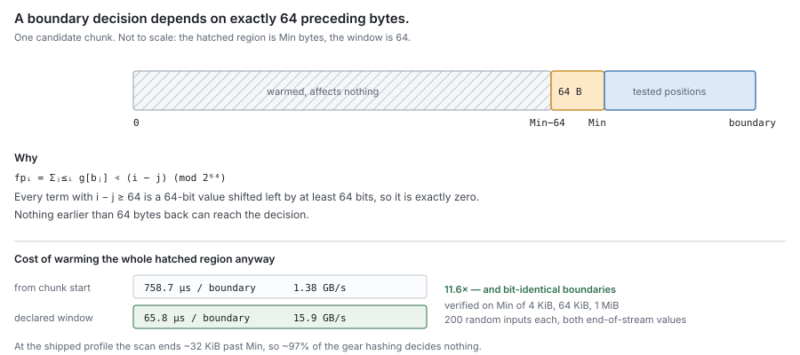
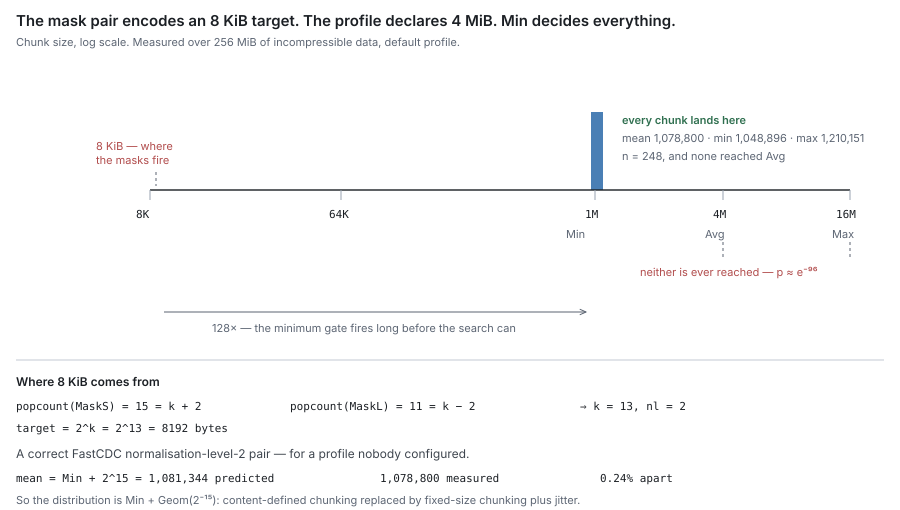

# RFC 2 — the carver

**Status:** draft.
**Depends on:** [RFC 0](rfc-0-data-lifecycle.md), for the terms and the data model. [RFC 1](rfc-1-journal.md) supplies the bytes
this component reads.
**Audience:** anyone changing `pkg/block/carver` or `pkg/block/chunker`.

The key words **MUST**, **MUST NOT**, **SHOULD**, **SHOULD NOT** and **MAY** are
to be interpreted as in RFC 2119.

---

## In short

- The carver cuts bytes into chunks. Blocks are made of chunks, and blocks are
  what gets uploaded.
- Boundaries are chosen by content, not by position. That way an edit in one part
  of a file leaves the chunks everywhere else untouched. It is the only reason to
  cut this way.
- There are two pieces. The **chunker** says where a chunk ends. The **carver**
  runs it over a stretch of bytes and hashes each chunk it finds.
- Neither keeps anything between calls, and neither calls out to anything else.
  Both can be tested with a byte slice and a closure.
- One call covers one unbroken stretch of a file. That is what keeps a chunk from
  straddling a hole.
- A chunk's name is the hash of its bytes, and nothing else.
- Whoever builds blocks follows three rules ([§5](#5.%20Packing%3A%20three%20rules%2C%20not%20a%20component)). Building them is not the
  carver's job.
- The settings are public, so chunk sizes are predictable. This layer does not
  hide which files you have ([§6](#6.%20Boundaries%20are%20public)).
- Repetitive data — zeros, fixed-width records, plain text — cannot be cut at all,
  and comes out in `Max`-sized pieces. That is inherent, and it is why `Max`
  exists ([§3.8](#3.8%20What%20happens%20on%20repetitive%20data)).
- The shipped code misses two requirements here. Appendix A shows what it does
  instead, and how that was measured.

---

## Background — the ideas this document assumes

*Skip this if content-defined chunking is familiar. Everything below is standard;
nothing in it is specific to DittoFS.*

**The problem.** We want to avoid storing or sending bytes we already have. So we
split each file into pieces, name each piece by the hash of its content, and skip
any piece whose name we have seen before.

**Why the pieces cannot be a fixed size.** Suppose we cut every 1 MB. Insert one
byte at the front of a file and every boundary after it shifts by one. Every piece
now has different content, so every piece gets a different name, and nothing
matches what we stored yesterday. One inserted byte costs a full re-upload.

**Content-defined chunking (CDC)** fixes that by letting the data choose the
boundaries. Slide a small window along the bytes, keep a cheap running fingerprint
of it, and declare a boundary whenever that fingerprint hits an agreed pattern.
Because the decision depends only on nearby bytes, inserting a byte moves only the
boundaries near the insertion. Everything further on is cut exactly where it was
before, keeps its name, and still matches. The idea comes from LBFS [3].

**The rolling fingerprint.** It has to be updatable one byte at a time, or the
scan costs too much. DittoFS uses a *gear* hash: shift the running value left one
bit and add a table entry for the new byte. Cheap, and — as [§3.4](#3.4%20How%20far%20back%20a%20decision%20looks) works out — it
forgets anything older than 64 bytes, which turns out to matter.

**FastCDC** [1] is the specific scheme used here. On top of plain CDC it adds
three things:

- a *gear* hash instead of the older, slower Rabin fingerprint;
- a **minimum** size, below which it does not even look for a boundary, to avoid
  emitting lots of tiny pieces;
- **normalisation** — a stricter test below the target size and a looser one above
  it, so sizes cluster near the target instead of spreading out. "Normalisation
  level 2" just names how much stricter and looser.

**BLAKE3** [2] is the hash that names a chunk: fast, and 256 bits wide. It needs
to be a cryptographic hash because a name collision — two different chunks with
the same name — would mean silently serving the wrong bytes.

**Three words used throughout.** A **chunk** is one cut piece, named by its hash.
A **block** is a group of whole chunks, and a block is what actually gets uploaded
as one object. A file's **manifest** is the ordered list of the chunks it is made
of. Chunks are shared between files; blocks and manifests are not the same thing
and [§5](#5.%20Packing%3A%20three%20rules%2C%20not%20a%20component) is careful about the difference.

---

## 1. Purpose

The carver cuts the bytes the journal is holding into the pieces that get
uploaded.

> **Given an unbroken stretch of a file's bytes, say where the chunk boundaries
> fall and what each chunk's content hash is.**

That is all of it. Chunks are not the product — blocks are, and a block is a whole
number of chunks ([RFC 0 §2.1](rfc-0-data-lifecycle.md#2.1%20Entities)). But building blocks is a fold over what the carver
hands back ([§5](#5.%20Packing%3A%20three%20rules%2C%20not%20a%20component)), not something the carver does.

Why cut this way at all? Because a boundary chosen by content stays put when the
file changes elsewhere. Edit the middle of a file and only the chunks around the
edit are re-cut; everything else keeps its hash, so those bytes can be recognised
as already stored and left out of the upload. Everything downstream — dedup,
refcounts, sweep safety — rests on that. It is why most of this document is about
getting the cuts right.

### 1.1 Non-goals

The carver **MUST NOT**:

- open, read or write anything — it is handed a reader and hands back descriptors;
- decide *when* to cut, or which bytes to offer; that is flush policy ([RFC 0 §5.2](rfc-0-data-lifecycle.md#5.2%20Flush));
- build blocks, upload anything, or find out whether an upload worked;
- know whether a chunk is already stored — it has no dedup oracle and asks nothing
  of any other component;
- know what a segment, a record, a block or a remote key is;
- keep state between calls.

Its dependencies are the standard library and a BLAKE3 implementation, and an
import test **MUST** enforce that.

### 1.2 Two layers: the chunker and the carver

Two things are specified here, and keeping them apart is what keeps both simple.

**The chunker answers *where*. The carver answers *what*.**

| | chunker | carver |
| --- | --- | --- |
| Answers | where does this buffer's next chunk end? | what chunks are in this stretch, and what are they called? |
| Given | settings, a byte slice, and whether it is the last | settings, a reader, the file offset it starts at |
| Returns | one position, or "not yet — give me more" | one callback per chunk: offset, length, hash, bytes |
| Knows about | bytes and settings, nothing else | a reader, a hash function, a file offset |
| Keeps between calls | nothing at all | nothing at all |
| Allocates | never | one buffer per call |

Indicative shapes — the obligations are normative, the signatures are not:

    // chunker: pure, stateless, allocation-free
    NextBoundary(p Params, buf []byte, final bool) (end int)

    // carver: runs the chunker across one stretch of bytes
    Cut(r io.Reader, base int64, p Params, emit func(Chunk, []byte) error) error

    Chunk = { Offset int64; Length int32; Hash [32]byte }

`NextBoundary` gets a buffer and returns where the first chunk in it ends. If it
has not seen enough bytes to be sure, it returns zero and asks for more; `final`
tells it no more are coming, so whatever is left is the last chunk. It looks at
nothing but its arguments.

`Cut` reads until the reader is empty. It refills a buffer, asks `NextBoundary`
where each chunk ends, hashes that chunk, and calls `emit`. `base` says where in
the file the reader's first byte sits, so offsets come out as file offsets and the
carver needs to know nothing else about the file.

**Neither does the other's job**, and an implementation **MUST NOT** let them
drift together:

- the chunker **MUST NOT** hash, hold a file offset, read from anything, or
  allocate;
- the carver **MUST NOT** work out a boundary itself, look at a fingerprint, or
  depend on how the chunker reached its answer.

The second rule is the one that decays quietly. A carver that reaches into the
boundary search to manage its own buffer makes its callers track two positions in
the file at once — how many bytes have been handed over, and how many have been
cut — and any drift between them tiles some bytes into two chunks.

**Which layer owns what.** Section 3 is all chunker. Sections 2 and 4 are all
carver. Section 5 belongs to neither, and section 6 is about the pair.

The split is not about packaging. It is what lets the boundary rules be checked
against a byte slice with no reader and no hash anywhere in sight, and it is what
makes swapping the boundary function a change to one thing instead of two.

### 1.3 It is testable on its own, by construction

Neither layer declares an interface or needs a capability from anything else. RFC
0 [§1.2](#1.2%20Two%20layers%3A%20the%20chunker%20and%20the%20carver) says every component must build and pass its tests with each declared
interface stubbed out; here there is nothing to stub. The chunker goes further —
with no reader and no hash, a byte slice is the whole fixture.

This is a requirement, not a lucky accident, and an implementation **MUST** keep
it. A conformance check for this document **MUST** be writable as: build the
settings, hand `Cut` a byte slice and a closure, check what the closure saw. No
store, no fake backend, no temp directory, no network, no clock, no goroutine.

Two things follow, and both make checks cheap:

- **Same input, same output, always.** Two implementations — or one before and
  after a change — can be checked for identical results over random input. The
  warm-up result in Appendix A.2 was established exactly this way: two variants,
  512 MiB of random input, assert the chunks come out identical, then time both.
- **No state means properties can be fuzzed.** The invariants in [§8](#8.%20Invariants) are properties
  of a return value, so random inputs and random settings are enough to test them.

An implementation that picks up a dependency here — a metadata lookup, a store
handle, a logger that does something, a clock — loses both, and **MUST NOT**.

In practice the carver's checks are of four kinds, and none needs more than a
byte slice:

- **Golden vectors.** For a fixed seed and each supported profile, the list of
  boundaries and hashes is committed with the tests. A chunk's hash is its
  identity, and a change that moves a boundary re-names every chunk after it and
  ends deduplication against everything already stored — so a changed vector
  **MUST** fail the build, and changing one is a format migration, not a test
  update.
- **Properties, fuzzed.** Go's native fuzzing (`testing.F`) drives random input
  and random valid settings through `Cut`, and asserts the invariants of
  [§8](#8.%20Invariants) on what `emit` saw.
- **Differential.** Two implementations, or one before and after a change, over
  the same random input, **MUST** emit identical chunks. This is how a faster
  chunker is admitted.
- **Allocation.** `testing.AllocsPerRun` over a whole `Cut` **MUST** report zero
  once the carver's buffer exists ([§2.2](#2.2%20The%20bytes%20handed%20to%20%60emit%60%20are%20borrowed)).

## 2. What one call covers

### 2.1 One unbroken stretch per call

The reader **MUST** supply one unbroken stretch of the file's bytes. Where the
file has holes, the caller makes a separate call for each stretch. [RFC 1 §3.2](rfc-1-journal.md#3.2%20Read)
already tells the caller where the holes are, so this costs it nothing.

This is a guarantee built into the shape rather than a rule to be obeyed, which is
the point. A chunk cannot straddle a hole, because no single call ever sees two
stretches. There is no leftover state to clear between stretches, because there is
no state between calls at all.

The last chunk of a stretch comes out at whatever length is left, and **MAY** be
shorter than the minimum. Content **MUST NOT** be padded to reach a chunk size.

> *A real cost, worth stating:* a badly fragmented file gives one short chunk per
> stretch, and short chunks only dedup against identical fragments. Nothing can be
> done about it here — bytes that are not next to each other cannot share a chunk.
> Offering longer stretches is the caller's lever.

### 2.2 The bytes handed to `emit` are borrowed

The bytes passed to `emit` point into the carver's own buffer and are only good
**for the length of that call**. A caller that wants to keep them **MUST** copy
them.

The carver **MUST** say so plainly, and **MUST NOT** allocate a fresh slice per
chunk to sidestep it. Allocating per chunk is what makes buffer zeroing the
largest single cost of a carve pass. The whole point of handing bytes to a
callback is that the consumer is right there and can decide, once, whether these
particular bytes are worth keeping.

> [!note]
> Borrowing is safe here precisely because the callback runs inside the
> call, where the lifetime is visible at the call site. An interface that returned
> finished chunks for use later could not borrow, because nothing would bound how
> long the bytes had to stay valid. `restic/chunker` [4] uses the same contract.

### 2.3 What a pass makes observable

The carver keeps nothing between calls ([§1.2](#1.2%20Two%20layers%3A%20the%20chunker%20and%20the%20carver)), so it holds no counters and exports
nothing. Everything below is derived by its caller from what `Cut` hands back:
each chunk's offset, length and hash through `emit`, and the error `Cut` returns.
The caller **MUST** make every metric below observable; the engine exports them
to Prometheus and to `dfsctl`'s stats output, labelled with the share
([RFC 6](rfc-6-engine.md)). A metric is listed only if it says something about cutting;
whether a chunk was already stored is the engine's ([§1.1](#1.1%20Non-goals)).

| Metric | Type | Answers |
| --- | --- | --- |
| `dittofs_carver_bytes_total` | counter | bytes cut |
| `dittofs_carver_chunks_total` | counter | chunks emitted; with bytes, the average chunk size, which [§3.2](#3.2%20The%20three%20settings) says is `Target` |
| `dittofs_carver_chunk_size_bytes` | histogram | the chunk-size distribution, with buckets at `Min`, `Target` and `Max`. Appendix A.1 is what a spike on `Min` looks like; this is how production would have shown it |
| `dittofs_carver_max_chunks_total` | counter | chunks cut at `Max` because no boundary was found: repetitive content ([§3.8](#3.8%20What%20happens%20on%20repetitive%20data)). A high share on data that is not repetitive means the boundary function is broken |
| `dittofs_carver_short_chunks_total` | counter | last-in-stretch chunks below `Min` ([§2.1](#2.1%20One%20unbroken%20stretch%20per%20call)); against chunks, how fragmented the offered stretches are |
| `dittofs_carver_stretches_total` | counter | `Cut` calls; bytes per stretch is the caller's lever on dedup ([§2.1](#2.1%20One%20unbroken%20stretch%20per%20call)) |
| `dittofs_carver_errors_total` | counter | calls that ended in an error, labelled `source` = `reader` or `emit` ([§7](#7.%20Errors)) |
| `dittofs_carver_duration_seconds` | histogram | time per `Cut` call; with bytes, carve throughput |

The size histogram is the one that matters most. The shipped code has cut every
chunk just above `Min` since it was written ([Appendix A.1](#A.1%20The%20masks%20encode%20a%20different%20target%20than%20the%20profile%20declares)), and nothing downstream
noticed, because a wrong average costs sizing and dedup, never correctness.

## 3. The boundary function

*This section is the chunker's contract: what a boundary function has to
guarantee, what its three settings mean, and what makes a setting invalid. The
shipped code does not meet two of these requirements — Appendix A says what it
does instead.*

### 3.1 What it must guarantee

These are properties, not an algorithm. Any function with them will do.

| # | Property | What it means |
| --- | --- | --- |
| B1 | **Content-defined** | Where a boundary falls depends on the bytes around it, never on a position or a running count. |
| B2 | **Deterministic** | Same bytes and same settings give the same boundaries — any process, any machine, any version. |
| B3 | **Bounded** | No chunk larger than `Max`. None smaller than `Min`, except the last one in a stretch. `Max` is not a safety margin — on some real inputs it is the *only* thing that ends the search ([§3.8](#3.8%20What%20happens%20on%20repetitive%20data)). |
| B4 | **Shift-resistant** | Inserting or deleting bytes re-cuts only the chunks near the edit. Everything further on is untouched. |
| B5 | **Locally dependent** | A decision looks back only a fixed number of bytes, and the function **MUST** say how many ([§3.4](#3.4%20How%20far%20back%20a%20decision%20looks)). |

Shift resistance (B4) is what the whole content-addressed model rests on. Without
it, an edit re-hashes every chunk after it and nothing downstream dedups at all.
Local dependence (B5) is what makes the function cheap to run.

FastCDC [1] with gear hashing is the chosen instantiation, and BLAKE3-256 [2] the
chunk hash ([RFC 0 §2.1](rfc-0-data-lifecycle.md#2.1%20Entities), [§3](rfc-0-data-lifecycle.md#3.%20Identity)). A replacement **MUST** have all five properties. Any
replacement re-cuts every file ever written, so it is a migration ([§3.6](#3.6%20Changing%20any%20of%20this%20is%20a%20migration)).

### 3.2 The three settings

Each **MUST** mean what its name says:

| Setting | What it **MUST** mean |
| --- | --- |
| `Target` | the average chunk size actually produced, on data with no structure to exploit |
| `Min` | no chunk smaller than this, except the last one in a stretch |
| `Max` | no chunk larger than this, ever |

An implementation **MUST** hit `Target` as the average chunk size, within a stated
tolerance, on data with no structure to exploit. It **MUST NOT** ship a boundary
function whose average lands somewhere else, and **MUST NOT** settle such a
mismatch by writing the real number into the specification.

`Min` and `Max` are the edges of a distribution centred on `Target`, so they
**MUST** sit either side of it: `Min ≤ Target ≤ Max`. Setting `Min` at or above
`Target` is not cautious, it is invalid — the minimum then smothers the search and
`Target` stops describing anything ([§3.3](#3.3%20Why%20a%20large%20minimum%20smothers%20the%20search)).

**Whatever decides a boundary MUST be derived from `Target`.** In a gear-hash
design that decision is a bit mask, and the number of bits set in it fixes the
average chunk size. A hard-coded mask therefore pins the average whatever `Target`
is set to. An implementation **MUST** compute the mask from `Target`, and
**SHOULD** assert the two agree when it starts up.

*The shipped masks are hard-coded and encode a different target — Appendix A.1.*

### 3.3 Why a large minimum smothers the search

A minimum is enforced by simply not looking for a boundary until `Min` bytes have
gone by. If `Min` is much larger than `Target`, then the moment looking starts, a
boundary turns up almost immediately — because the test was tuned to fire about
every `Target` bytes.

Every chunk then comes out just over `Min`, with only a small random tail, and
`Max` is never reached. In other words you no longer have content-defined
chunking; you have fixed-size chunking with a bit of jitter, which throws away
shift resistance (B4). An implementation **MUST** therefore refuse `Min ≥ Target`
outright ([§3.7](#3.7%20Bad%20settings%20must%20be%20refused%2C%20not%20replaced)).

### 3.4 How far back a decision looks

A boundary decision only depends on a short run of recent bytes, and the function
**MUST** say how long that run is. Before testing the first position, an
implementation **MUST** warm its rolling state over exactly that many bytes, and
**MUST NOT** warm it from the start of the chunk.

For gear hashing the answer is 64 bytes, and it is exact rather than approximate.
The fingerprint is built by shifting left one bit per byte, so after 64 bytes an
old byte's contribution has been shifted clean off the end of a 64-bit number. It
cannot affect anything. Written out:

fp_i = Σ_{j ≤ i} g[b_j] << (i − j) (mod 2⁶⁴)

Every term where `i − j` is 64 or more is a 64-bit value shifted left by at least
64 bits, which is exactly zero.

Warming from the start of the chunk therefore does `Min` bytes of work to reach a
search that finishes after roughly `Target` bytes. At the shipped settings that
means gear-hashing every byte of the file to use about 3% of the work. Fixing it
makes a whole carve pass about 1.4× faster on the production CPU, for output that
is bit-for-bit identical. *Measurements in Appendix A.2.*

### 3.5 What "deterministic" covers

Same bytes, same settings, same boundaries — in any process, on any machine, at
any version.

The one thing it does **not** cover is where a stretch begins. The first `Min`
bytes of any stretch are never tested, so the same bytes starting at a different
point cut differently. Section 2.1 is what stops that mattering: a stretch is
always the same stretch.

The boundary function **MUST NOT** depend on anything beyond the bytes and the
settings — not a file identity, an offset, a clock, or a random seed. A
per-deployment secret is the one exception anyone should consider, and it is not
free ([§6](#6.%20Boundaries%20are%20public)).

### 3.6 Changing any of this is a migration

Settings are chosen per share, at write time. Reading never re-cuts anything: a
file's chunk list freezes its boundaries ([RFC 0 §2.2](rfc-0-data-lifecycle.md#2.2%20How%20a%20file%20relates%20to%20its%20chunks)), so content written under
one set of settings reads fine under any other.

Changing a share's settings — or the boundary function, or anything derived from
it — **MUST NOT** therefore be treated as a configuration change. New writes
cut in different places, hash to different chunks, and dedup against nothing
already stored. An implementation **MUST** record which settings produced a
share's existing content, and **MUST** report a change as a migration instead of
quietly applying it.

### 3.7 Bad settings must be refused, not replaced

An implementation **MUST** reject invalid settings when it starts up, with an
error, and **MUST NOT** quietly fall back to a default profile.

Invalid means: `Min` below the floor where chunking stops being worthwhile;
`Min ≤ Target ≤ Max` broken, including `Min ≥ Target` ([§3.3](#3.3%20Why%20a%20large%20minimum%20smothers%20the%20search)); or `Max` larger than
the buffer contract allows.

Falling back to a default looks like robustness and is really a data-shape bug. A
share asked for 64 KiB chunks and quietly given 1 MiB ones produces content that
is valid, readable and correctly hashed — and that dedups against nothing the
operator expected, at sixteen times the read amplification they planned for, with
nothing anywhere reporting a problem. This is [RFC 0 §1.2](rfc-0-data-lifecycle.md#1.2%20Component%20autonomy)'s silent-fallback hazard
wearing configuration as a disguise: the missing thing is the requested chunk
size, and its absence **MUST** be loud.

### 3.8 What happens on repetitive data

Repetitive input is not an edge case worth a footnote — it is log files, CSV with
fixed-width records, zero-filled regions of sparse files, and VM images full of
identical pages. It has a specific and severe failure mode, and it follows
directly from the 64-byte window of [§3.4](#3.4%20How%20far%20back%20a%20decision%20looks).

**If the data repeats with a period of 64 bytes or less, the search can never
succeed.** The fingerprint depends only on the last 64 bytes, so at every tested
position it takes the *same* value. If that one value does not match the mask, it
never matches — not in this chunk, not anywhere in the file. There is no
randomness left to save it.

Measured over 64 MiB at the default profile:

| Input | Chunks | Average size | Boundaries found |
| --- | --- | --- | --- |
| random bytes | 62 | 1.03 MiB | normally |
| all zeros | 4 | **16 MiB — every chunk hit `Max`** | none, ever |
| 64-byte repeating pattern | 4 | **16 MiB — every chunk hit `Max`** | none, ever |
| repeated ASCII text (44-byte period) | 4 | **16 MiB — every chunk hit `Max`** | none, ever |
| 4 KiB repeating pattern | 64 | 1.00 MiB | yes, at a fixed period |

Three consequences, and an implementation **MUST NOT** treat any as incidental:

- **`Max` is load-bearing.** On three of these five inputs it is the only reason
  chunking terminates at all. Removing it, or setting it very high, turns
  repetitive files into single enormous chunks.
- **Repetitive data does not dedup well, and cannot.** Whole-file-sized chunks
  only match other whole-file-sized chunks. This is inherent to any CDC scheme
  with a bounded window, not a defect in this one.
- **Where the period is longer than the window, chunking becomes fixed-size at a
  multiple of that period.** The 4 KiB pattern cut at exactly 8 KiB every time
  under a 4 KiB minimum. Sizes on structured data are set by the data's period,
  not by `Target`.

## 4. Identity

*Both rules live here because identity is a property of content. Neither says who
computes it: a chunk's hash is taken by whoever cuts it, a block's by whoever
assembles it ([RFC 6](rfc-6-engine.md), and [RFC 7](rfc-7-gc.md) when compaction repacks). Nothing in this document
holds state to do either.*

### 4.1 A chunk

A chunk's identity is the BLAKE3-256 [2] hash of its bytes, and nothing else. An
implementation **MUST NOT** feed an offset, a file identity, a length, a settings
profile or a version number into the hash.

The hash covers exactly the bytes handed to `emit` — the same bytes a later read
has to reproduce. It **MUST** be computed over the chunk as cut, never over a
buffer that merely contains it.

### 4.2 A block

A block's identity is **derived** from the ordered hashes of the chunks it holds,
under a distinct domain from [§4.1](#4.1%20A%20chunk), together with the key scope of [§4.3](#4.3%20Key%20scope). It
**MUST NOT** be generated, allocated, sequenced, drawn at random, or assigned by
the remote tier.

Three things follow, and none of them is optional:

- **Order counts.** P2 and P3 make membership *and* order decide the object's
  bytes, so two blocks holding the same chunks in different order are different
  objects and **MUST** get different identities.
- **The domain must be separated** from [§4.1](#4.1%20A%20chunk), or a block holding exactly one chunk
  would take that chunk's own hash as its identity, and two different things would
  answer to one name.
- **The input is hashes, not bytes.** The assembler already holds the chunk hash
  list; re-reading the chunk bytes to name the block would be a second pass over
  the data for a value the first pass already determined.

**What this removes.** Identity stops being *minted* anywhere. There is no
generator to call, no uniqueness to defend, and no moment between allocating a name
and using it. Two callers that assemble the same chunks in the same order arrive at
the same name without coordinating, which is what makes a repacked block
idempotent: compaction that crashes and re-runs rewrites the same object rather
than leaving one behind under a name nothing recorded.

This is the same argument as [§4.1](#4.1%20A%20chunk), one level up. A chunk's hash is not allocated
either.

#### 4.2.1 Deviation — a block's identity is generated, in two places

The current implementation fails [§4.2](#4.2%20A%20block). `block.NewBlockID()`
(`pkg/block/block_record.go:29`) returns sixteen bytes of `crypto/rand`, and two
components call it:

| Caller | When | Consequence |
| --- | --- | --- |
| `pkg/block/engine/flush.go:392` | every flush carrying novel chunks | the name is unrelated to what the block holds, so identical blocks are distinct objects |
| `pkg/block/gc/compaction.go:269` | every repack | a crashed repack leaves an object under a name nothing records |

The engine's call also puts an algorithm in the component [RFC 0 §1.1](rfc-0-data-lifecycle.md#1.1%20The%20component%20set) says owns none.

The full cost of the random name, and the machinery it obliges the rest of the
system to carry, is recorded once in [RFC 3 §2.5](rfc-3-syncer.md#2.5%20An%20unknown%20outcome%20is%20not%20a%20success) rather than restated here. What
belongs here is the part this document is responsible for: the rule that says a
block's name is derived, like a chunk's, and that no component needs a generator.

### 4.3 Key scope

A name **MAY** include a scope that partitions the name space. The scope decides
whether two shares holding identical content resolve to one object or to two.

The scope **MUST** be chosen explicitly rather than inherited from how names happen
to be built, and **MUST NOT** vary between attempts to store one block, or the
idempotency [§4.2](#4.2%20A%20block) buys is lost.

The two settings differ in kind, not in degree:

| | One scope | Scope per share |
| --- | --- | --- |
| Identical content in two shares | one object | one object per share |
| Storage cost | paid once | paid per share |
| Sweep | counts references across shares | independent per share |
| What one share can infer | that another holds the same block, from a dedup hit | nothing |

The scope is encoded in every name ever written, so changing it later orphans
every existing object at once ([§4.2](#4.2%20A%20block)). It is settled before the first deployment
that shares a remote store between shares, not after.

## 5. Packing: three rules, not a component

*Blocks are built by whoever owns the dedup query, which is not the carver ([RFC 6](rfc-6-engine.md)).
The rules live here because they are properties of chunks.*

| # | Rule |
| --- | --- |
| P1 | A block holds whole chunks only. A chunk is never split to make a block come out an exact size. |
| P2 | A block reaches at least the block target, and overshoots it by at most one chunk. The last block of a pass **MAY** fall short: the pass ends with what it has. |
| P3 | A block holds only the chunks whose bytes it actually carries. |

P1 is [RFC 0 §2.2](rfc-0-data-lifecycle.md#2.2%20How%20a%20file%20relates%20to%20its%20chunks). A chunk split across two blocks would have one hash naming
content in two places, so the hash would stop being a locator and a refcount would
stop having a single answer. P2 follows from P1: if a block has to end on a chunk
boundary, the most it can overshoot by is the chunk that crossed the line.

P3 is worth spelling out, because the tempting mistake is to let already-stored
chunks ride along so that a block's chunk list covers an unbroken range. It must
not. A chunk that is already stored lives in another block under its own key;
putting it in this one either duplicates its bytes or produces a block whose list
disagrees with its contents. The thing that needs *every* chunk, stored or not, is
the **file's manifest** — and the manifest is a different reader of the same
sequence `Cut` produced.

> [!note]
> Keeping those two readers apart is also what lets block-assignment
> policy change without touching chunking or breaking dedup. `restic` [4] relies
> on exactly that separation, and used it to swap sequential assembly for a
> randomised one with no migration.

**Where the dangerous rule went.** Block assembly asks a dedup oracle whether a
chunk is already stored. If that oracle can see the block currently being built,
it will call a chunk stored before it has been uploaded — so an identical chunk
later in the same pass carries no bytes, and if the upload then fails the content
exists nowhere while metadata records two references to it. That hazard is real
and it belongs to **RFC 6**, because that is where the oracle gets asked.

## 6. Boundaries are public

The boundary function and its settings are fixed constants in the source. Anyone
can therefore work out where a given file's chunks will fall. **This layer does
not hide which files a deployment holds.**

The consequence is a known-file channel. The run of chunk sizes a file produces is
a fingerprint, so an observer who can see object sizes and counts in the remote
tier can test whether a particular file is stored. The same channel sits under
dedup across shares: the fact that two shares resolve to one object is itself an
answer about their content.

An implementation **MUST NOT** claim otherwise, and a deployment that needs this
hidden **MUST** get it from another layer. Two mitigations exist, neither free:

- **Put a per-deployment secret in the boundary function.** Boundaries become
  unpredictable. Chunks also stop being comparable between deployments, so
  cross-deployment dedup ends, and adopting it re-cuts everything ([§3.6](#3.6%20Changing%20any%20of%20this%20is%20a%20migration)). Keyed
  chunking is an active research target and recent work [5] has broken deployed
  schemes, so it **MUST NOT** be adopted on the assumption that a key settles the
  matter.
- **Randomise how blocks are assembled.** This blurs the link between chunk sizes
  and stored object sizes. It costs nothing in dedup and is not a migration,
  because assembly is policy ([§5](#5.%20Packing%3A%20three%20rules%2C%20not%20a%20component)). It is [RFC 6](rfc-6-engine.md)'s call.

How much this actually gives away, at DittoFS's block sizes, has not been
measured ([§11](#11.%20Open%20questions)).

## 7. Errors

`Cut` fails without throwing away the work it finished.

- An error from `emit` or from the reader **MUST** stop the call and be returned.
  Chunks already handed to `emit` have been delivered; the carver **MUST NOT** try
  to take them back.
- A part-built chunk held when the error arrives **MUST** be dropped, never handed
  over short. A short chunk is indistinguishable from a legitimate last chunk, and
  it would hash to something no later read can reproduce.
- The carver **MUST NOT** report anything as stored, or keep state that would let
  a retry cut differently. What happens next is [RFC 0 §5.2](rfc-0-data-lifecycle.md#5.2%20Flush): the extents stay
  **Dirty** and the pass is retried.

Because cutting is deterministic and keeps no state, a retry over the same bytes
produces the same chunks. A failed pass costs work and never correctness.

## 8. Invariants

| # | Invariant |
| --- | --- |
| C1 | A chunk's hash depends on its bytes and nothing else. |
| C2 | The same bytes and settings give the same boundaries, in any process or version. |
| C3 | The average chunk size is the configured `Target`. |
| C4 | Every chunk is between `Min` and `Max`, except the last one in a stretch. |
| C5 | A block holds whole chunks and overshoots its target by at most one; only the last block of a pass may fall short. |
| C6 | A block holds only the chunks whose bytes it carries. |

C3 is the one the shipped code fails (Appendix A.1). C1 and C2 are what make a
hash usable as an address; the rest cost wrong sizing or an unreadable file.

Two properties are absent from this list because the shape of [§1.2](#1.2%20Two%20layers%3A%20the%20chunker%20and%20the%20carver) makes them
unbreakable rather than merely required: a chunk cannot straddle a hole, and there
is no leftover state to clear between calls. The invariants covering block
assembly against a dedup oracle belong to [RFC 6](rfc-6-engine.md).

## 9. Conformance

Conformance is every **MUST** holding. The checks below are evidence for the ones
that fail *quietly* — where nothing errors and nothing goes red by accident. A
check is only validated by reverting the code and watching it fail on its own
assertion.

Every check here is a pure function of a byte slice and a set of settings ([§1.3](#1.3%20It%20is%20testable%20on%20its%20own%2C%20by%20construction)).
If a check needs a fixture, the implementation has picked up a dependency it is
not allowed to have, and that is the finding.

Each check names its layer, because that is where the defect is. Six of the nine
need no reader and no hash at all.

| Layer | Requirement | Check |
| --- | --- | --- |
| chunker | [§3.2](#3.2%20The%20three%20settings) target is real | Cut incompressible data; assert the average is within tolerance of `Target`. A mask that does not follow `Target` fails it (Appendix A.1). |
| chunker | [§3.2](#3.2%20The%20three%20settings) mask comes from target | Build at several targets; assert the mask's bit count tracks the target, and that one hard-coded mask cannot satisfy two of them. |
| chunker | [§3.7](#3.7%20Bad%20settings%20must%20be%20refused%2C%20not%20replaced) bad settings refused | Build with `Min` below the floor, with `Min ≥ Target`, and with `Max` above the ceiling; assert each errors and nothing usable comes back. |
| chunker | [§3.4](#3.4%20How%20far%20back%20a%20decision%20looks) warm-up equivalence | Assert boundaries are identical whether the fingerprint is warmed from the chunk start or over the last 64 bytes, across several profiles. |
| chunker | [§3.8](#3.8%20What%20happens%20on%20repetitive%20data) repetitive input still terminates | Chunk 64 MiB of zeros and of a 64-byte repeating pattern; assert every chunk comes out exactly `Max` and the pass ends. Without `Max` the search never succeeds and the whole file becomes one chunk. |
| chunker | B4 shift resistance | Insert one byte early in a large input; assert every boundary past the edited chunk is unchanged. |
| carver | [§4](#4.%20Identity) hash covers the chunk | Cut identical content at two different `base` offsets; assert one hash. |
| carver | [§2.2](#2.2%20The%20bytes%20handed%20to%20%60emit%60%20are%20borrowed) borrowed bytes | Hold on to the slice passed to `emit` and assert it is seen to change. The check exists to prove the contract is real, so a caller that copies is not doing it out of superstition. |
| carver | [§7](#7.%20Errors) no short chunk on error | Fail `emit` mid-stretch, and fail the reader mid-chunk; assert no delivered chunk is a truncated prefix of one the clean path would produce. |

A check that needs both layers to be wrong at once is in the wrong place. If a
boundary defect only shows up through `Cut`, the chunker's own checks are too
weak, and strengthening those is the fix.

Two things **MUST NOT** stand in:

- **Compressible or repetitive data MUST NOT be the only input for the size
  checks.** A gear hash degenerates on repetitive input, and that is the one case
  where `Max` is ever reached — so a rig built on it measures the opposite of the
  normal case. It **MUST** be covered separately, since it is what `Max` is for.
- **One fixed profile MUST NOT be the only settings under test.** The defect in
  Appendix A.1 is invisible at a single profile and obvious across two.

### 9.1 Benchmarks and quality measures

Speed and quality are measured separately: a faster carver that finds worse
boundaries costs more in storage than it saves in CPU.

| # | Measures | Setup | Reports |
| --- | --- | --- | --- |
| C1 | chunker speed | `NextBoundary` over 64 MiB of seeded random bytes, per profile | MiB/s; zero allocations |
| C2 | carver speed | `Cut` over the same input, hashing included, against BLAKE3 alone over the same bytes | MiB/s for each; the difference is the carver's own cost, since hashing dominates |
| C3 | the worst case | `Cut` over all-zero and short-period input, where every chunk reaches `Max` ([§3.8](#3.8%20What%20happens%20on%20repetitive%20data)) | MiB/s; it must stay within a small factor of C2 |
| C4 | edit stability | a corpus file, then the same file with bytes inserted near the start | the fraction of chunk hashes the two versions share; content-defined chunking exists to keep this near one |
| C5 | size distribution | real files of several kinds — source trees, VM images, media | the chunk-size histogram against `Min`, `Target` and `Max`; Appendix A.1 was found this way |

C1 to C3 use `b.SetBytes` and report allocations. They run on amd64 **and**
arm64, because the ratios differ between them (Appendix A.2), and a result is
recorded with the machine and commit that produced it. C4 and C5 are not timed;
they run on a fixed corpus so a change of profile can be compared against the
last one, and they are what decide a profile — speed alone never does.

Seeded random input is the right input for C1 and C2 and the wrong one for C4
and C5: random bytes contain no edits to survive and no structure to find.

Any benchmark that runs the carver inside the full stack uses data that does not
deduplicate, and reports bytes stored against bytes written. The external
benchmark of v0.33.0 found 2.9× deduplication that came from fio reusing its
buffers, not from the workload, and it inflated every throughput figure it
touched. The object-size histogram of a real bucket is a check on C5 from the
other side.

## 10. Test plan and performance targets

[§9](#9.%20Conformance) says what must be checked and how a check is validated, and [§1.3](#1.3%20It%20is%20testable%20on%20its%20own%2C%20by%20construction) why
every check needs nothing but a byte slice. This section is the plan around it,
in the shape [RFC 1 §12](rfc-1-journal.md#12.%20Test%20plan%20and%20performance%20targets) set.

### 10.1 Kinds of test

| Kind | What it covers | How |
| --- | --- | --- |
| Golden vectors | that boundaries and hashes never move ([§3.6](#3.6%20Changing%20any%20of%20this%20is%20a%20migration)) | a fixed seed per supported profile, boundaries and hashes committed; a changed vector fails the build |
| Properties | the invariants of [§8](#8.%20Invariants) | Go native fuzzing over random input and random valid settings, asserting on what `emit` saw |
| Differential | a faster or refactored implementation | two implementations over the same random input **MUST** emit identical chunks ([§1.3](#1.3%20It%20is%20testable%20on%20its%20own%2C%20by%20construction)) |
| Conformance | every check in [§9](#9.%20Conformance) | pure functions of a byte slice and settings |
| Reader and emit faults | [§7](#7.%20Errors) | a reader and an `emit` that fail at a chosen byte or chunk ([§10.3](#10.3%20Faults%20and%20determinism)) |
| Architecture | B2: any machine | the golden vectors run on amd64 and arm64; BLAKE3 takes different code paths on each |
| Benchmark | [§9.1](#9.1%20Benchmarks%20and%20quality%20measures), C1–C5 | real time on the reference box, on `develop` ([RFC 1 §12.4](rfc-1-journal.md#12.4%20What%20CI%20checks%20instead%20of%20timing)); C4 and C5 are counts and also run on pull requests |

There is no crash test, no soak and no concurrency test, and that is the design
working rather than a gap: the carver holds nothing that a crash can tear,
nothing that grows over time, and nothing two calls share.

The one thing a byte slice cannot test is whether the caller uses the output
correctly — that a block holds whole chunks, that bytes are copied before `emit`
returns. Those are checked at the consumer, in [RFC 6](rfc-6-engine.md).

### 10.2 Edge cases

The unit, property and fault tests **MUST** reach these.

**Stretch shape**

- an empty stretch, which emits nothing and succeeds;
- a stretch of one byte, of `Min − 1`, `Min`, `Max` and `Max + 1` bytes;
- a stretch whose length is an exact multiple of `Max`, of repetitive content, so
  the last chunk is exactly `Max` rather than short;
- `base` at zero, at an odd offset, and near the largest file offset: offsets are
  file offsets and **MUST NOT** overflow.

**The buffer edge**

- a boundary landing exactly where the carver's buffer is refilled, one byte
  before it and one byte after it;
- a chunk exactly as long as the buffer;
- the chunker returning "not yet" at the very end of the buffer, then `final`.

These are where a carver that manages its own positions drifts and tiles a byte
into two chunks ([§1.2](#1.2%20Two%20layers%3A%20the%20chunker%20and%20the%20carver)).

**Readers that are legal but awkward**

- one that returns one byte per call;
- one that returns its last bytes together with `io.EOF`, which **MUST** be cut,
  not dropped;
- one that returns zero bytes and no error, repeatedly. That is legal for
  `io.Reader`; the carver **MUST NOT** treat it as the end, and **MUST** fail
  after a bounded number of such reads rather than spin, as `bufio` does with
  `io.ErrNoProgress`.

**Content**

- random data, where boundaries come from the fingerprint;
- zeros and a repeating pattern of period 64 or less, where only `Max` ends a
  chunk ([§3.8](#3.8%20What%20happens%20on%20repetitive%20data)), and a period just above 64, where boundaries return;
- random data with a repetitive region in the middle, crossing in and out of it;
- the same bytes at two `base` offsets, which **MUST** produce one set of hashes.

**Settings**

- every profile the implementation supports;
- each limit of [§3.7](#3.7%20Bad%20settings%20must%20be%20refused%2C%20not%20replaced) exactly at the floor or ceiling, and one past it.

### 10.3 Faults and determinism

The carver has no storage, so there is nothing to corrupt and no crash to
simulate. What can go wrong is the input failing and the output being refused,
and both are injected systematically, not by example:

- the reader fails at **every byte offset** of a stretch spanning several chunks
  and at least two buffer refills;
- `emit` fails at **every chunk** of that stretch.

After each, the chunks already delivered **MUST** be exactly a prefix of the
chunks the clean run delivers, byte for byte, and no delivered chunk may be a
shortened version of one ([§7](#7.%20Errors)). A retry over the same bytes **MUST** then
deliver exactly the clean run.

Determinism is tested across what could vary without anyone deciding to vary it:
architecture, Go version and buffer size. Golden vectors run on amd64 and arm64,
and the property tests run the same input with two buffer sizes and require
identical output. A carver whose output depends on its buffer size cuts
differently after a harmless tuning change, and that is a migration nobody
chose ([§3.6](#3.6%20Changing%20any%20of%20this%20is%20a%20migration)).

### 10.4 What CI checks instead of timing

Tiers are those of [RFC 1 §12.4](rfc-1-journal.md#12.4%20What%20CI%20checks%20instead%20of%20timing). On a pull request, only counts, which give the
same answer on any runner:

- **golden vectors** unchanged, on amd64 and arm64;
- **allocations**: `NextBoundary` makes none, and `Cut` makes one buffer per
  call and nothing per chunk ([§2.2](#2.2%20The%20bytes%20handed%20to%20%60emit%60%20are%20borrowed));

- **average chunk size** over 256 MiB of seeded random input, within 10% of
    `Target` at every profile;
- **edit stability** (C4) on the fixed corpus, at or above the target of [§10.5](#10.5%20Performance%20targets).

A warm-up that crept back over the whole chunk ([Appendix A.2](#A.2%20Warm-up%20runs%20over%20the%20whole%20chunk%20instead%20of%20the%20last%2064%20bytes)) changes no output, so
no count on a pull request sees it. C1 on `develop` does: the boundary search
falls from about 28× BLAKE3's rate to about 2×, far below its target. Counting
it on pull requests would need a test-only hook inside a chunker that holds no
state, which costs more than a day's delay in finding it.

### 10.5 Performance targets

Speed targets are stated against BLAKE3 alone over the same bytes on the same
box, so they hold on any hardware. Results are recorded in absolute numbers
([§10.6](#10.6%20Recording%20results)). Each target leaves room below what was measured, so a real
regression trips it and noise does not.

The hash is the wall. With the warm-up fixed, BLAKE3 is 97% of a carve pass on
the production CPU ([Appendix A.2](#A.2%20Warm-up%20runs%20over%20the%20whole%20chunk%20instead%20of%20the%20last%2064%20bytes)), so the carver's target is to cost almost
nothing on top of it, and the quality targets decide a profile, not speed
([§9.1](#9.1%20Benchmarks%20and%20quality%20measures)).

| # | Metric | Proposed target |
| --- | --- | --- |
| C1 | boundary search alone, random input | ≥ 10× BLAKE3's rate, so the search stays under a tenth of a pass (about 28× on EPYC 7543 and 23× on M1 Max, from [Appendix A.2](#A.2%20Warm-up%20runs%20over%20the%20whole%20chunk%20instead%20of%20the%20last%2064%20bytes)) |
| C2 | a whole `Cut`, hashing included | ≥ 90% of BLAKE3 alone (measured 97%) |
| C3 | all-zero and short-period input | ≥ 50% of C2; the search does nothing useful here, but it must not cost more than the hash |
| C4 | edit stability: a byte inserted near the start of a 1 GiB corpus file | every chunk shared except the one or two around the edit |
| C5 | average chunk size, random input | within 10% of `Target` |
| C5 | chunks at `Max`, on a corpus with no repetitive regions | ≤ 1% |
| — | allocations | none per chunk; one buffer per call |
| — | memory per call | one buffer, at least `Max` so a whole chunk can be handed to `emit`, and at most `2 × Max` |

In absolute terms the production CPU carved 1,855 MB/s after the warm-up fix,
about 15× the 1 GbE link of the v0.33.0 staging benchmark. One carve stream is
not where a pass waits.

### 10.6 Recording results

Results are recorded as [RFC 1 §12.6](rfc-1-journal.md#12.6%20Recording%20results) requires, with two additions that
matter here: the CPU's SIMD extensions BLAKE3 used (AVX-512, AVX2, NEON), and
the Go version. The same carver on the same box differs by more across those than
across commits.

## 11. Open questions

1. **Which way out of Appendix A.1.** Both exits re-cut everything already
   written, so the choice gets more expensive the longer shares run on the current
   profile. What is unmeasured is the right `Target` for the SMB large-file
   workload: smaller chunks cut read amplification and raise index and refcount
   counts. The trade is at least legible now that the distribution is known.
2. **The warm-up fix** ([§3.4](#3.4%20How%20far%20back%20a%20decision%20looks), Appendix A.2). **Answered — do it.** Measured at
   **1.43× on a whole carve pass** on the production CPU (EPYC 7543) and 2.34× on
   arm64, for bit-identical output and no migration. It also settles a second
   thing: after the fix BLAKE3 is 97% of the pass, so there is no further chunker
   optimisation worth chasing. This is a task now, not a question.
3. **Whether `Min` and `Max` survive** ([§3.2](#3.2%20The%20three%20settings)). **Half answered.** `Max` must stay
   — [§3.8](#3.8%20What%20happens%20on%20repetitive%20data) measured it as the only thing that ends the search on data repeating
   with a period of 64 bytes or less, which covers zero-filled regions and
   ordinary text. `Min` is the one that might go: once the mask derives from
   `Target` it would only bound per-chunk overhead. That decision has to wait for
   a target-derived mask to exist, because today `Min` is what sets chunk size at
   all.
4. **How much [§6](#6.%20Boundaries%20are%20public) gives away.** That boundaries are public is certain. What an
   observer can actually recover from DittoFS's object sizes is not. Randomised
   block assembly is cheap enough that it may be worth doing without waiting for
   the measurement.
5. **Where the buffer cost lands now.** Per-chunk allocation is forbidden ([§2.2](#2.2%20The%20bytes%20handed%20to%20%60emit%60%20are%20borrowed))
   and the block-sized buffer moved to [RFC 6](rfc-6-engine.md). Two profiles put large-buffer
   allocation and zeroing at 53% (amd64) and 9% (arm64) of carve cost — but on a
   workload whose dedup oracle was stubbed out, and whose absolute numbers did not
   reproduce an earlier baseline. The ordering is solid; the magnitude is not, and
   the split moves where the cost falls.

---

## Appendix A — what the shipped code actually does

Two requirements in [§3](#3.%20The%20boundary%20function) are not met by the current implementation. Each is recorded
below with the measurement that establishes it.

A deviation is a defect to fix or migrate. It is never a rule for an implementer
to build around, and a mismatch **MUST NOT** be closed by amending [§3](#3.%20The%20boundary%20function).

### A.1 The masks encode a different target than the profile declares

The mask pair is hard-coded, and it encodes a target of **8 KiB** while the
default profile declares **4 MiB**.

FastCDC [1] ties the mask to the target: for a target of `2^k` at normalisation level
*nl*, the small-region mask carries `k + nl` bits and the large-region mask
`k − nl`. The shipped pair has 15 and 11 bits set, and the only `k` and `nl` that
fit are 13 and 2 — a target of `2^13`, which is 8 KiB.

| | The masks imply | The profile declares |
| --- | --- | --- |
| Target average | 8 KiB (`k` = 13) | 4 MiB (`k` = 22) |
| Minimum | — | 1 MiB |

`Min` is 128× the masks' natural target, so the minimum smothers the search ([§3.3](#3.3%20Why%20a%20large%20minimum%20smothers%20the%20search))
and every chunk lands just above `Min`. Predicted average:
`1,048,576 + 32,768 = 1,081,344` bytes. Measured over 256 MiB of incompressible
data:

| Configured Min / Target / Max | Chunks cut | Average chunk | Smallest | Largest | Any chunk reached Target? |
| --- | --- | --- | --- | --- | --- |
| 1 MiB / 4 MiB / 16 MiB | 248 | **1.029 MiB** | 1.000 MiB | 1.154 MiB | none |
| 64 KiB / 256 KiB / 1 MiB | 2,765 | **94.8 KiB** | 64.0 KiB | 258.6 KiB | none |

That is 0.24% from prediction. The second profile confirms the masks are the cause
rather than the profile: moving `Min` and `Avg` together shifts the average by
exactly the change in `Min`. Neither run produced a single chunk that reached
`Avg`; for the default profile that would need 3 MiB of consecutive positions to
all fail a 1-in-32,768 test.

**How to read this.** In both rows the average sits about 30 KB above `Min`, and
nowhere near `Target`. That 30 KB is the masks' own scale showing through — the
small-region mask has 15 bits set, so a boundary turns up on average every
2¹⁵ = 32,768 bytes once looking starts. Change `Min` and that gap stays the same
size, which is what points at the masks rather than the profile. `Max` is not
approached in either row.

For comparison, the FastCDC paper's own recommended setup [1] is normalisation
level 2 with a minimum of 4–8 KB — `Min` close to `Target`, not 128 times it.

**Two ways out, both migrations ([§3.6](#3.6%20Changing%20any%20of%20this%20is%20a%20migration)):**

1. **Compute the masks from `Target`**, and demote `Min` and `Max` to guard rails.
   This is what [§3.2](#3.2%20The%20three%20settings) requires. It re-cuts all existing content.
2. **Redeclare the profile** to the 8 KiB target the masks actually implement.
   Easier to reason about, still re-cuts content unless `Min` comes down to match,
   and leaves a design where the masks can never be retuned.

This document does not choose between them. See [§11](#11.%20Open%20questions), question 1.

### A.2 Warm-up runs over the whole chunk instead of the last 64 bytes

Only the previous 64 bytes can affect a boundary decision ([§3.4](#3.4%20How%20far%20back%20a%20decision%20looks)). The shipped code
warms its fingerprint from the start of the candidate chunk instead. In practice
that means it gear-hashes **every byte of the file**, where the fix gear-hashes
only the search window after each minimum — about 3% of the data.

Measured by chunking 512 MiB of incompressible data end to end, hashing each chunk
with BLAKE3 exactly as a real pass does. Both variants produced the same 496
chunks with the same hashes.

| Machine | What is being timed | Full warm-up | 64-byte warm-up | Gain |
| --- | --- | --- | --- | --- |
| **AMD EPYC 7543** (production) | boundary search + BLAKE3 | 1,300 MB/s | **1,855 MB/s** | **1.43×** |
| | boundary search alone | 2,880 MB/s | 54,440 MB/s | 18.9× |
| **Apple M1 Max** (dev) | boundary search + BLAKE3 | 820 MB/s | **1,917 MB/s** | **2.34×** |
| | boundary search alone | 1,506 MB/s | 45,928 MB/s | 30.5× |

**How to read this.** The row that matters is the first of each pair, because a
real pass hashes what it cuts. The fix is worth about **1.4× on the production
CPU** and more on arm64. The second row shows why the gap between them is so
large: once the wasted warm-up is gone, boundary searching is nearly free, and
BLAKE3 becomes **97%** of what the pass does (96% on arm64).

That last number is the useful one. After this fix there is no point optimising
the chunker further — the hash is the wall.

The gap between the two machines is not noise. The EPYC's gear hash is about
1.9× faster than the M1's, while its BLAKE3 is only about 1.3× faster, so the
wasted warm-up accounts for proportionally less of an amd64 pass. Neither ratio is
predictable from the other; both were measured.

Unlike A.1 this is **not** a migration. The output does not change, so it can be
fixed whenever convenient.
