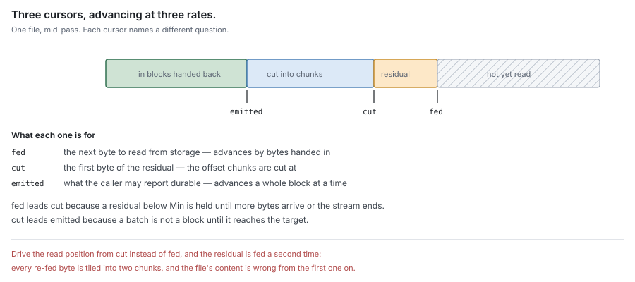
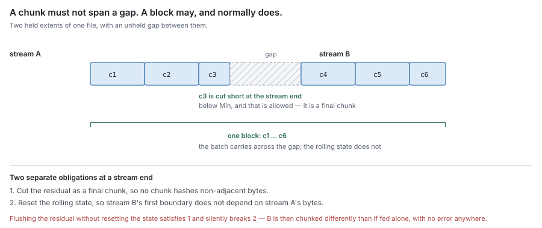
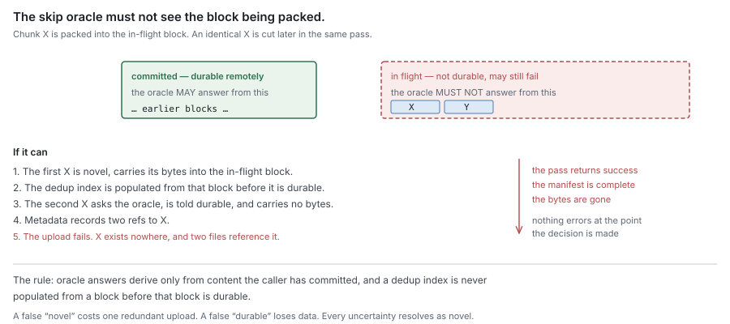

# RFC 2 — the carver

**Status:** draft.
**Depends on:** RFC 0, for the terms, the data model and the invariants. RFC 1
supplies the extents this component consumes. Nothing here redefines them.
**Audience:** anyone changing `pkg/block/carver` or `pkg/block/chunker`.

The key words **MUST**, **MUST NOT**, **SHOULD**, **SHOULD NOT** and **MAY** are
to be interpreted as in RFC 2119.

This document specifies what the carver is required to do. Where the current
implementation does not satisfy a requirement, that is recorded as a **deviation**
in its own subsection, with evidence. A deviation is a defect to be fixed or
migrated, never a rule for an implementer to build around.

---

## 1. Purpose

The carver turns bytes into the units the remote tier addresses. Given a stream
of one file's bytes, it answers one question:

> **Where do the chunk boundaries fall, what is each chunk's identity, and which
> chunks belong in this block?**

It is the only component that decides a chunk boundary, and the only one that
computes a chunk hash. Everything downstream — dedup, refcounts, sweep safety —
rests on those two answers being reproducible.

### 1.1 Non-goals

The carver **MUST NOT**:

- read from or write to any store, local or remote;
- decide *when* to carve, or which extents to offer — that is flush policy
  (RFC 0 §5.2);
- record what it produced, or learn whether an upload succeeded;
- know what a segment, a record or a remote key is;
- import another component in this set (RFC 0 §1.2).

Its dependency set is the standard library and a BLAKE3 implementation, and an
import test **MUST** enforce that.

### 1.2 Two parts, and only one of them is pure

RFC 0 §1.1 assigns this component "bytes → chunks → blocks" and denies it I/O.
Within that, exactly one half is a pure function, and purity **MUST NOT** be
assumed of the other.

| | boundary function | accumulator |
| --- | --- | --- |
| What it is | where a chunk ends | packing chunks into blocks |
| Cross-call state | none beyond immutable parameters | the pending batch, its byte arena, the un-cut residual |
| Determinism | total: output is a function of its arguments | per stream, given the same feed sequence |
| Calls out | never | to the skip oracle (§6) |
| Instances | **MAY** be shared | one per file per pass; **MUST NOT** be shared |

The boundary function **MUST** be pure. That is what makes boundaries
reproducible across processes, versions and machines, which is what makes a
content hash an address.

The accumulator is stateful, and has to be. A block spans more than one call by
design (§5.2), so the batch being packed necessarily survives between calls. An
implementation **MUST NOT** try to make it pure by emitting a block per call;
block size would become a function of how the caller sliced its reads.

The split is a requirement, not a packaging choice. Whether the two live in one
package or two is not this document's concern.

## 2. What it produces

### 2.1 Chunk and block

A **chunk** is a run of bytes with content-defined ends, identified by the hash of
its content (RFC 0 §2.1). The carver reports, for each chunk, its offset in the
file, its length, its hash, and — only when the bytes still need uploading — the
bytes.

A **block** is a whole number of chunks (RFC 0 §2.1). A chunk **MUST NOT** span
two blocks; §5.1 is how that is guaranteed.

A chunk the skip oracle reported as already durable **MUST** still appear in the
block's chunk list, carrying no bytes. It tiles the range without contributing to
the upload. Dropping it leaves the file's chunk-ref list with a gap that no later
pass reconstructs.

### 2.2 Three cursors, not one

A carve pass tracks three positions, and they advance at different rates.
Conflating any two is the defect this section exists to prevent.

| Cursor | Advances by | Names |
| --- | --- | --- |
| **fed** | bytes handed to the accumulator | the next byte to read from storage |
| **cut** | bytes tiled into chunks | the first byte of the un-cut residual |
| **emitted** | bytes in blocks handed back | what the caller may report durable |

`fed` leads `cut`, because a residual below the minimum chunk size is held until
more bytes arrive or the stream ends. `cut` leads `emitted`, because a batch is
not a block until it reaches the target.

An implementation **MUST** drive its read position from `fed` and the chunk-offset
argument from `cut`. Driving both from one cursor re-feeds bytes the residual
already holds, and every re-fed byte is tiled into two chunks — the chunk-ref
list then covers some offsets twice and the file's content is wrong from the first
duplicated byte on.

## 3. Chunking

### 3.1 What the boundary function must guarantee

The requirements are properties, not an algorithm:

| # | Requirement |
| --- | --- |
| B1 | **Content-defined.** A boundary's position depends on the bytes around it, not on an absolute offset or a count. |
| B2 | **Deterministic.** The same bytes and parameters yield the same boundaries in any process, on any platform, at any version. |
| B3 | **Bounded.** No chunk exceeds `Max`. No chunk is below `Min`, except a stream's final chunk. |
| B4 | **Shift-resistant.** Inserting or removing bytes re-cuts only the chunks near the edit; boundaries beyond it are unchanged. |
| B5 | **Locally dependent.** A boundary decision depends on a bounded window of preceding bytes, and the function **MUST** declare that window's size (§3.4). |

B4 is the property the whole content-addressed model rests on — without it an
edit re-hashes every chunk after it and nothing downstream dedups (RFC 0 §2.2).
B5 is what makes the function cheap to evaluate and resumable.

FastCDC with gear hashing and normalisation level 2 is the chosen instantiation,
and BLAKE3-256 the chunk hash (RFC 0 §2.1, §3). An implementation **MAY** be
replaced only by one satisfying B1–B5, and any replacement re-cuts all content
and is a migration (§3.6).

### 3.2 Parameters

Three parameters, and each **MUST** mean what it says:

| Parameter | **MUST** mean |
| --- | --- |
| `Target` | the expected chunk size the function realises on data with no exploitable structure |
| `Min` | no chunk below this, except a stream's final chunk |
| `Max` | no chunk above this, unconditionally |

An implementation **MUST** realise `Target` as the expected chunk size, within a
stated tolerance, on incompressible input. It **MUST NOT** ship a boundary
function whose expected chunk size is some other value, and **MUST NOT** resolve
such a discrepancy by documenting the actual value as the specification.

`Min` and `Max` are bounds on a distribution whose centre is `Target`. They
therefore **MUST** bracket it: `Min ≤ Target ≤ Max`. A configuration with
`Min` at or above `Target` is invalid, not merely unusual — the minimum gate then
suppresses the boundary search entirely and `Target` describes nothing (§3.3).

**Any breakpoint threshold MUST be derived from `Target`, not fixed.** In a
gear-hash design the thresholds are bit masks whose population counts encode the
expected size, so a hardcoded mask pair silently pins the expected size regardless
of what `Target` is configured to. An implementation **MUST** compute them from
`Target` and **SHOULD** assert the relationship at construction.

#### 3.2.1 Deviation — the shipped masks encode a different target

The current implementation fails §3.2. Its mask pair is hardcoded, and it encodes
a target of 8 KiB while the default profile declares 4 MiB.

For FastCDC at normalisation level *nl* and target `2^k`, the small-region mask
carries `k + nl` set bits and the large-region mask `k − nl`. The shipped pair has
population counts 15 and 11, which solves to `k = 13`, `nl = 2`:

| | Implied by the mask pair | Declared by the profile |
| --- | --- | --- |
| Target average | 8 KiB (`k = 13`) | 4 MiB (`k = 22`) |
| Minimum | — | 1 MiB |

`Min` is 128× the masks' natural target, so the minimum gate dominates completely
and every chunk is `Min` plus a geometric draw with mean `2^15`. Predicted mean
`1,048,576 + 32,768 = 1,081,344`. Measured over 256 MiB of incompressible data:

| Profile — Min / Avg / Max | Chunks | Mean | Smallest | Largest | Reached Avg | Mean − Min |
| --- | --- | --- | --- | --- | --- | --- |
| 1 MiB / 4 MiB / 16 MiB | 248 | 1,078,800 | 1,048,896 | 1,210,151 | 0 | 30,224 |
| 64 KiB / 256 KiB / 1 MiB | 2,765 | 97,047 | 65,553 | 264,776 | 0 | 31,511 |

0.24% from prediction, and the second profile confirms the mechanism is the mask
pair rather than the profile: changing `Min` and `Avg` together moves the mean by
exactly the change in `Min`. No chunk in either run reached `Avg`; for the default
profile that needs 3 MiB of consecutive positions to fail a 2⁻¹⁵ test, probability
about e⁻⁹⁶.

The consequences, while this stands: the declared average is not the average, the
configured `Avg` and `Max` are inert on realistic data, and the only parameter that
moves chunk size is `Min` — which §3.2 says may not be the case, because a `Min`
that sets the size is a `Min` that has replaced the target.

Two ways out, both migrations (§3.6):

1. **Derive the masks from `Target`** and collapse `Min`/`Max` to true guard
   rails. Correct per §3.2; re-cuts all existing content.
2. **Redeclare the profile** to the target the masks implement, keeping the
   masks. Cheaper to reason about, still re-cuts content unless `Min` is also
   lowered to match, and leaves a design where the mask pair cannot be retuned.

This document does not choose. It records that the current state satisfies
neither, and that the discrepancy **MUST NOT** be closed by amending §3.2.

### 3.3 Why a minimum above the target suppresses the search

Stated separately because it is the general rule, independent of the deviation
above. A minimum chunk size is enforced by not testing for a boundary until `Min`
bytes have accumulated. If `Min` is much larger than `Target`, then at the moment
testing begins a boundary is almost immediately available, because the threshold
was chosen to fire about every `Target` bytes.

The resulting distribution is `Min + Geom(1/Target)`: concentrated just above
`Min`, with `Target` visible only as the small spread and `Max` unreachable. An
implementation **MUST** therefore treat `Min ≥ Target` as invalid configuration
(§3.7), because it is not a conservative setting — it is a silent replacement of
content-defined chunking with fixed-size chunking plus jitter, which forfeits B4.

### 3.4 The dependency window must be declared, and warm-up must match it

By B5 the function declares how many preceding bytes a boundary decision depends
on. An implementation **MUST** warm its rolling state over exactly that window
before the first tested position, and **MUST NOT** warm it from the start of the
candidate chunk.

For gear hashing with a one-bit shift per byte over 64-bit arithmetic, the window
is exactly 64 bytes. Expanding the recurrence `fp = (fp << 1) + g[b]`:

    fp_i  =  Σ_{j ≤ i}  g[b_j] << (i − j)      (mod 2⁶⁴)

every term with `i − j ≥ 64` is a 64-bit value shifted left by at least 64 bits,
so it is exactly zero. Nothing earlier than 64 bytes back can affect the decision.

Warming from the chunk start is therefore `Min` bytes of work to reach a scan that
terminates after about `Target` bytes — at the shipped profile, roughly 97% of the
work decides nothing. Measured per boundary decision, default profile:

| Warm-up | Per boundary | Effective rate |
| --- | --- | --- |
| from the chunk start (`Min` bytes) | 758.7 µs | 1.38 GB/s |
| the declared window (64 bytes) | 65.8 µs | 15.9 GB/s |

11.6×, with bit-identical boundaries — verified on three profiles (`Min` of
4 KiB, 64 KiB and 1 MiB), 200 random inputs each, for both end-of-stream values.

The current implementation warms from the chunk start, and this is a second
deviation. Unlike §3.2.1 it is not a migration: the output is unchanged, so it can
be fixed at any time.

### 3.5 Determinism and its scope

Determinism is **per stream, not per call**. Boundaries depend on where the stream
starts, because the first `Min` bytes of a stream are never tested. The same bytes
at a different stream start chunk differently, which is why §5.2 forbids a chunk
from spanning a gap.

An implementation **MUST NOT** make the boundary function depend on anything
outside `(bytes, parameters)` — not a file identity, an offset, a salt, a clock or
a random seed.

### 3.6 Changing parameters is a migration event

Parameters are a **write-time, per-share** property. Reads never re-chunk: a
file's chunk-ref list freezes its boundaries (RFC 0 §2.2), so content written
under any parameters is readable under any other.

Changing a share's parameters — or the boundary function, or a threshold derived
from it — therefore **MUST NOT** be treated as a configuration change. New writes
cut different boundaries, hash to different chunks, and dedup against nothing
already stored. An implementation **MUST** record the parameters that produced a
share's existing content, and **MUST** report a change as a migration rather than
applying it silently.

### 3.7 Invalid parameters MUST be rejected, not replaced

An implementation **MUST** reject invalid parameters at construction, with an
error, and **MUST NOT** substitute a default profile.

Invalid means: `Min` below the floor below which chunking is pointless;
`Min ≤ Target ≤ Max` violated, including `Min ≥ Target` (§3.3); or `Max` above
the largest chunk the buffer contract admits (§7.2).

Silently substituting defaults is a data-shape failure disguised as robustness. A
share configured for 64 KiB chunks and quietly chunked at 1 MiB produces valid,
readable, correctly hashed content that dedups against nothing the operator
expected and carries 16× the read amplification they sized for — and nothing
reports a problem. This is the silent-fallback hazard of RFC 0 §1.2 in its
configuration form: the absent capability is the requested chunk size, and its
absence **MUST** be loud.

## 4. Chunk identity

A chunk's identity is the BLAKE3-256 hash of its bytes, and nothing else. An
implementation **MUST NOT** include an offset, a file identity, a length, a
parameter set or a version in the hashed input.

The hash covers exactly the chunk's bytes as emitted — the same bytes a later read
must reproduce. It **MUST** be computed over the chunk as cut, never over a buffer
that merely contains it.

Hash comparison **SHOULD** be constant-time. The hash is the authorisation to skip
an upload (§6) and to decrement a refcount (RFC 0 §8.3).

## 5. Block assembly

### 5.1 Target and overshoot

Chunks accumulate into a batch. When the batch reaches the configured block size
it is emitted as one block **ending at that chunk's boundary** (RFC 0 §2.2).

A block therefore **MUST** be at least the block target unless it is the last of a
pass, and **MUST NOT** exceed it by more than one chunk. An implementation
**MUST NOT** cut a chunk to make a block an exact size; RFC 0 §2.2 gives the three
properties that breaks.

A block's reported byte count **MUST** be the bytes needing upload — novel chunks
only. Skipped chunks tile the range at no upload cost, and counting them makes
every accounting derived from the figure wrong.

### 5.2 What may span a gap, and what may not

The carver is fed contiguous streams. Between two streams is a gap — an extent the
journal does not hold (RFC 1 §2).

- **A chunk MUST NOT span a gap.** At a stream end the residual is cut as a final
  chunk. A chunk spanning a gap would hash bytes that are not adjacent in the
  file, so it would not reproduce on a read.
- **A block MAY span a gap**, and normally does. The batch carries over, so one
  block holds chunks from either side. This is why the accumulator is stateful
  (§1.2).

An implementation **MUST** reset the boundary function's rolling state at a stream
end, not merely flush the residual. Carrying state across a gap makes the next
stream's first boundary depend on bytes from the previous one, breaking B2 and
§3.5 with no observable error.

### 5.3 The contract needs two distinct signals

The interface **MUST** distinguish two events, and **MUST NOT** conflate them:

| Signal | Means | Cuts the sub-minimum tail | Resets rolling state | Emits the trailing partial batch |
| --- | --- | --- | --- | --- |
| end of stream | this contiguous run is over; another may follow | yes | yes | **no** |
| end of pass | no more bytes at all | — | — | yes |

End of stream **MUST NOT** emit the trailing partial batch. If it did, every gap
would force a short block and a fragmented file would produce one undersized block
per extent. Only end of pass emits it, and it **MUST** release every buffered byte
so no chunk's bytes outlive the carver. An end of pass with an empty batch
**MUST** produce nothing rather than an empty block.

Whether these are two methods, or one with a flag, is not specified. What is
specified is that a caller can signal either without implying the other.

## 6. Deduplication

### 6.1 The skip oracle

The carver consults one capability it does not own: whether a chunk's content is
already durable in the remote tier. It **MUST** declare that as an interface in
its own package, named for the need, and accept an implementation at construction
(RFC 0 §1.2).

The oracle answers about **content** — given one or more chunk hashes, which are
already durable. It is the chunk-deduplication mechanism of RFC 0 §3.1, and it
**MUST NOT** be given a file identity, an offset or a block.

A chunk reported durable is emitted without bytes; one reported novel carries its
bytes. With no oracle supplied every chunk **MUST** be treated as novel —
correct, and slower.

Granularity is deliberately unspecified. A per-chunk synchronous call puts one
oracle round-trip on the carve hot path for every chunk cut; a batched query
amortises it but delays the novel/skipped decision until after a group is cut,
which the byte-ownership rule of §7.1 constrains. Open question 2.

### 6.2 The oracle MUST NOT observe the batch being packed

A chunk in the block currently being assembled has not been uploaded. If the
oracle can see it as durable, a later identical chunk in the same pass is skipped
and carries no bytes — and if that in-flight block then fails to upload, the
content exists nowhere while metadata records two refs to it.

An implementation **MUST** ensure the oracle's answers derive only from content
the caller has committed, and **MUST NOT** populate a dedup index from a block
before that block is durable.

This is the one rule here whose violation loses data, and it is invisible at the
point it happens: the pass succeeds, the manifest is complete, the bytes are gone.

### 6.3 The oracle is best-effort and never authoritative

A false *novel* costs a redundant upload. A false *durable* loses data. The
asymmetry is total, so an implementation **MUST** resolve every uncertainty —
lookup failure, index miss, ambiguous row, timeout — as *novel*.

The oracle **MUST NOT** be consulted for any other purpose. It is not an answer
about residency (RFC 0 §4.2), and a skipped chunk **MUST NOT** be reported durable
to the journal on the oracle's word; only the report of RFC 0 §5.2 does that.

### 6.4 Whole-file deduplication is not the carver's

RFC 0 §3.1 permits short-circuiting a whole file whose `ObjectID` matches an
existing one. That decision is made before any bytes are read, so it belongs to
the caller. The carver **MUST NOT** implement it, and **MUST NOT** be given a file
identity in order to.

## 7. Buffers and ownership

### 7.1 Emitted bytes belong to the caller

A block's chunk bytes **MUST** be the caller's once emitted. The carver **MUST
NOT** retain, reuse or mutate them.

The alternative — bytes valid only until the next call — is rejected. It obliges
every consumer to copy defensively, and an implementation that gets it wrong
produces blocks whose content changes after they were handed over, with the hash
computed before the change. That corruption is caught on a later read, if ever.

### 7.2 Bounds

Memory **MUST** be bounded by configuration, never by input:

- the residual accumulator **MUST NOT** exceed one `Max`;
- the batch's byte arena **MUST NOT** exceed the block target plus one `Max`,
  which is what §5.1 bounds the overshoot at;
- nothing **MUST** be retained past an end of pass.

Bounds **MUST** be computed from the configured parameters, not from a
package-wide ceiling. Sizing from the ceiling makes a share that chunks small
reserve as though it chunked large, and the two sizes then disagree about how much
a buffer may hold.

## 8. Errors and partial progress

A pass fails without losing the work it completed.

- An error from the oracle or the context **MUST** stop the call and return the
  blocks already cut alongside the error. Discarding them forces the bytes to be
  re-read and re-hashed to reach the same result.
- A returned block **MUST** be complete and internally consistent whether or not
  the call returned an error.
- The carver **MUST NOT** retain partial state across an error that would let a
  retry cut a boundary the un-errored path would not.
- The carver **MUST NOT** report anything durable. Failure handling above it is
  RFC 0 §5.2: extents stay **Dirty** and the pass is retried.

Because chunking is deterministic (B2), a retry over the same bytes converges on
the same chunk identities, so a partial pass costs work and never correctness.

## 9. Invariants

| # | Invariant |
| --- | --- |
| C1 | A chunk's hash is a function of its bytes alone. |
| C2 | The same bytes and parameters yield the same boundaries, in any process or version. |
| C3 | A chunk never spans a gap between two streams. |
| C4 | A chunk never spans two blocks. |
| C5 | A block exceeds its target by at most one chunk. |
| C6 | The skip oracle never observes the batch being packed. |
| C7 | Every uncertainty in the oracle resolves as novel. |
| C8 | A skipped chunk still tiles its range in the block's chunk list. |
| C9 | Memory is bounded by configuration, never by input length. |
| C10 | The expected chunk size is the configured target. |

C6 and C7 are the two whose violation loses data. C10 is the one the current
implementation fails (§3.2.1). The rest cost work, wrong sizing, or an unreadable
file.

## 10. Conformance

RFC 1 §11 applies unchanged: conformance is every **MUST** holding, the checks
below are evidence for the ones that fail *silently*, and a check is validated by
reverting the code and watching it fail on its own assertion.

### 10.1 Group A — silent data loss or unreadable content

| Requirement | Check |
| --- | --- |
| §6.2 pending batch invisible | Feed two identical chunks inside one block; assert the second carries bytes. Fail that block's upload; assert no chunk of it was reported durable. |
| §6.3 uncertainty is novel | Make the oracle return an error, a timeout and a miss in turn; assert every chunk carries bytes in all three. |
| §5.2 no chunk spans a gap | Feed two streams with a gap; assert no chunk crosses it, and that the chunk at each stream start matches feeding that stream alone. |
| §5.2 state resets at a gap | Feed stream B after A, and separately B alone; assert identical boundaries. Carried-over rolling state fails here and nowhere else. |
| §2.2 cursors are distinct | Feed a run in buffers smaller than `Min` so a residual always exists; assert the tiling covers every offset exactly once. |
| §7.1 byte ownership | Emit a block, drive the carver further, and assert the emitted bytes still hash to their reported hashes. |
| §4 hash covers the chunk | Cut identical content at two different file offsets; assert one hash. |

### 10.2 Group B — wrong shape, correct bytes

| Requirement | Check |
| --- | --- |
| §3.2 target is realised | Chunk incompressible data and assert the mean chunk size is within tolerance of `Target`. **This check fails against the current implementation** (§3.2.1) and is the regression gate for fixing it. |
| §3.2 thresholds derive from target | Construct at several targets; assert the derived threshold's population count tracks the target and that a hardcoded pair cannot satisfy two of them. |
| §3.7 invalid params rejected | Construct with `Min` below the floor, `Min ≥ Target`, and `Max` above the ceiling; assert each errors and no carver is produced. |
| §3.3 min does not replace target | Configure `Min` well above `Target`; assert construction is refused rather than yielding a `Min + jitter` distribution. |
| §3.4 warm-up equivalence | Assert boundaries are identical whether rolling state is warmed from the chunk start or over the declared window, across several profiles and both end-of-stream values. |
| §5.1 overshoot bounded | Assert every block but the pass's last is at least the target and at most target plus one `Max`. |
| §5.3 end of stream does not emit | Feed many short streams; assert block count tracks total bytes over block size, not stream count. |
| §5.1 byte count excludes skipped | Skip every chunk of a block; assert reported bytes are zero and the chunk list is full. |
| §7.2 bounds | Feed a stream far larger than any buffer; assert peak allocation stays within the configured bound and does not grow with stream length. |
| B4 shift resistance | Insert one byte early in a large input; assert all boundaries past the edited chunk are unchanged. |

### 10.3 What must not stand in for the real thing

- **An oracle that always answers novel MUST NOT be the only one under test.** It
  cannot exhibit C6 or C8 — the invariants that lose data. At least one check
  **MUST** run against an oracle answering durable for committed content.
- **Compressible or synthetic-pattern data MUST NOT be the only input for the
  distribution checks.** A gear hash degenerates on repetitive input, which is the
  one regime where `Max` is reachable, so such a rig measures the opposite of the
  common case. It **MUST** however be covered separately, since it is what `Max`
  exists for.
- **A single-stream rig MUST NOT be the only path under test.** C3 and the reset
  rule are unobservable without a gap.
- **A benchmark whose oracle is stubbed MUST NOT be cited for carve cost.** Dedup
  is a first-order term in a real pass and a stub removes it entirely.

## 11. Open questions

1. **Which way out of §3.2.1.** Deriving thresholds from `Target` is correct per
   §3.2; redeclaring the profile to 8 KiB is cheaper but leaves thresholds
   untunable. Both re-cut all existing content, so the choice wants deciding
   before more data is written under the current profile, not after. What is
   unmeasured is the right `Target` for the SMB large-file workload — the trade is
   read amplification against index and refcount cardinality, and it is now legible
   because the distribution is characterised.
2. **Oracle granularity** (§6.1). Per-chunk puts one round-trip per chunk on the
   hot path; batched amortises it but interacts with §7.1. Neither has been
   measured, and the existing carve profiles stubbed the oracle, so its cost share
   is unknown.
3. **Warm-up fix** (§3.4). 11.6× on the boundary decision with identical output,
   verified. Unmeasured is the end-to-end effect on a pass, where chunking was
   13% (amd64) and 29% (arm64) of CPU behind buffer allocation. Independent of
   every other item here and the cheapest to land.
4. **Buffer pooling** (§7.2). Two profiles put large-buffer allocation and zeroing
   at 53% (amd64) and 9% (arm64) of carve cost, but on a workload whose oracle was
   stubbed, and the absolute figures did not reproduce an earlier baseline on the
   same VM type. The ordering is solid; the magnitude is not.
5. **Whether `Min` and `Max` are needed at all once thresholds derive from
   `Target`.** `Max` bounds degenerate repetitive input and read amplification;
   `Min` would exist only to bound per-chunk overhead. A design with `Target` plus
   `Max` and no `Min` is simpler and is not obviously worse — it needs the
   repetitive-input case measured rather than reasoned about.
6. **Whole-file dedup's placement** (§6.4, RFC 0 §3.1). This document says the
   carver **MUST NOT** implement it and does not say who does. RFC 6 must, and
   RFC 0's open question 1 — whether it earns its index at all — is still open.
