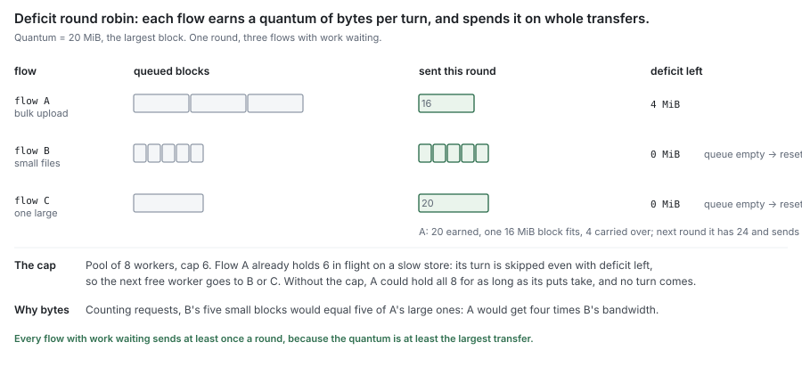
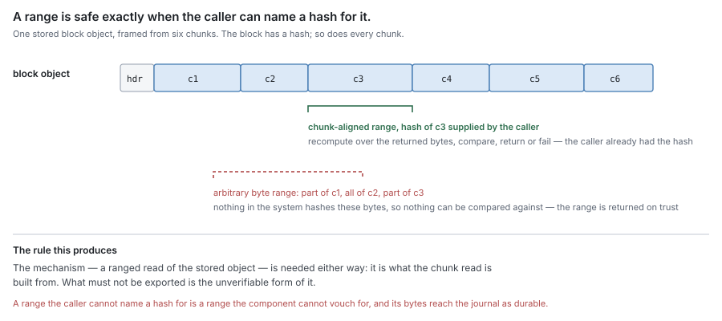
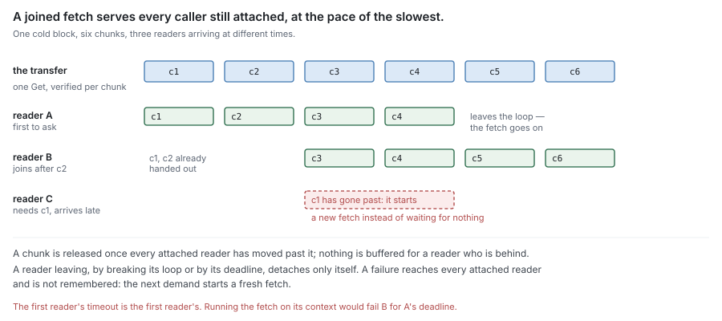

# RFC 3 — the syncer

**Status:** draft.
**Depends on:** [RFC 0](rfc-0-data-lifecycle.md), for the terms and the residency function. [RFC 8](rfc-8-remote-tier.md) specifies
the remote tier this component calls. [RFC 1](rfc-1-journal.md) supplies and receives the bytes.
[RFC 2 §4.2](rfc-2-carver.md#4.2%20A%20block) names the blocks.
**Audience:** anyone changing the component that moves blocks between the journal
and the remote tier.

The key words **MUST**, **MUST NOT**, **SHOULD**, **SHOULD NOT** and **MAY** are
to be interpreted as in RFC 2119.

---

## In short

- The syncer moves whole blocks between the journal and the remote tier. It does
  nothing else.
- It has two halves. The **uploader** puts boxed blocks out. The **fetcher** gets
  remote-only blocks back.
- Each half is a worker pool of configurable size. That pool is the only
  concurrency control, and its size is the memory bound.
- The uploader holds a *reference* into the journal, not a copy. The journal keeps
  those bytes stable until the upload reports.
- The fetcher hands verified bytes to two consumers at once: the journal, which
  fills them, and the engine, which answers the waiting read.
- It names nothing, deletes nothing, decides nothing, and stores nothing.

---

## 1. Purpose

> **Move whole blocks between the journal and the remote tier, in both
> directions, under a bound.**

Every transition to **Resident** in this system originates in an outcome this
component reports ([RFC 0 §4.3](rfc-0-data-lifecycle.md#4.3%20Reporting)). Every transition back from **Remote** to holding
local bytes originates in a fetch it performed.

### 1.1 Non-goals

The syncer **MUST NOT**:

- decide *what* to transfer, or *when*, or *why* — that is flush, eviction and
  readahead policy ([RFC 0 §5.2](rfc-0-data-lifecycle.md#5.2%20Flush), [§8.1](rfc-0-data-lifecycle.md#8.1%20Evict), [RFC 6](rfc-6-engine.md));
- decide what to delete — that is sweep, which calls the remote tier directly
  ([RFC 0 §8.3](rfc-0-data-lifecycle.md#8.3%20Sweep), [RFC 7](rfc-7-gc.md));
- derive a block's name ([RFC 2 §4.2](rfc-2-carver.md#4.2%20A%20block));
- know how an object is framed, transformed or verified ([RFC 8 §3](rfc-8-remote-tier.md#3.%20The%20stored%20object), [§4](rfc-8-remote-tier.md#4.%20The%20transform%20chain), [§6](rfc-8-remote-tier.md#6.%20Reads%20are%20verified%20at%20this%20boundary));
- persist anything;
- know what a file, an [extent](rfc-0-data-lifecycle.md#2.1%20Entities) or a [segment](rfc-0-data-lifecycle.md#2.1%20Entities) is, or which files a block's
  [chunks](rfc-0-data-lifecycle.md#2.1%20Entities) came from. To the syncer a chunk is a hash and its bytes, the unit it
  verifies and streams; where chunk boundaries fall, what refers to a chunk, and
  how chunks were grouped into a block are not its concern.

### 1.2 Two halves, one component

| | uploader | fetcher |
| --- | --- | --- |
| Triggered by | a block finished boxing | a read of bytes held only remotely |
| Reads from | the journal, by reference | the remote tier |
| Writes to | the remote tier | the journal, and the reader waiting on it |
| Limited by | its own worker pool | its own worker pool |
| Work is | known in advance, and unique | demanded, and may be duplicated |

The halves share a component and share nothing else: no pool, no queue, no
counter. Their sizes **MUST** be configurable independently, because they saturate
on different things — uploads on the uplink and on how fast blocks are boxed,
fetches on latency and on how many readers are blocked.

They are one component because they are one obligation seen from two sides:
bounded movement of whole blocks, with the journal at one end and [RFC 8](rfc-8-remote-tier.md)'s contract
at the other. Splitting them would duplicate [§2](#2.%20What%20both%20halves%20obey) into two documents.

### 1.3 Interface

Signatures are indicative; the obligations are normative.

```go
type Chunk struct {
    Hash  Hash   // plaintext content hash
    Bytes []byte // borrowed until the next iteration
}

// Store is what the syncer needs from a backend, declared here and named for
// that need. The engine adapts the remote tier (RFC 8) to it.
type Store interface {
    Put(ctx context.Context, name BlockName, chunks iter.Seq2[Chunk, error]) error
    Get(ctx context.Context, name BlockName, want []ChunkRef) iter.Seq2[Chunk, error] // each chunk verified
    Probe(ctx context.Context) error
}

Register(name string, store Store) (StoreID, error)
OpenFlow(store StoreID) (*Flow, error)

func (f *Flow) Upload(ctx context.Context, name BlockName, src func() iter.Seq2[Chunk, error]) error
func (f *Flow) Fetch(ctx context.Context, name BlockName, want []ChunkRef) iter.Seq2[Chunk, error]
func (f *Flow) Prefetch(ctx context.Context, name BlockName, want []ChunkRef) iter.Seq2[Chunk, error]
func (f *Flow) Healthy() bool
func (f *Flow) Close() error

Close() error // the syncer's own
```

Streams are the standard library's `iter.Seq2`: a caller consumes one with
`for c, err := range`, and leaving the loop early stops the producer.

`Chunk` and `Store` are declared here, in the syncer's own package, as
[RFC 0 §1.2](rfc-0-data-lifecycle.md#1.2%20Component%20autonomy) requires: the syncer imports neither the carver, the journal nor the
remote tier, and is tested with none of them ([§1.4](#1.4%20It%20is%20testable%20on%20its%20own)). `Chunk` is not the
carver's chunk ([RFC 2 §1.2](rfc-2-carver.md#1.2%20Two%20layers%3A%20the%20chunker%20and%20the%20carver)) under another name. The carver's describes where a
chunk sits in a file — offset, length, hash — and hands the bytes separately; this
one is what a transfer carries, a hash and its bytes, and has no file offset. The
engine converts one into the other. `Hash` is a plain `[32]byte`, so not even the
hash type is shared by import. `Store` has no delete: the syncer never deletes
([§1.1](#1.1%20Non-goals)).

**There is one syncer per process.** An installation may configure several
block stores — several buckets, say — and each is registered once. Work reaches
the syncer through a **flow**: a handle bound to one store and to one queue in the
fairness scheduler ([§2.9](#2.9%20Workers%20are%20shared%20fairly%20across%20flows)). A transfer on a flow goes to that flow's store and
waits in that flow's queue, so a transfer cannot be sent to the wrong store, and
a call carries neither a store nor a key. `Flow.Close` takes the flow out of
the scheduler; a call on a closed flow **MUST** fail.

**The syncer does not know what a flow stands for.** It knows stores, flows and
blocks, and nothing about shares, files or tenants. Choosing what is fair against
what is the engine's: it opens one flow per share, on that share's store, and
closes it when the share is removed ([RFC 6](rfc-6-engine.md)). Fairness per tenant, or a separate
flow for pre-warm so it cannot crowd out its own share's reads, would change
which flows the engine opens and nothing here. The engine's share-level code sees
a flow only through an interface the engine declares for its own need
([RFC 0 §1.2](rfc-0-data-lifecycle.md#1.2%20Component%20autonomy)).

One syncer is what the bounds need: the memory bound is a property of the process
([§2.2](#2.2%20The%20pool%20size%20is%20a%20memory%20bound)), and a store's health is a property of all the traffic it carries,
from every flow on it ([§2.8](#2.8%20An%20unhealthy%20store%20refuses%20work)). A syncer per share would state neither.


`name` is the block's name ([RFC 2 §4.2](rfc-2-carver.md#4.2%20A%20block)) and everything [RFC 8 §6.1](rfc-8-remote-tier.md#6.1%20The%20exported%20read%20takes%20the%20expected%20hash)'s
verified read needs. The syncer passes it through and **MUST NOT** interpret it.

**Both directions stream, one chunk at a time.** The object format makes this
possible: one record per chunk, each carrying its own plaintext hash and each
readable on its own ([RFC 8 §3.3](rfc-8-remote-tier.md#3.3%20What%20the%20format%20must%20guarantee), F1, F2, F5), and every transform applies per
chunk ([RFC 9](rfc-9-transforms.md)). A worker therefore never needs the whole block in memory, which
is what sets the bound of [§2.2](#2.2%20The%20pool%20size%20is%20a%20memory%20bound).

**`Upload`** puts the block whose chunks `src` yields from the journal
([§3.2](#3.2%20It%20holds%20a%20reference%2C%20not%20a%20copy)). It hands that stream to the store's `Put`, which frames and transforms
each chunk beneath the syncer; the syncer never sees a transformed byte
([RFC 8 §4.4](rfc-8-remote-tier.md#4.4%20The%20syncer%20MUST%20NOT%20observe%20that%20a%20transform%20happened)). It blocks until a worker is free or
`ctx` ends, which is the backpressure of [§2.3](#2.3%20Backpressure%20propagates%3B%20it%20does%20not%20buffer). It returns `nil` only on a
durable acknowledgement ([§2.6](#2.6%20Durability%20is%20observed%2C%20never%20inferred)); every other ending, an unknown one included
([§2.5](#2.5%20An%20unknown%20outcome%20is%20not%20a%20success)), is an error. A retry calls `src` again for a fresh stream from the first chunk,
so the bytes behind it **MUST** stay stable until `Upload` returns ([§3.3](#3.3%20The%20journal%20keeps%20referenced%20bytes%20stable)). It
**MUST NOT** call `src` after it returns, which is what lets the caller hand the
journal reference back.

**`Fetch`** is a demand: a reader is waiting. **`Prefetch`** is speculation
([§4.4](#4.4%20Speculation%20does%20not%20delay%20demand)): nobody is waiting yet. They are two methods rather than one with a
priority parameter so that which one a call site means is visible at the call
site.

`want` names the chunks the caller needs, each by an opaque `ChunkRef` carrying
its hash and its place in the object, both of which the syncer passes through to
the store. An empty `want` asks for the whole block. A cold random read asks for
only the chunks it covers, and each comes back as its own verified range
([RFC 8 §6.1](rfc-8-remote-tier.md#6.1%20The%20exported%20read%20takes%20the%20expected%20hash)): fetching a 20 MiB block to serve one 4 KiB read is read amplification
with no correctness benefit, since every chunk is verified on its own. Whole
blocks are for sequential scans and pre-warm. When to widen a request from
chunks to the whole block is the engine's policy ([RFC 6 §6.8](rfc-6-engine.md#6.8%20A%20cold%20read%20asks%20for%20chunks%2C%20or%20for%20the%20block)), which asks for
chunks when a read is small and not sequential, and for the whole block when a
read needs much of it or begins a scan.

Both return a stream of chunks, and:

- **every chunk is verified before it is yielded** ([§4.1](#4.1%20One%20fetch%2C%20two%20consumers)); no byte of an
  unverified chunk reaches the caller;
- **`Bytes` is borrowed until the next iteration**, the same rule as
  the carver's `emit` ([RFC 2 §2.2](rfc-2-carver.md#2.2%20The%20bytes%20handed%20to%20%60emit%60%20are%20borrowed)). A caller that keeps bytes copies them;
- **an error is yielded once and ends the stream; chunks already yielded stay
  valid**, because each was verified on its own;
- **leaving the loop, or cancelling `ctx`, detaches the caller** — from its own
  fetch, or only from a joined one ([§4.3](#4.3%20Concurrent%20demand%20for%20one%20block%20is%20one%20fetch)). There is no `Close` to forget.

**`Close`** stops accepting work and returns once every transfer in flight has
ended, which [§2.4](#2.4%20Every%20transfer%20terminates%2C%20and%20reports) bounds. A call after `Close` **MUST** fail.

There is no delete ([§1.1](#1.1%20Non-goals)). Health is not a method here: the syncer probes each
store itself and refuses work for an unhealthy one; `Healthy` reports the result ([§2.8](#2.8%20An%20unhealthy%20store%20refuses%20work)).

### 1.4 It is testable on its own

The syncer's dependencies are exactly four, and each is supplied, never reached
for:

| Dependency | Supplied as | In a test |
| --- | --- | --- |
| a backend | the `Store` interface of [§1.3](#1.3%20Interface) | a fault-injecting fake |
| the bytes to upload | the `src` closure passed to `Upload` | a closure over a byte slice |
| time | the Go runtime clock | `testing/synctest`, which runs the clock virtually |
| logging | a `*slog.Logger` | a handler that records the lines |

No journal, no carver, no metadata store, no engine, no disk and no network.
A conformance check **MUST** be writable as: build a syncer over a fake store,
call it, assert on what the fake saw and what came back. An implementation that
picks up another dependency loses that, and **MUST NOT**.

**Time is virtual in tests.** The probe interval, the unhealthy log interval,
retry backoff and every `ctx` deadline run inside a `synctest` bubble, where time
advances only when every goroutine is blocked. A check of the 60-second log line
([§2.8](#2.8%20An%20unhealthy%20store%20refuses%20work)) runs in microseconds and gives the same answer every time. The syncer
therefore **MUST NOT** read time from anywhere a bubble cannot fake — no clock
handed in from outside, no timer owned by another package. A check that sleeps on
the real clock is slow, and on a loaded machine it fails for reasons that have
nothing to do with the syncer.

**The fake store is the fixture every check shares.** Per call it can:

- take a set latency and a set time per byte, so the pool binds ([§7.3](#7.3%20What%20must%20not%20stand%20in));
- fail transiently or terminally, once or every time;
- **commit and then lose the response** — the unknown outcome of [§2.5](#2.5%20An%20unknown%20outcome%20is%20not%20a%20success);
- stop part-way through a put, or corrupt one chunk of a get;
- hold every call until the test releases it;
- fail or pass the probe.

And it records: calls in flight, per store and per flow, and their peak (S1,
S17); the order calls reached it (S13, S18); attempts per block; bytes it holds.

**Memory is checked by holding, then measuring.** With every call held and every
pool full, the heap in use above the idle baseline **MUST** stay within the bound
of [§2.2](#2.2%20The%20pool%20size%20is%20a%20memory%20bound) plus a stated slack. Blocks tens of MiB in size make the runtime's own
noise negligible against the bound.

The fake covers the syncer's logic. It does not cover the adapter from the remote
tier to `Store`, nor a real backend's failure modes; those run the same checks
against MinIO in a container ([§7.3](#7.3%20What%20must%20not%20stand%20in)).

## 2. What both halves obey

### 2.1 A worker pool is the only concurrency control

Each half **MUST** be a pool of a configured size, and that size **MUST** be the
only thing limiting how many transfers are in flight. An implementation **MUST
NOT** add a second limiter — a queue depth, a rate limit, a token bucket — whose
interaction with the pool size is unstated.

Two limits that can each be the binding one produce a system whose throughput has
no single explanation, and the one an operator tunes is whichever is not binding.

The per-flow cap of [§2.9](#2.9%20Workers%20are%20shared%20fairly%20across%20flows) is not a second limiter in this sense: it is
a fixed fraction of the pool ([§2.10](#2.10%20Two%20settings%2C%20and%20everything%20else%20fixed)), so the pool size still determines it.

### 2.2 The pool size is a memory bound

Each worker runs one transfer at a time, and a streaming transfer holds only the
record it is working on: one chunk, transformed and framed ([§1.3](#1.3%20Interface)). A chunk is
at most `Max` ([RFC 2](rfc-2-carver.md), B3), so:

`peak memory of a half = pool size × (chunk Max + one record's framing)`

That holds only if nothing on the path buffers the whole object. Where a stage
does — a backend SDK that needs the body in memory to sign or retry it — the
per-transfer figure is the largest block instead, the block target plus one chunk
([RFC 2 §5](rfc-2-carver.md#5.%20Packing%3A%20three%20rules%2C%20not%20a%20component), P2). An implementation **MUST** state which applies to each backend it
uses, and **MUST** be able to state the resulting number for its configuration,
because it is what an operator sizes the pools from ([§8](#8.%20Open%20questions)). The whole process's
bound is the uploader's number plus the fetcher's.

The limit belongs to the syncer, not to each backend, because memory runs out for
the whole process, not for one backend. A limit set per backend cannot bound the
process. Several shares can use the same backend, so its limit would have to cover
all their traffic together, and one share's traffic can go to more than one
backend, so no single backend's limit covers it. Only a limit set where all the
transfers happen, in the syncer, adds up to a number the process can hold.

### 2.3 Backpressure propagates; it does not buffer

When a pool is full, the caller **MUST** wait or be refused. An implementation
**MUST NOT** accept work into an unbounded queue, and **MUST NOT** introduce a
buffer whose size is not configured.

The chain this preserves runs the whole depth of the system:

remote slows → the pool saturates → flush stalls → dirty [extents](rfc-0-data-lifecycle.md#2.1%20Entities) are not released
→ the journal approaches capacity → writes are refused ([RFC 0 §10.1](rfc-0-data-lifecycle.md#10.1%20Capacity%20is%20a%20bound%2C%20not%20a%20target))

Refusing a write is the specified outcome. An unbounded queue at any link replaces
it with unbounded memory growth, and the process dies instead of declining work.


### 2.4 Every transfer terminates, and reports

Every transfer **MUST** complete in bounded time with either success or a failure
reported to its caller. No transfer retries indefinitely.

An implementation **SHOULD** distinguish transient failures (timeout, throttle,
connection reset) from terminal ones (malformed request, rejected credentials,
absent bucket) and retry only the former, within a stated bound. Misclassification
either way is recoverable, because both paths end in a report. A throttling
response — S3's `503 SlowDown`, returned while it scales a prefix past its
request rate — is transient.

**Bounded time is enforced by throughput, not by a fixed deadline.** A fixed
per-transfer timeout is too short for a maximum-size block on a slow link and far
too long for a connection that has stopped moving. A transfer **MUST** instead
fail when its throughput stays below a stated floor for a stated interval, the
rule curl applies as `--speed-limit` / `--speed-time` and the AWS Common Runtime
S3 client applies by default (at least 1 byte per second over 30 seconds). Time to
the first byte is bounded separately, since a request can stall before any byte
moves.

**A slow tail is retried, not waited out.** Following AWS's guidance for S3
("aggressive timeouts and retries help drive consistent latency"), a transfer
whose first byte is later than a bound derived from recent latency — the AWS
Common Runtime client starts from the 90th percentile — **SHOULD** be cancelled and
retried on a new connection, within the retry bound. Sending a second request
alongside the first and taking whichever answers ("hedging", Dean and Barroso,
*The Tail at Scale*, 2013) cuts tail latency further at a few percent more
requests; it is deferred until a measurement of cold-read latency asks for it.

**The syncer is the only layer that retries.** A backend's client makes one
attempt per call and returns its error ([RFC 8 §5.7.1](rfc-8-remote-tier.md#5.7.1%20Deviation%20%E2%80%94%20the%20SDK%20retries%20inside%20the%20store)). Retrying is
state across operations, which is the syncer's ([RFC 8 §2.1](rfc-8-remote-tier.md#2.1%20The%20rule%3A%20one%20operation%2C%20or%20many)); two layers
that each retry multiply into a number of attempts nobody stated. A streamed body
also cannot be rewound by a client that has already sent part of it: only the
syncer, which can call `src` again ([§1.3](#1.3%20Interface)), can retry one.

### 2.5 An unknown outcome is not a success

A transfer can end with its outcome genuinely unknown: the request was sent, the
response was lost. The syncer **MUST** resolve that as *not durable* and report it
as a failure.

It happens on every network backend. A put is sent and S3 writes the object, then
the connection resets, or the client's timeout fires, before the response
arrives. The object exists and the syncer cannot know it. Equally, the request
may have died on the way out and nothing exists. Both look the same from the
client.

This is safe only because a block's name is a function of its content ([RFC 2](rfc-2-carver.md)
[§4.2](rfc-2-carver.md#4.2%20A%20block)), which makes the retry idempotent — the same bytes to the same name,
indistinguishable from having written them once.


### 2.6 Durability is observed, never inferred

The syncer **MUST** report durability only on the acknowledgement [RFC 8 §5.6](rfc-8-remote-tier.md#5.6%20What%20acknowledgement%20means%20is%20the%20backend%27s%20to%20declare)
defines for the backend in use. None of the following is evidence, and an
implementation **MUST NOT** report durability on any of them:

| Not evidence | Why it looks like evidence |
| --- | --- |
| the call returned | it returned from a buffer, not from storage |
| no error was observed | an error that is never delivered is not an absence of error |
| the bytes were all sent | sent is not stored |
| enough time has passed | time is not an acknowledgement |
| a later read succeeded | the read may be served from a cache the write populated |

What acknowledgement means is declared per backend ([RFC 8 §5.6](rfc-8-remote-tier.md#5.6%20What%20acknowledgement%20means%20is%20the%20backend%27s%20to%20declare)):

| Backend | Durable acknowledgement |
| --- | --- |
| AWS S3 | a successful `PutObject` response: S3 answers only once the object is stored redundantly, and a read after it sees the object |
| S3-compatible services | the same response, **only** where the provider promises the same; each store declares it with its `durable` setting, and one that does not promise it is configured not durable |
| in-memory store | never: it is a test fixture and loses everything on exit |

### 2.7 It reports; it does not persist

The syncer **MUST NOT** persist durability, residency or health. It returns what
it observed; [RFC 4](rfc-4-block-metadata.md) records it and [RFC 1](rfc-1-journal.md) is told ([RFC 0 §4.3](rfc-0-data-lifecycle.md#4.3%20Reporting)).

A syncer that kept its own durable record of what it moved would introduce a third
oracle, which disagrees with the other two after any crash, and nothing in the
residency model resolves a three-way disagreement.

### 2.8 An unhealthy store refuses work

A store's health belongs to the store. Every backend exposes a liveness probe —
one round trip, no state ([RFC 8 §5.8](rfc-8-remote-tier.md#5.8%20The%20liveness%20probe%20is%20one%20operation)) — and the syncer calls it to decide
whether the store is **healthy** or **unhealthy**:

- the syncer **MUST** probe every registered store at a configured interval, and
  **SHOULD** probe at once when a transfer to it fails transiently ([§2.4](#2.4%20Every%20transfer%20terminates%2C%20and%20reports));
- a failed probe makes the store unhealthy; a successful one makes it healthy;
- an unhealthy store **MUST** keep being probed. Once transfers stop, the probe
  is the only thing that can observe recovery, so without it unhealthy would be
  the latch [§5](#5.%20What%20belongs%20elsewhere) forbids.

**An unhealthy store refuses work.** `Upload`, `Fetch` and `Prefetch` targeting it
**MUST** fail at once, before taking a worker and without calling the backend.
Retrying a request the syncer already knows will fail spends a worker, a round
trip and a timeout to learn nothing, and a pool full of such retries stalls every
flow on every other store. The refusal is cheap and certain; the probe, not the
traffic, is what finds out when the store is back.

A transfer already running when the store turns unhealthy is left alone. It
succeeds or fails on its own, within [§2.4](#2.4%20Every%20transfer%20terminates%2C%20and%20reports)'s bound; nothing cancels a put
mid-flight.

`Flow.Healthy` reports the current state of the flow's store. It reads memory and never calls the
backend, so a caller can check it before doing work that would end in a refused
upload — the engine skips carving and packing a flush for a store it would
refuse ([RFC 6 §8.1](rfc-6-engine.md#8.1%20Health%20is%20derived%20from%20recent%20outcomes%2C%20flush%20included)). The state is re-derived from the next probe, so it is not
persisted ([§2.7](#2.7%20It%20reports%3B%20it%20does%20not%20persist)).

Only the flows on that store are affected — with one flow per share, only that
store's shares. For them:

- a read that needs the store fails at once;
- a write still lands in the journal, and is refused once the journal fills
  ([RFC 0 §10.1](rfc-0-data-lifecycle.md#10.1%20Capacity%20is%20a%20bound%2C%20not%20a%20target)), so an outage shorter than the journal's headroom costs writers
  nothing.

Every other flow carries on.

#### What an unhealthy store logs

It **MUST** be obvious from the logs, and logging it **MUST NOT** cost in
proportion to the traffic it refuses. So the syncer logs the store, not the calls:

| When | Level | One line carrying |
| --- | --- | --- |
| the store turns unhealthy | error | the store's name, the probe's error, the last transfer error |
| every configured interval while unhealthy | warn | the store's name, how long it has been unhealthy, the latest probe error, how many uploads and fetches were refused since the last line |
| the store turns healthy | info | the store's name, how long it was unhealthy, how many calls were refused in total |

Nothing else about it is logged at info or above: not each failed probe, not each
refused call. Counts are counters, incremented without formatting anything, and
read only when a line is written. The volume is two lines per outage plus one per
interval, whatever the load.

A refused call returns an error that names the store and wraps the probe's
error, so the caller can tell an unhealthy store from a failed transfer without
logging its own diagnosis. A caller **SHOULD** log such an error at debug at
most: the syncer's lines are the record of the outage.

### 2.9 Workers are shared fairly across flows

One pool serves every flow ([§1.3](#1.3%20Interface)), so the order in which waiting transfers
get a worker decides whether one flow can starve another. Arrival order cannot
be used: a flow with a backlog of a million uploads would put every other
flow's read behind all of them. Neither can a pool per flow, whose total grows
with the number of flows and breaks [§2.2](#2.2%20The%20pool%20size%20is%20a%20memory%20bound).

The design is taken whole from two sources rather than invented:
**Deficit Round Robin** (Shreedhar and Varghese, SIGCOMM 1995), the scheduler Linux
traffic control ships as `tc-drr`, and the queuing around it from **Kubernetes API
Priority and Fairness** (KEP-1040), which solves the same problem: one shared
concurrency pool, many flows, none allowed to starve another. APF's term is
used here for the same reason: a flow is whatever the caller wants kept apart.

Each half runs its own scheduler over its own pool:

- **One queue per flow.** A transfer waits in its flow's queue, never in a
  global one.
- **Turns are in bytes, not requests.** When a worker frees, the scheduler visits
  the next flow with work waiting, adds a **quantum** of bytes to that flow's
  **deficit**, and dispatches from the head of its queue while the head's size
  fits within the deficit, subtracting each one's size. A flow whose queue
  empties has its deficit reset to zero. A transfer is charged its size: an
  upload's is known, a fetch is charged the block's size from metadata, or the
  largest block size ([§2.2](#2.2%20The%20pool%20size%20is%20a%20memory%20bound)) when that is unknown. A flow sending large blocks
  therefore gets no more bandwidth than one sending small ones.
- **The quantum is at least the largest block**, so every flow with work
  waiting dispatches at least once per round. Each dispatch costs O(1).
- **Within a flow, demand goes before speculation** ([§4.4](#4.4%20Speculation%20does%20not%20delay%20demand)). The scheduler
  picks the flow; the flow's queue picks the transfer.
- **No flow holds more than a configured cap of the pool's workers at once**,
  stated as a fraction of the pool (after APF's borrowing limit). Fair turns only
  decide who gets the *next* free worker: without the cap, a flow whose store is
  slow but healthy can hold every worker for as long as its puts take, and no
  turn comes round. The cap is not a reservation. A flow alone on the system uses
  up to the cap, and no worker sits idle waiting for a flow that has no work.
- **Each queue has a configured length.** A call that finds its flow's queue full
  **MUST** be refused, as APF refuses with 429. Waiting outside the queue would be
  an unbounded queue under another name ([§2.3](#2.3%20Backpressure%20propagates%3B%20it%20does%20not%20buffer)). The refusal travels back to
  whoever opened the flow — with one flow per share, that share's journal — and
  no other flow's work is refused because of it.
- **A waiting transfer leaves its queue when its `ctx` ends**, and a transfer to
  an unhealthy store never enters one ([§2.8](#2.8%20An%20unhealthy%20store%20refuses%20work)).

A transfer at the head of its flow's queue is therefore dispatched within one
round: at most one turn for each other flow with work waiting.



All flows have equal weight. Weighting one flow over another is DRR's
per-flow quantum and needs no other change; it is left out until an operator
needs it.

### 2.10 Two settings, and everything else fixed

The syncer exposes exactly two settings, both process-wide:

| Setting | Sizes | Default |
| --- | --- | --- |
| `upload_workers` | the uploader's pool | 32 |
| `fetch_workers` | the fetcher's pool | 32 |

Neither default follows the CPU count. A transfer spends its time waiting on the
network, so the count that keeps a link busy follows latency and bandwidth: by
Little's law, workers ≈ throughput × time per transfer ÷ block size. At a 200 ms
transfer of a 16 MiB block, 32 workers sustain about 2.5 GiB/s, beyond most links.
Deriving it from cores would also scale memory with cores — 128 fetchers on a
64-core host is 2 GiB at a 16 MiB chunk `Max` — while a small VM on a fast link
gets too few.

Each is a memory budget as much as a concurrency limit ([§2.2](#2.2%20The%20pool%20size%20is%20a%20memory%20bound)), and the
documentation of each **MUST** state the memory it implies at the configured
chunk `Max`. Both are fixed for the life of the process: the pool does not adapt
([§8](#8.%20Open%20questions), question 2).

Everything else the syncer needs is derived or fixed, and **MUST NOT** be a
setting:

| Value | Is | Because |
| --- | --- | --- |
| DRR quantum | the largest block: block target plus chunk `Max` | [§2.9](#2.9%20Workers%20are%20shared%20fairly%20across%20flows) needs it to be at least that, and nothing is gained above it |
| per-flow cap | three quarters of the pool, at least one worker | leaves a quarter for every other flow while letting a flow alone use most of the pool |
| per-flow queue length | four times the pool | a waiting transfer holds a reference, not bytes ([§3.2](#3.2%20It%20holds%20a%20reference%2C%20not%20a%20copy)), so the length bounds bookkeeping, not memory |
| probe interval | 5 s, healthy or not | one interval; one failed probe is unhealthy, one success healthy ([§2.8](#2.8%20An%20unhealthy%20store%20refuses%20work)) |
| unhealthy log interval | 60 s | [§2.8](#2.8%20An%20unhealthy%20store%20refuses%20work)'s summary line |
| retry bound | the syncer's own, stated in code | [§2.4](#2.4%20Every%20transfer%20terminates%2C%20and%20reports), [§8](#8.%20Open%20questions) question 5 |

Each fixed value becomes a setting only when a measurement shows the fixed value
is wrong for a workload an operator can name. A setting nobody can reason about
is tuned by trial, and a wrong value shows up as a stall with no stated cause.

Read-ahead depth, pre-warm pacing and when to flush are policy and belong to
[RFC 6](rfc-6-engine.md), not here. Chunk and block sizes belong to [RFC 2](rfc-2-carver.md).

### 2.11 Pool sizes are measured once, by a tool

The pools do not adapt at runtime. The documented way to size them is a separate
tool that measures a store and prints the two settings; the operator writes them
into the configuration, and they hold for the life of the process ([§2.10](#2.10%20Two%20settings%2C%20and%20everything%20else%20fixed)).
A number printed once can be checked against a real bucket. A controller that
resizes the pool while serving can only be judged by watching it, and its worst
failure — a pool that shrinks during a slowdown — looks like a slow network from
outside.

The tool measures **pure transfer**. It drives the store's own put, get and
delete ([RFC 8 §5.1](rfc-8-remote-tier.md#5.1%20Operations)) with random bytes the size of the largest block, and passes
nothing through the transform chain. It is one implementation on top of the
backend contract, not a method each backend provides: a speed test is many
transfers, and the backend knows only one ([RFC 8 §2.1](rfc-8-remote-tier.md#2.1%20The%20rule%3A%20one%20operation%2C%20or%20many)).

It **MUST**:

- **measure puts and gets separately**, at doubling concurrency (1, 2, 4, …), and
  take for each the smallest concurrency past which throughput stops rising by a
  stated margin;
- **build the store with a client no smaller than its highest concurrency step**
  ([RFC 8 §5.9](rfc-8-remote-tier.md#5.9%20A%20backend%27s%20client%20never%20queues%20below%20the%20pools)), so what it measures is the link and the service, never
  a queue inside the client;
- **print the pool size, not the knee.** One flow holds at most three quarters
  of a pool ([§2.10](#2.10%20Two%20settings%2C%20and%20everything%20else%20fixed)), so a flow alone reaches the knee only in a pool of
  at least the knee ÷ 0.75;
- **print the memory each size implies** at the configured chunk `Max` ([§2.2](#2.2%20The%20pool%20size%20is%20a%20memory%20bound)),
  and cap the recommendation at a memory budget when one is given;
- **with several stores, measure each and print the largest**, since one pool
  serves them all;
- **write only under a scratch prefix no share uses, and delete what it wrote**,
  including after an interrupted run.

How a run proceeds — step length, warm-up, the stopping rule and the output —
is [Appendix A](#Appendix%20A.%20Running%20the%20pool-sizing%20tool).

Its result describes this host, this link and this time of day. It says so, and
nothing re-runs it automatically.

It does not see CPU. Where compression and encryption cannot keep up with the
printed pool size ([RFC 9](rfc-9-transforms.md)), the pool is larger than the process can use, and
only memory is wasted; measuring the transforms' throughput is RFC 9's.

## 3. The uploader

### 3.1 It is triggered, not scheduled

A block becomes the uploader's work when it has finished boxing. The uploader
**MUST NOT** decide which blocks to box, when to box them, or in what order to
take them.

### 3.2 It holds a reference, not a copy

The uploader **MUST** take a reference to the block's bytes in the journal and
read them, chunk by chunk, while a worker transfers the block. It **MUST NOT**
copy the block into memory when the block is queued.

The reference is to the bytes **as offered for flush**, not to the file as it is
now. A client may overwrite an extent while its block waits for a worker
([RFC 1 §3.3](rfc-1-journal.md#3.3%20Flush)); a reference by file offset would then read the newer bytes, whose
hash is not the block's. So the engine describes a block as a plan — its name and,
per chunk, a hash and where its bytes sit in the offered version — and `src` reads
the plan through the journal's `offered` readers, which keeps returning the offered
bytes until the flush callback returns ([RFC 6 §5.1](rfc-6-engine.md#5.1%20Blocks%20are%20assembled%20here%2C%20as%20a%20fold%20over%20the%20carver%27s%20output)). A block may hold chunks of
several files ([RFC 6 §5.7](rfc-6-engine.md#5.7%20A%20block%20packs%20chunks%2C%20whichever%20files%20they%20came%20from)), so one plan may read through several files'
readers. The syncer sees none of this: to it, `src` is a stream of chunks, and a
block is the same thing whether its chunks came from one file or from a hundred.

The difference is the bound of [§2.2](#2.2%20The%20pool%20size%20is%20a%20memory%20bound). A copy taken at queue time is held for the
whole time the block waits for a worker, so peak memory follows the queue depth;
a reference is materialised only while a worker is transferring, so it follows the
pool size.


### 3.3 The journal keeps referenced bytes stable

While a reference is outstanding, the journal **MUST NOT** release, overwrite,
relocate or compact the bytes it names, and **MUST** free them once the uploader
reports.

This is the other half of [§3.2](#3.2%20It%20holds%20a%20reference%2C%20not%20a%20copy) and it is a requirement on [RFC 1](rfc-1-journal.md), not on this
component. A reference into storage that may move underneath it is a copy with
extra steps and a race.

### 3.4 One put per block

A block is transferred by a single put of the whole block ([RFC 8 §5.1](rfc-8-remote-tier.md#5.1%20Operations)). A put that
does not complete **MUST NOT** leave the block retrievable and **MUST NOT** be
reported durable.

Where a backend transfers in parts, durability is the completion of the whole and
**MUST NOT** be inferred from the parts.

The uploader **MUST NOT** use multipart uploads. A block is at most the block
target plus one chunk `Max` ([§2.2](#2.2%20The%20pool%20size%20is%20a%20memory%20bound)), tens of MiB, and a single put carries that
comfortably. Multipart pays off when one object is large enough that a single
stream cannot fill the link. Here the pool already runs several puts at once, so
the link is filled across blocks instead of within one. Multipart would also add
a capability every backend must advertise, and a create–part–complete sequence
whose abandoned uploads leave parts that are billed and invisible to a listing.
Revisit if a measurement shows one put of a maximum-size block cannot saturate
the uplink even with the pool full.

**The put's length is the backend's problem, not the uploader's.** S3 needs an
object's length before its first byte, and compression makes the framed length
unknown until the last chunk is transformed. Framing and transforms happen below
the syncer ([RFC 8 §4.4](rfc-8-remote-tier.md#4.4%20The%20syncer%20MUST%20NOT%20observe%20that%20a%20transform%20happened)), so the S3 backend resolves it: it streams
the framed records into a local spool file and puts the file, whose length is
then known. The spool is on disk, so the memory bound of [§2.2](#2.2%20The%20pool%20size%20is%20a%20memory%20bound) holds; it costs
one local write and read per block, and disk of at most the pool size times the
largest block. Transforming twice — once to count, once to send — would avoid the
disk and double the transform CPU; the spool is chosen because the link, not
local disk, is what a block upload waits on. A backend that accepts a put of
unknown length needs no spool.

### 3.5 The bytes are stable for the duration

The bytes a put transfers **MUST NOT** change while it runs. [§3.3](#3.3%20The%20journal%20keeps%20referenced%20bytes%20stable) supplies that
for a journal reference; an implementation that transfers from anywhere else
**MUST** supply it some other way. As a second line, `src` recomputes each
chunk's hash as it reads and fails the transfer on a mismatch
([RFC 6 §5.1](rfc-6-engine.md#5.1%20Blocks%20are%20assembled%20here%2C%20as%20a%20fold%20over%20the%20carver%27s%20output)): a violation becomes a refused put, not a misnamed object.

The name is a function of the content ([RFC 2 §4.2](rfc-2-carver.md#4.2%20A%20block)), so content that changes mid
transfer produces an object whose bytes do not match its name, and every later
verification of that object fails.

## 4. The fetcher

### 4.1 One fetch, two consumers

A fetch of a block held only remotely produces verified chunks ([RFC 8 §6.1](rfc-8-remote-tier.md#6.1%20The%20exported%20read%20takes%20the%20expected%20hash)),
one at a time, for two consumers:

- the **journal**, which fills them so the next read is local ([RFC 0 §2.3](rfc-0-data-lifecycle.md#2.3%20Operations));
- the **engine**, which answers the read that caused the fetch.

Both **MUST** read the same bytes and neither **MAY** modify them. Each chunk is
verified before either sees it, which is what makes one buffer safe for two
readers. A reader waiting on one chunk of the block is answered when that chunk
arrives, not when the whole block has.



### 4.2 The reply neither waits on the fill nor fails with it

The engine **MUST** be able to answer its read as soon as the bytes are verified,
and a failed fill **MUST NOT** fail the read.

A fill that fails means the block is not cached locally. The bytes are correct —
they were verified — so withholding them, or failing a client's read because a
cache write failed, converts a performance problem into an error.

### 4.3 Concurrent demand for one block is one fetch

When a fetch for a block is already in flight, a second demand for that block
**MUST** join it rather than start another.

Without this, N readers arriving together on one cold block cost N transfers, N
blocks against the [§2.2](#2.2%20The%20pool%20size%20is%20a%20memory%20bound) bound, and N fills of identical bytes. The uploader needs
no equivalent rule, because a boxed block is work that exists once.

Joining is where the difficulty is, and each of these is required:

- **The fetch is keyed by block and chunk.** Two readers of one chunk join, wherever
  in the chunk each read starts; a reader of the whole block joins any fetch of
  the chunks it covers. The chunk, not the byte offset, is the unit of joining.
- **One caller leaving does not cancel it.** A joined fetch runs while any caller
  still waits on it. The first reader's timeout **MUST NOT** fail the others.
- **A failure reaches every caller and is not kept.** Each joined caller gets the
  error; the next demand after it starts a fresh fetch. A remembered failure is a
  latch ([§5](#5.%20What%20belongs%20elsewhere)).
- **A demand joining a speculative fetch promotes it.** From then on it is a
  demand and [§4.4](#4.4%20Speculation%20does%20not%20delay%20demand) applies to it as one; a reader **MUST NOT** wait at
  speculative priority because a guess got there first.
- **A joined stream moves at the pace of its slowest caller.** A chunk is
  released once every attached caller has moved past it; nothing is buffered
  for a caller that is behind ([§2.3](#2.3%20Backpressure%20propagates%3B%20it%20does%20not%20buffer)). A caller that stops reading stalls the
  others until it leaves the loop or its `ctx` ends.
- **A late caller gets what is still to come.** It receives the chunks not yet
  delivered when it joined. If the chunk it needs has already gone past, it
  starts a new fetch rather than waiting for one that will never bring it.



### 4.4 Speculation does not delay demand

A fetch is **demanded** when a reader is blocked on it and **speculative**
otherwise: read-ahead or pre-warm ([§4.5](#4.5%20Speculation%20is%20executed%20here%20and%20decided%20elsewhere), [RFC 0 §2.3](rfc-0-data-lifecycle.md#2.3%20Operations)). A speculative fetch **MUST NOT** delay a demanded one, and **MUST** be
abandonable without failing any read.

A single queue serving both, first come first served, makes a client wait behind a
guess. Sharing one pool is permitted; sharing one arrival order is not.

### 4.5 Speculation is executed here and decided elsewhere

The fetcher executes fetches. Which blocks are worth fetching before they are
asked for is policy, and belongs with the component that sees the access pattern
and the free capacity ([RFC 6](rfc-6-engine.md)). Two kinds exist and they differ in more than scale:

| | read-ahead | pre-warm |
| --- | --- | --- |
| Triggered by | an observed access pattern | an explicit request |
| Size | the next few blocks | up to a whole subtree |
| A reader is waiting | soon, probably | no |
| Abandoning it costs | a later demand fetch | the request, which can be reissued |

So the syncer's speculation surface is mechanism only: `Prefetch`, and
cancellation through its context ([§1.3](#1.3%20Interface)). It takes no hint about what to
fetch next and keeps no access history.

Both are speculative under [§4.4](#4.4%20Speculation%20does%20not%20delay%20demand). Pre-warm carries one further obligation, because
it is the only speculative work large enough to matter: filling consumes journal
capacity, and the journal refusing writes is a specified outcome ([RFC 0 §10.1](rfc-0-data-lifecycle.md#10.1%20Capacity%20is%20a%20bound%2C%20not%20a%20target)).
Pre-warm **MUST NOT** drive the journal into that state, and **MUST** yield
capacity to writes and to demanded fetches rather than compete with them.

A pre-warm that fills the cache until writes start failing has traded a cold read
for an outage.

## 5. What belongs elsewhere

| Concern | Owner |
| --- | --- |
| A block's name | [RFC 2 §4.2](rfc-2-carver.md#4.2%20A%20block) |
| Framing, transforms, verification, the error set | [RFC 8 §3](rfc-8-remote-tier.md#3.%20The%20stored%20object), [§4](rfc-8-remote-tier.md#4.%20The%20transform%20chain), [§5.2](rfc-8-remote-tier.md#5.2%20Errors%20are%20a%20closed%20set), [§6](rfc-8-remote-tier.md#6.%20Reads%20are%20verified%20at%20this%20boundary) |
| What a durable acknowledgement is, per backend | [RFC 8 §5.6](rfc-8-remote-tier.md#5.6%20What%20acknowledgement%20means%20is%20the%20backend%27s%20to%20declare) |
| Recording durability and residency | [RFC 4](rfc-4-block-metadata.md) |
| Keeping referenced bytes stable; filling fetched ones | [RFC 1](rfc-1-journal.md) |
| Deleting a remote block | [RFC 7](rfc-7-gc.md), calling [RFC 8](rfc-8-remote-tier.md) directly |
| What to box, when to flush, what to evict, what to read ahead or pre-warm | [RFC 6](rfc-6-engine.md) |
| Whether the system keeps accepting writes when the remote is unavailable | RFC 6 |
| A share's health, from its store's state and its own flush outcomes | [RFC 6 §8.1](rfc-6-engine.md#8.1%20Health%20is%20derived%20from%20recent%20outcomes%2C%20flush%20included) |

**Health is probed, never stored as a flag.** A store's health is what its probe
last said ([§2.8](#2.8%20An%20unhealthy%20store%20refuses%20work)). A share's health is the engine's, computed from the store's
state together with the outcomes of its own flushes ([RFC 6 §8.1](rfc-6-engine.md#8.1%20Health%20is%20derived%20from%20recent%20outcomes%2C%20flush%20included)).

Neither **MAY** be a "remote is down" flag that stops attempts until something
clears it. Once attempts stop, none can succeed, so nothing ever sees the remote
come back: a five-minute outage becomes permanent. A probe that keeps running
while the store is unhealthy is what makes it recover on its own.


## 6. Invariants

| # | Invariant |
| --- | --- |
| S1 | In-flight transfers per half never exceed that half's configured pool size. |
| S2 | Peak memory per half is at most the pool size times the per-transfer figure [§2.2](#2.2%20The%20pool%20size%20is%20a%20memory%20bound) states. |
| S3 | Backpressure reaches the caller; no unbounded queue exists. |
| S4 | Every transfer ends in a success or a reported failure, in bounded time. |
| S5 | An unknown outcome is reported as not durable. |
| S6 | Durability is reported only on an acknowledgement that means durable. |
| S7 | The syncer persists nothing. |
| S8 | Bytes referenced by an in-flight upload do not change or move. |
| S9 | A partially transferred block is never retrievable and never reported durable. |
| S10 | Every fetched chunk is verified before any consumer sees it. |
| S11 | A read is answered independently of whether its fill succeeded. |
| S12 | Concurrent demand for one block produces one fetch. |
| S13 | A demanded fetch is never delayed by a speculative one. |
| S14 | A call to an unhealthy store fails without taking a worker or calling the backend. |
| S15 | An unhealthy store is probed until it is healthy. |
| S16 | Log volume while a store is unhealthy does not grow with traffic. |
| S17 | No flow holds more workers of a half than its cap. |
| S18 | A transfer at the head of its flow's queue is dispatched within one round of the other waiting flows. |

S5, S6, S8, S9 and S10 are the ones whose violation loses data. S1, S2, S3 and S13
are the ones whose violation stops the system, or makes it look stopped; S14, S15,
S17 and S18 are the ones whose violation spreads one store's or one flow's
trouble to others, or makes it permanent.

## 7. Conformance

Conformance is every **MUST** holding. The checks below are evidence for the ones
that fail *silently*, and a check is validated by reverting the code and watching
it fail on its own assertion.

Every check in [§7.1](#7.1%20Group%20A%20%E2%80%94%20silent%20data%20loss) requires a backend that can lose, corrupt, delay and
half-complete. A backend that always succeeds asserts nothing about any of them.

### 7.1 Group A — silent data loss

| Requirement | Check |
| --- | --- |
| [§2.5](#2.5%20An%20unknown%20outcome%20is%20not%20a%20success) unknown is failure | Drop the response of a put the backend committed; assert failure is reported, then that the retry produces one object, not two. |
| [§2.6](#2.6%20Durability%20is%20observed%2C%20never%20inferred) no inference | Drive a backend that acknowledges before committing and then loses the write; assert nothing was reported durable. |
| [§3.4](#3.4%20One%20put%20per%20block) partial put | Interrupt a transfer; assert the name is not retrievable and was not reported durable. |
| [§3.3](#3.3%20The%20journal%20keeps%20referenced%20bytes%20stable), [§3.5](#3.5%20The%20bytes%20are%20stable%20for%20the%20duration) stability | Release or overwrite the referenced journal bytes during a transfer; assert the journal refuses, and that no stored object ever disagrees with its name. |
| [§4.1](#4.1%20One%20fetch%2C%20two%20consumers) verification | Corrupt the fetched bytes; assert no byte reaches either consumer. |
| [§4.2](#4.2%20The%20reply%20neither%20waits%20on%20the%20fill%20nor%20fails%20with%20it) reply independence | Fail the fill; assert the read is still answered, and answered correctly. |

### 7.2 Group B — wedging and unbounded resource use

| Requirement | Check |
| --- | --- |
| [§2.1](#2.1%20A%20worker%20pool%20is%20the%20only%20concurrency%20control) one limiter | Saturate each half; assert in-flight never exceeds its pool size and that no other limit binds first. |
| [§2.2](#2.2%20The%20pool%20size%20is%20a%20memory%20bound) memory bound | Stall the backend at full pools; assert peak bytes stay within pool size times the stated per-transfer figure, per half and summed. |
| [§2.3](#2.3%20Backpressure%20propagates%3B%20it%20does%20not%20buffer) backpressure | Stall the backend and keep submitting; assert callers block or are refused rather than queue. |
| [§2.4](#2.4%20Every%20transfer%20terminates%2C%20and%20reports) termination | Present a permanently unavailable backend; assert every transfer returns within its bound. |
| [§2.8](#2.8%20An%20unhealthy%20store%20refuses%20work) refusal contained | Fail one store's probe under load; assert calls to it fail at once without a backend call, and transfers to a second store still start. |
| [§2.8](#2.8%20An%20unhealthy%20store%20refuses%20work) recovery | Fail a store's probe, then restore the backend; assert it turns healthy and accepts calls without any other action. |
| [§2.8](#2.8%20An%20unhealthy%20store%20refuses%20work) logging | Keep a store unhealthy under heavy load for several intervals; assert exactly one unhealthy line, one healthy line and one line per interval at info or above, and that a refused call's error names the store. |
| [§2.9](#2.9%20Workers%20are%20shared%20fairly%20across%20flows) no starvation | Saturate flow A with uploads to a store whose puts take seconds; issue one fetch on flow B; assert it starts within one round and flow A never holds more than its cap. |
| [§2.9](#2.9%20Workers%20are%20shared%20fairly%20across%20flows) fair by bytes | Run two flows, one uploading maximum-size blocks and one small blocks; assert bytes transferred per flow stay within one quantum of each other. |
| [§2.9](#2.9%20Workers%20are%20shared%20fairly%20across%20flows) bounded queue | Fill flow A's queue; assert A's next call is refused while flow B's calls are still accepted. |
| [§4.3](#4.3%20Concurrent%20demand%20for%20one%20block%20is%20one%20fetch) single flight | Demand one cold block from N readers at once; assert one transfer and one fill. |
| [§4.4](#4.4%20Speculation%20does%20not%20delay%20demand) priority | Saturate the fetch pool with speculation, then demand a block; assert the demand is not queued behind it. |
| [§4.5](#4.5%20Speculation%20is%20executed%20here%20and%20decided%20elsewhere) pre-warm yields | Pre-warm a subtree larger than free journal capacity while writing; assert writes are not refused and demanded fetches are not delayed. |
| [§5](#5.%20What%20belongs%20elsewhere) health recovers | Fail every transfer until unhealthy, restore the backend; assert health recovers with no external action and transfers resume. |

### 7.3 What must not stand in

- **An in-memory backend MUST NOT be the only one under test.** It cannot lose an
  acknowledged write, half-complete or delay, so it asserts nothing about [§2.5](#2.5%20An%20unknown%20outcome%20is%20not%20a%20success),
  [§2.6](#2.6%20Durability%20is%20observed%2C%20never%20inferred) or [§3.4](#3.4%20One%20put%20per%20block).
- **A backend that returns instantly MUST NOT be used for [§2](#2.%20What%20both%20halves%20obey) or [§4.4](#4.4%20Speculation%20does%20not%20delay%20demand).** With no
  latency the pool is never the binding constraint, so every check in those
  sections passes without exercising what it names.
- **Lifetime counters MUST NOT be the source for health.** A since-start success
  rate passes while the windowed view it is meant to test is broken.

### 7.4 Benchmarks

Conformance says the syncer is correct; these say what it costs. They use the
real clock — `synctest` makes time free, which is the opposite of what a benchmark
wants — and a fake store with a simulated link: a per-call latency and a
per-byte time, never zero ([§7.3](#7.3%20What%20must%20not%20stand%20in)). Each reports throughput, allocations and
peak memory through `b.ReportMetric`, and a result is recorded with the commit it
measured.

| # | Measures | Setup | Expect |
| --- | --- | --- | --- |
| B1 | the syncer's own overhead | the same pool size, once through the syncer and once as raw calls on the fake store | throughput within a few percent of raw; no allocation per chunk once warm, buffers being reused |
| B2 | scheduler cost | one transfer dispatched with 1, 10, 100 and 1,000 flows waiting | flat: DRR is O(1) per dispatch ([§2.9](#2.9%20Workers%20are%20shared%20fairly%20across%20flows)) |
| B3 | fairness under load | one flow saturating uploads on a slow store; a second issuing fetches | the second flow's p99 wait within one round; the first never above its cap |
| B4 | joined fetches | N readers on one cold block | one transfer, whatever N ([§4.3](#4.3%20Concurrent%20demand%20for%20one%20block%20is%20one%20fetch)) |
| B5 | the real link | the syncer over MinIO locally and over S3 in the benchmark environment, at the pool sizes the sizing tool printed ([§2.11](#2.11%20Pool%20sizes%20are%20measured%20once%2C%20by%20a%20tool)) | within a few percent of the tool's raw figure; the gap is what the syncer costs on a real link |

B1 to B4 run on any machine in seconds and belong in CI as regression checks
against their last recorded value. B5 needs a real store and credentials, and
runs where those are.

A benchmark whose fake answers instantly measures the scheduler's lock, not the
syncer: the pool never fills, so nothing it exists to do happens.

## 8. Open questions

Numbering is stable: an answered question keeps its number so that references to
it stay valid.

1. **Pool sizes.** Both bounds are memory bounds with a known formula, so both can
   be set from a budget. What the right values are for a saturating SMB workload,
   and whether the halves contend enough on a shared link to need a joint cap
   rather than two independent ones, are unmeasured. The sizing tool answers the first ([§2.11](#2.11%20Pool%20sizes%20are%20measured%20once%2C%20by%20a%20tool)); the second wants a third step that runs puts and gets together at their recommended sizes and compares the total against the sum of the two alone.
2. **Whether either pool should adapt.** **Decided: no** ([§2.11](#2.11%20Pool%20sizes%20are%20measured%20once%2C%20by%20a%20tool)). The
   knee of a link is measured once by a tool and the pools are fixed from it. An
   adaptive pool would find the knee at runtime at the cost of a control loop, a
   second thing to observe, and a failure mode where the window collapses and is
   indistinguishable from a slow network. Reopen only on a measurement showing a
   fixed pool, sized by the tool, leaves throughput on the table.
3. **How pre-warm yields** ([§4.5](#4.5%20Speculation%20is%20executed%20here%20and%20decided%20elsewhere)). The obligation is stated; the mechanism is not.
   A capacity reservation, a low-water mark, and cancellation on pressure are all
   plausible and they behave differently when a write burst arrives mid-warm.
4. **What durable acknowledgement is, per backend.** **Answered** in [§2.6](#2.6%20Durability%20is%20observed%2C%20never%20inferred).
5. **Where the retry bound lives.** **Answered** in [§2.4](#2.4%20Every%20transfer%20terminates%2C%20and%20reports): in the syncer
   only; the backend's client makes one attempt. Today's double retry is a
   deviation ([§9](#9.%20Deviations)).
6. **No deviation pass has been run against this shape.** **Answered:** run
   against `pkg/block/engine` and `pkg/block/remote`; its findings are
   [§9](#9.%20Deviations) D7 to D18.
7. **The put's length when the upload streams.** **Answered** in [§3.4](#3.4%20One%20put%20per%20block): the
   backend spools to a local file.
8. **One syncer per share today.** Moved to [§9](#9.%20Deviations).
9. **Probe interval and flapping** ([§2.8](#2.8%20An%20unhealthy%20store%20refuses%20work)). One failed probe makes a store unhealthy
   and one success makes it healthy. Whether a store that fails intermittently needs a run of failures
   before turning unhealthy depends on how often real probes fail spuriously, which is
   unmeasured.
10. **The fixed values** ([§2.10](#2.10%20Two%20settings%2C%20and%20everything%20else%20fixed)). The per-flow cap, queue length, probe interval
    and the two pool defaults are reasoned, not measured. The cap trades a flow
    alone on the system (wants it high) against the wait of a second flow's
    first transfer when the first flow's store is slow (wants it low).
11. **Today's settings differ.** Moved to [§9](#9.%20Deviations).

12. **Considered and deferred.** Each is in use elsewhere and each waits for a
    measurement that asks for it: hedged cold reads ([§2.4](#2.4%20Every%20transfer%20terminates%2C%20and%20reports)); a bandwidth
    cap per direction, as rclone's `--bwlimit` and JuiceFS's
    `--upload-limit` / `--download-limit`, which [§2.1](#2.1%20A%20worker%20pool%20is%20the%20only%20concurrency%20control) permits only with its
    interaction with the pool stated; spreading connections across the service's
    addresses ([RFC 8 §5.10](rfc-8-remote-tier.md#5.10%20Transfer%20practice%20a%20backend%20owes%20its%20service)).

## 9. Deviations

Where today's code departs from this document. Each is a change to make, not a
question to answer.

| # | Rule | Today | Where |
| --- | --- | --- | --- |
| D1 | one syncer per process ([§1.3](#1.3%20Interface)) | each share's engine owns its own syncer; only the backend client beneath is shared between shares on one store | `runtime/shares/blockstore_config.go` |
| D2 | two process-wide settings ([§2.10](#2.10%20Two%20settings%2C%20and%20everything%20else%20fixed)) | the upload window is set per remote store (`parallel_uploads`), adaptive between 16 and 64 by default, up to 256 pinned; the adaptive controller and its bounds are deleted by [§2.11](#2.11%20Pool%20sizes%20are%20measured%20once%2C%20by%20a%20tool) | `engine/types.go:24`–`:44`; `runtime/blockstore_init.go:99` |
| D3 | `fetch_workers` a setting, default 32 ([§2.10](#2.10%20Two%20settings%2C%20and%20everything%20else%20fixed)) | deduced as max(8, 2 × CPUs) and cannot be set | `cmd/dfs/commands/start.go:366`; `pkg/config/init.go:163` |
| D4 | one probe interval, one failure turns unhealthy ([§2.8](#2.8%20An%20unhealthy%20store%20refuses%20work)) | 30 s healthy, 5 s unhealthy, three failures to turn unhealthy, and a separate demand-fetch timeout | `engine/types.go:108`–`:111`, `:130`–`:133` |
| D5 | the syncer is the only layer that retries ([§2.4](#2.4%20Every%20transfer%20terminates%2C%20and%20reports)) | the S3 SDK retries up to `maxAttempts` with backoff to 30 s, 429 included, beneath the syncer's own retries | `remote/s3/store.go:162`–`:170` |
| D6 | a backend's client limit derived from the pools ([RFC 8 §5.9](rfc-8-remote-tier.md#5.9%20A%20backend%27s%20client%20never%20queues%20below%20the%20pools)) | fixed at 256 connections | `remote/s3/store.go:49` |
| D7 | the uploader reads a journal reference and streams ([§3.2](#3.2%20It%20holds%20a%20reference%2C%20not%20a%20copy), [§1.3](#1.3%20Interface)) | the carver copies journal bytes into a block buffer before an upload slot is free, and the put sends the whole sealed block from a second in-memory buffer; per-transfer memory is two block-sized buffers and is stated nowhere. The fix is decided: a block plan read through the journal's offered reader ([RFC 6 §5.1](rfc-6-engine.md#5.1%20Blocks%20are%20assembled%20here%2C%20as%20a%20fold%20over%20the%20carver%27s%20output), [RFC 1 §3.3](rfc-1-journal.md#3.3%20Flush)) | `engine/flush_closure.go:112`–`:151`, `:425`; `engine/flush.go:397`–`:446` |
| D8 | a failed fill does not fail the read ([§4.2](#4.2%20The%20reply%20neither%20waits%20on%20the%20fill%20nor%20fails%20with%20it), S11) | the read is answered by re-reading the journal after the fill; a fill error fails the fetching caller and every joined one | `engine/fetch.go:669`–`:673`; `engine/read_internal.go:117`–`:131` |
| D9 | a retry after an unknown outcome writes the same object ([§2.5](#2.5%20An%20unknown%20outcome%20is%20not%20a%20success)) | block names are 16 random bytes, so a retry writes a second object and the first is an orphan for GC; S5 still holds. Recorded as [RFC 2 §4.2.1](rfc-2-carver.md#4.2.1%20Deviation%20%E2%80%94%20a%20block%27s%20identity%20is%20generated%2C%20in%20two%20places) | `engine/flush.go:392`; `block/block_record.go:29`–`:35` |
| D10 | one pool bounds fetches in flight ([§2.1](#2.1%20A%20worker%20pool%20is%20the%20only%20concurrency%20control), S1) | each demand read and each warm run builds its own fetch group of the configured size, beside the prefetch queue's own workers; fetches in flight, and their memory, grow with concurrent readers | `engine/fetch.go:31`–`:39`, `:540`–`:549`; `engine/warm.go:175`; `engine/sync_queue.go:89`–`:92` |
| D11 | one caller leaving does not cancel a joined fetch ([§4.3](#4.3%20Concurrent%20demand%20for%20one%20block%20is%20one%20fetch)) | the shared fetch runs on the first caller's context, so its timeout or cancellation fails every caller that joined | `engine/fetch.go:537`, `:598`–`:608`, `:653` |
| D12 | a fetch is joined per chunk, not per byte offset ([§4.3](#4.3%20Concurrent%20demand%20for%20one%20block%20is%20one%20fetch)) | fetches are ranged reads of one chunk, which [§1.3](#1.3%20Interface) now also requires, but they are joined by chunk *and starting offset*, so two reads of one chunk from different offsets fetch it twice | `engine/fetch.go:340`, `:592`–`:595` |
| D13 | pre-warm never drives the journal to refusing writes ([§4.5](#4.5%20Speculation%20is%20executed%20here%20and%20decided%20elsewhere)) | a warm run fills until the journal reports full, then stops | `engine/warm.go:175`–`:196` |
| D14 | an unhealthy store is probed at once on a transient failure, logs as [§2.8](#2.8%20An%20unhealthy%20store%20refuses%20work) says, and its refusals name it | probing is on the ticker only, so a dead store takes traffic for about three intervals; the unhealthy line is a warning carrying a failure count and no store name or error; there is no periodic line; a refused call's error names neither the store nor the probe's error | `engine/sync_health.go:141`–`:181`, `:255`–`:258` |
| D15 | everything but the two pool sizes is fixed and derived ([§2.10](#2.10%20Two%20settings%2C%20and%20everything%20else%20fixed)) | further hard-coded values: a prefetch queue of 1000, a five-minute prefetch timeout, a 60-second demand timeout | `engine/sync_queue.go:49`–`:51`, `:186`; `engine/types.go:52` |
| D16 | `Close` returns once every transfer has ended ([§1.3](#1.3%20Interface)) | each wait gives up after 30 s and returns anyway; demand fetches on reader goroutines are not tracked | `engine/sync_lifecycle.go:187`–`:203`; `engine/sync_queue.go:118`–`:123` |
| D17 | the syncer decides nothing and persists nothing ([§1.1](#1.1%20Non-goals), [§2.7](#2.7%20It%20reports%3B%20it%20does%20not%20persist)) | the upload side decides when to carve and commits block records itself; the component this document describes does not exist as a boundary in code yet | `engine/carve_dispatch.go:37`–`:48`; `engine/flush.go:468` |
| D18 | durability only on the backend's acknowledgement ([§2.6](#2.6%20Durability%20is%20observed%2C%20never%20inferred)) | a store's `durable` setting can declare the in-memory backend durable, and the commit rule then trusts it; not followed end to end | `runtime/shares/blockstore_config.go:856`–`:860`; `remote/memory/store.go:228` |
| D19 | a put carries an end-to-end checksum ([RFC 8 §5.10](rfc-8-remote-tier.md#5.10%20Transfer%20practice%20a%20backend%20owes%20its%20service)) | the S3 client disables the SDK's default request checksums and response validation | `remote/s3/store.go:185`–`:192` |

Checked and satisfied: no multipart upload anywhere (§3.4); an unknown outcome is
reported as a failure before any commit (S5); durability is reported only after
the put and its commit, in order (S6); every fetched chunk is hash-verified before
it is filled or served (S10); probing continues while unhealthy and one success
recovers (S15, [§5](#5.%20What%20belongs%20elsewhere)); a failed shared fetch is not remembered; demand fetches never
queue behind prefetch (S13); health gates run before any backend call (S14); the
prefetch queue is bounded and drops when full (§2.3); a fill that raced a write is
fenced off (S8).

## Appendix A. Running the pool-sizing tool

Descriptive, not normative, except where a rule of [§2.11](#2.11%20Pool%20sizes%20are%20measured%20once%2C%20by%20a%20tool) is restated. The
numbers below are starting points for the tool's own defaults and are unmeasured.

### A.1 Setup

1. Build the store from the same configuration a share uses, through the same
   constructor the server calls, with its client sized to the highest step
   ([RFC 8 §5.9](rfc-8-remote-tier.md#5.9%20A%20backend%27s%20client%20never%20queues%20below%20the%20pools)).
2. Generate one buffer of random bytes the size of the largest block, block
   target plus chunk `Max`. Random bytes do not compress, so a backend or proxy
   that compresses in transit cannot flatter the result.
3. Choose a scratch prefix, `_speedtest/<random id>/`, that no share uses, and
   record every key written under it from the first put onward.
4. Print the data the run will move and stop if it exceeds `--max-bytes`. On a
   metered service a run moves tens of GiB, and reads out of a cloud provider are
   charged per GiB.

### A.2 One phase per direction

Puts first, then gets over the objects the put phase wrote. Each phase steps
through concurrency 1, 2, 4, 8, … and at each step:

- `n` goroutines loop the operation, each put to a fresh key;
- the step runs for a fixed time, 15 s by default, rather than a fixed count, so
  a slow link and a fast one spend the same time per step;
- the first 3 s are discarded: connections are still opening and TCP is still
  ramping, and counting them understates every low step;
- the step records throughput in MiB/s and the p50 and p99 latency per call.

Latency is what explains the result. While throughput doubles with `n` and
latency stays flat, the link is not full. Where latency climbs and throughput
flattens, requests are queueing at the link or at the service, and more workers
buy only memory.

Where the service limits request rate per key prefix — S3 does, at a few
thousand puts per second per prefix — the tool spreads keys over several
sub-prefixes so it measures the link rather than the service's throttle. With
blocks tens of MiB in size this matters only on very fast links.

### A.3 Stopping rule

A phase stops at the first step `n` where doubling returned less than 10%:
`throughput(2n) < 1.10 × throughput(n)`. That `n` is the knee. A phase also stops
when throughput falls between two steps, and at `--max-concurrency`.

### A.4 Output

```
store s3-main   block 20 MiB

upload   n   MiB/s   p50     p99
         1     95    210ms   260ms
         2    188    212ms   270ms
         4    370    215ms   290ms
         8    710    224ms   330ms
        16   1090    290ms   520ms
        32   1150    550ms   1.1s    ← knee 16: +5% for twice the workers
fetch    …

recommend  upload_workers = 22   (knee 16 ÷ 0.75)
           fetch_workers  = 43   (knee 32 ÷ 0.75)
memory     upload ≈ 440 MiB, fetch ≈ 860 MiB   (pool × largest block)
note       measured from this host at this time; transforms not included
```

The recommendation is the knee divided by the per-flow cap and rounded up
([§2.10](#2.10%20Two%20settings%2C%20and%20everything%20else%20fixed)), capped by `--memory-budget` when given. With several stores,
each is measured and the largest recommendation per direction is printed, since
one pool serves them all. The memory line uses the largest block, the upper
figure of [§2.2](#2.2%20The%20pool%20size%20is%20a%20memory%20bound), because the tool cannot know whether a backend's client buffers
the whole object.

### A.5 Cleanup

Delete every recorded key when the run ends, on success, error or interrupt. A
run killed before it could clean up leaves its key list in a local file, and the
next run's first act is to delete what that list names.
