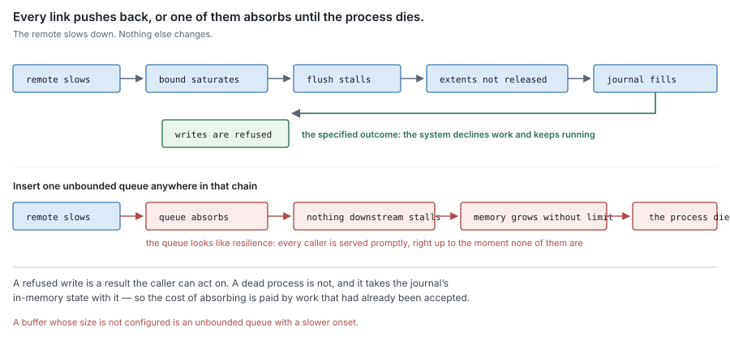
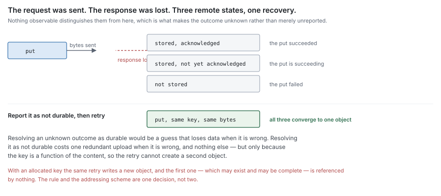
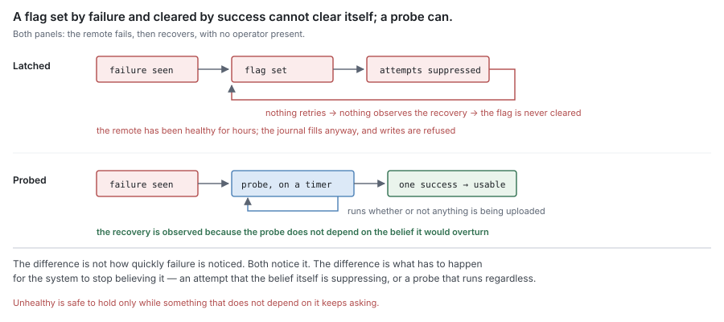

# RFC 3 — the syncer

**Status:** draft.
**Depends on:** RFC 0, for the terms and the residency function. RFC 8 specifies
the remote tier this component calls. RFC 1 supplies and receives the bytes.
RFC 2 §4.2 names the blocks.
**Audience:** anyone changing the component that moves blocks between the journal
and the remote tier.

The key words **MUST**, **MUST NOT**, **SHOULD**, **SHOULD NOT** and **MAY** are
to be interpreted as in RFC 2119.

---

## In short

- The syncer moves whole blocks between the journal and the remote tier. It does
  nothing else.
- It has two halves. The **uploader** puts boxed blocks out. The **fetcher** gets
  remote-only blocks back.
- Each half is a worker pool of configurable size. That pool is the only
  concurrency control, and its size is the memory bound.
- The uploader holds a *reference* into the journal, not a copy. The journal keeps
  those bytes stable until the upload reports.
- The fetcher hands verified bytes to two consumers at once: the journal, which
  fills them, and the engine, which answers the waiting read.
- It names nothing, deletes nothing, decides nothing, and stores nothing.

---

## 1. Purpose

> **Move whole blocks between the journal and the remote tier, in both
> directions, under a bound.**

Every transition to **Resident** in this system originates in an outcome this
component reports (RFC 0 §4.3). Every transition back from **Remote** to holding
local bytes originates in a fetch it performed.

### 1.1 Non-goals

The syncer **MUST NOT**:

- decide *what* to transfer, or *when*, or *why* — that is flush, eviction and
  readahead policy (RFC 0 §5.2, §8.1, RFC 6);
- decide what to delete — that is sweep, which calls the remote tier directly
  (RFC 0 §8.3, RFC 7);
- derive a block's name (RFC 2 §4.2);
- know how an object is framed, transformed or verified (RFC 8 §3, §4, §6);
- persist anything;
- know what a file, an extent, a chunk or a segment is.

### 1.2 Two halves, one component

| | uploader | fetcher |
| --- | --- | --- |
| Triggered by | a block finished boxing | a read of bytes held only remotely |
| Reads from | the journal, by reference | the remote tier |
| Writes to | the remote tier | the journal, and the reader waiting on it |
| Bound | its own pool size | its own pool size |
| Work is | known in advance, and unique | demanded, and may be duplicated |

The halves share a component and share nothing else: no pool, no queue, no
counter. Their sizes **MUST** be configurable independently, because they saturate
on different things — uploads on the uplink and on how fast blocks are boxed,
fetches on latency and on how many readers are blocked.

They are one component because they are one obligation seen from two sides:
bounded movement of whole blocks, with the journal at one end and RFC 8's contract
at the other. Splitting them would duplicate §2 into two documents.

## 2. What both halves obey

### 2.1 A worker pool is the only concurrency control

Each half **MUST** be a pool of a configured size, and that size **MUST** be the
only thing limiting how many transfers are in flight. An implementation **MUST
NOT** add a second limiter — a queue depth, a rate limit, a token bucket — whose
interaction with the pool size is unstated.

Two limits that can each be the binding one produce a system whose throughput has
no single explanation, and the one an operator tunes is whichever is not binding.

### 2.2 The pool size is a memory bound

Each in-flight transfer holds at most one block's bytes. The peak memory a half
admits is its pool size times the block target, and an implementation **MUST** be
able to state that product. The process-level bound is the sum of the two halves.

This is why the bound cannot belong to a backend: memory is a property of the
process, and one backend may serve several shares while one share's traffic spans
several backends.

### 2.3 Backpressure propagates; it does not buffer

When a pool is full, the caller **MUST** wait or be refused. An implementation
**MUST NOT** accept work into an unbounded queue, and **MUST NOT** introduce a
buffer whose size is not configured.

The chain this preserves runs the whole depth of the system:

remote slows → the pool saturates → flush stalls → dirty extents are not released
→ the journal approaches capacity → writes are refused (RFC 0 §10.1)

Refusing a write is the specified outcome. An unbounded queue at any link replaces
it with unbounded memory growth, and the process dies instead of declining work.

### 2.4 Every transfer terminates, and reports

Every transfer **MUST** complete in bounded time with either success or a failure
reported to its caller. No transfer retries indefinitely.

An implementation **SHOULD** distinguish transient failures (timeout, throttle,
connection reset) from terminal ones (malformed request, rejected credentials,
absent bucket) and retry only the former, within a stated bound. Misclassification
either way is recoverable, because both paths end in a report.

### 2.5 An unknown outcome is not a success

A transfer can end with its outcome genuinely unknown: the request was sent, the
response was lost. The syncer **MUST** resolve that as *not durable* and report it
as a failure.

This is safe only because a block's name is a function of its content (RFC 2
§4.2), which makes the retry idempotent — the same bytes to the same name,
indistinguishable from having written them once.

### 2.6 Durability is observed, never inferred

The syncer **MUST** report durability only on the acknowledgement RFC 8 §5.6
defines for the backend in use. None of the following is evidence, and an
implementation **MUST NOT** report durability on any of them:

| Not evidence | Why it looks like evidence |
| --- | --- |
| the call returned | it returned from a buffer, not from storage |
| no error was observed | an error that is never delivered is not an absence of error |
| the bytes were all sent | sent is not stored |
| enough time has passed | time is not an acknowledgement |
| a later read succeeded | the read may be served from a cache the write populated |

### 2.7 It reports; it does not persist

The syncer **MUST NOT** persist durability, residency or health. It returns what
it observed; RFC 4 records it and RFC 1 is told (RFC 0 §4.3).

A syncer that kept its own durable record of what it moved would introduce a third
oracle, which disagrees with the other two after any crash, and nothing in the
residency model resolves a three-way disagreement.

## 3. The uploader

### 3.1 It is triggered, not scheduled

A block becomes the uploader's work when it has finished boxing. The uploader
**MUST NOT** decide which blocks to box, when to box them, or in what order to
take them.

### 3.2 It holds a reference, not a copy

The uploader **MUST** take a reference to the block's bytes in the journal and
read them when a worker begins the transfer. It **MUST NOT** copy the block into
memory when the block is queued.

The difference is the bound of §2.2. A copy taken at queue time is held for the
whole time the block waits for a worker, so peak memory follows the queue depth;
a reference is materialised only while a worker is transferring, so it follows the
pool size.

### 3.3 The journal keeps referenced bytes stable

While a reference is outstanding, the journal **MUST NOT** release, overwrite,
relocate or compact the bytes it names, and **MUST** free them once the uploader
reports.

This is the other half of §3.2 and it is a requirement on RFC 1, not on this
component. A reference into storage that may move underneath it is a copy with
extra steps and a race.

### 3.4 One put per block

A block is transferred by a single put of the whole block (RFC 8 §5.1). A put that
does not complete **MUST NOT** leave the block retrievable and **MUST NOT** be
reported durable.

Where a backend transfers in parts, durability is the completion of the whole and
**MUST NOT** be inferred from the parts.

### 3.5 The bytes are stable for the duration

The bytes a put transfers **MUST NOT** change while it runs. §3.3 supplies that
for a journal reference; an implementation that transfers from anywhere else
**MUST** supply it some other way.

The name is a function of the content (RFC 2 §4.2), so content that changes mid
transfer produces an object whose bytes do not match its name, and every later
verification of that object fails.

## 4. The fetcher

### 4.1 One fetch, two consumers

A fetch of a block held only remotely produces verified bytes (RFC 8 §6.1) with
two consumers:

- the **journal**, which fills them so the next read is local (RFC 0 §2.3);
- the **engine**, which answers the read that caused the fetch.

Both **MUST** read the same bytes and neither **MAY** modify them. The bytes are
verified before either sees them, which is what makes one buffer safe for two
readers.

### 4.2 The reply neither waits on the fill nor fails with it

The engine **MUST** be able to answer its read as soon as the bytes are verified,
and a failed fill **MUST NOT** fail the read.

A fill that fails means the block is not cached locally. The bytes are correct —
they were verified — so withholding them, or failing a client's read because a
cache write failed, converts a performance problem into an error.

### 4.3 Concurrent demand for one block is one fetch

When a fetch for a block is already in flight, a second demand for that block
**MUST** join it rather than start another.

Without this, N readers arriving together on one cold block cost N transfers, N
blocks against the §2.2 bound, and N fills of identical bytes. The uploader needs
no equivalent rule, because a boxed block is work that exists once.

### 4.4 Speculation does not delay demand

A fetch is **demanded** when a reader is blocked on it and **speculative**
otherwise. A speculative fetch **MUST NOT** delay a demanded one, and **MUST** be
abandonable without failing any read.

A single queue serving both, first come first served, makes a client wait behind a
guess. Sharing one pool is permitted; sharing one arrival order is not.

### 4.5 Speculation is executed here and decided elsewhere

The fetcher executes fetches. Which blocks are worth fetching before they are
asked for is policy, and belongs with the component that sees the access pattern
and the free capacity (RFC 6). Two kinds exist and they differ in more than scale:

| | read-ahead | pre-warm |
| --- | --- | --- |
| Triggered by | an observed access pattern | an explicit request |
| Size | the next few blocks | up to a whole subtree |
| A reader is waiting | soon, probably | no |
| Abandoning it costs | a later demand fetch | the request, which can be reissued |

Both are speculative under §4.4. Pre-warm carries one further obligation, because
it is the only speculative work large enough to matter: filling consumes journal
capacity, and the journal refusing writes is a specified outcome (RFC 0 §10.1).
Pre-warm **MUST NOT** drive the journal into that state, and **MUST** yield
capacity to writes and to demanded fetches rather than compete with them.

A pre-warm that fills the cache until writes start failing has traded a cold read
for an outage.

## 5. What belongs elsewhere

| Concern | Owner |
| --- | --- |
| A block's name | RFC 2 §4.2 |
| Framing, transforms, verification, the error set | RFC 8 §3, §4, §5.2, §6 |
| What a durable acknowledgement is, per backend | RFC 8 §5.6 |
| Recording durability and residency | RFC 4 |
| Keeping referenced bytes stable; filling fetched ones | RFC 1 |
| Deleting a remote block | RFC 7, calling RFC 8 directly |
| What to box, when to flush, what to evict, what to read ahead or pre-warm | RFC 6 |
| Whether the system keeps accepting writes when the remote is unavailable | RFC 6 |

Health is derived, not held. The syncer reports every outcome; whichever component
aggregates outcomes computes health from recent ones, and **MUST NOT** store a
flag that suppresses later attempts until something clears it. A stored flag
converts a transient outage into a permanent one: the remote recovers, nothing
retries, so nothing observes the recovery. Deriving it leaves nothing to latch.

## 6. Invariants

| # | Invariant |
| --- | --- |
| S1 | In-flight transfers per half never exceed that half's configured pool size. |
| S2 | Peak memory per half is at most the pool size times the block target. |
| S3 | Backpressure reaches the caller; no unbounded queue exists. |
| S4 | Every transfer ends in a success or a reported failure, in bounded time. |
| S5 | An unknown outcome is reported as not durable. |
| S6 | Durability is reported only on an acknowledgement that means durable. |
| S7 | The syncer persists nothing. |
| S8 | Bytes referenced by an in-flight upload do not change or move. |
| S9 | A partially transferred block is never retrievable and never reported durable. |
| S10 | Fetched bytes are verified before any consumer sees them. |
| S11 | A read is answered independently of whether its fill succeeded. |
| S12 | Concurrent demand for one block produces one fetch. |
| S13 | A demanded fetch is never delayed by a speculative one. |

S5, S6, S8, S9 and S10 are the ones whose violation loses data. S1, S2, S3 and S13
are the ones whose violation stops the system, or makes it look stopped.

## 7. Conformance

Conformance is every **MUST** holding. The checks below are evidence for the ones
that fail *silently*, and a check is validated by reverting the code and watching
it fail on its own assertion.

Every check in §7.1 requires a backend that can lose, corrupt, delay and
half-complete. A backend that always succeeds asserts nothing about any of them.

### 7.1 Group A — silent data loss

| Requirement | Check |
| --- | --- |
| §2.5 unknown is failure | Drop the response of a put the backend committed; assert failure is reported, then that the retry produces one object, not two. |
| §2.6 no inference | Drive a backend that acknowledges before committing and then loses the write; assert nothing was reported durable. |
| §3.4 partial put | Interrupt a transfer; assert the name is not retrievable and was not reported durable. |
| §3.3, §3.5 stability | Release or overwrite the referenced journal bytes during a transfer; assert the journal refuses, and that no stored object ever disagrees with its name. |
| §4.1 verification | Corrupt the fetched bytes; assert no byte reaches either consumer. |
| §4.2 reply independence | Fail the fill; assert the read is still answered, and answered correctly. |

### 7.2 Group B — wedging and unbounded resource use

| Requirement | Check |
| --- | --- |
| §2.1 one limiter | Saturate each half; assert in-flight never exceeds its pool size and that no other limit binds first. |
| §2.2 memory bound | Stall the backend at full pools; assert peak bytes stay within pool size times block target, per half and summed. |
| §2.3 backpressure | Stall the backend and keep submitting; assert callers block or are refused rather than queue. |
| §2.4 termination | Present a permanently unavailable backend; assert every transfer returns within its bound. |
| §4.3 single flight | Demand one cold block from N readers at once; assert one transfer and one fill. |
| §4.4 priority | Saturate the fetch pool with speculation, then demand a block; assert the demand is not queued behind it. |
| §4.5 pre-warm yields | Pre-warm a subtree larger than free journal capacity while writing; assert writes are not refused and demanded fetches are not delayed. |
| §5 health recovers | Fail every transfer until unhealthy, restore the backend; assert health recovers with no external action and transfers resume. |

### 7.3 What must not stand in

- **An in-memory backend MUST NOT be the only one under test.** It cannot lose an
  acknowledged write, half-complete or delay, so it asserts nothing about §2.5,
  §2.6 or §3.4.
- **A backend that returns instantly MUST NOT be used for §2 or §4.4.** With no
  latency the pool is never the binding constraint, so every check in those
  sections passes without exercising what it names.
- **Lifetime counters MUST NOT be the source for health.** A since-start success
  rate passes while the windowed view it is meant to test is broken.

## 8. Open questions

1. **Pool sizes.** Both bounds are memory bounds with a known formula, so both can
   be set from a budget. What the right values are for a saturating SMB workload,
   and whether the halves contend enough on a shared link to need a joint cap
   rather than two independent ones, are unmeasured.
2. **Whether either pool should adapt.** A fixed size is correct and states its own
   bound. An adaptive one finds the knee of a link whose capacity is not known in
   advance, at the cost of a control loop, a second thing to observe, and a failure
   mode where the window collapses and is indistinguishable from a slow network
   from outside. This wants a measurement showing a fixed pool leaves throughput on
   the table, not an argument.
3. **How pre-warm yields** (§4.5). The obligation is stated; the mechanism is not.
   A capacity reservation, a low-water mark, and cancellation on pressure are all
   plausible and they behave differently when a write burst arrives mid-warm.
4. **What a durable acknowledgement is, per backend** (RFC 8 §5.6). Unwritten for
   both backends in use.
5. **Where the retry bound lives** (RFC 8 §5.7.1). The backend and this component
   both bound attempts today, and neither states the product.
6. **No deviation pass has been run against this shape.** The previous shape of
   this document recorded two deviations against the code. This one is a design;
   nothing in it has been checked.
