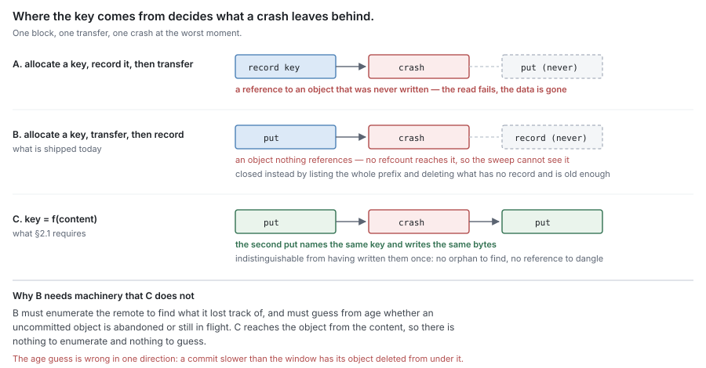

# RFC 3 — the syncer

**Status:** draft.
**Depends on:** RFC 0, for the terms, the residency function and the invariants.
RFC 2 supplies the blocks this component transfers. Nothing here redefines them.
**Audience:** anyone changing `pkg/block/syncer` or a remote tier implementation.

The key words **MUST**, **MUST NOT**, **SHOULD**, **SHOULD NOT** and **MAY** are
to be interpreted as in RFC 2119.

This document specifies what the syncer is required to do. Where the current
implementation does not satisfy a requirement, that is recorded as a **deviation**
in its own subsection, with evidence. A deviation is a defect to be fixed or
migrated, never a rule for an implementer to build around.

---

## 1. Purpose

The syncer is the only component that speaks to the remote tier. It answers one
question, and it answers it about bytes it has itself observed:

> **Is this block durably stored elsewhere, and can I get it back?**

It is the component RFC 0 §4.3 means by "the component that observed it". Every
transition to **Resident** in this system originates in a report this component
makes.

### 1.1 Non-goals

The syncer **MUST NOT**:

- decide *what* to transfer, or *when*, or *why* — that is flush and eviction
  policy (RFC 0 §5.2, §8.1);
- decide what to delete — that is sweep (RFC 0 §8.3, RFC 7);
- know what a file, an extent, a chunk or a segment is;
- record durability anywhere; it reports, and RFC 4 records (§3.3);
- decide whether the system should keep accepting writes when the remote is
  unavailable — it reports health, the engine decides (§5.4);
- import another component in this set (RFC 0 §1.2).

### 1.2 Its entire vocabulary is a key and some bytes

The syncer's world is `(key, bytes)`. It does not know what is inside a block and
**MUST NOT** be given anything that would tell it — no file identity, no offset,
no chunk list, no share name in any position that affects behaviour.

This is not tidiness. Every fact the syncer is given is a fact that has to be
correct at transfer time, and a transfer is the one operation in this system whose
outcome can be unknown (§5.2). Keeping the vocabulary at two terms is what makes
an unknown outcome recoverable by simple retry.

## 2. Addressing

### 2.1 A block's key MUST be derived from its content

The remote key of a block **MUST** be a pure function of the block's bytes (and of
the namespace of §2.2). It **MUST NOT** be allocated, sequenced, randomly
generated, or assigned by the remote tier.

This single rule is what makes the rest of the document possible, and the
alternative fails in two distinct ways. Suppose keys were arbitrary:

- **Assign the key before the transfer and record it.** Then a record of a block's
  location is durable before the block is, which is the failure RFC 1 §4.4
  prohibits for indexes, relocated to the remote tier. A crash leaves a reference
  to an object that was never written.
- **Assign the key and record it only after the transfer succeeds.** Then a
  transfer whose outcome is unknown (§5.2) leaves an object that may exist under a
  key nothing recorded. It is unreferenced, so no refcount reaches it and sweep
  (RFC 0 §8.3) cannot find it. It is a permanent leak, one per ambiguous failure.

With a content-derived key both dissolve. Retrying writes the same bytes to the
same key, which is indistinguishable from having written them once, so an
ambiguous outcome needs no resolution — only a retry.

Two further properties follow, and an implementation **MUST NOT** treat either as
incidental: identical blocks share a key, which is block-level deduplication at no
cost; and the key is a checksum, which makes every retrieval verifiable (§4.2).

#### 2.1.1 Deviation — block keys are randomly generated

The current implementation fails §2.1. A block's key is sixteen bytes of
`crypto/rand`, unrelated to the block's content:

| | Required by §2.1 | Shipped |
| --- | --- | --- |
| Key source | `f(content, namespace)` | `crypto/rand`, 16 bytes hex (`pkg/block/block_record.go:29`) |
| On-wire key | — | `blocks/<blockID>` (`pkg/block/locator.go:35`) |
| Allocated | — | before the transfer (`pkg/block/engine/flush.go:392`) |
| Recorded | — | after it (`flush.go:446` put, then the commit) |

That ordering is §2.1's second branch verbatim, and the code says so at the put:
"a crash before the commit leaves an orphan block (GC reclaims it), never an
unbacked record." The branch was chosen deliberately, and it is the safer of the
two — an orphan costs storage, an unbacked record loses data.

**The leak §2.1 predicts is real, and is closed by separate machinery.** Class 3 of
the orphan reclaimer (`pkg/block/gc/orphan_reclaim.go`) enumerates the whole
`blocks/` prefix through `WalkBlocks`, joins it against the block records, and
deletes every object that has no record and is older than a grace window — one
hour by default (`pkg/block/gc/gc.go:349`). So the system does not leak. What it
pays for a random key is:

| Cost | Why a content-derived key would not pay it |
| --- | --- |
| A full remote listing per reclaim pass | An object whose key is its content is reachable *from* the content; nothing needs enumerating to find it. |
| A grace window separating "abandoned" from "in flight" | With one key per content there is nothing to abandon — the retry targets the same object. |
| No block-level deduplication | Two identical blocks get two keys and two objects. |
| A re-carve after a crash re-uploads bytes the remote already holds | `NewBlockID`'s stated contract is that a re-carve "always targets a new object". |

The grace window is worth naming for what it is. RFC 0 §4.3 forbids inferring
*durability* from elapsed time; this infers *abandonment* from it, which is a
weaker claim but still a clock-based decision, and it is wrong in one direction: a
commit slower than the window has its object deleted from under it.

The deduplication loss is bounded rather than total, because deduplication is
recovered one level down. The skip oracle works per chunk, on content hashes
(RFC 2 §6), so identical *content* is uploaded once even though identical *blocks*
are not. The duplicate cost is a block's framing plus whatever novel chunks a
re-carve re-packs, not the corpus.

One invariant is made vacuous rather than violated. S7 forbids reordering
operations on one key, and with a fresh key per carve a put and a delete can never
name the same key, so the hazard §4.5 describes cannot arise. S7 becomes
load-bearing the moment keys are content-derived — that hazard is created by the
fix, not by the deviation.

**The exit is not a one-line change, and the reason is worth recording.** The
block hash the code already computes (`flush.go:436`) cannot serve as the key: the
framed block carries the block id in its preamble, and the encryption layer binds
that same id as AEAD additional data (`pkg/block/blockcodec/codec.go:304`). Hashing
the stored object in order to name the object is circular, twice over. The key must
instead be derived from the *plaintext* payload — the chunk hash list, or a hash
over the concatenated chunk plaintexts — computed before framing and then handed to
the builder as the block id. That ordering keeps both the preamble and the AAD
self-consistent, and it is exactly the property §7.1 already requires: identity is
a function of untransformed content. §4.2's whole-block verification then verifies
the payload rather than the object.

Deciding this also forces §2.2, because the namespace is part of the key.

This document does not schedule the migration. It records that the current state
fails §2.1, that the failure is paid for rather than suffered, and that the
discrepancy **MUST NOT** be closed by amending §2.1.

### 2.2 Namespace

A key **MAY** additionally be a function of a namespace fixed for the lifetime of
the store. The namespace decides whether two tenants holding identical content
share an object.

An implementation **MUST** make that choice explicit rather than inheriting it
from how keys happen to be built, because the two outcomes differ in kind:

| | One namespace | Namespace per tenant |
| --- | --- | --- |
| Identical content across tenants | one object | one object per tenant |
| Storage cost | paid once | paid per tenant |
| Sweep | must count refs across tenants | independent per tenant |
| Disclosure | a tenant can learn another holds a block, by observing dedup | none |

The namespace **MUST NOT** vary between attempts at the same transfer, or §2.1's
idempotency is lost.

### 2.3 What a key MUST NOT encode

A key **MUST NOT** contain anything that can change while the block still exists:
a path, a file name, a share name, a mount point, a timestamp, a sequence number,
a schema version, or a hostname.

Anything encoded in a key becomes immutable the moment the first object is
written under it, because changing it orphans every existing object at once — and
orphans are exactly what §2.1 exists to prevent.

## 3. The durability report

### 3.1 What counts as evidence

A block is durable when **the remote tier has acknowledged that it is durably
stored**. The syncer **MUST** report durability only on such an acknowledgement,
and **MUST** know, for the backend it drives, which responses carry that meaning
and which do not.

That obligation is concrete. A backend that answers "accepted" before committing,
that buffers, that writes to a cache in front of the durable store, or that
acknowledges at a weaker consistency level than the deployment requires, has not
supplied evidence. An implementation **MUST** identify the acknowledgement that
means durable for its backend, and **MUST NOT** substitute a weaker one.

### 3.2 What does not count

RFC 0 §4.3 forbids inferring durability. Concretely, none of the following is
evidence, and an implementation **MUST NOT** report durability on any of them:

| Not evidence | Why it looks like evidence |
| --- | --- |
| the write call returned | it returned to a buffer, not to storage |
| no error was observed | an error that is never delivered is not an absence of error |
| the transfer's bytes were all sent | sent is not stored |
| enough time has passed | time is not an acknowledgement |
| a subsequent read succeeded | a read may be served from a cache the write also populated |
| the object appears in a listing | listings are frequently eventually consistent |

The last two are worth stating because they look like *stronger* evidence than an
acknowledgement, and are weaker.

### 3.3 The syncer reports; it does not record

The syncer **MUST NOT** persist durability anywhere. It returns what it observed
to its caller, and RFC 4 records it and RFC 1 is told (RFC 0 §4.3, §5.2).

A syncer that keeps its own durable record of what it uploaded introduces a third
oracle, which will disagree with the other two after any crash, and nothing in the
model resolves a three-way disagreement.

### 3.4 A transfer attests to the bytes that were sent

An acknowledgement is evidence about the bytes the remote received, which are the
bytes the syncer transmitted — not necessarily the bytes it was given.

The key is computed from the content (§2.1), so if the content changes between
key computation and transmission, the remote holds bytes that do not match their
key, and every later verification of that object fails. The syncer **MUST**
therefore treat the block's bytes as immutable for the duration of a transfer, and
**MUST NOT** accept a buffer a caller may still write to. RFC 2 §7.1 is the other
half of this contract.

An implementation **SHOULD** verify the key against the bytes it actually
transmitted, and **MUST** do so if the transfer path can reread the source.

## 4. Transfer

### 4.1 Put

Put makes a block durable and reports whether it did.

- A put **MUST** be atomic in effect: either the whole block becomes retrievable
  under its key, or nothing does. A partially transferred block **MUST NOT** be
  retrievable, and **MUST NOT** be reported durable.
- Where a block is transferred in parts, durability is the completion of the whole
  and **MUST NOT** be inferred from the parts. Every part acknowledged is not the
  block acknowledged.
- A put of a key that already exists **MUST** succeed. By §2.1 the content is
  identical, so this is the retry path and the dedup path at once.

### 4.2 Get, and verification

Get retrieves a block and **MUST** verify it before returning it.

Because the key is a function of the content (§2.1), verification needs nothing
the caller does not already have. The syncer **MUST** recompute and compare, and
**MUST** return an error rather than unverified bytes.

This is not defence in depth; it is load-bearing. Retrieved bytes flow into
`Fill` (RFC 0 §6.2), and a filled extent's flush bit is set (RFC 1 §3.4) — so
corrupt bytes accepted here become an extent the journal believes is durable
elsewhere and will therefore allow to be released. **An unverified get turns a
transmission error into permanent data loss.**

#### 4.2.1 Deviation — verification lives in the consumers, not in the component

The current implementation fails §4.2 as a *component* requirement while satisfying
it as a *system* property. No remote-tier read verifies; each consumer does.

| Read path | Verified? | Where |
| --- | --- | --- |
| `ReadChunk` — chunk-aligned, hash supplied | yes, by the caller | `pkg/block/engine/fetch.go:344` |
| `GetBlock` — whole object | yes, by its one caller, against `BlockRecord.BlockHash` | `pkg/block/gc/compaction.go:219` |
| `GetBlockRange` — arbitrary byte range, no hash | no, and it cannot be | — |

`ReadChunk`'s own contract states the gap: "It does NOT verify BLAKE3 … the engine
read path verifies blake3(result) == hash after the top-level call." The stated
reason is structural and it is correct — no single decorator layer holds both the
wire bytes and the plaintext hash domain, because `ReadChunk` returns plaintext
after every layer has inverted its own transform. So the fix is not to push a
BLAKE3 check down into the base store.

The fix is to stop exporting an unverified read. Both call sites do verify today,
so nothing is currently lost; the requirement exists because the next call site is
the one that forgets — and a caller that reads remote bytes without verifying
already exists. `pkg/snapshot/verify.go:72` issues a one-byte `GetBlockRange` as a
presence probe. It is safe only because it discards the byte. That is the shape
§4.2 warns about, arriving as a new caller rather than as a changed one.

`GetBlockRange` is also the §4.3 violation, sitting on the same interface as the
conforming `ReadChunk`: a range with no hash beside a range with one. §4.3 does not
forbid the mechanism — the range read is what `ReadChunk` is built from. It forbids
exporting it, because a range belongs below the component's surface rather than on
it.

This document does not choose between verifying inside the component and removing
the raw read from its exported surface. It records that §4.2 and §4.3 currently
hold by the discipline of two callers rather than by construction, and that the
discrepancy **MUST NOT** be closed by amending either.

### 4.3 A partial retrieval MUST align to something that has its own hash

Fetching a whole block to serve a small read is read amplification, so a partial
retrieval is worth having. But a byte range of a block cannot be verified against
the block's key, and §4.2 does not admit an exception.

The resolution is that the system already hashes a smaller unit. A partial
retrieval **MUST** therefore:

- align to a unit that carries its own content hash — a chunk (RFC 2 §4);
- be accompanied by the expected hash of exactly that unit, supplied by the
  caller;
- be verified against it before any byte is returned.

An implementation **MUST NOT** offer an arbitrary byte-range get that returns
unverified bytes. A range the caller cannot name a hash for is a range the syncer
cannot vouch for, and §4.2's consequence applies unchanged.

> *Note.* This is why chunk hashes are worth keeping even though blocks are the
> unit of transfer. They are the only thing that makes a sub-block read safe.

### 4.4 Delete is a mechanism, not a decision

The syncer **MUST** expose deletion, because it is the only component that can
reach the remote tier, and **MUST NOT** decide what to delete. Sweep decides
(RFC 0 §8.3, RFC 7).

Deletion **MUST** be idempotent: deleting a key that is absent is success. A sweep
that crashes mid-pass re-runs, and a delete that fails because the object is
already gone would turn recovery into an error.

### 4.5 Operations on one key are not reordered

The syncer **MUST NOT** reorder a put and a delete of the same key with respect to
the order it received them.

Reordering is not a theoretical hazard here: sweep deletes a block whose refcount
reached zero while a concurrent flush may put the same key, because the same
content has been referenced again (§2.1 makes those the same key). If the delete
is reordered after the put, a referenced block is missing. Whether that pair can
be issued at all is RFC 7's protocol; the syncer's obligation is not to create the
hazard on its own.

Operations on *different* keys **MAY** proceed in any order and concurrently.

## 5. Failure

### 5.1 Every operation terminates

Every operation **MUST** complete, in bounded time, with either success or a
failure reported to its caller. No operation retries indefinitely.

This is the rule that makes failure classification an efficiency question rather
than a safety one. An implementation **SHOULD** distinguish transient failures
(timeout, throttle, connection reset, server-side error) from terminal ones
(malformed request, rejected credentials, absent bucket) and retry only the
former, with bounded backoff. But a misclassification either way is recoverable,
because both paths end in a report.

An implementation **MUST NOT** retry a failure it cannot classify forever on the
theory that it might be transient. RFC 0 §10.2 requires every state to be leavable
without intervention, and a caller blocked in a retry loop has no way to observe
that anything is wrong.

### 5.2 An unknown outcome is not a success

A transfer can end with its outcome genuinely unknown — the request was sent, the
response was lost. The syncer **MUST** resolve that as *not durable* and report it
as a failure.

It is safe to do so only because §2.1 makes the retry idempotent. An
implementation that assigns keys any other way **MUST NOT** adopt this rule
without also solving the leak it creates, and the two are not separable.

### 5.3 Health is derived, never latched

The syncer **MUST** report whether the remote tier is presently usable, and that
report **MUST** be computed from recent observations. An implementation **MUST
NOT** set a flag on failure that suppresses later attempts until something clears
it.

A latched flag converts a transient outage into a permanent one: the remote
recovers, nothing retries, so nothing observes the recovery, so the flag is never
cleared. The system then holds content it will never make durable, and by RFC 0
§8.1 it can never evict any of it, so the journal fills and writes are refused —
from a remote that has been healthy for hours.

Health **MUST** recover on its own when the remote does, with no operator action
(RFC 0 §10.2). "State you store can go stale; state you derive cannot."

### 5.4 Health is a report, not a decision

The syncer says whether the remote is usable. It **MUST NOT** decide what follows
from that. Whether to keep accepting writes, whether to stall flushes, whether to
mark a share degraded, are the engine's (RFC 0 §10).

### 5.5 Incomplete transfers MUST be reclaimable

A transfer interrupted partway **MAY** leave state at the remote tier — an
abandoned multipart upload, a staged object — that costs storage and that nothing
references.

An implementation **MUST** be able to enumerate and abandon its own incomplete
transfers, and that **MUST NOT** depend on in-memory state, because the crash that
orphaned them is the same crash that lost it. Reclaiming them **MUST** be safe to
run concurrently with live transfers, which requires distinguishing an abandoned
transfer from a slow one — by age, not by absence from a process's memory.

> *Note.* This is the one leak content-addressing does not close. §2.1 makes a
> completed object always referenced-or-findable; it says nothing about state a
> backend accumulates on the way there.

## 6. Flow control

### 6.1 In-flight work MUST be bounded

The number of concurrent transfers **MUST** be bounded by configuration.

The bound is a memory bound before it is anything else: an in-flight put holds its
block's bytes, so unbounded concurrency against a slow remote is unbounded
memory. An implementation **MUST** be able to state the peak bytes its bound
admits, which by RFC 2 §5.1 is the concurrency limit times the block target plus
one maximum chunk.

### 6.2 Backpressure propagates; it does not buffer

When the bound is reached, the syncer **MUST** make its caller wait or fail. It
**MUST NOT** accept the work into an unbounded queue.

The chain this preserves runs the whole depth of the system, and every link must
push back rather than absorb:

remote slows → transfers saturate the bound → flush stalls → dirty extents are not
released → the journal approaches capacity → writes are refused (RFC 0 §10.1)

Refusing a write is the specified outcome. An unbounded queue at any link replaces
it with unbounded memory growth, and the process dies instead of declining work.
An implementation **MUST NOT** introduce a buffer whose size is not configured.

### 6.3 Adaptation

An implementation **MAY** vary its concurrency within the configured bound in
response to observed throughput and error rate, and **SHOULD** where the remote's
capacity is not known in advance.

Where it does: the configured bound **MUST** remain a ceiling, adaptation **MUST
NOT** reduce concurrency to zero (which is §5.3's latch by another route), and the
current value **MUST** be observable, because a system running at one-eighth of
its configured window looks identical to a slow network from outside.

## 7. Transformation

An implementation **MAY** compress or encrypt a block before transfer.

### 7.1 Identity survives transformation

The key **MUST** remain a function of the untransformed content (§2.1).

Deriving it from the transformed bytes instead makes the key depend on the
compression level, the encryption key and the library version, so identical
content stops sharing an object, deduplication silently stops working, and a
setting change re-keys everything.

Verification (§4.2) **MUST** therefore happen after inverting the transformation,
against the original content's key.

### 7.2 The transformation travels with the object

How a stored object was transformed **MUST** be recoverable from the object
itself, not from configuration.

Configuration describes how the *next* write will be transformed. If it is also
the only record of how past writes were, then changing it makes existing data
unreadable — and the failure appears at the next read, not at the change.

## 8. Observability

The syncer **MUST** report, as state rather than as events:

| Field | Is |
| --- | --- |
| `InFlight` / `Limit` | current concurrent transfers, and the ceiling |
| `BytesInFlight` | bytes held by in-flight transfers |
| `Healthy` | whether the remote is presently usable (§5.3) |
| `LastError` / `LastErrorAt` | the most recent failure and when |
| `SuccessRate` | successes over a recent window, not since start |
| `IncompleteTransfers` | reclaimable remnants (§5.5) |

A counter since process start **MUST NOT** be the only form of these: a syncer
that failed every operation for the last hour after a month of success has an
excellent lifetime success rate.

## 9. Invariants

| # | Invariant |
| --- | --- |
| S1 | A block's key is a function of its content. |
| S2 | Durability is reported only on an acknowledgement that means durable. |
| S3 | An unknown outcome is reported as not durable. |
| S4 | Retrieved bytes are verified before they are returned. |
| S5 | A partial retrieval is verified against the hash of the unit it aligns to. |
| S6 | A partially transferred block is never retrievable and never reported durable. |
| S7 | Operations on one key are not reordered. |
| S8 | Every operation terminates with a success or a reported failure. |
| S9 | Health is derived from recent observations, never latched. |
| S10 | In-flight work is bounded, and backpressure propagates rather than buffering. |
| S11 | The syncer records nothing. |

S2, S3, S4 and S5 are the ones whose violation loses data. S9 and S10 are the ones
whose violation stops the system.

Against the current implementation: **S1 fails** (§2.1.1) and **S4 and S5 hold by
the discipline of two callers rather than by construction** (§4.2.1). **S7 is
vacuous while S1 fails**, because a fresh key per carve means a put and a delete
can never name the same key. S9 and S10 were checked by reading and hold — health
is an independent periodic probe that clears on a single success
(`pkg/block/engine/sync_health.go`), the upload window is a resizable semaphore
shared across every carve pass with a floor of one (`pkg/block/syncer/dynsem.go`,
`upload_controller.go`), and the only queue in the component is the bounded
prefetch queue. S11 holds: the syncer reports, and the engine's commit records.
The remaining invariants cannot be settled by reading — see §11.6.

## 10. Conformance

RFC 1 §11 applies unchanged: conformance is every **MUST** holding, the checks
below are evidence for the ones that fail *silently*, and a check is validated by
reverting the code and watching it fail on its own assertion.

### 10.1 Group A — silent data loss

| Requirement | Check |
| --- | --- |
| §4.2 get is verified | Return bytes that do not match the key; assert an error, and that no byte reaches a caller. Then assert the same through `Fill`, which is where the loss would occur. |
| §4.3 partial get is verified | Request a chunk-aligned range and corrupt it; assert an error. Assert that a range with no supplied hash is refused outright. |
| §3.2 no inference | Drive a backend that acknowledges before committing and then loses the write; assert nothing was reported durable. A backend that cannot lose a write cannot exhibit this. |
| §5.2 unknown is failure | Drop the response of a put that the backend actually committed; assert failure is reported, then assert the retry succeeds and produces one object, not two. |
| §4.1 partial put | Interrupt a multi-part transfer; assert the key is not retrievable and was not reported durable. |
| §3.4 content immutable in flight | Mutate the caller's buffer during a transfer; assert the implementation either refuses the buffer or detects the mismatch — never that it stores bytes not matching the key. |
| §4.5 no reordering | Issue put and delete of one key; assert the observed order at the backend matches the issued order. |

### 10.2 Group B — wedging and unbounded resource use

| Requirement | Check |
| --- | --- |
| §5.3 health recovers | Fail every operation until unhealthy, then restore the backend; assert health recovers with no external action and transfers resume. |
| §5.1 termination | Present a terminal failure and a permanently unavailable backend; assert every operation returns within the configured bound rather than retrying forever. |
| §6.2 backpressure | Stall the backend and keep submitting; assert memory is bounded and that callers block or fail rather than queue. |
| §6.1 bound is real | Submit far more transfers than the limit concurrently; assert in-flight count never exceeds it and peak bytes stay within the stated bound. |
| §6.3 adaptation floor | Drive sustained errors; assert concurrency never reaches zero and the current value is observable. |
| §5.5 remnant reclaim | Crash mid-transfer, restart, and assert the remnant is enumerable and abandonable without the pre-crash memory. |
| §2.1 key stability | Put the same content twice through independent instances; assert one key and one object. |
| §7.1 key survives transformation | Put identical content at two compression settings; assert one key, and that each is readable under the other's setting. |

### 10.3 What must not stand in for the real thing

- **A backend that cannot fail MUST NOT be the only one under test.** Durability
  *reporting* is the subject of this document; a sink that always succeeds asserts
  nothing about it. Every Group A check needs a backend that can lose, corrupt,
  delay and half-complete.
- **A backend that cannot lose an acknowledged write MUST NOT be used for §3.2.**
  The check is whether the implementation distinguishes acknowledgement kinds, and
  a backend with only one kind cannot exhibit the difference.
- **An in-memory backend MUST NOT be the only path for §5.5 or §6.** Remnant
  accumulation and backpressure are properties of a real transport with real
  latency.
- **Lifetime counters MUST NOT be the source for §5.3.** A check that reads a
  since-start success rate passes while the windowed one it is meant to test is
  broken.

## 11. Open questions

1. **Namespace granularity** (§2.2). One namespace maximises dedup; per-tenant
   maximises isolation and makes sweep independent. The disclosure channel is
   real but narrow, and the storage saving is unmeasured on the actual corpus.
   This wants deciding before the first multi-tenant deployment, because it is
   encoded in every key ever written (§2.3).
2. **Partial retrieval's value** (§4.3). The mechanism is specified; whether it
   earns its complexity depends on how often a read touches a small part of a
   block, which depends on the chunk target of RFC 2 open question 1. The two
   should be decided together.
3. **What "durable" means per backend** (§3.1). This document requires an
   implementation to know which acknowledgement carries durability for its
   backend. For object stores that is usually a successful response to the
   completing request, but replication lag, consistency level and regional
   durability all qualify it, and none of that is written down anywhere yet.
4. **Concurrency bound and adaptation** (§6.1, §6.3). The bound is a memory bound
   with a known formula, so it can be set from a budget. What the right value is
   for a saturating SMB workload, and whether adaptation beats a fixed bound at
   all, are unmeasured.
5. **Whether the syncer should verify its own writes** (§3.4). Re-reading after a
   put would catch a class of backend fault that acknowledgement does not, at the
   cost of doubling request count. Whether any real backend fails that way, and
   often enough to pay for it, is unknown.
6. **What the deviation pass could not check.** The pass has been run and found
   two deviations (§2.1.1, §4.2.1), plus the conformance notes recorded in §9.
   Six requirements it could not settle by reading, because they are properties of
   a backend under fault rather than of the code: §3.1's per-backend meaning of an
   acknowledgement, §3.2's behaviour against a backend that acknowledges early,
   §5.1's termination against a permanently unavailable one, §5.2's ambiguous
   outcome, §5.5's remnant enumeration, and §6.2's backpressure under a stalled
   remote. §10.3 says why an in-memory backend cannot answer any of them, and no
   fixture that could exists. Absence of a deviation in those six is absence of
   evidence, not evidence of conformance.
