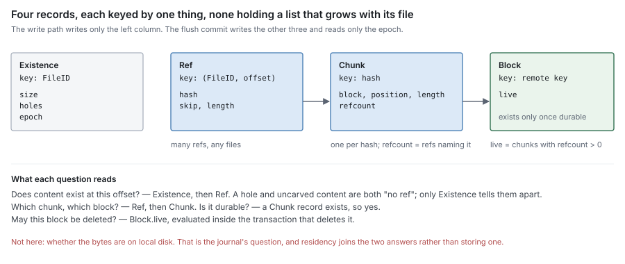
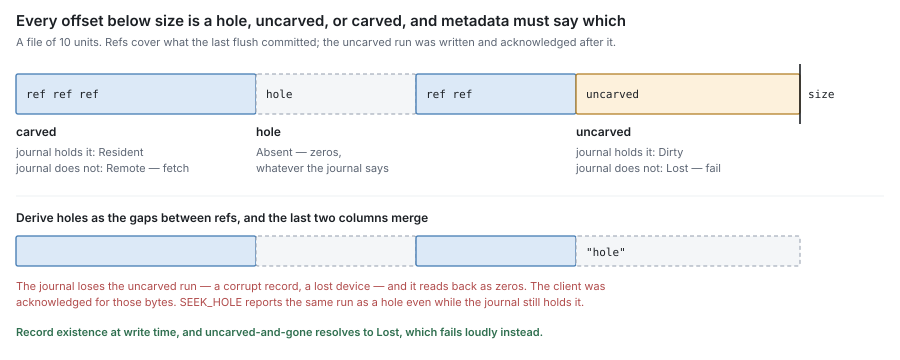
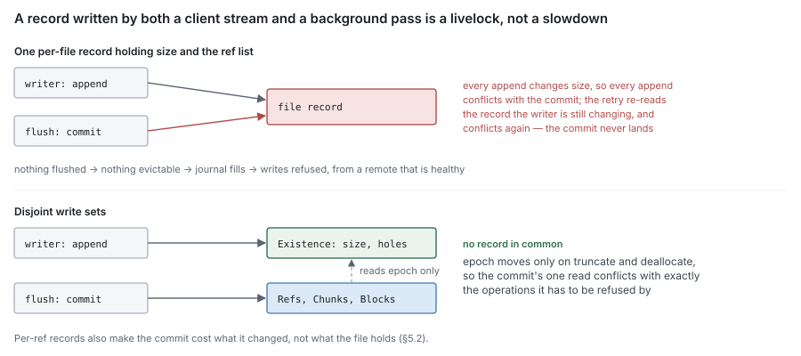

# RFC 4 — block metadata

**Status:** draft.
**Depends on:** RFC 0, for the terms, the residency function and the invariants.
RFC 2 supplies the chunks this component records and RFC 3 the durability reports.
Nothing here redefines them.
**Audience:** anyone changing a metadata backend's content records, or anything
that reads them — the read path, flush, sweep.

The key words **MUST**, **MUST NOT**, **SHOULD**, **SHOULD NOT** and **MAY** are
to be interpreted as in RFC 2119.

This document specifies what block metadata is required to be. It was written
from the model in RFC 0–3, not from the current schema. Where the current
implementation does not satisfy a requirement, that is recorded once, in §11, as
a **deviation**. A deviation is a defect to be fixed or migrated, never a rule for
an implementer to build around.

---

## 1. Purpose

Block metadata is the second oracle of RFC 0 §4.1. It answers, for any offset of
any file:

> **Does content exist here, which chunk holds it, which block holds that chunk,
> and is that block durable?**

It also counts references, so that sweep can tell what is safe to delete
(RFC 0 §8.3).

It is a **ledger**, not an observer. Every fact in it was reported by the
component that observed it — existence by the write path, chunks by the carver,
durability by the syncer — and this component's job is to record those facts
atomically and answer from them without distortion.

### 1.1 Non-goals

Block metadata **MUST NOT**:

- record where bytes sit on local disk, or whether they are local at all
  (RFC 0 §4.1) — that is the journal's question, and residency is computed, not
  stored (RFC 0 §4.2);
- observe durability — it records reports, and a record with no report behind it
  is a claim nothing verified (RFC 0 §4.3, RFC 3 §2.7);
- own names, directories, handles, permissions or locks — that is RFC 5;
- decide what to flush, evict or sweep — it supplies the atomic operations those
  decisions need (§7) and nothing more;
- import another component in this set (RFC 0 §1.2).

### 1.2 Why it is a separate RFC from the namespace

RFC 5 and this document are usually implemented in one database, often in one
transaction. They are specified separately because their write patterns are
different in kind:

| | Namespace metadata (RFC 5) | Block metadata (this RFC) |
| --- | --- | --- |
| Written by | client operations | client writes *and* background flush |
| Unit | one entry | one extent, one chunk, one block |
| Rate | per operation | per write, and per chunk at flush |
| Grows with | directory size | file size |

A design that stores both in one record per file puts a background process and
the client on the same key. §5 exists because that is how the system has already
failed once.

## 2. The records

Block metadata holds four kinds of record. Each is keyed by exactly one thing,
and none holds a list that grows with its file.

| Record | Keyed by | Holds | Written by |
| --- | --- | --- | --- |
| **Existence** | `FileID` | size, hole set, truncation epoch | the write path (§3) |
| **Ref** | `(FileID, offset)` | chunk hash, skip, length | flush commit (§4) |
| **Chunk** | chunk hash | block key, position in block, refcount | flush commit (§4) |
| **Block** | remote key | live-chunk count | flush commit, sweep (§7) |

### 2.1 Ref

A ref is RFC 0's **ChunkRef**: one file's use of one chunk at one offset. A file
here is an inode. A snapshot's copy of a file also owns refs, keyed by
`(snapshot, file)` in place of the file (§6.5).

    Ref(file, offset) = { hash, skip, length }

`skip` and `length` select `[skip, skip + length)` of the chunk's bytes. A ref
that uses a whole chunk has `skip = 0` and `length` equal to the chunk's length.
A ref **MUST** be able to name a strict sub-range of its chunk, because truncate
narrows the tail of one (RFC 0 §7) and deallocating the middle of a chunk leaves
two refs to it with different `skip`.

Refs of one file **MUST NOT** overlap. A file's refs, in offset order, tile the
parts of the file that have been carved and committed; everything else is a hole
or uncarved (§3.2).

**A ref is its own record.** An implementation **MUST NOT** store a file's refs as
one value, one document or one row holding the list. A single list costs a rewrite
of the whole list per commit, so writing a file of *N* chunks costs O(*N*²) — and
it makes the list a key every flush and every writer contend on (§5).

There is a third cost, and it is the one that has actually taken a server down.
A list that grows with its file eventually crosses whatever threshold the
storage engine uses to decide that a value is too large to keep inline, and what
lies on the far side of that threshold is usually reclaimed by a different
mechanism than ordinary records are. A store whose reclamation is driven by the
*inline* side can then be unable to see the garbage accumulating on the other:
each commit leaves a whole superseded list behind while contributing almost
nothing to the pressure that would trigger a reclamation pass. The growth is
unbounded and no counter reports it, because by the engine's own accounting
nothing is wrong.

Measured on the Badger backend: a `ChunkRef` encodes to ~108 bytes for a
typical ref and 156 at worst — the hash is always `"blake3:<64 hex>"`, and the
two integers and the `omitempty` start offset are longest at their maximum
values — so a whole-list manifest crosses the 1 MiB inline threshold somewhere
between ~6,700 and ~9,700 refs, a 26–38 GiB file at a 4 MiB average chunk. Note
that the bound to design against is the worst case, not the average: a rig whose
fixture encodes small offsets measures the wrong number by a third. Past that
point, 300 appends wrote 332 MiB of value log that a GC pass running every five
minutes reclaimed **none** of, because the discard statistics it selects on are
produced only by LSM compaction and the ~50-byte value pointer each commit adds
to the LSM never generates any. A captured store held 245 GiB of value log
against 0.15 GiB of live data.

So the rule is not only about cost: a whole-list record can be unreclaimable.
That is the general obligation, and it is stated once as **RFC 0 §9.1 (I7)** —
every stored record names what reclaims it, at its maximum size. The predicate
there is a record that grows with use rather than a list, because the identical
failure reached the namespace's attribute blob, which is a map and holds no refs
at all (RFC 5 §12.1).

A backend that holds a list at all **MUST** satisfy I7 for it. Segmenting the
list so no stored value reaches the threshold is one way; spilling each ref into
its own record, which is what §2.1 asks for on its own terms, is another and
satisfies both rules at once.

### 2.2 Chunk

    Chunk(hash) = { block, position, length, refcount }

A chunk is keyed by its BLAKE3-256 hash and by nothing else (RFC 2 §4). There is
**one chunk record per hash** in a namespace (RFC 2 §4.3), however many files and
offsets use it. A record keyed by `(file, offset)` that also carries a refcount
is a ref wearing a chunk's name, and the refcount on it counts nothing.

`block` and `position` locate the chunk's bytes: the remote key of the block that
carries it and where in that block it sits. This is what a partial retrieval
aligns to (RFC 8 §6.1).

### 2.3 Block

    Block(key) = { live }

`live` is the number of chunks carried by this block whose refcount is nonzero. A
block is sweepable when, and only when, `live` is zero (RFC 0 §8.3).

A block record has **no durability flag**, because it has no non-durable state:
by §4.2 a block record exists only once its block is durable. What a block record
records is that the block exists remotely and how much of it is still wanted.

### 2.4 Existence

    Existence(file) = { size, holes, epoch }

`holes` is the set of extents in `[0, size)` that were never written, or were
deallocated. `epoch` is a counter that only truncation and deallocation advance
(§6.2). §3 is entirely about why this record exists.

### 2.5 Refs name hashes, never blocks

A ref carries a chunk hash, and the chunk record says where that chunk lives. A ref
**MUST NOT** carry a block key or a position in a block.

The indirection is what lets a chunk move. Relocating a chunk into a new block
(§7.3) then rewrites one chunk record. If refs carried the location, the same move
would rewrite every ref of every file sharing the chunk, and any copy of the refs
taken earlier — a snapshot, a backup — would name a block that no longer exists.

### 2.6 The scope of a count

A refcount is only as good as the set of refs it counts. If a ref exists that the
count does not include, the count is low, and sweep deletes referenced content.

The records of §2 **MUST** therefore be held in one store per remote key
namespace (RFC 2 §4.3). A deployment **MUST** do one of two things:

- **One store per namespace.** Every share whose blocks can share a remote key
  records its refs in the store that counts them.
- **One namespace per store.** Key derivation includes the store's identity, so
  two stores can never name one object.

Two stores that can name one key, each keeping its own count, are forbidden. Each
count is then correct about its own store and too low about the object, and
neither store can tell.

The same reasoning bounds what absence proves. **The absence of a record here
MUST NOT be taken as evidence that a remote object is unreferenced.** It shows
only that this store does not reference the object. Another store, another
process or another deployment writing to the same bucket may reference it. How an
unrecorded object is collected is RFC 7's problem. This document only forbids
treating a missing record as proof that nothing references the object.

## 3. Existence

### 3.1 The gap this closes

RFC 0 §4.2 resolves an extent that no chunk covers to **Absent**, and reads it as
zeros. That is right for a hole and wrong for content that was written but not yet
carved: a client write is acknowledged long before its first flush (RFC 0 §5.1),
and until then no chunk covers it.

If the journal loses such an extent — a corrupt record (RFC 1 §9.3), a lost
device — metadata has no chunk, so the extent resolves to **Absent**, and the
system serves zeros for acknowledged data. That is I1's violation, reached through
the one window where only one oracle knew the content existed.

The fix is the same as RFC 0's own: stop asking one source a question it cannot
answer. **Existence is recorded at write time, independently of carving.**

### 3.2 Every offset is in exactly one class

For an offset below `size`, block metadata answers with one of three classes,
and the classes are disjoint and exhaustive:

| Class | Meaning | Residency with journal present | Residency with journal absent |
| --- | --- | --- | --- |
| **hole** | in the hole set | — | **Absent** |
| **uncarved** | not a hole, no ref covers it | **Dirty** | **Lost** |
| **carved** | a ref covers it | **Resident** | **Remote** |

An offset at or beyond `size` is past end of file and is not a residency question.

An implementation **MUST** distinguish *hole* from *uncarved*. Deriving holes as
"gaps between refs" is the error this section exists to forbid: it classes every
uncarved byte as a hole, and every such byte the journal loses reads back as
zeros. The same derivation gives `SEEK_HOLE` wrong answers for content written
since the last flush.

This table **amends RFC 0 §4.2** (§10). Its metadata column is these three
classes rather than "chunk exists" and "block durable", and the row
"chunk exists, block not durable" is unreachable, because a chunk record exists
only once its block is durable (§4.2).

### 3.3 Why holes, not written extents

Existence could be recorded either way round — the set of extents that were
written, or the set that were not. This document records **holes**, because of
what each costs the write path:

| | Record written extents | Record holes |
| --- | --- | --- |
| Overwrite inside the file | insert or merge an extent | nothing beyond size |
| Append at EOF | extend an extent | nothing beyond size |
| Write starting past EOF | insert an extent | add one hole for the gap |
| Write into a hole | insert an extent | shrink or split a hole |
| Grows with | every distinct write range | sparseness only |

Almost every write is an overwrite or an append, and those already update `size`
(RFC 0 §5.1). Recording holes adds nothing to them. A dense file has an empty hole
set however it was written.

The chosen representation is not otherwise normative. An implementation **MAY**
record written extents instead if it meets §3.2 and §3.4, and **MUST** then show
that its per-write cost does not grow with the number of prior writes.

### 3.4 Ordering against the journal

An extent leaves the hole set, or `size` grows past it, as a claim that its bytes
exist. The claim **MUST NOT** precede the bytes:

1. The namespace layer authorises the write (RFC 5).
2. The journal stages the bytes (RFC 1 §3.1).
3. Existence is recorded: `size` grown, holes shrunk.
4. The client is acknowledged.

Each crash point then resolves to a truthful answer:

| Crash after | Journal | Existence | Resolves to | For an acknowledged write? |
| --- | --- | --- | --- | --- |
| 2 | holds bytes | hole, or past `size` | **Absent**, or past EOF | no — never acknowledged, so zeros are correct |
| 3 | holds bytes | uncarved | **Dirty** | no — and the write survived anyway |

Reversing 2 and 3 makes the first crash resolve to **Lost** for a write that was
never acknowledged — a loud failure for data no client was promised.

The existence record **MUST** be at least as durable at step 4 as the journal's
record is under the configured policy (RFC 1 §6.2). An acknowledged write whose
bytes survive and whose existence does not is invisible, which is I1's violation
by the other route.

An implementation **MAY** group-commit existence across many writes, and
**SHOULD**, because appends change `size` on every write. It **MUST NOT**
acknowledge any write in the group before the group's commit.

**Existence MUST NOT be reconstructed from the journal.** Growing `size` after a
crash to cover what the journal holds makes the journal the oracle for existence
again, which RFC 0 §4.1 forbids — and it fails in the direction that matters: it
cannot recover what the journal lost, which is the only case the existence record
is for.

### 3.5 Operations that make holes

| Operation | Effect on existence |
| --- | --- |
| Write starting past `size` | `size` grows; `[old size, write offset)` becomes a hole |
| Truncate up | `size` grows; `[old size, new size)` becomes a hole |
| Truncate down | `size` shrinks; holes past it are dropped; `epoch` advances |
| Deallocate | the range becomes a hole; refs over it are dropped or narrowed (§6); `epoch` advances |
| Allocate | none — see below |

**Allocate MUST NOT remove a hole** unless the zeros it promises are staged in
the journal first, by §3.4. Removing a hole claims bytes exist. With nothing
staged the range becomes uncarved and journal-absent — **Lost** — so a
preallocated file would fail every read of a range it never wrote. Reporting
allocation to `SEEK_DATA` is RFC 5's, and it **MUST NOT** be done by editing
existence.

## 4. The flush commit

### 4.1 What one commit records

A flush pass (RFC 0 §5.2) ends in one commit per block, or one commit for several.
A commit records, in **one transaction**:

- the block record, with `live` set to the number of its chunks that the commit
  references;
- a chunk record for each chunk the block carries;
- the refs for the extents the pass carved, replacing what they overlap;
- the refcount changes those refs imply (§6), including for chunks the pass
  adopted from earlier blocks rather than carrying;
- the `live` changes those refcount changes imply.

Partial application of that list **MUST NOT** be observable: a ref without its
chunk, a refcount without its ref, or a chunk without its block each turns a
later read or a later sweep into a guess.

### 4.2 Only after durability

A commit **MUST NOT** run before the syncer has reported the block durable
(RFC 3 §2.6). Chunk and block records are therefore records of durable content, and
nothing else.

This is the rule that collapses RFC 0's five metadata states into §3.2's three. No
record says "this chunk exists but its block might not", so no reader has to
decide what that means.

> *Note.* Recording refs before the put would let a crash leave refs to a block
> that was never written. With content-derived keys (RFC 2 §4.2) that is not a
> leak, but it is a ref to nothing, and every reader would have to check
> durability on every ref. Committing after the report costs a window in which an
> uploaded block is recorded nowhere. That window is safe, because the key is its
> content and the retry targets the same object.

A share with no remote tier therefore never commits: its content stays uncarved
and **Dirty** for its lifetime, which is exactly what RFC 0 §8.1 requires of
content with no remote copy.

### 4.3 The commit is the report's return edge

The extents a commit covers are the extents the flush callback returns as durable
(RFC 0 §5.2). The callback **MUST NOT** return an extent whose commit has not
succeeded. That ordering is what lets a reseeding pass after a crash trust
metadata over the journal's unset flush bits (RFC 1 §9.2): a flush bit is never
set for content that metadata does not hold.

### 4.4 Commits for one file apply in order

A commit **MUST NOT** replace refs written by a commit of content offered later.

Two passes can carve overlapping extents of one file — B offered after a write
superseded what A was offered. If A commits after B, A's refs overwrite B's. The
journal has marked B's bytes durable, so it may release them, and a later read
fetches A's content for the offsets B wrote. That is silent corruption, and no
single component observes it.

An implementation **MUST** prevent this, either by never running two commits for
one file concurrently, or by carrying the journal version of the offered content
(RFC 1 §5.3) on each ref and refusing to replace a ref with one of lower version.
Serialising per file is the simpler of the two, and it is the engine's to do
(RFC 6). This document requires only the outcome.

## 5. Write sets

### 5.1 No record is written by both paths

The write path and the flush commit **MUST NOT** write a common record.

| | Existence | Ref | Chunk | Block |
| --- | --- | --- | --- | --- |
| Write path | writes | — | — | — |
| Flush commit | reads `epoch` | writes | writes | writes |
| Truncate, deallocate | writes | writes | writes | writes |
| Sweep | — | — | deletes | deletes |

A record written by both is a conflict between a client stream and a background
pass on every flush. Under optimistic concurrency the pass retries. The retry
re-reads the record the client is still writing, so it conflicts again, and the
pass never commits. Nothing is flushed, nothing becomes evictable, the journal
fills, and writes are refused (RFC 0 §10). That is livelock, not contention.
Backoff does not fix it, because the collision comes from the structure, not the
timing.

The flush commit *reads* `epoch` (§6.2). Truncation and deallocation are the only
writers of `epoch` and are rare, so the read conflicts only with the operations it
must conflict with.

`size` and `mtime` changes belong to the write path and are RFC 5's attributes.
The flush commit **MUST NOT** touch them. Flushing changes where content is, not
what it is.

### 5.2 Cost per commit is bounded by what changed

A flush commit **MUST** write O(refs replaced + chunks committed + blocks
committed) records, and **MUST** read no more than O(log *n*) records per ref it
replaces, where *n* is the number of refs in the file.

No per-commit cost may grow with the size of the file. A commit that is O(file)
makes a file of *N* chunks O(*N*²) to write, and makes the largest files, which
are the ones under the heaviest write load, the slowest to flush.

### 5.3 Hot records that are not per-file

§5.1 removes the per-file hot record. It does not remove every hot record:

- **A popular chunk's refcount.** Every file that references a common chunk
  increments one record. The commonest chunk by far is all zeros, which a
  content-defined chunker cuts at `Max` over any zero run (RFC 2 §3). Every
  preallocated or zero-filled region of every file then contends on it.
- **A popular block's `live`.** Moves only when a chunk's refcount crosses zero,
  so it is far colder than the refcount.
- **Usage accounting.** A per-owner byte or quota counter updated on every write
  is one record shared by all of that owner's files. It belongs to the write path
  and RFC 5, and by §5.1 the flush commit **MUST NOT** update it.

An implementation **SHOULD** measure the first two under a zero-heavy workload before
shipping. Remedies — a sharded counter, or not carving known-zero chunks and
recording them as holes — are open (§13).

## 6. Reference counting

### 6.1 A refcount is exactly its refs

A chunk's refcount **MUST** equal the number of refs naming it, at every commit
point. It **MUST** change in the same transaction as the refs that change it —
never before, never after, never in a second transaction a crash can separate
from the first.

A refcount that drifts high leaks a chunk forever. A refcount that drifts low lets
sweep delete a chunk that is still referenced. That is I3's violation, and the
only failure in this system that destroys the last copy of content (RFC 0 §8.3).

A block's `live` **MUST** move in the same transaction as every refcount crossing
between zero and nonzero, for a chunk that block carries.

### 6.2 Truncation and deallocation

Truncate down and deallocate change refs outside a flush, and **MUST** in one
transaction:

- drop the refs wholly inside the removed range, and decrement their chunks;
- narrow a ref that straddles its edge, by adjusting `skip` or `length`, so that
  no ref describes content outside the file's remaining extents (RFC 0 §7);
- split a ref that spans a deallocated range into two refs to the same chunk, and
  increment that chunk;
- update existence (§3.5) and advance `epoch`.

A flush commit **MUST** be refused if `epoch` has advanced since its extents were
offered. Without that check a pass that carved `[0, 10 MiB)` commits refs after
a concurrent truncate to 5 MiB. The file then holds refs past its end, and a
later truncate up turns them back into readable content where the user was
promised zeros. The refused pass is retried from the journal, which has already
truncated (RFC 1 §3.6).

`epoch` is advanced only by these two operations. An append **MUST NOT** advance
it. If it did, the check would conflict with every write, and §5.1 would be undone
by the back door.

### 6.3 Underflow is corruption, not a boundary

A decrement that would take a refcount or `live` below zero **MUST** fail the
transaction and **MUST** be reported as a consistency error naming the chunk or
block.

It **MUST NOT** clamp at zero. Clamping hides the defect that caused the
underflow, usually a double decrement. And the clamped value is itself wrong in
the dangerous direction: a count that was about to go negative was already too
low, so something else still references the chunk.

### 6.4 Delete

Deleting a file drops all its refs and decrements their chunks (RFC 0 §7). This
**MAY** be deferred past the namespace removal, and **MUST** then leak rather
than lose:

- refs outliving their file keep chunks alive. That is a leak, and it **MUST** be
  collectable without a full scan — by a durable record of the pending deletion
  that a restart resumes;
- a refcount decremented before its ref is removed is a sweep hazard, and **MUST
  NOT** happen.

### 6.5 Who owns a ref

Refs belong to an **inode**, not to a name. Hard links, a rename over an existing
file, moving a file to trash, and a file unlinked while still open are all
namespace states of one inode. None of them changes a ref. Block metadata **MUST
NOT** be told about names. It learns of a deletion only when RFC 5 releases the
inode, and that release is the delete of §6.4.

A **snapshot** that can be restored holds its content exactly as a file does, so
its refs **MUST** be counted exactly as a file's are. A snapshot's refs are owned
by `(snapshot, file)` rather than by a file, and creating a snapshot increments
every chunk it names.

The content a snapshot holds **MUST NOT** be protected by a separate list that
sweep consults instead of the count: a hold set, a pin list, or an extra root for
a mark phase. That is a second way of keeping content alive, and it fails open.
Every path that decides liveness has to remember to consult it. The path that
forgets deletes snapshotted content, and any check that reads the refcounts
reports that nothing is wrong. The same applies to any future holder of content:
if it can keep a chunk alive, it holds refs and is counted.

The cost is O(refs) increments per snapshot, paid when the snapshot is taken
(§13).

### 6.6 Clone and server-side copy

Cloning carved content copies refs, not bytes. Writing the destination's refs and
incrementing their chunks **MUST** happen in one transaction, and that transaction
is an adoption (§7.2): it **MUST** fail if any chunk it names has been retired. Any
refs the destination had over the cloned range are replaced, and their chunks are
decremented in the same transaction.

**Uncarved content cannot be cloned by reference**, because no chunk covers it
yet. For the uncarved extents of the source, a clone **MUST** either flush the
source first, or copy the bytes through the destination's write path (§3.4). It
**MUST NOT** record the destination range as existing, whether carved or
uncarved, unless its bytes are staged or its refs are written. Doing so claims
bytes that exist nowhere under the destination, and a read resolves to **Lost**.

## 7. What sweep needs from this component

Sweep's protocol is RFC 7's. It needs two atomic operations from this document,
and it cannot be made safe without them.

### 7.1 Conditional retirement

    Retire(block) — if live == 0: delete the block record and every chunk record
                    it carries; else: refuse

This **MUST** be one transaction, and the condition **MUST** be evaluated inside
it, not read beforehand. A sweep that reads `live`, decides, and deletes in a
separate step deletes a block that a commit re-adopted between the read and the
delete.

Retiring the records before deleting the remote object means a crash between the
two leaves an object nothing references. With content-derived keys (RFC 2 §4.2)
that object is findable by its content, and it is RFC 7's to collect. The reverse
order leaves records naming an object that no longer exists, so every read of
those chunks fails — which is **Lost** for content that was durable.

### 7.2 Adoption is conditional on existence

A flush commit that references a chunk it did not carry — deduplication — **MUST**
fail if that chunk's record no longer exists when the commit applies. It **MUST
NOT** recreate the record.

With §7.1 this closes the race without a clock. A commit that adopts before
retirement increments the refcount, `live` goes nonzero, and retirement refuses.
A commit that adopts after retirement finds no record and fails, and the pass
retries, carrying the chunk's bytes this time.

An implementation **MUST NOT** substitute a grace period for either operation.
RFC 0 §4.3 forbids inferring durability from elapsed time. Inferring that a block
is safe to delete because it has been unreferenced "for long enough" is the same
inference with worse consequences.

### 7.3 Relocation

Rewriting a block's surviving chunks into a new block, so that a mostly
unreferenced block can be retired, changes where chunks live. Deciding when to do
it belongs to RFC 7. This section covers only the record change.

After the syncer reports the new block durable, one transaction:

- points each moved chunk record at the new block and position;
- creates the new block record, with `live` equal to the number of moved chunks
  whose refcount is nonzero;
- decrements the old block's `live` by the same number.

Refs are untouched, by §2.5. If the old block's `live` reaches zero it becomes
retirable (§7.1). A chunk adopted by a commit that races the relocation is
counted in whichever block its record names when the adoption applies. That is
correct in both orders, because both transactions read and write that chunk
record and so cannot interleave.

### 7.4 Restore

Restoring block metadata from a copy — a snapshot, a backup — is not a write of
old records. It is a batch of adoptions.

- Every ref the restore writes names a chunk, and that chunk **MUST** exist when
  the restore applies (§7.2). A restore that would write a ref to a retired chunk
  **MUST** fail. Writing the ref would produce content that is **Lost** on first
  read, and nobody would know until then.
- Chunk and block records **MUST** be taken from the live store, never from the
  copy. The copy's locations may predate a relocation (§7.3). The copy's counts
  describe a store that no longer exists.
- Refcounts and `live` **MUST** change by the refs the restore adds and removes,
  as for any commit (§6.1).

A restore from a counted snapshot (§6.5) cannot fail the first check, because the
snapshot held its chunks. A restore from an uncounted copy can, and failing is
the correct outcome for it. Probing the remote tier after the restore does not
substitute for the first check: it runs after the records are written, and races
every sweep that runs in between.

### 7.5 Audit

Refcounts are sweep's only authority, so there **MUST** be a way to check them. An
audit recomputes each chunk's refcount from the refs that name it, and each
block's `live` from its chunks, and reports every mismatch.

A recomputation is valid only if it reads one consistent state of the store. A
walk that spans concurrent commits recounts a mixture of states and can come out
low.

- A repair **MAY** raise a count to its recomputed value. Raising a count that
  was right only leaks.
- A repair **MUST NOT** lower a count unless the recomputation came from a single
  consistent read and no commit, clone or restore ran between that read and the
  write. Lowering a count on the strength of a walk made while commits were
  running makes sweep unsafe.

## 8. Queries

### 8.1 Covering lookup

    Covering(file, offset) → ref | hole | uncarved | past EOF

This is the read path's question, asked once per extent the journal does not hold
(RFC 0 §6.1). It **MUST** be answered in O(log *n*) in the number of refs and holes
of that file, and **MUST** be a method on the declared interface.

It **MUST NOT** be reached by a type assertion that falls back to a scan. RFC 0
§1.2 explains why in general. Here specifically: the fallback is a read path that
still returns correct bytes, only linearly slower per read, so a backend that
loses the method by a rename degrades every cold read and no correctness test
notices.

A range form — the refs, holes and uncarved runs covering `[offset, offset + n)`,
in order — **SHOULD** exist, and **MUST** cost O(log *n* + results).

### 8.2 Deduplication lookup

    Durable(hash) → chunk | none

Returns the chunk record for `hash` if there is one. By §4.2 a record implies a
durable block, so this is the complete answer to "may this chunk be referenced
rather than uploaded" (RFC 2 §5). It **MUST NOT** consult anything that could
know about a block not yet committed.

The answer is advisory. A chunk it returns can be retired before the adopting
commit applies, and §7.2 is what makes that safe. The query **MUST NOT** be
treated as a reservation.

### 8.3 Whole-file identity

`ObjectID` (RFC 0 §3) is a function of a file's refs. An implementation **MAY**
store it. If it does, it **MUST** update it in the transaction that changes the
refs, and **MUST NOT** do so at a cost proportional to the file (§5.2). A stored
`ObjectID` that is not updated on every ref change is worse than none, because
whole-file deduplication would then reference the wrong content.

The alternative — computing it on demand, when whole-file deduplication asks — is
permitted and is the default. Whole-file deduplication is an accelerator
(RFC 0 §3.1), and it is cheaper to pay for it when it is used than on every
flush.

## 9. Invariants

| # | Invariant |
| --- | --- |
| M1 | Existence is recorded before a write is acknowledged, and a hole is distinguishable from uncarved content. |
| M2 | Existence is never reconstructed from the journal. |
| M3 | A chunk or block record exists only for content reported durable. |
| M4 | A chunk's refcount equals its refs, and `live` equals a block's referenced chunks, at every commit point. |
| M5 | A refcount or `live` that would go negative fails the transaction. |
| M6 | A block record is retired only by a conditional operation that evaluates `live` inside its own transaction. |
| M7 | Adoption of a chunk fails if its record is gone, and never recreates it. |
| M8 | No record is written by both the write path and the flush commit. |
| M9 | A flush commit's cost is bounded by what it changed, not by the file. |
| M10 | A commit never replaces refs from content offered later, nor commits past a truncation it did not see. |
| M11 | Block metadata records nothing about local placement. |
| M12 | Every holder of content — file, snapshot — holds counted refs. Nothing keeps content alive outside the count. |
| M13 | No two stores that can name one remote key keep separate counts, and the absence of a record is never evidence that an object is unreferenced. |
| M14 | Refs name hashes, never blocks. |
| M15 | A restore or clone is an adoption, and never copies a count or a location. |

M1, M3, M4 and M10 are the ones whose violation loses data or serves wrong
content. M6, M7, M12, M13 and M15 are sweep's safety, without which I3 cannot
hold. M8 and M9
are the ones whose violation stops the system, and M8 is the one that already has.

## 10. Consequences for RFC 0

This document changes two statements in RFC 0. Both need amending there, so that
the set does not carry two answers.

1. **§4.2, the residency function.** The metadata column is §3.2's three classes
   — hole, uncarved, carved. The row "chunk exists, block not durable" is
   unreachable by §4.2. The outcomes are unchanged, and I1 now holds across the
   window before the first flush, which it did not.
2. **§5.1, the write path.** Step 1's "updates size and mtime" moves after the
   journal stages the bytes, per §3.4. Authorisation stays first.

## 11. Deviations

The current implementation was checked against this document after it was
written. The design above does not follow from any of what is listed here.

| Requirement | Current state | Evidence |
| --- | --- | --- |
| §2.1 refs are records | Neither backend makes a ref a record. Badger stores the list in segments of at most 4096 refs under `fm:<uuid>:<seq>`, rewriting only the segments whose bytes changed, so an append at EOF costs one segment rather than the list; SQL stores one row per ref but loads the whole list to commit. | `store/badger/encoding.go:53`, `:87`, `store/badger/files.go:178`; `store/sql/files.go:141` |
| RFC 0 §9.1 (I7) reclamation path | Met on Badger, which is the backend the requirement was written after: 4096 refs is ~471 KiB typically and ~628 KiB at worst, against a 1 MiB threshold, and appending to a large manifest adds nothing to the value log. The bound is a constant with no run-time check, so a variable-length field on `ChunkRef` would retire it silently. Not applicable to SQL, which stores no list value. | `store/badger/encoding.go:87`, `store/badger/files.go:266` |
| §2.2 one chunk per hash | Chunk rows are keyed `(payload, offset)` and carry the refcount, so there is no per-hash record. Hash durability lives in a separate per-hash "synced" marker. | `pkg/block/types.go:226`, `store/badger/objects.go:41`, `store/badger/synced_hash_store.go:97` |
| §3 existence | Not recorded. Size is batched in memory and grown from the journal's high-water mark at startup (§3.4 forbids this). Hole-versus-evicted is decided by the journal's `cold.log`, and `SEEK_HOLE` derives holes from gaps between refs (§3.2 forbids this). | `pkg/metadata/pending_writes.go`, `pkg/block/journal/cold.go`, `pkg/block/holemap.go:6` |
| §5.1 disjoint write sets | Every carve commit rewrites the per-file record. A per-file commit lock exists to stop the resulting conflicts, and the production outage in the residency decision record is this conflict, livelocked. | `engine/flush.go:227`, `.planning/2026-09-23-residency-decision-record.md` §2 |
| §6.1 refcount is its refs | Refcounts are written as 0 and never incremented. Decrements run in transactions separate from the ref changes. `live` is set once at commit and moved only by GC. | `engine/flush.go:209`, `engine/readwrite.go:598`, `engine/coordinator.go:135`, `gc/gc_block.go:153` |
| §6.3 underflow fails | Clamped at zero in every backend. | `store/badger/objects.go:235`, `store/postgres/dialect.go:33`, `store/sqlite/dialect.go:35` |
| §7.1 conditional retirement | Reads `live`, decrements, deletes the remote object, then blind-deletes the record, each in its own step. | `gc/gc_block.go:127`, `store/badger/block_record_store.go:220` |
| §7.2 no grace period | A one-hour grace window, plus an in-process adoption guard that a second process cannot see. | `gc/sweep_index.go:50`, `gc/sweepguard.go` |
| §8.1 declared, O(log n) | Reached by type assertion with a full-list fallback. Badger scans O(n) per lookup. The memory backend scans every row in the store. | `engine/read_internal.go:217`, `store/badger/objects.go:543`, `store/memory/objects.go:503` |
| §8.3 ObjectID current | Computed only on shrink and punch, so a stored value goes stale on the next flush. | `pkg/metadata/file_modify.go:1049`, `pkg/metadata/sparse.go:91` |
| §2.6 scope of a count | Each share has its own metadata store, and shares with the same remote config share one bucket whose keys are not namespaced. GC unions the shares it knows about. Orphan reclaim deletes any object with no record in that union once it is older than the grace window. A second server, or a second config pointing at the same bucket, has its blocks deleted. | `pkg/block/locator.go:31`, `runtime/blockgc.go:72`, `runtime/blockgc_reconcile_reclaim.go:55`, `gc/orphan_reclaim.go` |
| §6.1, §6.5 the count is the authority | Sweep is decided by a mark phase over every chunk row, and refcounts decide nothing. Snapshots and open-but-unlinked files are protected by hold providers that add extra roots to the mark phase. | `gc/gc.go:494`, `gc/sweep_index.go:38`, `runtime/snapshot_hold.go:53`, `runtime/openhandle_hold.go:200` |
| §6.6 clone | Clone copies refs, but the refcount increment always misses (§6.1's row). Clone on a local-only share copies bytes instead. SMB server-side copy copies bytes. | `internal/adapter/common/clone.go:74`, `:116`, `engine/readwrite.go:598`, `ioctl_copychunk.go:503` |
| §7.4 restore adopts | A snapshot restore writes the dump's records, including its block records and their `live` counts. The only guard is a remote probe after the restore. A relocation after the snapshot leaves the dump naming a deleted block. | `pkg/snapshot/verify.go`, `gc/compaction.go:342` |
| §7.5 audit | Nothing recomputes `live`. The audit checks only that every ref has a chunk row. | `gc/audit.go`, `gc/repair.go` |
| RFC 0 §3 one identity | `PayloadID` is a second content identity with its own reverse index, although it is set once at create and never reassigned. | `pkg/metadata/file_create.go:445`, `store/badger/encoding.go:61` |

§4.2's ordering holds today, because the put comes before the commit
(`engine/flush.go:438`). §8.2 holds as a property of the synced marker rather than
of a chunk record.

This document does not schedule the migration. It records that the current state
fails the requirements above, and that a discrepancy **MUST NOT** be closed by
amending the requirement.

## 12. Conformance

RFC 1 §11 applies unchanged: conformance is every **MUST** holding, and a check is
validated by reverting the code and watching it fail on its own assertion.

Every check runs against every backend through `storetest`. A property that holds
on one backend and not another is the category of defect this document was
written after.

### 12.1 Group A — wrong content, lost content

| Requirement | Check |
| --- | --- |
| §3.2 hole vs uncarved | Write past EOF, do not flush, drop the journal's extent. Assert the gap reads zeros and the written range **fails**. A rig that only checks the zeros passes the build that serves zeros for both. |
| §3.4 no reconstruction | Crash with journal bytes past recorded `size`. Assert `size` is not grown on restart. |
| §3.5 allocate | Allocate a range with nothing staged. Assert it reads zeros, not a failure. |
| §4.4 commit order | Commit B, then commit A over the same offsets with a lower version. Assert B's refs survive. |
| §6.1 refcount | Over random interleavings of commit, truncate, deallocate and delete, assert after every transaction that each refcount equals a count of refs naming it. |
| §6.2 epoch | Offer, truncate, commit. Assert the commit is refused and no ref lies past `size`. |
| §6.3 underflow | Force a double decrement. Assert the transaction fails and the count is unchanged. |
| §7.1, §7.2 sweep race | Interleave `Retire` and an adopting commit in every order. Assert that either the block survives with the new ref, or the commit fails, and never a ref to a retired chunk. |
| §6.5 snapshot counted | Snapshot a file, delete the file. Assert every chunk's refcount is still nonzero and its block is not retirable, with no other liveness input configured. |
| §6.6 clone uncarved | Write a source without flushing, clone it, drop the source's journal extent. Assert the destination reads the written bytes, not a failure and not zeros. |
| §7.3 relocation | Relocate a block's chunks. Assert no ref changed, every read still resolves, and the old block is retirable. |
| §7.4 restore after retire | Take an uncounted copy, retire one of its chunks, restore. Assert the restore fails and wrote nothing. |
| §2.6 two stores | Point two stores at one remote namespace. Assert the configuration is refused, or that keys differ. |

### 12.2 Group B — cost

| Requirement | Check |
| --- | --- |
| §5.2 amplification | Write a file of *N* chunks for several *N*. Assert records **written** per commit are constant in *N*. A correctness assertion on the resulting refs passes a quadratic implementation. |
| §5.1 write sets | Stream appends to one file while its flush commits. Assert every commit succeeds without a retry caused by the writer. |
| §8.1 lookup | Assert records **read** per covering lookup grow at most logarithmically in *N*. |
| §8.1 declared | Build every backend against the interface with the lookup method. A backend that lacks it **MUST** fail to compile. |
| RFC 0 §9.1 (I7) | Store manifests across a range of sizes. Assert no single stored value reaches the engine's inline threshold, sizing the refs at their worst-case encoding rather than a fixture's. Then append to a manifest past the old threshold and assert the store reclaimed by the *other* mechanism does not grow at all. |

### 12.3 What must not stand in

- **A correctness assertion MUST NOT stand in for §5.2 or RFC 0 §9.1.** The quadratic
  implementation returns the right refs, and so does the one filling an
  unreclaimable log. Only a count of writes, or of bytes landing on the far side
  of the threshold, observes either.
- **A fixture MUST NOT set the threshold margin.** Refs whose offsets are small
  encode a third shorter than the worst case, so a bound checked only against
  such a fixture is not the bound the rule asks for.
- **The memory backend MUST NOT be the only backend for Group B.** Its costs are
  not any durable backend's.
- **A single-writer rig MUST NOT stand in for §5.1.** The failure needs a client
  stream and a flush on the same file at once.

## 13. Open questions

1. **The zero chunk** (§5.3). Its refcount is the hottest record in any
   deployment with sparse or preallocated files. Recording zero runs as holes
   instead of carving them removes the record entirely. It also means the carver,
   or the engine before it, recognises zero runs, which RFC 2 does not yet specify.
2. **Group-commit window** (§3.4). Existence is committed per acknowledged write,
   or per group. What group size keeps a streaming SMB write from paying one
   metadata commit per write is unmeasured.
3. **Existence under a relaxed sync policy.** When the journal acknowledges before
   its record is on disk (RFC 1 §6.2), a crash can lose bytes whose existence was
   recorded, and they then resolve to **Lost**. That is truthful, and it is what the
   policy traded away. Whether it should instead resolve to **Absent**, which
   requires existence to be exactly as durable as the journal and no more, wants
   deciding with RFC 1's policy table.
4. **Refs of a deleted file** (§6.4). Deferring the decrement keeps delete fast.
   The durable record of pending deletions is one more thing a restart resumes.
   Whether deletion is ever slow enough to justify it is unmeasured.
5. **Snapshot cost** (§6.5). Counting a snapshot's refs costs O(refs) increments
   when it is taken, and those increments land on the hottest counters (§5.3).
   A copy-on-write snapshot, which counts a whole ref set once and copies it only
   when a file diverges, avoids that. But it makes "which refs name this chunk" a
   two-level question, which §7.5's audit must then answer too.
6. **Mark-sweep instead of counts.** RFC 0 §8.3 chose reference counting, and this
   document specifies it. Mark-sweep has no hot counters and cannot drift. It
   costs a walk of every ref per sweep, and it needs its own answer to adoption
   during the walk. If §5.3 or §6.5 turn out too costly under measurement, the
   choice belongs in RFC 0, not in a second mechanism added beside the first.
7. **Where existence lives.** §1.2 separates it from the namespace by write
   pattern. But `size` is also a namespace attribute that RFC 5 returns on every
   `GETATTR`. Whether one record serves both, or existence owns `size` and RFC 5
   reads it, is RFC 5's to settle, and it must not reintroduce §5.1's shared
   record.
