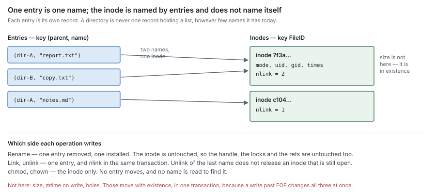
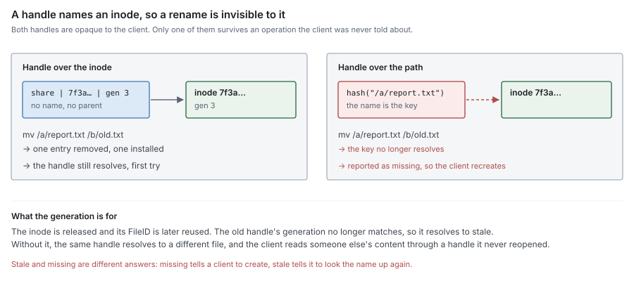

# RFC 5 — namespace metadata

**Status:** draft.
**Depends on:** RFC 0, for the terms, the identifiers and the invariants. RFC 4
owns the records that describe a file's content; this document owns the records
that describe the file. Nothing here redefines either.
**Audience:** anyone changing a metadata backend's namespace records, the
handle format, the permission path, or lock state — and anyone writing a
protocol adapter that consumes them.

The key words **MUST**, **MUST NOT**, **SHOULD**, **SHOULD NOT** and **MAY** are
to be interpreted as in RFC 2119.

This document specifies what namespace metadata is required to be. It was
written from the model in RFC 0 and RFC 4, not from the current schema. Where
the current implementation does not satisfy a requirement, that is recorded
once, in §12, as a **deviation**. A deviation is a defect to be fixed or
migrated, never a rule for an implementer to build around.

---

## 1. Purpose

Namespace metadata answers, for any client operation:

> **What entries exist, what are they called, which inode does a name resolve
> to, may this caller do this, and who is holding it open?**

Everything a client can name, it names through this component. It is the only
component that knows about paths, and it is the only component that decides
whether an operation is allowed to happen at all.

It is also the component that decides when an inode stops existing, which is
what releases its content (RFC 4 §6.4). Nothing else in the set may make that
decision, and nothing else may keep content alive behind this component's back
(§4.4).

### 1.1 Non-goals

Namespace metadata **MUST NOT**:

- hold content bytes, or know where they are — local placement is RFC 1's,
  residency is computed and never stored (RFC 0 §4.2);
- hold chunks, refs, blocks or refcounts — those are RFC 4's, and this component
  learns of them only through the interfaces it declares (§2.5, §4.3);
- decide what to flush, evict or sweep;
- encode or decode a wire protocol. A handle is opaque at this boundary and
  *stays* opaque above it (§6);
- import another component in this set (RFC 0 §1.2).

### 1.2 Why it is a separate RFC from block metadata

RFC 4 §1.2 gives the reason and the table: the two are usually one database,
often one transaction, and they are specified apart because their write patterns
differ in kind. This document does not restate it.

The consequence that matters here is directional. Block metadata **MUST NOT** be
told about names (RFC 4 §6.5); it learns of a deletion only when this component
releases an inode. So every rule below about what keeps an inode alive is a rule
about when content may be destroyed, one component removed.

## 2. The records

Namespace metadata holds two kinds of record.

| Record | Keyed by | Holds | Written by |
| --- | --- | --- | --- |
| **Inode** | `FileID` | type, mode, owner, group, times, `nlink`, parent (directories only) | attribute operations, link and unlink (§4) |
| **Entry** | `(parent FileID, name)` | child `FileID`, child type | create, link, unlink, rename (§3, §5) |

### 2.1 Inode

    Inode(id) = { type, mode, uid, gid, atime, mtime, ctime, nlink, parent? }

`id` is RFC 0 §3's `ID`: a UUID, stable for the life of the file, unchanged by
rename, relink or rewriting the contents.

An inode **MUST NOT** carry its own name, its own path, or a list of the entries
that name it. It is named *by* entries; it does not name itself. A name stored
on the inode is a second copy of the entry, and rename then has to keep two
records in step for no gain.

`parent` exists only for directories, and only because `..` has to resolve
without a search. It is exact, because a directory has exactly one entry naming
it (§4.1).

### 2.2 Entry

    Entry(parent, name) = { child, type }

One entry is one name in one directory. The child type is carried so that a
listing does not have to read every inode it returns; it is a copy, and it
**MUST** be written in the same transaction as the entry, never refreshed later.

**An entry is its own record.** An implementation **MUST NOT** store a
directory's entries as one value, one document or one row holding the list. This
is RFC 4 §2.1's rule with a different key, and it fails the same two ways: a
directory of *N* entries costs O(*N*²) to fill, and the list becomes a key that
every concurrent create, unlink and rename in that directory contends on.

A directory is large because a user made it large. Nothing else in this system
lets one client's behaviour choose the cost of another's.

### 2.3 The name is not the identity

Every other component in the set keys content by `FileID` (RFC 0 §3). This is
the component that owns the mapping from a name to that identity, and it is the
only one allowed to hold it.

A path **MUST NOT** appear in a handle (§6.1), in a lock (§8.2), in a ref
(RFC 4 §6.5) or in a journal key (RFC 1). Each of those outlives a rename, and a
path does not.

### 2.4 Attributes, and who writes them

| Attribute | Changed by | Written in the transaction of |
| --- | --- | --- |
| `mode`, `uid`, `gid` | chmod, chown, ACL change | its own operation |
| `atime` | read, and only if the policy records it (§9.3) | its own operation |
| `mtime`, `ctime` on write | a client write | **existence** (§2.5) |
| `ctime` on attribute change | chmod, chown, link, unlink, rename | its own operation |
| `nlink` | link, unlink, rename over an existing entry | the entry change that caused it (§4.1) |
| `size` | a client write, truncate, deallocate | **not stored here** (§2.5) |

The flush commit appears nowhere in that table, and **MUST NOT** (RFC 4 §5.1).
Flushing changes where content is, not what it is, and an inode record it could
write would be a record the client path and a background pass share — the shape
that has already wedged this system once (RFC 4 §5).

### 2.5 Where `size` lives

RFC 4 §13.7 leaves this open. It is settled here: **`size` is not a namespace
record.** This component does not store it, and reads it through an interface it
declares for the need:

    Size(file) → bytes

The engine supplies RFC 4's existence record (RFC 4 §2.4) at composition time.
Per RFC 0 §1.2 this **MUST** be a declared interface; a backend that does not
supply it **MUST** fail to build.

Three reasons, in order of how much they cost to get wrong:

1. **`size` and the hole set move together.** A write past EOF grows `size` *and*
   adds a hole for the gap it skipped (RFC 4 §3.5). Split across two records,
   the crash between them leaves a `size` covering a range no hole records and
   no journal holds — content claimed to exist that was never written, which
   resolves **Lost** and fails a read that should have returned zeros.
2. **`size` carries the write path's durability.** It **MUST** be as durable as
   the journal's record at acknowledgement (RFC 4 §3.4). An inode record holding
   it inherits that schedule for `mode` and `uid` too, which need it far less and
   pay for it on every chmod.
3. **Two copies drift and nothing notices.** `GETATTR` and a read would answer
   from different records, and the disagreement is silent in both directions.

The same applies to `mtime` and `ctime` when a write changes them: this
component defines what they mean, and they **MUST** be written in the same
transaction as existence. Whether they share its record is free — §2.4's
requirement is the transaction, not the layout.

What this component **MUST NOT** do is keep a second `size` "for `GETATTR`
speed". That is the drift in reason 3 with a justification attached.

## 3. Names

### 3.1 Lookup resolves a name to an inode, and that is all it does

    Lookup(parent, name) → inode | none

A lookup **MUST** be O(log *n*) or better in the number of entries in the
directory, and **MUST NOT** be answered by enumerating it. A backend that
answers lookup with a scan turns every path resolution into a directory read,
so a deep path in a large tree costs the sum of every directory along it.

Resolution of a multi-component path is the caller's loop over this operation,
one directory at a time, with a permission check on each (§7.2). This component
**MUST NOT** offer a whole-path resolve that skips the intermediate checks.

### 3.2 A name is bytes, and it is validated at the boundary

A name is a byte string. This component **MUST** reject:

- the empty name;
- a name containing the path separator or a NUL;
- `.` and `..` as stored entries — they are resolved, never recorded (§3.4);
- a name longer than the configured maximum.

It **MUST NOT** normalise, case-fold, transcode or otherwise rewrite a name it
was given. A name that comes back different from the one that went in is a name
the client cannot use, and the client has no way to discover the rule that
changed it.

Validation happens here, not in the adapters, because there is more than one
adapter and a rule enforced in one of them is a rule the other does not have.

### 3.3 Case

Case sensitivity is a property of the share, decided once at configuration, and
**MUST NOT** vary between adapters reaching the same share. A case-insensitive
share **MUST** preserve the case it was given and compare without it: the entry
records what the client sent, the index answers either way.

Two adapters disagreeing about case on one share is not a cosmetic difference.
Under SMB semantics `README` and `readme` are one entry and the second create
fails; under POSIX semantics they are two, and a client that made both then
sees one of them disappear the next time the other adapter writes.

### 3.4 Enumeration

    List(parent, cursor, n) → entries, next cursor

A listing **MUST** be answered by a scan bounded by the entries returned —
O(log *n* + results) — never by reading the directory whole to return a page of
it.

`.` and `..` are synthesised at the boundary that needs them, from the directory
itself and its `parent` (§2.1). They **MUST NOT** be stored, because a stored
`..` is a second copy of the parent pointer that rename then has to move.

### 3.5 A cookie survives concurrent mutation

A listing cursor **MUST NOT** be a positional index. It **MUST** be derived from
the ordering key of the last entry returned, so that an insert or a delete
elsewhere in the directory does not shift what the next page contains.

With a positional cursor, deleting an entry before the cursor shifts every later
entry down one, and the client silently skips one; inserting shifts them up, and
the client sees one twice. Neither is an error anyone observes — the listing just
comes back wrong, in a directory that was being written while it was read.

An entry that is created or removed during a listing **MAY** be returned or
omitted. An entry present and untouched throughout **MUST** be returned exactly
once.

Where a protocol has a cookie verifier, it identifies the directory's ordering
generation and **MUST** change only when that ordering changes — not on every
mutation, which would restart every listing of a busy directory forever.

## 4. What keeps an inode alive

### 4.1 `nlink` is exactly its entries

An inode's `nlink` **MUST** equal the number of entries naming it, at every
commit point, and **MUST** change in the same transaction as the entry that
changes it.

This is RFC 4 §6.1's rule for refcounts, one level up, and it fails the same two
ways. Drifting high leaks an inode and everything it references. Drifting low
releases an inode a name still resolves to, so the entry survives pointing at
nothing.

A decrement that would take `nlink` below zero **MUST** fail the transaction and
be reported as a consistency error naming the inode. It **MUST NOT** be clamped:
the count was already too low before the decrement, so something else still
names the inode (RFC 4 §6.3).

Hard links to directories **MUST** be refused, which is what makes `parent`
exact and what makes the rename loop check terminate (§5.2).

### 4.2 Open state is the second holder

An inode with `nlink` zero that is still open **MUST NOT** be released. Its
entries are gone and no name resolves to it; its content is still readable
through the handles that were opened before the unlink, and stays so until the
last of them closes.

Open state is therefore a holder of the inode in exactly the sense `nlink` is,
and the release condition is both:

> An inode is released when `nlink` is zero **and** no open state references it.

### 4.3 Release is what block metadata sees

Releasing an inode drops its refs and decrements the chunks they name
(RFC 0 §7, RFC 4 §6.4). This component **MUST** perform the release through an
interface it declares for the need — it does not reach into block metadata, and
block metadata is never told the name that was removed (RFC 4 §6.5).

Release **MAY** be deferred past the namespace removal, and **MUST** then be
recorded durably so that a restart resumes it (RFC 4 §6.4). An unlink that
returns to the client before the release is durable, and is then forgotten,
leaks every chunk of the file with nothing left to find them by.

### 4.4 There is no third holder

`nlink` and open state are the only things that keep an inode alive. An
implementation **MUST NOT** add a second mechanism — a hold list, a pin set, a
protected-inode table, an extra root consulted by a sweep.

This is RFC 4 §6.5 and M12 restated where the temptation actually arises. A
snapshot holds counted refs; an open-but-unlinked file is an ordinary inode with
zero entries. Both are already alive by the rules above, and neither needs a
list.

A second mechanism fails open. Every path that decides liveness has to remember
to consult it; the path that forgets deletes content that was held, and an audit
that recomputes counts (RFC 4 §7.5) reports nothing wrong, because by the counts
nothing *was* wrong.

## 5. Rename

### 5.1 One transaction

Rename removes the source entry, installs the destination entry, and adjusts
every count those two changes imply — in **one transaction**:

- the source entry is removed;
- the destination entry is installed, replacing an existing entry if one is
  there;
- the replaced entry's inode has `nlink` decremented, and is released if §4.2's
  condition now holds;
- a renamed directory's `parent` is updated;
- both directories' `mtime` and `ctime` advance, and the renamed inode's `ctime`
  advances.

Partial application **MUST NOT** be observable. A rename visible at neither name
loses a file that was never deleted; a rename visible at both makes one inode
reachable by two paths with `nlink` one, and the first unlink of either then
releases content the other still names.

### 5.2 The loop check is inside the transaction

Renaming a directory into its own descendant **MUST** be refused, and the check
**MUST** be evaluated in the same transaction that performs the rename.

A check made before the transaction is vacuous: it walks the ancestors of the
destination, finds the source absent, and by the time the rename applies a
concurrent rename has moved the destination under the source. The result is a
cycle of directories that no path reaches, that `nlink` says are alive, and that
nothing will ever release.

This is the same failure as RFC 4 §7.1's blind delete — a condition read before
the operation that changes it — and it needs the same remedy, not a lock taken
around the read.

### 5.3 Rename moves an entry and nothing else

A rename **MUST NOT** change a handle (§6.1), invalidate a lock (§8.2), touch a
ref (RFC 4 §6.5), or move a byte. Everything below this component keys on the
inode, which did not change.

An implementation that has to do work proportional to a file's size or its lock
count on rename has put the name somewhere it does not belong, and §2.3 names
where to look.

## 6. Handles

### 6.1 A handle names an inode, never a path

A handle is opaque (RFC 0's rule for the set, and this component's to keep). It
is generated here and resolved here. No adapter parses one, constructs one, or
derives one from another.

A handle **MUST** encode:

- the **share** it belongs to, so the runtime can route without interpreting the
  rest;
- the **inode**, by `FileID`;
- a **generation**, so that a handle to a released inode is refused rather than
  answered (§6.3).

A handle **MUST NOT** encode a path, a name, a parent, or an offset into a
directory. All four change while the inode does not, so a handle carrying one is
a handle that breaks on an operation that was supposed to be invisible to it.

### 6.2 A handle is stable across restart

A handle **MUST** remain valid across a server restart for any inode that still
exists. It follows from `FileID` being durable (RFC 0 §3) and from the
generation being durable with it.

A handle derived from anything a restart re-derives — a table index, a pointer,
a hash of in-memory state — is a handle that every client has to rediscover
after a restart it was not told about.

### 6.3 Staleness is reported, never guessed

Resolving a handle returns one of three answers, and they are distinct:

| Answer | When | Reported as |
| --- | --- | --- |
| the inode | it exists and the generation matches | success |
| **stale** | the inode was released, or the generation does not match | stale-handle error |
| **not this share** | the handle's share is not the one asked | access error |

A handle whose inode is gone **MUST NOT** resolve to a new inode that reused its
`FileID`, which is what the generation is for, and **MUST NOT** be reported as a
missing file. "Not found" tells a client to create; "stale" tells it to look the
name up again. Answering the first for the second makes a client recreate a file
that a rename had merely moved.

### 6.4 Resolution does not touch the namespace

Handle resolution **MUST** be a direct lookup of the inode, O(1) or O(log *n*),
and **MUST NOT** walk directories, resolve a path, or consult an entry record.

Every operation on an open file resolves a handle first. A resolution that walks
the namespace makes the cost of reading a file depend on how deep it was put and
how large the directories above it are, for the whole time it is open.

### 6.5 A protocol's numeric file id is derived, and collisions are its problem

Some protocols report a fixed-width integer identifying a file, narrower than
the handle. Where one is derived by truncating or hashing the handle, the
derivation **MUST** be one of:

- injective over the inodes of a share — a counter or a stored column; or
- accompanied by a collision check that refuses or re-derives.

A truncated hash with neither is a silent aliasing of two files. Clients that
treat the id as identity — hard-link detection, `find -samefile`, backup tools
deciding two paths are one file — then conclude that two unrelated files are
one, and back up or restore only one of them.

## 7. Permissions

### 7.1 One chokepoint

Every permission decision is **made** in this component. A protocol handler
**MUST NOT** evaluate a mode, an ACL or a share's read-only flag itself, and
**MUST NOT** be able to reach an operation that was never authorised.

There is more than one adapter. A check that lives in an adapter is a check the
other adapter does not have, and the only way anyone discovers that is a client
reaching data through the protocol nobody audited.

### 7.2 Two timings, both allowed; one owner, always

Protocols differ on *when* they check, and this component accommodates both:

| Timing | The check | Later operations |
| --- | --- | --- |
| **per operation** | runs on every call, against the inode | each is checked |
| **at open** | runs once, and the granted access is the result | gated on the grant |

Neither is wrong. An open-time grant is how a handle-oriented protocol is
specified, and re-deriving it per operation would change the semantics the
client was promised — an access revoked after the open would start failing
writes that the protocol says must keep succeeding.

What **MUST NOT** differ is the owner. A grant computed at open is a decision,
so this component computes it, stores it against the open state it belongs to
(§8.1), and evaluates it on the operations it gates. An adapter that computes
its own grant and passes the verdict back in as a flag has moved the decision
out of the one place §7.1 requires it to be, and the other adapter cannot see
the grant at all.

A grant **MUST** name the inode it was computed against, and an operation
**MUST NOT** be gated on a grant computed against a different one.

### 7.3 The decision is against the inode, not the name

A check **MUST** read the inode the operation will act on, in the state the
operation will act on it. Checking a name, then acting on whatever that name
resolves to later, is two observations of a thing that can change between them.

For a path of several components, each directory is checked for traversal as it
is resolved (§3.1). The checks are not collapsible into one check on the leaf:
a caller with no right to enter a directory has no right to what is inside it,
however the leaf's own mode reads.

### 7.4 The identity arrives resolved

This component receives a resolved identity and applies it. It **MUST NOT** know
about export policy, squashing, authentication flavours or netgroups. Those are
adapter concerns, applied before the call, and the identity that arrives here is
what the caller already is.

An identity **MUST** carry every field any check reads — including the ones a
particular backend's checks do not read — because the component that builds it
cannot know which check runs.

### 7.5 A cached decision is keyed by everything it read

An implementation **MAY** cache a resolved identity or an authorisation result.
The key **MUST** include every field the cached value was derived from.

This is the failure that has to be named rather than implied. A key written
against the fields an identity had at the time it was written stays compiling,
stays passing, and silently starts colliding the moment the identity grows a
field — two callers whose old fields match are served one another's decision.
It fails **open**, and it is invisible to a search for the new field's name,
because the defect is in the key and the key never mentions it.

Adding a field to an identity is therefore an edit to every key derived from
one, and a key that cannot be shown to include the whole identity **MUST** be
replaced by one that does.

## 8. Locks and open state

### 8.1 Four kinds of state, one owner

| State | Granted by | Conflicts with | Lifetime |
| --- | --- | --- | --- |
| **open** | an open | a deny mode (§8.4) | until close |
| **byte-range lock** | a lock request | an overlapping lock on the same extent | until unlock, close, or lease expiry |
| **deny mode** | an open | an open asking for denied access | until close |
| **delegation** | the server, unasked | any conflicting access by another client (§8.5) | until recalled, revoked, or expired |

All four are held against an inode and all four are this component's, because
all four are consulted by operations this component authorises. An implementation
**MUST NOT** hold one of them in an adapter, where the other adapter cannot see
it: a byte-range lock that one protocol grants and the other does not observe is
not a lock.

### 8.2 A lock is held against an inode

Lock state is keyed by the inode, never by a name or a handle. A rename does not
disturb it (§5.3), and two hard links to one inode are one lockable object, not
two.

Keying by handle is the subtler error: one client may hold several handles to
one inode, and a lock that one handle can see and another cannot is a lock the
same client can take twice.

### 8.3 Lock state is volatile, and the grace period is what makes that safe

Lock state **MAY** be held in memory and lost on restart. It **MUST NOT** be the
reason an operation blocks on a holder that no longer exists.

An implementation that discards lock state on restart **MUST** then refuse to
grant a *new* conflicting lock for at least one lease period after it starts, so
that a client reclaiming a lock it held before the restart finds it available
and a client that did not hold one cannot take it first. Without that window,
two clients that were correctly serialised before the restart are both granted
the same lock after it, and neither is told.

The window **MUST** end on its own (RFC 0 §10.2). A server that will not leave a
grace period until an operator acts has replaced one wedge with another.

### 8.4 A deny mode is checked at open

A deny mode is evaluated once, when an open is granted, against the opens
already held. It **MUST NOT** be re-evaluated per read or per write: the open
that was granted was granted, and a later open cannot retroactively forbid it.

An open that conflicts is refused. It **MUST NOT** be downgraded silently to a
weaker access than the client asked for — a client that asked for write and got
read discovers it on the first write, having already decided the file was
writable.

### 8.5 A delegation MUST be revocable within a bounded time

A delegation is a promise that no one else is touching a file, and it is only
safe if it can be taken back. A recall **MUST** have a deadline, and a client
that does not return the delegation by the deadline **MUST** have it revoked.

Waiting indefinitely for a client that has stopped answering blocks every other
client of that file, on nothing but a promise the server made unprompted. A
revoked delegation costs one client its cache; an unbounded recall costs every
other client the file.

### 8.6 Locks do not pin bytes

Holding a lock, a deny mode or a delegation **MUST NOT** make an extent
ineligible for eviction (RFC 0 §8.1) or for reclamation (RFC 0 §8.2). All three
are statements about who may act on a file, not about where its bytes are.

Coupling them is how a local tier fills up with content that is durable remotely
and cannot be released because a client left a handle open.

## 9. Attributes and what is not one

### 9.1 Attributes are answers, not caches

`GETATTR` joins this component's inode record with `Size(file)` (§2.5). The join
happens per request. An implementation **MUST NOT** hold a materialised attribute
row that a background pass refreshes: it is a cache that can outlive its inputs,
and RFC 0 §4.2 forbids exactly that shape for residency for exactly this reason.

### 9.2 Timestamps

`mtime` and `ctime` on write are written with existence (§2.5). `ctime` advances
on every attribute and link change, `mtime` only on content change. An
implementation **MUST NOT** advance `mtime` for an operation that changed no
content — a flush, an eviction, a fill and a relocation all leave it untouched,
because none of them changed what the file is.

`atime` **MAY** be omitted, or updated on a coarse schedule. An implementation
that updates it on every read has made every read a write, on a record shared by
every reader of that file. If it is updated at all, the policy **MUST** be
configured, not per-adapter.

### 9.3 Residency is not an attribute

There **MUST NOT** be an attribute, extended attribute or flag reporting whether
a file is local, cached, evicted or remote.

Residency is computed from two oracles at the moment it is asked (RFC 0 §4.2).
Anything stored is a third answer that can disagree with both, and the first
consumer of it will be something that decides whether to read.

Reporting *allocation* to `SEEK_DATA` and `SEEK_HOLE` is this component's, and
it **MUST** be answered from RFC 4's hole set through a declared interface. It
**MUST NOT** be answered from the journal, which cannot tell "never written"
from "no longer held" (RFC 0 §4.1), and **MUST NOT** be implemented by editing
existence (RFC 4 §3.5).

## 10. Invariants

| # | Invariant |
| --- | --- |
| N1 | An inode's `nlink` equals the number of entries naming it, changes in the transaction that changes them, and fails the transaction rather than going negative. |
| N2 | An inode is released when, and only when, `nlink` is zero and no open state references it. Nothing else keeps an inode alive. |
| N3 | Release drops the inode's refs, through a declared interface, durably enough that a restart resumes a deferred one. |
| N4 | A rename applies wholly or not at all, and its loop check is evaluated inside its transaction. |
| N5 | A handle names an inode and a share, is stable across restart, and resolves to stale — never to another inode and never to "not found" — when its inode is gone. |
| N6 | No name, path or parent appears in a handle, a lock, a ref or a journal key. |
| N7 | Every permission decision is made in this component, against the inode the operation will act on, and a grant made at open is stored and evaluated here rather than in an adapter. |
| N8 | A cached authorisation or identity is keyed by every field it was derived from. |
| N9 | Lock state is keyed by inode, visible to every adapter, and never blocks on a holder that no longer exists. |
| N10 | A grace period, a recall and every other wait in this component ends without operator action. |
| N11 | Lock state never makes an extent ineligible for eviction or reclamation. |
| N12 | `size` is stored once, in existence, and this component reads it through a declared interface. |
| N13 | An entry is its own record, and no operation's cost grows with the size of its directory beyond the results it returns. |
| N14 | Residency is not an attribute. |

N1, N2, N3 and N4 are the ones whose violation loses content or serves the wrong
file. N5, N7 and N8 are the ones whose violation serves content to the wrong
caller. N13 is the one whose violation stops the system under a load a single
user can create.

## 11. Consequences for RFC 0 and RFC 4

1. **RFC 4 §13.7 is answered.** `size` lives in existence and this component
   reads it (§2.5). RFC 4's open question should record the answer and its
   §5.1 table is unaffected — existence is still written by the write path only.
2. **RFC 0 §5.1, step 1.** "The namespace layer authorises the write and updates
   size and mtime" is two things with different owners. Authorisation is this
   component's and stays at step 1; `size` and `mtime` move to the existence
   commit, as RFC 4 §10 already amends.
3. **RFC 0 §7, delete.** "The namespace entry and all the file's chunk refs are
   removed" happens in two steps with a condition between them: the entry goes,
   and the refs go when §4.2's release condition holds. RFC 0's sentence reads
   as though open files do not exist.

## 12. Deviations

The current implementation was checked against this document after it was
written. The design above does not follow from any deviation listed here.

The entry/inode split of §2 is already real: `inodes` is keyed by UUID,
`parent_child_map` is keyed by `(parent_id, child_name)`, hard links are
supported, no path is stored, and listing is a cursor-paged range scan. What
follows is everything else.

### 12.1 The records

| Requirement | Current state | Evidence |
| --- | --- | --- |
| §2.4 the flush commit writes no namespace record | `SetManifest` persists the file's attributes as well as its manifest, and the post-flush seam calls it with the attributes it happened to read. Every flush therefore rewrites `size`, `mtime`, `mode`, `uid` and `gid`. This is RFC 4 §5.1's forbidden shared record, at the namespace row. The backends differ only in what else rides along: SQL rewrites all 21 inode columns plus the ref rows, while Badger writes the attribute blob and its manifest keys separately — the namespace record is rewritten either way. | `store/postgres/transaction.go:306`, `store/sqlite/transaction.go:190`, `store/badger/transaction.go:383`, all reaching `putFile`; `runtime/shares/coordinator.go:187`, `pkg/metadata/block_record_store.go:173` |
| RFC 0 §9.1 (I7) reclamation path | Not met on Badger, for the attribute blob rather than the chunk manifest. The blob embeds extended attributes, and while each value is capped at 64 KiB nothing caps their count, so ~16 max-size attributes put the record over the 1 MiB inline threshold. Past that it is rewritten in full by every attr-only write — chmod, utimes, rename, close — and accumulates in the store reclaimed by the mechanism the workload does not trigger: measured at +592 MiB of value log over 300 chmods. This is the same I7 failure as the chunk manifest (RFC 4 §2.1), one key over and on a record written far more often: an attr-only write is frequent, and the manifest was deliberately moved out of its path. | `store/badger/encoding.go:372` (`putJSONField(buf, fEAs, ...)`), `pkg/metadata/xattr.go:57`, `:251` |
| §2.5 `size` is stored once | Three sources reconciled at runtime: the `inodes.size` column, `PendingWritesTracker.MaxSize` overlaid on every read, and the journal's durable high-water mark, which clamps the published size on write. | `pkg/metadata/pending_writes.go:33`, `service.go:408`, `io.go:480` |
| §2.5, RFC 4 §3.4 existence is never reconstructed from the journal | `reconcileMetadataSizeFromJournal` grows `inodes.size` from the journal's extent on share start. Grow-only, so it cannot recover what the journal lost — which is the only case the record exists for. | `runtime/shares/lifecycle.go:315`, called from `:125` |
| RFC 0 §9.2 (I8) conflicts are retried, not surfaced | **Partly met on every backend, and the remaining gap is the constant.** The fixed attempt count is gone: all three SQL and Badger loops now share `txretry`, which retries with full-jitter exponential backoff until a time budget elapses. Badger keeps `maxTransactionRetries` only as a sanity ceiling. What is not met is the bound. `txretry.Deadline` returns `min(now+5s, ctx deadline)`, so the caller's deadline can only *tighten* the wait, never extend it: a caller willing to block for a minute still gets five seconds, and past that the conflict reaches it as an I/O error. §9.2 requires the caller's deadline to be the bound precisely because a constant encodes a guess about how much contention is possible. The guess is already reachable: commits to one key serialize, so 256 appends to a single file cost about 5s at a CI runner's fsync, and the test pinning this invariant failed on exactly that — measuring the runner's speed rather than the backoff until it was resized. This is the shared transaction wrapper, so it binds every record both this RFC and RFC 4 describe, not only namespace rows. | `store/internal/txretry/txretry.go:28`, `:38`; `store/badger/transaction.go:135`, `:236` |
| §2.5, RFC 0 §1.2 declared interface | `metadata.Transaction` embeds `block.FileChunkStore`, `BlockRecordStore` and `SyncedHashStore`; `Store` embeds `block.EngineFileChunkStore`. There is one transaction type spanning both domains rather than a declared interface for the one thing this side needs. | `pkg/metadata/store.go:289`, `:291`, `:292`, `:464` |
| §9.3 residency is not an attribute | `object_id` — a block-derived Merkle root — is a column on the inode row with a partial unique index, and a dedup race surfaces as a namespace unique-constraint violation. | `store/sqlite/migrations/000001_initial_schema.up.sql:41`, `:63`; `runtime/shares/coordinator.go` (`mapObjectIDConflict`) |

### 12.2 Liveness and release

| Requirement | Current state | Evidence |
| --- | --- | --- |
| §4.1 `nlink` has one representation | Two. `SetLinkCount` writes the authoritative store (`inodes.nlink`, badger `l:<uuid>`, memory `linkCounts`), while `FileAttr.Nlink` is a second copy that callers also set — and that both encoders silently drop, because `nlink` is deliberately outside the attribute column set. A write to it is a no-op nothing reports. | `pkg/metadata/file_types.go:43`; `store/sql/put_file.go:68`, `store/sql/files.go:415`, `store/badger/encoding.go:294`; caller at `file_remove.go:250` |
| §4.3 release goes through this component | Refs are released by the **adapters**, outside the metadata transaction, best-effort — failure is logged and swallowed. `RemoveFile` signals "do not delete content" by returning an empty `PayloadID`. | `internal/adapter/nfs/v3/handlers/remove.go:197`; `nfs/v4/handlers/remove.go:113`; `smb/handlers/close.go:908`; convention at `pkg/metadata/file_remove.go:220` |
| §4.3 a deferred release is durably recorded | There is no orphan reaper. No production path deletes an `nlink = 0` regular-file inode, so those rows accumulate for the life of the share, and a release the adapter dropped is never retried. | `pkg/metadata/file_remove.go:234`; `Store.DeleteFile` reached only from `directory.go:253` and `file_modify.go:1416` |
| §4.4 there is no third holder | `openHandleHoldProvider` is exactly the third holder this section forbids: it scans the adapters' in-memory open tables at every GC pass, keeps the `nlink = 0` entries, and injects their hashes into the live set, because the store's live-set query excludes `nlink = 0`. NFSv3 has no hold at all and relies on the client's silly-rename plus the GC grace window. | `runtime/openhandle_hold.go:121`, `:99`; `pkg/metadata/store.go:502`, `store/postgres/objects.go:50`; NFSv3 noted at `store.go:513` |

### 12.3 Rename

| Requirement | Current state | Evidence |
| --- | --- | --- |
| §5.1 one transaction | Entry moves, link counts and the renamed inode's `ctime` are in one transaction, guarded by re-reading both edges inside it and aborting on change. The **parent directories' timestamps are not**: they are coalesced into an in-process tracker after the transaction returns. | `pkg/metadata/file_modify.go:1359` (re-resolve), `:1598` (`recordDirTimes`) |
| §5.1 a coalesced attribute survives | `DirTimesTracker` has a 2 s flush interval, no background evictor and no shutdown flush, so up to 2 s of directory timestamps is lost on a clean stop, and an idle directory keeps a pending entry indefinitely. | `pkg/metadata/dir_times.go:12`, `:38` |
| §5.2 the loop check | **Met, except concurrently on Postgres.** `Move` walks the destination parent's ancestors inside the rename transaction and refuses with `EINVAL` when the walk meets the source. Every edge is read through the transaction, not the store, so each one enters its read set and a concurrent rename that re-parents any inode on the walked chain aborts this one — a walk run before the transaction opens answers a question that dissolves before the write lands, because the entry re-resolution compares only the two edges the rename names. The walk runs only for a directory source changing parent; neither a file nor a same-parent rename can close a loop. It terminates on a repeated id rather than a depth bound, reporting `EIO` — a repeat is a cycle that predates the rename. **It compares decoded ids, not handle strings:** one inode has many handle spellings, and the destination handle arrives from the client while the source handle is store-minted, so a re-cased UUID walks past a string comparison and closes the loop the check exists to refuse (§12.4). Concurrently, memory holds a store-wide mutex and sqlite admits one transaction at a time, so neither can serve a stale walk; Badger alone *detects* the race, by SSI over the keys the walk read, and that guarantee is the operator's to keep because its options pass through verbatim. Postgres runs at REPEATABLE READ — snapshot isolation — where two renames writing disjoint parent edges are not a write-write conflict, so two racing cross-parent directory renames whose four parent handles all miss each other's `lockParentLinks` shards can still compose a cycle. A single rename, which is all one client can drive, is refused on every backend. Cycles an unguarded build already created remain unreachable and uncollected (§12.2). | `pkg/metadata/file_modify.go:1398`, `:1655` |

### 12.4 Handles

| Requirement | Current state | Evidence |
| --- | --- | --- |
| §6.1 opaque | A handle is the plaintext string `"<share>:<uuid>"`, capped at 64 bytes, and the share name is capped at 27 so the UUID fits. Decoding is a split on the first `:`. | `pkg/metadata/types.go:68`, `:84`, `:56` |
| §6.1 a generation | None. Nothing distinguishes a handle to a released inode from a handle to a new inode that reused the `FileID`. UUIDv4 makes reuse improbable; nothing makes it impossible, and nothing detects it. | `pkg/metadata/types.go:68`; `internal/adapter/nfs/v4/handlers/putfh.go:33` |
| §6.3 stale, not missing | A well-formed handle in a known share whose inode is gone returns `ErrNotFound` → NOENT. `ErrStaleHandle` is produced only for an unknown share and for a closed block store. A client told "missing" recreates a file that was merely unlinked out from under it. | `pkg/metadata/service.go:241`; `pkg/metadata/errors/errors.go:272`; `internal/adapter/common/errclassify.go:27` |
| §6.5 numeric file id | `HandleToINode` is the first 8 bytes of SHA-256 over the handle, with no collision check and no stored alternative. | `pkg/metadata/types.go:116` |
| §6.1 one spelling per inode | **Not met, and it is load-bearing.** Handles are never canonicalized on the way in. `DecodeFileHandle` splits on the first `:` and hands the remainder to `uuid.Parse`, which accepts upper case, the dashless form, the braced form and the `urn:uuid:` prefix — so one inode has many handle spellings and a client can choose which to send. Any check that compares handles **as strings** is therefore bypassable by re-spelling the UUID, and two such comparisons sit on the rename path: the §5.2 loop check (§12.3) refused a re-cased destination only after it was changed to compare decoded ids, and `sameDir` still computes false for one directory addressed two ways, which routes a same-parent rename down the cross-parent path and takes its `lockParentLinks` ordering. A guard whose subject the caller can re-spell is not a guard. | `pkg/metadata/types.go:84`; `pkg/metadata/file_modify.go:1398` |

### 12.5 Names

| Requirement | Current state | Evidence |
| --- | --- | --- |
| §3.2 validation at the boundary | `ValidateName` rejects the empty name, `.`, `..`, `/` and NUL, and caps at 255 bytes. It performs no UTF-8, normalisation or reserved-name check, and does not consult the share's own maximum. The `.`/`..` rejection is *additionally* duplicated in nine NFSv3 handlers. | `pkg/metadata/validation.go:284`; duplicates at `nfs/v3/handlers/remove.go:273`, `create.go:612`, `rename.go:425`, `mkdir.go:358`, and five more |
| §3.3 case | The unique key is byte-exact, so a case-insensitive share can hold both `A.txt` and `a.txt`; nothing refuses the second create. | `store/sqlite/migrations/000001_initial_schema.up.sql:77` |
| §3.1 lookup is not an enumeration | `LookupCaseInsensitive`, which SMB uses, falls back on an exact miss to a paged **full scan** of the directory, 500 entries at a time. Every SMB lookup of a name that does not exist byte-exact costs the whole directory. | `pkg/metadata/file_modify.go:124`, `:141` |
| §3.5 the cookie is an ordering key | The cookie is an FNV-1a hash of `handle‖name` held in a process-local LRU capped at 8192. Three failures follow: an evicted cookie silently restarts the listing from the beginning; two names hashing equal overwrite one another's token; and `ClearForDirectory` is an empty stub, so a stale token survives the mutation that invalidated it. | `pkg/metadata/cookies.go:70`, `:19`, `:106`, `:167` |

### 12.6 Permissions and locks

| Requirement | Current state | Evidence |
| --- | --- | --- |
| §7.2 the grant's owner | The open-time grant itself is correct (§7.2 allows it). What deviates is where it lives: SMB computes `GrantedAccess` in the adapter at CREATE, stores it on the adapter's own open table, and carries the verdict back into the metadata funnel as three bypass flags. The funnel honours them subject only to an explicit-deny check and the read-only ceilings, and the NFS side cannot see the grant at all. | `internal/adapter/smb/types/open_file.go` (`GrantedAccess`); `pkg/metadata/auth_identity.go:44`, `:62`, `:84`; `pkg/metadata/auth_permissions.go` |
| §8.1 one owner per lock kind | Byte-range locks live in two maps in one manager — the legacy SMB `locks` and `unifiedLocks` for NLM and NFSv4 — and every conflict check has to remember to consult both. | `pkg/metadata/lock/manager.go:743`; `lock/byterange.go:343`, `:451`; `lock/delegation.go:230` |
| §8.2 keyed by inode | Lock state is keyed by the handle string, and `locks.file_id` carries no foreign key to `inodes` by design — the schema calls it an opaque lock target. Lock rows can therefore outlive the inode they refer to. | `pkg/metadata/lock/manager.go:743`; `store/sqlite/migrations/000001_initial_schema.up.sql:197` |
| §8.3 grace period | **Satisfied.** Lock state is in-memory and per-share, mirrored to a durable `locks` table, with a server epoch, a clean-shutdown marker and a grace period entered when the marker is false or locks were recovered. | `pkg/metadata/share_registry.go:204`; `pkg/metadata/lock/grace.go`, `reclaim.go` |
| §8.3 the mirror is a mirror | Persistence is best-effort under a 3 s timeout: a failure is logged and the in-memory grant proceeds. A lock granted and then not persisted is invisible to the reclaim that follows a restart. | `pkg/metadata/lock/manager.go:803`, `:807` |
| §9.2 `mtime` reflects the content change | `PendingWritesTracker` freezes `mtime` per file rather than per client, so a second client's in-place overwrite of an already-pending file advances no timestamp. The trade-off is recorded at the site. | `pkg/metadata/pending_writes.go:106` |

### 12.7 What is worth fixing first

§12.2's missing reaper is now the whole of what §12.3's loop check used to
compose with. No client can create a rename cycle on its own any more, but every
cycle an unguarded build already created is still unreachable, still reported
alive by `nlink`, and still visited by nothing — as is every inode `RemoveFile`
left at `nlink = 0`. A reaper is the only thing that recovers either, and it
needs its own design: when it runs, how it avoids racing a live rename, and
coverage in every backend.

§12.1's first row is the one the rest of the set is already waiting on — it is
RFC 4 §5's shared record, still present on the namespace side.

## 13. Conformance

Every check runs against every backend through `storetest`. A property that
holds on one backend and not another is the category of defect this document was
written after (RFC 4 §12).

### 13.1 Group A — wrong file, lost file, wrong caller

| Requirement | Check |
| --- | --- |
| §4.1 `nlink` | Over random interleavings of create, link, unlink and rename-over, assert `nlink` equals the entries naming the inode after every transaction. |
| §4.2 open-unlinked | Open a file, unlink it, read through the handle. Assert the content is served and the refs are still counted. Close, assert release. |
| §4.4 no third holder | Delete every hold list. Assert the open-unlinked and snapshot checks still pass. A suite that passes only with the list present is testing the list. |
| §5.1 rename atomicity | Crash between the two entry writes. Assert the file is visible at exactly one name. |
| §5.2 loop check | Rename A under B and B under A concurrently. Assert one fails and no unreachable cycle exists. |
| §6.3 staleness | Release an inode, create until its `FileID` is reused, resolve the old handle. Assert stale, not the new inode and not "not found". |
| §7.2 grant ownership | Grant an open through one adapter, then reach the same inode through the other. Assert the other adapter observes the grant. A single-adapter rig cannot fail this. |
| §7.3 inode check | Look a name up, replace the entry, then act. Assert the check ran against the inode acted on. |
| §7.5 cache key | Two identities differing only in a field the key omits. Assert the second is not served the first's decision. A test that adds no field to the identity cannot fail. |
| §8.3 grace | Grant a lock, restart, have a different client request the conflicting lock immediately. Assert refusal for the lease period. |
| §3.5 cookie | Delete an entry before the cursor mid-listing. Assert no untouched entry is skipped or repeated. Then evict every cached cookie and assert the listing resumes rather than restarting. |
| §6.5 file id | Generate ids for a large share. Assert no two live inodes share one, or that the derivation refuses on collision. |
| §5.2 loop, sequential | Rename a directory under its own child with no concurrency at all. Assert refusal — the concurrent check above passes a build that has no check, because one of the two renames fails on the entry re-read. |

### 13.2 Group B — cost

| Requirement | Check |
| --- | --- |
| §2.2 entry records | Create *N* entries in one directory. Assert records **written** per create is constant in *N*. A correctness assertion on the resulting listing passes a quadratic implementation. |
| §3.1 lookup | Assert records **read** per lookup grow at most logarithmically in *N*. |
| §3.4 listing | Assert records read per page are bounded by the page size. |
| §6.4 resolution | Assert handle resolution reads no entry record, at any path depth. |
| §2.5 declared interface | Build a backend with no `Size`. Assert it **MUST** fail to compile. |

### 13.3 What must not stand in

- **A single-client rig MUST NOT stand in for §3.5 or §8.3.** Both failures need
  two clients on one object at once.
- **A single-adapter rig MUST NOT stand in for §7.2 or §8.1.** A grant or a lock
  that only one protocol can see passes every test that only speaks that
  protocol, which is how both got where they are (§12.6).
- **A concurrent rig MUST NOT stand in for §5.2.** The sequential case is the
  one a build with no check fails; the concurrent one is passed by the entry
  re-read that is already there for a different reason.
- **A correctness assertion MUST NOT stand in for §2.2.** A quadratic directory
  returns the right listing.
- **The memory backend MUST NOT be the only backend for Group B.** Its costs are
  not any durable backend's.
- **A test that never revokes MUST NOT stand in for §8.5.** A recall that is
  always answered never exercises the deadline, which is the whole requirement.

## 14. Open questions

1. **Whether the `size` cut is affordable.** §2.5 moves `size` out of the inode
   row. Today it is a column there, read by every `GETATTR` on the same read
   that fetches `mode` and `mtime` (§12.1). Splitting it makes `GETATTR` a join,
   and `GETATTR` is the single hottest namespace operation on both protocols.
   What that costs on each backend is unmeasured, and it is the one number that
   could send §2.5 back to "one record serves both".
2. **Where lock state lives under more than one server.** §8.3 makes lock state
   volatile and per-process, which is correct for a single node and is all this
   system is (RFC 0). A second node makes it wrong in a way a grace period does
   not fix, and the answer belongs in RFC 0's failure model, not in a second
   lock table added beside the first.
3. **What a case-insensitive share should cost.** §3.3 requires preserving case
   and comparing without it, which means a folded index or a folded key column.
   The current answer is a full directory scan per SMB lookup miss (§12.5), so
   any index at all is an improvement; which one, and what it costs on writes,
   is unmeasured.
4. **Directory `mtime` as a hot record.** Every create, unlink and rename in a
   directory writes its inode for `mtime`. That is one record per directory
   under a workload that creates files in parallel — RFC 4 §5.3's problem with a
   different key. The current implementation coalesces it out of the transaction
   and loses up to two seconds of it (§12.3), which is a cost answer to a
   correctness question. What the uncoalesced cost actually is has not been
   measured, so it is not known whether the trade was needed.
5. **`atime` cost.** §9.2 allows a coarse schedule and does not choose one.
   Whether any consumer reads `atime` at all is unmeasured; if none does,
   omitting it removes a write from the read path.
6. **Whether `parent` is enough.** §2.1 stores one parent per directory, which
   is exact because directory hard links are refused. Whether anything needs the
   reverse direction for files — "which names resolve to this inode" — is
   unmeasured; nothing in the set asks for it today, and adding it would add a
   record that link and unlink both write.
7. **Where the recycle bin sits.** The current implementation has a share-level
   `#recycle` feature that turns an unlink into a rename, stamping a deletion
   time, an original path and a deleting user on the inode. It is a namespace
   feature and this document does not specify it. Whether it belongs here, or is
   policy above this component (RFC 6), turns on whether anything below the
   namespace has to know a file is in it — and nothing in RFC 4 does, which
   suggests it is policy.
