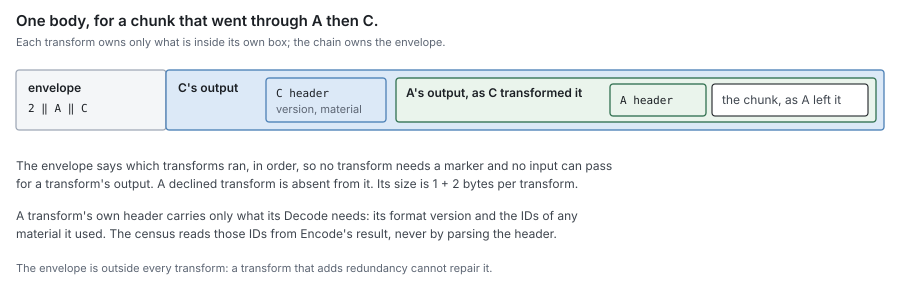
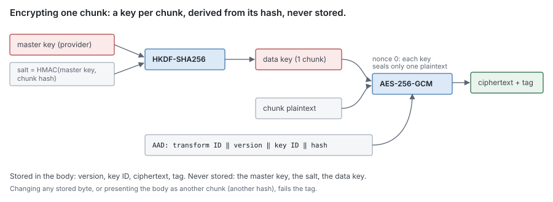

# RFC 5 — transforms

**Audience:** anyone writing a transform, configuring a store's transforms, or
deciding what a deployment that enables one is protected against.

The key words **MUST**, **MUST NOT**, **SHOULD**, **SHOULD NOT** and **MAY** are
to be interpreted as in RFC 2119.

This document specifies behaviour, not the current code. Where the code differs,
[Appendix D](#Appendix%20D%20%E2%80%94%20where%20the%20current%20code%20differs) lists it for the refactor.

---

## In short

- A **transform** is an invertible function over one chunk's bytes: compression
  and encryption are the two that ship, and anyone can add another.
- A store's **chain** is the ordered list of transforms its operator configures.
  The order is the configuration's, not the code's; the system only refuses an
  order that cannot work.
- Every chunk body records which transforms were applied to it, so reading needs
  no configuration, and a transform may skip a chunk it cannot help.
- The chain runs inside the block codec ([RFC 4 §3](rfc-4-remote-tier.md#3.%20The%20block%20format)), per chunk, after the chunk's
  hash is taken and before the body is written. Nothing else sees it.
- After the chain is undone, the codec checks the plaintext hash. That check, not
  any transform's own, decides whether a chunk is correct.

## 1. Purpose

Data leaving the machine may need to be smaller, secret, or both, and what "both"
means differs per deployment. This document specifies the generic mechanism: what
a transform is, how transforms are stacked and configured, where they run, and
what any transform must guarantee. Compression ([Appendix A](#Appendix%20A%20%E2%80%94%20compression)) and encryption
([Appendix B](#Appendix%20B%20%E2%80%94%20encryption)) are the two transforms that ship, and serve as worked
examples.

### 1.1 Non-goals

This document **MUST NOT** be read as specifying:

- the block format, the chunk index or where a body sits: [RFC 4 §3](rfc-4-remote-tier.md#3.%20The%20block%20format);
- a chunk's hash or a block's name: [RFC 2 §4](rfc-2-carver.md#4.%20Identity). A transform never changes either;
- when a chunk is encoded, or whether a block is relocated: [RFC 8](rfc-8-engine.md) and [RFC 9](rfc-9-gc.md);
- protection of data in the journal, in metadata or on the wire to the remote
  store: those are disk, database and transport concerns.

## 2. The model

### 2.1 A transform acts on one chunk

A transform takes one chunk's bytes and returns one body, and can turn that body
back into the same bytes. It never sees a block, a file, an offset or another
chunk. Within that, it may do anything: make the body smaller (compression),
unreadable (encryption), larger (padding, parity for error correction), or
anything else invertible.

Per-chunk scope is what keeps ranged reads working: a get for one chunk's body
([RFC 4 §4.4](rfc-4-remote-tier.md#4.4%20Get%3A%20a%20whole%20block%20or%20one%20range%2C%20exactly)) returns something the chain can undo on its own, without the rest of
the block. It also means one corrupt body loses one chunk.

A transform **MUST** be:

- **invertible**: `Decode(Encode(p)) == p`, byte for byte, for every input,
  including inputs chosen to look like the transform's own output. A lossy
  transform is not a transform;
- **self-contained**: everything `Decode` needs is in the body it wrote, apart
  from **material** held outside it: a key, a dictionary, any versioned input the
  transform names by ID ([§2.5](#2.5%20Reading%20needs%20no%20configuration%2C%20only%20material));
- **size-bounded**: it declares `MaxEncodedLen(n)`, the largest body it can
  produce from `n` bytes, and never exceeds it. `Decode` **MUST NOT** allocate or
  produce more than the `max` it is given, however large a body claims its output
  to be;
- **stateless per call**: safe to call concurrently, with no memory between calls
  other than read-only configuration and material.

A transform **MAY** decline a chunk: compression declines one that would not
shrink. A declined chunk passes to the next transform unchanged, and the body
records that the transform was not applied ([§2.4](#2.4%20Every%20body%20records%20what%20was%20applied)).

What does not fit, by design: a transform that loses information, one that needs
another chunk (delta encoding against a neighbour), and one that turns a chunk
into several bodies stored in different places (erasure coding across failure
domains). The last belongs to the store layer, as a store that spreads shards
over several backends, not to the chain.

### 2.2 Where it runs

The chain runs inside the block codec, which the engine owns ([RFC 4 §3.1](rfc-4-remote-tier.md#3.1%20Who%20writes%20it)).


- The hash is taken over plaintext **before** the chain, so identity never
  depends on a transform's settings, material or library version ([RFC 4 §3.3](rfc-4-remote-tier.md#3.3%20Transforms)).
- The hash is checked **after** the whole chain is undone ([§2.6](#2.6%20The%20plaintext%20hash%20is%20the%20final%20check)).
- Every consumer of block bytes goes through the codec, so every consumer gets
  the chain: the engine's reads and writes, and GC's relocation, which re-encodes
  under the current chain ([§5.2](#5.2%20Relocation%20re-encodes)).

The syncer and the remote store never see a transform. Apart from the byte
offsets a transform changes, nothing above the codec behaves differently with a
chain on or off.

### 2.3 The chain is ordered by configuration

A store's operator lists its transforms in order. `Encode` runs them first to
last and `Decode` last to first. The configuration is the order: the code holds no
ordering rule, priority or compatibility table.

**Every order is correct.** Each transform is invertible and the plaintext hash
is checked after the whole chain ([§2.6](#2.6%20The%20plaintext%20hash%20is%20the%20final%20check)), so any order reads back exactly what
was written. An order can only be *ineffective*: compressing after encrypting
saves nothing, padding before compressing gets squeezed out, parity before
encryption cannot repair what a flipped ciphertext bit breaks. The system does
not refuse such an order. It makes it visible: the per-transform metrics of
[§6](#6.%20Observability) show a compressor declining every chunk or a repair counter that never
moves. The only chain refused is one that lists a transform twice.

The recommended order for the transforms this document describes:

| Position | Transform | Why there |
| --- | --- | --- |
| 1 | compression | needs the plaintext's redundancy |
| 2 | padding | hides the compressed size; must not be compressed away |
| 3 | encryption | covers everything before it |
| 4 | parity | protects the stored bytes, so it must see them last |

### 2.4 Every body records what was applied

Each body starts with a short **envelope** listing, in order, the IDs of the
transforms that were applied to it:

```
body = count (1 byte) ‖ transform ID (2 bytes) × count ‖ output of the last applied transform
```

This is what makes the chain self-describing, per chunk, independently of
configuration:

- a declined transform is simply absent from the list;
- the list, not each transform, says whether a transform ran, so no transform
  needs a marker of its own and no input can be mistaken for a transform's output;
- a reader undoes exactly the listed transforms, whatever the chain is configured
  to do now.

A transform **MAY** still write a header of its own inside its output: its
format version, and the IDs of the material it used. The envelope costs 1 + 2n
bytes per chunk.



A reader **MUST** reject with `ErrMalformed`, before decoding anything, an
envelope that lists an unregistered ID, the same ID twice, or more transforms
than are registered. Otherwise a bucket writer could wrap a body in hundreds of
layers that each decode correctly and cost a full decode on every read.

The envelope is outside every transform, so a redundancy transform cannot repair
it: a damaged envelope fails the chunk loudly, as it would without one. Giving
the envelope its own protection is deferred until a redundancy transform ships.

### 2.5 Reading needs no configuration, only material

Every transform compiled into the binary is registered by its ID at start, and
`Decode` looks transforms up by the IDs in the envelope, not in the configured
chain. For each store, the registry builds every transform once for decoding,
with its default settings and the store's material.

**Material is configured on the store, apart from the chain** ([§3.2](#3.2%20Configuration)). A
material provider holds it by kind (`key`, `dictionary`, whatever a transform
declares) and ID. Removing a transform from the chain therefore stops it for new
writes but keeps its material, and bodies written under it stay readable.
Removing material is a separate act, allowed only once the census shows nothing
uses it ([§5.3](#5.3%20Retiring%20material%20or%20a%20transform%20needs%20a%20census)).

Because reading does not consult the chain, a store accepts a body without a
transform its chain now applies: an old plaintext body after encryption was
turned on, for example. An operator who wants to refuse such bodies lists the
transform under `require`; a body missing a required transform is then
`ErrMalformed`. Turn it on only once the census shows no body lacks it.

An ID is assigned once and never reused ([§4](#4.%20Writing%20a%20custom%20transform)). A format change inside a
transform is a new version in that transform's own header, not a new ID, and the
transform **MUST** keep decoding every version it may still meet.

### 2.6 The plaintext hash is the final check

After the chain is undone, the codec compares the result with the chunk's
plaintext hash from block metadata ([RFC 4 §3.4](rfc-4-remote-tier.md#3.4%20Every%20read%20is%20verified%20by%20the%20codec)). That check decides; no
transform's own check stands in for it. An encryption tag proves a body was
sealed for that hash, not that decompression then reproduced it; a parity
transform that "repairs" a body can still repair it wrongly.

It also makes a tampered envelope harmless to integrity. Someone who can write
the bucket can strip a transform from an envelope or swap a body, but the result
must still hash to what local metadata expects, and producing that requires
knowing the plaintext already.

### 2.7 Failures

- **A chain that cannot be built is a construction failure.** If a store is
  configured with a transform that cannot start (an unknown name, bad settings,
  material it needs and cannot get), the store **MUST NOT** open, and **MUST
  NOT** fall back to writing without it. Writing plaintext because encryption
  failed to load is the failure this rule exists for.
- **`Decode` errors are one of four.**

  | Error | Meaning | Reported by the codec as |
  | --- | --- | --- |
  | `ErrMalformed` | the body is not something this transform wrote, fails its own integrity check, or names material the store never had | a verification failure of the chunk |
  | `ErrTooLarge` | the output would exceed `max` | a verification failure of the chunk |
  | `ErrMaterialUnavailable` | material the store holds cannot be reached now | the remote being unavailable: retryable, never zeros, never an absent chunk ([RFC 0 §10](rfc-0-data-lifecycle.md#10.%20Failure%20model)) |
  | `ErrMaterialDestroyed` | material the store once held is gone for good | the chunk is **Lost** ([RFC 0 §4.2](rfc-0-data-lifecycle.md#4.2%20The%20residency%20function)); not retried |

  The distinctions matter. A material ID planted by a bucket writer must not
  turn a corrupt body into a remote that looks unavailable forever, and a key
  that is gone for good must not be retried forever as if it might return. The
  syncer sees these through its own closed set ([RFC 3 §1.3](rfc-3-syncer.md#1.3%20Interface)).
- **`Encode` errors** fail the put. A declined chunk is not an error.

A transform's own error types **MUST NOT** cross the codec. Callers see only the
codec's errors, so nothing above it can tell which transforms are configured.

## 3. API surface

### 3.1 Interfaces

Signatures are indicative; the obligations of [§2](#2.%20The%20model) are normative.

```go
// ID names a transform in every body it was applied to. Assigned once, never reused.
type ID uint16

// Transform is one invertible, per-chunk step.
type Transform interface {
	ID() ID

	// MaxEncodedLen is the largest body Encode can produce from n bytes.
	MaxEncodedLen(n int) int

	// Encode transforms plain. Applied=false declines the chunk: plain passes on
	// unchanged. hash is the plaintext hash, for transforms that bind to it.
	Encode(ctx context.Context, dst []byte, hash [32]byte, plain []byte) (Encoded, error)

	// Decode inverts Encode. It never produces more than max bytes.
	Decode(ctx context.Context, dst []byte, hash [32]byte, body []byte, max int) (plain []byte, err error)
}

// Encoded is one transform's output, and what the census records about it.
type Encoded struct {
	Body     []byte
	Applied  bool
	Version  uint8        // the transform's own format version
	Material []MaterialID // the material used, if any
}

// MaterialID names one piece of material of one kind: a key, a dictionary.
type MaterialID struct {
	Kind string
	ID   string
}

// Materials holds a store's material. A transform asks it for what it needs.
type Materials interface {
	// Current is the material new bodies of this kind use.
	Current(ctx context.Context, kind string) (MaterialID, error)
	// Get returns material by ID: ErrUnknownMaterial for an ID the store never
	// had, ErrMaterialUnavailable for one it cannot reach now,
	// ErrMaterialDestroyed for one it once had and has lost for good.
	Get(ctx context.Context, id MaterialID) ([]byte, error)
}

// Factory builds a transform from its settings and the store's material. It
// fails rather than returning a transform that cannot work.
type Factory func(ctx context.Context, settings map[string]any, m Materials) (Transform, error)

// Register makes a transform available for configuration and for decoding.
// Called at init; a duplicate ID panics.
func Register(id ID, name string, f Factory)

// Chain is a store's configured list of transforms.
type Chain struct{ /* ... */ }

// NewChain builds the configured transforms, in order. It refuses a duplicate.
func NewChain(ctx context.Context, cfg []Config, m Materials) (*Chain, error)

// MaxEncodedLen composes the transforms' bounds, in chain order, plus the envelope.
func (c *Chain) MaxEncodedLen(n int) int

// Encode writes the envelope and returns the body with one Encoded per applied
// transform, which the codec collects into the block's census (§5.3).
func (c *Chain) Encode(ctx context.Context, dst []byte, hash [32]byte, plain []byte) ([]byte, []Encoded, error)
func (c *Chain) Decode(ctx context.Context, dst []byte, hash [32]byte, body []byte, max int) ([]byte, error)

type Config struct {
	Name     string         // a registered transform's name
	Settings map[string]any // passed to its Factory
}

var (
	ErrMalformed           = errors.New("transform: malformed body")
	ErrMaterialUnavailable = errors.New("transform: material unavailable")
	ErrMaterialDestroyed   = errors.New("transform: material destroyed")
	ErrTooLarge            = errors.New("transform: output exceeds its bound")
)
```

`Chain.Decode` uses the registry, not the configured list ([§2.5](#2.5%20Reading%20needs%20no%20configuration%2C%20only%20material)), so a chain
decodes what an older configuration wrote. It gives each step the chunk maximum
([RFC 2 §3.2](rfc-2-carver.md#3.2%20The%20three%20settings)) passed through the `MaxEncodedLen` of the steps applied before it, so
a step that legitimately enlarges the body is not refused by the next one. `dst`
**MUST NOT** overlap the input; the result may be `dst` resliced or a new slice.
`ErrUnknownMaterial` from `Materials` is reported as `ErrMalformed`.

`Chain.MaxEncodedLen` of the chunk maximum is what sizes everything downstream:
the largest encoded block, and so the upload spool ([RFC 3 §3.4](rfc-3-syncer.md#3.4%20One%20put%20per%20block)) and the block
header's bound ([RFC 4 §3.2](rfc-4-remote-tier.md#3.2%20Layout)).

### 3.2 Configuration

A chain is configured on a remote block store, and every share on that store
inherits it:

```yaml
blockstores:
  remote:
    main:
      type: s3
      materials:
        provider: file
        file: /etc/dittofs/materials.yaml
      transforms:
        - name: zstd
        - name: aes-gcm
      require: [aes-gcm]   # optional (§2.5)
```

A share that needs a different chain, or different material, uses a different
store. Deduplication then never spans two keys, which matters because a chunk
encrypted under one key is readable only by a store that holds it.

## 4. Writing a custom transform

A transform is compiled in and registers itself at start. It **MUST**:

1. take an ID from the range reserved for custom transforms (`0x8000`–`0xFFFF`;
   `0x0000`–`0x7FFF` is reserved for shipped ones) and never reuse it;
2. declare an honest `MaxEncodedLen`: [§8.1](#8.1%20Transform%20conformance) checks it on every input;
3. put a format version in its own header if its format can ever change, and
   decode every version it has written;
4. bound `Decode` by `max` before allocating;
5. return only the errors of [§2.7](#2.7%20Failures);
6. pass the transform conformance suite ([§8.1](#8.1%20Transform%20conformance)), and ship a fixture: bodies
   written by its first version, which every later version must decode.

Custom transforms are compiled in. Loading them at run time would put foreign
code in the data path with nothing to check it before it writes; revisit if an
operator needs one that is not built in.

## 5. Changing a chain over time

### 5.1 Configuration governs the next write

Adding, removing, reordering or re-configuring transforms changes only what is
written from then on. Every stored body keeps the envelope it was written with,
and [§2.5](#2.5%20Reading%20needs%20no%20configuration%2C%20only%20material) keeps it readable as long as its material is held.

### 5.2 Relocation re-encodes

GC relocation reads chunks through the codec and writes them into a new block
under the current chain ([RFC 9 §4.2](rfc-9-gc.md#4.2%20Read%20verified%2C%20name%20by%20content%2C%20put%2C%20then%20move)). This is how old bodies migrate to a new chain:
each relocated chunk leaves its old transforms, and its old material, behind. A
relocation that copied bodies unchanged would keep every retired key in use for
as long as its chunks live.

### 5.3 Retiring material or a transform needs a census

To stop holding material, or to stop compiling a transform in, no stored body may
still need it. That takes a **census**: which blocks use which transform, version
and material.

- **It is written with the block.** The codec collects the `Encoded` descriptors
  of every body ([§3.1](#3.1%20Interfaces)). The engine's `Store` returns the distinct ones with the
  put, beside the chunk ranges ([RFC 3 §1.3](rfc-3-syncer.md#1.3%20Interface)), and the block's commit records
  them in the block record ([RFC 6 §2.3](rfc-6-block-metadata.md#2.3%20Block)). A block's census never changes, since
  a block is never re-encoded in place.
- **Retirement is ordinary relocation.** GC lists the blocks whose census names
  what is being retired and relocates each ([RFC 9 §4.2](rfc-9-gc.md#4.2%20Read%20verified%2C%20name%20by%20content%2C%20put%2C%20then%20move)): its chunks are
  re-encoded under the current chain into a block whose encoding generation is
  one above the source's, so the new block has a new name ([RFC 2 §4.2](rfc-2-carver.md#4.2%20A%20block)); the
  chunks move and the source is swept. A relocation never writes its source's
  name. Retirement relocates a block even when it is fully live, the one
  exception to [RFC 9 §4.4](rfc-9-gc.md#4.4%20When%20to%20relocate%20is%20policy).
- **Removal waits for an empty census.** Once no block names the material or
  transform, it may be removed. Removed material is destroyed: the provider keeps
  its ID and reports it `ErrMaterialDestroyed` ([§2.7](#2.7%20Failures)).

## 6. Observability

Each transform is labelled by its name. A custom transform gets these metrics
without writing any: the chain exports them around each call.

| Answers | Metric | Type |
| --- | --- | --- |
| chunks encoded, labelled `applied` = `true` or `false` | `dittofs_transform_chunks_total` | counter |
| bytes in and out, labelled `direction` = `encode` or `decode`; their ratio is what the transform costs or saves | `dittofs_transform_bytes_total` | counter |
| time per call, by direction | `dittofs_transform_seconds` | histogram |
| decode failures, labelled `error` = `malformed`, `material_unavailable`, `material_destroyed` or `too_large`, counted after the stale-position repair of [RFC 4 §3.4](rfc-4-remote-tier.md#3.4%20Every%20read%20is%20verified%20by%20the%20codec): a decode at a stale position that the repair resolves is not a failure. `malformed` and `material_destroyed` are alerts | `dittofs_transform_decode_failures_total` | counter |
| bodies written per transform ID, version and material ID, from block metadata ([§5.3](#5.3%20Retiring%20material%20or%20a%20transform%20needs%20a%20census)) | `dittofs_transform_census_blocks` | gauge |

A chain that fails to build logs the transform and the reason at `Error` and
refuses the store ([§2.7](#2.7%20Failures)). A transform logs nothing per chunk: its outcomes
are metrics. A transform with outcomes of its own exports them under its name, as
encryption does ([Appendix B.6](#B.6%20What%20it%20adds%20to%20observability)) and a parity transform would with a count of
repaired bodies ([Appendix C](#Appendix%20C%20%E2%80%94%20example%2C%20a%20parity%20transform)). An ineffective chain order ([§2.3](#2.3%20The%20chain%20is%20ordered%20by%20configuration)) shows
here: a transform whose `applied=false` share is near 100%, or a repair count
that never moves.

## 7. Invariants

| # | Invariant |
| --- | --- |
| T1 | A transform never changes a chunk's hash or a block's name, and never sees more than one chunk. |
| T2 | `Decode(Encode(p)) == p` for every input. |
| T3 | Every body lists the transforms applied to it; reading needs the registry and material, never the configured chain. The one exception is `require` ([§2.5](#2.5%20Reading%20needs%20no%20configuration%2C%20only%20material)), which can only refuse a body, never change how one decodes. |
| T4 | No body exceeds its transform's `MaxEncodedLen`, and no step of `Decode` produces or allocates more than the bound the chain gives it. |
| T5 | A store whose chain cannot be built does not open, and never writes without its chain. |
| T6 | The plaintext hash is checked after the whole chain is undone, before any byte is returned. |
| T7 | A material failure is never zeros and never an absent chunk: unavailable material is the remote being unavailable, destroyed material makes the chunk Lost. |
| T8 | No transform error type crosses the codec. |

## 8. Test plan and benchmarks

The same rules as [RFC 1 §11](rfc-1-journal.md#11.%20Conformance): every **MUST** has a check, and a check is
validated by reverting the code it guards and watching it fail on its own
assertion.

### 8.1 Transform conformance

One suite that every registered transform passes, shipped ones and custom ones
alike. A new transform gets it by registering.

| Invariant | Check |
| --- | --- |
| T2 | Round-trip 10,000 inputs: random, all zeros, all one byte, 1 byte to the chunk maximum, and inputs that begin with this transform's own header and with any envelope. |
| T2 | Every body in the transform's fixture decodes to the recorded plaintext. |
| T4 | Fuzz `Decode`: no panic, and no allocation above `max` before the header is validated. A body declaring an output of `max + 1` fails with `ErrTooLarge`. |
| [§2.1](#2.1%20A%20transform%20acts%20on%20one%20chunk) | For every round-trip input, the body is no longer than `MaxEncodedLen(len(input))`, and an input built to hit the worst case reaches it. |
| concurrency | Encode and decode from 64 goroutines under the race detector: same results as sequential. |
| [§2.7](#2.7%20Failures) | Flip every byte of a body in turn: `Decode` returns an error of [§2.7](#2.7%20Failures) or bytes the codec's hash check rejects, and never panics. A transform that authenticates (encryption) **MUST** return `ErrMalformed` itself for every flip. |
| [§2.7](#2.7%20Failures) | For an authenticating transform: decode chunk A's body with chunk B's hash, and a body naming material the store never had: both `ErrMalformed`. A body naming destroyed material: `ErrMaterialDestroyed`. |
| [Appendix B.1](#B.1%20How%20a%20chunk%20is%20encrypted) | Encode the same chunk twice: two different salts and bodies, both decode. |
| [§3.1](#3.1%20Interfaces) | A transform that enlarges its input (a test transform adding 50%) before another: a chunk of exactly the maximum round-trips. |

### 8.2 Chain tests

| Invariant | Check |
| --- | --- |
| [§2.3](#2.3%20The%20chain%20is%20ordered%20by%20configuration) | Every permutation of the shipped transforms plus a test transform builds and round-trips the whole corpus. A chain listing one transform twice fails to build. |
| T3 | Write under chain A, reconfigure to chain B (reordered, a transform removed, another added), read everything back. |
| T3 | A declined chunk's envelope omits the transform, and decodes. |
| T3 | Remove the encryption transform from the chain, keeping the store's material: every encrypted body still decodes. |
| [§2.4](#2.4%20Every%20body%20records%20what%20was%20applied) | Envelopes listing an unregistered ID, a duplicate ID, or more IDs than are registered: `ErrMalformed` before any decode runs. |
| [§2.5](#2.5%20Reading%20needs%20no%20configuration%2C%20only%20material) | With `require: [aes-gcm]`, a body without it is `ErrMalformed`; without `require`, it decodes. |
| [§5.3](#5.3%20Retiring%20material%20or%20a%20transform%20needs%20a%20census) | Write blocks under two keys and two chains: the census each put returns, and the block records it reaches, list exactly the transform IDs, versions and material IDs used. Retire one key: every block naming it is relocated to a new name, fully live ones included, and the census then shows none. |
| T5 | Make a transform's factory fail: the store does not open, and no body is written. |
| T6 | A fake transform that decodes to wrong bytes: every read through the codec fails. |
| T7 | A decode that returns `ErrMaterialUnavailable` reaches the engine as the remote being unavailable, is retried, and never yields zeros or an absent chunk. One that returns `ErrMaterialDestroyed` is not retried and reports the chunk Lost. |
| T8 | Force each decode error: the codec returns only its own errors. |
| [§5.2](#5.2%20Relocation%20re-encodes) | Relocate a block written under an old chain: every body in the new block carries the current envelope. |

### 8.3 Benchmarks and targets

Run on the reference box of [RFC 1 §12](rfc-1-journal.md#12.%20Test%20plan%20and%20performance%20targets) on every merge, over three
corpora: random bytes, a text and source tree, and a mixed VM image. Record the
corpus, chunk size distribution and CPU with each result.

| Benchmark | Measures | Target |
| --- | --- | --- |
| Each transform, encode and decode | MB/s per core | report, per transform, against the previous run |
| The chain around its transforms | overhead | within 2% of the sum of its transforms' own times, median of 10 runs |
| Envelope size | bytes per chunk | 1 + 2n |
| `Chain.MaxEncodedLen` against the largest body seen | ratio | at most 1: the declared bound is never exceeded on any corpus |
| Compression ratio per corpus | bytes out / in | report; tracked against the previous run |
| A put and a whole-block get with the default chain | MB/s | within 10% of the same without a chain, on the reference link, or the chain is what the link waits on and pool sizing must say so ([RFC 3 §2.11](rfc-3-syncer.md#2.11%20Pool%20sizes%20are%20measured%20once%2C%20by%20a%20tool)) |

A regression of more than 10% is reported after merge and does not block one.

## 9. Consequences for other RFCs

| RFC | Change |
| --- | --- |
| [RFC 0 §1.1](rfc-0-data-lifecycle.md#1.1%20The%20component%20set) | Add a row for transforms: the chain and the registry. Unlike the remote store, a chain holds state that outlives a call (material), so it is a component. |
| [RFC 0 §10](rfc-0-data-lifecycle.md#10.%20Failure%20model) | Add a row: material unavailable is handled as the remote being unavailable ([§2.7](#2.7%20Failures)). |
| [RFC 0 §4.2](rfc-0-data-lifecycle.md#4.2%20The%20residency%20function) | Add a case: a chunk whose block is durable but whose material is destroyed is **Lost**. |
| [RFC 3 §1.3](rfc-3-syncer.md#1.3%20Interface) | `Put` returns the block's census beside its ranges; material errors map onto the syncer's closed set. |
| [RFC 4 §3.3](rfc-4-remote-tier.md#3.3%20Transforms) | Points here for the chain; the envelope of [§2.4](#2.4%20Every%20body%20records%20what%20was%20applied) is how the chain "travels with the block". |
| [RFC 6 §2.3](rfc-6-block-metadata.md#2.3%20Block) | A block record lists the transform IDs, versions and material IDs its bodies use, from the census the put returned ([§5.3](#5.3%20Retiring%20material%20or%20a%20transform%20needs%20a%20census)). |
| [RFC 9 §4.2](rfc-9-gc.md#4.2%20Read%20verified%2C%20name%20by%20content%2C%20put%2C%20then%20move), [§4.4](rfc-9-gc.md#4.4%20When%20to%20relocate%20is%20policy) | Relocation re-encodes under the current chain into the next encoding generation; retirement is a second reason to relocate a block, even a fully live one. |

## 10. Open questions

1. **Hiding chunk hashes from the service** ([Appendix B.5](#B.5%20What%20a%20bucket%20reader%20still%20learns)). A product decision.
2. **External key services that never release a key.** The key provider of
   [Appendix B.2](#B.2%20Keys) holds master keys in memory. A service that only unwraps remotely
   would cost a round trip per chunk; measure before supporting one.

---

## Appendix A — compression

A shipped transform, and an example of one that makes bodies smaller.

**What it does.** Compresses a chunk with zstd (ID `0x0001`) or LZ4 (ID `0x0002`).
The algorithm is the transform, so the envelope records it; the level is not
recorded, because decoding does not need it.

**It declines what does not shrink.** If the output, header included, would save
less than 1/16 of the input, `Encode` returns `applied=false` and the chunk passes on unchanged.
Already-compressed data (media, archives, encrypted files) then costs one attempt
and no stored overhead.

**Its header.** A format version (1 byte) and the decompressed length (varint).
`Decode` refuses a declared length above `max` before allocating, and runs the
decoder with its window capped at the chunk maximum, so a body cannot make it
allocate more than one chunk however it was crafted.

**Bound.** `MaxEncodedLen(n) = n`: a chunk that would not shrink, header included, is declined.

**Settings.** `level` (default 3 for zstd). Changing it affects the next write
only.

**Leaks.** Compression makes a body's size depend on its content. Combined with
encryption, a chunk's stored size says how compressible it was. That matters
only where an attacker can place data of their own next to a secret inside one
chunk and watch the size change; a deployment with such writers in one share
**SHOULD** turn compression off there.

## Appendix B — encryption

A shipped transform (ID `0x0010`), and an example of one that needs material:
keys, of kind `key`.

### B.1 How a chunk is encrypted

Each chunk gets its own key, derived from a master key and a random salt:

```
salt     = 32 random bytes
data key = HKDF-SHA256(master key, salt, "dittofs chunk v1")
body     = AES-256-GCM(data key, nonce = 0, plaintext,
                        AAD = transform ID ‖ version ‖ key ID ‖ salt ‖ plaintext hash)
```



In plain terms:

- **a fresh key per chunk.** Because a data key encrypts exactly one chunk, the
  nonce can be fixed. There is nothing to count and no budget to run out of: the
  master key is never used to encrypt data directly, only to derive keys, and 256
  random bits of salt do not repeat.
- **everything is authenticated.** The header fields and the plaintext hash are
  all in the AAD, so changing any byte of the body, or presenting it as a
  different chunk, fails decryption.
- **the master key never leaves the key provider's process memory**, and only the
  salt and the key ID are stored.

**Its header:** version (1 byte), key ID length (1 byte), key ID, salt (32
bytes). Then the ciphertext and its 16-byte tag. `MaxEncodedLen(n) = n + 305`,
the worst case with a 255-byte key ID: 1 + 1 + 255 + 32 + 16.

### B.2 Keys

Keys are material of kind `key` ([§2.5](#2.5%20Reading%20needs%20no%20configuration%2C%20only%20material)): encryption asks the store's `Materials`
for the current key when it encodes and for the key a body names when it decodes.
The provider keeps a list of every key ID it has ever issued, marking a key
destroyed once it is retired ([§5.3](#5.3%20Retiring%20material%20or%20a%20transform%20needs%20a%20census)) or declared lost by the operator, so it can
tell a key it never had, one it cannot reach now, and one that is gone for good. Two providers
ship: a key file, and a KMIP server whose keys are fetched at start and held in
memory. Encryption **MUST** fail its construction if it cannot get the current
key ([§2.7](#2.7%20Failures)).

### B.3 Rotation

Rotating means making a new key current. New chunks use it; existing chunks name
their key ID and stay readable as long as the provider still holds that key. To
stop holding an old key, relocate the blocks that use it ([§5.3](#5.3%20Retiring%20material%20or%20a%20transform%20needs%20a%20census)).

### B.4 Losing a key loses the data

Every chunk encrypted under a master key is unreadable without it. There is no
recovery path, by design: a recovery path is a second key. Backing up master keys
is the operator's job; the system can only make the dependency visible.

| What happens | Result |
| --- | --- |
| The provider is unreachable at start | the store does not open ([§2.7](#2.7%20Failures)) |
| The provider becomes unreachable, or a key is missing, when reading | the read fails as the remote being unavailable, and recovers when the key returns. Never zeros |
| A tag fails | a verification failure of the chunk |
| A master key is lost for good, and the provider records it destroyed ([Appendix B.2](#B.2%20Keys)) | `ErrMaterialDestroyed`: every chunk it covered is **Lost** ([RFC 0 §4.2](rfc-0-data-lifecycle.md#4.2%20The%20residency%20function)) |

Each of these is a health condition of the store, not only a log line.

### B.5 What a bucket reader still learns

Encryption keeps chunk contents secret from anyone who can read the bucket but
not the key. It does not hide everything.

| Who | Can | What encryption protects |
| --- | --- | --- |
| Someone who can read the bucket (a leaked credential, the provider's staff) | read every stored byte | the content of every chunk whose content they cannot already guess |
| Someone who can also write the bucket | alter, delete or replace blocks | nothing is silently corrupted: any change fails the tag or the plaintext hash. Deletion is still loss |
| Someone on the host running the system | read memory and keys | nothing; they hold the keys |

What a bucket reader can still see, encryption on or off:

- **the chunk hashes in each block's header** ([RFC 4 §3.2](rfc-4-remote-tier.md#3.2%20Layout)). Anyone holding a
  file can chunk it the same way ([RFC 2 §6](rfc-2-carver.md#6.%20Boundaries%20are%20public)), hash the chunks and
  look for them: a match proves the file is stored. The same works for a chunk
  with few possible contents, such as a form with one field;
- **sizes**: of blocks, of chunks, and with compression, how compressible each
  chunk was;
- **repetition**: which content is written more than once;
- **timing**: what is written and read, and when.

**Proposal, for decision:** a store created with hash hiding writes each index
hash as `HMAC-SHA256(store secret, hash)` instead of the hash, and includes the
same secret in every block name ([RFC 2 §4.3](rfc-2-carver.md#4.3%20Key%20scope)). Repair and verification still
work, since the system holds the secret and can compute both; a bucket reader holding
a file can no longer look it up. It is a property of the store, chosen when the
store is created and never changed, independent of whether the chain encrypts:
tying it to the chain would change every name when encryption is toggled. The
secret comes from the key provider and never rotates, since it is part of every
name; a leaked secret is permanent, and the only remedy is renaming every block
into a new store. Sizes, repetition and timing
remain visible either way ([§10](#10.%20Open%20questions), question 1).

### B.6 What it adds to observability

| Answers | Metric | Type |
| --- | --- | --- |
| chunks encrypted, labelled by key ID | `dittofs_encryption_chunks_total` | counter |
| the key ID new chunks use | `dittofs_encryption_current_key` | gauge (1 on the current key's label) |
| whether the provider can currently return each configured key | `dittofs_encryption_key_available` | gauge (0/1) |

## Appendix C — example, a parity transform

Not shipped. An example of a transform that makes bodies **larger**, written the
way a custom transform would be ([§4](#4.%20Writing%20a%20custom%20transform)).

**What it does.** Splits the body into `k` data shards, adds `m` Reed-Solomon
parity shards, and stores all of them in the one body. `Decode` rebuilds the
body from any `k` intact shards, so it can repair damage to up to `m` shards
without fetching anything else. A per-shard CRC32C tells it which shards are
damaged.

**Its header.** Version, `k`, `m`, the original length, and one CRC per shard.

**Bound.** `MaxEncodedLen(n) = ceil(n / k) × (k + m) + header`: with `k = 4`,
`m = 2`, a 16 MiB chunk encodes to about 24 MiB. The chain's bound grows with it,
and so do the upload spool and the block size ([§3.1](#3.1%20Interfaces)).

**Position.** Last in the chain ([§2.3](#2.3%20The%20chain%20is%20ordered%20by%20configuration)), so it protects the bytes actually
stored. Placed before encryption, a flipped ciphertext bit fails decryption before
parity can repair it; the chain still reads correctly, but the parity is wasted.

**What it cannot protect.** The envelope and the block header, which are outside
every transform ([§2.4](#2.4%20Every%20body%20records%20what%20was%20applied)). A repaired body is still checked against the
plaintext hash ([§2.6](#2.6%20The%20plaintext%20hash%20is%20the%20final%20check)).

**Observability.** `dittofs_transform_parity_repaired_total`, bodies repaired
on decode. A value that never moves on a store means the parity costs space for
nothing.

**Whether to use it.** Only for a store with no redundancy of its own, such as a
single disk. Object stores already store data redundantly, and corruption in
transit is caught by the put check ([RFC 4 §4.3](rfc-4-remote-tier.md#4.3%20Put%3A%20a%20whole%20block%2C%20checksummed%2C%20durable%20on%20success)); there it costs `m / k` more
storage and bandwidth on every chunk for nothing.

## Appendix D — where the current code differs

Descriptive, for the refactor.

| # | This document says | The code today |
| --- | --- | --- |
| D1 | The envelope records what was applied ([§2.4](#2.4%20Every%20body%20records%20what%20was%20applied)) | each layer marks its own output; compression stores declined chunks unmarked, so an incompressible chunk that begins with the compression marker is read back as a frame and is unreadable. Data loss |
| D2 | Decoding is bounded by the chunk maximum (T4) | the declared-size ceiling is 64 MiB against a 16 MiB chunk maximum, the buffer is allocated before decoding, and the zstd window is unbounded |
| D3 | The order comes from configuration ([§2.3](#2.3%20The%20chain%20is%20ordered%20by%20configuration)) | compression then encryption is fixed in code |
| D4 | Reading needs only the registry and keys (T3) | decoders exist only for configured layers: disabling compression fails every compressed body, enabling encryption rejects existing plaintext bodies, and disabling encryption is refused |
| D5 | Every header field is authenticated ([Appendix B.1](#B.1%20How%20a%20chunk%20is%20encrypted)) | a random data key is wrapped under the master key with AES-GCM; frame fields are outside the AAD, and nothing counts the master key's nonces |
| D6 | Relocation re-encodes ([§5.2](#5.2%20Relocation%20re-encodes)) | relocation copies encrypted bodies unchanged |
| D7 | No transform error crosses the codec (T8) | encryption and compression errors reach callers as their own types |
| D8 | The hash is checked once, in the codec (T6) | each consumer re-hashes; relocation does not |
| D9 | A chain that cannot be built stops the store (T5) | the offload finds its encryptor by type assertion, and a missing one writes unencrypted bodies |
| D10 | Chunk hashes can be hidden ([Appendix B.5](#B.5%20What%20a%20bucket%20reader%20still%20learns)) | block headers carry plaintext hashes on every store |
| D11 | A key failure is the remote being unavailable, and recovers ([Appendix B.4](#B.4%20Losing%20a%20key%20loses%20the%20data)) | a provider failure at start fails the share's whole block store, journal included; a retired key that fails to load is logged and skipped, with no health condition |
| D12 | Material lost for good is told apart and makes a chunk Lost ([§2.7](#2.7%20Failures)) | no such outcome exists |
| D13 | Retirement relocates through a census ([§5.3](#5.3%20Retiring%20material%20or%20a%20transform%20needs%20a%20census)) | no census is recorded |
