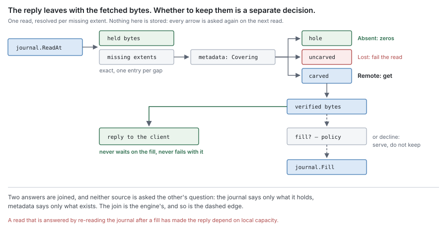

# RFC 6 — the engine

**Status:** draft.
**Depends on:** [RFC 0](rfc-0-data-lifecycle.md), for the terms, the residency function, the invariants and
the failure model. [RFC 1](rfc-1-journal.md), 2, 3, 4, 5, 7 and 8 specify the components this one
composes; each has already deferred a decision here, and Appendix A lists every
one of them. Nothing here redefines any of them.
**Audience:** anyone changing `pkg/block/engine`, the per-share composition in
`pkg/controlplane/runtime/shares`, or the block-facing helpers adapters call in
`internal/adapter/common`.

The key words **MUST**, **MUST NOT**, **SHOULD**, **SHOULD NOT** and **MAY** are
to be interpreted as in RFC 2119.

This document specifies what the engine is required to be. It was written from
the model in RFC 0–5 and [RFC 8](rfc-8-remote-tier.md), not from the current package. Where the current
implementation does not satisfy a requirement, that is recorded once, in [§12](#12.%20Deviations), as
a **deviation**. A deviation is a defect to be fixed or migrated, never a rule
for an implementer to build around.

Where this document chooses a policy the set left open, the choice is labelled
**proposal** and names the measurement that would overturn it.

---

## In short

- The engine holds no bytes and no facts. Every byte is the journal's or the
  remote tier's; every fact is block metadata's or the namespace's.
- It does three things: it **composes** the components, it **decides** policy,
  and it is the **facade** adapters call for content.
- It owns the joins no component can own alone: residency resolution on read,
  block assembly on flush, and the ordering of a write.
- Policy chooses among safe actions. It is never the thing that makes an action
  safe.
- It persists nothing. Losing all of its state costs performance, never content.

---

## 1. Purpose

[RFC 0 §1.1](rfc-0-data-lifecycle.md#1.1%20The%20component%20set) gives the engine *composition, policy, the facade adapters call*, and
nothing else. Every other component answers a question about its own state. The
engine answers the one question none of them can:

> **Given what the two oracles say, what happens next?**

A read has two answers to join. A flush has a carver, a syncer and a metadata
commit to sequence. A full journal has to be told what to evict. A write has four
steps owned by three components. Each of those needs someone who sees all the
parties and belongs to none of them.

### 1.1 Non-goals

The engine **MUST NOT**:

- define a format, an encoding or an algorithm — a record layout, a boundary
  function, a block framing, a key derivation ([RFC 1](rfc-1-journal.md), [RFC 2](rfc-2-carver.md), [RFC 8](rfc-8-remote-tier.md));
- move bytes to or from the remote tier itself — that is the syncer ([RFC 3](rfc-3-syncer.md)), and
  the engine hands it work;
- hold a copy of any oracle's answer that outlives the operation that asked —
  no residency cache, no durability record, no size ([RFC 0 §4.2](rfc-0-data-lifecycle.md#4.2%20The%20residency%20function), [RFC 5 §2.5](rfc-5-namespace-metadata.md#2.5%20Where%20%60size%60%20lives));
- persist anything. Every durable fact is recorded by the component that owns
  it, and a fact the engine persisted would be a third oracle;
- decide when an inode stops existing ([RFC 5 §4](rfc-5-namespace-metadata.md#4.%20What%20keeps%20an%20inode%20alive)), or what to delete remotely
  ([RFC 7](rfc-7-gc.md));
- carry namespace features that nothing below the namespace needs to know
  about. The recycle bin [RFC 5 §14](rfc-5-namespace-metadata.md#14.%20Open%20questions) asks about is one: it is a rename, block
  metadata never learns of it, and it is not policy over content. It is not the
  engine's.

### 1.2 What it owns

| Concern | What the engine does | Specified in |
| --- | --- | --- |
| Composition | constructs every component of a share and supplies each declared interface | [§2](#2.%20Composition) |
| Policy | decides when to flush, what to evict, whether to fill, what to read ahead | [§3](#3.%20Policy), [§4.2](#4.2%20Flush%20is%20scheduled%20here), [§6.3](#6.3%20Filling%20is%20a%20decision), [§7](#7.%20Local%20space) |
| The write | orders authorise, stage, record existence, acknowledge | [§4.1](#4.1%20The%20facade%20orders%20a%20write%3B%20adapters%20do%20not) |
| The flush | serialises commits per file, assembles blocks, returns durability | [§4](#4.%20The%20write%20and%20the%20flush), [§5](#5.%20Block%20assembly) |
| The read | joins the two oracles per missing extent, and answers | [§6](#6.%20The%20read) |
| Local space | chooses eviction and repack; answers a capacity refusal | [§7](#7.%20Local%20space) |
| Health | derives it from outcomes, including flush outcomes | [§8](#8.%20Health%20and%20failure) |
| The facade | one content-shaped surface for every adapter | [§9](#9.%20The%20facade) |

## 2. Composition

### 2.1 The engine is the composition root, and the only one

A share's content path is built in one place, by one constructor, from
configuration and the backends it names. That constructor **MUST** be the only
code that names a concrete component type. Everything else — adapters, the
runtime, other components — holds a declared interface.

The engine is therefore the one package permitted to import the components of
this set, and nothing in the set imports the engine. [RFC 0 §1.2](rfc-0-data-lifecycle.md#1.2%20Component%20autonomy)'s rule is about
the components the engine composes; [§11](#11.%20Consequences%20for%20RFC%200) records the clarification.

Composition **MUST** happen at construction. A capability **MUST NOT** be wired
onto a serving engine by a setter: a setter makes "this capability is absent" a
reachable state of a live share, and every code path then has to decide what to
do in it. Changing a share's backends is a new engine, not a mutation of the old
one.

The engine supplies, at construction:

| Declared by | Need | Supplied from |
| --- | --- | --- |
| [RFC 1](rfc-1-journal.md) | an event recorder ([§3.8](rfc-1-journal.md#3.8%20Event%20reporting)) | the process's metrics |
| [RFC 3](rfc-3-syncer.md) | a put, a verified read ([RFC 8 §7](rfc-8-remote-tier.md#7.%20This%20contract%20has%20more%20than%20one%20consumer)) | the remote tier, through the transform chain |
| [RFC 4](rfc-4-block-metadata.md) | nothing | — |
| [RFC 5](rfc-5-namespace-metadata.md) | `Size(file)` ([§2.5](rfc-5-namespace-metadata.md#2.5%20Where%20%60size%60%20lives)), release of an inode's refs ([§4.3](rfc-5-namespace-metadata.md#4.3%20Release%20is%20what%20block%20metadata%20sees)), allocation for `SEEK` ([§9.3](rfc-5-namespace-metadata.md#9.3%20Residency%20is%20not%20an%20attribute)) | block metadata's existence record and refs |
| [RFC 7](rfc-7-gc.md) | its narrow views of metadata and the remote tier | block metadata; the remote tier |

### 2.2 Capabilities are parameters, never assertions

Every capability the engine uses **MUST** be a method on an interface it holds by
declaration. A capability that is absent **MUST** fail the build or fail
construction, with an error naming it.

The engine **MUST NOT** negotiate a capability by type assertion, and **MUST
NOT** fall back to a degraded behaviour when one is missing. [RFC 0 §1.2](rfc-0-data-lifecycle.md#1.2%20Component%20autonomy) gives the
general reason. Here the consequences are specific: an assertion that fails on
the remote tier disables flushing, one that fails on a sealer uploads plaintext,
one that fails on a lookup makes every cold read linear. Each yields a working
share and no error.

Test fixtures that need less **MUST** supply a stub that satisfies the whole
interface. A production constructor that accepts `nil` for a capability "so tests
can omit it" has made the silent fallback a production path.

### 2.3 A share is one engine

Each share has exactly one engine, one journal and one assembly of policy state.
Backends below the engine — a remote store, a metadata store — **MAY** be shared
between shares and are reference-counted outside it.

Sharing a remote store between shares is subject to [RFC 4 §2.6](rfc-4-block-metadata.md#2.6%20The%20scope%20of%20a%20count): the engine
**MUST** refuse a composition in which two block-metadata stores can name one
remote key. [§5.4](#5.4%20A%20block%27s%20name%20is%20derived%20here) is how it avoids that.

### 2.4 Settings are validated once, and refused rather than replaced

The engine validates every setting it composes — chunking parameters, block
target, pool sizes, capacity — at construction, and **MUST** refuse an invalid
one with an error ([RFC 2 §3.7](rfc-2-carver.md#3.7%20Bad%20settings%20must%20be%20refused%2C%20not%20replaced)). It **MUST NOT** substitute a default for a value
the operator set.

The engine **MUST** record which chunking settings produced a share's existing
content, and **MUST** report a change to them as a migration rather than apply it
([RFC 2 §3.6](rfc-2-carver.md#3.6%20Changing%20any%20of%20this%20is%20a%20migration)). Where the record lives is block metadata's to decide; that it is
consulted at construction is the engine's.

### 2.5 Start in order, stop in reverse, and join before closing

**Start.** Open the journal, which recovers its placement index alone (RFC 1
[§9.1](rfc-1-journal.md#9.1%20Rebuilding)). Reseed the journal's flush state from block metadata: every extent that a
carved ref covers is reported durable to the journal **at that ref's version**,
through `MarkDurable`, and no other ([RFC 1 §9.2](rfc-1-journal.md#9.2%20Flush%20state%20after%20recovery)). The journal marks it only where no
held record is newer.

> [!important] Pending review — reseed by version, not by position
> Reseed used to report every extent a ref covers as durable, by position. After an
> overwrite of flushed content and a crash before the overwrite flushed, that marked
> the newer write durable; eviction then lost it and reads returned the old
> content. Refs now carry a version ([RFC 4 §2.1](rfc-4-block-metadata.md#2.1%20Ref)) and reseed passes it.
> *Added by the [RFC 0](rfc-0-data-lifecycle.md)–3 review, 2026-09-25.*

> [!important] Pending review — the journal is opened with a version floor
> The engine opens each share's journal with the highest version block metadata
> records as durable for that share ([RFC 1 §9.1](rfc-1-journal.md#9.1%20Rebuilding)). A journal restored from an old
> copy would otherwise issue versions metadata already holds, and a reseed by
> version would mark new writes durable. Block metadata must be able to answer that
> number cheaply, which [RFC 4](rfc-4-block-metadata.md) does not yet state. A journal that opens behind its
> floor is reported, and its stale extents are dropped at reseed.
> *Added by the RFC 1 test-plan review, 2026-09-25.*

Until reseeding completes, the engine **MUST NOT** request a release. Only then
start the background policy loops.

**Stop.** Stop accepting operations. Cancel the background loops, then join
them. A component **MUST NOT** be closed while any work that uses it is still
running ([RFC 1 §10.7](rfc-1-journal.md#10.7%20Shutdown)). A join that does not complete within its bound **MUST**
leave the components it depends on open and report the failure, rather than
proceed to close them under a live loop.

> [!note]
> A bounded wait followed by teardown is the shape of the "DB closed"
> failure the residency decision record describes: shutdown was on time, and the
> work it abandoned kept running against a closed store.

## 3. Policy

### 3.1 Policy is decided here and executed below

| Decision | The engine decides | The mechanism belongs to |
| --- | --- | --- |
| When to flush a file | eligibility and urgency ([§4.2](#4.2%20Flush%20is%20scheduled%20here)) | journal `Flush` ([RFC 1 §3.3](rfc-1-journal.md#3.3%20Flush)) |
| What goes in a block | assembly ([§5](#5.%20Block%20assembly)) | carver, for chunks ([RFC 2](rfc-2-carver.md)) |
| When to put a block | as soon as it is assembled | syncer uploader ([RFC 3 §3.1](rfc-3-syncer.md#3.1%20It%20is%20triggered%2C%20not%20scheduled)) |
| Whether to fill | [§6.3](#6.3%20Filling%20is%20a%20decision) | journal `Fill` ([RFC 1 §3.4](rfc-1-journal.md#3.4%20Fill)) |
| What to read ahead, pre-warm | [§6.4](#6.4%20Speculation%20is%20planned%20here%2C%20and%20yields%20to%20demand%20and%20to%20writes) | syncer fetcher ([RFC 3 §4.5](rfc-3-syncer.md#4.5%20Speculation%20is%20executed%20here%20and%20decided%20elsewhere)) |
| What to evict, and when | [§7.1](#7.1%20Eviction%20is%20chosen%20here%2C%20and%20needs%20no%20new%20record) | journal `Release` ([RFC 1 §3.5](rfc-1-journal.md#3.5%20Release)) |
| When to repack | [§7.3](#7.3%20Repack%20is%20triggered%20here) | journal repack ([RFC 1 §8.2](rfc-1-journal.md#8.2%20Repack)) |
| Whether to keep accepting writes | [§8.2](#8.2%20Every%20condition%20in%20RFC%200%20%C2%A710%20has%20its%20engine%20behaviour%20here) | journal capacity ([RFC 1 §7](rfc-1-journal.md#7.%20Capacity)) |
| What follows from ill health | [§8.1](#8.1%20Health%20is%20derived%20from%20recent%20outcomes%2C%20flush%20included) | — |
| When GC runs, what it relocates | [§7.5](#7.5%20When%20GC%20runs%2C%20and%20what%20it%20relocates%2C%20is%20decided%20here) | GC ([RFC 7](rfc-7-gc.md)) |

A component that takes one of these decisions itself has absorbed engine policy,
and a threshold that lives in a component's configuration is such a decision.

### 3.2 Policy never makes an action safe

Every mechanism the engine calls is safe by its own definition: `Release` refuses
an extent whose flush bit is unset ([RFC 1 §3.5](rfc-1-journal.md#3.5%20Release)), `Fill` refuses to overwrite held
bytes ([RFC 1 §3.4](rfc-1-journal.md#3.4%20Fill)), a flush bit is set only on a durability report ([RFC 1 §3.3](rfc-1-journal.md#3.3%20Flush)).
Policy chooses *among* safe actions.

A policy gate **MUST NOT** be the only thing standing between the system and data
loss. If turning a gate off would lose content, the gate is carrying a safety
property that belongs to the mechanism, and the mechanism is wrong.

> [!note]
> The distinction is testable. Disable every policy gate at once — evict
> as eagerly as possible, fill everything, flush constantly — and run the Group A
> checks of [§13](#13.%20Conformance). A conformant engine is slower and still correct.

### 3.3 Policy state is memory, and disposable

Access patterns, dirty ages, flush backoff, readahead frontiers and derived health
**MUST** live in memory. A restart **MAY** lose all of it, and the engine
**MUST** behave correctly from an empty policy state — conservatively, never
unsafely.

## 4. The write and the flush

### 4.1 The facade orders a write; adapters do not

A write is one facade operation. The engine performs, in this order:

1. authorise the write against the namespace ([RFC 5 §7](rfc-5-namespace-metadata.md#7.%20Permissions));
2. stage the bytes in the journal ([RFC 1 §3.1](rfc-1-journal.md#3.1%20Write));
3. record existence — `size` grown, holes shrunk, `mtime` and `ctime` in the same
   transaction ([RFC 4 §3.4](rfc-4-block-metadata.md#3.4%20Ordering%20against%20the%20journal), [RFC 5 §2.5](rfc-5-namespace-metadata.md#2.5%20Where%20%60size%60%20lives));
4. acknowledge.

No adapter **MAY** perform these steps itself or in another order. A sequence
copied into each protocol handler is a sequence each handler can get wrong
differently, and the one that gets it wrong serves zeros for acknowledged data
([RFC 4 §3.1](rfc-4-block-metadata.md#3.1%20The%20gap%20this%20closes)).

The engine **MAY** group-commit step 3 across writes, and **MUST NOT**
acknowledge any write in a group before the group commits ([RFC 4 §3.4](rfc-4-block-metadata.md#3.4%20Ordering%20against%20the%20journal)).

### 4.2 Flush is scheduled here

A file becomes eligible for a flush pass when any of these holds:

- its dirty bytes reach the block target;
- its oldest dirty byte reaches a configured maximum age;
- the journal is under capacity pressure ([§7.2](#7.2%20A%20capacity%20refusal%20comes%20back%20here));
- a client asked for durability the configured acknowledgement policy defers to
  the remote ([§9.4](#9.4%20Commit%27s%20acknowledgement%20is%20a%20stated%20policy)).

**Proposal:** a dirty-byte threshold of one block target and a maximum age of a
few seconds, with capacity pressure making every file with dirty bytes eligible.
Overturned by a measurement showing the age bound, not the byte bound, is what
fragments blocks under a streaming SMB workload.

> [!important] Pending review — a pass is bounded in bytes
> New. Nothing bounded a pass, and nothing became evictable until it returned: on a
> slow store an overwrite-heavy file filled the journal with records pinned for the
> pass. [RFC 1 §3.3](rfc-1-journal.md#3.3%20Flush) now takes a `limit` and lets the callback report per block.
> *Added by the [RFC 0](rfc-0-data-lifecycle.md)–3 review, 2026-09-25.*

**A pass offers at most `upload_workers` block targets of dirty bytes** — enough to
keep every upload worker busy with one pass, and no more — through the journal's
`limit` ([RFC 1 §3.3](rfc-1-journal.md#3.3%20Flush)). A large file is flushed as a sequence of such passes.

A failed pass leaves its extents **Dirty** and is retried ([RFC 0 §5.2](rfc-0-data-lifecycle.md#5.2%20Flush)). Retries
back off with jitter; they **MUST NOT** stop, and a failing pass **MUST** be
reported to health ([§8.1](#8.1%20Health%20is%20derived%20from%20recent%20outcomes%2C%20flush%20included)).

### 4.3 Commits for one file are serialised here

[RFC 4 §4.4](rfc-4-block-metadata.md#4.4%20Commits%20for%20one%20file%20apply%20in%20order) leaves the choice of mechanism to the engine. The engine **MUST NOT**
run two flush passes of one file concurrently: it holds a per-file guard from the
moment the journal offers a run until the callback returns its durable extents.

The guard **SHOULD** be keyed by file. A guard keyed by a shard or a stripe is
correct and serialises unrelated files that collide on it, which makes one slow
file's commits every colliding file's latency. The guard **MUST NOT** be held
across anything but the pass it serialises.

Blocks within one pass cover disjoint offsets, so their commits **MAY** run
concurrently; what the guard protects is the order *between* passes.

A pass over several files ([§5.7](#5.7%20A%20block%20packs%20chunks%2C%20whichever%20files%20they%20came%20from)) holds every one of their guards, taken
in file-identity order so that two such passes cannot deadlock on each other.

### 4.4 The truncation epoch is captured at offer and checked at commit

When the journal offers a run, the engine reads the file's `epoch` ([RFC 4 §6.2](rfc-4-block-metadata.md#6.2%20Truncation%20and%20deallocation))
and carries it into every commit that pass makes. Block metadata drops the refs
of a file whose epoch no longer matches and applies the rest of the commit
([RFC 4 §4.1](rfc-4-block-metadata.md#4.1%20What%20one%20commit%20records)). The engine re-offers that file alone from the journal, which has already
truncated ([RFC 1 §3.6](rfc-1-journal.md#3.6%20Truncate%20and%20delete)); the other files the block carried are durable and reported.

> [!important] Pending review — truncation is handled per file
> Previously a mismatched epoch refused the whole commit and failed the pass. With
> blocks packing several files, one file truncated in a loop kept every file packed
> with it from ever committing.
> *Added by the RFC 0–3 review, 2026-09-25.*

### 4.5 The callback returns only what committed

> [!important] Pending review — durability reported per block, as each commits
> This replaced "return a committed prefix, in offered order". One early failed
> block no longer holds back every later committed block, and extents become
> evictable as their block commits rather than when the pass ends.
> *Added by the RFC 0–3 review, 2026-09-25.*

The flush callback **MUST** report, through the journal's `report`, exactly the
extents whose commits succeeded, as each block's commit lands, and **MUST NOT**
report any other ([RFC 0 §5.2](rfc-0-data-lifecycle.md#5.2%20Flush), [RFC 1 §3.3](rfc-1-journal.md#3.3%20Flush)). An extent whose put succeeded and whose
commit did not is not durable, and **MUST NOT** be reported
([RFC 4 §4.3](rfc-4-block-metadata.md#4.3%20The%20commit%20is%20the%20report%27s%20return%20edge)). Order does not matter: the journal marks each extent on its own, and a
commit cannot overwrite newer refs because of their versions ([RFC 4 §4.4](rfc-4-block-metadata.md#4.4%20Commits%20for%20one%20file%20apply%20in%20order)).

A block may carry chunks from several offered runs and files. Its commit makes all
of them durable at once, and the callback reports each file's share of it then.

### 4.6 A share with no remote tier never reports durability

On a share with no remote tier nothing is ever durable remotely, so the flush
callback **MUST** return nothing, and no flush bit is ever set ([RFC 4 §4.2](rfc-4-block-metadata.md#4.2%20Only%20after%20durability)). The
content stays **Dirty** for its lifetime, and eviction has nothing to act on —
by definition, not by a gate.

Such a share still syncs its journal on commit ([§9.4](#9.4%20Commit%27s%20acknowledgement%20is%20a%20stated%20policy)). It does not carve, and it
writes no chunk, block or ref records. Operations that need refs — clone,
snapshot — copy bytes on such a share ([§9.3](#9.3%20Clone%20adopts%20refs%2C%20and%20flushes%20uncarved%20content%20first)).

## 5. Block assembly

### 5.1 Blocks are assembled here, as a fold over the carver's output

[RFC 2 §5](rfc-2-carver.md#5.%20Packing%3A%20three%20rules%2C%20not%20a%20component) places block assembly with whoever owns the dedup query, and that is the
engine. Assembly is a fold over the chunks the carver emits: for each chunk, ask
the dedup oracle ([§5.3](#5.3%20The%20dedup%20oracle%20never%20sees%20an%20uncommitted%20block)), then either carry its bytes into the pending block or
record it as adopted.

The fold **MUST** obey [RFC 2](rfc-2-carver.md)'s packing rules: whole chunks only (P1); a block
reaches its target and overshoots it by at most one chunk (P2); a block holds
only the chunks whose bytes it carries (P3). The file's refs are a different
reader of the same chunk sequence and name every chunk, carried or adopted.

**A pending block is a plan, not a buffer.** The carver's bytes are borrowed for
the length of `emit` ([RFC 2 §2.2](rfc-2-carver.md#2.2%20The%20bytes%20handed%20to%20%60emit%60%20are%20borrowed)), and the engine **MUST NOT** copy a carried chunk
out of them. It records, per carried chunk, the chunk's hash and where its bytes
sit in the offered version — the file, an offset and a length — and a block is
its name plus that ordered list: a few hundred bytes, whatever its size.

The upload's `src` ([RFC 3 §1.3](rfc-3-syncer.md#1.3%20Interface)) walks the plan and reads each chunk from the
journal's `offered` reader ([RFC 1 §3.3](rfc-1-journal.md#3.3%20Flush)), so the block's bytes are in memory
only while a worker transfers them, one chunk at a time ([RFC 3 §3.2](rfc-3-syncer.md#3.2%20It%20holds%20a%20reference%2C%20not%20a%20copy)). A retry
walks the plan again. The upload therefore runs inside the `Flush` callback that
offered the bytes: the reader is valid only there, which is also where durability
is reported back.

`src` **MUST** recompute each chunk's hash as it reads and fail the transfer on a
mismatch. The offered reader makes a mismatch impossible by construction; the
check turns a violation of that into a refused put rather than an object whose
bytes do not match its name ([RFC 3 §3.5](rfc-3-syncer.md#3.5%20The%20bytes%20are%20stable%20for%20the%20duration)).

The price is reading each carried byte twice, once to carve and once to upload.
The second read follows the first by the time a worker takes the block, usually
from the page cache, otherwise as a sequential local read — cheap beside the
network the upload waits on. A buffer would save that read and make memory follow
the number of blocks *waiting* for a worker rather than the pool.

> [!important] Pending review — an unknown outcome keeps its plan
> New. A retried pass could pack the same chunks differently, derive new names and
> orphan an object the earlier attempt may have written.
> *Added by the [RFC 0](rfc-0-data-lifecycle.md)–3 review, 2026-09-25.*

**A plan whose upload ended in an unknown outcome survives its pass.** The engine
keeps it and, on the next pass over those files, offers it again first and
unchanged if every chunk in it is still dirty at the same version; otherwise it
drops it. The retry then writes the same name ([RFC 3 §2.5](rfc-3-syncer.md#2.5%20An%20unknown%20outcome%20is%20not%20a%20success)) rather than orphaning
the first attempt's object.

An assembler is per pass and **MUST NOT** survive it. It cuts blocks from the
chunks of every file the pass covers, so one block may hold chunks of several
files ([§5.7](#5.7%20A%20block%20packs%20chunks%2C%20whichever%20files%20they%20came%20from)).

### 5.2 The target counts carried bytes

P2's target is measured in the bytes a block carries. Adopted chunks contribute
nothing to it. An assembler that counts every chunk it tiles emits a block when a
pass has *seen* a target's worth of content, which on a mostly-deduplicated file
is a block of a few kilobytes.

### 5.3 The dedup oracle never sees an uncommitted block

The oracle is [RFC 4 §8.2](rfc-4-block-metadata.md#8.2%20Deduplication%20lookup)'s `Durable(hash)`: a chunk record exists, so its block
is durable. It **MUST NOT** answer from anything that knows about a block not yet
committed — the pending block, a block in flight, a put that succeeded and whose
commit has not ([RFC 2 §5](rfc-2-carver.md#5.%20Packing%3A%20three%20rules%2C%20not%20a%20component)).

A chunk carried by two blocks in
flight is committed once: the first block to commit owns its record, and the
second adopts it ([RFC 4 §4.1](rfc-4-block-metadata.md#4.1%20What%20one%20commit%20records)).

> [!important] Pending review — two blocks carrying one chunk
> Cross-reference added: [RFC 4 §4.1](rfc-4-block-metadata.md#4.1%20What%20one%20commit%20records) now states what the second commit does with a
> chunk the first already recorded.
> *Added by the RFC 0–3 review, 2026-09-25.*

Two refinements follow, and both are required:

- **Within one pending block**, a repeated chunk **MAY** be carried once and
  referenced twice. Both refs and the bytes commit in one transaction, so they
  cannot be separated by a failure.
- **Across blocks in flight**, a repeated chunk **MUST** be carried again. The
  earlier block may fail after the later one commits, and the later one's refs
  would then name bytes that exist nowhere.

The oracle's answer is advisory. A chunk it reports may be retired before the
adopting commit applies; that commit then fails ([RFC 4 §7.2](rfc-4-block-metadata.md#7.2%20Adoption%20is%20conditional%20on%20existence)), and the engine
**MUST** re-offer the run with that chunk carried. The engine **MUST NOT** hold
anything — a lock, a reservation, an in-process guard — to make the answer
binding. A guard another process cannot see protects nothing across processes,
and [RFC 4 §7.2](rfc-4-block-metadata.md#7.2%20Adoption%20is%20conditional%20on%20existence) makes one unnecessary within a process.

### 5.4 A block's name is derived here

The engine assembles the block, so it computes the name ([RFC 2 §4](rfc-2-carver.md#4.%20Identity)): a hash, under
a domain distinct from chunk hashing, of the key scope and the block's chunk
hashes in order. The name is final before framing begins ([RFC 8 §3.4](rfc-8-remote-tier.md#3.4%20The%20object%27s%20name%20is%20final%20before%20framing%20begins)) and does
not vary between attempts to store one block, so a retry after an unknown outcome
writes the same object ([RFC 3 §2.5](rfc-3-syncer.md#2.5%20An%20unknown%20outcome%20is%20not%20a%20success)).

**Proposal — the key scope is the identity of the block-metadata store that
counts the block.** This is [RFC 4 §2.6](rfc-4-block-metadata.md#2.6%20The%20scope%20of%20a%20count)'s second option: two stores can never name
one object, so each store's counts are complete for every key it can name, and a
remote store can be shared between shares whose metadata is separate. The cost is
dedup across such shares, which today's per-share metadata stores do not provide
safely anyway. Overturned by a deployment that wants cross-share dedup *and*
accepts one metadata store per remote namespace.

### 5.5 Assembly is sequential, and may change without migration

**Proposal:** chunks are assembled into blocks in file-offset order, which keeps
a sequential read's chunks in few blocks. Randomised assembly ([RFC 2 §6](rfc-2-carver.md#6.%20Boundaries%20are%20public)) blurs the
chunk-size fingerprint an observer of object sizes could use, costs nothing in
dedup, and — because names derive from content and refs name hashes ([RFC 4 §2.5](rfc-4-block-metadata.md#2.5%20Refs%20name%20hashes%2C%20never%20blocks))
— can be adopted later with no migration. It is left open ([§14](#14.%20Open%20questions)).

### 5.6 A run is what the journal offers, widened only to re-tile

The engine offers each maximal dirty stretch the journal holds as one carver call,
and never joins two stretches: a chunk must not straddle a hole ([RFC 2 §2.1](rfc-2-carver.md#2.1%20One%20unbroken%20stretch%20per%20call)).

A longer stretch dedups better and is the caller's lever. The engine **MAY** widen
a run over contiguous bytes the journal holds and that are already durable, but
**only** so the new chunking re-tiles a ref the run partially replaces. Widening
for dedup alone re-uploads content that is already remote.

### 5.7 A block packs chunks, whichever files they came from

A block is a sequence of chunks, and nothing in its definition is per file
([RFC 2 §5](rfc-2-carver.md#5.%20Packing%3A%20three%20rules%2C%20not%20a%20component)). A pass therefore assembles blocks from the chunks of every file it
covers, and a block boundary falls wherever the target is reached, inside one
file's chunks or between two files'. One block may hold the last chunks of a large
file, several small files whole, and the first chunks of another. A file smaller
than the chunking minimum is exactly one chunk ([RFC 0 §2.1](rfc-0-data-lifecycle.md#2.1%20Entities)), so many small
files are many small chunks, and they pack like any others.

This matters because S3 is slow on small objects: every put pays a round trip and
a per-request price whatever its size, and a key prefix accepts a few thousand
writes per second ([RFC 8 §5.10](rfc-8-remote-tier.md#5.10%20Transfer%20practice%20a%20backend%20owes%20its%20service)). One block per small file would turn a directory
of a hundred thousand small files into a hundred thousand puts. restic packs blobs
from many files into its pack files for the same reason.

- **A pass covers several files** through the journal's `FlushMany`
  ([RFC 1 §3.3](rfc-1-journal.md#3.3%20Flush)). Its chunk stream is each file's carried chunks, in offset
  order, one file after another. The pass gathers files until their dirty bytes
  reach one block target or the oldest reaches the flush age ([§4.2](#4.2%20Flush%20is%20scheduled%20here)).
- **Blocks are cut from that stream** by P1 to P3 alone: whole chunks, at least
  the target, the last block of the pass allowed short.
- **Only within one share.** A share is one flow ([RFC 3 §1.3](rfc-3-syncer.md#1.3%20Interface)) and one key scope
  ([§5.4](#5.4%20A%20block%27s%20name%20is%20derived%20here)); a block never mixes two.
- **Order is kept, not enforced.** Because each file's chunks enter the stream
  together and in order, a file's chunks within any one block are contiguous, so
  a packed small file, or a file's piece of a block, is one ranged read
  ([§6.8](#6.8%20A%20cold%20read%20asks%20for%20chunks%2C%20or%20for%20the%20block)). That is a consequence of the stream order, and randomised
  assembly ([§5.5](#5.5%20Assembly%20is%20sequential%2C%20and%20may%20change%20without%20migration)) would give it up.
- **One commit per block** records the refs of every file with chunks in it, in
  one transaction ([RFC 4 §4.1](rfc-4-block-metadata.md#4.1%20What%20one%20commit%20records)); the callback then reports each file's durable
  extents in its entry of `durable`.

The usual objection to packing is read amplification: to serve one small file,
the reader fetches the whole pack, and a pack is mostly other files' bytes. Stores
that refuse to pack give that as the reason. It does not apply here, because a
cold read of a small file asks for its chunks by range ([§6.8](#6.8%20A%20cold%20read%20asks%20for%20chunks%2C%20or%20for%20the%20block)), and moves only
that file's bytes whatever else the block holds. The cost that remains is deletion: a block whose chunks are mostly
unreferenced keeps its dead bytes until relocation copies the live chunks out
([RFC 7 §4.1](rfc-7-gc.md#4.1%20A%20block%20that%20is%20mostly%20dead%20pins%20its%20dead%20bytes)), so a share of short-lived small files spends relocation work to save
puts.

## 6. The read

### 6.1 Resolution is a join, computed per request

For a read of `(file, off, len)`, the engine:

1. asks the journal, and receives the bytes it holds and the exact extents it does
   not ([RFC 1 §3.2](rfc-1-journal.md#3.2%20Read));
2. for each missing extent, asks block metadata which class covers it ([RFC 4](rfc-4-block-metadata.md)
   [§8.1](rfc-4-block-metadata.md#8.1%20Covering%20lookup)), using the range form where one is available;
3. resolves each part by [RFC 0 §4.2](rfc-0-data-lifecycle.md#4.2%20The%20residency%20function) as amended by [RFC 4 §3.2](rfc-4-block-metadata.md#3.2%20Every%20offset%20is%20in%20exactly%20one%20class):

| Metadata | Residency | The engine |
| --- | --- | --- |
| hole | **Absent** | returns zeros |
| uncarved | **Lost** | fails the read, and reports data loss naming the file and extent |
| carved | **Remote** | gets the block's chunk, verified ([RFC 3 §4.1](rfc-3-syncer.md#4.1%20One%20fetch%2C%20two%20consumers)) |
| past end of file | — | returns a short read |

The engine **MUST** compute this per request and **MUST NOT** keep its result,
nor any structure from which it would answer a later read without asking both
oracles ([RFC 0 §4.2](rfc-0-data-lifecycle.md#4.2%20The%20residency%20function)). It **MUST NOT** return zeros for any part except a hole.

A fetch is issued per missing extent, never per window: an extent the journal
holds is not fetched because a neighbour was not held ([RFC 1 §3.2](rfc-1-journal.md#3.2%20Read)).

### 6.2 The reply is served from the fetched bytes

The engine answers the read from the verified bytes the fetch returned ([RFC 3](rfc-3-syncer.md)
[§4.1](rfc-3-syncer.md#4.1%20One%20fetch%2C%20two%20consumers)). It **MUST NOT** answer by re-reading the journal after a fill: that makes
the reply wait on the fill, and makes a fill failure — a full journal, a local I/O
error — fail a read whose bytes were correct in hand ([RFC 3 §4.2](rfc-3-syncer.md#4.2%20The%20reply%20neither%20waits%20on%20the%20fill%20nor%20fails%20with%20it)).

When it does fill, the engine passes `Fill` exactly the bytes it fetched, at the
offsets of the extent it resolved, together with the `asOf` version `ReadAt`
returned before resolving. The journal refuses the fill if the file changed after
it — a write, a release, a truncate — so a write that landed meanwhile wins
([RFC 1 §3.4](rfc-1-journal.md#3.4%20Fill), [RFC 0](rfc-0-data-lifecycle.md) I4). A refused fill is not an error: the read is already answered.

> [!important] Pending review — `Fill` takes a version
> [RFC 1](rfc-1-journal.md)'s `Fill` had no version parameter although this section passed one. A late
> fill after a write, flush and eviction — or after a truncate down and up — then
> restored stale bytes and marked them durable.
> *Added by the RFC 0–3 review, 2026-09-25.*

### 6.3 Filling is a decision

[RFC 0 §6.2](rfc-0-data-lifecycle.md#6.2%20Fill) makes filling discretionary and gives the decision to the engine.

**Proposal — fill a demanded extent unless one of these holds:**

- the journal's free capacity is below a low-water mark reserved for writes, so
  that a fill never pushes a write towards refusal;
- the read is part of a sequential scan already longer than the readahead window,
  where retaining what was just read displaces content more likely to be read
  again;
- the fetch served a pre-warm that has been asked to yield ([§6.4](#6.4%20Speculation%20is%20planned%20here%2C%20and%20yields%20to%20demand%20and%20to%20writes)).

A declined fill still answers the read. Speculative fetches follow the same rule
with the low-water mark applied more strictly than for demand.

This settles RFC 0 open question 2 as a proposal only. What decides it is a
hit-rate and write-refusal measurement on the large-file SMB workload, comparing
fill-always, the rule above, and fill-never.

### 6.4 Speculation is planned here, and yields to demand and to writes

The engine sees the access pattern and the free capacity, so it decides what to
fetch before it is asked for ([RFC 3 §4.5](rfc-3-syncer.md#4.5%20Speculation%20is%20executed%20here%20and%20decided%20elsewhere)). It issues those fetches to the fetcher
as speculative, which the fetcher never lets delay a demand ([RFC 3 §4.4](rfc-3-syncer.md#4.4%20Speculation%20does%20not%20delay%20demand)).

**Read-ahead** follows an observed sequential pattern, a window of blocks ahead of
the reader. A random access resets it. Its window **MUST** be bounded in bytes,
and the bound is subtracted from the capacity a fill may use.

> [!important] Pending review — pre-warm's capacity obligation lives here now
> RFC 3 no longer carries it: only the engine sees journal capacity. The separate
> flow is new.
> *Added by the RFC 0–3 review, 2026-09-25.*

**Pre-warm** is an explicit request over a whole share or subtree. It **MUST NOT**
drive the journal towards refusing writes; the obligation is the engine's, since
only the engine sees capacity ([RFC 3 §4.5](rfc-3-syncer.md#4.5%20Speculation%20is%20executed%20here%20and%20decided%20elsewhere) says why). Pre-warm runs on a flow of its
own, opened on the share's store ([RFC 3 §1.3](rfc-3-syncer.md#1.3%20Interface)), so that a large pre-warm holding its
flow at the cap never holds the share's demand reads with it. **Proposal** for how it
yields (RFC 3 open question 3): pre-warm fills only while free capacity is above
the write low-water mark, pauses when capacity falls below it, and cancels its
queued fetches on a write that meets capacity pressure. A pre-warm that stops
early reports how far it got; it is re-issuable, so stopping costs nothing.
Overturned by a measurement showing the pause-and-resume churn costs more than a
fixed reservation would.

### 6.5 An unreachable remote fails the read, distinguishably

A **Remote** extent whose fetch cannot complete — the remote is unreachable, or
the demand deadline expires — **MUST** fail the read with an error distinguishable
from **Lost** ([RFC 0 §10](rfc-0-data-lifecycle.md#10.%20Failure%20model)). The first is transient and the client may retry; the
second is data loss and must be reported as such.

### 6.6 Allocation answers from the hole set

`SEEK_DATA`, `SEEK_HOLE` and sparse-read replies are answered from block
metadata's hole set, through the allocation interface the engine supplies to [RFC 5](rfc-5-namespace-metadata.md)
([§9.3](#9.3%20Clone%20adopts%20refs%2C%20and%20flushes%20uncarved%20content%20first) there). They **MUST NOT** be answered from the journal, which cannot tell a
hole from an evicted extent ([RFC 1 §3.7](rfc-1-journal.md#3.7%20State%20introspection)).

### 6.7 An absent object is re-resolved exactly once

Relocation ([RFC 7 §4.2](rfc-7-gc.md#4.2%20Read%20verified%2C%20name%20by%20content%2C%20put%2C%20then%20move)) moves a chunk to a new block and leaves the old block to
sweep. A read that resolved the chunk's location before the move can issue its
get after the old object is gone. Refs name hashes, not blocks ([RFC 4 §2.5](rfc-4-block-metadata.md#2.5%20Refs%20name%20hashes%2C%20never%20blocks)), so
the chunk is still reachable; only the location the reader holds is stale.

When the remote tier reports the object a chunk's get named as absent, the engine
**MUST** resolve the chunk's location again from block metadata and issue one
more get, and **MUST** fail the read only if that second resolution also misses —
names no location, or names one whose object is also absent. The retry is exactly
one: a second miss is not a race with relocation, which moves a chunk once per
commit, but content that is gone, and it **MUST** be reported as **Lost**, not
retried until a deadline.

> [!important] Pending review — re-resolve on a range mismatch too
> New. A re-put under the same name may lay the object out differently ([RFC 8 §5.5](rfc-8-remote-tier.md#5.5%20A%20put%20of%20an%20existing%20key%20succeeds%3B%20so%20does%20a%20delete%20of%20an%20absent%20one)),
> so a range recorded before it can point at the wrong bytes although the data is
> intact.
> *Added by the RFC 0–3 review, 2026-09-25.*

The retry applies to *absent* and to a **range mismatch** — a ranged read whose
bytes fail verification ([RFC 3 §1.3](rfc-3-syncer.md#1.3%20Interface)), since a re-put under the same name may have laid
the object out differently. A verification failure of a whole object, a transport
error or a timeout is not evidence the chunk moved, and **MUST NOT** trigger it.

Relocation is safe only while this rule holds ([RFC 7 §4.3](rfc-7-gc.md#4.3%20A%20reader%20can%20hold%20the%20old%20location)). An engine that fails
the first miss turns every relocation into a window of spurious read errors; one
that retries indefinitely turns a lost chunk into a hung read.

### 6.8 A cold read asks for chunks, or for the block

A fetch names the chunks it needs, or asks for the whole block ([RFC 3 §1.3](rfc-3-syncer.md#1.3%20Interface)).
Every chunk is verified on its own either way, so the choice is only about bytes
moved and requests made.

The two costs pull opposite ways. Every request pays a round trip, tens of
milliseconds to an object store, whatever it carries. Every byte fetched and not
read is bandwidth spent for nothing. A small read should therefore move only what
it needs, and a read that needs much of a block should take the rest in the same
request, because the rest costs little more than the round trip already paid and
is likely read next.

**Proposal:** a read asks for **only the chunks it covers** when both hold:

- **its missing bytes are at most a quarter of the block.** Below that, a ranged
  request moves at most a quarter of what a whole-block request would, which is
  where saving bytes outweighs saving the next request. Above it, most of the
  block is coming anyway, and one request for the rest is cheaper than the
  further ranged requests a neighbouring read would make;
- **it is not a sequential read**: it neither starts at the block's beginning nor
  continues where the file's previous read ended. A read at the start of a block,
  or right after the previous one, is the front of a scan, and a scan will want
  the whole block.

Otherwise the read asks for **the whole block**. A small random read then moves
little more than it needs, a packed small file is one ranged read ([§5.7](#5.7%20A%20block%20packs%20chunks%2C%20whichever%20files%20they%20came%20from)),
and a scan moves each block in one request. Read-ahead and pre-warm always ask for
whole blocks ([§6.4](#6.4%20Speculation%20is%20planned%20here%2C%20and%20yields%20to%20demand%20and%20to%20writes)).

The quarter is taken from JuiceFS, which uses the same rule; it is not a
measurement of this system. Overturned by a comparison of bytes fetched and read
latency, on a random-read and a scan workload, across a few thresholds.

## 7. Local space

> [!important] Pending review — spool space is budgeted here
> New. The S3 backend's spool ([RFC 3 §3.4](rfc-3-syncer.md#3.4%20One%20put%20per%20block)) was neither placed nor counted; a full
> disk then failed every upload, and nothing cleared it.
> *Added by the [RFC 0](rfc-0-data-lifecycle.md)–3 review, 2026-09-25.*

**Local space includes the spool.** The engine gives each backend that spools a
directory on local storage it accounts for, and sets aside `upload_workers` times
the largest block from the capacity it divides among the journals
([RFC 3 §3.4](rfc-3-syncer.md#3.4%20One%20put%20per%20block)). A spool therefore never competes with journal writes for space.

### 7.1 Eviction is chosen here, and needs no new record

The engine selects what to evict and calls `Release` on it. **Proposal:** coldest
first by last access, in units the journal can free ([RFC 1 §8.1](rfc-1-journal.md#8.1%20Releasing%20storage)), until a target
set by capacity pressure is met.

[RFC 1 §3.5](rfc-1-journal.md#3.5%20Release) requires the caller to have durably recorded that content is no longer
local before releasing it. Under the model that record already exists and is the
flush commit: a flush bit is set only after the ref, chunk and block are committed
([RFC 4 §4.3](rfc-4-block-metadata.md#4.3%20The%20commit%20is%20the%20report%27s%20return%20edge)), and a carved extent the journal does not hold resolves to
**Remote**. Eviction therefore writes nothing to metadata. [§11](#11.%20Consequences%20for%20RFC%200) records the
consequence for [RFC 0 §8.1](rfc-0-data-lifecycle.md#8.1%20Evict)'s wording.

### 7.2 A capacity refusal comes back here

The journal refuses a write it cannot reserve for, and does not evict for itself
([RFC 1 §7](rfc-1-journal.md#7.%20Capacity)). The engine answers the refusal, per [RFC 0 §10](rfc-0-data-lifecycle.md#10.%20Failure%20model):

1. evict ([§7.1](#7.1%20Eviction%20is%20chosen%20here%2C%20and%20needs%20no%20new%20record)), then retry;
2. if nothing is evictable, repack ([§7.3](#7.3%20Repack%20is%20triggered%20here)), then retry;
3. if neither frees space, refuse the write with a distinguishable error.

The retry is bounded by the caller's deadline. A wait that outlives it is a
refusal the client did not get.

> [!important] Pending review — pace writes before the limit
> Measured on v0.33.0: once 24 GiB of writes crossed the 15.5 GB journal budget,
> clients saw multi-second submission stalls (p99.9 430 ms, max 3.2 s) with no
> slowdown before them. The refusal path above is correct; nothing paced writes
> ahead of it.
> *Added from the external staging benchmark of v0.33.0 (Hetzner AX42 pair, 1 GbE, Hetzner Object Storage and Cubbit DS3, September 2026), 2026-09-25.*

### 7.2.1 Writes are paced before the limit, not stopped at it

Refusal at the limit is the specified last resort; reaching it abruptly is not.
Between a **soft threshold** of dirty bytes and the limit, the engine delays each
write in proportion to how far past the threshold the journal is, scaled to the
measured rate at which flush makes bytes durable, so writes slow to the drain rate
instead of running at full speed into a wall. Above the soft threshold every file
with dirty bytes is flush-eligible ([§4.2](#4.2%20Flush%20is%20scheduled%20here)). Linux's `balance_dirty_pages` does the
same for the page cache, for the same reason.

The delay is bounded by the caller's deadline, like the retry above, and the
engine **SHOULD** state the submission-latency objective the pacing is tuned
against. **Proposal:** a soft threshold at half the journal's capacity and a delay
rising linearly to the drain rate at the limit. Overturned by a measurement
showing another curve keeps p99 submission latency lower at the same throughput.

### 7.3 Repack is triggered here

The engine requests a repack when the journal's statistics show storage it can
recover: allocated storage well above held bytes ([RFC 1 §8.3](rfc-1-journal.md#8.3%20Accounting)), a descriptor count
at its bound ([RFC 1 §8.4](rfc-1-journal.md#8.4%20Open%20descriptors)), or an extent count past its bound ([RFC 1 §5.2](rfc-1-journal.md#5.2%20The%20index%20is%20bounded%20by%20extent%20count%2C%20not%20by%20bytes)). It **MUST** request
one when the journal is at capacity and nothing is evictable, because repack's
reserved headroom exists for exactly that ([RFC 1 §8.2](rfc-1-journal.md#8.2%20Repack)).

### 7.4 Nothing but durability makes an extent unevictable

Locks, deny modes, delegations and open handles **MUST NOT** make an extent
ineligible for eviction ([RFC 5 §8.6](rfc-5-namespace-metadata.md#8.6%20Locks%20do%20not%20pin%20bytes)). Neither **MAY** a snapshot: a snapshot holds
counted refs ([RFC 4 §6.5](rfc-4-block-metadata.md#6.5%20Who%20owns%20a%20ref)), and its content is as evictable as any carved content.

An operator's retention pin **MAY** exclude a share from eviction, and the engine
**MAY** suspend eviction while the remote is unreachable, because evicting then
turns a readable extent into one that fails until the remote returns. Both are
availability policy. Neither is permitted to be what keeps content safe ([§3.2](#3.2%20Policy%20never%20makes%20an%20action%20safe)).

### 7.5 When GC runs, and what it relocates, is decided here

GC's cadence, its triggers and its relocation threshold are policy, and [RFC 7](rfc-7-gc.md)
[§4.4](rfc-7-gc.md#4.4%20When%20to%20relocate%20is%20policy) and [§7.3](rfc-7-gc.md#7.3%20When%20GC%20runs%20is%20the%20engine%27s) give them to the engine. The engine decides them and hands them to
GC as parameters at composition; GC holds no schedule and no threshold of its own.

- **Cadence and triggers.** **Proposal:** a periodic pass per remote namespace,
  plus a pass triggered when the count of blocks with zero `live` exceeds a
  configured bound. Overturned by a measurement showing sweep lag, not pass cost,
  dominates remote storage on a churn-heavy workload.
- **Relocation threshold.** A block is a relocation candidate when the fraction
  of its bytes still referenced falls below a configured ratio, and never when
  every chunk is referenced ([RFC 7 §4.4](rfc-7-gc.md#4.4%20When%20to%20relocate%20is%20policy)). **Proposal:** relocation off by
  default, enabled per remote namespace by the operator, because it spends a
  read and a put per block and the break-even depends on the backend's pricing.

GC is correct at any cadence and any threshold, including two passes at once
([RFC 7 §7.3](rfc-7-gc.md#7.3%20When%20GC%20runs%20is%20the%20engine%27s)). So this is policy in the sense of [§3.2](#3.2%20Policy%20never%20makes%20an%20action%20safe): the engine **MUST NOT**
serialise passes, delay them or suppress them as a way of keeping content safe,
and a lock that serialises passes for efficiency **MUST** be removable without
making a pass unsafe.

The unit is the remote namespace, not the share: a pass covers every store that
can name a key in it ([RFC 4 §2.6](rfc-4-block-metadata.md#2.6%20The%20scope%20of%20a%20count)). Where several shares' engines compose one
namespace, the policy is configured once for the namespace, and exactly one of
them schedules it.

## 8. Health and failure

### 8.1 Health is derived from recent outcomes, flush included

Share health **MUST** be computed from recent outcomes and **MUST NOT** be a
stored flag that suppresses the attempts that would clear it ([RFC 3 §5](rfc-3-syncer.md#5.%20What%20belongs%20elsewhere)). Its
inputs include the outcomes of flush passes, not only the remote's liveness probe.
Whether the store is usable is the syncer's to say: it probes each store, also
counts a window of failed transfers against it, and refuses work for one that is
unhealthy ([RFC 3 §2.8](rfc-3-syncer.md#2.8%20An%20unhealthy%20store%20refuses%20work)). The engine reads that
state through its flow's `Healthy` and **MUST NOT** probe the store again itself.
The engine opens one syncer flow per share, on that share's store, when the
share is added, and closes it when the share is removed ([RFC 3 §1.3](rfc-3-syncer.md#1.3%20Interface)); the
syncer never learns that a flow is a share. It
**SHOULD** skip a flush pass for a share whose store is unhealthy rather than
carve and pack blocks the syncer will refuse.

Sustained inability to flush **MUST** be a health condition of the share ([RFC 0](rfc-0-data-lifecycle.md)
[§10.2](rfc-0-data-lifecycle.md#10.2%20No%20state%20requires%20intervention%20to%20leave)), and **MUST** be distinguishable from the remote being unreachable: a flush
that fails on a metadata conflict with the remote healthy is the wedge the
residency decision record describes, and it looks healthy to a probe.

What the engine does with ill health is policy: it **MAY** slow flush attempts and
suspend eviction. It **MUST NOT** stop attempting altogether without something
independent — a probe — that will observe recovery.

### 8.2 Every condition in RFC 0 §10 has its engine behaviour here

| Condition | The engine |
| --- | --- |
| Remote unavailable | keeps accepting writes while capacity allows; keeps retrying flushes with backoff; fails reads of **Remote** extents ([§6.5](#6.5%20An%20unreachable%20remote%20fails%20the%20read%2C%20distinguishably)); reports degraded health |
| Journal at capacity, remote available | evicts, then repacks, then accepts ([§7.2](#7.2%20A%20capacity%20refusal%20comes%20back%20here)) |
| Journal at capacity, remote unavailable | refuses the write; everything held is **Dirty** |
| Metadata unwritable | flush fails and extents stay **Dirty**; reports the flush condition ([§8.1](#8.1%20Health%20is%20derived%20from%20recent%20outcomes%2C%20flush%20included)) |
| Crash | recovers each component independently, then reseeds ([§2.5](#2.5%20Start%20in%20order%2C%20stop%20in%20reverse%2C%20and%20join%20before%20closing)); does not reconcile the oracles by assuming they agree |
| Local content corrupt | a carved extent the journal dropped resolves **Remote** and is refetched; an uncarved one resolves **Lost** and fails ([RFC 1 §9.3](rfc-1-journal.md#9.3%20Torn%20and%20corrupt%20records)) |

### 8.3 The engine surfaces no serialization conflict

The engine is a caller of metadata transactions — existence on the write path,
commits on flush. A conflict **MUST** be retried under the caller's deadline and
**MUST NOT** reach a client as an I/O error (RFC 0 I8). A flush commit's caller is
the background pass, whose deadline is the pass's own; a conflict there costs a
retry, not a failed pass.

The per-file guard of [§4.3](#4.3%20Commits%20for%20one%20file%20are%20serialised%20here) reduces flush-against-flush conflicts. It **MUST NOT**
be relied on for correctness: [RFC 4 §5.1](rfc-4-block-metadata.md#5.1%20No%20record%20is%20written%20by%20both%20paths) removes flush-against-writer conflicts
structurally, and a conflict the guard missed is retried like any other.

> [!important] Pending review — durability is observable, and benchmarks stop at it
> Measured on v0.33.0: throughput acknowledged to the client ranked Cubbit 15% ahead
> of Hetzner; throughput made durable at the store ranked it 30% behind. A benchmark
> that stops at client acknowledgement measures the journal, not the system.
> *Added from the external staging benchmark of v0.33.0 (Hetzner AX42 pair, 1 GbE, Hetzner Object Storage and Cubbit DS3, September 2026), 2026-09-25.*

### 8.4 How far behind durability is, is observable

The engine **MUST** report, per share and summed: dirty bytes, the drain rate over a
recent window, and the time to drain at that rate; and **MUST** offer a way to wait
until every byte written before the call is durable. The journal's own counters
([RFC 1 §3.7](rfc-1-journal.md#3.7%20State%20introspection)) say how much is dirty; only the engine knows how fast it is
leaving. A benchmark of the write path **MUST** stop its clock at that wait, not at
the last client acknowledgement ([§13.5](#13.5%20Benchmarks)).

## 9. The facade

### 9.1 One facade, shaped like content

Adapters reach content through one surface, and never through a component:

| Operation | Composes |
| --- | --- |
| `Write(file, off, bytes)` | [§4.1](#4.1%20The%20facade%20orders%20a%20write%3B%20adapters%20do%20not) |
| `Read(file, off, len)` | [§6](#6.%20The%20read) |
| `Commit(file)` | journal sync, and a flush where the acknowledgement policy requires it ([§9.4](#9.4%20Commit%27s%20acknowledgement%20is%20a%20stated%20policy)) |
| `Truncate(file, size)` | [RFC 4 §6.2](rfc-4-block-metadata.md#6.2%20Truncation%20and%20deallocation) in one transaction, then journal `Truncate` |
| `Deallocate(file, off, len)` | [§9.2](#9.2%20Deallocate%20records%20a%20hole%3B%20it%20does%20not%20write%20zeros) |
| `Release(file)` | [RFC 4 §6.4](rfc-4-block-metadata.md#6.4%20Delete) refs, then journal `Delete` — the implementation of [RFC 5 §4.3](rfc-5-namespace-metadata.md#4.3%20Release%20is%20what%20block%20metadata%20sees) |
| `Clone(src, dst, …)` | [§9.3](#9.3%20Clone%20adopts%20refs%2C%20and%20flushes%20uncarved%20content%20first) |
| `Size`, `Allocation` | the interfaces of [§2.1](#2.1%20The%20engine%20is%20the%20composition%20root%2C%20and%20the%20only%20one), read-only |
| `Stats`, `Health` | [§8](#8.%20Health%20and%20failure) |

The facade **MUST NOT** return a component — a journal, a remote store — to its
caller. A caller holding one can do what the facade orders, out of order.

### 9.2 Deallocate records a hole; it does not write zeros

Deallocation makes the range a hole in the existence record, drops or narrows the
refs over it and advances `epoch`, in one transaction ([RFC 4 §3.5](rfc-4-block-metadata.md#3.5%20Operations%20that%20make%20holes), [§6.2](rfc-4-block-metadata.md#6.2%20Truncation%20and%20deallocation)), then has
the journal stop holding the range.

It **MUST NOT** stage zeros through the write path. Zeros staged as data consume
journal capacity in proportion to the range — a large deallocation can refuse
writes — and carve into the hottest refcount in any deployment ([RFC 4 §5.3](rfc-4-block-metadata.md#5.3%20Hot%20records%20that%20are%20not%20per-file)).

### 9.3 Clone adopts refs, and flushes uncarved content first

On a share with a remote tier, a clone flushes the source's uncarved extents,
then copies the source's refs into the destination as an adoption ([RFC 4 §6.6](rfc-4-block-metadata.md#6.6%20Clone%20and%20server-side%20copy)).
**Proposal:** flush first rather than copy bytes, because it leaves one path for
clone and makes the destination's content shared from its first byte. On a share
with no remote tier nothing is carved ([§4.6](#4.6%20A%20share%20with%20no%20remote%20tier%20never%20reports%20durability)), so a clone copies bytes through the
destination's write path.

### 9.4 Commit's acknowledgement is a stated policy

The facade acknowledges `Commit` when the content is recoverable under the share's
configured policy: journal-durable by default, remote-durable for a share that
requires it. The policy is per share and is stated in its configuration; the
engine **MUST NOT** report a stronger durability than the one it waited for.

### 9.5 The facade writes no residency

The facade **MUST NOT** offer an operation that tells the journal an extent is
remote, cold, or pinned. Residency is computed ([RFC 0 §4.2](rfc-0-data-lifecycle.md#4.2%20The%20residency%20function)). An operation that
records it is a second oracle, and every such operation in the current facade
exists only because the journal once was one ([§12](#12.%20Deviations)).

## 10. Invariants

| # | Invariant |
| --- | --- |
| E1 | The engine persists nothing, and no answer it gives outlives the request that asked. |
| E2 | Every capability is a declared parameter, supplied at construction; none is negotiated at run time. |
| E3 | No policy gate is the only thing preventing data loss. |
| E4 | A flush reports exactly the extents whose commits succeeded, in offer order. |
| E5 | A share with no remote tier reports nothing durable. |
| E6 | Two flush passes of one file never overlap, and a commit carries the epoch captured at offer. |
| E7 | The dedup oracle never answers from a block that has not committed, and a chunk repeated across blocks in flight is carried in each. |
| E8 | A block's name is derived from its scope and ordered chunk hashes, and is the same on every attempt. |
| E9 | A read returns zeros only for a hole, and fails distinguishably for **Lost** and for an unreachable remote. |
| E10 | A read's reply never depends on the fill. |
| E11 | Only durability decides whether an extent may be evicted; locks, opens and snapshots never do. |
| E12 | Sustained flush failure is a health condition, distinct from an unreachable remote. |
| E13 | No background work outlives a component it uses. |
| E14 | A get that finds its object absent is re-resolved exactly once, and fails as **Lost** only if the second resolution misses. |
| E15 | GC's cadence and relocation threshold are engine parameters, and no GC safety property depends on them. |

E3, E4, E5, E7, E9 and E11 are the ones whose violation loses content or serves
wrong content; E14 is the one relocation's safety rests on ([RFC 7 §4.3](rfc-7-gc.md#4.3%20A%20reader%20can%20hold%20the%20old%20location)). E10, E12 and E13 are the ones whose violation stops a share, or
makes it look stopped. E1 and E2 are the ones whose violation hides the others.

## 11. Consequences for RFC 0

1. **[§1.2](#1.2%20What%20it%20owns) and I6.** "A component MUST NOT import another component in this set"
   cannot hold for the component whose job is composition. It holds for every
   component the engine composes; the engine imports them and nothing imports the
   engine ([§2.1](#2.1%20The%20engine%20is%20the%20composition%20root%2C%20and%20the%20only%20one)). I6 should say so, or it reads as forbidding the root.
2. **[§8.1](#8.1%20Health%20is%20derived%20from%20recent%20outcomes%2C%20flush%20included), the order of eviction.** "Record that the content is no longer local,
   then release" reads as a metadata write about locality, which [§4.1](#4.1%20The%20facade%20orders%20a%20write%3B%20adapters%20do%20not) forbids
   metadata to hold. Under [RFC 4 §3.2](rfc-4-block-metadata.md#3.2%20Every%20offset%20is%20in%20exactly%20one%20class) the record that makes release safe is the
   flush commit, made before the flush bit was set, and eviction records nothing
   ([§7.1](#7.1%20Eviction%20is%20chosen%20here%2C%20and%20needs%20no%20new%20record)). The ordering argument is unchanged; the record it names is a different
   one.
3. **[§6.2](#6.2%20The%20reply%20is%20served%20from%20the%20fetched%20bytes) and open question 2.** Fill policy is specified, as a proposal, in [§6.3](#6.3%20Filling%20is%20a%20decision).
   The question's measurement stands.

## 12. Deviations

The current implementation was checked against this document after it was
written. The design above does not follow from any of what is listed here.
Rows already recorded by another RFC are cited there rather than restated, except
where the engine is the site that must change.

### 12.1 Composition

| Requirement | Current state | Evidence |
| --- | --- | --- |
| [§2.1](#2.1%20The%20engine%20is%20the%20composition%20root%2C%20and%20the%20only%20one) one composition root | Composition is split between the runtime, which opens the journal, builds the remote chain and the syncer, and `engine.New`, which receives them. The runtime names concrete component types throughout. | `runtime/shares/blockstore_config.go:251`–`:447`; `engine/engine.go:152` |
| [§2.1](#2.1%20The%20engine%20is%20the%20composition%20root%2C%20and%20the%20only%20one) no setters on a serving engine | The remote block store, the committer and the metrics sink are wired by setters after construction, and the code documents that they may run on a serving share. | `engine/syncer.go:235`, `:259`; `engine/engine.go:354`; `engine/sync_drain.go:49`–`:59` |
| [§2.2](#2.2%20Capabilities%20are%20parameters%2C%20never%20assertions) no type assertions | Capabilities are negotiated by assertion, each with a silent fallback, at fifteen sites: the remote block store (flush disabled), the metadata coordinator and synced-hash store, the committer (flush disabled), the chunk sealer (identity sealing), the metrics sink, four optional sink capabilities in the flush closure, the stale-claim enumerator (janitor becomes a no-op), and the covering and successor lookups ([RFC 4 §11](rfc-4-block-metadata.md#11.%20Deviations) records their cost). | `runtime/shares/blockstore_config.go:335`, `:355`, `:371`; `engine/syncer.go:244`, `:263`; `engine/engine.go:355`, `:360`; `engine/flush_closure.go:188`, `:230`, `:234`, `:314`; `engine/sync_lifecycle.go:116`; `engine/read_internal.go:217`, `:289`, `:354` |
| [§2.4](#2.4%20Settings%20are%20validated%20once%2C%20and%20refused%20rather%20than%20replaced) settings refused | Invalid chunking settings are replaced by the default profile in three places, one with a warning and two silently. No record of the profile that produced a share's content was found by search. | `runtime/shares/journal_open.go:95`–`:99`; `engine/sync_drain.go:110`–`:113`; `carver/carver.go:91`–`:93` |
| [§2.5](#2.5%20Start%20in%20order%2C%20stop%20in%20reverse%2C%20and%20join%20before%20closing) reseed before release | There is no reseed. The flush bit is written into each record's header, the syncer's start path states that recovery re-marks only not-yet-carved records dirty, and eviction is enabled at start from remote health alone. | `journal/flush.go:244`–`:257`; `engine/sync_lifecycle.go:53`–`:55`; `engine/engine.go:247` |
| [§2.5](#2.5%20Start%20in%20order%2C%20stop%20in%20reverse%2C%20and%20join%20before%20closing) join before close | The syncer waits a bounded time for its loops, logs if they have not exited, and the engine then closes the journal and the remote under them. | `engine/sync_lifecycle.go:201`–`:203`; `engine/engine.go:332`–`:342` |
| [§9.1](#9.1%20One%20facade%2C%20shaped%20like%20content) no component returned | The facade returns its journal and its remote store to callers. | `engine/engine.go:368`, `:422` |

### 12.2 Durability and policy placement

| Requirement | Current state | Evidence |
| --- | --- | --- |
| [§4.6](#4.6%20A%20share%20with%20no%20remote%20tier%20never%20reports%20durability) no durability without a remote | On a share with no remote tier the flush closure commits manifest rows through a local sink and returns the committed extents, and the journal marks them durable. What keeps them from being evicted is the engine's eviction gate: carve not wired, so eviction stays suspended. That is [§3.2](#3.2%20Policy%20never%20makes%20an%20action%20safe)'s forbidden shape — the gate is the only thing between those extents and **Lost**. | `engine/flush.go:238`–`:243`; `engine/flush_closure.go:167`–`:174`; `journal/flush.go:183`; `engine/sync_health.go:218`–`:220`; `engine/engine.go:212`–`:247` |
| [§3.1](#3.1%20Policy%20is%20decided%20here%20and%20executed%20below), [§4.2](#4.2%20Flush%20is%20scheduled%20here) flush policy here | The eligibility thresholds — block size and maximum age — are journal configuration, applied inside the journal's `Flush` when the caller passes none, which the background dispatcher does. | `journal/flush.go:143`–`:152`; `journal/store.go:50`–`:51`, `:112`–`:113`; `engine/carve_dispatch.go:150` (the dispatcher passes no thresholds) |
| [§4.2](#4.2%20Flush%20is%20scheduled%20here), [§8.1](#8.1%20Health%20is%20derived%20from%20recent%20outcomes%2C%20flush%20included) flush retried and never stopped | While the remote is unhealthy the dispatcher skips every pass, and an explicit flush returns "not finalized". Only the liveness probe can clear it. | `engine/carve_dispatch.go:45`; `engine/sync_drain.go:64`–`:70` |
| [§3.1](#3.1%20Policy%20is%20decided%20here%20and%20executed%20below), [§7.1](#7.1%20Eviction%20is%20chosen%20here%2C%20and%20needs%20no%20new%20record), [§7.2](#7.2%20A%20capacity%20refusal%20comes%20back%20here) eviction and refusal here | The journal evicts to satisfy its own write: its capacity gate selects coldest-first segments, evicts, backpressures and finally refuses — none of it through the engine. Admission reads a counter without reserving (the code says so). | `journal/evict.go:166`, `:453`–`:539` |
| [§4.3](#4.3%20Commits%20for%20one%20file%20are%20serialised%20here) the engine's guard, per file | The outcome holds: passes of one file do not overlap. But the guard is the journal's shard-scoped flush lock, held across the callback, and commits within a pass take a 256-stripe lock in the engine keyed by a hash of the file id. Both serialise unrelated files that collide, and the first puts the engine's decision inside the journal. | `journal/flush.go:98`–`:100`, `:118`–`:120`; `engine/flush.go:115`–`:135` |
| [§4.4](#4.4%20The%20truncation%20epoch%20is%20captured%20at%20offer%20and%20checked%20at%20commit) epoch | No epoch is captured or checked; the existence record it lives in does not exist ([RFC 4 §11](rfc-4-block-metadata.md#11.%20Deviations)). | `engine/flush_closure.go` (no epoch in the closure) |
| [§7.5](#7.5%20When%20GC%20runs%2C%20and%20what%20it%20relocates%2C%20is%20decided%20here) GC policy is the engine's | GC is scheduled by a process-wide ticker in the runtime, fifteen minutes by default, started from the server command; the relocation threshold is a server-wide runtime default applied to every remote. Neither is composed with the engine or configured per remote namespace. Passes are serialised by a process-local lock ([RFC 7 §11](rfc-7-gc.md#11.%20Deviations)). | `runtime/blockgc_scheduler.go:18`–`:21`; `cmd/dfs/commands/start.go:439`–`:440`; `runtime/runtime.go:1146`; `runtime/blockgc.go:479` |
| [§8.1](#8.1%20Health%20is%20derived%20from%20recent%20outcomes%2C%20flush%20included) flush in health | A failed pass increments a lifetime counter and logs a warning. Engine health is the local store's closed flag and the remote's probe; share health is the worst of engine and metadata. Flush failure reaches neither. | `engine/carve_dispatch.go:152`–`:153`; `engine/health.go:41`–`:79`; `runtime/shares/healthcheck.go:59`–`:95` |

### 12.3 Assembly

| Requirement | Current state | Evidence |
| --- | --- | --- |
| [§5.1](#5.1%20Blocks%20are%20assembled%20here%2C%20as%20a%20fold%20over%20the%20carver%27s%20output) assembly in the engine | Block assembly — the pending batch, the target, emission — is inside the carver, which [RFC 2 §1.1](rfc-2-carver.md#1.1%20Non-goals) forbids. | `carver/carver.go:62`–`:84`, `:175`–`:182`, `:195`–`:217` |
| [§5.2](#5.2%20The%20target%20counts%20carried%20bytes) target counts carried bytes | The batch counts every chunk it tiles, adopted ones included, and emits when that count reaches the target. | `carver/carver.go:176`, `:180` |
| [§5.3](#5.3%20The%20dedup%20oracle%20never%20sees%20an%20uncommitted%20block) no binding guard | The oracle answers from the synced-hash marker ([RFC 4 §11](rfc-4-block-metadata.md#11.%20Deviations)) through an in-process adoption guard in the GC package, which a second process cannot see. | `engine/flush.go:148`–`:153` |
| [§5.4](#5.4%20A%20block%27s%20name%20is%20derived%20here) derived name | The name is sixteen random bytes; a separate hash is taken over the framed block bytes. | `engine/flush.go:392`, `:436` |
| [§5.1](#5.1%20Blocks%20are%20assembled%20here%2C%20as%20a%20fold%20over%20the%20carver%27s%20output) one buffer | A carried chunk is copied into the carver's arena, the run is read through a separate 16 MiB buffer per run, and the framed block is built in a third buffer. | `carver/carver.go:223`–`:237`; `engine/flush_closure.go:112`; `engine/flush.go:397`–`:403` |

### 12.4 The read

| Requirement | Current state | Evidence |
| --- | --- | --- |
| [§6.1](#6.1%20Resolution%20is%20a%20join%2C%20computed%20per%20request) per missing extent | The journal reports two booleans for the whole window, not extents, so the engine fetches every covering chunk of the window when any byte is missing. | `journal/index.go:293`–`:296`; `engine/read_internal.go:56`–`:64`; `engine/fetch.go:491`–`:499` |
| [§6.1](#6.1%20Resolution%20is%20a%20join%2C%20computed%20per%20request) hole vs uncarved | With no existence record, a missing extent no ref covers is served as zeros whatever its cause, and on a share with no remote tier a missing extent is never looked up at all. | `engine/read_internal.go:56` |
| [§6.2](#6.2%20The%20reply%20is%20served%20from%20the%20fetched%20bytes) reply independent of fill | Every demanded fetch fills, and the read is answered by re-reading the journal afterwards. A fill failure fails the fetch, and a window still unfilled after two tries fails the read. | `engine/fetch.go:669`–`:674`; `engine/read_internal.go:117`–`:131` |
| [§6.3](#6.3%20Filling%20is%20a%20decision) fill is a decision | There is no fill policy: every demanded and every read-ahead fetch fills. Read-ahead keeps 64 blocks ahead of a sequential reader. | `engine/fetch.go:460`, `:669`; `engine/types.go:56`; `engine/readahead.go:80`–`:89` |
| [§6.4](#6.4%20Speculation%20is%20planned%20here%2C%20and%20yields%20to%20demand%20and%20to%20writes) pre-warm yields | Warm fetches every chunk of every file until done, cancelled, or the journal refuses on capacity, which ends the run. | `engine/warm.go:60`–`:63`, `:184`–`:186` |
| [RFC 3 §2.1](rfc-3-syncer.md#2.1%20A%20worker%20pool%20is%20the%20only%20concurrency%20control) one bound per half | Each cold read and each warm run builds its own fetch group bounded at the configured parallelism; the read-ahead pool is a third. Total fetches in flight scale with concurrent readers. | `engine/fetch.go:31`–`:39`, `:540`; `engine/warm.go:175`; `engine/sync_queue.go:89`–`:92` |
| [§6.7](#6.7%20An%20absent%20object%20is%20re-resolved%20exactly%20once) re-resolve once | Mostly met. An absent object is reported as `ErrChunkNotFound` by both backends and passed through the transform chain unchanged, and the fetch re-resolves the locator exactly once on it, excluding the deterministic pre-block-format case; a second miss fails as data loss. Not met when the second resolution names **no** location — a synced marker the sweep has cleared: the fetch reads that as "not uploaded yet" and succeeds with nothing, and the read then fails only because the journal still reports the window cold. Eviction persists that mark, so today the read fails with `ErrChunkNotFound` rather than returning zeros (verified by test); zeros would need a second fault that loses the journal's eviction record, since the window would then read as a hole. The rule is met by accident of the journal's mark, not by the fetch. | `engine/fetch.go:250`–`:266`, `:289`–`:291`, `:634`–`:645`; `remote/s3/store.go:487`; `remote/memory/store.go:93`; `middleware/middleware.go:119`–`:123`; `engine/read_internal.go:126`–`:131` |
| [§6.6](#6.6%20Allocation%20answers%20from%20the%20hole%20set) allocation from the hole set | `SEEK` is answered from the journal's extents joined with the manifest rows. | `engine/dataextents.go:61`, `:84` |
| E1 no dead state | An in-memory read cache is configured and started, but nothing on the read path consults it and its only loader always misses, so it is never populated. | `engine/cache.go:46`–`:51`, `:425`; `engine/engine.go:256`–`:275` |

### 12.5 The facade

| Requirement | Current state | Evidence |
| --- | --- | --- |
| [§4.1](#4.1%20The%20facade%20orders%20a%20write%3B%20adapters%20do%20not) the facade orders a write | The facade's write stages bytes only. Authorise and existence are called by each protocol handler around it, at five sites, and existence may be deferred in memory past the acknowledgement ([RFC 5 §12.1](rfc-5-namespace-metadata.md#12.1%20The%20records)). | `internal/adapter/common/write_payload.go:54`–`:69`; `nfs/v3/handlers/write.go:235`, `:266`; `PrepareWrite` also in `nfs/v4`, `smb/handlers/write.go`, `ioctl_copychunk.go`, `ioctl_sparse.go` |
| [§9.2](#9.2%20Deallocate%20records%20a%20hole%3B%20it%20does%20not%20write%20zeros) deallocate records a hole | Deallocation writes zeros through the journal in 1 MiB pieces across the whole range. | `engine/readwrite.go:330`–`:344` |
| [§9.1](#9.1%20One%20facade%2C%20shaped%20like%20content) truncate in one transaction | Truncate narrows a straddling row with a store write outside any transaction, then decrements and reaps in a second call, reprojects in a third, then truncates the journal. | `engine/readwrite.go:151`–`:152`, `:233`, `:239`, `:245` |
| [§9.5](#9.5%20The%20facade%20writes%20no%20residency) no residency writes | The facade marks ranges remote-but-not-local, drops local content to force manifest reads, pins journal versions for snapshots, and rewinds the journal to a version. | `engine/flush.go:639`–`:765` |
| [RFC 8 §2.5](rfc-8-remote-tier.md#2.5%20Deviation%20%E2%80%94%20the%20boundary%20currently%20runs%20through%20the%20engine) | The fetch path, derived health, the read-ahead queue and the put live in this package. [RFC 8](rfc-8-remote-tier.md) records it; the move is this package's. | [RFC 8 §2.5](rfc-8-remote-tier.md#2.5%20Deviation%20%E2%80%94%20the%20boundary%20currently%20runs%20through%20the%20engine) |

This document does not schedule the migration. It records that the current state
fails the requirements above, and that a discrepancy **MUST NOT** be closed by
amending the requirement.

## 13. Conformance

[RFC 1 §11](rfc-1-journal.md#11.%20Conformance) applies unchanged: conformance is every **MUST** holding, a check is
evidence for a requirement that fails silently, and a check is validated by
reverting the code and watching it fail on its own assertion. Every check here
runs against the engine as production composes it ([RFC 1 §11.5](rfc-1-journal.md#11.5%20What%20must%20not%20stand%20in%20for%20the%20real%20thing)).

### 13.1 Group A — lost or wrong content

| Requirement | Check |
| --- | --- |
| [§3.2](#3.2%20Policy%20never%20makes%20an%20action%20safe) no gate is safety | Disable suspension, pins and health gating; evict as eagerly as possible; run every other Group A check. Assert all pass. |
| [§4.6](#4.6%20A%20share%20with%20no%20remote%20tier%20never%20reports%20durability) local-only | On a share with no remote, flush repeatedly and force eviction. Assert no flush bit is set and every read returns its bytes. |
| [§4.5](#4.5%20The%20callback%20returns%20only%20what%20committed) committed prefix | Fail the second of three block commits. Assert the journal marks exactly the first block's extents. |
| [§5.3](#5.3%20The%20dedup%20oracle%20never%20sees%20an%20uncommitted%20block) in-flight dedup | Carve a chunk into two blocks in flight; fail the first put after the second commits. Assert the second block carries the chunk's bytes and a read succeeds. |
| [§5.3](#5.3%20The%20dedup%20oracle%20never%20sees%20an%20uncommitted%20block) retired adoption | Retire a chunk between the oracle's answer and the commit. Assert the commit fails, the run is re-offered carrying the chunk, and the read succeeds. |
| [§6.1](#6.1%20Resolution%20is%20a%20join%2C%20computed%20per%20request) the join | Drive all four rows of [§6.1](#6.1%20Resolution%20is%20a%20join%2C%20computed%20per%20request), including an uncarved extent the journal lost. Assert **Lost** fails — a check of the other three passes a build that serves zeros. |
| [§6.2](#6.2%20The%20reply%20is%20served%20from%20the%20fetched%20bytes) fill cannot fail a read | Make `Fill` fail. Assert the read returns the fetched bytes. |
| [§6.7](#6.7%20An%20absent%20object%20is%20re-resolved%20exactly%20once) re-resolve once | Relocate a chunk between a reader's resolution and its get, then sweep the old block. Assert the read succeeds with one extra resolution. Then retire the chunk outright and assert the read fails as **Lost** — not zeros, and not after a deadline. |
| [§6.2](#6.2%20The%20reply%20is%20served%20from%20the%20fetched%20bytes) fill loses to a write | Stall a fetch; write the extent; release the stall. Assert the written bytes survive. |
| [§9.2](#9.2%20Deallocate%20records%20a%20hole%3B%20it%20does%20not%20write%20zeros) deallocate | Deallocate a range larger than free journal capacity. Assert it succeeds, reads as zeros, and consumes no journal capacity. |

### 13.2 Group B — wedging

| Requirement | Check |
| --- | --- |
| [§8.1](#8.1%20Health%20is%20derived%20from%20recent%20outcomes%2C%20flush%20included) flush health | Make every flush commit conflict with the remote healthy. Assert share health reports a flush condition, distinct from remote-unreachable, before the journal fills. |
| [§7.2](#7.2%20A%20capacity%20refusal%20comes%20back%20here) refusal loop | Fill to capacity with durable content. Assert a write succeeds after the engine evicts, with no external action. |
| [§6.4](#6.4%20Speculation%20is%20planned%20here%2C%20and%20yields%20to%20demand%20and%20to%20writes) pre-warm yields | Pre-warm more than free capacity while writing. Assert no write is refused. |
| [§2.5](#2.5%20Start%20in%20order%2C%20stop%20in%20reverse%2C%20and%20join%20before%20closing) join | Close with a flush parked in a stalled put. Assert no component is closed while the pass runs. |
| [RFC 3 §2.1](rfc-3-syncer.md#2.1%20A%20worker%20pool%20is%20the%20only%20concurrency%20control) | Issue N concurrent cold reads. Assert fetches in flight never exceed the configured pool. |

### 13.3 Group C — composition

| Requirement | Check |
| --- | --- |
| [§2.2](#2.2%20Capabilities%20are%20parameters%2C%20never%20assertions) no assertions | Remove one method from each capability's provider. Assert the build fails, not the behaviour. |
| [§2.4](#2.4%20Settings%20are%20validated%20once%2C%20and%20refused%20rather%20than%20replaced) settings | Configure `Min ≥ Target`. Assert construction fails. Change a share's profile. Assert it is reported as a migration. |
| [§2.5](#2.5%20Start%20in%20order%2C%20stop%20in%20reverse%2C%20and%20join%20before%20closing) reseed | Restart with carved content held locally. Assert no release is requested before reseeding and every reseeded extent is evictable after. |

### 13.4 What must not stand in

- **A sink that always succeeds MUST NOT be used for Group A.** [§4.5](#4.5%20The%20callback%20returns%20only%20what%20committed) and [§5.3](#5.3%20The%20dedup%20oracle%20never%20sees%20an%20uncommitted%20block) are
  about what the engine reports when a commit or a put fails.
- **A single-file rig MUST NOT stand in for [§4.3](#4.3%20Commits%20for%20one%20file%20are%20serialised%20here) or [§5.3](#5.3%20The%20dedup%20oracle%20never%20sees%20an%20uncommitted%20block).** Both need two passes
  or two blocks in flight at once.
- **A health check that reads the remote probe MUST NOT stand in for [§8.1](#8.1%20Health%20is%20derived%20from%20recent%20outcomes%2C%20flush%20included).** The
  failure it exists for passes the probe.

> [!important] Pending review — end-to-end benchmarks
> New. Measured on v0.33.0: flush-to-durable throughput was about 28% of raw S3 on
> both backends (about 30 MB/s against 108 MB/s raw on Hetzner; 21 against 74 on
> Cubbit). The report attributed it to the upload window sitting at its floor; its
> own raw figures (one 10 MB PUT alone at 49 MB/s) point instead at a stage before
> the upload. E1 and the occupancy rule below exist to find out which.
> *Added from the external staging benchmark of v0.33.0 (Hetzner AX42 pair, 1 GbE, Hetzner Object Storage and Cubbit DS3, September 2026), 2026-09-25.*

### 13.5 Benchmarks

The component benchmarks ([RFC 1 §11.6](rfc-1-journal.md#11.6%20Benchmarks), [RFC 2 §9.1](rfc-2-carver.md#9.1%20Benchmarks%20and%20quality%20measures), [RFC 3 §7.4](rfc-3-syncer.md#7.4%20Benchmarks)) measure parts. These
measure the pipeline, and are the ones that say whether the parts compose.

| # | Measures | Setup | Reports |
| --- | --- | --- | --- |
| E1 | flush to durable | sustained writes of non-deduplicating data larger than the journal, against a real store | durable MiB/s as a **fraction of the sizing tool's raw figure** ([RFC 3 §2.11](rfc-3-syncer.md#2.11%20Pool%20sizes%20are%20measured%20once%2C%20by%20a%20tool)) for the same store and pool sizes |
| E2 | small files | create, write and close 10^4 and 10^5 files of 64 KiB, into directories of 10^2 to 10^5 entries | files/s, derived from wall time and file count; create and overwrite reported separately |
| E3 | pacing | E1 run below and above the soft threshold of [§7.2.1](#7.2.1%20Writes%20are%20paced%20before%20the%20limit%2C%20not%20stopped%20at%20it) | p50/p99/max submission latency against durable throughput |
| E4 | cold reads | random 4 KiB and sequential reads of evicted content | p50/p99 latency and bytes fetched per byte read |

**Every stage reports its occupancy** — carver, assembler, upload pool, commit —
as busy time over a window. A pool that is not full while dirty bytes wait means
the limit is upstream of it, and E1 is only interpretable with that beside it.

Method, from the external benchmark of v0.33.0:

- **Three layers.** Measure the raw link, then raw object storage, then the full
  stack, on the same hosts at the same time, and report each layer as a fraction
  of the one below. A number without its layer below cannot be judged.
- **Data that does not deduplicate.** fio reuses its buffers by default and made
  2.9× of the bytes written deduplicate; use `--refill_buffers=1
  --dedupe_percentage=0`, and report bytes stored against bytes written.
- **The clock stops at durability** ([§8.4](#8.4%20How%20far%20behind%20durability%20is%2C%20is%20observable)), and for small files per-file cost is
  derived from files per second: fio's completion latency excludes open and
  close, and under-reported per-file cost by 2.6×.
- **Repeat single-connection cells at least three times**, and report by regime
  rather than as a mean of percentage differences.
- **Record the network distance** to the store: round-trip time and hop count.
- **Run long enough to exhaust the local device's write cache** (the report's
  NVMe halved its rate past about 100 GB) and report the rate after it.

## 14. Open questions

1. **Fill policy parameters** ([§6.3](#6.3%20Filling%20is%20a%20decision)). The rule is a proposal; its low-water mark
   and scan threshold are unmeasured, and so is whether fill-never on large scans
   costs more re-fetches than it saves capacity.
2. **Pre-warm's yield mechanism** ([§6.4](#6.4%20Speculation%20is%20planned%20here%2C%20and%20yields%20to%20demand%20and%20to%20writes)). Pause-and-cancel is proposed over a
   fixed reservation; they behave differently when a write burst arrives mid-warm,
   and neither has been run.
3. **Randomised assembly** ([§5.5](#5.5%20Assembly%20is%20sequential%2C%20and%20may%20change%20without%20migration), [RFC 2 §11](rfc-2-carver.md#11.%20Open%20questions) question 4). Free to adopt and not a migration.
   What an observer can recover from object sizes at DittoFS's block sizes has
   not been measured, so neither has the value of adopting it.
4. **Zero runs** ([RFC 4 §13.1](rfc-4-block-metadata.md#13.%20Open%20questions)). Recording an all-zero chunk as a hole removes the
   hottest refcount in the system. The engine sees the chunks before assembly and
   could do it, but it changes existence from the flush path, which [RFC 4 §5.1](rfc-4-block-metadata.md#5.1%20No%20record%20is%20written%20by%20both%20paths)
   forbids. Where the recognition belongs is unsettled.
5. **Copies on the flush path** ([§5.1](#5.1%20Blocks%20are%20assembled%20here%2C%20as%20a%20fold%20over%20the%20carver%27s%20output), [RFC 2 §11](rfc-2-carver.md#11.%20Open%20questions) question 5). **Answered in design:** no
   copy at carve time; the block is a plan and the upload re-reads the offered
   bytes. What the second local read costs against the saved memory is measured
   by [RFC 3 §7.4](rfc-3-syncer.md#7.4%20Benchmarks) B1 and [RFC 1 §11.6](rfc-1-journal.md#11.6%20Benchmarks) J1, and is unmeasured.
6. **Key scope** ([§5.4](#5.4%20A%20block%27s%20name%20is%20derived%20here)). The proposal forgoes cross-share dedup. Whether any
   deployment wants it enough to accept one metadata store per remote namespace
   is a product question, not a measurement.
7. **Flush thresholds** ([§4.2](#4.2%20Flush%20is%20scheduled%20here)). The proposed age and byte bounds are the
   historical defaults, not measured ones.

---
8. **When a cold read widens to the whole block.** **Answered** in [§6.8](#6.8%20A%20cold%20read%20asks%20for%20chunks%2C%20or%20for%20the%20block):
   ranged chunks for a small non-sequential read, the whole block otherwise, as a
   proposal whose quarter-block threshold is measured.
9. **Packing small files across files.** **Answered** in [§5.7](#5.7%20A%20block%20packs%20chunks%2C%20whichever%20files%20they%20came%20from): packed,
   within one share, to keep S3's per-request cost off small-file workloads.
10. **Engine policy the code has and no document states.** Upload delay — not
   uploading data young enough to be overwritten, as JuiceFS's `--upload-delay`
   and rclone's `--vfs-write-back` do; the small-file threshold that flushes
   synchronously; the janitor that requeues a claim older than `ClaimTimeout`;
   and manual sync. Each is policy and belongs here; none is specified yet.

## Appendix A — obligations this document discharges

Every sentence in the set that defers to RFC 6 or to "the engine", and every
obligation placed on "the caller" of a component where the engine is the only
caller. *Explicit* rows name RFC 6 or the engine; *caller* rows name the caller.

| Source | Obligation | Kind | Discharged in |
| --- | --- | --- | --- |
| [RFC 0 §1.2](rfc-0-data-lifecycle.md#1.2%20Component%20autonomy) | supply each component's declared interfaces at composition | explicit | [§2.1](#2.1%20The%20engine%20is%20the%20composition%20root%2C%20and%20the%20only%20one), [§2.2](#2.2%20Capabilities%20are%20parameters%2C%20never%20assertions) |
| [RFC 0 §4.1](rfc-0-data-lifecycle.md#4.1%20The%20two%20oracles) | resolve what the journal's absence means | explicit | [§6.1](#6.1%20Resolution%20is%20a%20join%2C%20computed%20per%20request) |
| [RFC 0 §4.2](rfc-0-data-lifecycle.md#4.2%20The%20residency%20function) | never persist or cache resolved residency | caller | [§6.1](#6.1%20Resolution%20is%20a%20join%2C%20computed%20per%20request), E1 |
| [RFC 0 §5.2](rfc-0-data-lifecycle.md#5.2%20Flush) | initiate flush by policy | caller | [§4.2](#4.2%20Flush%20is%20scheduled%20here) |
| [RFC 0 §6.2](rfc-0-data-lifecycle.md#6.2%20Fill), [§11](rfc-0-data-lifecycle.md#11.%20Open%20questions) q2 | specify a fill policy | explicit | [§6.3](#6.3%20Filling%20is%20a%20decision) — proposal; open ([§14.1](#14.%20Open%20questions)) |
| [RFC 0 §8.1](rfc-0-data-lifecycle.md#8.1%20Evict) | evict in the safe order | caller | [§7.1](#7.1%20Eviction%20is%20chosen%20here%2C%20and%20needs%20no%20new%20record), [§11.2](#11.%20Consequences%20for%20RFC%200) |
| [RFC 0 §8.2](rfc-0-data-lifecycle.md#8.2%20Reclaim) | drive reclaim | caller | [§7.3](#7.3%20Repack%20is%20triggered%20here) |
| [RFC 0 §10](rfc-0-data-lifecycle.md#10.%20Failure%20model) | one behaviour per failure condition | caller | [§8.2](#8.2%20Every%20condition%20in%20RFC%200%20%C2%A710%20has%20its%20engine%20behaviour%20here) |
| [RFC 0 §10.2](rfc-0-data-lifecycle.md#10.2%20No%20state%20requires%20intervention%20to%20leave) | sustained flush failure is share health | caller | [§8.1](#8.1%20Health%20is%20derived%20from%20recent%20outcomes%2C%20flush%20included) |
| [RFC 0 §9.2](rfc-0-data-lifecycle.md#9.2%20Conflicts%20and%20their%20retries) (I8) | surface no conflict | caller | [§8.3](#8.3%20The%20engine%20surfaces%20no%20serialization%20conflict) |
| [RFC 1 §2](rfc-1-journal.md#2.%20The%20model%20it%20presents), [§3.2](rfc-1-journal.md#3.2%20Read) | resolve hole, evicted, lost | explicit | [§6.1](#6.1%20Resolution%20is%20a%20join%2C%20computed%20per%20request) |
| [RFC 1 §3.4](rfc-1-journal.md#3.4%20Fill) | fill only fetched bytes for that extent, never superseded | caller | [§6.2](#6.2%20The%20reply%20is%20served%20from%20the%20fetched%20bytes) |
| [RFC 1 §3.5](rfc-1-journal.md#3.5%20Release) | eviction policy; durable record before release | explicit | [§7.1](#7.1%20Eviction%20is%20chosen%20here%2C%20and%20needs%20no%20new%20record) |
| [RFC 1 §3.7](rfc-1-journal.md#3.7%20State%20introspection) | combine `Extents` with metadata for `SEEK` | caller | [§6.6](#6.6%20Allocation%20answers%20from%20the%20hole%20set) |
| [RFC 1 §3.8](rfc-1-journal.md#3.8%20Event%20reporting) | supply a recorder at construction | caller | [§2.1](#2.1%20The%20engine%20is%20the%20composition%20root%2C%20and%20the%20only%20one) |
| [RFC 1 §7](rfc-1-journal.md#7.%20Capacity) | evict and retry on a refused reservation | explicit | [§7.2](#7.2%20A%20capacity%20refusal%20comes%20back%20here) |
| [RFC 1 §8](rfc-1-journal.md#8.%20Reclamation%20mechanisms) | reclamation policy | explicit | [§7.3](#7.3%20Repack%20is%20triggered%20here) |
| [RFC 1 §9.2](rfc-1-journal.md#9.2%20Flush%20state%20after%20recovery) | reseed flush bits from metadata before enabling eviction | explicit | [§2.5](#2.5%20Start%20in%20order%2C%20stop%20in%20reverse%2C%20and%20join%20before%20closing) |
| [RFC 2 §2.1](rfc-2-carver.md#2.1%20One%20unbroken%20stretch%20per%20call) | one call per stretch; longer stretches are the caller's lever | caller | [§5.6](#5.6%20A%20run%20is%20what%20the%20journal%20offers%2C%20widened%20only%20to%20re-tile) |
| [RFC 2 §2.2](rfc-2-carver.md#2.2%20The%20bytes%20handed%20to%20%60emit%60%20are%20borrowed) | copy borrowed bytes | caller | [§5.1](#5.1%20Blocks%20are%20assembled%20here%2C%20as%20a%20fold%20over%20the%20carver%27s%20output) |
| [RFC 2 §3.6](rfc-2-carver.md#3.6%20Changing%20any%20of%20this%20is%20a%20migration), [§3.7](rfc-2-carver.md#3.7%20Bad%20settings%20must%20be%20refused%2C%20not%20replaced) | record the profile; refuse bad settings; report changes as migrations | caller | [§2.4](#2.4%20Settings%20are%20validated%20once%2C%20and%20refused%20rather%20than%20replaced) |
| [RFC 2 §4](rfc-2-carver.md#4.%20Identity) | compute a block's identity | explicit | [§5.4](#5.4%20A%20block%27s%20name%20is%20derived%20here) |
| [RFC 2 §4.3](rfc-2-carver.md#4.3%20Key%20scope) | choose the key scope explicitly | caller | [§5.4](#5.4%20A%20block%27s%20name%20is%20derived%20here) — proposal; open ([§14.6](#14.%20Open%20questions)) |
| [RFC 2 §5](rfc-2-carver.md#5.%20Packing%3A%20three%20rules%2C%20not%20a%20component) | build blocks under P1–P3 | explicit | [§5.1](#5.1%20Blocks%20are%20assembled%20here%2C%20as%20a%20fold%20over%20the%20carver%27s%20output), [§5.2](#5.2%20The%20target%20counts%20carried%20bytes) |
| [RFC 2 §5](rfc-2-carver.md#5.%20Packing%3A%20three%20rules%2C%20not%20a%20component) | the oracle hazard | explicit | [§5.3](#5.3%20The%20dedup%20oracle%20never%20sees%20an%20uncommitted%20block) |
| [RFC 2 §6](rfc-2-carver.md#6.%20Boundaries%20are%20public) | randomised assembly | explicit | [§5.5](#5.5%20Assembly%20is%20sequential%2C%20and%20may%20change%20without%20migration) — open ([§14.3](#14.%20Open%20questions)) |
| [RFC 2 §8](rfc-2-carver.md#8.%20Invariants) | invariants for assembly against the oracle | explicit | E7, E8 |
| [RFC 2 §11](rfc-2-carver.md#11.%20Open%20questions) q5 | the block-sized buffer | explicit | [§5.1](#5.1%20Blocks%20are%20assembled%20here%2C%20as%20a%20fold%20over%20the%20carver%27s%20output) — open ([§14.5](#14.%20Open%20questions)) |
| [RFC 3 §1.1](rfc-3-syncer.md#1.1%20Non-goals), [§5](rfc-3-syncer.md#5.%20What%20belongs%20elsewhere) | what to box, when to flush, what to evict, read ahead, pre-warm | explicit | [§3.1](#3.1%20Policy%20is%20decided%20here%20and%20executed%20below), [§4.2](#4.2%20Flush%20is%20scheduled%20here), [§6.4](#6.4%20Speculation%20is%20planned%20here%2C%20and%20yields%20to%20demand%20and%20to%20writes), [§7.1](#7.1%20Eviction%20is%20chosen%20here%2C%20and%20needs%20no%20new%20record) |
| [RFC 3 §4.1](rfc-3-syncer.md#4.1%20One%20fetch%2C%20two%20consumers), [§4.2](rfc-3-syncer.md#4.2%20The%20reply%20neither%20waits%20on%20the%20fill%20nor%20fails%20with%20it) | answer the read independently of the fill | explicit | [§6.2](#6.2%20The%20reply%20is%20served%20from%20the%20fetched%20bytes) |
| [RFC 3 §4.5](rfc-3-syncer.md#4.5%20Speculation%20is%20executed%20here%20and%20decided%20elsewhere) | decide speculation; make pre-warm yield | explicit | [§6.4](#6.4%20Speculation%20is%20planned%20here%2C%20and%20yields%20to%20demand%20and%20to%20writes) — proposal |
| [RFC 3 §5](rfc-3-syncer.md#5.%20What%20belongs%20elsewhere) | whether writes continue with the remote unavailable | explicit | [§8.2](#8.2%20Every%20condition%20in%20RFC%200%20%C2%A710%20has%20its%20engine%20behaviour%20here) |
| [RFC 3 §5](rfc-3-syncer.md#5.%20What%20belongs%20elsewhere) | aggregate health without latching | caller | [§8.1](#8.1%20Health%20is%20derived%20from%20recent%20outcomes%2C%20flush%20included) |
| [RFC 3 §9](rfc-3-syncer.md#9.%20Open%20questions) q3 | how pre-warm yields | explicit | [§6.4](#6.4%20Speculation%20is%20planned%20here%2C%20and%20yields%20to%20demand%20and%20to%20writes) — proposal; open ([§14.2](#14.%20Open%20questions)) |
| [RFC 4 §3.4](rfc-4-block-metadata.md#3.4%20Ordering%20against%20the%20journal) | order stage, existence, acknowledge | caller | [§4.1](#4.1%20The%20facade%20orders%20a%20write%3B%20adapters%20do%20not) |
| [RFC 4 §4.3](rfc-4-block-metadata.md#4.3%20The%20commit%20is%20the%20report%27s%20return%20edge) | return only committed extents | caller | [§4.5](#4.5%20The%20callback%20returns%20only%20what%20committed) |
| [RFC 4 §4.4](rfc-4-block-metadata.md#4.4%20Commits%20for%20one%20file%20apply%20in%20order) | serialise commits per file | explicit | [§4.3](#4.3%20Commits%20for%20one%20file%20are%20serialised%20here) |
| [RFC 4 §6.2](rfc-4-block-metadata.md#6.2%20Truncation%20and%20deallocation) | refuse a commit past a truncation; retry from the journal | caller | [§4.4](#4.4%20The%20truncation%20epoch%20is%20captured%20at%20offer%20and%20checked%20at%20commit) |
| [RFC 4 §6.6](rfc-4-block-metadata.md#6.6%20Clone%20and%20server-side%20copy) | clone of uncarved content | caller | [§9.3](#9.3%20Clone%20adopts%20refs%2C%20and%20flushes%20uncarved%20content%20first) — proposal |
| [RFC 4 §8.2](rfc-4-block-metadata.md#8.2%20Deduplication%20lookup) | treat the dedup answer as advisory | caller | [§5.3](#5.3%20The%20dedup%20oracle%20never%20sees%20an%20uncommitted%20block) |
| [RFC 4 §13.1](rfc-4-block-metadata.md#13.%20Open%20questions) | recognise zero runs | explicit | open ([§14.4](#14.%20Open%20questions)) |
| [RFC 5 §2.5](rfc-5-namespace-metadata.md#2.5%20Where%20%60size%60%20lives) | supply `Size(file)` at composition | explicit | [§2.1](#2.1%20The%20engine%20is%20the%20composition%20root%2C%20and%20the%20only%20one) |
| [RFC 5 §4.3](rfc-5-namespace-metadata.md#4.3%20Release%20is%20what%20block%20metadata%20sees) | supply release of an inode's refs | caller | [§2.1](#2.1%20The%20engine%20is%20the%20composition%20root%2C%20and%20the%20only%20one), [§9.1](#9.1%20One%20facade%2C%20shaped%20like%20content) |
| [RFC 5 §8.6](rfc-5-namespace-metadata.md#8.6%20Locks%20do%20not%20pin%20bytes) | locks never pin bytes | caller | [§7.4](#7.4%20Nothing%20but%20durability%20makes%20an%20extent%20unevictable) |
| [RFC 5 §9.2](rfc-5-namespace-metadata.md#9.2%20Timestamps) | flush, evict, fill never advance `mtime` | caller | [§4.1](#4.1%20The%20facade%20orders%20a%20write%3B%20adapters%20do%20not) (only the write path writes `mtime`) |
| [RFC 5 §9.3](rfc-5-namespace-metadata.md#9.3%20Residency%20is%20not%20an%20attribute) | allocation from the hole set | caller | [§2.1](#2.1%20The%20engine%20is%20the%20composition%20root%2C%20and%20the%20only%20one), [§6.6](#6.6%20Allocation%20answers%20from%20the%20hole%20set) |
| [RFC 5 §14](rfc-5-namespace-metadata.md#14.%20Open%20questions) q7 | whether the recycle bin is engine policy | explicit | [§1.1](#1.1%20Non-goals) — decided: it is not |
| [RFC 8 §1.1](rfc-8-remote-tier.md#1.1%20Non-goals) | when and what to transfer | explicit | [§3.1](#3.1%20Policy%20is%20decided%20here%20and%20executed%20below) |
| [RFC 8 §2.5](rfc-8-remote-tier.md#2.5%20Deviation%20%E2%80%94%20the%20boundary%20currently%20runs%20through%20the%20engine) | syncer obligations live in the engine package | explicit | [§1.1](#1.1%20Non-goals), [§12.5](#12.5%20The%20facade) |
| [RFC 7 §4.3](rfc-7-gc.md#4.3%20A%20reader%20can%20hold%20the%20old%20location), [§9](rfc-7-gc.md#9.%20Consequences%20for%20other%20RFCs) | the read path re-resolves exactly once when an object is absent | explicit | [§6.7](#6.7%20An%20absent%20object%20is%20re-resolved%20exactly%20once), E14 |
| [RFC 7 §4.4](rfc-7-gc.md#4.4%20When%20to%20relocate%20is%20policy), [§7.3](rfc-7-gc.md#7.3%20When%20GC%20runs%20is%20the%20engine%27s), [§9](rfc-7-gc.md#9.%20Consequences%20for%20other%20RFCs) | GC cadence, triggers and the relocation threshold are engine policy | explicit | [§7.5](#7.5%20When%20GC%20runs%2C%20and%20what%20it%20relocates%2C%20is%20decided%20here), E15 — proposal |
| [RFC 8 §7](rfc-8-remote-tier.md#7.%20This%20contract%20has%20more%20than%20one%20consumer), [§7.1](rfc-8-remote-tier.md#7.1%20Deviation%20%E2%80%94%20consumers%20take%20the%20provider%27s%20interface%2C%20not%20their%20own) | each consumer's narrow interface over the backend | caller | [§2.1](#2.1%20The%20engine%20is%20the%20composition%20root%2C%20and%20the%20only%20one), [§2.2](#2.2%20Capabilities%20are%20parameters%2C%20never%20assertions) |
| block data flow [§3](#3.%20Policy) | orchestration: dedup oracle, manifest rows, scheduling | explicit | [§4](#4.%20The%20write%20and%20the%20flush), [§5](#5.%20Block%20assembly) |
| block data flow [§5](#5.%20Block%20assembly) | only the construction site names concrete types | explicit | [§2.1](#2.1%20The%20engine%20is%20the%20composition%20root%2C%20and%20the%20only%20one) |

The table holds 54 obligations: 29 that name RFC 6 or the engine, and 25 placed
on a caller that can only be the engine. 45 are decided outright. Six are
decided as proposals that name what would overturn them — fill policy, key scope,
speculation and pre-warm's yield (two rows), clone, and GC cadence and
relocation threshold — and three of those stay
in [§14](#14.%20Open%20questions) because their parameters are unmeasured. Three are left open with no
decision: randomised assembly, zero runs, and copies on the flush path.
