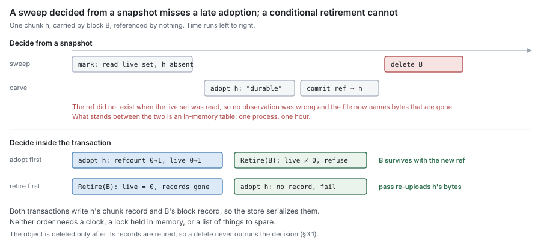

# RFC 7 — GC: sweep, relocation and remote deletion

**Status:** draft.
**Depends on:** [RFC 0](rfc-0-data-lifecycle.md), for the terms, the failure model and invariants I3, I7 and
I8. [RFC 4](rfc-4-block-metadata.md) supplies the counts and the two atomic operations sweep is built on
([§7](#7.%20Bounds%2C%20records%20and%20scheduling)). [RFC 8](rfc-8-remote-tier.md) specifies the delete, read, put and enumeration this component calls.
[RFC 2 §4](rfc-2-carver.md#4.%20Identity) names the blocks it writes. Nothing here redefines them.
**Audience:** anyone changing `pkg/block/gc`, the sweep, relocation or orphan
paths in `pkg/controlplane/runtime`, or a metadata backend's block and chunk
records. Anyone adding a way to keep content alive.

The key words **MUST**, **MUST NOT**, **SHOULD**, **SHOULD NOT** and **MAY** are
to be interpreted as in RFC 2119.

This document specifies what GC is required to be. It was written from the model
in RFC 0–5 and 8, not from `pkg/block/gc`. Where the current implementation does
not satisfy a requirement, that is recorded once, in [§11](#11.%20Deviations), as a **deviation**. A
deviation is a defect to be fixed, never a rule for an implementer to build
around. Where this document chooses a policy the set left open, it says so and
labels the choice a **proposal for discussion**.

---

## 1. Purpose

GC answers one question:

> **Which remote objects may be deleted, and when is deleting one safe?**

It is the only component in the set that destroys the last copy of content
([RFC 0 §8.3](rfc-0-data-lifecycle.md#8.3%20Sweep)). Every other failure in the system can lose a local copy, serve a
stale answer or stop accepting writes. A GC defect deletes data that a file still
names, and nothing downstream can recover it.

GC performs four operations, all on the remote tier:

| Operation | What it destroys | Section |
| --- | --- | --- |
| **sweep** | a block nothing references | [§3](#3.%20Sweep) |
| **relocation** | nothing — it moves referenced chunks out of a mostly dead block | [§4](#4.%20Relocation) |
| **unrecorded-object collection** | an object no record names | [§5](#5.%20Unrecorded%20objects) |
| **audit** | nothing — it recomputes counts and reports | [§6](#6.%20Audit) |

### 1.1 Non-goals

GC **MUST NOT**:

- recover local space. Eviction and reclamation are the journal's ([RFC 0 §8.1](rfc-0-data-lifecycle.md#8.1%20Evict),
  [§8.2](rfc-0-data-lifecycle.md#8.2%20Reclaim); [RFC 1](rfc-1-journal.md)). GC never reads, writes or unlinks a segment;
- decide what is referenced. Refcounts are block metadata's ([RFC 4 §6](rfc-4-block-metadata.md#6.%20Reference%20counting)), and an
  inode's release is the namespace's ([RFC 5 §4.3](rfc-5-namespace-metadata.md#4.3%20Release%20is%20what%20block%20metadata%20sees)). GC reads the count; it does not
  keep one of its own;
- keep content alive by any means other than the count ([§2.1](#2.1%20The%20count%20is%20the%20only%20authority));
- restate what a put, a read or a delete means. That is [RFC 8](rfc-8-remote-tier.md)'s, and GC inherits
  it ([RFC 8 §2.7](rfc-8-remote-tier.md#2.7%20What%20this%20means%20for%20the%20rest%20of%20the%20set));
- name a block by any means other than [RFC 2 §4.2](rfc-2-carver.md#4.2%20A%20block), or frame, seal or parse an
  object ([RFC 8 §3](rfc-8-remote-tier.md#3.%20The%20stored%20object), [§4](rfc-8-remote-tier.md#4.%20The%20transform%20chain));
- import another component in this set ([RFC 0 §1.2](rfc-0-data-lifecycle.md#1.2%20Component%20autonomy)).

### 1.2 Words this document uses, and two it does not

[RFC 0 §1.1](rfc-0-data-lifecycle.md#1.1%20The%20component%20set) assigns this component "mark/sweep". **Sweep** keeps its meaning:
deleting a remote block that nothing references ([RFC 0 §2.3](rfc-0-data-lifecycle.md#2.3%20Operations)). **Mark** survives
only as the audit of [§6](#6.%20Audit), which recomputes counts from refs. It is not a phase of
the sweep and decides nothing. [§2.4](#2.4%20Why%20not%20mark%20from%20a%20snapshot) says why.

**Relocation** is [RFC 4 §7.3](rfc-4-block-metadata.md#7.3%20Relocation)'s word for rewriting a block's surviving chunks into
a new block. [RFC 2 §4](rfc-2-carver.md#4.%20Identity) and [RFC 8 §7](rfc-8-remote-tier.md#7.%20This%20contract%20has%20more%20than%20one%20consumer) call the same operation "compaction". [RFC 0](rfc-0-data-lifecycle.md)
[§8.2](rfc-0-data-lifecycle.md#8.2%20Reclaim) retires that word because in an LSM it names an operation that discards
content, and relocation discards none. This document uses "relocation" only.

"GC" also names the storage engine's own value-log collection in the Badger
backend ([RFC 4 §2.1](rfc-4-block-metadata.md#2.1%20Ref)). That is internal to one backend and unrelated to anything
here.

## 2. What is safe to delete

### 2.1 The count is the only authority

A block **MAY** be deleted only when its `live` count is zero ([RFC 4 §2.3](rfc-4-block-metadata.md#2.3%20Block)), and
only by the conditional retirement of [§3.1](#3.1%20Retire%20the%20records%2C%20then%20delete%20the%20object). Nothing else permits a delete, and
nothing else prevents one.

In particular, an implementation **MUST NOT** consult, in deciding whether to
delete:

- a hold set, a pin list, or an extra root for a snapshot, an open file or any
  other holder. Every holder of content holds counted refs ([RFC 4 §6.5](rfc-4-block-metadata.md#6.5%20Who%20owns%20a%20ref), M12;
  [RFC 5 §4.4](rfc-5-namespace-metadata.md#4.4%20There%20is%20no%20third%20holder));
- elapsed time. A grace period **MUST NOT** substitute for conditional retirement
  or conditional adoption ([RFC 4 §7.2](rfc-4-block-metadata.md#7.2%20Adoption%20is%20conditional%20on%20existence)). Inferring safety from "unreferenced for
  long enough" is the inference [RFC 0 §4.3](rfc-0-data-lifecycle.md#4.3%20Reporting) forbids for durability;
- any state held in process memory. Two passes in two processes **MUST** be as
  safe as two in one.

A second liveness mechanism fails open. Every path that decides liveness has to
remember it, the one that forgets deletes held content, and the audit of [§6](#6.%20Audit)
reports nothing wrong because by the counts nothing was.

### 2.2 Zero is a candidate, not a verdict

`live` is read at one instant and the delete happens at another. Between them a
flush commit can adopt one of the block's chunks ([RFC 4 §7.2](rfc-4-block-metadata.md#7.2%20Adoption%20is%20conditional%20on%20existence)), a clone can copy a
ref to one, and a relocation can move one in or out. So a zero read outside a
transaction **MUST** be treated as a candidate only. The verdict is taken inside
the retirement transaction, which re-reads `live` and refuses if it is nonzero
([RFC 4 §7.1](rfc-4-block-metadata.md#7.1%20Conditional%20retirement)).

This is the whole of [RFC 0 §8.3](rfc-0-data-lifecycle.md#8.3%20Sweep)'s requirement that "content created or referenced
after a sweep began cannot be deleted by that sweep". A sweep has no beginning
that matters. Each retirement is its own decision, taken on the state at its own
commit.

### 2.3 The absence of a record proves nothing

A block with no record in this store is not thereby unreferenced ([RFC 4 §2.6](rfc-4-block-metadata.md#2.6%20The%20scope%20of%20a%20count),
M13). Another store, another process or another deployment writing into the same
key namespace can reference it. Sweep therefore acts only on blocks this store
records. Objects no store records are [§5](#5.%20Unrecorded%20objects)'s, and [§5](#5.%20Unrecorded%20objects) runs only where the namespace
is proven to belong to the stores it enumerated.

The namespace is fixed by the key scope of [RFC 2 §4.3](rfc-2-carver.md#4.3%20Key%20scope). A deployment **MUST**
satisfy one of the two options of [RFC 4 §2.6](rfc-4-block-metadata.md#2.6%20The%20scope%20of%20a%20count) before any GC operation runs. Where
the scope makes one object reachable from several shares, the stores of all those
shares are one counting domain, and GC **MUST** treat them as one.

### 2.4 Why not mark from a snapshot

The alternative to a count is a mark: walk every ref, collect the chunks they
name, and delete what the walk did not see. [RFC 4 §13.6](rfc-4-block-metadata.md#13.%20Open%20questions) records the trade-off and
places the choice in [RFC 0](rfc-0-data-lifecycle.md), which chose counts. This section records why GC does
not reintroduce a mark beside them.

A mark reads a live set at one instant and deletes at a later one. A ref written
between the two names a chunk the live set does not contain. No observation was
wrong, and the chunk is deleted anyway. The only way to close that window is a
second mechanism that records adoptions made after the mark began, and that
second mechanism is exactly the kind [§2.1](#2.1%20The%20count%20is%20the%20only%20authority) forbids: something other than the count
that decides liveness.

The current implementation is a mark with that second mechanism. [§11](#11.%20Deviations) records
what it costs.

## 3. Sweep

### 3.1 Retire the records, then delete the object

Sweeping one block is two steps, in this order:

1. **Retire** ([RFC 4 §7.1](rfc-4-block-metadata.md#7.1%20Conditional%20retirement)): in one transaction, if `live` is zero, delete the
   block record and every chunk record whose `block` names it, and write the
   pending-deletion record of [§3.2](#3.2%20A%20retirement%20not%20yet%20deleted%20is%20durably%20recorded); otherwise refuse.
2. **Delete** the object through the remote tier ([RFC 8 §5.1](rfc-8-remote-tier.md#5.1%20Operations)).

The order is not a preference. Retiring first means a crash between the two
leaves an object that no record names, which is a leak. Deleting first means a
crash, or a failed metadata write, leaves records that name an object that no
longer exists. Every read of those chunks then fails, and every adoption of them
succeeds, so new files acquire refs to content that is gone. That is **Lost**
for content that was durable.

GC **MUST** call the remote tier directly and not through the syncer ([RFC 3 §5](rfc-3-syncer.md#5.%20What%20belongs%20elsewhere)).
Deletion is not a transfer, and it **MUST NOT** occupy the syncer's upload window
or be subject to its health state ([RFC 8 §2.2](rfc-8-remote-tier.md#2.2%20Why%20the%20syncer%20must%20exist), [§7](rfc-8-remote-tier.md#7.%20This%20contract%20has%20more%20than%20one%20consumer)).

### 3.2 A retirement not yet deleted is durably recorded

The retirement transaction **MUST** write a pending-deletion record naming the
block's key. The record is removed only after the delete returns success, and a
restart **MUST** resume every pending deletion it finds.

This is what removes enumeration from sweep's correctness. Without the record, a
crash between [§3.1](#3.1%20Retire%20the%20records%2C%20then%20delete%20the%20object)'s steps leaves an object that can only be found by listing the
bucket, and [RFC 8 §5.4.1](rfc-8-remote-tier.md#5.4.1%20Enumeration%20is%20required%20by%20a%20condition%2C%20not%20by%20the%20design) forbids depending on a listing for correctness. With it,
the object is named by a record until the moment it is gone.

The pending-deletion record is a record kind [RFC 4 §2](rfc-4-block-metadata.md#2.%20The%20records) does not list. [§9](#9.%20Consequences%20for%20other%20RFCs) states
the amendment.

### 3.3 The race with adoption is closed by transactions, not by time

Adoption is a flush commit referencing a chunk it did not carry ([RFC 4 §7.2](rfc-4-block-metadata.md#7.2%20Adoption%20is%20conditional%20on%20existence)).
Retirement and adoption are the only two operations that can disagree about
whether a chunk is alive, and both touch the same two records:

| Order | Adoption | Retirement | Outcome |
| --- | --- | --- | --- |
| adopt, then retire | refcount 0→1, `live` 0→1 | reads `live` = 1, refuses | block survives with the new ref |
| retire, then adopt | finds no chunk record, fails | deletes block and chunk records | pass retries carrying the chunk's bytes |

The table is correct only if the store serializes the two. An implementation
**MUST** guarantee that, of two transactions writing the same record, at most one
commits on a pre-state the other changed. Serializable and snapshot isolation
both provide this for a record both transactions write. Under a weaker level —
Postgres's default read-committed, for one — the conditions **MUST** be part of
the write statements themselves:

- retirement's "`live` is zero" **MUST** be the predicate of the delete, not a
  prior read;
- adoption **MUST** detect a missing chunk record from the write it issues — the
  count of rows it updated — and not from a read made earlier in the transaction.

A retried adoption carries the chunk's bytes, which the journal still holds: the
extent was offered because it is **Dirty** ([RFC 0 §5.2](rfc-0-data-lifecycle.md#5.2%20Flush)), and nothing reports it
durable until a commit succeeds ([RFC 4 §4.3](rfc-4-block-metadata.md#4.3%20The%20commit%20is%20the%20report%27s%20return%20edge)). So losing this race costs one
upload and never a client-visible error.

### 3.4 A retired key is not re-created underneath its delete

Under [RFC 2 §4.2](rfc-2-carver.md#4.2%20A%20block) a block's name is derived from the ordered hashes it holds. Two
assemblies of the same chunks in the same order produce the same key. That makes
this sequence possible:

1. A flush, finding a chunk's record gone ([§3.3](#3.3%20The%20race%20with%20adoption%20is%20closed%20by%20transactions%2C%20not%20by%20time)), re-uploads it and happens to
   assemble a block whose key equals a retired block's key *K*. It puts *K*.
2. GC, resuming the pending deletion of *K*, deletes *K*.
3. The flush commits a block record for *K*.

The records now name an object that was deleted after it was put. **A delete of
key *K* MUST NOT run concurrently with a put of *K* whose commit can succeed.**

A check made only at commit time cannot provide this, because the put happens
outside any transaction and the commit cannot tell whether the delete came before
or after it. The commit has to be conditioned on something the flush read
*before* its put.

> [!question] Proposal for discussion
> Keep a fixed array of **deletion generations**,
> indexed by a hash of the block key. The flush reads its key's generation before
> the put, and its commit **MUST** fail if the generation has changed. GC
> increments the generation, in a transaction, after the delete returns and
> before it removes the pending-deletion record. A flush whose put preceded the
> delete then fails its commit and re-puts. A flush that read the generation
> after the increment put after the delete and is safe. A commit also **MUST**
> fail while a pending-deletion record for its key exists. The array is bounded,
> so I7 holds, and a flush is refused spuriously only when an unrelated key in
> the same bucket was deleted during its put. What the bucket count should be is
> unmeasured.

While block names are generated rather than derived ([RFC 2 §4.2.1](rfc-2-carver.md#4.2.1%20Deviation%20%E2%80%94%20a%20block%27s%20identity%20is%20generated%2C%20in%20two%20places)), no key is
ever reused and this race cannot occur. The requirement is stated now because the
fix to [RFC 2 §4.2.1](rfc-2-carver.md#4.2.1%20Deviation%20%E2%80%94%20a%20block%27s%20identity%20is%20generated%2C%20in%20two%20places) is what makes it load-bearing, and a fence added after the
naming change would be added after the first loss it prevents.

### 3.5 Finding candidates costs what is retirable

A sweep pass **SHOULD** cost O(blocks retired), not O(blocks recorded).

> [!question] Proposal for discussion
> Every transaction that moves a block's `live` from
> one to zero writes a candidate record for the block in the same transaction.
> Sweep consumes candidates, and a retirement that refuses ([§3.3](#3.3%20The%20race%20with%20adoption%20is%20closed%20by%20transactions%2C%20not%20by%20time)) deletes the
> candidate. The candidate list is a hint and never an authority: retirement
> re-reads `live` whatever the list says. `live` crosses zero far less often than
> a refcount changes ([RFC 4 §5.3](rfc-4-block-metadata.md#5.3%20Hot%20records%20that%20are%20not%20per-file)), so the candidate write does not add a hot
> record.

An implementation **MAY** instead scan the block records. The scan is correct and
proportional to the store, and on a large store it is the reason a pass does not
finish.

### 3.6 Failures resolve on their own

| Condition | Behaviour |
| --- | --- |
| Delete reports the object absent | Success. A delete is idempotent ([RFC 8 §5.5](rfc-8-remote-tier.md#5.5%20A%20put%20of%20an%20existing%20key%20succeeds%3B%20so%20does%20a%20delete%20of%20an%20absent%20one)), and a sweep resuming after a crash will see this. |
| Delete refused or failed | The pending-deletion record stays, and the next pass retries it. |
| Remote tier unavailable | Retirements continue, pending deletions accumulate, and nothing is lost. A backlog that does not drain **MUST** be reported as a health condition, not only logged ([RFC 0 §10.2](rfc-0-data-lifecycle.md#10.2%20No%20state%20requires%20intervention%20to%20leave)). |
| Metadata unwritable | Nothing retires, so nothing is deleted. |
| Retirement conflicts | Retried under I8: bounded by the pass's deadline, not an attempt count, with randomised backoff ([RFC 0 §9.2](rfc-0-data-lifecycle.md#9.2%20Conflicts%20and%20their%20retries)). The retry re-reads `live`; it **MUST NOT** re-propose a decision taken on the pre-conflict state. |
| Crash anywhere | Every step is either inside a transaction or recorded by a pending-deletion record, so a restart resumes and does not re-decide. |

A failure in one block **MUST NOT** stop the pass for others. No failure in this
table requires an operator to clear it.

## 4. Relocation

### 4.1 A block that is mostly dead pins its dead bytes

A block is deleted only when every chunk it carries is unreferenced. A block with
one referenced chunk and forty dead ones keeps all forty-one on the remote tier
indefinitely. Relocation copies the referenced chunks into a new block so that
the old one reaches `live` = 0 and sweep can take it.

Relocation destroys nothing. It **MUST NOT** delete an object, and **MUST NOT**
retire a record. It moves chunk records and counts ([RFC 4 §7.3](rfc-4-block-metadata.md#7.3%20Relocation)), and the old
block is swept by [§3](#3.%20Sweep) exactly like any other block that reached zero.

### 4.2 Read verified, name by content, put, then move

Relocating block *B*:

1. Read each chunk of *B* whose refcount is nonzero, through the remote tier's
   verified read ([RFC 8 §6.1](rfc-8-remote-tier.md#6.1%20The%20exported%20read%20takes%20the%20expected%20hash)). GC **MUST NOT** parse the object or verify it
   itself.
2. Assemble the chunks into a block under [RFC 2 §5](rfc-2-carver.md#5.%20Packing%3A%20three%20rules%2C%20not%20a%20component): whole chunks only (P1), the
   target size (P2), and only the chunks whose bytes it carries (P3).
3. Name the block by [RFC 2 §4.2](rfc-2-carver.md#4.2%20A%20block), which the assembler computes because it holds
   the hash list ([RFC 2 §4](rfc-2-carver.md#4.%20Identity)). The name **MUST NOT** be generated.
4. Put it ([RFC 8 §5.1](rfc-8-remote-tier.md#5.1%20Operations)), under the fence of [§3.4](#3.4%20A%20retired%20key%20is%20not%20re-created%20underneath%20its%20delete).
5. After the put is reported durable, apply [RFC 4 §7.3](rfc-4-block-metadata.md#7.3%20Relocation) in one transaction: point
   each moved chunk record at the new block, create its record, and decrement
   *B*'s `live` by the number moved.

| Crash after | State | Outcome |
| --- | --- | --- |
| 1–3 | nothing written | no effect |
| 4 | an object no record names | the re-run derives the same name and puts the same object ([RFC 2 §4.2](rfc-2-carver.md#4.2%20A%20block)). If it never re-runs, [§5](#5.%20Unrecorded%20objects) may collect it |
| 5 | chunks moved, *B*'s `live` at zero | *B* is an ordinary sweep candidate |

A chunk whose refcount is zero is not moved. Its record stays pointing at *B*
until *B* retires. If it is adopted in between, *B*'s `live` becomes nonzero
again, *B* survives, and the next relocation of *B* moves it. That is a leak for
one pass, not a loss.

### 4.3 A reader can hold the old location

A reader that resolved a chunk to *B* before step 5 can issue its read after *B*
is swept, and find the object absent. [RFC 4 §2.5](rfc-4-block-metadata.md#2.5%20Refs%20name%20hashes%2C%20never%20blocks) makes refs name hashes, so the
chunk is still reachable, at the new block. The read path **MUST** re-resolve the
chunk once when the remote tier reports an object absent, and **MUST** fail only
if the second resolution also misses. That rule belongs to the read path ([RFC 6](rfc-6-engine.md)),
and relocation is safe only while it holds.

### 4.4 When to relocate is policy

Relocation spends a read and a put to recover dead bytes. Whether that is worth
it depends on how much of the block is dead, how long the bytes would otherwise
be stored, and what a transfer costs. GC **MUST** expose the selection threshold
as configuration, **MUST NOT** relocate a block whose chunks are all referenced,
and **SHOULD** select on bytes rather than on chunks, because chunk sizes vary
several-fold ([RFC 2 §3](rfc-2-carver.md#3.%20The%20boundary%20function)).

The metric and default are open ([§12](#12.%20Conformance)). [RFC 4](rfc-4-block-metadata.md)'s block record carries `live`, a
chunk count. Selecting on bytes needs either a per-block byte count or a read of
the chunk records, and which is cheaper is unmeasured.

### 4.5 What relocation races

| Concurrent operation | Why it is safe |
| --- | --- |
| Adoption of a moved chunk | Both transactions read and write that chunk's record, so they serialize. The adoption counts in whichever block the record names when it applies ([RFC 4 §7.3](rfc-4-block-metadata.md#7.3%20Relocation)). |
| Sweep of *B* | Retirement reads *B*'s `live` inside its transaction. It is zero only once relocation has committed. |
| Snapshot or restore | Refs name hashes, so a snapshot's refs survive the move. A restore takes locations from the live store, never from its copy ([RFC 4 §7.4](rfc-4-block-metadata.md#7.4%20Restore)). |
| A second relocation of *B* | Both derive the same name from the same chunks, and the second's step 5 finds nothing left pointing at *B* to move. |

## 5. Unrecorded objects

### 5.1 How they arise

An object no record names comes from one of:

- a put whose commit never ran — a crash, or a pass abandoned after the put
  ([RFC 4 §4.2](rfc-4-block-metadata.md#4.2%20Only%20after%20durability) note);
- a relocation that put and did not commit ([§4.2](#4.2%20Read%20verified%2C%20name%20by%20content%2C%20put%2C%20then%20move));
- anything written into the namespace by a process this store does not know
  about.

A retirement does not produce one, because [§3.2](#3.2%20A%20retirement%20not%20yet%20deleted%20is%20durably%20recorded) records it until the delete
completes.

### 5.2 Collecting them is an audit

Under [RFC 2 §4.2](rfc-2-carver.md#4.2%20A%20block) everything durable is reachable from the content that names it,
and a put that did not commit is retried under the same name. An unrecorded
object is then a leak of storage, not a threat to content, and the operation
that finds it is an audit worth running and not required for correctness
([RFC 8 §5.4.1](rfc-8-remote-tier.md#5.4.1%20Enumeration%20is%20required%20by%20a%20condition%2C%20not%20by%20the%20design), [§7](rfc-8-remote-tier.md#7.%20This%20contract%20has%20more%20than%20one%20consumer)).

An implementation **MUST NOT** depend on this operation for correctness, and a
deployment that never runs it **MUST** only leak.

While [RFC 2 §4.2.1](rfc-2-carver.md#4.2.1%20Deviation%20%E2%80%94%20a%20block%27s%20identity%20is%20generated%2C%20in%20two%20places) stands, a put that did not commit leaves an object under a
random name that no retry will ever reuse. Collection is then the only way that
storage is recovered, which is why the current implementation carries it. It is
still not a correctness path.

### 5.3 It runs only where the namespace is proven

Collection deletes an object because no record names it, which is exactly the
inference [§2.3](#2.3%20The%20absence%20of%20a%20record%20proves%20nothing) forbids unless every store that could name it has been read. GC
**MUST NOT** delete an unrecorded object unless:

- the deployment meets [RFC 4 §2.6](rfc-4-block-metadata.md#2.6%20The%20scope%20of%20a%20count) — one store per namespace, or key derivation
  that includes the store's identity — and GC can verify which it is from
  configuration, not assume it;
- every store in the counting domain ([§2.3](#2.3%20The%20absence%20of%20a%20record%20proves%20nothing)) was enumerated completely in this
  pass. A store that failed or was skipped **MUST** stop collection for the whole
  namespace.

A second server or a second configuration pointing at the same bucket and prefix
is the case this exists for. Per share it is a correct configuration. Together
they share a namespace neither can see all of.

### 5.4 Age is not the guard

An unrecorded object may be the put half of a commit still in flight. Deleting it
then produces [§3.4](#3.4%20A%20retired%20key%20is%20not%20re-created%20underneath%20its%20delete)'s sequence exactly, and the fence of [§3.4](#3.4%20A%20retired%20key%20is%20not%20re-created%20underneath%20its%20delete) is what prevents
it: collection **MUST** install a pending-deletion record for the key, in a
transaction conditional on no block record for that key existing, before it
deletes. A commit of that key then fails until the deletion completes and the
generation moves.

An implementation **MAY** additionally skip objects younger than some age, to
avoid churning on puts that are about to commit. That is an efficiency filter. It
**MUST NOT** be the only thing between an in-flight commit and a delete, because
nothing bounds how long a commit can take: a pass can stall behind a saturated
upload window or a metadata store that is refusing writes ([RFC 0 §10](rfc-0-data-lifecycle.md#10.%20Failure%20model)).

## 6. Audit

Counts are sweep's only authority ([§2.1](#2.1%20The%20count%20is%20the%20only%20authority)), so there **MUST** be a way to check
them. GC runs [RFC 4 §7.5](rfc-4-block-metadata.md#7.5%20Audit)'s audit: recompute each chunk's refcount from the refs
naming it and each block's `live` from its chunks, from one consistent read of
the store, and report every mismatch naming the chunk or block.

A count found **high** is a leak, and a repair **MAY** raise the stored count to
match or leave it for an operator. A count found **low** is an I3 hazard: sweep
will delete a referenced block when the stored count reaches zero before the true
one does. A repair **MUST NOT** lower a count unless [RFC 4 §7.5](rfc-4-block-metadata.md#7.5%20Audit)'s single-read,
no-concurrent-commit condition held.

> [!question] Proposal for discussion
> A block whose `live`, or any of whose chunks'
> refcounts, the audit found low **MUST NOT** be retired until the count is
> repaired. The audit already names the block, and suspending its retirement
> costs one leaked block per mismatch. An unrepaired low count costs the content.

An audit that recomputes counts is the only "mark" this component has ([§1.2](#1.2%20Words%20this%20document%20uses%2C%20and%20two%20it%20does%20not)). It
decides nothing by itself, and its scratch state obeys [§7.2](#7.2%20Every%20record%20GC%20stores%20names%20its%20reclamation).

## 7. Bounds, records and scheduling

### 7.1 GC bounds its own work

GC **MUST** bound, per process, the number of remote operations it has in flight
and the memory it holds for them, and **MUST** state the bound where it is
configured. It **MUST NOT** borrow the syncer's window ([RFC 8 §2.2](rfc-8-remote-tier.md#2.2%20Why%20the%20syncer%20must%20exist)): a sweep that
waits behind flush uploads makes no progress while space fills, and a relocation
that takes upload slots delays the flushes that make content evictable.

The memory a pass holds **MUST NOT** grow with the size of the store. A pass that
needs a set of every referenced hash, in memory or on disk, has become a mark
([§2.4](#2.4%20Why%20not%20mark%20from%20a%20snapshot)).

### 7.2 Every record GC stores names its reclamation

I7 applies to GC's records as to any other ([RFC 0 §9.1](rfc-0-data-lifecycle.md#9.1%20Records%20and%20their%20reclamation)).

| Record | Maximum size | Reclaimed by |
| --- | --- | --- |
| pending deletion ([§3.2](#3.2%20A%20retirement%20not%20yet%20deleted%20is%20durably%20recorded)) | one key per retired, undeleted block | the successful delete of that block |
| candidate ([§3.5](#3.5%20Finding%20candidates%20costs%20what%20is%20retirable)) | one key per block at `live` = 0 | the retirement, or the refusal, that consumes it |
| deletion generation ([§3.4](#3.4%20A%20retired%20key%20is%20not%20re-created%20underneath%20its%20delete)) | a fixed array of counters | not reclaimed; bounded by construction |
| per-pass summary | one per namespace, overwritten | the next pass |
| audit scratch ([§6](#6.%20Audit)) | proportional to the audit's consistent read | the end of the audit, on success or failure |

A record not in this table **MUST NOT** be added without a row. Where a pass
leaves scratch state on disk, what removes it after a crash is part of the row,
and "the next pass" is an answer only if a pass is guaranteed to run.

### 7.3 When GC runs is the engine's

Cadence, triggers and the relocation threshold are policy, and policy belongs to
the engine ([RFC 6](rfc-6-engine.md)). GC **MUST** be correct at any cadence, including two passes
over one namespace at once, from one process or two. No lock held in process
memory is a safety input ([§2.1](#2.1%20The%20count%20is%20the%20only%20authority)); where an implementation serializes passes for
efficiency, removing the serialization **MUST NOT** make a pass unsafe.

A pass **MUST NOT** require quiescence. Writes, flushes, clones, snapshots and
reads continue during it, and [§3.3](#3.3%20The%20race%20with%20adoption%20is%20closed%20by%20transactions%2C%20not%20by%20time) and [§4.5](#4.5%20What%20relocation%20races) are what make that safe.

## 8. What GC declares

GC depends on two things it does not own. It **MUST** declare an interface for
each in its own package, named for the need ([RFC 0 §1.2](rfc-0-data-lifecycle.md#1.2%20Component%20autonomy)), and satisfied by the
engine at composition time:

| Need | Operations | Semantics from |
| --- | --- | --- |
| retiring and relocating | candidates; `Retire(block)`; relocate; pending-deletion records; deletion generations; audit's consistent read | [RFC 4 §7](rfc-4-block-metadata.md#7.%20What%20sweep%20needs%20from%20this%20component) and this document |
| deleting and moving objects | delete; verified read; put; enumerate ([§5](#5.%20Unrecorded%20objects) only) | [RFC 8 §5](rfc-8-remote-tier.md#5.%20The%20backend%20contract), [§6](rfc-8-remote-tier.md#6.%20Reads%20are%20verified%20at%20this%20boundary) |

GC **MUST NOT** take a provider's full interface, and **MUST NOT** negotiate any
of these operations by type assertion. A missing capability **MUST** be a build
failure. A GC that silently skips an operation because an assertion failed is a
GC that leaks or, where the skipped operation was a guard, deletes.

## 9. Consequences for other RFCs

This document requires four changes elsewhere, so that the set carries one answer.

1. **[RFC 4 §2](rfc-4-block-metadata.md#2.%20The%20records), [§5.1](rfc-4-block-metadata.md#5.1%20No%20record%20is%20written%20by%20both%20paths), [§7.1](rfc-4-block-metadata.md#7.1%20Conditional%20retirement).** Retirement also writes a pending-deletion record
   ([§3.2](#3.2%20A%20retirement%20not%20yet%20deleted%20is%20durably%20recorded)), and deletes the chunk records whose `block` names the retired block.
   The write-set table gains that record under **Sweep**. If [§3.4](#3.4%20A%20retired%20key%20is%20not%20re-created%20underneath%20its%20delete)'s and [§3.5](#3.5%20Finding%20candidates%20costs%20what%20is%20retirable)'s
   proposals are adopted, the deletion generations and candidate records join it,
   and the flush commit reads a generation.
2. **[RFC 4 §7.2](rfc-4-block-metadata.md#7.2%20Adoption%20is%20conditional%20on%20existence), [§7.3](rfc-4-block-metadata.md#7.3%20Relocation).** Adoption's failure on a missing record, and the
   isolation requirement of [§3.3](#3.3%20The%20race%20with%20adoption%20is%20closed%20by%20transactions%2C%20not%20by%20time), are stated in the write statement where the
   backend's isolation level needs it.
3. **[RFC 6](rfc-6-engine.md).** The read path re-resolves once on an absent object ([§4.3](#4.3%20A%20reader%20can%20hold%20the%20old%20location)). The
   engine owns GC's cadence and relocation threshold ([§7.3](#7.3%20When%20GC%20runs%20is%20the%20engine%27s)).
4. **[RFC 8 §7](rfc-8-remote-tier.md#7.%20This%20contract%20has%20more%20than%20one%20consumer).** The compaction row becomes relocation, whose needs are verified
   read and put. Relocation deletes nothing, so delete leaves that row. Orphan
   reclaim and reconcile become one audit ([§5](#5.%20Unrecorded%20objects)), still contingent.

## 10. Invariants

| # | Invariant |
| --- | --- |
| G1 | A remote object is deleted only after a transaction that re-read its block's `live` as zero has retired its records, or, for an unrecorded object, after a transaction that found no record has installed its pending deletion. |
| G2 | Nothing but the count keeps content alive or permits a delete: no hold list, no grace period, no state in process memory. |
| G3 | A key is never deleted concurrently with a put of that key whose commit can succeed. |
| G4 | Every retirement not yet followed by a successful delete is durably recorded, and a restart resumes it. |
| G5 | Relocation deletes nothing. It moves chunk records and counts, and sweep deletes. |
| G6 | A block GC writes is named from its content, never generated. |
| G7 | Unrecorded-object collection runs only in a namespace whose every store was enumerated completely, and correctness never depends on it. |
| G8 | A conflict is retried under I8, and a failed delete never loses its pending record. |
| G9 | Every record GC stores has a named reclamation path at its maximum size. |

G1, G2 and G3 are the ones whose violation deletes referenced content. G4 and G7
are the ones whose violation hides a leak or turns an audit into a correctness
dependency. I3 holds exactly when G1–G3 do.

## 11. Deviations

The current implementation was checked against this document after it was
written. Every row cites code read for this purpose. The first four rows can
delete content that a file names.

| Requirement | Current state | Evidence |
| --- | --- | --- |
| [§3.1](#3.1%20Retire%20the%20records%2C%20then%20delete%20the%20object) retire, then delete | **Deletes the object first.** The last-chunk path deletes the object, then the block record, then the synced marker, each in its own step. If either metadata step fails after the object delete succeeds, the reclaimer returns an error, the sweep records it and releases its claim, and the synced marker still reports the hash durable. The dedup oracle then answers "durable" and a carve adopts the hash; the next sweep sees it live and keeps it; every read fails. This needs one transient metadata error, not a crash. Relocation and record reclaim use the same order. | `gc/gc_block.go:166`, `:169`, `:172`; `gc/sweep_index.go:99`, `:112`; `engine/flush.go:150`; `engine/fetch.go:431`; `gc/compaction.go:341`; `gc/orphan_reclaim.go:187` |
| [§2.1](#2.1%20The%20count%20is%20the%20only%20authority) no state in memory, [§3.3](#3.3%20The%20race%20with%20adoption%20is%20closed%20by%20transactions%2C%20not%20by%20time) transactions not time | Adoptions made after the mark are protected by a process-wide in-memory table, and only for one hour. A carve whose adoption-to-commit gap exceeds the hour, or a GC in another process, is not protected. In a batch with novel chunks, the deduped rows commit only after the batch's put returns. The grace window does not cover this case: it is measured from the marker's first-write time, which a later adoption of an old hash does not refresh. | `gc/sweepguard.go:38`, `:85`, `:95`, `:171`; `engine/flush.go:446`, `:468`; `gc/sweep_index.go:50`, `:73`; `store/badger/synced_hash_store.go:124` |
| [§2.1](#2.1%20The%20count%20is%20the%20only%20authority) holders are counted | A snapshot is held only once its manifest file exists, and the manifest is written after the metadata backup it summarises. A file captured by the backup and deleted before a mark that runs before the manifest is written has its hashes in neither the live set nor a hold. Snapshot creation takes no GC lock. Derived from the code, not reproduced. | `runtime/snapshot_hold.go:102`; `runtime/snapshot.go:679` |
| [§5.3](#5.3%20It%20runs%20only%20where%20the%20namespace%20is%20proven) proven namespace | Record reclaim and orphan-object reclaim delete any object whose block ID no record in the union of the shares under one remote *configuration* names, once it is older than the grace window. A second server, or a second configuration on the same bucket and prefix, has its objects deleted. Operator-triggered only. | `gc/orphan_reclaim.go:256`, `:264`; `runtime/blockgc_reconcile_reclaim.go:38`, `:135`; `api/handlers/block_gc.go:360` |
| [§2.1](#2.1%20The%20count%20is%20the%20only%20authority) the count is the authority | Sweep is decided by a mark over every manifest row, and refcounts decide nothing. Snapshots and open-but-unlinked files are extra roots injected by hold providers. | `gc/gc.go:494`, `:547`; `gc/sweep_index.go:77`; `runtime/blockgc.go:113`; `runtime/openhandle_hold.go:113` |
| [§3.1](#3.1%20Retire%20the%20records%2C%20then%20delete%20the%20object) conditional retirement | The reclaimer reads the count, decides whether this is the last chunk, and decrements in a separate step, relying on a per-remote lock that exists only in process memory. | `gc/gc_block.go:130`, `:143`, `:153`; `runtime/blockgc.go:97` |
| [RFC 4 §6.3](rfc-4-block-metadata.md#6.3%20Underflow%20is%20corruption%2C%20not%20a%20boundary) underflow fails | The `live` decrement clamps at zero in every backend, and the last-chunk path relies on the clamp. | `store/badger/block_record_store.go:148`, `:300`; `store/postgres/dialect.go:383`; `store/sqlite/dialect.go:382`; `store/memory/block_record_store.go:48`; `gc/gc_block.go:92` |
| [§3.2](#3.2%20A%20retirement%20not%20yet%20deleted%20is%20durably%20recorded) pending deletion recorded | None exists. An object left by a crash is found only by listing the bucket. | `gc/orphan_reclaim.go:12`, `:256` |
| [§5.4](#5.4%20Age%20is%20not%20the%20guard) age is not the guard | Orphan-object reclaim is guarded only by the object's age. | `gc/orphan_reclaim.go:261`, `:264` |
| [§4.1](#4.1%20A%20block%20that%20is%20mostly%20dead%20pins%20its%20dead%20bytes) relocation deletes nothing | Relocation deletes the old object and its record itself. | `gc/compaction.go:329`, `:341` |
| [§4.2](#4.2%20Read%20verified%2C%20name%20by%20content%2C%20put%2C%20then%20move) name by content | Relocation generates a random block name. | `gc/compaction.go:269` |
| [§4.2](#4.2%20Read%20verified%2C%20name%20by%20content%2C%20put%2C%20then%20move) verified read, no parsing | Relocation fetches the whole object, verifies its hash and parses the format itself. | `gc/compaction.go:196`, `:219`, `:225` |
| [§7.3](#7.3%20When%20GC%20runs%20is%20the%20engine%27s) no in-memory safety input | Both the run lock and the per-remote lock are process-local, and the code says multi-server safety is not implemented. | `gc/gc.go:51`, `:65`; `runtime/blockgc.go:97` |
| [§8](#8.%20What%20GC%20declares) declared, not asserted | GC imports `pkg/metadata`, takes the remote tier's full interface, and resolves the share list, the synced index, the block store and the relocation view by type assertion. | `gc/gc.go:48`, `:571`; `gc/gc_block.go:65`; `runtime/blockgc.go:425`, `:482`, `:496`, `:553` |
| [§3.6](#3.6%20Failures%20resolve%20on%20their%20own) I8 | The `live` decrement's conflict retry is bounded by an attempt count, and its jitter is derived from the attempt number. | `store/badger/objects.go:159`, `:175` |
| [§6](#6.%20Audit) audit | The audit checks only that every ref has a chunk row. Nothing recomputes `live` or a refcount. | `gc/audit.go:1` |
| comments state the code | The package comment says GC is opt-in; it runs every fifteen minutes by default. The repair path says a "refcount cascade" clears synced markers; only the sweep does. | `gc/gc.go:22`; `cmd/dfs/commands/start.go:439`; `gc/repair.go:437`; `gc/sweep_index.go:130` |

Three things hold today and are worth keeping. Remote objects are deleted in four
places, all in `pkg/block/gc`, so no file operation deletes remote content
([RFC 0 §7](rfc-0-data-lifecycle.md#7.%20Mutation%20and%20removal)). The mark phase fails closed on any enumeration error and refuses to
run with no shares (`gc/gc.go:496`). Orphan-object reclaim is skipped for a remote
unless every share on it was enumerated (`runtime/blockgc_reconcile_reclaim.go:130`).

This document does not schedule the migration, and a discrepancy **MUST NOT** be
closed by amending the requirement. The first row is independent of the rest and
of [RFC 4](rfc-4-block-metadata.md)'s migration: reordering the three steps so the marker and record go
before the object closes it without any new record kind.

## 12. Conformance

[RFC 1 §11](rfc-1-journal.md#11.%20Conformance) applies unchanged: conformance is every **MUST** holding, and a check is
validated by reverting the code and watching it fail on its own assertion. Every
check runs against every metadata backend, and every Group A check runs against a
remote backend that can fail a delete after performing it ([RFC 8 §9.3](rfc-8-remote-tier.md#9.3%20What%20must%20not%20stand%20in%20for%20the%20real%20thing)).

### 12.1 Group A — deleting referenced content

| Requirement | Check |
| --- | --- |
| [§3.3](#3.3%20The%20race%20with%20adoption%20is%20closed%20by%20transactions%2C%20not%20by%20time) adoption race | Interleave `Retire` and an adopting commit at every step boundary, in both orders. Assert that either the block survives with the new ref, or the commit fails and the retry uploads. Assert that no ref ever names a chunk whose object is gone. |
| [§3.3](#3.3%20The%20race%20with%20adoption%20is%20closed%20by%20transactions%2C%20not%20by%20time) isolation | Run the interleaving on each backend at its configured isolation level, with the conditions forced into separate statements. Assert the check fails, so the rig can see the defect it guards. |
| [§3.1](#3.1%20Retire%20the%20records%2C%20then%20delete%20the%20object) order | Fail the metadata write after the delete, then adopt the chunk. Assert the adoption fails. A rig that only crashes between steps misses the failure that needs no crash. |
| [§3.4](#3.4%20A%20retired%20key%20is%20not%20re-created%20underneath%20its%20delete) fence | Put key *K* for a flush, delete *K* for a resumed pending deletion, then commit the flush. Assert the commit fails. |
| [§2.1](#2.1%20The%20count%20is%20the%20only%20authority) no hold | Snapshot a file, delete the file, sweep with no hold provider configured. Assert every block the snapshot names survives. Repeat with the sweep running between the snapshot's metadata capture and its completion. |
| [§2.1](#2.1%20The%20count%20is%20the%20only%20authority) no process state | Run two sweeps against one store from two processes, with an adopting flush in a third. Assert no referenced block is deleted. |
| [§4.5](#4.5%20What%20relocation%20races) relocation race | Relocate a block while adopting one of its chunks and while reading another. Assert every read returns the right bytes after at most one re-resolution. |
| [§5.3](#5.3%20It%20runs%20only%20where%20the%20namespace%20is%20proven) namespace | Point two stores at one bucket and prefix, run collection from one. Assert it refuses. |
| [§5.4](#5.4%20Age%20is%20not%20the%20guard) in-flight commit | Put a block, stall its commit past any age filter, run collection. Assert the object survives, or the commit fails and re-puts. |

### 12.2 Group B — leaks and stalls

| Requirement | Check |
| --- | --- |
| [§3.2](#3.2%20A%20retirement%20not%20yet%20deleted%20is%20durably%20recorded) resume | Crash after retirement and before the delete, restart, disable listing. Assert the object is deleted. |
| [§3.5](#3.5%20Finding%20candidates%20costs%20what%20is%20retirable) cost | Grow the store with no garbage, sweep. Assert records read per pass do not grow with the store. |
| [§3.6](#3.6%20Failures%20resolve%20on%20their%20own) no intervention | Fail every delete until the backlog is reported, then restore the remote. Assert the backlog drains and the health condition clears with no operator action. |
| [§3.6](#3.6%20Failures%20resolve%20on%20their%20own) I8 | Drive retirements and adoptions at one shared chunk. Assert conflicts occur and that none reaches a caller as an error. |
| [§7.1](#7.1%20GC%20bounds%20its%20own%20work) bound | Stall the remote at full GC concurrency. Assert in-flight operations and memory stay within the stated bound and that flush uploads are not delayed. |
| [§7.2](#7.2%20Every%20record%20GC%20stores%20names%20its%20reclamation) I7 | Run many passes with retirements, relocations and failed deletes. Assert each record kind stays within its table row. |

### 12.3 What must not stand in

- **A single-process rig MUST NOT stand in for [§2.1](#2.1%20The%20count%20is%20the%20only%20authority).** A guard held in memory
  passes every check run in the process that holds it.
- **A crash-only rig MUST NOT stand in for [§3.1](#3.1%20Retire%20the%20records%2C%20then%20delete%20the%20object).** The ordering defect needs a
  write that fails and a process that keeps running.
- **A correctness check on surviving data MUST NOT stand in for [§3.3](#3.3%20The%20race%20with%20adoption%20is%20closed%20by%20transactions%2C%20not%20by%20time).** A run in
  which the race never interleaves passes a sweep with no guard at all. Assert
  that the interleaving happened.
- **A random-name build MUST NOT stand in for [§3.4](#3.4%20A%20retired%20key%20is%20not%20re-created%20underneath%20its%20delete).** With generated names no key
  is reused, and the fence is never exercised.
- **The memory backend MUST NOT be the only backend for [§3.3](#3.3%20The%20race%20with%20adoption%20is%20closed%20by%20transactions%2C%20not%20by%20time).** Its isolation is
  a mutex, and it cannot exhibit the read-committed failure.

## 13. Open questions

1. **Relocation's metric and threshold** ([§4.4](#4.4%20When%20to%20relocate%20is%20policy)). Bytes or chunks, the default
   threshold, and whether a byte count belongs on the block record. What settles
   it is the space amplification — remote bytes over referenced bytes — of a
   churning workload under each candidate policy, against the transfer cost each
   spends.
2. **Deletion generation buckets** ([§3.4](#3.4%20A%20retired%20key%20is%20not%20re-created%20underneath%20its%20delete)). The bucket count trades spurious flush
   refusals against a record per bucket. Unmeasured, and moot until [RFC 2 §4.2.1](rfc-2-carver.md#4.2.1%20Deviation%20%E2%80%94%20a%20block%27s%20identity%20is%20generated%2C%20in%20two%20places)
   is fixed.
3. **Whether a low count should halt sweep** ([§6](#6.%20Audit)). Suspending only the named
   block is the proposal. Whether one low count is evidence enough to distrust
   the rest of the store wants a decision once an audit that recomputes counts
   exists and has run on a real store.
4. **The counting domain under one key scope** ([§2.3](#2.3%20The%20absence%20of%20a%20record%20proves%20nothing)). With one scope for several
   shares, the stores of those shares are one counting domain, which [RFC 4 §2.6](rfc-4-block-metadata.md#2.6%20The%20scope%20of%20a%20count)
   forbids unless they are one store. Which of [RFC 4 §2.6](rfc-4-block-metadata.md#2.6%20The%20scope%20of%20a%20count)'s two options the
   deployment takes is [RFC 2 §4.3](rfc-2-carver.md#4.3%20Key%20scope)'s to settle, and GC's scope follows from it.
5. **Where `blockcodec` lives** ([RFC 8 §10.6](rfc-8-remote-tier.md#10.%20Open%20questions)). Relocation no longer parses the
   format ([§4.2](#4.2%20Read%20verified%2C%20name%20by%20content%2C%20put%2C%20then%20move)), which removes GC as a reason to keep it outside the remote
   tier. Where it goes is still [RFC 8](rfc-8-remote-tier.md)'s.

---

## Appendix A. Obligations placed on this RFC

Every sentence in [RFC 0](rfc-0-data-lifecycle.md)–5 and 8, and in `rfc-block-dataflow.md`, that defers to
RFC 7, to GC, to sweep, or to compaction as a remote operation. [RFC 1](rfc-1-journal.md) places
none: its reclamation is local, and [RFC 0 §1.1](rfc-0-data-lifecycle.md#1.1%20The%20component%20set) excludes local space from this
document.

| # | Source | Obligation | Discharged |
| --- | --- | --- | --- |
| 1 | [RFC 0 §1.1](rfc-0-data-lifecycle.md#1.1%20The%20component%20set) | owns mark/sweep and remote deletion, not local space | [§1](#1.%20Purpose), [§1.1](#1.1%20Non-goals), [§1.2](#1.2%20Words%20this%20document%20uses%2C%20and%20two%20it%20does%20not) |
| 2 | [RFC 0 §2.3](rfc-0-data-lifecycle.md#2.3%20Operations) | evict, reclaim, sweep are disjoint words | [§1.2](#1.2%20Words%20this%20document%20uses%2C%20and%20two%20it%20does%20not) |
| 3 | [RFC 0 §7](rfc-0-data-lifecycle.md#7.%20Mutation%20and%20removal) | file delete never removes remote content; sweep is asynchronous | [§3](#3.%20Sweep); holds today ([§11](#11.%20Deviations)) |
| 4 | [RFC 0 §8.2](rfc-0-data-lifecycle.md#8.2%20Reclaim) | "compaction" is not used | [§1.2](#1.2%20Words%20this%20document%20uses%2C%20and%20two%20it%20does%20not) |
| 5 | [RFC 0 §8.3](rfc-0-data-lifecycle.md#8.3%20Sweep) | no block deleted while a chunk it holds is referenced | [§2.1](#2.1%20The%20count%20is%20the%20only%20authority), [§3.1](#3.1%20Retire%20the%20records%2C%20then%20delete%20the%20object) |
| 6 | [RFC 0 §8.3](rfc-0-data-lifecycle.md#8.3%20Sweep) | content referenced after a sweep began is not deleted by it; "RFC 7 specifies the protocol" | [§2.2](#2.2%20Zero%20is%20a%20candidate%2C%20not%20a%20verdict), [§3.3](#3.3%20The%20race%20with%20adoption%20is%20closed%20by%20transactions%2C%20not%20by%20time) |
| 7 | RFC 0 I3 | the invariant itself | G1–G3 |
| 8 | [RFC 0 §1.2](rfc-0-data-lifecycle.md#1.2%20Component%20autonomy), I6 | declared interfaces, no type assertion | [§8](#8.%20What%20GC%20declares) |
| 9 | RFC 0 I7 | every stored record names its reclamation | [§7.2](#7.2%20Every%20record%20GC%20stores%20names%20its%20reclamation), G9 |
| 10 | RFC 0 I8 | conflicts retried, deadline-bounded, randomised | [§3.6](#3.6%20Failures%20resolve%20on%20their%20own), G8 |
| 11 | [RFC 0 §10](rfc-0-data-lifecycle.md#10.%20Failure%20model), [§10.2](rfc-0-data-lifecycle.md#10.2%20No%20state%20requires%20intervention%20to%20leave) | every failure resolves without intervention; sustained failure is health | [§3.6](#3.6%20Failures%20resolve%20on%20their%20own) |
| 12 | [RFC 0 §9](rfc-0-data-lifecycle.md#9.%20Invariants) | test at the consumer | [§12](#12.%20Conformance) |
| 13 | [RFC 2 §4](rfc-2-carver.md#4.%20Identity) | a repacked block's name is computed by its assembler | [§4.2](#4.2%20Read%20verified%2C%20name%20by%20content%2C%20put%2C%20then%20move) |
| 14 | [RFC 2 §4.2](rfc-2-carver.md#4.2%20A%20block) | a crashed repack re-runs to the same object | [§4.2](#4.2%20Read%20verified%2C%20name%20by%20content%2C%20put%2C%20then%20move) crash table |
| 15 | [RFC 2 §4.2.1](rfc-2-carver.md#4.2.1%20Deviation%20%E2%80%94%20a%20block%27s%20identity%20is%20generated%2C%20in%20two%20places) | relocation generates a name | [§11](#11.%20Deviations) |
| 16 | [RFC 2 §4.3](rfc-2-carver.md#4.3%20Key%20scope) | sweep counts across shares in one scope; scope change orphans | [§2.3](#2.3%20The%20absence%20of%20a%20record%20proves%20nothing), [§5.3](#5.3%20It%20runs%20only%20where%20the%20namespace%20is%20proven); the choice stays [RFC 2](rfc-2-carver.md)'s ([§13.4](#13.%20Open%20questions)) |
| 17 | [RFC 2 §5](rfc-2-carver.md#5.%20Packing%3A%20three%20rules%2C%20not%20a%20component) | P1–P3 for any assembled block | [§4.2](#4.2%20Read%20verified%2C%20name%20by%20content%2C%20put%2C%20then%20move) |
| 18 | [RFC 3 §1.1](rfc-3-syncer.md#1.1%20Non-goals), [§5](rfc-3-syncer.md#5.%20What%20belongs%20elsewhere) | deleting a remote block is RFC 7 calling [RFC 8](rfc-8-remote-tier.md) directly | [§3.1](#3.1%20Retire%20the%20records%2C%20then%20delete%20the%20object) |
| 19 | [RFC 4 §1](rfc-4-block-metadata.md#1.%20Purpose), [§2.3](rfc-4-block-metadata.md#2.3%20Block) | sweep reads counts; sweepable iff `live` is zero | [§2.1](#2.1%20The%20count%20is%20the%20only%20authority) |
| 20 | [RFC 4 §2.6](rfc-4-block-metadata.md#2.6%20The%20scope%20of%20a%20count) | absence of a record is not evidence; unrecorded objects are RFC 7's | [§2.3](#2.3%20The%20absence%20of%20a%20record%20proves%20nothing), [§5](#5.%20Unrecorded%20objects) |
| 21 | [RFC 4 §5.1](rfc-4-block-metadata.md#5.1%20No%20record%20is%20written%20by%20both%20paths) | sweep's write set | [§3.1](#3.1%20Retire%20the%20records%2C%20then%20delete%20the%20object); [§9](#9.%20Consequences%20for%20other%20RFCs) item 1 |
| 22 | [RFC 4 §6.1](rfc-4-block-metadata.md#6.1%20A%20refcount%20is%20exactly%20its%20refs) | a low count lets sweep delete referenced content | [§6](#6.%20Audit) |
| 23 | [RFC 4 §6.5](rfc-4-block-metadata.md#6.5%20Who%20owns%20a%20ref), M12 | no hold set, pin list or mark root | [§2.1](#2.1%20The%20count%20is%20the%20only%20authority) |
| 24 | [RFC 4 §7](rfc-4-block-metadata.md#7.%20What%20sweep%20needs%20from%20this%20component) | "sweep's protocol is RFC 7's" | [§3](#3.%20Sweep) |
| 25 | [RFC 4 §7.1](rfc-4-block-metadata.md#7.1%20Conditional%20retirement) | retirement conditional inside its transaction; records before object | [§3.1](#3.1%20Retire%20the%20records%2C%20then%20delete%20the%20object) |
| 26 | [RFC 4 §7.1](rfc-4-block-metadata.md#7.1%20Conditional%20retirement) | an object left by a crash is RFC 7's to collect | [§3.2](#3.2%20A%20retirement%20not%20yet%20deleted%20is%20durably%20recorded), [§5](#5.%20Unrecorded%20objects) |
| 27 | [RFC 4 §7.2](rfc-4-block-metadata.md#7.2%20Adoption%20is%20conditional%20on%20existence) | adoption conditional on existence; no grace period | [§3.3](#3.3%20The%20race%20with%20adoption%20is%20closed%20by%20transactions%2C%20not%20by%20time) |
| 28 | [RFC 4 §7.3](rfc-4-block-metadata.md#7.3%20Relocation) | deciding when to relocate belongs to RFC 7 | [§4.4](#4.4%20When%20to%20relocate%20is%20policy); metric **open** ([§13.1](#13.%20Open%20questions)) |
| 29 | [RFC 4 §7.4](rfc-4-block-metadata.md#7.4%20Restore) | restore takes locations from the live store | [§4.5](#4.5%20What%20relocation%20races) |
| 30 | [RFC 4 §7.5](rfc-4-block-metadata.md#7.5%20Audit) | an audit exists; repairs raise freely, lower only on one consistent read | [§6](#6.%20Audit) |
| 31 | [RFC 4 §2.1](rfc-4-block-metadata.md#2.1%20Ref) | a record that grows with use can be unreclaimable | [§7.2](#7.2%20Every%20record%20GC%20stores%20names%20its%20reclamation) |
| 32 | [RFC 4 §5.3](rfc-4-block-metadata.md#5.3%20Hot%20records%20that%20are%20not%20per-file) | a popular block's `live` is a hot record | [§3.5](#3.5%20Finding%20candidates%20costs%20what%20is%20retirable) |
| 33 | [RFC 4 §13.6](rfc-4-block-metadata.md#13.%20Open%20questions) | mark-sweep instead of counts is RFC 0's choice | [§2.4](#2.4%20Why%20not%20mark%20from%20a%20snapshot) |
| 34 | [RFC 4 §9](rfc-4-block-metadata.md#9.%20Invariants) | M6, M7, M13, M15 are sweep's safety | G1, G3, G7; [§4.5](#4.5%20What%20relocation%20races) |
| 35 | [RFC 5 §1.1](rfc-5-namespace-metadata.md#1.1%20Non-goals), [§4.3](rfc-5-namespace-metadata.md#4.3%20Release%20is%20what%20block%20metadata%20sees) | the namespace decides no sweep; release reaches GC as counts | [§1.1](#1.1%20Non-goals) |
| 36 | [RFC 5 §4.4](rfc-5-namespace-metadata.md#4.4%20There%20is%20no%20third%20holder) | no extra root consulted by a sweep | [§2.1](#2.1%20The%20count%20is%20the%20only%20authority); [§11](#11.%20Deviations) |
| 37 | [RFC 8 §1.1](rfc-8-remote-tier.md#1.1%20Non-goals) | what to delete is RFC 7's | [§2](#2.%20What%20is%20safe%20to%20delete) |
| 38 | [RFC 8 §2.4](rfc-8-remote-tier.md#2.4%20The%20overlaps%2C%20adjudicated) | the tier deletes idempotently; RFC 7 decides | [§3.1](#3.1%20Retire%20the%20records%2C%20then%20delete%20the%20object), [§3.6](#3.6%20Failures%20resolve%20on%20their%20own) |
| 39 | [RFC 8 §2.7](rfc-8-remote-tier.md#2.7%20What%20this%20means%20for%20the%20rest%20of%20the%20set) | RFC 7 does not restate transfer semantics | [§1.1](#1.1%20Non-goals), [§8](#8.%20What%20GC%20declares) |
| 40 | [RFC 8 §5.4.1](rfc-8-remote-tier.md#5.4.1%20Enumeration%20is%20required%20by%20a%20condition%2C%20not%20by%20the%20design) | no correctness depends on enumeration | [§3.2](#3.2%20A%20retirement%20not%20yet%20deleted%20is%20durably%20recorded), [§5.2](#5.2%20Collecting%20them%20is%20an%20audit) |
| 41 | [RFC 8 §5.5](rfc-8-remote-tier.md#5.5%20A%20put%20of%20an%20existing%20key%20succeeds%3B%20so%20does%20a%20delete%20of%20an%20absent%20one) | a sweep re-running after a crash relies on idempotent delete | [§3.6](#3.6%20Failures%20resolve%20on%20their%20own) |
| 42 | [RFC 8 §7](rfc-8-remote-tier.md#7.%20This%20contract%20has%20more%20than%20one%20consumer) | compaction, orphan reclaim and reconcile are specified by RFC 7 | [§4](#4.%20Relocation), [§5](#5.%20Unrecorded%20objects); [§9](#9.%20Consequences%20for%20other%20RFCs) item 4 |
| 43 | [RFC 8 §7.1](rfc-8-remote-tier.md#7.1%20Deviation%20%E2%80%94%20consumers%20take%20the%20provider%27s%20interface%2C%20not%20their%20own) | GC declares its remote dependency | [§8](#8.%20What%20GC%20declares) |
| 44 | [RFC 8 §2.2](rfc-8-remote-tier.md#2.2%20Why%20the%20syncer%20must%20exist) | other consumers do not inherit the upload window | [§3.1](#3.1%20Retire%20the%20records%2C%20then%20delete%20the%20object), [§7.1](#7.1%20GC%20bounds%20its%20own%20work) |
| 45 | [RFC 8 §10.6](rfc-8-remote-tier.md#10.%20Open%20questions) | GC parses the block format directly | [§4.2](#4.2%20Read%20verified%2C%20name%20by%20content%2C%20put%2C%20then%20move); placement **open**, RFC 8's ([§13.5](#13.%20Open%20questions)) |
| 46 | block dataflow [§1](#1.%20Purpose) | a dedup onto an orphaned hash after the mark frees the only copy; transitions must be pinned under concurrency | [§2.4](#2.4%20Why%20not%20mark%20from%20a%20snapshot), [§3.3](#3.3%20The%20race%20with%20adoption%20is%20closed%20by%20transactions%2C%20not%20by%20time), [§12.1](#12.1%20Group%20A%20%E2%80%94%20deleting%20referenced%20content) |

Forty-six obligations. Forty-three are discharged by a requirement here. Three
are decided in part and left open where the remainder is not this document's or
needs a measurement: the relocation metric (28), the key scope (16), which is
RFC 2's, and where the block format lives (45), which is RFC 8's.
