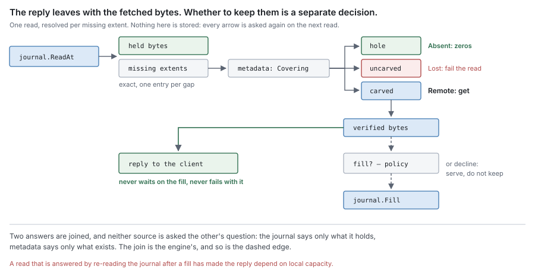

# RFC 8 — the engine

**Status:** draft.
**Depends on:** [RFC 0](rfc-0-data-lifecycle.md), for the terms, the residency function, the invariants and
the failure model. [RFC 1](rfc-1-journal.md) to [RFC 7](rfc-7-namespace-metadata.md) and [RFC 9](rfc-9-gc.md) specify the components this
one composes; each has deferred a decision here, and [Appendix A](#Appendix%20A%20%E2%80%94%20obligations%20this%20document%20discharges) lists every
one of them. Nothing here redefines any of them.
**Audience:** anyone changing the engine, the per-share composition, or the
content surface adapters call.

The key words **MUST**, **MUST NOT**, **SHOULD**, **SHOULD NOT** and **MAY** are
to be interpreted as in RFC 2119.

This document specifies behaviour, not the current code. Where the code differs,
[Appendix B](#Appendix%20B%20%E2%80%94%20where%20the%20current%20code%20differs) lists it for the refactor. A difference is a defect to be fixed or
migrated, never a rule for an implementer to build around.

Where this document chooses a policy the set left open, the choice is labelled
**proposal** and names the measurement that would overturn it.

---

## In short

- The engine holds no bytes and no facts. Every byte is the journal's or the
  remote tier's; every fact is block metadata's or the namespace's.
- It does three things: it **composes** the components, it **decides** policy,
  and it is the **facade** adapters call for content.
- It owns the joins no component can own alone: residency resolution on read,
  block assembly on offload, and the ordering of a write.
- Policy chooses among safe actions. It is never the thing that makes an action
  safe.
- It persists nothing. Losing all of its state costs performance, never content.

---

## 1. Purpose

[RFC 0 §1.1](rfc-0-data-lifecycle.md#1.1%20The%20component%20set) gives the engine *composition, policy, the facade adapters call*, and
nothing else. Every other component answers a question about its own state. The
engine answers the one question none of them can:

> **Given what the two oracles say, what happens next?**

A read has two answers to join. An offload has a carver, a syncer and a metadata
commit to sequence. A full journal has to be told what to evict. A write has four
steps owned by three components. Each of those needs someone who sees all the
parties and belongs to none of them.

### 1.1 Non-goals

The engine **MUST NOT**:

- define a format, an encoding or an algorithm — a record layout, a boundary
  function, a block framing, a key derivation ([RFC 1](rfc-1-journal.md), [RFC 2](rfc-2-carver.md), [RFC 4](rfc-4-remote-tier.md));
- move bytes to or from the remote tier itself — that is the syncer ([RFC 3](rfc-3-syncer.md)), and
  the engine hands it work;
- hold a copy of any oracle's answer that outlives the operation that asked —
  no residency cache, no durability record, no size ([RFC 0 §4.2](rfc-0-data-lifecycle.md#4.2%20The%20residency%20function), [RFC 7 §2.5](rfc-7-namespace-metadata.md#2.5%20Where%20%60size%60%20lives));
- persist anything. Every durable fact is recorded by the component that owns
  it, and a fact the engine persisted would be a third oracle;
- decide when an inode stops existing ([RFC 7 §4](rfc-7-namespace-metadata.md#4.%20What%20keeps%20an%20inode%20alive)), or what to delete remotely
  ([RFC 9](rfc-9-gc.md));
- carry namespace features that nothing below the namespace needs to know
  about. The recycle bin [RFC 7 §14](rfc-7-namespace-metadata.md#14.%20Open%20questions) asks about is one: it is a rename, block
  metadata never learns of it, and it is not policy over content. It is not the
  engine's.

### 1.2 What it owns

| Concern | What the engine does | Specified in |
| --- | --- | --- |
| Composition | constructs every component of a share and supplies each declared interface | [§2](#2.%20Composition) |
| Policy | decides when to offload, what to evict, whether to fill, what to read ahead | [§3](#3.%20Policy), [§4.2](#4.2%20Offload%20is%20scheduled%20here), [§6.3](#6.3%20Filling%20is%20a%20decision), [§7](#7.%20Local%20space) |
| The write | orders authorise, stage, record existence, acknowledge | [§4.1](#4.1%20The%20facade%20orders%20a%20write%3B%20adapters%20do%20not) |
| The offload | serialises commits per file, assembles blocks, returns durability | [§4](#4.%20The%20write%20and%20the%20offload), [§5](#5.%20Block%20assembly) |
| The read | joins the two oracles per missing extent, and answers | [§6](#6.%20The%20read) |
| Local space | chooses eviction and repack; answers a capacity refusal | [§7](#7.%20Local%20space) |
| Health | derives it from outcomes, including offload outcomes | [§8](#8.%20Health%20and%20failure) |
| The facade | one content-shaped surface for every adapter | [§9](#9.%20The%20facade) |

## 2. Composition

### 2.1 The engine is the composition root, and the only one

A share's content path is built in one place, by one constructor, from
configuration and the backends it names. That constructor **MUST** be the only
code that names a concrete component type. Everything else — adapters, the
runtime, other components — holds a declared interface.

The engine is therefore the one package permitted to import the components of
this set, and nothing in the set imports the engine. [RFC 0 §1.2](rfc-0-data-lifecycle.md#1.2%20Component%20autonomy)'s rule is about
the components the engine composes; [§11](#11.%20Consequences%20for%20RFC%200) records the clarification.

Composition **MUST** happen at construction. A capability **MUST NOT** be wired
onto a serving engine by a setter: a setter makes "this capability is absent" a
reachable state of a live share, and every code path then has to decide what to
do in it. Changing a share's backends is a new engine, not a mutation of the old
one.

The engine supplies, at construction:

| Declared by | Need | Supplied from |
| --- | --- | --- |
| [RFC 1](rfc-1-journal.md) | an event recorder ([§3.8](rfc-1-journal.md#3.8%20Event%20reporting)) | the process's metrics |
| [RFC 3](rfc-3-syncer.md) | a `Store`: put, verified read, health ([RFC 3 §1.3](rfc-3-syncer.md#1.3%20Interface)) | the block codec with the store's transform chain ([RFC 4 §3](rfc-4-remote-tier.md#3.%20The%20block%20format), [RFC 5](rfc-5-transforms.md)), over the remote block store |
| [RFC 6](rfc-6-block-metadata.md) | nothing | — |
| [RFC 7](rfc-7-namespace-metadata.md) | `Size` and `Times` ([§2.5](rfc-7-namespace-metadata.md#2.5%20Where%20%60size%60%20lives)), allocation for `SEEK` ([§9.3](rfc-7-namespace-metadata.md#9.3%20Residency%20is%20not%20an%20attribute)), `Release` ([§4.3](rfc-7-namespace-metadata.md#4.3%20Release%20is%20what%20block%20metadata%20sees)) | block metadata's existence records; the facade's `Release` ([§9.1](#9.1%20One%20facade%2C%20shaped%20like%20content)) |
| [RFC 9](rfc-9-gc.md) | its narrow views of metadata and the remote tier, and the syncer for relocation | block metadata; the remote tier; a syncer flow GC opens on the namespace's store |

### 2.2 Capabilities are parameters, never assertions

Every capability the engine uses **MUST** be a method on an interface it holds by
declaration. A capability that is absent **MUST** fail the build or fail
construction, with an error naming it.

The engine **MUST NOT** negotiate a capability by type assertion, and **MUST
NOT** fall back to a degraded behaviour when one is missing. [RFC 0 §1.2](rfc-0-data-lifecycle.md#1.2%20Component%20autonomy) gives the
general reason. Here the consequences are specific: an assertion that fails on
the remote tier disables offloading, one that fails on a transform chain uploads plaintext,
one that fails on a lookup makes every cold read linear. Each yields a working
share and no error.

Test fixtures that need less **MUST** supply a stub that satisfies the whole
interface. A production constructor that accepts `nil` for a capability "so tests
can omit it" has made the silent fallback a production path.

### 2.3 A share is one engine

Each share has exactly one engine, one journal and one assembly of policy state.
Backends below the engine — a remote store, a metadata store — **MAY** be shared
between shares and are reference-counted outside it.

Sharing a remote store between shares is subject to [RFC 6 §2.6](rfc-6-block-metadata.md#2.6%20The%20scope%20of%20a%20count): the engine
**MUST** refuse a composition in which two block-metadata stores can name one
remote key. [§5.4](#5.4%20A%20block%27s%20name%20is%20derived%20here) is how it avoids that.

### 2.4 Settings are validated once, and refused rather than replaced

The engine validates every setting it composes — chunking parameters, block
target, pool sizes, capacity — at construction, and **MUST** refuse an invalid
one with an error ([RFC 2 §3.7](rfc-2-carver.md#3.7%20Bad%20settings%20must%20be%20refused%2C%20not%20replaced)). It **MUST NOT** substitute a default for a value
the operator set.

The engine **MUST** record which chunking settings produced a share's existing
content, and **MUST** report a change to them as a migration rather than apply it
([RFC 2 §3.6](rfc-2-carver.md#3.6%20Changing%20any%20of%20this%20is%20a%20migration)). Where the record lives is block metadata's to decide; that it is
consulted at construction is the engine's.

### 2.5 Start in order, stop in reverse, and join before closing

**Start.** Open the journal, which recovers its placement index alone
([RFC 1 §9.1](rfc-1-journal.md#9.1%20Rebuilding)). Then, for each file the journal holds, and no other:

1. read the file's durable floor and refs from block metadata ([RFC 6 §8.4](rfc-6-block-metadata.md#8.4%20Reseed%3A%20a%20file%27s%20refs%20and%20its%20durable%20floor)),
   and give the journal the floor, so that it never issues a version metadata
   already holds;
2. drop journal content outside the file's recorded existence — past `size`, or
   inside a hole — with a journal deallocate or truncate. A crash between a
   truncate's or deallocate's metadata step and its journal step leaves such
   content, and without this it would be offloaded as live data;
3. report every extent a ref covers as durable **at that ref's `oldest` and
   `newest`**, through `MarkDurable` ([RFC 1 §9.2](rfc-1-journal.md#9.2%20Offload%20state%20after%20recovery)). The journal marks it only where
   no held content is newer, so an overwrite that had not been offloaded stays
   dirty; marking by position would let eviction lose it.

Then delete every removal record ([RFC 6 §2.4](rfc-6-block-metadata.md#2.4%20Shape%20and%20holes)): no pass is in flight. Until
reseeding completes, the engine **MUST NOT** run offload or request a release.
Only then start the background policy loops.

**Stop.** Stop accepting operations. Cancel the background loops, then join
them. A component **MUST NOT** be closed while any work that uses it is still
running ([RFC 1 §10.7](rfc-1-journal.md#10.7%20Shutdown)). A join that does not complete within its bound **MUST**
leave the components it depends on open and report the failure, rather than
proceed to close them under a live loop.

A bounded wait followed by teardown looks punctual and leaves the abandoned work
running against closed stores.

## 3. Policy

### 3.1 Policy is decided here and executed below

| Decision | The engine decides | The mechanism belongs to |
| --- | --- | --- |
| When to offload a file | eligibility and urgency ([§4.2](#4.2%20Offload%20is%20scheduled%20here)) | journal `Offload` ([RFC 1 §3.3](rfc-1-journal.md#3.3%20Offload)) |
| What goes in a block | assembly ([§5](#5.%20Block%20assembly)) | carver, for chunks ([RFC 2](rfc-2-carver.md)) |
| When to put a block | as soon as it is assembled | syncer uploader ([RFC 3 §3.1](rfc-3-syncer.md#3.1%20It%20is%20triggered%2C%20not%20scheduled)) |
| Whether to fill | [§6.3](#6.3%20Filling%20is%20a%20decision) | journal `Fill` ([RFC 1 §3.4](rfc-1-journal.md#3.4%20Fill)) |
| What to read ahead, pre-warm | [§6.4](#6.4%20Speculation%20is%20planned%20here%2C%20and%20yields%20to%20demand%20and%20to%20writes) | syncer fetcher ([RFC 3 §4.5](rfc-3-syncer.md#4.5%20Speculation%20is%20executed%20here%20and%20decided%20elsewhere)) |
| What to evict, and when | [§7.1](#7.1%20Eviction%20is%20chosen%20here%2C%20and%20needs%20no%20new%20record) | journal `Release` ([RFC 1 §3.5](rfc-1-journal.md#3.5%20Release)) |
| When to repack | [§7.3](#7.3%20Repack%20is%20triggered%20here) | journal repack ([RFC 1 §8.2](rfc-1-journal.md#8.2%20Repack)) |
| Whether to keep accepting writes | [§8.2](#8.2%20Every%20condition%20in%20RFC%200%20%C2%A710%20has%20its%20engine%20behaviour%20here) | journal capacity ([RFC 1 §7](rfc-1-journal.md#7.%20Capacity)) |
| What follows from ill health | [§8.1](#8.1%20Health%20is%20derived%20from%20recent%20outcomes%2C%20offload%20included) | — |
| When GC runs, what it relocates | [§7.5](#7.5%20When%20GC%20runs%2C%20and%20what%20it%20relocates%2C%20is%20decided%20here) | GC ([RFC 9](rfc-9-gc.md)) |

A component that takes one of these decisions itself has absorbed engine policy,
and a threshold that lives in a component's configuration is such a decision.

### 3.2 Policy never makes an action safe

Every mechanism the engine calls is safe by its own definition: `Release` refuses
an extent whose offloaded bit is unset ([RFC 1 §3.5](rfc-1-journal.md#3.5%20Release)), `Fill` refuses to overwrite held
bytes ([RFC 1 §3.4](rfc-1-journal.md#3.4%20Fill)), an offloaded bit is set only on a durability report ([RFC 1 §3.3](rfc-1-journal.md#3.3%20Offload)).
Policy chooses *among* safe actions.

A policy gate **MUST NOT** be the only thing standing between the system and data
loss. If turning a gate off would lose content, the gate is carrying a safety
property that belongs to the mechanism, and the mechanism is wrong.

> [!note]
> The distinction is testable. Disable every policy gate at once — evict
> as eagerly as possible, fill everything, offload constantly — and run the Group A
> checks of [§13](#13.%20Conformance). A conformant engine is slower and still correct.

### 3.3 Policy state is memory, and disposable

Access patterns, dirty ages, offload backoff, readahead frontiers and derived health
**MUST** live in memory. A restart **MAY** lose all of it, and the engine
**MUST** behave correctly from an empty policy state — conservatively, never
unsafely.

## 4. The write and the offload

### 4.1 The facade orders a write; adapters do not

A write is one facade operation. The engine performs, in this order:

1. authorise the write against the namespace ([RFC 7 §7](rfc-7-namespace-metadata.md#7.%20Permissions));
2. stage the bytes in the journal ([RFC 1 §3.1](rfc-1-journal.md#3.1%20Write));
3. record existence — `size` grown, holes shrunk, `mtime` and `ctime` in the same
   transaction ([RFC 6 §3.4](rfc-6-block-metadata.md#3.4%20Ordering%20against%20the%20journal), [RFC 7 §2.5](rfc-7-namespace-metadata.md#2.5%20Where%20%60size%60%20lives));
4. acknowledge.

No adapter **MAY** perform these steps itself or in another order. A sequence
copied into each protocol handler is a sequence each handler can get wrong
differently, and the one that gets it wrong serves zeros for acknowledged data
([RFC 6 §3.1](rfc-6-block-metadata.md#3.1%20The%20gap%20this%20closes)).

The engine **MAY** group-commit step 3 across writes, and **MUST NOT**
acknowledge any write in a group before the group commits ([RFC 6 §3.4](rfc-6-block-metadata.md#3.4%20Ordering%20against%20the%20journal)).

If step 3 fails, the write is not acknowledged, and the engine **MUST** remove
what step 2 staged with a journal `Deallocate` at that write's version
([RFC 1 §3.6](rfc-1-journal.md#3.6%20Truncate%2C%20deallocate%20and%20delete)). Staged bytes that existence does not cover would otherwise be offloaded
as content the file never had.

### 4.2 Offload is scheduled here

A file becomes eligible for an offload pass when any of these holds:

- its dirty bytes reach the block target;
- its oldest dirty byte reaches a configured maximum age;
- the journal is under capacity pressure ([§7.2](#7.2%20A%20capacity%20refusal%20comes%20back%20here)).

A client's request for durability is not a trigger. It is answered by the
journal ([§9.4](#9.4%20Commit%20is%20answered%20by%20the%20journal)), and offload keeps its own schedule.

**Proposal:** a dirty-byte threshold of one block target and a maximum age of a
few seconds, with capacity pressure making every file with dirty bytes eligible.
Overturned by a measurement showing the age bound, not the byte bound, is what
fragments blocks under a streaming SMB workload.

**A pass offers at most `upload_workers` block targets of dirty bytes**, across all
the files it covers — enough to keep every upload worker busy with one pass, and
no more — through the journal's `limit` ([RFC 1 §3.3](rfc-1-journal.md#3.3%20Offload)). A large file is offloaded as
a sequence of such passes, and small files are gathered into one pass up to the
same bound ([§5.7](#5.7%20A%20block%20packs%20chunks%2C%20whichever%20files%20they%20came%20from)). Without a bound nothing became evictable until the pass
returned, and on a slow store an overwrite-heavy file filled the journal with
records pinned for the pass.

A failed pass leaves its extents **Dirty** and is retried ([RFC 0 §5.2](rfc-0-data-lifecycle.md#5.2%20Offload)). Retries
back off with jitter; they **MUST NOT** stop, and a failing pass **MUST** be
reported to health ([§8.1](#8.1%20Health%20is%20derived%20from%20recent%20outcomes%2C%20offload%20included)).

### 4.3 Commits for one file are serialised here

[RFC 6 §4.4](rfc-6-block-metadata.md#4.4%20Commits%20for%20one%20file%20apply%20in%20order) leaves the choice of mechanism to the engine. The engine **MUST NOT**
run two offload passes of one file concurrently: it holds a per-file guard from the
moment the journal offers a run until the callback returns its durable extents.

The guard **SHOULD** be keyed by file. A guard keyed by a shard or a stripe is
correct and serialises unrelated files that collide on it, which makes one slow
file's commits every colliding file's latency. The guard **MUST NOT** be held
across anything but the pass it serialises.

Blocks within one pass cover disjoint offsets, so their commits **MAY** run
concurrently; what the guard protects is the order *between* passes.

A pass over several files ([§5.7](#5.7%20A%20block%20packs%20chunks%2C%20whichever%20files%20they%20came%20from)) holds every one of their guards, taken
in file-identity order so that two such passes cannot deadlock on each other.

`Truncate`, `Deallocate` and `Release` take the same guard and hold it across
their metadata step and their journal step ([§9.1](#9.1%20One%20facade%2C%20shaped%20like%20content)). An offer between the two
would capture the new truncation stamp and still read content the journal has
not yet removed, and commit refs for it that no check can drop.

### 4.4 The truncation stamp is captured at offer and checked at commit

When the journal offers a run, the engine reads the file's truncation stamp
([RFC 6 §2.4](rfc-6-block-metadata.md#2.4%20Shape%20and%20holes)) and carries it into every commit that pass makes. Block metadata
drops only the refs of that file that overlap a range removed since, and applies
the rest of the commit ([RFC 6 §6.2](rfc-6-block-metadata.md#6.2%20Truncation%20and%20deallocation)). The dropped extents are not reported; what
the journal still holds there is offered by a later pass. After the pass, the
engine prunes the file's removal records up to the lowest stamp any of its
passes still in flight captured.

### 4.5 The callback returns only what committed

The offload callback **MUST** report, through the journal's `report`, exactly the
extents whose commits succeeded, as each block's commit lands, and **MUST NOT**
report any other ([RFC 0 §5.2](rfc-0-data-lifecycle.md#5.2%20Offload), [RFC 1 §3.3](rfc-1-journal.md#3.3%20Offload)). An extent whose put succeeded and whose
commit did not is not durable, and **MUST NOT** be reported
([RFC 6 §4.3](rfc-6-block-metadata.md#4.3%20The%20commit%20is%20the%20report%27s%20return%20edge)). Order does not matter: the journal marks each extent on its own, and a
commit cannot overwrite newer refs because of their versions ([RFC 6 §4.4](rfc-6-block-metadata.md#4.4%20Commits%20for%20one%20file%20apply%20in%20order)). One
failed block therefore holds back no other: its extents stay **Dirty**, and every
block that committed, before or after it, is reported. Refs a commit found
already committed are reported like applied ones.

A block may carry chunks from several offered runs and files. Its commit makes all
of them durable at once, and the callback reports each file's share of it then.

### 4.6 A share with no remote tier never reports durability

On a share with no remote tier nothing is ever durable remotely, so the offload
callback **MUST** return nothing, and no offloaded bit is ever set ([RFC 6 §4.2](rfc-6-block-metadata.md#4.2%20Only%20after%20durability)). The
content stays **Dirty** for its lifetime, and eviction has nothing to act on —
by definition, not by a gate.

Such a share still syncs its journal on commit ([§9.4](#9.4%20Commit%20is%20answered%20by%20the%20journal)). It does not carve, and it
writes no chunk, block or ref records. Operations that need refs — clone,
snapshot — copy bytes on such a share ([§9.3](#9.3%20Clone%20adopts%20refs%2C%20and%20offloads%20uncarved%20content%20first)).

## 5. Block assembly

### 5.1 Blocks are assembled here, as a fold over the carver's output

[RFC 2 §5](rfc-2-carver.md#5.%20Packing%3A%20three%20rules%2C%20not%20a%20component) places block assembly with whoever owns the dedup query, and that is the
engine. Assembly is a fold over the chunks the carver emits: for each chunk, ask
the dedup oracle ([§5.3](#5.3%20The%20dedup%20oracle%20never%20sees%20an%20uncommitted%20block)), then either carry its bytes into the pending block or
record it as adopted.

The fold **MUST** obey [RFC 2](rfc-2-carver.md)'s packing rules: whole chunks only (P1); a block
reaches its target and overshoots it by at most one chunk (P2); a block holds
only the chunks whose bytes it carries (P3). The file's refs are a different
reader of the same chunk sequence and name every chunk, carried or adopted.

**A pending block is a plan, not a buffer.** The carver's bytes are borrowed for
the length of `emit` ([RFC 2 §2.2](rfc-2-carver.md#2.2%20The%20bytes%20handed%20to%20%60emit%60%20are%20borrowed)), and the engine **MUST NOT** copy a carried chunk
out of them. It records, per carried chunk, the chunk's hash and where its bytes
sit in the offered version — the file, an offset and a length — and a block is
its name plus that ordered list: a few hundred bytes, whatever its size.

The upload's `src` ([RFC 3 §1.3](rfc-3-syncer.md#1.3%20Interface)) walks the plan and reads each chunk from the
journal's `offered` reader ([RFC 1 §3.3](rfc-1-journal.md#3.3%20Offload)), so the block's bytes are in memory
only while a worker encodes them into its spool file, one chunk at a time
([RFC 3 §3.2](rfc-3-syncer.md#3.2%20It%20holds%20a%20reference%2C%20not%20a%20copy), [§3.4](rfc-3-syncer.md#3.4%20One%20put%20per%20block)). A retry
walks the plan again. The upload therefore runs inside the `Offload` callback that
offered the bytes: the reader is valid only there, which is also where durability
is reported back.

`src` **MUST** recompute each chunk's hash as it reads and fail the transfer on a
mismatch. The offered reader makes a mismatch impossible by construction; the
check turns a violation of that into a refused put rather than an object whose
bytes do not match its name ([RFC 3 §3.5](rfc-3-syncer.md#3.5%20The%20bytes%20are%20stable%20for%20the%20duration)).

The price is reading each carried byte twice, once to carve and once to upload.
The second read follows the first by the time a worker takes the block, usually
from the page cache, otherwise as a sequential local read — cheap beside the
network the upload waits on. A buffer would save that read and make memory follow
the number of blocks *waiting* for a worker rather than the pool.

**A plan whose upload ended in an unknown outcome survives its pass.** The engine
keeps it and, on the next pass over those files, offers it again first and
unchanged if every chunk in it is still dirty at the same version; otherwise it
drops it. The retry then writes the same name ([RFC 3 §2.5](rfc-3-syncer.md#2.5%20An%20unknown%20outcome%20is%20not%20a%20success)) rather than orphaning
the first attempt's object.

An assembler is per pass and **MUST NOT** survive it. It cuts blocks from the
chunks of every file the pass covers, so one block may hold chunks of several
files ([§5.7](#5.7%20A%20block%20packs%20chunks%2C%20whichever%20files%20they%20came%20from)).

### 5.2 The target counts carried bytes

P2's target is measured in the bytes a block carries. Adopted chunks contribute
nothing to it. An assembler that counts every chunk it tiles emits a block when a
pass has *seen* a target's worth of content, which on a mostly-deduplicated file
is a block of a few kilobytes.

### 5.3 The dedup oracle never sees an uncommitted block

The oracle is [RFC 6 §8.2](rfc-6-block-metadata.md#8.2%20Deduplication%20lookup)'s `Durable(hash)`: a chunk record exists, so its block
is durable. It **MUST NOT** answer from anything that knows about a block not yet
committed — the pending block, a block in flight, a put that succeeded and whose
commit has not ([RFC 2 §5](rfc-2-carver.md#5.%20Packing%3A%20three%20rules%2C%20not%20a%20component)).

A chunk carried by two blocks in
flight is committed once: the first block to commit owns its record, and the
second adopts it ([RFC 6 §4.1](rfc-6-block-metadata.md#4.1%20What%20one%20commit%20records)).

Two refinements follow, and both are required:

- **Within one pending block**, a repeated chunk **MAY** be carried once and
  referenced twice. Both refs and the bytes commit in one transaction, so they
  cannot be separated by a failure.
- **Across blocks in flight**, a repeated chunk **MUST** be carried again. The
  earlier block may fail after the later one commits, and the later one's refs
  would then name bytes that exist nowhere.

The oracle's answer is advisory. A chunk it reports may be retired before the
adopting commit applies; that commit then fails ([RFC 6 §7.2](rfc-6-block-metadata.md#7.2%20Adoption%20is%20conditional%20on%20existence)), and the engine
**MUST** re-offer the run with that chunk carried. The engine **MUST NOT** hold
anything — a lock, a reservation, an in-process guard — to make the answer
binding. A guard another process cannot see protects nothing across processes,
and [RFC 6 §7.2](rfc-6-block-metadata.md#7.2%20Adoption%20is%20conditional%20on%20existence) makes one unnecessary within a process.

### 5.4 A block's name is derived here

The engine assembles the block, so it computes the name ([RFC 2 §4.2](rfc-2-carver.md#4.2%20A%20block)): a hash,
under a domain distinct from chunk hashing, of the key scope, the encoding
generation — 0 for a block written by offload — and the block's chunk hashes in
order. The name is final before framing begins ([RFC 4 §3.2](rfc-4-remote-tier.md#3.2%20Layout)) and does
not vary between attempts to store one block, so a retry after an unknown outcome
writes the same object ([RFC 3 §2.5](rfc-3-syncer.md#2.5%20An%20unknown%20outcome%20is%20not%20a%20success)).

**Proposal — the key scope is the identity of the block-metadata store that
counts the block.** This is [RFC 6 §2.6](rfc-6-block-metadata.md#2.6%20The%20scope%20of%20a%20count)'s second option: two stores can never name
one object, so each store's counts are complete for every key it can name, and a
remote store can be shared between shares whose metadata is separate. The cost is
dedup across such shares, which separate stores could not count safely anyway. Overturned by a deployment that wants cross-share dedup *and*
accepts one metadata store per remote namespace.

### 5.5 Assembly is sequential, and may change without migration

**Proposal:** chunks are assembled into blocks in file-offset order, which keeps
a sequential read's chunks in few blocks. Randomised assembly ([RFC 2 §6](rfc-2-carver.md#6.%20Boundaries%20are%20public)) blurs the
chunk-size fingerprint an observer of object sizes could use, costs nothing in
dedup, and — because names derive from content and refs name hashes ([RFC 6 §2.5](rfc-6-block-metadata.md#2.5%20Refs%20name%20hashes%2C%20never%20blocks))
— can be adopted later with no migration. It is left open ([§14](#14.%20Open%20questions)).

### 5.6 A run is what the journal offers, widened only to re-tile

The engine offers each maximal dirty stretch the journal holds as one carver call,
and never joins two stretches: a chunk must not straddle a hole ([RFC 2 §2.1](rfc-2-carver.md#2.1%20One%20unbroken%20stretch%20per%20call)).

A longer stretch dedups better and is the caller's lever. The engine **MAY** widen
a run over contiguous bytes the journal holds and that are already durable, but
**only** so the new chunking re-tiles a ref the run partially replaces. Widening
for dedup alone re-uploads content that is already remote.

### 5.7 A block packs chunks, whichever files they came from

A block is a sequence of chunks, and nothing in its definition is per file
([RFC 2 §5](rfc-2-carver.md#5.%20Packing%3A%20three%20rules%2C%20not%20a%20component)). A pass therefore assembles blocks from the chunks of every file it
covers, and a block boundary falls wherever the target is reached, inside one
file's chunks or between two files'. One block may hold the last chunks of a large
file, several small files whole, and the first chunks of another. A file smaller
than the chunking minimum is exactly one chunk ([RFC 0 §2.1](rfc-0-data-lifecycle.md#2.1%20Entities)), so many small
files are many small chunks, and they pack like any others.

This matters because object stores are slow on small objects: every put pays a
round trip and a per-request price whatever its size ([RFC 4 Appendix C.3](rfc-4-remote-tier.md#C.3%20How%20the%20contract%20maps%20to%20S3)). One
block per small file would turn a directory of a hundred thousand small files
into a hundred thousand puts.

- **A pass covers several files** through the journal's `OffloadMany`
  ([RFC 1 §3.3](rfc-1-journal.md#3.3%20Offload)). Its chunk stream is each file's carried chunks, in offset
  order, one file after another. The pass gathers eligible files ([§4.2](#4.2%20Offload%20is%20scheduled%20here)) until
  their dirty bytes reach the pass bound of `upload_workers` block targets.
- **Blocks are cut from that stream** by P1 to P3 alone: whole chunks, at least
  the target, the last block of the pass allowed short.
- **Only within one share.** A share is one flow ([RFC 3 §1.3](rfc-3-syncer.md#1.3%20Interface)) and one key scope
  ([§5.4](#5.4%20A%20block%27s%20name%20is%20derived%20here)); a block never mixes two.
- **Order is kept, not enforced.** Because each file's chunks enter the stream
  together and in order, a file's chunks within any one block are contiguous, so
  a packed small file, or a file's piece of a block, is one ranged read
  ([§6.8](#6.8%20A%20cold%20read%20asks%20for%20chunks%2C%20or%20for%20the%20block)). That is a consequence of the stream order, and randomised
  assembly ([§5.5](#5.5%20Assembly%20is%20sequential%2C%20and%20may%20change%20without%20migration)) would give it up.
- **One commit per block** records the refs of every file with chunks in it, in
  one transaction ([RFC 6 §4.1](rfc-6-block-metadata.md#4.1%20What%20one%20commit%20records)); the callback then reports each file's durable
  extents in its entry of `durable`.

The usual objection to packing is read amplification: to serve one small file,
the reader fetches the whole pack, and a pack is mostly other files' bytes. Stores
that refuse to pack give that as the reason. It does not apply here, because a
cold read of a small file asks for its chunks by range ([§6.8](#6.8%20A%20cold%20read%20asks%20for%20chunks%2C%20or%20for%20the%20block)), and moves only
that file's bytes whatever else the block holds. The cost that remains is deletion: a block whose chunks are mostly
unreferenced keeps its dead bytes until relocation copies the live chunks out
([RFC 9 §4.1](rfc-9-gc.md#4.1%20A%20block%20that%20is%20mostly%20dead%20pins%20its%20dead%20bytes)), so a share of short-lived small files spends relocation work to save
puts.

## 6. The read

### 6.1 Resolution is a join, computed per request



For a read of `(file, off, len)`, the engine:

1. asks the journal, and receives the bytes it holds and the exact extents it does
   not ([RFC 1 §3.2](rfc-1-journal.md#3.2%20Read));
2. for each missing extent, asks block metadata which class covers it ([RFC 6](rfc-6-block-metadata.md)
   [§8.1](rfc-6-block-metadata.md#8.1%20Covering%20lookup)), using the range form where one is available;
3. resolves each part by [RFC 0 §4.2](rfc-0-data-lifecycle.md#4.2%20The%20residency%20function) as amended by [RFC 6 §3.2](rfc-6-block-metadata.md#3.2%20Every%20offset%20is%20in%20exactly%20one%20class):

| Metadata | Residency | The engine |
| --- | --- | --- |
| hole | **Absent** | returns zeros |
| uncarved | **Lost** | fails the read, and reports data loss naming the file and extent |
| carved | **Remote** | gets the block's chunk, verified ([RFC 3 §4.1](rfc-3-syncer.md#4.1%20One%20fetch%2C%20two%20consumers)) |
| past end of file | — | returns a short read |

The engine **MUST** compute this per request and **MUST NOT** keep its result,
nor any structure from which it would answer a later read without asking both
oracles ([RFC 0 §4.2](rfc-0-data-lifecycle.md#4.2%20The%20residency%20function)). It **MUST NOT** return zeros for any part except a hole.

A fetch is issued per missing extent, never per window: an extent the journal
holds is not fetched because a neighbour was not held ([RFC 1 §3.2](rfc-1-journal.md#3.2%20Read)).

### 6.2 The reply is served from the fetched bytes

The engine answers the read from the verified bytes the fetch returned ([RFC 3](rfc-3-syncer.md)
[§4.1](rfc-3-syncer.md#4.1%20One%20fetch%2C%20two%20consumers)). It **MUST NOT** answer by re-reading the journal after a fill: that makes
the reply wait on the fill, and makes a fill failure — a full journal, a local I/O
error — fail a read whose bytes were correct in hand ([RFC 3 §4.2](rfc-3-syncer.md#4.2%20The%20reply%20neither%20waits%20on%20the%20fill%20nor%20fails%20with%20it)).

When it does fill, the engine passes `Fill` exactly the bytes it fetched, at the
offsets of the extent it resolved, together with the `asOf` version `ReadAt`
returned before resolving. The journal refuses the fill if the file changed after
it — a write, a release, a truncate — so a write that landed meanwhile wins
([RFC 1 §3.4](rfc-1-journal.md#3.4%20Fill), [RFC 0](rfc-0-data-lifecycle.md) I4). A refused fill is not an error: the read is already answered.

### 6.3 Filling is a decision

[RFC 0 §6.2](rfc-0-data-lifecycle.md#6.2%20Fill) makes filling discretionary and gives the decision to the engine.

**Proposal — fill a demanded extent unless one of these holds:**

- the journal's free capacity is below a low-water mark reserved for writes, so
  that a fill never pushes a write towards refusal;
- the read is part of a sequential scan already longer than the readahead window,
  where retaining what was just read displaces content more likely to be read
  again;
- the fetch served a pre-warm that has been asked to yield ([§6.4](#6.4%20Speculation%20is%20planned%20here%2C%20and%20yields%20to%20demand%20and%20to%20writes)).

A declined fill still answers the read. Speculative fetches follow the same rule
with the low-water mark applied more strictly than for demand.

This settles RFC 0 open question 2 as a proposal only. What decides it is a
hit-rate and write-refusal measurement on the large-file SMB workload, comparing
fill-always, the rule above, and fill-never.

### 6.4 Speculation is planned here, and yields to demand and to writes

The engine sees the access pattern and the free capacity, so it decides what to
fetch before it is asked for ([RFC 3 §4.5](rfc-3-syncer.md#4.5%20Speculation%20is%20executed%20here%20and%20decided%20elsewhere)). It issues those fetches to the fetcher
as speculative, which the fetcher never lets delay a demand ([RFC 3 §4.4](rfc-3-syncer.md#4.4%20Speculation%20does%20not%20delay%20demand)).

**Read-ahead** follows an observed sequential pattern, a window of blocks ahead of
the reader. A random access resets it. Its window **MUST** be bounded in bytes,
and the bound is subtracted from the capacity a fill may use.

**Pre-warm** is an explicit request over a whole share or subtree. It **MUST NOT**
drive the journal towards refusing writes; the obligation is the engine's, since
only the engine sees capacity ([RFC 3 §4.5](rfc-3-syncer.md#4.5%20Speculation%20is%20executed%20here%20and%20decided%20elsewhere) says why). Pre-warm runs on a flow of its
own, opened on the share's store ([RFC 3 §1.3](rfc-3-syncer.md#1.3%20Interface)), so that a large pre-warm holding its
flow at the cap never holds the share's demand reads with it. **Proposal** for how it
yields (RFC 3 open question 3): pre-warm fills only while free capacity is above
the write low-water mark, pauses when capacity falls below it, and cancels its
queued fetches on a write that meets capacity pressure. A pre-warm that stops
early reports how far it got; it is re-issuable, so stopping costs nothing.
Overturned by a measurement showing the pause-and-resume churn costs more than a
fixed reservation would.

### 6.5 An unreachable remote fails the read, distinguishably

A **Remote** extent whose fetch cannot complete — the remote is unreachable, or
the demand deadline expires — **MUST** fail the read with an error distinguishable
from **Lost** ([RFC 0 §10](rfc-0-data-lifecycle.md#10.%20Failure%20model)). The first is transient and the client may retry; the
second is data loss and must be reported as such.

### 6.6 Allocation answers from the hole set

`SEEK_DATA`, `SEEK_HOLE` and sparse-read replies are answered from block
metadata's hole set, through the allocation interface the engine supplies to [RFC 7](rfc-7-namespace-metadata.md)
([RFC 7 §9.3](rfc-7-namespace-metadata.md#9.3%20Residency%20is%20not%20an%20attribute)). They **MUST NOT** be answered from the journal, which cannot tell a
hole from an evicted extent ([RFC 1 §3.7](rfc-1-journal.md#3.7%20State%20introspection)).

### 6.7 An absent object is re-resolved exactly once

Relocation ([RFC 9 §4.2](rfc-9-gc.md#4.2%20Read%20verified%2C%20name%20by%20content%2C%20put%2C%20then%20move)) moves a chunk to a new block and leaves the old block to
sweep. A read that resolved the chunk's location before the move can issue its
get after the old object is gone. Refs name hashes, not blocks ([RFC 6 §2.5](rfc-6-block-metadata.md#2.5%20Refs%20name%20hashes%2C%20never%20blocks)), so
the chunk is still reachable; only the location the reader holds is stale.

When the remote tier reports the object a chunk's get named as absent, the engine
**MUST** resolve the chunk's location again from block metadata and issue one
more get, and **MUST** fail the read only if that second resolution also misses —
names no location, or names one whose object is also absent. The retry is exactly
one: a second miss is not a race with relocation, which moves a chunk once per
commit, but content that is gone, and it **MUST** be reported as **Lost**, not
retried until a deadline.

A ranged read that fails verification, or runs past the end of the block, is a
different case: the block is there, but the position recorded for the chunk is
stale, because two passes in flight wrote identical chunk lists under one name
with different layouts ([RFC 4 §4.3](rfc-4-remote-tier.md#4.3%20Put%3A%20a%20whole%20block%2C%20checksummed%2C%20durable%20on%20success)). The store the engine composes repairs that
inside its read: it reads the block's header, retries at the position the header
gives, and yields the chunk with the range it was actually read from
([RFC 4 §3.4](rfc-4-remote-tier.md#3.4%20Every%20read%20is%20verified%20by%20the%20codec)). When that range differs from the recorded one, the engine **MUST**
rewrite the chunk's recorded position ([RFC 6 §2.2](rfc-6-block-metadata.md#2.2%20Chunk)), so the next read goes
straight there. A chunk the repair cannot find is corrupt (`ErrCorrupt`), and a
transport error or a timeout is not evidence of either case: neither **MUST**
trigger a re-resolution.

Relocation is safe only while this rule holds ([RFC 9 §4.3](rfc-9-gc.md#4.3%20A%20reader%20can%20hold%20the%20old%20location)). An engine that fails
the first miss turns every relocation into a window of spurious read errors; one
that retries indefinitely turns a lost chunk into a hung read.


### 6.8 A cold read asks for chunks, or for the block

A fetch names the chunks it needs, or asks for the whole block ([RFC 3 §1.3](rfc-3-syncer.md#1.3%20Interface)).
Every chunk is verified on its own either way, so the choice is only about bytes
moved and requests made.

The two costs pull opposite ways. Every request pays a round trip, tens of
milliseconds to an object store, whatever it carries. Every byte fetched and not
read is bandwidth spent for nothing. A small read should therefore move only what
it needs, and a read that needs much of a block should take the rest in the same
request, because the rest costs little more than the round trip already paid and
is likely read next.

**Proposal:** a read asks for **only the chunks it covers** when both hold:

- **its missing bytes are at most a quarter of the block.** Below that, a ranged
  request moves at most a quarter of what a whole-block request would, which is
  where saving bytes outweighs saving the next request. Above it, most of the
  block is coming anyway, and one request for the rest is cheaper than the
  further ranged requests a neighbouring read would make;
- **it is not a sequential read**: it neither starts at the block's beginning nor
  continues where the file's previous read ended. A read at the start of a block,
  or right after the previous one, is the front of a scan, and a scan will want
  the whole block.

Otherwise the read asks for **the whole block**. A small random read then moves
little more than it needs, a packed small file is one ranged read ([§5.7](#5.7%20A%20block%20packs%20chunks%2C%20whichever%20files%20they%20came%20from)),
and a scan moves each block in one request. Read-ahead and pre-warm always ask for
whole blocks ([§6.4](#6.4%20Speculation%20is%20planned%20here%2C%20and%20yields%20to%20demand%20and%20to%20writes)).

The quarter is borrowed from prior art; it is not a measurement of this system. Overturned by a comparison of bytes fetched and read
latency, on a random-read and a scan workload, across a few thresholds.

## 7. Local space

**Local space includes the upload spool.** The engine's `Store` encodes each
upload into a spool file ([RFC 3 §3.4](rfc-3-syncer.md#3.4%20One%20put%20per%20block)). The engine places the spools in a directory
on local storage it accounts for, and sets aside `upload_workers` times the
largest encoded block — the block target plus one chunk, each at its chain's
`MaxEncodedLen` ([RFC 5 §3.1](rfc-5-transforms.md#3.1%20Interfaces)) — from the capacity it divides among the journals. A spool
therefore never competes with journal writes for space.

### 7.1 Eviction is chosen here, and needs no new record

The engine selects what to evict and calls `Release` on it. **Proposal:** coldest
first by last access, in units the journal can free ([RFC 1 §8.1](rfc-1-journal.md#8.1%20Releasing%20storage)), until a target
set by capacity pressure is met.

[RFC 1 §3.5](rfc-1-journal.md#3.5%20Release) requires the caller to have durably recorded that content is no longer
local before releasing it. Under the model that record already exists and is the
offload commit: an offloaded bit is set only after the ref, chunk and block are committed
([RFC 6 §4.3](rfc-6-block-metadata.md#4.3%20The%20commit%20is%20the%20report%27s%20return%20edge)), and a carved extent the journal does not hold resolves to
**Remote**. Eviction therefore writes nothing to metadata. [§11](#11.%20Consequences%20for%20RFC%200) records the
consequence for [RFC 0 §8.1](rfc-0-data-lifecycle.md#8.1%20Evict)'s wording.

### 7.2 A capacity refusal comes back here

The journal refuses a write it cannot reserve for, and does not evict for itself
([RFC 1 §7](rfc-1-journal.md#7.%20Capacity)). The engine answers the refusal, per [RFC 0 §10](rfc-0-data-lifecycle.md#10.%20Failure%20model):

1. evict ([§7.1](#7.1%20Eviction%20is%20chosen%20here%2C%20and%20needs%20no%20new%20record)), then retry;
2. if nothing is evictable because what is held is dirty, and the remote is
   available, offload it at once ([§4.2](#4.2%20Offload%20is%20scheduled%20here)'s capacity trigger), evict what that
   made durable, then retry;
3. if still nothing frees space, repack ([§7.3](#7.3%20Repack%20is%20triggered%20here)), then retry;
4. if none of these frees space, refuse the write with a distinguishable error.

The retry is bounded by the caller's deadline. A wait that outlives it is a
refusal the client did not get.

### 7.2.1 Writes are paced before the limit, not stopped at it

Refusal at the limit is the specified last resort; reaching it abruptly is not.
Between a **soft threshold** of dirty bytes and the limit, the engine delays each
write in proportion to how far past the threshold the journal is, scaled to the
measured rate at which offload makes bytes durable, so writes slow to the drain rate
instead of running at full speed into a wall. Above the soft threshold every file
with dirty bytes is offload-eligible ([§4.2](#4.2%20Offload%20is%20scheduled%20here)). Without pacing, clients see no slowdown
and then multi-second stalls once the limit is reached.

The delay is bounded by the caller's deadline, like the retry above, and the
engine **SHOULD** state the submission-latency objective the pacing is tuned
against. **Proposal:** a soft threshold at half the journal's capacity and a delay
rising linearly to the drain rate at the limit. Overturned by a measurement
showing another curve keeps p99 submission latency lower at the same throughput.

### 7.3 Repack is triggered here

The engine requests a repack when the journal's statistics show storage it can
recover: allocated storage well above held bytes ([RFC 1 §8.3](rfc-1-journal.md#8.3%20Accounting)), a descriptor count
at its bound ([RFC 1 §8.4](rfc-1-journal.md#8.4%20Open%20descriptors)), or an extent count past its bound ([RFC 1 §5.2](rfc-1-journal.md#5.2%20The%20index%20is%20bounded%20by%20extent%20count%2C%20not%20by%20bytes)). It **MUST** request
one when the journal is at capacity and nothing is evictable, because repack's
reserved headroom exists for exactly that ([RFC 1 §8.2](rfc-1-journal.md#8.2%20Repack)).

### 7.4 Nothing but durability makes an extent unevictable

Locks, deny modes, delegations and open handles **MUST NOT** make an extent
ineligible for eviction ([RFC 7 §8.6](rfc-7-namespace-metadata.md#8.6%20Locks%20do%20not%20pin%20bytes)). Neither **MAY** a snapshot: a snapshot holds
counted refs ([RFC 6 §6.5](rfc-6-block-metadata.md#6.5%20Who%20owns%20a%20ref)), and its content is as evictable as any carved content.

An operator's retention pin **MAY** exclude a share from eviction, and the engine
**MAY** suspend eviction while the remote is unreachable, because evicting then
turns a readable extent into one that fails until the remote returns. Both are
availability policy. Neither is permitted to be what keeps content safe ([§3.2](#3.2%20Policy%20never%20makes%20an%20action%20safe)).

### 7.5 When GC runs, and what it relocates, is decided here

GC's cadence, its triggers and its relocation threshold are policy, and [RFC 9](rfc-9-gc.md)
[§4.4](rfc-9-gc.md#4.4%20When%20to%20relocate%20is%20policy) and [§7.3](rfc-9-gc.md#7.3%20When%20GC%20runs%20is%20the%20engine%27s) give them to the engine. The engine decides them and hands them to
GC as parameters at composition; GC holds no schedule and no threshold of its own.

- **Cadence and triggers.** **Proposal:** a periodic pass per remote namespace,
  plus a pass triggered when the count of blocks with zero `live` exceeds a
  configured bound. Overturned by a measurement showing sweep lag, not pass cost,
  dominates remote storage on a churn-heavy workload.
- **Relocation threshold.** A block is a relocation candidate when the fraction
  of its bytes still referenced falls below a configured ratio, and never when
  every chunk is referenced ([RFC 9 §4.4](rfc-9-gc.md#4.4%20When%20to%20relocate%20is%20policy)). **Proposal:** relocation off by
  default, enabled per remote namespace by the operator, because it spends a
  read and a put per block and the break-even depends on the backend's pricing.

GC reads and puts relocated blocks through a syncer flow it opens on the
namespace's store, so relocation shares the pool's memory bound, retries and
health refusal ([RFC 3](rfc-3-syncer.md)); its deletes go to the remote store directly ([RFC 9](rfc-9-gc.md)).

GC is correct at any cadence and any threshold, including two passes at once
([RFC 9 §7.3](rfc-9-gc.md#7.3%20When%20GC%20runs%20is%20the%20engine%27s)). So this is policy in the sense of [§3.2](#3.2%20Policy%20never%20makes%20an%20action%20safe): the engine **MUST NOT**
serialise passes, delay them or suppress them as a way of keeping content safe,
and a lock that serialises passes for efficiency **MUST** be removable without
making a pass unsafe.

The unit is the remote namespace, not the share: a pass covers every store that
can name a key in it ([RFC 6 §2.6](rfc-6-block-metadata.md#2.6%20The%20scope%20of%20a%20count)). Where several shares' engines compose one
namespace, the policy is configured once for the namespace, and exactly one of
them schedules it.

## 8. Health and failure

### 8.1 Health is derived from recent outcomes, offload included

Share health **MUST** be computed from recent outcomes and **MUST NOT** be a
stored flag that suppresses the attempts that would clear it ([RFC 3 §5](rfc-3-syncer.md#5.%20What%20belongs%20elsewhere)). Its
inputs include the outcomes of offload passes, not only the remote's liveness probe.
Whether the store is usable is the syncer's to say: it probes each store, also
counts a window of failed transfers against it, and refuses work for one that is
unhealthy ([RFC 3 §2.8](rfc-3-syncer.md#2.8%20An%20unhealthy%20store%20refuses%20work)). The engine reads that
state through its flow's `Healthy` and **MUST NOT** probe the store again itself.
The engine opens one syncer flow per share, on that share's store, when the
share is added, and closes it when the share is removed ([RFC 3 §1.3](rfc-3-syncer.md#1.3%20Interface)); the
syncer never learns that a flow is a share. It
**SHOULD** skip an offload pass for a share whose store is unhealthy rather than
carve and pack blocks the syncer will refuse.

Sustained inability to offload **MUST** be a health condition of the share ([RFC 0](rfc-0-data-lifecycle.md)
[§10.2](rfc-0-data-lifecycle.md#10.2%20No%20state%20requires%20intervention%20to%20leave)), and **MUST** be distinguishable from the remote being unreachable: an offload
that fails on a metadata conflict with the remote healthy is a wedge that looks
healthy to a probe.

What the engine does with ill health is policy: it **MAY** slow offload attempts and
suspend eviction. It **MUST NOT** stop attempting altogether without something
independent — a probe — that will observe recovery.

### 8.2 Every condition in RFC 0 §10 has its engine behaviour here

| Condition | The engine |
| --- | --- |
| Remote unavailable | keeps accepting writes while capacity allows; keeps retrying offloads with backoff; fails reads of **Remote** extents ([§6.5](#6.5%20An%20unreachable%20remote%20fails%20the%20read%2C%20distinguishably)); reports degraded health |
| Journal at capacity, remote available | evicts; if everything is dirty, offloads then evicts; then repacks; then accepts ([§7.2](#7.2%20A%20capacity%20refusal%20comes%20back%20here)) |
| Journal at capacity, remote unavailable | refuses the write; everything held is **Dirty** |
| Metadata unwritable | offload fails and extents stay **Dirty**; reports the offload condition ([§8.1](#8.1%20Health%20is%20derived%20from%20recent%20outcomes%2C%20offload%20included)) |
| Crash | recovers each component independently, then reseeds ([§2.5](#2.5%20Start%20in%20order%2C%20stop%20in%20reverse%2C%20and%20join%20before%20closing)); does not reconcile the oracles by assuming they agree |
| Local content corrupt | a carved extent the journal dropped resolves **Remote** and is refetched; an uncarved one resolves **Lost** and fails ([RFC 1 §9.3](rfc-1-journal.md#9.3%20Torn%20and%20corrupt%20records)) |
| Material provider unavailable | as remote unavailable: reads of affected **Remote** extents fail transiently, offloads back off ([RFC 5 §2.7](rfc-5-transforms.md#2.7%20Failures)) |
| Material destroyed | reads of the affected extents fail as **Lost** ([RFC 5 §2.7](rfc-5-transforms.md#2.7%20Failures)) |

### 8.3 The engine surfaces no serialization conflict

The engine is a caller of metadata transactions — existence on the write path,
commits on offload. A conflict **MUST** be retried under the caller's deadline and
**MUST NOT** reach a client as an I/O error (RFC 0 I8). An offload commit's caller is
the background pass, whose deadline is the pass's own; a conflict there costs a
retry, not a failed pass.

The per-file guard of [§4.3](#4.3%20Commits%20for%20one%20file%20are%20serialised%20here) reduces offload-against-offload conflicts. It **MUST NOT**
be relied on for correctness: [RFC 6 §5.1](rfc-6-block-metadata.md#5.1%20No%20record%20is%20written%20by%20both%20paths) removes offload-against-writer conflicts
structurally, and a conflict the guard missed is retried like any other.

### 8.4 How far behind durability is, is observable

The engine **MUST** report, per share and summed: dirty bytes, the drain rate over a
recent window, and the time to drain at that rate; and **MUST** offer a way to wait
until every byte written before the call is durable. The journal's own counters
([RFC 1 §3.7](rfc-1-journal.md#3.7%20State%20introspection)) say how much is dirty; only the engine knows how fast it is
leaving. A benchmark of the write path **MUST** stop its clock at that wait, not at
the last client acknowledgement ([§13.5](#13.5%20Benchmarks)): a benchmark that stops at
acknowledgement measures the journal, and can rank two stores in the opposite
order from their durable throughput.

## 9. The facade

### 9.1 One facade, shaped like content

Adapters reach content through one surface, and never through a component:

| Operation | Composes |
| --- | --- |
| `Write(file, off, bytes)` | [§4.1](#4.1%20The%20facade%20orders%20a%20write%3B%20adapters%20do%20not) |
| `Read(file, off, len)` | [§6](#6.%20The%20read) |
| `Commit(file)` | journal sync, nothing else ([§9.4](#9.4%20Commit%20is%20answered%20by%20the%20journal)) |
| `Truncate(file, size)` | [RFC 6 §6.2](rfc-6-block-metadata.md#6.2%20Truncation%20and%20deallocation) in one transaction, then journal `Truncate`, under the file's guard ([§4.3](#4.3%20Commits%20for%20one%20file%20are%20serialised%20here)) |
| `Deallocate(file, off, len)` | [§9.2](#9.2%20Deallocate%20records%20a%20hole%3B%20it%20does%20not%20write%20zeros), under the file's guard |
| `Release(file)` | [RFC 6 §6.4](rfc-6-block-metadata.md#6.4%20Delete) refs, then journal `Delete`, under the file's guard — the implementation of [RFC 7 §4.3](rfc-7-namespace-metadata.md#4.3%20Release%20is%20what%20block%20metadata%20sees) |
| `Clone(src, dst, …)` | [§9.3](#9.3%20Clone%20adopts%20refs%2C%20and%20offloads%20uncarved%20content%20first) |
| `Size`, `Times`, `Allocation` | the interfaces of [§2.1](#2.1%20The%20engine%20is%20the%20composition%20root%2C%20and%20the%20only%20one), read-only |
| `Stats`, `Health`, `WaitDurable` | [§8](#8.%20Health%20and%20failure) |

The facade **MUST NOT** return a component — a journal, a remote store — to its
caller. A caller holding one can do what the facade orders, out of order.

Signatures are indicative; the obligations are normative.

```go
type Engine interface {
    Write(ctx context.Context, id Identity, file FileID, off int64, p []byte) error
    Read(ctx context.Context, id Identity, file FileID, off int64, p []byte) (int, error) // ErrLost, ErrUnavailable
    Commit(ctx context.Context, file FileID) error
    Truncate(ctx context.Context, file FileID, size int64) error
    Deallocate(ctx context.Context, file FileID, off, n int64) error
    Release(ctx context.Context, file FileID) error
    Clone(ctx context.Context, src, dst FileID, srcOff, dstOff, n int64) error
    Size(ctx context.Context, file FileID) (int64, error)
    Times(ctx context.Context, file FileID) (mtime, ctime time.Time, err error)
    Allocation(ctx context.Context, file FileID, off int64) (Span, error)
    WaitDurable(ctx context.Context) error // every byte written before the call is durable (§8.4)
    Stats() Stats
    Health() Health
    Close() error
}

var (
    ErrLost        = errors.New("engine: content lost")        // §6.1, reported as data loss
    ErrUnavailable = errors.New("engine: remote unavailable")  // §6.5, transient
    ErrNoSpace     = errors.New("engine: journal full")        // §7.2
)
```

### 9.2 Deallocate records a hole; it does not write zeros

Deallocation adds a hole record for the range, drops or narrows the
refs over it, advances the truncation stamp and records the removal, in one transaction ([RFC 6 §3.5](rfc-6-block-metadata.md#3.5%20Operations%20that%20make%20holes), [§6.2](rfc-6-block-metadata.md#6.2%20Truncation%20and%20deallocation)), then has
the journal stop holding the range.

It **MUST NOT** stage zeros through the write path. Zeros staged as data consume
journal capacity in proportion to the range — a large deallocation can refuse
writes — and carve into the hottest refcount in any deployment ([RFC 6 §5.3](rfc-6-block-metadata.md#5.3%20Hot%20records%20that%20are%20not%20per-file)).

### 9.3 Clone adopts refs, and offloads uncarved content first

On a share with a remote tier, a clone offloads the source's uncarved extents,
then copies the source's refs into the destination as an adoption ([RFC 6 §6.6](rfc-6-block-metadata.md#6.6%20Clone%20and%20server-side%20copy)).
**Proposal:** offload first rather than copy bytes, because it leaves one path for
clone and makes the destination's content shared from its first byte. On a share
with no remote tier nothing is carved ([§4.6](#4.6%20A%20share%20with%20no%20remote%20tier%20never%20reports%20durability)), so a clone copies bytes through the
destination's write path.

### 9.4 Commit is answered by the journal

A client's flush — NFS `COMMIT`, SMB `FLUSH`, `fsync` — reaches the facade as
`Commit`. The facade acknowledges it once the file's staged bytes are synced in
the journal ([RFC 1 §6.2](rfc-1-journal.md#6.2%20Sync%20policy)), and **MUST NOT** wait for an offload. `Commit` does not
schedule one, carve, or touch the remote tier.

This is the only acknowledgement policy. There is no per-share setting that
makes `Commit` wait for the remote put, because the journal is required to be
durable ([RFC 1 §6.2](rfc-1-journal.md#6.2%20Sync%20policy)): what it has synced survives a crash, and offload carries it to
the remote on its own schedule. A deployment whose journal would not survive
the loss of its node puts the journal on a volume that does; the engine does not
compensate for local storage that is not durable.

> [!note]
> A remote-acknowledged commit bounds every `fsync` by a put's round-trip, turns
> a remote outage into client write errors rather than journal backpressure
> ([RFC 0 §10](rfc-0-data-lifecycle.md#10.%20Failure%20model)), and needs a second, inline offload path beside the scheduled one.
> Caching gateways acknowledge from their local cache for the same reasons; only
> clients with no durable local cache wait for the object store.

### 9.5 The facade writes no residency

The facade **MUST NOT** offer an operation that tells the journal an extent is
remote, cold, or pinned. Residency is computed ([RFC 0 §4.2](rfc-0-data-lifecycle.md#4.2%20The%20residency%20function)). An operation that
records it is a second oracle.


## 10. Invariants

| # | Invariant |
| --- | --- |
| E1 | The engine persists nothing, and no answer it gives outlives the request that asked. |
| E2 | Every capability is a declared parameter, supplied at construction; none is negotiated at run time. |
| E3 | No policy gate is the only thing preventing data loss. |
| E4 | An offload reports exactly the extents whose commits succeeded, block by block, in any order. |
| E5 | A share with no remote tier reports nothing durable. |
| E6 | Two offload passes of one file never overlap; truncate, deallocate and release never interleave with an offer; a commit carries the truncation stamp captured at offer. |
| E7 | The dedup oracle never answers from a block that has not committed, and a chunk repeated across blocks in flight is carried in each. |
| E8 | A block's name is derived from its scope, encoding generation and ordered chunk hashes, and is the same on every attempt. |
| E9 | A read returns zeros only for a hole, and fails distinguishably for **Lost** and for an unreachable remote. |
| E10 | A read's reply never depends on the fill. |
| E11 | Only durability decides whether an extent may be evicted; locks, opens and snapshots never do. |
| E12 | Sustained offload failure is a health condition, distinct from an unreachable remote. |
| E13 | No background work outlives a component it uses. |
| E14 | A get that finds its object absent is re-resolved exactly once, and fails as **Lost** only if the second resolution misses. |
| E15 | GC's cadence and relocation threshold are engine parameters, and no GC safety property depends on them. |
| E16 | Journal content outside recorded existence is never offloaded: a failed existence commit deallocates the write, and reseed drops what a crash left. |

E3, E4, E5, E6, E7, E9, E11 and E16 are the ones whose violation loses content or
serves wrong content; E14 is the one relocation's safety rests on
([RFC 9 §4.3](rfc-9-gc.md#4.3%20A%20reader%20can%20hold%20the%20old%20location)). E10, E12 and E13 are the ones whose violation stops a share, or
makes it look stopped. E1 and E2 are the ones whose violation hides the others.

## 11. Consequences for RFC 0

1. **[RFC 0 §1.2](rfc-0-data-lifecycle.md#1.2%20Component%20autonomy) and I6.** "A component MUST NOT import another component in this
   set" cannot hold for the component whose job is composition. It holds for
   every component the engine composes; the engine imports them and nothing
   imports the engine ([§2.1](#2.1%20The%20engine%20is%20the%20composition%20root%2C%20and%20the%20only%20one)). I6 should say so, or it reads as forbidding the root.
2. **[RFC 0 §8.1](rfc-0-data-lifecycle.md#8.1%20Evict), the order of eviction.** "Record that the content is no longer
   local, then release" reads as a metadata write about locality, which
   [RFC 6 §1.1](rfc-6-block-metadata.md#1.1%20Non-goals) forbids. The record that makes release safe is the offload commit,
   made before the offloaded bit was set, and eviction records nothing
   ([§7.1](#7.1%20Eviction%20is%20chosen%20here%2C%20and%20needs%20no%20new%20record)): release only after the offload commit is durable.
3. **[RFC 0 §6.2](rfc-0-data-lifecycle.md#6.2%20Fill) and open question 2.** Fill policy is specified, as a proposal, in
   [§6.3](#6.3%20Filling%20is%20a%20decision). The question's measurement stands.

## 12. Observability

The engine exports what only it can see; each component exports its own
([RFC 1 §3.9](rfc-1-journal.md#3.9%20Metrics), [RFC 3 §2.12](rfc-3-syncer.md#2.12%20What%20the%20syncer%20makes%20observable), [RFC 4 §4.12](rfc-4-remote-tier.md#4.12%20What%20a%20store%20makes%20observable), [RFC 6 §11.2](rfc-6-block-metadata.md#11.2%20Observability)). Every metric is
labelled by share.

| Answers | Metric | Type |
| --- | --- | --- |
| dirty bytes, drain rate over a recent window, and time to drain ([§8.4](#8.4%20How%20far%20behind%20durability%20is%2C%20is%20observable)) | `dittofs_engine_dirty_bytes`, `dittofs_engine_drain_bytes_per_second`, `dittofs_engine_drain_seconds` | gauge |
| offload passes, labelled `result`; a failure is also a health input ([§8.1](#8.1%20Health%20is%20derived%20from%20recent%20outcomes%2C%20offload%20included)) | `dittofs_engine_offload_passes_total` | counter |
| busy time of each stage — carve, assemble, upload, commit — over a window ([§13.5](#13.5%20Benchmarks)) | `dittofs_engine_stage_busy_ratio` | gauge |
| reads, labelled `class` = `journal`, `hole`, `remote`, `lost` or `unavailable` | `dittofs_engine_reads_total` | counter |
| fetches, labelled `shape` = `chunks` or `block` ([§6.8](#6.8%20A%20cold%20read%20asks%20for%20chunks%2C%20or%20for%20the%20block)), and bytes fetched against bytes read | `dittofs_engine_fetches_total`, `dittofs_engine_fetch_bytes_total` | counter |
| fills, labelled `result` = `done`, `declined` or `refused` ([§6.3](#6.3%20Filling%20is%20a%20decision)) | `dittofs_engine_fills_total` | counter |
| re-resolutions after an absent object, and positions rewritten after a repair ([§6.7](#6.7%20An%20absent%20object%20is%20re-resolved%20exactly%20once)) | `dittofs_engine_reresolves_total`, `dittofs_engine_position_rewrites_total` | counter |
| evictions and bytes freed; write delays from pacing; refusals ([§7](#7.%20Local%20space)) | `dittofs_engine_evicted_bytes_total`, `dittofs_engine_pacing_seconds`, `dittofs_engine_write_refusals_total` | counter, histogram, counter |
| journal content dropped at reseed as outside existence ([§2.5](#2.5%20Start%20in%20order%2C%20stop%20in%20reverse%2C%20and%20join%20before%20closing)) | `dittofs_engine_reseed_dropped_bytes_total` | counter |

A **Lost** read logs the file and extent at `Error`, once per extent. A share
entering or leaving an offload health condition logs at `Warn`. A refused write
logs at `Warn`, rate-limited. Content dropped at reseed logs the file and extent
at `Warn`: it is the trace of a crash between two steps, and should be rare.

## 13. Conformance

[RFC 1 §11](rfc-1-journal.md#11.%20Conformance) applies unchanged: conformance is every **MUST** holding, a check is
evidence for a requirement that fails silently, and a check is validated by
reverting the code and watching it fail on its own assertion. Every check here
runs against the engine as production composes it ([RFC 1 §11.5](rfc-1-journal.md#11.5%20What%20must%20not%20stand%20in%20for%20the%20real%20thing)).

### 13.1 Group A — lost or wrong content

| Requirement | Check |
| --- | --- |
| [§3.2](#3.2%20Policy%20never%20makes%20an%20action%20safe) no gate is safety | Disable suspension, pins and health gating; evict as eagerly as possible; run every other Group A check. Assert all pass. |
| [§4.6](#4.6%20A%20share%20with%20no%20remote%20tier%20never%20reports%20durability) local-only | On a share with no remote, offload repeatedly and force eviction. Assert no offloaded bit is set and every read returns its bytes. |
| [§4.5](#4.5%20The%20callback%20returns%20only%20what%20committed) per-block reporting | Fail the second of three block commits. Assert the journal marks exactly the first and third blocks' extents. |
| [§4.1](#4.1%20The%20facade%20orders%20a%20write%3B%20adapters%20do%20not) failed existence | Make the existence commit fail. Assert the write is not acknowledged and no offload ever carries its bytes. |
| [§4.3](#4.3%20Commits%20for%20one%20file%20are%20serialised%20here) guard across truncate | Stall a truncate between its metadata and journal steps; trigger an offload of the file. Assert the offer waits, and no ref lies past `size` after both finish. |
| [§4.4](#4.4%20The%20truncation%20stamp%20is%20captured%20at%20offer%20and%20checked%20at%20commit) stamp | Bypass the guard, truncate during a pass. Assert the pass's refs past the new size are dropped and its other refs commit. |
| [§5.3](#5.3%20The%20dedup%20oracle%20never%20sees%20an%20uncommitted%20block) in-flight dedup | Carve a chunk into two blocks in flight; fail the first put after the second commits. Assert the second block carries the chunk's bytes and a read succeeds. |
| [§5.3](#5.3%20The%20dedup%20oracle%20never%20sees%20an%20uncommitted%20block) retired adoption | Retire a chunk between the oracle's answer and the commit. Assert the commit fails, the run is re-offered carrying the chunk, and the read succeeds. |
| [§6.1](#6.1%20Resolution%20is%20a%20join%2C%20computed%20per%20request) the join | Drive all four rows of [§6.1](#6.1%20Resolution%20is%20a%20join%2C%20computed%20per%20request), including an uncarved extent the journal lost. Assert **Lost** fails — a check of the other three passes a build that serves zeros. |
| [§6.2](#6.2%20The%20reply%20is%20served%20from%20the%20fetched%20bytes) fill cannot fail a read | Make `Fill` fail. Assert the read returns the fetched bytes. |
| [§6.2](#6.2%20The%20reply%20is%20served%20from%20the%20fetched%20bytes) fill loses to a write | Stall a fetch; write the extent; release the stall. Assert the written bytes survive. |
| [§6.7](#6.7%20An%20absent%20object%20is%20re-resolved%20exactly%20once) re-resolve once | Relocate a chunk between a reader's resolution and its get, then sweep the old block. Assert the read succeeds with one extra resolution. Then retire the chunk outright and assert the read fails as **Lost** — not zeros, and not after a deadline. |
| [§6.7](#6.7%20An%20absent%20object%20is%20re-resolved%20exactly%20once) stale position | Commit one name from two passes with different layouts, so the recorded position is stale. Assert the read succeeds and the recorded position is rewritten. |
| [§9.2](#9.2%20Deallocate%20records%20a%20hole%3B%20it%20does%20not%20write%20zeros) deallocate | Deallocate a range larger than free journal capacity. Assert it succeeds, reads as zeros, and consumes no journal capacity. |

### 13.2 Group B — wedging

| Requirement | Check |
| --- | --- |
| [§8.1](#8.1%20Health%20is%20derived%20from%20recent%20outcomes%2C%20offload%20included) offload health | Make every offload commit conflict with the remote healthy. Assert share health reports an offload condition, distinct from remote-unreachable, before the journal fills. |
| [§7.2](#7.2%20A%20capacity%20refusal%20comes%20back%20here) refusal loop | Fill to capacity with durable content. Assert a write succeeds after the engine evicts, with no external action. Repeat with dirty content and the remote available; assert the engine offloads, evicts and accepts. |
| [§6.4](#6.4%20Speculation%20is%20planned%20here%2C%20and%20yields%20to%20demand%20and%20to%20writes) pre-warm yields | Pre-warm more than free capacity while writing. Assert no write is refused. |
| [§2.5](#2.5%20Start%20in%20order%2C%20stop%20in%20reverse%2C%20and%20join%20before%20closing) join | Close with an offload parked in a stalled put. Assert no component is closed while the pass runs. |
| [RFC 3 §2.1](rfc-3-syncer.md#2.1%20A%20worker%20pool%20is%20the%20only%20concurrency%20control) | Issue N concurrent cold reads. Assert fetches in flight never exceed the configured pool. |

### 13.3 Group C — composition

| Requirement | Check |
| --- | --- |
| [§2.2](#2.2%20Capabilities%20are%20parameters%2C%20never%20assertions) no assertions | Remove one method from each capability's provider. Assert the build fails, not the behaviour. |
| [§2.4](#2.4%20Settings%20are%20validated%20once%2C%20and%20refused%20rather%20than%20replaced) settings | Configure `Min ≥ Target`. Assert construction fails. Change a share's profile. Assert it is reported as a migration. |
| [§2.5](#2.5%20Start%20in%20order%2C%20stop%20in%20reverse%2C%20and%20join%20before%20closing) reseed | Restart with carved content held locally. Assert no release is requested before reseeding and every reseeded extent is evictable after. |
| [§2.5](#2.5%20Start%20in%20order%2C%20stop%20in%20reverse%2C%20and%20join%20before%20closing) reseed drops outside existence | Crash between a truncate's metadata step and its journal step. Assert reseed drops the journal content past `size` before any offload runs. |

### 13.4 What must not stand in

- **A sink that always succeeds MUST NOT be used for Group A.** [§4.5](#4.5%20The%20callback%20returns%20only%20what%20committed) and [§5.3](#5.3%20The%20dedup%20oracle%20never%20sees%20an%20uncommitted%20block) are
  about what the engine reports when a commit or a put fails.
- **A single-file rig MUST NOT stand in for [§4.3](#4.3%20Commits%20for%20one%20file%20are%20serialised%20here) or [§5.3](#5.3%20The%20dedup%20oracle%20never%20sees%20an%20uncommitted%20block).** Both need two passes
  or two blocks in flight at once.
- **A health check that reads the remote probe MUST NOT stand in for [§8.1](#8.1%20Health%20is%20derived%20from%20recent%20outcomes%2C%20offload%20included).** The
  failure it exists for passes the probe.

### 13.5 Benchmarks

The component benchmarks ([RFC 1 §11.6](rfc-1-journal.md#11.6%20Benchmarks), [RFC 2 §9.1](rfc-2-carver.md#9.1%20Benchmarks%20and%20quality%20measures), [RFC 3 §7.4](rfc-3-syncer.md#7.4%20Benchmarks)) measure parts. These
measure the pipeline, and are the ones that say whether the parts compose. Run
against a local emulator on every merge and against each real service nightly.

| # | Measures | Setup | Target |
| --- | --- | --- | --- |
| E1 | offload to durable | sustained writes of non-deduplicating data larger than the journal, against a real store | durable MiB/s ≥ 80% of the sizing tool's raw figure ([RFC 3 §2.11](rfc-3-syncer.md#2.11%20Pool%20sizes%20are%20measured%20once%2C%20by%20a%20tool)) for the same store and pool sizes |
| E2 | small files | create, write and close 10^4 and 10^5 files of 64 KiB, into directories of 10^2 to 10^5 entries | files/s within 20% across directory sizes; puts per file ≤ 64 KiB / block target, rounded up |
| E3 | pacing | E1 run below and above the soft threshold of [§7.2.1](#7.2.1%20Writes%20are%20paced%20before%20the%20limit%2C%20not%20stopped%20at%20it) | p99 submission latency ≤ 50 ms and max ≤ 500 ms, at durable throughput within 10% of E1 |
| E4 | cold reads | random 4 KiB and sequential reads of evicted content | random: one request per read, p99 ≤ 2 store round trips; sequential: bytes fetched per byte read ≤ 1.1 |

**Every stage reports its occupancy** ([§12](#12.%20Observability)). A pool that is not full while
dirty bytes wait means the limit is upstream of it, and E1 is only interpretable
with that beside it.

Method:

- **Three layers.** Measure the raw link, then raw object storage, then the full
  stack, on the same hosts at the same time, and report each layer as a fraction
  of the one below. A number without its layer below cannot be judged.
- **Data that does not deduplicate.** A load generator that reuses its buffers
  makes most of what it writes deduplicate; configure fresh random data, and
  report bytes stored against bytes written.
- **The clock stops at durability** ([§8.4](#8.4%20How%20far%20behind%20durability%20is%2C%20is%20observable)), and for small files per-file cost is
  derived from files per second: a per-operation completion latency excludes
  open and close.
- **Repeat single-connection cells at least three times**, and report by regime
  rather than as a mean of percentage differences.
- **Record the network distance** to the store: round-trip time and hop count.
- **Run long enough to exhaust the local device's write cache**, and report the
  rate after it.

A regression of more than 10% is reported and does not block a merge.

## 14. Open questions

1. **Fill policy parameters** ([§6.3](#6.3%20Filling%20is%20a%20decision)). The rule is a proposal; its low-water mark
   and scan threshold are unmeasured, and so is whether fill-never on large scans
   costs more re-fetches than it saves capacity.
2. **Pre-warm's yield mechanism** ([§6.4](#6.4%20Speculation%20is%20planned%20here%2C%20and%20yields%20to%20demand%20and%20to%20writes)). Pause-and-cancel is proposed over a
   fixed reservation; they behave differently when a write burst arrives mid-warm,
   and neither has been run.
3. **Randomised assembly** ([§5.5](#5.5%20Assembly%20is%20sequential%2C%20and%20may%20change%20without%20migration), [RFC 2 §11](rfc-2-carver.md#11.%20Open%20questions) question 3). Free to adopt and not a migration.
   What an observer can recover from object sizes at this system's block sizes
   has not been measured, so neither has the value of adopting it.
4. **Zero runs** ([RFC 6 §13](rfc-6-block-metadata.md#13.%20Open%20questions) question 1). Recording an all-zero chunk as a hole
   removes the hottest refcount in the system. The engine sees the chunks before
   assembly and could do it, but it changes existence from the offload path, which
   [RFC 6 §5.1](rfc-6-block-metadata.md#5.1%20No%20record%20is%20written%20by%20both%20paths) forbids. Where the recognition belongs is unsettled.
5. **Key scope** ([§5.4](#5.4%20A%20block%27s%20name%20is%20derived%20here)). The proposal forgoes cross-share dedup. Whether any
   deployment wants it enough to accept one metadata store per remote namespace
   is a product question, not a measurement.
6. **Offload thresholds** ([§4.2](#4.2%20Offload%20is%20scheduled%20here)). The proposed age and byte bounds are the
   historical defaults, not measured ones.
7. **Engine policy not yet specified.** Upload delay — not uploading data young
   enough to be overwritten; a small-file threshold that offloads synchronously;
   requeueing a claim held too long; and manual sync. Each is policy and belongs
   here.

## Appendix A — obligations this document discharges

Every sentence in the set that defers to RFC 8 or to "the engine", and every
obligation placed on "the caller" of a component where the engine is the only
caller. *Explicit* rows name RFC 8 or the engine; *caller* rows name the caller.

| Source | Obligation | Kind | Discharged in |
| --- | --- | --- | --- |
| [RFC 0 §1.2](rfc-0-data-lifecycle.md#1.2%20Component%20autonomy) | supply each component's declared interfaces at composition | explicit | [§2.1](#2.1%20The%20engine%20is%20the%20composition%20root%2C%20and%20the%20only%20one), [§2.2](#2.2%20Capabilities%20are%20parameters%2C%20never%20assertions) |
| [RFC 0 §4.1](rfc-0-data-lifecycle.md#4.1%20The%20two%20oracles) | resolve what the journal's absence means | explicit | [§6.1](#6.1%20Resolution%20is%20a%20join%2C%20computed%20per%20request) |
| [RFC 0 §4.2](rfc-0-data-lifecycle.md#4.2%20The%20residency%20function) | never persist or cache resolved residency | caller | [§6.1](#6.1%20Resolution%20is%20a%20join%2C%20computed%20per%20request), E1 |
| [RFC 0 §5.2](rfc-0-data-lifecycle.md#5.2%20Offload) | initiate offload by policy | caller | [§4.2](#4.2%20Offload%20is%20scheduled%20here) |
| [RFC 0 §6.2](rfc-0-data-lifecycle.md#6.2%20Fill), [§11](rfc-0-data-lifecycle.md#11.%20Open%20questions) q2 | specify a fill policy | explicit | [§6.3](#6.3%20Filling%20is%20a%20decision) — proposal; open ([§14](#14.%20Open%20questions) q1) |
| [RFC 0 §8.1](rfc-0-data-lifecycle.md#8.1%20Evict) | evict in the safe order | caller | [§7.1](#7.1%20Eviction%20is%20chosen%20here%2C%20and%20needs%20no%20new%20record), [§11](#11.%20Consequences%20for%20RFC%200) item 2 |
| [RFC 0 §8.2](rfc-0-data-lifecycle.md#8.2%20Reclaim) | drive reclaim | caller | [§7.3](#7.3%20Repack%20is%20triggered%20here) |
| [RFC 0 §10](rfc-0-data-lifecycle.md#10.%20Failure%20model) | one behaviour per failure condition | caller | [§8.2](#8.2%20Every%20condition%20in%20RFC%200%20%C2%A710%20has%20its%20engine%20behaviour%20here) |
| [RFC 0 §10.2](rfc-0-data-lifecycle.md#10.2%20No%20state%20requires%20intervention%20to%20leave) | sustained offload failure is share health | caller | [§8.1](#8.1%20Health%20is%20derived%20from%20recent%20outcomes%2C%20offload%20included) |
| [RFC 0 §9.2](rfc-0-data-lifecycle.md#9.2%20Conflicts%20and%20their%20retries) (I8) | surface no conflict | caller | [§8.3](#8.3%20The%20engine%20surfaces%20no%20serialization%20conflict) |
| [RFC 1 §2](rfc-1-journal.md#2.%20The%20model%20it%20presents), [§3.2](rfc-1-journal.md#3.2%20Read) | resolve hole, evicted, lost | explicit | [§6.1](#6.1%20Resolution%20is%20a%20join%2C%20computed%20per%20request) |
| [RFC 1 §3.4](rfc-1-journal.md#3.4%20Fill) | fill only fetched bytes for that extent, never superseded | caller | [§6.2](#6.2%20The%20reply%20is%20served%20from%20the%20fetched%20bytes) |
| [RFC 1 §3.5](rfc-1-journal.md#3.5%20Release) | eviction policy; durable record before release | explicit | [§7.1](#7.1%20Eviction%20is%20chosen%20here%2C%20and%20needs%20no%20new%20record) |
| [RFC 1 §3.6](rfc-1-journal.md#3.6%20Truncate%2C%20deallocate%20and%20delete) | order removals against offload | caller | [§4.3](#4.3%20Commits%20for%20one%20file%20are%20serialised%20here), [§2.5](#2.5%20Start%20in%20order%2C%20stop%20in%20reverse%2C%20and%20join%20before%20closing) |
| [RFC 1 §3.7](rfc-1-journal.md#3.7%20State%20introspection) | combine `Extents` with metadata for `SEEK` | caller | [§6.6](#6.6%20Allocation%20answers%20from%20the%20hole%20set) |
| [RFC 1 §3.8](rfc-1-journal.md#3.8%20Event%20reporting) | supply a recorder at construction | caller | [§2.1](#2.1%20The%20engine%20is%20the%20composition%20root%2C%20and%20the%20only%20one) |
| [RFC 1 §7](rfc-1-journal.md#7.%20Capacity) | evict and retry on a refused reservation | explicit | [§7.2](#7.2%20A%20capacity%20refusal%20comes%20back%20here) |
| [RFC 1 §8](rfc-1-journal.md#8.%20Reclamation%20mechanisms) | reclamation policy | explicit | [§7.3](#7.3%20Repack%20is%20triggered%20here) |
| [RFC 1 §9.1](rfc-1-journal.md#9.1%20Rebuilding), [§9.2](rfc-1-journal.md#9.2%20Offload%20state%20after%20recovery) | open with a version floor; reseed offloaded bits before eviction | explicit | [§2.5](#2.5%20Start%20in%20order%2C%20stop%20in%20reverse%2C%20and%20join%20before%20closing) |
| [RFC 2 §2.1](rfc-2-carver.md#2.1%20One%20unbroken%20stretch%20per%20call) | one call per stretch; longer stretches are the caller's lever | caller | [§5.6](#5.6%20A%20run%20is%20what%20the%20journal%20offers%2C%20widened%20only%20to%20re-tile) |
| [RFC 2 §2.2](rfc-2-carver.md#2.2%20The%20bytes%20handed%20to%20%60emit%60%20are%20borrowed) | never keep borrowed bytes past `emit` | caller | [§5.1](#5.1%20Blocks%20are%20assembled%20here%2C%20as%20a%20fold%20over%20the%20carver%27s%20output): no copy; the upload re-reads the offered bytes |
| [RFC 2 §3.6](rfc-2-carver.md#3.6%20Changing%20any%20of%20this%20is%20a%20migration), [§3.7](rfc-2-carver.md#3.7%20Bad%20settings%20must%20be%20refused%2C%20not%20replaced) | record the profile; refuse bad settings; report changes as migrations | caller | [§2.4](#2.4%20Settings%20are%20validated%20once%2C%20and%20refused%20rather%20than%20replaced) |
| [RFC 2 §4](rfc-2-carver.md#4.%20Identity) | compute a block's identity | explicit | [§5.4](#5.4%20A%20block%27s%20name%20is%20derived%20here) |
| [RFC 2 §4.3](rfc-2-carver.md#4.3%20Key%20scope) | choose the key scope explicitly | caller | [§5.4](#5.4%20A%20block%27s%20name%20is%20derived%20here) — proposal; open ([§14](#14.%20Open%20questions) q5) |
| [RFC 2 §5](rfc-2-carver.md#5.%20Packing%3A%20three%20rules%2C%20not%20a%20component) | build blocks under P1–P3 | explicit | [§5.1](#5.1%20Blocks%20are%20assembled%20here%2C%20as%20a%20fold%20over%20the%20carver%27s%20output), [§5.2](#5.2%20The%20target%20counts%20carried%20bytes) |
| [RFC 2 §5](rfc-2-carver.md#5.%20Packing%3A%20three%20rules%2C%20not%20a%20component) | the oracle hazard | explicit | [§5.3](#5.3%20The%20dedup%20oracle%20never%20sees%20an%20uncommitted%20block) |
| [RFC 2 §6](rfc-2-carver.md#6.%20Boundaries%20are%20public) | randomised assembly | explicit | [§5.5](#5.5%20Assembly%20is%20sequential%2C%20and%20may%20change%20without%20migration) — open ([§14](#14.%20Open%20questions) q3) |
| [RFC 2 §8](rfc-2-carver.md#8.%20Invariants) | invariants for assembly against the oracle | explicit | E7, E8 |
| [RFC 3 §1.1](rfc-3-syncer.md#1.1%20Non-goals), [§5](rfc-3-syncer.md#5.%20What%20belongs%20elsewhere) | when to offload, what to evict, read ahead, pre-warm | explicit | [§3.1](#3.1%20Policy%20is%20decided%20here%20and%20executed%20below), [§4.2](#4.2%20Offload%20is%20scheduled%20here), [§6.4](#6.4%20Speculation%20is%20planned%20here%2C%20and%20yields%20to%20demand%20and%20to%20writes), [§7.1](#7.1%20Eviction%20is%20chosen%20here%2C%20and%20needs%20no%20new%20record) |
| [RFC 3 §4.1](rfc-3-syncer.md#4.1%20One%20fetch%2C%20two%20consumers), [§4.2](rfc-3-syncer.md#4.2%20The%20reply%20neither%20waits%20on%20the%20fill%20nor%20fails%20with%20it) | answer the read independently of the fill | explicit | [§6.2](#6.2%20The%20reply%20is%20served%20from%20the%20fetched%20bytes) |
| [RFC 3 §4.5](rfc-3-syncer.md#4.5%20Speculation%20is%20executed%20here%20and%20decided%20elsewhere) | decide speculation; make pre-warm yield | explicit | [§6.4](#6.4%20Speculation%20is%20planned%20here%2C%20and%20yields%20to%20demand%20and%20to%20writes) — proposal |
| [RFC 3 §5](rfc-3-syncer.md#5.%20What%20belongs%20elsewhere) | whether writes continue with the remote unavailable | explicit | [§8.2](#8.2%20Every%20condition%20in%20RFC%200%20%C2%A710%20has%20its%20engine%20behaviour%20here) |
| [RFC 3 §5](rfc-3-syncer.md#5.%20What%20belongs%20elsewhere) | aggregate health without latching | caller | [§8.1](#8.1%20Health%20is%20derived%20from%20recent%20outcomes%2C%20offload%20included) |
| [RFC 4 §1.1](rfc-4-remote-tier.md#1.1%20Non-goals) | when and what to transfer | explicit | [§3.1](#3.1%20Policy%20is%20decided%20here%20and%20executed%20below) |
| [RFC 4 §1.2](rfc-4-remote-tier.md#1.2%20A%20contract%2C%20not%20a%20component) | each consumer's narrow interface over the backend | caller | [§2.1](#2.1%20The%20engine%20is%20the%20composition%20root%2C%20and%20the%20only%20one), [§2.2](#2.2%20Capabilities%20are%20parameters%2C%20never%20assertions) |
| [RFC 4 §3.4](rfc-4-remote-tier.md#3.4%20Every%20read%20is%20verified%20by%20the%20codec) | rewrite a repaired chunk position | caller | [§6.7](#6.7%20An%20absent%20object%20is%20re-resolved%20exactly%20once) |
| [RFC 6 §2.4](rfc-6-block-metadata.md#2.4%20Shape%20and%20holes) | prune removal records | caller | [§4.4](#4.4%20The%20truncation%20stamp%20is%20captured%20at%20offer%20and%20checked%20at%20commit), [§2.5](#2.5%20Start%20in%20order%2C%20stop%20in%20reverse%2C%20and%20join%20before%20closing) |
| [RFC 6 §3.4](rfc-6-block-metadata.md#3.4%20Ordering%20against%20the%20journal) | order stage, existence, acknowledge | caller | [§4.1](#4.1%20The%20facade%20orders%20a%20write%3B%20adapters%20do%20not) |
| [RFC 6 §4.3](rfc-6-block-metadata.md#4.3%20The%20commit%20is%20the%20report%27s%20return%20edge) | return only committed extents | caller | [§4.5](#4.5%20The%20callback%20returns%20only%20what%20committed) |
| [RFC 6 §4.4](rfc-6-block-metadata.md#4.4%20Commits%20for%20one%20file%20apply%20in%20order) | serialise commits per file | explicit | [§4.3](#4.3%20Commits%20for%20one%20file%20are%20serialised%20here) |
| [RFC 6 §6.2](rfc-6-block-metadata.md#6.2%20Truncation%20and%20deallocation) | carry the stamp; hold the guard across removals | caller | [§4.3](#4.3%20Commits%20for%20one%20file%20are%20serialised%20here), [§4.4](#4.4%20The%20truncation%20stamp%20is%20captured%20at%20offer%20and%20checked%20at%20commit) |
| [RFC 6 §6.6](rfc-6-block-metadata.md#6.6%20Clone%20and%20server-side%20copy) | clone of uncarved content | caller | [§9.3](#9.3%20Clone%20adopts%20refs%2C%20and%20offloads%20uncarved%20content%20first) — proposal |
| [RFC 6 §8.2](rfc-6-block-metadata.md#8.2%20Deduplication%20lookup) | treat the dedup answer as advisory | caller | [§5.3](#5.3%20The%20dedup%20oracle%20never%20sees%20an%20uncommitted%20block) |
| [RFC 6 §8.4](rfc-6-block-metadata.md#8.4%20Reseed%3A%20a%20file%27s%20refs%20and%20its%20durable%20floor) | reseed only the files the journal holds | caller | [§2.5](#2.5%20Start%20in%20order%2C%20stop%20in%20reverse%2C%20and%20join%20before%20closing) |
| [RFC 6 §13](rfc-6-block-metadata.md#13.%20Open%20questions) q1 | recognise zero runs | explicit | open ([§14](#14.%20Open%20questions) q4) |
| [RFC 7 §2.5](rfc-7-namespace-metadata.md#2.5%20Where%20%60size%60%20lives) | supply `Size` and `Times` at composition | explicit | [§2.1](#2.1%20The%20engine%20is%20the%20composition%20root%2C%20and%20the%20only%20one) |
| [RFC 7 §4.3](rfc-7-namespace-metadata.md#4.3%20Release%20is%20what%20block%20metadata%20sees) | supply `Release` | caller | [§2.1](#2.1%20The%20engine%20is%20the%20composition%20root%2C%20and%20the%20only%20one), [§9.1](#9.1%20One%20facade%2C%20shaped%20like%20content) |
| [RFC 7 §8.6](rfc-7-namespace-metadata.md#8.6%20Locks%20do%20not%20pin%20bytes) | locks never pin bytes | caller | [§7.4](#7.4%20Nothing%20but%20durability%20makes%20an%20extent%20unevictable) |
| [RFC 7 §9.2](rfc-7-namespace-metadata.md#9.2%20Timestamps) | offload, evict, fill never advance `mtime` | caller | [§4.1](#4.1%20The%20facade%20orders%20a%20write%3B%20adapters%20do%20not) (only the write path writes `mtime`) |
| [RFC 7 §9.3](rfc-7-namespace-metadata.md#9.3%20Residency%20is%20not%20an%20attribute) | allocation from the hole set | caller | [§2.1](#2.1%20The%20engine%20is%20the%20composition%20root%2C%20and%20the%20only%20one), [§6.6](#6.6%20Allocation%20answers%20from%20the%20hole%20set) |
| [RFC 7 §14](rfc-7-namespace-metadata.md#14.%20Open%20questions) q7 | whether the recycle bin is engine policy | explicit | [§1.1](#1.1%20Non-goals) — decided: it is not |
| [RFC 9 §4.3](rfc-9-gc.md#4.3%20A%20reader%20can%20hold%20the%20old%20location), [§9](rfc-9-gc.md#9.%20Consequences%20for%20other%20RFCs) | the read path re-resolves exactly once when an object is absent | explicit | [§6.7](#6.7%20An%20absent%20object%20is%20re-resolved%20exactly%20once), E14 |
| [RFC 9 §4.4](rfc-9-gc.md#4.4%20When%20to%20relocate%20is%20policy), [§7.3](rfc-9-gc.md#7.3%20When%20GC%20runs%20is%20the%20engine%27s), [§9](rfc-9-gc.md#9.%20Consequences%20for%20other%20RFCs) | GC cadence, triggers and the relocation threshold are engine policy | explicit | [§7.5](#7.5%20When%20GC%20runs%2C%20and%20what%20it%20relocates%2C%20is%20decided%20here), E15 — proposal |
| [block data flow §2](rfc-block-dataflow.md#2.%20The%20core%20idea) | orchestration: dedup oracle, chunk refs, scheduling | explicit | [§4](#4.%20The%20write%20and%20the%20offload), [§5](#5.%20Block%20assembly) |
| [block data flow §5](rfc-block-dataflow.md#5.%20Why%20libraries%2C%20and%20why%20not%20separate%20repos%20yet) | only the construction site names concrete types | explicit | [§2.1](#2.1%20The%20engine%20is%20the%20composition%20root%2C%20and%20the%20only%20one) |

## Appendix B — where the current code differs

Descriptive, for the refactor. None is a rule to build around, and a difference
**MUST NOT** be closed by amending the requirement. Rows another RFC records are
cited there, except where the engine is the site that must change.

| Requirement | Code today |
| --- | --- |
| [§2.1](#2.1%20The%20engine%20is%20the%20composition%20root%2C%20and%20the%20only%20one) one composition root | composition is split between the runtime and the engine, and the runtime names concrete types |
| [§2.1](#2.1%20The%20engine%20is%20the%20composition%20root%2C%20and%20the%20only%20one) no setters | the remote store, the committer and the metrics sink are wired by setters on a serving engine |
| [§2.2](#2.2%20Capabilities%20are%20parameters%2C%20never%20assertions) no type assertions | about fifteen capabilities are negotiated by assertion, each with a silent fallback |
| [§2.4](#2.4%20Settings%20are%20validated%20once%2C%20and%20refused%20rather%20than%20replaced) settings refused | invalid chunking settings are replaced by defaults; no record of a share's profile |
| [§2.5](#2.5%20Start%20in%20order%2C%20stop%20in%20reverse%2C%20and%20join%20before%20closing) reseed | no reseed and no floor; the offloaded bit is persisted in the record header |
| [§2.5](#2.5%20Start%20in%20order%2C%20stop%20in%20reverse%2C%20and%20join%20before%20closing) join before close | a bounded wait, then the journal and remote are closed under running loops |
| [§3.1](#3.1%20Policy%20is%20decided%20here%20and%20executed%20below), [§4.2](#4.2%20Offload%20is%20scheduled%20here) offload policy here | offload thresholds are journal configuration |
| [§4.1](#4.1%20The%20facade%20orders%20a%20write%3B%20adapters%20do%20not) the facade orders a write | adapters call authorise and existence around a stage-only write; existence may be deferred past the acknowledgement |
| [§4.2](#4.2%20Offload%20is%20scheduled%20here), [§8.1](#8.1%20Health%20is%20derived%20from%20recent%20outcomes%2C%20offload%20included) offload never stopped | passes are skipped while the remote is unhealthy, and only the probe clears it |
| [§4.3](#4.3%20Commits%20for%20one%20file%20are%20serialised%20here) the guard, per file | a journal shard lock and a striped engine lock; removals do not take it |
| [§4.4](#4.4%20The%20truncation%20stamp%20is%20captured%20at%20offer%20and%20checked%20at%20commit) stamp | none captured or checked |
| [§4.6](#4.6%20A%20share%20with%20no%20remote%20tier%20never%20reports%20durability) no durability without a remote | a local sink reports extents durable, and an eviction gate is all that keeps them |
| [§5.1](#5.1%20Blocks%20are%20assembled%20here%2C%20as%20a%20fold%20over%20the%20carver%27s%20output) assembly in the engine, no copy | assembly is inside the carver, and a carried chunk is copied through three buffers |
| [§5.2](#5.2%20The%20target%20counts%20carried%20bytes) target counts carried bytes | adopted chunks count towards the target |
| [§5.3](#5.3%20The%20dedup%20oracle%20never%20sees%20an%20uncommitted%20block) no binding guard | an in-process adoption guard |
| [§5.4](#5.4%20A%20block%27s%20name%20is%20derived%20here) derived name | random names |
| [§6.1](#6.1%20Resolution%20is%20a%20join%2C%20computed%20per%20request) per missing extent, hole vs uncarved | the whole window is fetched when any byte is missing; an uncovered extent reads as zeros |
| [§6.2](#6.2%20The%20reply%20is%20served%20from%20the%20fetched%20bytes), [§6.3](#6.3%20Filling%20is%20a%20decision) reply independent of fill; fill is a decision | every fetch fills and the read re-reads the journal |
| [§6.4](#6.4%20Speculation%20is%20planned%20here%2C%20and%20yields%20to%20demand%20and%20to%20writes) pre-warm yields | pre-warm runs until the journal refuses on capacity |
| [RFC 3 §2.1](rfc-3-syncer.md#2.1%20A%20worker%20pool%20is%20the%20only%20concurrency%20control) one bound per half | each cold read and warm run builds its own fetch group |
| [§6.6](#6.6%20Allocation%20answers%20from%20the%20hole%20set) allocation from the hole set | answered from the journal joined with the refs |
| [§6.7](#6.7%20An%20absent%20object%20is%20re-resolved%20exactly%20once) re-resolve once | met, except that a second resolution naming no location reads as "not uploaded yet" |
| [§7.1](#7.1%20Eviction%20is%20chosen%20here%2C%20and%20needs%20no%20new%20record), [§7.2](#7.2%20A%20capacity%20refusal%20comes%20back%20here) eviction and refusal here | the journal evicts and refuses for itself |
| [§7.5](#7.5%20When%20GC%20runs%2C%20and%20what%20it%20relocates%2C%20is%20decided%20here) GC policy | a process-wide ticker and a server-wide threshold, not per remote namespace |
| [§8.1](#8.1%20Health%20is%20derived%20from%20recent%20outcomes%2C%20offload%20included) offload in health | a failed pass increments a counter and reaches no health state |
| [§9.1](#9.1%20One%20facade%2C%20shaped%20like%20content) no component returned; truncate in one transaction | the facade returns its journal and remote store; truncate spans several metadata calls |
| [§9.2](#9.2%20Deallocate%20records%20a%20hole%3B%20it%20does%20not%20write%20zeros) deallocate records a hole | writes zeros through the journal |
| [§9.4](#9.4%20Commit%20is%20answered%20by%20the%20journal) commit answered by the journal | a per-share setting makes commit wait for an inline offload; to be deleted |
| [§9.5](#9.5%20The%20facade%20writes%20no%20residency) no residency writes | the facade marks ranges remote, drops local content and pins journal versions |
| E1 no dead state | a read cache is started and never consulted |
