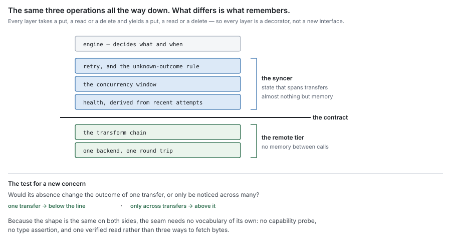
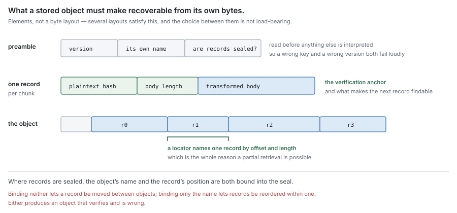
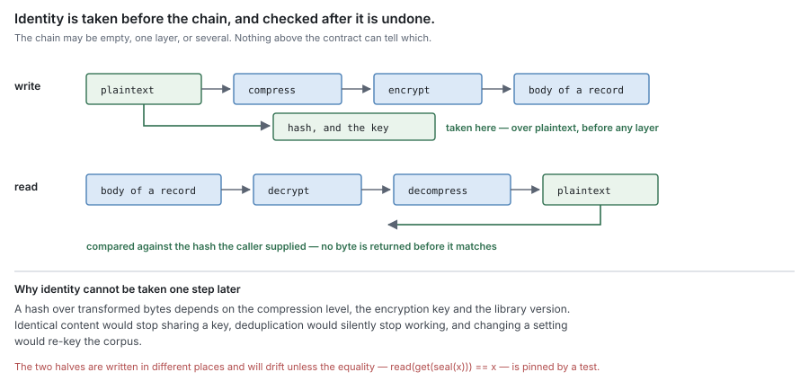
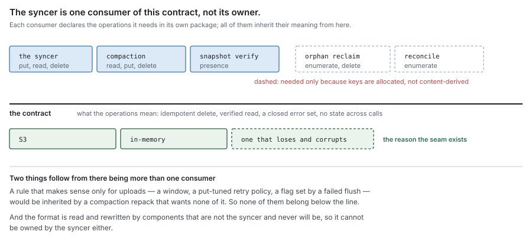

# RFC 8 — the remote tier: object format and backend contract

**Status:** draft.
**Depends on:** RFC 0, for the terms and the residency function. RFC 3 specifies
the component that consumes this contract; this document specifies what satisfies
it. Neither restates the other.
**Audience:** anyone implementing a remote backend, changing `pkg/block/remote`,
`pkg/block/blockcodec` or `pkg/block/middleware`, or deciding what belongs on
which side of the syncer boundary.

The key words **MUST**, **MUST NOT**, **SHOULD**, **SHOULD NOT** and **MAY** are
to be interpreted as in RFC 2119.

This document specifies what the remote tier is required to do. Where the current
implementation does not satisfy a requirement, that is recorded as a **deviation**
in its own subsection, with evidence. A deviation is a defect to be fixed or
migrated, never a rule for an implementer to build around.

---

## 1. Purpose

The remote tier is where a block goes when it leaves this machine, and what it
looks like when it gets there. Two things need specifying and neither is a
component:

- **the stored object** — its bytes, its name, and how a chunk inside it is found;
- **the backend contract** — what an implementation must provide for the syncer
  (RFC 3) to be able to do its job.

### 1.1 Non-goals

This document **MUST NOT** be read as specifying:

- when to transfer, or what — that is flush and eviction policy (RFC 0 §5.2, §8.1);
- what to delete — that is sweep (RFC 0 §8.3, RFC 7);
- how many transfers may be in flight, or what happens when the remote is
  unavailable — that is the syncer (RFC 3 §5, §6);
- what a file, an extent or a segment is.

### 1.2 Why this is a contract and not a component

RFC 0 §1.1 assigns each component a thing it *owns*. The remote tier owns no
behaviour: it decides nothing, schedules nothing, and holds no state that outlives
a call. **This document therefore adds no row to RFC 0 §1.1's table**, and an
implementation that reads it as introducing a ninth component has misread it.

What it specifies instead is the *shared semantics* behind interfaces that several
components declare separately. RFC 0 §1.2 requires each component to declare, in
its own package, an interface for every capability it does not own, named for the
need. Taken alone that rule produces several narrow interfaces over one backend —
the syncer's, GC's — each carrying its own unwritten assumptions about idempotency,
verification and what an error means. The assumptions are what drift, not the
method sets.

So the two rules compose rather than conflict, and the division is worth stating
once:

| | Who writes it | What it fixes |
| --- | --- | --- |
| The declared interface | each consumer, in its own package (RFC 0 §1.2) | which operations *that* consumer needs |
| This contract | here, once | what those operations mean, for every consumer |

Nothing imports this document's package to obtain a type. A backend satisfies every
narrow interface structurally, which is also what keeps RFC 0 §1.2's prohibition on
type-assertion capability negotiation satisfiable: there is one shape, so there is
nothing to probe for.

## 2. The dividing line

This section exists because the syncer and the remote store overlap in an obvious
way — both are "the part that talks to S3" — and an overlap that is never
adjudicated becomes two components that each do a little of the other's job. What
follows is the rule, the argument that each side must exist, and a ruling on every
concern that could plausibly sit on either.

### 2.1 The rule: one operation, or many

> **The remote tier performs one operation on one object and remembers nothing
> between operations. The syncer owns every piece of state that spans operations.**

The test an implementer applies to a new concern is:

- if removing the state would change the outcome of **a single transfer**, it
  belongs to the remote tier;
- if removing it would only be noticed **across transfers**, it belongs to the
  syncer.

Stated the other way round, which is the form worth remembering: **the remote tier
is the only thing that knows which backend it is talking to; the syncer is the only
thing that knows there is more than one transfer.** The remote tier has no memory.
The syncer is almost nothing but memory.

### 2.2 Why the syncer must exist

Fold the syncer into the backends — let each backend manage its own concurrency,
health and retries — and three things break.

**The bound cannot be stated.** RFC 3 §6.1 makes the concurrency limit a *memory*
bound before it is anything else. Memory is a property of the process, not of a
backend. In this system a share owns a block store while the backend behind it is
ref-counted across shares (CLAUDE.md, architecture invariant 4), so one backend can
serve several shares and one share's traffic can span the same backend as another's.
A limit owned by a backend therefore bounds neither the share nor the process, and
a process with two backends would have two bounds and no total.

**Every cross-transfer rule gets N chances to be wrong.** RFC 3 §5.3's latched
health flag is the canonical failure, and it is a state-machine bug, not a backend
bug. Written once above the contract it is one state machine with one conformance
check. Written per backend it is N state machines, N chances to latch, and a
conformance suite that must drive the same recovery scenario against every backend
to learn nothing new each time.

**Other consumers would inherit upload policy.** §7 lists what else reads, writes
and deletes through this contract. If the upload window lived inside the backend, a
compaction repack would contend for upload slots and a snapshot probe would be
throttled by a flush. The window belongs to the thing doing the uploading, not to
the thing being uploaded through.

### 2.3 Why the remote tier must exist

Fold the backend into the syncer — one component that speaks S3 directly — and two
things break.

**Failure injection loses its seam.** RFC 3 §10.3 requires that every Group A check
run against a backend that can lose, corrupt, delay and half-complete, and forbids
a sink that always succeeds from standing in. That requirement is satisfiable only
if there is a substitutable seam, and this contract *is* that seam. The split is
not tidiness; it is what makes RFC 3's data-loss requirements testable at all.

**The format outlives the transport.** A stored object is read and rewritten by
components that are not the syncer and never will be. Compaction reads a block's
records and repacks them into a new object; snapshot verify probes for presence.
Neither is a transfer, both need the format, and neither becomes unnecessary under
any fix contemplated in this set (§7). A format owned by the syncer would be a
format that other components reach around the syncer to touch.

### 2.4 The overlaps, adjudicated

Each row is a concern that could plausibly sit on either side. The ruling follows
from §2.1 in every case; the rightmost column says which.

| Concern | Remote tier | Syncer | By §2.1 |
| --- | --- | --- | --- |
| What "durable" means | which response from *this* backend carries it (§5.6) | what to do once told | the answer is per backend; the action spans transfers |
| Liveness | one probe operation (§5.8) | the derived state, its thresholds, its recovery | a probe is one operation; a state is many |
| Retry | none (§5.7) | whether, when, and within what bound | an attempt is one operation; a budget spans them |
| An unknown outcome | report it as unknown | resolve it as not durable (RFC 3 §5.2) | reporting is local; resolving implies a next attempt |
| Concurrency | none | the window, its ceiling, its adaptation | a limit exists only across operations |
| Peak memory | none | the bound, per process | memory is not a backend's to bound |
| The key | derives it from content (§3.4) | requires its properties (RFC 3 §2.1–§2.3) | the name is part of the format |
| Compression, encryption | the whole chain (§4) | **MUST NOT** know one happened | a transform is per object |
| Verification | verifies before returning (§6) | need not re-verify | the hash is in the object |
| Byte ranges | internal only (§6.2) | never issues one | a range is how a verified read is built |
| Enumeration | performs the walk (§5.4) | does not decide what it means | walking is one operation; interpreting is policy |
| Deletion | performs it, idempotently (§5.5) | does not decide what to delete (RFC 7) | same |
| Incomplete transfers | enumerates its own remnants | decides by age which are abandoned | enumeration is local; age is a judgement across time |

Two rows are worth reading twice, because they are the ones an implementation
drifts across without noticing. **Retry** looks local — one call, one backoff loop
— but a retry budget is a bound, and RFC 3 §5.1 makes bounded time the syncer's
obligation; §5.7.1 records that this row is where the current code drifts.
**Verification** looks like the syncer's job because the syncer is the one that
would be blamed for corrupt bytes, but the hash lives in the stored record, so the
check is local to one object and belongs below the line.

### 2.5 Deviation — the boundary currently runs through the engine

The line §2.1 draws does not exist in the tree. The package named for the syncer
holds two of its obligations; the rest sit in `pkg/block/engine`, on the far side of
no boundary at all.

| Obligation (RFC 3) | Where it lives | Lines |
| --- | --- | --- |
| The upload window, its ceiling and adaptation (§6.1, §6.3) | `pkg/block/syncer/dynsem.go`, `upload_controller.go` | 311 |
| The transfer surface, locator resolution, verified reads (§4) | `pkg/block/engine/syncer.go` | 328 |
| Health, derived and never latched (§5.3) | `pkg/block/engine/sync_health.go` | 317 |
| The bounded prefetch queue (§6.2) | `pkg/block/engine/sync_queue.go` | 216 |
| The put itself, and the durability report (§3, §4.1) | `pkg/block/engine/flush.go`, `engineBlockSink.CommitBlock` | — |

The consequence is not a bug today; it is that two of RFC 3's rules are currently
unenforceable by construction. RFC 3 §5.4 says the syncer reports health and *the
engine* decides what follows — but both sides are the same package, so nothing
stops a decision from being taken where the report is produced. RFC 3 §3.3 says the
syncer reports durability and does not record it — but the recording call site
(`CommitBlock`) and the reporting one are in the same file. A rule whose whole
content is "these two things are separate" needs them to be separable.

This is a move rather than a redesign: the pieces are already in distinct files
with distinct state, and nothing in §2.4's ruling requires a behaviour change to
honour. This document does not schedule it, and the discrepancy **MUST NOT** be
closed by amending §2.1.

### 2.6 What drawing the line deletes

A boundary earns its place by removing more than it adds. This one removes a
surface, and the removal follows from rules already stated rather than from taste.

**The two sides have the same shape, so the seam needs no vocabulary of its own.**
Everything the syncer does to a transfer — bound it, retry it, resolve its unknown
outcome, derive health from how it went — takes a put, a read or a delete and
yields a put, a read or a delete. The syncer is therefore a **decorator** over this
contract, not a component with an interface of its own, in exactly the way the
transform chain of §4 already is. The overlap that prompted this document is real,
and it is the point: the two layers overlap in shape because the shape *is* the
same, and the honest response is to say so once rather than to mint a second
vocabulary that then has to be kept in step with the first.

What that deletes:

| What goes | Why it follows |
| --- | --- |
| A separate interface for the syncer | same operations in, same operations out |
| Any capability probe or type assertion at this seam | one shape, nothing to negotiate (RFC 0 §1.2) |
| A seal/read pair exported as a capability | §3.4 places framing inside the tier, so nothing outside it ever holds a chunk mid-transform |
| Every exported read but one | §6.1 defines one verified read; whole-object and byte-range are how it is built (§6.2) |
| A health *status* beside a health probe | §5.8 — the status is the syncer's derived state, and deriving it twice is how the two disagree |

**And it turns "who retries" from an argument into a position.** §5.7.1 reads as a
layering violation, but retry is a decorator like any other; the only question is
which side of the seam it sits on. §2.1 answers that without further argument, and
the same reasoning settles concurrency, health and backoff in one move rather than
three.

Two things this does **not** delete, and an implementation that believes it has
simplified them has moved a bug rather than removed one. The layers still need
**separate lifetimes** — a decorator that closes its delegate makes a shared
backend unclosable, and backends here are ref-counted across shares. And they still
need **separate conformance suites**, because §2.3's entire argument is that this
seam is where failure gets injected; a suite that runs only through the decorator
cannot inject anything the decorator is supposed to survive.

### 2.7 What this means for the rest of the set

Folding this into RFC 0's plan, the effect is subtractive in three places and
additive in none.

**RFC 0 §1.1 gains no row** (§1.2). The component table lists owners of behaviour;
this tier owns none.

**RFC 7 does not restate transfer semantics.** Sweep deletes through this contract
and, while RFC 3 §2.1.1 stands, enumerates through it (§5.4.1). Without a shared
document those semantics would have to appear in both RFC 3 and RFC 7, in two
voices, with no mechanism for noticing when they diverged — and the pair most
likely to diverge is idempotent delete, which both depend on for crash recovery and
neither would think to check against the other.

**RFC 3 keeps its subject and loses a section it never wanted.** RFC 3 §7 states two
properties of transformation and stops, because a syncer that says more about
compression is a syncer that knows a transform happened, which §4.4 forbids. Those
two properties are requirements *on* this tier, and §4 is where they are discharged.

The one place the plan grows is the reading order, which stops being the numbering:
this document sits between RFC 3 and RFC 7 conceptually and at the end numerically,
because RFC 0, 2 and 3 already carry fourteen forward references to RFCs 4 through 7
and renumbering them would cost three published documents to save one sentence here.

## 3. The stored object

### 3.1 A block object is self-describing

Everything needed to locate and interpret a record **MUST** be derivable from the
object's own bytes, given the key it was fetched under and the transform keys of §4.

An object that needs an external table to be parsed is an object that becomes
unreadable when that table is lost, which converts a metadata failure into a data
failure. RFC 1 §4.4 prohibits exactly this ordering for indexes; the same argument
applies to a format.

### 3.2 What the encoding must carry

This section says what an encoding **MUST** make recoverable, and why each element
has to be there. It does not specify a byte layout: several layouts satisfy it, the
choice between them is not load-bearing, and writing one down as normative would
make its incidental details impossible to tell apart from its necessary ones.

| Element | Scope | Why it MUST be present |
| --- | --- | --- |
| A version marker | object | §3.5 — a reader that cannot tell which version it holds cannot fail loudly, and will misparse instead |
| The object's own name | object | F3 — an object fetched under the wrong key is otherwise indistinguishable from the right one |
| Whether records are authenticated | object | a reader must know how to interpret a record before it can open one |
| The plaintext content hash | record | F2 — verification (§6) needs an anchor inside the object |
| The body's stored length | record | F1 — a record cannot be addressed without knowing where the next one starts |
| The transformed body | record | the payload |

Two constraints on *how* these are carried, which are requirements rather than
layout preferences:

- The version marker **MUST** be readable before anything else is interpreted, or
  it cannot protect the parse it exists to protect.
- Where records are authenticated, the object's name and the record's position
  within the object **MUST** both be bound into the authentication. Binding
  neither lets a record be moved between objects, and binding only the name lets
  records be reordered within one — in both cases producing an object that verifies
  and is wrong.

#### 3.2.1 The current encoding

Descriptive, not normative. What follows is the encoding that ships today. It
satisfies §3.2, and a reader **MUST NOT** treat its particulars — the spelling of
the marker, the choice of varints, the field order — as requirements. Changing any
of them is a migration (§3.5), not a violation.

| Element | Size | Value |
| --- | --- | --- |
| magic | 4 bytes | `DFB1` |
| flags | 1 byte | bit 0: record headers are AEAD-sealed |
| block id | uvarint length + bytes | UTF-8 |

Then one record per chunk, in packing order. With the flag clear, a record is the
32-byte plaintext BLAKE3 hash, a uvarint body length, and the body. With it set,
those first two fields are replaced by an AEAD seal of the pair, with the block id
and the record index bound as additional data, and the length is recovered by
opening the seal.

### 3.3 What the format must guarantee

| # | Guarantee | Why it is load-bearing |
| --- | --- | --- |
| F1 | A record is addressable without reading the whole object | this is what makes RFC 3 §4.3's partial retrieval possible at all |
| F2 | Every record carries the content hash of its plaintext | verification (§6) needs an anchor inside the object |
| F3 | The object names itself | a misdelivered or mis-keyed object is detectable rather than served |
| F4 | The version is in the first bytes | an object this build cannot read fails loudly instead of being misparsed |
| F5 | Records are independent | one corrupt record does not make the rest unreadable |

F3 is the one that looks redundant and is not. Without it, an object fetched under
the wrong key is indistinguishable from the right one until a hash check fails, and
with RFC 3 §2.1's content-derived key the preamble name and the fetch key are the
same value, so the check is free.

### 3.4 The object's name is part of the format, not of the transport

The key **MUST** be derived by this layer, from plaintext content, and **MUST NOT**
be supplied by the caller as an opaque token the caller invented.

RFC 3 §2.1–§2.3 state the *properties* the key must have — content-derived, stable,
encoding nothing mutable. Those are requirements the syncer places on the tier.
This section says the derivation is the tier's to perform, and the reason is §3.2:
the name is carried inside the object and, where records are authenticated, bound
into their authentication. A name chosen elsewhere therefore has to exist before
the framing does and be threaded into it. A layer that both derives and frames has
one ordering to get right; a layer handed a name from outside has two, and the
second one is a cross-component ordering nobody owns.

### 3.5 Format changes are migrations

A change to §3.2 **MUST** advance the magic, and readers **MUST** accept every
version they may still encounter.

An object written under one version and read under another is not a compatibility
question that can be deferred: the objects are already durable, there is no
rewrite point, and the failure appears at the next read rather than at the change.

## 4. The transform chain

An implementation **MAY** compress and encrypt a chunk before it is framed.

### 4.1 Seal and read are exact inverses

For every chunk, `read(get(seal(plaintext))) == plaintext`, byte for byte, with
each layer inverting exactly its own transform in exactly the reverse order.

This is stated as an equality rather than as a description because it is the only
property the rest of the chain can be built on, and because the two halves are
written in different places and will drift if nothing pins them together.

### 4.2 Identity is over plaintext, at every layer

The content hash of a chunk, and the key of a block, **MUST** be functions of
plaintext (RFC 3 §7.1).

If either were a function of transformed bytes, it would depend on the compression
level, the encryption key and the library version, so identical content would stop
sharing a key, deduplication would silently stop working, and a settings change
would re-key the corpus.

### 4.3 The chain travels with the object

How an object was transformed **MUST** be recoverable from the object, not from
configuration (RFC 3 §7.2). Configuration describes the *next* write; if it is also
the only record of past writes, changing it makes existing data unreadable.

### 4.4 The syncer MUST NOT observe that a transform happened

No signature, error, metric or return value crossing this contract **MAY** differ
according to whether a transform is configured.

This is what makes §2.1's line hold under pressure. The moment the syncer can tell
that encryption is on, something above the line starts branching on it — a retry
that treats a decrypt failure differently, a metric that reports compressed bytes
as transferred bytes — and the chain stops being a property of the object.

## 5. The backend contract

### 5.1 Operations

Three operations are forced by what the tier is for, and a backend **MUST** provide
each exactly once — a second way to do any of them is a second thing to keep
correct, and the one that gets it wrong is whichever is used less:

| Operation | Obligation |
| --- | --- |
| put | make one object retrievable under one key, atomically in effect (RFC 3 §4.1) |
| read | return a verified unit (§6.1) |
| delete | remove one object, idempotently (§5.5) |

A fourth, **enumeration**, is required only by consumers that must find objects
they cannot name. §5.4 states its obligations and §5.4.1 states why it is not
unconditional, because the answer bears on RFC 3 §2.1.1.

A **probe** (§5.8) is not an operation on an object and is listed apart from these.

How a read is decomposed internally — whether it fetches a whole object or a byte
range — is not part of this contract. §6.2 says why that is a deliberate exclusion
rather than an omission.

### 5.2 Errors are a closed set

Every failure **MUST** map to a named error this contract defines, and a backend
**MUST NOT** surface a native error the caller is expected to interpret.

A caller that has to recognise an S3 status code is a caller with a second backend
implementation inside it, and the one thing every such caller gets wrong is the
backend it was not written against.

The set **MUST** distinguish at least: the object is absent; the request was
malformed; the backend refused; the backend failed. The first three are decisions
a caller can act on differently and collapsing any pair of them removes a choice
the caller is required to make (RFC 3 §5.1's classification).

### 5.3 A read returns the requested unit or an error

There is no third outcome. A read **MUST NOT** return fewer bytes than asked for
without saying so, **MUST NOT** substitute a different unit, and **MUST NOT**
succeed on a request it could not satisfy exactly.

This is stated as one rule rather than as a table of edge cases on purpose. Edge
semantics — what a negative offset does, whether a length past the end clamps or
errors, whether an offset past the end is distinguishable from an absent object —
are properties of the internal range read that §6.2 excludes from this contract,
and a backend that has to answer them is a backend that has been handed an
operation this contract does not define. Where such semantics are unavoidably
weaker than they look, §5.3.1 records the reason at the place it applies rather
than promoting it to a requirement here.

#### 5.3.1 Weakenings are documented where they occur, never inherited

Where a backend cannot meet a guarantee exactly, the gap **MUST** be stated at the
backend, **MUST** name what it costs the caller, and **MUST NOT** be written into
this document as a relaxed requirement for every backend.

The failure mode this prevents is specific and has already happened once in this
codebase's history: one backend's limitation gets copied into the shared contract,
every other backend is then permitted the same weakness, and a conformance check is
written to assert the weakened form — after which a backend that *could* have been
exact is prevented from proving it.

### 5.4 Enumeration reports; it does not interpret

A walk **MUST** visit every object under the prefix exactly once, **MUST** offer a
clean early exit, and **MUST** abort on context cancellation.

It **MUST NOT** filter, classify or order by anything derived from what the object
means, because the caller that knows what an object means is a different component
in every case (§7).

#### 5.4.1 Enumeration is required by a condition, not by the design

An object store that can be enumerated is convenient. An object store that *must*
be enumerated is a store whose contents cannot be reached from what references
them, and that is a property of the naming scheme rather than of the tier.

Under RFC 3 §2.1, where a key is a function of content, everything durable is
reachable from the content that names it, and the only remaining reason to walk is
to audit for objects nothing should have written. Under an allocated key it is the
sole way to find an object whose record never landed — which is why RFC 3 §2.1.1's
deviation is what currently makes this operation load-bearing.

An implementation **MUST NOT** read that as licence to depend on enumeration for
correctness. A design in which losing the ability to list loses data is a design
that has made the listing an index, and RFC 1 §4.4 governs indexes.

### 5.5 A put of an existing key succeeds; so does a delete of an absent one

Both **MUST** be idempotent, and for the same reason: the caller that issues either
may be a retry of a caller that already succeeded and did not learn so (RFC 3 §5.2),
or a sweep re-running after a crash mid-pass. An operation that fails because it
already happened turns recovery into an error.

### 5.6 What acknowledgement means is the backend's to declare

A backend **MUST** state which of its responses means the object is durably stored,
and **MUST NOT** report success on a weaker one.

RFC 3 §3.1 requires an implementation to *know* this; this is where it is written
down. A backend that acknowledges before committing, that buffers, that writes
through a cache, or that acknowledges at a weaker consistency level than the
deployment requires has not supplied the evidence, and the declaration is what
makes the difference auditable rather than assumed.

### 5.7 A backend holds no state that spans operations

A backend **MUST NOT** carry a retry budget, a circuit breaker, a health flag, a
concurrency limit or a queue.

All five are §2.1's other side, and all five are invisible to the component that
is required to bound them. The specific damage differs — a hidden retry budget
breaks RFC 3 §5.1's bounded time, a hidden health flag reintroduces §5.3's latch
below where anything can observe it — but the shape is the same: a bound that is
not stated where it is owned is a bound nobody can add up.

#### 5.7.1 Deviation — the SDK retries inside the store

The S3 backend configures the AWS SDK's standard retryer at construction
(`pkg/block/remote/s3/store.go:161-169`): up to ten attempts by default, 30 s
maximum backoff, with HTTP 429 added to the retryable set. Every operation in §5.1
therefore retries below the contract.

| | Stated by | Value |
| --- | --- | --- |
| Attempts per operation | the backend, at construction | 10 by default (`store.go:160`) |
| Maximum backoff | the backend | 30 s |
| Retry policy across operations | the syncer (RFC 3 §5.1) | bounded, with classification |
| The product of the two | nobody | — |

This is not automatically wrong — bounded attempts have to live somewhere, and the
SDK's are bounded. What is wrong is that they are not *visible*: RFC 3 §5.1 makes
bounded completion the syncer's obligation, and the syncer cannot see, configure
per operation, or compose with a budget it is not told about. The effective worst
case is the product of two independently-chosen limits and neither layer states it.

There is a second, sharper consequence. A put retried inside the SDK has already
resolved an ambiguous outcome once, silently, before RFC 3 §5.2 ever sees one — and
that is safe today only because the key is allocated rather than content-derived,
so the retry is a plain overwrite of the same key. The deviation that makes this
one harmless is RFC 3 §2.1.1. Fixing §2.1.1 does not make this worse, but it does
mean the two must be reasoned about together rather than separately.

Two ways out, and this document does not choose:

1. **Surface the budget.** The backend declares its attempt bound as part of §5.6's
   declaration, and the syncer composes rather than guesses.
2. **Own it above.** Disable SDK retry and let the syncer make every attempt, which
   makes classification and the bound one decision in one place, at the cost of
   reimplementing what the SDK already does well.

### 5.8 The liveness probe is one operation

A backend **MUST** expose a probe that is a single round trip and that holds no
state, and **MUST NOT** expose a health *status*.

The difference is the whole of §2.1 in miniature. A probe answers "did this one
call work". A status answers "is this backend usable", which is a claim about
recent history, and history is the syncer's (RFC 3 §5.3). A backend that returns a
status has already decided a question RFC 3 requires to be derived and never
latched, below the layer that could observe the latch.

## 6. Reads are verified at this boundary

### 6.1 The exported read takes the expected hash

The read a caller may use **MUST** take the expected content hash of exactly the
unit it returns, **MUST** verify before returning any byte, and **MUST** return an
error rather than unverified bytes.

This is where RFC 3 §4.2 and §4.3 are discharged, and §2.4 explains why here rather
than above: the anchor is the hash in the record (F2), which is local to one object.
A verification that happens above this line happens once per caller, and the number
of callers only grows.

### 6.2 Deviation — the raw range read is exported

`GetBlockRange` sits on the same interface as the verified chunk read, takes no
hash, and returns whatever the backend gives it. RFC 3 §4.2.1 records the symptom
and leaves the choice open; this document makes the choice: the range read is how
§6.1 is *built*, and it belongs below the contract's surface, not on it.

That resolution is not yet implemented, and until it is, the one caller that uses
the raw form (`pkg/snapshot/verify.go:72`, a one-byte presence probe) is safe only
because it discards the byte.

## 7. This contract has more than one consumer

The syncer is one consumer of this contract, not its owner. That is the concrete
reason §2.1's line is drawn where it is rather than around the syncer: a rule that
made sense only for uploads — an upload window, a retry policy tuned for puts, a
health flag set by a failed flush — would be inherited by a GC pass that wants none
of it.

| Consumer | What it needs | Specified by | Durable? |
| --- | --- | --- | --- |
| the syncer | put, verified read, delete | RFC 3 | yes |
| compaction | verified read of a block's records, put of the repacked block, delete of the old one | RFC 7 | yes |
| snapshot verify | presence | — | yes |
| orphan reclaim | enumerate, delete | RFC 7 | **contingent** |
| reconcile | enumerate | RFC 7 | **contingent** |

The last two are marked because the case must not be overstated. Both exist to find
objects that cannot be reached from what references them, and RFC 3 §2.1.1 is why
that is currently necessary. Under a content-derived key they shrink to an audit
that is worth running and not required for correctness (§5.4.1). The argument for
this contract's existence therefore rests on the first three, which survive that
fix; the last two are evidence about today, not about the design.

### 7.1 Deviation — consumers take the provider's interface, not their own

RFC 0 §1.2 requires a component to declare, in its own package, an interface for
each capability it does not own, named for the need. GC does this for metadata and
does not do it for the remote tier, in the same files:

| Package | Metadata dependency | Remote dependency |
| --- | --- | --- |
| `pkg/block/gc/compaction.go` | declares `CompactMetaView` (:75) | takes `remote.RemoteBlockStore` (:128, :181, :341) |
| `pkg/block/gc/orphan_reclaim.go` | declares `ReclaimMetaView` (:36) | takes `remote.RemoteBlockStore` (:120, :235) |
| `pkg/block/gc/reconcile.go` | declares `ReconcileMetaView` (:20) | takes `remote.RemoteBlockStore` (:132) |

Nineteen non-test packages import `pkg/block/remote` this way, including five under
`pkg/controlplane/runtime`.

The cause is not carelessness, and this is the part worth recording: there was
nothing to narrow *to*. Declaring a two-method interface named for a need is only
safe when the semantics those two methods carry are written down somewhere — that a
delete of an absent key succeeds, that a read is verified, that an error belongs to
a closed set. Without that, a narrow interface silently drops the guarantees its
methods depended on, and the drop is invisible at the call site. So each consumer
took the full provider interface, which is the one thing guaranteed not to lose
anything.

Supplying those semantics is what this document is for, and narrowing is the
consequence rather than the fix: with §5 and §6 stated, each consumer can declare
the two or three operations it needs and inherit the meaning from here. RFC 0's
per-component import-graph test is what would hold it.

This document does not schedule the narrowing, and the discrepancy **MUST NOT** be
closed by amending RFC 0 §1.2.

## 8. Invariants

| # | Invariant |
| --- | --- |
| R1 | A stored object is interpretable from its own bytes. |
| R2 | Every record carries the content hash of its plaintext. |
| R3 | The exported read verifies against a caller-supplied hash before returning a byte. |
| R4 | The key is derived at this layer, from plaintext content. |
| R5 | Seal and read are exact inverses. |
| R6 | The transform chain is recoverable from the object, not from configuration. |
| R7 | A put of an existing key succeeds, and a delete of an absent key succeeds. |
| R8 | Every failure maps to an error this contract names. |
| R9 | A backend holds no state that spans operations. |
| R10 | A backend decides no policy, for any consumer. |
| R11 | Nothing crossing this contract reveals whether a transform is configured. |

R2, R3 and R5 are the ones whose violation loses data. R9 and R10 are the ones
whose violation dissolves the boundary, which is slower and harder to see.

Against the current implementation: **R3 fails** (§6.2) and **R9 fails** (§5.7.1),
and RFC 0 §1.2's declared-interface rule fails at every consumer (§7.1).
R5 is pinned by the existing round-trip tests. R9's other four forms hold — the S3
backend's probe is a stateless `HeadBucket` (`store.go:706`) and holds no status,
and no backend carries a window or a queue.

## 9. Conformance

RFC 1 §11 applies unchanged: conformance is every **MUST** holding, the checks
below are evidence for the ones that fail *silently*, and a check is validated by
reverting the code and watching it fail on its own assertion.

A suite already covers part of this surface — `blockstoretest.RemoteBlockStoreConformance`,
sixteen subtests over put, get, range, delete and walk. What follows is what it
does not reach.

### 9.1 Group A — silent data loss

| Requirement | Check |
| --- | --- |
| §6.1 reads are verified | Corrupt a stored record; assert the verified read errors and returns no byte. Assert a range read with no hash is not reachable from outside the package. |
| §4.1 seal/read symmetry | Round-trip every chunk through every configured chain, including one chunk that compresses larger than its input. Assert byte equality, not length equality. |
| §4.2 identity over plaintext | Store identical content under two compression settings; assert one key, and that each is readable under the other's setting. |
| §3.3 F3 self-naming | Fetch an object under a key that is not its own; assert the mismatch is detected rather than the bytes returned. |
| §3.5 version | Present an object whose magic this build does not know; assert a named error, never a parse of the following bytes. |
| §5.6 acknowledgement | Drive a backend that acknowledges before committing and then loses the write; assert success was not reported. A backend with one acknowledgement kind cannot exhibit this. |

### 9.2 Group B — boundary drift

| Requirement | Check |
| --- | --- |
| §5.7 no cross-operation state | Assert that the total attempts reaching the transport for one operation matches the declared bound, and that the bound is readable from outside the backend. |
| §5.8 probe is stateless | Fail the probe, then restore it; assert the very next probe succeeds with no intervening call and no reset. |
| §5.2 closed error set | Force every failure the backend can produce; assert each maps to a named error and none escapes natively. |
| §5.3 exactness | Drive a backend that silently returns less than was asked for; assert the read errors rather than returning a short result. A check that accepts a short read has asserted the opposite of the rule. |
| §5.4 walk | Assert every object is visited once, early exit is clean, and cancellation aborts. |
| §4.4 transform invisibility | Run the full consumer-side suite against a store with and without a chain configured; assert no observable difference beyond timing. |

### 9.3 What must not stand in for the real thing

- **The memory backend MUST NOT be the only one under test for Group A.** It cannot
  lose an acknowledged write, cannot half-complete, and cannot delay, so it asserts
  nothing about §5.6 and little about §6.1.
- **A round-trip test MUST NOT stand in for §4.1.** A round trip asserts that two
  sides agree, which they will if both are wrong in the same direction. Symmetry
  needs a fixture with bytes written by one version and read by another.
- **A conformance run against one backend MUST NOT be reported as contract
  conformance.** The whole purpose of §2.3's seam is that backends differ; a suite
  that has only ever run against one has tested an implementation.
- **`RemoteBlockStoreConformance` MUST NOT be treated as covering this document.**
  It covers §5.1's operations and §5.3's ranges. It does not reach §4, §6 or any
  Group B row.

## 10. Open questions

1. **Where the retry budget lives** (§5.7.1). Two exits are stated and neither is
   obviously right. Surfacing the SDK's bound is cheap and leaves the retry logic
   where it is tested; owning it above makes the bound and the classification one
   decision, and RFC 3 §5.1 already assigns the classification there. This wants
   deciding with RFC 3 §2.1.1, not separately.
2. **Whether the sealed record header earns its cost** (§3.2.1). Sealing the header
   hides chunk hashes and lengths from anyone who can read the object, at the cost
   of a per-record AEAD open before the record can even be located. Whether the
   metadata it conceals is worth concealing has not been argued anywhere.
3. **What acknowledgement means per backend** (§5.6). This is RFC 3 open question 3
   seen from the other side, and it is the same question: for object stores the
   answer is usually a successful response to the completing request, but
   replication lag, consistency level and regional durability all qualify it, and
   none of it is written down for either backend today.
4. **Whether the preamble name should be the content key** (§3.3 F3, §3.4). With
   RFC 3 §2.1.1 fixed, the two become the same value and F3's check is free. While
   the key is allocated, the preamble name is a second copy of a value that means
   nothing outside the object, and F3 detects only misdelivery.
5. **Whether the collapse of §2.6 should be done now, and in what order.** The
   deletions follow from the rules, but they are not independent: exporting one
   verified read (§6.1) requires framing to move inside the tier (§3.4), which
   requires the key derivation to move with it, which is RFC 3 §2.1.1. Done in that
   order each step is small; done in any other, the middle steps have to keep two
   naming schemes alive at once. Whether that sequence is worth running before the
   metadata RFCs land is a scheduling question this document cannot answer alone.
6. **Whether `blockcodec` belongs under `remote`** (§1.2). The format is specified
   here, but it is implemented in a package that the carver's output flows through
   and that GC parses directly. Where it should *live* is a layering question this
   document does not settle, and moving it is not free while four call sites import
   it.
7. **What the deviation pass could not check.** Four deviations are recorded
   (§2.5, §5.7.1, §6.2, §7.1), of which §6.2 is inherited from RFC 3. Three
   requirements could not be settled by reading, because they are properties of a backend under fault:
   §5.6's acknowledgement semantics, §5.2's error closure under every native
   failure, and §5.3's exactness against a backend that silently returns less than
   was asked for. §9.3 says why the memory backend cannot answer them, and no
   fixture that could exists.
