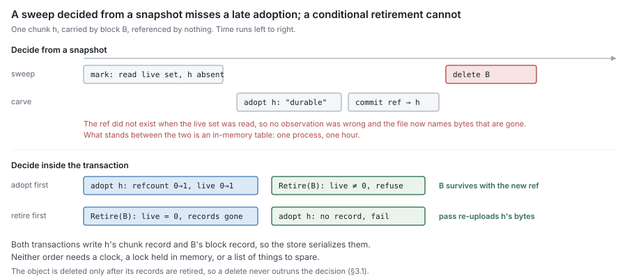

# RFC 9 — GC: sweep, relocation and remote deletion

**Status:** draft.
**Depends on:** [RFC 0](rfc-0-data-lifecycle.md), for the terms, the failure model and invariants I3, I7 and
I8. [RFC 6](rfc-6-block-metadata.md) supplies the counts and the atomic operations sweep is built on
([RFC 6 §7](rfc-6-block-metadata.md#7.%20What%20sweep%20needs%20from%20this%20component)). [RFC 4](rfc-4-remote-tier.md) specifies the delete and enumeration this component calls, and
[RFC 3](rfc-3-syncer.md) the flow its relocation transfers run on. [RFC 2 §4](rfc-2-carver.md#4.%20Identity) names the blocks it
writes. Nothing here redefines them.
**Audience:** anyone changing sweep, relocation or unrecorded-object collection,
a metadata backend's block and chunk records, or adding a way to keep content
alive.

The key words **MUST**, **MUST NOT**, **SHOULD**, **SHOULD NOT** and **MAY** are
to be interpreted as in RFC 2119.

This document specifies behaviour, not the current code. Where the code differs,
[Appendix A](#Appendix%20A%20%E2%80%94%20where%20the%20current%20code%20differs) lists it for the refactor. Where this document chooses a policy the set
left open, it labels the choice a **proposal for discussion**.

---

## 1. Purpose

GC answers one question:

> **Which remote objects may be deleted, and when is deleting one safe?**

It is the only component in the set that destroys the last copy of content
([RFC 0 §8.3](rfc-0-data-lifecycle.md#8.3%20Sweep)). Every other failure in the system can lose a local copy, serve a
stale answer or stop accepting writes. A GC defect deletes data that a file still
names, and nothing downstream can recover it.

GC performs four operations, all on the remote tier:

| Operation | What it destroys | Section |
| --- | --- | --- |
| **sweep** | a block nothing references | [§3](#3.%20Sweep) |
| **relocation** | nothing — it moves referenced chunks out of a block | [§4](#4.%20Relocation) |
| **collection** | an object no record names | [§5](#5.%20Unrecorded%20objects) |
| **audit** | nothing — it recomputes counts and reports | [§6](#6.%20Audit) |

### 1.1 Non-goals

GC **MUST NOT**:

- recover local space. Eviction and reclamation are the journal's ([RFC 0 §8.1](rfc-0-data-lifecycle.md#8.1%20Evict),
  [§8.2](rfc-0-data-lifecycle.md#8.2%20Reclaim); [RFC 1](rfc-1-journal.md)). GC never reads, writes or unlinks a segment;
- decide what is referenced. Refcounts are block metadata's ([RFC 6 §6](rfc-6-block-metadata.md#6.%20Reference%20counting)), and an
  inode's release is the namespace's ([RFC 7 §4.3](rfc-7-namespace-metadata.md#4.3%20Release%20is%20what%20block%20metadata%20sees)). GC reads the count; it does not
  keep one of its own;
- keep content alive by any means other than the count ([§2.1](#2.1%20The%20count%20is%20the%20only%20authority));
- restate what a put, a read or a delete means. That is [RFC 4](rfc-4-remote-tier.md)'s ([RFC 4 §1.2](rfc-4-remote-tier.md#1.2%20A%20contract%2C%20not%20a%20component));
- name a block by any means other than [RFC 2 §4.2](rfc-2-carver.md#4.2%20A%20block), or frame, seal or parse an
  object ([RFC 4 §3](rfc-4-remote-tier.md#3.%20The%20block%20format));
- import another component in this set ([RFC 0 §1.2](rfc-0-data-lifecycle.md#1.2%20Component%20autonomy)).

### 1.2 Words this document uses, and two it does not

[RFC 0 §1.1](rfc-0-data-lifecycle.md#1.1%20The%20component%20set) assigns this component "mark/sweep". **Sweep** keeps its meaning:
deleting a remote block that nothing references ([RFC 0 §2.3](rfc-0-data-lifecycle.md#2.3%20Operations)). **Mark** survives
only as the audit of [§6](#6.%20Audit), which recomputes counts from refs. It is not a phase of
the sweep and decides nothing. [§2.4](#2.4%20Why%20not%20mark%20from%20a%20snapshot) says why.

**Relocation** is [RFC 6 §7.3](rfc-6-block-metadata.md#7.3%20Relocation)'s word for rewriting a block's surviving chunks into
a new block. "Compaction" is not used, because in an LSM it names an operation
that discards content, and relocation discards none ([RFC 0 §8.2](rfc-0-data-lifecycle.md#8.2%20Reclaim)).
**Collection** is [§5](#5.%20Unrecorded%20objects)'s deletion of objects no record names; it is not the audit.

## 2. What is safe to delete

### 2.1 The count is the only authority

A block **MAY** be deleted only when its `live` count is zero ([RFC 6 §2.3](rfc-6-block-metadata.md#2.3%20Block)), and
only by the conditional retirement of [§3.1](#3.1%20Retire%20the%20records%2C%20then%20delete%20the%20object). Nothing else permits a delete, and
nothing else prevents one.

In particular, an implementation **MUST NOT** consult, in deciding whether to
delete:

- a hold set, a pin list, or an extra root for a snapshot, an open file or any
  other holder. Every holder of content holds counted refs ([RFC 6 §6.5](rfc-6-block-metadata.md#6.5%20Who%20owns%20a%20ref);
  [RFC 7 §4.4](rfc-7-namespace-metadata.md#4.4%20There%20is%20no%20third%20holder));
- elapsed time. A grace period **MUST NOT** substitute for conditional retirement
  or conditional adoption ([RFC 6 §7.2](rfc-6-block-metadata.md#7.2%20Adoption%20is%20conditional%20on%20existence)). Inferring safety from "unreferenced for
  long enough" is the inference [RFC 0 §4.3](rfc-0-data-lifecycle.md#4.3%20Reporting) forbids for durability;
- any state held in process memory. Two passes in two processes **MUST** be as
  safe as two in one.

A second liveness mechanism fails open. Every path that decides liveness has to
remember it, the one that forgets deletes held content, and the audit of [§6](#6.%20Audit)
reports nothing wrong because by the counts nothing was.

### 2.2 Zero is a candidate, not a verdict

`live` is read at one instant and the delete happens at another. Between them an
offload commit can adopt one of the block's chunks ([RFC 6 §7.2](rfc-6-block-metadata.md#7.2%20Adoption%20is%20conditional%20on%20existence)), a clone can copy a
ref to one, and a relocation can move one in or out. So a zero read outside a
transaction **MUST** be treated as a candidate only. The verdict is taken inside
the retirement transaction, which re-reads `live` and refuses if it is nonzero
([RFC 6 §7.1](rfc-6-block-metadata.md#7.1%20Conditional%20retirement)).

This is the whole of [RFC 0 §8.3](rfc-0-data-lifecycle.md#8.3%20Sweep)'s requirement that "content created or referenced
after a sweep began cannot be deleted by that sweep". A sweep has no beginning
that matters. Each retirement is its own decision, taken on the state at its own
commit.

### 2.3 The absence of a record proves nothing

A block with no record in this store is not thereby unreferenced ([RFC 6 §2.6](rfc-6-block-metadata.md#2.6%20The%20scope%20of%20a%20count)).
Another store, another process or another deployment writing into the same key
namespace can reference it. Sweep therefore acts only on blocks this store
records. Objects no store records are [§5](#5.%20Unrecorded%20objects)'s, and [§5](#5.%20Unrecorded%20objects) runs only where the namespace
is proven to belong to the stores it enumerated.

The namespace is fixed by the key scope of [RFC 2 §4.3](rfc-2-carver.md#4.3%20Key%20scope). A deployment **MUST**
satisfy one of the two options of [RFC 6 §2.6](rfc-6-block-metadata.md#2.6%20The%20scope%20of%20a%20count) before any GC operation runs. Where
the scope makes one object reachable from several shares, the stores of all those
shares are one counting domain, and GC **MUST** treat them as one.

### 2.4 Why not mark from a snapshot

The alternative to a count is a mark: walk every ref, collect the chunks they
name, and delete what the walk did not see. [RFC 0](rfc-0-data-lifecycle.md) chose counts; this section
records why GC does not reintroduce a mark beside them.

A mark reads a live set at one instant and deletes at a later one. A ref written
between the two names a chunk the live set does not contain. No observation was
wrong, and the chunk is deleted anyway. The only way to close that window is a
second mechanism that records adoptions made after the mark began, and that
second mechanism is exactly the kind [§2.1](#2.1%20The%20count%20is%20the%20only%20authority) forbids: something other than the count
that decides liveness.



## 3. Sweep

### 3.1 Retire the records, then delete the object

Sweeping one block is two steps, in this order:

1. **Retire** ([RFC 6 §7.1](rfc-6-block-metadata.md#7.1%20Conditional%20retirement)): in one transaction, if `live` is zero, delete the
   block record and every chunk record whose `block` names it, and write the
   pending-deletion record of [§3.2](#3.2%20A%20retirement%20not%20yet%20deleted%20is%20durably%20recorded); otherwise refuse.
2. **Delete** the object through the remote store ([RFC 4 §4.5](rfc-4-remote-tier.md#4.5%20Delete%20is%20batched%20and%20idempotent)). Sweep
   **SHOULD** collect retired blocks and delete them in batches, since a request
   per block makes the request count the limit.

The order is not a preference. Retiring first means a crash between the two
leaves an object that no record names, which is a leak. Deleting first means a
crash, or a failed metadata write, leaves records that name an object that no
longer exists. Every read of those chunks then fails, and every adoption of them
succeeds, so new files acquire refs to content that is gone. That is **Lost**
for content that was durable.

**Deletes go directly to the remote store**, not through the syncer ([RFC 3 §5](rfc-3-syncer.md#5.%20What%20belongs%20elsewhere)).
A delete is not a transfer: it **MUST NOT** occupy the syncer's pool or wait on
its fairness, and a store the syncer reports unhealthy only makes deletes fail,
which [§3.6](#3.6%20Failures%20resolve%20on%20their%20own) handles. Relocation's reads and puts are transfers and do go
through the syncer ([§4.2](#4.2%20Read%20verified%2C%20name%20by%20content%2C%20put%2C%20then%20move)).

### 3.2 A retirement not yet deleted is durably recorded

The retirement transaction **MUST** write a pending-deletion record naming the
block. The record is removed only after the delete returns success for that
block's name; in a batch, each name's result is its own. A restart **MUST**
resume every pending deletion it finds.

This is what removes enumeration from sweep's correctness. Without the record, a
crash between [§3.1](#3.1%20Retire%20the%20records%2C%20then%20delete%20the%20object)'s steps leaves an object that can only be found by listing the
store, and nothing's correctness may depend on a listing ([RFC 4 §4.6](rfc-4-remote-tier.md#4.6%20List%20is%20a%20complete%2C%20resumable%20walk)). With it,
the object is named by a record until the moment it is gone.

### 3.3 The race with adoption is closed by transactions, not by time

Adoption is an offload commit referencing a chunk it did not carry ([RFC 6 §7.2](rfc-6-block-metadata.md#7.2%20Adoption%20is%20conditional%20on%20existence)).
Retirement and adoption are the only two operations that can disagree about
whether a chunk is alive, and both touch the same two records:

| Order | Adoption | Retirement | Outcome |
| --- | --- | --- | --- |
| adopt, then retire | refcount 0→1, `live` 0→1 | reads `live` = 1, refuses | block survives with the new ref |
| retire, then adopt | finds no chunk record, fails | deletes block and chunk records | pass retries carrying the chunk's bytes |

The table is correct only if the store serializes the two. An implementation
**MUST** guarantee that, of two transactions writing the same record, at most one
commits on a pre-state the other changed. Serializable and snapshot isolation
both provide this for a record both transactions write. Under a weaker level —
a read-committed default, for one — the conditions **MUST** be part of the write
statements themselves:

- retirement's "`live` is zero" **MUST** be the predicate of the delete, not a
  prior read;
- adoption **MUST** detect a missing chunk record from the write it issues — the
  count of rows it updated — and not from a read made earlier in the transaction.

A retried adoption carries the chunk's bytes, which the journal still holds: the
extent was offered because it is **Dirty** ([RFC 0 §5.2](rfc-0-data-lifecycle.md#5.2%20Offload)), and nothing reports it
durable until a commit succeeds ([RFC 6 §4.3](rfc-6-block-metadata.md#4.3%20The%20commit%20is%20the%20report%27s%20return%20edge)). So losing this race costs one
upload and never a client-visible error.

### 3.4 A retired key is not re-created underneath its delete

A block's name is derived from its key scope, its encoding generation and the
ordered hashes it holds ([RFC 2 §4.2](rfc-2-carver.md#4.2%20A%20block)). Two assemblies of the same chunks in the
same order at the same generation produce the same name. That makes this
sequence possible:

1. An offload, finding a chunk's record gone ([§3.3](#3.3%20The%20race%20with%20adoption%20is%20closed%20by%20transactions%2C%20not%20by%20time)), re-uploads it and
   assembles a block whose name equals a retired block's name *K*. It puts *K*.
2. GC, resuming the pending deletion of *K*, deletes *K*.
3. The offload commits a block record for *K*.

The records now name an object that was deleted after it was put. **A delete of
name *K* MUST NOT run concurrently with a put of *K* whose commit can succeed.**
The requirement applies to every put: an offload's, and a relocation's
([§4.2](#4.2%20Read%20verified%2C%20name%20by%20content%2C%20put%2C%20then%20move)).

A check made only at commit time cannot provide this, because the put happens
outside any transaction and the commit cannot tell whether the delete came before
or after it. The commit has to be conditioned on something the writer read
*before* its put.

> [!question] Proposal for discussion
> Keep a fixed array of **deletion generations**,
> indexed by a hash of the block name. The writer reads its name's generation
> before the put, and its commit **MUST** fail if the generation has changed. GC
> increments the generation, in a transaction, after the delete returns and
> before it removes the pending-deletion record. A writer whose put preceded the
> delete then fails its commit and re-puts. A writer that read the generation
> after the increment put after the delete and is safe. A commit also **MUST**
> fail while a pending-deletion record for its name exists. The array is bounded,
> so I7 holds, and a commit is refused spuriously only when an unrelated name in
> the same bucket was deleted during its put. The bucket count is unmeasured.

**The mechanism is open ([§13](#13.%20Open%20questions)).** Until one is adopted, the set does not meet
this requirement: derived names make the sequence reachable whenever a chunk is
re-uploaded while its old block's deletion is pending. The requirement is stated
now so the fence is designed before the first loss it prevents, not after.

### 3.5 Finding candidates costs what is retirable

A sweep pass **SHOULD** cost O(blocks retired), not O(blocks recorded).

> [!question] Proposal for discussion
> Every transaction that moves a block's `live` from
> one to zero writes a candidate record for the block in the same transaction.
> Sweep consumes candidates, and a retirement that refuses ([§3.3](#3.3%20The%20race%20with%20adoption%20is%20closed%20by%20transactions%2C%20not%20by%20time)) deletes the
> candidate. The candidate list is a hint and never an authority: retirement
> re-reads `live` whatever the list says. `live` crosses zero far less often than
> a refcount changes ([RFC 6 §5.3](rfc-6-block-metadata.md#5.3%20Hot%20records%20that%20are%20not%20per-file)), so the candidate write does not add a hot
> record.

An implementation **MAY** instead scan the block records. The scan is correct and
proportional to the store, and on a large store it is the reason a pass does not
finish.

### 3.6 Failures resolve on their own

| Condition | Behaviour |
| --- | --- |
| Delete reports the object absent | Success. A delete is idempotent ([RFC 4 §4.5](rfc-4-remote-tier.md#4.5%20Delete%20is%20batched%20and%20idempotent)), and a sweep resuming after a crash will see this. |
| Delete refused or failed | The pending-deletion record stays, and the next pass retries it. |
| Remote tier unavailable | Retirements continue, pending deletions accumulate, and nothing is lost. A backlog that does not drain **MUST** be reported as a health condition, not only logged ([RFC 0 §10.2](rfc-0-data-lifecycle.md#10.2%20No%20state%20requires%20intervention%20to%20leave)). |
| Metadata unwritable | Nothing retires, so nothing is deleted. |
| Retirement conflicts | Retried under I8: bounded by the pass's deadline, not an attempt count, with randomised backoff ([RFC 0 §9.2](rfc-0-data-lifecycle.md#9.2%20Conflicts%20and%20their%20retries)). The retry re-reads `live`; it **MUST NOT** re-propose a decision taken on the pre-conflict state. |
| Crash anywhere | Every step is either inside a transaction or recorded by a pending-deletion record, so a restart resumes and does not re-decide. |

A failure in one block **MUST NOT** stop the pass for others. No failure in this
table requires an operator to clear it.

## 4. Relocation

### 4.1 A block that is mostly dead pins its dead bytes

A block is deleted only when every chunk it carries is unreferenced. A block with
one referenced chunk and forty dead ones keeps all forty-one on the remote tier
indefinitely. Relocation copies the referenced chunks into a new block so that
the old one reaches `live` = 0 and sweep can take it. It is also the only way a
chunk is re-encoded ([RFC 5 §5.2](rfc-5-transforms.md#5.2%20Relocation%20re-encodes)): there is no in-place re-encode.

Relocation destroys nothing. It **MUST NOT** delete an object, and **MUST NOT**
retire a record. It moves chunk records and counts ([RFC 6 §7.3](rfc-6-block-metadata.md#7.3%20Relocation)), and the old
block is swept by [§3](#3.%20Sweep) exactly like any other block that reached zero.

### 4.2 Read verified, name by content, put, then move

GC opens a syncer flow on the store for relocation ([RFC 3 §1.3](rfc-3-syncer.md#1.3%20Interface)). Its reads and
puts are transfers, so the pool's memory bound, retries and health refusal apply
to them ([RFC 3 §2.8](rfc-3-syncer.md#2.8%20An%20unhealthy%20store%20refuses%20work)), and they share the pool fairly with offload ([RFC 3 §2.9](rfc-3-syncer.md#2.9%20Workers%20are%20shared%20fairly%20across%20flows)).

Relocating block *B*:

1. **Read** each chunk of *B* whose refcount is nonzero through the flow, which
   decodes each body and verifies each chunk ([RFC 4 §3.4](rfc-4-remote-tier.md#3.4%20Every%20read%20is%20verified%20by%20the%20codec)). GC **MUST NOT**
   parse the block or verify it itself.
2. **Assemble** the chunks into a block under [RFC 2 §5](rfc-2-carver.md#5.%20Packing%3A%20three%20rules%2C%20not%20a%20component): whole chunks only (P1), the
   target size (P2), and only the chunks whose bytes it carries (P3).
3. **Name** the block by [RFC 2 §4.2](rfc-2-carver.md#4.2%20A%20block) at encoding generation *B*'s generation + 1
   ([RFC 6 §2.3](rfc-6-block-metadata.md#2.3%20Block)). The name **MUST NOT** be generated, and relocation **MUST** refuse
   a name equal to *B*'s. The generation is deterministic, so a re-run after a
   crash derives the same name.
4. **Put** it through the flow, encoded under the store's current transform chain
   ([RFC 5 §5.2](rfc-5-transforms.md#5.2%20Relocation%20re-encodes)). [§3.4](#3.4%20A%20retired%20key%20is%20not%20re-created%20underneath%20its%20delete)'s requirement applies to this put.
5. **Move**, after the put is reported durable, in one transaction ([RFC 6 §7.3](rfc-6-block-metadata.md#7.3%20Relocation)):
   point each moved chunk record at the new block, create the new block's record
   with its generation (idempotent per name, [RFC 6 §4.1](rfc-6-block-metadata.md#4.1%20What%20one%20commit%20records)), and move `live` from
   *B* to the new block by the number of moved chunk records whose refcount is
   nonzero, counted inside the transaction.

| Crash after | State | Outcome |
| --- | --- | --- |
| 1–3 | nothing written | no effect |
| 4 | an object no record names | the re-run derives the same name and puts the same chunks, possibly as different bytes (a new salt, a rotated key); the overwrite is harmless, and stale positions are repaired on read ([RFC 4 §3.4](rfc-4-remote-tier.md#3.4%20Every%20read%20is%20verified%20by%20the%20codec)). If it never re-runs, [§5](#5.%20Unrecorded%20objects) may collect it |
| 5 | chunks moved, *B*'s `live` at zero | *B* is an ordinary sweep candidate |

A chunk whose refcount is zero is not moved. Its record stays pointing at *B*
until *B* retires. If it is adopted in between, *B*'s `live` becomes nonzero
again, *B* survives, and the next relocation of *B* moves it. That is a leak for
one pass, not a loss.

### 4.3 A reader can hold the old location

A reader that resolved a chunk to *B* before step 5 can issue its read after *B*
is swept, and find the object absent. Refs name hashes ([RFC 6 §2.5](rfc-6-block-metadata.md#2.5%20Refs%20name%20hashes%2C%20never%20blocks)), so the
chunk is still reachable, at the new block. The read path **MUST** re-resolve the
chunk once when the remote store reports a block absent, and **MUST** fail only
if the second resolution also misses ([RFC 8 §6.7](rfc-8-engine.md#6.7%20An%20absent%20object%20is%20re-resolved%20exactly%20once)). Relocation is safe only while
that rule holds.

### 4.4 When to relocate is policy

Relocation spends a read and a put to recover dead bytes. Whether that is worth
it depends on how much of the block is dead, how long the bytes would otherwise
be stored, and what a transfer costs. GC **MUST** expose the selection threshold
as configuration, and **SHOULD** select on bytes rather than on chunks, because
chunk sizes vary several-fold ([RFC 2 §3](rfc-2-carver.md#3.%20The%20boundary%20function)).

GC **MUST NOT** relocate a block whose chunks are all referenced, with one
exception: retiring material or a transform ([RFC 5 §5.3](rfc-5-transforms.md#5.3%20Retiring%20material%20or%20a%20transform%20needs%20a%20census)) relocates every block
whose bodies use it, fully live or not. The generation bump of [§4.2](#4.2%20Read%20verified%2C%20name%20by%20content%2C%20put%2C%20then%20move) step 3
gives such a block a new name even though its chunk list is unchanged.

The metric and default are open ([§13](#13.%20Open%20questions)). [RFC 6](rfc-6-block-metadata.md)'s block record carries `live`, a
chunk count. Selecting on bytes needs either a per-block byte count or a read of
the chunk records, and which is cheaper is unmeasured.

### 4.5 What relocation races

| Concurrent operation | Why it is safe |
| --- | --- |
| Adoption of a moved chunk | Both transactions read and write that chunk's record, so they serialize. The adoption counts in whichever block the record names when it applies ([RFC 6 §7.3](rfc-6-block-metadata.md#7.3%20Relocation)). |
| Sweep of *B* | Retirement reads *B*'s `live` inside its transaction. It is zero only once relocation has committed. |
| Snapshot or restore | Refs name hashes, so a snapshot's refs survive the move. A restore takes locations from the live store, never from its copy ([RFC 6 §7.4](rfc-6-block-metadata.md#7.4%20Restore)). |
| A second relocation of *B* | Both derive the same name. The second's put may overwrite the first's committed block with the same chunks in different bytes; positions are repaired on read ([RFC 4 §3.4](rfc-4-remote-tier.md#3.4%20Every%20read%20is%20verified%20by%20the%20codec)), and its step 5 finds nothing left pointing at *B* to move. On a service whose put integrity is only an ETag comparison, a crash during that overwrite can leave the block corrupt; [RFC 4 §4.3](rfc-4-remote-tier.md#4.3%20Put%3A%20a%20whole%20block%2C%20checksummed%2C%20durable%20on%20success) states that ceiling. |

## 5. Unrecorded objects

### 5.1 How they arise

An object no record names comes from one of:

- a put whose commit never ran — a crash, or a pass abandoned after the put
  ([RFC 6 §4.2](rfc-6-block-metadata.md#4.2%20Only%20after%20durability));
- a relocation that put and did not commit ([§4.2](#4.2%20Read%20verified%2C%20name%20by%20content%2C%20put%2C%20then%20move));
- anything written into the namespace by a process this store does not know
  about.

A retirement does not produce one, because [§3.2](#3.2%20A%20retirement%20not%20yet%20deleted%20is%20durably%20recorded) records it until the delete
completes.

### 5.2 Collection is housekeeping

Names are derived ([RFC 2 §4.2](rfc-2-carver.md#4.2%20A%20block)), so a put that did not commit is retried under
the same name. An unrecorded object is then a leak of storage, not a threat to
content, and collecting it is worth running but not required for correctness
([RFC 4 §4.6](rfc-4-remote-tier.md#4.6%20List%20is%20a%20complete%2C%20resumable%20walk)).

An implementation **MUST NOT** depend on collection for correctness, and a
deployment that never runs it **MUST** only leak.

### 5.3 It runs only where the namespace is proven

Collection deletes an object because no record names it, which is exactly the
inference [§2.3](#2.3%20The%20absence%20of%20a%20record%20proves%20nothing) forbids unless every store that could name it has been read. GC
**MUST NOT** delete an unrecorded object unless:

- the deployment meets [RFC 6 §2.6](rfc-6-block-metadata.md#2.6%20The%20scope%20of%20a%20count) — one store per namespace, or key derivation
  that includes the store's identity — and GC can verify which it is from
  configuration, not assume it;
- every store in the counting domain ([§2.3](#2.3%20The%20absence%20of%20a%20record%20proves%20nothing)) was enumerated completely in this
  pass. A store that failed or was skipped **MUST** stop collection for the whole
  namespace.

A second server or a second configuration pointing at the same bucket and prefix
is the case this exists for. Per share it is a correct configuration. Together
they share a namespace neither can see all of.

### 5.4 Age is not the guard

An unrecorded object may be the put half of a commit still in flight. Deleting it
then produces [§3.4](#3.4%20A%20retired%20key%20is%20not%20re-created%20underneath%20its%20delete)'s sequence exactly. Collection **MUST** install a
pending-deletion record for the name, in a transaction conditional on no block
record for that name existing, before it deletes. That orders it against commits
that have landed, but not against one still in flight, which only [§3.4](#3.4%20A%20retired%20key%20is%20not%20re-created%20underneath%20its%20delete)'s
mechanism can refuse. **Collection MUST NOT run until that mechanism is adopted.**
Nothing is lost by waiting: collection only recovers storage ([§5.2](#5.2%20Collection%20is%20housekeeping)).

An implementation **MAY** additionally skip objects younger than some age, to
avoid churning on puts that are about to commit. That is an efficiency filter. It
**MUST NOT** be the only thing between an in-flight commit and a delete, because
nothing bounds how long a commit can take: a pass can stall behind a saturated
pool or a metadata store that is refusing writes ([RFC 0 §10](rfc-0-data-lifecycle.md#10.%20Failure%20model)).

## 6. Audit

Counts are sweep's only authority ([§2.1](#2.1%20The%20count%20is%20the%20only%20authority)), so there **MUST** be a way to check
them. GC runs [RFC 6 §7.5](rfc-6-block-metadata.md#7.5%20Audit)'s audit: recompute each chunk's refcount from the refs
naming it and each block's `live` from its chunk records, from one consistent read
of the store, and report every mismatch naming the chunk or block.

A count found **high** is a leak, and a repair **MAY** raise the stored count to
match or leave it for an operator. A count found **low** is an I3 hazard: sweep
will delete a referenced block when the stored count reaches zero before the true
one does. A repair **MUST NOT** lower a count unless [RFC 6 §7.5](rfc-6-block-metadata.md#7.5%20Audit)'s single-read,
no-concurrent-commit condition held.

> [!question] Proposal for discussion
> A block whose `live`, or any of whose chunks'
> refcounts, the audit found low **MUST NOT** be retired until the count is
> repaired. The audit already names the block, and suspending its retirement
> costs one leaked block per mismatch. An unrepaired low count costs the content.

An audit that recomputes counts is the only "mark" this component has ([§1.2](#1.2%20Words%20this%20document%20uses%2C%20and%20two%20it%20does%20not)). It
decides nothing by itself, and its scratch state obeys [§7.2](#7.2%20Every%20record%20GC%20stores%20names%20its%20reclamation).

## 7. Bounds, records and scheduling

### 7.1 GC bounds its own work

GC **MUST** bound, per process, the deletes it has in flight and the memory it
holds for them, and **MUST** state the bound where it is configured. Relocation's
transfers are bounded by the syncer instead: they run on GC's flow ([§4.2](#4.2%20Read%20verified%2C%20name%20by%20content%2C%20put%2C%20then%20move)), so
the pool's memory bound applies, and fairness, counted in encoded bytes, keeps a
relocation from starving the offloads that make content evictable.

The memory a pass holds **MUST NOT** grow with the size of the store. A pass that
needs a set of every referenced hash, in memory or on disk, has become a mark
([§2.4](#2.4%20Why%20not%20mark%20from%20a%20snapshot)).

### 7.2 Every record GC stores names its reclamation

I7 applies to GC's records as to any other ([RFC 0 §9.1](rfc-0-data-lifecycle.md#9.1%20Records%20and%20their%20reclamation)).

| Record | Maximum size | Reclaimed by |
| --- | --- | --- |
| pending deletion ([§3.2](#3.2%20A%20retirement%20not%20yet%20deleted%20is%20durably%20recorded)) | one per retired, undeleted block | the successful delete of that block |
| candidate ([§3.5](#3.5%20Finding%20candidates%20costs%20what%20is%20retirable), proposal) | one per block at `live` = 0 | the retirement, or the refusal, that consumes it |
| deletion generation ([§3.4](#3.4%20A%20retired%20key%20is%20not%20re-created%20underneath%20its%20delete), proposal) | a fixed array of counters | not reclaimed; bounded by construction |
| per-pass summary | one per namespace, overwritten | the next pass |
| audit scratch ([§6](#6.%20Audit)) | proportional to the audit's consistent read | the end of the audit, on success or failure |

A record not in this table **MUST NOT** be added without a row. Where a pass
leaves scratch state on disk, what removes it after a crash is part of the row,
and "the next pass" is an answer only if a pass is guaranteed to run.

### 7.3 When GC runs is the engine's

Cadence, triggers and the relocation threshold are policy, and policy belongs to
the engine ([RFC 8 §7.5](rfc-8-engine.md#7.5%20When%20GC%20runs%2C%20and%20what%20it%20relocates%2C%20is%20decided%20here)). GC **MUST** be correct at any cadence, including two passes
over one namespace at once, from one process or two. No lock held in process
memory is a safety input ([§2.1](#2.1%20The%20count%20is%20the%20only%20authority)); where an implementation serializes passes for
efficiency, removing the serialization **MUST NOT** make a pass unsafe.

A pass **MUST NOT** require quiescence. Writes, offloads, clones, snapshots and
reads continue during it, and [§3.3](#3.3%20The%20race%20with%20adoption%20is%20closed%20by%20transactions%2C%20not%20by%20time) and [§4.5](#4.5%20What%20relocation%20races) are what make that safe.

## 8. API surface

Signatures are indicative; the obligations above are normative. GC declares an
interface for each dependency, named for the need ([RFC 0 §1.2](rfc-0-data-lifecycle.md#1.2%20Component%20autonomy)); the engine
satisfies them at composition time.

```go
// Blocks is what GC needs from block metadata (RFC 6 §7).
type Blocks interface {
	// Candidates yields blocks whose live count may be zero. A hint, never an authority.
	Candidates(ctx context.Context) iter.Seq2[BlockName, error]
	// Retire, in one transaction and only if live is zero, deletes the block record
	// and the chunk records naming it and writes a pending deletion. ErrLive otherwise.
	Retire(ctx context.Context, b BlockName) error
	// PendingDeletions yields every retired block not yet deleted.
	PendingDeletions(ctx context.Context) iter.Seq2[BlockName, error]
	// Deleted removes the pending-deletion records of blocks whose delete succeeded.
	Deleted(ctx context.Context, names []BlockName) error
	// LiveChunks yields b's chunks whose refcount is nonzero, and b's generation.
	LiveChunks(ctx context.Context, b BlockName) (gen uint32, chunks iter.Seq2[ChunkLoc, error])
	// Relocate moves chunk records from src to dst and moves live, in one transaction.
	Relocate(ctx context.Context, src BlockName, dst NewBlock) error
	// Audit recomputes counts from one consistent read and yields every mismatch.
	Audit(ctx context.Context) iter.Seq2[Mismatch, error]
	// Unrecorded installs a pending deletion for name only if no block record names it.
	Unrecorded(ctx context.Context, name BlockName) error
}

// Remote is the part of the remote store GC calls directly (RFC 4 §4.1).
type Remote interface {
	Delete(ctx context.Context, names []BlockName) []error // one result per name
	List(ctx context.Context, after BlockName) iter.Seq2[Info, error] // collection only
}

// Transfers is the syncer flow GC opens for relocation (RFC 3 §1.3).
type Transfers interface {
	Fetch(ctx context.Context, name BlockName, want []ChunkRange) iter.Seq2[Chunk, error]
	Upload(ctx context.Context, name BlockName, size int64, src func() iter.Seq2[Chunk, error]) ([]Range, error)
	Healthy() bool
}

// Config holds GC's own bounds; cadence and thresholds are the engine's (§7.3).
type Config struct {
	DeleteBatch     int // names per delete call
	DeletesInFlight int // concurrent delete calls per process
}

func New(b Blocks, r Remote, t Transfers, cfg Config) (*GC, error)

func (g *GC) Sweep(ctx context.Context) (SweepReport, error)
func (g *GC) Relocate(ctx context.Context, blocks iter.Seq[BlockName], reason Reason) (RelocateReport, error)
func (g *GC) Collect(ctx context.Context, domain []StoreID) (CollectReport, error)
func (g *GC) Audit(ctx context.Context) (AuditReport, error)
```

GC **MUST NOT** take a provider's full interface, and **MUST NOT** negotiate any
of these operations by type assertion. A missing capability **MUST** be a build
failure. A GC that silently skips an operation because an assertion failed is a
GC that leaks or, where the skipped operation was a guard, deletes.

## 9. Consequences for other RFCs

1. **[RFC 6 §2](rfc-6-block-metadata.md#2.%20The%20records), [§5.1](rfc-6-block-metadata.md#5.1%20No%20record%20is%20written%20by%20both%20paths), [§7.1](rfc-6-block-metadata.md#7.1%20Conditional%20retirement).** Retirement writes a pending-deletion record
   ([§3.2](#3.2%20A%20retirement%20not%20yet%20deleted%20is%20durably%20recorded)) and deletes only the chunk records whose `block` names the retired block.
   The write-set table gains that record under **Sweep**. If [§3.4](#3.4%20A%20retired%20key%20is%20not%20re-created%20underneath%20its%20delete)'s and [§3.5](#3.5%20Finding%20candidates%20costs%20what%20is%20retirable)'s
   proposals are adopted, the deletion generations and candidate records join it,
   and every commit that creates a block record reads a generation.
2. **[RFC 6 §7.2](rfc-6-block-metadata.md#7.2%20Adoption%20is%20conditional%20on%20existence), [§7.3](rfc-6-block-metadata.md#7.3%20Relocation).** Adoption's failure on a missing record, and the
   isolation requirement of [§3.3](#3.3%20The%20race%20with%20adoption%20is%20closed%20by%20transactions%2C%20not%20by%20time), are stated in the write statement where the
   backend's isolation level needs it. Relocation records the new block's
   encoding generation, refuses a name equal to its source, and moves `live` by the
   nonzero refcounts it counts inside the transaction ([§4.2](#4.2%20Read%20verified%2C%20name%20by%20content%2C%20put%2C%20then%20move)).
3. **[RFC 3 §5](rfc-3-syncer.md#5.%20What%20belongs%20elsewhere).** GC opens a flow for relocation's transfers; deletes stay outside
   the syncer.
4. **[RFC 8](rfc-8-engine.md).** The read path re-resolves once on an absent block ([§4.3](#4.3%20A%20reader%20can%20hold%20the%20old%20location)). The
   engine owns GC's cadence and relocation threshold ([§7.3](#7.3%20When%20GC%20runs%20is%20the%20engine%27s)).
5. **[RFC 4 §1.2](rfc-4-remote-tier.md#1.2%20A%20contract%2C%20not%20a%20component).** The compaction row becomes relocation, whose needs are a
   verified read and a put through the syncer. Relocation deletes nothing, so
   delete leaves that row. Orphan reclaim and reconcile become one operation,
   collection ([§5](#5.%20Unrecorded%20objects)), still contingent.

## 10. Invariants

| # | Invariant |
| --- | --- |
| G1 | A remote object is deleted only after a transaction that re-read its block's `live` as zero has retired its records, or, for an unrecorded object, after a transaction that found no record has installed its pending deletion. |
| G2 | Nothing but the count keeps content alive or permits a delete: no hold list, no grace period, no state in process memory. |
| G3 | A name is never deleted concurrently with a put of that name whose commit can succeed. Its mechanism is open ([§3.4](#3.4%20A%20retired%20key%20is%20not%20re-created%20underneath%20its%20delete)); until one is adopted, the set does not meet G3 and collection does not run. |
| G4 | Every retirement not yet followed by a successful delete is durably recorded, and a restart resumes it. |
| G5 | Relocation deletes nothing. It moves chunk records and counts, and sweep deletes. |
| G6 | A block GC writes is named from its content and encoding generation, never generated, and never with its source's name. |
| G7 | Collection runs only in a namespace whose every store was enumerated completely, and correctness never depends on it. |
| G8 | A conflict is retried under I8, and a failed delete never loses its pending record. |
| G9 | Every record GC stores has a named reclamation path at its maximum size. |

G1, G2 and G3 are the ones whose violation deletes referenced content. G4 and G7
are the ones whose violation hides a leak or turns housekeeping into a
correctness dependency. I3 holds exactly when G1–G3 do.

## 11. Observability

Every metric is labelled by store. Per-block outcomes are metrics, not log lines.

| Answers | Metric | Type |
| --- | --- | --- |
| retirements, labelled `result` = `retired` or `refused` | `dittofs_gc_retirements_total` | counter |
| retired blocks not yet deleted; with the next row, whether the backlog drains | `dittofs_gc_pending_deletions` | gauge |
| age of the oldest pending deletion | `dittofs_gc_pending_deletion_oldest_seconds` | gauge |
| delete results per name, labelled `result` = `ok` or the error of [RFC 4 §4.8](rfc-4-remote-tier.md#4.8%20Errors%20are%20a%20closed%20set) | `dittofs_gc_deletes_total` | counter |
| sweep lag: time from `live` reaching zero to the object deleted | `dittofs_gc_sweep_lag_seconds` | histogram |
| relocations, labelled `reason` = `dead_bytes` or `retirement` and `result` | `dittofs_gc_relocations_total` | counter |
| encoded bytes relocated | `dittofs_gc_relocated_bytes_total` | counter |
| space amplification: remote bytes over referenced bytes | `dittofs_gc_space_amplification_ratio` | gauge |
| audit mismatches, labelled `record` = `chunk` or `block` and `direction` = `high` or `low`. Any `low` is an alert | `dittofs_gc_audit_mismatches_total` | counter |
| collection outcomes, labelled `result` = `deleted`, `skipped_young` or `refused` | `dittofs_gc_collection_total` | counter |
| retirement and relocation conflicts retried | `dittofs_gc_conflicts_total` | counter |
| pass duration, labelled `op` = `sweep`, `relocate`, `collect` or `audit` | `dittofs_gc_pass_seconds` | histogram |

Logs: a low count logs the block at `Error`. A pending-deletion backlog that
stops draining raises a health condition and logs once at `Warn` on entry and on
exit. A collection refused because a store was not enumerated logs that store at
`Warn`.

## 12. Test plan and benchmarks

[RFC 1 §11](rfc-1-journal.md#11.%20Conformance) applies unchanged: conformance is every **MUST** holding, and a check is
validated by reverting the code and watching it fail on its own assertion. Every
check runs against every metadata backend, and every Group A check runs against a
remote backend that can fail a delete after performing it ([RFC 4 §7.1](rfc-4-remote-tier.md#7.1%20Conformance%20suite)).

### 12.1 Group A — deleting referenced content

| Requirement | Check |
| --- | --- |
| [§3.3](#3.3%20The%20race%20with%20adoption%20is%20closed%20by%20transactions%2C%20not%20by%20time) adoption race | Interleave `Retire` and an adopting commit at every step boundary, in both orders. Assert that either the block survives with the new ref, or the commit fails and the retry uploads. Assert that no ref ever names a chunk whose object is gone. |
| [§3.3](#3.3%20The%20race%20with%20adoption%20is%20closed%20by%20transactions%2C%20not%20by%20time) isolation | Run the interleaving on each backend at its configured isolation level, with the conditions forced into separate statements. Assert the check fails, so the rig can see the defect it guards. |
| [§3.1](#3.1%20Retire%20the%20records%2C%20then%20delete%20the%20object) order | Fail the metadata write after the delete, then adopt the chunk. Assert the adoption fails. A rig that only crashes between steps misses the failure that needs no crash. |
| [§3.4](#3.4%20A%20retired%20key%20is%20not%20re-created%20underneath%20its%20delete) fence | Once a mechanism is adopted: put name *K* for an offload, delete *K* for a resumed pending deletion, then commit the offload. Assert the commit fails. Repeat with a relocation's put. |
| [§2.1](#2.1%20The%20count%20is%20the%20only%20authority) no hold | Snapshot a file, delete the file, sweep with no hold provider configured. Assert every block the snapshot names survives. Repeat with the sweep running between the snapshot's metadata capture and its completion. |
| [§2.1](#2.1%20The%20count%20is%20the%20only%20authority) no process state | Run two sweeps against one store from two processes, with an adopting offload in a third. Assert no referenced block is deleted. |
| [§4.2](#4.2%20Read%20verified%2C%20name%20by%20content%2C%20put%2C%20then%20move) name | Relocate a fully live block for a retirement. Assert the new name differs from the source's and records generation + 1. Force a target name equal to the source's; assert relocation refuses it. |
| [§4.2](#4.2%20Read%20verified%2C%20name%20by%20content%2C%20put%2C%20then%20move) counts | Drop a moved chunk's refcount to zero between steps 1 and 5. Assert both blocks' `live` count only nonzero refcounts. |
| [§4.5](#4.5%20What%20relocation%20races) relocation race | Relocate a block while adopting one of its chunks and while reading another. Assert every read returns the right bytes after at most one re-resolution. Run two relocations of one block at once; assert the same. |
| [§5.3](#5.3%20It%20runs%20only%20where%20the%20namespace%20is%20proven) namespace | Point two stores at one bucket and prefix, run collection from one. Assert it refuses. |
| [§5.4](#5.4%20Age%20is%20not%20the%20guard) gate | With no [§3.4](#3.4%20A%20retired%20key%20is%20not%20re-created%20underneath%20its%20delete) mechanism configured, run collection. Assert it refuses to start. Once one is: put a block, stall its commit past any age filter, run collection; assert the object survives, or the commit fails and re-puts. |

### 12.2 Group B — leaks and stalls

| Requirement | Check |
| --- | --- |
| [§3.2](#3.2%20A%20retirement%20not%20yet%20deleted%20is%20durably%20recorded) resume | Crash after retirement and before the delete, restart, disable listing. Assert the object is deleted. |
| [§3.5](#3.5%20Finding%20candidates%20costs%20what%20is%20retirable) cost | Grow the store with no garbage, sweep. Assert records read per pass do not grow with the store. |
| [§3.6](#3.6%20Failures%20resolve%20on%20their%20own) no intervention | Fail every delete until the backlog is reported, then restore the remote. Assert the backlog drains and the health condition clears with no operator action. |
| [§3.6](#3.6%20Failures%20resolve%20on%20their%20own) I8 | Drive retirements and adoptions at one shared chunk. Assert conflicts occur and that none reaches a caller as an error. |
| [§3.1](#3.1%20Retire%20the%20records%2C%20then%20delete%20the%20object) deletes direct | Saturate the syncer's pool with offloads. Assert deletes still complete. Mark the store unhealthy: assert relocation transfers are refused by the flow, and failed deletes stay pending. |
| [§7.1](#7.1%20GC%20bounds%20its%20own%20work) bound | Stall the remote at full GC concurrency. Assert in-flight deletes and memory stay within the stated bound, and offload keeps its fair share during relocation. |
| [§7.2](#7.2%20Every%20record%20GC%20stores%20names%20its%20reclamation) I7 | Run many passes with retirements, relocations and failed deletes. Assert each record kind stays within its table row. |

### 12.3 What must not stand in

- **A single-process rig MUST NOT stand in for [§2.1](#2.1%20The%20count%20is%20the%20only%20authority).** A guard held in memory
  passes every check run in the process that holds it.
- **A crash-only rig MUST NOT stand in for [§3.1](#3.1%20Retire%20the%20records%2C%20then%20delete%20the%20object).** The ordering defect needs a
  write that fails and a process that keeps running.
- **A correctness check on surviving data MUST NOT stand in for [§3.3](#3.3%20The%20race%20with%20adoption%20is%20closed%20by%20transactions%2C%20not%20by%20time).** A run in
  which the race never interleaves passes a sweep with no guard at all. Assert
  that the interleaving happened.
- **An in-memory backend MUST NOT be the only backend for [§3.3](#3.3%20The%20race%20with%20adoption%20is%20closed%20by%20transactions%2C%20not%20by%20time).** Its isolation
  is a mutex, and it cannot exhibit the read-committed failure.

### 12.4 Benchmarks and targets

Run on the reference box of [RFC 1 §12](rfc-1-journal.md#12.%20Test%20plan%20and%20performance%20targets), against a local emulator of the remote
service and the reference metadata backend. A regression of more than 10% is
reported and does not block a merge.

| Benchmark | Measures | Target |
| --- | --- | --- |
| Sweep throughput | blocks retired and deleted per second, batches of 1,000 names | ≥ 1,000/s |
| Sweep cost against store size | records read per pass, fixed garbage, 10⁵ to 10⁷ recorded blocks | flat within 10% (with [§3.5](#3.5%20Finding%20candidates%20costs%20what%20is%20retirable)'s candidates) |
| Sweep lag | p99 of `dittofs_gc_sweep_lag_seconds`, remote healthy | ≤ one pass interval + 60 s |
| Backlog drain | time to empty 10⁶ pending deletions after the remote returns | ≤ 10⁶ / sweep throughput, with no operator action |
| Pass memory | peak memory, 10⁵ to 10⁷ recorded blocks | flat within 10% |
| Relocation throughput | encoded MB/s through the flow | report, against the previous run |
| Offload during relocation | offload MB/s with relocation running, against offload alone | within 10% of its fair share |
| Space amplification | remote bytes over referenced bytes under a churn workload, per threshold | report; feeds [§13](#13.%20Open%20questions) item 1 |
| Audit | seconds per 10⁶ refs | report |

## 13. Open questions

1. **Relocation's metric and threshold** ([§4.4](#4.4%20When%20to%20relocate%20is%20policy)). Bytes or chunks, the default
   threshold, and whether a byte count belongs on the block record. What settles
   it is the space amplification of a churning workload under each candidate
   policy, against the transfer cost each spends.
2. **The fence of [§3.4](#3.4%20A%20retired%20key%20is%20not%20re-created%20underneath%20its%20delete).** Deletion generations are the proposal; the bucket count
   trades spurious commit refusals against a record per bucket, and is
   unmeasured. Until a mechanism is adopted, G3 is unmet and collection does not
   run.
3. **Whether a low count should halt sweep** ([§6](#6.%20Audit)). Suspending only the named
   block is the proposal. Whether one low count is evidence enough to distrust
   the rest of the store wants a decision once an audit that recomputes counts
   has run on a real store.
4. **The counting domain under one key scope** ([§2.3](#2.3%20The%20absence%20of%20a%20record%20proves%20nothing)). With one scope for several
   shares, the stores of those shares are one counting domain, which [RFC 6 §2.6](rfc-6-block-metadata.md#2.6%20The%20scope%20of%20a%20count)
   forbids unless they are one store. Which of its two options a deployment takes
   is [RFC 2 §4.3](rfc-2-carver.md#4.3%20Key%20scope)'s to settle, and GC's scope follows from it.

---

## Appendix A — where the current code differs

Descriptive, for the refactor. D1–D4 can delete content a file names; the
migration is not scheduled here, and a difference **MUST NOT** be closed by
amending the requirement.

| # | This document says | The code today |
| --- | --- | --- |
| D1 | Retire, then delete ([§3.1](#3.1%20Retire%20the%20records%2C%20then%20delete%20the%20object)) | deletes the object first, then the block record and the durable marker in separate steps; one transient metadata error leaves records naming a deleted object, which later adoptions reference. Data loss |
| D2 | No state in memory, no time ([§2.1](#2.1%20The%20count%20is%20the%20only%20authority), [§3.3](#3.3%20The%20race%20with%20adoption%20is%20closed%20by%20transactions%2C%20not%20by%20time)) | adoptions after the mark are protected by a process-wide in-memory table, for one hour only |
| D3 | Holders are counted ([§2.1](#2.1%20The%20count%20is%20the%20only%20authority)) | a snapshot is held only once its manifest exists, written after the backup it summarises; a sweep in between can delete its content |
| D4 | Proven namespace ([§5.3](#5.3%20It%20runs%20only%20where%20the%20namespace%20is%20proven)) | orphan reclaim deletes any object no record under one remote configuration names, once older than a grace window; a second server on the same bucket and prefix loses its objects |
| D5 | The count is the authority ([§2.1](#2.1%20The%20count%20is%20the%20only%20authority)) | sweep is decided by a mark over every ref; snapshots and open-unlinked files are extra roots |
| D6 | Conditional retirement ([§3.1](#3.1%20Retire%20the%20records%2C%20then%20delete%20the%20object)) | the count is read, decided on and decremented in separate steps under a process-local lock |
| D7 | Underflow fails ([RFC 6 §6.3](rfc-6-block-metadata.md#6.3%20Underflow%20is%20corruption%2C%20not%20a%20boundary)) | the `live` decrement clamps at zero, and the last-chunk path relies on it |
| D8 | Pending deletion recorded ([§3.2](#3.2%20A%20retirement%20not%20yet%20deleted%20is%20durably%20recorded)) | none; an object left by a crash is found only by listing |
| D9 | Age is not the guard ([§5.4](#5.4%20Age%20is%20not%20the%20guard)) | orphan reclaim is guarded only by age |
| D10 | Relocation deletes nothing ([§4.1](#4.1%20A%20block%20that%20is%20mostly%20dead%20pins%20its%20dead%20bytes)) | relocation deletes the old object and its record itself |
| D11 | Name by content and generation ([§4.2](#4.2%20Read%20verified%2C%20name%20by%20content%2C%20put%2C%20then%20move)) | relocation generates a random name |
| D12 | Transfers through a flow, verified by the codec ([§4.2](#4.2%20Read%20verified%2C%20name%20by%20content%2C%20put%2C%20then%20move)) | relocation fetches whole objects directly, verifies them and parses the format itself |
| D13 | No in-memory safety input ([§7.3](#7.3%20When%20GC%20runs%20is%20the%20engine%27s)) | the run lock and the per-remote lock are process-local; multi-server operation is unsafe |
| D14 | Declared, not asserted ([§8](#8.%20API%20surface)) | GC imports the metadata layer, takes the remote store's full interface, and finds its dependencies by type assertion |
| D15 | I8 ([§3.6](#3.6%20Failures%20resolve%20on%20their%20own)) | the `live` retry is bounded by an attempt count, with jitter derived from the attempt number |
| D16 | Audit recomputes counts ([§6](#6.%20Audit)) | the audit checks only that every ref has a chunk record |
