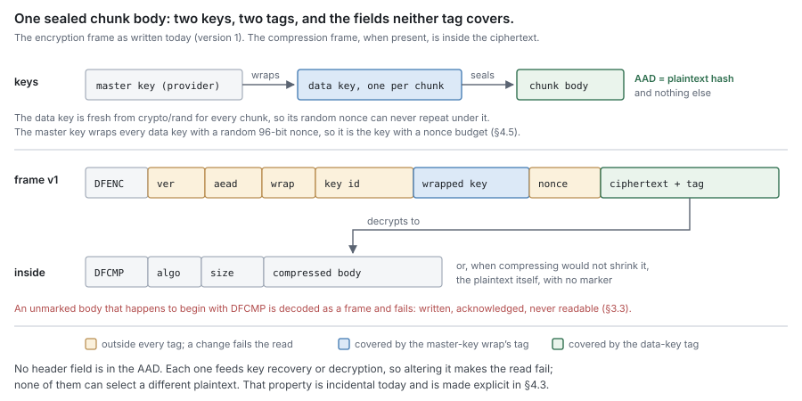

# RFC 9 — transforms: compression and encryption

**Status:** draft.
**Depends on:** [RFC 0](rfc-0-data-lifecycle.md), for the terms, the invariants and the failure model. [RFC 8](rfc-8-remote-tier.md)
owns the stored object and the contract-level rules for the transform chain
([§4](#4.%20Encryption) there); this document specifies the transforms that satisfy those rules.
[RFC 2](rfc-2-carver.md) owns identity, and nothing here changes what a chunk or a block is called.
**Audience:** anyone changing `pkg/block/middleware` or its key providers, the
chain's construction in `pkg/controlplane/runtime/shares`, or the transform
settings of a remote block store; and anyone deciding what a deployment that
enables encryption is actually protected against.

The key words **MUST**, **MUST NOT**, **SHOULD**, **SHOULD NOT** and **MAY** are
to be interpreted as in RFC 2119.

This document specifies what the transforms are required to be. It was written
from RFC 0, 2 and 8, not from the current packages. Where the implementation does
not satisfy a requirement, that is recorded once, in [§9](#9.%20Deviations), as a **deviation**, with
evidence. A deviation is a defect to be fixed or migrated, never a rule for an
implementer to build around. Where this document chooses a policy the set left
open, the choice is labelled **proposal**.

---

## In short

- A transform acts on one chunk's bytes, after identity is taken and before the
  record is framed. It never sees a block, and it never changes a name or a hash.
- The chain is compress, then encrypt. Every layer marks its own output, and a
  body that one layer cannot recognise is that layer's decision, never the chain's.
- Encryption is envelope encryption: a fresh data key per chunk, sealed with an
  AEAD whose additional data is the plaintext hash, wrapped under a master key the
  provider holds. Lose every copy of the master key and the data is gone.
- Encryption hides what the remote provider cannot already guess. It does **not**
  hide which chunks are equal, and today it does not hide the chunk hashes at all,
  so a provider holding a candidate file can confirm the deployment stores it.
- How an object was transformed travels with the object. Configuration says what
  the next write does and sets a floor on what a read accepts.
- The plaintext hash is checked once, inside the tier's verified read, after the
  whole chain is undone. No layer's own check stands in for it.

---

## 1. Purpose

[RFC 8 §4](rfc-8-remote-tier.md#4.%20The%20transform%20chain) says an implementation **MAY** compress and encrypt a chunk before it is
framed, and fixes four rules any such chain must obey. It does not say what the
transforms are, what their bytes look like, who holds the keys, what happens when
a key is unavailable, or what an attacker at the remote tier learns. This document
does.

### 1.1 Non-goals

This document **MUST NOT** be read as specifying:

- the block object, its preamble, its records or their headers — [RFC 8 §3](rfc-8-remote-tier.md#3.%20The%20stored%20object);
- a chunk's hash or a block's name — [RFC 2 §4](rfc-2-carver.md#4.%20Identity). Where [§5.4](#5.4%20Deduplication%20and%20confirmation%20trade%20against%20each%20other%20%28decision%20for%20discussion%29) proposes a secret in the
  key scope, it proposes an input to [RFC 2 §4.3](rfc-2-carver.md#4.3%20Key%20scope)'s scope, not a new naming rule;
- when a chunk is sealed, or whether a block is relocated — [RFC 6](rfc-6-engine.md) and [RFC 7](rfc-7-gc.md);
- protection of data in the journal, in metadata stores or in transit to the
  remote. Those are local disk, database and transport concerns. The journal holds
  plaintext, and metadata holds every chunk hash in the clear;
- authentication of clients, or access control between shares — [RFC 5](rfc-5-namespace-metadata.md) and the
  protocol adapters;
- a key-management service. The provider contract of [§4.4](#4.4%20A%20provider%20wraps%20under%20one%20current%20key%20and%20unwraps%20under%20any%20it%20holds) is what DittoFS needs
  from one, not a specification of one.

### 1.2 What RFC 8 keeps and what this document takes

[RFC 8 §4](rfc-8-remote-tier.md#4.%20The%20transform%20chain) states the contract; this document states the transforms. The division
is by who can check the rule. A rule a caller of the remote tier can observe
stays in [RFC 8](rfc-8-remote-tier.md). A rule only the transform's own bytes or keys can violate lives
here.

| Rule | Owner | Why there |
| --- | --- | --- |
| Seal and read are exact inverses | [RFC 8 §4.1](rfc-8-remote-tier.md#4.1%20Seal%20and%20read%20are%20exact%20inverses) | observable at the contract as a round trip |
| Identity is over plaintext | [RFC 8 §4.2](rfc-8-remote-tier.md#4.2%20Identity%20is%20over%20plaintext%2C%20at%20every%20layer), [RFC 2 §4](rfc-2-carver.md#4.%20Identity) | a naming rule; transforms only have to not break it |
| The chain travels with the object | [RFC 8 §4.3](rfc-8-remote-tier.md#4.3%20The%20chain%20travels%20with%20the%20object) | a property of the stored object |
| Nothing above the tier observes a transform | [RFC 8 §4.4](rfc-8-remote-tier.md#4.4%20The%20syncer%20MUST%20NOT%20observe%20that%20a%20transform%20happened) | a property of the contract's surface |
| Order, scope and framing of each layer | here, [§2](#2.%20The%20chain) | internal to the chain |
| Codec, marking, decompression bound | here, [§3](#3.%20Compression) | internal to one layer |
| Construction, frame, keys, rotation, failure | here, [§4](#4.%20Encryption) | internal to one layer and its provider |
| What the remote learns | here, [§5](#5.%20Threat%20model) | follows from all of the above plus [RFC 2 §6](rfc-2-carver.md#6.%20Boundaries%20are%20public) |
| What a configuration change does to stored data | here, [§6](#6.%20Configuration%20over%20time) | follows from [RFC 8 §4.3](rfc-8-remote-tier.md#4.3%20The%20chain%20travels%20with%20the%20object) plus [§4](#4.%20Encryption) |

[RFC 8 §4](rfc-8-remote-tier.md#4.%20The%20transform%20chain) **SHOULD** be reduced to its four rules and a pointer here ([§11](#11.%20Consequences%20for%20other%20RFCs)).

## 2. The chain

### 2.1 A transform is per chunk, and runs between identity and framing

A transform **MUST** take one chunk's plaintext and return one body, and **MUST**
be invertible from that body plus key material alone. It **MUST NOT** see a
block, a file, an offset or another chunk.

The sequence is fixed: the chunk's hash is taken over plaintext ([RFC 2 §4.1](rfc-2-carver.md#4.1%20A%20chunk)),
the chain seals the plaintext into a body, the body is framed as one record of a
block ([RFC 8 §3.2](rfc-8-remote-tier.md#3.2%20What%20the%20encoding%20must%20carry)), and the block is named from its chunks' hashes ([RFC 2 §4.2](rfc-2-carver.md#4.2%20A%20block)).
A transform therefore cannot influence identity, and **MUST NOT** try.

Per-chunk scope is what lets one chunk be read by opening one record ([RFC 8 §3.3](rfc-8-remote-tier.md#3.3%20What%20the%20format%20must%20guarantee)
F1) and lets one corrupt body lose one chunk rather than a block (F5). A
per-block transform would give up both to save a header per chunk. The same rule
forbids transforming a block a second time: the pipeline's block-keyed operations
forward untransformed because the records are already sealed
(`pkg/block/middleware/middleware.go:48`–`:56`), and that exemption **MUST** stay
tied to callers whose bodies came out of the chain.

### 2.2 The order is compress, then encrypt

The chain **MUST** compress before it encrypts, and open in the reverse order.

AEAD output is indistinguishable from random bytes and does not compress, so the
other order stores every body at full size plus overhead, silently: it round-trips
and produces no error. That is the only reason, and it is sufficient.

Compressing before encrypting has a known cost: the length of a compressed body
depends on its content, so the ciphertext length reveals how compressible each
chunk was. Against a remote provider this adds little to what [§5.2](#5.2%20The%20remote%20sees%20every%20chunk%27s%20hash%20today) already
concedes, because the chunk hashes and sizes leak more. Against an attacker who
can inject chosen content next to a secret in one chunk and watch sizes, it is a
compression side channel of the CRIME class. This document accepts it for a
storage system whose writers are the share's own clients, and records it in [§5.3](#5.3%20Encryption%20protects%20content%20the%20attacker%20cannot%20guess%2C%20and%20nothing%20else).

### 2.3 Every layer marks its output, and decides for itself what an unmarked body means

A layer **MUST** prefix everything it emits with a marker that identifies the
layer and its format version, unless it can prove no input can be mistaken for
its own output. A layer **MUST** state, at the code site, what it does with a
body that carries no marker, and why.

The pipeline **MUST NOT** decide this for the layers. The two layers today
disagree, correctly: compression reads an unmarked body as plaintext it chose not
to compress, and encryption rejects an unmarked body because on a store that
encrypts it can only mean tampering or a configuration that predates the object.
A shared "not mine, pass it through" rule in the pipeline would make encryption
fail open.

A layer that sometimes emits its input unchanged has no marker on those bodies,
and so cannot tell its own pass-through from its own frame when the plaintext
happens to begin with the marker. [§3.3](#3.3%20The%20stored%20case%20must%20be%20marked%20too) is that failure, measured.

### 2.4 A new layer brings a marker, a version and a fixture

A new layer **MUST**:

1. declare its position in the chain and the reason for it, in terms of what the
   neighbouring layers do to entropy and length;
2. mark every body it emits ([§2.3](#2.3%20Every%20layer%20marks%20its%20output%2C%20and%20decides%20for%20itself%20what%20an%20unmarked%20body%20means)), and state its unmarked-body policy;
3. carry a format version in its marker, and accept every version it may still
   encounter ([RFC 8 §3.5](rfc-8-remote-tier.md#3.5%20Format%20changes%20are%20migrations));
4. bound every length it reads from a body before allocating against it ([§3.4](#3.4%20Decompression%20is%20bounded%20before%20anything%20is%20allocated) is
   the pattern);
5. map every error it can raise onto [RFC 8 §5.2](rfc-8-remote-tier.md#5.2%20Errors%20are%20a%20closed%20set)'s closed set ([§4.7](#4.7%20Key%20loss%20is%20data%20loss%2C%20and%20key%20unavailability%20is%20remote%20unavailability));
6. ship a fixture written by the first version and read by every later one
   ([RFC 8 §9.3](rfc-8-remote-tier.md#9.3%20What%20must%20not%20stand%20in%20for%20the%20real%20thing)).

The chain's order is enforced today by the statement order of one function
(`pkg/controlplane/runtime/shares/blockstore_config.go:735`–`:745` records this
as a decision, with the test that pins it). That is adequate while one site builds
chains. A second site, or a layer whose misordering corrupts data rather than
wasting space, **MUST** give the order a type.

### 2.5 An absent chain is a construction failure, never plaintext

Where a store is configured to encrypt, a chain that cannot be built **MUST** fail
construction with an error naming the missing piece. It **MUST NOT** fall back to
uploading plaintext. [RFC 0 §1.2](rfc-0-data-lifecycle.md#1.2%20Component%20autonomy) forbids capability negotiation by type assertion
for this exact reason, and [RFC 6 §2.2](rfc-6-engine.md#2.2%20Capabilities%20are%20parameters%2C%20never%20assertions) names the site where a failed assertion on
the sealer makes the flush upload bodies unsealed ([§9](#9.%20Deviations), D11).

### 2.6 Nothing above the tier sees the chain

[RFC 8 §4.4](rfc-8-remote-tier.md#4.4%20The%20syncer%20MUST%20NOT%20observe%20that%20a%20transform%20happened) applies to every layer here. In particular a layer's errors **MUST NOT**
cross the contract as that layer's own types; [§4.7](#4.7%20Key%20loss%20is%20data%20loss%2C%20and%20key%20unavailability%20is%20remote%20unavailability) gives the mapping. A metric
that reports bytes transferred **MUST** count the bytes the backend moved, and a
metric that reports compression **MUST** be emitted from inside the chain, not
reconstructed above it.

## 3. Compression

### 3.1 The algorithm is recorded per body; the level is not

Compression **MUST** use a lossless codec whose decoder is deterministic and
bounded ([§3.4](#3.4%20Decompression%20is%20bounded%20before%20anything%20is%20allocated)). zstd at the library's default level is the default, and LZ4 is
accepted as a faster, weaker alternative
(`pkg/block/middleware/compression/policy.go:14`–`:20`).

The level is not recorded and **MUST NOT** need to be; the algorithm **MUST** be,
per body ([§3.2](#3.2%20Skip%20what%20does%20not%20shrink%2C%20and%20record%20what%20was%20done)), because a store's setting may change while its objects remain. A
codec **MAY** be added under a new algorithm value; an existing value **MUST NOT**
be reassigned.

### 3.2 Skip what does not shrink, and record what was done

Compression **MUST** emit the compressed frame only when the frame, header
included, is strictly smaller than the plaintext. Otherwise it **MUST** emit a
body that records that the chunk was stored uncompressed.

The record of what was applied is per body, not per object or per store, because
the decision is per chunk. It **MUST** carry the algorithm, and **MUST** carry the
declared plaintext length so that the decoder's output can be bounded and checked
([§3.4](#3.4%20Decompression%20is%20bounded%20before%20anything%20is%20allocated)).

### 3.3 The stored case must be marked too

Today the uncompressed case is not marked: the plaintext is emitted as-is
(`pkg/block/middleware/compression/decorator.go:65`–`:68`), and a read treats any
body beginning with the five bytes `DFCMP` and a known algorithm byte as a frame
(`frame.go:57`–`:74`, `decorator.go:77`–`:80`). So an incompressible chunk whose
plaintext starts with those bytes is written, acknowledged and made durable, and
then fails every read. Run against the shipped code: plaintext `DFCMP` `0x01`,
a uvarint, and 4 KiB of random bytes seals to itself and opens to
`compression: decode: invalid input: magic number mismatch`.

This violates [RFC 8 §4.1](rfc-8-remote-tier.md#4.1%20Seal%20and%20read%20are%20exact%20inverses), and it is data loss in [RFC 0](rfc-0-data-lifecycle.md)'s sense: metadata records
the chunk as durable and the bytes can never be read back, so the extent is
**Lost**. It is unlikely by accident and trivial on purpose: anyone who can write
a file can make it unreadable. Relocation does not repair
it, because it copies bodies verbatim ([§6.3](#6.3%20Relocation%20re-seals%20under%20the%20current%20chain)).

The requirement is [§2.3](#2.3%20Every%20layer%20marks%20its%20output%2C%20and%20decides%20for%20itself%20what%20an%20unmarked%20body%20means)'s: the stored case **MUST** carry a marker, for example
the same frame with an algorithm value meaning "stored". It costs a few bytes on
chunks that did not compress, which are already the chunks where a few bytes
matter least. Because objects written before the change contain unmarked bodies,
the change **MUST** be a format migration under [RFC 8 §3.5](rfc-8-remote-tier.md#3.5%20Format%20changes%20are%20migrations), and is the moment to
give the compression marker the version byte [§2.3](#2.3%20Every%20layer%20marks%20its%20output%2C%20and%20decides%20for%20itself%20what%20an%20unmarked%20body%20means) requires (`DFCMP` has none): an object must say,
in a place the reader consults before opening any body, whether its bodies are
all marked, and a reader **MUST** refuse an unmarked body in an object that says
they are.

### 3.4 Decompression is bounded before anything is allocated

A decoder is an interpreter of attacker-supplied input wherever the remote tier
is not trusted, which is the premise of encryption and a possibility without it.
Its output and its working memory **MUST** be bounded before decoding begins.

- The declared plaintext length **MUST** be checked against the largest chunk the
  deployment can produce — [RFC 2](rfc-2-carver.md)'s hard ceiling, 16 MiB today
  (`pkg/block/chunker/params.go:20`) — before any buffer is sized from it.
- The decoder's output **MUST** be cut off one byte past the declared length, and
  a length mismatch in either direction **MUST** fail the read.
- The decoder's own window and memory **MUST** be bounded by the same ceiling,
  not by the library's defaults.
- Where the caller knows the chunk's plaintext length from metadata, the declared
  length **SHOULD** also be required to equal it.

The present code does the second, and the first against a ceiling four times too
large: 64 MiB (`frame.go:24`), with the output buffer allocated at the declared
size before a byte is decoded (`decorator.go:102`), so a body of a few bytes
commits 64 MiB per concurrent read. The zstd decoder is built without a window or
memory limit (`codec.go:58`–`:61`), which leaves its bound at the library's
maximum window of 512 MiB. Neither is an exploit against a trusted bucket; both
are the amplification [§5.1](#5.1%20Encryption%20defends%20against%20the%20bucket%27s%20reader%20and%20detects%20its%20writer)'s A2 is given when encryption is off; with it on, the
compression frame is inside the ciphertext and the decoder is out of reach ([§4.3](#4.3%20The%20frame%20is%20a%20permanent%20format)).

## 4. Encryption

### 4.1 Every chunk gets its own data key

Encryption **MUST** be envelope encryption:

| Element | Requirement | Today |
| --- | --- | --- |
| Data key | 256 bits from a CSPRNG, fresh for every sealed chunk, never reused, never stored unwrapped | `encryption/decorator.go:52`–`:55` |
| AEAD | a 256-bit-key AEAD from a closed set named by a stable byte: AES-256-GCM (default), ChaCha20-Poly1305, XChaCha20-Poly1305 | `encryption/policy.go:16`–`:30`, `decorator.go:113`–`:143` |
| Nonce | the AEAD's full nonce size from a CSPRNG | `decorator.go:60`–`:63` |
| AAD | the chunk's 32-byte plaintext hash | `decorator.go:76`, `:103` |
| Wrap | the data key sealed under the provider's current master key | `decorator.go:65`; `keyprovider/local.go:283`–`:299` |
| Key ID | the identifier of the wrapping master key, carried in the frame | `decorator.go:72`, `frame.go:78`–`:80` |

Because a data key seals exactly one body, no nonce can repeat under it, and the
AEAD's nonce size does not matter at this layer. The master key is the key used
repeatedly, and [§4.5](#4.5%20The%20master%20key%20has%20a%20nonce%20budget) bounds it. The price is one wrap per chunk; both providers
wrap in process (the KMIP provider fetches its key at start and holds it,
`keyprovider/kmip.go:28`–`:44`), so a wrap is AES-GCM over 32 bytes. A provider
that wraps remotely puts a round trip per chunk on the flush path and **MUST** be
measured before it is adopted.

### 4.2 What the AAD binds, and what it does not

Binding the plaintext hash as AAD makes a body open only as the chunk it was
sealed for. A body moved to another chunk's locator — by a mis-keyed object, a
relocation bug, or an attacker splicing records — fails authentication before any
plaintext is released, whatever key material it carries.

It does **not** bind:

- **the object or position.** Two records with the same hash hold the same
  plaintext, so a body moved between them is harmless, and a body moved to a
  different hash fails. Name and position binding for record *headers* is
  [RFC 8 §3.2](rfc-8-remote-tier.md#3.2%20What%20the%20encoding%20must%20carry)'s, and applies only when headers are sealed ([§5.4](#5.4%20Deduplication%20and%20confirmation%20trade%20against%20each%20other%20%28decision%20for%20discussion%29));
- **the share, store or tenant.** A body sealed for one store opens in another
  that holds the same master key and asks for the same hash. Where two stores
  share a master key they share this, and [§6.1](#6.1%20The%20setting%20is%20per%20store%2C%20and%20so%20per%20share%20in%20effect) says why a deduplication scope must
  not cross a key boundary anyway;
- **the header fields.** [§4.3](#4.3%20The%20frame%20is%20a%20permanent%20format).

The hash in the AAD is not a verification. It proves the body was sealed for that
hash by a holder of the master key; it does not prove that decompressing what it
yields reproduces the hash. [§7](#7.%20Verification%3A%20after%20the%20whole%20chain%2C%20inside%20the%20tier%2C%20once) is the check.

### 4.3 The frame is a permanent format

A frame, once written, is read for as long as the object exists, and objects have
no rewrite point ([RFC 8 §3.5](rfc-8-remote-tier.md#3.5%20Format%20changes%20are%20migrations)). Version 1 is therefore specified exactly, because
it is on disk:

| Field | Encoding | Covered by | Effect of alteration |
| --- | --- | --- | --- |
| magic `DFENC` | 5 bytes | nothing | not recognised as a frame; rejected (`ErrCiphertextWithoutFrame`) |
| version | 1 byte, `0x01` | nothing | any other value rejected |
| AEAD | 1 byte, 1–3 | nothing | a different cipher under the same data key; the tag fails |
| wrap kind | 1 byte, `0x01` | nothing | any other value rejected |
| key ID | uvarint length ≤ 256, bytes | nothing | unwrap routes to another key or none; the wrap tag fails or `ErrWrongMasterKey` |
| wrapped key | uvarint length ≤ 4096, bytes: nonce ‖ AES-256-GCM(data key), AAD empty | the wrap's own tag | unwrap fails |
| nonce | 1-byte length ≤ 64, bytes | nothing | decryption with a wrong nonce; the tag fails |
| ciphertext ‖ tag | rest of the body | the data tag, AAD = hash | decryption fails |
| compression frame | inside the plaintext | the data tag | unreachable without the data key |

Sources: `encryption/frame.go:10`–`:43`, `:56`–`:89`, `:113`–`:177`;
`keyprovider/local.go:283`–`:320`.

**So: the header, the key ID and the AEAD byte are not authenticated; the
compression flag is, when encryption is on, and is not when it is off.** No
unauthenticated field can make a read return a plaintext other than the one
sealed, because each is an input to recovering the data key or running the
cipher, and each alteration ends in a failed tag. That is a property of this
field set, not a stated design: the AEAD byte is safe only because a tag computed
by one cipher fails under another, and the wrapped key is not bound to its key ID
or to its chunk (AAD empty at `local.go:297`), which is safe only because the data
tag then fails. Neither AES-GCM nor ChaCha20-Poly1305 commits to its key.

A version 2 frame **MUST** make the property explicit rather than incidental: the
data AAD **MUST** cover the version, the AEAD byte, the key ID and the hash, and
the wrap's AAD **MUST** cover the key ID and the AEAD byte. Version 1 **MUST**
remain readable for as long as any object holds it ([§6.4](#6.4%20Leaving%20a%20key%20needs%20a%20census%20and%20a%20name)), and **MUST NOT** be
written once version 2 exists.

Every length field **MUST** be bounded before use; version 1 does so
(`frame.go:24`–`:37`, `:136`–`:171`).

### 4.4 A provider wraps under one current key and unwraps under any it holds

A provider holds master keys. It **MUST**:

- wrap a data key under exactly one **current** master key, and return that key's
  identifier with the wrapped bytes;
- unwrap under the key the frame names, whether current or **retired**, and fail
  with a distinguishable error when it holds no key of that name;
- never wrap under a retired key;
- refuse at construction two keys claiming one identifier, because an unwrap would
  then pick one at random (`keyprovider/retired.go:39`–`:50` does);
- be safe for concurrent use, and hold no state that spans operations beyond its
  keys ([RFC 8 §5.7](rfc-8-remote-tier.md#5.7%20A%20backend%20holds%20no%20state%20that%20spans%20operations) applies by analogy: a provider carries no retry budget or
  health flag of its own);
- make its identifiers stable and never reuse one for different material.

It **SHOULD** hold key material for as short a time and in as few copies as the
platform allows. Both current providers hold master keys in process memory for the
process's lifetime and zero them on close as a best effort (`local.go:322`–`:330`);
a compromise of the process address space recovers them. A provider that performs
the wrap inside an HSM **MAY** replace that without changing the contract.

### 4.5 The master key has a nonce budget

The master key wraps one data key per chunk with AES-256-GCM under a random 96-bit
nonce. NIST SP 800-38D limits a key used with random 96-bit nonces to 2^32
invocations, which holds the chance of any repeat near 2^-32. A single repeat
reveals the XOR of two wrapped data keys and lets an attacker recover the GCM
authentication key, and so forge wraps.

A provider **MUST** stop wrapping under a master key before 2^32 wraps, and
**MUST** make the count observable. The code comment at `keyprovider/local.go:70`
–`:72` cites the ~2^48 birthday point as the safe limit, which is the point where
a collision is *likely*, not where it becomes unacceptably probable. At DittoFS's
~1 MiB chunk target, 2^32 wraps is about 4 PiB of novel content under one master
key — far off for most deployments, and a limit nobody counts is a limit nobody
enforces. A wrap with no nonce budget (AES-KW, AES-GCM-SIV) removes the question
and is a version 2 option.

### 4.6 Rotation re-seals; it does not rewrite in place

Rotation replaces the current master key and keeps the old one as retired, so new
chunks wrap under the new key and existing frames remain readable. This much
exists (`keyprovider/provider.go:11`–`:17`).

Retiring a key is not the same as ceasing to depend on it. An old frame needs its
key for as long as the frame exists. Two ways off a key exist:

| | Re-wrap | Re-seal |
| --- | --- | --- |
| What changes | the wrapped key and key ID in each frame | the whole body, under a fresh data key |
| Protects against | loss or retirement of the old master key | the above, and exposure of old data keys |
| Cost | rewrites every object anyway: objects are immutable, and a changed header moves every later offset | reads, decrypts and re-encrypts every body |
| Mechanism | none | relocation ([§6.3](#6.3%20Relocation%20re-seals%20under%20the%20current%20chain)) |

Because an object store cannot patch bytes, re-wrap saves only the decrypt and
encrypt CPU of a rewrite it cannot avoid. **This document specifies re-seal as
the only migration off a key**, performed by relocation. Re-wrap is not
specified and **SHOULD NOT** be built unless re-seal's CPU is measured as the
bottleneck.

A re-sealed body **MUST NOT** overwrite the object it came from. A locator names a
byte offset and length within an object ([RFC 8 §3.3](rfc-8-remote-tier.md#3.3%20What%20the%20format%20must%20guarantee) F1), and a re-sealed object
does not keep its predecessor's offsets; overwriting under the same name leaves
every reader and every committed locator pointing into different bytes. [§6.4](#6.4%20Leaving%20a%20key%20needs%20a%20census%20and%20a%20name)
records the naming consequence.

A retired key **MAY** be dropped only when a census shows no stored frame names it
([§6.4](#6.4%20Leaving%20a%20key%20needs%20a%20census%20and%20a%20name)). Until then it **MUST** stay configured.

### 4.7 Key loss is data loss, and key unavailability is remote unavailability

**Every chunk sealed under a master key is unreadable without that key.** There is
no recovery path, by design: a recovery path is a second key. A deployment that
loses every copy of a master key has lost every chunk wrapped under it, and the
extents naming those chunks are **Lost** in [RFC 0 §4.2](rfc-0-data-lifecycle.md#4.2%20The%20residency%20function)'s sense — metadata records
them durable and their bytes cannot be produced. Backing up master keys is the
operator's obligation; this document can only make the dependency visible.

Failure behaviour maps onto [RFC 0 §10](rfc-0-data-lifecycle.md#10.%20Failure%20model) as follows. The key provider is part of the
remote tier for this purpose, because nothing can be made durable or read back
without it.

| Condition | Behaviour | [RFC 0](rfc-0-data-lifecycle.md) row |
| --- | --- | --- |
| Provider unavailable when a chunk is sealed | the seal fails; the flush fails; every affected extent stays **Dirty** and is retried. Never uploaded unsealed ([§2.5](#2.5%20An%20absent%20chain%20is%20a%20construction%20failure%2C%20never%20plaintext)). | remote tier unavailable |
| Provider unavailable when a body is opened | the read fails. **MUST NOT** return zeros (I1). | remote tier unavailable |
| Frame names a key the provider does not hold | the read fails as a verification failure, not as an absent object, so [RFC 6 §6.7](rfc-6-engine.md#6.7%20An%20absent%20object%20is%20re-resolved%20exactly%20once)'s re-resolution does not apply | local content corrupt, by analogy: the extent resolves **Lost** until the key returns |
| AEAD or wrap tag fails | verification failure: fail, count, never retry as absent | same |
| Provider unavailable at start | the share **MUST** attach its journal and serve what the journal holds; flush and remote reads fail as above until the provider returns, and **MUST** recover without restart ([RFC 0 §10.2](rfc-0-data-lifecycle.md#10.2%20No%20state%20requires%20intervention%20to%20leave)) | remote tier unavailable |
| Master key lost permanently | the chunks it wrapped are **Lost** | — |

Each of these **MUST** be reported as a health condition of the share, not only as
a log line ([RFC 0 §10.2](rfc-0-data-lifecycle.md#10.2%20No%20state%20requires%20intervention%20to%20leave)). Every error in this table **MUST** reach callers of the
remote tier as one of [RFC 8 §5.2](rfc-8-remote-tier.md#5.2%20Errors%20are%20a%20closed%20set)'s named errors — a tag or unwrap failure as a
verification failure, provider unavailability as the backend having failed — and
not as a transform's own type ([RFC 8 §4.4](rfc-8-remote-tier.md#4.4%20The%20syncer%20MUST%20NOT%20observe%20that%20a%20transform%20happened)).

## 5. Threat model

### 5.1 Encryption defends against the bucket's reader and detects its writer

| Attacker | Can | Encryption's claim |
| --- | --- | --- |
| **A1** the remote provider, or anyone with read access to the bucket | read every object, its name, size and write time; see access patterns | confidentiality of content the attacker cannot already guess ([§5.3](#5.3%20Encryption%20protects%20content%20the%20attacker%20cannot%20guess%2C%20and%20nothing%20else)) |
| **A2** as A1, plus write access | alter, replace, delete, replay or withhold objects | detection: no altered body is served ([§4.2](#4.2%20What%20the%20AAD%20binds%2C%20and%20what%20it%20does%20not), [§7](#7.%20Verification%3A%20after%20the%20whole%20chain%2C%20inside%20the%20tier%2C%20once)). Not availability: deletion and withholding are loss |
| **A3** a client of another share on the same deployment | write chosen content; observe timing and space | none — this is the dedup channel of [§5.4](#5.4%20Deduplication%20and%20confirmation%20trade%20against%20each%20other%20%28decision%20for%20discussion%29) |
| **A4** the DittoFS host | everything | none. Keys are in its memory ([§4.4](#4.4%20A%20provider%20wraps%20under%20one%20current%20key%20and%20unwraps%20under%20any%20it%20holds)) |

Encryption in this document is a defence against A1 and a detector for A2.

### 5.2 The remote sees every chunk's hash today

| Observable | Source | What it reveals |
| --- | --- | --- |
| Chunk hashes, in every record header | record headers are plaintext on every store, encrypted or not: the header sealer is `nil` at both call sites (`engine/flush.go:404`–`:405`, `gc/compaction.go:276`) | the BLAKE3 of every chunk's plaintext |
| Chunk and body lengths | record headers; ciphertext length | each chunk's size, and with compression, how compressible it was |
| Object names | [RFC 2 §4.2](rfc-2-carver.md#4.2%20A%20block) once derived; random today ([RFC 2 §4.2.1](rfc-2-carver.md#4.2.1%20Deviation%20%E2%80%94%20a%20block%27s%20identity%20is%20generated%2C%20in%20two%20places)) | once derived and unkeyed, a function of chunk hashes anyone can compute |
| Object sizes and counts | the bucket | the chunk-size fingerprint of [RFC 2 §6](rfc-2-carver.md#6.%20Boundaries%20are%20public) |
| Equal content | a second put of an existing name; identical chunk hashes across objects | that two writes carried the same content |
| Key IDs | the frame | how many master keys, and which objects predate a rotation |
| Timing | puts, gets, deletes | activity, and which content is read back |

The first row decides the rest. Chunk boundaries are public ([RFC 2 §6](rfc-2-carver.md#6.%20Boundaries%20are%20public)) and the hash
is unkeyed, so **anyone holding a candidate file can chunk it, hash the chunks and
search the bucket for those hashes**. A match confirms the file is stored. Encryption
as built does not prevent this, and does not slow it down: the hashes are not even
inside the ciphertext.

### 5.3 Encryption protects content the attacker cannot guess, and nothing else

It protects the content of chunks the attacker cannot enumerate: documents,
databases, anything with enough private entropy per chunk. Against A1 that content
is as confidential as the master key.

It does not protect:

- **membership** — whether a known file, or a known chunk of one, is stored ([§5.2](#5.2%20The%20remote%20sees%20every%20chunk%27s%20hash%20today));
- **low-entropy content** — a chunk drawn from a small set of possibilities (a form
  with one field, a configuration file with one secret) can be confirmed by hashing
  each candidate, which is the same attack at chunk granularity;
- **equality** — which chunks and objects repeat, within and across shares;
- **size and shape** — per chunk, per object, and per compressed body ([§2.2](#2.2%20The%20order%20is%20compress%2C%20then%20encrypt));
- **availability or freshness** — A2 can delete an object or serve an old one. An
  old object under the same name holds the same chunks ([RFC 2 §4.2](rfc-2-carver.md#4.2%20A%20block)), so replay of a
  derived name is harmless; deletion is loss, and is outside what encryption can do.

### 5.4 Deduplication and confirmation trade against each other (decision for discussion)

Content-addressed deduplication requires equal plaintext to produce an equal
identifier. Any identifier an outsider can compute from plaintext enables
confirmation. The question is who can compute it.

| Option | Remote sees | Dedup scope | Cost |
| --- | --- | --- | --- |
| **O1** status quo | plaintext chunk hashes in every object | whatever the key scope allows | confirmation of any known file or low-entropy chunk, by anyone with bucket read access |
| **O2** seal record headers and key the block name *(proposal)* | sealed headers; names under a per-deployment secret | unchanged | one AEAD open per record when a block is parsed; a naming secret to hold |
| **O3** keyed chunk identity per tenant | keyed hashes | per tenant only | [RFC 2 §4.1](rfc-2-carver.md#4.1%20A%20chunk) amended; cross-tenant dedup lost; the key can never rotate, because it is the identity |
| **O4** convergent encryption | as O1 | global | nothing gained against confirmation: it is the O1 leak by construction |

**Proposal: O2.** When a store encrypts:

1. record headers **MUST** be sealed ([RFC 8 §3.2](rfc-8-remote-tier.md#3.2%20What%20the%20encoding%20must%20carry) already provides the form, binding
   the object name and record index as AAD), under a key the provider derives for
   the store, so an object no longer shows its chunks' hashes;
2. the block name's key scope ([RFC 2 §4.3](rfc-2-carver.md#4.3%20Key%20scope)) **MUST** include a per-deployment secret
   the provider holds, so the remote cannot compute a name from a candidate file.

This keeps identity over plaintext ([RFC 2 §4.1](rfc-2-carver.md#4.1%20A%20chunk) is untouched; the chunk hash stays
plain in metadata, which is local and outside this threat model) and keeps every
dedup [RFC 6 §5.4](rfc-6-engine.md#5.4%20A%20block%27s%20name%20is%20derived%20here)'s key scope allows. It is compatible with [RFC 4 §2.6](rfc-4-block-metadata.md#2.6%20The%20scope%20of%20a%20count), which
already puts the store's identity in the name. The naming secret is not needed to
read — names are recorded in metadata — so its loss costs future idempotency, not
data. It **MUST NOT** be rotated, because a rotated scope changes the name of a
block between attempts ([RFC 2 §4.3](rfc-2-carver.md#4.3%20Key%20scope)); unlike a master key, nothing is exposed by
leaving it in place except the O1 leak it was introduced to close.

What O2 does not close: sizes and counts ([RFC 2 §6](rfc-2-carver.md#6.%20Boundaries%20are%20public) names randomised assembly as the
partial mitigation, [RFC 6 §14.3](rfc-6-engine.md#14.%20Open%20questions) leaves it open), equality visible as a repeated put
of one name, and timing. O2 therefore turns "anyone with a candidate file can
confirm it" into "a remote observer can see that content repeats and how large it
is". Whether that residue is acceptable is the question this section puts, and it
is a product decision rather than a measurement.

O3 is the answer if the residue is not acceptable, and its cost is permanent: the
identity key becomes the one key in the system that can never rotate or be lost
without rewriting the corpus.

## 6. Configuration over time

### 6.1 The setting is per store, and so per share in effect

The chain is configured on a remote block store configuration, and every share
that references that configuration inherits it (`docs/guide/configuration.md:819`
–`:820`; `runtime/shares/blockstore_config.go:686`–`:706`, where the store is built
once and ref-counted). A share's chain is therefore its store's. A share that needs
its own key references its own store configuration.

**Proposal:** keep it so, and do not add a per-share override. A deduplication
scope **MUST NOT** span two master keys, because a chunk deduplicated across them
is readable only under the key that sealed it, so one share's reads would depend on
another share's key. [RFC 6 §5.4](rfc-6-engine.md#5.4%20A%20block%27s%20name%20is%20derived%20here)'s proposal scopes names to one metadata store, and
one store configuration per key keeps both boundaries in one place.

### 6.2 A setting change governs the next write, never a past one

[RFC 8 §4.3](rfc-8-remote-tier.md#4.3%20The%20chain%20travels%20with%20the%20object) requires the chain to be recoverable from the object, which has two
consequences. A reader **MUST** hold a decoder for every layer kind it may
encounter, whatever is configured for writing; only key material depends on
configuration. And configuration **MUST** describe the next write, not
past ones — except for one floor: a store that has encrypted **MUST NOT** accept an
unencrypted body for a block written while encryption was on, because a body that
declares itself unencrypted is exactly what A2 would write.

**Proposal:** block metadata records, per block, whether its bodies were sealed and
under which key IDs ([RFC 4](rfc-4-block-metadata.md), [§11](#11.%20Consequences%20for%20other%20RFCs)). That record is trusted — it is local — and gives
the floor a per-block answer instead of a per-store one, and gives [§6.4](#6.4%20Leaving%20a%20key%20needs%20a%20census%20and%20a%20name)'s census an
index.

| Change | Existing objects | Required behaviour |
| --- | --- | --- |
| Enable compression | unmarked bodies | read as plaintext; new writes compressed |
| Change algorithm | frames name their algorithm | readable; new writes use the new one |
| Disable compression | framed bodies | **MUST** stay readable: decoders are not configuration |
| Enable encryption | plaintext bodies | **MUST** stay readable where metadata records the block unsealed; new blocks sealed |
| Rotate master key | frames name the retired key | readable while it is configured ([§4.6](#4.6%20Rotation%20re-seals%3B%20it%20does%20not%20rewrite%20in%20place)) |
| Change AEAD | frames name their AEAD | readable; new writes use the new one |
| Disable encryption | sealed bodies | readable while keys are configured; new writes plain. **SHOULD** be refused unless the operator states the new blocks may be stored in the clear |

Today three of these rows fail ([§9](#9.%20Deviations), D6): disabling compression makes every
compressed body fail verification, enabling encryption makes every existing body
unreadable, and disabling encryption is refused rather than supported.

### 6.3 Relocation re-seals under the current chain

[RFC 7 §4.2](rfc-7-gc.md#4.2%20Read%20verified%2C%20name%20by%20content%2C%20put%2C%20then%20move) relocates by reading each live chunk through the verified read and
putting a new block, and forbids GC from framing, sealing or parsing an object
itself. Read through the tier, a chunk arrives as plaintext; put through the tier,
it is sealed under the current chain. **Relocation is therefore the migration
path**: each relocated chunk leaves its old codec, AEAD and key behind.

This is required, not incidental. A relocation that copies sealed bodies verbatim
keeps every retired key in use for as long as the chunk lives, so no key can ever
be dropped, and propagates any body that was sealed wrong ([§3.3](#3.3%20The%20stored%20case%20must%20be%20marked%20too)). Today's
relocation does exactly that ([§9](#9.%20Deviations), D7).

### 6.4 Leaving a key needs a census and a name

To drop a retired key, an implementation **MUST** be able to answer "which blocks
still hold a frame under key *K*" without reading every object, and **MUST**
relocate each of them. Two gaps stand in the way.

- **The census.** No index exists; the answer today is a scan of every object's
  frames. [§6.2](#6.2%20A%20setting%20change%20governs%20the%20next%20write%2C%20never%20a%20past%20one)'s per-block record is the proposed index.
- **The name.** [RFC 7 §4.4](rfc-7-gc.md#4.4%20When%20to%20relocate%20is%20policy) forbids relocating a block whose chunks are all live,
  and [RFC 2 §4.2](rfc-2-carver.md#4.2%20A%20block) would give a re-sealed copy of such a block its old name, which
  [§4.6](#4.6%20Rotation%20re-seals%3B%20it%20does%20not%20rewrite%20in%20place) forbids overwriting. Re-keying a fully live block therefore needs both an
  exception in [RFC 7](rfc-7-gc.md) and a different name. The candidates are to include a seal
  epoch in the key scope — which makes a rotation between an upload and its retry
  orphan the first attempt, collectable by [RFC 7 §5](rfc-7-gc.md#5.%20Unrecorded%20objects) — or to relocate such blocks
  together with others so membership changes. Left open ([§12](#12.%20Open%20questions)).

## 7. Verification: after the whole chain, inside the tier, once

The plaintext hash **MUST** be recomputed over the output of the last layer opened
and compared with the hash the caller supplied, before any byte is returned. This
is [RFC 8 §6.1](rfc-8-remote-tier.md#6.1%20The%20exported%20read%20takes%20the%20expected%20hash)'s verified read; this section says where in the chain it sits.

- It **MUST** follow the whole chain, because only the final plaintext is in the
  hash's domain. No layer holds both the wire bytes and the plaintext domain.
- The AEAD tag **MUST NOT** stand in for it. A tag proves the body was sealed for
  that hash ([§4.2](#4.2%20What%20the%20AAD%20binds%2C%20and%20what%20it%20does%20not)); it does not prove the decompressor reproduced it, and a
  compression-only chain has no tag at all.
- The decompressor's own length check **MUST NOT** stand in for it either.
- It **MUST** happen inside the tier, so that every consumer inherits it: the
  engine's fetch, relocation, and snapshot verification.

Today it is performed by each consumer above the tier: the engine
(`engine/fetch.go:337`–`:351`) and snapshot verification (`snapshot/verify.go:58`
–`:70`), each recomputing BLAKE3 after `ReadChunk`. Relocation performs neither:
it checks a whole-object hash against the block record (`gc/compaction.go:217`–
`:222`) and never opens the chain, so a body that was sealed wrong passes. [RFC 8](rfc-8-remote-tier.md)
[§6.1](rfc-8-remote-tier.md#6.1%20The%20exported%20read%20takes%20the%20expected%20hash) is unmet: the check is correct where a consumer remembers it and absent where
one does not.

A verification failure **MUST** be counted, **MUST** fail the read, and **MUST
NOT** be retried as an absent object ([RFC 6 §6.7](rfc-6-engine.md#6.7%20An%20absent%20object%20is%20re-resolved%20exactly%20once)).

## 8. Invariants

| # | Invariant |
| --- | --- |
| T1 | A transform never changes a chunk's hash or a block's name, and never sees more than one chunk. |
| T2 | `open(seal(p)) == p` for every plaintext, including plaintext that begins with any layer's marker. |
| T3 | Compression runs before encryption, and opening runs in reverse. |
| T4 | Every body a layer emits carries its marker; an unmarked body's meaning is decided by that layer alone. |
| T5 | No length read from a body is used to allocate before it is bounded by the chunk ceiling. |
| T6 | A data key seals exactly one chunk body. |
| T7 | A master key wraps fewer than 2^32 data keys. |
| T8 | A frame opens only under the hash it was sealed for, and no alteration of a frame yields a different plaintext. |
| T9 | Where a store encrypts, no body leaves the host unsealed. |
| T10 | How a body was transformed is recoverable from the body; configuration sets only the next write and the floor. |
| T11 | The plaintext hash is verified after the whole chain, before any byte is returned. |
| T12 | A key failure never produces zeros, and never reads as an absent object. |

T2, T9 and T11 are the ones whose violation loses or exposes data. T2, T5, T7,
T10 and T11 fail today ([§9](#9.%20Deviations)).

## 9. Deviations

Evidence verified against the tree. D1 was also reproduced by running the shipped
compression stage.

| # | Requirement | Deviation | Evidence |
| --- | --- | --- | --- |
| D1 | [§3.3](#3.3%20The%20stored%20case%20must%20be%20marked%20too), T2 | An incompressible chunk beginning with `DFCMP` and a valid algorithm byte is stored unmarked and read as a frame: acknowledged, durable, never readable. **Data loss.** | `compression/decorator.go:65`–`:68`, `:77`–`:80`; `compression/frame.go:57`–`:74` |
| D2 | [§3.4](#3.4%20Decompression%20is%20bounded%20before%20anything%20is%20allocated), T5 | The declared-size ceiling is 64 MiB against a 16 MiB chunk maximum; the output buffer is allocated at the declared size before decoding; the zstd decoder has no window or memory bound. | `compression/frame.go:24`; `compression/decorator.go:84`, `:102`; `compression/codec.go:58`–`:61`; `chunker/params.go:20` |
| D3 | [§5.2](#5.2%20The%20remote%20sees%20every%20chunk%27s%20hash%20today), [§5.4](#5.4%20Deduplication%20and%20confirmation%20trade%20against%20each%20other%20%28decision%20for%20discussion%29) | Record headers — the plaintext hash of every chunk — are unsealed on every store, encrypted or not. Encryption does not prevent confirmation of a known file. | `engine/flush.go:404`–`:405`; `gc/compaction.go:276`; `blockcodec/codec.go:219`–`:223` |
| D4 | [§4.3](#4.3%20The%20frame%20is%20a%20permanent%20format) | No frame field is in the data AAD, and the wrap's AAD is empty. Safe today only because each field feeds key recovery or the cipher; not a stated property. | `encryption/decorator.go:76`, `:103`; `keyprovider/local.go:297`, `:315` |
| D5 | [§4.5](#4.5%20The%20master%20key%20has%20a%20nonce%20budget), T7 | The master key's nonce budget is stated as ~2^48 and nothing counts wraps. | `keyprovider/local.go:70`–`:72`, `:283`–`:299` |
| D6 | [§6.2](#6.2%20A%20setting%20change%20governs%20the%20next%20write%2C%20never%20a%20past%20one), T10 | Decoders exist only for configured layers, so disabling compression fails every compressed body; enabling encryption rejects every existing body; disabling encryption is refused. Only the last is guarded. | `runtime/shares/blockstore_config.go:754`–`:789`; `encryption/decorator.go:86`–`:88`; `internal/controlplane/api/handlers/block_stores.go:255`–`:261` |
| D7 | [§6.3](#6.3%20Relocation%20re-seals%20under%20the%20current%20chain), [§4.6](#4.6%20Rotation%20re-seals%3B%20it%20does%20not%20rewrite%20in%20place) | Relocation copies sealed bodies verbatim and never opens the chain, so no retired key can ever be dropped and no mis-sealed body is caught. | `gc/compaction.go:217`–`:222`, `:265`–`:285` |
| D8 | [§4.7](#4.7%20Key%20loss%20is%20data%20loss%2C%20and%20key%20unavailability%20is%20remote%20unavailability) | A provider failure at start fails the share's whole block store, journal included, with no recovery short of re-attaching; a retired key that fails to load is logged and skipped, with no health condition. | `runtime/shares/blockstore_config.go:275`–`:279`, `:779`–`:781`; `keyprovider/retired.go:17`–`:23`, `:31`–`:35` |
| D9 | [§2.6](#2.6%20Nothing%20above%20the%20tier%20sees%20the%20chain), [§4.7](#4.7%20Key%20loss%20is%20data%20loss%2C%20and%20key%20unavailability%20is%20remote%20unavailability) | Transform errors cross the tier as their own types (`ErrDecryptAuth`, `ErrWrongMasterKey`, `ErrCompressedFrameCorrupt`), so a caller can tell a chain is configured. | `middleware/middleware.go:119`–`:133`; `encryption/errors.go:5`–`:26`; `keyprovider/provider.go:95`–`:107` |
| D10 | [§7](#7.%20Verification%3A%20after%20the%20whole%20chain%2C%20inside%20the%20tier%2C%20once), T11 | The plaintext hash is verified by each consumer above the tier, not inside it. | `engine/fetch.go:337`–`:351`; `snapshot/verify.go:58`–`:70` |
| D11 | [§2.5](#2.5%20An%20absent%20chain%20is%20a%20construction%20failure%2C%20never%20plaintext), T9 | The flush finds its sealer by type assertion, and a nil sealer frames bodies unsealed. Recorded by [RFC 6 §12](rfc-6-engine.md#12.%20Deviations); repeated here because it is this document's T9. | `engine/syncer.go:263`–`:267`; `engine/flush.go:418`–`:424` |

D1 and D3 are the security findings. D1 is a data-loss defect any writer can
trigger for their own data. D3 means a deployment that enables encryption believing
it hides what it stores is wrong about the most direct question an observer can
ask. D4 and D5 are latent: neither is exploitable today, and both are the kind of
property that stops holding when a neighbouring change assumes it was designed.

These deviations **MUST NOT** be closed by amending the requirement they fail.

## 10. Conformance

[RFC 1 §11](rfc-1-journal.md#11.%20Conformance) applies: conformance is every **MUST** holding, the checks below are
evidence for the ones that fail silently, and a check is validated by reverting the
code and watching it fail on its own assertion.

### 10.1 Group A — loss or exposure

| Requirement | Check |
| --- | --- |
| [§3.3](#3.3%20The%20stored%20case%20must%20be%20marked%20too), T2 | Seal and open an incompressible chunk that begins with each layer's marker and a valid next byte; assert byte equality. Fails today. |
| [§4.2](#4.2%20What%20the%20AAD%20binds%2C%20and%20what%20it%20does%20not), T8 | Seal chunk *a*, present its body under hash *b*; assert the open fails and returns no byte. Flip every header field in turn; assert every open fails. |
| [§4.3](#4.3%20The%20frame%20is%20a%20permanent%20format) | Read a version 1 frame written by a fixture from the first release that wrote it, under every later build. A round trip in one build does not stand in. |
| [§2.5](#2.5%20An%20absent%20chain%20is%20a%20construction%20failure%2C%20never%20plaintext), T9 | Build a store configured to encrypt with the sealer made unavailable; assert construction fails. Assert no stored body on an encrypting store lacks the frame marker. |
| [§4.7](#4.7%20Key%20loss%20is%20data%20loss%2C%20and%20key%20unavailability%20is%20remote%20unavailability), T12 | Remove a retired key; read a chunk under it; assert the read fails, is not re-resolved as absent, and raises a health condition. A fake provider alone does not count: it cannot fail the way a KMIP server or a missing key file does. |
| [§6.3](#6.3%20Relocation%20re-seals%20under%20the%20current%20chain) | Relocate a block sealed under a retired key; assert the new block's frames name the current key, and that the retired key can then be removed with every chunk still readable. |
| [§7](#7.%20Verification%3A%20after%20the%20whole%20chain%2C%20inside%20the%20tier%2C%20once), T11 | With a chain that decrypts and decompresses successfully to wrong bytes (a fake layer), assert every consumer's read fails. |
| [§5.4](#5.4%20Deduplication%20and%20confirmation%20trade%20against%20each%20other%20%28decision%20for%20discussion%29) (once adopted) | Hash a known file's chunks; assert none appears in any stored object's bytes. |

### 10.2 Group B — drift and resource bounds

| Requirement | Check |
| --- | --- |
| [§3.4](#3.4%20Decompression%20is%20bounded%20before%20anything%20is%20allocated), T5 | Present a frame declaring 1 GiB and one declaring the ceiling plus one; assert both fail before allocating. Present a zstd frame declaring a maximal window; assert the decoder refuses it. |
| [§4.5](#4.5%20The%20master%20key%20has%20a%20nonce%20budget), T7 | Assert the wrap count is observable and that wrapping refuses at the budget, using a provider whose budget is set low. |
| [§2.6](#2.6%20Nothing%20above%20the%20tier%20sees%20the%20chain), D9 | Force each transform failure; assert the error crossing the tier is one of [RFC 8 §5.2](rfc-8-remote-tier.md#5.2%20Errors%20are%20a%20closed%20set)'s names. |
| [§6.2](#6.2%20A%20setting%20change%20governs%20the%20next%20write%2C%20never%20a%20past%20one) | Store content under each setting in [§6.2](#6.2%20A%20setting%20change%20governs%20the%20next%20write%2C%20never%20a%20past%20one)'s table, change the setting, and read all of it back. [RFC 8 §9.1](rfc-8-remote-tier.md#9.1%20Group%20A%20%E2%80%94%20silent%20data%20loss)'s cross-setting check is this row for compression. |
| [§2.2](#2.2%20The%20order%20is%20compress%2C%20then%20encrypt), T3 | The existing check that calls the construction site and asserts the stage order stays; a check that builds its own stages does not count (`blockstore_config.go:735`–`:745`). |

## 11. Consequences for other RFCs

| RFC | Change |
| --- | --- |
| [RFC 0 §1.1](rfc-0-data-lifecycle.md#1.1%20The%20component%20set) | Add the row: **9** · transforms · the per-chunk transform chain, its formats, and the key provider contract · object framing and names ([RFC 8](rfc-8-remote-tier.md), [RFC 2](rfc-2-carver.md)); when to seal or relocate ([RFC 6](rfc-6-engine.md), [RFC 7](rfc-7-gc.md)). Unlike the remote tier ([RFC 8 §1.2](rfc-8-remote-tier.md#1.2%20Why%20this%20is%20a%20contract%20and%20not%20a%20component)), the chain holds state that outlives an operation — master keys, the retired set, the naming secret — so it is a component. |
| [RFC 0 §10](rfc-0-data-lifecycle.md#10.%20Failure%20model) | Add a row: key provider unavailable, or key missing, as mapped in [§4.7](#4.7%20Key%20loss%20is%20data%20loss%2C%20and%20key%20unavailability%20is%20remote%20unavailability). State in [§4.2](#4.2%20What%20the%20AAD%20binds%2C%20and%20what%20it%20does%20not)'s text that a chunk whose key is lost is **Lost**. |
| [RFC 2 §6](rfc-2-carver.md#6.%20Boundaries%20are%20public) | Point here: encryption does not close the known-file channel ([§5.2](#5.2%20The%20remote%20sees%20every%20chunk%27s%20hash%20today)), and O2 ([§5.4](#5.4%20Deduplication%20and%20confirmation%20trade%20against%20each%20other%20%28decision%20for%20discussion%29)) is the layer that narrows it. |
| [RFC 2 §4.3](rfc-2-carver.md#4.3%20Key%20scope) | If O2 is adopted, the key scope includes a per-deployment secret that never rotates. |
| [RFC 4](rfc-4-block-metadata.md) | If [§6.2](#6.2%20A%20setting%20change%20governs%20the%20next%20write%2C%20never%20a%20past%20one)'s proposal is adopted, a block record carries whether its bodies are sealed and under which key IDs. That record is advisory for the census and authoritative for the downgrade floor. |
| [RFC 6 §2.1](rfc-6-engine.md#2.1%20The%20engine%20is%20the%20composition%20root%2C%20and%20the%20only%20one), [§8](rfc-6-engine.md#8.%20Health%20and%20failure) | A store whose provider is unavailable at start attaches its journal and reports remote-unavailable health ([§4.7](#4.7%20Key%20loss%20is%20data%20loss%2C%20and%20key%20unavailability%20is%20remote%20unavailability), D8). |
| [RFC 7 §4.2](rfc-7-gc.md#4.2%20Read%20verified%2C%20name%20by%20content%2C%20put%2C%20then%20move) | State that relocation re-seals under the current chain ([§6.3](#6.3%20Relocation%20re-seals%20under%20the%20current%20chain)); today's verbatim copy is D7. |
| [RFC 7 §4.4](rfc-7-gc.md#4.4%20When%20to%20relocate%20is%20policy) | Add a second selection reason: a block holding frames under a retired key or an old format, relocated even when fully live, with the naming question of [§6.4](#6.4%20Leaving%20a%20key%20needs%20a%20census%20and%20a%20name). |
| [RFC 8 §3.2](rfc-8-remote-tier.md#3.2%20What%20the%20encoding%20must%20carry) | Record-header sealing becomes required when a store encrypts (O2). |
| [RFC 8 §4](rfc-8-remote-tier.md#4.%20The%20transform%20chain) | Reduce to the four contract rules and point here ([§1.2](#1.2%20What%20RFC%208%20keeps%20and%20what%20this%20document%20takes)). [§4.3](#4.3%20The%20frame%20is%20a%20permanent%20format) gains the downgrade floor of [§6.2](#6.2%20A%20setting%20change%20governs%20the%20next%20write%2C%20never%20a%20past%20one). |
| [RFC 8 §10](rfc-8-remote-tier.md#10.%20Open%20questions) q2 | Discharged by [§5.4](#5.4%20Deduplication%20and%20confirmation%20trade%20against%20each%20other%20%28decision%20for%20discussion%29): sealing the header earns its cost exactly when a store encrypts. |

## 12. Open questions

1. **O2 or not** ([§5.4](#5.4%20Deduplication%20and%20confirmation%20trade%20against%20each%20other%20%28decision%20for%20discussion%29)). Whether the residue after O2 — sizes, repetition, timing —
   is acceptable, or O3's permanent identity key is needed. A product decision.
2. **Naming a re-keyed, fully live block** ([§6.4](#6.4%20Leaving%20a%20key%20needs%20a%20census%20and%20a%20name)). A seal epoch in the scope, or
   forced membership change. Settled together with [RFC 7 §4.4](rfc-7-gc.md#4.4%20When%20to%20relocate%20is%20policy)'s exception.
3. **Version 2 frame** ([§4.3](#4.3%20The%20frame%20is%20a%20permanent%20format), [§4.5](#4.5%20The%20master%20key%20has%20a%20nonce%20budget)). Whether to adopt a nonce-free wrap (AES-KW or
   AES-GCM-SIV) at the same time as binding the header. Doing both in one version
   costs one migration instead of two.
4. **One wrap per chunk** ([§4.1](#4.1%20Every%20chunk%20gets%20its%20own%20data%20key)). A per-block data key would cut wraps by the
   chunks-per-block factor, but relocation moves chunks between blocks, so it would
   force a re-seal on every move. Unmeasured; today's in-process wrap is cheap.
5. **Copies on the seal path** ([RFC 6 §14.5](rfc-6-engine.md#14.%20Open%20questions)). Whether compression and sealing can
   write into the block buffer in place. The encryption stage already seals into
   its header buffer (`encryption/decorator.go:69`–`:76`); compression does not.
   Unmeasured.
6. **Where `blockcodec` lives** ([RFC 7 §13](rfc-7-gc.md#13.%20Open%20questions) q5, [RFC 8 §10.6](rfc-8-remote-tier.md#10.%20Open%20questions)). Not settled here: header
   sealing (O2) puts a key-holding dependency in it, which is an argument for moving
   it inside the tier but does not decide it.
7. **Compression side channels** ([§2.2](#2.2%20The%20order%20is%20compress%2C%20then%20encrypt)). Whether any deployment has mutually
   adversarial writers within one share; if so, compression **SHOULD** be off there.

---

## Appendix A. Obligations placed on this RFC

Every sentence in [RFC 0](rfc-0-data-lifecycle.md)–8 and `rfc-block-dataflow.md` matching *transform,
compress, encrypt, key, seal, codec, middleware* or *frame* was read. Rows below are
the ones that place an obligation on transforms; the non-obligations are listed
after the table.

| # | Source | Obligation | Discharged |
| --- | --- | --- | --- |
| 1 | [RFC 0 §1.1](rfc-0-data-lifecycle.md#1.1%20The%20component%20set) | the component table has no owner for transforms | [§11](#11.%20Consequences%20for%20other%20RFCs) — row proposed |
| 2 | [RFC 0 §1.2](rfc-0-data-lifecycle.md#1.2%20Component%20autonomy) | no capability by type assertion; absence fails the build | [§2.5](#2.5%20An%20absent%20chain%20is%20a%20construction%20failure%2C%20never%20plaintext); D11 |
| 3 | [RFC 0 §4.2](rfc-0-data-lifecycle.md#4.2%20The%20residency%20function), [§6.1](rfc-0-data-lifecycle.md#6.1%20Resolution), I1 | **Lost** is never read as zeros | [§4.7](#4.7%20Key%20loss%20is%20data%20loss%2C%20and%20key%20unavailability%20is%20remote%20unavailability), T12 |
| 4 | [RFC 0 §10](rfc-0-data-lifecycle.md#10.%20Failure%20model) | one behaviour per failure condition | [§4.7](#4.7%20Key%20loss%20is%20data%20loss%2C%20and%20key%20unavailability%20is%20remote%20unavailability) |
| 5 | [RFC 0 §10.2](rfc-0-data-lifecycle.md#10.2%20No%20state%20requires%20intervention%20to%20leave) | recover without intervention; health, not only logs | [§4.7](#4.7%20Key%20loss%20is%20data%20loss%2C%20and%20key%20unavailability%20is%20remote%20unavailability); D8 |
| 6 | [RFC 2 §4.1](rfc-2-carver.md#4.1%20A%20chunk) | a chunk's hash is over its bytes and nothing else | [§2.1](#2.1%20A%20transform%20is%20per%20chunk%2C%20and%20runs%20between%20identity%20and%20framing), T1 |
| 7 | [RFC 2 §4.2](rfc-2-carver.md#4.2%20A%20block), [§4.3](rfc-2-carver.md#4.3%20Key%20scope) | a block's name is derived; the key scope is explicit and stable | [§5.4](#5.4%20Deduplication%20and%20confirmation%20trade%20against%20each%20other%20%28decision%20for%20discussion%29) — proposal (secret in scope); [§6.4](#6.4%20Leaving%20a%20key%20needs%20a%20census%20and%20a%20name) open |
| 8 | [RFC 2 §6](rfc-2-carver.md#6.%20Boundaries%20are%20public) | a deployment that needs the known-file channel closed gets it from another layer | [§5.2](#5.2%20The%20remote%20sees%20every%20chunk%27s%20hash%20today), [§5.3](#5.3%20Encryption%20protects%20content%20the%20attacker%20cannot%20guess%2C%20and%20nothing%20else) (encryption does not), [§5.4](#5.4%20Deduplication%20and%20confirmation%20trade%20against%20each%20other%20%28decision%20for%20discussion%29) — proposal |
| 9 | [RFC 3 §1.1](rfc-3-syncer.md#1.1%20Non-goals), [§5](rfc-3-syncer.md#5.%20What%20belongs%20elsewhere) | the syncer does not know how an object is transformed | [§2.6](#2.6%20Nothing%20above%20the%20tier%20sees%20the%20chain); D9 |
| 10 | [RFC 3 §4.1](rfc-3-syncer.md#4.1%20One%20fetch%2C%20two%20consumers), S10 | fetched bytes are verified before any consumer | [§7](#7.%20Verification%3A%20after%20the%20whole%20chain%2C%20inside%20the%20tier%2C%20once), T11 |
| 11 | [RFC 4 §2.6](rfc-4-block-metadata.md#2.6%20The%20scope%20of%20a%20count) | one namespace per store, key derivation includes store identity | [§5.4](#5.4%20Deduplication%20and%20confirmation%20trade%20against%20each%20other%20%28decision%20for%20discussion%29) (compatible), [§6.1](#6.1%20The%20setting%20is%20per%20store%2C%20and%20so%20per%20share%20in%20effect) |
| 12 | [RFC 6 §2.2](rfc-6-engine.md#2.2%20Capabilities%20are%20parameters%2C%20never%20assertions) | a failed assertion on the sealer uploads plaintext | [§2.5](#2.5%20An%20absent%20chain%20is%20a%20construction%20failure%2C%20never%20plaintext), T9; D11 |
| 13 | [RFC 6 §5.4](rfc-6-engine.md#5.4%20A%20block%27s%20name%20is%20derived%20here), [§14.6](rfc-6-engine.md#14.%20Open%20questions) | key scope proposal | [§6.1](#6.1%20The%20setting%20is%20per%20store%2C%20and%20so%20per%20share%20in%20effect) — adopted as the key boundary |
| 14 | [RFC 6 §6.7](rfc-6-engine.md#6.7%20An%20absent%20object%20is%20re-resolved%20exactly%20once) | re-resolve only on absent; verification failures are not absent | [§4.7](#4.7%20Key%20loss%20is%20data%20loss%2C%20and%20key%20unavailability%20is%20remote%20unavailability), [§7](#7.%20Verification%3A%20after%20the%20whole%20chain%2C%20inside%20the%20tier%2C%20once) |
| 15 | [RFC 6 §14.5](rfc-6-engine.md#14.%20Open%20questions) | whether framing and sealing can write in place | open, [§12.5](#12.%20Open%20questions) |
| 16 | [RFC 7 §1.1](rfc-7-gc.md#1.1%20Non-goals) | GC does not frame, seal or parse | [§6.3](#6.3%20Relocation%20re-seals%20under%20the%20current%20chain) |
| 17 | [RFC 7 §4.2](rfc-7-gc.md#4.2%20Read%20verified%2C%20name%20by%20content%2C%20put%2C%20then%20move) | relocation reads verified and puts through the tier | [§6.3](#6.3%20Relocation%20re-seals%20under%20the%20current%20chain) — re-seal; D7 |
| 18 | [RFC 7 §4.4](rfc-7-gc.md#4.4%20When%20to%20relocate%20is%20policy) | never relocate a fully live block | [§6.4](#6.4%20Leaving%20a%20key%20needs%20a%20census%20and%20a%20name) — conflict recorded; open, [§12.2](#12.%20Open%20questions) |
| 19 | [RFC 7 §13](rfc-7-gc.md#13.%20Open%20questions) q5 | where `blockcodec` lives | open, [§12.6](#12.%20Open%20questions) — [RFC 8](rfc-8-remote-tier.md)'s |
| 20 | [RFC 8 §1.2](rfc-8-remote-tier.md#1.2%20Why%20this%20is%20a%20contract%20and%20not%20a%20component), [§2.7](rfc-8-remote-tier.md#2.7%20What%20this%20means%20for%20the%20rest%20of%20the%20set) | the remote tier adds no row | [§11](#11.%20Consequences%20for%20other%20RFCs) — the chain is argued to differ |
| 21 | [RFC 8 §2.4](rfc-8-remote-tier.md#2.4%20The%20overlaps%2C%20adjudicated) | compression and encryption are the tier's whole chain; the syncer must not know | [§1.2](#1.2%20What%20RFC%208%20keeps%20and%20what%20this%20document%20takes), [§2.6](#2.6%20Nothing%20above%20the%20tier%20sees%20the%20chain) |
| 22 | [RFC 8 §3.1](rfc-8-remote-tier.md#3.1%20A%20block%20object%20is%20self-describing) | an object is interpretable given the transform keys | [§4.3](#4.3%20The%20frame%20is%20a%20permanent%20format), [§4.4](#4.4%20A%20provider%20wraps%20under%20one%20current%20key%20and%20unwraps%20under%20any%20it%20holds) |
| 23 | [RFC 8 §3.2](rfc-8-remote-tier.md#3.2%20What%20the%20encoding%20must%20carry) | records say whether authenticated; name and position bound when they are | [§5.4](#5.4%20Deduplication%20and%20confirmation%20trade%20against%20each%20other%20%28decision%20for%20discussion%29) — proposal; D3 |
| 24 | [RFC 8 §3.5](rfc-8-remote-tier.md#3.5%20Format%20changes%20are%20migrations) | a format change is a migration | [§3.3](#3.3%20The%20stored%20case%20must%20be%20marked%20too), [§4.3](#4.3%20The%20frame%20is%20a%20permanent%20format) |
| 25 | [RFC 8 §4.1](rfc-8-remote-tier.md#4.1%20Seal%20and%20read%20are%20exact%20inverses), R5 | seal and read are exact inverses | [§3.3](#3.3%20The%20stored%20case%20must%20be%20marked%20too), T2; D1 |
| 26 | [RFC 8 §4.2](rfc-8-remote-tier.md#4.2%20Identity%20is%20over%20plaintext%2C%20at%20every%20layer) | identity over plaintext | [§2.1](#2.1%20A%20transform%20is%20per%20chunk%2C%20and%20runs%20between%20identity%20and%20framing), T1 |
| 27 | [RFC 8 §4.3](rfc-8-remote-tier.md#4.3%20The%20chain%20travels%20with%20the%20object), R6 | the chain travels with the object | [§6.2](#6.2%20A%20setting%20change%20governs%20the%20next%20write%2C%20never%20a%20past%20one), T10; D6 |
| 28 | [RFC 8 §4.4](rfc-8-remote-tier.md#4.4%20The%20syncer%20MUST%20NOT%20observe%20that%20a%20transform%20happened), R11 | nothing above the tier observes a transform | [§2.6](#2.6%20Nothing%20above%20the%20tier%20sees%20the%20chain), [§4.7](#4.7%20Key%20loss%20is%20data%20loss%2C%20and%20key%20unavailability%20is%20remote%20unavailability); D9 |
| 29 | [RFC 8 §6.1](rfc-8-remote-tier.md#6.1%20The%20exported%20read%20takes%20the%20expected%20hash) | the exported read verifies before returning a byte | [§7](#7.%20Verification%3A%20after%20the%20whole%20chain%2C%20inside%20the%20tier%2C%20once); D10 |
| 30 | [RFC 8 §9.1](rfc-8-remote-tier.md#9.1%20Group%20A%20%E2%80%94%20silent%20data%20loss), [§9.2](rfc-8-remote-tier.md#9.2%20Group%20B%20%E2%80%94%20boundary%20drift) | round-trip, cross-setting and invisibility checks | [§10](#10.%20Conformance) |
| 31 | [RFC 8 §10](rfc-8-remote-tier.md#10.%20Open%20questions) q2 | whether the sealed record header earns its cost | [§5.4](#5.4%20Deduplication%20and%20confirmation%20trade%20against%20each%20other%20%28decision%20for%20discussion%29) — yes when encrypting (proposal) |
| 32 | [RFC 8 §10](rfc-8-remote-tier.md#10.%20Open%20questions) q6 | where `blockcodec` belongs | open, [§12.6](#12.%20Open%20questions) |

**Not obligations.** [RFC 1](rfc-1-journal.md)'s "seal" names segment immutability, and its mentions of
compression concern the journal's own disk format. [RFC 2](rfc-2-carver.md)'s "incompressible" is
chunker test input. [RFC 5](rfc-5-namespace-metadata.md)'s "plaintext" is a file handle's encoding.
`rfc-block-dataflow.md` has no matches.

**Summary.** 32 obligations. 23 discharged by a requirement in this document; 5
by a labelled proposal (rows 7, 8, 13, 23, 31); 4 left open with the question and
what would settle it stated (rows 15, 18, 19, 32 — the last two are one question,
and it is RFC 8's).
