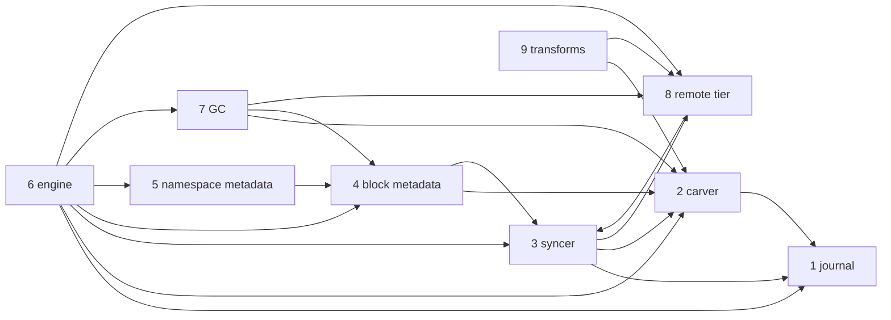

---
tags:
  - rfc-index
aliases:
  - RFCs
  - Storage RFCs
---

# Storage RFCs

The specification of DittoFS's content path, from the bytes a client writes to the objects in
the remote tier. [RFC 0](rfc-0-data-lifecycle.md) is the root: it defines the terms, the
residency function and the invariants every other RFC inherits. Start there.

| RFC | Component | Owns |
| --- | --- | --- |
| [RFC 0](rfc-0-data-lifecycle.md) | data lifecycle | terms, data model, residency, invariants, failure model |
| [RFC 1](rfc-1-journal.md) | journal | local bytes: on-disk format, placement, crash safety, capacity |
| [RFC 2](rfc-2-carver.md) | carver | bytes → chunks → blocks: boundaries, identity, packing |
| [RFC 3](rfc-3-syncer.md) | syncer | transferring blocks to and from the remote tier |
| [RFC 4](rfc-4-block-metadata.md) | block metadata | chunks, refs, blocks, refcounts, durability |
| [RFC 5](rfc-5-namespace-metadata.md) | namespace metadata | files, directories, handles, permissions, locks |
| [RFC 6](rfc-6-engine.md) | engine | composition, policy, the facade adapters call |
| [RFC 7](rfc-7-gc.md) | GC | sweep, relocation, remote deletion |
| [RFC 8](rfc-8-remote-tier.md) | remote tier | object format and backend contract |
| [RFC 9](rfc-9-transforms.md) | transforms | compression, encryption, threat model |

[The block data-flow split](rfc-block-dataflow.md) is the earlier plan these RFCs grew out of.

## Dependencies

An arrow reads "builds on". Every RFC builds on RFC 0; those edges are left out.

## Reading them in Obsidian

- Every `RFC N §x.y` is a link to that section. Hover for a preview; the backlinks pane shows
  every place that cites the section you are reading.
- Each RFC carries properties (`rfc`, `component`, `status`, `depends_on`), and
  [rfcs.base](rfcs.base) tabulates them.
- The Google Docs copies are generated from these files; comment in either place.
