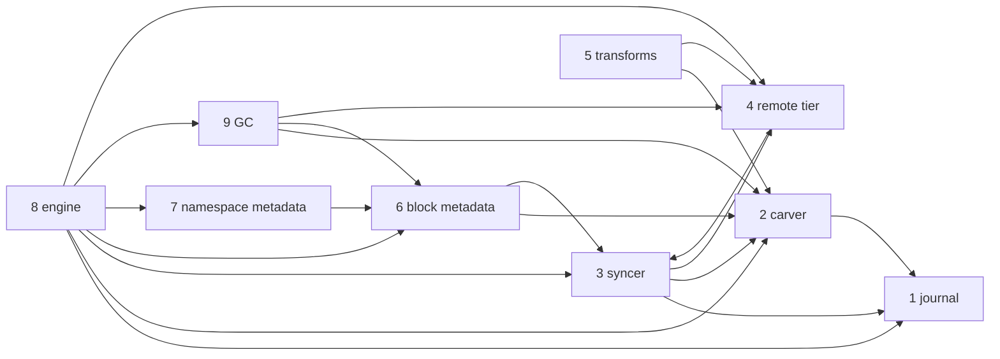

---
tags:
  - rfc-index
aliases:
  - RFCs
  - DittoFS RFCs
---

# DittoFS RFCs

The specification of DittoFS, from the bytes a client writes to the objects in the remote tier,
and the layers around them. [RFC 0](rfc-0-data-lifecycle.md) is the root: it defines the terms,
the residency function and the invariants every other RFC inherits. Start there, and read in
order: each part builds on the ones before it.

| RFC | Component | Owns |
| --- | --- | --- |
| **Foundations** | | |
| [RFC 0](rfc-0-data-lifecycle.md) | data lifecycle | terms, data model, residency, invariants, failure model |
| **Content**, in write-path order | | |
| [RFC 1](rfc-1-journal.md) | journal | local bytes: on-disk format, placement, crash safety, capacity |
| [RFC 2](rfc-2-carver.md) | carver | bytes → chunks → blocks: boundaries, identity, packing |
| [RFC 3](rfc-3-syncer.md) | syncer | transferring blocks to and from the remote tier |
| [RFC 4](rfc-4-remote-tier.md) | remote tier | object format and backend contract |
| [RFC 5](rfc-5-transforms.md) | transforms | compression, encryption, threat model |
| **Metadata** | | |
| [RFC 6](rfc-6-block-metadata.md) | block metadata | shape, holes, refs, chunks, blocks, refcounts |
| [RFC 7](rfc-7-namespace-metadata.md) | namespace metadata | files, directories, handles, permissions, locks |
| **Composition** | | |
| [RFC 8](rfc-8-engine.md) | engine | composition, policy, the facade adapters call |
| [RFC 9](rfc-9-gc.md) | GC | sweep, relocation, remote deletion |
| **Cluster** | | |
| [RFC 10](rfc-10-journal-replication.md) | journal replication | *draft* — owner-driven replication, fencing, seal, catch-up, reads from replicas |
| [RFC 11](rfc-11-ownership.md) | ownership | *draft* — write tokens per file range, leases, handover, failover, forwarding |
| **Security** | | |
| RFC 12 | identity and authentication | *planned* — principals, authentication flavours, identity mapping, squashing |
| RFC 13 | authorization | *planned* — one abstract ACL model, its protocol mappings, evaluation |
| **Protocols** | | |
| RFC 14 | adapter model | *planned* — the protocol handler contract, auth context, error mapping, dispatch |
| RFC 15 | NFS | *planned* — decisions the NFS standards leave open |
| RFC 16 | SMB | *planned* — decisions the SMB standards leave open |
| **Operations** | | |
| RFC 17 | control plane | *planned* — runtime, share lifecycle, configuration, management API |
| RFC 18 | resources and concurrency | *planned* — memory budgets, buffer pools, admission, backpressure |
| RFC 19 | observability | *planned* — metric and label conventions, health derivation, events |

[The block data-flow split](rfc-block-dataflow.md) is the earlier plan the storage RFCs grew out of.

## Dependencies

An arrow reads "builds on". Every RFC builds on RFC 0; those edges are left out.

```mermaid
graph LR
  R1[1 journal]
  R2[2 carver] --> R1
  R3[3 syncer] --> R1 & R2 & R4
  R4[4 remote tier] --> R3
  R5[5 transforms] --> R2 & R4
  R6[6 block metadata] --> R2 & R3
  R7[7 namespace metadata] --> R6
  R8[8 engine] --> R1 & R2 & R3 & R6 & R7 & R9 & R4
  R9[9 GC] --> R2 & R6 & R4
```

## Test tiers

Every RFC's test plan runs in three tiers, so a change is checked fast and the
heavy work still runs every day.

| Tier | Runs | Contains |
| --- | --- | --- |
| **Per change** | on every proposed change | unit, conformance, property and fuzz seeds, model-based tests at a fixed budget, and each RFC's counted checks; minutes, no timing, no external service |
| **After merge** | after each merge to the integration branch | benchmarks on the reference box, recorded; a result more than 10% worse than the last is reported, not blocking |
| **Daily** | once a day on the integration branch | benchmarks that need space or hours, soaks, longer fuzz and model runs, and tests against real backends |

No timed check runs per change: a shared runner's device changes between runs,
so a timing gate either fails on noise or is set so wide it misses the
regressions that matter. Each RFC states the regressions it catches by counting
instead.

## Reading them in Obsidian

- Every `RFC N §x.y` is a link to that section. Hover for a preview; the backlinks pane shows
  every place that cites the section you are reading.
- Each RFC carries properties (`rfc`, `component`, `status`, `depends_on`), and
  [rfcs.base](rfcs.base) tabulates them.
- The Google Docs copies are generated from these files; comment in either place.
