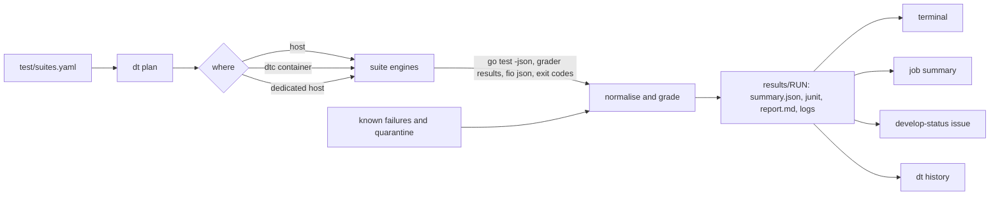

# RFC: one test harness — a suite registry, one runner, one result format

**Status:** proposed. Nothing here is implemented yet; §8 orders the work.
**Discussion:** the pull request that adds this file.
**Builds on:** the `dt` harness on `dev/test-harness` (`1b9d49b9`), `test/conformance/suites.json`
and `run.sh` with their graders, the system scenarios in `test/scenarios/`, and `dfsbench`
(`cmd/bench`).
**Checked against:** `develop` at `d0efaa75` (at `e33edad6` for #2955) and `dev/test-harness` at
`1b9d49b9`, on 2026-10-07. §10 lists what was checked and what turned out different from what was
assumed.

Read this before adding a test suite, changing a test workflow, or touching `test/harness/`. It
describes the harness we want to end up with, and how to get there from what exists without
rewriting the suites.

---

## 1. Why

Every suite has its own entry point, its own setup and its own way of saying how it went:

- **Many entry points.** Unit, integration and e2e tests run as inline `go test` lines in their
  workflows, and lint as inline steps in `lint.yml`. Conformance runs through
  `test/conformance/run.sh`. Scenarios run through
  `test/scenarios/setup.sh`, and `dfsbench` through `cmd/bench`. `dt` wraps most of them, but it
  lives on an unmerged branch. The repository has 16 workflows, and a non-docs PR starts about 30
  jobs across them.
- **The same work written several times.** The conformance matrix is resolved separately in
  `conformance.yml` and `nfs-pynfs.yml`. Ten workflow steps write their own job summary inline,
  and two of them (`smb-client-compat.yml`, Linux and macOS) print a hard-coded all-green table
  under `if: always()`, so they report a pass when the job failed.
- **No machine-readable results.** Nothing in the repository writes JUnit XML or a JSON summary.
  The only structured test output is WPTS's own TRX file. Nothing records which tests failed in
  which run, so "is this flaky?" has no answer except reading old logs.
- **Tests don't gate merges.** The required checks are Go Checks, Repo Checks, ShellCheck,
  gitleaks and Analyze (go): lint and security only. A PR whose unit tests fail can merge.
- **Nobody hears when develop goes red.** The develop-red e-mail and issue were removed in #1705,
  because flaky smbtorture subtests set them off constantly. What remains is one retry and a
  warning comment on PRs, for three workflows. On 2026-10-06/07, `AD-DC PAC Test` failed on 5 of
  its 10 completed develop runs, in at least two different tests (one is #2968). `ci-health`
  doesn't watch that workflow, so nothing said so.
- **Scenarios carry no signal.** The 42 system scenarios run twice a day on a dedicated host, and
  in no CI job. About half fail by design, because they reproduce open issues, but no list says
  which. A red run looks the same whether something regressed or not.
- **PRs are slow.** On 2026-10-07 (300 PR workflow runs) Conformance Suites took 23 min median
  and 39 min at p90, NFS Protocol Conformance 17 and 25, Unit Tests 14. A PR waits 25–40 min for
  its slowest workflow. The workflows' own comments estimate 40–45 min.

## 2. Requirements

| # | Requirement | Met when |
|---|---|---|
| R1 | One entry point, run the same way on a laptop and in CI | every CI test step is a `dt` command a developer can paste |
| R2 | One registry file of suites, in YAML, with its format specified | §4.1 is the format; `dt` refuses a file that doesn't match it |
| R3 | A new suite is one line | the one-line form in §4.1 runs with defaults |
| R4 | Runs and failures are tracked by the harness itself | every run writes §4.5's results; `dt history` answers "since when, how often" |
| R5 | Everything else is automatic | services, matrix, grading, retries and reports need no per-suite code |
| R6 | A quick tier on PRs, the full suite after every merge to develop | §4.2's tiers and §4.7's workflow; no selection by changed layer |
| R7 | An alert when develop goes red, without the flood that removed the last one | §4.7's single issue, after retry, excluding quarantined tests |
| R8 | External-tool suites first, and green | pjdfstest, pynfs, WPTS, smbtorture, scenarios and fio report no new failures |
| R9 | Adapt, don't rebuild | `run.sh` and its graders, `setup.sh`, `dfsbench` and the suite scripts are reused unchanged, or with small additions |

"Green" means no new failures: every failing test is either fixed or listed, with an issue, as a
known failure. That's how the conformance suites already work, and it's the only definition that
lets a suite which reproduces open bugs be green.

## 3. Decision: a command-line tool, written in Go

### A CLI, not an API service

The entry point is a CLI, `dt`, as it is today. An HTTP service that runs tests would need a host,
authentication and a deployment, and a developer's laptop would talk to it differently from CI.
That breaks R1. The tools this harness is compared with are all commands run the same way
everywhere: `bazel test //...`, Kubernetes' `make test` over `hack/` scripts, xfstests'
`./check -g quick`, LTP's runtest files.

The machine-facing part, what other programs build on, is a set of files with versioned formats:

- **input:** the registry (§4.1);
- **output:** `summary.json`, JUnit XML and a Markdown report per run (§4.5);
- **status:** the exit code (§4.3).

CI, the dedicated host, an issue bot or a future dashboard read those files. If a dashboard is ever
built, it reads results; it doesn't run tests.

### In Go, not by growing the bash script

`dt` today is one 1,270-line bash script. What R2–R7 add is data handling: parsing YAML, expanding
a matrix, reading `go test -json`, conformance and fio output, grading against lists, writing
JUnit and JSON, and reading history. In bash that needs `yq` and `jq` (the Nix dev shell has
neither) and can't be unit-tested in any reasonable way. In Go:

- the dependencies are already direct ones in `go.mod`: `gopkg.in/yaml.v3` and `cobra`;
- every piece is a package with `go test` tests, which the repository already expects of its code;
- it runs natively on Linux, macOS and Windows, where the Windows unit tests and the SMB
  client-compatibility job run.

The environment glue stays in shell, where it belongs: starting services, the `dtc` container,
mounts, the scenario host. The Go runner calls those scripts the way it calls a suite.

To keep this an adaptation rather than a rebuild:

- `test/harness/bin/dt` stays the path; CI on `dev/test-harness` already calls it. It becomes a
  short shim that builds `./test/harness/cmd/dt` once per source change and runs it.
- Today's commands stay as aliases: `dt unit` is `dt run unit`, and
  `dt pynfs --profile badger` is `dt run pynfs/badger`.
- The suites keep their engines: `run.sh` and its tested graders, `setup.sh`, `dfsbench` and the
  integration package list.

## 4. Design



The suite engines are the existing scripts: `go test`, `run.sh`, `setup.sh`, `fio`, `dfsbench`.
The registry, the planner, normalising, grading and the result files are the new parts.

### 4.1 The registry: `test/suites.yaml`

One file lists every suite. A suite is a command that runs many tests. Tests inside a suite are
found by the suite, not listed here: Go tests by `go test`, scenarios and fio jobs by a file glob,
pynfs tests by pynfs. Adding a test is adding a file, and touches no shared file.

This is the format. The values show the intended first version.

```yaml
# test/suites.yaml: every test suite, one entry each. `dt list` prints it; `dt plan` expands it.
version: 1

defaults:            # any suite field; a suite's own value wins
  kind: cmd          # how results are read (see the table below)
  tier: full         # the smallest tier that runs the suite: pr < full < nightly; manual never auto
  timeout: 30m       # for the whole suite, or for each test when `tests` is set

suites:
  # The one-line form, for a hypothetical suite: a name and a command. Exit status 0 is a pass.
  nfs-mount-smoke: { cmd: test/nfs/mount-smoke.sh, tier: pr, needs: [linux, root, nfs-client] }

  # Lint. `job` keeps the check names the develop ruleset requires; each job runs `dt run NAME`.
  # The scripts hold what lint.yml runs inline today, so a laptop and CI run the same steps.
  lint-go:    { cmd: test/lint/go-checks.sh, tier: pr, job: Go Checks }      # gofmt, vet, citations, required tests, golangci-lint
  lint-repo:  { cmd: "test/lint/repo-checks.sh {base}", tier: pr, job: Repo Checks }
  shellcheck: { cmd: test/lint/shellcheck.sh, tier: pr, job: ShellCheck }

  unit:
    kind: go
    cmd: go test -race {args} -timeout=25m ./pkg/... ./internal/... ./cmd/... ./test/...
    args: { pr: "-short" }              # pull requests run the short suite, as today
    tier: pr
  unit-windows:
    kind: go
    cmd: go test -short -race -p 2 -timeout=25m ./...
    tier: pr
    needs: [windows]                    # dt plan gives the cell a Windows runner
  integration:                          # includes the KMIP interop tests since #2955
    kind: go
    cmd: test/integration/packages.sh | xargs go test -tags=integration -p 1 -timeout=20m
    tier: pr
    needs: [docker, service:postgres, service:kmip]
  integration-portmap:                  # the tests skip without rpcbind; `needs` makes that a refusal
    kind: go
    cmd: go test -tags=portmap_system -timeout=2m ./test/integration/portmap/...
    tier: pr
    needs: [linux, rpcbind]
  operator:                             # its own Go module; the kustomize render check becomes a make target
    cmd: make -C k8s/dittofs-operator test lint manifests-verify
    tier: pr
  e2e:
    kind: go
    cmd: .github/scripts/run-e2e.sh go test -tags=e2e -timeout=30m ./test/e2e/...
    env: { nightly: { DITTOFS_E2E_NIGHTLY: "1" } }   # the dedup tests no workflow runs today
    needs: [linux, root, nfs-client, smb-client, service:localstack]

  # Conformance: profiles, variants, steps and known-failure lists stay in suites.json, which
  # run.sh owns. The kind runs `run.sh --suite NAME --profile P [--variant V]` for each cell.
  wpts:         { kind: conformance, tier: pr }
  smbtorture:   { kind: conformance, tier: pr }
  pjdfstest:    { kind: conformance, tier: pr }
  pynfs:        { kind: conformance, tier: pr }
  nfs-kerberos: { kind: conformance }

  scenarios:
    kind: scenarios
    cmd: test/scenarios/setup.sh {test}
    tests: test/scenarios/[0-9][0-9]-*.sh
    select: { full: "[0-8]?-*.sh" }     # nightly runs all; the 0x smoke group joins pr once timed
    known: test/scenarios/KNOWN_FAILURES.md
    needs: [linux, podman]
    timeout: 15m
    shards: 4                           # split over 4 CI jobs
  fio-verify:
    kind: fio
    cmd: test/harness/fio/run.sh {test}
    tests: bench/workloads/*.fio
    tier: nightly
    needs: [linux, root, nfs-client, smb-client]

  bench-smoke: { kind: dfsbench, cmd: go run ./cmd/bench run --smoke --local, tier: nightly, gate: false }

  # Suites that have workflows of their own today.
  ad-dc:                { kind: go, cmd: test/integration/ad-dc/run.sh, needs: [linux, docker] }
  kerberos-integration: { kind: go, cmd: test/integration/kerberos/run.sh, tier: nightly, needs: [linux, docker] }  # run by no CI job today
  smbtorture-kerberos:
    cmd: test/smb-conformance/smbtorture/run.sh --kerberos --filter {test}
    tests: [smb2.session, smb2.read, smb2.lock]
    needs: [linux, docker]
  smb-client-linux:   { cmd: test/smb-client-compat/linux.sh, tier: nightly, needs: [linux, root, smb-client] }
  smb-client-macos:   { cmd: test/smb-client-compat/macos.sh, tier: nightly, needs: [macos] }
  smb-client-windows: { cmd: pwsh -File test/smb-client-compat/windows.ps1, tier: nightly, needs: ["windows", "port:445"] }
  combined-tree-selftest: { cmd: .github/scripts/combined-tree.sh selftest, tier: pr }

  # Baselines record what a reference implementation does; they never fail a run.
  smbtorture-baseline:  { cmd: test/smb-conformance/smbtorture/refresh-baseline.sh, tier: nightly, gate: false, needs: [linux, docker] }
  pynfs-knfsd-baseline: { cmd: test/nfs-conformance/pynfs/baseline-knfsd.sh, tier: nightly, gate: false, needs: [linux, root, knfsd] }

  # Rigs that need special hardware or infrastructure: listed, run by hand, refused elsewhere with the reason.
  crash-device-loss:   { cmd: "sudo test/crash/device-loss.sh {bin}/dfs {bin}/dfsctl", tier: manual, needs: [linux, root, dm-flakey, smb-client] }
  crash-cold-loss:     { cmd: "sudo test/crash/invalidate-cold-loss.sh {bin}/dfs {bin}/dfsctl", tier: manual, needs: [linux, root, smb-client] }
  edge:                { cmd: test/edge/edge-test.sh all, tier: manual, needs: ["cloud:scaleway"] }
  repro:
    cmd: test/harness/repro/{test}
    tests: test/harness/repro/*-*.sh
    tier: manual
    needs: [docker]
```

| Field | Meaning | Default |
|---|---|---|
| `cmd` | Shell command, run with bash from the repository root (Git Bash on Windows). `{test}` is one test's file name or list entry, `{args}` the tier's `args`, `{base}` the ref a change is compared against (the PR's base in CI, `origin/develop` locally), `{bin}` a directory with `dfs` and `dfsctl` built from the checkout | required, unless the kind provides one |
| `kind` | How results are read: `cmd`, `go`, `conformance`, `scenarios`, `fio`, `dfsbench` (§4.5) | `cmd` |
| `tier` | The smallest tier that runs the suite (§4.2) | `full` |
| `timeout` | A duration, for the suite, or for each test when `tests` is set | `30m` |
| `needs` | What the machine must offer (§4.4) | none |
| `tests` | A glob, one test per matching file; or a list of names | none: the suite is one test, or finds its own |
| `env` | Environment variables, for every tier or per tier | none |
| `select` | A narrower glob per tier, for tiers below the suite's widest | every match |
| `args` | Text per tier, put where `{args}` appears | empty |
| `known` | A known-failure list, in the Markdown format `test/common/known-failures.sh` reads | none; conformance suites use `suites.json` |
| `gate` | `false`: results are recorded but never fail a run (benchmarks) | `true` |
| `shards` | Split `tests` over this many CI jobs | `1` |
| `job` | Run in a CI job of this fixed name, outside the matrix: for checks the branch ruleset requires by name | none: a matrix cell |

Rules `dt` enforces when it loads the file: names are `[a-z0-9-]+`; unknown fields are refused, so
a misspelt field fails rather than being ignored; `version` newer than `dt` knows is refused; every
`known` path exists; every `{test}` has a `tests`.

**One file, or a file per test?** One registry of suites, and no per-test file. Merge conflicts in
a central file come from adding tests, and tests are found from their own files. The registry only
changes when a suite is added, which is rare. What belongs to a single test lives in that test:
a scenario's size is in its file name, a fio job's parameters in its job file.

**YAML or JSON?** `suites.json` chose JSON so that Actions could `fromJSON()` it and scripts could
read it with `jq`. Workflows never parse the file itself, though; they parse `run.sh --matrix`
output. `dt plan --json` gives them the same, from YAML. `suites.json` stays as the conformance
engine's own manifest.

### 4.2 Tiers

| Tier | Runs on | Contains | Budget (wall clock) |
|---|---|---|---|
| `pr` | every pull request (and `merge_group`, if a merge queue is ever available) | suites with `tier: pr`, narrowed by `select.pr` and conformance's PR profiles | p90 ≤ 20 min |
| `full` | every push to develop | `pr` plus `tier: full` | ≤ 60 min |
| `nightly` | schedule, and the dedicated host | everything except `manual` | ≤ 4 h |
| `manual` | `dt run NAME`, or `workflow_dispatch` | benchmarks and long simulations | none |

Each tier contains the one below it. For conformance suites, `pr`, `full` and `nightly` map to
`suites.json`'s `pull_request`, `push` and `schedule` profile lists, so which profiles run on a PR
stays where it is today.

The budgets are proposals, against today's 25–40 min. Every result records its duration, and
`dt history` gives p50 and p90 per suite, so moving a suite between tiers is a one-word change
made on measured numbers.

There's no selection by changed layer. The components depend on each other too much for "this PR
only touched NFS" to be safe. The full tier after every merge is what catches the cross-component
regressions a small PR tier misses.

### 4.3 The command line

```text
dt list [--tier T] [--json]                    suites, their tier, kind and needs, and whether they can run here
dt plan --tier T [--shard I/N] [--json]        the cells a tier runs; CI turns --json into its matrix
dt run SUITE[/CELL] [TEST...] | --tier T       run, grade and write results; exit status below
dt report [RUN] [--format text|md|json]        show a run; CI appends --format md to the job summary
dt history [SUITE[/TEST]] [--ci] [--last N]    pass, fail and flaky counts over past runs, with durations
dt doctor                                      which `needs` this machine meets, and how to meet the rest
dt known prune SUITE                           remove known failures that now pass
```

The environment commands stay as they are: `dt services`, `dt stack`, `dt cleanup`, `dt hooks`,
and `dtc` for the container.

| Flag | Effect |
|---|---|
| `--ci` | non-interactive; GitHub annotations for new failures; writes the job summary; a suite that can't run here is an error, not a skip |
| `--retry N` | re-run failed tests up to N times (CI default 1, local default 0) |
| `--in host\|container\|auto` | where to run; `auto` uses `dtc` when the host lacks a need the container provides |
| `--results DIR` | where results go (default `test/harness/results/`, gitignored) |

| Exit status | Meaning |
|---|---|
| 0 | no new failures (known, quarantined and flaky ones are reported, not counted) |
| 1 | at least one new failure |
| 2 | something couldn't run: unmet needs, setup failed, the harness's own timeout, or nothing ran |
| 3 | usage or registry error |

Status 1 is a regression; status 2 is an environment problem. The alert in §4.7 treats them
differently, which is the main defence against another flood.

### 4.4 Where a suite runs

`needs` names what a suite requires: `linux`, `windows`, `macos`, `root` (passwordless sudo),
`docker`, `podman`, `rpcbind`, `knfsd`, `nfs-client`, `smb-client`, `kerberos`, `dm-flakey`,
`disk:<GB>`, `port:<n>` (free to bind), `cloud:<provider>` (credentials and provisioned
infrastructure), and `service:<name>` for the services `dt services` starts (`localstack`,
`postgres`, `kmip`).
`dt doctor` reports which are met. For an unmet need, `dt run` either moves to the `dtc` container
(when it provides it and `--in` allows), or reports the suite as not runnable with the reason. It is
never reported as passed. In CI, `dt plan` gives each cell its runner from the same list:
`windows` and `macos` get those hosted runners, everything else Ubuntu.

There are three places to run:

| Place | Gives | Used for |
|---|---|---|
| A developer's machine | the host, or `dtc` (pinned Linux toolchain, privileged) | anything the machine can meet; macOS runs Linux-only suites in `dtc` |
| GitHub-hosted runner | Linux, 4 CPU, 16 GB RAM, 14 GB SSD (public repositories); the Ubuntu 24.04 image has Docker, podman 4.9.3 and Go 1.26.8 | the `pr` and `full` tiers, and the nightly suites that fit |
| Dedicated test host | a large disk and long run times | nightly suites a runner can't hold: the 9x long runs, such as scenario 92, which grows a 30 GB file |

Scenarios need podman 5.6 or later (`test/scenarios/README.md`), and the hosted image has 4.9.3.
On a runner they use the path the README already gives for macOS: `setup.sh` inside
`quay.io/podman/stable`, privileged. The README limits that to a VM, never a shared host; a hosted
runner is a single-use VM. So macOS and CI share one code path.

The dedicated host is **not** a self-hosted runner. GitHub's guidance is that "self-hosted runners
should almost never be used for public repositories", because any pull request could run code on
them. The host runs `dt run --tier nightly` from cron, on develop's tip only, and publishes its
summary to the develop-status issue (§4.7) with a token that can only write issues.

Versions come from one place. Today Go is `1.26.0` in `go.mod`, `1.26.x` in the workflows, `1.26.8`
in the `dtc` image, and a floating `1.26` in the e2e-linux image. The pjdfstest and pynfs revisions
are copied into Dockerfiles from `flake.lock`. Proposed: one Go pin (a `toolchain` line in `go.mod`),
read by the workflows and the images, and the test-tool revisions read from `flake.lock`.

### 4.5 Results

Each run writes one directory:

```text
test/harness/results/20261007T201500Z-d0efaa75/
  summary.json        the run, every cell and every new failure
  junit/*.xml         one file per cell
  report.md           what `dt report --format md` prints
  logs/*.log          one per cell, with the command, commit, exit status and duration
```

```json
{
  "schema": 1,
  "run": "20261007T201500Z-d0efaa75",
  "commit": "d0efaa75", "dirty": false, "ref": "develop",
  "tier": "full", "where": { "os": "linux", "arch": "amd64", "ci": "github", "in": "host" },
  "started": "2026-10-07T20:15:00Z", "seconds": 1834, "exit": 1,
  "cells": [
    { "suite": "pjdfstest", "cell": "badger-s3/4.1", "result": "fail", "seconds": 912,
      "counts": { "tests": 8789, "passed": 8786, "new": 1, "known": 1, "quarantined": 0,
                  "flaky": 1, "unexpected_pass": 0, "skipped": 0 },
      "new": ["chmod/12.t"],
      "log": "logs/pjdfstest-badger-s3-4.1.log", "junit": "junit/pjdfstest-badger-s3-4.1.xml" }
  ]
}
```

The numbers above are illustrative. How each kind becomes test cases:

| Kind | Reads | Test case | Change needed |
|---|---|---|---|
| `go` | `go test -json` (test2json events) | each test and subtest | `dt` adds `-json`; no new tool |
| `conformance` | each grader's per-test outcome | each conformance test | the graders already classify every test; each also writes it to `results.tsv` (test, outcome, reason). Until then, one case per cell from the exit status, which counts new failures |
| `scenarios` | `setup.sh`'s PASS/FAIL/SLOW lines, `failed/<name>/`, `times/<name>.tsv` | each scenario; the failing line is the message | none in `setup.sh`. `dt` checks a `times` row exists for this run, because `setup.sh` exits 0 without running anything when another run holds its lock |
| `fio` | `fio --output-format=json` | each job | data checks (`verify=`) fail the case; bandwidth, IOPS and latency are recorded as metrics |
| `dfsbench` | its JSON result per cell | each cell | recorded only (`gate: false`) |
| `cmd` | the exit status | the command | none |

In JUnit, a new failure is a `<failure>`. A known failure is `<skipped>` with the reason and issue,
and so is a quarantined test. A test that failed and then passed on retry is a pass with a `flaky`
property. JUnit readers then count only new failures as failures.

In CI, `dt report --format md` goes to the job summary. One shared step replaces the ten inline
summary steps, including the two that always print green. `summary.json` and `junit/` are uploaded
as artifacts. `dt history --ci` reads the last N develop runs' artifacts through the GitHub API;
the default 90-day retention covers flake rates. Benchmark trends need longer, and can move to a
data branch when they do.

### 4.6 Grading: known failures, quarantine, retries

- **Known failure:** a deterministic failure tracked by an issue. It's listed in the suite's
  known-failure file, in the existing Markdown format. The Go grader shares golden fixtures with
  `test/common/known-failures_test.sh`, so the two parsers can't drift. Today `run.sh` resolves a
  suite's `known_failures` path but never passes it to the steps, and each runner picks its own
  file. `run.sh` passes it on, so `suites.json` is the one source.
- **Quarantine:** a flaky test, failing some runs and not others. `test/harness/quarantine.yaml`
  lists it with the suite, the test, an issue and an expiry date. A quarantined test still runs and
  its result is recorded, but it never fails a run and never alerts. An expired entry is an error
  from `dt doctor` and the registry check, so the list can't become a dumping ground. The AD-DC
  failures in §1 are what it's for, once that workflow reports through `dt`:
  `TestADCombinedKeytabAndDomainAwareSMB` (#2968) and `TestSMBNTLMNetlogonPassthrough`, which has
  no issue yet.
- **Retry:** with `--retry 1`, only the failed tests run again: `go test -run '^(A|B)$'`, the one
  scenario, or the one conformance cell. A pass on retry is flaky: it doesn't fail the run, but
  `dt history` counts it. A test flaky twice in a week on develop is a quarantine candidate.
- **Unexpected pass:** a known failure that passes is reported, and doesn't fail the run.
  `dt known prune` removes it. A fix PR removes its own row.
- **Scenarios:** each one that fails today gets a known-failure row naming its issue. The suite is
  then green, a regression shows as a new failure, and a fix shows as an unexpected pass.

### 4.7 CI

One workflow, `tests.yml`, runs every registered suite:

- **Triggers:** `pull_request` runs tier `pr`, a push to develop `full`, the schedule `nightly`,
  and `workflow_dispatch` the tier it's given.
- **Jobs:** `plan` runs `dt plan --tier T --json`. `run` is a matrix over its cells, each
  `dt run CELL --ci --retry 1`, on the runner `dt plan` named. `gate` needs `run`, always runs,
  merges the summaries into one report, and fails unless every cell exited 0.
- **Lint:** the suites with a `job` run as fixed jobs of that name: `Go Checks`, `Repo Checks` and
  `ShellCheck`, each `dt run NAME --ci`. They move here from `lint.yml` with their names, so the
  develop ruleset's required checks don't change.
- **Docs-only PRs:** `dt plan` returns no cells, and `gate` passes.

`Tests / gate` becomes the one required test check, once the `pr` tier has been green on develop for
two weeks. A single gate that always runs also avoids GitHub's path-filter trap: a required check
from a workflow skipped by a path filter stays pending and blocks the merge.

Every suite is in the registry, including those with special hosts or schedules: AD-DC, the
Kerberos suites, SMB client compatibility on Linux, macOS and Windows, the baseline refreshes, and
the manual rigs. Their workflows move into `tests.yml` after the main ones (§8 step 4); until
then they keep running as they are. The client-compatibility jobs (601 lines across three jobs)
and the smbtorture baseline refresh first move their inline steps into scripts. The nightly job
that refreshes the smbtorture baseline still commits the refreshed file, as today.

Three things stay outside the registry, because they aren't test suites:
- **the security scans,** gitleaks and CodeQL (Analyze (go)), which are GitHub actions;
- **combined-tree,** which picks open PRs to merge and build together (see Merging below); its
  self-test is a suite;
- **the canary** on `dev/test-harness`, which watches a live deployment rather than a commit.

**Develop goes red.** This extends `ci-health.yml` and watches `tests.yml`, plus any workflow still
outside it.

- After its existing retry, a full-tier run that still has new failures (exit 1) opens one issue
  labelled `develop-red`, or updates it if one is open.
- The issue body is the current failing set, from `summary.json`. It's rewritten, not commented,
  so watchers get one notification per change, not per run. A comment is added only when the set
  of failing tests changes.
- The next green run on develop closes it.
- Exit 2 (an environment problem) alerts only after two consecutive runs.
- Known failures and quarantined tests never alert.
- E-mail comes from GitHub's own issue notifications: repository watchers, and anyone the issue
  mentions. No mail secrets in the repository.

The removed alarm already retried once and kept a single issue. It still flooded, because it sent
mail on every red run and couldn't tell a flaky subtest from a regression (#1705). Here a flaky
test is quarantined and never counts, a known failure never counts, and a notification goes out
only when the failing set changes.

**Merging.** GitHub's merge queue is "available in any public repository owned by an organization".
This repository is owned by a user account, so it can't be enabled here. Since 2026-10-07 develop
requires PR branches to be up to date and the required checks to pass. Every merge to develop
therefore makes open PRs re-run, which a fast `pr` tier keeps cheap. `combined-tree.yml` already
covers part of what a queue would: every three hours from 07:20 to 19:20 UTC, it merges
combinations of open same-repository PRs and builds, vets and tests them, catching two green PRs
that break each other. If the
repository moves to an organization: enable the queue, add `merge_group` to `tests.yml`'s
triggers, and drop the up-to-date rule.

### 4.8 Adding things

- **A suite:** one line in `test/suites.yaml`, such as `nfs-mount-smoke` above. `dt list`
  shows it, and `dt run nfs-mount-smoke` runs it.
- **A test to an existing suite:** add its file. A scenario script, a fio job file
  (`bench/workloads/*.fio`, which `dfsbench` also embeds), or a Go test. No registry change.
- **New fio workloads,** such as mailbox-style I/O mixes: job files in `bench/workloads/`.
  `fio-verify` checks their data, and `dfsbench` can measure them.
- **A known failure:** one row in the suite's list, naming the issue.

### 4.9 Benchmarks and long runs

Performance is tracked, not gated. Hosted runners share hardware and are too noisy to fail a PR
on a percentage. `bench-smoke` (`dfsbench --smoke`, documented as needing no secrets) runs nightly
on a runner, as a check that the benchmark still works. Comparisons run on the dedicated host. A
suite whose result is more than an agreed margin below its 7-day median for three nights in a row
adds a note to the develop-status issue.

The metadata-scale benchmark (many files, metadata only) and the journal simulation (many small
files against large segments under heavy writes) are `manual` suites on the dedicated host. They
use the same result format, so runs compare over time.

## 5. What this doesn't change

- **The suites themselves.** pjdfstest, pynfs, WPTS, smbtorture, the scenarios and the Go tests
  keep their scripts, graders and known-failure files.
- **`setup.sh`.** The scenarios kind reads what it already writes.
- **The required check names.** Go Checks, Repo Checks and ShellCheck keep their names and their
  steps, which run through `dt` from scripts instead of inline YAML. The security scans, gitleaks
  and CodeQL (Analyze (go)), stay GitHub actions as they are.
- **The workflows with special hosts, for a while.** Their suites are registered at once, but their
  workflows keep running until §8's step 4 moves them.

## 6. Alternatives considered

- **An API service that runs tests.** Rejected in §3: it breaks "same command everywhere", and
  needs hosting.
- **Growing `dt` in bash.** Rejected in §3: YAML, JSON and JUnit handling in shell, without tests.
- **A descriptor file per test.** Rejected in §4.1: tests are already found from their own files.
- **Selecting suites by changed layer.** Rejected in §4.2: the components depend on each other too
  much.
- **Keeping `suites.json` as the registry.** Rejected in §4.1: it was JSON for `fromJSON()`, and
  `dt plan --json` covers that. It stays as the conformance manifest.
- **A self-hosted runner on the dedicated host.** Rejected in §4.4, on GitHub's own guidance for
  public repositories.
- **A merge queue now.** Not available, for the owner-type reason in §4.7.

## 7. Risks

- **One bug in `dt` breaks all of CI.** Workflows move one at a time (§8), each compared against
  its old run for a week. `dt`'s own tests run in CI with the unit tests: `./test/...` is added to
  the unit job, which today covers only `./pkg`, `./internal` and `./cmd`. That also brings in
  `test/spec-citations`' tests, which no job runs today.
- **The `pr` tier misses something.** The full tier runs after every merge, and the alert names
  the failing set. The cost is a red develop for one merge, not a lost regression.
- **The known-failure lists rot.** Every row names an issue, unexpected passes are reported, and
  `dt known prune` removes them.
- **Quarantine hides real bugs.** Entries expire, need an issue, and quarantined results are still
  recorded and shown in `dt history`.

## 8. Plan

Each step ships on its own and has an exit criterion.

1. **Land the harness branch.** Rebase `dev/test-harness` on develop, and fix what has gone stale
   or wrong on it:
   - its Postgres tuning and services, and the `postgres` and `postgres-s3` profiles, predate
     #2914, which removed them; `dt-batch container`'s `pjdfstest v4.1 / postgres-s3` run becomes
     `badger-s3`;
   - its separate KMIP interop step repeats tests that CI's integration list includes since #2955;
   - `dt-batch` exits 0 whatever its runs did; it exits non-zero when any run failed;
   - its pre-push replaces the repository's hook, and stops testing `k8s/dittofs-operator/`
     packages on push: restore the repository hook, then add `dt`'s steps to it;
   - the references to `LOCAL-DEV-SETUP.md` and `TEST-HARNESS.md` point at files that don't exist.

   Until step 2, add a `dt lint` command and a `dt-batch full` set as the one command for a
   complete run: unit (`--full --fresh`), integration, lint, then the `container` set, with the
   three e2e failures the README expects inside `dtc` (no `rpcsec_gss_krb5`, no veth pairs)
   counted as expected. Roughly 90 minutes on the README's reference machine, from its times; the
   unit run without `-short` wasn't measured there.
   *Exit:* CI's unit, integration and e2e jobs call `dt`, and stay green for a week.
2. **Registry and runner.** `test/suites.yaml`, and `dt list`, `plan` and `run` in Go, for the
   `go`, `conformance` and `cmd` kinds. `lint.yml`'s inline steps move into `test/lint/`, run by
   the `lint-go`, `lint-repo` and `shellcheck` suites. Every other suite is registered too,
   the manual rigs included, so `dt list` shows everything there is. Today's commands become
   aliases.
   *Exit:* `dt plan --tier pr --json` yields the same cells as today's PR matrix.
3. **Results.** `summary.json`, JUnit and `dt report`. The graders write `results.tsv`, and `run.sh`
   passes the known-failure path on. One report step replaces the inline summaries.
   *Exit:* every CI test job publishes through `dt report`.
4. **One workflow and a gate.** `tests.yml` with plan, run and gate. Move `nfs-pynfs.yml` first,
   as the smallest, then `conformance.yml`, then the unit, Windows, integration, operator and lint
   jobs, the lint jobs keeping their names. Then AD-DC, the Kerberos suites, client compatibility
   (its steps moved into scripts first) and the baselines. Make the gate required.
   *Exit:* PR p90 ≤ 20 min over a week, and the gate required.
5. **Scenarios and fio.** The scenarios kind, its known-failure list, and the podman-in-container
   path on runners. Groups 0x–8x run in the full tier, sharded over runners; the 9x long runs run
   nightly on the dedicated host. Then `fio-verify`.
   *Exit:* the full tier includes scenarios, and has no new failures.
6. **Alerting and flakes.** The develop-status issue, quarantine, and `dt history`.
   *Exit:* two weeks with one alert per real regression and none from flakes.
7. **Benchmarks.** `bench-smoke` nightly; tracked runs on the dedicated host.

Conformance comes first, in steps 2–4, because its suites are already graded, then scenarios and
fio (R8).

## 9. Open questions

- Are the tier budgets right: 20 min p90 for `pr`, 60 for `full`, 4 h for `nightly`?
- Which conformance profiles stay on PRs? Today wpts, pjdfstest and pynfs run two of their three;
  smbtorture runs both of its two.
- Should `nfs-kerberos` drop its PR path filter and run only in `full`?
- The operator, Windows, unit and integration jobs only run on PRs that touch their paths today.
  With no selection by layer they run on every PR, adding about 3 min of operator and 17 min of
  Windows runner time per PR, in parallel. Keep them in `pr`, or move them to `full`?
- SMB client compatibility runs weekly today, plus on pushes that touch the SMB adapter. Is
  nightly right, given that it takes a macOS and a Windows runner?
- `kerberos-integration` and the e2e nightly tier have never run in CI, so their state is unknown.
  The harness README records the e2e nightly tests failing at setup. They start in `nightly` with
  whatever known-failure rows the first runs call for. Is that acceptable, or should they be
  fixed first?
- Who runs the dedicated host, and holds its issue-writing token?
- When does the gate become required: after two green weeks, or on a flake-rate figure?
- Does history stay in artifacts, or move to a data branch once benchmarks need longer than 90
  days?

## 10. What was checked

These were checked against the repository, at the commits in the header, before writing this.
Where the assumption was wrong, the design follows what was found.

| Assumed | Found | Where |
|---|---|---|
| `dt` covers every tier, on `dev/test-harness` | True: 48 files, +4,445 lines; `test/harness/bin/dt` is 1,270 lines. No `wpts` or `smbtorture` command; they are `dt smb wpts\|smbtorture` | `test/harness/bin/dt` |
| CI's unit, integration and e2e jobs call `dt` | True on the branch only; develop calls `go test` inline | branch `unit-tests.yml:75`, `integration-tests.yml:71`, `e2e-tests.yml:117` |
| `dt` runs unit, integration and lint | Unit and integration yes. Lint only as `dt quick` (vet and golangci-lint); CI's gofmt, citation, required-test, repo and ShellCheck steps aren't in `dt`, nor are the portmap, Windows and operator tests | branch `dt:1127-1131`; `lint.yml`, `integration-tests.yml:178-182`, `windows-build.yml:76-79`, `operator-tests.yml` |
| One command runs everything | None does. The closest, `dt-batch container`, runs 8 protocol and e2e runs (about 72 min) without unit, integration or lint, and exits 0 whatever they did | branch `dt-batch:79-94`, README reference results |
| `dt-batch matrix` is 28 runs | 28 with the branch's profiles; 20 on develop, where #2914 removed `postgres`, `postgres-s3` and `sqlite`. `dt-batch container`'s `postgres-s3` run no longer has a profile | `suites.json` on each |
| KMIP interop runs only in the harness | Since #2955 CI's integration list includes it, so `dt`'s separate step would run it twice | `e33edad6` |
| Every test in the repository runs somewhere | Not all: `test/integration/kerberos` uses its own `kerberos` build tag, which the integration job doesn't select, and no workflow sets `DITTOFS_E2E_NIGHTLY` for the e2e dedup tests | `kerberos_integration_test.go:1`, `dedup_race_nfsv4_test.go:80` |
| The client-compatibility checks can be run locally | Only by hand: they are 601 lines of inline steps across three jobs, not scripts | `smb-client-compat.yml` |
| `dt` grades conformance results | No: `run.sh` and the per-suite graders do; `dt` calls them | `run.sh:18-20`, `test/common/known-failures.sh` |
| `suites.json` covers 5 suites, with per-event tiers | True for 5 suites. Only `pull_request` is ever narrowed, and smbtorture's PR set is both its profiles | `suites.json:31-33, 39, 56` |
| A suite entry is about 10 lines | No: 15 to 38 lines | `suites.json:36-148` |
| JSON so Actions can `fromJSON()` it | Stated, but Actions parse `run.sh --matrix` output, not the file; and `jq` is not in the Nix dev shell | `suites.json:9-10`, `conformance.yml:106` |
| Postgres tuning is written 3 times | Not on develop: #2914 removed it. The branch still has all three copies | `77062d90` |
| 43 scenarios | 42 scripts plus `setup.sh`, sizes xs to xxl | `test/scenarios/` |
| Scenarios can run in CI as they are | They need podman ≥ 5.6; the hosted image has 4.9.3 | `test/scenarios/README.md`, runner image notes |
| `dt scenarios` reports what ran | Not always: `setup.sh` exits 0 having run nothing when another run holds its lock | `setup.sh:101` |
| The fio bench is not wired to anything | It has a `Makefile` target, path filters and unit tests, but no CI job runs it. `dfsbench` lives in `cmd/bench`, not `bench/` | `Makefile:77-78`, `cmd/bench` |
| Machine-readable results exist somewhere | None for tests: no JUnit; only WPTS's TRX, and the canary's JSON on the branch | repository-wide search |
| Develop-red alerting was removed after floods | True: added in #1170 (e-mail and issue), removed in #1705 after flaky smbtorture subtests | `684f97f4`, `ci-health.yml:3-5` |
| `ci-health` watches develop | Three workflows only; `AD-DC PAC Test` failed 5 of 10 completed develop runs on 2026-10-06/07 with no signal | `ci-health.yml:22-30`, Actions history |
| Enable the merge queue | Not available on a user-owned repository; up-to-date branches are required instead, since 2026-10-07 | GitHub docs, ruleset |
| `smb-client-compat` runs on every develop push | Only when SMB adapter paths change; Windows mount tests skip when port 445 is taken | `smb-client-compat.yml:14-19, 451-455` |
| The harness's pre-push adds to the repository hook | It replaces it, and no longer tests operator packages | branch `githooks/pre-push:34-36`, `dt:434` |
| Tool versions are pinned once | Go is pinned four different ways; pjdfstest and pynfs revisions are copied from `flake.lock` | `go.mod:3`, `lint.yml:56`, `dev.Dockerfile:12, 24, 54` |
