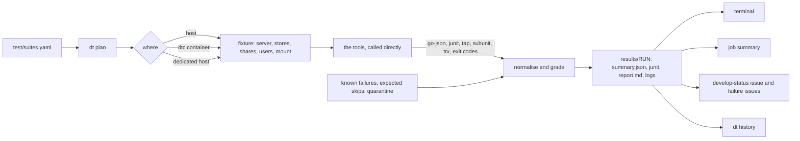

# RFC: one test harness, with a suite registry, one runner and one result format

**Status:** proposed, revision 3. Nothing here is implemented yet; §8 orders the work.
**Discussion:** the pull request that adds this file.

## Summary

**The problem.** DittoFS has many good test suites, but no single way to run them and no
reliable way to tell what they found.

- **Every suite is run its own way.** 16 workflows and about 30 jobs per pull request, with 35
  glue scripts (about 8,900 lines) between CI and the test tools.
- **Green doesn't always mean tested.** A check of every test workflow's latest green runs found
  14 cases that pass without testing what they claim. S3 cells never reach S3, Kerberos tests skip,
  and 70 WPTS tests never execute. All are filed (#2986 to #3000).
- **Red goes unnoticed.** The nightly conformance run has failed every night since 2026-09-10,
  and the AD-DC suite failed on every develop run after #2914. Nobody was told.
- **Most tests don't decide merges, and PRs are slow.** A PR waits 25–40 minutes, and only unit,
  integration, lint and security checks can block it.

**The proposal.**

- **One command, `dt`, written in Go,** runs every suite the same way on a laptop and in CI.
- **One file, `test/suites.yaml`, lists the 15 suites.** A variant of a suite is an option of it,
  and sets of suites are groups.
- **`dt` builds the DittoFS server each suite needs** (the fixture) and calls each test tool
  directly. The per-suite scripts go.
- **A suite can't pass without running.** A missing prerequisite, a failed setup check or an
  unexpected skip is reported as "not run", never as a pass.
- **One result format:** CTRF JSON, with JUnit for CI tools. Results are graded against known
  failures and expected skips kept as YAML, and history answers "is this flaky?".
- **Three tiers.** A quick run on every PR, on the production storage profile only, aiming at 20
  minutes or less. The full set after every merge. The long suites nightly. One gate check decides
  merges.
- **One develop-red issue, updated in place,** plus an issue per failing test with guardrails.
  Red gets noticed, without the floods that got the last alarm removed (#1705).

**Decided:** Go from the start, CTRF, and GitHub issues with the project board for tracking (team
call and reviews, 2026-10-08).
**Open (§9):** the tier budgets, the operator and Windows jobs on PRs, the workloads the client
suite runs, who runs the dedicated test host, and when the gate becomes required.
**Plan (§8):** seven steps, conformance first. Each step ships on its own, and an old CI job keeps
running beside its replacement until their results match.

## About this document

Read this before adding a test suite, changing a test workflow, or touching `test/harness/`. It
describes the harness we want to end up with, and how to get there from what exists, suite by
suite.

**Builds on:** the `dt` harness on `dev/test-harness` (`1b9d49b9`) as a reference, the conformance
graders and their tests, the system scenarios in `test/scenarios/`, and `dfsbench` (`cmd/bench`).
**Checked against:**
- `develop` at `d0efaa75` (at `e33edad6` for #2955) and `dev/test-harness` at `1b9d49b9`, on
  2026-10-07;
- `develop` at `0d8dbdd8` and the logs of each test workflow's latest green develop runs, on
  2026-10-08.

§10 lists what was checked and what turned out different from what was assumed.

**Revised:**
- **Revision 1 (2026-10-08, first review):** fixtures replace the suites' setup scripts, the tools
  are called directly, results are CTRF with JUnit generated from it, and pull requests get no
  retries.
- **Revision 2 (same day):** `dt` is the only entry point, and the glue scripts go with no escape
  hatch for new ones.
- **Revision 3 (same day, after the second review and the team call):**
  - `dt` is written in Go from the start, and the bash `dt` never lands;
  - CTRF is decided;
  - options and groups take the registry from 30 suites to 14 (15 with `clients` in 3.1);
  - `kind` becomes `format`;
  - the tiers are `pr`, `merge` and `nightly`, and `gate` becomes `blocking`;
  - known failures and expected skips move to YAML, and an unexpected skip counts as not run;
  - `dt report --failures --post` opens issues;
  - component RFCs name their suites;
  - §1 and §10 record what a deep check of every CI job found.
- **Revision 3.1 (same day, Marco's follow-ups):**
  - a `clients` suite mounts the fixture with each OS's own client, Linux, macOS and Windows, and
    replaces `smb-client-compat.yml`. Windows connects on DittoFS's port with `net use /TCPPORT`,
    which the hosted Windows Server 2025 runners support;
  - each known failure says `fix: planned` or `fix: wontfix`.

---

## 1. Why

Every suite has its own entry point, its own setup and its own way of saying how it went:

- **Many entry points.** Unit, integration and e2e tests run as inline `go test` lines in their
  workflows, and lint as inline steps in `lint.yml`. Conformance runs through
  `test/conformance/run.sh`, scenarios through `test/scenarios/setup.sh`, and `dfsbench` through
  `cmd/bench`. `dt` wraps most of them, but it lives on an unmerged branch. The repository has 16
  workflows, and a non-docs PR starts about 30 jobs across them.
- **Wrappers around wrappers.** A conformance cell in CI runs `test/conformance/run.sh`, which runs
  the suite's scripts, which run the tool. The Makefile's `test-*` targets wrap the same scripts
  once more, and no workflow uses them.
- **The same work written several times.** The server setup (log in, add the stores) is written
  in at least five places: the two `bootstrap.sh`, `setup-posix.sh`, and two jobs of
  `smb-client-compat.yml`. The conformance matrix is resolved separately in `conformance.yml` and
  `nfs-pynfs.yml`. Ten workflow steps write their own job summary inline, and two of them
  (`smb-client-compat.yml`, Linux and macOS) print a hard-coded all-green table under
  `if: always()`.
- **Green results that test nothing.** A check of every test workflow's latest green develop runs
  on 2026-10-08 found these. Each is filed:

  | What reports green | What actually happens | Issue |
  |---|---|---|
  | pjdfstest and pynfs `badger-s3` cells | Nothing creates their bucket. Localstack answers every request with `NoSuchBucket` and receives no upload; the NFSv4 pjdfstest cell graded 8,789 tests green this way | #2986 |
  | NFS `sec=krb5` conformance | The client can't load the NFS module in its container, prints "skipping test", exits 0, and has done so on every retrievable run | #2987 |
  | SMB Kerberos e2e | 11 subtests skip on every run (`mount error(126)`), at least since July, while their parents report PASS | #2989 |
  | `TestRealKDC` (tag `kerberos`) | No job built the tag, so it fell behind three server changes and neither compiled nor passed | #2990, fixed by #3002 |
  | WPTS BVT | 70 of 335 tests never execute, graded as skips with no list of which are expected | #2995 |
  | pynfs | Only the `all` flag runs: 601 of 689 tests in 4.0, 184 of 266 in 4.1; delegations, reboot and blocking locks never run | #2996 |
  | e2e | The NFSv4 ACL, nightly dedup and stress tests skip on every run; 19 cross-protocol error cases skip; several tests can't fail on what they're named for | #2991, #2992, #2993 |
  | smb-client-compat, Windows | The `net use` step has skipped on most runs since mid-September, because port 445 is taken on hosted runners, and the job still passes | #2994 |
  | portmap system test | Its result is replayed from the Go test cache | #2998 |
  | performance and allocation gates | They skip under `-race` and `-short`, and no job runs them otherwise | #2999 |

  In each, a setup problem, a missing tool or a skip reads as a pass.
- **The tools' own results go unread.** Nothing writes JUnit XML or a run summary. pynfs writes
  JSON, and its grader parses the text log instead. pjdfstest is graded from prove's text summary,
  and smbtorture's subunit lines by a hand-written parser. Only fio's JSON is read, by `dfsbench`.
  Nothing records which tests failed in which run, so "is this flaky?" has no answer except
  reading old logs.
- **Most tests don't gate merges.** Until 2026-10-08 the required checks were lint and security
  only. Since then `Unit Tests` and `Integration Tests` are required too, and #2972 moved their
  path filters inside the jobs so a PR that doesn't need them isn't blocked. Conformance, e2e and
  the scenarios still gate nothing.
- **Nobody hears when develop goes red.** The develop-red e-mail and issue were removed in #1705,
  because flaky smbtorture subtests set them off constantly. Since then:
  - the nightly conformance run has failed every night since 2026-09-10, because its baseline job
    pushes to develop and the ruleset refuses, while its summary job stays green (#2997);
  - the AD-DC suite failed on every develop run from #2914 on, because one test still asked for
    the removed memory metadata store (fixed in #2980).

  Nothing said so.
- **Scenarios carry no signal.** The 42 system scenarios run twice a day on a dedicated host, and
  in no CI job. About half fail by design, because they reproduce open issues, but no list says
  which. A red run looks the same whether something regressed or not.
- **PRs are slow.** On 2026-10-07 (300 PR workflow runs) Conformance Suites took 23 min median
  and 39 min at p90, NFS Protocol Conformance 17 and 25, Unit Tests 14. A PR waits 25–40 min for
  its slowest workflow.

## 2. Requirements

| # | Requirement | Met when |
|---|---|---|
| R1 | One entry point, run the same way on a laptop and in CI | every CI test step is a `dt` command a developer can paste |
| R2 | One registry file of suites, in YAML, with its format specified | §4.1 is the format; `dt` refuses a file that doesn't match it |
| R3 | A new suite is one line | the one-line form in §4.1 runs with defaults |
| R4 | Runs and failures are tracked by the harness itself | every run writes §4.6's results; `dt history` answers "since when, how often" |
| R5 | Everything else is automatic | services, matrix, fixtures, grading, retries and reports need no per-suite code |
| R6 | A quick tier on PRs, the full suite after every merge to develop, more each night | §4.3's tiers and §4.8's workflow; no selection by changed layer |
| R7 | An alert when develop goes red, without the flood that removed the last one | §4.8's single issue, after retry, excluding quarantined tests |
| R8 | External-tool suites first, and green | pjdfstest, pynfs, WPTS, smbtorture, the system scenarios and fio report no new failures |
| R9 | Adapt the harness; keep what's tested, replace what isn't | the graders' rules carry over with their tests; each suite's scripts give way to a fixture (§4.2) once its results match, and are deleted in the same change |
| R10 | Not run is never passed | an unmet need, a fixture that fails its own check, a suite that ran no tests, or a test that skips without being an expected skip ends in exit 2 (§4.4, §4.7) |
| R11 | Each component RFC names the suites that cover it | every RFC under `docs/storage-rfcs/` has a section naming its harness suites or groups (§4.9) |

"Green" means no new failures and no unexpected skips. Every failing test is either fixed or listed
as a known failure, and every skipping test is listed as an expected skip, each with its reason.
That's how the conformance suites already handle failures, and it's the only definition that lets
a suite which reproduces open bugs be green.

## 3. Decision: a command-line tool, written in Go

### A CLI, not an API service

The entry point is a CLI, `dt`. An HTTP service that runs tests would need a host, authentication
and a deployment, and a developer's laptop would talk to it differently from CI. That breaks R1.
The tools this harness is compared with are all commands run the same way everywhere:
`bazel test //...`, Kubernetes' `make test` over `hack/` scripts, xfstests' `./check -g quick`,
LTP's runtest files.

The machine-facing part, what other programs build on, is a set of files with versioned formats:

- **input:** the registry (§4.1) and the known-failure files (§4.7);
- **output:** `summary.json` in CTRF, JUnit XML generated from it, and a Markdown report per run
  (§4.6);
- **status:** the exit code (§4.4).

CI, the dedicated host, an issue bot or a future dashboard read those files. If a dashboard is ever
built, it reads results; it doesn't run tests.

### In Go, from the start

`dt` on `dev/test-harness` is one 1,270-line bash script. What R2–R11 add is data handling:
- parsing YAML and expanding a matrix;
- setting up fixtures;
- reading `go test -json`, TAP, subunit, TRX, JUnit and fio output;
- grading against lists;
- writing JSON and JUnit, and reading history.

In bash that needs `yq` and `jq` (the Nix dev shell has neither) and can't be unit-tested in any
reasonable way. In Go:

- the dependencies are already direct ones in `go.mod`: `gopkg.in/yaml.v3` and `cobra`;
- every piece is a package with `go test` tests, which the repository already expects of its code;
- it runs natively on Linux, macOS and Windows, where the Windows unit tests and the SMB
  client-compatibility job run.

The team decided on 2026-10-08 to write it in Go from the start. The bash `dt` is not landed first
and rewritten later: the branch is the reference for the commands people already use and the
behaviour they expect, and it stays unmerged.

Shell keeps what is shell by nature: the `dtc` container, the service containers and the
scenario host. Starting a DittoFS server on a store profile, adding its shares and users, and
mounting it move into Go as the fixture (§4.2). Today that setup is shell, copied into each
suite's scripts, and it is where §1's silent passes come from.

`dt` is the one entry point, and it calls each tool itself. No suite keeps a script between `dt`
and its tool, and none gains one: a need the fixture can't express becomes a new fixture field in
`dt`, with a test, not a setup script.

What carries over:

- **The commands people use today, as aliases:** `dt unit` is `dt run unit`, and
  `dt pynfs --profile badger` is `dt run pynfs/badger`.
- **What the scripts know that isn't written down anywhere else.** Each item moves into `dt` with a
  test:
  - pynfs's 4.1 tree tests NFSv4.2 unless `--minorversion` is given;
  - pjdfstest needs NFSv4 delegations off;
  - adapter settings need a restart, or a wait for the server's 10-second settings watcher;
  - e2e output goes to a file, because a leftover process holding a pipe hangs its reader;
  - a scoped pynfs run that skipped the tests it named isn't a pass;
  - smbtorture's connection failures on a starved runner are reclassified;
  - NFSv4.0 callbacks need a non-loopback server address, because DittoFS refuses loopback
    callbacks.
- **The grading rules** (known-failure matching, smbtorture's connection-failure filter and
  truncation handling) move into Go, with the graders' test cases as test data. The shell
  self-tests (`run_test.sh`, `run-e2e-selftest.sh`, the parser and grader tests) become Go tests
  of `dt`, case by case.
- **The rest:** the known-failure lists (as data, §4.7), `setup.sh` for the scenarios (Radu's),
  and `dfsbench`.

What goes: 35 of the 92 shell scripts under `test/` and `.github/scripts/`, about 8,860 lines.

- **The dispatcher:** `test/conformance/run.sh`, with `suites.json`, `check-docs.sh` and their
  tests. `dt` plans the cells, and the registry holds the profiles, PR subsets and known-failure
  paths.
- **Each suite's setup, run and grading scripts:**
  - `setup-posix.sh`, `run-posix.sh`, `teardown-posix.sh`;
  - the two `bootstrap.sh`, `compose-env.sh`;
  - `smb-conformance/run.sh`, `smbtorture/run.sh`, `run-pynfs.sh`, `baseline-knfsd.sh`;
  - `nfs-conformance/run.sh`;
  - the four `parse-results.sh` and `common/known-failures.sh`, with their tests.
- **The NFS `sec=krb5` conformance job:** its client test and its KDC entrypoint. The e2e suite's
  kernel-client Kerberos tests cover the same mounts, over krb5, krb5i and krb5p and NFSv3 and v4,
  and they pass.
- **The runners around `go test`:** both `run-e2e.sh` and its self-test, and the `run.sh` of
  ad-dc, kerberos and portmap. The KMIP service's start and certificate scripts become
  `dt services` code.
- **Targets that only call scripts:** the Makefile's `test-*` targets, the two conformance
  Makefiles and `flake.nix`'s `dfs-posix`.

What stays, because it isn't an entry point:
- the 42 scenarios, `setup.sh` and `lib/report.sh`;
- the tests and tools written in shell: the two crash rigs, `edge-test.sh`, the NLM interop driver
  and `pcap-diff.sh`;
- the three entrypoints of the KDC and AD-DC service containers;
- the repository checks lint runs: `required-tests.sh`, `new-package-tests.sh`,
  `commit-type-matches-diff.sh` and `no-ai-attribution.sh`;
- `combined-tree.sh`.

## 4. Design



The tools are the ones the suites already use: `go test`, `prove` with pjdfstest, `pynfs`,
`smbtorture` and WPTS in their containers, `fio`, `dfsbench`, and `setup.sh` for the scenarios.
The registry, the planner, the fixtures, normalising, grading and the result files are the new
parts.

### 4.1 The registry: `test/suites.yaml`

One file lists every suite. A suite is a command that runs many tests. Tests inside a suite are
found by the suite, not listed here: Go tests by `go test`, scenarios and fio jobs by a file glob,
pynfs tests by pynfs. Adding a test is adding a file, and touches no shared file.

There are few suites. A variant of a suite is an **option** of it, not a suite of its own: the
portmap, Kerberos and AD-DC integration tests are options of `integration`, the Kerberos run is an
option of `smbtorture`, and the Windows unit run is an option of `unit`. **Groups** name sets of
suites to run together.

This is the format. The values show the intended first version.

```yaml
# test/suites.yaml: every test suite, one entry each. `dt list` prints it; `dt plan` expands it.
version: 1

defaults:            # any suite field; a suite's own value wins
  format: exit       # how results are read (§4.6)
  tier: merge        # the smallest tier that runs the suite: pr < merge < nightly; manual never auto
  timeout: 30m       # for the whole suite, or for each test when `tests` is set

groups:              # `dt run GROUP` runs every suite in it
  lint: [lint-go, lint-repo, shellcheck]
  go: [unit, integration, e2e, operator]
  conformance: [pjdfstest, pynfs, wpts, smbtorture]
  perf: [fio-verify, bench-smoke]

suites:
  # The one-line form, for a hypothetical suite: a name and a command. Exit status 0 is a pass.
  nfs-mount-smoke: { cmd: test/nfs/mount-smoke.sh, tier: pr, needs: [linux, root, nfs-client] }

  # Lint. `job` keeps the check names the develop ruleset requires; each job runs `dt run NAME`.
  lint-go:
    job: Go Checks
    tier: pr
    cmd:
      - test -z "$(gofmt -s -l .)"
      - go vet ./...
      - go vet -tags=e2e,integration,ad_dc,portmap_system,kerberos,stress ./...   # tagged tests compile
      - go run ./test/spec-citations
      - test/required-tests.sh
      - golangci-lint run --timeout=5m          # the version lint.yml pins
  lint-repo:
    job: Repo Checks
    tier: pr
    cmd:
      - test/new-package-tests.sh {base}
      - test/commit-type-matches-diff.sh {base}
      - test/no-ai-attribution.sh {base}
      - dt docs --check                         # was check-docs.sh
      - .github/scripts/combined-tree.sh selftest
      - go test ./test/harness/...              # dt's own tests, which absorb the shell self-tests
  shellcheck: { job: ShellCheck, tier: pr, cmd: "git ls-files '*.sh' | xargs shellcheck --severity=warning" }

  unit:
    format: go-json
    cmd: go test -race {args} -timeout=25m ./pkg/... ./internal/... ./cmd/... ./test/...
    args: { pr: "-short" }              # pull requests run the short suite, as today
    tier: pr
    options:
      windows:                          # dt run unit --windows; dt plan gives it a Windows runner
        cmd: go test -short -race -p 2 -timeout=25m ./...
        needs: [windows]
        blocking: { pr: false }         # reported on PRs, blocking after merge (§9)
      nonrace:                          # the throughput and allocation gates that skip under -race
        cmd: go test -timeout=25m ./pkg/block/... ./internal/bench/...
        env: { DITTOFS_BENCH_LANE: "1" }
        tier: nightly
  integration:
    format: go-json
    cmd: go test -tags=integration -p 1 -timeout=20m {packages}
    packages: { tag: integration }      # the packages whose tests the tag changes, from `go list`
    tier: pr
    needs: [docker, "service:postgres", "service:kmip"]
    options:
      portmap:  { cmd: go test -tags=portmap_system -timeout=2m ./test/integration/portmap/..., needs: [linux, rpcbind] }
      kerberos: { cmd: go test -tags=kerberos -timeout=5m ./test/integration/kerberos/, needs: [docker] }
      ad-dc:    { cmd: go test -tags=ad_dc -timeout=20m ./test/integration/ad-dc/, needs: [linux, docker, smb-client], tier: merge }
  operator:                             # its own Go module; the kustomize render check becomes a make target
    cmd: make -C k8s/dittofs-operator test lint manifests-verify
    tier: pr
  e2e:
    format: go-json
    cmd: go test -tags=e2e -timeout=30m ./test/e2e/...
    env:
      DITTOFS_E2E_REQUIRE_NLM: "1"      # a missing prerequisite fails instead of skipping
      DITTOFS_E2E_REQUIRE_KERBEROS: "1" # the same for Kerberos mounts, once #2989 lands
      nightly: { DITTOFS_E2E_NIGHTLY: "1" }
    needs: [linux, root, nfs-client, smb-client, nfs4-acl-tools, "service:localstack"]
    options:
      stress: { cmd: go test -tags=e2e,stress -timeout=60m ./test/e2e/..., tier: nightly }

  # Conformance. Each tool is called directly, against the suite's fixture (§4.2). `matrix` and
  # `select.pr` replace suites.json's profiles and PR lists. Commands are shortened: the flags each
  # tool needs are in its script today, and move here with it. On PRs only the production profile,
  # badger-s3, runs (§4.3).
  pjdfstest:
    format: tap                         # each test file prints TAP; no prove summary to parse
    cmd: "cd {mount} && prove -v {test}"
    tests: "{tools}/pjdfstest/tests/*/*.t"
    matrix: { profile: [memory, badger, badger-s3], nfs: ["3", "4", "4.1"] }
    select: { pr: { profile: [badger-s3] } }
    fixture:
      profile: "{profile}"
      nfs: "{nfs}"                      # mounted at this version; {mount} is where
      squash: root_to_admin             # pjdfstest needs a privileged root
      users: [65532, 65533, 65534]
      delegations: false                # the server must see every operation
    known: test/posix/known.yaml
    tier: pr
    needs: [linux, root, nfs-client]
  pynfs:
    format: junit                       # pynfs writes JUnit itself with --xml
    cmd: "pynfs-4.{minor} {server}/export --minorversion {minor} --security sys --maketree --xml {out}/junit.xml all"
    matrix: { profile: [memory, badger, badger-s3], minor: ["0", "1"] }
    select: { pr: { profile: [badger-s3] } }
    fixture: { profile: "{profile}", nfs: export, lease: 30s, users: [1] }   # pynfs mounts nothing; uid 1 is its second client
    known: test/nfs-conformance/pynfs/known.yaml
    tier: pr
    needs: [linux]
    options:
      knfsd:                            # the same tests against the kernel's NFS server, for comparison
        fixture: { server: knfsd, nfs: export }
        tier: manual
        blocking: false
  wpts:
    format: trx                         # WPTS's own TRX file
    image: mcr.microsoft.com/windowsprotocoltestsuites:fileserver-v8   # its entrypoint runs the tests
    env: { Usage: RunTestCases, Filter: TestCategory=BVT }
    matrix: { profile: [memory, badger, badger-s3] }
    select: { pr: { profile: [badger-s3] } }
    fixture:
      profile: "{profile}"
      smb: { encryption: preferred }
      shares: test/smb-conformance/shares.yaml    # the 8 shares and their flags, as data
    templates: test/smb-conformance/ptfconfig/*.template   # WPTS's own config, filled in by dt
    volumes: { "{out}/config": /data/fileserver }
    known: test/smb-conformance/known.yaml        # failures, and the expected not-executed tests
    tier: pr
    needs: [linux, docker]
  smbtorture:
    format: subunit                     # smbtorture's test:, success: and failure: lines
    image: quay.io/samba.org/samba-toolbox:v0.8
    cmd: "smbtorture //{server}/smbbasic -U{user}%{password} {test}"
    tests: test/smb-conformance/smbtorture/tests.txt   # the list smbtorture/run.sh holds today, with each test's timeout
    matrix: { profile: [memory, badger, badger-s3] }
    select: { pr: { profile: [badger-s3] } }
    fixture: { profile: "{profile}", smb: true, shares: test/smb-conformance/shares.yaml, reset: each }
    known: test/smb-conformance/smbtorture/known.yaml
    tier: pr
    needs: [linux, docker]
    options:
      kerberos:                         # dt run smbtorture --kerberos
        cmd: "smbtorture //{server}/smbbasic -U{user}@{realm}%{password} --use-kerberos=required {test}"
        tests: [smb2.session, smb2.read, smb2.lock]
        fixture: { profile: memory, smb: true, shares: test/smb-conformance/shares.yaml, kerberos: true }
        known: test/smb-conformance/smbtorture/known-kerberos.yaml
        tier: merge

  # Each OS's own clients mount the fixture's share, and the workloads run over the mount. Replaces
  # smb-client-compat.yml once its results match.
  clients:
    tests: test/clients/*               # the workloads: today's smb-client-compat checks, cthon04, nfstest
    cmd: "{test} {mount}"
    fixture: { profile: badger-s3, smb: { mount: true }, nfs: "4.1" }   # each OS mounts what its clients support
    tier: nightly
    options:
      linux:   { needs: [linux, root, smb-client, nfs-client] }
      macos:   { needs: [macos] }
      windows: { needs: [windows] }     # Windows Server 2025 runners: net use /TCPPORT, no port 445 needed

  # The system scenarios: a real server in a container, real clients, faults injected.
  system:
    cmd: test/scenarios/setup.sh {test}
    tests: test/scenarios/[0-9][0-9]-*.sh
    select: { merge: "[0-8]?-*.sh" }    # nightly runs all; the 0x smoke group joins pr once timed
    known: test/scenarios/known.yaml
    needs: [linux, podman]
    timeout: 15m
    shards: 4                           # split over 4 CI jobs
  fio-verify:
    cmd: "fio --output-format=json --output={out}/{test}.json {test}"
    tests: bench/workloads/*.fio
    metrics: fio-json                   # numbers recorded; a job with a non-zero `error` fails
    tier: nightly
    needs: [linux, root, nfs-client, smb-client]
  bench-smoke: { cmd: go run ./cmd/bench run --smoke --local, metrics: dfsbench-json, tier: nightly, blocking: false }
```

| Field | Meaning | Default |
|---|---|---|
| `cmd` | A shell command, or a list of them run in order until one fails; run with bash from the repository root (Git Bash on Windows), or inside `image`. Its placeholders are below | required, unless the image provides one |
| `format` | How each test's result is read: `exit`, `go-json`, `junit`, `tap`, `subunit`, `trx` (§4.6) | `exit` |
| `metrics` | A reader of numbers the tool reports: `fio-json`, `dfsbench-json` (§4.6) | none |
| `tier` | The smallest tier that runs the suite (§4.3) | `merge` |
| `blocking` | `false`: results are recorded and reported, but never fail the gate. May be per tier | `true` |
| `timeout` | A duration, for the suite, or for each test when `tests` is set | `30m` |
| `needs` | What the machine must offer (§4.5) | none |
| `tests` | A glob, one test per matching file; a list of names; or a `.txt` file of names, one per line, each with an optional timeout | none: the suite is one test, or finds its own |
| `matrix` | Axes and their values; `dt plan` makes one cell per combination | one cell |
| `select` | Per tier below the suite's widest: a narrower glob for `tests`, or the `matrix` values that tier runs | every match, every value |
| `options` | Named variants of the suite. Each overrides any of the suite's fields, runs as its own cell, and is run alone with `dt run SUITE --OPTION` | none |
| `fixture` | The DittoFS server the tests run against (§4.2) | none: the suite starts what it needs itself |
| `image` | A container image to run `cmd` in, on the fixture's network | none: the host, or `dtc` |
| `volumes` | Mounts into `image`, host path to container path | none |
| `templates` | Files filled in with the placeholders into `{out}/config` before the first test: a tool's own configuration, such as WPTS's | none |
| `packages` | `{ tag: T }`: the Go packages whose tests the build tag `T` changes, found with `go list` | none |
| `env` | Environment variables, for every tier, or per tier under the tier's name | none |
| `args` | Text per tier, put where `{args}` appears | empty |
| `known` | The suite's known failures and expected skips (§4.7) | none |
| `shards` | Split `tests` over this many CI jobs | `1` |
| `job` | Run in a CI job of this fixed name, outside the matrix: for checks the branch ruleset requires by name | none: a matrix cell |

**Placeholders.** `dt` fills them once per cell, before the command runs, and shell-quotes each
value. An unknown placeholder is a registry error (exit 3).

| Placeholder | Value |
|---|---|
| each `matrix` key | the cell's value on that axis |
| `{test}` | one test's file name or list entry |
| `{args}` | the tier's `args` |
| `{base}` | the ref a change is compared against: the PR's base in CI, `origin/develop` locally |
| `{bin}` | a directory with `dfs` and `dfsctl` built from the checkout |
| `{tools}` | the pinned test tools (pjdfstest, pynfs), from `flake.lock` |
| `{out}` | the cell's results directory |
| `{packages}` | the package list `packages` gives |
| `{server}`, `{mount}`, `{user}`, `{password}`, `{realm}` | from the fixture (§4.2) |

For the pynfs cell `badger-s3/1`, for example:

```text
cmd:  pynfs-4.{minor} {server}/export --minorversion {minor} --security sys --maketree --xml {out}/junit.xml all
runs: pynfs-4.1 10.1.0.4:12049/export --minorversion 1 --security sys --maketree --xml test/harness/results/20261008T160000Z-0d8dbdd8/pynfs-badger-s3-1/junit.xml all
```

Rules `dt` enforces when it loads the file:
- names are `[a-z0-9-]+`;
- unknown fields are refused, so a misspelt field fails rather than being ignored;
- a `version` newer than `dt` knows is refused;
- every `known`, `shares` and `templates` path exists;
- every `{test}` has a `tests`;
- every group names existing suites.

**One file, or a file per test?** One registry of suites, and no per-test file. Merge conflicts in
a central file come from adding tests, and tests are found from their own files. The registry only
changes when a suite is added, which is rare. What belongs to a single test lives in that test:
a scenario's size is in its file name, a fio job's parameters in its job file.

**YAML or JSON?** `suites.json` chose JSON so that Actions could `fromJSON()` it and scripts could
read it with `jq`. Workflows never parse the file itself, though; they parse `run.sh --matrix`
output. `dt plan --json` gives them the same, from YAML.

`suites.json` goes with `run.sh`: its profiles become `matrix`, its PR lists `select.pr`, and its
known-failure paths `known`. Its two other readers change too: `ci-health.yml` reads
`dt list --json`, and `test/conformance/check-docs.sh` becomes `dt docs --check`.

**What isn't registered, and why.** Each has a reason or an issue:
- **The NFS `sec=krb5` conformance job:** e2e covers the same mounts (§3).
- **The crash rigs, the edge tests and the reproductions:** they stay runnable by hand, as today,
  and come back as `manual` suites when someone needs them in a run.

### 4.2 Fixtures: the DittoFS a suite runs against

A fixture is the server a suite's tests run against: `dfs` built from the checkout, on a store
profile, with its shares and users, and mounted when the suite needs a mount. `dt` sets it up in Go
before a cell's first test and removes it after the last. A suite says what it needs; it doesn't
carry a script that builds it.

| Field | Meaning |
|---|---|
| `server` | `dfs` (the default), or `knfsd` for the pynfs comparison |
| `profile` | The store profile: `memory`, `badger` or `badger-s3`. For an S3 profile `dt` creates the bucket |
| `nfs` | Mount the share over NFS at this version (`3`, `4`, `4.1`); `export` exports it without a mount, for pynfs |
| `smb` | `true` enables the SMB adapter; `{ encryption: preferred }` also sets SMB encryption; `{ mount: true }` mounts the share at `{mount}` with the machine's own SMB client: `mount.cifs` on Linux, `mount_smbfs` on macOS, `net use /TCPPORT` on Windows |
| `shares` | A file of shares and their flags, as data; the default is one share, `/export` |
| `users` | UIDs to create, each with a read-write grant on every share |
| `squash`, `delegations`, `lease` | Export and adapter settings |
| `kerberos` | `true` starts the KDC service, writes the keytabs, starts `rpc.gssd` and turns Kerberos on |
| `reset` | `each`: recreate the shares before every test, as smbtorture's runner does today |

There is no field for a setup script. A suite that needs something these fields can't say gets a
new field in `dt`, with a test, so the setup stays in one place that has tests. WPTS shows this
works: its 8 shares are plain `dfsctl share create` flags, and its encryption is one adapter
setting.

`dt` applies the adapter settings before enabling the adapter. Otherwise it restarts the adapter,
because the server's settings watcher polls every 10 seconds and the tests would start before it
notices.

The fixture gives the command these placeholders:
- `{server}`: the address the tools reach it at. It's the host's non-loopback address, so NFSv4.0
  callbacks to the client can be dialled; DittoFS refuses loopback callback addresses, which is
  why pynfs's delegation tests can't run today (#2996).
- `{mount}` and `{realm}`.
- `{user}` and `{password}`: a test user whose password is generated per run, in place of the
  WPTS password now written in six places.

Before the first test, the fixture checks itself, and a failed check ends the cell with exit 2,
never a pass (R10):
- the server answers;
- an S3 profile's bucket accepts a write and a read;
- the mount is there at the version asked for;
- every `needs` holds.

The silent passes in §1 are each a case of a missing check: the bucket, the NFS module, the
Kerberos upcall.

The fixture's own steps (package installs, image pulls, the server's start) have a short timeout of
their own, 5 minutes by default. A stalled package mirror then fails the cell as "not run" within
minutes, instead of using up the cell's whole timeout, as one did for 15 jobs on 2026-10-07 (#2977).

`dt` stops only the processes it started. Today `teardown-posix.sh` kills every `dfs start` on the
machine, a developer's own server included. Each cell's results go to its `{out}`, the same layout
for every suite, where today five workflow steps look for the newest directory with `ls -td`.

### 4.3 Tiers

| Tier | Runs on | Contains | Budget (wall clock) |
|---|---|---|---|
| `pr` | every pull request (and `merge_group`, if a merge queue is ever available) | suites and options with `tier: pr`, narrowed by `select.pr` | p90 ≤ 20 min |
| `merge` | every push to develop, that is, every merge | `pr` plus `tier: merge`, every profile | ≤ 60 min |
| `nightly` | schedule, and the dedicated host | everything except `manual` | ≤ 4 h |
| `manual` | `dt run NAME`, or `workflow_dispatch` | benchmarks, comparisons, long simulations | none |

Each tier contains the one below it: a quick run on every PR, the full set after every merge, and
the long and heavy suites each night.

**PRs run the production profile only.** On PRs, pjdfstest, pynfs, WPTS and smbtorture run only
`badger-s3`, the profile production uses. They need the bucket fix (#2986) first, or they test
nothing more than `badger`. `memory` and `badger` run after merge and nightly. smbtorture gains a
`badger-s3` profile for this.

**Blocking and non-blocking.** Within a tier, a suite or option with `blocking: false` runs and is
reported, with its new failures annotated on the PR, but never fails the gate. That's the place
for a check that should be seen before it can be trusted to block, such as the Windows unit run on
PRs (§9). `blocking` may differ per tier.

**Budgets.** These are proposals, against today's 25–40 min. Every result records its duration,
and `dt history` gives p50 and p90 per suite, so moving a suite between tiers is a one-word change
made on measured numbers.

**No selection by changed layer.** The components depend on each other too much for "this PR only
touched NFS" to be safe. The full set after every merge is what catches the cross-component
regressions a small PR tier misses.

### 4.4 The command line

```text
dt list [--tier T] [--json]                    suites, options, groups, tier, format and needs; whether they can run here
dt plan --tier T [--shard I/N] [--json]        the cells a tier runs; CI turns --json into its matrix
dt run SUITE|GROUP[/CELL] [--OPTION] [TEST...] run, grade and write results; exit status below
   [--only A,B] [--skip A,B] [--parallel N]
dt report [RUN] [--format text|md|json]        show a run; CI appends --format md to the job summary
dt report [RUN] --failures [--post]            only the new failures; --post opens or updates an issue per failure
dt history [SUITE[/TEST]] [--ci] [--last N]    pass, fail, skip and flaky counts over past runs, with durations
dt doctor                                      which `needs` this machine meets, and how to meet the rest
dt known prune SUITE                           remove known failures and expected skips that no longer happen
dt known import FILE.md                        convert a Markdown known-failure list to the YAML format, once
dt known baseline SUITE/CELL [RUN]             write a cell's results as its baseline file (smbtorture's)
dt docs [--check]                              write the documentation's suite tables, or check them
```

The environment commands stay as they are: `dt services`, `dt stack`, `dt cleanup`, `dt hooks`,
and `dtc` for the container.

**Selecting what runs.** `dt run conformance` runs every suite in the group, and
`dt run conformance --skip wpts` or `--only wpts,pynfs` narrows it. `--parallel N` runs up to N
cells at once. That is safe only because each fixture gets its own ports, mount point and results
directory. Today the suites share them and must run one at a time (`Makefile:108-111`).

**Posting failures.** `dt report --failures --post` opens a GitHub issue for each new failure, or
comments on the one already open for it, and lists them in the develop-status issue (§4.8). The
first version is narrow, so it can't flood the tracker as #1705's alarm did:
- it posts only from develop and nightly runs, never from PRs or laptops;
- a test gets an issue only after it fails 2 runs in a row;
- known, quarantined and flaky tests never get one;
- issues are found again by a label and the test's ID, so a test has one issue;
- an issue carries the test, the failing line, the commit and the log link, and nothing about
  customers or deployments, because issues are public. Planning detail of that kind goes in the
  project board's private draft items.

| Flag | Effect |
|---|---|
| `--ci` | non-interactive; GitHub annotations for new failures; writes the job summary; a suite that can't run here is an error, not a skip |
| `--retry N` | re-run failed tests up to N times (default 0; CI passes 1 on develop and the schedule, never on pull requests, §4.7) |
| `--in host\|container\|auto` | where to run; `auto` uses `dtc` when the host lacks a need the container provides |
| `--results DIR` | where results go (default `test/harness/results/`, gitignored) |

| Exit status | Meaning |
|---|---|
| 0 | no new failures and no unexpected skips (known, quarantined and flaky ones are reported, not counted) |
| 1 | at least one new failure |
| 2 | something didn't run: unmet needs, a fixture that failed its check, a timeout, nothing ran, or a test that skipped without being an expected skip |
| 3 | usage or registry error |

Status 1 is a regression; status 2 is an environment problem or lost coverage. The alert in §4.8
treats them differently, which is the main defence against another flood.

### 4.5 Where a suite runs

`needs` names what a suite requires:
- **platforms:** `linux`, `windows`, `macos`;
- **privileges:** `root` (passwordless sudo);
- **container engines:** `docker`, `podman`;
- **system services and tools:** `rpcbind`, `knfsd`, `nfs-client`, `smb-client`,
  `nfs4-acl-tools`, `kerberos`, `dm-flakey`;
- **resources:** `disk:<GB>`, `port:<n>` (free to bind);
- **infrastructure:** `cloud:<provider>` (credentials and provisioned infrastructure), and
  `service:<name>` for the services `dt services` starts (`localstack`, `postgres`, `kmip`).

`dt doctor` reports which are met. For an unmet need, `dt run` either moves to the `dtc` container
(when it provides it and `--in` allows), or reports the suite as not run, with the reason. It is
never reported as passed. In CI, `dt plan` gives each cell its runner from the same list:
`windows` and `macos` get those hosted runners, everything else Ubuntu.

There are three places to run:

| Place | Gives | Used for |
|---|---|---|
| A developer's machine | the host, or `dtc` (pinned Linux toolchain, privileged) | anything the machine can meet; macOS runs Linux-only suites in `dtc` |
| GitHub-hosted runner | Linux, 4 CPU, 16 GB RAM, 14 GB SSD (public repositories); the Ubuntu 24.04 image has Docker, podman 4.9.3 and Go 1.26.8. Windows runners are Windows Server 2025, and macOS runners are available | the `pr` and `merge` tiers, the nightly suites that fit, and the `clients` options |
| Dedicated test host | a large disk and long run times | nightly suites a runner can't hold: the 9x long runs, such as scenario 92, which grows a 30 GB file |

**Windows clients on a hosted runner.** The runner's own system owns TCP port 445, which is why
`smb-client-compat.yml`'s Windows job has skipped `net use` on most runs since mid-September
(#2994). Since Windows Server 2025, which the hosted runners are, the SMB client can connect on
another port: `net use \\localhost\share /TCPPORT:12445`, or `New-SmbMapping -TcpPort`. So the
fixture mounts on DittoFS's own port, and port 445 isn't needed. This still needs one run to prove
it end to end.

**Scenarios on a runner.** They need podman 5.6 or later (`test/scenarios/README.md`), and the
hosted image has 4.9.3. So on a runner they use the path the README already gives for macOS:
`setup.sh` inside `quay.io/podman/stable`, privileged. The README limits that to a VM, never a
shared host, and a hosted runner is a single-use VM, so macOS and CI share one code path.

**The dedicated host is not a self-hosted runner.** GitHub's guidance is that "self-hosted runners
should almost never be used for public repositories", because any pull request could run code on
them. The host runs `dt run --tier nightly` from cron, on develop's latest commit only, and
publishes its summary to the develop-status issue (§4.8) with a token that can only write issues.

**Versions come from one place.** Today Go is `1.26.0` in `go.mod`, `1.26.x` in the workflows,
`1.26.8` in the `dtc` image, and a floating `1.26` in the e2e-linux image. The pjdfstest and pynfs
revisions are copied into Dockerfiles from `flake.lock`. Proposed: one Go pin (a `toolchain` line
in `go.mod`), read by the workflows and the images, and the test-tool revisions read from
`flake.lock`.

### 4.6 Results

Each run writes one directory. Results are local files, gitignored; CI uploads them as artifacts,
and nothing is committed. The one exception is smbtorture's baseline file, which
`dt known baseline` writes and which is committed through a pull request (§4.8).

```text
test/harness/results/20261007T201500Z-d0efaa75/
  summary.json        CTRF: the run, every test of every cell, and how each was graded
  junit/*.xml         one file per cell, generated from summary.json
  report.md           what `dt report --format md` prints
  logs/*.log          one per cell, with the command, commit, exit status and duration
```

```json
{
  "reportFormat": "CTRF",
  "specVersion": "0.1.0",
  "generatedBy": "dt",
  "results": {
    "tool": { "name": "dt" },
    "summary": { "tests": 8789, "passed": 8787, "failed": 1, "skipped": 1, "pending": 0,
                 "other": 0, "flaky": 1, "start": 1791404100000, "stop": 1791405934000 },
    "tests": [
      { "name": "chmod/12.t", "suite": ["pjdfstest", "badger-s3", "4.1"], "status": "failed",
        "duration": 2140, "message": "not ok 7", "extra": { "grade": "new" } },
      { "name": "open/03.t", "suite": ["pjdfstest", "badger-s3", "4.1"], "status": "skipped",
        "rawStatus": "failed", "duration": 860,
        "extra": { "grade": "known", "reason": "PATH_MAX: the mount-point prefix pushes the path over the limit" } },
      { "name": "rename/09.t", "suite": ["pjdfstest", "badger-s3", "4.1"], "status": "passed",
        "duration": 3310, "flaky": true, "retries": 1 }
    ],
    "environment": { "commit": "d0efaa75", "branchName": "develop", "osPlatform": "linux" },
    "extra": {
      "run": "20261007T201500Z-d0efaa75", "dirty": false, "tier": "merge", "in": "host", "exit": 1,
      "cells": [
        { "suite": "pjdfstest", "cell": "badger-s3/4.1", "result": "fail", "seconds": 912,
          "log": "logs/pjdfstest-badger-s3-4.1.log", "junit": "junit/pjdfstest-badger-s3-4.1.xml" }
      ]
    }
  }
}
```

The numbers and outcomes above are illustrative; the passing tests are left out.

**Formats.** A format is a standard way a tool reports per-test results, not a kind of suite.
There are six, each read by one reader in `dt`:

| Format | Read from | Test case | Suites |
|---|---|---|---|
| `exit` | the exit status | the command, or each file in `tests` | lint, operator, system, fio-verify, bench-smoke, one-line suites |
| `go-json` | `go test -json` (test2json events); `dt` adds `-json -count=1`, so no result is replayed from Go's test cache | each test and subtest, with skips and their reasons | unit, integration, e2e |
| `junit` | a JUnit XML file the tool writes | each test case | pynfs (`--xml`) |
| `tap` | the TAP each test file prints | each test file, as the known-failure lists name them | pjdfstest |
| `subunit` | smbtorture's `test:`, `success:`, `failure:`, `error:` and `skip:` lines | each smbtorture test | smbtorture; its connection-failure filter and truncation handling move into Go with their test cases |
| `trx` | WPTS's TRX file, including the tests it didn't execute | each WPTS test | wpts |

The `system` suite is `exit` per scenario file. `setup.sh` exits 0 without running anything when
another run holds its lock (`setup.sh:101`, #3000). So until that changes, `dt` takes the same
lock on the cache directory first, and reports the cell as not run if it can't.

**Metrics.** `metrics` reads numbers, not results: `fio-json` takes bandwidth, IOPS and latency
per job from fio's JSON, and fails a job whose `error` field is non-zero, a failed verify
included. `dfsbench-json` takes dfsbench's per-cell results. Numbers are recorded for `dt history`
and never grade a run on their own (§4.10).

**Grades in CTRF and JUnit.**
- **A new failure** is `failed` in CTRF and a `<failure>` in JUnit.
- **A known failure** is `skipped` with `rawStatus: failed`, its reason and issue in `extra`, and
  `<skipped>` with the reason in JUnit. A quarantined test is shown the same way.
- **An expected skip** is `skipped` with its reason.
- **A skip that isn't expected** is `other`, with `extra.grade: unexpected_skip`, and makes the
  cell exit 2.
- **A test that failed and then passed on retry** is `passed` with `flaky: true` and its
  `retries`, and a pass with a `flaky` property in JUnit.
- **An unexpected pass** is `passed`, marked in `extra`.

CTRF and JUnit readers then count only new failures as failures.

**Why CTRF, with JUnit beside it.** Decided in the 2026-10-08 call.
- JUnit XML began with Java's JUnit. It has no formal specification, tools write it in their own
  dialects, and it has no field for a retry or a flaky pass.
- It is still what CI services read, whatever the language: GitLab's test reports and Codecov Test
  Analytics accept JUnit XML and nothing else. GitHub has no reader of its own, so the reporting
  actions read JUnit.
- CTRF (Common Test Report Format) is a JSON schema with retries, flaky passes and the tool's own
  status as fields, which is what grading needs. `ctrf-io/github-test-reporter` writes job
  summaries and PR comments from it. No CI service reads it natively yet.

So `summary.json` is CTRF, with our grading in its `extra` fields. The JUnit files are generated
from it for whatever reads JUnit: Codecov, for one, which the unit job already uploads coverage to.
CTRF is at version 0.1.0, so `dt` writes one pinned version (§7).

**In CI**, `dt report --format md` goes to the job summary. One shared step replaces the ten inline
summary steps, including the two that always print green. `summary.json` and `junit/` are uploaded
as artifacts. `dt history --ci` reads the last N develop runs' artifacts through the GitHub API;
the default 90-day retention covers flake rates. Benchmark trends need longer, and can move to a
data branch when they do.

### 4.7 Grading: known failures, expected skips, quarantine, retries

**Known failures and expected skips** live in one YAML file per suite (`known:`). It replaces the
Markdown lists, which `dt docs` renders from it for the documentation, and `dt known import`
converts the old lists once.

```yaml
# test/posix/known.yaml
- test: open/03.t
  status: fail                 # fail | skip
  fix: wontfix                 # planned | wontfix
  category: env                # bug | feature | env | proto | permanent
  reason: "PATH_MAX: the mount-point prefix pushes the absolute path over PATH_MAX in the client"
  where: { nfs: ["4", "4.1"] } # optional: the matrix values it applies to
- test: utimensat/09.t
  status: fail
  fix: wontfix
  category: proto
  reason: NFSv3 nfstime3 uses uint32 seconds and cannot represent values >= 2^32
  where: { nfs: ["3"] }
```

- **Every entry says whether it will be fixed:** `fix: planned` or `fix: wontfix`. A missing
  `fix` is an error, so nothing is left unclassified by accident. Today the lists carry this in
  their Category column, with different words in each (`bug`, `feature`, `proto`, `env`, `suite`,
  and WPTS's Expected and Permanent).
- **Every entry has a reason**, which says why it fails or skips, and a category. A reason helps
  whoever fixes a planned entry too, and no list today has an entry without one. The `where`
  field replaces today's separate lists per NFS version.
- **A planned entry needs an issue; a won't-fix entry doesn't.** Today most rows have no issue:
  19 of 20 and 13 of 14 in the POSIX lists, 4 of 10 in pynfs's, and the WPTS list has no issue
  column.
- **One matcher.** The Go matcher shares golden fixtures with today's
  `test/common/known-failures_test.sh` until that goes, so the two parsers can't drift. Today
  `run.sh` resolves a suite's list but never passes it on, each runner picks its own file again,
  and WPTS's grader doesn't use the shared matcher at all. With `known` in the registry, `dt` reads
  the list itself and is the only matcher.

**Expected skips.** A test that skips, or doesn't execute, must be listed as an expected skip, with
its reason. A skip that isn't listed makes the cell exit 2 (R10). This is what turns §1's silent
cases into visible ones: WPTS's 70 not-executed tests, the 19 error-conformance cases and the 11
Kerberos e2e subtests would each have shown as lost coverage the day they started skipping. The
first lists are written from today's runs, each entry with a reason, so the suites start green and
a new skip stands out.

**Quarantine.** For a flaky test, failing some runs and not others:
- `test/harness/quarantine.yaml` lists it with the suite, the test, an issue and an expiry date.
- A quarantined test still runs and its result is recorded, but it never fails a run and never
  alerts.
- An expired entry is an error from `dt doctor` and the registry check, so the list can't become a
  dumping ground.

The AD-DC keytab race (#2968) is what it's for, once that suite reports through `dt`. The other
AD-DC failure of 2026-10-06/07 wasn't flaky: `TestSMBNTLMNetlogonPassthrough` failed on every run
from #2914 on, and is fixed in #2980.

**Retry.** None on pull requests. A test that fails on a PR fails the PR unless it's quarantined,
so a PR can't merge a flaky test it introduced. On develop and the schedule, `--retry 1` runs only
the failed tests again: `go test -run '^(A|B)$'`, the one scenario, the one test file or test code.
A pass on retry there is flaky: it doesn't open the develop-red issue, and `dt history` counts it.
A test flaky twice in a week on develop is a quarantine candidate.

**Unexpected pass.** A known failure that passes, or an expected skip that runs, is reported and
doesn't fail the run. `dt known prune` removes it. A fix PR removes its own entry.

**Scenarios.** Each one that fails today gets a known-failure entry naming its issue. The suite is
then green, a regression shows as a new failure, and a fix shows as an unexpected pass.

### 4.8 CI

One workflow, `tests.yml`, runs every registered suite:

- **Triggers:** `pull_request` runs tier `pr`, a push to develop `merge`, the schedule `nightly`,
  and `workflow_dispatch` the tier it's given.
- **Jobs:**
  - `plan` runs `dt plan --tier T --json`.
  - `run` is a matrix over its cells, each `dt run CELL --ci` on the runner `dt plan` named, with
    `--retry 1` on develop and the schedule, never on PRs.
  - `gate` needs every job in the workflow and always runs. It merges the summaries into one
    report, and fails unless every blocking cell exited 0.

  Because the gate needs every job, a failing job can't hide behind a green summary, as the
  nightly's baseline job did from 2026-09-10 (#2997).
- **Lint:** the suites with a `job` run as fixed jobs of that name: `Go Checks`, `Repo Checks` and
  `ShellCheck`, each `dt run NAME --ci`. They move here from `lint.yml` with their names, so the
  develop ruleset's required checks don't change. `Go Checks` also vets every build-tagged test,
  as #3002 adds today.
- **Docs-only PRs:** `dt plan` returns no cells, and `gate` passes.

**Merging.** Since 2026-10-08:
- develop requires `Unit Tests (1.26.x)` and `Integration Tests (1.26.x)` beside the lint and
  security checks, with their path filters moved inside the jobs so they always report (#2972);
- it requires one approving review and up-to-date branches;
- auto-merge is enabled for the repository, so a PR that turns it on merges once it's green,
  approved and up to date.

`Tests / gate` replaces the per-workflow test checks as the required one, once the `pr` tier has
proved itself (§9). A single gate that always runs avoids GitHub's path-filter trap by
construction.

GitHub's merge queue is "available in any public repository owned by an organization". This
repository is owned by a user account, so it can't be enabled here; up-to-date branches stand in
for it. Every merge to develop therefore makes open PRs re-run, which a fast `pr` tier keeps cheap.
`combined-tree.yml` covers part of what a queue would: every three hours from 07:20 to 19:20 UTC
it merges combinations of open same-repository PRs and builds, vets and tests them, catching two
green PRs that break each other. If the repository moves to an organization: enable the queue, add
`merge_group` to `tests.yml`'s triggers, and drop the up-to-date rule.

**Baselines.** smbtorture's `baseline-results.md` is a snapshot of DittoFS's own results on
`memory`, and the pynfs knfsd run compares the same tests against the kernel's server. Neither
changes from one night to the next: the smbtorture file last changed on 2026-06-22. Both are
manual:
- `dt known baseline smbtorture/memory` writes the file, and it lands through a pull request like
  any change;
- `dt run pynfs --knfsd` runs the comparison.

The nightly job that pushes the file to develop goes. It has failed every night since the ruleset
began requiring pull requests.

**What moves when.** The AD-DC, Kerberos and Windows runs are options of registered suites, and
their workflows move into `tests.yml` after the main ones (§8 step 3); until then they keep running
as they are.

Three things stay outside the registry:
- **the security scans,** gitleaks and CodeQL (Analyze (go)), which are GitHub actions;
- **combined-tree,** which picks open PRs to merge and build together (its self-test runs in
  `lint-repo`);
- **the canary** on `dev/test-harness`, which watches a live deployment rather than a commit.

`smb-client-compat.yml` keeps running until the `clients` suite's results match it, and then goes.

**Develop goes red.** This extends `ci-health.yml` and watches `tests.yml`, plus any workflow still
outside it:

- After its existing retry, a merge-tier or nightly run that still has new failures (exit 1) opens
  one issue labelled `develop-red`, or updates it if one is open.
- The issue body is the current failing set, from `summary.json`, with links to each failure's own
  issue (§4.4). It's rewritten, not commented, so watchers get one notification per change, not per
  run. A comment is added only when the set of failing tests changes.
- The next green run on develop closes it.
- Exit 2 (an environment problem or lost coverage) alerts only after two consecutive runs.
- Known failures, expected skips and quarantined tests never alert.
- E-mail comes from GitHub's own issue notifications: repository watchers, and anyone the issue
  mentions. No mail secrets in the repository.

The removed alarm already retried once and kept a single issue. It still flooded, because it sent
mail on every red run and couldn't tell a flaky subtest from a regression (#1705). Here a flaky
test is quarantined and never counts, a known failure never counts, and a notification goes out
only when the failing set changes.

### 4.9 Adding things

- **A suite:** one line in `test/suites.yaml`, such as `nfs-mount-smoke` above. `dt list`
  shows it, and `dt run nfs-mount-smoke` runs it. A variant of an existing suite is an option of
  it, not a new suite.
- **A test to an existing suite:** add its file. A scenario script, a fio job file
  (`bench/workloads/*.fio`, which `dfsbench` also embeds), or a Go test. No registry change.
- **New fio workloads,** such as mailbox-style I/O mixes: job files in `bench/workloads/`.
  `fio-verify` checks their data, and `dfsbench` can measure them.
- **A known failure or an expected skip:** one entry in the suite's `known.yaml`, with its reason,
  and an issue if it's a bug.
- **A component:** its RFC under `docs/storage-rfcs/` names the suites and groups that cover it
  (R11), so whoever implements the journal, say, knows which suite to extend and adds it to the
  `journal` group. Groups for the components (`journal`, `syncer`, `engine`) are added this way,
  as their RFCs are revised.

### 4.10 Benchmarks and long runs

Performance is tracked, not gated. Hosted runners share hardware and are too noisy to fail a PR on
a percentage.
- **Nightly checks:** `bench-smoke` (`dfsbench --smoke`, documented as needing no secrets) runs
  nightly on a runner, as a check that the benchmark still works. So does `unit --nonrace`, which
  runs the throughput and allocation gates that skip under `-race` and `-short` today (#2999).
- **Comparisons** run on the dedicated host. A suite whose result is more than an agreed margin
  below its 7-day median for three nights in a row adds a note to the develop-status issue.
- **Manual suites on the dedicated host:** the metadata-scale benchmark (many files, metadata
  only) and the journal simulation (many small files against large segments under heavy writes).
  They use the same result format, so runs compare over time.

## 5. What this doesn't change

- **The tests and what they are graded against.** pjdfstest, pynfs, WPTS, smbtorture, the
  scenarios and the Go tests run as they are, against the same known failures (as data) and the
  same grading rules. What changes is around them: their setup scripts give way to fixtures
  (§4.2), and their skips are now graded.
- **`setup.sh`.** The `system` suite runs it as it is.
- **The required check names.** Go Checks, Repo Checks and ShellCheck keep their names and their
  steps, which run through `dt` from the registry instead of inline YAML. The security scans,
  gitleaks and CodeQL (Analyze (go)), stay GitHub actions as they are.
- **The workflows with special hosts, for a while.** Their suites are registered at once, but their
  workflows keep running until §8's step 3 moves them.

## 6. Alternatives considered

- **An API service that runs tests.** Rejected in §3: it breaks "same command everywhere", and
  needs hosting.
- **Bash first, then Go.** The previous plan landed the bash `dt` first. Rejected in the 2026-10-08
  call: it means writing the harness twice.
- **A descriptor file per test.** Rejected in §4.1: tests are already found from their own files.
- **A suite per variant.** The second draft had 30 suites, with `integration-portmap`,
  `kerberos-integration`, `smbtorture-kerberos`, `unit-windows` and the baselines each a suite of
  their own. Options say the same thing in fewer suites (§4.1).
- **A result kind per tool.** The second draft had nine kinds, including `pynfs` and `scenarios`.
  Formats are the standard ways tools report (§4.6); pynfs writes JUnit, and a scenario is an exit
  status.
- **Selecting suites by changed layer.** Rejected in §4.3: the components depend on each other too
  much.
- **Keeping `suites.json` as the registry.** Rejected in §4.1: it was JSON for `fromJSON()`, and
  `dt plan --json` covers that. Its content moves into the registry.
- **Keeping each suite's scripts and wrapping them.** This was the first draft's R9. Rejected: a CI
  cell would run `dt`, then `run.sh`, then the suite's scripts, then the tool. The setup copied
  between those scripts is where the silent passes in §1 come from.
- **make or a task runner (Taskfile) as the structure.** Rejected: they give named commands, which
  `dt run NAME` gives too, but not the matrix, `needs`, fixtures, grading or results. The
  Makefile's `test-*` targets show the limit: they pass `$(ARGS)` to the scripts, and no workflow
  uses them. Task isn't in the dev shell either.
- **Markdown known-failure lists.** Kept as the rendered view only (§4.7): the source is YAML,
  which `dt` checks against a schema.
- **JUnit XML as the main result format, or a JSON schema of our own.** JUnit has no field for a
  retry or a flaky pass, and our own schema would be one more format to specify and render. CTRF
  has both fields and a GitHub reporter, and JUnit is generated from it (§4.6).
- **Retrying failed tests on pull requests.** Rejected in §4.7: a PR could merge a flaky test it
  introduced.
- **An issue for every failing test on every run.** Rejected in §4.4: issues only from develop and
  nightly runs, after two failures in a row, one per test.
- **A self-hosted runner on the dedicated host.** Rejected in §4.5, on GitHub's own guidance for
  public repositories.
- **A merge queue now.** Not available, for the owner-type reason in §4.8.

## 7. Risks

- **One bug in `dt` breaks all of CI.** A workflow moves only once its `dt` cells match its old
  job (§8), so the old job is there until then. `dt`'s own tests run in `lint-repo` on every PR.
- **The `pr` tier misses something.** The merge tier runs after every merge, and the alert names
  the failing set. The cost is a red develop for one merge, not a lost regression.
- **Expected-skip lists grow into a dumping ground.** Every entry needs a reason and a category,
  `dt known prune` removes the ones that no longer apply, and `dt history` shows skips per suite.
- **The known-failure lists rot.** Bug entries name an issue, unexpected passes are reported, and
  `dt known prune` removes them.
- **Quarantine hides real bugs.** Entries expire, need an issue, and quarantined results are still
  recorded and shown in `dt history`.
- **Posted issues flood the tracker or leak.** §4.4's guardrails limit when and how often; issues
  carry test output only. Anything about customers or deployments goes in the board's private
  drafts.
- **A fixture misses something a setup script did.** §3 lists what the scripts know that isn't
  written down elsewhere; each of those moves into `dt` with a test. A suite's old job runs beside
  its `dt` cells until their per-test results match on 5 consecutive runs, and only then are its
  scripts deleted.
- **CTRF changes under us.** It is at 0.1.0. `dt` writes one pinned version, and the JUnit files,
  which carry the same results, don't depend on it.

## 8. Plan

Each step ships on its own and has an exit criterion. `dt` is Go from the first step; the bash
`dt` on `dev/test-harness` stays unmerged, as the reference for the commands and behaviour to keep.

**In parallel, now.** The silent passes in §1 are filed as #2986 to #3000, and are fixed suite by
suite, whoever takes them. They don't wait for the harness, and each fix makes a suite's first
`dt` results honest. Done so far:
- #2980: the AD-DC suite;
- #3002: `TestRealKDC`, now in CI, and the vet of every build-tagged test.

1. **Registry and runner.** `test/suites.yaml` with groups and options, and `dt list`, `plan`,
   `run` and `docs` in Go, for the `exit` and `go-json` formats. `lint.yml`'s steps become the
   command lists of the lint suites. `ci-health.yml` reads `dt list --json`. Every suite is
   registered, and the commands people use today become aliases.
   *Exit:* `dt plan --tier pr --json` yields today's PR cells, less the `memory` and `badger`
   conformance cells (§4.3).
2. **Fixtures, formats and results.**
   - The fixture (§4.2), with its self-check, its setup timeout and its non-loopback server
     address.
   - The `junit`, `tap`, `subunit` and `trx` formats, with the graders' rules moved into Go against
     their existing tests.
   - `known.yaml` with expected skips, `dt known import`, and graded skips.
   - CTRF with JUnit generated from it, and `dt report`.

   *Exit:* each conformance suite gives the same results through `dt` as through its scripts on 5
   consecutive runs, every profile, and every CI test job publishes through `dt report`.
3. **One workflow and a gate.** `tests.yml` with plan, run and gate.
   - Move `nfs-pynfs.yml` first, as the smallest, then `conformance.yml`, then the unit, Windows,
     integration, operator and lint jobs, the lint jobs keeping their names. Then AD-DC and the
     Kerberos runs.
   - The suites move in parallel. Each old job runs beside its `dt` cells until their results
     match on 5 consecutive runs, and the PR that removes the old job deletes that suite's scripts.
   - `run.sh`, `suites.json`, the NFS `sec=krb5` job and the Makefile's `test-*` targets go with
     the last of them.
   - Make the gate required.

   *Exit:* PR p90 ≤ 20 min over a week, the gate required, and none of §3's 35 scripts left.
4. **System scenarios, clients and fio.** The `system` suite, its known list, the lock check and the
   podman-in-container path on runners. The `clients` suite on Linux, macOS and Windows, and then
   `smb-client-compat.yml` goes. Groups 0x–8x run in the merge tier, sharded over runners;
   the 9x long runs run nightly on the dedicated host. Then `fio-verify`.
   *Exit:* the merge tier includes the system scenarios, and has no new failures.
5. **Alerting, flakes and issues.** The develop-status issue, quarantine, `dt history`, and
   `dt report --failures --post`.
   *Exit:* two weeks with one alert per real regression and none from flakes.
6. **Benchmarks.** `bench-smoke` and `unit --nonrace` nightly; tracked runs on the dedicated host.
7. **Component RFCs name their suites.** Each RFC under `docs/storage-rfcs/` gets its section
   (R11), and the component groups follow.

Conformance comes first, in steps 1–3, because its suites are already graded, then the system
scenarios and fio (R8).

## 9. Open questions

- Are the tier budgets right: 20 min p90 for `pr`, 60 for `merge`, 4 h for `nightly`?
- The operator, Windows, unit and integration jobs only run on PRs that touch their paths today.
  With no selection by layer they run on every PR. The proposal:
  - the operator job (about 3 min) blocks on PRs;
  - the Windows unit run (about 17 min of runner time) is non-blocking on PRs and blocking after
    merge.

  Agreed?
- The `clients` suite: which workloads run on which OS? `cthon04` may run on macOS and Windows as
  well as Linux, still to be confirmed; `nfstest` is Linux only.
- Who runs the dedicated host, and holds its issue-writing token?
- When does the gate become required: after two green weeks, or on a measured rate of failures not
  caused by code?
- Is 5 consecutive matching runs the right bar for deleting a suite's scripts?
- The e2e nightly tier and the stress tests have never run in CI, and the dedup tests are broken
  at setup (#2992). Do they start in `nightly` with known-failure entries, or get fixed first?
- Does history stay in artifacts, or move to a data branch once benchmarks need longer than 90
  days?

Settled since the last revision:
- CTRF: decided in the 2026-10-08 call.
- Which profiles run on PRs: `badger-s3` only.
- WPTS's setup: it fits the fixture's fields.
- The NFS `sec=krb5` job: it goes.
- Real Windows and macOS mounts: the `clients` suite, on hosted runners.

## 10. What was checked

These were checked against the repository and CI, at the commits in the header, before writing
this. Where the assumption was wrong, the design follows what was found.

| Assumed | Found | Where |
|---|---|---|
| `dt` covers every tier, on `dev/test-harness` | True: 48 files, +4,445 lines; `test/harness/bin/dt` is 1,270 lines. No `wpts` or `smbtorture` command; they are `dt smb wpts\|smbtorture` | `test/harness/bin/dt` |
| CI's unit, integration and e2e jobs call `dt` | True on the branch only; develop calls `go test` inline | branch `unit-tests.yml:75`, `integration-tests.yml:71`, `e2e-tests.yml:117` |
| One command runs everything | None does. The closest, `dt-batch container`, runs 8 protocol and e2e runs (about 72 min) without unit, integration or lint, and exits 0 whatever they did | branch `dt-batch:79-94`, README reference results |
| KMIP interop runs only in the harness | Since #2955 CI's integration list includes it | `e33edad6` |
| The client-compatibility checks can be run locally | Only by hand: they are 601 lines of inline steps across three jobs, not scripts | `smb-client-compat.yml` |
| `dt` grades conformance results | No: `run.sh` and the per-suite graders do; `dt` calls them | `run.sh:18-20`, `test/common/known-failures.sh` |
| `suites.json` covers 5 suites, with per-event tiers | True for 5 suites. Only `pull_request` is ever narrowed, and smbtorture's PR set is both its profiles | `suites.json:31-33, 39, 56` |
| JSON so Actions can `fromJSON()` it | Stated, but Actions parse `run.sh --matrix` output, not the file; and `jq` is not in the Nix dev shell | `suites.json:9-10`, `conformance.yml:106` |
| 43 scenarios | 42 scripts plus `setup.sh`, sizes xs to xxl | `test/scenarios/` |
| Scenarios can run in CI as they are | They need podman ≥ 5.6; the hosted image has 4.9.3 | `test/scenarios/README.md`, runner image notes |
| The scenario runner reports what ran | Not always: `setup.sh` exits 0 having run nothing when another run holds its lock (#3000) | `setup.sh:100-101` |
| The fio bench is not wired to anything | It has a `Makefile` target, path filters and unit tests, but no CI job runs it. `dfsbench` lives in `cmd/bench`, not `bench/` | `Makefile:77-78`, `cmd/bench` |
| Machine-readable results exist somewhere | No JUnit and no run summary. The tools write some: WPTS's TRX, pynfs's JSON (which nothing reads; pynfs also has `--xml`, JUnit-shaped) and fio's JSON (read by `dfsbench`) | `run-pynfs.sh:283`, `internal/dfsbench/fio/run.go:87` |
| Develop-red alerting was removed after floods | True: added in #1170 (e-mail and issue), removed in #1705 after flaky smbtorture subtests | `684f97f4`, `ci-health.yml:3-5` |
| `ci-health` watches develop | Three workflows only. AD-DC failed on every develop run from #2914 (`77062d90`) to `0d8dbdd8`, 7 runs, with no signal; fixed in #2980 | `ci-health.yml:22-30`, Actions history |
| The nightly conformance run is green | It has failed every night since at least 2026-09-10: the baseline job's push to develop is refused ("Changes must be made through a pull request"), and the summary job, which doesn't need it, stays green (#2997) | `conformance.yml:521-562` |
| Only lint and security gate merges | Until 2026-10-08. `Unit Tests` and `Integration Tests` are required since then, with their path filters moved inside the jobs by #2972; develop also needs one approval, and auto-merge is enabled | ruleset `Protect develop` |
| Enable the merge queue | Not available on a user-owned repository; up-to-date branches are required instead | GitHub docs, ruleset |
| `smb-client-compat` tests the Windows client | Mostly not: its `net use` step skips because port 445 is owned by the runner's kernel, and the job passes, on most runs since mid-September (#2994). Its Linux job mounts SMB 2.1 while its summary says 3.1.1. The hosted Windows runner is Windows Server 2025, whose SMB client supports `net use /TCPPORT` | `smb-client-compat.yml:104, 114, 149-164` |
| Tool versions are pinned once | Go is pinned four different ways; pjdfstest and pynfs revisions are copied from `flake.lock` | `go.mod:3`, `lint.yml:56`, `dev.Dockerfile:12, 24, 54` |
| The conformance `-s3` cells exercise S3 | No: the bucket they name is never created. pjdfstest (v3, v4, v4.1) and pynfs (4.0, 4.1) all graded green with localstack answering `NoSuchBucket`, and no upload accepted (#2986) | `setup-posix.sh:282`, run 37661151652 and 37661151773 |
| The NFS `sec=krb5` job mounts with Kerberos | No: it exits 0 when the client container can't load the NFS module, on every retrievable run; its bootstrap also calls two `dfsctl` commands that don't exist (#2987) | `test-nfs-krb5.sh:52-56`, `nfs-conformance/bootstrap.sh:54, 63` |
| The Kerberos e2e tests test Kerberos | NFS: yes, 12/12 and 7/7 with kernel mounts. SMB: no, 11 subtests skip on every run since at least July with `mount error(126)`, while their parents pass (#2989) | `smb_kerberos_test.go`, `smb3_kerberos_test.go`, `cross_protocol_kerberos_test.go` |
| Every test in the repository builds somewhere | No: the `kerberos` tag was built by no job, and `TestRealKDC` fell behind three server changes, the header MIC (#883), the RFC 1964 token ID and sealed krb5p tokens (#2686) (#2990, fixed in #3002) | `kerberos_integration_test.go` |
| A green WPTS cell ran its tests | 70 of 335 never execute, and the grader counts each as a skip with no expected list; the config also marks the implemented `FSCTL_SET_ZERO_DATA` and AppInstanceId as unsupported (#2995) | TRX counters, `ptfconfig/CommonTestSuite.deployment.ptfconfig.template:143, 146` |
| pynfs runs its whole suite | Only the `all` flag: 601 of 689 tests (4.0), 184 of 266 (4.1). Its delegation tests can't get a delegation on loopback, because DittoFS refuses loopback callbacks (#2996) | pynfs output, `v4/state/callback.go:136` |
| Green e2e tests test what they're named for | Not all: some can't fail (authorization denial, permission enforcement, delegation, replay; #2991); the ACL, nightly dedup and stress groups skip on every run (#2992); 19 cross-protocol error cases skip (#2993) | e2e logs, run 37674324486 |
| Go test results are fresh | Not for the portmap system test: its result is replayed from Go's test cache (#2998) | `integration-tests.yml:210` |
| The performance gates run | No: they skip under `-race` and `-short`, and the Phase 19 gate has a 0.0 baseline and returns without asserting (#2999) | `hash_bench_test.go`, `phase19_test.go:51, 94-104` |
| Known failures each name an issue | Most don't: 19 of 20 and 13 of 14 POSIX rows, 4 of 10 pynfs rows; the WPTS list has no issue column | `test/posix/KNOWN_FAILURES*.md`, `smb-conformance/KNOWN_FAILURES.md` |
| The suite scripts can be reused as they are | No: the server setup is written five times; the Kerberos bootstrap calls commands that don't exist; the POSIX teardown kills every `dfs start` on the machine; five workflow steps find results with `ls -td`; the WPTS password is written in six places | `nfs-conformance/bootstrap.sh:54, 63`, `teardown-posix.sh:64`, `conformance.yml:176, 244, 477, 530` |
| The shell scripts are entry points | 92 under `test/` and `.github/scripts/`: 35 are glue between a workflow and a tool, or belong to the dropped `sec=krb5` job (about 8,860 lines); the other 57 are tests, tools, service-container entrypoints, the repository checks lint runs, and Radu's `setup.sh` and `report.sh` | `git ls-files '*.sh'` |
| The smbtorture baseline records a reference implementation | No: it is DittoFS's own smbtorture results on `memory`, last changed 2026-06-22 | `conformance.yml:521-538` |
