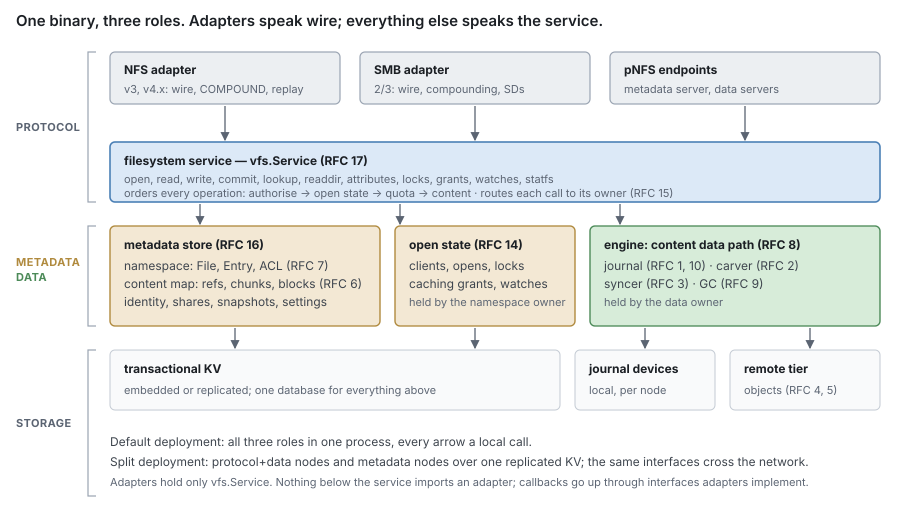
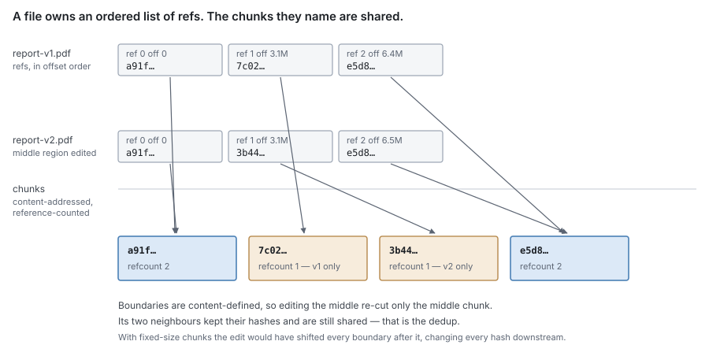
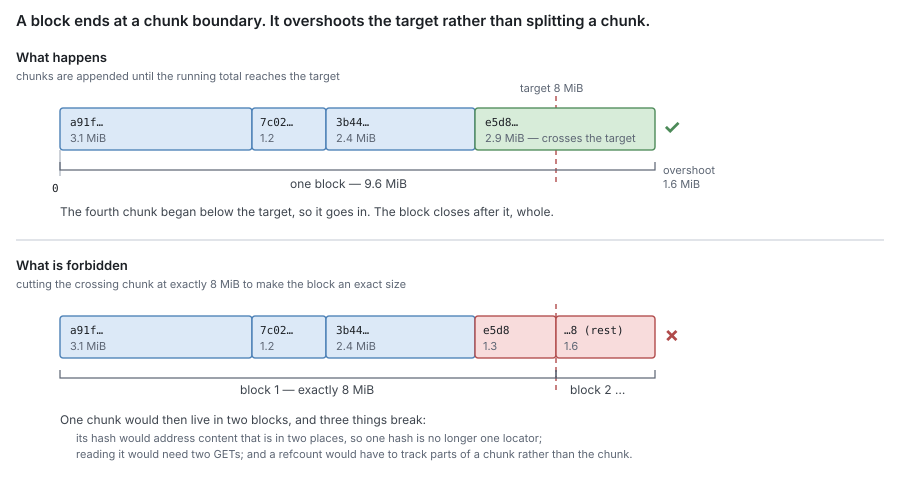
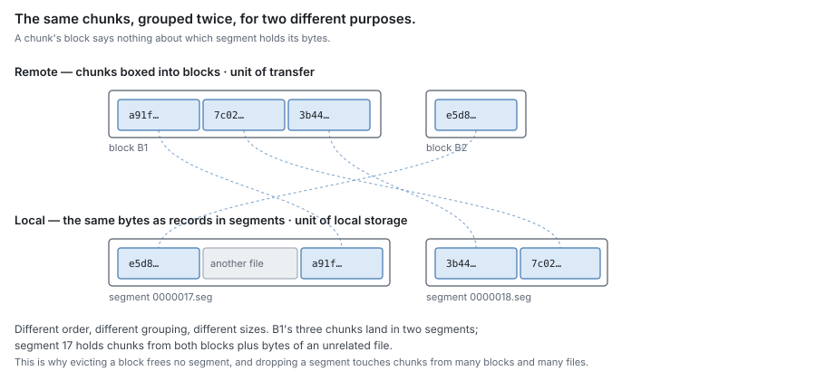
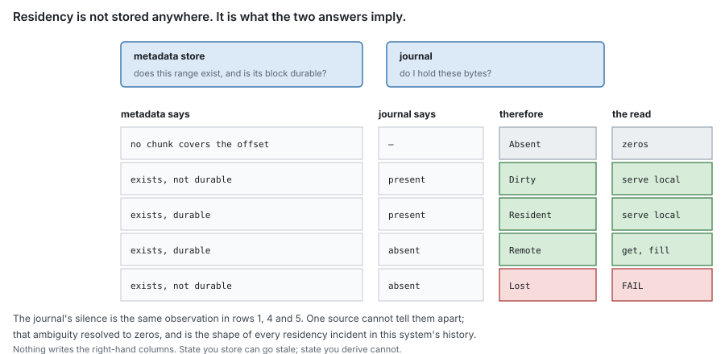
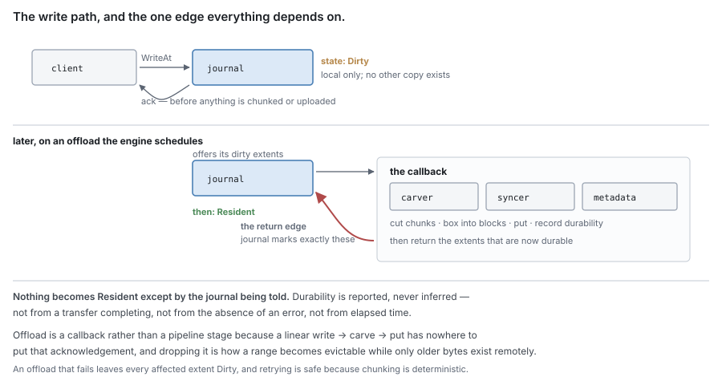
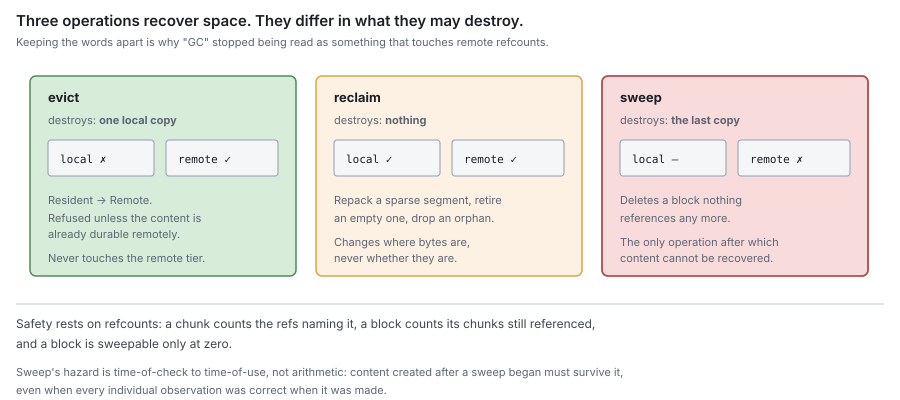

# RFC 0 — the data lifecycle

**Status:** draft.
**Audience:** anyone implementing or reviewing a storage component.

This is the root of the RFC set. It defines the terms, the data model, the
residency function, the operations and the invariants that no single component
can enforce alone. Every other RFC in the set inherits these and does not
redefine them. Conventions, including the RFC 2119 key words, are in
[the RFC index](rfc-index.md#Conventions).

---

## 1. Scope

DittoFS stores file content in two tiers. The **journal** is the local tier: it
holds bytes on this machine, one journal per device, each serving the files of
many shares. The **remote tier** holds them durably elsewhere.
"Journal" names the component throughout this set; where a sentence contrasts
the two sides, "remote tier" is its counterpart.

This document specifies how content moves between them, how its location is
known, and what must remain true throughout.

It does not specify wire protocols, authentication, or the filesystem namespace
beyond its relationship to content.

### 1.1 The component set

The components, what each owns, and the order to read them in are listed in
[the RFC index](rfc-index.md). This document owns the terms, the data model,
residency, the lifecycle, the cross-component invariants and the failure model;
it owns no component's internals.

### 1.2 Component autonomy

A component **MUST NOT** import another component in this set. The composition
root is the one exception: it builds the components a node's roles need,
imports them, and is imported by none of them ([RFC 15](rfc-15-topology.md)).

Where a component requires a capability it does not own, it **MUST** declare an
interface for that capability in its own package, named for the need rather than
for the provider. The composition root supplies an implementation at composition
time.
Each component **MUST** build and pass its tests with every such interface
stubbed.

A capability **MUST NOT** be negotiated by type assertion on an interface the
provider does not declare it satisfies. A capability that is absent **MUST**
produce a build failure, not a silent fallback.

An assertion that fails yields a working program with silently degraded
behaviour — an unindexed lookup, a disabled guard — that no test observes; a
declared parameter cannot fail this way. The same holds for configuration: an
invalid setting **MUST** be refused, never replaced by a default.

Conformance is checked by a per-component import-graph test.

### 1.3 The layers



Four layers, each calling only the one below:

| Layer | What it does | Specified in |
| --- | --- | --- |
| **Adapters** | speak one wire protocol each: framing, compounds, replay, error codes | RFC 20–22 (planned) |
| **Filesystem service** (`vfs.Service`) | the one protocol-neutral API adapters call; orders every client operation across the parts below and routes it to its owner | [RFC 17](rfc-17-vfs.md) |
| **Metadata store**, **open state**, **content subsystem** | the store holds every fact about files, content, identity and configuration ([RFC 6](rfc-6-block-metadata.md), [RFC 7](rfc-7-namespace-metadata.md), [RFC 16](rfc-16-metadata-store.md)); open state holds opens, locks and caching grants ([RFC 14](rfc-14-open-state.md)); the content subsystem is the content data path, made of the engine ([RFC 8](rfc-8-engine.md)), the journal, carver, syncer and GC ([RFC 1](rfc-1-journal.md)–[3](rfc-3-syncer.md), [RFC 9](rfc-9-gc.md)) | as named |
| **Persistence** | a transactional KV (embedded on one node, replicated in a cluster), journal devices, the remote tier | [RFC 16](rfc-16-metadata-store.md), [RFC 1](rfc-1-journal.md), [RFC 4](rfc-4-remote-tier.md) |

One binary serves every deployment. Which layers a node composes is set by its
**roles** ([RFC 15](rfc-15-topology.md)):

- `protocol` — adapters and the filesystem service. It holds no state of its
  own and forwards each call to the owner that serves it.
- `storage` — the metadata store's view, open state and the content subsystem
  with its journals. A node with this role can own ownership units.

The default is both roles in one process, where every arrow in the picture is a
local call; a split deployment runs protocol nodes in front of storage nodes
over one replicated KV, and the same interfaces cross the network.

**Each ownership unit has one owner** ([RFC 11](rfc-11-ownership.md)), with one epoch and one
lease. That owner holds the unit's namespace records, its open state and its
content, so the conflict check for an I/O and the I/O itself run in one place,
and no operation on one file is split across two owners. A file's byte ranges
**MAY** be split into range units, each with its own owner, so a large file can be
striped across nodes; each range unit still has exactly one owner.

> [!important] Pending review — two roles, one owner per unit
> The two owner-capable roles merged into `storage`, and a unit's two owners
> into one. Splitting them again remains
> a recorded upgrade path in RFC 11, not a design point. The engine box became
> the content subsystem.

## 2. Terminology

### 2.1 Entities

**File** — a namespace entry with an identity, attributes, and an ordered list
of chunk references.

**FileAttr** — a file's size, ownership, mode, timestamps and identifiers.

**Chunk** — a run of bytes identified by the BLAKE3-256 hash of its content.
Chunks are content-addressed, reference-counted, and shared: one chunk MAY be
referenced by many files. Boundaries are content-defined (FastCDC), so inserting
bytes early in a file re-cuts only the chunks around the insertion.

Chunk boundaries are sought within a configured size range. The range bounds
where a boundary may be *placed*; it does not bound chunk size absolutely. The
final chunk of a file is emitted whole at whatever size remains, so a file
smaller than the extent minimum is exactly one chunk. **Content MUST NOT be
padded to a chunk size.**

**A chunk whose bytes are all zero is a hole.** Where one is cut, the file
records a hole instead of a ref ([RFC 6](rfc-6-block-metadata.md)); no all-zero chunk is ever stored or
counted, and its extent resolves as **Absent**, which reads as zeros.

**ChunkRef** — one file's use of one chunk at one offset. A file's content is
fully described by its ordered list of chunk refs. Many refs MAY name one chunk.

**Version** — the content version of a file's bytes: a number that orders every
write and removal of one file, assigned when the operation is staged
([RFC 1 §5.3](rfc-1-journal.md#5.3%20Versions)). Where two operations cover the same byte, the higher version
wins, whatever order they arrived in. A chunk ref records the versions of the
content it was committed from ([RFC 6 §4.4](rfc-6-block-metadata.md#4.4%20Commits%20for%20one%20file%20apply%20in%20order)).

**Block** — the unit of remote storage: a whole number of chunks in one object,
addressed by one remote key and written by one put. A get retrieves chunks of a
block, or the whole block. A block targets a configured size and MAY exceed it by
at most one chunk; the last block of an offload pass MAY fall short
([RFC 2 §5](rfc-2-carver.md#5.%20The%20block%20assembler), P2), because **a block boundary is always a chunk
boundary**. A chunk **MUST NOT** span two blocks ([§2.2](#2.2%20How%20a%20file%20relates%20to%20its%20chunks)).

**Segment** — a local append-only file of records, capped at a configured size,
sealed when full and immutable thereafter.

**Record** — one framed run of bytes within a segment, carrying a header with
its identity, length and checksum.

**Extent** — a contiguous `(offset, length)` region of one file's bytes. This is
the only term for that concept: "range", "region" and "span" are not separate
terms and **MUST NOT** be introduced as though they were. An extent is a value,
not a thing that is stored; where a component keeps state about one, it keeps it
*against* the extent.

A **block** and a **segment** are unrelated groupings ([§2.2](#2.2%20How%20a%20file%20relates%20to%20its%20chunks)).

### 2.2 How a file relates to its chunks

A file does not contain its content. It contains an ordered list of references to
chunks, and the chunks are shared.



The refs are ordered and belong to the file. The chunks are content-addressed and
belong to nobody: the same chunk is named by every ref whose content hashes to
it, and its refcount is how many refs those are. This is the whole of
deduplication — there is no copying step and no second representation, only a
second ref naming a chunk that already exists.

Because boundaries are content-defined, an edit disturbs only the chunks it
falls inside. Editing the middle of a file re-cuts the middle chunk; the chunks
either side keep their hashes and stay shared. Under fixed-size chunking the
edit would shift every boundary after it, so every subsequent chunk would hash
differently and nothing downstream of the edit would dedup.

#### A chunk is never split across blocks

Chunks are grouped into blocks for transfer. The grouping accumulates chunks
until the running total reaches the configured target, and then **ends at that
chunk's boundary** — so a block is usually a little larger than the target,
never a little different in composition. Only the last block of an offload pass may
be smaller.



Overshoot is the price of a rule that holds everywhere else. If a chunk could be
cut to make a block an exact size, then:

- its hash would name content living in two blocks, so **one hash would no
  longer be one locator** — and a chunk's hash being its address is what makes
  it findable, shareable and countable at all;
- reading that chunk would require two transfers, and reading it during a
  partial fetch would require knowing it was split;
- a refcount would have to describe parts of a chunk rather than a chunk, so
  "is this chunk still referenced" — the question sweep depends on ([§8.3](#8.3%20Sweep)) — would
  stop having a single answer.

The rule costs at most one chunk of overshoot per block. Breaking it costs the
identity property the entire content-addressed model rests on.

#### Blocks and segments group the same chunks differently

A block is a remote grouping of chunks. A segment is a local file of records.
They are built by different processes, at different times, from different
inputs, and neither can be derived from the other.



A chunk's block says nothing about which segment holds its bytes, and a
segment's contents say nothing about any block. This is why evicting a block
frees no segment, and why dropping a segment affects chunks belonging to many
blocks and many files.

### 2.3 Operations

| Term | Means |
| --- | --- |
| **write** | stage bytes in the journal and acknowledge the client |
| **sync** | make durable in the journal |
| **offload** | the journal's pass: offer dirty extents, accept durability reports. Not a client's flush (NFS `COMMIT`, SMB `FLUSH`, `fsync`), which only syncs the journal ([RFC 8 §5.1](rfc-8-engine.md#5.1%20Commit%20is%20answered%20by%20the%20journal)) |
| **chunk** | place one content-defined boundary |
| **box** | group chunks into one block |
| **put** / **get** | make durable in the remote tier / retrieve from it |
| **fill** | place retrieved remote bytes into the journal |
| **demand** fetch | a get a reader is waiting on |
| **speculate** | get a block no reader has asked for yet: **read-ahead** (following an observed access pattern) or **pre-warm** (an explicit request over a share or subtree) |
| **evict** | release local bytes that are durable remotely ([§8.1](#8.1%20Evict)) |
| **reclaim** | recover local space without losing content ([§8.2](#8.2%20Reclaim)) |
| **sweep** | delete a remote block that nothing references ([§8.3](#8.3%20Sweep)) |

These words are disjoint and **MUST NOT** be used interchangeably. In
particular, *evict*, *reclaim* and *sweep* differ in what they may destroy:
eviction destroys a local copy, reclamation destroys nothing, and sweep destroys
the last copy.

## 3. Identity

A file's identity is its `ID`, a UUID unique across the store and stable for
the life of the file: it survives rename, relink and every rewrite of content.
The journal keys content by it.

The journal's `FileID` **MUST** be a distinct type constructible only from a
file `ID`, so that a value of another kind cannot reach it by conversion. It
does not encode the file's share: one journal serves many shares, and the share
is looked up, never derived from the identifier.

### 3.1 Deduplication

Deduplication is per chunk. A chunk whose hash is already known is referenced
rather than stored or transferred again, and its refcount increases. It catches
any overlap between files, whole or partial; there is no second, whole-file
mechanism.

## 4. Residency

### 4.1 The two oracles

Content location is described by two independent sources, each authoritative for
exactly one question.

> The **journal** answers: *do I hold these bytes on this disk, and at what
> offset?*
>
> The **metadata store** answers: *does this extent exist, which chunk covers it,
> which block holds it, and is that block durable remotely?*

The journal **MUST NOT** record whether content exists or whether it was ever
written, and **MUST NOT** be consulted about remote durability — it is not
authoritative for it. What it holds is still evidence: until a write's existence
is committed to metadata ([§5.1](#5.1%20Write)), the bytes the journal holds are the only
record that the write happened, and the engine treats them as such. It **MAY** record that it has been *told* an extent is
durable, for the two internal purposes [RFC 1 §2](rfc-1-journal.md#2.%20The%20model%20it%20presents) permits: selecting offload
candidates, and refusing an unsafe release. That record is never an answer.

The metadata store **MUST NOT** record where bytes sit on local disk.

**Neither oracle consults the other.** The journal requires no interface from the
metadata store and **MUST NOT** acquire one. An extent it does not hold is reported
as absent, with no judgement about why; resolving that absence is the engine's,
in [§6.1](#6.1%20Resolution). A design in which the journal asks what exists reintroduces the single
oracle this section exists to remove.

### 4.2 The residency function

An extent's residency is not stored. It is computed from the two answers. For an
offset, metadata answers one of three classes ([RFC 6](rfc-6-block-metadata.md)): a **hole**
(or past the end of the file), **uncarved** (written, no chunk yet), or **carved**
(a chunk covers it; a chunk is recorded only once its block is durable).

| metadata | journal | residency | read behaviour |
| --- | --- | --- | --- |
| hole | absent | **Absent** | zeros |
| hole | present | **Dirty** | serve locally: a write whose existence is not yet committed ([§5.1](#5.1%20Write)) |
| uncarved | present | **Dirty** | serve locally |
| uncarved | absent | **Lost** | fail |
| carved | present | **Resident** | serve locally |
| carved | absent | **Remote** | get, fill, serve |

Until a write's existence is committed, metadata still calls its range a hole.
If the journal loses those bytes to local corruption before the next stability
point, the range reads as **Absent** — the one way I1 can fail, accepted as the
price of group-committing existence ([§5.1](#5.1%20Write)). A crash alone cannot cause it,
because the journal's record survives a crash; the journal reports the
corruption as a loss event ([RFC 1 §3.8](rfc-1-journal.md#3.8%20Loss%20events)).



A block counts as durable only while it can be decoded. A block whose material
is lost for good ([RFC 5 §2.7](rfc-5-transforms.md#2.7%20Failures)) is not durable, so an extent it covers that the
journal no longer holds is **Lost**. Material that is only unavailable is a
failure of the remote tier, not of residency ([§10](#10.%20Failure%20model)).

An implementation **MUST NOT** persist the resolved residency of an extent, and
**MUST NOT** maintain a cache of it that can outlive either input.

The function is total: every combination of the two answers yields exactly one
residency. **Absent** and **Lost** are distinct, and an implementation **MUST**
distinguish them — returning zeros for **Lost** is data loss reported as data.

> [!note]
> The distinction is the reason for the split. A single source cannot
> tell "never written" from "no longer held", because both are the absence of a
> local record. Two sources can, because only one of them is responsible for
> knowing what exists.

### 4.3 Reporting

An extent becomes **Resident** only when the journal is told that the
corresponding block is durable remotely. An implementation **MUST NOT** infer
remote durability from the completion of a transfer, the absence of an error, or
elapsed time. Durability is reported by the component that observed it, to the
component that records it.

The journal's offloaded bit is set in exactly two ways: by a durability report,
from an offload ([§5.2](#5.2%20Offload)) or from the engine's reseed, and by fill ([§6.2](#6.2%20Fill)),
whose bytes came from the remote tier and are therefore durable there by
construction ([RFC 1 §3.4](rfc-1-journal.md#3.4%20Fill)). The journal persists the bit, so it survives a
restart ([RFC 1 §9.2](rfc-1-journal.md#9.2%20Offload%20state%20after%20recovery)).

## 5. The write path

### 5.1 Write

1. The namespace layer authorises the write.
2. The journal stages the bytes and appends a record.
3. The client is acknowledged.

The client **MUST NOT** be acknowledged before the bytes are recoverable from
the journal under the configured durability policy. Content **MUST NOT** be
chunked, hashed or transferred on this path.

The resulting extent is **Dirty**.

The write's **existence** — the file's size, its holes and its mtime — is not
written to metadata per write. It becomes durable at the protocol's stability
point (a commit, a flush, a stable write, or a close where the protocol requires
one), group-committed across files. Until then the journal is the authority for
it: reads see the write through the journal, and after a crash the engine
re-applies existence from the journal before serving ([RFC 8](rfc-8-engine.md)). Truncate,
deallocate, release and clone are not deferred this way; each is a synchronous
metadata operation.

### 5.2 Offload

Offload is initiated by policy and driven by the journal, which offers its dirty
extents and accepts a report of what became durable:

```
journal.Offload / OffloadMany(ids, fn)
    │  offers dirty extents, of one file or several
    └──► fn:  carver  — cut chunks
              engine  — group chunks into blocks, across files
              syncer  — put blocks
              metadata — record chunks, refs, blocks, durability
    ◄──── returns the extents now durable remotely
journal marks exactly those extents
```



The callback returns the extents that became durable. The journal **MUST** mark
exactly those, and **MUST NOT** mark an extent for which no report was received.

> [!note]
> The callback shape exists because the acknowledgement has nowhere to
> live in a linear `write → carve → put` pipeline. The return edge is the only
> path by which an extent becomes **Resident**.

An offload that fails leaves every affected extent **Dirty**, and **MUST** be
retryable without loss. Chunking is deterministic ([RFC 2](rfc-2-carver.md)), so a retry that
offers the same stretch of bytes converges on the same chunk identities. A retry
whose stretch starts elsewhere — an offer cut at a limit, or a partial report that
moved the start of what remains dirty — cuts its first chunks differently until
its boundaries rejoin the earlier ones. Those few chunks are stored again under
new hashes and the earlier ones are left to sweep: a cost in space and transfer,
never in correctness.

A block's name is not a function of its content alone: each put attempt mints a
fresh name, and records a **put intent** for it before the put
([RFC 6 §7.6](rfc-6-block-metadata.md#7.6%20Put%20intents)). A retry within one attempt reuses its name and writes
the same bytes; a new attempt never reuses an earlier one's name. An attempt that
fails leaves an intent and possibly an object, and GC collects both
([RFC 9 §5](rfc-9-gc.md#5.%20Unrecorded%20objects)).

## 6. The read path

### 6.1 Resolution

1. The journal is asked for the extent. It returns the bytes it holds, and the
   extents it does not.
2. For each extent it does not hold, metadata is consulted for the covering
   chunk and its block.
3. The residency function ([§4.2](#4.2%20The%20residency%20function)) determines the outcome:
   - **Absent** — the extent is a hole. Return zeros.
   - **Remote** — get the chunks it needs, or the whole block; serve the verified
     bytes; fill ([§6.2](#6.2%20Fill)) if policy says so, without the reply waiting on it.
   - **Lost** — fail. An implementation **MUST NOT** return zeros.

### 6.2 Fill

Fill is the only operation that makes an extent locally present without a client
write. It transitions **Remote → Resident**.

Fill **MUST NOT** overwrite an extent that the journal holds. Retrieved content
reflects a past state, and a concurrent write to the same extent is newer by
definition; the write wins.

Filling is discretionary. An implementation **MAY** decline to fill a retrieved
extent, serving it without retaining it. Declining is appropriate when retaining
would displace content more likely to be read again, including under local
capacity pressure and during large sequential reads.

Whether to fill is policy and belongs to the engine ([RFC 8](rfc-8-engine.md)). The mechanism and
its concurrency safety belong to the journal ([RFC 1](rfc-1-journal.md)).

## 7. Mutation and removal

**Overwrite.** New bytes are staged at the same offsets and become new chunks at
the next offload. Superseded chunk refs are dropped from the file's list. The
chunks themselves persist until their refcounts reach zero.

**Truncate.** Chunk refs beyond the new size are dropped; a ref straddling the
boundary is narrowed. A narrowed ref **MUST NOT** continue to describe content
past the new size.

**Delete.** The namespace entry is removed. The file's chunk refs are removed,
and each named chunk's refcount decremented, when the file is released: at once,
or, if the file is still open, once the last open state is gone
([RFC 7](rfc-7-namespace-metadata.md)). Deletion **MUST NOT** remove content
from the remote tier; that is sweep ([§8.3](#8.3%20Sweep)), and it is asynchronous.

**Removals are batched.** A truncate, deallocate, release or clone can name more
refs than one metadata transaction may write. Each is recorded first as a durable
removal, in one small transaction that writes no refs; its refs are then dropped
in bounded batches that resume after a crash
([RFC 6 §6.2](rfc-6-block-metadata.md#6.2%20Truncation%20and%20deallocation)). From the first transaction on, the removal
**masks** the refs it has not yet dropped: no read resolves through them, and the
range reads as the removal left it. A masked ref stays counted until the batch
that deletes it, so a partly applied removal can leak for a while but never
under-count (I10).

**Snapshots keep superseded records.** A snapshot is a versioned view, not a
copy: taking one writes one cut record, and nothing is drained or copied
([RFC 12](rfc-12-snapshots.md)). Refs, and the namespace records — files, entries, ACLs,
extended attributes, stream links — carry the cut they were born after and the
cut they died after. An overwrite, removal or release that replaces
a ref a snapshot can still see moves it into the file's history in the same
transaction, instead of dropping it; a namespace record is superseded the same
way. Content still dirty in the journal at the cut is pinned to that cut: the
journal keeps the superseded version until it is offloaded under the cut. A history ref is counted
like a live one; the chunk's count does not change when a ref moves. Which
snapshots see a ref is decided by the share's cut number, recorded on the ref
when it is committed and when it is superseded ([RFC 6 §6.5](rfc-6-block-metadata.md#6.5%20Who%20owns%20a%20ref)), never by a
journal version: versions are per journal, and a share's files may live in
several. Deleting a snapshot drops the history that no neighbouring cut still
sees.

> [!important] Pending review — snapshots are versioned records
> Snapshots no longer drain the journal or copy namespace records at the cut;
> every record carries its cuts, as refs already did.

## 8. Reclamation

Three operations recover space. They differ in what they may destroy, and
**MUST** be kept distinct in both code and discussion.



### 8.1 Evict

Evict releases local bytes whose content is durable in the remote tier,
transitioning **Resident → Remote**.

Evicting an extent that is not durable remotely produces **Lost** and is data
loss. An implementation **MUST NOT** evict a **Dirty** extent. This is the
definition of the operation, not a check applied to it.

Eviction **MUST NOT** modify the remote tier.

Eviction writes nothing to metadata ([RFC 8 §10.1](rfc-8-engine.md#10.1%20Eviction%20is%20chosen%20here%2C%20and%20needs%20no%20new%20record)): residency is computed, so
once the journal stops holding durable content, it resolves as **Remote**. Its
one ordering rule is that local bytes **MUST** be released only after the offload
commit that made them durable is itself durable. A release that precedes it can
leave, after a crash, content whose only copy is gone: **Lost**.

### 8.2 Reclaim

Reclaim recovers local space without changing what content exists. A reclaim pass
**MUST** be content-preserving — it changes where bytes are, never whether they
are.

Reclaim is the umbrella; the mechanisms under it are **repack** (copying live
records out of a sparse segment and unlinking it), retiring a segment that holds
nothing, and removing an unattachable file. [RFC 1 §8.2](rfc-1-journal.md#8.2%20Repack) specifies them.

**"Compaction" is deliberately not used for any of these.** In an LSM that word
names an operation that merges runs and *drops* superseded entries; in a
log-structured queue it names one that keeps only the latest value per key. Both
discard content. Reclaim never does.

### 8.3 Sweep

Sweep deletes blocks from the remote tier. It is the only operation in this
system that deletes content anywhere, and the only one after which content
cannot be recovered.

Safety rests on reference counting, specified in [RFC 6](rfc-6-block-metadata.md):

- a chunk carries the number of refs naming it: a file's live refs plus the
  history refs its snapshots still see ([§7](#7.%20Mutation%20and%20removal))
- a block carries the number of its chunks whose refcount is nonzero
- a block is sweepable only when that number is zero

A block **MUST NOT** be deleted while any chunk it contains is referenced.

Reference counts are read at different instants from the state they describe. An
implementation **MUST** ensure that content created or referenced after a sweep
began cannot be deleted by that sweep, even when every individual observation
was correct when made. [RFC 9](rfc-9-gc.md) specifies the protocol, run by one GC service for
the whole namespace. It needs no fence against writers: a name is never put twice
([§5.2](#5.2%20Offload)), so a remote object may be deleted once no block record and no put
intent names it. That state is final: no later put can reach the name, and a
delete that lands late can reach no committed block.

## 9. Invariants

These hold across components. No component can enforce any of them alone.

| # | Invariant |
| --- | --- |
| **I1** | An extent that exists is never read as zeros. Zeros are returned only for **Absent**. |
| **I2** | A **Dirty** extent is never evicted. |
| **I3** | A remote block is never deleted while any chunk it contains is referenced. |
| **I4** | Fill never overwrites content the journal holds. |
| **I5** | Remote durability is reported, never inferred. |
| **I6** | No component imports another component in this set, except the composition root, which composes them ([§1.2](#1.2%20Component%20autonomy)). Adapters import only the filesystem service ([RFC 17](rfc-17-vfs.md)). |
| **I7** | Every stored record has a named reclamation path that holds at the record's maximum size. |
| **I8** | A serialization conflict is retried within the caller's deadline, never surfaced as an I/O error. |
| **I9** | A block name is minted by one put attempt and put by no other; a remote object is deleted only when no block record and no put intent names it. |
| **I10** | A removal masks every ref it has not yet dropped from the moment it is recorded, and a ref stays counted until the transaction that deletes it. |

An implementation is conformant when all ten hold under concurrent operation,
across crash and restart, and in every condition in [§10](#10.%20Failure%20model).

Each invariant **MUST** be tested at the component that consumes the data
([test rules](rfc-index.md#Test%20tiers)).

### 9.1 Records and their reclamation

I7 binds every component that persists anything, because components sharing a
storage engine share its thresholds and triggers: one component's unbounded
record fills the store another component's records live in. An implementation
**MUST** be able to name what reclaims a stored record's superseded copies, and
the answer **MUST** hold at the record's maximum size, computed from its
worst-case encoding. A record that could cross the engine's threshold for moving
values into a separately reclaimed store **MUST** be bounded below it. Each
metadata RFC applies this to its own records ([RFC 6](rfc-6-block-metadata.md), [RFC 7](rfc-7-namespace-metadata.md)).

The placement index of [RFC 1 §5.2](rfc-1-journal.md#5.2%20The%20index%20is%20bounded%20by%20extent%20count%2C%20not%20by%20bytes) is held in memory and never stored, so I7
does not reach it; that RFC bounds it for a different reason.

### 9.2 Conflicts and their retries

I8 binds every component whose store detects write-write conflicts
optimistically. A conflict is the store doing its job, so it **MUST** be retried
and **MUST NOT** reach the caller as an I/O error. The retry **MUST** be bounded
by the caller's deadline, not by a fixed attempt count, and the backoff between
attempts **MUST** be randomised: a backoff computed from the attempt number alone
makes every loser of one conflict collide again on the next attempt.

Conformance drives concurrent writers at one deliberately shared key and asserts
two things together: conflicts **occur**, and **none** reaches the caller.

**A read that gates a commit MUST conflict with every concurrent write that would
change its result.** Stores differ in what they detect: one tracks point reads
but not range scans, another validates no reads at all and detects only
write-write conflicts and explicit locks. A scan over a key range is therefore
never such a read, and a check that must hold under any supported store is made
on point records written by both sides ([RFC 11 §8](rfc-11-ownership.md#8.%20Metadata%20consistency)).

### 9.3 Where each invariant is tested and observed

An invariant spans components, so its test lives with the component that
consumes the data ([§9](#9.%20Invariants)), and its signal with the component that can see
it break.

| # | Test owned by | Signal owned by |
| --- | --- | --- |
| **I1** | [RFC 8](rfc-8-engine.md): reads of **Lost** and **Remote** extents | RFC 8: reads failed as **Lost**, reads failed because the remote tier is unavailable |
| **I2** | [RFC 1](rfc-1-journal.md): `Release` refuses unmarked extents; RFC 8: eviction choice | RFC 1: dirty bytes against held bytes |
| **I3** | [RFC 9](rfc-9-gc.md): sweep against concurrent reference, including history refs a snapshot still sees | RFC 9: blocks swept, deletions refused; [RFC 6](rfc-6-block-metadata.md): count audit mismatches |
| **I4** | RFC 1: `Fill` against a concurrent write | RFC 1: fills refused as older than the file |
| **I5** | RFC 1: marking follows reports only; RFC 8: reports follow durable commits | RFC 1: bytes offered against bytes marked durable |
| **I6** | every RFC: its own import test | the build |
| **I7** | RFC 6, RFC 7, RFC 9: each stored record at its maximum size | the owning RFC: store size under rewrite |
| **I8** | RFC 6, RFC 7: concurrent writers on one key | the owning RFC: conflicts retried, and conflicts surfaced (which must stay zero) |
| **I9** | RFC 9: deletion racing a put and a delayed delete landing after a retry; [RFC 8](rfc-8-engine.md): a crashed attempt's intent is collected | RFC 9: intents abandoned and collected, objects collected by listing (which should stay near zero) |
| **I10** | RFC 6: the model test crashes a removal between batches and reads through it; RFC 8: reads during a partly applied truncate | RFC 6: removals not yet done, and their age |

## 10. Failure model

Every condition below has exactly one specified behaviour.

| Condition | Behaviour |
| --- | --- |
| **Remote tier unavailable** | Writes continue into the journal while capacity allows. No extent becomes **Resident**, so no extent becomes evictable. Reads of **Remote** extents fail; they **MUST NOT** return zeros. |
| **Journal at capacity, remote available** | Evict ([§8.1](#8.1%20Evict)); if nothing is evictable, reclaim ([§8.2](#8.2%20Reclaim)); if everything is **Dirty**, offload it and then evict it. The write is accepted once space is free, or refused at its deadline. |
| **Remote tier slow** | The remote accepts transfers but drains slower than writes arrive, with no error to act on. Writes are paced to the measured drain rate ([RFC 8 §10.2.1](rfc-8-engine.md#10.2.1%20Writes%20are%20paced%20before%20the%20limit%2C%20not%20stopped%20at%20it)); each waits at most until its deadline ([§10.3](#10.3%20Every%20wait%20on%20a%20request%20ends%20at%20a%20deadline)) and is then refused. Progress is not a reason to keep waiting: a drain that frees a trickle never runs a writer out of time otherwise. |
| **Journal at capacity, remote unavailable** | Refuse the write. Every local extent is **Dirty**, and I2 forbids evicting it, so refusal is the only behaviour that does not lose data. |
| **Metadata unwritable** | Writes are still staged and acknowledged from the journal; the next stability point fails and is reported as failed ([§5.1](#5.1%20Write)). Truncate, deallocate and the other synchronous operations fail. Offload fails, so extents stay **Dirty** and the journal fills until writes are refused ([§10.1](#10.1%20Capacity%20is%20a%20bound%2C%20not%20a%20target)). Reads continue while metadata is readable. |
| **Crash** | On restart the journal rebuilds its placement index from its segments; a torn tail is truncated to the last record that verifies. Metadata recovers by its backend's own durability, and the engine re-applies from the journal the existence of writes not yet committed, before serving ([§5.1](#5.1%20Write)). A removal recorded but not done masks until its batches resume, and an unfinished clone resumes before its destination is served ([§7](#7.%20Mutation%20and%20removal)). A put whose attempt died leaves an intent, collected once its owner epoch is superseded ([§5.2](#5.2%20Offload)). Otherwise the two recover independently and **MAY** disagree; [§10.2](#10.2%20No%20state%20requires%20intervention%20to%20leave) applies. |
| **Local content corrupt** | The journal drops only the extents backed by records that fail verification ([RFC 1 §9.3](rfc-1-journal.md#9.3%20Torn%20and%20corrupt%20records)). A dropped extent that was durable resolves as **Remote** and is fetched again; one that was **Dirty** resolves as **Lost**. The rest of the segment stays usable and reclaimable. |
| **Material unavailable** | The material provider cannot supply a key ([RFC 5 §2.7](rfc-5-transforms.md#2.7%20Failures)). Behaves as **Remote tier unavailable**: offload cannot encode and reads of **Remote** extents cannot decode. Material lost for good is not this row: its blocks are not durable ([§4.2](#4.2%20The%20residency%20function)). |

### 10.1 Capacity is a bound, not a target

The journal's capacity limit is enforced by a reservation taken before a write
is accepted ([RFC 1 §7](rfc-1-journal.md#7.%20Capacity)); a limit tested without reserving bounds nothing.

Refusal at the limit is a specified outcome, not a failure of the design. The
alternative — accepting content that cannot be made durable and cannot be
released — has no exit.

### 10.2 No state requires intervention to leave

Every condition in this section **MUST** resolve on its own once the underlying
cause is removed. An implementation **MUST NOT** have a state reachable by
normal operation from which it cannot return without operator action.

In particular: sustained inability to offload **MUST** be reported as a health
condition of the share, and **MUST NOT** be represented only as log output.

A count found about to go below zero is corruption ([RFC 6 §6.3](rfc-6-block-metadata.md#6.3%20Underflow%20is%20corruption%2C%20not%20a%20boundary)), and it
fails its transaction. It **MUST NOT** wedge the file or the share: the failure
schedules a targeted recount of the chunks it names, and the operation retries
once the recount has corrected them.

Recovery after a crash is required to be *truthful*, not to make the two oracles
agree. A chunk that metadata knows about and whose bytes did not survive is
**Lost**, and reads of it fail. Reconciling the two by assuming agreement
reintroduces the failure this model exists to prevent.

### 10.3 Every wait on a request ends at a deadline

Several rules in this set bound a wait by "the caller's deadline": a conflict
retry ([§9.2](#9.2%20Conflicts%20and%20their%20retries)), a write paced or refused at capacity ([RFC 8 §10.2](rfc-8-engine.md#10.2%20A%20capacity%20refusal%20comes%20back%20here)), a
cold read ([RFC 8 §7.5](rfc-8-engine.md#7.5%20An%20unreachable%20remote%20fails%20the%20read%2C%20distinguishably)). The bound is worth only what sets it, so:

- every operation that reaches the engine on behalf of a client **MUST** carry a
  deadline. The protocol front end sets it from the request; an operation that
  arrives with none **MUST** be given a stated default at the filesystem service
  ([RFC 17](rfc-17-vfs.md)), so "bounded by the caller's deadline" is never "unbounded";
- every wait on that operation's path **MUST** end at the deadline: a queue, a
  reservation, a retry, and a lock. A lock that cannot be abandoned **MUST** be
  held only for work bounded independently of any remote call, and the bound
  stated at the lock;
- a wait **MUST NOT** restart its budget because something made progress. A
  budget refreshed on progress is unbounded against a remote that drains a
  trickle;
- the refusal at the deadline **MUST** say why. A write refused for space reaches
  the client as "no space", not as an I/O error, so the client can tell a full
  store from a broken one.

Background work — offload, sweep, repair — is not a client request and **MAY**
wait longer, under its own stated bound.

## 11. Open questions

1. **What a retried transaction may close over** ([§9.2](#9.2%20Conflicts%20and%20their%20retries)) — a retried closure
   re-runs against state that changed since it was first called. Whether it may
   close over values read before the transaction opened, or must re-read every
   row it modifies, is not settled. One that closes over pre-read state can
   re-propose the decision the conflict was raised to prevent, which delays a
   lost update rather than preventing it.
2. **Fill policy** ([§6.2](#6.2%20Fill)) — filling is discretionary, and [RFC 8](rfc-8-engine.md) proposes a
   policy. Which one is right on real workloads is unmeasured.
3. **Eviction granularity** ([§8.1](#8.1%20Evict)) — this document constrains eviction by
   durability, not by unit; the unit is [RFC 1](rfc-1-journal.md)'s to choose. The right segment size
   is unmeasured, as is whether per-extent hole punching degrades at scale
   ([RFC 1 §12](rfc-1-journal.md#12.%20Open%20questions)).
