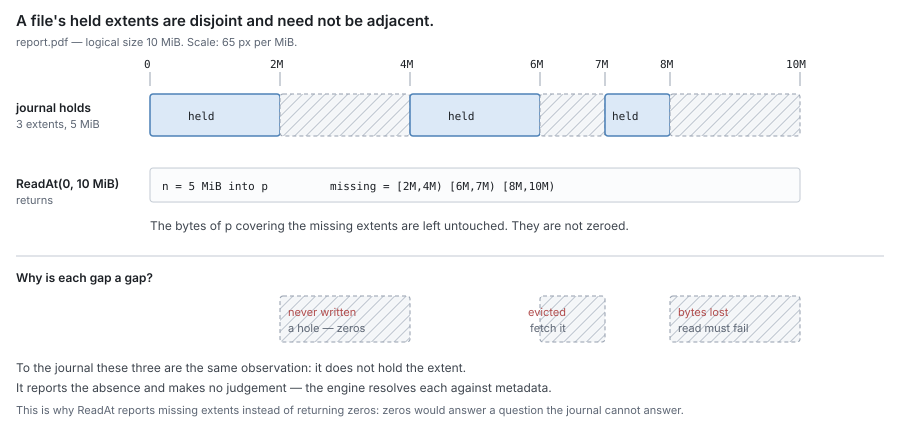
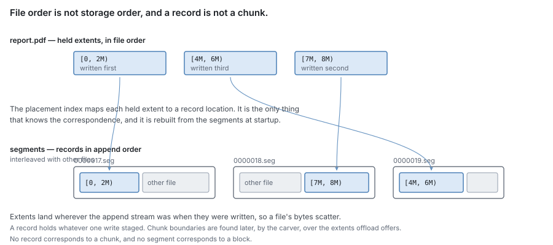
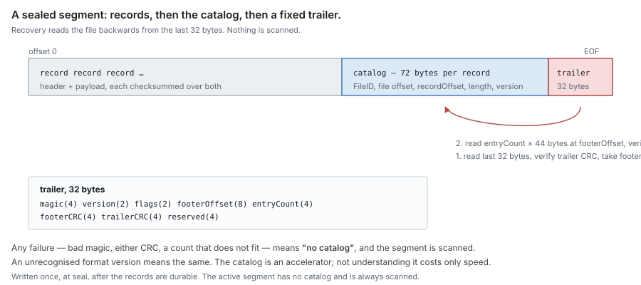
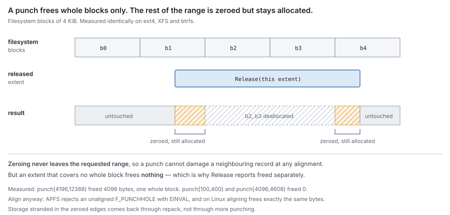
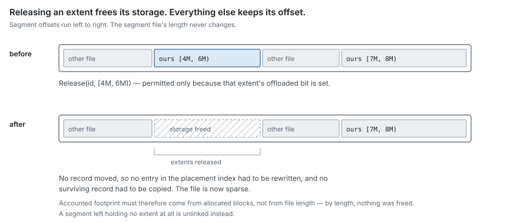
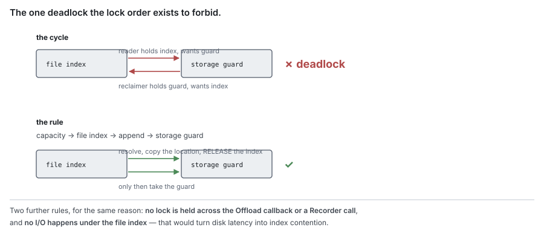

# RFC 1 — the journal

**Status:** reviewed.
**Audience:** anyone implementing or reviewing the journal.

---

## 1. Purpose

The journal holds bytes on this machine, durably against
process and machine failure, and it answers exactly one question about them:

> **Do I hold these bytes, at what offset, and which version of them?**

It is the component the client's write is acknowledged against, and the component
a read is served from when the bytes are here. There is one journal per device,
and it holds the files of every share placed on that device.

### 1.1 Non-goals

The journal **MUST NOT**:

- decide whether an extent that it does not hold is a hole, evicted, or lost — it
  reports only that it does not hold it ([§3.2](#3.2%20Read));
- return zero bytes for an extent it does not hold;
- know what a chunk or a block is;
- know which remote tier exists, or speak to one;
- import another component in this set ([RFC 0 §1.2](rfc-0-data-lifecycle.md#1.2%20Component%20autonomy)).

The journal has no dependency on the metadata store, the syncer or the carver,
and requires no interface from any of them. Its dependency set is the language's
standard library and the operating system's file interface, and an import test
**MUST** enforce that.

### 1.2 What it knows about content

The journal's unit is an **extent of one file's bytes**, named by a `FileID` and a
byte offset. It knows nothing about the structure of that content.

In particular, a **record is not a chunk**. A record is whatever one write
staged, possibly coalesced with adjacent writes. Chunk boundaries are
content-defined and are found later, by the carver, over the extents the journal
offers at offload. The journal **MUST NOT** assume any relationship between its
records and any chunk, block or remote object.

### 1.3 It is testable on its own

The journal's dependencies are the ones [§1.1](#1.1%20Non-goals) allows, and each is supplied:

| Dependency | In production | In a test |
| --- | --- | --- |
| a directory on a filesystem | the configured journal path | a temporary directory on a real filesystem |
| time | the system clock | a virtual clock the test advances, for the sync timer and every wait |

No metadata store, no carver, no syncer, no block store. A check **MUST** be
writable as: open a journal on a temporary directory, drive the interface of
[§3](#3.%20Interface), assert on what comes back and what is on disk.

**The filesystem is real, never faked.** Hole-punch alignment, torn tails and
whether a write survived are properties of real storage.

**Storage loss is simulated beneath the journal, not by killing it.** The journal
reaches its segment files through a narrow, package-internal seam — open, write
at an offset, sync, punch, close. A test wraps the real file and remembers every
write since the last sync; a simulated crash discards exactly those and reopens
the journal on the same directory. Killing the process instead leaves unsynced
writes in the page cache, and proves a durability the journal does not have.

**Time is virtual.** The sync timer ([§6.2](#6.2%20Sync%20policy)), write stalls and every bounded wait
run on the virtual clock, so the journal **MUST NOT** read time from anywhere the
virtual clock cannot replace.

## 2. The model it presents

For each `FileID`, the journal maintains a set of **held extents**: disjoint
`(fileOffset, length)` extents whose bytes it can produce, each mapped to a
location in local storage.

For each held extent it also records one bit of **offload state**: whether the
extent has been reported durable elsewhere ([§4.2](#4.2%20Segments)). This bit exists for two
purposes and no others — selecting what to offer at offload, and refusing an
unsafe release ([§6.1](#6.1%20Ordering%20rules)). It **MUST NOT** be consulted to answer a read, and the
journal **MUST NOT** expose it as an answer about remote durability; the journal
is not authoritative for that ([RFC 0 §4.1](rfc-0-data-lifecycle.md#4.1%20The%20two%20oracles)).

The bit can only be wrong in the safe direction: set solely by being told, and
only where no held content is newer than what was reported ([§9.2](#9.2%20Offload%20state%20after%20recovery)), it can call
a durable extent dirty — a redundant offload — but never a dirty one durable.

Every held extent also carries the **content version** of its bytes ([§5.3](#5.3%20Versions)).
Where a truncate, deallocate or delete removed content, the journal remembers the
removal and its version — a **removal marker** ([§3.6](#3.6%20Truncate%2C%20deallocate%20and%20delete)) — until the caller
settles it, so the caller can still learn of a removal its metadata has not yet
recorded ([§3.10](#3.10%20Settle%20and%20Since)). At every byte of a file, **the newest version the journal
has applied wins**.

Held extents are **disjoint and need not be adjacent**: an implementation **MUST
NOT** assume a file's held content is contiguous, nor that it begins at offset
zero.



The gaps carry no explanation. An extent never written, an extent released by
eviction, and an extent whose bytes were lost are the same observation to the
journal — it does not hold them — and it **MUST** report all three identically.
Resolving which is which is [RFC 0 §6.1](rfc-0-data-lifecycle.md#6.1%20Resolution), and it belongs to the engine.

A gap is a gap in the file, not in storage. The journal never writes into space
freed inside a segment: every record is appended at the end of its stream
([§4.2](#4.2%20Segments)), and freed space goes back to the filesystem by punching ([§8.1](#8.1%20Releasing%20storage)) or by
repack ([§8.2](#8.2%20Repack)). A write that fills a gap in a file lands wherever its stream
stands, like any other write.



Nothing relates an extent's position in the file to its position in storage.
Extents land wherever the append stream stood when they were written, so a
sequential file is stored out of order, interleaved with other files.

`FileID` **MUST** be a distinct type constructible only from a file `ID`
([RFC 0 §3](rfc-0-data-lifecycle.md#3.%20Identity)). File IDs are unique across the store, so files of many shares share one
journal without colliding, and a `FileID` **MUST NOT** encode a share: the share a
file belongs to is given by the handle it is written through ([§3](#3.%20Interface)), never
derived from its identifier.

## 3. Interface

```go
Open(dir string, floor Version) (*Journal, error)
(*Journal) Share(tag ShareTag, limit int64) *Handle
```

One journal serves several shares. Each share's engine works through its own
`Handle`, and every operation below is a method of it. The handle's tag is
written into every record the share appends ([§4.3](#4.3%20Records)), so recovery rebuilds each
share's accounting ([§7](#7.%20Capacity)); a file belongs to one share for its life. `floor` is
the version floor of [§9.1](#9.1%20Rebuilding).

### 3.1 Write

```go
WriteAt(id FileID, off int64, p []byte) (v Version, err error)
Sync(ids ...FileID) error
```

Stages `p` at `off` and makes it durable within the sync bound
([§6.2](#6.2%20Sync%20policy)). On return with `err == nil`, the extent `(off, len(p))` is held, is
**Dirty**, and **MUST** survive process death.

`WriteAt` **assigns** the write's content version `v` and returns it. The version
**MUST** be assigned inside the file's serialised append ([§4.2](#4.2%20Segments)), so that for one
file, versions the journal assigns are appended in the order they were assigned.
Otherwise a lower version can land after a higher one and an offload between them
offers the higher without the lower, breaking [RFC 6 §4.4](rfc-6-block-metadata.md#4.4%20Commits%20for%20one%20file%20apply%20in%20order).

`Sync` returns once every operation on the named files that returned before the
call is durable. It is the journal's part of a client's
flush ([§6.2](#6.2%20Sync%20policy)).

`WriteAt` **MUST** reserve capacity before accepting bytes ([§7](#7.%20Capacity)) and **MUST**
fail rather than exceed the configured limit.

A write overlapping a held extent supersedes it wherever its version is newer,
which for a version `WriteAt` assigns is everywhere. The journal **MUST** serve the
newer bytes thereafter, and **MUST NOT** require the caller to invalidate first.

### 3.2 Read

```go
ReadAt(id FileID, off int64, p []byte) (n int, missing []Extent, held []Held, asOf Seq, err error)

type Held struct {
    Extent  Extent
    Version Version // the content version of the bytes served for this extent
}
```

Fills `p` from held extents. Every sub-extent of `(off, len(p))` that the journal
does not hold **MUST** be reported in `missing`, and the corresponding bytes of
`p` **MUST** be left untouched.

`ReadAt` **MUST NOT** zero-fill an extent it does not hold, and **MUST NOT**
return a short read in place of a `missing` entry. The caller distinguishes
hole from eviction from loss ([RFC 0 §6.1](rfc-0-data-lifecycle.md#6.1%20Resolution)); the journal supplies only the
absence.

`missing` **MUST** be exact: an implementation **MUST NOT** widen it to a whole
segment, record or block for convenience, because the caller pays a remote
transfer per entry.

`held` names the content version of each sub-extent served; whether that is
current anywhere else is the caller's question.

`asOf` is the file's change sequence at the moment of the read: the highest
sequence number of any operation that has changed the file's extents ([§3.4](#3.4%20Fill), [§5.3](#5.3%20Versions)). A caller that fetches
a `missing` extent passes it back to `Fill`.

### 3.3 Offload

```go
Offload(id FileID, limit, widen int64, fn func(o Offer, report func(durable []Extent)) error) error

OffloadMany(ids []FileID, limit, widen int64, fn func(offers []Offer, report func(id FileID, durable []Extent)) error) error

type Offer struct {
    ID         FileID
    Dirty      []Extent
    Neighbours []Extent    // durable held extents offered on request (widen); see below
    Oldest     Version     // the oldest content version among the offered records, neighbours included
    Newest     Version     // the newest
    Offered    io.ReaderAt // the bytes as offered; see below
}
```

Offers held extents of `id` whose offloaded bit is unset, and marks exactly the
extents reported durable through `report`.

**Offload is how dirty content becomes evictable.** The journal uploads nothing.
It hands the engine a frozen view of a file's dirty content, the **offer**; the
engine carves, uploads and commits it; and as each block's commit lands, the
engine tells the journal which extents are now durable. Those extents get their
offloaded bit, and only then can `Release` evict them ([§3.5](#3.5%20Release)). Offload makes
content evictable; `Release` evicts it. The name is the lifecycle step this call
serves ([RFC 0 §5.2](rfc-0-data-lifecycle.md#5.2%20Offload)).

**What an offer is.** A snapshot of one file's dirty content, taken when the call
starts:

- `Dirty`: the extents offered;
- `Oldest`, `Newest`: the range of their content versions;
- `Offered`: a reader that returns exactly those bytes for as long as `fn` runs.

Frozen means a client write during the pass changes what `ReadAt` serves, but
not what `Offered` returns. The carver hashes the bytes, and the uploader reads
them again later to send them ([RFC 3 §3.2](rfc-3-syncer.md#3.2%20It%20holds%20a%20reference%2C%20not%20a%20copy)); both must see the same bytes, or the
uploaded block would not match its hashes.

> **Example.** The offer covers `[0, 4)` MiB at v10. While its block uploads, a
> client writes `[1, 2)` MiB at v11.
>
> - `ReadAt` on `[1, 2)` returns v11. `Offered` on `[1, 2)` still returns v10: the
>   v10 record stays in its segment until `fn` returns.
> - The block commits, and the engine reports `[0, 4)`. The journal marks
>   `[0, 1)` and `[2, 4)`. `[1, 2)` stays dirty: the remote holds v10, the journal
>   holds v11, and marking it would let eviction drop v11, the only copy.
> - The next pass offers `[1, 2)` at v11.

**Durable neighbours are offered on request.** With `widen` above zero, each
offer also carries, in `Neighbours`, held extents whose offloaded bit is set and
that are contiguous with an offered dirty extent, up to `widen` bytes on each
side. They are frozen in `Offered` exactly like the dirty bytes, and counted in
`Oldest` and `Newest`. They are what the engine reads when it widens a run to
re-tile a ref the run partly replaces ([RFC 8 §6.7](rfc-8-engine.md#6.7%20A%20run%20is%20what%20the%20journal%20offers%2C%20widened%20only%20to%20re-tile)); without them it would read
bytes that a concurrent write or release can change under the carver. A report
naming a neighbour changes nothing: it is already marked.

**`report` marks durability block by block.** One offer is usually committed as
several blocks, and their commits land at different times. The engine calls
`report` once per committed block, naming that block's extents, and each call
marks them at once, so they become evictable without waiting for the rest of the
pass.

> **Example.** A pass offers 64 MiB, carved into 16 blocks of 4 MiB. Block 3
> commits first: `report([8, 12) MiB)` makes those 4 MiB evictable at once. Block
> 9's upload then fails and `fn` returns an error. Everything reported so far
> stays marked; the rest stays dirty and a later call offers it again.

- `report` **MAY** be called any number of times while `fn` runs.
- Once `fn` returns, `report` **MUST** fail: the offer is over, and its records
  may have moved or been superseded.
- The error `fn` returns covers only what was not reported; it takes back nothing.

**A `report` costs what it reports.** Marking *k* extents **MUST** cost
O(*k* log *n*), where *n* is the number of extents the file holds, and **MUST NOT**
scan the file's other extents to decide anything about the reported ones.

> **Example.** A 160 GB file written in 1 MiB writes holds about 150,000 extents.
> Reporting one 4 MiB block touches four of them, and must find those four through
> the index. A `report` that walks all 150,000 does it once per block — about
> 40,000 times over the file — inside the lock the file's writes and reads also
> need. Writes to that file slow as it grows, and stall in the end.

**`limit` bounds the dirty bytes one call offers.** The journal offers extents in
offset order until the next would pass the limit, and offers an extent larger than
what remains as a prefix ending at the limit; the rest is offered by a later call.
Without a bound, one pass over a large dirty file pins all of it until the last
block uploads. The engine chooses the limit ([RFC 8 §6.2](rfc-8-engine.md#6.2%20When%20a%20file%20is%20offered)). A prefix ends at the limit,
not at a boundary the content chose, so each limited pass adds one chunk boundary
the chunker did not pick ([RFC 2 §2.1](rfc-2-carver.md#2.1%20One%20unbroken%20stretch%20per%20call)).

**`Oldest` and `Newest`** bound the content versions of the records in the offer
([§5.3](#5.3%20Versions)). The engine records both on the refs the pass commits ([RFC 6 §4.4](rfc-6-block-metadata.md#4.4%20Commits%20for%20one%20file%20apply%20in%20order)) and
names them again when it reseeds ([§9.2](#9.2%20Offload%20state%20after%20recovery)); a range is all reseed and the stale rule
need.

`OffloadMany` is the same offer over several files in one callback, so the engine
can pack chunks of several files into one block ([RFC 2 §5.3](rfc-2-carver.md#5.3%20A%20block%20packs%20chunks%2C%20whichever%20files%20they%20came%20from)). Every rule of this section
holds per file within it, and `limit` bounds the total across the files.
`Offload(id, …)` is `OffloadMany` with one file, and an implementation **SHOULD**
build it that way.

The journal **MUST** mark exactly the reported extents and **MUST NOT** mark an
extent for which no report was received, including when `fn` returns an error
after some reports — a partial success **MUST** be honoured.

The journal **MUST NOT** interpret, reorder or subdivide a report except to
intersect it with what it offered. A reported extent that was not offered **MUST**
be rejected as an error, not silently accepted.

Offered extents **MUST** remain readable and **MUST NOT** be moved for the
duration of the call.

`Offered` reads at file offsets, and only inside the offered extents for the
duration of `fn`; a read outside them, or after `fn` returns, **MUST** fail rather
than return other bytes. A write that supersedes an offered extent while `fn` runs
is permitted and changes what `ReadAt` returns; it **MUST NOT** change what
`Offered` returns, so the superseded record **MUST** stay in its segment until `fn`
returns. The superseding write's offloaded bit **MUST** remain unset even if `fn`
reports its offset durable: the report is about the offered bytes, not the newer
ones.

**A removal does not interrupt an offer.** A `Truncate`, `Deallocate` or `Delete`
while `fn` runs takes effect at once for `ReadAt`, and **MUST NOT**
change what `offered` returns: the offered records stay on disk, unpunched, until
`fn` returns. A report naming an extent removed meanwhile marks nothing, because
nothing is held there. The engine drops the removed refs at commit
([RFC 8](rfc-8-engine.md)).

### 3.4 Fill

```go
Fill(id FileID, off int64, p []byte, asOf Seq, v Version) error
```

Places retrieved remote bytes into local storage. This is the only path by which
an extent becomes held without a client write.

`Fill` **MUST NOT** overwrite any part of an extent the journal already holds; it
**MUST** write only the sub-extents that are currently absent, and it **MUST**
make that determination and the write atomic with respect to concurrent
`WriteAt` on the same file.

**A Fill older than the file is refused.** `asOf` is the sequence `ReadAt` returned
when the caller found the extent missing ([RFC 8 §7.2](rfc-8-engine.md#7.2%20The%20reply%20streams%2C%20one%20verified%20chunk%20at%20a%20time)). The journal keeps, per file, the
highest sequence number of any operation that changed its extents — `WriteAt`, `Release`,
`Truncate`, `Deallocate` and `Delete`. If it
is newer than `asOf`, `Fill` **MUST** write nothing and return a distinct error.
The per-file sequence is bounded: a `Delete` drops the file's entry
and raises one journal-wide **floor sequence** to its own sequence number, and a
file with no entry is compared against that floor. Without this, a fetch that
began before a write, or before a truncate down and up, could land after it and
put old bytes back, marked durable. The check is per file and deliberately
coarse: a needless refusal costs only a cache miss.

A filled extent's offloaded bit **MUST** be set, because the content came from the
remote tier and is by construction durable there. **This makes `Fill` as
safety-critical as `Release`.** The caller **MUST** pass only bytes it retrieved
from the remote tier for that exact extent of that exact file; anything else
becomes content the journal will release while it exists nowhere.

`v` is the content version of the ref the bytes were fetched from: its `newest`
([RFC 6 §2.1](rfc-6-block-metadata.md#2.1%20ChunkRef)). The filled record carries it, so reseed and the stale rule treat
filled content like any other ([§9.2](#9.2%20Offload%20state%20after%20recovery)). Its sequence number is new, like every
append's, so where it and a record still on disk carry the same version — the
release record of the content it replaces — the fill wins at recovery ([§5.3](#5.3%20Versions)).

#### Fill is not a write

`Fill` and `WriteAt` take nearly the same arguments and are opposites: a write is
newer than what is held, supersedes it and owes an offload; a fill is older, must
not touch held content, and is durable already. An implementation **SHOULD** share
their append machinery and **MUST NOT** expose them as one entry point selected by
a parameter: a caller passing the wrong value would discard a client's write or
make undurable content evictable, and nothing would fail at the time.

### 3.5 Release

```go
Release(id FileID, extents []Extent) (freed int64, err error)
```

Stops holding `extents` and frees the underlying local storage. This is the
mechanism of eviction; the policy is the engine's ([RFC 0 §8.1](rfc-0-data-lifecycle.md#8.1%20Evict)).

`Release` **MUST** refuse an extent whose offloaded bit is unset, and **MUST** make
no partial progress on a refused call: the journal's enforcement of [RFC 0](rfc-0-data-lifecycle.md)'s
I2, which the caller is also obliged to keep.

The caller **MUST NOT** call `Release` before the offload commit that made the
content durable is itself durable ([RFC 0 §8.1](rfc-0-data-lifecycle.md#8.1%20Evict)). Eviction records nothing
elsewhere; the journal cannot verify this ordering and does not try.

`freed` is the local storage actually returned to the filesystem, which **MAY** be
less than the extent length ([§8.3](#8.3%20Accounting)). It **MUST NOT** count storage still waiting
for a punch or an unlink: a `Release` either syncs its release records (grouped
with any other pending sync) and punches before it returns, or returns
a completion the engine waits on, which reports `freed` once the storage is back.
`UsedBytes` falls at the same moment, never earlier. An engine that sees space
reported free and retries a refused write before it is free gets the refusal
again ([§7](#7.%20Capacity)).

**A release is recorded.** `Release` appends one **release record** per released
extent, naming the file, the extent and the content version released there, with a
new sequence number ([§5.3](#5.3%20Versions)). Recovery applies it like any record, so an older
record still on disk is not held again after a restart. A release leaves no
removal marker: eviction removes nothing from the file.

The release record **MUST** be durable before any storage it frees is punched or
its segment unlinked ([§6.1](#6.1%20Ordering%20rules)). If a crash loses the record, it loses the punch
too, and the released record is still whole on disk: held again after recovery,
as it was before the release. A release record draws on the reserved headroom of
[§7](#7.%20Capacity), so a full journal can always release.

### 3.6 Truncate, deallocate and delete

```go
Truncate(id FileID, size int64) (Version, error)
Deallocate(id FileID, e Extent) (Version, error)
Delete(id FileID) (Version, error)
```

`Truncate` stops holding every extent at or beyond `size` and narrows an extent
straddling it. `Deallocate` stops holding `e`, whatever its offloaded bit, and is
how a punched range stops being served ([RFC 8 §8.2](rfc-8-engine.md#8.2%20Deallocate%20records%20a%20hole%3B%20it%20does%20not%20write%20zeros)). `Delete` stops holding every
extent of `id`.

Each is versioned like a write: the journal assigns the version inside the file's
serialised append, appends a record carrying it, and leaves a **removal marker** —
the removed range and the removal's version, holding no bytes. Content with a
version **below** the marker's is not held inside the range; content at or above
it is. Markers live in the placement index and cost an entry each.

**A marker lives until the caller settles it.** It exists so the caller can learn
of a removal its metadata has not yet recorded: `Since` yields it ([§3.10](#3.10%20Settle%20and%20Since)).
The engine settles a file after the metadata transaction recording the removal
commits ([RFC 8 §2.5](rfc-8-engine.md#2.5%20Start%20in%20order%2C%20stop%20in%20reverse%2C%20and%20join%20before%20closing)). Recovery rebuilds every marker from the removal records on
disk ([§9.1](#9.1%20Rebuilding)), since settling is not persisted: a marker the caller settled
before a crash comes back and is settled again after it, which costs one
repeated, idempotent metadata step.

> **Example.** Truncate to 1 MiB at v8 leaves a marker over `[1 MiB, ∞)` at v8. The engine
> commits the new size, then calls `Settle(id, 8)`, which drops the marker. Had
> the process crashed between the truncate and the commit, recovery would rebuild
> the marker from the truncate record, and `Since` would hand it to the engine to
> commit.

Each **MUST** be durable on return, and **MUST NOT** require the affected
storage to be reclaimed first — reclamation is asynchronous ([§8](#8.%20Reclamation%20mechanisms)). Their
records draw on the reserved headroom of [§7](#7.%20Capacity), and are never refused by the
journal's own limit.

None **MUST** be gated on the offloaded bit. Discarding content the user removed
is not data loss, and an un-offloaded delete that a crash reverts would resurrect a
removed file.

### 3.7 State introspection

```go
Extents(id FileID) ([]Extent, error)      // held extents, offset order
Files() iter.Seq[FileID]                   // files of this share with a held extent or an unsettled removal marker
Stats() Stats                              // journal-wide, with a per-share breakdown
DirtyFiles() iter.Seq2[FileID, time.Time]  // files with an unset offloaded bit, each with its oldest dirty byte's write time
```

`Extents` reports what the journal holds, and is not an answer about what
exists: a caller implementing `SEEK_HOLE`/`SEEK_DATA` **MUST** combine it with
metadata, or it will report evicted content as a hole. `Files` and `Since`
([§3.10](#3.10%20Settle%20and%20Since)) together are what the engine re-applies uncommitted existence from
after a crash ([RFC 0 §5.1](rfc-0-data-lifecycle.md#5.1%20Write)).

`DirtyFiles` is what the engine's age tick reads ([RFC 8 §6.1](rfc-8-engine.md#6.1%20The%20work%20queue)), so it
**MUST** be cheap: the journal keeps a per-journal list of dirty files keyed by
their oldest dirty byte's write time, updated when a write sets a file's first
unset offloaded bit and when `Offload` or a removal clears its last, and
rebuilt at recovery. It **MUST NOT** walk the placement index or read a record,
and costs O(dirty files), not O(extents).

> [!important] Pending review — a cheap list of dirty files by age
> The offload age tick asks the journal for its dirty files and their oldest
> dirty byte; the journal maintains that list rather than deriving it by a walk.

`Stats` **MUST** be served from maintained counters: it **MUST NOT** walk the
placement index or the segment set, or block a write. A statistic that only a
walk can produce is omitted.

| Field | Kind | Is |
| --- | --- | --- |
| `MaxBytes` | gauge | the configured capacity ([§7](#7.%20Capacity)) |
| `UsedBytes` | gauge | local storage **allocated**, per [§8.3](#8.3%20Accounting) |
| `ReservedBytes` | gauge | reserved by in-flight writes, not yet written |
| `HeldBytes` | gauge | the sum of held extent lengths |
| `DirtyBytes` | gauge | held bytes whose offloaded bit is unset |
| `OldestDirty` | value | when the oldest held extent whose offloaded bit is unset was written; the age of the upload backlog |
| `Files` | gauge | files with at least one held extent |
| `ExtentCount` | gauge | held extents |
| `Segments` / `Sealed` | gauge | segments in total, and sealed |
| `SparseBytes` | gauge | storage released inside segments not yet unlinked |
| `OpenDescriptors` / `DescriptorLimit` | gauge | open segment descriptors, and the bound they are held under ([§8.4](#8.4%20Open%20descriptors)) |
| `PunchSupported` | bool | whether this journal directory's filesystem supports hole punching ([§8.1](#8.1%20Releasing%20storage)) |
| `FilesystemBlockSize` | gauge | the punch granularity ([§8.1](#8.1%20Releasing%20storage)) |
| `DamagedSegments` | gauge | segments holding records that do not verify ([§9.3](#9.3%20Torn%20and%20corrupt%20records)) |
| `LastSyncError` | value | the most recent sync failure, and when ([§6.2](#6.2%20Sync%20policy)) |
| `SyncDuration` | histogram | time per sync; the one operation only the journal can time |
| `RemovalMarkers` | gauge | removal markers not yet settled ([§3.6](#3.6%20Truncate%2C%20deallocate%20and%20delete)) |
| `ExtentLimit` | gauge | the configured index entry bound ([§5.2](#5.2%20The%20index%20is%20bounded%20by%20extent%20count%2C%20not%20by%20bytes)) |
| `Counters` | counters | the cumulative counts of [§3.9](#3.9%20Metrics), since open |
| `RejectedSegments` | gauge | segments not attached ([§9.1](#9.1%20Rebuilding)) |
| `Recovery` | value | how many segments the last open read by catalog and by scan, and how long it took ([§9.1](#9.1%20Rebuilding)) |
| `Losses` | value | the most recent loss events, each with a sequence number ([§3.8](#3.8%20Loss%20events)) |
| `Shares` | per share | `Limit`, `UsedBytes`, `ReservedBytes`, `HeldBytes` and `DirtyBytes` for each share ([§7](#7.%20Capacity)) |

`DirtyBytes` against `HeldBytes` says whether anything is evictable at all, and
`HeldBytes` against `UsedBytes` whether a full journal is full of content or of
storage no repack has recovered. `PunchSupported` and `FilesystemBlockSize` tell a
release that frees nothing because it spanned no whole block from one that failed.
`OldestDirty` says how long content has waited to reach the remote tier: a
backlog that grows old is content one device failure away from loss, whatever
its size ([RFC 8 §14](rfc-8-engine.md#14.%20Observability)). The journal keeps it without a walk, from the
dirty extents ordered by write time.

`Stats` **MUST** be safe to call concurrently with every other operation. It is
not a consistent snapshot of the journal, and **MUST NOT** take a lock a write
needs to become one. It guarantees only these inequalities, each kept by the
order in which the counters are updated:

- `DirtyBytes` ≤ `HeldBytes`: a write raises `HeldBytes` before `DirtyBytes`,
  and a removal lowers `DirtyBytes` before `HeldBytes`;
- `UsedBytes` ≥ what the segments allocate: an allocation raises `UsedBytes`
  before it happens, and a punch or unlink lowers it only after it has happened;
- `ReservedBytes` ≥ 0: a reservation is released only after the bytes it
  covered are counted in `UsedBytes`.

Any other relation between two fields **MAY** be momentarily off by one
in-flight operation.

### 3.8 Loss events

A **loss event** is an extent the journal stopped holding without being asked:
dropped as corrupt ([§9.3](#9.3%20Torn%20and%20corrupt%20records)) or as stale ([§9.2](#9.2%20Offload%20state%20after%20recovery)). Each names the share, the file, the
extent, the reason, and whether its offloaded bit was set. `Stats` keeps the most
recent ones in a bounded ring, each with a sequence number, and counts them all
([§3.9](#3.9%20Metrics)), so a poller sees every new event or knows how many it missed. The
engine logs each one.

The journal calls out to nothing to report. Everything an operator needs to tell
a wedged journal from a slow one — at capacity, nothing evictable, syncing
failing — **MUST** be readable from one `Stats` call.

### 3.9 Metrics

The journal exports nothing itself: its dependency set excludes any metrics
library ([§1.1](#1.1%20Non-goals)). The engine exports every `Stats` field of [§3.7](#3.7%20State%20introspection), and the
counters below, labelled with the journal, and the per-share fields labelled with
the share too. A metric is listed only if the journal alone knows it; the caller
times `WriteAt` and counts read hits and misses itself. The counters live in
`Stats` and reset on open.

| Counter | Answers |
| --- | --- |
| `written_bytes` | client bytes accepted by `WriteAt` |
| `filled_bytes` | remote bytes placed by `Fill`; with written, the cold-read share of local writes |
| `fill_refused` | fills refused as older than the file ([§3.4](#3.4%20Fill)) |
| `offered_bytes`, `marked_bytes` | bytes offered at offload and bytes marked durable; the lag between them is offload falling behind |
| `released_bytes`, `freed_bytes` | bytes released, and storage actually returned by punching and unlinking ([§8.1](#8.1%20Releasing%20storage)) |
| `repacked_bytes` | bytes moved by repack; the write amplification reclamation adds |
| `reservation_refused` | writes refused at capacity ([§7](#7.%20Capacity)) |
| `syncs`, `sync_failures` | syncs issued, and failed ([§6.2](#6.2%20Sync%20policy)); syncs against writes shows whether group commit works |
| `sync_reappended_bytes` | bytes re-appended to a new segment after a failed sync ([§6.3](#6.3%20A%20failed%20sync)) |
| `headroom_draws` | records without bytes appended from the reserved headroom while the journal was at its limit ([§7](#7.%20Capacity)) |
| `corrupt_extents` | extents dropped as corrupt ([§9.3](#9.3%20Torn%20and%20corrupt%20records)), labelled `outcome` = `data_loss` (offloaded bit unset) or `repairable` (set). Any `data_loss` is an alert |
| `stale_extents` | extents dropped as older than durable content ([§9.2](#9.2%20Offload%20state%20after%20recovery)) |
| `torn_tails` | torn tails truncated at open; one per crashed stream is normal |
| `segment_reopens` | reads that had to reopen a closed segment ([§8.4](#8.4%20Open%20descriptors)) |

`RemovalMarkers` growing is a caller that never settles ([§3.6](#3.6%20Truncate%2C%20deallocate%20and%20delete)).

### 3.10 Settle and Since

```go
Since(id FileID, from Version) iter.Seq2[Change, error]
Settle(id FileID, v Version)

type Change struct {
    Kind    ChangeKind // write, truncate, deallocate or delete
    Extent  Extent     // a held extent, or the range a removal marker covers
    Version Version
}
```

`Since(id, from)` yields every held extent of `id` and every unsettled removal
marker whose version is at or above `from`, each with its version, in version
order. It is how the engine learns, after a crash, what the journal holds that
metadata has not recorded: the engine passes the file's `applied` version
([RFC 8 §2.5](rfc-8-engine.md#2.5%20Start%20in%20order%2C%20stop%20in%20reverse%2C%20and%20join%20before%20closing)). A held extent is reported as a write, whether it came from `WriteAt`
or `Fill`: a fill carries the version of a ref metadata already has, so it lies
below `applied` and is not yielded. `Since` reads a consistent view of the file
and **MUST NOT** block writes to it for longer than a read does.

`Settle(id, v)` is the caller's statement that metadata has recorded every
removal of `id` at or below `v`. The journal drops those markers. `Settle` is
not persisted and appends nothing: recovery rebuilds the markers from the removal
records ([§9.1](#9.1%20Rebuilding)), and the caller settles again ([§3.6](#3.6%20Truncate%2C%20deallocate%20and%20delete)). Settling too early
is the caller's error, not the journal's: a marker dropped before its removal is
recorded is one a crash may leave metadata never learning of, until recovery
rebuilds it.

### 3.11 Snapshot pins

```go
Pin(share ShareID, cut SnapshotCut, marks map[FileID]Version) error // durable before it returns
Unpin(share ShareID, cut SnapshotCut) error
Pinned(share ShareID) (bytes int64)
```

A snapshot cut is taken without draining the journal ([RFC 12 §2.3](rfc-12-snapshots.md#2.3%20The%20cut%20is%20one%20transaction%20behind%20a%20brief%20gate)); the
dirty content at the cut stays here, pinned to it. `Pin` records a **pin mark**
per file for the cut: the version its existence has committed up to. Every
write record stores the share's current cut with its version ([§4.3](#4.3%20Records)), so an
offload commit can copy it as the ref's `born` ([RFC 6 §6.5](rfc-6-block-metadata.md#6.5%20Who%20owns%20a%20ref)).

- **A pinned version is kept until it is offloaded under the cut.** Content at
  or below a pin mark whose offloaded bit is unset **MUST NOT** be released,
  compacted away or dropped when an overwrite, a truncate, a deallocate or a
  release supersedes it: it stays readable to `Offload` ([§3.3](#3.3%20Offload)), which offers it
  flagged as superseded, until its commit returns ([§5.3](#5.3%20Versions) precedence still
  governs every other read).
- **Pins are durable.** A pin mark is a journal record, synced before `Pin`
  returns; recovery rebuilds pins with the index ([§9.1](#9.1%20Rebuilding)), so a restart resumes them.
- **Pinned bytes count against capacity** ([§7](#7.%20Capacity)) and are reported by `Pinned`,
  from a maintained counter, for the cut's `pin_bound` refusal.
- **A pin is released** for a version when that version's offload commits, and
  for the whole cut by `Unpin` when the snapshot is deleted. Released pinned
  content that nothing else holds is reclaimable like any superseded record
  ([§8](#8.%20Reclamation%20mechanisms)).

> [!important] Pending review — journal pins for snapshots
> Replaces draining at a snapshot cut: the journal keeps superseded pinned
> versions until they are offloaded under the cut, durably and counted against
> capacity.

## 4. On-disk format

### 4.1 Layout

One directory per journal, containing:

| Name | Is |
| --- | --- |
| `format` | the format version and the **journal identity**: a random 128-bit value chosen when the journal is created and never changed, both covered by a checksum. An unrecognised version, or a checksum that does not verify, **MUST** fail the open, not be upgraded or repaired silently. |
| `<id>.seg` | a segment, zero-padded fixed-width id, ascending |

An implementation **MUST NOT** require any other file to reconstruct its state
([§4.4](#4.4%20The%20segment%20catalog)). A file it does not recognise **MUST** be left alone, not deleted.

### 4.2 Segments

A segment is append-only, capped at a configured size, and **sealed** when the
cap is reached. A sealed segment **MUST NOT** be appended to again.

**A file spans segments; a record does not.** Nothing ties a file to one
segment: its extents land wherever its stream stood, and the placement index
maps each to its segment ([§5](#5.%20The%20placement%20index)). A write that does not fit in what remains of
the current segment is split at the cap into records, one per segment, each
carrying its own file offset and the write's version, so each verifies and
recovers on its own. `WriteAt` returns only once every piece is durable within
the sync bound ([§6.1](#6.1%20Ordering%20rules)). A crash between the pieces leaves the write partly held,
which is what a torn write is to a client that was not answered.

At most a bounded number of segments per file-stream are open for append at one
time; every other segment is sealed. Writes to one `FileID` **MUST** be
serialised; writes to different `FileID`s **MAY** proceed concurrently, and the
number of independent append streams is configurable.

Every segment begins with a fixed-size header, written once when the segment is
created and covered by its own checksum. It **MUST** identify:

- the journal identity of [§4.1](#4.1%20Layout);
- the segment's own id;
- its **predecessor**: the id of the segment its append stream sealed before
  opening this one, or none.

**A new file's name is durable before its records are.** Syncing a file makes
its bytes durable, not its entry in the directory: after power loss a synced
segment whose directory entry was never synced is simply gone. So after creating
a segment, or the `format` file, the journal **MUST** sync the directory before
any `Sync` covering a record in that file returns.

**An unlink is durable before anything relies on it.** A removal record whose
retention counted a segment as still on disk ([§8.2](#8.2%20Repack)) **MUST NOT** be dropped until
that segment's unlink is durable, by a directory sync; otherwise a crash can
bring back the segment without the removal that covered it. Before unlinking a
segment, the journal **MUST** close every descriptor it caches for it
([§8.4](#8.4%20Open%20descriptors)); on platforms where an open file cannot be unlinked, segments **MUST** be
opened with sharing that permits deletion.

Sealing writes a **seal marker** after the last record, and the marker **MUST**
be durable before a successor naming the segment is created. Bytes after a seal
marker belong to the footer, never to records. A segment named as another's
predecessor is therefore known to have been sealed, which is how recovery tells a
crash from a truncation ([§9.3](#9.3%20Torn%20and%20corrupt%20records)).

**Records, once written, are immutable.** No operation modifies a record in
place — not offload, not release, not recovery. The offloaded bit of [§2](#2.%20The%20model%20it%20presents) is
persisted by appending a **durable record** ([§4.3](#4.3%20Records)), never by changing the record
it describes.

### 4.3 Records

Each record carries a header, and a write or fill record a payload. The header
**MUST** identify:

- the record's kind: write, fill, release, truncate, deallocate, delete or
  durable
- the `FileID` it belongs to, and the tag of its share ([§3](#3.%20Interface))
- the file offset it begins at, and its length, both 64-bit: a removal can cover
  any extent of a file
- its sequence number and its content version ([§5.3](#5.3%20Versions)): for a release, the version
  released; for a durable record, the newest version it marks
  ([§9.2](#9.2%20Offload%20state%20after%20recovery))
- the stream's **synced-through offset**: the offset in this segment up to which
  a sync had completed when the record was written ([§9.3](#9.3%20Torn%20and%20corrupt%20records))
- a checksum of the payload
- a checksum of the header

The header checksum **MUST** cover every other header field, the payload
checksum included, so between them the two cover the whole record. An
implementation **MUST NOT** exclude any header field from coverage.

They are separate so that a record's boundaries survive a punch. Releasing an
extent punches its payload ([§8.1](#8.1%20Releasing%20storage)) and leaves its header, which still verifies;
a scan reads the length from it and steps over. With one checksum over both, a
punched record would look corrupt, and in a scanned segment every record after it
would be refused ([§9.3](#9.3%20Torn%20and%20corrupt%20records)).

An unrecognised record kind fails the open like an unrecognised format ([§4.1](#4.1%20Layout)).
**A kind added later is a new format version**: a newer binary opens a journal of
the older version, and an older binary refuses the newer one. The replication
kinds of [RFC 10](rfc-10-journal-replication.md#2.5%20The%20journal%20extension) are added this way.

A record whose payload checksum does not verify **MUST NOT** be used to serve a
read. A record wholly covered by a release, truncate, deallocate or delete
record that outranks it ([§5.3](#5.3%20Versions)) is not held, and recovery **MUST NOT** verify or report
its payload.

### 4.4 The segment catalog

The in-memory **placement index** ([§5](#5.%20The%20placement%20index)) serves every read. The **segment catalog**
is an on-disk copy of what one sealed segment contains, and exists only so that
recovery can rebuild the placement index without reading every record.

The mapping from file extents to record locations is **derived state**. It
**MUST** be reconstructible from the segments alone, and no persisted copy of it
**MUST** ever be authoritative: where a persisted copy and the segments
disagree, the segments win, unconditionally.

Scanning is not fast enough at scale ([§9.1](#9.1%20Rebuilding)), so an implementation **SHOULD**
persist an index, under the rules below.

**The persisted index is the segment catalog**, written into a footer at the end
of the segment. When a segment is sealed it becomes immutable ([§4.2](#4.2%20Segments)), and an
implementation **SHOULD** then append a catalog describing every record in it: for each, the `FileID`, file offset, length, kind, sequence number and content
version, and the record's offset within the segment.

- The footer **MUST** be written and made durable **after** the records it
  describes, and a segment whose footer is absent or does not verify **MUST** be
  scanned instead. A missing footer is never an error.
- The footer **MUST** carry its own checksum, and **MUST** identify the extent of
  the segment it describes, so that a footer describing fewer records than the
  segment holds is detectable rather than silently truncating.
- The active, unsealed segment has no footer and **MUST** be scanned.
- The footer is part of the segment file and **MUST** be accounted in capacity
  with it ([§8.3](#8.3%20Accounting)).

**Locating it.** The footer **MUST** be findable without scanning. A segment that
carries one **MUST** end with a fixed-size trailer giving a magic value, the
footer's length, and a checksum over the trailer itself. Recovery reads the last
trailer-sized bytes, and on a valid trailer reads backwards by the stated length.
A trailer that does not verify, or a length that does not fit within the file,
**MUST** be treated as "no footer" and the segment scanned.

**Writing it.** Sealing forbids further *records* ([§4.2](#4.2%20Segments)); appending the footer is
the one write permitted to a sealed segment, and it **MUST** happen at most once.
An implementation **MAY** write a footer for a segment sealed by a previous
process — a segment sealed at a crash legitimately has none — and **MUST** verify
by scanning before doing so. It **MUST NOT** rewrite or extend a footer that
already verifies.

An implementation **MUST NOT** place this index in a separate file or keep any
second durable log of it: the record headers already are that log.

A catalog describes records, not held extents; recovery applies precedence
([§5.3](#5.3%20Versions)) to decide what is held. Reading a catalog verifies the layout, not each
payload, so corruption is caught at the first read rather than at open ([§4.3](#4.3%20Records),
[§9.3](#9.3%20Torn%20and%20corrupt%20records)). A read **MUST** check the record header it finds against the catalog entry
that sent it there; a mismatch is corruption.

### 4.5 Catalog layout

All integers are little-endian and packed without padding.

**Trailer — the last 32 bytes of the segment file.**

| Offset | Size | Field |
| --- | --- | --- |
| 0 | 4 | magic |
| 4 | 2 | format version |
| 6 | 2 | flags |
| 8 | 8 | `footerOffset` — absolute offset of the first footer entry, and equally the offset just past the last record |
| 16 | 4 | `entryCount` |
| 20 | 4 | CRC32C over the footer entries |
| 24 | 4 | CRC32C over trailer bytes `[0, 24)` |
| 28 | 4 | reserved, zero |

**Entry — 72 bytes, repeated `entryCount` times, ascending by `recordOffset`.**

| Offset | Size | Field |
| --- | --- | --- |
| 0 | 16 | `FileID` |
| 16 | 8 | file offset of the record's first byte |
| 24 | 4 | `recordOffset` — the record's offset within this segment |
| 28 | 8 | length |
| 36 | 8 | sequence number |
| 44 | 16 | content version: epoch, then counter ([§5.3](#5.3%20Versions)) |
| 60 | 1 | record kind ([§4.3](#4.3%20Records)) |
| 61 | 3 | reserved, zero |
| 64 | 4 | share tag ([§3](#3.%20Interface)) |
| 68 | 4 | reserved, zero |

A 32-bit `recordOffset` caps a segment below 4 GiB, far above any useful segment
size ([§4.2](#4.2%20Segments)).

At 72 bytes per record, a 256 MiB segment of 1 MiB records carries an 18 KiB
footer, and one of 64 KiB records carries 288 KiB — about 0.1% either way.
An implementation **MAY** compress or dictionary-encode the `FileID` column,
whose values repeat heavily; it **MUST NOT** do so in a way that prevents the
whole footer being validated by the single CRC in the trailer.



**Reading.** Read the final 32 bytes; verify the trailer CRC; check the magic.
Then read `entryCount × 72` bytes at `footerOffset` and verify the footer CRC.
Any failure — short file, bad magic, either CRC, an `entryCount` that does not
fit between `footerOffset` and the trailer — **MUST** be treated as "no footer"
and the segment scanned. **An unrecognised format version is also "no footer",
not an error**: the footer is an accelerator, so a reader that does not
understand it loses speed and nothing else.

**Writing.** At seal: make every record durable; append the footer and trailer;
make those durable. The trailer **MUST NOT** be written before the entries it
describes are durable: a valid trailer over unwritten entries is the one failure
this layout cannot detect.

## 5. The placement index

Two artifacts carry index information, and conflating them is the easiest
mistake to make in this document.

| | **placement index** | **segment catalog** |
| --- | --- | --- |
| Where | memory | inside each sealed segment ([§4.4](#4.4%20The%20segment%20catalog)) |
| Scope | the whole journal | one segment |
| Describes | **held extents** — live content | **records** — everything that segment holds, live or superseded |
| Consulted to serve a read | **yes, always** | never |
| Lifetime | only while the journal is open | immutable, for the life of its segment |
| Authoritative | yes, at runtime | no |

The placement index is built from the catalogs (or a scan, [§9.1](#9.1%20Rebuilding)) at recovery,
by applying precedence ([§5.3](#5.3%20Versions)), and never the other way round. So a catalog entry
need not correspond to a placement index entry — its record may be superseded by
one in another segment — and a placement index entry need not correspond to a
catalog entry: an active segment has no catalog until it seals.

The rest of this section specifies the placement index. In memory, the journal
maintains for each `FileID` an offset-ordered set of disjoint held extents, each
mapped to a record location and carrying its content version and offloaded bit,
together with the file's removal markers ([§3.6](#3.6%20Truncate%2C%20deallocate%20and%20delete)), which carry a version and no
location.

Extents **MUST** be disjoint: a write superseding part of an existing extent
**MUST** split or narrow it, never leave two extents covering one offset. A
lookup **MUST** be unambiguous without consulting sequence numbers — they order
records during recovery, not during a read.

### 5.1 What it must answer

The index is on the read path, so its cost is paid per request. For a file
holding *n* extents, an implementation **MUST** provide:

| Query | Used by | Bound |
| --- | --- | --- |
| the extent covering an offset, or its absence | every read | `O(log n)` |
| the held extents and gaps across a span, in offset order | `ReadAt`, `Fill` | `O(log n + k)` for *k* results |
| insert, split, narrow, remove at an offset | write, truncate, release | `O(log n)` amortised |
| every extent of one file, in offset order | `Extents`, `Offload` | `O(n)` |
| held bytes in a given segment | reclamation | `O(1)` |

A linear walk of a file's extents to answer a point lookup **MUST NOT** be used;
at the extent counts of [§5.2](#5.2%20The%20index%20is%20bounded%20by%20extent%20count%2C%20not%20by%20bytes) it is the read path's dominant cost.

#### Representation

Two levels. The outer level maps `FileID` to that file's index and needs no
ordering, so a hash map with `O(1)` expected lookup is sufficient and
**SHOULD** be used.

The inner level is ordered by file offset. An implementation **SHOULD** use an
in-memory **B-tree keyed on each extent's start offset**: extents are disjoint, so
the covering extent is the predecessor of an offset and no interval tree is
needed; a sorted slice inserts in `O(n)`, and pointer-per-node trees cost more
memory and cache misses than a B-tree's packed nodes.

Whatever the structure, an implementation **MUST** meet the bounds above and
**MUST** allow reads of one file to proceed while another file is being written
([§10](#10.%20Concurrency)). A copy-on-write B-tree, giving readers a stable view without a lock,
**MAY** be used to extend that to reads and writes of the *same* file.

**No reverse index is required**: repack reads a segment's records anyway and asks
the forward index whether each is still held there. What reclamation needs is the
last row, **held bytes per segment**, which an implementation **MUST** maintain
incrementally and **MUST NOT** derive by walking the index.

### 5.2 The index is bounded by extent count, not by bytes

An entry costs about 40 bytes, so the index's footprint tracks how many extents
exist and is independent of how much content they describe.

Measured with a 64-bit version, an entry is 40 bytes and 43 in a B-tree layout;
the 128-bit version of [§5.3](#5.3%20Versions) makes it about 51 (estimated, not re-measured):

| Held as | Extents for 1 TiB | Index |
| --- | --- | --- |
| 1 MiB extents | ~1.0 million | ~51 MB |
| 256 KiB extents | ~4.2 million | ~215 MB |
| 64 KiB extents | ~16.8 million | **~820 MB** |

An implementation **MUST** therefore coalesce: two held extents that are
contiguous in file offset **and** contiguous in storage **MUST** be represented
as one entry. Sequentially written content **MUST** collapse to one entry per
segment it spans.

Content written in scattered small writes stays scattered. For it,
`Stats.ExtentCount` ([§3.7](#3.7%20State%20introspection)) **MUST** expose the entry count, and repack ([§8.2](#8.2%20Repack)) **MAY**
copy one file's records adjacently to coalesce them, for that reason alone.

An implementation **MUST NOT** silently degrade when the index grows: exceeding a
configured entry bound **MUST** be reported through `Stats`, in the same way
capacity is.

This index is never stored, so [RFC 0 §9.1](rfc-0-data-lifecycle.md#9.1%20Records%20and%20their%20reclamation) (I7) does not reach it; its failure is
exhaustion, which the bound reports. The one stored artifact besides records, a
segment catalog, is reclaimed with its segment ([§4.4](#4.4%20The%20segment%20catalog)).

### 5.3 Versions

A record carries two numbers, because two questions need them and the answers
diverge.

| | Sequence number | Content version |
| --- | --- | --- |
| answers | the order this journal appended records in | which bytes these are, and which is newer |
| scope | this journal | the file, wherever it is held |
| carried by | every record | every record ([§4.3](#4.3%20Records)) |
| a write, truncate, deallocate or delete | a new one | a new one, assigned by the journal |
| a fill | a new one | the version of the ref it was fetched from ([§3.4](#3.4%20Fill)) |
| a release | a new one | the version released ([§3.5](#3.5%20Release)) |
| a repack copy | a new one | the original's, unchanged ([§8.2](#8.2%20Repack)) |
| used by | precedence among equal versions; `Fill`'s staleness check | precedence; `Offload` offers, `Since`, reseed, the stale rule ([§9.2](#9.2%20Offload%20state%20after%20recovery)) |

**A content version is 128 bits: an epoch, then a counter,** compared as one
unsigned number. The journal takes the counter from one monotonically increasing
counter per journal. **In this format version the epoch half MUST be zero**, on
every record and in the floor; a record or a floor with a non-zero epoch fails
the open like an unrecognised kind ([§4.3](#4.3%20Records)). The width is fixed now so that a
later format version can raise the epoch ([RFC 10](rfc-10-journal-replication.md#2.5%20The%20journal%20extension)) without changing the
record layout or the metadata that stores versions. Every version the journal
assigns **MUST** exceed every version on disk and the floor supplied at open
([§9.1](#9.1%20Rebuilding)).

**Precedence.** Where two records cover the same byte, the one with the higher
content version wins; where their versions are equal, the one with the higher
sequence number wins. That is what lets a repack copy succeed its original, a
release record cover the content it released, and a fill succeed the release
record of the content it replaces, while an operation that arrives late with an
older version still loses.

Sequence numbers **MUST** come from one monotonically increasing counter per
journal, never per file or per segment.

Neither number **MUST** be reused. On recovery the next of each **MUST** exceed
every one found on disk, and the next content version the floor too, taken from
the maximum observed during reconstruction, not from a separately persisted
counter.

Because precedence is decided by the two numbers and not by position, **recovery
MAY process segments in any order, including concurrently.** An implementation
**MUST NOT** depend on ascending segment order for correctness.

### 5.4 Inspection

The journal **MUST** provide a way to read out its index — per file, and in
bulk — and to verify it against the segments, without mutating the store and
without stopping it.

It **MUST** also expose per-segment accounting: for each segment, its id, seal
state, allocated storage, held bytes, and whether it holds records that do not verify. `Stats`
([§3.7](#3.7%20State%20introspection)) is the `O(1)` total; this is the breakdown behind it.

Verification **MUST** report, rather than repair: the extents the index claims
that the segments do not support, the records the segments hold that the index
does not reference, and the footers ([§4.4](#4.4%20The%20segment%20catalog)) that did not verify. Repair is a
separate, explicit action.

## 6. Durability and ordering

### 6.1 Ordering rules

| Rule | Why |
| --- | --- |
| A record **MUST** be written before `WriteAt` returns, and synced by a `Sync` or within the sync bound ([§6.2](#6.2%20Sync%20policy)). `Sync` returns only once synced. | The acknowledgement is a promise, of exactly the durability the policy states. |
| `Release` **MUST NOT** precede the durable offload commit the offloaded bit reflects. | Otherwise a crash can leave content whose only copy is gone ([RFC 0 §8.1](rfc-0-data-lifecycle.md#8.1%20Evict)). |
| A release record **MUST** be durable before any storage it frees is punched or unlinked. | Otherwise a crash can lose the record and keep the punch, and an older record the release covered is held again ([§3.5](#3.5%20Release)). |
| A segment's records **MUST** be durable before the segment is unlinked by reclamation. | A reclaim pass **MUST** be content-preserving ([RFC 0 §8.2](rfc-0-data-lifecycle.md#8.2%20Reclaim)). |
| Marking an offloaded bit **MUST NOT** precede the report that justifies it. | [RFC 0](rfc-0-data-lifecycle.md) invariant I5. |
| A directory sync **MUST** follow the creation of a segment or the `format` file before any `Sync` covering its records returns. | Otherwise power loss can drop a synced segment's directory entry, and the segment with it ([§4.2](#4.2%20Segments)). |
| A segment's unlink **MUST** be durable before a removal record whose retention counted that segment is dropped. | Otherwise a crash can bring the segment back without the removal that covered its records ([§8.2](#8.2%20Repack)). |
| A sync that failed **MUST NOT** satisfy, by a later success, a `Sync` for writes made before the failure. | Those writes may be lost already ([§6.3](#6.3%20A%20failed%20sync)). |

### 6.2 Sync policy

The journal **MUST** be on durable local storage: a synced record survives a
process crash, a host crash and power loss. There is no setting that declares a
journal not durable. The journal's part in a client's flush is `Sync` ([§3.1](#3.1%20Write));
what else a flush waits for is its caller's ([RFC 8 §5.1](rfc-8-engine.md#5.1%20Commit%20is%20answered%20by%20the%20journal)).

There is one policy. `WriteAt` writes its record before it returns, and the
record is synced by the first of two events: a `Sync` naming its file, or a fixed
time bound after the write. A record written but not yet synced survives process
death, since the operating system holds it, but not host loss. A client that asks
for a stable write gets one because the engine calls `Sync` before replying
([RFC 8 §5.1](rfc-8-engine.md#5.1%20Commit%20is%20answered%20by%20the%20journal)); that is cheap, because one sync covers every writer waiting on the
stream (group commit).

**Proposal:** a bound of 1 s. Overturned by a measurement showing that the
timer's syncs cost throughput a longer bound would recover, or that host loss
within the bound is unacceptable to a deployment.

Whatever the bound :

- the journal **MUST** be able to state it;
- it is a bound in time, not only in bytes;
- a failure to sync **MUST** be reported to the caller, and **MUST NOT** be
  recorded as success and retried silently.

**The sync must reach the device.** On a platform where the plain file-sync call
does not flush the device's write cache — the Apple filesystem is one — the
journal **MUST** use the call that does (a full sync), or a synced record does
not survive power loss.

### 6.3 A failed sync

A failed sync is not a slow one. After it, the operating system may already have
dropped the dirty pages it could not write and marked them clean, so a second
sync can succeed without having written them. So after a failed sync of a
segment, **everything written to that segment since its last successful sync is
not durable**, and the journal **MUST** do one of two things for it:

- **re-append it.** Seal the segment, and append those records again to a new
  segment from the copy the journal still holds in memory or can still read,
  then sync that one. The writes' `Sync` calls wait for the new sync;
- **fail it.** Return the error from `Sync` for every file with a write in that
  window, and treat those writes' records as lost at the next open unless
  recovery finds them whole.

A later successful sync of the same segment **MUST NOT** satisfy a `Sync` for a
write made before the failure. The journal keeps syncing the stream: a failure
fails its window, not every later write.

## 7. Capacity

The journal has a configured maximum local footprint, shared by its shares. Each
share's handle also carries a limit ([§3](#3.%20Interface)); limits **MAY** sum to more than the
maximum, and a share's limit is what stops one share taking the whole device.
Every byte the journal allocates is accounted to the share whose tag it carries.

`WriteAt` and `Fill` **MUST** reserve against both the share's limit and
the journal's maximum before accepting bytes, and the reservation **MUST** be
atomic with respect to other reservations.
An implementation that reads a counter and then decides **MUST NOT** be
considered conformant: any number of concurrent callers can pass one such test,
and the maximum then bounds nothing.

**A refusal is immediate, and named.** When a reservation cannot be satisfied,
the call **MUST** fail at once with `ErrNoSpace`, carrying which limit refused
it — the share's or the journal's — and how many bytes were missing. It **MUST
NOT** accept the bytes and exceed the maximum, and it **MUST NOT** wait: space is
freed only by the engine's own calls (`Release`, repack), so a journal that waited
for space would be waiting on its caller. A refusal performs no I/O.

**Records without bytes are never refused by the journal's own limit.** Release,
truncate, deallocate, delete, durable and seal records, and footers, are what
frees space or keeps it accounted; refusing them at the limit would wedge a full
journal. They draw on a **reserved headroom** the journal sets aside at open,
outside every share's limit, sized to the bound on such records a journal can
need before a repack or release returns space: at least one footer per open
stream plus a configured count of removal and durable records. `ErrNoSpace` is
never returned for them. A filesystem that is itself full (`ENOSPC`) is a
different failure and is reported as such, never as `ErrNoSpace`. The repack
headroom of [§8.2](#8.2%20Repack) is part of this reserve.

The journal **MUST NOT** evict to satisfy its own reservation. Eviction requires
knowing what is durable remotely, which the journal is not authoritative for.

**Getting out of a refusal is the engine's loop** ([RFC 8 §10.2](rfc-8-engine.md#10.2%20A%20capacity%20refusal%20comes%20back%20here)). The engine paces
writes before the limit, so a refusal is rare ([RFC 8 §10.2.1](rfc-8-engine.md#10.2.1%20Writes%20are%20paced%20before%20the%20limit%2C%20not%20stopped%20at%20it)); on one, it releases
content already durable, offloads dirty content so it can be released next, and
retries within the caller's deadline ([RFC 0 §10.3](rfc-0-data-lifecycle.md#10.3%20Every%20wait%20on%20a%20request%20ends%20at%20a%20deadline)). Remote GC frees nothing
here. For the loop to be fast, the journal owes it three things:

- a refusal that costs no I/O, above;
- `Stats` that report each share's `HeldBytes`, `DirtyBytes` and `UsedBytes` from
  counters ([§3.7](#3.7%20State%20introspection)), so the engine sees pressure before it is refused;
- `Release` and repack that return the storage they actually freed, only once it
  is freed ([§3.5](#3.5%20Release)), so the engine knows when a retry can succeed without polling.

## 8. Reclamation mechanisms

The journal provides mechanisms. The policy that drives them is the engine's.

### 8.1 Releasing storage

`Release` frees the storage backing specific extents. Where the filesystem
supports punching a hole in a file, an implementation **SHOULD** use it, so that
released storage is returned without moving the records that survive in the
same segment.

Where hole punching is unavailable, the implementation **MUST** still stop
holding the extents, and **MAY** defer the actual storage recovery to a repack
([§8.2](#8.2%20Repack)). `Release` **MUST NOT** silently retain the content in a readable state:
a released extent is absent, whatever the filesystem did.

#### Punching frees whole blocks only

A punch does not free an arbitrary byte range. **Whole filesystem blocks lying
entirely inside the range are deallocated; the partial blocks at either end are
zeroed but stay allocated.** Zeroing is confined to the requested range, so a
punch never damages a neighbouring record, whatever its alignment.



An implementation **MUST NOT** infer freed storage from the length of the extent
it released. `Release` reports `freed` separately ([§3.5](#3.5%20Release)) for exactly this reason,
and for a small or badly aligned extent the honest answer is zero.

Some platforms reject an unaligned punch outright and do nothing ([Appendix A](#Appendix%20A%20%E2%80%94%20platform%20profile)).
An implementation **MUST** therefore round the start up and the end down to the
filesystem's block size, obtained from the filesystem rather than assumed. The
zeroed edges are recovered by repack ([§8.2](#8.2%20Repack)).

An implementation **MUST** detect punch support at runtime, per journal
directory, rather than infer it from the platform: a filesystem that supports
punching may still refuse it. A refusal **MUST** fall back to repack rather than
fail the release. Where a platform's punch zero-fills without deallocating unless
the file is first marked sparse, each segment **MUST** be marked sparse at
creation; otherwise `Release` consumes the space it exists to recover, while
reporting success.

Without punch support the journal is correct but every reclaimed byte costs a
copy of live records; deployments **SHOULD** use a filesystem that punches
([Appendix A](#Appendix%20A%20%E2%80%94%20platform%20profile)).



No surviving record moves, so a release rewrites no index entry and copies no
bytes; the segment becomes sparse, which is why [§8.3](#8.3%20Accounting) accounts allocated storage.

A segment that is not **held** ([§8.2](#8.2%20Repack)) **MUST** be unlinked.

### 8.2 Repack

Repack is the principal mechanism of *reclaim* ([RFC 0 §8.2](rfc-0-data-lifecycle.md#8.2%20Reclaim)). It copies the
still-live records of a sparse segment into another segment, repoints the
placement index, and unlinks the original. It is local and discards nothing; it
is unrelated to the remote relocation of [RFC 9](rfc-9-gc.md).

It recovers storage punching cannot ([§8.1](#8.1%20Releasing%20storage)), retires fragmented segments that still
cost a descriptor ([§8.4](#8.4%20Open%20descriptors)), and coalesces index entries ([§5.2](#5.2%20The%20index%20is%20bounded%20by%20extent%20count%2C%20not%20by%20bytes)).

**Selection.** Candidacy is decided from held bytes per segment against the
storage that segment still allocates — both of which an implementation already
maintains ([§5.1](#5.1%20What%20it%20must%20answer), [§8.3](#8.3%20Accounting)). A repack pass **MUST NOT** need to read a segment to
decide whether to repack it.

**Content preservation.** Repack **MUST** preserve the set of held extents, the
bytes they produce, and their offloaded bits. Resetting an offloaded bit would make
durable content look dirty and cause it to be re-uploaded; setting one would make
undurable content evictable.

**A copy gets a new sequence number and keeps its content version** ([§5.3](#5.3%20Versions)).
The new sequence number makes the copy the successor if a crash leaves both on
disk; the kept version keeps it recognisable to its ref at reseed.

**Records without content are carried forward.** A release record is live while
it still outranks a record of its file in another segment ([§5.3](#5.3%20Versions)). A truncate,
deallocate or delete record is live while it outranks a record in another segment
**or** its removal marker is unsettled ([§3.6](#3.6%20Truncate%2C%20deallocate%20and%20delete)): recovery rebuilds the marker from
it. A durable record is live while it marks a held extent ([§9.2](#9.2%20Offload%20state%20after%20recovery)). A segment is
**held** while it backs a held extent or holds a live one of these records;
repack copies such records forward like held content, and a segment that is not
held is unlinked ([§8.1](#8.1%20Releasing%20storage)). A removal record whose marker is settled and whose
sequence number is below the lowest sequence number in every other segment can
outrank nothing on disk, and repack drops it — once the unlinks it counted on are
durable ([§6.1](#6.1%20Ordering%20rules)).

**A copy races the file's writes.** A repack copy is appended under the file's
serialised append ([§4.2](#4.2%20Segments)), and only if its source record is still held at that
moment. A write, removal or release that superseded the source after repack read
it wins: the copy is skipped, not appended over the newer state.

> [!note] ponytail
> A removal record lives until the oldest segment on disk is newer than it, so
> removal records accumulate for as long as one long-lived segment holds cached
> content; each costs a header. Upgrade to tracking which older records a removal
> actually covers when removal records show up in footprint or in scan time.

**Ordering.** Copy the records; make the copies durable; repoint the placement
index; only then unlink the source. A crash before the unlink leaves both copies
on disk, and recovery selects the copy by precedence ([§5.3](#5.3%20Versions)) — the source's records
become dead weight that a later pass reclaims. A crash after the unlink is
indistinguishable from a completed repack. At no point is an extent unreachable.

**Capacity.** Repack consumes space before it releases any, so it **MUST**
reserve for its copies like any other write ([§7](#7.%20Capacity)). An implementation **MUST NOT**
let a full journal be unable to repack: a journal at capacity **MUST** still be
able to run one, for instance from headroom only repack may draw on.

**Refusals.** A repack **MUST NOT** run on a segment any record of which cannot
be read ([§9.3](#9.3%20Torn%20and%20corrupt%20records)), because it cannot carry forward what it cannot read. Two passes
**MUST NOT** select the same segment ([§10](#10.%20Concurrency)), and a segment **MUST NOT** be its own
target.

### 8.3 Accounting

Accounted local footprint **MUST** reflect storage actually allocated, not the
sum of file lengths, or punching frees nothing the limit can see.

Every file the journal creates **MUST** be accounted, including each segment's
catalog ([§4.4](#4.4%20The%20segment%20catalog)). Storage that is not accounted is storage no limit bounds and
no reclamation targets. `Stats` reports it ([§3.7](#3.7%20State%20introspection)). Every such file **MUST** also be
bounded by live state, not by history: a side log that grows with every change
and is compacted only at open grows without bound for as long as the process
runs, and is compacted by a restart nobody scheduled.

**Retiring a segment is idempotent.** A segment's bytes **MUST** leave the
accounted footprint exactly once, in the step that removes the segment from the
set of segments the journal owns, and only if that step found it there. Two
reclamation paths that can each select a segment — eviction and repack, say —
will sooner or later both retire the same one: a retire that finds the file
already gone, or the segment already out of the set, **MUST** subtract nothing.
A claim taken on a segment **MUST NOT** be released after the segment is retired,
since a released claim on a retired segment is an invitation to retire it again.

### 8.4 Open descriptors

The number of segment descriptors held open **MUST** be bounded by
configuration, independently of the number of segments. The bound is per
process: the journals of one process, one per device, draw on one budget,
because the limit it protects, the open-file limit, is per process. A read of a
segment whose descriptor is not open **MUST** reopen it. A cached descriptor of a
segment **MUST** be closed before that segment is unlinked ([§4.2](#4.2%20Segments)): an unlinked
file held open keeps its storage allocated, and on some platforms cannot be
unlinked at all.

The count, its bound and the reopens **MUST** be reported through `Stats` ([§3.7](#3.7%20State%20introspection),
[§3.9](#3.9%20Metrics)). A bound set too low is invisible in the count, which simply sits at the
limit, and shows up only as a reopen on nearly every read.

## 9. Recovery

### 9.1 Rebuilding

On open, the journal **MUST** reconstruct its placement index, including a
removal marker for every truncate, deallocate and delete record on disk
([§3.6](#3.6%20Truncate%2C%20deallocate%20and%20delete)), and the floor sequence ([§3.4](#3.4%20Fill)). Settling is not persisted, so every
rebuilt marker starts unsettled and the caller settles it again. Where two
records cover the same byte, precedence decides ([§5.3](#5.3%20Versions)).

Recovery **MUST NOT** consult any component outside the journal, and **MUST NOT**
require the process that wrote the segments to have exited cleanly.

**A segment from another journal is not attached.** A segment whose header
names a journal identity other than the one in `format` **MUST NOT** contribute
to the index; it is reported and left alone ([§9.5](#9.5%20Unattachable%20files)). Content from another journal
never enters this format version's journal.

A header that does not verify is damage, not evidence of a foreign segment: the
segment is reported as damaged, its records are attached on their own checksums
([§4.3](#4.3%20Records)), and with its predecessor unknown it is treated as one that could have
been open at a crash ([§9.3](#9.3%20Torn%20and%20corrupt%20records)). A torn header with no record is an orphan
([§9.5](#9.5%20Unattachable%20files)).

**The version floor.** The journal is opened with a floor supplied by its
caller: the highest content version recorded as durable for any file the journal
may serve, across all its shares ([RFC 8 §2.5](rfc-8-engine.md#2.5%20Start%20in%20order%2C%20stop%20in%20reverse%2C%20and%20join%20before%20closing)). It is one number, not one per file,
and not a dependency. The next content version assigned **MUST** exceed both the
floor and every one on disk ([§5.3](#5.3%20Versions)); without it a restored directory would
reissue versions already recorded for other content, and a reseed would mark new
writes durable. The journal does not compare the floor with what it holds —
released content leaves nothing on disk — and a restored directory shows up at
reseed instead, as stale extents ([§9.2](#9.2%20Offload%20state%20after%20recovery)).

There are two sources for the index. An implementation **MUST** be able to scan
alone, and **SHOULD** read catalogs where they verify:

| Source | Cost at open | Available when |
| --- | --- | --- |
| **Segment catalogs** ([§4.4](#4.4%20The%20segment%20catalog)) | one small read per sealed segment, plus a scan of each active segment | a segment carries a verifying catalog |
| **Scan** | reads enough of every segment to touch every record header | always |

**Both MUST produce an identical index**; a catalog is an optimisation that any
failure demotes to a scan, and a conformance check builds the index both ways and
asserts equality ([§11](#11.%20Conformance)). A scan's cost grows with content held, and for densely
packed small records approaches reading everything the journal holds.

**The active segments are always scanned**, because they carry no footer. An
active segment that has taken no append for 30 s **MUST** be sealed once the
bytes it holds beyond its last catalogued point pass a configured threshold
(proposal: 16 MiB), so the unavoidable scan stays bounded — with eight streams,
at most eight segments' tails. An idle segment below the threshold stays open:
sealing it would cost a footer and a new segment every 30 s for a trickle of
writes, and scanning it costs little.


### 9.2 Offload state after recovery

Offloaded bits survive a restart. Every time the journal marks extents — a
`report` during offload ([§3.3](#3.3%20Offload)) or a `MarkDurable` — it appends a **durable
record** naming the file, the extents and the newest version marked. Recovery
sets a held extent's bit where a durable record covers it and no held content in
it is newer than that version, and where the extent was filled ([§3.4](#3.4%20Fill)). An
implementation **MUST NOT** infer a bit from anything else: not the record's
age, its segment's seal state, or the absence of a crash.

A durable record need not be synced when written. If a crash loses it, the bit is
lost with it, and the journal errs in the safe direction ([§2](#2.%20The%20model%20it%20presents)): the extent is
offered again, and costs a redundant upload unless the reseed marks it first
([RFC 8](rfc-8-engine.md)).

```go
MarkDurable(id FileID, extents []Extent, oldest, newest Version) error
```

`MarkDurable` names, for each extent, the content versions recorded on the ref
that covers it ([RFC 6 §4.4](rfc-6-block-metadata.md#4.4%20Commits%20for%20one%20file%20apply%20in%20order)). The caller **MAY** call it for any file at any time.
After a restart the engine calls it over what it holds — the **reseed** — as a
consistency check; eviction does not wait for it. Two rules apply whenever it is
called:

- **Mark only what is not newer.** The journal marks an extent only where no held
  content in it is newer than `newest`. Marked by position alone, a newer write
  covered by an older ref would become evictable and be lost.
- **Drop what is older.** Every extent an offload offered has a version of at
  least the pass's `Oldest`, repack keeps versions, and a fill carries its ref's,
  so in normal operation no held content is older than the `oldest` of the ref
  covering it. Content that is older came from a restored segment or directory.
  The journal **MUST** drop such an extent from
  the index, exactly as it drops a corrupt one ([§9.3](#9.3%20Torn%20and%20corrupt%20records)), and report it as a stale
  loss event ([§3.8](#3.8%20Loss%20events)). The next read resolves it as **Remote** and fetches the
  current content.

Restored content with a version between `oldest` and `newest` is not caught. It
is marked durable, which is safe, and it can be served until it is evicted. That
needs an edit from outside ([§11.7](#11.7%20Corruption%2C%20crashes%20and%20edits%20from%20outside)); normal operation never produces it.

### 9.3 Torn and corrupt records

**A torn tail is not corruption.** In the newest segment of a stream — the only
one that could have been open for append at a crash — the first record that does
not verify **and everything after it** **MUST** be treated as never written, and
**MUST NOT** be reported as damage. Unsynced writes may survive out of order,
which is why everything after it goes too.

**Unless a later record proves it was synced.** Every record header carries the
stream's synced-through offset ([§4.3](#4.3%20Records)). A bad record that lies below the
synced-through offset of any later record that verifies was synced before that
record was written, so it cannot be a torn tail: it is corruption, and **MUST**
be reported as such, with the rest of the tail treated as the scan rules below
say. Without this, damage to synced records near the end of the newest segment
would be truncated silently, along with every acknowledged write after it.

Everything else is corruption, including an unverifiable record or a missing
seal marker in a segment named as another's predecessor ([§4.2](#4.2%20Segments)): it was sealed
before its successor existed, so it has been truncated or damaged since. A torn
footer after the seal marker is only "no footer" ([§4.4](#4.4%20The%20segment%20catalog)).

#### The response is to stop holding the extent

When a record is found not to verify, the journal **MUST** remove the extents it
backs from the placement index, so that the journal no longer claims to hold
them, and **MUST NOT** serve any byte from that record.

That is the whole of the recovery action, and it is sufficient because the
residency function ([RFC 0 §4.2](rfc-0-data-lifecycle.md#4.2%20The%20residency%20function)) resolves both cases correctly from the journal
simply not holding the extent:

| The extent's offloaded bit was | Metadata says | Resolves to | Outcome |
| --- | --- | --- | --- |
| set — durable remotely | the block is durable | **Remote** | fetched on next read; the damage is repaired |
| unset — dirty | the block is not durable | **Lost** | reads fail, loudly and correctly |

The journal **MUST NOT** attempt to distinguish these itself, and **MUST NOT**
substitute zeros in either case. It drops what it cannot produce; the two oracles
decide what that means.

The two cases are not equally serious, and the journal **MUST** report them
distinguishably as loss events ([§3.8](#3.8%20Loss%20events)): corruption of a durable extent costs a
refetch; corruption of a dirty one destroys this journal's copy of content not
yet durable remotely, which is data loss unless another journal holds it.

#### Scope of the refusal

Where record boundaries are known independently of the damaged record — from the
segment's catalog ([§4.4](#4.4%20The%20segment%20catalog)) — the refusal **MUST** be confined to the records that
do not verify. The catalog gives each record's offset and length, so one bad
record says nothing about its neighbours.

Where boundaries are not known independently — a scanned segment, where the next
record is found by trusting the current one's length — an implementation **MUST**
refuse the damaged record and every record after it in that segment, because it
can no longer locate them reliably.

A segment holding one or more unreadable records **MUST** be reported and
**MUST NOT** be selected by a reclamation pass while it still backs held extents
it cannot produce. Once the unreadable records' extents have been dropped as
above, the segment holds only extents it can produce, and repack **MAY** proceed
normally — carrying forward what is still live and unlinking the rest.


### 9.5 Unattachable files

A `.seg` file that recovery cannot attach — no readable records, or a name it
did not write — is an orphan. An implementation **MAY** unlink an orphan it is
certain it wrote, **MUST** age-gate that decision, and **MUST NOT** unlink a
file whose name it could not itself have produced.

A directory that holds a segment file but no `format` file ([§4.1](#4.1%20Layout)) is not a journal
this implementation can identify, and open **MUST** fail on it. An
implementation **MUST NOT** treat such a directory as an empty journal: that
turns data it cannot read into data it silently no longer holds, and the first
write then mixes its own segments into the unknown ones. A directory with neither opens as a new journal; any other files in it,
such as `lost+found`, are left alone.

## 10. Concurrency

### 10.1 What must not block what

A read of one file never waits on a write to another file, on a sync, or on
reclamation of a segment it does not read. A write waits only for its own file's
append and for capacity. The rest of this section is how.

### 10.2 Lock domains

An implementation **MUST** be able to name, for every piece of mutable state,
which domain guards it. The domains are:

| Domain | Guards | Scope |
| --- | --- | --- |
| **capacity** | the reservation counter ([§7](#7.%20Capacity)) | store-wide |
| **file index** | one file's placement index entries | one `FileID` |
| **append** | the write position of one active segment | one segment |
| **storage guard** | a segment's bytes against being freed or moved | one segment |

The file index domain is deliberately per-file, not store-wide: a store-wide
index lock makes every read of every file contend with every write to any file.

### 10.3 Lock ordering, and what may never be held

Acquisition **MUST** follow one total order: **capacity → file index → append →
storage guard.** An implementation **MUST NOT** acquire in any other order.

Two rules matter more than the order itself, because both have produced real
deadlocks:



**The storage guard MUST NOT be acquired while holding the file index.** A
reader naturally holds the file index to resolve an extent, then wants the
storage guard to read it; reclamation naturally holds the storage guard, then
wants the file index to repoint entries. Those two orders deadlock. The reader
**MUST** release the file index — taking a copy of the resolved location — before
acquiring the storage guard.

**No lock may be held across the `Offload` callback** ([§3.3](#3.3%20Offload)), which hands control
to code that may take seconds.

**No I/O may be performed while holding the file index.** The index is memory;
resolving an extent is a lookup. An implementation that reads a segment while
holding it converts disk latency into index contention.

### 10.4 What must be atomic

| Operation | Must be atomic with respect to | Why |
| --- | --- | --- |
| append a record, then publish its extents | readers of that file | a reader **MUST NOT** see an extent whose record is not yet written |
| `Fill`'s absence check, then its write | `WriteAt` on the same extent | otherwise a fill overwrites a newer client write ([§3.4](#3.4%20Fill)) |
| `Release`'s offloaded-bit check, then dropping the extent | `WriteAt` and `Offload` on that extent | a write between check and drop would have its bytes released |
| `report`'s and `MarkDurable`'s version check, then setting the bit and appending the durable record | `WriteAt` and `Fill` on that extent | a write between check and set would be marked durable while only older bytes are ([§3.3](#3.3%20Offload), [§9.2](#9.2%20Offload%20state%20after%20recovery)) |
| repack's index repoint | readers of the affected files | a reader **MUST** see either the old location or the new one, never neither |
| a repack copy's held check, then its append | `WriteAt`, removals and `Release` on that file | a copy appended over newer state would reinstate superseded content ([§8.2](#8.2%20Repack)) |

Publishing an extent **MUST** be the last step of a write, after its record is
written, so a read never finds an index entry pointing at bytes not yet in the
segment. It **MUST NOT** wait for the record to be durable: that would put the
sync on every read of freshly written bytes, which is what the sync bound
([§6.2](#6.2%20Sync%20policy)) exists to avoid. A published extent may therefore not survive a host
crash, so everything that turns journal content into a durable claim elsewhere
syncs first: an offer **MUST** sync the records it captures before handing them to
`fn` ([§3.3](#3.3%20Offload)), and the engine **MUST** `Sync` a file before committing its
existence ([RFC 8 §5.1](rfc-8-engine.md#5.1%20Commit%20is%20answered%20by%20the%20journal)).

### 10.5 Protecting readers from reclamation

Between resolving an extent and reading it, `Release` may punch the storage or
repack move the record, and a punched region **reads as zeros**, not an error.

An implementation **MUST** guarantee that a read either observes the location it
resolved, intact, or discovers that it must retry or report the extent missing.
It **MUST NOT** be possible for a read to return bytes from storage that has been
freed or reused.

The mechanism is a **shared/exclusive guard per segment**: readers hold it
shared; release and repack take it exclusively, which waits for in-flight reads
of that segment only, and punch or unlink only then. An implementation **MAY**
use another mechanism with the same guarantee, provided freeing storage is still
the last step, after no reader can hold the old resolution.

### 10.6 Progress

No operation may starve. In particular:

- a continuous stream of readers **MUST NOT** prevent reclamation from ever
  acquiring a segment exclusively, as a reader-preferring guard would;
- reclamation **MUST NOT** hold a segment exclusively for longer than one unit of
  work, so a large repack **MUST** be divisible rather than holding a segment for
  its whole duration;
- a write blocked on capacity ([§7](#7.%20Capacity)) **MUST** fail rather than wait indefinitely,
  and **MUST NOT** hold the file index while blocked.

### 10.7 Shutdown

On close, the journal **MUST** stop accepting new operations, allow in-flight
ones to complete or fail cleanly, and **MUST NOT** free storage a reader may
still be holding. An operation **MUST NOT** observe a partially closed store: a
read that begins after close **MUST** fail, rather than reading through a
half-dismantled index.

Background work — reclamation passes, sealing idle segments — **MUST** be
stopped and joined before the segments it touches are closed.

## 11. Conformance

The rules for checks, tiers and recorded results are [the index's](rfc-index.md#Test%20tiers); this
section is the journal's plan.

### 11.1 Kinds of test

| Kind | What it covers | How |
| --- | --- | --- |
| Unit | pure logic with no storage: the placement index, coalescing, overlap splitting, the record and catalog codecs | table-driven, in memory; the only place an in-memory stand-in is allowed |
| Conformance | every check in [§11.4](#11.4%20The%20checks) | real filesystem in a temporary directory, virtual time, on every supported platform ([§11.3](#11.3%20Environments%20a%20check%20set%20must%20cover)) |
| Fault injection | lost, torn and reordered writes, flipped bits, outside edits ([§11.7](#11.7%20Corruption%2C%20crashes%20and%20edits%20from%20outside)); `EIO` and `ENOSPC` from sync, write and punch | the storage seam of [§1.3](#1.3%20It%20is%20testable%20on%20its%20own), which drops or fails exactly the operations named |
| Model-based | sequences no hand-written case thinks of | random sequences of `WriteAt`, `Fill`, `Offload`, `Release`, `Truncate`, `Deallocate`, `Delete`, `Settle`, repack, crash and reopen, compared after every step against a reference model: each file's bytes, each extent's offloaded bit, and the removal markers `Since` yields. A failing sequence is shrunk to the shortest that still fails and kept as a regression case |
| Fuzz | parsers of bytes the journal did not just write: records, segment headers and trailers, catalogs | coverage-guided fuzzing; the property is that any input is either accepted as valid or rejected, never panics and never yields an extent the bytes do not contain |
| Concurrency | [§10](#10.%20Concurrency): lock order, readers against reclamation, progress | data-race detector, at least two files on two streams, virtual time for the waits |
| Structure | the dependency set of [§1.1](#1.1%20Non-goals) | an import test |
| Benchmark | [§11.6](#11.6%20Benchmarks), J1–J7 | real time, real device; after merge and daily, never per change ([§11.8](#11.8%20What%20CI%20checks%20instead%20of%20timing)) |
| Soak | what only appears after hours: index growth, descriptor leaks, footprint drift | mixed write, offload, release and repack load for hours against a capacity smaller than the data written, asserting that the [§5.1](#5.1%20What%20it%20must%20answer) counters, open descriptors and footprint stay flat |

The model-based test finds the interleavings no hand-picked case imagined — a
write during an offload, a fill racing a write, a release after a truncate —
which is where Group A failures come from.

### 11.2 Edge cases

Beyond the named checks, the unit, model and fault tests **MUST** reach these.

**Extent shape**

- a zero-length write, and a write at an offset close to the largest file offset;
- an overwrite that splits one held extent into three, and one that covers several whole extents and parts of two more;
- the same extent overwritten many times, so sequence numbers and index churn grow while held bytes do not;
- a write that crosses a segment boundary, and a record that exactly fills a segment;
- a file whose first held byte is far from offset zero ([§2](#2.%20The%20model%20it%20presents)).

**Lifecycle**

- truncate inside an extent, truncate to zero and write again, truncate down and back up, deallocate inside and across extents ([§3.6](#3.6%20Truncate%2C%20deallocate%20and%20delete));
- `Fill` over an extent that is partly held, partly dirty and partly absent ([§3.4](#3.4%20Fill));
- `Offload` where `fn` reports extents it was not offered, or reports none ([§3.3](#3.3%20Offload));
- `Release` of an extent only part of which carries an offloaded bit ([§3.5](#3.5%20Release));
- a segment in which every record has been released, which must become reclaimable without a read.

**Capacity and storage**

- a reservation equal to exactly the remaining space, and one a byte over, against the share's limit and against the journal's ([§7](#7.%20Capacity));
- `ENOSPC` from the filesystem while the journal is below its own maximum, which **MUST** stay distinguishable from its own refusal;
- a sync that fails and then succeeds, on the same stream ([§6.3](#6.3%20A%20failed%20sync));
- a journal at its maximum asked to truncate, delete, release, mark durable and seal ([§7](#7.%20Capacity));
- a write larger than what remains of its segment, and one larger than a whole segment: assert each is split into records at the caps, reads back whole, and that a crash between the pieces leaves it partly held and never misplaced ([§4.2](#4.2%20Segments));
- one segment selected by eviction and by repack at once, retired by one and then by the other; accounted footprint **MUST** fall by the segment's size exactly once and never go below zero ([§8.3](#8.3%20Accounting));

**Opening**: an empty directory, one holding only a `format` file, and one from an older format.

### 11.3 Environments a check set must cover

| Dimension | Requirement |
| --- | --- |
| Filesystems | at least one **with** hole-punch support and one **without** ([§8.1](#8.1%20Releasing%20storage)). Alignment and sparse-file behaviour differ by platform ([Appendix A](#Appendix%20A%20%E2%80%94%20platform%20profile)), so the [§8.1](#8.1%20Releasing%20storage) checks **MUST** run on every platform the deployment supports, not one representative |
| Files and streams | at least two files across at least two append streams. A single-file rig maps to one stream and **structurally cannot** observe [§10](#10.%20Concurrency) |
| Shares | at least two shares on one journal, so per-share accounting and limits ([§7](#7.%20Capacity)) are exercised |
| Storage loss | by dropping writes at the seam ([§1.3](#1.3%20It%20is%20testable%20on%20its%20own)), never by terminating the process |
| Index scale | at least one check at an extent count where `O(n)` and `O(log n)` are distinguishable ([§5.1](#5.1%20What%20it%20must%20answer)) |

### 11.4 The checks

Grouped by what a failure *costs*, because that decides whether it blocks a
release.

#### Group A — silent data loss

A check here fails by **serving or destroying the wrong bytes without an error**.

| Requirement | Check |
| --- | --- |
| [§3.2](#3.2%20Read) no zero-fill | Fill `p` with a sentinel pattern, then read a never-written extent and an explicitly released extent; both report `missing`, the sentinel is untouched in both, and the two are indistinguishable to the journal. |
| [§3.3](#3.3%20Offload) write during offload | Write to an offered extent mid-callback, report it durable, assert the extent's bit stays unset and `Release` refuses it. |
| [§3.4](#3.4%20Fill) fill safety | Hold a `Fill` at the storage seam after it has found the extent absent, `WriteAt` the same extent, then let the fill continue; assert the written bytes survive. |
| [§3.4](#3.4%20Fill) fill sets the bit | Fill an absent extent; assert `Release` then permits it. `WriteAt` the same extent; assert `Release` refuses it again. |
| [§3.5](#3.5%20Release) refusal | Ask to release an extent with no offloaded bit; assert refusal and no partial progress. |
| [§8.1](#8.1%20Releasing%20storage) neighbours survive a punch | Place two records so they share a filesystem block; release one; assert the other still reads its exact bytes. The check guards against an implementation that widens the punched range beyond what was released. |
| [§8.2](#8.2%20Repack) crash mid-repack | Simulate a crash ([§1.3](#1.3%20It%20is%20testable%20on%20its%20own)) between the copy and the unlink; assert recovery selects the copies, every held extent still reads, and no extent is duplicated in the placement index. |
| [§9.3](#9.3%20Torn%20and%20corrupt%20records) corrupt, dirty | After reseed, corrupt a record whose extent is dirty; assert the read reports the extent `missing`, the sentinel in `p` is untouched, and the event names the file and extent as data loss. |
| [§9.3](#9.3%20Torn%20and%20corrupt%20records) corrupt, durable | After reseed, corrupt a record whose extent's offloaded bit is set; assert the read reports the extent `missing` and the event is reported as repairable. |
| [§10.5](#10.5%20Protecting%20readers%20from%20reclamation) punch under read | Write a non-zero pattern, start a read of it, punch its storage mid-read; assert the read either returns the pattern or reports the extent missing with the sentinel in `p` untouched. |
| [§10.5](#10.5%20Protecting%20readers%20from%20reclamation) repack under read | Same, with a repack copy instead of punching; assert the read sees the old or the new location, never neither. |
| [§3.10](#3.10%20Settle%20and%20Since) removals survive to `Since` | Write, then truncate, deallocate and delete across three files; crash before any `Settle`; reopen; assert `Since(id, 0)` yields each held extent and each removal marker at its version. `Settle` each file at its removal's version; assert `Since` no longer yields the marker and `RemovalMarkers` is zero. Crash and reopen again; assert the markers are back, unsettled. |
| [§3.6](#3.6%20Truncate%2C%20deallocate%20and%20delete) no resurrection | Write at v2, deallocate at v3 over it, then `Fill` the range with a current `asOf` and version v2; assert the range reads `missing`, and still does after reopen. Repeat with version v3: assert the fill is held, since only content below the marker's version is excluded. |
| [§8.2](#8.2%20Repack) removal outlives its segment | Write a file, overwrite it, delete it, then reclaim until the segment holding the delete is the only one selected; crash and reopen. Assert the file does not exist. A reclaim gate that counts only content records treats a segment holding just a removal as empty. |
| [§3.3](#3.3%20Offload) removal during offload | Truncate an offered extent while `fn` runs, then read `offered`; assert it returns the offered bytes, `ReadAt` reports the extent missing, and a report naming it marks nothing. Repeat with delete. |
| [§3.3](#3.3%20Offload) neighbours are frozen | Hold durable content either side of a dirty extent; offload with `widen`; while `fn` runs, overwrite one neighbour and release the other; assert `Offered` still returns the neighbours' original bytes, `Oldest` covers their versions, and a report naming them changes no bit. |
| [§8.2](#8.2%20Repack) removal records carried forward | Write A, offload; truncate it away; let every segment holding A's records but the oldest be repacked; reopen; assert the extent reads `missing`, not A. Repeat with a delete and a deallocate. Then truncate a file whose older records are all gone, leave the marker unsettled, repack the truncate's segment, reopen; assert `Since` still yields the marker. |
| [§8.2](#8.2%20Repack) copy loses to a newer write | Hold a repack after it has read a record and before it appends the copy; overwrite the extent; let the repack continue; assert the new bytes are served, before and after reopen, and no copy of the old record was appended. |
| [§6.3](#6.3%20A%20failed%20sync) failed sync window | Write A and B to one segment; fail the sync at the seam and drop the unsynced writes; let a later sync of the segment succeed; assert `Sync` for A and B either failed or returned only after A and B were synced in another segment, and that after a crash both read back or `Sync` reported the failure. |
| [§4.2](#4.2%20Segments) directory entry survives | Create a segment, write and `Sync`; crash at the seam dropping every directory change not synced; assert the segment and its record survive. |
| [§4.4](#4.4%20The%20segment%20catalog) footer is not authoritative | Corrupt a sealed segment's footer; assert recovery scans that segment and reaches the same index. Then write a verifying footer whose entry disagrees with its record's header; assert the read through that entry is refused as corruption. |

#### Group B — wedging and unbounded resource use

A check here fails by **reaching a state it cannot leave**, or by consuming without bound.

| Requirement | Check |
| --- | --- |
| [§7](#7.%20Capacity) reservation | Drive concurrent writers at the limit; assert the footprint never exceeds it. |
| [§7](#7.%20Capacity) named refusal | Fill a share to its limit. Assert the next `WriteAt` fails with `ErrNoSpace` naming the share's limit and the missing bytes, issues no I/O through the storage seam, and returns without waiting; release that many durable bytes and assert the retry succeeds. Repeat against the journal's maximum. |
| [§7](#7.%20Capacity) share limit | Fill one share to its limit; assert its next write is refused naming the share's limit while another share still writes, and that per-share accounting is the same after reopen. |
| [§8.2](#8.2%20Repack) repack at capacity | Fill to capacity, then repack; assert it can run and that the journal recovers space without an external write succeeding first. |
| [§8.4](#8.4%20Open%20descriptors) descriptors | Create more segments than the descriptor bound; assert reads still succeed and open descriptors stay bounded. |
| [§5.2](#5.2%20The%20index%20is%20bounded%20by%20extent%20count%2C%20not%20by%20bytes) coalescing | Write 1 GiB sequentially in small writes; assert the entry count is proportional to segments spanned, not to writes issued. |
| [§5.1](#5.1%20What%20it%20must%20answer) bounds | Build a file index of 10^6 extents; assert point lookup and span query cost does not grow linearly with extent count. |
| [§6.3](#6.3%20A%20failed%20sync) sync failure | Fail a sync; assert the caller sees it and that subsequent writes to the same stream still attempt to sync. |
| [§7](#7.%20Capacity) records without bytes at the limit | Fill the journal to its maximum; assert truncate, deallocate, delete, release, `MarkDurable`, a seal and its footer all succeed without `ErrNoSpace`, and `headroom_draws` counts them. Make the filesystem return `ENOSPC`; assert that failure is reported as `ENOSPC`, not `ErrNoSpace`. |
| [§3.5](#3.5%20Release) freed means freed | Release extents whose punch the seam holds back; assert `freed` and `UsedBytes` do not move until the punch completes. |
| [§9.3](#9.3%20Torn%20and%20corrupt%20records) segment reclaimable | After the dropped extents, assert repack can select the segment and that its storage is recovered. |
| [§8.1](#8.1%20Releasing%20storage) no punch support | Force the punch path to fail; assert the extent is still absent and reclamation falls back to repack. |
| [§8.1](#8.1%20Releasing%20storage) release never grows | Release an extent and assert accounted footprint never *increases*. On a platform that needs segments marked sparse ([§8.1](#8.1%20Releasing%20storage)), this fails outright if they were not. |
| [§8.1](#8.1%20Releasing%20storage) sub-block release | Release an extent smaller than a filesystem block; assert it is absent from reads and that `freed` reports **zero**, not the extent length. |
| [§8.1](#8.1%20Releasing%20storage) alignment is portable | Release an unaligned extent; assert it succeeds on every supported platform. An implementation that passes the range through unaligned fails where unaligned punches are rejected. |
| [§8.1](#8.1%20Releasing%20storage) storage returned | Release an extent, assert accounted footprint decreases. |
| [§10.6](#10.6%20Progress) reclaim not starved | Hold sustained read load on one segment; assert reclamation still acquires it within a bounded time. |
| [§10.3](#10.3%20Lock%20ordering%2C%20and%20what%20may%20never%20be%20held) no deadlock | Run readers, writers, repack and release concurrently on the same segments under a deadlock detector; assert no cycle and no lock held across the offload callback. |
| [§10.7](#10.7%20Shutdown) background joined | Close the store with a repack in flight; assert it stops before any segment is closed and no work continues afterwards. |

#### Group C — recovery

A check here fails by **coming back up describing something other than what is on disk**.

| Requirement | Check |
| --- | --- |
| [§9.1](#9.1%20Rebuilding) rebuild | Write a non-zero pattern, simulate a crash ([§1.3](#1.3%20It%20is%20testable%20on%20its%20own)) mid-write and reopen; assert every acknowledged extent reads its pattern and the last verified record is the tail. |
| [§9.1](#9.1%20Rebuilding) sources agree | Build the placement index from catalogs and by full scan of the same store; assert both are identical. |
| [§9.3](#9.3%20Torn%20and%20corrupt%20records) synced damage is not a torn tail | In the newest segment, sync records A and B, write C, then corrupt A's payload; reopen; assert A is reported as corruption, not truncated as a torn tail, and B is still held. |
| [§9.2](#9.2%20Offload%20state%20after%20recovery) bits survive restart | Offload and mark an extent, write another and leave it dirty, crash and reopen; before any `MarkDurable`, assert `Release` permits the first and refuses the second. Crash before the durable record syncs; assert the extent comes back unmarked, never the reverse. |
| [§9.2](#9.2%20Offload%20state%20after%20recovery) reseed by version | Offload A, overwrite with B, crash before B is offloaded; `MarkDurable` the extent at A's versions; assert B stays unmarked and `Release` refuses it. |
| [§8.2](#8.2%20Repack) reseed after repack | Offload an extent, repack its segment, crash; `MarkDurable` at the offload's versions; assert the extent is marked and `Release` permits it. |
| [§3.5](#3.5%20Release) release survives restart | Write A, offload; write B over it into another segment, offload, release and punch B; reopen; assert the extent reads `missing`, not A. |
| [§3.5](#3.5%20Release) release record lost | Release an extent and crash before the release record syncs; assert the punch did not happen and the extent is held with its original bytes. |
| [§4.3](#4.3%20Records) punched record in a scan | Punch a record in the active segment and reopen by scan; assert no corruption is reported and every record after it is held. |
| [§3.4](#3.4%20Fill) fill beats an older write | Write A, offload, write B, offload, release B; `Fill` the extent with B's bytes; crash and reopen; assert the extent reads B, not A. |
| [§3.4](#3.4%20Fill) stale Fill | Read an extent missing; write, offload and release it; then `Fill` with the first read's `asOf`; assert nothing is written. Repeat with a truncate down and up in place of the write. |
| [§3.3](#3.3%20Offload) incremental report | Report one block's extents mid-callback, then fail the callback; assert the reported extents are marked and releasable and the rest are not. |
| [§4.5](#4.5%20Catalog%20layout) trailer torn | Truncate a segment mid-footer, and separately corrupt one entry byte; assert both are treated as "no footer", the segment is scanned, and the resulting index is identical to the footer-read one. |
| [§9.3](#9.3%20Torn%20and%20corrupt%20records) truncated sealed segment | Truncate a segment that a later one names as its predecessor, mid-record and with its footer gone; assert it is reported as corruption, not as a torn tail. Truncate the newest segment of a stream the same way; assert it is treated as a torn tail. |
| [§9.1](#9.1%20Rebuilding) foreign segment | Copy a valid segment from another journal into the directory; assert it is not attached, no read serves its bytes, it is reported and left on disk. |
| [§5.3](#5.3%20Versions) epoch half is zero | Write a record whose version has a non-zero epoch half into a segment; assert the open fails, as for an unknown kind. |
| [§9.1](#9.1%20Rebuilding) version floor | Reopen with a floor above every version on disk; assert the next write's version exceeds the floor, and that `MarkDurable` with the floor as `newest` leaves that write unmarked. |
| [§9.2](#9.2%20Offload%20state%20after%20recovery) stale extent | Write A into one segment and offload it; write B over it into a later segment, offload and release it, and let reclamation unlink B's segment; restore A's segment from a copy taken before; reopen and `MarkDurable` at B's versions; assert A is dropped, reported as stale, and the read reports the extent missing. |
| [§9.5](#9.5%20Unattachable%20files) unidentified directory | Open a directory holding segments and no `format` file, and separately one holding only unrelated files; assert both fail to open, nothing in either is modified or deleted, and an empty directory opens as a new journal. |
| [§4.5](#4.5%20Catalog%20layout) unknown version | Write a trailer with a future format version; assert the segment is scanned and the open succeeds. |
| [§5.3](#5.3%20Versions) monotonicity | Reopen after a crash; assert the next sequence number and the next assigned content version each exceed every one on disk, and that recovery in shuffled segment order yields an identical index. |
| [§9.3](#9.3%20Torn%20and%20corrupt%20records) neighbours survive | With a catalog present, corrupt one record; assert every other record in that segment still reads. |

#### Group D — observability

A check here fails by **leaving an operator unable to tell which of two opposite situations they are in**.

| Requirement | Check |
| --- | --- |
| [§3.7](#3.7%20State%20introspection) wedge is visible | Drive the journal to capacity with nothing evictable; assert one `Stats` call shows both, and which share holds the dirty bytes. |
| [§3.7](#3.7%20State%20introspection) stats are cheap | Poll `Stats` under concurrent write load; assert it takes no lock a write needs and its cost does not grow with held extents. |
| [§3.7](#3.7%20State%20introspection) named inequalities hold | Poll `Stats` in a tight loop under concurrent writes, releases, truncates and repack; assert every sample keeps `DirtyBytes` ≤ `HeldBytes`, `ReservedBytes` ≥ 0 and `UsedBytes` ≥ the storage the seam reports allocated. |
| [§3.7](#3.7%20State%20introspection) backlog age | Write, advance the virtual clock, offload part; assert `OldestDirty` is the write time of the oldest extent still dirty. |
| [§3.7](#3.7%20State%20introspection) punch visibility | Run on a filesystem without punch support; assert `PunchSupported` is false and that a release reporting `freed == 0` is distinguishable from a failed one. |
| [§3.9](#3.9%20Metrics) metrics are reachable | Drive every condition a metric names — a refused reservation, a failed sync, a corrupt dirty extent, a rejected segment, a torn tail — and assert each moves its metric through `Stats`. |
| [§3.8](#3.8%20Loss%20events) loss events | Drop a corrupt dirty extent and a stale one; assert each appears in `Losses` with its file, extent, reason and bit, and that a poller that missed events can tell how many. |
| [§5.1](#5.1%20What%20it%20must%20answer) segment held-bytes | Write, release and repack across several segments; assert the per-segment counter matches a recomputed walk at every step. |
| [§5.4](#5.4%20Inspection) verification reports | Introduce a deliberate index/segment disagreement; assert verification names it and changes nothing. |

### 11.5 What must not stand in for the real thing

The index's rules apply ([test tiers](rfc-index.md#Test%20tiers)). For the journal in particular, an
in-memory segment implementation **MUST NOT** stand in for the filesystem in
[§8.1](#8.1%20Releasing%20storage), [§9.1](#9.1%20Rebuilding) or [§9.3](#9.3%20Torn%20and%20corrupt%20records): hole-punch alignment, torn tails and bit corruption are
properties of real storage.

### 11.6 Benchmarks

The journal is on every write's path and every warm read's. Benchmarks run on a
real filesystem on the kind of device a deployment uses — a RAM-backed one makes
`fsync` free and so measures everything except what bounds a write — and in real
time. Each target is a fraction of the filesystem underneath, measured with a raw
I/O benchmark on the same filesystem with the same block size, queue depth and
sync pattern. The targets are proposed, to be confirmed once J1 has run.

| # | Measures | Setup | Proposed target |
| --- | --- | --- | --- |
| J1 | write path | `WriteAt` sequential and random, 4 KiB to 1 MiB, with and without a `Sync` after each write ([§6.2](#6.2%20Sync%20policy)), 16 writers | sequential ≥ 256 KiB: ≥ 95% of the filesystem; random 4 KiB: ≥ 90% of its IOPS with an `fsync` per write; `WriteAt` excluding sync and copy: p99 ≤ 20 µs |
| J2 | write scaling | 1, 4, 16 and 64 files written concurrently | rises to within 5% of the filesystem, then stays there to 64 |
| J3 | read path | `ReadAt` over held extents, index at 10^3 to 10^6 extents ([§5.1](#5.1%20What%20it%20must%20answer)) | point lookup ≤ 1 µs at 10^6; warm 1 MiB `ReadAt` ≥ 2 GB/s single stream |
| J4 | offload offer | `Offload` over files of many small extents and of few large ones, `fn` returning at once | ≤ 1 µs per offered extent; index insertion at 10^6 ≤ 2 µs |
| J5 | reclamation under load | release and repack ([§8](#8.%20Reclamation%20mechanisms)) while J1 runs | J1's p99 ≤ 1.5× J1 alone |
| J6 | recovery | reopen after 1 GiB, 100 GiB and 1 TiB held, from catalogs and by scan | from catalogs at 1 TiB: first read within 30 s. A scan, about 17 minutes at 1 GB/s, is reported with no target |
| J7 | reseed | `MarkDurable` every held extent after reopen ([§9.2](#9.2%20Offload%20state%20after%20recovery)), 10^4 to 10^7 extents | ≤ 1 µs per extent, journal side, with reads, writes and eviction served throughout |
| — | `Stats` | polled under write load | O(1), ≤ 1 µs |

Method: run J1 and J5 long enough to exhaust the device's write cache and report
the rate after it; state each row's queue depth; repeat J1 with more data than
the journal holds, reporting submission and completion latency apart; report
create and overwrite separately. Each result also records the device's raw
figures, the filesystem and mount options, and the sync bound, besides what
[the index](rfc-index.md#Test%20tiers) requires.

### 11.7 Corruption, crashes and edits from outside

Three kinds of damage, each injected systematically, not by example.

**Bit corruption.** One bit is flipped in turn in every region on disk, and
each region has its own required outcome:

- a record header or payload: caught at open by a scan, otherwise on the read
  that would serve it; the extent is dropped and reported as data loss or as
  repairable, by its offloaded bit ([§9.3](#9.3%20Torn%20and%20corrupt%20records));
- a catalog entry, footer or trailer: recovery scans the segment instead
  ([§9.1](#9.1%20Rebuilding)) and no byte served changes;
- a segment header: the segment is reported as damaged and its records are still
  attached ([§9.1](#9.1%20Rebuilding));
- a seal marker: the segment is corrupt if a successor names it ([§9.3](#9.3%20Torn%20and%20corrupt%20records));
- the `format` file: its checksum fails, and so does the open.

No flip may produce a read that returns bytes other than the ones written.

**Crashes.** Through the storage seam ([§1.3](#1.3%20It%20is%20testable%20on%20its%20own)), never by killing the process:

- *lost writes*: every write since the last sync is dropped, at every sync point of every operation that syncs: `WriteAt`, seal, footer, repack copy, repack unlink, and each directory sync — so a created segment's entry and an unlink are each lost when their directory sync was not reached;
- *torn writes*: the last unsynced write survives only in part, cut at every byte of the final record and of the trailer;
- *reordered writes*: unsynced writes survive in an order other than the one issued, where the filesystem allows it.

After each, the reopened journal is compared with the reference model of
[§11.1](#11.1%20Kinds%20of%20test): everything acknowledged is held and reads its exact bytes; anything
not acknowledged is held whole or not at all.

**Edits from outside.** An operator, a backup tool or a stray script can change
the directory while the journal is closed or open. Record checksums cover
header and payload ([§4.3](#4.3%20Records)), so an edit that changes bytes is caught when
those bytes are read. Most of these checks therefore
assert *when* the journal notices, not *whether*:

| Edit | Noticed | Outcome |
| --- | --- | --- |
| bytes of a record changed | on the read that serves it; not at open when a catalog is used ([§4.4](#4.4%20The%20segment%20catalog)) | the extent is dropped and reported ([§9.3](#9.3%20Torn%20and%20corrupt%20records)) |
| a segment deleted | not by the journal | its extents are no longer held, and dirty ones resolve as **Lost** at the engine on read ([RFC 0 §6.1](rfc-0-data-lifecycle.md#6.1%20Resolution)) |
| the `format` file removed or changed | at open | open fails ([§4.1](#4.1%20Layout), [§9.5](#9.5%20Unattachable%20files)) |
| a file the journal did not name added | at open | left alone ([§4.1](#4.1%20Layout)) |
| a sealed segment truncated | at open, when a later segment names it as predecessor ([§9.3](#9.3%20Torn%20and%20corrupt%20records)) | reported as corruption; the newest segment of a stream is indistinguishable from a crash and is treated as one |
| a valid segment copied in from another journal | at open, by its journal identity | not attached, reported, left alone ([§9.1](#9.1%20Rebuilding)) |
| the whole directory restored from an old copy | at reseed, by version ([§9.2](#9.2%20Offload%20state%20after%20recovery)) | stale extents are dropped and refetched; new versions start above the floor, so no new write can be taken for durable |
| one old segment of this journal restored | at reseed, by version ([§9.2](#9.2%20Offload%20state%20after%20recovery)) | its extents are dropped as stale and refetched; before reseed reaches a file, a read of it can still serve the old bytes, and a durable record restored with them can let them be evicted, which is safe |

Checksums detect accidents, not intent: anyone who can write to the journal's
directory is trusted with its content.

### 11.8 What CI checks instead of timing

No timed check runs per change ([tiers](rfc-index.md#Test%20tiers)). The regressions that matter here — a
lost group commit, an index that stopped being `O(log n)` — are counted instead:

- **syncs per write**: 16 concurrent writers on one append stream,
  every writer calling `Sync` after each write ([§6.2](#6.2%20Sync%20policy)); the storage seam counts syncs and holds each
  one until all 16 are waiting, so scheduling cannot decide the result. They
  **MUST** issue at most one sync per four writes;
- **index cost**: the placement index counts comparisons per lookup and per
  insertion; going from 10^3 to 10^6 extents **MUST** at most double them;
- **allocations per operation**: `WriteAt`, `ReadAt` and `Stats` are measured
  in allocations per call, and an increase fails the check;
- **index memory**: bytes per entry at 10^6 extents **MUST** stay at or below 56,
  the estimate of [§5.2](#5.2%20The%20index%20is%20bounded%20by%20extent%20count%2C%20not%20by%20bytes) plus a tenth.
- **report cost**: a pass that offloads a file of 10^3 and of 10^6 extents, written
  sequentially so none merge, reports block by block; comparisons per reported
  extent **MUST** at most double between the two ([§3.3](#3.3%20Offload)).

## 12. Open questions

1. **Scrub.** Verification on read never checks content that is never read, so
   long-held dirty content can decay unnoticed; whether a paced background pass,
   taking the [§9.3](#9.3%20Torn%20and%20corrupt%20records) action on a failure, earns its disk bandwidth is undecided.
2. **Hole-punch behaviour** ([§8.1](#8.1%20Releasing%20storage)). Whether repeated per-extent punching degrades a
   segment's extent map at scale is unmeasured, and one platform's edge-zeroing
   rule rests on documentation rather than a run ([Appendix A](#Appendix%20A%20%E2%80%94%20platform%20profile)).
3. **Segment size** ([§4.2](#4.2%20Segments)). With descriptors bounded separately ([§8.4](#8.4%20Open%20descriptors)), segment
   size has two remaining effects, and both push the same way: it sets
   reclamation granularity, and it bounds the worst-case active-segment scan at
   recovery ([§9.1](#9.1%20Rebuilding)). Smaller is better on both counts, against the cost of more
   segments and more frequent sealing. The right default is unmeasured.
4. **Footer cost** ([§4.4](#4.4%20The%20segment%20catalog)). Neither the footer's write cost at seal nor the
   recovery time it saves has been measured against a header-only scan.
5. **Index entry bound** ([§5.2](#5.2%20The%20index%20is%20bounded%20by%20extent%20count%2C%20not%20by%20bytes)). An entry costs about 51 bytes, so a bound can be
   set against a memory budget. Undecided: what an implementation should do on
   reaching it beyond reporting. Also unmeasured is **insertion** cost — the
   benchmark covered memory and lookup, and it is insertion, not lookup, where a
   sorted slice actually fails.
6. **The scope of one sync.** A sync covers one append stream ([§6.2](#6.2%20Sync%20policy)), and
   more streams spread writers across more syncs: a create-heavy load split over
   many streams shares fewer syncs, and measured slower as streams were added.
   Whether one leader may sync several streams at once, or streams should be
   fewer than writers' natural sharding suggests, is unmeasured against the
   contention more streams remove.
7. **Headroom and seal threshold** ([§7](#7.%20Capacity), [§9.1](#9.1%20Rebuilding)). The reserved headroom's
   size and the 16 MiB idle-seal threshold are proposals; neither has been
   measured against a journal held at its limit or against recovery time.

---

## Appendix A — platform profile

Punch support and semantics on common platforms, as measured or documented. This
is a profile, not a requirement: [§8.1](#8.1%20Releasing%20storage) states the rules, and an implementation
detects support at runtime.

| Platform | Filesystem | Mechanism | Since |
| --- | --- | --- | --- |
| Linux | XFS | `fallocate`, `FALLOC_FL_PUNCH_HOLE \| FALLOC_FL_KEEP_SIZE` | kernel 2.6.38 |
| Linux | ext4 | same | kernel 3.0 |
| Linux | tmpfs | same | kernel 3.5 |
| Linux | Btrfs | same | kernel 3.7 |
| Linux | gfs2 | same | kernel 4.16 |
| Linux | OpenZFS | same; mimics ext4 semantics | ZFS 0.6.4 |
| Linux | NFS | `DEALLOCATE`, v4.2 only | — |
| macOS | APFS | `fcntl` `F_PUNCHHOLE`, block-aligned ranges only | 10.13 |
| macOS | HFS+ | none | — |
| Windows | NTFS, ReFS | `FSCTL_SET_ZERO_DATA`; requires `FSCTL_SET_SPARSE` first | XP / Server 2003 |
| any | FAT, exFAT | none | — |

- **ext4, XFS, btrfs** (measured, 4 KiB blocks): an unaligned punch frees only
  the whole blocks inside it, a sub-block one nothing; all zero exactly the range.
  Partial edge blocks are zeroed (documented, not run).
- **APFS** rejects an unaligned `F_PUNCHHOLE` with `EINVAL` and does nothing (measured).
- **Windows**: without `FSCTL_SET_SPARSE`, `FSCTL_SET_ZERO_DATA` writes zeros and
  allocates the whole range — the reason for [§8.1](#8.1%20Releasing%20storage)'s sparse rule.
- Suitable journal filesystems: ext4, XFS or Btrfs on Linux; APFS on macOS.

Sync and unlink, per platform ([§4.2](#4.2%20Segments), [§6.2](#6.2%20Sync%20policy)):

- **macOS**: `fsync` does not flush the device's write cache; the journal uses
  `fcntl(F_FULLFSYNC)` for every sync, the directory's included.
- **Linux**: `fsync` on the file, and on the directory's descriptor after a
  create or an unlink.
- **Windows**: segments are opened with `FILE_SHARE_DELETE`, so one can be
  deleted while a reader still holds it; `FlushFileBuffers` is the sync.
