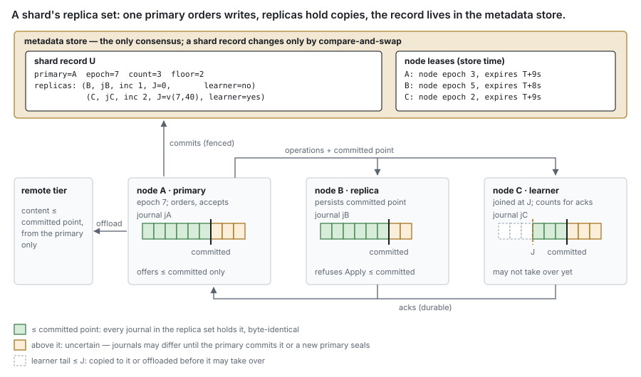
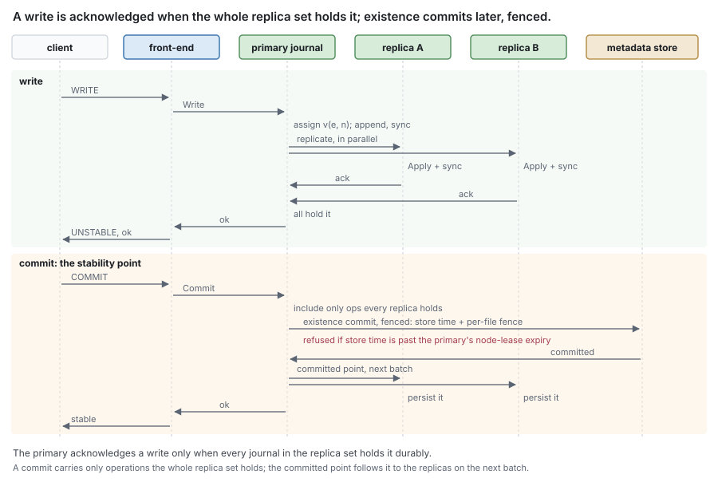
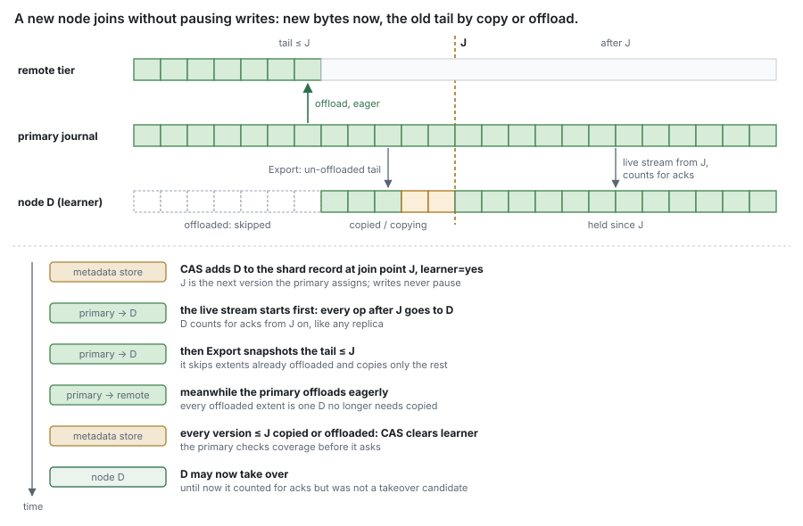
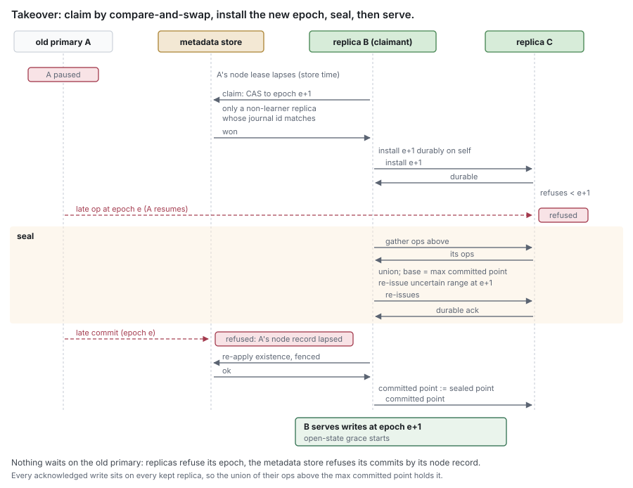

# RFC 10 — journal replication

**Status:** draft. [§16](#16.%20Open%20questions) lists what is known to be undecided.
**Audience:** anyone designing or changing how an acknowledged write survives the
loss of the node that accepted it.

---

## 1. Purpose

A write is acknowledged once the journal holds it ([RFC 8 §4.1](rfc-8-engine.md#4.1%20A%20write%20is%20staged%20and%20acknowledged%2C%20and%20nothing%20more)), and until it is
offloaded the journal of the node that accepted it is the only copy. On one node
that is the design. With several nodes serving one share, losing a node must not
lose acknowledged writes. This layer makes that true:

> **An acknowledged write is held by the journal of every node in its replica
> set until it is offloaded.**

It sits between the engine and the journal. The journal ([RFC 1](rfc-1-journal.md)) stays a local
store that knows nothing of peers; this layer decides which journals hold a shard,
moves operations between them, and fences the ones that must no longer count.

### 1.1 Goals

1. **Durability across node loss.** An acknowledged write survives the loss of
   every node of its replica set but one that is not a learner.
2. **Reads anywhere.** Any storage node **MAY** serve recently written bytes it
   holds, after one round trip to the primary that carries no bytes ([§8](#8.%20Reads)).
3. **No consensus among storage nodes.** The metadata store is the only consensus
   ([§3](#3.%20What%20it%20assumes%20of%20shard%20placement)); it is consulted when the replica set changes, never per write.
4. **A new node takes writes at once.** A joining node counts for new writes
   from the moment it is added, with no pause in the shard's writes ([§7.3](#7.3%20Joining)).
5. **One code path** on one node as on many ([§10](#10.%20A%20single%20node)).

### 1.2 Non-goals

This layer **MUST NOT**:

- decide which node is a shard's primary, or move it — [RFC 11](rfc-11-ownership.md);
- order writes from more than one writer to the same bytes — one writer per shard
  is assumed ([§3](#3.%20What%20it%20assumes%20of%20shard%20placement));
- offload, carve, sync to the remote tier, or evict — the primary's engine does,
  exactly as on one node;
- replicate metadata — the metadata store has its own durability;
- erasure-code journal content ([Appendix B](#Appendix%20B%20%E2%80%94%20alternatives%20considered)).

Which process runs which role is [RFC 15](rfc-15-topology.md#2.1%20One%20binary%2C%20roles%20chosen%20at%20deployment)'s. This document speaks only of
**storage nodes** — nodes with the `storage` role, each with a journal per device
— and of the metadata store.

## 2. Model

### 2.1 Terms

**Shard**, **primary**, **shard record** and **node lease** are the
[glossary](rfc-0-data-lifecycle.md#Glossary)'s. Every rule here is per shard. The
primary also holds the shard's namespace writes and open state, which this layer
does not replicate.

| Term | Means |
| --- | --- |
| **replica** | a storage node whose journal receives a copy of every operation the primary assigns for the shard |
| **replica set** | the primary and its replicas. Every acknowledged write that is not yet offloaded is in all of their journals |
| **learner** | a replica that joined at a **join point** and has not yet been given the shard's older content ([§7.3](#7.3%20Joining)). It counts for new writes, but cannot take over |
| **epoch** | a number in the shard record, raised by every change to it. Every version and every message carries it; a receiver refuses what carries an older one ([§6](#6.%20Fencing)) |
| **committed point** | per shard, the newest version at or below which the whole replica set durably holds every operation and metadata records every removal. The primary sends it to its replicas, and each keeps it durably |
| **drift bound** | the configured bound on clock drift with which every node reckons its node lease, one per node for all its shards ([§3](#3.%20What%20it%20assumes%20of%20shard%20placement)) |



**What the epoch buys.** A version is an epoch and a counter, compared as one
number ([RFC 1 §5.3](rfc-1-journal.md#5.3%20Versions)). A shard at epoch 3 holds a write to file `f` at `v(3,90)`.
A takeover raises the shard to epoch 4, and the new primary's first write to `f` is
`v(4,1)`. It outranks `v(3,90)` at every byte although its counter is smaller, and
a write the old primary sends late, at `v(3,95)`, loses to `v(4,1)` in every
journal it reaches — if one takes it at all.

**What the replicas agree on.** Journals receive operations in whatever order
the network delivers them, so no two are byte-identical on disk. They agree on
what a reader sees: **at or below the committed point, every journal of the
replica set returns the same bytes at the same version for any file and
offset**. Above it they can differ — an operation in flight has reached some
journals and not others. Those are the ranges a takeover resolves ([§9.2](#9.2%20Takeover)).

### 2.2 One journal carries many shards

A storage node keeps one journal per device ([RFC 1](rfc-1-journal.md)), holding files of every shard
the node is primary or replica of. Nothing in this layer is per journal:

- every journal call and every procedure acts per file, and only on the files the
  journal holds content for — never on every file of a shard, which can hold
  millions;
- the node keeps, per shard, an **install record** — the installed epoch, the
  committed point and its own join incarnation — durably and on the device of the
  journal it describes, so losing the device loses both;
- capacity is the journal's, shared under its per-share limits ([RFC 1 §7](rfc-1-journal.md#7.%20Capacity));
  [§5](#5.%20Offload%20and%20release) says how pressure reaches primaries;
- a replica is identified by its node, the **journal identity** of the journal
  holding the shard ([RFC 1 §4.1](rfc-1-journal.md#4.1%20Layout)) and a join incarnation, and so is the primary,
  whose entry in the shard record adds its node epoch. A lost device therefore
  loses the node's place in every shard that journal held, as primary or replica;
- each journal has a **generation**, kept in its `format` file and in the
  metadata store under its journal identity ([RFC 16 §4.2](rfc-16-metadata-store.md#4.2%20Keys%3A%20per-file%2C%20per-share%2C%20content-addressed)). Opening the
  journal writes the next generation into `format`, syncs it, then raises the
  store's. A journal whose generation is below the store's was rolled back —
  restored from an older copy or a VM snapshot — and is amnesiac for every shard
  it holds ([§6](#6.%20Fencing)).

### 2.3 The journal extension

The journal of [RFC 1](rfc-1-journal.md) assigns every version itself. Replication needs a journal
that also takes versions assigned elsewhere, raises a file's epoch, and forgets a
file on command. That is a **later journal format version**, added as
[RFC 1 §4.3](rfc-1-journal.md#4.3%20Records) prescribes: a binary that knows it opens a journal of RFC 1's
version and upgrades it on its first extension record; a binary that does not
refuses the newer journal.

```go
Apply(s ShardID, id FileID, op Op) error                         // write, deallocate, truncate or delete, with its version and digest
Export(s ShardID, id FileID, from Version) iter.Seq2[Op, error]  // un-offloaded content and removal markers, with bytes
SetEpoch(s ShardID, id FileID, e uint64) error
Discard(s ShardID, id FileID) error
```

It adds two record kinds, **epoch** and **discard**, lifts RFC 1's rule that a
version's epoch half is zero ([RFC 1 §5.3](rfc-1-journal.md#5.3%20Versions)), and gives `Offload` a **ceiling**:
an offer includes only content at or below the version the caller passes. This
layer passes the shard's committed point ([§5](#5.%20Offload%20and%20release)).

**Entries are per shard.** The extension keys a file's entry by (shard, file),
and its epoch record names the shard as well as the epoch. One journal can
therefore hold a file under two shards while a move runs ([§9.4](#9.4%20Handover)) — the giving
shard's entry and the receiving shard's — and every call names the shard and
touches that entry only. A node serves a file only from its entry under the
shard whose primary it asked ([§8](#8.%20Reads)). An entry with no epoch record, as every
entry of RFC 1's format is, belongs to the shard metadata records its file in.

**`Apply`** takes an operation whose version another journal assigned and applies
it by version: at each byte it takes effect only where it is newer than what the
journal holds there, content and removal markers alike. An equal version is a
repetition and changes nothing when its **digest** matches — a hash of the
operation's request ID, kind, range and bytes, which every operation carries and
its record keeps — and is refused with `ErrDivergent` when it does not. Applied operations are durable, reserve capacity,
advance the file's change sequence ([RFC 1 §3.4](rfc-1-journal.md#3.4%20Fill)) and are recorded exactly as
assigned ones are. The caller **MUST NOT** apply two different operations under one
version of one file. A journal that applied a set of operations in any order
therefore holds exactly what one that applied them in version order holds.

**`SetEpoch`** raises the epoch under which the journal assigns versions for
`id` under `s`. `e` **MUST** exceed the file's current epoch, and the epoch record **MUST** be
durable before the first version under it is assigned; otherwise a crash can
forget the epoch while versions under it survive. The primary raises a file's
epoch to the shard's before assigning the file's first version under it, and not
before, so a new epoch costs nothing for files it never writes.

**`Export`** is RFC 1's `Since` with each write's bytes, **skipping offloaded
extents**: it yields, in version order, operations that reproduce every
un-offloaded extent and removal marker of `id` at or above `from`, each at its own
version.

**`Discard`** forgets the entry of `id` under `s` entirely — held extents
whatever their offloaded bit, removal markers and epoch — as if the journal had
never held it, and leaves the file's entry under any other shard alone. Its record
covers every record of the file with a lower sequence number whatever its
version, the one exception to precedence; it drops the file's entry by raising
the floor sequence ([RFC 1 §3.4](rfc-1-journal.md#3.4%20Fill)), is durable on return, and recovery **MUST NOT**
bring back anything it discarded. **Discarding dirty content destroys it unless
another journal holds it**; the caller **MUST** know that one does.

**Retention.** A file's newest epoch record is live, and carried forward by
repack ([RFC 1 §8.2](rfc-1-journal.md#8.2%20Repack)), only while the file has a held extent or a removal marker. A
journal that has forgotten a file's epoch treats it as having none, and the
primary's `SetEpoch` before the next assignment re-establishes it. A discard record
is live while it still covers a record of its file in another segment.

**Snapshot holds and stamps are replicated operations.** `Hold`, `Unhold` and
`Stamp` ([RFC 1 §3.11](rfc-1-journal.md#3.11%20Snapshot%20holds)) are sent by the primary to every replica and applied
there like any operation, and a `Hold` returns only once its marks are durable on
every replica of the shard ([RFC 12 §2.4](rfc-12-snapshots.md#2.4%20A%20snapshot%20hold%20bridges%20dirty%20content%20to%20history)). A replica's `Hold`
acknowledgement returns its journal's held bytes and dirty bytes not yet
offloaded, summed over every share it carries, so the primary evaluates the hold
bound for every journal of the replica set. `Export` yields, beside un-offloaded
content, every held superseded version with the hold marks that keep it and every
version's stamp, so whatever an export feeds — a join, a reconcile, a move between
shards — carries the holds and the stamps too.

**Settling** needs no new record. A node calls RFC 1's `Settle` on a shard's files
at the committed point it has persisted, which drops removal markers at or below
it ([RFC 1 §3.10](rfc-1-journal.md#3.10%20Settle%20and%20Since)), and settles again after a restart. A late operation at or below
that point is refused before it reaches the journal ([§6](#6.%20Fencing)), so the journal
needs no marker to keep it out — and none for released content either, which is
below the point by construction ([§5](#5.%20Offload%20and%20release)).

## 3. What it assumes of shard placement

[RFC 11](rfc-11-ownership.md) provides these; this layer relies on nothing else:

1. **One primary per shard, named in its shard record** as (node, node epoch,
   journal identity, incarnation). The metadata store is the only consensus. It
   **MUST** provide linearizable compare-and-swap on a shard record and be
   reachable from every storage node, and every change to a record raises its
   epoch but one ([§10](#10.%20A%20single%20node)). Records change only when the primary or the replica
   set changes, never on lease renewal.
2. **A file's epoch never decreases**, including when it moves between shards
   ([RFC 11 §3.1](rfc-11-ownership.md#3.1%20The%20primary%20is%20fenced%20by%20an%20epoch)).
3. **One node lease per storage node**, with a node epoch. The node record holds
   the node epoch and whether a takeover has marked it lapsed; the lease's expiry
   is a record of its own, which renewals write, so a renewal never writes the node
   record ([RFC 16 §2.3](rfc-16-metadata-store.md#2.3%20Server-wide%20and%20control-plane%20entities)). Losing the lease fences all of the node's shards at once.
   A node **MUST** stop acknowledging and serving — open state included — when its
   lease runs out by its own clock reckoned with the drift bound, and when it has
   not reached the metadata store for half its lease. A renewal returns the
   store's time ([RFC 9 §1.2](rfc-9-gc.md#1.2%20Words%20this%20document%20uses)); a node whose clock differs from it by more than half
   the drift bound, less half the renewal's round trip, self-fences. A drift
   beyond the bound can break open-state exclusivity, which only the lease
   protects, but not durability, which receivers and the store fence.
   **Renewal fails once the lease has lapsed** — in store time, or because a
   takeover marked the node record: the node acquires a new lease at a higher node
   epoch, no sooner than the old expiry plus the drift bound in store time, and is
   then primary of nothing, since the shard records still name its old node epoch
   ([RFC 11 §3.1](rfc-11-ownership.md#3.1%20The%20primary%20is%20fenced%20by%20an%20epoch)).
4. **A shard whose primary's lease lapsed is taken over, never plainly claimed.**
   Only a replica that is not a learner takes it over ([§9.2](#9.2%20Takeover)); a claim by any other
   node is refused, since it would leave the replicas outside the record
   ([RFC 11 §3.2](rfc-11-ownership.md#3.2%20The%20primary%20stays%20until%20another%20node%20needs%20it)).
5. **The primary follows the writer** by handover, not failover ([§9.4](#9.4%20Handover)).
6. **Commits are fenced at the store.** Every metadata commit acting for a shard
   carries its (shard, epoch) and its primary's (node, node epoch). It is refused
   unless the file's fence records hold exactly that (shard, epoch) — *current*
   means equal, and a fence from another shard never matches — and unless the
   primary's node record, which the commit guards, holds that node epoch
   unmarked ([RFC 11 §8](rfc-11-ownership.md#8.%20Metadata%20consistency)). The fence records order epochs per file; the guard
   fences the files a new primary has not yet touched, because a takeover marks
   the old primary's node record lapsed as it claims ([§9.2](#9.2%20Takeover)), and every commit
   still in flight under the old node epoch then conflicts and aborts. A fenced
   commit covers only operations the whole replica set holds ([§4](#4.%20The%20write%20path)).

**An unknown compare-and-swap outcome** — a claim, a join, a removal, clearing a
learner, a handover — is resolved by re-reading the shard record and acting on
what is there, before anything else.

## 4. The write path

The primary handles every operation on the shard. For a write, deallocate, truncate
or delete:

1. **Assign.** The primary stages the operation in its own journal, which assigns
   its version under the file's epoch. It carries the request ID of the routed
   call ([RFC 15 §4.3](rfc-15-topology.md#4.3%20The%20route%20envelope)), so a new primary that holds it answers a retry instead
   of applying it again.
2. **Replicate.** The primary sends it, with its epoch, to every replica in the
   shard record, learners included, in parallel.
3. **Apply.** Each replica checks it against [§6](#6.%20Fencing), applies it with `Apply`,
   makes it durable and answers.
4. **Acknowledge.** Once the primary and every replica hold it durably, the client
   is acknowledged.



**The whole replica set, not a quorum.** An operation **MUST NOT** be acknowledged
until every replica in the shard record holds it durably. That is what lets any
one replica that is not a learner take over with every acknowledged write in
hand ([§9.1](#9.1%20Why%20one%20replica%20suffices)). A replica that cannot keep up is removed ([§7.2](#7.2%20Removal)); the primary
**MUST NOT** acknowledge around it while it is listed.

**Metadata follows the replica set.** Until a write's existence is committed, the
journal is its authority ([RFC 6 §3.4](rfc-6-block-metadata.md#3.4%20Ordering%20against%20the%20journal)). The primary group-commits existence at the
stability point and **MUST** include only operations the whole replica set holds.
A truncate, deallocate, release or clone is a synchronous metadata operation: its
journal operation **MUST** be held by the whole replica set before its metadata
commit, and the client is acknowledged after that commit. Recorded first, a crash
of the primary leaves metadata describing an operation no surviving journal holds.

**A client's flush** ([RFC 8 §5.1](rfc-8-engine.md#5.1%20Commit%20is%20answered%20by%20the%20journal)) is answered once every node of the replica set
has synced the file's operations and their existence is committed.

**The committed point** ([§2.1](#2.1%20Terms)) rides on every batch. A replica persists it
in its install record, never lowers it, and then settles to it ([§2.3](#2.3%20The%20journal%20extension)).

**Batching.** The primary **SHOULD** batch operations to a replica and group their
syncs, as the journal groups its own ([RFC 1 §6.2](rfc-1-journal.md#6.2%20Sync%20policy)). The unit of
acknowledgement stays the operation.

## 5. Offload and release

Only the primary offloads, as on one node, and **only content at or below the
committed point** — it passes the point as the offer's ceiling ([§2.3](#2.3%20The%20journal%20extension)). A newer
ref committed ahead of an older operation still in flight would make that
operation's commit be refused as older ([RFC 6 §4.4](rfc-6-block-metadata.md#4.4%20Commits%20for%20one%20file%20apply%20in%20order)), and it could never become
durable. Replicas never offload.

**Replicas release by being told.** After an offload commit lands, the primary
sends each replica the extents it covered with the commit's `oldest` and
`newest`. The replica calls `MarkDurable` ([RFC 1 §9.2](rfc-1-journal.md#9.2%20Offload%20state%20after%20recovery)) and evicts under its own
capacity policy. The notice also raises the replica's committed point to at least
`newest`, since the primary offloaded nothing above its own point: a replica that
evicted content therefore never reports a point below it ([§9.2](#9.2%20Takeover)). A notice is
fenced like any message. A replica **MAY** derive the same marks from metadata,
which is how it catches up on notices it missed.

**Pressure.** A replica cannot offload to make room, and its journal is shared
with every shard it holds. When the journal nears capacity it **MUST** tell the
primary of each shard holding un-offloaded content in it, and each primary **MUST** treat
that as its own pressure ([RFC 8 §10.2](rfc-8-engine.md#10.2%20A%20capacity%20refusal%20comes%20back%20here)): offload sooner, then pace and refuse
writes. While the replica still acknowledges, backpressure is the answer, not
removal. A replica whose journal refuses an operation within its share's limit is
lagging for that shard alone, and [§7.2](#7.2%20Removal) applies — rate-limited, so one full
device does not remove itself from every shard at once.

**Under-replication means offloading eagerly.** While a shard has fewer replicas
that are not learners than its replica count asks for, its primary offloads as soon
as content is committed, so the content only its survivors hold, and the tail a
new replica must copy, shrink ([§7.3](#7.3%20Joining)).

## 6. Fencing

Every message this layer sends — an operation batch, a durability notice, an
install, a seal request, a newest-version query — carries the epoch it was sent
under. **The receiver enforces it:**

- it **MUST** refuse a message whose epoch is lower than the one it has installed
  for the shard;
- on a higher epoch it **MUST** refuse the message, read the shard record and
  install it before accepting anything more. Installing **MUST** be durable before
  it answers anything under the new epoch, so a restart never accepts what it
  refused before;
- when it installs a record that does not list it — by node, journal identity and
  incarnation — it **MUST** stop serving the shard and `Discard` its entries of
  the shard's files, and only those. It may return only by joining again ([§7.3](#7.3%20Joining));
- when a record lists it but it has no install record for the shard — its device
  was replaced or wiped — or its journal's generation is below the store's — the
  journal was restored ([§2.2](#2.2%20One%20journal%20carries%20many%20shards)) — it **MUST** refuse with `ErrAmnesiac` and
  rejoin as a learner. A record naming a dead node's ID is therefore safe to reuse:
  the new journal matches nothing listed;
- it **MUST** refuse every operation at or below its committed point. It refuses
  with `ErrCommitted` if it holds that version of the file with the same digest
  ([§2.3](#2.3%20The%20journal%20extension)) — a repetition of an operation the whole replica set already held, which
  the primary counts as held — and with `ErrDivergent` otherwise. A learner's
  copied tail is not refused ([§7.3](#7.3%20Joining)).

**`ErrDivergent` means the primary was rolled back.** A primary never waits on an
operation at or below a replica's committed point, since it sends that point only
once the whole replica set holds everything below it; only a primary restored from
a VM snapshot assigns a version a second time. A primary that meets `ErrDivergent`
for an operation it is waiting on **MUST** acknowledge nothing more, stop renewing
its lease, raise the store's generation of each of its journals without writing
it to the journal — so each reopens amnesiac — and restart. Its replicas take the
shard over holding every operation it acknowledged before the rollback. A refusal
of a late duplicate reaches a primary that is not waiting on it, and is ignored.

The metadata store fences commits by epoch and by the primary's node record
([§3](#3.%20What%20it%20assumes%20of%20shard%20placement) item 6).

A check made only by the sender is not a fence. A primary that pauses past its
lease still believes it is the shard's primary when it resumes; what stops it is that every
receiver has installed the new epoch before the new primary accepts a write, and
that the claim marked its node record lapsed, which every commit it sends guards.

A replica removed while cut off from the primary hears no refusal. It **MUST**
re-read, on a configured period, the shard record of every shard it holds content
for, and discard those that no longer list it.

## 7. Changing the replica set

### 7.1 Count, floor and placement

Each shard has a configured **replica count** and a **floor**, both in its shard
record. The floor counts the acknowledgement set — the primary and every replica,
learners included — and a floor above one **MUST** count at least one replica that
is not a learner, since a learner cannot take over. Below it the primary **MUST** refuse writes and report the shard
through share health rather than only in a log ([RFC 0 §10.2](rfc-0-data-lifecycle.md#10.2%20No%20state%20requires%20intervention%20to%20leave)). A shard is
**under-replicated** while it has fewer replicas that are not learners than the
count asks for; it keeps writing, and its primary offloads eagerly ([§5](#5.%20Offload%20and%20release)).

A takeover needs one replica that is not a learner alive ([§9.1](#9.1%20Why%20one%20replica%20suffices)). A floor of one
keeps writes available with no redundancy; that is a deployment's choice, stated
in its settings.

Replicas of one shard **SHOULD** be in different failure domains. What a domain is
— host, rack, zone — is a setting.

### 7.2 Removal

The primary removes a replica that does not answer within a configured bound,
that lags by more than a configured amount of bytes or time — a slow node that
still answers is removed like a silent one — whose journal refuses within its
share's limit ([§5](#5.%20Offload%20and%20release)), or that refuses as amnesiac ([§6](#6.%20Fencing)). It writes the record without it at the next epoch by
compare-and-swap and installs that epoch on the remaining replicas; operations
the removed replica had not acknowledged are then acknowledged without it.

A primary remembers the highest committed point each replica has acknowledged,
and persists these marks in a side record of the shard ([RFC 16 §4.2](rfc-16-metadata-store.md#4.2%20Keys%3A%20per-file%2C%20per-share%2C%20content-addressed)) on a
configured period and before every record change it makes. The side record is not
the shard record, so writing it raises no epoch, and a mark is never lowered. A
replica that reports a point below its mark has lost state it acknowledged — its
journal was rolled back — and is removed the same way; a claimant gathering points
reads the marks too ([§9.2](#9.2%20Takeover)).

`ponytail:` a mark persisted on a period misses a rollback to a point between the
persisted and the live mark while the primary is also restarted. Persist the mark
with every committed point when a restore of a whole cluster from VM snapshots
becomes an operation deployments run.

### 7.3 Joining

A new or returning node joins as a learner, and counts for new writes at once:

1. It `Discard`s its entries of the shard's files: a returning copy can hold
   operations never acknowledged.
2. The primary writes the record adding it at the next epoch by compare-and-swap,
   as a learner with a new incarnation and a **join point** `J`: the first version
   the primary will assign under the new epoch. It installs the epoch on every
   replica, the new one included.
3. From `J` on, the primary sends it every operation and waits for its answer like
   any replica's. It counts for acknowledgement of every operation from `J`.
4. The **tail** — the shard's un-offloaded content below `J` with its stamps, and
   every held superseded version with its hold marks ([§2.3](#2.3%20The%20journal%20extension)) — is covered by the primary,
   file by file, either by sending it `Export` or by offloading it; a held version
   is covered only once it is copied or offloaded under its hold, not by
   offloading the file's current content. The
   live stream began at step 3, before any `Export` snapshot is taken, so no
   operation falls between the two. The primary offloads eagerly meanwhile ([§5](#5.%20Offload%20and%20release)),
   so the tail shrinks on its own.
5. When the primary has seen every file's `Export` acknowledged or the file's tail
   offloaded, it clears the learner flag by compare-and-swap at the next epoch.



Writes never pause. A learner's copied tail is applied whatever its committed
point, since the copy reflects the primary's current state, and it does not settle
until its flag is cleared: a copied operation can still arrive under a removal
whose marker settling would drop. A node accepts a copy only while it is a
learner of the shard; once its flag is cleared, a late copy is refused like any
late operation. A learner **MUST NOT** take over, serves no reads, and its
committed point is never compared with others' ([§9.2](#9.2%20Takeover)). It is safe to count at
once because every acknowledged operation below `J` is held by the primary and
every replica that is not a learner, or is offloaded.

If the primary fails before the tail is covered, the takeover drops the learner
from the record: it discards its entries and joins again, at a new join point,
under the new primary.

`ponytail:` a returning node discards the shard's files and receives the whole
un-offloaded tail again. Rejoin by delta — each file's divergence point, from
which only newer operations are discarded and copied — when flapping nodes make
catch-up show up in repair time.

### 7.4 Repair

Restoring the count after a node is lost is paced by the **repair scheduler**.
It runs under a lease as GC does ([RFC 9 §7.3](rfc-9-gc.md#7.3%20GC%20is%20one%20service%20per%20namespace%2C%20partitioned%20by%20prefix)): partitioned by a hash of the
shard ID, each partition held by one node's lease record with an epoch
([RFC 16 §4.2](rfc-16-metadata-store.md#4.2%20Keys%3A%20per-file%2C%20per-share%2C%20content-addressed)); when a holder's lease lapses another node takes the
partition, which is the scheduler's only failover. The limits below are the
cluster's, divided evenly among the partitions. It **MUST**:

- order shards by fewest replicas that are not learners first, then by most
  un-offloaded bytes;
- place each new replica in a failure domain the shard does not use;
- limit how many shards join one node at once, and how many joins run in the
  cluster at once;
- be disabled cluster-wide by one setting, for maintenance that would otherwise
  start a storm of joins.

The scheduler only chooses; each join is the primary's procedure of [§7.3](#7.3%20Joining).

## 8. Reads

**The primary** serves reads of the shard from its journal, but only content the
whole replica set holds: a read overlapping an operation still being replicated
waits for it. Otherwise a failover could remove content a client had already
read.

**Every other storage node**, replica or not, follows [RFC 11 §6](rfc-11-ownership.md#6.%20Reads%20on%20other%20nodes): it asks the
primary the newest version of the range the whole replica set holds, and the
answer carries the primary's epoch and node lease expiry. It serves its own bytes
only if they carry exactly that version, the answer's epoch is the one it has
installed for the shard, it has not fenced itself, and its own clock reads before
that expiry less the drift bound; otherwise it forwards the read. The checks are
the asking node's own, since a primary that pauses between checking its lease and
answering sends an answer that is already stale. The question is one round trip
and carries no bytes. A learner serves none. A node never serves un-offloaded
content it does not hold.

`ponytail:` a read on a node other than the primary costs one round trip to the
primary. Add read leases when that round trip shows in a replica-read profile
([Appendix B](#Appendix%20B%20%E2%80%94%20alternatives%20considered)).

## 9. Failover

### 9.1 Why one replica suffices

Every acknowledged operation is held by the whole replica set ([§4](#4.%20The%20write%20path)), and every
replica that is not a learner also holds the shard's un-offloaded content from
before it joined. So any one of them holds every acknowledged operation that is
not offloaded, and can take over with no quorum to gather. What it may lack, or
others may hold beyond it, are operations never acknowledged.

### 9.2 Takeover

When the primary's node lease lapses, a replica takes over:

1. **Claim.** The claimant asks the shard's replicas that are not learners for
   their committed points for a configured **gather interval**. A point below the
   mark the primary persisted for that replica ([§7.2](#7.2%20Removal)) is not counted, and its
   replica is dropped; of the rest, the one with the highest point claims. The
   claim is one transaction. It marks the old primary's node record lapsed at the
   node epoch the shard record names, unless that node epoch is already
   superseded, and writes the shard record naming the claimant primary — as
   (node, node epoch, journal identity, incarnation) — at the next epoch, with
   every learner removed. It is conditional on the record being the one it read;
   on listing the claimant — node, journal identity and incarnation — as primary
   or as a replica that is not a learner; and on the old primary's lease having
   lapsed: store time past its expiry plus the drift bound, or its node epoch
   superseded, which implies it ([§3](#3.%20What%20it%20assumes%20of%20shard%20placement) item 3). Marking the node record aborts
   every commit the old primary still has in flight ([§3](#3.%20What%20it%20assumes%20of%20shard%20placement) item 6). Replicas it could
   not reach within the interval are dropped too. Every dropped node and every
   learner rejoins as a learner ([§7.3](#7.3%20Joining)). Two simultaneous claimants conflict on
   the record, and one wins.
2. **Install.** It installs the new epoch durably on itself, then on every kept
   replica; each answers with its committed point. From here nothing the old
   primary sends counts. If a kept replica reports a point above the claimant's
   own, the claimant does not seal: it names that replica as primary at the next
   epoch by compare-and-swap, conditional on it being listed and not a learner, and
   that replica runs this procedure from step 2.
3. **Reconcile.** The **baseline** is the highest committed point any kept
   replica reports. The claimant pulls every kept replica's operations above the
   baseline and applies them with `Apply`: with one writer, the highest version
   at each byte is the right one. It sends each kept replica whose point is below
   the baseline the un-offloaded operations it holds above that replica's point.
4. **Re-issue.** Where any operation above the baseline exists — the ranges that
   may or may not have been acknowledged — the claimant re-issues what it now
   holds there under the new epoch and replicates it like any operation: its
   bytes, or a removal where a removal marker is the newest thing it holds. A range
   metadata already covers at or above the uncertain version is never re-issued as
   a removal. Every kept replica then converges on the claimant's view.
5. **Existence.** It re-applies existence for the shard's files it holds —
   `Since(id, applied)` for each ([RFC 1 §3.10](rfc-1-journal.md#3.10%20Settle%20and%20Since)) — writing each file's fence records at
   the new epoch first, in commits that wait until every kept replica durably
   holds the step 4 re-issues. Metadata can lag acknowledged writes ([§4](#4.%20The%20write%20path)), so the
   journal decides, not the recorded size.
6. **Set the committed point.** Once every kept replica has durably acknowledged
   every re-issue — one that has not is removed by compare-and-swap first — and
   step 5's commits have landed, it sets the committed point to the newest version
   it re-issued, or to the baseline if it re-issued nothing, and sends it to every
   replica. Only then does it serve or accept writes, and it starts the shard's
   grace period for open state ([RFC 14 §4.4](rfc-14-open-state.md#4.4%20Grace%20is%20per%20shard)).



**Holds are inherited.** Every kept replica holds the hold marks durably, and
steps 3 and 4 carry held superseded versions and their marks like un-offloaded
operations, so the new primary offloads them under the hold and the snapshot still
completes ([RFC 12 §2.4](rfc-12-snapshots.md#2.4%20A%20snapshot%20hold%20bridges%20dirty%20content%20to%20history)). While a snapshot record in state `cutting`
exists, the new primary starts the shard's cut gate closed ([RFC 12 §2.3](rfc-12-snapshots.md#2.3%20The%20cut%20is%20one%20transaction%20behind%20a%20brief%20gate)).

A claimant that fails before step 6 leaves nothing to repair: the next claimant
repeats the procedure at a higher epoch, which outranks every partial re-issue,
and its union includes them.

### 9.3 After takeover

The new primary offloads what it holds, which includes everything the old primary had
not. Nothing acknowledged was lost as long as one replica that was not a learner
survived. The learners the claim dropped join again under the new primary
([§7.3](#7.3%20Joining)).

The old primary, if it returns, holds a lapsed node lease. Its renewal fails; it
acquires a new lease at a higher node epoch, and serves none of the shards it was
primary of until it has claimed each again under [§9.2](#9.2%20Takeover) — a shard with no replica
included, which it re-claims as [§10](#10.%20A%20single%20node) says. On first contact with any shard it finds a higher epoch, installs it,
and discards what the record no longer lists it for ([§6](#6.%20Fencing)).

### 9.4 Handover

A planned move — the primary following the writer, a rebalance or a re-placement — waits for no lease:

1. the new primary becomes a replica that is not a learner, joining under [§7.3](#7.3%20Joining)
   if it is not one;
2. the old primary stops accepting writes, granting open state and serving primary
   reads for the shard, drains what is in flight, and sends every replica the
   committed point covering it;
3. it writes the record naming the new primary at the next epoch, by
   compare-and-swap, and sends the new primary the shard's open-state table and the
   recent entries of its dedup table ([RFC 15 §4.3](rfc-15-topology.md#4.3%20The%20route%20envelope)). On an unknown outcome it
   re-reads the record before doing anything else, so it never resumes writes
   under a record that has moved;
4. the new primary installs the epoch on every replica, re-applies existence as
   [§9.2](#9.2%20Takeover) step 5 does, sets the committed point to the drained one, installs the
   open-state table, and only then accepts writes and serves open state, with no
   grace period ([RFC 14 §10](rfc-14-open-state.md#10.%20Shard%20placement)). It inherits the shard's holds, which every
   replica already has, and starts its cut gate closed while a snapshot record in
   state `cutting` exists, as after a takeover.

No seal is needed: the old primary acknowledged nothing it had not replicated to
the whole replica set, and stopped before the move. It stays a replica unless
removed. If it is lost after step 3 and before the new primary holds the table, the
new primary runs grace as after a failover.

**Moving files between shards** is a handover run in batches ([RFC 11 §4](rfc-11-ownership.md#4.%20Moving%20files%20and%20primaries)). The
receiving shard's primary first raises its own epoch above the giving shard's by an
ordinary record change and installs it on its replicas. The giving primary ships
each batch's un-offloaded operations with `Export` — held superseded versions and
their hold marks included — with the files' open-state and dedup entries, tagged
with the move, the batch and the giving shard's epoch. The receiving primary
accepts a ship only for a batch it has open under that epoch, so a delayed or
duplicated ship is refused. It **re-versions** what it accepts: in the order
exported, it assigns each operation a new version under its own epoch, in the
file's entry under the receiving shard, and replicates it like any write, hold
marks following their versions. Moved content therefore obeys every rule of this
document, the committed-point refusal included, and the files' refs follow in
metadata, since the receiving epoch outranks every version the giving shard
assigned. A shipped removal marker becomes a marker at its new version; the
giving primary committed that removal before the freeze drained, so none is
committed again. Each batch commits only if both shards' epochs are still the
ones the batch ran under, and only once the re-versioned content is durable on
the receiving primary and every one of its replicas. If it does not commit, the
receiving primary `Discard`s the batch's files under the receiving shard on
itself and every replica before the batch is shipped again; a replica that does
not confirm is removed ([§7.2](#7.2%20Removal)). After a batch commits, the giving primary sends
its replicas a committed point at or above the batch's newest operation, then
tells every node of its replica set, itself included, to `Discard` the
files under the giving shard. A node in both replica sets, or one that joins the
receiving set later, keeps its entry under the receiving shard: `Discard` names
one shard ([§2.3](#2.3%20The%20journal%20extension)). A late operation of the giving shard for a moved file is
at or below that committed point, and is refused ([§6](#6.%20Fencing)).

### 9.5 Whole-cluster restart

Every node lease has lapsed, but there are only as many leases as nodes. Each
node acquires a lease at a new node epoch once its journals are open, which
supersedes its old one. Each shard then needs one claim: the gather interval
([§9.2](#9.2%20Takeover) step 1) lets its nodes come back before anyone is dropped, the marks the
primaries persisted ([§7.2](#7.2%20Removal)) rule out a replica whose journal was rolled back,
and the node with the highest committed point — normally the old primary —
claims it, its old node epoch counting as lapsed. A node **MAY** claim many shards in one
metadata transaction. A shard with nothing above its baseline re-issues nothing,
so its takeover is a claim, an install and an existence pass. Nodes that do not
return within the interval are dropped, and the repair scheduler restores the
count at its own pace ([§7.4](#7.4%20Repair)).

## 10. A single node

On one node a shard's replica set is the primary alone. Replication is a local call,
the committed point is whatever the journal has synced with its removals
recorded, reads are always the primary's, and failover cannot happen. The engine
**MUST** still compose this layer, not the journal directly: with two code paths,
every rule here is exercised by one and not the other, and the untested one ships
to the deployment that needs it.

**A shard with no replica never changes epoch**, including across a restart that
lets its node lease lapse. Nothing else can claim it, so its node, holding a new
lease, re-claims it by a compare-and-swap that changes only the node epoch the
record names — the one record change that raises no epoch. No receiver needs
fencing, and the old process's commits are refused by the guard on its node
record ([§3](#3.%20What%20it%20assumes%20of%20shard%20placement) item 6). Nothing then calls `Apply`, `SetEpoch` or `Discard` until
files move between shards ([§9.4](#9.4%20Handover)), and the journal stays at RFC 1's format
version. It moves to the extension's version on its first extension record, and
an older binary cannot open it afterwards. In a
cluster, a shard configured with no replica is unavailable while its primary is
down.

## 11. Worked examples

Notation: nodes A, B, C, N; `v(e,n)` is a version at epoch `e`; `cp` is a
committed point. Each example is a scenario in the simulator's catalogue
([§15](#15.%20Test%20plan%20and%20benchmarks)), named with its ID, which replays it exactly.

**(a) A node crashes; a replica takes over; no acknowledged write is lost** —
`S-takeover-basic`. Shard U at epoch 5, primary A, replicas B and C.

| t | primary | replicas | metadata store | client-visible |
| --- | --- | --- | --- | --- |
| 0 | A assigns `v(5,100)` to `f[0,4K)`, sends it with `cp = v(5,99)` | B, C apply, persist `cp 99`, ack | U: e5, A; B, C | — |
| 1 | A holds all acks | — | — | write acknowledged |
| 2 | A crashes | — | A's node lease runs out | writes to U stall |
| 3 | — | B, C gather: both report `cp 99`; B wins the tie by node ID | store time passes A's expiry + drift | — |
| 4 | B claims | — | one txn: A's node record marked lapsed; U e6, primary B; C | — |
| 5 | B installs e6 on itself, then C | C installs e6, reports `cp 99` | — | — |
| 6 | baseline 99; B pulls `v(5,100)` from C (it holds it already) and re-issues it as `v(6,1)` | C applies `v(6,1)`, acks | — | — |
| 7 | B re-applies existence for `f`, sets `cp v(6,1)` | C persists `cp v(6,1)` | existence commit, fenced at e6 | U writable; grace starts; a read of `f` returns t0's bytes |

U is now under-replicated: count 3, one replica. B offloads eagerly, and (b)
follows.

**(b) A new node replaces it and counts for writes at once** — `S-join-replace`.

| t | primary | replicas | metadata store | client-visible |
| --- | --- | --- | --- | --- |
| 0 | B is primary of U at e6, offloading eagerly | C | U: e6, B; C | writes continue |
| 1 | repair scheduler picks N | N discards anything of U | — | — |
| 2 | B adds N | — | CAS: U e7, B; C, N (learner, `J = v(7,1)`) | — |
| 3 | B installs e7 on C and N | C, N install | — | — |
| 4 | B assigns `v(7,1)` onward, waits for C and N | C, N ack | — | writes acknowledged with N counted |
| 5 | B exports `f`'s un-offloaded tail to N; `g`'s tail is offloaded meanwhile | N applies the copy under its point | offload commits for `g` | — |
| 6 | B has every file covered | — | CAS: U e8, N no longer a learner | U back at full count |

Had B failed between t4 and t6, C would have claimed; N, a learner, could not,
and C's claim would have dropped it to join again — `S-learner-excluded-takeover`
is (j).

**(c) A paused old primary resumes** — `S-zombie-primary`.

| t | primary | replicas | metadata store | client-visible |
| --- | --- | --- | --- | --- |
| 0 | A (e5, lease expiry `E`) sends `v(5,200)`, begins unlinking `g`, then freezes | B, C have not received `v(5,200)` | `F_x(g)` at e5 | write pending |
| 1 | — | B claims and seals as in (a) | one txn: A's node record marked lapsed at A's node epoch; U e6, primary B; C | — |
| 2 | B serves; a client stats and opens `g` | — | no fence written for `g` (a read) | U writable |
| 3 | A resumes: `v(5,200)` arrives at B and C | both refuse: e5 < e6 | — | — |
| 4 | A's unlink commit for `g` arrives, guarding A's node record | — | refused: the record is marked lapsed, although `F_x(g)` is still e5 | `g` intact |
| 5 | A installs e6, is not listed, discards U's files | — | — | the client's retry reaches B; its request ID was never applied |

**(d) Operations reach a replica out of order** — `S-reorder-replica`. A
assigns `v(5,5)` to `f` at 1 MiB and `v(5,7)` to `f` at 0; `cp` is `v(5,4)`.

| t | primary | replicas | metadata store | client-visible |
| --- | --- | --- | --- | --- |
| 0 | A sends both | B receives `v(5,7)` first and applies it; C has both | — | — |
| 1 | A crashes | B still lacks `v(5,5)` | — | neither acknowledged |
| 2 | — | B claims; baseline `v(5,4)` | CAS: U e6, B; C | — |
| 3 | B's point is still `v(5,4)`, so its ceiling keeps `v(5,7)` out of any offer | — | — | — |
| 4 | B pulls `v(5,5)` from C, then re-issues both | — | — | — |

Had B offered `v(5,7)` at t3, its commit would have moved `f`'s refs to version 7,
and `v(5,5)`'s commit, landing later, would have been refused as older
([RFC 6 §4.4](rfc-6-block-metadata.md#4.4%20Commits%20for%20one%20file%20apply%20in%20order)): an operation the seal kept could never become durable.

**(e) A seal over uncertain ranges** — `S-seal-uncertain`. Two ranges of `f`.
`X`: `v(5,110)` acknowledged, offloaded, then evicted by B. `Y`: `v(5,130)` never
acknowledged, held by C only.

| t | primary | replicas | metadata store | client-visible |
| --- | --- | --- | --- | --- |
| 0 | A offloads `v(5,110)` at `X`, sends `MarkDurable(newest = v(5,110))` | B raises its `cp` to `v(5,110)`, evicts `X`; C's notice is lost, `cp 100` | `X` refs `v(5,110)` | `X` acknowledged |
| 1 | A sends `v(5,130)` at `Y`, then crashes | only C receives it | — | `Y` not acknowledged |
| 2 | — | B claims; B reports 110, C reports 100 | CAS: U e6, B; C | — |
| 3 | baseline 110 = max; `X` is not above it, so nothing is re-issued there | B sends C nothing for `X` it no longer holds | `X` still refs `v(5,110)` | `X` intact |
| 4 | B pulls `v(5,130)` from C, re-issues it as `v(6,1)` | C acks | existence for `Y` at e6 | `Y` kept; a retry is answered by its request ID |

Under a seal from the claimant's view alone, B — holding nothing at `X`, with its
own point 100 — would have re-issued a removal there and destroyed an acknowledged
write.

**(f) A replica read on a range being written** — `S-replica-read`.

| t | primary | replicas | metadata store | client-visible |
| --- | --- | --- | --- | --- |
| 0 | A holds `f[0,4K)` at `v(5,250)` everywhere | B, C hold `v(5,250)` | — | — |
| 1 | a read of `f[0,4K)` arrives at B; A answers "newest held by all: `v(5,250)`" | B's bytes carry it; B serves | — | reads `v(5,250)` |
| 2 | A assigns `v(5,300)` there | B applies it; C has not yet | — | write pending |
| 3 | a read arrives at B; A answers `v(5,250)` | B holds `v(5,300)`, not 250; forwards | — | A serves `v(5,250)` |
| 4 | C acks; A acknowledges | — | — | write acknowledged |
| 5 | a read arrives at B; A answers `v(5,300)` | B serves | — | reads `v(5,300)` |

**(g) Handover following the writer** — `S-handover`. Writes to U now arrive only
at B, a replica that is not a learner.

| t | primary | replicas | metadata store | client-visible |
| --- | --- | --- | --- | --- |
| 0 | A stops writes, open-state grants and primary reads for U; drains | B, C ack the in-flight operations | — | writes to U pause |
| 1 | A sends `cp v(5,400)` | B, C persist it | — | — |
| 2 | A names B primary; sends open-state table and dedup entries | — | CAS: U e6, primary B; A, C | — |
| 3 | B installs e6 on A and C, re-applies existence, sets `cp v(5,400)`, installs the table | A, C install e6 | existence commits at e6 | writes resume at B; no grace |

**(h) A node rejoins with an empty disk under the same node ID** —
`S-amnesiac-rejoin`. C's device is replaced; it restarts with journal identity
`J2`; U's record lists C with `J1`.

| t | primary | replicas | metadata store | client-visible |
| --- | --- | --- | --- | --- |
| 0 | A sends a batch at e5 | C has no install record for U: refuses `ErrAmnesiac` | U: e5, A; B, C(`J1`) | writes to U stall briefly |
| 1 | A removes C | — | CAS: U e6, A; B | writes resume |
| 2 | the scheduler assigns C | C discards, joins | CAS: U e7, A; B, C(`J2`, learner) | — |
| 3 | — | had A died at t0, C could not have claimed: `J2` matches nothing listed | — | — |

**(i) A primary restored from a VM snapshot** — `S-primary-vm-restore`. Shard U
at epoch 5, primary A, replicas B and C. A's VM is snapshotted, memory and disk,
while its journal's counter stands at 100.

| t | primary | replicas | metadata store | client-visible |
| --- | --- | --- | --- | --- |
| 0 | A assigns `v(5,101)`–`v(5,110)`, sends `cp v(5,105)` | B, C hold them, persist `cp 105` | — | ten writes acknowledged |
| 1 | A is restored to its snapshot; its lease is still live, and it renews | — | — | — |
| 2 | A assigns `v(5,101)` to a new write `W` of `f` | B, C: 101 is below `cp 105`, and they hold `f` at 101 with another digest: `ErrDivergent` | — | `W` pending |
| 3 | A acknowledges nothing more, stops renewing, raises its journal's store generation, restarts | — | generation of A's journal raised | writes to U stall |
| 4 | — | B claims once A's lease has lapsed | one txn: A's node record marked lapsed; U e6, primary B; C | U writable; the ten writes of t0 intact; `W`'s retry is applied at B |
| 5 | A reopens its journal: generation below the store's, amnesiac | — | U e7, B; C, A (learner) | — |

Had B and C counted a refusal at or below their point as held whatever they held,
A would have acknowledged `W` while they held another operation under its
version, and a replica read of `f` would have served the other write's bytes.

**(j) A learner is excluded from a takeover** — `S-learner-excluded-takeover`.
Shard U at epoch 7, primary B, replicas C and D, and N, a learner joined at
`J = v(7,1)`.

| t | primary | replicas | metadata store | client-visible |
| --- | --- | --- | --- | --- |
| 0 | B offloads `X` up to `v(7,40)`, sends `MarkDurable` | N and D raise `cp` to 40; C's notice is lost, `cp 30` | — | — |
| 1 | B crashes | — | — | writes to U stall |
| 2 | — | C and D gather; N's point is not asked for. D reports 40 and claims | one txn: B's node record marked lapsed; U e8, primary D; C | — |
| 3 | — | N installs e8, is not listed, discards its entries of U's files | — | — |
| 4 | D seals and serves as in (a) | C converges | existence at e8 | U writable |
| 5 | D adds N again | N discards, joins | U e9, D; C, N (learner, `J = v(9,1)`) | — |

Had N been compared and named primary, it would have sealed without the content
below its join point that only C and D held.

## 12. API surface

Signatures are indicative; the obligations above are normative.

```go
// Replicated is what the engine calls in place of the journal (§10).
type Replicated interface {
	// Each returns once the operation is acknowledgeable (§4).
	WriteAt(ctx context.Context, file FileID, off int64, p []byte) (Version, error)
	Deallocate(ctx context.Context, file FileID, off, n int64) (Version, error)
	Truncate(ctx context.Context, file FileID, size int64) (Version, error)
	Delete(ctx context.Context, file FileID) (Version, error)
	// Sync returns once the whole replica set has synced the file's operations.
	Sync(ctx context.Context, file FileID) error
	// ReadAt serves under §8, or returns ErrForward naming the primary.
	ReadAt(ctx context.Context, file FileID, p []byte, off int64) (int, error)
	// Durable tells every replica an offload commit covered these extents (§5).
	Durable(ctx context.Context, file FileID, ext []Extent, oldest, newest Version) error
	// Hold returns once its marks are durable on every replica; both replicate, as
	// Stamp does, and each replica's ack carries its journal's held and dirty bytes (§2.3).
	Hold(ctx context.Context, share ShareID, cut SnapshotCut, marks map[FileID]Version) error
	Unhold(ctx context.Context, share ShareID, cut SnapshotCut) error
}

// Peer is one replica as the primary sees it, or the primary as a replica asks
// it. Every call carries the shard and the epoch it was sent under, and the
// receiver fences it (§6).
type Peer interface {
	Apply(ctx context.Context, s ShardID, e Epoch, ops []Op, committed Version) error // durable on return
	Copy(ctx context.Context, s ShardID, e Epoch, ops []Op) error                     // a learner's tail (§7.3)
	MarkDurable(ctx context.Context, s ShardID, e Epoch, file FileID, ext []Extent, oldest, newest Version) error
	Install(ctx context.Context, s ShardID, e Epoch) (committed Version, err error) // durable on return
	Above(ctx context.Context, s ShardID, e Epoch, v Version) iter.Seq2[Op, error]   // for the seal (§9.2)
	Newest(ctx context.Context, s ShardID, e Epoch, file FileID, r Range) (v Version, epoch Epoch, leaseExpires time.Time, err error) // asked of the primary (§8)
}

// The shard record is RFC 16's metadata.Shard, with its Primary and Replicas
// as metadata.Replica: node, journal identity and incarnation, the primary's
// node epoch beside them. It changes only by compare-and-swap; an unknown outcome
// is resolved by re-reading it (§3).

var (
	ErrStaleEpoch      = errors.New("replication: stale epoch")
	ErrNotReplica      = errors.New("replication: not listed")
	ErrAmnesiac        = errors.New("replication: listed, but no install record or a rolled-back journal")
	ErrCommitted       = errors.New("replication: at or below the committed point, same digest") // counted as held
	ErrDivergent       = errors.New("replication: another operation holds this version")       // the sender was rolled back
	ErrUnderReplicated = errors.New("replication: below the floor")
	ErrForward         = errors.New("replication: forward to the primary")
)
```

## 13. Invariants

| # | Invariant |
| --- | --- |
| R1 | An acknowledged operation is durably held by the primary and every replica listed when it was acknowledged, and by every later replica that is not a learner, until it is offloaded. |
| R2 | Existence and every synchronous metadata operation are committed only for operations the whole replica set holds durably; a client is acknowledged only once the whole replica set holds its operation, and after the metadata commit of a synchronous one. |
| R3 | A receiver refuses every message whose epoch is below the one it installed, and installs durably before answering under a new one. |
| R4 | A node's committed point for a shard never decreases; it refuses every operation at or below it but a learner's copied tail, and the refusal counts as held only when the node holds that version with the same digest; the primary offers only content at or below it. |
| R5 | A learner counts for acknowledgement from its join point, never takes over, is never compared in a gather, never serves reads and never settles; a takeover drops it; its flag is cleared only once every file's tail, held versions included, is copied or offloaded. |
| R6 | The primary serves only content the whole replica set holds; every other node serves only bytes carrying the version the primary names for the range. |
| R7 | A claim is a compare-and-swap conditional on the current record listing the claimant — node, journal identity and incarnation — as primary or as a replica that is not a learner, and on the old primary's lease having lapsed: store time past its expiry plus the drift bound, or its node epoch superseded. The same transaction marks the old primary's node record lapsed. |
| R8 | A seal re-issues, under the new epoch, the union of the kept replicas' operations above the highest committed point any reports; it re-issues a removal only where a removal marker is the newest thing held, and never over content metadata already covers at or above the uncertain version. |
| R9 | A new primary serves nothing until every kept replica durably holds every re-issue and the new committed point is set. |
| R10 | A receiver that installs a record not listing it stops serving the shard and discards its entries; one listed without an install record, or whose journal's generation is below the store's, refuses as amnesiac. |
| R11 | Every metadata commit acting for a shard is refused unless the file's fence records equal the (shard, epoch) it carries and the primary's node record, which it guards, holds the node epoch it carries unmarked. |
| R12 | Shards sharing a journal are independent: a journal keys each file's entry by shard, and every install, settle, discard, refusal and removal acts on one shard's entries only. Moved content is re-versioned under the receiving shard's epoch and obeys every rule above. |
| R13 | The engine reaches the journal only through this layer, on one node as on many. |

## 14. Observability

Every metric is labelled by shard where it is per shard, and by share.

| Answers | Metric | Type |
| --- | --- | --- |
| committed-point lag: time between the newest assigned version and the committed point | `dittofs_replication_committed_lag_seconds` | gauge |
| time replication adds to an acknowledgement | `dittofs_replication_ack_seconds` | histogram |
| replicas per shard, labelled `learner`; below the floor raises a health condition | `dittofs_replication_replicas` | gauge |
| under-replicated shards, and shards waiting for the repair scheduler | `dittofs_replication_under_replicated`, `dittofs_replication_repair_queue` | gauge |
| refusals, labelled `reason` = `stale_epoch`, `committed`, `divergent`, `not_listed`, `amnesiac` or `pressure` | `dittofs_replication_refusals_total` | counter |
| bytes taken by `Apply`, labelled `outcome` = `applied` or `older` | `dittofs_journal_applied_bytes_total` | counter |
| record changes, labelled `kind` = `takeover`, `handover`, `remove`, `join` or `covered`, and `outcome` = `ok`, `stale` or `unknown` | `dittofs_replication_record_changes_total` | counter |
| takeover time, lease expiry to writable | `dittofs_replication_takeover_seconds` | histogram |
| seal duration, and the bytes it re-issued | `dittofs_replication_seal_seconds`, `dittofs_replication_seal_bytes_total` | histogram, counter |
| join to learner flag cleared, and the tail bytes, labelled `by` = `copy` or `offload` | `dittofs_replication_tail_seconds`, `dittofs_replication_tail_bytes_total` | histogram, counter |
| reads on nodes other than the primary, labelled `result` = `served` or `forwarded` | `dittofs_replication_remote_reads_total` | counter |
| node clock offset from store time; self-fences, labelled `reason` = `lease`, `unreachable` or `clock` | `dittofs_node_clock_offset_seconds`, `dittofs_node_self_fences_total` | gauge, counter |

Logs: every record change at `Info`, with shard, old and new epoch and reason. A
node that self-fences logs at `Error`. Stale-epoch refusals log at `Warn`,
rate-limited per sender.

## 15. Test plan and benchmarks

This layer is a distributed protocol, and no amount of review establishes one.
Conformance rests on three kinds of check, all deterministic or replayable, and
all three are required.

**A model.** Shard records, fencing, joining, takeover and the seal **MUST** be
modelled in a model checker before they are implemented, with the invariants of
[§13](#13.%20Invariants) as properties, and kept in step with this document. **Before
implementation the model MUST confirm two simplifications this document makes**:
that one durable committed point per shard replaces a per-file settled point, and
that no release marker is needed because the committed-point refusal covers every
late operation below a released version.

**Deterministic simulation.** The layer reaches the network, the journals'
storage seam ([RFC 1 §1.3](rfc-1-journal.md#1.3%20It%20is%20testable%20on%20its%20own)), the metadata store, time and randomness only through
interfaces. A simulator drives a cluster in one process from a seed. A failing
seed **MUST** reproduce the failure exactly. It runs in two modes:

- **the scenario catalogue** below: scripted, seeded scenarios replayed exactly,
  one per edge case;
- **randomized seed search** over every fault kind at once: message loss, delay,
  duplication and reordering; one-way links; swizzle-clogging (clogging a random
  subset of links one at a time and unclogging them in a different order);
  process pauses; crashes that discard unsynced writes; fsync errors; torn and
  misdirected writes; device loss; a full journal; slow nodes; clock drift within
  and beyond the bound; and a metadata store that stalls, is unavailable, or
  answers a compare-and-swap with an unknown outcome.

**Whole-system fault injection** against real processes, checking the histories
clients observe for linearizability of acknowledged writes.

**Coverage.** Every run reports which branches it reached, and seed search
**MUST** reach each of these "sometimes" assertions or fail: a seal re-issued a
range; a union pulled an operation the claimant lacked; a claim was handed to a
replica with a higher point; a replica was removed for silence, for lag and for
pressure; pressure was answered by backpressure; a node rejoined as a learner; a
tail was covered by copy and by offload; `ErrAmnesiac` was returned, for a missing
install record and for a rolled-back generation; `ErrDivergent` was returned to a
waiting primary; a learner was dropped by a claim; a commit in flight was aborted
by the node-record guard; an operation was refused at or below the committed
point; a replica was dropped from a gather by its persisted mark; an unknown
compare-and-swap outcome was resolved by re-reading.

**Scenario catalogue.**

| ID | Scenario |
| --- | --- |
| `S-takeover-basic` | [§11](#11.%20Worked%20examples) (a) |
| `S-join-replace` | [§11](#11.%20Worked%20examples) (b) |
| `S-zombie-primary` | [§11](#11.%20Worked%20examples) (c) |
| `S-reorder-replica` | [§11](#11.%20Worked%20examples) (d) |
| `S-seal-uncertain` | [§11](#11.%20Worked%20examples) (e) |
| `S-replica-read` | [§11](#11.%20Worked%20examples) (f) |
| `S-handover` | [§11](#11.%20Worked%20examples) (g) |
| `S-amnesiac-rejoin` | [§11](#11.%20Worked%20examples) (h) |
| `S-primary-vm-restore` | [§11](#11.%20Worked%20examples) (i) |
| `S-learner-excluded-takeover` | [§11](#11.%20Worked%20examples) (j) |
| `S-stale-commit-node-guard` | a paused primary's existence commit for a file the new primary never touched is in flight while the claim commits; it conflicts on the node record and aborts, and one started after the claim is refused |
| `S-restart-own-shard` | a primary restarts and acquires a new node epoch before any replica claims; it claims its own shard at once, the old node epoch counting as lapsed |
| `S-seal-of-seal` | a claimant dies mid-seal; the next claimant's union includes its partial re-issues |
| `S-claimant-crash-<step>` | the claimant crashes after each of [§9.2](#9.2%20Takeover)'s six steps, and after each replica's install |
| `S-simultaneous-claims` | two replicas claim at once; one compare-and-swap wins, the other installs and stays a replica |
| `S-cas-unknown-<kind>` | a claim, join, removal, learner clear and handover each get an unknown outcome, once landed and once not |
| `S-partition-primary-store` | the primary reaches its replicas but not the store: it self-fences at half its lease; a replica claims |
| `S-partition-primary-replica` | the primary reaches the store but not a replica: it removes the replica; the replica cannot claim |
| `S-removal-vs-takeover` | a primary's removal and a replica's claim race on one record |
| `S-learner-orphaned` | the primary dies before a learner's tail is covered; another replica claims and drops the learner, which discards and joins again |
| `S-join-during-takeover` | a join and a claim race; the loser re-reads |
| `S-move-during-failover` | files moving between shards when either shard's primary fails mid-batch |
| `S-replica-journal-full` | one replica's shared journal fills: backpressure first, then rate-limited removals across its shards |
| `S-gray-replica` | a replica answers but slowly; it is removed on lag, and acknowledgement latency recovers |
| `S-fsync-error` | a replica's sync fails; it must not acknowledge ([RFC 1 §6.3](rfc-1-journal.md#6.3%20A%20failed%20sync)) |
| `S-torn-write` | a torn record on a replica is found at recovery; the replica reports a lower point and is removed |
| `S-disk-loss` | a replica's device is lost while it is primary of some shards and replica of others |
| `S-rollback-replica` | a replica's journal is restored from an older copy with the same identity: amnesiac by generation at open, or removed by its persisted mark at the gather |
| `S-clock-drift-beyond-bound` | one node's clock drifts past the bound: it self-fences on renewal; durability holds regardless |
| `S-store-stall` | the metadata store stalls for longer than half a lease, then returns |
| `S-store-unavailable` | the metadata store is down: every write stops, nothing acknowledged is lost |
| `S-restart-10k-staggered` | every node restarts, returning over minutes, with 10⁴ shards |
| `S-zombie-node` | a node paused past its lease, whose shards were all claimed, resumes and sends to every one |
| `S-dup-reorder-epochs` | duplicated and reordered operations from two epochs reach one replica |
| `S-release-late-duplicate` | an operation below a released version arrives late after eviction |

**Properties** every check asserts:

| Property | Invariants | Violated by |
| --- | --- | --- |
| An acknowledged write is held by a journal of the current replica set, or durable remotely, at every moment | R1, R8 | a quorum acknowledgement, a seal from the claimant's view alone, a learner claiming |
| No read returns content older than the newest acknowledged write, or content a seal later removed | R6, R9 | a node serving without asking the primary, a primary serving unreplicated content |
| Removed content is never served again | R4, R10 | a late duplicate below the committed point, a rejoining copy that did not discard |
| Nothing a superseded primary sends or commits after the claim takes effect | R3, R11 | a sender-side lease check standing in for receiver fencing, a stale commit on a file the new primary never touched, a commit fenced by a store time compared before the store fixes when the commit lands |
| A node without the shard's data never claims it or counts for it | R5, R7, R10 | a claim by node ID alone, a wiped or restored device rejoining silently, a learner compared in a gather, a refusal counted as held without its digest |
| A shard with one replica that is not a learner alive becomes writable without operator action | R7, R9 | a takeover that waits for a quorum |
| One shard's install, discard, lag or pressure never changes or refuses another shard's files | R12 | a discard by journal, one share's backlog refusing another's writes |
| Nothing is offered above the committed point | R4 | an offer ahead of an operation still in flight |

**Journal extension checks**, run against the journal alone as [RFC 1 §11](rfc-1-journal.md#11.%20Conformance) runs
its own:

| Checks | How |
| --- | --- |
| order does not matter | Apply one random set of writes, deallocates, truncates and a delete with distinct versions to fresh journals in many orders, with repetitions; assert identical bytes and versions, before and after a crash and reopen, and identical to version order. |
| no resurrection | Apply a write at v2, a deallocate at v3 over it, then a write at v1; assert the range reads `missing`, and still does after reopen. |
| ceiling holds | Apply v2 at A and v4 at B; offer with ceiling v3; assert only A is offered. Raise it to v4; assert both are. |
| refusal below the point | Persist a committed point of v5, settle, crash and reopen; apply a write at v4 through this layer; assert `ErrCommitted` and that the journal is unchanged. |
| export skips offloaded | Export a file with offloaded extents, dirty content and removal markers into a fresh journal; assert it holds the dirty content and markers at their versions, and none of the offloaded extents. |
| epoch outranks | Assign, raise the epoch, apply an old-epoch operation with a larger counter; assert it loses. Crash between the epoch record and the first assignment; assert the next version is under the raised epoch. |
| discard is final | Apply content, `Discard`, crash and reopen; assert nothing is held and a `Fill` begun before the discard is refused. Repeat during an offer. |
| epoch records retire | Write, offload, release and settle every extent of a file; repack every segment; assert its epoch record is gone and the next write after `SetEpoch` is under the raised epoch. |
| format upgrade | Open a journal of RFC 1's version, write, then `Apply`; assert it reopens under the extension's version and an RFC 1 binary refuses it. |

**Benchmarks**, on three storage nodes on one local network, each the reference
box ([Test tiers](rfc-index.md#Test%20tiers)):

| Benchmark | Measures | Target |
| --- | --- | --- |
| Committed-point lag | p99 under sustained 4 KiB writes, three nodes | ≤ one sync interval + 2 ms |
| Acknowledgement overhead | p50 and p99 write latency against a single node | ≤ one network round trip + one replica sync |
| p99 with one degraded replica | write p99 while one replica's disk is 10× slower, until it is removed | ≤ the lag trigger, then back to the row above |
| Write stall on replica loss | longest acknowledgement gap when a replica dies | ≤ the removal bound + one compare-and-swap |
| Takeover time | lease expiry to writable, 64 MiB uncertain, 10³ files | ≤ drift bound + gather interval + 1 s |
| Seal duration | seconds per uncertain GiB | report; ≤ 1 s for 64 MiB |
| Handover time | shard with 64 MiB un-offloaded | ≤ 2 s at 10 Gb/s |
| Join time | join to counting for writes; join to learner flag cleared | ≤ one metadata transaction + one round trip; report, tail ≥ 80% of the link |
| Whole-cluster restart | all node leases lapsed to 10⁴ shards writable | report ([§16](#16.%20Open%20questions) item 3) |

## 16. Open questions

1. **The seal's cost.** Pulling the kept replicas' operations above the baseline
   is proportional to the committed point's lag, which is unmeasured.
2. **Journal capacity** is multiplied by the replica count for un-offloaded
   content, on journals shared by many shards. Whether offload keeps that bounded
   under sustained writes, and during repair, is unmeasured.
3. **Whole-cluster restart** now costs one lease per node, but still one claim per
   shard. Whether batched claims make 10⁴ shards writable fast enough is unmeasured.
4. **Repair pacing defaults** — how many joins per node and per cluster, the
   gather interval, the lag trigger — have no measured values yet.
5. **A primary restored with its counter above its replicas' committed point.**
   It is caught when it reuses a version a replica holds for the same file
   ([§6](#6.%20Fencing)); until then it can serve reads from its pre-restore journal. Whether
   replicas should also refuse a committed point lower than theirs at the same
   epoch, which needs ordered batches to be sound, is undecided.

Moves between shards and protocol state are [RFC 11](rfc-11-ownership.md)'s; per-file and range shards
are deferred ([RFC 11 Appendix C](rfc-11-ownership.md#Appendix%20C%20%E2%80%94%20later%3A%20per-file%20and%20range%20shards)).

---

## Appendix A — prior art

Every system below that keeps consensus off the data path does it the same way:
one writer orders each shard, a service that already runs consensus holds the
replica set and an epoch, and every message is fenced by it. This design is that
pattern.

| System | What this design takes from it |
| --- | --- |
| PacificA (Lin et al., MSR-TR-2008-25) | the replica set kept apart from data replication; commit needs every replica; a new primary reconciles before serving |
| Windows Azure Storage stream layer (Calder et al., SOSP 2011) | acknowledgement from all replicas; a failed writer is sealed rather than repaired; appends continue at once under a new replica set, and redundancy is restored in the background |
| BookKeeper ensemble change | on a failed write the writer swaps the node and continues from the first unacknowledged entry; old entries keep their old replica set in metadata — the model for a replica counting from its join point |
| Kafka KIP-101, KIP-405, KIP-966 | truncation by epoch, never by a local watermark (101); a new replica copies only the local tail, the rest being in remote storage (405); takeover eligibility kept apart from acknowledgement (966, eligible leader replicas), as learners are here; an unclean restart is not eligible until caught up |
| 3FS | a syncing target that takes writes but not reads until caught up; configuration in the same key-value store as file metadata; a node that cannot reach the manager for half its lease stops |
| Chain replication (van Renesse, Schneider, OSDI 2004); CRAQ (Terrace, Freedman, USENIX ATC 2009) | a read away from the writer confirmed against the writer's newest committed version |
| Aurora (Verbitski et al., SIGMOD 2017, 2018) | a single writer's versions make replica acknowledgements consistent |
| GFS (SOSP 2003), HDFS lease recovery | the replica-set version bumped before a new writer writes; stale replicas detected by version |
| Ceph peering | a new primary reconciles and records before serving; recovery ordered by how degraded a group is |
| Frangipani (SOSP 1997) | a lease checked only by the sender is not a fence: storage must reject a stale writer |
| Assise (OSDI 2020) | a local log replicated before acknowledgement and published asynchronously — the same shape as journal plus offload |
| FoundationDB (SIGMOD 2021), TigerBeetle, Antithesis | deterministic simulation as the primary test method; swizzle-clogging; an explicit storage fault model (fsync errors, torn and misdirected writes); "sometimes" assertions proving a branch was reached |

## Appendix B — alternatives considered

| Alternative | Why not |
| --- | --- |
| Every storage node writes, and journals order operations differently | Two writers of one range leave journals holding different bytes with no version comparable across them. Ordering needs one writer per shard or consensus per write. |
| Consensus per write through the metadata store's timestamp service | Moves consensus from rare events to every write. Reads of recent data then need a quorum or a metadata lookup, several nodes offload overlapping content, and `size` becomes contended. It buys nothing over forwarding to the primary, which costs the same hop replication already pays. |
| Acknowledge at a quorum of the replica set | Hides a slow replica, but a replica can then miss acknowledged writes, so failover needs a read quorum and a durable truncation record. A slow replica is removed on lag instead ([§7.2](#7.2%20Removal)). |
| Read leases for replicas | Saves one round trip per read on a node other than the primary, but costs a lease type, clean/dirty range tracking, a wait of the longest read lease on every removal and takeover, and a second clock assumption that a drifting clock breaks. Removed; the round trip needs no range tracking and no wait at a takeover ([§8](#8.%20Reads)). |
| Promote a joining node only after it catches up | Needs a barrier that stops the shard's writes while the joining node confirms everything, and leaves a shard at its floor unwritable for the whole catch-up. Counting from a join point needs no pause, and offload covers the tail ([§7.3](#7.3%20Joining)). |
| A lease per shard | 10⁴ renewals where one per node does, and 10⁴ lapsed leases after a whole-cluster restart. One node lease fences all of a node's shards at once. |
| Rejoin by delta | A returning node could keep what it holds up to each file's divergence point and receive only newer operations. Deferred: it needs per-file epoch history. Discard and re-copy the un-offloaded tail until flapping nodes make catch-up show up ([§7.3](#7.3%20Joining)). |
| A seal from the claimant's view alone | Re-issues a removal wherever the claimant holds nothing, including content it evicted after offload: an acknowledged write is destroyed. The seal takes the union above the highest committed point ([§9.2](#9.2%20Takeover)). |
| Replicas read another's writes only after offload | Metadata shows a new size at once; reading the un-offloaded range elsewhere must then wait for offload or ask the primary anyway. It also breaks close-to-open visibility unless close waits for offload. |
| Erasure-coded journal content | Journal content is small, overwritten and short-lived: stripes need read-modify-write on partial writes, failover must reconstruct, and no replica holds whole data to serve reads. Erasure coding belongs at rest, where blocks are sealed. |
| A shared journal on storage every node can reach, or a replicated log service | Either requires shared-access storage or another service to deploy and keep healthy. Replication among storage nodes needs neither. |
| Journal in a key-value store or an in-memory cache | Weaker durability or capacity, write amplification on large values, and the journal's semantics rebuilt on top. |
