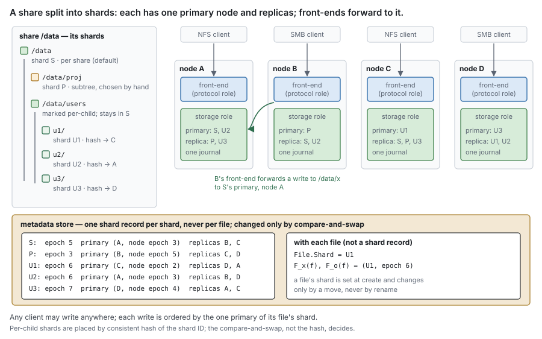
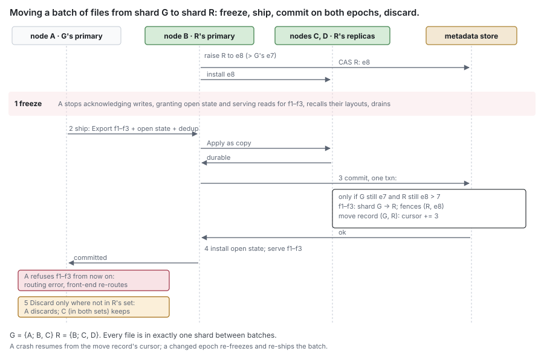
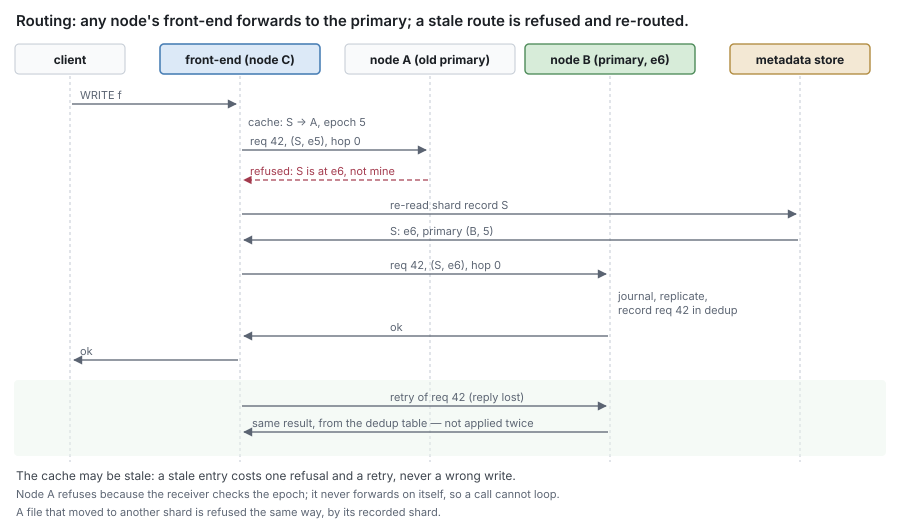
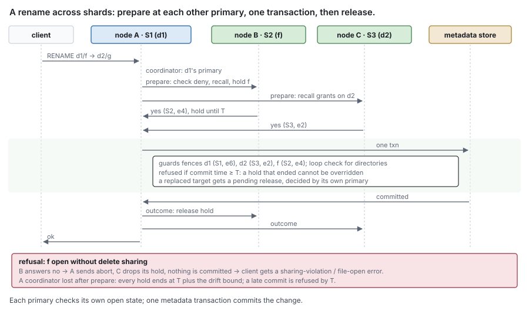

# RFC 11 — shards

**Status:** draft. [§15](#15.%20Open%20questions) lists what is known to be undecided.
**Audience:** anyone designing how several nodes serve one share.

---

## 1. Purpose

A **node** is one DittoFS server process, whatever roles it runs ([RFC 15 §2](rfc-15-topology.md#2.%20Roles)).
Only nodes with the `storage` role hold journals, so only they can be a primary
or a replica. There are no metadata-only DittoFS nodes: the metadata store is
either embedded in a storage node or an external replicated store
([RFC 15 §2.1](rfc-15-topology.md#2.1%20One%20binary%2C%20roles%20chosen%20at%20deployment)).

On one node, every write to a share goes through one engine and one journal, and
the order of writes is the order that journal appends them. A write is
acknowledged once the journal holds it, and until it is offloaded the journals
of its replica set are the only copies ([RFC 10 §1](rfc-10-journal-replication.md#1.%20Purpose)). So with several nodes serving one share, one node
must order the writes to any given bytes, and every other node must know which
one. Designs that run stateless servers over a shared transactional store have
no such node, because they acknowledge nothing that the store does not already
hold. This design has one, and this document says how it is chosen, found and
replaced:

> **Which node may write these bytes now, how does a request reach it, and how
> does anyone else read them?**

**Terms.** *Share*, *node*, *shard*, *primary*, *replica* and *epoch* are
defined once for every RFC in the [RFC 0 glossary](rfc-0-data-lifecycle.md#Glossary). This document adds:

| Term | Means |
| --- | --- |
| **shard record** | a shard's entry in the metadata store: its primary as (node, node epoch, journal identity, incarnation), its epoch, its replicas, replica count and floor ([RFC 16 §2.3](rfc-16-metadata-store.md#2.3%20Server-wide%20and%20control-plane%20entities)). It changes only by compare-and-swap |
| **fence records** | two records per file, `F_x` and `F_o`, each holding the (shard, epoch) the file's commits must carry ([§8](#8.%20Metadata%20consistency)) |
| **front-end** | the `protocol` role of a node: it holds client sessions and forwards each operation to the primary ([§5.1](#5.1%20Front-ends%20forward%20to%20the%20primary)) |
| **handover** | a planned change of a shard's primary, with no lease wait and no grace period ([RFC 10 §9.4](rfc-10-journal-replication.md#9.4%20Handover)) |
| **move** | a change of the shard some files belong to, run in batches ([§4](#4.%20Moving%20files%20and%20primaries)) |
| **re-placement delay** | how long a shard stays on the replica that took it over before it is moved to the node its slot names ([§2.2](#2.2%20Automatic%20per-child%20shards)) |

*Learner*, *node lease*, *drift bound* and *committed point* are [RFC 10 §2.1](rfc-10-journal-replication.md#2.1%20Terms)'s.
A primary is always a node, never a user. Where this document says *owner* it
means a file's owner — its uid or SID — and nothing else.

### 1.1 What scaling is being designed for

A deployment in the target range holds petabytes across tens of thousands of
shares and hundreds of thousands of users. Three shapes of multi-node system were
considered:

| | A. active-passive | B. shares spread across nodes | C. many nodes per share |
| --- | --- | --- | --- |
| Gives | survival of node loss | aggregate throughput across shares | throughput of one share beyond one node |
| Primary of a share | one node; a replica takes over | one node per share | one per shard, finer than a share |
| Limit | one node's throughput in total | one node per share | one node per shard |

A share is **one shard by default**, which gives B, and B with failover gives A.
Subtree and per-child shards give C for a share one node cannot carry
([§2](#2.%20Shards)). One node is any of them with one storage node. The same mechanism
serves all of them, so no deployment runs a code path another does not.

### 1.2 Non-goals

This document **MUST NOT**:

- replicate journal content or define how a shard's content survives failover —
  [RFC 10](rfc-10-journal-replication.md);
- define client-visible open state and locking — [RFC 14](rfc-14-open-state.md). Shard records are
  internal and **MUST NOT** be exposed as, or stored with, client state
  ([§7](#7.%20Protocol%20state));
- decide which nodes may be primaries — [RFC 15](rfc-15-topology.md)'s roles;
- let more than one node write the same bytes at once
  ([RFC 10 Appendix B](rfc-10-journal-replication.md#Appendix%20B%20%E2%80%94%20alternatives%20considered));
- split one file across shards, or give one file its own shard —
  [Appendix C](#Appendix%20C%20%E2%80%94%20later%3A%20per-file%20and%20range%20shards) sketches both for later;
- split one directory's entries across shards;
- split the metadata store into partitions with no transaction spanning them.
  The store is **one logical store with transactions across any keys**; a
  backend scales it horizontally underneath, and existence, release, batched
  moves and cross-shard operations each commit one transaction over records of
  several shards ([§4](#4.%20Moving%20files%20and%20primaries), [§8.1](#8.1%20Operations%20across%20shards), [Appendix B](#Appendix%20B%20%E2%80%94%20alternatives%20considered)).

> ponytail: one directory's entries live in one shard, so a single directory
> takes creates and lookups-with-open-state at one node's rate. Upgrade to a
> policy that hashes one directory's names across several shards when a
> measured workload — a flat ingest directory of 10^7 files — is capped by it.

## 2. Shards

A **shard** is a set of files with one primary at a time. Every file belongs to
one shard, recorded with the file ([RFC 7 §2.1](rfc-7-namespace-metadata.md#2.1%20File)), and the shard record names
its primary, epoch and replicas.

| Policy | A file's shard is | When |
| --- | --- | --- |
| per share | the share's single shard | the default |
| subtree | inherited from its parent at create; directories chosen by an operator start a new shard | a share one node cannot carry, split by hand |
| per child | each child directory created in a marked directory starts its own shard, placed by slot ([§2.2](#2.2%20Automatic%20per-child%20shards)) | a share of many independent trees, such as home directories |



**Shard records MUST NOT be per file.** The metadata store holds one shard record
per share, per chosen subtree and per child of a marked directory. Shard records
therefore grow with shares and directories, never with files.

**A shard belongs to the file, not the path.** A file's shard is set when it is
created and changes only by a move ([§4](#4.%20Moving%20files%20and%20primaries)). Rename **MUST NOT** change it,
and hard links do not split it. A change of shard changes which journals hold the
file's un-offloaded content, so it is never a side effect of rename; a policy that
wants a renamed tree to follow its new parent does so by a move.

### 2.1 One primary per shard

A shard has **one primary**. The primary serialises everything that acts on the
shard's files: namespace writes, open state ([RFC 14](rfc-14-open-state.md)), layouts, journal
appends, existence, offload, removals, releases and clone. Its epoch fences every
one of them ([§8](#8.%20Metadata%20consistency)). Because one primary holds both the open-state table and
the journal, a conflict check and the I/O it admits run in one process under one
epoch: no check goes stale between them, and no I/O pays a round trip to be
checked.

**Many writers, one shard.** One primary does not mean one client. Any number of
clients write to a share at once, each through whichever node it is connected to.
Every write to a shard is forwarded to its primary ([§5.1](#5.1%20Front-ends%20forward%20to%20the%20primary)), which orders and
journals them all. What one primary caps is throughput: a shard gets at most one
node's worth. A share that needs more is split into subtree or per-child shards,
each with its own primary on its own node. [§10](#10.%20Worked%20examples) (a) walks through both.

> ponytail: one primary per shard caps a shard's metadata operations and its data
> bandwidth at one node together. The upgrade is two primaries per shard — one for
> the namespace, one for data — each with its own epoch, and handoffs for release,
> truncate, the size overlay, `LAYOUTCOMMIT` and the I/O conflict check. Take it
> when measurement shows metadata and data work contending on one primary.

### 2.2 Automatic per-child shards

A directory **MAY** be marked so that every child directory **created** in it
starts a new shard. Files created directly in the marked directory stay in its
shard, and a directory renamed into it keeps its own.

- **Placement.** A per-child shard's ID hashes into one of a fixed number of
  **slots** — 4096 by default, fixed when the installation is created and never
  changed after. The **slot table**, a record in the metadata store
  ([RFC 16 §4.2](rfc-16-metadata-store.md#4.2%20Keys%3A%20per-file%2C%20per-share%2C%20content-addressed)), assigns each slot an ordered list of nodes from the
  **placement set** — the storage nodes that joined and were not decommissioned,
  less any absent for longer than the re-placement delay — the first as primary,
  the rest as replicas. Each node receives slots in proportion to its
  **capacity**, a node setting ([RFC 13 §3](rfc-13-configuration.md#3.%20Scopes)). A node that merely misses a lease
  renewal stays in the placement set, and the table is changed only by
  compare-and-swap. The slot's nodes are a proposal: they are written into the
  shard record by the same compare-and-swap as any other change, so fencing
  never depends on the table.
- **Failover now, re-placement later.** When a primary's node lease lapses, a
  replica takes the shard over at once ([RFC 10 §9.2](rfc-10-journal-replication.md#9.2%20Takeover)). Only after the
  **re-placement delay** — configured, 10 minutes by default — is the shard handed
  over ([§4](#4.%20Moving%20files%20and%20primaries)) to the node its slot names, and only once the dwell time has
  passed since its last planned change of primary ([§3.3](#3.3%20The%20primary%20follows%20the%20writer)). A node that returns
  within the delay therefore costs one failover and nothing more.
- **Rebalance.** When the placement set or a node's capacity changes, the slot
  table is recomputed to move as few slots as the new weights allow, and written
  by one compare-and-swap. Only the shards of slots whose nodes changed are
  handed over ([§4](#4.%20Moving%20files%20and%20primaries)), each under the ordinary handover rules, at a configured
  rate, under the same dwell, and — for a node that left — after the
  re-placement delay. A shard's slot never changes, so a rebalance moves primaries
  and replicas, never files.
- **Marking an existing directory** moves each existing child tree into a new
  shard by a batched move ([§4](#4.%20Moving%20files%20and%20primaries)). Before walking a child tree, the move writes
  the new shard onto that tree's root, so files created in it during the walk are
  born in the new shard. The walk stops at nested shard boundaries, and a batch
  skips any file whose recorded shard is no longer the giving one, so a file
  hard-linked into two trees moves once. Each (giving, receiving) pair has its own
  move record, so child trees move in parallel. A move costs about three store
  writes per file. Marking a directory in a shard that a live subtree snapshot
  covers **MUST** be refused with `ErrSubtreeSnapshot` until those snapshots are
  deleted, because it moves files ([§4](#4.%20Moving%20files%20and%20primaries)).
- **Cost.** One shard record per child of a marked directory, and one slot
  table per installation, whose size is fixed by the slot count, not by nodes or
  shards. A rebalance touches the shards of the moved slots only.

**Nothing hot is per share.** With 10^5 per-child shards in one share:

- usage is counted per shard, as deltas each primary folds, and summed for the
  share when read ([RFC 16 §4.4](rfc-16-metadata-store.md#4.4%20Counters%20that%20many%20writers%20change));
- a path walk crosses the share's root, but lookups and listings that need no
  primary-held state are served from the store by any node
  ([RFC 15 §4](rfc-15-topology.md#4.%20Where%20each%20call%20runs)). The root's own primary sees only the root's namespace writes,
  which are as few as its entries.

## 3. The primary

### 3.1 The primary is fenced by an epoch

A node is primary of a shard while the shard record names it — as (node, node
epoch) — and its **node lease** for that node epoch is live. There is one lease
per storage node, held in its node record and renewed once for every shard it is
primary of, never per shard ([RFC 10 §3](rfc-10-journal-replication.md#3.%20What%20it%20assumes%20of%20shard%20placement)).

| Installation setting ([RFC 13 §3](rfc-13-configuration.md#3.%20Scopes)) | Default | Used by |
| --- | --- | --- |
| node lease | 10 s | the expiry each renewal sets; a takeover waits it out plus the drift bound, so a lost primary's shards stall for at most about 10.5 s |
| renewal period | 3 s | how often a node renews; one failed renewal is retried before the self-fence, which falls 5 s — half the lease — after the node last reached the store |
| drift bound | 500 ms | the self-fence margin before expiry, the clock check (a node whose clock is off the store's by more than 250 ms fences), and the wait a successor adds |

- **Renew fails on an expired lease**, and on a node record a takeover has
  marked lapsed. Renewals write only the lease's expiry record and, in the same
  transaction, each of the node's journal generations, swapped from `g` to `g + 1`
  after the node has written `g + 1` to the journal's `format` and synced it; a
  journal whose swap loses is amnesiac and serves nothing more ([RFC 10 §2.2](rfc-10-journal-replication.md#2.2%20One%20journal%20carries%20many%20shards)).
  They never write the node record, so the commits that guard the node record ([§8](#8.%20Metadata%20consistency)) never contend with
  them. A node whose lease has lapsed acquires a new one at a higher node epoch,
  no sooner than the old expiry plus the drift bound in store time, and is then
  primary of nothing: the records still name its old node epoch. It regains a
  shard only by taking it over ([RFC 10 §9.2](rfc-10-journal-replication.md#9.2%20Takeover)), which raises the shard's epoch and
  runs grace; the old node epoch counts as lapsed, so it can take over its own
  shards at once.
- **A change of primary is a compare-and-swap** on the shard record that raises
  the shard's epoch.
- **An epoch never decreases for a file.** A shard's epoch **MUST** exceed that of
  every shard that previously held any of its files. A shard that receives files
  is therefore raised above every epoch they leave, before the first batch of a
  move ([§4](#4.%20Moving%20files%20and%20primaries)); a new shard starts one above its parent's. A file created in a
  shard starts at the shard's epoch.

**A primary fences itself.** It **MUST** stop acknowledging writes, serving open
state, serving reads and answering version queries ([§6](#6.%20Reads%20on%20other%20nodes)) once its node lease
is within the drift bound of expiry by its own clock, or once it has not reached
the store for half its lease. Each renewal returns the store's time, and a node
whose clock differs from it by more than half the drift bound, after allowing
half the renewal's round trip, fences itself as if its lease had lapsed. A successor **MUST NOT** serve before the old lease has
lapsed plus the drift bound, in store time ([RFC 10 §9.2](rfc-10-journal-replication.md#9.2%20Takeover)).

The lease alone protects nothing. A primary can pause past its lease and then
act; a check it makes before sending is already stale. What makes it safe is that
every receiver refuses a stale epoch — replicas ([RFC 10 §6](rfc-10-journal-replication.md#6.%20Fencing)) and the
metadata store ([§8](#8.%20Metadata%20consistency)). The shard record decides who **should** write; the
epoch decides whose writes **count**. Open-state grants are replies to clients
that no receiver can refuse, so for them the self-fence is the only fence.

**Every fenced commit takes a shared guard on its primary's node record**, and a
takeover marks that record lapsed in the transaction that claims the shard
([§8](#8.%20Metadata%20consistency)). A commit a paused primary has in flight when its successor claims the
shard therefore conflicts and aborts, and one it starts later reads the mark and
is refused — before the successor has written a single fence record. The guard is
on the node record, not on the lease's expiry record or the journal generations
a renewal writes, so renewals never conflict with commits.

### 3.2 The primary stays until another node needs it

- A shard that has never had a primary, or whose last primary released it
  cleanly after offloading everything, is **claimed** by the first storage node
  that needs it, with one compare-and-swap.
- A shard whose record names a primary with a lapsed lease is **not** claimed
  that way. It is taken over by a replica that is not a learner
  ([RFC 10 §9.2](rfc-10-journal-replication.md#9.2%20Takeover)); a plain claim by any other node would leave the replicas
  outside the record, and they would discard every acknowledged write.
- Nothing is exchanged per write or per file while the primary stays; its node
  renews one lease for every shard it holds.
- Any other node that receives a write forwards it to the primary
  ([§5.1](#5.1%20Front-ends%20forward%20to%20the%20primary)), or, under [§3.3](#3.3%20The%20primary%20follows%20the%20writer), asks for the primary to move.

A single writer therefore pays one metadata-store transaction per shard it
claims, not per file or per write.

### 3.3 The primary follows the writer

Forwarding is the default. A shard's primary is handed over to another node
([§4](#4.%20Moving%20files%20and%20primaries)) only when all of these hold:

1. **One node sends most of the writes.** Over the last **window**, at least
   **share** of the shard's written bytes arrived forwarded from one node.
2. **The dwell time has passed** since the shard's last planned change of
   primary.
3. **The new node is a replica that is not a learner**, or becomes one first
   ([RFC 10 §9.4](rfc-10-journal-replication.md#9.4%20Handover)).

Only the primary decides, from the forwarded writes it counts itself; front-ends
never request a move. A handover whose un-offloaded tail does not shrink while it
is shipped — the writer is outrunning the copy — is abandoned, and the dwell time
restarts. Two nodes writing one shard by turns therefore never pull it back and
forth faster than once per dwell time, and two writing at once never meet
condition 1.

**The dwell binds every planned change of primary**: follow-the-writer,
re-placement and rebalance each wait until the dwell time has passed since the
shard's last one. A failover is not gated and does not restart the dwell, and
neither is the handover away from a primary the front-ends cannot reach
([§5.1](#5.1%20Front-ends%20forward%20to%20the%20primary)): both answer a primary that is lost to its clients, which no dwell may
keep in place. Without the one dwell, a follow-the-writer move and a
re-placement back to the slot's node could alternate, shipping the tail each time.

| Setting | Default | Meaning |
| --- | --- | --- |
| `shard.follow_writer` | on | off: the primary never moves on its own; only an operator or rebalance moves it |
| `shard.follow_writer.window` | 5 min | how far back condition 1 looks |
| `shard.follow_writer.share` | 0.9 | the fraction of written bytes one node must have sent |
| `shard.dwell` | 30 min | how long after a planned change of a shard's primary before any planned change may move it again |
| `shard.replace_delay` | 10 min | the re-placement delay ([§2.2](#2.2%20Automatic%20per-child%20shards)) |

## 4. Moving files and primaries

Two things move, and both are handovers: the primary of a whole shard, and a
batch of files from one shard to another.

**A shard's primary moves** by [RFC 10 §9.4](rfc-10-journal-replication.md#9.4%20Handover): the new primary is first a replica
that is not a learner; the old one stops writes, grants and reads, drains, and
names the new one at the next epoch; it hands over the open-state table and the
dedup table; the new primary re-applies existence and serves with no grace period.
A handover whose old primary is lost before it completes becomes a failover.

**Files move between shards in batches.** A subtree can hold more files than one
transaction may write. A move from giving shard G to receiving shard R keeps its
cursor in a **move record** of its own, keyed by the pair (G, R), so advancing it
changes neither shard record and several moves out of G run at once.

**A move into or out of a shard that a live subtree cut covers MUST be refused**
with `ErrSubtreeSnapshot` ([RFC 12 §2.10](rfc-12-snapshots.md#2.10%20Subtree%20snapshots)). A file's history is kept by
testing its shard's coverage, so a file moved out would drop history the
snapshot reads, and a file moved in would bring records the cut never ordered. A
handover of a covered shard's primary moves no files and is allowed.

> ponytail: coverage is per shard, so one live subtree snapshot pins every file
> of its covered shards in place until it is deleted. Upgrade to per-file
> coverage, the cut recorded on each file it covers, when refused moves under
> long-kept subtree snapshots block rebalancing or directory marking.

Before the first batch, if R's epoch is not above G's, R's primary raises it to
one above G's by an ordinary change of R's record and installs it on R's replicas
([RFC 10 §6](rfc-10-journal-replication.md#6.%20Fencing)). Then each batch runs these steps:

1. **Freeze.** G's primary stops acknowledging writes, granting open state and
   serving reads for the batch's files, recalls their layouts, and drains what is
   in flight for them. Calls for them wait; nothing else in G pauses.
2. **Ship.** G's primary sends R's primary each file's un-offloaded operations
   (`Export`, [RFC 10 §2.3](rfc-10-journal-replication.md#2.3%20The%20journal%20extension)) — held superseded versions and their snapshot
   hold marks included ([RFC 12 §2.4](rfc-12-snapshots.md#2.4%20A%20snapshot%20hold%20bridges%20dirty%20content%20to%20history)) — with the files' open-state
   entries and dedup entries, tagged with the move, the batch and G's epoch. R's
   primary accepts a ship only for a batch it has open under that epoch, and
   **re-versions** it: each operation gets a new version under R's epoch, in the
   order exported, so each file's versions keep their order; a stamp and a hold
   mark follow the operation they were on to its new version. Each is replicated
   to R's replicas as an ordinary write
   ([RFC 10 §9.4](rfc-10-journal-replication.md#9.4%20Handover)).
3. **Commit.** Once the re-versioned operations are durable on R's primary and
   every one of R's replicas, R's primary commits one transaction that:
   - reads both shard records with conflict tracking, and commits only if G's
     epoch is still the one the batch was frozen under and R's is still the one
     R installed, above it;
   - for each file whose recorded shard is still G, rewrites it to R and writes
     its fence records as (R, R's epoch);
   - writes R's hold record for every cut whose held versions the batch shipped
     ([RFC 12 §2.4](rfc-12-snapshots.md#2.4%20A%20snapshot%20hold%20bridges%20dirty%20content%20to%20history)), so the snapshot waits for R's offload of them;
   - advances the move record's cursor.

   If either epoch has changed, nothing commits: R's primary `Discard`s the
   batch's files under R on itself and every replica, and the batch is frozen and
   shipped again under the new epochs.
4. **Serve.** R's primary re-applies existence for the batch's files, as after a
   takeover ([RFC 10 §9.2](rfc-10-journal-replication.md#9.2%20Takeover) step 5), installs the open-state entries and adds R to
   each client record they name ([RFC 14 §4.4](rfc-14-open-state.md#4.4%20Grace%20is%20per%20shard)), and serves the files. G's
   primary refuses any later call for them with a routing error, because their
   recorded shard is no longer G, and front-ends re-route.
5. **Discard.** G's primary sends its replicas a committed point covering the
   batch, then tells every node of G's replica set, itself included, to `Discard`
   the files under G. A node in R's replica set too keeps its entries under R:
   `Discard` names one shard ([RFC 10 §2.3](rfc-10-journal-replication.md#2.3%20The%20journal%20extension)), whenever the node joined R. A late G
   operation for a moved file is below G's committed point and is refused.



Every file is in exactly one shard between batches, so a crash leaves nothing to
repair: the move resumes from its cursor. If G fails over mid-move, its new
primary reads the move record and resumes from step 1. A takeover of either shard
writes fence records only for files recorded in its own shard; a takeover of R
discards its entries of files still recorded in G, which a batch shipped but did
not commit.

**Snapshots.** A share's cut is one transaction over all its shards, behind each
shard's cut gate ([RFC 12 §2.3](rfc-12-snapshots.md#2.3%20The%20cut%20is%20one%20transaction%20behind%20a%20brief%20gate)). While a snapshot record of the share in state
`cutting` exists, the primary of a new shard — a per-child shard just created
([§2.2](#2.2%20Automatic%20per-child%20shards)) — and a primary that starts serving a shard, or files moved into
one, after a takeover, a handover or a move **MUST** start the shard's gate
closed, so no transaction it admits commits after the cut under the old cut
number. The holds the moved files carry follow their re-versioned content, and
R's hold records keep the snapshot waiting until R has offloaded them. For a
subtree cut, which closes only its covered shards' gates
([RFC 12 §2.10](rfc-12-snapshots.md#2.10%20Subtree%20snapshots)), the rule applies to the covered shards only.

## 5. Routing

### 5.1 Front-ends forward to the primary

File protocols carry operations on many files over one connection and cannot
redirect a client per file, so the front-end routes each operation:

- it looks up the shard of what the operation touches, and the shard's primary,
  in a cache of shard records read from the metadata store ([RFC 15 §6](rfc-15-topology.md#6.%20Learning%20primaries));
- it forwards the operation to that primary. Every routed call is callable across
  a network ([RFC 15 §4.1](rfc-15-topology.md#4.1%20Every%20call%20is%20safe%20to%20route)) and carries the route envelope
  ([RFC 15 §4.3](rfc-15-topology.md#4.3%20The%20route%20envelope)): a request ID, so a retry is answered once; the shard and
  epoch the sender expects; and a **hop count**;
- the receiver refuses the call if the epoch is not its current one, or if the
  file's recorded shard is not the one named; the front-end re-reads the shard
  record and retries, a bounded number of times;
- only the front-end forwards. A node that receives a call it is not primary
  for refuses it, naming the primary it knows, and **MUST NOT** forward a call
  whose hop count is not zero, so a call never cycles between stale caches.



The routing cache **MAY** be stale. A stale entry costs a refusal and a retry,
never a wrong write, because the check is at the receiver.

**Retries are answered once.** The primary keeps a dedup table of recent
mutations keyed by request ID alone, which is unique across the cluster
([RFC 15 §4.3](rfc-15-topology.md#4.3%20The%20route%20envelope)) — not by shard or epoch, so a retry that straddles an epoch raise,
or is re-routed to the shard a file moved to, is still recognised — holding each
result for at least the sender's retry window. The table travels with every
handover and, entry by entry, with the files of every batch.

**A primary the front-ends cannot reach** while it still reaches the store would
keep its lease forever. Front-ends report failed forwards to the store, which
records a health condition on the node. If it persists for the re-placement
delay, each of the node's shards is handed over to a replica the front-ends can
reach; a primary that does not complete a handover within a bound is refused its
next renewal, which turns the handover into a failover.

On one node the front-end and the primary are one process, and routing is a
function call.

### 5.2 Clients that can route themselves

A protocol that lets the server direct a client's I/O per file — parallel NFS
layouts — **MAY** point the client at the primary directly, so its reads and
writes skip the front-end hop. A layout is another holder of the routing
decision: it records the (shard, epoch) it was granted under, the primary as data
server checks it on every `READ`, `WRITE` and `COMMIT`, and it **MUST** be recalled
or revoked when the shard's primary changes or its file moves
([RFC 15 §5.1](rfc-15-topology.md#5.1%20pNFS)). The flex-files layout's own fence — the metadata server
changing a synthetic uid — is not a substitute: it fences every client at once
and is not tied to an epoch. Clients without layouts use the front-end path;
nothing in this document depends on layouts.

## 6. Reads on other nodes

| Served by | When |
| --- | --- |
| the primary | content the whole replica set holds ([RFC 10 §8](rfc-10-journal-replication.md#8.%20Reads)) |
| any other storage node, replicas included | only bytes carrying the version the primary names for the range |
| a learner | never |

A node other than the primary **MAY** serve a range, from its own journal or by
filling it from metadata and the remote tier ([RFC 0 §6.2](rfc-0-data-lifecycle.md#6.2%20Fill)), only after asking
the primary for the newest version of that range the whole replica set holds, and
only bytes that carry exactly it, under the checks [RFC 10 §8](rfc-10-journal-replication.md#8.%20Reads) makes of the
answer's epoch and lease — its own checks, not the primary's. **Otherwise it MUST
forward the read.** Metadata
alone cannot tell it: the primary acknowledges a write before offloading it, so
the current ref ([RFC 6 §2.1](rfc-6-block-metadata.md#2.1%20ChunkRef)) can be older than an acknowledged write, and a
replica's copy can be older than one the primary holds. A cached copy older than
the named version is dropped ([RFC 1 §9.2](rfc-1-journal.md#9.2%20Offload%20state%20after%20recovery)) and filled again. The question costs
one round trip and no bytes.

**Attributes follow the same line.** A file's size and times after an
acknowledged but unflushed write live only at its primary. A `GETATTR`, or any
call whose answer must reflect every acknowledged write, goes to the file's
primary ([RFC 15 §4](rfc-15-topology.md#4.%20Where%20each%20call%20runs)). A directory listing with attributes (`READDIRPLUS`,
SMB query-directory) **MAY** take the attributes of children in other shards from
the store, which reflects every flushed write ([RFC 10 §4](rfc-10-journal-replication.md#4.%20The%20write%20path)) and so keeps
close-to-open consistency; it **MUST NOT** present them as fresher than that.

## 7. Protocol state

Client-visible state is [RFC 14](rfc-14-open-state.md)'s: held by the primary of the file's shard,
fenced by its epoch, moved with it, and recovered through grace
([RFC 14 §8](rfc-14-open-state.md#8.%20What%20is%20durable), [RFC 14 §9](rfc-14-open-state.md#9.%20Open%20state%20and%20the%20life%20of%20a%20file)). Four rules follow from this document and bind it:

1. **A failover loses volatile open state.** The new primary runs grace for the
   shard and releases nothing before it ends
   ([RFC 14 §9.2](rfc-14-open-state.md#9.2%20A%20new%20primary%20releases%20nothing%20before%20grace%20ends)).
2. **A handover and a batch move do not.** The old primary hands the files' state
   to the new one ([§4](#4.%20Moving%20files%20and%20primaries)), and no grace runs.
3. **The NFS write verifier MUST change whenever the node serving a shard as
   primary changes, and SHOULD NOT change otherwise.** It is derived from the
   primary's node, node epoch and process instance, not from the shard epoch, so
   the raise before a move does not make every client resend its unstable writes.
4. **Client state is not a shard record.** It has its own semantics, grace and
   recovery, and **MUST NOT** share records with shard records, though both **MAY**
   be served by one metadata store.

## 8. Metadata consistency

**Every fenced commit carries (shard, epoch, node, node epoch)** and is refused
unless:

- for each file it touches, the file's fence record holds exactly that (shard,
  epoch) — *current* means equal, not merely not above, and a fence from another
  shard never matches whatever its number; and
- the primary's node record, which the commit guards ([RFC 16 §4.1](rfc-16-metadata-store.md#4.1%20One%20small%20interface%20per%20backend)), holds
  that node epoch and is not marked lapsed.

The fence record refuses a paused primary's commit once a successor has written
it. The node record refuses it before then: a takeover marks the old primary's
node record lapsed in the transaction that claims the shard ([RFC 10 §9.2](rfc-10-journal-replication.md#9.2%20Takeover)), so a
commit in flight under the old node epoch conflicts with the claim and aborts,
and one that starts later reads the mark. The guard is a conflict, not a time:
no check of store time against the lease's expiry fences a commit, because a
store whose commit path chooses the commit timestamp after the check could land
the commit past the expiry. Store time decides only when a lease has lapsed
([§3.1](#3.1%20The%20primary%20is%20fenced%20by%20an%20epoch)). Every commit of a node guards one record, and guards are shared, so
they never contend with each other; renewals write another record.

Fenced commits are existence ([RFC 6 §3.4](rfc-6-block-metadata.md#3.4%20Ordering%20against%20the%20journal)), offload ([RFC 6 §4.1](rfc-6-block-metadata.md#4.1%20What%20one%20commit%20records)),
truncate, deallocate, clone, release, the pruning of removal records, and every
namespace transaction — create, link, unlink, rename, set-attribute, ACL and
xattr changes, the pending release. A group commit across files checks each file.

**The check MUST conflict with any concurrent change of the fence**, whatever the
store's isolation level: a read the store tracks for conflicts, or an explicit
lock on the key. A plain read under snapshot isolation is not a fence, and neither
is a scan over a key range.

**Two fence records per file**, one per commit path ([RFC 6 §5.4](rfc-6-block-metadata.md#5.4%20Reads%20that%20gate%20a%20commit)):

| Record | Read by | Written by |
| --- | --- | --- |
| `F_x(file)` | existence commits and namespace transactions, with conflict tracking | a new primary; a move; removals and releases |
| `F_o(file)` | offload commits and removal pruning | a new primary; a move; removals and releases |

- A new primary **MUST** write both, as (its shard, its epoch), before its first
  operation on the file under that epoch, and only for files recorded in its
  shard. A create writes the new file's fence records.
- A removal or release reads and writes both, so it conflicts with an offload
  commit and with an existence commit of the same file in both directions.
- A fence that forces every commit of a shard through one record **MUST NOT** be
  used: it serialises every file of the shard on one key.
- A fenced commit covers only operations durable on the whole replica set
  ([RFC 10 §4](rfc-10-journal-replication.md#4.%20The%20write%20path)).
- **Release is fenced like a write.** It deletes the file's content record and
  records a removal of the whole file ([RFC 6 §6.4](rfc-6-block-metadata.md#6.4%20Delete)); a superseded primary's
  release would destroy a file its successor is writing.
- **Removal records are pruned only by the file's primary**, under its epoch.
  Only the primary knows which of its offload offers are still in flight.
- A **put intent** ([RFC 6 §7.6](rfc-6-block-metadata.md#7.6%20Put%20intents)) carries the (shard, epoch) it was written
  under; one whose epoch is superseded can no longer commit, and GC **MAY** remove
  it ([RFC 9 §5](rfc-9-gc.md#5.%20Unrecorded%20objects)).

*Backend notes (non-normative).* On the backend that tracks point reads, a
conflict-tracked read is a get inside an update transaction with conflict
detection on; a blind write detects nothing, so a guarded write also gets the key.
On the snapshot-isolation backend it is an explicit key lock, taken on several
files in file-identity order. Transaction size limits set the batch size of moves
and removals, and no transaction spans an upload.

### 8.1 Operations across shards

A rename, link or unlink can touch files in several shards: the source
directory, the target directory, the file itself — whose shard need not be its
directory's ([§2](#2.%20Shards)) — and a target it replaces. Each check such an operation
needs lives at a different primary: a deny mode that forbids delete, a delegation
to recall, a directory watch. So:

1. **One primary runs it**: the source directory's, or, for a link, the target
   directory's. It is the **coordinator**.
2. **Prepare.** The coordinator asks the primary of every other shard involved
   to check the operation against its open state — deny modes, conflicting
   opens — to recall the caching grants it breaks, and to **hold** the files:
   refuse new opens and grants that would conflict, until an outcome arrives or a
   deadline passes. The deadline, in store time, is at most the participant's own
   node lease expiry less the drift bound, so no hold outlives the lease that
   protects it. Before it answers, each participant commits a durable **hold
   record** for the operation in its shard ([RFC 16 §4.2](rfc-16-metadata-store.md#4.2%20Keys%3A%20per-file%2C%20per-share%2C%20content-addressed)), keyed by shard
   and operation and distinct from a snapshot's hold record, a fenced write
   carrying the deadline. Each answers yes with its (shard, epoch), its
   (node, node epoch) and the hold's deadline, or no with a reason.
3. **Commit.** On every yes, the coordinator commits **one** metadata transaction
   that guards the fence records of every file and directory it changes, at the
   (shard, epoch) each primary answered with; guards each participant's shard
   record, and commits only if its epoch is still the one answered; guards each
   participant's node record as [§8](#8.%20Metadata%20consistency) does; and guards each participant's hold
   record, and commits only if every one still exists. A participant that failed
   over since it answered therefore refuses the commit even for a file its
   successor has not touched, and one that released its hold refuses it too. A
   directory rename runs the loop check inside this transaction
   ([RFC 7 §5.2](rfc-7-namespace-metadata.md#5.2%20The%20loop%20check%20is%20inside%20the%20transaction)).
4. **Release.** The coordinator sends the outcome, and each primary drops its
   hold and deletes its hold record. A file whose last entry was removed gets a
   pending release, which its own primary decides ([RFC 15 §4.2](rfc-15-topology.md#4.2%20Calls%20that%20touch%20two%20primaries)).

On any no, the coordinator sends abort and returns the protocol's
sharing-violation or file-open error. A participant releases its hold on its own
once the deadline has passed in store time, by a transaction that deletes its
hold record, and grants nothing the hold refused until that transaction has
committed. A lost coordinator therefore blocks nobody for longer than the
deadline, and a late commit conflicts with the release or finds the record gone,
and aborts rather than override a grant made after the hold ended. No time check
decides the commit: a store that chooses the commit timestamp after such a check
could land the commit past the deadline. A new primary deletes the hold records
its shard's earlier epochs left, which no commit can use since each guards the
shard record at the epoch answered.

**Snapshots.** A cross-shard transaction writes versioned records in every shard it
touches, so it **MUST** be admitted at all their cut gates or at none
([RFC 12 §2.3](rfc-12-snapshots.md#2.3%20The%20cut%20is%20one%20transaction%20behind%20a%20brief%20gate)): the coordinator takes the gates in shard-ID order and,
on meeting a closed one, releases those it took, waits for it and starts again.
A prepared transaction stays admitted until it commits or its hold deadline ends
it, which bounds how long it keeps a gate from closing.



## 9. Failure

| Failure | Outcome |
| --- | --- |
| a storage node is lost | its shards fail over to replicas as soon as its lease lapses ([RFC 10 §9](rfc-10-journal-replication.md#9.%20Failover)); after the re-placement delay they are handed to the nodes their slots name ([§2.2](#2.2%20Automatic%20per-child%20shards)); front-ends re-route on the first refusal |
| a node pauses past its lease | on resuming, everything it sends is refused: by replicas by epoch, by the store by its node record or fence ([§8](#8.%20Metadata%20consistency)); its renewal fails and it is primary of nothing ([§3.1](#3.1%20The%20primary%20is%20fenced%20by%20an%20epoch)) |
| the store stalls for longer than a lease | every node's lease lapses; each acquires a new one and takes its own shards over, with grace — the price of one lease per node |
| a front-end is lost | another front-end takes over its client addresses ([RFC 15 §5.3](rfc-15-topology.md#5.3%20Client%20addressing)); clients reconnect and lose no open state, which primaries hold |
| a primary is lost | its shards fail over; clients reclaim their state in them in grace ([RFC 14 §4.4](rfc-14-open-state.md#4.4%20Grace%20is%20per%20shard)); layouts naming it are revoked |
| the store is unreachable from a node | it can neither renew nor commit; it fences itself after half its lease, and its shards fail over wherever the store is reachable |
| a partition separates nodes but not the store | who is primary does not change, since the store decides it; replication across the partition fails and [RFC 10 §7.2](rfc-10-journal-replication.md#7.2%20Removal) removes the unreachable replicas |
| front-ends cannot reach a primary that reaches the store | a health condition; handover after the re-placement delay ([§5.1](#5.1%20Front-ends%20forward%20to%20the%20primary)) |
| a coordinator is lost mid-prepare | holds end at their deadline; nothing was committed ([§8.1](#8.1%20Operations%20across%20shards)) |

## 10. Worked examples

Notation: nodes A–E; `S(e5)` is shard S at epoch 5; `f`, `g` are files. Each
example is a scenario in the simulator's catalogue ([§14](#14.%20Test%20plan%20and%20benchmarks)), named by the ID that
replays it exactly.

**(a) Many clients writing one share, and a per-child split** —
`S-shard-many-writers`. Share `/data` is one shard S, primary A, replicas B and C.
Thirty clients mount through A, B and C.

| t | node A | nodes B, C | metadata store | client sees |
| --- | --- | --- | --- | --- |
| 0 | primary of S(e5); journals writes from its own 10 clients | front-ends forward their 20 clients' writes to A | S: e5, A; B, C | all 30 write |
| 1 | orders and journals all 30 streams; network or disk at 100% | replicate A's operations as replicas | existence commits at e5 | throughput flat at one node's |
| 2 | operator marks `/data/users` per-child | — | mark on `/data/users` | — |
| 3 | moves each `/data/users/u*` tree into its own shard, in batches (as (d)) | — | shards U1…U30 placed by their slots: U1 → B, U2 → C, U3 → A, … | brief waits on files in a frozen batch |
| 4 | primary of S and U3, U6, … | B primary of U1, U4, …; C of U2, U5, … | — | each client's writes go to one of three primaries; throughput ≈ 3 nodes' |

Nothing a client does changes: every node still forwards what it is not primary
for. What changed is that there are now thirty primaries' worth of ordering to go
around.

**(b) The primary follows the writer, and does not ping-pong** —
`S-shard-follow-writer`. Shard P, primary A, replicas B and C; window 5 min,
share 0.9, dwell 30 min.

| t | node A | node B | metadata store | client sees |
| --- | --- | --- | --- | --- |
| 0:00 | primary of P(e3); a batch job on B's client writes P | forwards every write to A | P: e3, A; B, C | writes pay one hop |
| 0:05 | counts 97% of P's bytes from B over 5 min; dwell has passed; hands over (§4) | becomes primary | P: e4, B; A, C | writes pause for the drain, then no hop |
| 0:10 | a client on A starts writing P; forwards to B | counts A's share at 60% | — | A's client pays one hop |
| 0:20 | — | A's share reaches 95%, but only 15 min since the last move: stays | — | — |
| 0:35 | — | dwell passed, A still at 95%: hands over | P: e5, A; B, C | — |
| 0:36 | both clients now write at once | 50% / 50%: no node reaches 0.9 | — | P stays at A; B's client forwards |

Without the dwell, t 0:20 would have moved P back at once, and every move ships P's
un-offloaded tail.

**(c) A node crashes: failover now, re-placement later** —
`S-shard-crash-replace`. Per-child shard U7, primary A, replicas B and C; the
the slot U7 hashes into names A first. Re-placement delay 10 min.

| t | node A | nodes B, C | metadata store | client sees |
| --- | --- | --- | --- | --- |
| 0 | crashes | — | U7: e9, A; B, C | writes to U7 stall |
| 0 + lease + drift | — | B has the highest committed point: takes U7 over ([RFC 10 §9.2](rfc-10-journal-replication.md#9.2%20Takeover)) | U7: e10, B; C | writes resume at B; grace for U7's open state |
| 4 min | restarts; acquires a lease at a new node epoch and is primary of nothing; rejoins U7 as a learner ([RFC 10 §7.3](rfc-10-journal-replication.md#7.3%20Joining)) | B covers A's tail | U7: e11, B; C, A (learner) | — |
| 6 min | tail covered | B clears the learner flag | U7: e12, B; C, A | — |
| 10 min | — | the re-placement delay has passed since the failover, the dwell since U7's last planned change long ago, and U7's slot still names A: B hands U7 over ([§4](#4.%20Moving%20files%20and%20primaries)) | U7: e13, A; B, C | a brief drain; no grace |

Had A stayed down past 10 min, it would have left the placement set, the slot
table would have given A's slots to other nodes by capacity, and U7 would have
been handed to its slot's new first node, after that node joined as a replica. A
node that flaps within the delay never changes the slot table.

**(d) Moving a batch of files between shards** — `S-shard-batch-move`. Files
`f1`–`f3` move from G(e7) — primary A, replicas B, C — to R — primary B,
replicas C, D.

| t | node A (G's primary) | node B (R's primary) | metadata store | client sees |
| --- | --- | --- | --- | --- |
| 0 | — | raises R to e8, installs it on C and D | R: e8, B; C, D; move record (G, R) cursor 0 | — |
| 1 | freezes `f1`–`f3`: holds new writes, recalls a layout on `f2`, drains | — | — | writes to `f1`–`f3` wait |
| 2 | exports their un-offloaded operations `v(7,…)`, open-state and dedup entries to B, tagged (G, e7, batch 1) | re-versions them as `v(8,1)`–`v(8,9)` under R; replicates to C, D; all durable | — | — |
| 3 | — | — | one txn: G still e7, R still e8 > 7; `f1`–`f3` → R; fences (R, e8); cursor 3 | — |
| 4 | refuses `f1`–`f3` with a routing error | re-applies existence at e8; installs open state; serves | existence at (R, e8) | waiting writes retry at B, found in the moved dedup entries or applied once |
| 5 | sends G's replicas a committed point covering the batch; tells A, B, C to `Discard` `f1`–`f3` under G | B and C drop their G entries and keep their R ones | — | — |

Had G failed over to C at e8 after t3, C's takeover would find `f1`'s fence
holding (R, e8): same number, other shard, so C's re-applied existence for `f1` is
refused and C drops that content. Had it failed over before t3, the commit would
have been refused, B would have discarded `f1`–`f3` under R on B, C and D, and
the batch would have been shipped again from G's new primary.

**(g) A delayed copy of a move is refused** — `S-shard-move-delayed-copy`. As
(d), but a duplicate of t2's ship is delayed in the network.

| t | node A (G's primary) | node B (R's primary) | metadata store | client sees |
| --- | --- | --- | --- | --- |
| 0 | — | batch 1 commits as in (d) | `f1` → R, fences (R, e8) | — |
| 1 | — | a client truncates `f1` at `v(8,20)`; `cp` passes it; C and D settle | truncate committed at (R, e8) | `f1` truncated |
| 2 | — | the duplicate ship tagged (G, e7, batch 1) arrives: batch 1 is not open, refused | — | — |
| 3 | a duplicate G operation for `f1` reaches C | C: at or below G's committed point, and its G entry is gone: refused | — | `f1` stays truncated |

Had B accepted the duplicate, it would have re-versioned the truncated bytes above
`v(8,20)` and brought them back.

**(e) A rename across shards, refused then allowed** —
`S-shard-cross-rename`. `d1` is in S1 (primary A), `d2` in S3 (primary C), and
`f`, once renamed into `d1` from another tree, is still in S2 (primary B). A
Windows client has `d1/f` open without delete sharing.

| t | node A (coordinator) | node B (f's primary) | metadata store | client sees |
| --- | --- | --- | --- | --- |
| 0 | an NFS rename `d1/f` → `d2/g` arrives; prepare to B and C | the open denies delete: answers no | — | — |
| 1 | aborts; C drops its hold and deletes its hold record | — | nothing committed | NFS client: file open error |
| 2 | the Windows client closes `f`; the rename is retried; prepare again | no conflicting open: holds `f`, commits its hold record, answers yes (S2, e4), (B, 5), deadline T no later than its lease expiry less the drift bound | hold record of S2, deadline T | — |
| 3 | C recalls a directory delegation on `d2`, commits its hold record, answers yes (S3, e2) | — | hold record of S3 | — |
| 4 | commits one txn: fences `d1` (S1, e6), `d2` (S3, e2), `f` (S2, e4); shard records S2 at e4 and S3 at e2; node records of A, B and C; hold records of S2 and S3, both present | — | entries moved; `f` still in S2 | rename done |
| 5 | sends the outcome | drops its hold, deletes its hold record | hold records deleted | — |

Had B died after t2 and C′ taken S2 over before the commit, S2's record would be
at e5 and B's node record marked lapsed: the commit is refused, and no open C′
grants in its grace can be overridden by it — `S-shard-cross-hold-failover`. Had
B instead passed T and released `f` before t4, its release would have deleted
S2's hold record before granting a deny-delete open, and the commit would have
conflicted with that deletion or found the record gone, whatever timestamp the
store chose for it — `S-shard-cross-hold-release`.

**(f) A paused old primary** — `S-shard-paused-primary`. Shard S, primary A at
node epoch 3, lease expiry E; replicas B and C.

| t | node A | node B | metadata store | client sees |
| --- | --- | --- | --- | --- |
| 0 | S(e5); begins commits for `f` and `g`, then freezes | — | S: e5, (A, 3); fences `f`, `g` (S, e5) | — |
| 1 | — | after E + drift in store time, takes S over | one txn: A's node record marked lapsed at 3; S: e6, (B, 5); C | writes resume at B |
| 2 | — | writes `f`, writing its fences first | fence `f` (S, e6); `g` untouched | — |
| 3 | resumes; its commit for `g` arrives, guarding A's node record | — | refused: the record is marked lapsed, though fence `g` is still (S, e5) | `g` intact |
| 4 | its commit for `f` arrives | — | refused: (S, e5) ≠ (S, e6) | `f` has B's write |
| 5 | renewal fails; acquires a new lease at node epoch 4 | — | record names (B, 5): A is primary of nothing | — |

Had A's commit for `g` been in flight when B's claim committed, it would have
conflicted on A's node record and aborted — `S-shard-stale-commit-node-guard`.

## 11. API surface

Signatures are indicative; the obligations above are normative.

```go
// Shards is what storage nodes and front-ends ask of the metadata store.
type Shards interface {
	// ShardOf returns the shard a file belongs to, recorded with it (§2).
	ShardOf(ctx context.Context, file FileID) (ShardID, error)
	// Record returns a shard's record (§1, RFC 16 §2.3).
	Record(ctx context.Context, s ShardID) (metadata.Shard, error)
	// Claim names the caller primary of a shard that has none, or whose last
	// primary released it cleanly (§3.2). ErrHeld names the live primary;
	// ErrNeedsTakeover means the record names a lapsed one (RFC 10 §9.2).
	Claim(ctx context.Context, s ShardID) (Claim, error)
	// Renew extends the caller's node lease — writing its expiry record and
	// swapping each of its journal generations, never the node record — and
	// returns the expiry, the store's time and the journals whose swap lost.
	// gens holds, per journal, the g + 1 already synced to its format file
	// (RFC 10 §2.2). It fails with ErrLeaseExpired once the lease has lapsed or a
	// takeover marked it (§3.1).
	Renew(ctx context.Context, node NodeID, nodeEpoch uint64, gens map[JournalID]uint64) (expires, storeNow time.Time, lost []JournalID, err error)
	// Move moves files from one shard to another in batches, resuming from the
	// move record of the pair (§4).
	Move(ctx context.Context, from, to ShardID, files iter.Seq[FileID]) error
}

// Claim is what a primary carries on every fenced call (§8): the fence
// records must hold (Shard, Epoch), and the node record, which the commit
// guards, must hold NodeEpoch unmarked.
type Claim struct {
	Shard     ShardID
	Epoch     uint64
	Node      NodeID
	NodeEpoch uint64
}

// Router is a front-end's routing cache (§5.1, RFC 15 §6).
type Router interface {
	Route(ctx context.Context, file FileID) (NodeID, Claim, error)
	Invalidate(s ShardID) // after a refusal
}

var (
	ErrHeld          = errors.New("shard: primary is live elsewhere")
	ErrNeedsTakeover = errors.New("shard: primary lapsed; take over through a replica")
	ErrLeaseExpired  = errors.New("shard: node lease lapsed; acquire a new one")
	ErrWrongShard    = errors.New("shard: file is not in the shard named")
)
```

## 12. Invariants

| # | Invariant |
| --- | --- |
| O1 | At most one node's writes to any byte take effect under any epoch, because every receiver refuses a stale one. |
| O2 | A file's epoch never decreases: every change of a shard's primary or replica set raises the shard's epoch, and a batch commits only at a receiving epoch above the one the batch was frozen under, installed on every receiving replica first. |
| O3 | A shard record names its primary as (node, node epoch); a node whose lease lapsed is primary of nothing until it takes a shard over. |
| O4 | A file's shard is set at create and changes only by a batched move; every file is in exactly one shard between batches. |
| O5 | A node other than the primary, a replica included, serves only bytes carrying the version the primary names; a learner serves none. |
| O6 | A stale route costs a refusal and a retry, never a wrong write; a retry is answered from the dedup table, keyed by request ID alone and handed over with every handover and batch. |
| O7 | A failover starts grace for the shard and releases nothing before it ends; a handover or batch move hands open state over and starts none. |
| O8 | The write verifier changes whenever the node serving a shard as primary changes. |
| O9 | Shard records and client state share no records. |
| O10 | Every fenced commit is refused unless each file's fence record equals the (shard, epoch) it carries and the primary's node record, which it guards, holds the node epoch it carries unmarked; no fence is one record per shard. |
| O11 | Shard records are never per file. |
| O12 | Removal records are pruned only by the file's primary, under its epoch. |
| O13 | A primary acknowledges no write, grants no open state, serves no read and answers no version query once its lease is within the drift bound of expiry, or its clock differs from the store's by more than half the drift bound. |
| O14 | During a batch move, the giving primary acknowledges no write to the batch's files from freeze until it refuses them after the commit; the receiving primary re-versions what it accepts under its own epoch, accepts ships only for an open batch, and discards its entries of a batch that did not commit; `Discard` names one shard. |
| O15 | An operation across shards commits in one transaction, only after every other primary involved has checked and held its files and committed a hold record, only while each is still at the (shard, epoch) and node epoch it answered with, and only while every participant's hold record, which the commit guards, still exists; a participant grants nothing its hold refused until the deletion of its hold record has committed. |
| O16 | No shard's primary changes by a planned move sooner than the dwell time after its previous planned change. |
| O17 | A per-child shard's slot is fixed by its ID and the slot count, which never changes after installation creation; the slot table changes only by compare-and-swap, a rebalance hands over only the shards of slots whose nodes changed, and no shard record depends on the table for fencing. |

## 13. Observability

| Answers | Metric | Type |
| --- | --- | --- |
| claims, labelled `result` = `granted`, `held` or `takeover` | `dittofs_shard_claims_total` | counter |
| changes of primary, labelled `reason` = `follow_writer`, `rebalance`, `replace`, `operator` or `failover` | `dittofs_shard_primary_changes_total` | counter |
| handover time, freeze to new primary serving | `dittofs_shard_handover_seconds` | histogram |
| batches moved, and files in them | `dittofs_shard_move_batches_total`, `dittofs_shard_moved_files_total` | counter |
| reads on a node other than the primary, labelled `result` = `served`, `refilled` or `forwarded` | `dittofs_shard_other_node_reads_total` | counter |
| shards this node is primary of, and replica of | `dittofs_shard_primaries`, `dittofs_shard_replicas` | gauge |
| shard records in the store; they follow shares and directories, not files | `dittofs_shard_records` | gauge |
| planned moves back to a primary the shard left within the dwell time; nonzero is a bug | `dittofs_shard_bounces_total` | counter |
| self-fences, labelled `reason` = `lease` or `clock` | `dittofs_shard_self_fences_total` | counter |
| cross-shard operations, labelled `result` = `committed`, `refused` or `timed_out` | `dittofs_shard_cross_ops_total` | counter |
| shards away from their placed node, waiting out the re-placement delay | `dittofs_shard_displaced` | gauge |
| slots per node, and the node's share of capacity, so a skew is visible | `dittofs_shard_slots`, `dittofs_shard_capacity_share` | gauge |
| slots whose nodes a rebalance changed, and slots whose shards are still being handed over | `dittofs_shard_slot_moves_total`, `dittofs_shard_slots_pending` | counter, gauge |

Forwarding and refusals by epoch are counted once, in [RFC 15 §10](rfc-15-topology.md#10.%20Observability).

Logs: a change of primary and a move batch at `Info`, with shard, old and new
primary, epoch and reason. A node that fences itself on its lease or its clock
logs at `Error`.

## 14. Test plan and benchmarks

Claims, moves, cross-shard operations and routing are modelled together with
[RFC 10](rfc-10-journal-replication.md)'s shard-record protocol in one model checked before implementation
([RFC 10 §15](rfc-10-journal-replication.md#15.%20Test%20plan%20and%20benchmarks)), and exercised by the same deterministic simulator: one
process, every network, clock, store and journal reached through an interface,
everything driven from a seed. **A failing seed MUST reproduce its failure
exactly**, and every scenario below replays from its seed.

**Coverage.** Every run reports the branches it reached, and seed search **MUST**
reach each of these "sometimes" assertions or fail: a batch was re-frozen after an
epoch changed; a batch skipped a file recorded in another shard; a `Discard`
under G reached a node in both replica sets and left its R entries; a stale route was refused by epoch, and
by recorded shard; a call was refused at the hop limit; a retry was answered from
a dedup entry that crossed a handover; a follow-the-writer move was suppressed by
the dwell time, and a handover abandoned for a tail that did not shrink; a
re-placement waited out the delay; a prepare was refused, timed out, and its late
commit refused by the participant's deleted hold record; a commit in flight
aborted by a concurrent release; a commit was refused by the node-record guard,
aborted in flight by it, and refused by fence; a ship was refused as not open; a
re-placement waited out the dwell; a slot-table compare-and-swap lost to a
concurrent one and was recomputed; a rebalance handed over a slot's shards at the
rate limit;
`Renew` returned `ErrLeaseExpired`; `Claim` returned `ErrNeedsTakeover`.

**Scenario catalogue.**

| ID | Scenario |
| --- | --- |
| `S-shard-many-writers` | [§10](#10.%20Worked%20examples) (a) |
| `S-shard-follow-writer` | [§10](#10.%20Worked%20examples) (b) |
| `S-shard-crash-replace` | [§10](#10.%20Worked%20examples) (c) |
| `S-shard-batch-move` | [§10](#10.%20Worked%20examples) (d) |
| `S-shard-cross-rename` | [§10](#10.%20Worked%20examples) (e) |
| `S-shard-paused-primary` | [§10](#10.%20Worked%20examples) (f) |
| `S-shard-move-delayed-copy` | [§10](#10.%20Worked%20examples) (g) |
| `S-shard-cross-hold-failover` | a participant fails over after answering a prepare, and its successor grants a deny-delete open; the coordinator's commit is refused by the participant's shard and node records ([§10](#10.%20Worked%20examples) (e)) |
| `S-shard-stale-commit-node-guard` | a paused primary's commit is in flight while the claim commits; it aborts on the node record ([§10](#10.%20Worked%20examples) (f)) |
| `S-shard-move-abort-discard` | a batch fails to commit after R re-versioned it; R discards its entries under R, nodes in both sets keep G's, and the re-ship holds no stale range |
| `S-shard-move-retry-rerouted` | a write's reply is lost during a batch; its retry, re-routed to R, is answered from the moved dedup entry |
| `S-shard-replace-dwell` | follow-the-writer moves a shard, then its re-placement comes due within the dwell: it waits |
| `S-shard-move-stale-route` | a write routed to the giving primary after a batch commits is refused and applied once at the receiver |
| `S-shard-move-giving-failover` | the giving shard fails over between freeze and commit; R discards the batch under R, and the batch re-freezes under the new epoch |
| `S-shard-move-receiving-crash` | the receiving primary is lost right after a batch commits; a receiving replica takes over with every moved write |
| `S-shard-move-crash-every-batch` | a move of 10^6 files crashed after every batch resumes, each file in one shard |
| `S-shard-mark-existing` | marking a directory per-child while files are created and hard-linked inside it |
| `S-shard-zombie-renew` | a node paused past its lease renews: refused; it serves no shard it held |
| `S-shard-plain-claim-lapsed` | a non-replica tries to claim a shard whose primary lapsed: `ErrNeedsTakeover` |
| `S-shard-flapping-node` | a node misses renewals repeatedly within the delay: failovers, no slot-table change |
| `S-shard-slot-rebalance` | a node joins with twice the others' capacity: it gains about twice their slots, only those slots' shards are handed over, at the configured rate and under the dwell; no file changes shard |
| `S-shard-slot-cas-race` | two nodes recompute the slot table at once: one compare-and-swap wins, the other recomputes from it, and no slot's shards are handed over twice |
| `S-shard-unreachable-primary` | front-ends cannot reach a primary that reaches the store: handover after the delay |
| `S-shard-hop-loop` | two front-ends with crossed stale caches: refused at the hop limit, then routed |
| `S-shard-cross-timeout` | a coordinator dies after prepare: holds end at their deadline, each deleting its hold record; a late commit is refused |
| `S-shard-cross-hold-release` | a participant releases an expired hold while the coordinator's commit is in flight, on a store that chooses the commit timestamp after the commit's reads; the commit conflicts with the deletion of the hold record and aborts, and the deny-delete open the participant then grants stands |
| `S-shard-cross-dir-loop` | two cross-shard directory renames that together would make a cycle: one commits |
| `S-shard-readdirplus-foreign` | a listing shows children in other shards at their flushed size, never older |

**Properties** every run asserts:

| Property | Violated by |
| --- | --- |
| At most one node's writes to any byte take effect under any epoch (O1) | a sender-side check standing in for receiver fencing |
| A file's epoch never falls across a move (O2) | a new shard numbered from its own history; a batch committed at an epoch R's replicas have not installed; a batch committed after G's epoch changed |
| A moved file's acknowledged writes survive the loss of any one receiving node (O14) | a batch committed with content on the receiving primary alone; a `Discard` under G that dropped a node's entries under R; a write acknowledged by G after freeze |
| A commit from another shard with the same epoch number is refused (O10) | a fence holding only the epoch |
| A paused former primary's writes, commits, grants and reads are refused or withheld (O3, O10, O13) | `Renew` succeeding on an expired or marked lease; a commit fenced by store time against the expiry instead of the node-record guard; a self-fence that omits reads |
| A deny mode at another primary is honoured by a cross-shard rename (O15) | a coordinator that commits without preparing; a commit that does not guard every participant's hold record; a release that grants before the deletion of its hold record commits; a commit decided by a check of `Now` against the deadline; a hold outliving its participant's lease or failover |
| Moved content is never resurrected (O14) | a ship accepted outside its open batch; an aborted batch's copy left on R; `Discard` across shards |
| No shard's primary moves twice within the dwell time (O16) | follow-the-writer from a single sample; a re-placement not gated by the dwell |
| Placement changes move only the shards of slots whose nodes changed, in proportion to capacity (O17) | a placement recomputed per shard; a slot count that follows the node count; a slot table written without compare-and-swap |
| The store's shard-record count follows directories, not files (O11) | a per-file record or a file-to-shard map kept as shard records |
| A shard's writes resume after a handover, move or failover without operator action | a move that waits on a primary that is gone |

**Benchmarks**, on three storage nodes on one local network:

| Benchmark | Measures | Target |
| --- | --- | --- |
| Claims per file | store transactions per file written, one writer, shard already claimed | 0 |
| Handover | a shard with 64 MiB un-offloaded | ≤ 2 s at 10 Gb/s |
| Forwarding overhead | p50 latency one front-end hop adds | ≤ one network round trip + 100 µs |
| Stale route | operations after a move | each refused at most once, then applied once |
| Batch move | files per second moved, 10^6 small files | report |
| One share, many writers | throughput of 30 writers, one shard vs 30 per-child shards | per-child ≥ 2.5× one shard |
| Two alternating writers | changes of primary per hour | ≤ 60 / dwell minutes |

## 15. Open questions

1. **Follow-the-writer defaults.** The window, share and dwell in [§3.3](#3.3%20The%20primary%20follows%20the%20writer) are
   proposals, to be tuned from measured workloads.
2. **Read grants** ([§6](#6.%20Reads%20on%20other%20nodes)): a shared grant per range, revoked before a write is
   accepted over it, if the per-read round trip shows in measurement.

---

## Appendix A — prior art

| System | Takes from it |
| --- | --- |
| RADOS placement-group primary (Ceph) | the closest relative: a primary orders writes, replicas hold copies, an epoch fences a superseded primary; and a fixed number of placement groups per pool, mapped to devices weighted by capacity, so a change moves whole groups — the model of [§2.2](#2.2%20Automatic%20per-child%20shards)'s slots |
| CephFS subtree pins and distributed pins | the policy ladder: one metadata server per share, subtrees by hand, children spread by hash (`ceph.dir.pin.distributed`); an automatic balancer that is off by default because it thrashed — why [§3.3](#3.3%20The%20primary%20follows%20the%20writer) needs hysteresis |
| Lustre DNE | remote directories placed by hand, and striped directories that hash one directory's names across servers — the upgrade [§1.2](#1.2%20Non-goals) defers |
| WEKA | a fixed number of hashed buckets, each with a leader that moves on failure — [§2.2](#2.2%20Automatic%20per-child%20shards)'s slots, whose whole-slot handovers bound what a node change moves |
| HDFS router-based federation | stateless routers that proxy to the owning namespace; a cross-namespace rename it refuses, which [§8.1](#8.1%20Operations%20across%20shards) does not |
| 3FS, JuiceFS, VAST | the contrast: stateless servers over a transactional store or shared media need no primary, because they acknowledge nothing the store does not hold |
| Frangipani, GPFS | tokens held by the node using them and revoked on demand; a peer recovers a failed node's state only after fencing it |
| Parallel NFS, flex-files layouts | the client routed to the data's server by a layout the server recalls; the synthetic-uid fence [§5.2](#5.2%20Clients%20that%20can%20route%20themselves) does not rely on |
| Fencing tokens (Kleppmann, 2016) | a lock is safe only if the resource rejects the stale holder |

## Appendix B — alternatives considered

Alternatives to one writer per shard are in [RFC 10 Appendix B](rfc-10-journal-replication.md#Appendix%20B%20%E2%80%94%20alternatives%20considered).

| Alternative | Why not |
| --- | --- |
| A separate lock service beside the metadata store | a second source of truth for who may write; shard records in the store are fenced by the same transactions that use them |
| Leases held in memory by a lease manager | faster, but needs its own recovery; with shards as coarse as a share, claims are too rare for the store's latency to matter |
| Two primaries per shard, one for the namespace and one for data | separate scaling, at the price of five cross-primary handoffs and a check-then-I/O race; kept as the upgrade of [§2.1](#2.1%20One%20primary%20per%20shard) |
| Cross-shard rename and link refused with `EXDEV` | simplest, but a share is one filesystem to its clients, and applications that rename across directories would break wherever a split happened to fall |
| A two-phase commit across primaries with a durable coordinator log | unnecessary: one store transaction commits the change; the prepare holds open state, bounded by a deadline and by a hold record the commit guards |
| Consistent hash of each shard ID directly over the nodes | no single record says where shards belong, so a rebalance must evaluate every shard to find the ones that move, and weighting by capacity needs virtual nodes whose count changes as nodes join; a fixed slot count makes placement one small table, changed by one compare-and-swap, and a rebalance a list of whole slots |
| A metadata store split into partitions with no transaction spanning them | existence, release, batched moves and cross-shard operations each commit records of several shards, or of a shard and the node records it guards, in one transaction; without it each needs a cross-partition protocol of its own. A backend that scales horizontally while keeping transactions across keys gives the capacity without the protocol |
| Placement hashed over nodes holding a live lease | one missed renewal would re-hash every shard the node held, and its return would move them all back |
| Follow-the-writer on any write from a new node | two writers taking turns ping-pong the shard, shipping its tail every time |

## Appendix C — later: per-file and range shards

Deferred. Nothing above depends on them, and no store record, fence or invariant
for them exists until this appendix is promoted.

> ponytail: a file's writes are ordered by one primary, so one file's
> contention and bandwidth are capped at one node. Add per-file and range shards
> when one file's measured load exceeds one node — pNFS striping of a large file
> across data servers is the expected first case.

- **Per-file shard.** A file split from its enclosing shard into its own, recorded
  with the file, so shard records still do not grow per file. For a file whose
  contention — many writers, a hot lock — no coarser shard absorbs.
- **Range shard.** A contiguous byte range of one file split off with its own
  primary, epoch, replicas and fence records keyed by (file, range start). The
  file's own shard — its **base shard** — keeps its namespace record, open state
  and every range not split off. A pNFS layout then names one data server per
  range.

What the sketch already knows it must solve: size, change attribute and charged
bytes derived across ranges without two primaries writing one record, and folded
monotonically into the base when a range merges back; a commit that finds no
range fence record after a merge is refused; layouts at range primaries must be
dropped when the base shard's epoch changes; I/O from clients without layouts
funnels through the base primary; and a range shard's entries in a journal are
keyed by (range shard, file), as moves already key them by shard
([RFC 10 §2.3](rfc-10-journal-replication.md#2.3%20The%20journal%20extension)).
