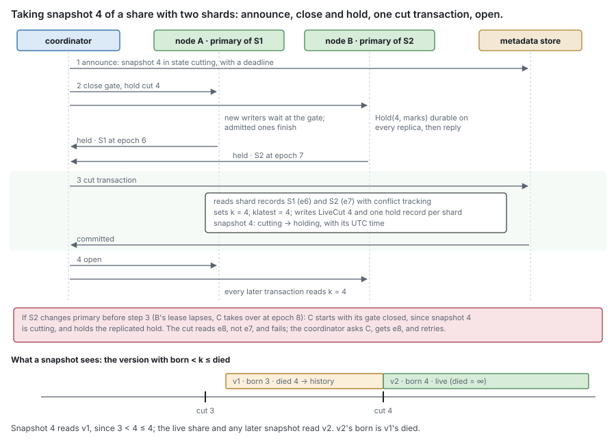
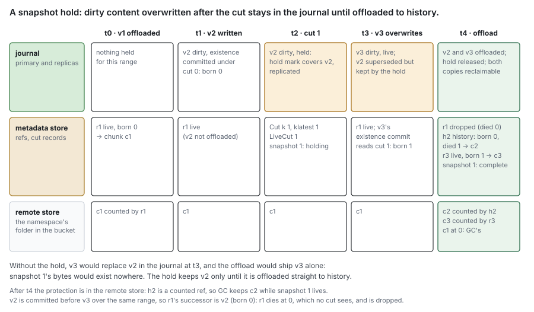
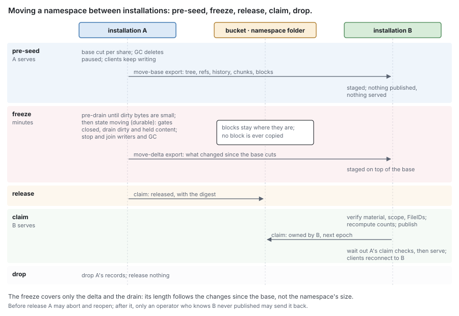

# RFC 12 — snapshots, clones, catalog backups and namespace migration

**Status:** draft. [§10](#10.%20Open%20questions) lists what is undecided.
**Audience:** anyone implementing snapshots, clones, catalog backup and restore, or
moving a namespace between installations that share one bucket. Conventions and
test tiers are in [the RFC index](rfc-index.md).

This document specifies behaviour, not the current code. [Appendix A](#Appendix%20A%20%E2%80%94%20where%20the%20current%20code%20differs) lists
where the code differs.

---

## In short

- **A snapshot** is a read-only view of a share as it was at one moment. Taking
  one writes a few records whatever the share's size, and copies nothing.
- **After a snapshot, nothing it can see is overwritten in place.** The first
  change to a record or to a range of content keeps the old version as
  **history**. A history ref counts its chunk in the remote store like a live
  ref, so GC keeps that content for as long as a snapshot can read it.
- **Content still in the journal at the snapshot needs one extra step.** If it
  is overwritten before the journal has offloaded it, the journal keeps the old
  version, under a **snapshot hold**, until it is offloaded straight into
  history. The hold lasts seconds to minutes. The protection that lasts is the
  counted history ref in the remote store.
- **A clone** is a new writable share made from a snapshot. It shares chunks
  with its source in the remote store, and nothing else: either can be deleted
  without affecting the other.
- **A catalog backup** copies one snapshot's metadata out of the metadata store.
  It protects against losing the metadata store. It does not protect against
  losing the bucket, because it holds no data.
- **A namespace** is a folder in a bucket, and each share gets its own by
  default. **Migration** hands a whole namespace to another installation on the
  same bucket without copying a block: the target is seeded while the source keeps
  serving, and a short freeze carries only what changed since.

## 1. Purpose

Operators ask four things of a file service's data protection, and this document
answers each one:

- **Undo a mistake.** A user deletes a folder, a script truncates a database
  dump, ransomware encrypts a share. The operator, or the user from their own
  client, needs the files as they were an hour or a day ago, without a restore
  ticket. Snapshots taken on a schedule, browsable in place over NFS and through
  SMB's Previous Versions ([§2.5](#2.5%20Browsing%20a%20snapshot)), and locked against deletion
  ([§2.7](#2.7%20Scheduled%20snapshots%2C%20retention%20and%20locks)), answer this.
- **Copy production for development, test or analytics without paying for it
  twice.** A clone ([§2.6](#2.6%20A%20writable%20clone%20is%20a%20new%20share%20in%20the%20same%20namespace)) is a writable share that starts as a snapshot's
  exact contents and stores only what it changes.
- **Survive losing the metadata store.** The bucket is a replicated, durable
  service, but the metadata store is software the operator runs, and a bad
  upgrade or a lost cluster can destroy it. Metadata is a small fraction of the
  data, so copying it elsewhere is cheap; a catalog backup ([§3](#3.%20Catalog%20backups)) is that
  copy, and restoring it brings the files back from the blocks already in the
  bucket.
- **Move tenants between installations.** Hardware refresh, rebalancing, or
  outgrowing a single-node installation all mean moving shares that can hold
  petabytes. Because both installations can reach the same bucket, a move
  ([§4](#4.%20Moving%20a%20namespace%20between%20installations)) transfers the metadata and the right to collect garbage, and never
  the data.

All four are composed from what the set already has: counted history refs
([RFC 6 §6.5](rfc-6-block-metadata.md#6.5%20Who%20owns%20a%20ref)), clone by adoption
([RFC 6 §6.6](rfc-6-block-metadata.md#6.6%20Clone%20and%20server-side%20copy)), restore by adoption
([RFC 6 §7.4](rfc-6-block-metadata.md#7.4%20Restore)), replicated journals
([RFC 10](rfc-10-journal-replication.md)) and GC as one service per namespace
([RFC 9 §7.3](rfc-9-gc.md#7.3%20GC%20is%20one%20service%20per%20namespace%2C%20partitioned%20by%20prefix)).

### 1.1 Non-goals

This document **MUST NOT** be read as specifying:

- a copy of the block store: the remote store is the only copy of content, and
  protecting the bucket itself — its versioning, object lock or replication — is
  outside this set ([§3](#3.%20Catalog%20backups));
- a backup of key material: an export names material IDs, never material
  ([RFC 5 §2.5](rfc-5-transforms.md#2.5%20Reading%20needs%20no%20configuration%2C%20only%20material));
- two installations serving one namespace at once. That is replication and
  sharding ([RFC 10](rfc-10-journal-replication.md), [RFC 11](rfc-11-ownership.md)); [§4.6](#4.6%20After%20replication)
  says how the two relate;
- how a protocol presents a snapshot beyond what [§2.5](#2.5%20Browsing%20a%20snapshot) requires;
- restoring in place: a restore makes a new share ([§3.3](#3.3%20Restore)), and swapping it
  in is a rename in the control plane;
- snapshots of part of a share ([§10](#10.%20Open%20questions)).

### 1.2 Terms

Share, namespace, installation, shard, primary, replica, node lease, epoch,
journal, offload, ref, chunk, block, cut and snapshot are defined once, in
[RFC 0's glossary](rfc-0-data-lifecycle.md#Glossary). This document adds:

| Term | Means |
| --- | --- |
| **cut number** *k* | a share's count of snapshots taken, raised by one at each cut ([§2.2](#2.2%20A%20snapshot%20is%20counted%20content%20and%20a%20frozen%20tree)). `Cut(share)` holds the latest *k* and *klatest*, the newest cut a live snapshot still holds (0 when none does) |
| **born**, **died** | the cut number a version was committed under, and the born of the version that superseded it ([§2.2](#2.2%20A%20snapshot%20is%20counted%20content%20and%20a%20frozen%20tree)) |
| **versioned record** | a record a snapshot reads — File with its FileData, entry, ACL, xattr, stream link, hole, directory delta, ref — carrying `born` |
| **history** | versions that a live snapshot can still see after the share replaced them, kept with their `died` |
| **cut gate** | the per-shard gate at its primary that orders every transaction writing a versioned record before or after a cut ([§2.3](#2.3%20The%20cut%20is%20one%20transaction%20behind%20a%20brief%20gate)) |
| **snapshot hold** | the journal keeping content the cut sees until it is offloaded; its **hold mark** is, per file, the version the file's existence had committed up to at the cut ([§2.4](#2.4%20A%20snapshot%20hold%20bridges%20dirty%20content%20to%20history)) |
| **hold record** | the metadata-store record, one per shard, saying that a shard's journals still hold content of cut *k* not yet offloaded ([§2.4](#2.4%20A%20snapshot%20hold%20bridges%20dirty%20content%20to%20history)) |
| **use record** | a durable record that a clone, restore or catalog backup is reading a snapshot, which blocks its deletion ([§3.2](#3.2%20A%20backup%20holds%20its%20snapshot)) |
| **lock** | an expiry time before which a snapshot cannot be deleted by anyone ([§2.7](#2.7%20Scheduled%20snapshots%2C%20retention%20and%20locks)) |
| **export**, **import** | a self-describing stream of metadata records ([§5](#5.%20The%20export%20format)), and building records from one, staged and published at once |
| **claim** | the control object in a namespace's folder naming the one installation that may write and collect there ([§4.1](#4.1%20One%20installation%20per%20namespace%2C%20proven%20by%20a%20claim)) |

## 2. Snapshots

### 2.1 A namespace is the unit that moves

A namespace is a folder — one prefix — inside a bucket of the remote tier, with
one key scope ([RFC 2 §4.3](rfc-2-carver.md#4.3%20Key%20scope)). Several namespaces **MAY** share a bucket, and a
catalog backup location ([§3.1](#3.1%20A%20backup%20is%20an%20export%20of%20one%20snapshot%27s%20metadata)) **MAY** be another folder of that same
bucket: each has its own prefix, so their object names never collide. Within a
namespace chunks are deduplicated and counted; across two, never
([RFC 6 §2.6](rfc-6-block-metadata.md#2.6%20The%20scope%20of%20a%20count)), and GC runs one service per namespace.

Which shares share a namespace:

- **By default, each share is created with a namespace of its own.** It then
  deduplicates only against itself, and can be moved, backed up and collected
  alone.
- **A clone or a restore joins its source's namespace.** That is what lets it
  count its source's chunks instead of copying them ([§2.6](#2.6%20A%20writable%20clone%20is%20a%20new%20share%20in%20the%20same%20namespace)).
- **An operator MAY create a share into an existing namespace**, to
  deduplicate against the shares already there — virtual machine images built
  from one base, or home directories holding the same installers.

Grouping trades mobility for deduplication. A chunk counted by two shares must be
counted in one metadata store, so whatever changes which installation counts a
block acts on the whole namespace: a migration ([§4](#4.%20Moving%20a%20namespace%20between%20installations)) moves every share,
snapshot, retired block and put intent in it, and a share never leaves a
namespace it shares with others ([§10](#10.%20Open%20questions)). A share's binding to its namespace
is fixed while it holds content ([RFC 13 §5.1](rfc-13-configuration.md#5.1%20A%20bound%20setting%20refuses%20change)).

### 2.2 A snapshot is counted content and a frozen tree

A snapshot is its **cut number** *k*. Each share keeps one `Cut(share) = { k,
klatest }` record and one `LiveCut(share, k)` per live snapshot
([RFC 6 §6.5](rfc-6-block-metadata.md#6.5%20Who%20owns%20a%20ref)). Nothing else is written when a snapshot is taken: what it
sees is read from records the share already keeps, each stamped with a cut.

**`born` is the cut its version was committed under.** Every transaction that
writes a versioned record reads `Cut(share)` behind the cut gate
([§2.3](#2.3%20The%20cut%20is%20one%20transaction%20behind%20a%20brief%20gate)) and stamps what it writes with `born = k`. For content that
arrives through the journal, the committing transaction is the **existence
commit** that makes the version part of the file
([RFC 6 §3.4](rfc-6-block-metadata.md#3.4%20Ordering%20against%20the%20journal)), not the append: a version acknowledged before
cut *k* whose existence commits after it is not in snapshot *k*, as a size change
committed after the cut is not. The journal keeps each existence commit's cut
with the versions it covered, and the offload commit copies it into the ref it
writes. Every version committed before cut *k* therefore has `born < k`, and
every later one `born ≥ k`.

**`died` is the successor's `born`.** When a transaction supersedes a version —
an overwrite's offload commit, a truncate or deallocate, a release, a rename, a
`chmod`, an ACL or xattr change, a fold of directory deltas — the old version's
`died` is the new version's `born`. For a removal it is the cut the removal's
first phase read ([RFC 6 §6.2](rfc-6-block-metadata.md#6.2%20Truncation%20and%20deallocation)), whichever later batch drops the ref. Stamping
`died` from whichever transaction happens to write it instead would let two
versions of one range both look alive at one cut ([§2.4](#2.4%20A%20snapshot%20hold%20bridges%20dirty%20content%20to%20history) shows how).

**What a snapshot sees.** Snapshot *k* sees, for each key or range, the version
with `born < k ≤ died`, where a live version has `died = ∞`.

**A superseded version is kept only if a live cut sees it.** The transaction that
supersedes a version **MUST**, in that transaction, either:

- move it to history, when some live cut *c* has `born < c ≤ died`. A history ref
  counts its chunk like a live one: a chunk's refcount is its live refs plus its
  history refs ([RFC 9 §2.1](rfc-9-gc.md#2.1%20References%20are%20the%20only%20authority)), so the move changes no count; or
- drop it as the share would with no snapshot, decrementing a ref's chunk.

In the common case `died` is the current *k*, and the test is `born < klatest`.
When `died` is older — a held version offloaded late ([§2.4](#2.4%20A%20snapshot%20hold%20bridges%20dirty%20content%20to%20history)), a removal
batch — the transaction reads the `LiveCut` records in `(born, died]`, behind the
gate, so a snapshot deleted meanwhile leaves nothing behind. Two versions of one
key never share a `died`: if they did, the older one's successor would be the
newer one, born at that same cut, and the newer one would be visible to no cut
and dropped. History keys therefore never collide.



For example: a file is written and offloaded while the share's cut number is 0,
so its ref and its File have `born` 0. Snapshot 1 is taken; `klatest` is 1. The
file is then `chmod`ed, overwritten and offloaded. The `chmod` reads cut 1,
finds the File's `born` 0 below `klatest`, and moves the old File to history with
`died` 1 as it writes the new one with `born` 1; the offload commit does the same
with the ref. Snapshot 1 reads the old File and ref, since 0 < 1 ≤ 1, and not
the new ones, since 1 < 1 is false. Had no snapshot existed, both commits would
have replaced in place, and the offload would have decremented the old chunk.

**Capture is copy on first write.** Nothing is copied when a snapshot is taken.
The first transaction after the cut that supersedes a version the cut sees moves
it to history; later transactions on the same key find `born ≥ klatest` and
write in place. So a snapshot costs one record to take, and each record changed
afterwards costs one history write, once per live cut it crosses.

**Where history lives.** A versioned record's history sits under its file's
history prefix, keyed by the record's key and then `died`
([RFC 16 §4.2](rfc-16-metadata-store.md#4.2%20Keys%3A%20per-file%2C%20per-share%2C%20content-addressed)); refs keep their own `History(file, died, offset)` records
([RFC 6 §6.5](rfc-6-block-metadata.md#6.5%20Who%20owns%20a%20ref)). A snapshot read of one record is a live read and, when
the live version is too new, one seek into history; a snapshot listing merges a
directory's live entries with its history entries in key order. Each history
version also writes one empty key in the share's **died index**, ordered by
`died`, so that deleting a snapshot visits only the history that died in its
interval ([§2.8](#2.8%20Deleting)).

**Every record a snapshot read consults is versioned** — the File and its
FileData fields, entries, holes, directory deltas, the ACL, xattrs and stream
links. A record left unversioned would leak: an ACL replaced after the cut would
judge the snapshot's content by the new rules and let a denied principal read
it. A file released after the cut keeps its records and its content through the
history its release wrote.

**Directory deltas need no special case.** A delta is a versioned record, born at
the cut it was written under ([RFC 7 §9.2](rfc-7-namespace-metadata.md#9.2%20Timestamps)). The fold that consumes it deletes it and
rewrites the directory's File, and both send the old values to history when a
live cut sees them. Snapshot *k* reads the directory version it sees plus the
deltas it sees: a delta folded before *k* is inside that version and has
`died < k`; one folded at or after *k* is not, and has `born < k ≤ died`. No delta
is applied twice or missed.

**Journal versions do not order a share.** Each journal numbers its own files
([RFC 1 §5.3](rfc-1-journal.md#5.3%20Versions)), and a share's files sit in several nodes' journals; the cut
number, one record every committing transaction reads, orders them.

**Nothing else keeps a snapshot's blocks alive** — no manifest, hold list or extra
GC root ([RFC 9 §2.4](rfc-9-gc.md#2.4%20A%20snapshot%20holds%20its%20blocks%20without%20a%20pin), [RFC 7 §4.4](rfc-7-namespace-metadata.md#4.4%20There%20is%20no%20third%20holder)). A snapshot hold keeps
journal bytes, never a block; a use record or a lock keeps a snapshot from being
deleted, and the snapshot's counted refs do the rest.

> ponytail: a snapshot read scans a record's or a file's history at each key or
> offset it resolves, O(history versions of it). Upgrade to an interval index
> over `(born, died]` when snapshot reads of a much-changed file or directory
> show in a profile.

A snapshot is in one of five states: `cutting` while its cut is being taken,
`holding` while hold records remain, `complete`, `failed` or `deleting`. Only a
complete one is browsed, cloned, backed up or restored. A failed one's records are
removed as a deletion removes them ([§2.8](#2.8%20Deleting)).

### 2.3 The cut is one transaction behind a brief gate

A share can span several shards, each with its own primary on its own node
([RFC 11 §2](rfc-11-ownership.md#2.%20Shards)). A cut must split every one of them at the same point: every
transaction on every shard is either before it, and reads the old cut number, or
after it, and reads the new one. Each primary therefore keeps a **cut gate** for
each of its shards. A transaction that writes a versioned record **MUST** pass
the gate before it takes its read snapshot or timestamp; a transaction that spans
shards ([RFC 11 §8.1](rfc-11-ownership.md#8.1%20Operations%20across%20shards)) passes the gate of each. Reads never wait at a gate.

The **coordinator** is the control plane's snapshot service. Taking snapshot *k*
is four steps:

1. **Announce.** The coordinator commits the snapshot record in state `cutting`,
   with *k* and a deadline in store time. While a `cutting` record exists, any
   primary that starts serving one of the share's shards — after a takeover, a
   handover, a move of files or the creation of a shard — **MUST** start with that
   shard's gate closed.
2. **Close and hold.** The coordinator asks the primary of every shard of the
   share, as the shard records name them, to close. Each primary closes its gate:
   new transactions wait at it, and those already admitted finish. It then
   records the shard's snapshot hold for *k* ([§2.4](#2.4%20A%20snapshot%20hold%20bridges%20dirty%20content%20to%20history)) as a replicated
   journal operation, durable on every replica of the shard
   ([RFC 10](rfc-10-journal-replication.md)), and replies with the shard's epoch and whether the
   hold covers any content not yet offloaded.
3. **Cut.** One transaction reads every shard record of the share with conflict
   tracking and requires each epoch to be the one its primary replied with; raises
   `Cut(share).k` to *k* and `klatest` to *k*; writes `LiveCut(share, k)` and one
   hold record per shard that reported content not yet offloaded; stamps the
   snapshot's UTC time; and moves the snapshot to `holding`, or to `complete` if
   there is no hold record. It commits no existence and writes no per-file record.
4. **Open.** The coordinator tells every primary to reopen. Every later
   transaction reads cut *k*.

**Aborting.** A cut that cannot commit by its deadline — a primary unreachable, a
gate slow to drain, an epoch that changed — is aborted: the coordinator deletes
the `cutting` record, reopens the gates, and each primary releases its hold for
*k*. If the coordinator itself fails, each primary reopens its gate at the
deadline, but only by committing the abort: a transaction deleting the `cutting`
record, which conflicts with the cut transaction, so exactly one of the two
commits. A primary whose abort fails reads the new cut and opens. A journal hold
for a cut that has neither a `LiveCut` nor a `cutting` record is released at
start and by a periodic check.

**Why each rule.** Without the epoch check, a shard whose primary changed after
step 2 would have a new primary with an open gate and a cached cut number; a
transaction it admitted could commit after the cut stamped with the old one, and
snapshot *k* would show a post-cut change. Without the `cutting` record, a new
primary would not know to start closed. Without the hold replicated before the
cut, a takeover right after the cut would lose it ([§2.4](#2.4%20A%20snapshot%20hold%20bridges%20dirty%20content%20to%20history)).

The gate is held for step 3's one transaction and the transactions already in
flight, never for an offload; with the deadline it is bounded by the transaction
deadline. `Cut(share)` changes only at a cut and at a snapshot deletion, both
behind the gate, so the transactions that read it need no conflict tracking on it.
Every share has a remote tier, so every share can be snapshotted.

> ponytail: the cut transaction reads every shard record of the share, O(shards).
> A share of 10⁴ per-child shards makes that one large transaction and 10⁴ gate
> round trips. Upgrade to a per-share epoch summary that every shard-record change
> also writes, when a cut of a share with many shards misses the gate target.

**A removal in flight at the cut** ([RFC 6 §6.2](rfc-6-block-metadata.md#6.2%20Truncation%20and%20deallocation)) needs no special case. If its
first phase committed before the cut, the FileData and holes the snapshot sees
already record the removal, and its later batches give the refs they drop the
removal's `born` as their `died`, below *k*: the snapshot does not see them. If
its first phase commits after the cut, the snapshot reads the refs it has not yet
dropped, or their history.

**Worked example: a cut across two shards while one fails over** —
`S-snap-cut-failover`. Share `data` has shards S1 (primary A, epoch 6) and S2
(primary B, epoch 7, replicas C and D). `Cut(data)` is `{k 3, klatest 3}`.

| t | coordinator | S1 at A | S2 | metadata store |
| --- | --- | --- | --- | --- |
| 0 | announce snapshot 4 | — | — | snapshot 4 `cutting`, deadline T+5 s |
| 1 | ask A, B to close | closes; Hold(4) on A's replicas; replies e6 | B closes; Hold(4) durable on B, C, D | — |
| 2 | — | holds gate | B's node lease lapses before it replies | — |
| 3 | — | — | C takes over at e8 ([RFC 10 §9.2](rfc-10-journal-replication.md#9.2%20Takeover)); sees `cutting`, starts closed; has Hold(4) | S2: e8, primary C |
| 4 | asks C; C replies e8 | — | — | — |
| 5 | cut transaction | — | — | reads S1 e6, S2 e8: match; k 4, LiveCut 4, hold records S1, S2; `holding` |
| 6 | open | opens | C opens | — |

Had the coordinator sent step 5 with B's epoch 7, the transaction would have
failed on S2's record and been retried; had C started with an open gate, a
`chmod` it admitted at t3 could have committed at t5 with `born` 3 over a File
of `born` 3, replacing it in place, and snapshot 4 would have shown it.

### 2.4 A snapshot hold bridges dirty content to history

At the cut, some of the share's content is dirty: acknowledged, part of the file
by an existence commit before the cut, but not yet offloaded. Snapshot *k* must
show it. Two cases:

- **It is not overwritten before its offload.** Nothing special happens. The
  offload writes an ordinary live ref with `born < k`, and from then on that ref
  counts its chunk in the remote store; if a later change supersedes it, it moves
  to history like any ref. The journal releases its copy as usual.
- **It is overwritten, truncated, deallocated or released after the cut, before
  its offload.** Now the journal alone holds the bytes snapshot *k* needs, and by
  its own precedence rule it would let the newer version replace them
  ([RFC 1 §5.3](rfc-1-journal.md#5.3%20Versions)): the offload would ship only the newer bytes, and the
  snapshot's would exist nowhere. The **snapshot hold** prevents that. The
  journal keeps every version at or below the cut's hold mark until an offload
  has committed it, and the offload writes a superseded one **straight to
  history**, with its own `born` and, as `died`, its successor's `born`.

So the lasting protection of a snapshot's content is always a counted ref in the
remote store. The hold only bridges the time between the cut and the offload,
which the offload's normal pace bounds.



**Worked example: an overwrite after the cut** — `S-snap-hold-overwrite`. One
file range, one shard.

| t | journal (primary and replicas) | metadata store | remote store |
| --- | --- | --- | --- |
| 0 | v1 offloaded and released | r1 live, `born` 0 → c1 | c1, count 1 |
| 1 | v2 written; its existence commits under cut 0: `born` 0 | r1 live | c1 |
| 2 | cut 1: Hold(1) marks v2, on every replica | `Cut {1, 1}`, `LiveCut 1`, hold record; snapshot 1 `holding` | c1 |
| 3 | v3 overwrites v2; v2 superseded, kept by the hold | v3's existence commits under cut 1: `born` 1 | c1 |
| 4 | offload carries v2 and v3 | v2 committed first: r1 → `died` 0, seen by no cut, dropped; h2 history `born` 0 `died` 1 → c2. Then v3: r3 live `born` 1 → c3 | c1 count 0, left to GC; c2, c3 count 1 |
| 5 | v2 and v3 released; hold record deleted | snapshot 1 `complete` | — |

Snapshot 1 reads h2 (0 < 1 ≤ 1); the share reads r3. Had v3 committed first, r1
would have taken `died` 1 from it and been kept in history beside h2 — two
versions of one range visible to snapshot 1. The ordering rule below forbids it.

**Rules.**

- **A hold is replicated and inherited.** The hold for *k* **MUST** be durable on
  every replica of the shard before its primary replies to step 2, and a
  superseded version it keeps **MUST** stay on every replica until offloaded.
  Takeover and handover ([RFC 10 §9.2](rfc-10-journal-replication.md#9.2%20Takeover), [RFC 10 §9.4](rfc-10-journal-replication.md#9.4%20Handover)) therefore
  inherit it, and a move of files between shards
  ([RFC 11 §4](rfc-11-ownership.md#4.%20Moving%20files%20and%20primaries)) **MUST** ship held versions and hold marks with the files.
- **A held version commits first.** An offload **MUST** commit a held superseded
  version no later than, and in version order before, any newer version over the
  same range, so that each version's successor is the one that really replaced
  it.
- **A ref never straddles a live cut.** An offload **MUST NOT** place, in one
  ref, versions on both sides of the hold mark of a live cut; the carver's run
  is split there ([RFC 8 §6.3](rfc-8-engine.md#6.3%20The%20offload%20pipeline)). Between two consecutive live marks a ref takes
  the highest `born` of its versions, which no live cut can tell apart.
- **A late version tests the live cuts.** A held version that commits after its
  snapshot was deleted finds no live cut in `(born, died]` and is dropped
  ([§2.2](#2.2%20A%20snapshot%20is%20counted%20content%20and%20a%20frozen%20tree)): its chunks are left to GC like any chunk no ref names
  ([RFC 9 §2.2](rfc-9-gc.md#2.2%20Retirement%20is%20decided%20where%20the%20count%20reaches%20zero)).
- **Completion is decided in metadata.** A shard's primary deletes its hold record
  for *k* once its journal holds no version at or below *k*'s mark that is not
  offloaded. When no hold record of *k* remains, one transaction marks the snapshot
  `complete`. A primary that finds a hold record for its shard but no hold for *k*
  in its journal — every copy was lost — **MUST** mark the snapshot `failed`. A
  snapshot is never `complete` with bytes missing.
- **Holds are bounded.** A cut **MUST** be refused with `ErrHoldBacklog` while the
  share's held bytes exceed `snapshots.hold_bound`, or while any journal holding the
  share's files has more than `snapshots.hold_journal_fraction` of its capacity
  held, summed over every share it carries ([RFC 1 §7](rfc-1-journal.md#7.%20Capacity)). With the remote
  tier down, snapshots stop before the journal fills; writes never stop for a
  snapshot.

> decision: a snapshot becomes browsable only once its holds are drained, so a
> snapshot read, a clone and a backup never name journal content and never reach
> another node's journal. The cost is a delay between the cut and `complete`,
> bounded by the offload of the share's dirty bytes at the cut. Serve held content
> from the journal if that delay is ever the complaint.

### 2.5 Browsing a snapshot

A complete snapshot is reachable read-only under a virtual directory at the
share's root, configurable and hidden from listings. What protocols rely on:

- a handle into a snapshot names the share, the snapshot and the file
  ([RFC 7 §6.1](rfc-7-namespace-metadata.md#6.1%20A%20handle%20names%20a%20file%2C%20never%20a%20path)), so it never resolves to a live file; once the snapshot is
  deleted it resolves stale ([RFC 7 §6.3](rfc-7-namespace-metadata.md#6.3%20Staleness%20is%20reported%2C%20never%20guessed));
- a read resolves by the covering lookup ([RFC 6 §8.1](rfc-6-block-metadata.md#8.1%20Covering%20lookup)) at the cut: the
  file's refs with `born < k ≤ died`, live and history, against the FileData and
  holes the cut sees, which take precedence over any ref, and fetches from the
  remote tier;
- permissions are evaluated against the file, ACL and share grant as the cut sees
  them — the ACL versioned with the file ([§2.2](#2.2%20A%20snapshot%20is%20counted%20content%20and%20a%20frozen%20tree)), the grant as it is now,
  so a principal removed from the share reaches none of its snapshots;
- every mutating operation fails with the read-only error;
- a snapshot file's numeric file id differs from the live file's
  ([RFC 7 §6.5](rfc-7-namespace-metadata.md#6.5%20A%20protocol%27s%20numeric%20file%20id%20is%20derived%2C%20and%20collisions%20are%20its%20problem)), so tools do not take the two for one file;
- **SMB Previous Versions** names each complete snapshot by the token
  `@GMT-YYYY.MM.DD-HH.MM.SS` of the UTC time its cut transaction stamped. The
  coordinator **MUST NOT** stamp two cuts of one share within the same second, so
  each token names exactly one snapshot.

> ponytail: snapshot reads bypass the journal and run at the remote tier's
> latency, which bounds a mass restore ([§8.5](#8.5%20Benchmarks%20and%20targets)). Add a fill keyed by the
> snapshot when the restore-throughput benchmark falls short of its target.

### 2.6 A writable clone is a new share in the same namespace

A clone creates a new share from a complete snapshot, in the snapshot's
namespace, as one staged import ([§5.2](#5.2%20Import%20is%20staged%20and%20published%20atomically)):

- the transaction that starts it writes a use record on the snapshot
  ([§3.2](#3.2%20A%20backup%20holds%20its%20snapshot)), so the snapshot cannot be deleted while it is copied;
- the tree the cut sees is copied with **new FileIDs**, mapped so that hard links
  stay links; every record is written with `born` 0, since the new share starts at
  cut 0;
- the refs the snapshot sees become the new files' refs, each raising its chunk's
  count and writing its reverse-index key as it is staged. That is
  [RFC 6 §7.4](rfc-6-block-metadata.md#7.4%20Restore)'s restore, conditional on each chunk existing
  ([RFC 6 §7.2](rfc-6-block-metadata.md#7.2%20Adoption%20is%20conditional%20on%20existence)), in bounded batches;
- one transaction publishes the share and deletes the use record.

The clone then shares **chunks in the remote store, and nothing else**, with its
source. Deleting the source share, the snapshot or the clone releases only that
one's own refs and changes nothing the other two read. The clone moves with its
namespace ([§2.1](#2.1%20A%20namespace%20is%20the%20unit%20that%20moves)).

**Worked example: clone, then delete the source** — `S-snap-clone-delete-source`.
Share `prod` holds one ref r on chunk c.

| t | action | refs on c | c's count |
| --- | --- | --- | --- |
| 0 | — | r (prod, live, `born` 2) | 1 |
| 1 | snapshot 7 of prod | r | 1 |
| 2 | clone `dev` from 7: use record; r' staged (dev, `born` 0) with its reverse key; publish; use record deleted | r, r' | 2 |
| 3 | prod overwrites the range | r → history (`born` 2, `died` 7); new ref on c2 | 2 |
| 4 | prod is deleted with its snapshots: 7's history dropped, prod's live refs released | r' | 1 |
| 5 | dev reads the range | r' resolves c | 1 |

> ponytail: a clone copies every ref, O(refs) records. Upgrade to files that
> read through their source snapshot until first written, when clone latency on
> large shares matters.

### 2.7 Scheduled snapshots, retention and locks

A share **MAY** carry one snapshot policy: a schedule, a retention of *keep N per
interval* over any of `hourly`, `daily`, `weekly` and `monthly`, and an optional
lock duration and catalog backup. A policy snapshot is kept while it is the
newest snapshot of one of the N most recent periods of any interval; otherwise
pruning deletes it ([§2.8](#2.8%20Deleting)).

- Pruning deletes only snapshots the policy made, never manual ones.
- A tick refused by the hold bound or the snapshot reserve ([§2.9](#2.9%20Space%20is%20reported%2C%20not%20charged)) is
  skipped, not queued, and counted; ticks missed while down produce at most one
  snapshot on start. A cut costs one record, so a schedule never falls behind a
  large share.
- A policy that names a catalog backup location and retention backs up each
  policy snapshot ([§3](#3.%20Catalog%20backups)).
- The scheduler runs once per share, in the installation holding the share's
  namespace claim.

**Locks.** A snapshot **MAY** carry a lock: an expiry time before which it cannot
be deleted. A lock **MUST** refuse every deletion of the snapshot with
`ErrLocked` — manual, by pruning, or with its share — until it expires, whoever
asks. It can be set and extended, never shortened or removed. A share with a
locked snapshot cannot be deleted. A move carries locks ([§4.2](#4.2%20The%20move%2C%20step%20by%20step)).

> decision: a lock refuses deletion through this system's API only. An attacker
> holding the bucket's credentials can still delete the objects, and protecting
> the bucket is the bucket's job ([§1.1](#1.1%20Non-goals)). The lock's value is that one
> stolen administrator credential cannot erase every snapshot and, through the use
> records, every backup.

**Worked example: a locked snapshot refuses deletion** — `S-snap-locked-delete`.

| t | action | result |
| --- | --- | --- |
| 0 | policy takes snapshot 30 with a 7-day lock | 30 `complete`, locked until T+7 d |
| 1 | an administrator deletes 30 | `ErrLocked`; nothing changes |
| 2 | the administrator sets its lock to T+1 h | `ErrLocked`: a lock cannot be shortened |
| 3 | a pruning tick finds 30 outside its retention | skipped, counted `locked` |
| 4 | T+7 d: the lock expires; next pruning tick | 30 deleted as in [§2.8](#2.8%20Deleting) |

### 2.8 Deleting

Deleting a snapshot **MUST** be refused with `ErrLocked` while it is locked
([§2.7](#2.7%20Scheduled%20snapshots%2C%20retention%20and%20locks)) and with `ErrHeld` while a use record names it ([§3.2](#3.2%20A%20backup%20holds%20its%20snapshot));
pruning defers such a snapshot.

A deletion drops the history that no other live snapshot sees. With the nearest
live cuts *kp* < *k* < *kn* — *kp* absent reads as 0, *kn* absent as ∞ — those
are the versions with

    kp ≤ born < k ≤ died < kn

Snapshot *k* sees them, since `born < k ≤ died`; *kp* does not, since
`born ≥ kp`; *kn* does not, since `died < kn`; and no live cut further out sees a
version neither neighbour sees, because the cuts a version is visible to are
consecutive. Every such version has `died` in `[k, kn)`, so the died index
([§2.2](#2.2%20A%20snapshot%20is%20counted%20content%20and%20a%20frozen%20tree)) finds them without reading anything else.

1. One transaction, through the share's cut gate, checks the lock and use records,
   marks the snapshot `deleting`, deletes `LiveCut(share, k)` and, if *k* was the
   newest, sets `klatest` to *kp* ([RFC 6 §6.5](rfc-6-block-metadata.md#6.5%20Who%20owns%20a%20ref)). A use record taken
   concurrently conflicts with it on the snapshot record. Each primary releases
   its journal hold for *k*, keeping what another live cut's hold still covers.
2. Batches walk the died index from *k*. Each batch, in its transaction, reads the
   live cuts, stops at the next one above its cursor, and drops a version only if
   no live cut *c* has `born < c ≤ died`, decrementing a ref's chunk. Reading the
   live cuts in every batch, rather than once, keeps two concurrent deletions of
   neighbours correct — each sees the other's cut gone and walks on past it — and
   makes a resumed deletion correct whatever changed while it was stopped. A
   version already dropped by another deletion is skipped.
3. The snapshot record is removed last.

**Worked example: deleting the middle snapshot** — `S-snap-delete-middle`. Live
cuts 5, 9 and 14; delete 9.

| History ref | `born` | `died` | Seen by | Visited? | Outcome |
| --- | --- | --- | --- | --- | --- |
| h1 | 3 | 12 | 5, 9 | yes, `died` in [9, 14) | kept: 5 sees it |
| h2 | 6 | 11 | 9 | yes | dropped; its chunk decremented |
| h3 | 6 | 14 | 9, 14 | no, `died` ≥ 14 | kept: 14 sees it |
| h4 | 1 | 7 | 5 | no, `died` < 9 | kept: 5 sees it |

The deletion reads two history entries, whatever the share's total history.

Deleting a share with snapshots **MUST** be refused unless the request deletes or
detaches them. A detached snapshot belongs to the namespace, stays restorable, and
is deleted only explicitly.

### 2.9 Space is reported, not charged

Quotas charge a share's live logical bytes only
([RFC 17 §5.6](rfc-17-vfs.md#5.6%20Quota)). History is reported beside them:

- each share keeps `history_bytes`, a counter
  ([RFC 16 §4.4](rfc-16-metadata-store.md#4.4%20Counters%20that%20many%20writers%20change)) raised by every move to history and lowered by
  every drop;
- each snapshot reports **bytes freed if deleted**: the bytes of chunks whose every
  remaining ref is a history ref in its interval, computed on request by the same
  died-index walk a deletion makes;
- a share **MAY** set `snapshots.reserve`. While `history_bytes` exceeds it, a new cut
  is refused with `ErrSnapshotReserve`. Writes are never refused for history.

> ponytail: bytes freed if deleted is computed on request, O(history in the
> snapshot's interval), and changes as neighbours are deleted. Keep it as a
> maintained per-snapshot counter when operators poll it often enough to show in
> a profile.

## 3. Catalog backups

A **catalog backup** is a copy of one snapshot's metadata outside the metadata
store: the tree and the refs, and where the blocks they name are. It holds no
data. It survives the loss of the metadata store, and nothing else: it does not
survive the loss of the bucket or of the namespace's folder, the destruction of
key material, or a bucket-level attack. Pair it with the bucket's own versioning
or object lock; a kind of export that also copies blocks is an open question
([§10](#10.%20Open%20questions)).

### 3.1 A backup is an export of one snapshot's metadata

A backup writes an export of kind `backup` ([§5](#5.%20The%20export%20format)) to a configured **backup
location**: a directory, or a folder in a bucket — the block store's bucket
included — outside every namespace's prefix
([RFC 4 §4.2](rfc-4-remote-tier.md#4.2%20Names%20in%2C%20locations%20kept%20inside)), never inside the metadata store it protects. It
carries:

- the records the snapshot sees — files with their FileData fields, entries,
  ACLs, xattrs, stream links and holes, with directory deltas folded in — as plain
  records, and per file the refs the snapshot sees, as plain refs;
- the chunk and block records of every chunk they name, as **location hints**
  only ([§3.3](#3.3%20Restore));
- the material in those blocks' census, each as (material ID, fingerprint)
  ([RFC 5 §5.3](rfc-5-transforms.md#5.3%20Retiring%20material%20or%20a%20transform%20needs%20a%20census)), and the (material ID, fingerprint) of each of the
  namespace's wrapped keys — data keys, header key and chunking key — never the
  keys ([§4.4](#4.4%20Key%20scope%20and%20material));
- the namespace's identity, prefix and key scope.

Its state — `writing`, `complete`, `expired` — is kept in the location, listable
without the installation that wrote it.

### 3.2 A backup holds its snapshot

A **use record** in the metadata store marks a snapshot as being read by a clone,
a restore or a backup. It is written in the transaction that starts the reader,
which requires the snapshot to be `complete` and conflicts with a deletion's first
transaction on the snapshot record. For a clone or restore it is deleted at
publish or on failure; for a backup, when the backup expires. A deletion checks
the use record, not the backup location, so an unreachable location makes deletion
fail closed.

So while a backup is being written, and until it expires, its snapshot cannot be
deleted ([§2.8](#2.8%20Deleting)), and the refs the snapshot sees keep every block the backup
names counted. The backup adds no second liveness mechanism
([RFC 9 §2.1](rfc-9-gc.md#2.1%20References%20are%20the%20only%20authority)).

Expiry marks the backup `expired` in its location, then deletes the use record,
then removes the export. An expired backup **MUST NOT** be restored; the reverse
order lets a crash leave a restorable backup whose blocks were swept.

### 3.3 Restore

Restore creates a new share. There are two sources:

- **From a snapshot**, or from a backup whose snapshot still exists: a clone
  ([§2.6](#2.6%20A%20writable%20clone%20is%20a%20new%20share%20in%20the%20same%20namespace)), whose records are current.
- **From a backup alone**, when the metadata store holding the namespace is lost: a
  **recovery import**, which takes the namespace's claim ([§4.1](#4.1%20One%20installation%20per%20namespace%2C%20proven%20by%20a%20claim)) on the
  operator's statement that the installation holding it is gone, and then:
  - waits out the old installation's claim checks ([§4.1](#4.1%20One%20installation%20per%20namespace%2C%20proven%20by%20a%20claim)) before it
    resolves a hint, puts, adopts or deletes anything, so an old installation that
    is partitioned rather than gone has stopped relocating and deleting;
  - checks each location hint against the named block's header, which lists its
    chunk hashes ([RFC 4 §3.2](rfc-4-remote-tier.md#3.2%20Layout)). Relocation makes hints stale
    ([RFC 9 §4.3](rfc-9-gc.md#4.3%20A%20reader%20can%20hold%20the%20old%20location)); a stale chunk is found by listing the namespace and reading
    headers, and a chunk found nowhere fails the import. When the namespace
    encrypts, header hashes are keyed ([RFC 5 Appendix B](rfc-5-transforms.md#Appendix%20B%20%E2%80%94%20encryption)), so the importer
    compares under the namespace's header key, which it must hold ([§4.4](#4.4%20Key%20scope%20and%20material));
  - recomputes every count from the imported refs ([RFC 6 §7.4](rfc-6-block-metadata.md#7.4%20Restore)) and ends
    with the audit ([RFC 6 §7.5](rfc-6-block-metadata.md#7.5%20Audit));
  - imports **every other unexpired backup of the namespace** found in every
    configured backup location as a detached, held snapshot, each under a share
    identity and FileIDs of its own, before GC runs, or GC would sweep what only
    those backups name.

> decision: a recovery import finds other backups only in the backup locations
> the recovering installation is configured with, and the operator states that
> the list is complete. A backup in a location nobody lists is swept like any
> unreferenced content. Record each backup in the namespace's folder if operators
> ever lose track of their locations.

A backup of a namespace whose claim another installation holds and has not
released **MUST NOT** be imported except by that recovery statement: the holder's
GC would sweep what the import counts ([§4.3](#4.3%20GC%20across%20installations%20on%20one%20bucket)).

**Worked example: catalog backup, then restore** — `S-snap-catalog-restore`.
Installation A holds namespace `ns-photos`, share `photos`.

| t | action | state |
| --- | --- | --- |
| 0 | snapshot 12 `complete` | — |
| 1 | backup of 12 to `offsite` | use record on 12; export `writing` |
| 2 | export done | `complete`; use record stays |
| 3 | A's metadata store is lost | A serves nothing; the bucket is intact |
| 4 | operator on installation B: restore, previous holder gone | B lists `offsite`, finds the backup and one older one |
| 5 | B writes the claim `owned` at the next epoch, waits out A's claim checks | a partitioned A has stopped deleting |
| 6 | stage: resolve hints from headers, recompute counts, audit; stage the older backup as a detached snapshot | nothing served, nothing collected |
| 7 | publish share `photos-restored` with new FileIDs; start GC | clients mount the new share |

## 4. Moving a namespace between installations

### 4.1 One installation per namespace, proven by a claim

Exactly one installation holds a namespace: only it puts, sweeps, relocates or
collects there, and only its metadata store holds the namespace's records. Which
one is in its configuration and in the **claim**: the control object of role
`claim` ([RFC 4 §4.13](rfc-4-remote-tier.md#4.13%20Control%20objects)) in the namespace's folder, never listed as a block,
like the health object ([RFC 4 §4.7](rfc-4-remote-tier.md#4.7%20Health%20is%20one%20probe%20call)). It holds the installation, the claim
epoch, and state `owned` or `released` (with the digest of the move export).
Reading it is a step of the store's capability check
([RFC 4 §4.11](rfc-4-remote-tier.md#4.11%20A%20store%20checks%20its%20service%20before%20it%20opens)). Installations that share only the bucket check each other
through it:

- GC **MUST** read the claim at every `Recheck` and before each batch of deletes,
  and **MUST** issue no delete while the claim does not name its installation as
  `owned` ([RFC 9 §7.5](rfc-9-gc.md#7.5%20Service%20settings%20are%20rechecked%20on%20their%20own%20period)). A GC process **MUST NOT** issue a delete more than
  two `Recheck` periods after its last read of a claim naming it, by its own clock.
- An installation **MUST** open a namespace for writing only while the claim names
  it `owned` and its own record of the namespace is `serving`, and **MUST** stop
  writing when a claim read on the `Recheck` period says otherwise.
- An import **MUST** take the claim only from a claim that is `released` with the
  digest of the export being imported, or, for a recovery import ([§3.3](#3.3%20Restore)), on
  the operator's statement that the installation holding it is gone. It writes the
  claim `owned` at the next epoch. After a recovery import it then waits two
  `Recheck` periods plus the drift bound ([RFC 11 §3.1](rfc-11-ownership.md#3.1%20The%20primary%20is%20fenced%20by%20an%20epoch)) before it puts, adopts,
  resolves a hint or deletes, so that a partitioned old installation's GC has
  fenced itself.

> decision: the claim is a check, not a lock: the remote contract has no
> conditional put, so two installations that both believe they hold a namespace
> can both write it. The order of [§4.2](#4.2%20The%20move%2C%20step%20by%20step) prevents that, and the
> self-fence bounds a partitioned one by clocks within the drift bound, the same
> assumption node leases make. Make the claim a lock if the contract gains a
> conditional write.

### 4.2 The move, step by step

Until replication spans installations, a migration is a move, from installation A
to installation B. The bulk of the metadata is copied while A keeps serving; the
freeze carries only what changed since.



1. **Pre-flight.** A writes the export's header alone; B checks prefix, key scope
   and material against it ([§4.4](#4.4%20Key%20scope%20and%20material)).
2. **Pre-seed, while A serves.** A takes a **base cut** — an ordinary locked
   snapshot — of every share in the namespace, pauses its GC for the namespace (no
   retirement, relocation, delete or collection), and writes an export of kind
   `move-base`: every record the base cuts see, all history, every chunk and block
   record, and the principals they name. B stages it and publishes nothing. From
   here until the move ends, the namespace refuses share creation, share deletion
   and clones with `ErrMoving`, and defers snapshot deletion and pruning; a
   deletion or clone already running finishes first.
3. **Pre-drain.** A expedites offload until the namespace's dirty and held bytes
   would drain within half of `migration.freeze_timeout` at the measured offload
   rate.
4. **Freeze, durably.** A records the namespace as `moving`, which keeps it closed
   across a restart; closes every shard's cut gate on every share and keeps it
   closed; pauses removal batches; and offloads everything dirty or held, since B
   cannot read A's journals. Held operations wait; they are not failed. The freeze
   **MUST** be bounded by `migration.freeze_timeout`; one that cannot finish in time
   aborts the move.
5. **Stop A's writers and GC** for the namespace, and join them: offload loops,
   relocation, the deleter, collection ([RFC 8 §2.5](rfc-8-engine.md#2.5%20Start%20in%20order%2C%20stop%20in%20reverse%2C%20and%20join%20before%20closing)).
6. **Delta.** A writes an export of kind `move-delta`, naming the base's digest:
   - every versioned record with `born` at or above its share's base cut, and every
     history version with `died` at or above it — which together are every change
     since the base, since a version the base saw could only be moved to history,
     never dropped;
   - every record under each share's prefix: snapshots, cuts, grants, quotas,
     usage, locks and use records;
   - every per-file record that carries no `born` — removals, pending releases,
     durable opens — which B takes in place of the base's;
   - the chunk and block records of every chunk a delta ref names: with GC paused,
     chunk and block records change only by addition;
   - every put intent ([RFC 9 §3.2](rfc-9-gc.md#3.2%20A%20retirement%20not%20yet%20deleted%20is%20durably%20recorded)), and the principals the delta names.
7. **Release.** A writes the claim `released` with the digest over base and delta,
   and records the namespace `released`.
8. **Claim at B.** B imports the delta over the base ([§5.2](#5.2%20Import%20is%20staged%20and%20published%20atomically)), rebuilds every
   derived index — reverse ref keys, the died index, the version-floor index, the
   GC index — recomputes counts, publishes, writes the claim `owned` at the next
   epoch, and starts the shares. Clients reconnect to B.
9. **Drop at A.** A deletes the namespace's records from its metadata store
   **without releasing them**: no refcount is decremented, no GC index key is
   written, nothing is swept, and nothing in the remote store is deleted.

B then deletes the base cuts as ordinary snapshots. The freeze lasts the drain plus
the delta, which follow the changes since the base, not the namespace's size. The
pause of A's GC from step 2 grows the namespace by what GC would have reclaimed
during the pre-seed.

**Aborting.** Before step 7 A **MAY** abort: it records the namespace `serving`,
restarts GC, deletes the base cuts and reopens the gates; B drops its staging.
After step 7, A **MUST NOT** re-claim, reopen or write the namespace unless the
operator states that B has not published the import, which A cannot learn itself;
it then writes the claim `owned` at a higher epoch. A move keeps share identities
and FileIDs ([§4.5](#4.5%20Versions%20and%20FileIDs%20on%20import)), so clients' handles **SHOULD** stay valid at B.

**Worked example: a pre-seeded move** — `S-snap-move-preseed`. Namespace
`ns-photos` holds share `photos`, 10⁷ files, one shard, at cut 19.

| t | A | B | clients |
| --- | --- | --- | --- |
| 0 | pre-flight header | checks scope, prefix, material: ok | writing to A |
| 1 | base cut 20 (locked); GC paused; `move-base` export, 10⁷ files, 3 h | stages it | writing to A throughout |
| 2 | pre-drain: 40 GiB dirty down to 2 GiB | — | writing to A, slower |
| 3 | `moving`; gates closed; drains 2 GiB in 20 s; joins writers and GC | — | calls wait |
| 4 | `move-delta`: 3×10⁴ records with `born` or `died` ≥ 20, all share-prefix records, intents; 5 s | stages it over the base | calls wait |
| 5 | claim `released` with the digest | — | calls wait |
| 6 | — | verifies, rebuilds indexes, recomputes counts, publishes; claim `owned` at epoch 4; serves | reconnect to B: 40 s after t3 |
| 7 | drops its records | deletes base cut 20 | — |

### 4.3 GC across installations on one bucket

No namespace is ever served by two GC services:

- **The deleter** acts only on blocks its own store records, and only after
  checking its own reverse ref index ([RFC 9 §2.3](rfc-9-gc.md#2.3%20The%20absence%20of%20a%20record%20proves%20nothing),
  [RFC 9 §3.5](rfc-9-gc.md#3.5%20The%20deleter%20verifies%20before%20it%20deletes)). In a move A's GC is paused from the pre-seed and joined
  before release, and A records nothing after step 9; B counts every ref and writes
  its reverse keys, since every share and snapshot moved.
- **Retired and deleted blocks, and intents,** move too. B rebuilds the GC index
  from the block records ([RFC 9 §7.4](rfc-9-gc.md#7.4%20The%20index%20can%20be%20dropped%20and%20rebuilt)) and resumes them as its own trash and
  delete backlog, keeping each `not_before` ([RFC 9 §3.2](rfc-9-gc.md#3.2%20A%20retirement%20not%20yet%20deleted%20is%20durably%20recorded)); a retired block's
  chunk records move with it, so an adoption at B still resurrects it. A's intents
  name epochs the import has superseded ([§4.5](#4.5%20Versions%20and%20FileIDs%20on%20import)), so each is superseded
  ([RFC 9 §3.4](rfc-9-gc.md#3.4%20A%20retired%20key%20is%20not%20re-created%20underneath%20its%20delete)) and B collects it with its object, if any
  ([RFC 9 §5](rfc-9-gc.md#5.%20Unrecorded%20objects)).
- **Collection** ([RFC 9 §5.3](rfc-9-gc.md#5.3%20It%20runs%20only%20where%20the%20namespace%20is%20proven)) runs only where claim and configuration agree;
  objects A put and never committed are B's to collect.
- **A stale process of A** that puts after the release only leaks: its commit
  finds no intent, and the object is left to B's listing backstop. One that
  deletes is stopped by the claim check before each batch and by its own fence
  two `Recheck` periods after its last good claim read ([§4.1](#4.1%20One%20installation%20per%20namespace%2C%20proven%20by%20a%20claim)). A process
  that escapes both — paused past the drift bound between its check and its
  delete — can delete a block B resurrected or minted; that is the ceiling the
  claim's decision states.

A namespace **MUST NOT** be split between installations ([§2.1](#2.1%20A%20namespace%20is%20the%20unit%20that%20moves)).

### 4.4 Key scope and material

A namespace's key scope is fixed when it is created and travels in every export.
B **MUST** use it for the namespace, and **MUST** refuse an import whose scope or
prefix differs from its configuration: names derived under another scope would
never match the imported records ([RFC 2 §4.2](rfc-2-carver.md#4.2%20A%20block)).

The export lists every material ID in the census of the blocks it names, each
with its fingerprint, and B **MUST** find each held by its provider, with the same
fingerprint, before staging a record ([RFC 5 §2.7](rfc-5-transforms.md#2.7%20Failures)): material unavailable
now refuses the import as retryable; unknown or destroyed material refuses it
naming the IDs. An import **MUST NOT** proceed and leave reads to fail as corrupt.
B needs no particular *current* material: its own chain writes new blocks
([RFC 5 §2.8](rfc-5-transforms.md#2.8%20The%20chain%20ID)).

The namespace's **data keys**, **header key** and **chunking key** are wrapped
namespace keys ([RFC 5 Appendix B.2](rfc-5-transforms.md#B.2%20Keys), [RFC 13 §7](rfc-13-configuration.md#7.%20Secrets)). The export
names each as (material ID, fingerprint) and never carries it. B **MUST** hold the
same keys before staging: without the header key it cannot verify A's block
headers, and without the chunking key its new writes chunk differently from every
block A wrote.

### 4.5 Versions and FileIDs on import

**Versions.** A version B's journal assigns to an imported file **MUST** exceed
every version imported for it, or a new write loses precedence to older content
and is dropped at its commit ([RFC 1 §5.3](rfc-1-journal.md#5.3%20Versions)). The header records the highest
epoch in the export, and every shard record B creates for an imported share —
move, recovery or clone — starts above it before the shard serves; shards created
later start above their parent's ([RFC 11 §3.1](rfc-11-ownership.md#3.1%20The%20primary%20is%20fenced%20by%20an%20epoch)). Versions compare epoch
first, so this holds whatever B's counters are; journals opened later include the
imported records in their floor ([RFC 6 §8.3](rfc-6-block-metadata.md#8.3%20A%20file%27s%20refs%20and%20the%20version%20floor)). A move keeps every
`born` and `died`, each snapshot's cut number and each share's `Cut` record: they
are share-local and involve no journal version. A clone or restore has no
snapshots and no history, writes every record with `born` 0, and starts at cut 0.

**FileIDs.** A FileID is unique across a store and keys content in every journal
([RFC 0 §3](rfc-0-data-lifecycle.md#3.%20Identity)):

- a **move** keeps FileIDs and share identities, and **MUST** be refused if any
  imported FileID already exists at B;
- a **clone** or **restore**, and each detached snapshot a recovery imports, gets
  new FileIDs and a new share identity, since one snapshot may be restored many
  times.

**Handles cannot alias across shares.** Every per-file key carries its share's
identity ([RFC 16 §4.2](rfc-16-metadata-store.md#4.2%20Keys%3A%20per-file%2C%20per-share%2C%20content-addressed)), and a handle names the share and the file
([RFC 7 §6.1](rfc-7-namespace-metadata.md#6.1%20A%20handle%20names%20a%20file%2C%20never%20a%20path)). A clone or restore gets a new share identity, so no handle to
the source can resolve into it.

### 4.6 After replication

Once replication and sharding span installations, two installations **MAY** serve
one namespace under [RFC 10](rfc-10-journal-replication.md) and [RFC 11](rfc-11-ownership.md)'s rules — one
metadata store, primaries fenced by epoch, handover
([RFC 10 §9.4](rfc-10-journal-replication.md#9.4%20Handover)) in place of a move. This document does not specify that;
the move of [§4.2](#4.2%20The%20move%2C%20step%20by%20step) remains the way to change which metadata store holds a
namespace.

## 5. The export format

### 5.1 Layout

An export is one stream, written and read front to back, never seeked:

```
header   = magic ‖ format version ‖ kind ‖ namespace id, prefix, key scope ‖
           source installation ‖ share and snapshot ids ‖ cuts ‖ base digest
           (move-delta only) ‖ highest epoch ‖ (material ID, fingerprint) of
           every census material and of the namespace's data, header and
           chunking keys ‖ record counts per section ‖ header digest
section* = type ‖ frame* ‖ section digest ‖ record count
frame    = length ‖ records ‖ frame checksum        (frames of at most 4 MiB)
trailer  = end marker ‖ digest over the header and every section digest
```

Kinds are `backup` (one snapshot), `move-base` and `move-delta` (a namespace).

- **Versioned.** A reader **MUST** refuse an unknown format version and read every
  version it once wrote; each record carries its own version.
- **Self-describing.** The header alone suffices for pre-flight ([§4.2](#4.2%20The%20move%2C%20step%20by%20step)).
- **Verifiable.** Frame checksums find corruption within 4 MiB; section digests and
  the trailer's digest, BLAKE3 like names ([RFC 2 §4.2](rfc-2-carver.md#4.2%20A%20block)), cover order and
  completeness. The trailer's digest is the export's identity; a move's claim names
  the digest over its base's and its delta's ([§4.1](#4.1%20One%20installation%20per%20namespace%2C%20proven%20by%20a%20claim)).
- **Streamable.** Sections come in dependency order — namespace, tree, content
  (live and history refs, removals), chunks and blocks, put intents — with
  records in key order, so an importer holds one frame and writes as it reads.

Records are the logical records of [RFC 6](rfc-6-block-metadata.md) and [RFC 7](rfc-7-namespace-metadata.md), never a
backend's dump, so an export moves between metadata backends. Derived indexes are
never exported; the importer rebuilds them.

**What an export holds.** Everything under the share's prefix and the per-file
prefixes of that share, its history included; for a move, also everything under
the namespace's content-addressed prefixes, which are scoped by namespace
([RFC 16 §4.2](rfc-16-metadata-store.md#4.2%20Keys%3A%20per-file%2C%20per-share%2C%20content-addressed)); plus the server-wide records its files and grants name — the
users and groups whose principals appear in ownership, ACLs, grants and quotas,
with their protocol-ID index rows. **`Secret` records are never exported**: a user
arrives at B without credentials and is given new ones there. Nothing else
server-wide is copied.

**Principals are imported by ID.** A principal is an opaque ID, minted once and
never reissued ([RFC 7 §2.1](rfc-7-namespace-metadata.md#2.1%20File)). An import adopts a principal whose ID B does
not hold, reuses one B holds with an identical record — a principal moving back —
and **MUST** be refused, naming it, when B holds that ID for someone else or when
an imported protocol ID — a UID, GID or SID — already maps to a different
principal at B. It **MUST NOT** match principals by protocol ID: `u:1000` at A
and at B are unrelated until an operator maps them.

### 5.2 Import is staged and published atomically

An export is larger than one transaction. An import therefore writes into a
**staging area** of the target store, under an import identity no share serves
and no dedup lookup reads. When the trailer verifies and every check has passed —
material, scope, FileIDs, hints, counts recomputed, audit clean — one transaction
**publishes** it: the namespace or share record becomes active and the staging
identity is retired. A `move-base` stays staged until its delta arrives and is
published with it.

A torn, corrupt or refused import publishes nothing; its staging records are
removed by its failure path or, if interrupted, at the next start. An import is
never resumed from a partial staging area.

**A staged ref into a live namespace is counted and indexed.** A clone or restore
writes refs naming chunks its namespace's GC serves. Each staged ref raises its
chunk's count and writes its reverse-index key as it is written, so the deleter's
check and the audit ([RFC 9 §3.5](rfc-9-gc.md#3.5%20The%20deleter%20verifies%20before%20it%20deletes)) see it, and no GC pass can retire a
chunk before the publish. Only serving and dedup lookups skip staging. A failed
or interrupted clone or restore drops its staged refs and their keys by the
batching pattern of [RFC 6 §6.2](rfc-6-block-metadata.md#6.2%20Truncation%20and%20deallocation), decrementing each chunk. A move's or
recovery's namespace has no GC running at B until it publishes, and its counts are
recomputed.

## 6. API surface

### 6.1 Interfaces

Signatures are indicative; the obligations above are normative.

```go
// Snapshots is the per-share surface.
type Snapshots interface {
	Create(ctx context.Context, share ShareID, name string) (SnapshotID, error)
	List(ctx context.Context, share ShareID) ([]SnapshotInfo, error) // with bytes freed if deleted, on request
	Lock(ctx context.Context, id SnapshotID, until time.Time) error  // extends only (§2.7)
	Delete(ctx context.Context, id SnapshotID) error
	Clone(ctx context.Context, id SnapshotID, spec ShareSpec) (ShareID, error)
	SetPolicy(ctx context.Context, share ShareID, p *Policy) error // nil removes it
}

type Backups interface {
	Backup(ctx context.Context, id SnapshotID, loc string, retain time.Duration) (BackupID, error)
	List(ctx context.Context, loc string, ns NamespaceID) ([]BackupInfo, error)
	Expire(ctx context.Context, loc string, id BackupID) error
	// Restore clones, or runs a recovery import if holderGone (§3.3).
	Restore(ctx context.Context, loc string, id BackupID, spec ShareSpec, holderGone bool) (ShareID, error)
}

// Migration moves a namespace (§4.2).
type Migration interface {
	PreSeed(ctx context.Context, ns NamespaceID, w io.Writer) (Digest, error)          // steps 1–2
	Freeze(ctx context.Context, ns NamespaceID, base Digest, w io.Writer) (Digest, error) // steps 3–7
	Import(ctx context.Context, r io.Reader) (ImportReport, error)                     // base, then delta
	Drop(ctx context.Context, ns NamespaceID, imported Digest) error                   // step 9
	Abort(ctx context.Context, ns NamespaceID, notPublished bool) error                // after step 7 only with notPublished
}

type Policy struct {
	Every          time.Duration
	Keep           map[Interval]int // hourly, daily, weekly, monthly → N
	Lock           time.Duration    // 0: policy snapshots are not locked
	BackupLocation string           // empty: no backups
	BackupRetain   time.Duration
}
```

Errors are a closed set: `ErrHeld`, `ErrLocked`, `ErrHoldBacklog`,
`ErrSnapshotReserve`, `ErrMoving`, `ErrFreezeTimeout`, `ErrNotClaimed`,
`ErrPrincipalCollision`, `ErrMaterialMissing` (retryable when only unavailable),
`ErrScopeMismatch`, `ErrFileIDExists` and `ErrExportCorrupt`.

What other components gain:

- **Block and namespace metadata** ([RFC 6 §6.5](rfc-6-block-metadata.md#6.5%20Who%20owns%20a%20ref), [RFC 7](rfc-7-namespace-metadata.md)): `born` on
  every versioned record, stamped at the committing transaction; `died` from the
  successor; the move to history, or the drop, tested against the live cuts; a
  covering lookup and listings at a cut; the died index and the batched history
  drop of [§2.8](#2.8%20Deleting); use records and locks; staged, publishable imports.
- **The journal** ([RFC 1 §3.11](rfc-1-journal.md#3.11%20Snapshot%20holds)): holds, their marks and their release;
  the cut of each existence commit kept with the versions it covered.
- **Replication** ([RFC 10 §2.3](rfc-10-journal-replication.md#2.3%20The%20journal%20extension)): the hold as a replicated operation, and
  held superseded versions shipped by takeover, handover and moves between shards.
- **The offload** ([RFC 8 §6.3](rfc-8-engine.md#6.3%20The%20offload%20pipeline)): held versions committed straight to history and
  before newer versions of their range; runs split at live hold marks.

### 6.2 Configuration

Snapshot policies, locks, backup locations and moves are set through the control
plane's API ([RFC 13 §2.1](rfc-13-configuration.md#2.1%20The%20control%20plane%20is%20the%20source)), like every other record. A declarative
provisioning file comes later
([RFC 13 §2.4](rfc-13-configuration.md#2.4%20Records%20can%20be%20declared%20in%20a%20provisioning%20file)); the shape below shows the fields as that file
would hold them.

```yaml
snapshots:
  directory: .snapshot          # the browse directory (§2.5)
  hold_bound: 64GiB             # held bytes per share before a cut is refused (§2.4)
  hold_journal_fraction: 0.25   # held share of a journal's capacity, all shares (§2.4)
migration:
  freeze_timeout: 5m            # bound on a move's freeze (§4.2)
backups:
  locations:
    offsite: { type: s3, bucket: dfs-data, prefix: backups/ }   # a folder beside the namespaces
shares:
  photos:
    namespace: photos           # its own, by default (§2.1)
    snapshots:
      reserve: 2TiB             # history bytes before new cuts are refused (§2.9); none by default
      policy:
        every: 1h
        keep: { hourly: 24, daily: 7, weekly: 4, monthly: 12 }
        lock: 168h
        backup: { location: offsite, retain: 720h }
```

## 7. Invariants

| # | Invariant |
| --- | --- |
| S1 | A snapshot's blocks are kept alive only by the counts of the refs it sees, live and history: no manifest, hold list or extra root. |
| S2 | Snapshot *k* reads exactly the versions committed before cut *k* and not superseded before it, whatever journals and shards the share's files live in. |
| S3 | A complete snapshot reads back exactly the share's bytes, attributes, ACLs, xattrs, streams and tree at the cut, whatever the share does after it. |
| S4 | A cut is atomic across shards: no transaction on any shard of the share commits after the cut stamped with the previous cut number. |
| S5 | `born` is the cut the committing transaction read; `died` is the successor's `born`; no ref holds versions from both sides of a live cut's hold mark. |
| S6 | Every transaction that supersedes a version moves it to history, with no change to any count, exactly when a live cut *c* has `born < c ≤ died`, and otherwise drops it. |
| S7 | A snapshot hold is durable on every replica before its cut commits and is inherited by takeover, handover and moves between shards. A snapshot is `complete` only when no hold record remains, and `failed`, never `complete`, when a held version is lost. |
| S8 | Taking a snapshot writes a number of records independent of the share's size and holds the gate only for in-flight transactions; no write waits on an offload for a snapshot. A cut is refused over the hold bounds or the reserve. |
| S9 | Deleting a snapshot drops exactly the history no remaining live snapshot sees, and visits only history with `died` in its interval. |
| S10 | A clone and its source share chunks only; deleting either, or the snapshot, never changes what the others read. |
| S11 | A snapshot with a use record or an unexpired lock cannot be deleted; a lock is never shortened; an expired backup is never restored. |
| S12 | One installation holds a namespace's claim. Only it puts, sweeps, relocates or collects there, only its store holds the namespace's records, and it writes only while the claim names it `owned` and its record says `serving`. |
| S13 | A move never releases refs at the old installation and never deletes a remote object on its behalf. |
| S14 | An import publishes all of its records or none; a staged ref is counted and indexed, is never served or found by dedup, and is dropped if the import fails. |
| S15 | An import proceeds only with every material ID held and the namespace's scope and prefix configured. |
| S16 | Every version assigned to an imported file exceeds every version imported for it. |
| S17 | A move keeps FileIDs and refuses a collision; a clone, a restore and a detached snapshot get new ones. |
| S18 | Counts after an import are recomputed from imported refs, never read from the export. |
| S19 | An import maps principals by opaque ID, never by protocol ID, refuses a collision, and carries no secret. |
| S20 | After a move, the base plus the delta equal the source's records at the freeze; the freeze exports only what changed since the base. |
| S21 | Quota charges live logical bytes only; history bytes are reported per share and per snapshot. |

## 8. Test plan and benchmarks

The set-wide rules and tiers are in [the RFC index](rfc-index.md#Test%20tiers).
Every check runs against a real metadata backend and the remote-tier emulator; GC
runs as in production, not stubbed.

### 8.1 How it is tested

**A model.** The cut ([§2.3](#2.3%20The%20cut%20is%20one%20transaction%20behind%20a%20brief%20gate)), the hold's lifecycle ([§2.4](#2.4%20A%20snapshot%20hold%20bridges%20dirty%20content%20to%20history)) and the
move's claim and freeze ([§4.1](#4.1%20One%20installation%20per%20namespace%2C%20proven%20by%20a%20claim), [§4.2](#4.2%20The%20move%2C%20step%20by%20step)) **MUST** be modelled in a
model checker before they are implemented, with S4, S5, S7, S12 and S13 as
properties, and kept in step with this document.

**Deterministic simulation.** The snapshot service, the gate, the journal's holds
and the move reach the network, the journals, the metadata store, the remote
store, time and randomness only through interfaces. A simulator drives a cluster
of installations, nodes and one bucket in one process from a seed; a failing seed
**MUST** reproduce the failure exactly. It runs the scenario catalogue
([§8.2](#8.2%20Scenario%20catalogue)), scripted and replayed exactly, and a randomized seed search over
every fault at once: node crashes discarding unsynced writes, lease lapses and
takeovers mid-cut, coordinator crashes, metadata-store stalls and unknown commit
outcomes, remote-store outages, clock drift within and beyond the bound, and
process pauses between a claim check and a delete.

**Model-based checking.** Random writes, overwrites, truncates, deallocates,
renames, links, unlinks, releases, `chmod`s, ACL and xattr changes, stream writes,
directory-delta folds, clones and snapshot creation and deletion race each other.
After every transaction, each chunk's count equals its live plus history refs, and
every live snapshot reads back a model copy taken at its cut.

**Coverage.** Every run reports which branches it reached, and seed search **MUST**
reach each of these or fail: a cut aborted on a changed epoch and retried; a
primary started with its gate closed on a `cutting` record; a coordinator's abort
committed by a primary at the deadline; a held superseded version offloaded
straight to history; a held version dropped because its snapshot was deleted
first; a ref split at a hold mark; a snapshot marked `failed`; two neighbouring
deletions running at once; a deletion refused by a use record and by a lock; a cut
refused by each bound; a stale GC process stopped by its claim fence.

### 8.2 Scenario catalogue

| ID | Scenario |
| --- | --- |
| `S-snap-hold-overwrite` | [§2.4](#2.4%20A%20snapshot%20hold%20bridges%20dirty%20content%20to%20history)'s example: dirty content overwritten after the cut is held and offloaded to history |
| `S-snap-cut-failover` | [§2.3](#2.3%20The%20cut%20is%20one%20transaction%20behind%20a%20brief%20gate)'s example: a cut across two shards while one fails over |
| `S-snap-delete-middle` | [§2.8](#2.8%20Deleting)'s example: deleting the middle of three snapshots visits only its interval |
| `S-snap-clone-delete-source` | [§2.6](#2.6%20A%20writable%20clone%20is%20a%20new%20share%20in%20the%20same%20namespace)'s example: clone, then delete the source and its snapshot |
| `S-snap-catalog-restore` | [§3.3](#3.3%20Restore)'s example: a catalog backup, loss of the metadata store, recovery import |
| `S-snap-locked-delete` | [§2.7](#2.7%20Scheduled%20snapshots%2C%20retention%20and%20locks)'s example: a locked snapshot refuses deletion, shortening and pruning |
| `S-snap-move-preseed` | [§4.2](#4.2%20The%20move%2C%20step%20by%20step)'s example: a pre-seeded move with a short freeze |
| `S-snap-coordinator-crash-<step>` | the coordinator crashes after each of [§2.3](#2.3%20The%20cut%20is%20one%20transaction%20behind%20a%20brief%20gate)'s steps; gates reopen by the deadline, and no hold outlives an aborted cut |
| `S-snap-shard-move-mid-cut` | files move between shards, and a new per-child shard is created, between announce and cut |
| `S-snap-hold-takeover` | the primary dies after the cut with held superseded versions; the new primary offloads them and the snapshot completes |
| `S-snap-hold-lost` | every copy of a held version is lost; the snapshot goes `failed` |
| `S-snap-carve-straddle` | one carve run spans a live hold mark; it is split and the snapshot reads its bytes |
| `S-snap-delete-concurrent` | neighbouring snapshots are deleted at once, and a deletion resumes after its neighbours changed |
| `S-snap-offload-after-drop` | a held version's offload commits after its snapshot was deleted; it is dropped, and the audit is clean |
| `S-snap-clone-vs-delete` | a clone or backup starts while its snapshot's deletion runs; exactly one wins |
| `S-snap-remote-down` | the remote tier is down under a sustained writer; cuts are refused at the bounds and writes proceed |
| `S-snap-journal-bound` | many shares' held bytes share one journal; the per-journal bound refuses cuts before the journal fills |
| `S-snap-move-crash-<step>` | A or B crashes after each of [§4.2](#4.2%20The%20move%2C%20step%20by%20step)'s steps; a restart during `moving` stays closed |
| `S-snap-move-stale-gc` | A is partitioned, not dead, during a recovery import; its GC stops on its claim fence |
| `S-snap-smb-token` | two cuts requested within one second get distinct Previous Versions tokens |

### 8.3 Group A — lost or wrong content

| Invariant | Check |
| --- | --- |
| S1 | Snapshot a share, delete every file, run sweep and collection to completion. Every block the snapshot names survives, and every snapshot file reads back by hash. |
| S2 | Place one share's files in two journals and two shards, and advance one journal's versions far past the other's. Overwrite files in both between snapshots. Every snapshot reads back its model copy. Replace the cut-number comparison with a comparison of journal versions: the check fails. |
| S3 | Model-based run above; then kill the process at every step between the cut and `complete`, and inside every transaction that moves a record to history; restart. Each snapshot completes and equals the model. |
| S3 | Give a file mode 0644 and an ACL denying principal X; snapshot; replace the ACL, then release the file. Browsing the snapshot as X is refused both times. Leave the ACL unversioned: the check fails. |
| S4 | `S-snap-cut-failover` and `S-snap-shard-move-mid-cut`. Remove the epoch check from the cut transaction: a post-cut `chmod` appears in the snapshot. |
| S5 | Acknowledge a write before a cut whose existence commits after it: the snapshot does not show it. `S-snap-carve-straddle`: remove the split, and the snapshot reads post-cut bytes. |
| S6 | `S-snap-hold-overwrite` with v3 committed first: the check fails on two versions visible at cut 1. `S-snap-offload-after-drop`: remove the live-cut test, and the audit reports an orphan history ref. |
| S7 | `S-snap-hold-takeover` and `S-snap-hold-lost`. Keep holds unreplicated: the first reads the wrong bytes. |
| S8 | `S-snap-remote-down` and `S-snap-journal-bound`: each cut commits within the gate target, writes never stall, snapshots stay `holding`, refused cuts return `ErrHoldBacklog`; restore the tier and every snapshot completes. |
| S9 | `S-snap-delete-middle` and `S-snap-delete-concurrent`, killing the process between batches. After each, exactly the history no remaining snapshot sees is gone and the audit is clean. |
| S10 | `S-snap-clone-delete-source`; then write to both and read each back. |
| S11 | `S-snap-locked-delete`, `S-snap-clone-vs-delete`. Crash expiry after each step: a restore never succeeds from an expired backup, and never reads a swept block. |
| S12 | Two installations on one bucket, each holding one namespace, both running GC, relocation and collection for a day-tier run: neither deletes an object the other's records name. Configure both to hold one namespace: GC stops on the claim check. `S-snap-move-stale-gc`. |
| S13 | Move a namespace while A's GC has retired blocks in the trash, deleted blocks awaiting their delete, and intents in flight. After the drop, A issues no delete; B resumes them, and deletes no retired block before its `not_before`. |
| S14 | Corrupt one byte in each frame position, truncate the stream at every frame boundary, kill the importer at each step: nothing publishes, staging is empty after restart. During a clone's staging, run two audit walks and the deleter: no chunk a staged ref names is retired. |
| S15 | Import with one material ID removed from B's provider, and with a different scope: refused before any record is staged. |
| S16 | Import a file whose refs carry a high epoch into an installation whose counter is low, then write to it from a per-child shard created afterwards. The write is committed and read back. |
| S17 | Move a namespace to B, back to A, and to B again: FileIDs preserved. Restore one backup twice: two shares, disjoint FileIDs. |
| S18 | Plant wrong counts in an export: the import's counts are correct and the audit is clean. |
| S19 | Import an export whose principal ID B holds for another user, and one whose UID B maps to another principal: both refused, naming the principal. Import one whose principals B lacks: adopted by ID, with no secret. |
| S20 | `S-snap-move-preseed` under the model-based run on A during the pre-seed: after the move B's records equal A's at the freeze, and the delta holds no record unchanged since the base. |
| S21 | Rewrite a 10 GiB file hourly under a quota with hourly snapshots: charged usage stays at 10 GiB, `history_bytes` grows, and bytes freed if deleted for the oldest snapshot matches what its deletion frees. |
| [§3.3](#3.3%20Restore) | `S-snap-catalog-restore` with every block the backup names relocated first: every stale hint is resolved from block headers and every file reads back; the older backup survives GC. |

### 8.4 Group B — cost and wedging

| Concern | Counted check |
| --- | --- |
| [§2.3](#2.3%20The%20cut%20is%20one%20transaction%20behind%20a%20brief%20gate) cost to take | Taking a snapshot of a 10²- and a 10⁷-file share writes the same number of records. |
| [§2.2](#2.2%20A%20snapshot%20is%20counted%20content%20and%20a%20frozen%20tree) cost to change | After a cut, the first change to a record writes one history version and a second writes none; with no live snapshot no change writes history. |
| [§2.8](#2.8%20Deleting) deletion | Deleting a snapshot reads only history in its interval, whatever the share's total history, and writes no transaction larger than the batching bound. |
| [§2.7](#2.7%20Scheduled%20snapshots%2C%20retention%20and%20locks) retention | A simulated year of hourly ticks under the example policy: never more than 47 policy snapshots, manual snapshots untouched, locked ones kept to expiry. |
| [§4.2](#4.2%20The%20move%2C%20step%20by%20step) freeze | The delta's record count equals the changes since the base, not the namespace's record count. |
| [§5.1](#5.1%20Layout) streaming | Import of a 10⁶-file export holds at most one frame plus bounded batches in memory. |

### 8.5 Benchmarks and targets

Recorded on the reference box ([the RFC index](rfc-index.md#Test%20tiers)); the
10⁷-file rows run daily.

| Benchmark | Measures | Target |
| --- | --- | --- |
| Cut under a sustained writer, 64 clients, one shard and 64 shards | gate held; p99 write latency across the cut | gate ≤ 50 ms; p99 within 2× of no cut |
| Snapshot of a 10⁷-file share | wall time, records written | same as a 10²-file share |
| Cut to `complete`, 10 GiB dirty at the cut | seconds | at most the dirty bytes over the measured offload rate, plus 1 s |
| Live write throughput with hourly snapshots, 24 kept | ops/s against none | within 10% |
| Snapshot read of a file overwritten 10³ times since | p99 against a live read | report, against the ponytail of [§2.2](#2.2%20A%20snapshot%20is%20counted%20content%20and%20a%20frozen%20tree) |
| Deleting one hourly snapshot of a share with 2.6×10⁵ history refs | keys read | proportional to the history in its interval |
| Export and import of a 10⁶-file namespace | records/s | at least half the backend's own scan and batch-write rates |
| Clone of a 10⁶-file snapshot | wall time | report, against the ponytail of [§2.6](#2.6%20A%20writable%20clone%20is%20a%20new%20share%20in%20the%20same%20namespace) |
| Restore throughput: copy every file of a 10⁶-file, 1 TiB snapshot out through the browse path, 64 readers, cold | MB/s and files/s against a live cold read | at least half the live cold read |
| Recovery import, all hints stale | header gets per block | one ranged get per block in the namespace |
| Move of a 10⁷-file namespace with 1% changed during the pre-seed | freeze to B serving | under `freeze_timeout`; no block transferred |

## 9. Observability

| Answers | Metric | Type |
| --- | --- | --- |
| snapshot outcomes, labelled `result` = `complete`, `hold_backlog`, `reserve`, `aborted`, `failed` | `dittofs_snapshot_total` | counter |
| cut gate held, per shard | `dittofs_snapshot_gate_seconds` | histogram |
| held bytes not yet offloaded, per share and per journal, and time from cut to `complete` | `dittofs_snapshot_held_bytes`, `dittofs_snapshot_complete_seconds` | gauge, histogram |
| history bytes per share; history refs and records; those dropped by deletion | `dittofs_snapshot_history_bytes`, `dittofs_snapshot_history_refs`, `dittofs_snapshot_history_records`, `dittofs_snapshot_history_dropped_total` | gauge, gauge, gauge, counter |
| policy ticks, labelled `result` = `taken`, `skipped`, `pruned`, `locked` | `dittofs_snapshot_policy_total` | counter |
| deletions refused, labelled `reason` = `locked`, `held` | `dittofs_snapshot_delete_refused_total` | counter |
| age of the newest complete backup per share; the alert for a policy that stopped | `dittofs_backup_newest_age_seconds` | gauge |
| export and import records and bytes, labelled `kind` | `dittofs_export_records_total`, `dittofs_import_records_total` | counter |
| import refusals, labelled `reason` = `corrupt`, `material`, `scope`, `fileid`, `claim`, `hint`, `principal` | `dittofs_import_refused_total` | counter |
| move phase per namespace (`preseed`, `freeze`, `released`, none) and freeze duration | `dittofs_move_phase`, `dittofs_move_freeze_seconds` | gauge, histogram |
| namespace claim state (1 when `owned` by this installation) | `dittofs_namespace_owned` | gauge |
| GC passes stopped by the claim check or its fence; any nonzero value is an alert | `dittofs_gc_claim_refusals_total` | counter |

Logs: each cut, completion, abort, move step and publish logs at `Info` with share,
namespace and snapshot or export digest. A refused cut, a failed snapshot, a move's
freeze timeout, an import refusal and a claim mismatch log at `Warn`, naming the
bound, the missing material, the mismatching scope or the claiming installation.

## 10. Open questions

1. **Moving one share out of a shared namespace** needs its chunks re-homed, a full
   data copy. Specify it when an operator needs it.
2. **A backup that copies blocks**, independent of the bucket, as a new export kind
   beside the catalog backup: specify it when an operator needs protection from
   losing the bucket that the bucket's own features do not give.
3. **Reading another installation's snapshot without a move** would count blocks
   the holder can sweep; it needs replication across installations or a byte copy.
4. **Handles across a recovery import.** It assigns new FileIDs, so clients remount;
   keeping them would need proof that no other restore of the namespace used them.
5. **Snapshots of a subtree.** A cut covers the whole share. Per-subtree cuts would
   need a cut number per subtree and a gate per subtree's shards.

---

## Appendix A — where the current code differs

Descriptive, for the refactor.

| # | This document says | The code today |
| --- | --- | --- |
| D1 | Snapshot blocks are held by counted live and history refs (S1) | a manifest file of block hashes on local disk is an extra GC root; a hold list |
| D2 | A snapshot is logical records ([§5.1](#5.1%20Layout)) | a backend-native dump of the whole metadata store in the local store directory |
| D3 | Dirty content at the cut is held until offloaded (S7) | a snapshot may be created without the durability check, and restored with a force flag |
| D4 | Restore makes a new share ([§3.3](#3.3%20Restore)) | restore overwrites the share in place, behind a safety snapshot and a restore-in-progress marker |
| D5 | Writable clones ([§2.6](#2.6%20A%20writable%20clone%20is%20a%20new%20share%20in%20the%20same%20namespace)) | no clone, and no restore into another share |
| D6 | Browsable snapshots and Previous Versions ([§2.5](#2.5%20Browsing%20a%20snapshot)) | snapshots are not visible to clients |
| D7 | Retention keeps N per interval; locks ([§2.7](#2.7%20Scheduled%20snapshots%2C%20retention%20and%20locks)) | keep-last and a maximum age; no locks |
| D8 | Catalog backups to a location outside the metadata store ([§3](#3.%20Catalog%20backups)) | none; snapshots cannot be exported |
| D9 | Namespaces move between installations, pre-seeded ([§4](#4.%20Moving%20a%20namespace%20between%20installations)) | none; no claim, no export format |
| D10 | A snapshot is one cut record; a superseded record moves to history ([§2.2](#2.2%20A%20snapshot%20is%20counted%20content%20and%20a%20frozen%20tree)) | one consistent read view of the whole store, held for the dump |
| D11 | Replaced refs a snapshot sees move to history (S6) | no history; overwritten content is kept only by the manifest |
| D12 | A move exports intents and retired and deleted block records ([§4.3](#4.3%20GC%20across%20installations%20on%20one%20bucket)) | none |
| D13 | History is reported, not charged (S21) | snapshot space is not reported |
