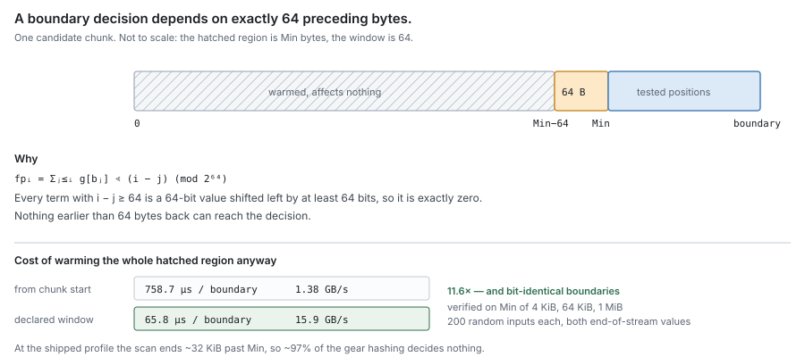
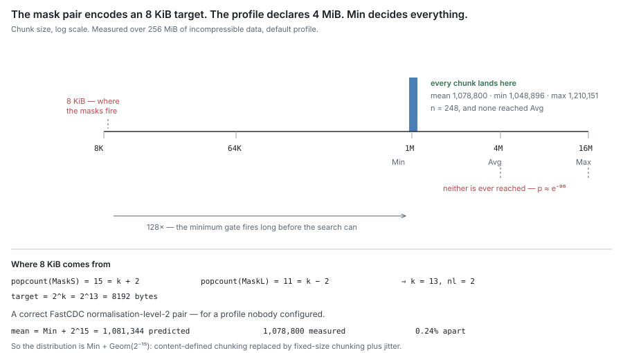

# RFC 2 — the carver

**Status:** reviewed.
**Audience:** anyone implementing or reviewing chunking or block naming.

---

## In short

- The **chunker** says where a chunk ends; the **carver** runs it over one
  unbroken stretch of a file and hashes each chunk. Neither keeps state or calls
  out, so both are tested with a byte slice and a closure.
- Boundaries are chosen by content, so an edit re-cuts only the chunks around it.
- A chunk's name is the hash of its bytes; a block's name is derived from its
  chunks' hashes and a nonce drawn once per put attempt ([§4](#4.%20Identity)). A name is
  never minted twice.
- A stretch that ends at a limit rather than at a hole or the end of the file
  leaves its tail uncut, so the next offer starts on a real boundary ([§2.4](#2.4%20An%20artificial%20end%20leaves%20the%20tail%20uncut)).
- Blocks are packed by the block assembler, a pure fold over the carver's
  output that the engine's offload pipeline drives ([§5](#5.%20The%20block%20assembler)).
- The settings are public, so this layer does not hide which files you have
  ([§6](#6.%20Boundaries%20are%20public)).

## Background

Content-defined chunking [3] slides a small window along the bytes, keeps a
rolling fingerprint of it, and declares a boundary when the fingerprint matches a
pattern. A boundary depends only on nearby bytes, so inserting a byte moves only
the boundaries near it. FastCDC [1] uses a *gear* fingerprint (shift left one bit,
add a table entry per byte), skips a minimum length before testing, and tests more
strictly below the target size than above it ("normalisation"), so sizes cluster
near the target. BLAKE3 [2] names each chunk; it must be cryptographic, because a
name collision would serve the wrong bytes.

---

## 1. Purpose

The carver cuts the bytes the journal is holding into the pieces that get
uploaded.

> **Given an unbroken stretch of a file's bytes, say where the chunk boundaries
> fall and what each chunk's content hash is.**

That is all of it. Chunks are not the product — blocks are, and a block is a whole
number of chunks ([RFC 0 §2.1](rfc-0-data-lifecycle.md#2.1%20Entities)). But building blocks is a fold over what the carver
hands back, done by the **block assembler** ([§5](#5.%20The%20block%20assembler)), not something the carver does.
The assembler is specified here, beside the carver, because its rules are
properties of chunks; it is a separate layer with its own checks.

Why cut this way at all? Because a boundary chosen by content stays put when the
file changes elsewhere. Edit the middle of a file and only the chunks around the
edit are re-cut; everything else keeps its hash, so those bytes can be recognised
as already stored and left out of the upload. Everything downstream — dedup,
refcounts, sweep safety — rests on that. It is why most of this document is about
getting the cuts right.

### 1.1 Non-goals

The carver **MUST NOT**:

- open, read or write anything — it is handed a reader and hands back descriptors;
- decide *when* to cut, or which bytes to offer; that is offload policy ([RFC 0 §5.2](rfc-0-data-lifecycle.md#5.2%20Offload));
- build blocks, upload anything, or find out whether an upload worked;
- know whether a chunk is already stored — it has no dedup oracle and asks nothing
  of any other component;
- know what a segment, a record, a block or a remote key is;
- keep state between calls.

Its dependencies are the standard library and a BLAKE3 implementation, and an
import test **MUST** enforce that.

### 1.2 Two layers: the chunker and the carver

Two things are specified here, and keeping them apart is what keeps both simple.

**The chunker answers *where*. The carver answers *what*.**

| | chunker | carver |
| --- | --- | --- |
| Answers | where does this buffer's next chunk end? | what chunks are in this stretch, and what are they called? |
| Given | settings, a byte slice of at least `Max` bytes, or a shorter last one | settings, a reader, the file offset it starts at, whether the stretch's end is real |
| Returns | one position | one callback per chunk: offset, length, hash, bytes; and how many bytes it consumed |
| Knows about | bytes and settings, nothing else | a reader, a hash function, a file offset |
| Keeps between calls | nothing at all | nothing at all |
| Allocates | never | never: the caller supplies the buffer |


Indicative shapes — the obligations are normative, the signatures are not:

    // chunker: pure, stateless, allocation-free
    NextBoundary(p Params, buf []byte, final bool) (end int)

    // carver: runs the chunker across one stretch of bytes, in the caller's buffer
    Cut(r io.Reader, base int64, p Params, buf []byte, realEnd bool,
        emit func(Chunk, []byte) error) (consumed int64, err error)

    Chunk = { Offset int64; Length int32; Hash [32]byte }

`NextBoundary` gets a buffer and returns where the first chunk in it ends. It is
called only with at least `Max` bytes, or with `final` set, so a whole chunk is
always in view and there is no "not yet" answer: with `Max` bytes a boundary is
found or `Max` itself is the end, and with `final` whatever is left is the last
chunk. It looks at nothing but its arguments.

`Cut` reads until the reader is empty. It refills `buf`, asks `NextBoundary`
where each chunk ends, hashes that chunk, and calls `emit`. `buf` **MUST** hold at
least `Max` bytes, so a whole chunk fits, and `Cut` **MUST** refuse a shorter one;
its size is the caller's to choose ([RFC 8](rfc-8-engine.md)). `base` says where in
the file the reader's first byte sits, so offsets come out as file offsets and the
carver needs to know nothing else about the file. `realEnd` and `consumed` are
[§2.4](#2.4%20An%20artificial%20end%20leaves%20the%20tail%20uncut)'s.

**Neither does the other's job**, and an implementation **MUST NOT** let them
drift together:

- the chunker **MUST NOT** hash, hold a file offset, read from anything, or
  allocate;
- the carver **MUST NOT** work out a boundary itself, look at a fingerprint, or
  depend on how the chunker reached its answer.

The second rule is the one that decays quietly. A carver that reaches into the
boundary search to manage its own buffer makes its callers track two positions in
the file at once — how many bytes have been handed over, and how many have been
cut — and any drift between them tiles some bytes into two chunks.

**Which layer owns what.** Section 3 is all chunker. Sections 2 and 4 are all
carver. Section 5 belongs to neither, and section 6 is about the pair.

The split is not about packaging. It is what lets the boundary rules be checked
against a byte slice with no reader and no hash anywhere in sight, and it is what
makes swapping the boundary function a change to one thing instead of two.

### 1.3 It is testable on its own, by construction

Neither layer declares an interface or needs a capability from anything else.
[RFC 0 §1.2](rfc-0-data-lifecycle.md#1.2%20Component%20autonomy) says every component must build and pass its tests with each declared
interface stubbed out; here there is nothing to stub. The chunker goes further —
with no reader and no hash, a byte slice is the whole fixture.

This is a requirement, not a lucky accident, and an implementation **MUST** keep
it. A conformance check for this document **MUST** be writable as: build the
settings, hand `Cut` a byte slice and a closure, check what the closure saw. No
store, no fake backend, no temp directory, no network, no clock, no goroutine.

Two things follow, and both make checks cheap:

- **Same input, same output, always.** Two implementations — or one before and
  after a change — can be checked for identical results over random input.
- **No state means properties can be fuzzed.** The invariants in [§8](#8.%20Invariants) are properties
  of a return value, so random inputs and random settings are enough to test them.

An implementation that picks up a dependency here — a metadata lookup, a store
handle, a logger that does something, a clock — loses both, and **MUST NOT**.

The kinds of test this allows are in [§10.1](#10.1%20Kinds%20of%20test).

## 2. What one call covers

### 2.1 One unbroken stretch per call

The reader **MUST** supply one unbroken stretch of the file's bytes. Where the
file has holes, the caller makes a separate call for each stretch. [RFC 1 §3.2](rfc-1-journal.md#3.2%20Read)
already tells the caller where the holes are, so this costs it nothing.

This is a guarantee built into the shape rather than a rule to be obeyed, which is
the point. A chunk cannot straddle a hole, because no single call ever sees two
stretches. There is no leftover state to clear between stretches, because there is
no state between calls at all.

When the stretch's end is real ([§2.4](#2.4%20An%20artificial%20end%20leaves%20the%20tail%20uncut)), its last chunk comes out at whatever
length is left, and **MAY** be shorter than the minimum. Content **MUST NOT** be
padded to reach a chunk size.

> *A real cost, worth stating:* a badly fragmented file gives one short chunk per
> stretch, and short chunks only dedup against identical fragments. Nothing can be
> done about it here — bytes that are not next to each other cannot share a chunk.
> Offering longer stretches is the caller's lever.

### 2.2 The bytes handed to `emit` are borrowed

The bytes passed to `emit` point into the caller's buffer and are only good
**for the length of that call**. A caller that wants to keep them **MUST** copy
them.

The carver **MUST** say so plainly, and **MUST NOT** allocate a fresh slice per
chunk to sidestep it. Allocating per chunk is what makes buffer zeroing the
largest single cost of a carve pass. The whole point of handing bytes to a
callback is that the consumer is right there and can decide, once, whether these
particular bytes are worth keeping.

> [!note]
> Borrowing is safe here precisely because the callback runs inside the
> call, where the lifetime is visible at the call site. An interface that returned
> finished chunks for use later could not borrow, because nothing would bound how
> long the bytes had to stay valid. Prior art uses the same contract [4].

### 2.3 What a pass makes observable

The carver keeps nothing between calls ([§1.2](#1.2%20Two%20layers%3A%20the%20chunker%20and%20the%20carver)), so it holds no counters and exports
nothing. Everything below is derived by its caller from what `Cut` hands back:
each chunk's offset, length and hash through `emit`, and the error `Cut` returns.
The caller **MUST** make every metric below observable; the engine exports them,
labelled with the namespace ([RFC 8](rfc-8-engine.md)), since the namespace, not
the share, is what fixes the settings and the chunking key ([§6](#6.%20Boundaries%20are%20public)). A metric is listed only if it says something about cutting;
whether a chunk was already stored is the engine's ([§1.1](#1.1%20Non-goals)).

| Metric | Type | Answers |
| --- | --- | --- |
| `carver_bytes_total` | counter | bytes cut |
| `carver_chunks_total` | counter | chunks emitted; with bytes, the average chunk size, which [§3.2](#3.2%20One%20setting%2C%20and%20the%20bounds%20derived%20from%20it) says is `Target` |
| `carver_chunk_size_bytes` | histogram | the chunk-size distribution, with buckets at `Min`, `Target` and `Max`. A spike on `Min` means the boundary test does not follow `Target` ([§3.3](#3.3%20Why%20a%20large%20minimum%20smothers%20the%20search)) |
| `carver_max_chunks_total` | counter | chunks cut at `Max` because no boundary was found: repetitive content ([§3.8](#3.8%20What%20happens%20on%20repetitive%20data)). A high share on data that is not repetitive means the boundary function is broken |
| `carver_short_chunks_total` | counter | chunks below `Min` ending at a real stretch end ([§2.1](#2.1%20One%20unbroken%20stretch%20per%20call)); against chunks, how fragmented the offered stretches are |
| `carver_held_bytes_total` | counter | bytes left uncut at an artificial end ([§2.4](#2.4%20An%20artificial%20end%20leaves%20the%20tail%20uncut)); against bytes, how much each offer re-reads |
| `carver_stretches_total` | counter | `Cut` calls; bytes per stretch is the caller's lever on dedup ([§2.1](#2.1%20One%20unbroken%20stretch%20per%20call)) |
| `carver_errors_total` | counter | calls that ended in an error, labelled `source` = `reader` or `emit` ([§7](#7.%20Errors)) |
| `carver_duration_seconds` | histogram | time per `Cut` call; with bytes, carve throughput |

The size histogram is the one that matters most: a wrong average costs sizing
and dedup, never correctness, so nothing downstream notices it.

### 2.4 An artificial end leaves the tail uncut

A stretch ends for one of two kinds of reason, and the caller **MUST** tell `Cut`
which (`realEnd`):

- **Real**: the bytes stop there for good — a hole, the file's settled end, or a
  neighbour already durable. The last chunk is cut at whatever length is left
  ([§2.1](#2.1%20One%20unbroken%20stretch%20per%20call)).
- **Artificial**: the caller stopped reading — the offer's byte limit, or its age
  ([RFC 1 §3.3](rfc-1-journal.md#3.3%20Offload)). The bytes carry on past the end; the caller just has not offered them.

On an artificial end, `Cut` **MUST NOT** emit any byte after the last boundary
the chunker found without `final`. It never calls `NextBoundary` with `final`
set, returns in `consumed` how many bytes it cut, and the tail stays **Dirty** to
be re-offered from that boundary. A tail is always shorter than `Max`, since `Max`
bytes always yield a boundary.

Why: a tail cut at a limit is a chunk whose end was chosen by the limit, not the
content. The next offer would then start there, and every chunk after it would
be cut from a start no earlier cut shares ([§3.5](#3.5%20What%20%22deterministic%22%20covers)) — short chunks and re-stored
bytes on every streaming write. Held back, the next offer starts on a content
boundary and cuts exactly as one long stretch would have.

Two exceptions keep a tail from waiting forever:

- **Age.** The caller **MAY** declare an artificial end real once the held tail's
  oldest byte has reached the offload pass's maximum age ([RFC 8 §6.2](rfc-8-engine.md#6.2%20When%20a%20file%20is%20offered)). That is
  the only forced final cut, so a stream that stops writing is fully offloaded
  within that age.
- **Widening back.** Where the chunk before the stretch is a ref shorter than
  `Min` that ends exactly where the stretch starts — a forced cut from an earlier
  pass — the caller **MAY** start the stretch at that ref's start instead, so
  the short chunk is re-cut into a full one. This widens backwards only; it is the
  same permission [RFC 8 §6.7](rfc-8-engine.md#6.7%20A%20run%20is%20what%20the%20journal%20offers%2C%20widened%20only%20to%20re-tile) gives for re-tiling.

## 3. The boundary function

*This section is the chunker's contract: what a boundary function has to
guarantee, its one setting and the bounds derived from it, and what makes a
setting invalid.*

### 3.1 What it must guarantee

These are properties, not an algorithm. Any function with them will do.

| # | Property | What it means |
| --- | --- | --- |
| B1 | **Content-defined** | Where a boundary falls depends on the bytes around it, never on a position or a running count. |
| B2 | **Deterministic** | Same bytes and same settings give the same boundaries — any process, any machine, any version. |
| B3 | **Bounded** | No chunk larger than `Max`. None smaller than `Min`, except the last one in a stretch. `Max` is not a safety margin — on some real inputs it is the *only* thing that ends the search ([§3.8](#3.8%20What%20happens%20on%20repetitive%20data)). |
| B4 | **Shift-resistant** | Inserting or deleting bytes re-cuts only the chunks near the edit. Everything further on is untouched. |
| B5 | **Locally dependent** | A decision looks back only a fixed number of bytes, and the function **MUST** say how many ([§3.4](#3.4%20How%20far%20back%20a%20decision%20looks)). |


Shift resistance (B4) is what the whole content-addressed model rests on. Without
it, an edit re-hashes every chunk after it and nothing downstream dedups at all.
Local dependence (B5) is what makes the function cheap to run.

FastCDC [1] with gear hashing is the chosen instantiation, and BLAKE3-256 [2] the
chunk hash ([RFC 0 §2.1](rfc-0-data-lifecycle.md#2.1%20Entities), [§3](rfc-0-data-lifecycle.md#3.%20Identity)). A replacement **MUST** have all five properties. Any
replacement re-cuts every file ever written, so it is a migration ([§3.6](#3.6%20Changing%20any%20of%20this%20is%20a%20migration)).

### 3.2 One setting, and the bounds derived from it

A share configures one thing, `Target`, a power of two. The two bounds follow
from it and are not configured:

| Quantity | Value | What it **MUST** mean |
| --- | --- | --- |
| `Target` | configured; default **256 KiB** | the average chunk size actually produced, on data with no structure to exploit |
| `Min` | `Target / 4` | no chunk smaller than this, except the last one in a stretch |
| `Max` | `4 × Target` | no chunk larger than this, ever |

**Why one setting.** Measured, `Min` moves deduplication by under 1% anywhere
from zero to `Target / 2`; it only trims the few very small chunks, which bound
per-chunk overhead ([Appendix C](#Appendix%20C%20%E2%80%94%20choosing%20the%20target)). `Max` must exist ([§3.8](#3.8%20What%20happens%20on%20repetitive%20data)) but has no value worth
choosing separately. Three settings are three ways to misconfigure a share for no
measured gain.

**Why 256 KiB.** `Target` trades metadata against what an edit and a cold read
cost ([Appendix C](#Appendix%20C%20%E2%80%94%20choosing%20the%20target)). At 256 KiB a 4 KiB cold read fetches about 0.3 MiB, and
whole-file re-chunking re-stores about four times less after small edits than at
1 MiB; whether the engine's offload path keeps that ratio is Appendix C's
measurement plan. On random input the average is `Target`, so 4,096 chunk records
per GiB — about 8.6×10⁹ at 2 PB. Blocks pack chunks to their own target
([§5](#5.%20The%20block%20assembler)), so the number and size of remote objects do not depend on `Target`. A
share **MAY** choose another `Target`; the choice is fixed for its content
([§3.6](#3.6%20Changing%20any%20of%20this%20is%20a%20migration)).

**The ceiling under random overwrite.** Every chunk is at least `Min` except one
ending at a real stretch end ([§2.4](#2.4%20An%20artificial%20end%20leaves%20the%20tail%20uncut)). So a file whose edits are re-cut with
widening ([RFC 8 §6.7](rfc-8-engine.md#6.7%20A%20run%20is%20what%20the%20journal%20offers%2C%20widened%20only%20to%20re-tile)) holds at most 1 GiB / `Min` chunks per GiB — 16,384 at the
default, four times the random-input average — plus one per hole. Without
widening, each isolated overwrite of `w` bytes between durable neighbours is its
own short chunk, and the ceiling is 1 GiB / `w`: 262,144 per GiB for 4 KiB pages.
That second figure is why the engine widens.


An implementation **MUST** hit `Target` as the average chunk size, within a stated
tolerance, on data with no structure to exploit. It **MUST NOT** ship a boundary
function whose average lands somewhere else, and **MUST NOT** settle such a
mismatch by writing the real number into the specification.

`Min` and `Max` are the edges of a distribution centred on `Target`, so the
derivation keeps `Min < Target ≤ Max` by construction. A `Min` at or above
`Target` would not be cautious but broken — the minimum smothers the search and
`Target` stops describing anything ([§3.3](#3.3%20Why%20a%20large%20minimum%20smothers%20the%20search)) — which is what the current code does
([Appendix A.1](#A.1%20The%20masks%20encode%20a%20different%20target%20than%20the%20profile%20declares)).

**Whatever decides a boundary MUST be derived from `Target`.** In a gear-hash
design that decision is a bit mask, and the number of bits set in it fixes the
average chunk size. A hard-coded mask therefore pins the average whatever `Target`
is set to. An implementation **MUST** compute the mask from `Target`, and
**SHOULD** assert the two agree when it starts up.

**The mean includes the skip.** No boundary is tested in the first `Min` bytes,
so a chunk's length is `Min` plus the search that follows. The mask **MUST** be
sized so that this whole mean — skip included — is `Target`, which puts the
search's own expected length near `Target − Min`, not `Target`. A mask sized to
`Target` alone lands the average too high by up to `Min`, less what normalisation
takes back: the 256 KiB row of [Appendix C](#Appendix%20C%20%E2%80%94%20choosing%20the%20target) averaged about 285 KiB, partly for
that reason.

### 3.3 Why a large minimum smothers the search

A minimum is enforced by simply not looking for a boundary until `Min` bytes have
gone by. If `Min` is much larger than `Target`, then the moment looking starts, a
boundary turns up almost immediately — because the test was tuned to fire about
every `Target` bytes.

Every chunk then comes out just over `Min`, with only a small random tail, and
`Max` is never reached. In other words you no longer have content-defined
chunking; you have fixed-size chunking with a bit of jitter, which throws away
shift resistance (B4). An implementation **MUST** therefore refuse `Min ≥ Target`
outright ([§3.7](#3.7%20Bad%20settings%20must%20be%20refused%2C%20not%20replaced)).

### 3.4 How far back a decision looks

A boundary decision only depends on a short run of recent bytes, and the function
**MUST** say how long that run is. Before testing the first position, an
implementation **MUST** warm its rolling state over exactly that many bytes, and
**MUST NOT** warm it from the start of the chunk.

For gear hashing the answer is 64 bytes, and it is exact rather than approximate.
The fingerprint is built by shifting left one bit per byte, so after 64 bytes an
old byte's contribution has been shifted clean off the end of a 64-bit number. It
cannot affect anything. Written out:

fp_i = Σ_{j ≤ i} g[b_j] << (i − j) (mod 2⁶⁴)

Every term where `i − j` is 64 or more is a 64-bit value shifted left by at least
64 bits, which is exactly zero.



Warming from the start of the chunk therefore does `Min` bytes of work to reach a
search that finishes after roughly `Target` bytes, for output that is
bit-for-bit identical. Appendix A.2 measures the cost.

### 3.5 What "deterministic" covers

Same bytes, same settings, same boundaries — in any process, on any machine, at
any version.

The one thing it does **not** cover is where a stretch begins. The first `Min`
bytes of any stretch are never tested, so the same bytes starting at a different
point cut differently. Cutting converges when the same stretch is offered again.
An offer cut at a limit does not move the next start, because its tail is held
back ([§2.4](#2.4%20An%20artificial%20end%20leaves%20the%20tail%20uncut)). A stretch whose start does move — after a forced cut at the age
ceiling, or a retry after a partial report — cuts its first chunks differently
until its boundaries rejoin the earlier ones (B4). Those chunks are stored again under new
hashes: a cost in space and transfer, never in correctness.

The boundary function **MUST NOT** depend on anything beyond the bytes and the
settings — not a file identity, an offset, a clock, or a random seed. The
namespace's chunking key, when the namespace encrypts, is part of the settings
([§6](#6.%20Boundaries%20are%20public)): same bytes, same `Target` and same key give the same boundaries.

### 3.6 Changing any of this is a migration

Settings are chosen per share, at write time. Reading never re-cuts anything: a
file's chunk list freezes its boundaries ([RFC 0 §2.2](rfc-0-data-lifecycle.md#2.2%20How%20a%20file%20relates%20to%20its%20chunks)), so content written under
one set of settings reads fine under any other.

Changing a share's settings — or the boundary function, or anything derived from
it — **MUST NOT** therefore be treated as a configuration change. New writes
cut in different places, hash to different chunks, and dedup against nothing
already stored. An implementation **MUST** record which settings produced a
share's existing content, and **MUST** report a change as a migration instead of
quietly applying it.

### 3.7 Bad settings must be refused, not replaced

An implementation **MUST** reject invalid settings when it starts up, with an
error, and **MUST NOT** quietly fall back to a default profile.

Invalid means: a `Target` that is not a power of two; one whose `Min` falls below
the floor where chunking stops being worthwhile (64 KiB `Target`, so a 16 KiB
`Min`); or one whose `Max` rises above the ceiling (16 MiB `Max`, so a 4 MiB
`Target`). Nothing else can be invalid, because nothing else is configured.

Falling back to a default looks like robustness and is really a data-shape bug. A
share asked for 64 KiB chunks and quietly given 1 MiB ones produces content that
is valid, readable and correctly hashed — and that dedups against nothing the
operator expected, at sixteen times the read amplification they planned for, with
nothing anywhere reporting a problem ([RFC 0 §1.2](rfc-0-data-lifecycle.md#1.2%20Component%20autonomy)).

### 3.8 What happens on repetitive data

Repetitive input is not an edge case worth a footnote — it is log files, CSV with
fixed-width records, zero-filled regions of sparse files, and VM images full of
identical pages. It has a specific and severe failure mode, and it follows
directly from the 64-byte window of [§3.4](#3.4%20How%20far%20back%20a%20decision%20looks).

**If the data repeats with a period of 64 bytes or less, the search usually
never succeeds.** The fingerprint depends only on the last 64 bytes, so with a
period `p` it takes at most `p` distinct values, one per phase of the pattern. If
none of those `p` values matches the mask, none ever will — not in this chunk,
not anywhere in the file. There is no randomness left to save it. For all zeros
`p` is 1, and the unkeyed table is fixed, so whether its one fingerprint matches
is known in advance; it does not at any supported `Target` ([§9](#9.%20Conformance) asserts it),
so every chunk is exactly `Max`; for a longer period, or under a keyed table
([§6](#6.%20Boundaries%20are%20public)), one of the `p` values may match, and then boundaries fall at a fixed
multiple of the period.

Measured over 64 MiB under the former profile (4 MiB `Target`, 16 MiB `Max`); at
any `Target` the degenerate rows cut every chunk at `Max`:

| Input | Chunks | Average size | Boundaries found |
| --- | --- | --- | --- |
| random bytes | 62 | 1.03 MiB | normally |
| all zeros | 4 | **16 MiB — every chunk hit `Max`** | none, ever |
| 64-byte repeating pattern | 4 | **16 MiB — every chunk hit `Max`** | none, ever |
| repeated ASCII text (44-byte period) | 4 | **16 MiB — every chunk hit `Max`** | none, ever |
| 4 KiB repeating pattern | 64 | 1.00 MiB | yes, at a fixed period |

Three consequences, and an implementation **MUST NOT** treat any as incidental:

- **`Max` is load-bearing.** On three of these five inputs it is the only reason
  chunking terminates at all. Removing it, or setting it very high, turns
  repetitive files into single enormous chunks.
- **Repetitive data does not dedup well, and cannot.** Whole-file-sized chunks
  only match other whole-file-sized chunks. This is inherent to any CDC scheme
  with a bounded window, not a defect in this one. Zeros are the exception that
  costs nothing: an all-zero chunk is recorded as a hole and never stored
  ([RFC 0 §2.1](rfc-0-data-lifecycle.md#2.1%20Entities)). The carver emits it like any other chunk; the engine decides.
- **Where the period is longer than the window, chunking becomes fixed-size at a
  multiple of that period.** The 4 KiB pattern cut at exactly 8 KiB every time
  under a 4 KiB minimum. Sizes on structured data are set by the data's period,
  not by `Target`.

## 4. Identity

*Both rules live here because identity is a property of content. Neither says who
computes it: a chunk's hash is taken by whoever cuts it, a block's by whoever
assembles it (the block assembler, [§5](#5.%20The%20block%20assembler), driven by [RFC 8](rfc-8-engine.md), and [RFC 9](rfc-9-gc.md) when it relocates). Nothing in this document
holds state to do either.*

### 4.1 A chunk

A chunk's identity is the BLAKE3-256 [2] hash of its bytes, and nothing else. An
implementation **MUST NOT** feed an offset, a file identity, a length, a settings
profile or a version number into the hash.

The hash covers exactly the bytes handed to `emit` — the same bytes a later read
has to reproduce. It **MUST** be computed over the chunk as cut, never over a
buffer that merely contains it.

### 4.2 A block

A block's **name** is 32 bytes, derived from what the block holds and from a
nonce drawn for one put attempt:

    name = BLAKE3-derive-key(context, len(scope) ‖ scope ‖ nonce ‖ len(chain) ‖ chain ‖ h₁ ‖ … ‖ hₙ)

- `context` is the fixed ASCII string `content-defined block name v2`. The
  key-derivation mode of BLAKE3 [2] separates this domain from a chunk's plain
  hash ([§4.1](#4.1%20A%20chunk)) by construction.
- `len(scope) ‖ scope` is the scope's **canonical encoding**: one byte giving
  the length (0–255), then the scope's bytes exactly as configured, with no
  normalisation. `scope` is the key scope of [§4.3](#4.3%20Key%20scope): the namespace ID.
- `nonce` is 16 bytes (128 bits) from a cryptographic random source, drawn fresh
  for each **put attempt**, and written into the block header ([RFC 4 §3.2](rfc-4-remote-tier.md#3.2%20Layout)) so
  a whole-block read can still recompute the name and check it.
- `len(chain)` is one byte, the length of `chain`; `chain` is the block's
  **chain ID** ([RFC 5](rfc-5-transforms.md)): it covers everything that decides an encoded body's
  length — the transforms, their versions, their length-affecting settings, and
  the IDs of the material in use.
- `h₁ … hₙ` are the 32-byte chunk hashes as the block header records them, in
  block order: the plaintext hashes ([§4.1](#4.1%20A%20chunk)), or their sealed form when the
  namespace encrypts ([RFC 5](rfc-5-transforms.md)). A name over plaintext hashes would let anyone
  holding a candidate file and the header's nonce confirm the file from the key
  alone, which is what sealing exists to prevent.

A **put attempt** is one decision to store one planned block: its chunks, their
order and its encoding plan. A name **MUST NOT** be minted twice. Every retry
within an attempt reuses its name and its plan and writes the same bytes, and no
other put of that name is ever issued. A new attempt at the same chunks — after
the first was abandoned, or by a second writer — mints a new name. Before the
first put of a name the writer durably records a **put intent** for it; the
commit that records the block consumes the intent ([RFC 6](rfc-6-block-metadata.md), [RFC 9](rfc-9-gc.md)).

How a name becomes a remote key is [RFC 4](rfc-4-remote-tier.md)'s. An implementation **MUST** carry a
golden test vector — a fixed non-empty scope, nonce, chain ID and chunk-hash
list, and the name they give — and a changed vector **MUST** fail the build: a
changed construction orphans every block already stored. The vector covers the
scope's canonical encoding, so two encodings of one scope cannot both verify.

Five things follow, and none of them is optional:

- **Order counts.** P2 and P3 make membership *and* order decide the object's
  bytes, so two blocks holding the same chunks in different order are different
  objects and **MUST** get different names.
- **The domain is separated** from [§4.1](#4.1%20A%20chunk), or a block holding exactly one chunk
  could answer to that chunk's own hash, and two different things to one name.
- **The input is hashes, not bytes.** The assembler already holds the chunk hash
  list; re-reading the chunk bytes to name the block would be a second pass over
  the data for a value the first pass already determined.
- **One name, one byte sequence.** Only one attempt ever puts a name, and it
  puts the same bytes each time: encoding needs to be deterministic only within
  one attempt — its measuring pass and its retries ([RFC 5](rfc-5-transforms.md)) — not across
  attempts or builds.
- **A re-encode never reuses a name.** A relocation is a new attempt, so it
  mints a new target name, and a relocation re-run after a crash mints again; the
  orphaned target of the first run is found by its intent ([RFC 9](rfc-9-gc.md)). No
  generation counter is needed.

Two writers carrying the same chunks produce two objects; the dedup oracle
([RFC 8 §6.5](rfc-8-engine.md#6.5%20The%20dedup%20oracle)) keeps that rare, and the second is born dead and swept. That one
extra put is the price of never having to defend a name against a second writer,
a late delete or a service without conditional puts; why a retried put is safe is
[RFC 3 §2.5](rfc-3-syncer.md#2.5%20An%20unknown%20outcome%20is%20not%20a%20success).

### 4.3 Key scope

A name includes a **scope** that partitions the name space. The scope is the
**namespace ID** of the share whose content the block carries: every
content-addressed record is partitioned by namespace ([RFC 6 §2.6](rfc-6-block-metadata.md#2.6%20The%20scope%20of%20a%20count)), and the
name carries the same partition so that a block cannot verify under another
namespace's name.

The scope **MUST NOT** change within a put attempt, or the attempt's retries would
write under two names.

Names are minted per attempt ([§4.2](#4.2%20A%20block)), so two puts never share an object by
name. What the scope decides is which chunks the dedup oracle may match: a chunk
stored by one share is found by another only within one namespace.

| | Two shares in one namespace | Shares in two namespaces |
| --- | --- | --- |
| Identical content | chunks stored once, by chunk dedup | chunks stored once per namespace |
| Sweep | counts references across the namespace's shares | independent per namespace |
| What one share can infer about the other | that it holds the same chunk, from a dedup hit | nothing |

The scope is encoded in every name ever written, so changing how it is derived
orphans every existing object at once ([§4.2](#4.2%20A%20block)).

## 5. The block assembler

*Blocks are packed by the block assembler, a pure fold over the chunks the carver
emits. The engine's offload pipeline drives it, because the pipeline owns the
dedup query ([RFC 8 §6.3](rfc-8-engine.md#6.3%20The%20offload%20pipeline)); its rules live here because they are
properties of chunks.*

### 5.1 What it takes and what it returns

**Input**, per pass: the chunks the carver emits for each run of the offer, in
file order and then file after file — each chunk's file, offset, length and hash,
and whether it is all zeros; a dedup lookup, passed in as a function
([RFC 8 §6.5](rfc-8-engine.md#6.5%20The%20dedup%20oracle)); the block target, the format's chunk-count cap `N`, and
the age of the oldest byte of each chunk.

**Output**, per chunk, one of three dispositions, and a sequence of block plans:

| The chunk | Disposition | In a block |
| --- | --- | --- |
| all zeros | a **zero ref**: no chunk, reported as a hole ([RFC 6 §3.5](rfc-6-block-metadata.md#3.5%20Operations%20that%20make%20holes)) | no |
| the dedup lookup finds it | **adopted**: a ref to the stored chunk | no |
| otherwise | **carried** | yes, in the pending plan |

A **block plan** lists, for each carried chunk in block order, its hash and where
its bytes sit in the offer. The pipeline mints the plan's name, records its
intent and puts it ([RFC 8 §6.6](rfc-8-engine.md#6.6%20A%20block%27s%20name%20is%20minted%2C%20and%20its%20intent%20recorded%2C%20before%20the%20put)).

```go
type Assembler interface {
	// Add folds one chunk in; it returns the plans the chunk closed, if any.
	Add(c ChunkInfo, lookup func(ChunkHash) (Chunk, bool, error)) ([]BlockPlan, Disposition, error)
	// Finish closes the pass; held is true when the short last plan is held back (§5.4).
	Finish(now time.Time) (last *BlockPlan, held bool)
}
```

The assembler does no I/O but the lookup it is handed, keeps nothing between
passes, and **MUST NOT** survive its pass. A lookup error carries the chunk
([RFC 8 §6.5](rfc-8-engine.md#6.5%20The%20dedup%20oracle)).

### 5.2 Packing rules

| # | Rule |
| --- | --- |
| P1 | A block holds whole chunks only. A chunk is never split to make a block come out an exact size. |
| P2 | A block ends when it reaches the block target, overshooting by at most one chunk, or when it reaches P4's count cap, whichever comes first. The last block of a pass **MAY** fall short, within [§5.4](#5.4%20The%20short%20last%20block)'s bound. |
| P3 | A block holds only the chunks whose bytes it actually carries. An all-zero chunk is a hole, and no block carries it ([RFC 0 §2.1](rfc-0-data-lifecycle.md#2.1%20Entities)). |
| P4 | A block holds at most `N` chunks, where `N` is a constant of the block format version: 1,024 in this one. It bounds the header ([RFC 4 §3.2](rfc-4-remote-tier.md#3.2%20Layout)), which short chunks next to holes would otherwise grow without limit. |
| P5 | The target counts **carried** bytes. Adopted chunks and zero refs contribute nothing, or a mostly-deduplicated file yields blocks of a few kilobytes. |
| P6 | A chunk repeated within one pending block is carried once and referenced each time: its refs and its bytes commit in one transaction. A chunk repeated across blocks is carried in each ([RFC 8 §6.5](rfc-8-engine.md#6.5%20The%20dedup%20oracle)). |

P1 is [RFC 0 §2.2](rfc-0-data-lifecycle.md#2.2%20How%20a%20file%20relates%20to%20its%20chunks). A chunk split across two blocks would have one hash naming
content in two places, so the hash would stop being a locator and a refcount would
stop having a single answer. P2 follows from P1: if a block has to end on a chunk
boundary, the most it can overshoot by is the chunk that crossed the line. At the
default settings the cap is never the limit on full-size chunks — a 1,024-chunk
block of `Min`-sized chunks is 64 MiB — so it bites only on runs of short chunks.

P3 is worth spelling out, because the tempting mistake is to let already-stored
chunks ride along so that a block's chunk list covers an unbroken range. It must
not. A chunk that is already stored lives in another block under its own key;
putting it in this one either duplicates its bytes or produces a block whose list
disagrees with its contents. The thing that needs *every* chunk, stored or not, is
the **file's chunk refs** ([RFC 0 §2.1](rfc-0-data-lifecycle.md#2.1%20Entities)) — a different reader of the same
sequence `Cut` produced.

> [!note]
> Keeping those two readers apart is also what lets block-assignment
> policy change without touching chunking or breaking dedup; prior art [4] used
> exactly that separation to swap sequential assembly for a randomised one with
> no migration.

**Where the dangerous rule went.** Assembly asks a dedup oracle whether a chunk is
already stored. If that oracle could see the block currently being built, it would
call a chunk stored before it has been uploaded — so an identical chunk later in
the same pass carries no bytes, and if the upload then fails the content exists
nowhere while metadata records two references to it. That hazard belongs to the
oracle, and [RFC 8 §6.5](rfc-8-engine.md#6.5%20The%20dedup%20oracle) specifies it; P6 is the one place the assembler
reuses a chunk without asking, and it is safe because both refs commit with the
bytes.

### 5.3 A block packs chunks, whichever files they came from

A block is a sequence of chunks, and nothing in its definition is per file. A pass
covers several files through the journal's `OffloadMany` ([RFC 1 §3.3](rfc-1-journal.md#3.3%20Offload)), and the
assembler cuts blocks from the stream of their chunks — each file's chunks in
offset order, one file after another — by P1 to P5 alone. One block may hold the
tail of a large file, several small files whole, and the head of another. Object
stores are slow on small objects; one block per small file would turn a hundred
thousand small files into a hundred thousand puts.

- **Only within one share**: a block never mixes two flows or two namespaces.
- **A file's chunks within a block are contiguous**, so a packed small file is
  one ranged read ([RFC 8 §7.8](rfc-8-engine.md#7.8%20A%20cold%20read%20asks%20for%20chunks%2C%20or%20for%20the%20block)).
- **One commit per block** records the refs of every file in it
  ([RFC 6 §4.1](rfc-6-block-metadata.md#4.1%20What%20one%20commit%20records)).

Packing costs no read amplification, because a cold read asks for its chunks by
range. It costs relocation work when short-lived small files leave blocks mostly
dead ([RFC 9 §4.1](rfc-9-gc.md#4.1%20A%20block%20that%20is%20mostly%20dead%20pins%20its%20dead%20bytes)).

### 5.4 The short last block

A pass's last block may fall short of the target. The assembler **MAY** hold it
back: it is not put, none of its extents are reported, and they stay **Dirty** and
are carved again by the next pass. It **MUST** be put, however short, once its
oldest chunk's bytes reach the offload maximum age ([RFC 8 §6.2](rfc-8-engine.md#6.2%20When%20a%20file%20is%20offered)). So at
most one short block is put per pass, and none waits past the age ceiling.
Holding back keeps the assembler per pass: nothing of the held block survives the
pass but the dirty extents themselves.

### 5.5 A pending block is a plan, not a buffer

The carver's bytes are borrowed for the length of `emit` ([§2.2](#2.2%20The%20bytes%20handed%20to%20%60emit%60%20are%20borrowed)), and the
assembler **MUST NOT** copy them. A plan records, per carried chunk, its hash and
where its bytes sit in the offered version: a few hundred bytes per block,
whatever its size. The put reads the bytes from the offer when it streams the
block ([RFC 8 §6.3](rfc-8-engine.md#6.3%20The%20offload%20pipeline)).

### 5.6 Assembly is sequential, and may change without migration

**Proposal:** chunks are assembled into blocks in file-offset order, which keeps a
sequential read's chunks in few blocks. Randomised assembly ([§6](#6.%20Boundaries%20are%20public)) blurs
the chunk-size fingerprint and, because refs name hashes, not blocks, can be
adopted later with no migration.

### 5.7 Invariants and checks

| # | Invariant |
| --- | --- |
| A1 | A block holds whole chunks, at most `N` of them, and overshoots its target, counted in carried bytes, by at most one chunk. |
| A2 | A block holds only the chunks whose bytes it carries; zero chunks and adopted chunks are never in one. |
| A3 | At most one short block is put per pass, and none waits past the age ceiling. |
| A4 | A plan holds hashes and positions, never chunk bytes. |
| A5 | A file's chunks within a block are contiguous and in offset order. |
| A6 | A chunk is reused without a lookup only within one block. |

Each check is a pure function of a chunk stream, a stub lookup and settings.

| Requirement | Check |
| --- | --- |
| P1, P2, P4 | Fold random chunk streams, and a run of 5,000 chunks of 1 KiB between holes. Assert every block ends on a chunk, overshoots the target by at most one chunk, and holds at most `N` chunks. |
| P3 zero chunks | Fold a stream with all-zero chunks. Assert none is in a plan and each is a zero ref. |
| P5 carried bytes | Fold a stream in which the lookup finds 90 % of the chunks. Assert every block but the last reaches the target in carried bytes. |
| P6 repeats | Repeat one chunk three times in one block's span, and once more past the block's end. Assert the first block carries it once with three refs, and the second block carries it again. |
| [§5.3](#5.3%20A%20block%20packs%20chunks%2C%20whichever%20files%20they%20came%20from) packing | Fold 10³ files of 64 KiB. Assert ⌈total / target⌉ plans, each file's chunks contiguous in one plan or split only at a block end. |
| [§5.4](#5.4%20The%20short%20last%20block) short last block | Finish a pass short of the target with its oldest chunk young, then old. Assert it is held, then put. |
| [§5.5](#5.5%20A%20pending%20block%20is%20a%20plan%2C%20not%20a%20buffer) no bytes | Fold 1 GiB of chunks. Assert the assembler's memory is independent of chunk size, and the slices `emit` handed over are not retained. |
| lookup error | Make the lookup fail. Assert every chunk is carried. |

## 6. Boundaries are public

The boundary function and its settings are fixed constants in the source. Anyone
can therefore work out where a given file's chunks will fall. **This layer does
not hide which files a deployment holds.**

The consequence is a known-file channel. The run of chunk sizes a file produces is
a fingerprint, so an observer who can see object sizes and counts in the remote
tier can test whether a particular file is stored. The same channel sits under
dedup across shares: the fact that two shares resolve to one object is itself an
answer about their content.

**How much this gives away: everything, for any file of more than a few chunks.**
A chunk's length alone carries about as many bits as the spread of chunk sizes —
some eighteen at a 256 KiB `Target` — so a run of three or four lengths already
singles a file out. And lengths are not the widest channel: an unencrypted
block's header lists its chunks' plaintext hashes, offsets and lengths
([RFC 4 §3.2](rfc-4-remote-tier.md#3.2%20Layout)), so a bucket reader holding a candidate file chunks it and looks the
hashes up ([RFC 5 Appendix B.5](rfc-5-transforms.md#B.5%20What%20a%20bucket%20reader%20still%20learns)).

**Without encryption, boundaries stay public**, and an implementation **MUST NOT**
claim otherwise.

**With encryption, boundaries are keyed.** When a namespace encrypts, its header
hashes are sealed ([RFC 4 §3.2](rfc-4-remote-tier.md#3.2%20Layout), [RFC 5](rfc-5-transforms.md)) and its shares cut with a gear table
derived from a **chunking key**, so an observer without it can neither look a
candidate file's hashes up nor predict where its boundaries fall:

- **Scope.** Keyed boundaries follow the namespace's encryption setting at
  creation: a namespace created encrypting derives a chunking key then, and one
  created without it never has one. Like every setting of [§3.6](#3.6%20Changing%20any%20of%20this%20is%20a%20migration), it is fixed for
  the namespace's content.
- **Construction.** The key is material of kind `chunking-key`, one per
  namespace for its life, held by the material provider like every key
  ([RFC 5 §2.5](rfc-5-transforms.md#2.5%20Reading%20needs%20no%20configuration%2C%20only%20material)). The gear table is expanded from it under the label
  `dittofs chunking key v1`, distinct from every other derivation. Like all
  material it carries a **fingerprint** stored with its ID, so a later open that
  finds a different key under that ID, or an import naming another, is refused
  instead of silently re-cutting; an export carries the key's ID and
  fingerprint, never the key ([RFC 12 §4.4](rfc-12-snapshots.md#4.4%20Key%20scope%20and%20material)).
- it **MUST NOT** rotate with the data keys. Changing it re-cuts everything
  ([§3.6](#3.6%20Changing%20any%20of%20this%20is%20a%20migration)); rotating data keys ([RFC 5 Appendix B.3](rfc-5-transforms.md#B.3%20Rotation)) re-encrypts and cuts nothing;
- it costs no deduplication: chunks are compared within one namespace only
  ([§4.3](#4.3%20Key%20scope)), and every share of the namespace cuts under the same key;
- with sealed hashes, the channel left is block sizes, chunk lengths within a
  body and repetition.

**What the key protects against: passive observers only.** Recent work [5]
recovers the keys of deployed keyed-chunking schemes, gear-table ones included,
from the chunk lengths of content the attacker chose. So the claim is scoped to
an observer who can read the bucket but cannot write to the namespace. It **MUST
NOT** be described as hiding which files a namespace holds from someone who can
also write to it.

> ponytail: a keyed gear table keeps the boundary search at K1's rate but falls to
> chosen-content attacks [5]. Upgrade to a keyed PRF evaluated at each candidate
> position that passes the gear test, so the boundary decision no longer exposes
> a table that chosen content can map out, if a
> deployment must hide content from writers of its own namespace; it costs a PRF
> call per candidate and re-cuts every namespace that adopts it.

Randomising how blocks are assembled is not a mitigation: it changes object sizes
but not the chunk lengths each header lists.

## 7. Errors

`Cut` fails without throwing away the work it finished.

- An error from `emit` or from the reader **MUST** stop the call and be returned.
  Chunks already handed to `emit` have been delivered; the carver **MUST NOT** try
  to take them back.
- A part-built chunk held when the error arrives **MUST** be dropped, never handed
  over short. A short chunk is indistinguishable from a legitimate last chunk, and
  it would hash to something no later read can reproduce.
- The carver **MUST NOT** report anything as stored, or keep state that would let
  a retry cut differently. What happens next is [RFC 0 §5.2](rfc-0-data-lifecycle.md#5.2%20Offload): the extents stay
  **Dirty** and the pass is retried.

Because cutting is deterministic and keeps no state, a retry over the same bytes
produces the same chunks. A failed pass costs work and never correctness.

## 8. Invariants

| # | Invariant |
| --- | --- |
| C1 | A chunk's hash depends on its bytes and nothing else. |
| C2 | The same bytes and settings give the same boundaries, in any process or version. |
| C3 | The average chunk size is the configured `Target`. |
| C4 | Every chunk is between `Min` and `Max`, except the last one before a real stretch end. |
| C5 | *Moved: the block assembler's invariants are [§5.7](#5.7%20Invariants%20and%20checks)'s A1 and A3.* |
| C6 | *Moved: [§5.7](#5.7%20Invariants%20and%20checks)'s A2.* |
| C7 | On an artificial stretch end, no byte after the last content-chosen boundary is emitted. |
| C8 | A block name is minted once, for one put attempt, and never put by another. |


Two properties are missing because the shape of [§1.2](#1.2%20Two%20layers%3A%20the%20chunker%20and%20the%20carver) makes them unbreakable: a
chunk cannot straddle a hole, and there is no state to clear between calls.
Invariants of block assembly are [§5.7](#5.7%20Invariants%20and%20checks)'s; those of the dedup oracle are [RFC 8 §6.5](rfc-8-engine.md#6.5%20The%20dedup%20oracle)'s.

## 9. Conformance

The rules for checks are [the index's](rfc-index.md#Test%20tiers). Every check here is a pure function of a byte slice and a set of settings ([§1.3](#1.3%20It%20is%20testable%20on%20its%20own%2C%20by%20construction)).
If a check needs a fixture, the implementation has picked up a dependency it is
not allowed to have, and that is the finding.

Each check names its layer, because that is where the defect is. The chunker
rows need no reader and no hash at all.

| Layer | Requirement | Check |
| --- | --- | --- |
| chunker | [§3.2](#3.2%20One%20setting%2C%20and%20the%20bounds%20derived%20from%20it) target is real | Cut incompressible data; assert the average, `Min` skip included, is within tolerance of `Target`. A mask that does not follow `Target`, or is sized without the skip, fails it. |
| chunker | [§3.2](#3.2%20One%20setting%2C%20and%20the%20bounds%20derived%20from%20it) mask comes from target | Build at several targets; assert the mask's bit count tracks the target, and that one hard-coded mask cannot satisfy two of them. |
| chunker | [§3.7](#3.7%20Bad%20settings%20must%20be%20refused%2C%20not%20replaced) bad settings refused | Build with a `Target` that is not a power of two, one below the floor and one above the ceiling; assert each errors and nothing usable comes back. |
| chunker | [§6](#6.%20Boundaries%20are%20public) keyed boundaries | Cut the same input under two chunking keys and under none; assert the boundaries differ between all three, the average stays within tolerance of `Target` under each, and the same key reproduces the same boundaries. |
| chunker | [§3.4](#3.4%20How%20far%20back%20a%20decision%20looks) warm-up equivalence | Assert boundaries are identical whether the fingerprint is warmed from the chunk start or over the last 64 bytes, across several profiles. |
| chunker | [§3.8](#3.8%20What%20happens%20on%20repetitive%20data) repetitive input still terminates | Chunk 64 MiB of zeros under the unkeyed table at every supported `Target`; assert every chunk is exactly `Max`. Chunk a 64-byte repeating pattern, keyed and unkeyed; assert the pass ends and no chunk exceeds `Max`. Without `Max` the search can fail forever and the whole file becomes one chunk. |
| chunker | B4 shift resistance | Insert one byte early in a large input; assert every boundary past the edited chunk is unchanged. |
| carver | [§4](#4.%20Identity) hash covers the chunk | Cut identical content at two different `base` offsets; assert one hash. |
| carver | [§2.4](#2.4%20An%20artificial%20end%20leaves%20the%20tail%20uncut) artificial end | Cut random input as one stretch with a real end, and again as a series of offers ending at arbitrary limits, each re-offered from the previous `consumed`; assert both emit identical chunks, and no call emits a byte past its last content-chosen boundary. |
| name | [§4.2](#4.2%20A%20block) golden name | Derive the name of the golden vector; assert the committed bytes. Change the order of two hashes, the scope, the nonce or the chain ID; assert each gives a different name. Encode the scope with a different length byte; assert the name changes. |
| carver | [§2.2](#2.2%20The%20bytes%20handed%20to%20%60emit%60%20are%20borrowed) borrowed bytes | Hold on to the slice passed to `emit` and assert it is seen to change. The check exists to prove the contract is real, so a caller that copies is not doing it out of superstition. |
| carver | [§7](#7.%20Errors) no short chunk on error | Fail `emit` mid-stretch, and fail the reader mid-chunk; assert no delivered chunk is a truncated prefix of one the clean path would produce. |


A check that needs both layers to be wrong at once is in the wrong place. If a
boundary defect only shows up through `Cut`, the chunker's own checks are too
weak, and strengthening those is the fix.

Two things **MUST NOT** stand in:

- **Compressible or repetitive data MUST NOT be the only input for the size
  checks.** A gear hash degenerates on repetitive input, and that is the one case
  where `Max` is ever reached — so a rig built on it measures the opposite of the
  normal case. It **MUST** be covered separately, since it is what `Max` is for.
- **One fixed profile MUST NOT be the only settings under test.** A mask that
  does not follow `Target` is invisible at a single profile and obvious across two.

### 9.1 Benchmarks and quality measures

Speed and quality are measured separately: a faster carver that finds worse
boundaries costs more in storage than it saves in CPU.

| # | Measures | Setup | Reports |
| --- | --- | --- | --- |
| K1 | chunker speed | `NextBoundary` over 64 MiB of seeded random bytes, per profile | MiB/s; zero allocations |
| K2 | carver speed | `Cut` over the same input, hashing included, against BLAKE3 alone over the same bytes | MiB/s for each; the difference is the carver's own cost, since hashing dominates |
| K3 | the worst case | `Cut` over all-zero and short-period input, where chunks run to `Max` ([§3.8](#3.8%20What%20happens%20on%20repetitive%20data)) | MiB/s; it must stay within a small factor of K2 |
| K4 | edit stability | a corpus file, then the same file with bytes inserted near the start | the fraction of chunk hashes the two versions share; content-defined chunking exists to keep this near one |
| K5 | size distribution | real files of several kinds — source trees, VM images, media | the chunk-size histogram against `Min`, `Target` and `Max` |

K1 to K3 report bytes per second and allocations. They run on at least two CPU
architectures, because the ratios differ between them ([Appendix A.2](#A.2%20Warm-up%20runs%20over%20the%20whole%20chunk%20instead%20of%20the%20last%2064%20bytes)). K4 and K5 are
not timed; they run on a fixed corpus so a change of profile can be compared
against the last one, and they are what decide a profile — speed alone never
does.

Seeded random input is the right input for K1 and K2 and the wrong one for K4
and K5: random bytes contain no edits to survive and no structure to find.

A benchmark that runs the carver inside the full stack **MUST** use data that
does not deduplicate, and report bytes stored against bytes written: a load
generator that reuses its buffers produces deduplication that is not the
workload's, and inflates every throughput figure it touches.

## 10. Test plan and performance targets

[§9](#9.%20Conformance) lists the checks; this section is the plan around them.

### 10.1 Kinds of test

| Kind | What it covers | How |
| --- | --- | --- |
| Golden vectors | that boundaries and hashes never move ([§3.6](#3.6%20Changing%20any%20of%20this%20is%20a%20migration)) | a fixed seed per supported profile, boundaries and hashes committed; a changed vector fails the build |
| Properties | the invariants of [§8](#8.%20Invariants) | coverage-guided fuzzing over random input and random valid settings, asserting on what `emit` saw |
| Differential | a faster or refactored implementation | two implementations over the same random input **MUST** emit identical chunks ([§1.3](#1.3%20It%20is%20testable%20on%20its%20own%2C%20by%20construction)) |
| Reader and emit faults | [§7](#7.%20Errors) | a reader and an `emit` that fail at a chosen byte or chunk ([§10.3](#10.3%20Faults%20and%20determinism)) |
| Architecture | B2: any machine | the golden vectors run on at least two CPU architectures; BLAKE3 takes different code paths on each |
| Benchmark | [§9.1](#9.1%20Benchmarks%20and%20quality%20measures), K1–K5 | real time on the reference box, after merge ([tiers](rfc-index.md#Test%20tiers)); the counts of [§10.4](#10.4%20What%20CI%20checks%20instead%20of%20timing) run per change |

There is no crash test, no soak and no concurrency test, and that is the design
working rather than a gap: the carver holds nothing that a crash can tear,
nothing that grows over time, and nothing two calls share.

The one thing a byte slice cannot test is whether the caller uses the output
correctly — that a block holds whole chunks, that bytes are copied before `emit`
returns. Those are checked at the consumer, in [RFC 8](rfc-8-engine.md).

### 10.2 Edge cases

The unit, property and fault tests **MUST** reach these.

**Stretch shape**

- an empty stretch, which emits nothing and succeeds;
- a stretch of one byte, of `Min − 1`, `Min`, `Max` and `Max + 1` bytes;
- a stretch whose length is an exact multiple of `Max`, of repetitive content, so
  the last chunk is exactly `Max` rather than short;
- `base` at zero, at an odd offset, and near the largest file offset: offsets are
  file offsets and **MUST NOT** overflow;
- an artificial end on a stretch shorter than `Max` with no boundary in it, which
  emits nothing and consumes zero; and one landing exactly on a boundary, which
  holds nothing back ([§2.4](#2.4%20An%20artificial%20end%20leaves%20the%20tail%20uncut)).

**The buffer edge**

- a boundary landing exactly where the carver's buffer is refilled, one byte
  before it and one byte after it;
- a chunk exactly as long as the buffer;
- a buffer holding exactly `Max` bytes with no boundary in it, and a `final`
  buffer shorter than `Min`: `NextBoundary` is never called with fewer than `Max`
  bytes and `final` unset.

These are where a carver that manages its own positions drifts and tiles a byte
into two chunks ([§1.2](#1.2%20Two%20layers%3A%20the%20chunker%20and%20the%20carver)).

**Readers that are legal but awkward**

- one that returns one byte per call;
- one that returns its last bytes together with end-of-stream, which **MUST** be
  cut, not dropped;
- one that returns zero bytes and no error, repeatedly. That is legal for a
  reader; the carver **MUST NOT** treat it as the end, and **MUST** fail after a
  bounded number of such reads rather than spin.

**Content**

- random data, where boundaries come from the fingerprint;
- zeros, where only `Max` ends a chunk, and a repeating pattern of period 64 or
  less, where at most `p` fingerprints exist ([§3.8](#3.8%20What%20happens%20on%20repetitive%20data)); and a period just above 64, where
  boundaries return;
- random data with a repetitive region in the middle, crossing in and out of it;
- the same bytes at two `base` offsets, which **MUST** produce one set of hashes.

**Settings**

- every profile the implementation supports;
- each limit of [§3.7](#3.7%20Bad%20settings%20must%20be%20refused%2C%20not%20replaced) exactly at the floor or ceiling, and one past it.

### 10.3 Faults and determinism

The carver has no storage, so there is nothing to corrupt and no crash to
simulate. What can go wrong is the input failing and the output being refused,
and both are injected systematically, not by example:

- the reader fails at **every byte offset** of a stretch spanning several chunks
  and at least two buffer refills;
- `emit` fails at **every chunk** of that stretch.

After each, the chunks already delivered **MUST** be exactly a prefix of the
chunks the clean run delivers, byte for byte, and no delivered chunk may be a
shortened version of one ([§7](#7.%20Errors)). A retry over the same bytes **MUST** then
deliver exactly the clean run.

Determinism is tested across what could vary without anyone deciding to vary it:
architecture, toolchain version and buffer size. Golden vectors run on at least
two architectures, and the property tests run the same input with two buffer sizes and require
identical output. A carver whose output depends on its buffer size cuts
differently after a harmless tuning change, and that is a migration nobody
chose ([§3.6](#3.6%20Changing%20any%20of%20this%20is%20a%20migration)).

### 10.4 What CI checks instead of timing

Tiers are those of [the RFC index](rfc-index.md#Test%20tiers). Per change, only counts, which give the
same answer on any runner:

- **golden vectors** unchanged, chunks and names, on two architectures;
- **allocations**: neither `NextBoundary` nor `Cut` makes any ([§2.2](#2.2%20The%20bytes%20handed%20to%20%60emit%60%20are%20borrowed));
- **average chunk size** over 256 MiB of seeded random input, within 10% of
  `Target` at every profile;
- **edit stability** (K4) on the fixed corpus, at or above the target of [§10.5](#10.5%20Performance%20targets).

A warm-up that crept back over the whole chunk ([§3.4](#3.4%20How%20far%20back%20a%20decision%20looks)) changes no output, so no
count sees it. K1 after merge does: the boundary search falls from over 20×
BLAKE3's rate to about 2×, far below its target.

### 10.5 Performance targets

Speed targets are stated against BLAKE3 alone over the same bytes on the same
box, so they hold on any hardware. Each target leaves room below what was
measured, so a real regression trips it and noise does not.

The hash is the wall. With a 64-byte warm-up, BLAKE3 is about 97% of a carve pass
([Appendix A.2](#A.2%20Warm-up%20runs%20over%20the%20whole%20chunk%20instead%20of%20the%20last%2064%20bytes)), so the carver's target is to cost almost nothing on top of it, and the quality targets decide a profile, not speed
([§9.1](#9.1%20Benchmarks%20and%20quality%20measures)).

| # | Metric | Proposed target |
| --- | --- | --- |
| K1 | boundary search alone, random input | ≥ 10× BLAKE3's rate, so the search stays under a tenth of a pass (measured over 20×, [Appendix A.2](#A.2%20Warm-up%20runs%20over%20the%20whole%20chunk%20instead%20of%20the%20last%2064%20bytes)) |
| K2 | a whole `Cut`, hashing included | ≥ 90% of BLAKE3 alone (measured 97%) |
| K3 | all-zero and short-period input | ≥ 50% of K2; the search does nothing useful here, but it must not cost more than the hash |
| K4 | edit stability: a byte inserted near the start of a 1 GiB corpus file | every chunk shared except the one or two around the edit |
| K5 | average chunk size, random input | within 10% of `Target` |
| K5 | chunks at `Max`, on a corpus with no repetitive regions | ≤ 1% |
| — | allocations | none |
| — | memory per call | the caller's buffer: at least `Max`, at most `2 × Max` |

### 10.6 Recording results

Results are recorded as [the index](rfc-index.md#Test%20tiers) requires, plus the CPU's SIMD extensions
BLAKE3 used (AVX-512, AVX2, NEON) and the toolchain version: the same carver on
the same box differs by more across those than across commits.

## 11. Open questions

None. The three this document carried are settled:

1. **Which way out of Appendix A.1:** the masks are computed from `Target` ([§3.2](#3.2%20One%20setting%2C%20and%20the%20bounds%20derived%20from%20it)),
   default 256 KiB. Measured in [Appendix C](#Appendix%20C%20%E2%80%94%20choosing%20the%20target).
2. **Whether `Min` survives:** as a derived bound, `Target / 4`, not a setting.
3. **How much [§6](#6.%20Boundaries%20are%20public) gives away:** everything, and mostly through the headers;
   an encrypting namespace seals its header hashes and keys its boundaries,
   against passive observers only.

---

## Appendix A — deviations

Where the current implementation departs from this document. A deviation is a
defect to fix or migrate, never a rule to build around.

| Requirement | Current code | Fix |
| --- | --- | --- |
| [§3.2](#3.2%20One%20setting%2C%20and%20the%20bounds%20derived%20from%20it) mask from `Target` | fixed masks encode an 8 KiB target while the default profile declares 4 MiB, so every chunk lands just above `Min` (A.1) | a migration |
| [§3.4](#3.4%20How%20far%20back%20a%20decision%20looks) 64-byte warm-up | the fingerprint is warmed from the start of the chunk (A.2) | changes no output |
| [§4.2](#4.2%20A%20block) derived name | a block's name is random and covers no chunk hash, so a whole-block read cannot recompute it; no put intent is recorded before a put | a migration; its cost elsewhere is in [RFC 3 §2.5](rfc-3-syncer.md#2.5%20An%20unknown%20outcome%20is%20not%20a%20success) |
| [§1.2](#1.2%20Two%20layers%3A%20the%20chunker%20and%20the%20carver) no "not yet" | the chunker returns zero to ask for more bytes when it holds fewer than `Min` and `final` is unset | changes no output |
| [§2.4](#2.4%20An%20artificial%20end%20leaves%20the%20tail%20uncut) artificial end | not verified against the code; to check before the refactor | — |
| [§5](#5.%20The%20block%20assembler) the block assembler | assembly lives in the carver; chunks are copied through three buffers; adopted chunks count toward the target | a separate module driven by the engine's pipeline; changes no stored format |

### A.1 The masks encode a different target than the profile declares

The mask pair is hard-coded, and it encodes a target of **8 KiB** while the
default profile declares **4 MiB**.

FastCDC [1] ties the mask to the target: for a target of `2^k` at normalisation level
*nl*, the small-region mask carries `k + nl` bits and the large-region mask
`k − nl`. The shipped pair has 15 and 11 bits set, and the only `k` and `nl` that
fit are 13 and 2 — a target of `2^13`, which is 8 KiB.

| | The masks imply | The profile declares |
| --- | --- | --- |
| Target average | 8 KiB (`k` = 13) | 4 MiB (`k` = 22) |
| Minimum | — | 1 MiB |


`Min` is 128× the masks' natural target, so the minimum smothers the search ([§3.3](#3.3%20Why%20a%20large%20minimum%20smothers%20the%20search))
and every chunk lands just above `Min`. Predicted average:
`1,048,576 + 32,768 = 1,081,344` bytes. Measured over 256 MiB of incompressible
data:

| Configured Min / Target / Max | Chunks cut | Average chunk | Smallest | Largest | Any chunk reached Target? |
| --- | --- | --- | --- | --- | --- |
| 1 MiB / 4 MiB / 16 MiB | 248 | **1.029 MiB** | 1.000 MiB | 1.154 MiB | none |
| 64 KiB / 256 KiB / 1 MiB | 2,765 | **94.8 KiB** | 64.0 KiB | 258.6 KiB | none |

That is 0.24% from prediction. In both rows the average sits about 30 KB above
`Min` — the small-region mask's own scale, 2¹⁵ bytes — whatever `Min` is, which
points at the masks rather than the profile. No chunk reached `Target`, and `Max`
was never approached. The FastCDC paper's own setup [1] uses a minimum of
4–8 KB at normalisation level 2: `Min` close to `Target`.



**Two ways out, both migrations ([§3.6](#3.6%20Changing%20any%20of%20this%20is%20a%20migration)):**

1. **Compute the masks from `Target`**, and demote `Min` and `Max` to guard rails.
   This is what [§3.2](#3.2%20One%20setting%2C%20and%20the%20bounds%20derived%20from%20it) requires. It re-cuts all existing content.
2. **Redeclare the profile** to the 8 KiB target the masks actually implement.
   Easier to reason about, still re-cuts content unless `Min` comes down to match,
   and leaves a design where the masks can never be retuned.

This document takes the first ([§3.2](#3.2%20One%20setting%2C%20and%20the%20bounds%20derived%20from%20it)). No deployment's content is worth keeping
cut the old way, so the re-cut is paid now, while it is free.

### A.2 Warm-up runs over the whole chunk instead of the last 64 bytes

Only the previous 64 bytes can affect a boundary decision ([§3.4](#3.4%20How%20far%20back%20a%20decision%20looks)). The shipped code
warms its fingerprint from the start of the candidate chunk instead. In practice
that means it gear-hashes **every byte of the file**, where the fix gear-hashes
only the search window after each minimum — about 3% of the data.

Measured by chunking 512 MiB of incompressible data end to end, hashing each chunk
with BLAKE3 exactly as a real pass does. Both variants produced the same 496
chunks with the same hashes.

| Machine | What is being timed | Full warm-up | 64-byte warm-up | Gain |
| --- | --- | --- | --- | --- |
| **AMD EPYC 7543** (server) | boundary search + BLAKE3 | 1,300 MB/s | **1,855 MB/s** | **1.43×** |
| | boundary search alone | 2,880 MB/s | 54,440 MB/s | 18.9× |
| **Apple M1 Max** (dev) | boundary search + BLAKE3 | 820 MB/s | **1,917 MB/s** | **2.34×** |
| | boundary search alone | 1,506 MB/s | 45,928 MB/s | 30.5× |

The first row of each pair is what matters, because a real pass hashes what it
cuts: the fix is worth about **1.4×** on the server CPU and more on arm64. After
it, BLAKE3 is **97%** of the pass (96% on arm64), so there is no point optimising
the chunker further. The machines differ because the EPYC's gear hash is about
1.9× the M1's while its BLAKE3 is only about 1.3×; both ratios were measured.

Unlike A.1 this is **not** a migration: the output does not change.

## Appendix C — choosing the target

**Whole-file re-chunking baseline.** Measured with a FastCDC whose masks derive
from `Target` (normalisation level 2, 64-byte warm-up, `Max = 4 × Target`), over
a 220 MB tar of one compiler toolchain. Three workloads against it: the next patch release of the same
toolchain (a backup of a changed tree), 256 random 4 KiB pages overwritten in
place (a VM image), and 64 random 100-byte insertions (edited files). The last
three columns are bytes stored again on top of the original.

| `Target` | `Min` | chunks per GiB | 4 KiB cold read fetches | next release | 256 pages | 64 inserts |
| --- | --- | --- | --- | --- | --- | --- |
| 64 KiB | T/4 | 14,340 | 0.08 MiB | 163 MiB | 24 MiB | 4.8 MiB |
| **256 KiB** | T/4 | 3,684 | 0.30 MiB | 194 MiB | 70 MiB | 19 MiB |
| 1 MiB | T/4 | 904 | 1.26 MiB | 211 MiB | 165 MiB | 78 MiB |
| 4 MiB | T/4 | 244 | 4.64 MiB | 220 MiB | 214 MiB | 175 MiB |

"Cold read fetches" is the chunk a random byte falls in, on average (Σs²/Σs): a
random 4 KiB read of evicted content costs one whole chunk ([RFC 8 §7.8](rfc-8-engine.md#7.8%20A%20cold%20read%20asks%20for%20chunks%2C%20or%20for%20the%20block)).

`Min` barely matters. At 256 KiB, going from no minimum to `T/2` moved the
three workloads by under 1% and the chunk count by 10%:

| `Min` | chunks per GiB | next release | 256 pages | 64 inserts |
| --- | --- | --- | --- | --- |
| none | 3,864 | 193.6 MiB | 69.5 MiB | 19.0 MiB |
| T/8 | 3,764 | 193.6 MiB | 69.5 MiB | 19.0 MiB |
| T/4 | 3,684 | 193.9 MiB | 69.6 MiB | 19.2 MiB |
| T/2 | 3,496 | 194.1 MiB | 70.0 MiB | 19.2 MiB |

**What others ship.** Backup tools, which dedup across snapshots and read
sequentially, sit at 1–4 MiB; systems that serve random reads or dedup live
volumes sit at 4–128 KiB. A filesystem serving cold random reads belongs with the
second group, which is where 256 KiB leans.

| System | Chunking | Average | Bounds |
| --- | --- | --- | --- |
| JuiceFS | fixed, no dedup | 4 MiB blocks | — |
| Duplicacy | variable | 4 MiB | ¼× and 4× the average — the same ratios as [§3.2](#3.2%20One%20setting%2C%20and%20the%20bounds%20derived%20from%20it) |
| Kopia | variable (buzhash) | 4 MiB | 2–8 MiB |
| Borg | variable (buzhash) | 2 MiB | 512 KiB–8 MiB |
| restic | variable (Rabin) | 1 MiB | 512 KiB–8 MiB |
| casync | variable | 64 KiB | 16–256 KiB |
| Windows Server deduplication | variable | about 64 KiB | 32–128 KiB |
| ZFS deduplication | fixed, per record | 128 KiB | — |

The chunk counts put the corpus average 5–14% above `Target` at every profile,
part of it the `Min` skip the masks did not account for, and no chunk of random
input reached `Max`. A
toolchain release rebuilds its binaries, so most of it is new at any `Target`;
the release column says more about the corpus than about chunking. One corpus
on one machine.

**Measurement plan: the real offload path.** Before the default is frozen, each
`Target` is measured through the engine, not over whole files:

| Step | What |
| --- | --- |
| Input | the three workloads above, plus a streaming append and 4 KiB random overwrites of a VM image, on the K5 corpus ([§9.1](#9.1%20Benchmarks%20and%20quality%20measures)): source trees, VM images, media |
| Path | the workload written through the journal and offloaded by the engine: offers bounded by the pass limit and age, artificial ends held back ([§2.4](#2.4%20An%20artificial%20end%20leaves%20the%20tail%20uncut)), widening as [RFC 8 §6.7](rfc-8-engine.md#6.7%20A%20run%20is%20what%20the%20journal%20offers%2C%20widened%20only%20to%20re-tile) permits |
| Report | bytes stored against bytes written; chunk records per GiB of live data, against the ceiling of [§3.2](#3.2%20One%20setting%2C%20and%20the%20bounds%20derived%20from%20it); the chunk-size histogram; the cold-read fetch size; blocks per pass and short blocks |
| Decides | the default `Target`, if a different one is better on the real path by more than the whole-file baseline's margins |

The chunker is measured with the mask of [§3.2](#3.2%20One%20setting%2C%20and%20the%20bounds%20derived%20from%20it), so its mean includes the skip.

## Appendix B — prior art

1. W. Xia et al., *FastCDC: a Fast and Efficient Content-Defined Chunking
   Approach for Data Deduplication*, USENIX ATC 2016.
2. J. O'Connor, J.-P. Aumasson, S. Neves, Z. Wilcox-O'Hearn, *BLAKE3: one
   function, fast everywhere*, 2020.
3. A. Muthitacharoen, B. Chen, D. Mazières, *A Low-bandwidth Network File
   System*, SOSP 2001.
4. The restic backup program's chunker, which borrows chunk bytes into a callback
   and randomised block assembly without a migration.
5. *Breaking and Fixing Content-Defined Chunking*, IACR ePrint 2025/558: attacks
   on keyed chunking in deployed backup tools.
