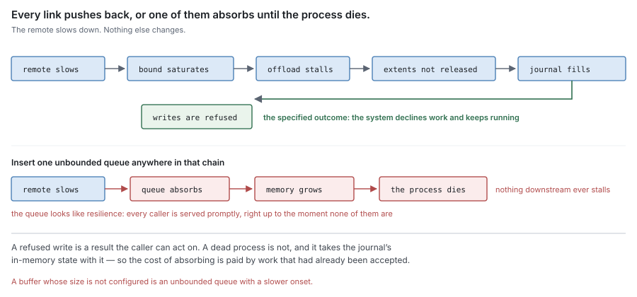
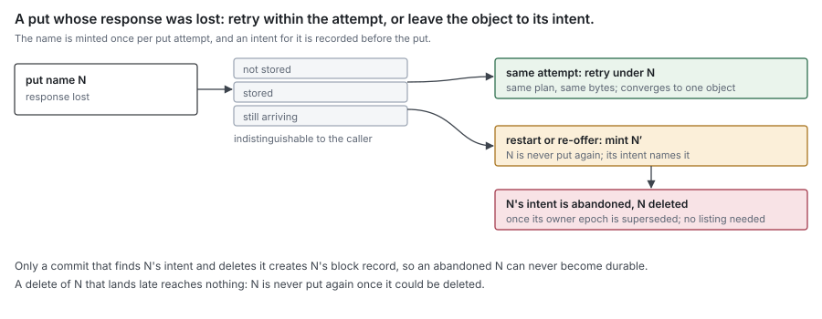
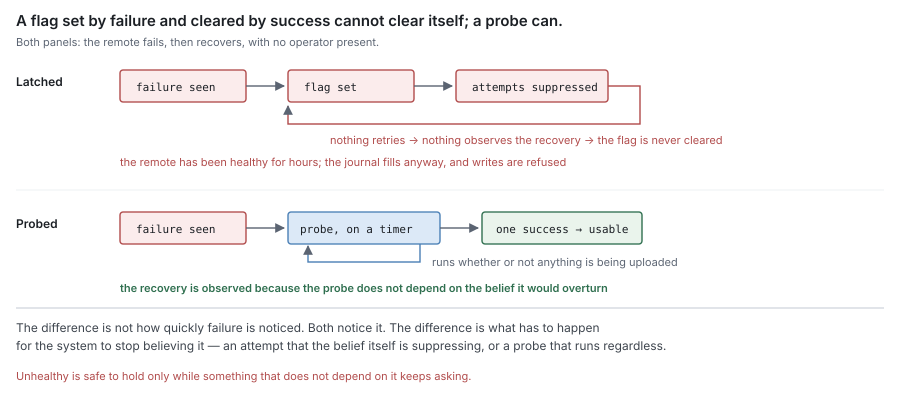
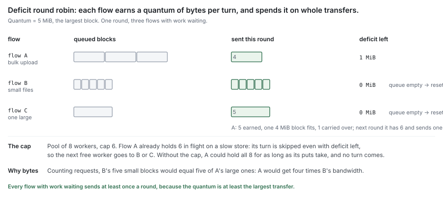
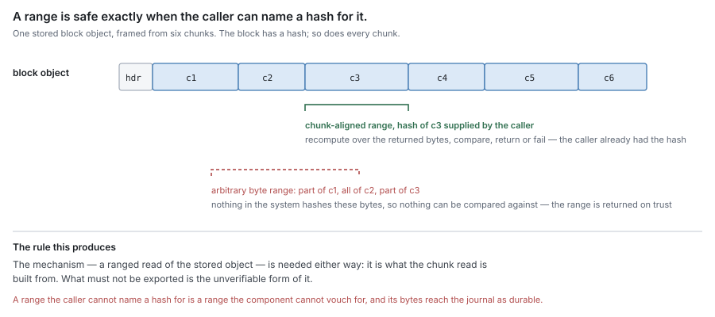
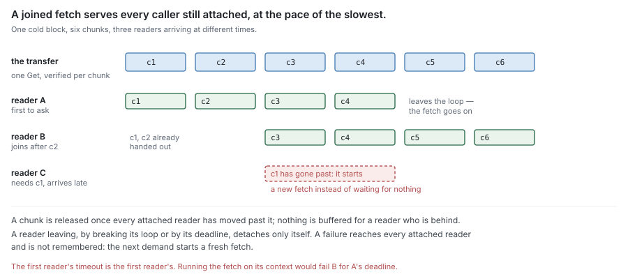

# RFC 3 — the syncer

**Audience:** anyone changing the component that moves chunks between the journal
and the remote tier. Conventions and test tiers are in [the RFC index](rfc-index.md).

---

## In short

- The syncer moves chunks between the journal and the remote tier: out as whole
  blocks, back as the chunks a read needs. It does nothing else.
- It has two halves. The **uploader** puts assembled blocks out, one put each
  (the offload pipeline assembles a block from packed chunks,
  [RFC 2 §5](rfc-2-carver.md#5.%20The%20block%20assembler), [RFC 8 §6.3](rfc-8-engine.md#6.3%20The%20offload%20pipeline)). The
  **fetcher** gets remote-only chunks back, as ranges of their block or as the
  whole block.
- Each half is a worker pool of configurable size. That pool is the only
  concurrency control, and its size is the memory bound.
- Work is served by class — a waiting reader first, then offload and
  relocation, then speculation — and fairly across stores and flows within a
  class. A store's health is kept per direction, so failing writes never refuse
  reads.
- The uploader holds a *reference* into the journal, not a copy. The journal keeps
  those bytes stable until the upload reports.
- The fetcher hands verified chunks to its caller, the engine, which answers the
  waiting read and may store them in the journal (a *fill*).
- Its callers are the engine, one flow per share, and GC, which relocates
  through a flow of its own.
- It names nothing, deletes nothing, decides nothing, and stores nothing.

---

## 1. Purpose

> **Move chunks between the journal and the remote tier, in both directions,
> under a bound: out as whole blocks, back as the chunks that are needed.**

The two directions are deliberately asymmetric. A block is
the unit of **storage**: one name, written by one put, so it goes out
whole. A chunk is the unit of **verification**: each carries its own hash, so any
chunk can be read and checked on its own. A fetch therefore asks for the chunks it
needs — a range of the block — or for the whole block when most of it is wanted
([RFC 8 §7.8](rfc-8-engine.md#7.8%20A%20cold%20read%20asks%20for%20chunks%2C%20or%20for%20the%20block)).

Every transition to **Resident** in this system originates in an outcome this
component reports ([RFC 0 §4.3](rfc-0-data-lifecycle.md#4.3%20Reporting)). Every transition back from **Remote** to holding
local bytes originates in a fetch it performed.

### 1.1 Non-goals

The syncer **MUST NOT**:

- decide *what* to transfer, or *when*, or *why* — that is offload, eviction and
  read-ahead policy ([RFC 0 §5.2](rfc-0-data-lifecycle.md#5.2%20Offload), [§8.1](rfc-0-data-lifecycle.md#8.1%20Evict), [RFC 8](rfc-8-engine.md));
- decide what to delete — that is sweep, which calls the remote tier directly
  ([RFC 0 §8.3](rfc-0-data-lifecycle.md#8.3%20Sweep), [RFC 9](rfc-9-gc.md));
- derive a block's name ([RFC 2 §4.2](rfc-2-carver.md#4.2%20A%20block));
- know how a block is encoded, transformed or verified ([RFC 4 §3](rfc-4-remote-tier.md#3.%20The%20block%20format), [§3.3](rfc-4-remote-tier.md#3.3%20Transforms), [§3.4](rfc-4-remote-tier.md#3.4%20Every%20read%20is%20verified%20by%20the%20codec));
- persist anything;
- know what a file, an [extent](rfc-0-data-lifecycle.md#2.1%20Entities) or a [segment](rfc-0-data-lifecycle.md#2.1%20Entities) is, or which files a block's
  [chunks](rfc-0-data-lifecycle.md#2.1%20Entities) came from. To the syncer a chunk is a hash and its bytes, the unit it
  verifies and streams; where chunk boundaries fall, what refers to a chunk, and
  how chunks were grouped into a block are not its concern.

### 1.2 Two halves, one component

| | uploader | fetcher |
| --- | --- | --- |
| Triggered by | a block assembled for offload or relocation | a read of bytes held only remotely |
| Moves | one whole block per transfer | the chunks asked for, as a range of one block, or the whole block |
| Reads from | the journal, by reference | the remote tier |
| Writes to | the remote tier | its caller, which answers the read and may fill the journal |
| Limited by | its own worker pool | its own worker pool |
| Work is | known in advance, and unique | demanded, and may be duplicated |

The halves share a component and share nothing else: no pool, no queue, no
counter. Their sizes **MUST** be configurable independently, because they saturate
on different things — uploads on the uplink and on how fast blocks are assembled,
fetches on latency and on how many readers are blocked.

### 1.3 Interface

Signatures are indicative; the obligations are normative.

```go
type Chunk struct {
    Hash  Hash   // plaintext content hash
    Bytes []byte // borrowed until the next iteration
}

// Range is where one chunk's body sits in an encoded block: a byte offset and a
// length, after transforms, as the block's header records them (RFC 4 §3.2).
type Range struct {
    Off, Len int64
}

// ChunkRange asks for one chunk: the hash to verify it against, and its range.
type ChunkRange struct {
    Hash  Hash
    Range Range
}

// Descriptor is one census entry (RFC 5 §5.3): a transform, its format version
// and the material it used, each by ID and fingerprint. Opaque to the syncer,
// which passes it through.
type Descriptor struct {
    Transform uint16
    Version   uint8
    Material  []MaterialRef
}

type MaterialRef struct {
    ID          string
    Fingerprint [32]byte
}

// Direction is a half: put or get. Health is kept per direction (§2.8).
type Direction uint8 // Put, Get

// Stored is what a put reports: one Range per chunk, in the order given, and
// the block's census, each distinct Descriptor its bodies used.
type Stored struct {
    Ranges []Range
    Census []Descriptor
}

// Store is what the syncer needs from a backend, declared here and named for
// that need. The engine implements it by composing RFC 4's block codec with a
// remote block store: encoding, transforms and verification happen inside it.
type Store interface {
    // Put encodes the block and streams it to the store. It may call src
    // twice per attempt: once to measure, once to send (RFC 4 §4.3).
    Put(ctx context.Context, name BlockName, src func() iter.Seq2[Chunk, error]) (Stored, error)
    // Get reads the chunks named in want, or the whole block when want is empty.
    // Ranges adjacent in the block are read with one request. Each chunk comes
    // back decoded and verified against its own hash.
    Get(ctx context.Context, name BlockName, want []ChunkRange) iter.Seq2[Chunk, error]
    // Health makes one probe call of the given direction against this store's
    // own namespace (RFC 4 §4.7).
    Health(ctx context.Context, d Direction) error
}

// Every Store error wraps one error of RFC 4's closed set (§4.8) or RFC 5's
// ErrMaterialUnavailable (§2.7), or is a local error returned as itself.
// A throttling response is ErrThrottled, which wraps ErrTransient.

Register(name string, store Store) (StoreID, error)
// A background flow's fetches run in the background class (§2.9); GC, copying
// backups and re-homes open one.
OpenFlow(store StoreID, background bool) (*Flow, error)

func (f *Flow) Upload(ctx context.Context, name BlockName, size int64, src func() iter.Seq2[Chunk, error]) (Stored, error)
func (f *Flow) Fetch(ctx context.Context, name BlockName, want []ChunkRange) iter.Seq2[Chunk, error]
func (f *Flow) Prefetch(ctx context.Context, name BlockName) iter.Seq2[Chunk, error]
func (f *Flow) Healthy(d Direction) bool
func (f *Flow) Close() error

Close() error // the syncer's own
Stats() Stats // a consistent snapshot of the counters of §2.12
```

Streams are `iter.Seq2`: a caller consumes one with `for c, err := range`, and
leaving the loop early stops the producer.

`Chunk` and `Store` are declared by the syncer, as
[RFC 0 §1.2](rfc-0-data-lifecycle.md#1.2%20Component%20autonomy) requires: the syncer depends on neither the carver, the journal nor the
remote tier, and is tested with none of them ([§1.4](#1.4%20It%20is%20testable%20on%20its%20own)). `Chunk` is not the
carver's chunk ([RFC 2 §1.2](rfc-2-carver.md#1.2%20Two%20layers%3A%20the%20chunker%20and%20the%20carver)) under another name. The carver's describes where a
chunk sits in a file; this one is what a transfer carries, a hash and its bytes,
and has no file offset. The engine converts one
into the other. `Hash` is a plain `[32]byte`, so not even the hash type is
shared. `Store` has no delete: the syncer never deletes ([§1.1](#1.1%20Non-goals)).

**The error set is closed.** The syncer uses the remote store's set
([RFC 4 §4.8](rfc-4-remote-tier.md#4.8%20Errors%20are%20a%20closed%20set)) as it is, plus `ErrMaterialUnavailable` from the transforms
([RFC 5 §2.7](rfc-5-transforms.md#2.7%20Failures)); the codec reports every other transform failure as `ErrCorrupt`.
Neither the syncer nor its callers interpret a service's or a transform's own
errors. The error values are all the syncer shares with those components; they
belong to neither, so the syncer still depends on no component's code:

| Error | The syncer | Counts toward health ([§2.8](#2.8%20An%20unhealthy%20store%20refuses%20work)) |
| --- | --- | --- |
| `ErrNotFound` | fails the call; the engine re-resolves ([RFC 8 §7.7](rfc-8-engine.md#7.7%20An%20absent%20object%20is%20re-resolved%20while%20its%20location%20moves)) | no |
| `ErrInvalid` | fails the call, not retried | no |
| `ErrDenied` | fails the call, not retried | yes, in the call's direction |
| `ErrThrottled` | holds the flow, then retries after backoff within its bound ([§2.4](#2.4%20Every%20transfer%20terminates%2C%20and%20reports)) | no: it is backpressure, not failure |
| `ErrTransient` | retries within its bound ([§2.4](#2.4%20Every%20transfer%20terminates%2C%20and%20reports)) | yes, in the call's direction |
| `ErrCorrupt` | on a put, retries within its bound; on a fetch, fails the call, not retried | on a put, yes, toward put health; on a fetch, no |
| `ErrMaterialUnavailable` | fails the call, not retried; the read fails as the remote being unavailable | no |
| a local error | fails the call | no |

A put that keeps failing its in-transit check says something about the path to
the store, not about one block: the same bytes are sent again and fail again. So
`ErrCorrupt` on a put counts toward put health, and a store that corrupts every
put for the failure window turns put-unhealthy like one that refuses them.
`ErrThrottled` is the store asking to be sent less; counting it as failure would
turn a busy store into a refused one.

**There is one syncer per process.** An installation may configure several
block stores, and each is registered once. Work reaches the syncer through a
**flow**: a handle bound to one store and to one queue in the fairness scheduler
([§2.9](#2.9%20Workers%20are%20shared%20fairly%20across%20flows)). A transfer on a flow goes to that flow's store and waits in that flow's
queue, so a transfer cannot be sent to the wrong store, and a call carries
neither a store nor a key. `Flow.Close` takes the flow out of the scheduler; a
call on a closed flow **MUST** fail.

**The syncer does not know what a flow stands for.** It knows stores, flows and
blocks, and nothing about shares, files or tenants. The engine opens one flow
per share, on that share's store, and closes it when the share is removed
([RFC 8](rfc-8-engine.md)). GC opens one background flow per store it relocates on, so relocation's reads
and puts get the same memory bound, retries and health refusal as any transfer,
and run in the background class, behind every reader's demand and ahead of
speculation ([§2.9](#2.9%20Workers%20are%20shared%20fairly%20across%20flows), [RFC 9 §4.2](rfc-9-gc.md#4.2%20Read%20verified%2C%20mint%2C%20put%2C%20then%20move)). GC's deletes do not go through
the syncer ([§1.1](#1.1%20Non-goals)). A copying backup and a re-home open background flows
the same way ([RFC 12 §3.4.3](rfc-12-snapshots.md#3.4.3%20Writing%20one%2C%20step%20by%20step), [RFC 12 §4.7](rfc-12-snapshots.md#4.7%20Moving%20one%20share%20out%20of%20a%20shared%20namespace)): a copy on the namespace's
store and on the backup's block folder, a re-home on the old and new
namespaces' stores. Fairness per tenant, or a separate flow for pre-warm,
would change which flows are opened and nothing here.

One syncer is what the bounds need: the memory bound is a property of the process
([§2.2](#2.2%20The%20pool%20size%20is%20a%20memory%20bound)), and a store's health is a property of all the traffic it carries,
from every flow on it ([§2.8](#2.8%20An%20unhealthy%20store%20refuses%20work)). A syncer per share would state neither.


`name` is the block's name ([RFC 2 §4.2](rfc-2-carver.md#4.2%20A%20block)). With `want` it is everything
[RFC 4 §3.4](rfc-4-remote-tier.md#3.4%20Every%20read%20is%20verified%20by%20the%20codec)'s verified read needs. The syncer passes both through and **MUST NOT**
interpret them, except to sum the lengths of `want` for scheduling ([§2.9](#2.9%20Workers%20are%20shared%20fairly%20across%20flows)).

**Both directions stream, one chunk at a time.** The header indexes every
chunk's body with its plaintext hash, each body decodes on its own
([RFC 4 §3.2](rfc-4-remote-tier.md#3.2%20Layout)), and every transform applies per chunk ([RFC 5](rfc-5-transforms.md)). On a put, the
engine's `Store` sends the header, then encodes each chunk as it sends it
([§3.4](#3.4%20One%20put%20per%20block)); on a get, it decodes and verifies each body as it arrives. A worker
therefore holds one chunk and one header, never the whole block, which is what
sets the bound of [§2.2](#2.2%20The%20pool%20size%20is%20a%20memory%20bound).

**`Upload`** puts the block whose chunks `src` yields from the journal
([§3.2](#3.2%20It%20holds%20a%20reference%2C%20not%20a%20copy)). It hands that stream to the store's `Put`, which encodes and transforms
each chunk beneath the syncer; the syncer never sees a transformed byte
([RFC 4 §3.3](rfc-4-remote-tier.md#3.3%20Transforms)). `size` is the block's largest encoded length, the chain's
`MaxEncodedLen` ([RFC 5 §3.1](rfc-5-transforms.md#3.1%20Interfaces)) summed over its chunks plus the header, which the
engine knows from its plan and the scheduler charges ([§2.9](#2.9%20Workers%20are%20shared%20fairly%20across%20flows)). GC's relocation calls
`Upload` with the same signature and gets the same `Stored` back ([RFC 9 §4.2](rfc-9-gc.md#4.2%20Read%20verified%2C%20mint%2C%20put%2C%20then%20move)).

It waits in its flow's queue until a worker is free or `ctx` ends, which is the
backpressure of [§2.3](#2.3%20Backpressure%20propagates%3B%20it%20does%20not%20buffer), and fails at once if its store is put-unhealthy ([§2.8](#2.8%20An%20unhealthy%20store%20refuses%20work)) or its
flow's queue, or the half's waiter bound, is full ([§2.9](#2.9%20Workers%20are%20shared%20fairly%20across%20flows)). It returns the store's `Stored`, and a `nil` error,
only on the store's acknowledgement, which is durable because every store is
([§2.6](#2.6%20Durability%20is%20observed%2C%20never%20inferred)); every other ending, an unknown one included ([§2.5](#2.5%20An%20unknown%20outcome%20is%20not%20a%20success)), is an error.
The ranges and the census go into the block's commit, where later reads and
retirement find them ([RFC 6 §2.2](rfc-6-block-metadata.md#2.2%20Chunk), [RFC 6 §2.3](rfc-6-block-metadata.md#2.3%20Block)).

A retry, and a measuring pass, call `src` again for a fresh stream from the first
chunk, so the bytes behind it **MUST** stay stable until `Upload` returns ([§3.3](#3.3%20The%20journal%20keeps%20referenced%20bytes%20stable)). It **MUST NOT**
call `src` after it returns, which is what lets the caller hand the journal
reference back.

One `Upload` is one **put attempt** of [RFC 2 §4.2](rfc-2-carver.md#4.2%20A%20block): the caller minted `name` for it
and recorded its put intent before calling ([RFC 8 §6.6](rfc-8-engine.md#6.6%20A%20block's%20name%20is%20minted%2C%20and%20its%20intent%20recorded%2C%20before%20the%20put)). Every retry inside
`Upload` puts that same name with the same bytes; the syncer never puts a name
it was not handed, and never puts a name again after `Upload` returns.

**`Fetch`** is a demand: a reader is waiting. **`Prefetch`** is speculation
([§4.4](#4.4%20Speculation%20does%20not%20delay%20demand)): nobody is waiting yet. They are separate methods, not one method with
a priority parameter, so each call site shows which it means. `Prefetch` always
fetches the whole block: speculation is read-ahead or pre-warm, and both want
whole blocks ([RFC 8 §7.8](rfc-8-engine.md#7.8%20A%20cold%20read%20asks%20for%20chunks%2C%20or%20for%20the%20block)).

**A fetch is a set of whole-chunk ranges of one block.** `want` names the chunks
the caller needs, each by its hash and the `Range` block metadata recorded for it
([RFC 6 §2.2](rfc-6-block-metadata.md#2.2%20Chunk)). An empty `want` asks for the whole block; it is still verified and delivered
chunk by chunk, each body checked against its own hash and yielded as soon as it
passes, never buffered whole first, and the block's name recomputed from the header
([RFC 4 §3.4](rfc-4-remote-tier.md#3.4%20Every%20read%20is%20verified%20by%20the%20codec),
[RFC 8 §7.2](rfc-8-engine.md#7.2%20The%20reply%20streams%2C%20one%20verified%20chunk%20at%20a%20time)). The store merges ranges adjacent in the block into one ranged get
([RFC 4 §4.4](rfc-4-remote-tier.md#4.4%20Get%3A%20a%20whole%20block%20or%20one%20range%2C%20exactly)), so a packed small file, or a run of one file's chunks, costs one
request ([RFC 2 §5.3](rfc-2-carver.md#5.3%20A%20block%20packs%20chunks%2C%20whichever%20files%20they%20came%20from)); ranges that are not adjacent cost one request each, or
the engine asks for the whole block instead. A range is always a whole chunk: a
range that splits one has no hash to check it against ([§4.1](#4.1%20One%20fetch%2C%20two%20consumers)).

A cold random read asks for only the chunks it covers: fetching a whole 4 MiB block
to serve one 4 KiB read is read amplification with no correctness benefit. When to
widen a request to the whole block is the engine's policy ([RFC 8 §7.8](rfc-8-engine.md#7.8%20A%20cold%20read%20asks%20for%20chunks%2C%20or%20for%20the%20block)).

Both return a stream of chunks, and:

- **every chunk is verified before it is yielded** ([§4.1](#4.1%20One%20fetch%2C%20two%20consumers)); no byte of an
  unverified chunk reaches the caller;
- **`Bytes` is borrowed until the next iteration**, the same rule as
  the carver's `emit` ([RFC 2 §2.2](rfc-2-carver.md#2.2%20The%20bytes%20handed%20to%20%60emit%60%20are%20borrowed)). A caller that keeps bytes copies them;
- **an error is yielded once and ends the stream; chunks already yielded stay
  valid**, because each was verified on its own;
- **leaving the loop, or cancelling `ctx`, detaches the caller** — from its own
  fetch, or only from a joined one ([§4.3](#4.3%20Concurrent%20demand%20for%20one%20chunk%20is%20one%20fetch)). There is no `Close` to forget.

The syncer's **`Close`** stops accepting work and returns once every transfer in
flight has ended, which [§2.4](#2.4%20Every%20transfer%20terminates%2C%20and%20reports) bounds. `Flow.Close` refuses the flow's queued
transfers with an error and lets its running ones finish; callers from other
flows joined to one of its fetches are detached, not failed ([§4.3](#4.3%20Concurrent%20demand%20for%20one%20chunk%20is%20one%20fetch)). A call
after either **MUST** fail. Stores are registered for the life of the process; a store removed
from the configuration is dropped at the next start.

`Store` keeps no health state; `Health` is one probe call ([RFC 4 §4.7](rfc-4-remote-tier.md#4.7%20Health%20is%20one%20probe%20call)). The syncer
probes each store itself, per direction, and refuses work in a direction that is unhealthy, and `Flow.Healthy` reports the result
([§2.8](#2.8%20An%20unhealthy%20store%20refuses%20work)).

### 1.4 It is testable on its own

The syncer's dependencies are exactly four, and each is supplied, never reached
for:

| Dependency | Supplied as | In a test |
| --- | --- | --- |
| a backend | the `Store` interface of [§1.3](#1.3%20Interface) | a fault-injecting fake |
| the bytes to upload | the `src` closure passed to `Upload` | a closure over a byte slice |
| time | the runtime clock | a virtual clock |
| logging | a structured logger | a handler that records the lines |

No journal, no carver, no metadata store, no engine, no disk and no network.
A conformance check **MUST** be writable as: build a syncer over a fake store,
call it, assert on what the fake saw and what came back. An implementation that
picks up another dependency loses that, and **MUST NOT**.

**Time is virtual in tests.** The probe interval, the unhealthy log interval,
retry backoff and every `ctx` deadline run on a virtual clock that advances only
when every task is blocked. A check of the 60-second log line
([§2.8](#2.8%20An%20unhealthy%20store%20refuses%20work)) runs in microseconds and gives the same answer every time. The syncer
therefore **MUST NOT** read time from anywhere the virtual clock cannot replace.
A check that sleeps on the real clock is slow, and on a loaded machine it fails
for reasons that have nothing to do with the syncer.

**The fake store is the fixture every check shares.** Per call it can:

- take a set latency and a set time per byte, so the pool binds ([§7.3](#7.3%20What%20must%20not%20stand%20in));
- fail with any error of the set in [§1.3](#1.3%20Interface), throttling included, once or every time, in one direction or both;
- **commit and then lose the response** — the unknown outcome of [§2.5](#2.5%20An%20unknown%20outcome%20is%20not%20a%20success);
- stop part-way through a put, or corrupt one chunk of a get;
- hold every call until the test releases it;
- fail or pass the probe of either direction, its own or a shared one.

And it records, with the syncer's own per-flow counters beside it: calls in
flight, per store and per flow, and their peak (S1,
S17); the order calls reached it (S13, S18); attempts per block; bytes it holds.

**Memory is checked by holding, then measuring.** With every call held and every
pool full, the heap in use above the idle baseline **MUST** stay within the bound
of [§2.2](#2.2%20The%20pool%20size%20is%20a%20memory%20bound) plus a stated slack. The test chooses the chunk `Max` and pool size large
enough that the runtime's own noise stays under that slack.

The fake covers the syncer's logic. It does not cover the adapter from the remote
tier to `Store`, nor a real backend's failure modes; those run the same checks
against a local emulator of the remote service ([§7.3](#7.3%20What%20must%20not%20stand%20in)).

## 2. What both halves obey

### 2.1 A worker pool is the only concurrency control

Each half **MUST** be a pool of a configured size, and that size **MUST** be the
only thing limiting how many transfers are in flight. An implementation **MUST
NOT** add a second limiter — a queue depth, a rate limit, a token bucket — whose
interaction with the pool size is unstated.

Two limits that can each be the binding one produce a system whose throughput has
no single explanation, and the one an operator tunes is whichever is not binding.

The per-flow and per-store caps of [§2.9](#2.9%20Workers%20are%20shared%20fairly%20across%20flows) are not second limiters in this sense:
each is a fixed fraction of the pool ([§2.10](#2.10%20Two%20settings%2C%20and%20everything%20else%20fixed)), so the pool size still determines
it. Nor is a queue's length, or the half's waiter bound, which bound how many
transfers wait, not how many run.

One token bucket is permitted, with its interaction stated: the process-wide
**retry budget** of [§2.4](#2.4%20Every%20transfer%20terminates%2C%20and%20reports). It limits only attempts beyond the first, never
first attempts, so it can never be the reason a transfer does not start; it
decides only whether a failed attempt is tried again or reported.

### 2.2 The pool size is a memory bound

Each worker runs one transfer at a time, and a streaming transfer holds only
one chunk in plaintext, the same chunk encoded, and the block's header ([§1.3](#1.3%20Interface)).
A chunk is at most `Max` ([RFC 2](rfc-2-carver.md), B3) before encoding, and at most
`MaxEncodedLen(Max)` after ([RFC 5 §3.1](rfc-5-transforms.md#3.1%20Interfaces)) for the chain that writes it, and at most
`MaxDecodeLen(Max)` for any chain a stored block may have been written under, so:

`per worker = Max + encoded bound + header cap`, where the encoded bound is
`Chain.MaxEncodedLen(Max)` for the uploader and `MaxDecodeLen(Max)` for the fetcher

`peak memory of a half = pool size × per worker + detached buffers`

- **The encoded bound is taken per direction.** An upload encodes under the
  current chain, so the uploader uses that chain's `MaxEncodedLen`. A fetch
  decodes whatever chain a block was written under, which may be any transform
  still registered or named by a census ([RFC 5 §5.3](rfc-5-transforms.md#5.3%20Retiring%20material%20or%20a%20transform%20needs%20a%20census)), so the fetcher uses
  `MaxDecodeLen`, the maximum over every registered transform
  ([RFC 5 §3.1](rfc-5-transforms.md#3.1%20Interfaces)), never the current chain's figure. A chain changed to a cheaper
  one does not shrink the read side's bound.
- **The header cap is derived, not measured.** A block holds at most `N` chunks,
  the format's chunk-count cap ([RFC 2 §5](rfc-2-carver.md#5.%20The%20block%20assembler), P4), so its header cap is `N` times
  one fixed-size index entry plus the fixed fields: a constant of the format
  version. The codec
  **MUST** refuse a header that declares a longer length, or more entries, before
  allocating for it ([RFC 4 §3.2](rfc-4-remote-tier.md#3.2%20Layout)); a corrupt or hostile length field cannot
  make a worker allocate past its share.
- **Detached buffers** are the chunks a detached caller still holds
  ([§4.3](#4.3%20Concurrent%20demand%20for%20one%20chunk%20is%20one%20fetch)): at most one per detached caller, each at most the fetcher's per-worker
  figure, released at that caller's next iteration or when its `ctx` ends. Their
  count is bounded by the waiter bound of [§2.9](#2.9%20Workers%20are%20shared%20fairly%20across%20flows), so the term is bounded too; it
  is zero for the uploader, which has no joined callers.

Nothing on the path holds the whole block: not the store, whose put takes a
stream ([RFC 4 §4.3](rfc-4-remote-tier.md#4.3%20Put%3A%20a%20whole%20block%2C%20checksummed%2C%20durable%20on%20success)), and not a file on disk. A measuring pass encodes each
chunk and discards it, so it adds CPU, not memory. Every size the syncer bounds,
charges or budgets is an encoded size; the **largest encoded block** is the
header cap plus the block target plus one chunk ([RFC 2 §5](rfc-2-carver.md#5.%20The%20block%20assembler), P2), each chunk at
its encoded bound, taken per direction as above. The whole process's bound is
the uploader's number plus the fetcher's.

Relocation reads its sources and then uploads a target, and what it holds
between the two is not a transfer's: it is GC's **relocation staging**, bounded
by GC's own budget and spilled to local disk above it ([RFC 9 §4.2](rfc-9-gc.md#4.2%20Read%20verified%2C%20mint%2C%20put%2C%20then%20move)). The
syncer's bound covers the fetch and the put; the staging between them is counted
by GC, and **MUST** be, or this bound says nothing about the process.

The limit belongs to the syncer, not to each store: memory runs out for the whole
process, and only a limit set where all the transfers happen adds up to a number
the process can hold.

### 2.3 Backpressure propagates; it does not buffer

When a pool is full, the caller **MUST** wait or be refused. An implementation
**MUST NOT** accept work into an unbounded queue, and **MUST NOT** introduce a
buffer whose size is not configured.

The chain this preserves runs the whole depth of the system:

remote slows → the pool saturates → offload stalls → dirty [extents](rfc-0-data-lifecycle.md#2.1%20Entities) are not released
→ the journal approaches capacity → writes are refused ([RFC 0 §10.1](rfc-0-data-lifecycle.md#10.1%20Capacity%20is%20a%20bound%2C%20not%20a%20target))

Refusing a write is the specified outcome. An unbounded queue at any link replaces
it with unbounded memory growth, and the process dies instead of declining work.



### 2.4 Every transfer terminates, and reports

Every transfer **MUST** complete in bounded time with either success or a failure
reported to its caller. No transfer retries indefinitely.

The syncer retries only `ErrTransient` ([§1.3](#1.3%20Interface)), and `ErrThrottled`, which wraps
it, within a stated bound per transfer. Misclassification either way is
recoverable, because both paths end in a report.

**Retries draw on one process-wide budget.** Every attempt beyond the first takes
a token from a bucket shared by every store and flow; every first attempt that
succeeds returns a fraction of one ([§2.10](#2.10%20Two%20settings%2C%20and%20everything%20else%20fixed)). An empty bucket means the failed
attempt is reported, not retried. Without it, a store that fails every request
turns each transfer into its full per-transfer retry bound, and the retries
arrive exactly when the store can least take them. Each retry waits a backoff
with **full jitter** — a uniform draw between zero and an exponentially growing
ceiling — so transfers that failed together do not retry together.

**A throttled flow is held, not failed.** On `ErrThrottled` the flow's queue is
dispatched nothing new until that transfer's backoff has run, and the transfer
then retries. The store asked to be sent less; the syncer sends less on that flow
and says nothing about the store's health ([§2.8](#2.8%20An%20unhealthy%20store%20refuses%20work)). Other flows on the store carry
on; if they are throttled too, each is held in turn.

**Bounded time is enforced by throughput, not by a fixed deadline.** A fixed
per-transfer timeout is too short for a maximum-size block on a slow link and far
too long for a connection that has stopped moving. The floor is fixed
([§2.10](#2.10%20Two%20settings%2C%20and%20everything%20else%20fixed)) at 64 KiB/s over 30 s: below any working link, and high enough that a
maximum-size block cannot crawl for more than about five minutes.

**The floor is judged on the store's aggregate, per direction.** Thirty-two
workers sharing a 1 MiB/s uplink get 32 KiB/s each; judging each transfer alone
would fail all of them on a link that works. So a transfer below the floor
**MUST** fail on it only when the store's aggregate throughput in that direction,
summed over every transfer to it, is also below the floor over the interval; and
only such a failure counts toward the store's health. One exception: a transfer
that moves no byte at all for the interval has stalled, whatever the aggregate,
and fails; it counts toward health only when the aggregate is below the floor
too. A floor of a few bytes per second catches a stalled connection but not a
crawling one; the aggregate test catches the crawl without punishing sharing.

**Time to the first byte is bounded per direction**, since a request can stall
before any byte moves. For a get it is from dispatch to the first body byte
received. For a put it is from dispatch to the first body byte accepted, and
again from the last body byte sent to the acknowledgement: a service that takes
the whole body and then does not answer is stalled as surely as one that never
starts.

Only the store's side counts. Time a caller spends not reading a fetched stream is
the caller's, and never trips the floor: a consumer that stops reading is
[§4.3](#4.3%20Concurrent%20demand%20for%20one%20chunk%20is%20one%20fetch)'s to handle, by detaching it, not a reason to fail the transfer for every
caller joined to it. Likewise time a put spends waiting inside `src` is the
caller's, and counts toward neither the floor nor the first-byte bound. A `src`
therefore **MUST** read only local bytes: the journal's offered reader, or
relocation staging that GC filled before calling `Upload` ([§2.2](#2.2%20The%20pool%20size%20is%20a%20memory%20bound)). A `src` that
waited on a remote fetch would hold a worker for as long as that fetch took,
unbounded by anything here.

**A fetch retry resumes.** Chunks already yielded were verified and stay
delivered, so a retried fetch asks only for the chunks after the last one it
delivered, as ranges; a whole-block fetch whose header was read resumes the same
way. A reader never sees a chunk twice, and a long fetch that fails near its end
does not transfer its start again.

**A slow tail is retried, not waited out.** A transfer whose first byte is
later than a bound derived from recent latency, such as the 90th percentile,
**SHOULD** be cancelled and retried on a new connection, within the retry bound.
Sending a second request alongside the first and taking whichever answers
(hedging; Dean and Barroso, *The Tail at Scale*, 2013) cuts tail latency further
at a few percent more requests; it is deferred until a measurement of cold-read
latency asks for it.

**The syncer is the only layer that retries** ([RFC 4 §4.9](rfc-4-remote-tier.md#4.9%20No%20state%20across%20calls)). A streamed body cannot
be rewound by a client that has already sent part of it; only the syncer, which
can call `src` again ([§1.3](#1.3%20Interface)), can retry one.

### 2.5 An unknown outcome is not a success

A transfer can end with its outcome genuinely unknown: the request was sent, the
response was lost. The syncer **MUST** resolve that as *not durable* and report it
as a failure.

It happens on every network backend. A put is sent and the service stores the
block, then the connection resets, or the client's timeout fires, before the
response arrives. The block exists and the syncer cannot know it. Equally, the request
may have died on the way out and nothing exists. Both look the same from the
client.

What makes resolving it as a failure safe depends on who retries:

- **A retry within one attempt reuses the name.** `Upload` is one put attempt
  ([§1.3](#1.3%20Interface)): its name was minted for it, and every retry inside it puts that name
  with the same plan and the same bytes. Encoding is deterministic within the
  attempt ([RFC 5 §2.1](rfc-5-transforms.md#2.1%20A%20transform%20acts%20on%20one%20chunk)), so the retry writes the very bytes the lost put may
  have stored, and all three states converge to one object.
- **Anything after the attempt mints a new name.** When `Upload` reports failure,
  the engine re-offers the content later under a freshly minted name
  ([RFC 8 §6.6](rfc-8-engine.md#6.6%20A%20block's%20name%20is%20minted%2C%20and%20its%20intent%20recorded%2C%20before%20the%20put)); a restart does the same. An object the lost put may have
  stored is then an orphan, but not an unfindable one: the attempt recorded a put
  intent for its name before the syncer was called, and GC collects the object
  through that intent once its epoch is superseded ([RFC 9 §5](rfc-9-gc.md#5.%20Unrecorded%20objects)).

No name is ever put by two attempts, so no retry can land on top of a block
that GC is deleting, and the syncer needs no idempotence beyond the retries it
makes itself. What an unknown outcome costs is at most one orphan per attempt,
found by its intent, never a listing's guess.



### 2.6 Durability is observed, never inferred

The syncer **MUST** report durability only on the acknowledgement [RFC 4 §4.3](rfc-4-remote-tier.md#4.3%20Put%3A%20a%20whole%20block%2C%20checksummed%2C%20durable%20on%20success)
defines for the backend in use. None of the following is evidence, and an
implementation **MUST NOT** report durability on any of them:

| Not evidence | Why it looks like evidence |
| --- | --- |
| the call returned | it returned from a buffer, not from storage |
| no error was observed | an error that is never delivered is not an absence of error |
| the bytes were all sent | sent is not stored |
| enough time has passed | time is not an acknowledgement |
| a later read succeeded | the read may be served from a cache the write populated |

Every store is durable, and what counts as its acknowledgement is fixed per
backend by [RFC 4 §4.3](rfc-4-remote-tier.md#4.3%20Put%3A%20a%20whole%20block%2C%20checksummed%2C%20durable%20on%20success); there is no setting that declares a store non-durable.

### 2.7 It reports; it does not persist

The syncer **MUST NOT** persist durability, residency or health. It returns what
it observed; [RFC 6](rfc-6-block-metadata.md) records it and [RFC 1](rfc-1-journal.md) is told ([RFC 0 §4.3](rfc-0-data-lifecycle.md#4.3%20Reporting)).
A durable record of its own would be a third record beside block metadata and
the journal, and nothing resolves a three-way disagreement after a crash.

### 2.8 An unhealthy store refuses work

A store's health belongs to the store, and it is kept **per direction**: a store
has a put health and a get health, each **healthy** or **unhealthy**, derived
separately. A store can refuse writes and still serve reads — a quota reached, a
write permission revoked, a bucket made read-only — and a single state would
turn every such write failure into refused reads. A put failure **MUST NOT**
make the store get-unhealthy, and a get failure **MUST NOT** make it
put-unhealthy. Every backend exposes a probe per direction — one bounded round
trip against the store's own namespace, no state ([RFC 4 §4.7](rfc-4-remote-tier.md#4.7%20Health%20is%20one%20probe%20call)) — and the
syncer calls it to decide each direction's state. Every rule below applies to
each direction on its own:

- the syncer **MUST** probe every registered store in each direction at a fixed
  interval, and **SHOULD** probe that direction at once when a transfer in it
  fails with an error that counts toward health ([§1.3](#1.3%20Interface));
- **a successful transfer stands in for the probe of its direction.** A store
  that completed an upload within the last interval has just proved what the put
  probe proves — reachable, credentials accepted, namespace writable — so the
  syncer **MUST NOT** put-probe it that interval; a completed fetch likewise
  stands in for the get probe. Neither stands in for the other;
- stores that share an endpoint, credential and bucket **SHOULD** share one
  probe per direction for detecting an outage. A permission that differs by
  prefix is not seen by the shared probe, and is caught by the failure window
  below;
- two consecutive failed probes make the direction unhealthy; a successful one
  makes it healthy, except as the failure window below restricts. After a failed
  probe the syncer probes again at once rather than waiting an interval, so one
  spurious failure costs a round trip, not an interval of refused work, and a
  dead store is still detected within about one interval;
- a direction also turns unhealthy when every transfer in it over a stated
  window ([§2.10](#2.10%20Two%20settings%2C%20and%20everything%20else%20fixed)) failed with an error that counts toward health ([§1.3](#1.3%20Interface)),
  although its probe passed — a store that answers the probe but refuses puts
  after a permission change on its prefix. `ErrNotFound` and
  `ErrMaterialUnavailable` say something about one block or its material,
  `ErrThrottled` asks for less traffic ([§2.4](#2.4%20Every%20transfer%20terminates%2C%20and%20reports)), a floor trip counts only when the
  store's aggregate is below the floor ([§2.4](#2.4%20Every%20transfer%20terminates%2C%20and%20reports)), and a local error is about this
  host; none of them counts;
- **a direction made unhealthy by the failure window recovers only on evidence
  about that store in that direction:** a successful transfer, or a probe of that
  direction against the store's own namespace. The shared probe passed the whole
  time the window was failing, so its passing again proves nothing; letting it
  clear the state would flap the store between unhealthy and healthy once per
  interval. Such a store is retried once per probe interval, by its own probe,
  rather than continuously, and never latched;
- an unhealthy direction **MUST** keep being probed. Once transfers stop, the
  probe is the only thing that can observe recovery, so without it unhealthy
  would be a latch (below);
- a probe **MUST** be bounded in time like any call, and one that does not
  return within its bound is a failed probe. A hung probe that left the store
  healthy would keep sending traffic to a dead store.

**An unhealthy direction refuses work.** `Upload` to a put-unhealthy store, and
`Fetch` or `Prefetch` from a get-unhealthy one, **MUST** fail at once, before
taking a worker and without calling the backend. A put-unhealthy store still
serves fetches.
Retrying a request the syncer already knows will fail spends a worker, a round
trip and a timeout to learn nothing, and a pool full of such retries stalls every
flow on every other store. The refusal is cheap and certain; the probe, not the
traffic, is what finds out when the store is back.

**Health is probed, never stored as a flag.** Neither a store's health nor a
share's ([RFC 8 §11.1](rfc-8-engine.md#11.1%20Health%20is%20derived%20from%20recent%20outcomes%2C%20offload%20included)) **MUST** be a "remote is down" flag that stops attempts until
something clears it. Once attempts stop, none can succeed, so nothing ever sees
the remote come back, and a five-minute outage becomes permanent.



A transfer already running when the store turns unhealthy is not cancelled for
that reason. It succeeds or fails on its own, within [§2.4](#2.4%20Every%20transfer%20terminates%2C%20and%20reports)'s bound. What can
cancel a running put is its `ctx`, the throughput floor or the slow-tail rule
([§2.4](#2.4%20Every%20transfer%20terminates%2C%20and%20reports)); a put cancelled mid-flight is an unknown outcome ([§2.5](#2.5%20An%20unknown%20outcome%20is%20not%20a%20success)).

`Flow.Healthy(d)` reports the current state of the flow's store in direction
`d`. It reads memory and never calls the backend, so a caller can check it
before doing work that would end in a refused upload — the engine skips carving
and packing an offload for a store that is put-unhealthy
([RFC 8 §11.1](rfc-8-engine.md#11.1%20Health%20is%20derived%20from%20recent%20outcomes%2C%20offload%20included)). The state is re-derived from the next probe, so it is not
persisted ([§2.7](#2.7%20It%20reports%3B%20it%20does%20not%20persist)).

Only the flows on that store are affected — with one flow per share, only that
store's shares. For them:

- while get-unhealthy, a read that needs the store fails at once;
- while put-unhealthy, reads carry on, and a write still lands in the journal
  and is refused once the journal fills ([RFC 0 §10.1](rfc-0-data-lifecycle.md#10.1%20Capacity%20is%20a%20bound%2C%20not%20a%20target)), so an outage shorter
  than the journal's headroom costs writers nothing.

Every other flow carries on.

#### What an unhealthy store logs

It **MUST** be obvious from the logs, and logging it **MUST NOT** cost in
proportion to the traffic it refuses. So the syncer logs the store, not the calls:

| When | Level | One line carrying |
| --- | --- | --- |
| the store turns unhealthy | error | the store's name, the probe's error, the last transfer error |
| every configured interval while unhealthy | warn | the store's name, how long it has been unhealthy, the latest probe error, how many uploads and fetches were refused since the last line |
| the store turns healthy | info | the store's name, how long it was unhealthy, how many calls were refused in total |

Nothing else about it is logged at info or above: not each failed probe, not each
refused call. Counts are counters, incremented without formatting anything, and
read only when a line is written. The volume is two lines per outage plus one per
interval, whatever the load.

Each line also names the direction; a store unhealthy in both logs two outages.

A refused call returns an error that names the store and wraps the probe's
error, so the caller can tell an unhealthy store from a failed transfer without
logging its own diagnosis. A caller **SHOULD** log such an error at debug at
most: the syncer's lines are the record of the outage.

### 2.9 Workers are shared fairly across flows

One pool serves every flow ([§1.3](#1.3%20Interface)), so the order in which waiting transfers
get a worker decides whether one flow can starve another. Arrival order cannot
be used: a flow with a backlog of a million uploads would put every other
flow's read behind all of them. Neither can a pool per flow, whose total grows
with the number of flows and breaks [§2.2](#2.2%20The%20pool%20size%20is%20a%20memory%20bound).

The design is taken rather than invented: **Deficit Round Robin** (DRR;
Shreedhar and Varghese, SIGCOMM 1995) for turns, with per-flow queues, a
borrowing cap and refusal of a full queue as in API-server priority-and-fairness
admission control, which solves the same problem: one shared concurrency pool,
many flows, none allowed to starve another. A flow is whatever the caller wants
kept apart.

Each half runs its own scheduler over its own pool:

- **Classes first, then fairness within a class.** Every transfer has one of
  three classes: **demand** (`Fetch` on a flow that is not background: a reader is
  blocked), **background** (every `Upload`, which is offload or relocation, and
  `Fetch` on a background flow, which is relocation's reads), and
  **speculation** (`Prefetch`). When a worker frees, the scheduler serves the
  highest class with work waiting — demand, then background, then speculation —
  and applies the rounds below only among that class's flows. The uploader holds
  only background work, so for it the classes change nothing. A reader never
  waits behind offload or a guess, whichever flow issued them; fairness decides
  only among equals.
- **One queue per flow and class.** A transfer waits in its flow's queue for its
  class, never in a global one.
- **Turns are in bytes, not requests.** When a worker frees, the scheduler visits
  the next flow with work waiting, adds a **quantum** of bytes to that flow's
  **deficit**, and dispatches from the head of its queue while the head's size
  fits within the deficit, subtracting each one's size. A flow whose queue
  empties has its deficit reset to zero. A transfer is charged its encoded size:
  an upload the `size` it declares, a fetch the sum of its `want` ranges' lengths,
  and a whole-block fetch the largest encoded block ([§2.2](#2.2%20The%20pool%20size%20is%20a%20memory%20bound)), since its size is
  unknown. A flow sending large blocks therefore gets no more bandwidth than one
  sending small ones.
- **The quantum is at least the largest encoded block**, so every flow with work
  waiting dispatches at least once per round. Each dispatch costs O(1).
- **Two levels: stores, then flows.** The scheduler first picks a store, by the
  same round robin over stores with work waiting, then a flow on that store.
  Without the store level, eight shares on one slow store hold eight flows' caps
  between them — the whole pool — and the flows on a healthy store starve.
- **No store, and no flow, holds more than a fixed cap of the pool's workers at once**,
  stated as a fraction of the pool. Fair turns only
  decide who gets the *next* free worker: without the cap, a flow or a store that is
  slow but healthy can hold every worker for as long as its puts take, and no
  turn comes round. The cap is not a reservation. A flow alone on the system uses
  up to the cap, and no worker sits idle waiting for a flow that has no work.
- **No store gets a worker beyond its fair share while another store with work
  waiting holds none.** A store's fair share is the pool divided by the number of
  stores holding or waiting for workers. The cap alone lets one slow store keep
  three quarters of the pool while a second store's reads wait for the last
  quarter to drain; this rule gives the starved store the next free worker.
- **Each queue has a fixed length, and the half has one waiter bound shared by
  every flow.** The waiter bound counts queued transfers and joined callers
  together ([§2.10](#2.10%20Two%20settings%2C%20and%20everything%20else%20fixed)), so a thousand flows cannot hold a thousand queues' worth of
  waiters. A call that finds its flow's queue full, or the half at its waiter
  bound, **MUST** be refused — with one exception: a demand that finds either
  full evicts the **youngest queued speculative** entry, of any flow, and takes
  its place; that entry's caller gets a refusal, as a speculative caller can
  ([§4.4](#4.4%20Speculation%20does%20not%20delay%20demand)). Only when no speculation is queued is a demand refused. Waiting
  outside the queue would be an unbounded queue under another name
  ([§2.3](#2.3%20Backpressure%20propagates%3B%20it%20does%20not%20buffer)). The refusal travels back to whoever opened the flow — for a share's
  flow, that share's journal — and no other flow's work is refused because of
  it, speculation evicted for demand aside.
- **A waiting transfer leaves its queue when its `ctx` ends**, and a transfer to
  an unhealthy direction of a store never enters one ([§2.8](#2.8%20An%20unhealthy%20store%20refuses%20work)).

A *round* is one visit to every flow with work waiting in the class being
served. A transfer at the head of its flow's queue is therefore dispatched within
one round of its class — at most one turn for each other flow with work waiting
in it — unless its own flow is at its cap or a higher class has work waiting.

**How long an offload upload can wait.** The uploader serves only background
work, so nothing outranks an upload. An upload with *k* transfers ahead of it in
its flow's queue waits for at most about ⌈*k* ÷ the flow's cap⌉ + 1 of its
flow's turns, and a worker frees no later than the longest transfer the
throughput floor allows, a maximum-size block at the floor, about five minutes
([§2.4](#2.4%20Every%20transfer%20terminates%2C%20and%20reports)), plus its retries within the budget. That ceiling is
far above what a working link produces, and the engine bounds the wait further
with the `ctx` it passes ([RFC 8 §6.3](rfc-8-engine.md#6.3%20The%20offload%20pipeline)); `queue_wait_seconds` shows where in
between a deployment sits ([§2.12](#2.12%20What%20the%20syncer%20makes%20observable)). Background fetches, in the fetcher, can
wait as long as demand keeps the pool busy: relocation is deferrable, and a
reader is not.



All flows have equal weight. Weighting one flow over another is DRR's
per-flow quantum and needs no other change; it is left out until an operator
needs it.

### 2.10 Two settings, and everything else fixed

The syncer exposes exactly two settings, both process-wide:

| Setting | Sizes | Default |
| --- | --- | --- |
| `upload_workers` | the uploader's pool | 128 |
| `fetch_workers` | the fetcher's pool | 128 |

Neither default follows the CPU count. A transfer spends its time waiting on the
network, so the count that keeps a link busy follows latency and bandwidth: by
Little's law, workers ≈ throughput × time per transfer ÷ block size. A request
for a block of the 4 MiB default target ([RFC 13 Appendix B](rfc-13-configuration.md#Appendix%20B%20%E2%80%94%20the%20settings)) is bound by latency,
not bandwidth, so it still takes about 200 ms: each worker moves about 20 MiB/s,
and about 2.5 GiB/s, beyond most links, needs 128 workers. Smaller blocks
need more workers for the same throughput, and more pool memory with them, but
no more per worker: a worker holds a chunk, not a block ([§2.2](#2.2%20The%20pool%20size%20is%20a%20memory%20bound)).
Deriving it from cores would also scale memory with cores, and give a small VM
on a fast link too few.

Each is a memory budget as much as a concurrency limit ([§2.2](#2.2%20The%20pool%20size%20is%20a%20memory%20bound)), and the
documentation of each **MUST** state the memory it implies at the configured
chunk `Max`: under the current chain for uploads, and under the costliest
registered chain for fetches ([§2.2](#2.2%20The%20pool%20size%20is%20a%20memory%20bound)). Both are fixed for the life of the process ([§2.11](#2.11%20Pool%20sizes%20are%20measured%20once%2C%20by%20a%20tool)).

Everything else the syncer needs is derived or fixed, and **MUST NOT** be a
setting:

| Value | Is | Because |
| --- | --- | --- |
| DRR quantum | the largest encoded block ([§2.2](#2.2%20The%20pool%20size%20is%20a%20memory%20bound)) | [§2.9](#2.9%20Workers%20are%20shared%20fairly%20across%20flows) needs it to be at least that, and nothing is gained above it |
| per-store and per-flow cap | three quarters of the pool, rounded down, at least one worker; with a pool of more than one, at most the pool less one | leaves a quarter for every other flow while letting a flow alone use most of the pool |
| per-flow queue length | four times the pool, per class | a waiting transfer holds a reference, not bytes ([§3.2](#3.2%20It%20holds%20a%20reference%2C%20not%20a%20copy)), so the length bounds bookkeeping, not memory |
| waiter bound | eight times the pool per half, queued transfers and joined callers together, shared by every flow | bounds bookkeeping, and the detached buffers of [§2.2](#2.2%20The%20pool%20size%20is%20a%20memory%20bound), whatever the number of flows ([§2.9](#2.9%20Workers%20are%20shared%20fairly%20across%20flows)) |
| class order | demand, then background, then speculation | [§2.9](#2.9%20Workers%20are%20shared%20fairly%20across%20flows) |
| header cap | fixed header fields plus one index entry per chunk, at the format's chunk-count cap | [§2.2](#2.2%20The%20pool%20size%20is%20a%20memory%20bound); a constant of the block format version ([RFC 2 §5](rfc-2-carver.md#5.%20The%20block%20assembler), P4) |
| probe interval | 5 s per direction, healthy or not; skipped while transfers in that direction succeed | about one interval: two consecutive failed probes, the second at once, are unhealthy; one success is healthy ([§2.8](#2.8%20An%20unhealthy%20store%20refuses%20work)) |
| failure window | 30 s | a direction whose every transfer failed for this long, with its probe passing, turns unhealthy, and recovers only on its own evidence ([§2.8](#2.8%20An%20unhealthy%20store%20refuses%20work)) |
| throughput floor | 64 KiB/s over 30 s, judged on the store's aggregate per direction; a transfer moving no byte for 30 s fails regardless | [§2.4](#2.4%20Every%20transfer%20terminates%2C%20and%20reports) |
| first-byte bound | 10 s: to the first body byte of a get; to the first body byte accepted of a put, and from its last byte sent to the acknowledgement | [§2.4](#2.4%20Every%20transfer%20terminates%2C%20and%20reports) |
| detach bound | 5 s without taking the next chunk | a joined caller that falls behind is detached ([§4.3](#4.3%20Concurrent%20demand%20for%20one%20chunk%20is%20one%20fetch)) |
| unhealthy log interval | 60 s | [§2.8](#2.8%20An%20unhealthy%20store%20refuses%20work)'s summary line |
| retry bound | the syncer's own per transfer, stated by the implementation | [§2.4](#2.4%20Every%20transfer%20terminates%2C%20and%20reports) |
| retry budget | a process-wide bucket holding the larger pool's size in tokens; a retry takes one, a successful first attempt returns 0.1 | retries stay near a tenth of traffic when a store fails everything ([§2.4](#2.4%20Every%20transfer%20terminates%2C%20and%20reports)) |
| retry backoff | full jitter: uniform in [0, min(5 s, 100 ms × 2^attempt)] | transfers that failed together do not retry together ([§2.4](#2.4%20Every%20transfer%20terminates%2C%20and%20reports)) |

Each fixed value becomes a setting only when a measurement shows the fixed value
is wrong for a workload an operator can name. A setting nobody can reason about
is tuned by trial, and a wrong value shows up as a stall with no stated cause.

Read-ahead depth, pre-warm pacing and when to offload are policy and belong to
[RFC 8](rfc-8-engine.md), not here. Chunk and block sizes belong to [RFC 2](rfc-2-carver.md).

### 2.11 Pool sizes are measured once, by a tool

The pools do not adapt at runtime. The documented way to size them is a separate
tool that measures a store and prints the two settings; the operator writes them
into the configuration, and they hold for the life of the process ([§2.10](#2.10%20Two%20settings%2C%20and%20everything%20else%20fixed)).
A number printed once can be checked against a real bucket. A controller that
resizes the pool while serving can only be judged by watching it, and its worst
failure — a pool that shrinks during a slowdown — looks like a slow network from
outside.

The tool measures pure transfer: puts and gets of blocks the size of the largest
encoded block, at rising concurrency, against its own instance of the store under
a scratch prefix no share uses ([RFC 4 §4.2](rfc-4-remote-tier.md#4.2%20Names%20in%2C%20locations%20kept%20inside)), deleting what it wrote. It prints
the pool sizes and the memory each implies ([§2.2](#2.2%20The%20pool%20size%20is%20a%20memory%20bound)). Its result describes this
host, this link and this time of day, and nothing re-runs it automatically. How
it runs is the tool's own documentation, not this document's. It does not see
the transforms' CPU cost; where the chain cannot keep up with the printed pool,
the pool is larger than the process can use, and only memory is wasted.

### 2.12 What the syncer makes observable

The syncer keeps counters, as [§2.8](#2.8%20An%20unhealthy%20store%20refuses%20work)'s log lines already require, and returns a
consistent snapshot of them from a `Stats` call on the syncer. It depends on no
metrics library ([§1.4](#1.4%20It%20is%20testable%20on%20its%20own)); the engine exports the snapshot. Taking a snapshot **MUST NOT** take a lock a dispatch
needs, and its cost **MUST NOT** grow with the number of transfers in flight.

Every metric is labelled with `half` (`upload` or `fetch`) and `store`; the half
is also the direction the health metrics describe. Queue metrics also carry
`class` (`demand`, `background` or `speculation`, [§2.9](#2.9%20Workers%20are%20shared%20fairly%20across%20flows)). Queue
metrics are also reported per flow; the syncer knows a flow by its id, and the
engine replaces it with the share when it exports ([§1.3](#1.3%20Interface)). The syncer also
reports each queue metric summed over all flows, so the total needs no query
across series and survives the engine capping how many shares it exports one by
one. The syncer
**MUST** make every metric below observable:

**Pools** — is the syncer the limit?

| Metric | Type | Answers |
| --- | --- | --- |
| `dittofs_syncer_workers` | gauge | the pool size ([§2.10](#2.10%20Two%20settings%2C%20and%20everything%20else%20fixed)) |
| `dittofs_syncer_workers_busy` | gauge | workers transferring. A full pool while throughput is low means the store is slow; a pool that is not full while writes back up means the limit is upstream ([§7.4](#7.4%20Benchmarks)) |
| `dittofs_syncer_inflight_bytes` | gauge | bytes held by transfers in flight, against the bound of [§2.2](#2.2%20The%20pool%20size%20is%20a%20memory%20bound) |
| `dittofs_syncer_queue_depth` | gauge | transfers waiting, per flow and in total ([§2.9](#2.9%20Workers%20are%20shared%20fairly%20across%20flows)) |
| `dittofs_syncer_queue_wait_seconds` | histogram | time from call to dispatch; a flow whose wait exceeds one round is being starved (S18) |
| `dittofs_syncer_refused_total` | counter | calls refused, labelled `reason` = `unhealthy`, `queue_full`, `waiters_full`, `evicted` (speculation evicted for a demand) or `closed` |
| `dittofs_syncer_waiters` | gauge | queued transfers plus joined callers, against the half's waiter bound ([§2.9](#2.9%20Workers%20are%20shared%20fairly%20across%20flows)) |

**Transfers** — what moved, and how it ended?

| Metric | Type | Answers |
| --- | --- | --- |
| `dittofs_syncer_transfers_total` | counter | transfers ended, labelled `outcome` = `ok`, `failed` or `unknown` ([§2.5](#2.5%20An%20unknown%20outcome%20is%20not%20a%20success)) |
| `dittofs_syncer_bytes_total` | counter | encoded bytes transferred |
| `dittofs_syncer_transfer_duration_seconds` | histogram | time from dispatch to end |
| `dittofs_syncer_first_byte_seconds` | histogram | time to the first byte; the tail that slow-tail retries and hedging aim at ([§2.4](#2.4%20Every%20transfer%20terminates%2C%20and%20reports)) |
| `dittofs_syncer_retries_total` | counter | attempts beyond the first, labelled `reason` = `transient`, `throttled`, `slow_tail`, `floor` or `stalled` ([§2.4](#2.4%20Every%20transfer%20terminates%2C%20and%20reports)) |
| `dittofs_syncer_retry_budget_exhausted_total` | counter | failed attempts reported rather than retried because the process-wide budget was empty ([§2.4](#2.4%20Every%20transfer%20terminates%2C%20and%20reports)) |
| `dittofs_syncer_throttled_seconds_total` | counter | time flows spent held after a throttling response, per flow; a store asking to be sent less ([§2.4](#2.4%20Every%20transfer%20terminates%2C%20and%20reports)) |
| `dittofs_syncer_store_throughput_bytes` | gauge | the store's aggregate throughput per direction, the figure the floor is judged on ([§2.4](#2.4%20Every%20transfer%20terminates%2C%20and%20reports)) |

**Fetches** — are reads being shared?

| Metric | Type | Answers |
| --- | --- | --- |
| `dittofs_syncer_fetch_joined_total` | counter | callers that joined a fetch already in flight ([§4.3](#4.3%20Concurrent%20demand%20for%20one%20chunk%20is%20one%20fetch)) |
| `dittofs_syncer_fetch_detached_total` | counter | joined callers detached, labelled `reason` = `behind` or `flow_closed` |
| `dittofs_syncer_fetch_rehomed_total` | counter | undispatched fetches moved to a demanding flow ([§4.3](#4.3%20Concurrent%20demand%20for%20one%20chunk%20is%20one%20fetch)) |
| `dittofs_syncer_speculation_preempted_total` | counter | speculative fetches that yielded to demand ([§4.4](#4.4%20Speculation%20does%20not%20delay%20demand)) |

**Health** — is each store usable?

| Metric | Type | Answers |
| --- | --- | --- |
| `dittofs_syncer_store_healthy` | gauge (0/1) | the direction's current state ([§2.8](#2.8%20An%20unhealthy%20store%20refuses%20work)) |
| `dittofs_syncer_store_unhealthy_seconds_total` | counter | time spent unhealthy |
| `dittofs_syncer_store_transitions_total` | counter | changes of state; a high rate is flapping ([§9](#9.%20Open%20questions), question 2) |
| `dittofs_syncer_probe_duration_seconds` | histogram | time per probe |

`workers_busy` against throughput tells a slow store from a starved syncer,
which the logs cannot ([§7.4](#7.4%20Benchmarks)).

Verification is not counted here. Each event is counted in one place: the block codec
counts chunks verified and chunks that failed ([RFC 4 §4.12](rfc-4-remote-tier.md#4.12%20What%20a%20store%20makes%20observable)); the remote store
counts requests, so gets against chunks fetched shows how well adjacent ranges
merge; transforms count their own decode failures ([RFC 5 §6](rfc-5-transforms.md#6.%20Observability)).

## 3. The uploader


### 3.1 It is triggered, not scheduled

A block becomes the uploader's work when the engine has assembled it, for
offload or, on GC's flow, for relocation. The uploader **MUST NOT** decide which
blocks to assemble, when, or in what order to take them.

### 3.2 It holds a reference, not a copy

The uploader **MUST** take a reference to the block's bytes in the journal and
read them, chunk by chunk, while a worker transfers the block. It **MUST NOT**
copy the block into memory when the block is queued.

The reference is to the bytes **as offered for offload**, not to the file as it is
now. A client may overwrite an extent while its block waits for a worker
([RFC 1 §3.3](rfc-1-journal.md#3.3%20Offload)); a reference by file offset would then read the newer bytes, whose
hash is not the block's. So the engine describes a block as a plan — its name and,
per chunk, a hash and where its bytes sit in the offered version — and `src` reads
the plan through the journal's `offered` readers, which keeps returning the offered
bytes until the offload callback returns ([RFC 8 §6.3](rfc-8-engine.md#6.3%20The%20offload%20pipeline)). A block may hold chunks of
several files ([RFC 2 §5.3](rfc-2-carver.md#5.3%20A%20block%20packs%20chunks%2C%20whichever%20files%20they%20came%20from)), so one plan may read through several files'
readers. The syncer sees none of this: to it, `src` is a stream of chunks, and a
block is the same thing whether its chunks came from one file or from a hundred.

The difference is the bound of [§2.2](#2.2%20The%20pool%20size%20is%20a%20memory%20bound). A copy taken at queue time is held for the
whole time the block waits for a worker, so peak memory follows the queue depth;
a reference is materialised only while a worker is transferring, so it follows the
pool size.


### 3.3 The journal keeps referenced bytes stable

The journal keeps offered bytes stable until the offload callback that offered them
returns ([RFC 1 §3.3](rfc-1-journal.md#3.3%20Offload)): it **MUST NOT** release, overwrite, relocate or compact them
before then. The engine runs the upload inside that callback
([RFC 8 §6.3](rfc-8-engine.md#6.3%20The%20offload%20pipeline)), so no reference outlives it and `src` is never called after
`Upload` returns.
This is the other half of [§3.2](#3.2%20It%20holds%20a%20reference%2C%20not%20a%20copy), and a requirement on [RFC 1](rfc-1-journal.md), not on this component.

### 3.4 One put per block

A block is transferred by a single put of the whole block ([RFC 4 §4.1](rfc-4-remote-tier.md#4.1%20Interface)). A put that
does not complete **MUST NOT** leave the block retrievable and **MUST NOT** be
reported durable.

Where a backend's client splits a put into parts beneath the syncer, durability
is the completion of the whole and **MUST NOT** be inferred from the parts.

The uploader **MUST NOT** use multipart uploads. A block is its target plus one chunk,
about 5 MiB by default ([RFC 2 §5](rfc-2-carver.md#5.%20The%20block%20assembler)), and the pool already fills the link across blocks, so multipart would
only add a capability every backend must advertise and abandoned parts that are
billed and invisible to a listing. Revisit if a measurement shows one put of a
maximum-size block cannot saturate the uplink even with the pool full.

**The put streams.** The store needs the block's length, and on some services a
checksum, before the first byte ([RFC 4 §4.3](rfc-4-remote-tier.md#4.3%20Put%3A%20a%20whole%20block%2C%20checksummed%2C%20durable%20on%20success)). The engine's `Store` takes them
from each transform's declared length when the chain allows it, and otherwise
from a measuring pass that encodes each chunk, keeps its length and checksum, and
discards it; then it sends the header and encodes each chunk again as it sends
it. Encoding is deterministic, so both passes produce the same bytes
([RFC 5 §2.1](rfc-5-transforms.md#2.1%20A%20transform%20acts%20on%20one%20chunk)). The measuring pass costs a second encode and a second read of
the offered bytes, usually from page cache; it costs no disk and no memory beyond
[§2.2](#2.2%20The%20pool%20size%20is%20a%20memory%20bound). Determinism is needed only within the attempt — the measuring pass,
the sending pass and any retry of the same `Upload` — since no other put of the
name is ever made ([§2.5](#2.5%20An%20unknown%20outcome%20is%20not%20a%20success)).

### 3.5 The bytes are stable for the duration

The bytes a put transfers **MUST NOT** change while it runs. [§3.3](#3.3%20The%20journal%20keeps%20referenced%20bytes%20stable) supplies that
for a journal reference; an implementation that transfers from anywhere else
**MUST** supply it some other way. As a second line, `src` recomputes each
chunk's hash as it reads and fails the transfer on a mismatch
([RFC 8 §6.3](rfc-8-engine.md#6.3%20The%20offload%20pipeline)): a violation becomes a refused put, not a misnamed block.

Relocation transfers from GC's staging, not from a journal reference, and GC
supplies the stability: the staged chunks were verified when fetched and are not
modified until its `Upload` returns ([RFC 9 §4.2](rfc-9-gc.md#4.2%20Read%20verified%2C%20mint%2C%20put%2C%20then%20move)). Staging is filled before
`Upload` is called, so its `src` reads local bytes ([§2.4](#2.4%20Every%20transfer%20terminates%2C%20and%20reports)).

## 4. The fetcher

### 4.1 One fetch, two consumers

A fetch of chunks held only remotely — some ranges of one block, or all of it —
produces verified chunks, one at a time, and yields them to its caller. The caller
is the engine, which uses them twice: to answer the read that caused the fetch,
and, where its fill policy says so, to fill the journal so the next read is local
([RFC 8 §7.2](rfc-8-engine.md#7.2%20The%20reply%20streams%2C%20one%20verified%20chunk%20at%20a%20time), [RFC 0 §2.3](rfc-0-data-lifecycle.md#2.3%20Operations)). The syncer imports no journal and fills nothing ([§1.4](#1.4%20It%20is%20testable%20on%20its%20own)).

Both uses **MUST** read the same bytes and **MUST NOT** modify them. Each chunk is
verified before it is yielded, which is what makes one buffer safe for both. A
reader waiting on one chunk is answered when that chunk arrives, not when the
whole range has.



### 4.2 The reply neither waits on the fill nor fails with it

That the reply neither waits on the fill nor fails with it is the engine's rule
([RFC 8 §7.2](rfc-8-engine.md#7.2%20The%20reply%20streams%2C%20one%20verified%20chunk%20at%20a%20time)). The syncer's part is to yield each chunk as soon as it is verified,
valid until the caller's next iteration ([§1.3](#1.3%20Interface)).

### 4.3 Concurrent demand for one chunk is one fetch

When a fetch that will bring a chunk is already in flight, a second demand for
that chunk **MUST** join it rather than start another.

Without this, N readers arriving together on one cold chunk cost N transfers, N
times the per-transfer memory of [§2.2](#2.2%20The%20pool%20size%20is%20a%20memory%20bound), and N fills of identical bytes. The uploader needs
no equivalent rule, because an assembled block is work that exists once.

Joining requires each of the following:

- **The fetch is keyed by store, block and chunk.** Two readers of one chunk join,
  wherever in the chunk each read starts. A whole-block fetch joins only another
  whole-block fetch of the same block; a chunk fetch may join a whole-block fetch
  that has not yet passed that chunk. The chunk, not the byte offset, is the unit
  of joining, and the store is in the key because one name can exist on two
  stores, a namespace copied to another being one way.
- **A dispatched fetch belongs to the flow that started it.** A caller that joins
  takes no worker and no turn of its own; the fetch keeps its starter's worker
  and counts against its starter's caps.
- **A demand joining an undispatched fetch re-homes it.** A fetch still queued —
  a speculative one, or relocation's background read — moves to the demanding
  caller's flow, in the demand class, keeping its callers. Left in its starter's
  queue it would wait behind that flow's cap and class, and the reader with it.
- **One caller leaving does not cancel it.** A joined fetch runs while any caller
  still waits on it. The first reader's timeout **MUST NOT** fail the others.
- **Closing a flow detaches its joiners; it does not fail them.** When the
  flow that owns a fetch closes, callers from other flows that joined it are
  detached ([§1.3](#1.3%20Interface)), each at the chunk it has reached, and fetch again on their
  own flows. A share being removed is not a failure of another share's read.
- **A failure reaches every caller and is not kept.** Each joined caller gets the
  error; the next demand after it starts a fresh fetch. A remembered failure is a
  latch ([§2.8](#2.8%20An%20unhealthy%20store%20refuses%20work)).
- **A demand joining a speculative fetch promotes it.** From then on it is a
  demand and [§4.4](#4.4%20Speculation%20does%20not%20delay%20demand) applies to it as one; a reader **MUST NOT** wait at
  speculative priority because a guess got there first.
- **No caller holds the others back for long.** A chunk is released once every
  attached caller has moved past it, and nothing is buffered for a caller that is
  behind ([§2.3](#2.3%20Backpressure%20propagates%3B%20it%20does%20not%20buffer)). A caller that has not taken the next chunk within the detach
  bound ([§2.10](#2.10%20Two%20settings%2C%20and%20everything%20else%20fixed)) is detached: its stream ends with an error saying so, and it
  fetches again or reads what a fill left. A speculative caller is detached as
  soon as it is the only one holding a demanded caller back. A stalled reader
  therefore costs a worker and a chunk buffer for seconds, not for as long as its
  client takes.
- **A detached caller keeps its chunk; the fetch takes a fresh buffer.** A caller
  may still be using the chunk it was last yielded, which is borrowed until its
  next iteration ([§1.3](#1.3%20Interface)). Detaching it hands ownership of that buffer to it, so
  its bytes stay valid until it iterates, and the fetch goes on in a new buffer.
  Reusing the buffer under a caller still reading it would hand it the next
  chunk's bytes under the old hash. The buffers so held are the detached term of
  [§2.2](#2.2%20The%20pool%20size%20is%20a%20memory%20bound), bounded by the waiter bound.
- **A late caller gets what is still to come.** It receives the chunks not yet
  delivered when it joined. If the chunk it needs has already gone past, it
  starts a new fetch rather than waiting for one that will never bring it.



### 4.4 Speculation does not delay demand

A fetch is **demanded** when a reader is blocked on it and **speculative**
otherwise: read-ahead or pre-warm ([§4.5](#4.5%20Speculation%20is%20executed%20here%20and%20decided%20elsewhere), [RFC 0 §2.3](rfc-0-data-lifecycle.md#2.3%20Operations)). A speculative fetch **MUST NOT** delay a demanded one, and **MUST** be
abandonable without failing any read.

A single queue serving both, first come first served, makes a client wait behind a
guess. Sharing one pool is permitted; sharing one arrival order is not. The rule
holds across flows, not only within one: speculation is the lowest class of
[§2.9](#2.9%20Workers%20are%20shared%20fairly%20across%20flows), so no flow's guess is dispatched while any flow's reader waits, and a
demand that finds its queue full evicts the youngest queued guess rather than
being refused.

### 4.5 Speculation is executed here and decided elsewhere

The fetcher executes fetches. Which blocks are worth fetching before they are
asked for is policy, and belongs with the component that sees the access pattern
and the free capacity ([RFC 8](rfc-8-engine.md)). Two kinds exist and they differ in more than scale:

| | read-ahead | pre-warm |
| --- | --- | --- |
| Triggered by | an observed access pattern | an explicit request |
| Size | the next few blocks | up to a whole subtree |
| A reader is waiting | soon, probably | no |
| Abandoning it costs | a later demand fetch | the request, which can be reissued |

So the syncer's speculation surface is mechanism only: `Prefetch`, and
cancellation through its context ([§1.3](#1.3%20Interface)). It takes no hint about what to
fetch next and keeps no access history.

Both are speculative under [§4.4](#4.4%20Speculation%20does%20not%20delay%20demand). Pre-warm carries one further obligation — it
must not fill the journal until writes are refused ([RFC 0 §10.1](rfc-0-data-lifecycle.md#10.1%20Capacity%20is%20a%20bound%2C%20not%20a%20target)) — and that
obligation is the engine's ([RFC 8 §7.4](rfc-8-engine.md#7.4%20The%20speculator)), because only the engine sees journal capacity.
The syncer's part is that a `Prefetch` can be abandoned at any point without
failing anything. An engine that runs pre-warm on a flow of its own ([§1.3](#1.3%20Interface)) also
keeps it from holding its share's flow at its cap while that share's reads wait.

## 5. What belongs elsewhere

| Concern | Specified in |
| --- | --- |
| A block's name | [RFC 2 §4.2](rfc-2-carver.md#4.2%20A%20block) |
| Encoding, transforms, verification, the remote store's errors | [RFC 4 §3](rfc-4-remote-tier.md#3.%20The%20block%20format), [§3.4](rfc-4-remote-tier.md#3.4%20Every%20read%20is%20verified%20by%20the%20codec), [§4.8](rfc-4-remote-tier.md#4.8%20Errors%20are%20a%20closed%20set), [RFC 5](rfc-5-transforms.md) |
| What a durable acknowledgement is, per backend | [RFC 4 §4.3](rfc-4-remote-tier.md#4.3%20Put%3A%20a%20whole%20block%2C%20checksummed%2C%20durable%20on%20success) |
| Recording durability and residency | [RFC 6](rfc-6-block-metadata.md) |
| Keeping referenced bytes stable; filling fetched ones | [RFC 1](rfc-1-journal.md) |
| Deleting a remote block; what to relocate | [RFC 9](rfc-9-gc.md), deleting through [RFC 4](rfc-4-remote-tier.md) directly |
| What to assemble, when to offload, what to evict, what to read ahead or pre-warm | [RFC 8](rfc-8-engine.md) |
| Whether the system keeps accepting writes when the remote is unavailable | RFC 8 |
| A share's health, from its store's state and its own offload outcomes | [RFC 8 §11.1](rfc-8-engine.md#11.1%20Health%20is%20derived%20from%20recent%20outcomes%2C%20offload%20included) |

## 6. Invariants

| # | Invariant |
| --- | --- |
| S1 | In-flight transfers per half never exceed that half's configured pool size. |
| S2 | Peak memory per half is at most the pool size times the per-worker figure [§2.2](#2.2%20The%20pool%20size%20is%20a%20memory%20bound) states, plus the detached buffers it bounds; the fetcher's figure is the maximum over every registered chain. |
| S3 | Backpressure reaches the caller; no unbounded queue exists. |
| S4 | Every transfer ends in a success or a reported failure, in bounded time. |
| S5 | An unknown outcome is reported as not durable, and every retry within one `Upload` puts the same name with the same bytes. |
| S6 | Durability is reported only on an acknowledgement that means durable. |
| S7 | The syncer persists nothing. |
| S8 | Bytes referenced by an in-flight upload do not change or move. |
| S9 | A partially transferred block is never retrievable and never reported durable. |
| S10 | Every fetched chunk is verified before any consumer sees it. |
| S11 | A chunk is yielded as soon as it is verified, and stays valid until its caller's next iteration. |
| S12 | Concurrent demand for one chunk produces one fetch of it. |
| S13 | No transfer is dispatched while a higher class has work waiting: demand before background, background before speculation. |
| S14 | A call in a direction in which its store is unhealthy fails without taking a worker or calling the backend; a put failure never refuses a get. |
| S15 | An unhealthy direction is probed until it is healthy; one made unhealthy by the failure window is cleared only by its own evidence. |
| S16 | Log volume while a store is unhealthy does not grow with traffic. |
| S17 | No store and no flow holds more workers of a half than its cap, and no store gets a worker beyond its fair share while another store with work waiting holds none. |
| S18 | A transfer at the head of its flow's queue is dispatched within one round of the other waiting flows of its class, once no higher class has work waiting. |
| S19 | Every `Store` error is one of the closed set; only `ErrTransient`, `ErrDenied` and a put's `ErrCorrupt` count toward health, `ErrThrottled` never does, and a floor trip only when the store's aggregate is below the floor. |
| S20 | Waiters per half — queued transfers and joined callers — never exceed the waiter bound, whatever the number of flows. |
| S21 | Retries across the process never exceed what the retry budget holds. |

## 7. Conformance

The set-wide rules are in [the RFC index](rfc-index.md#Test%20tiers). The checks below are for the
requirements that fail *silently*. Every check in [§7.1](#7.1%20Group%20A%20%E2%80%94%20silent%20data%20loss) requires a backend that can lose, corrupt, delay and
half-complete. A backend that always succeeds asserts nothing about any of them.

### 7.1 Group A — silent data loss

| Requirement | Check |
| --- | --- |
| [§2.5](#2.5%20An%20unknown%20outcome%20is%20not%20a%20success) unknown is failure | Drop the response of a put the backend committed; assert failure is reported, then that the retry inside the same `Upload` puts the same name with byte-identical content, and that the store holds one object under it. Assert the syncer never puts a name it was not handed, nor one after its `Upload` returned. |
| [§2.6](#2.6%20Durability%20is%20observed%2C%20never%20inferred) no inference | Drive the real backend against a service that closes the connection after receiving the whole body and before responding; assert `Upload` returns an error. |
| [§3.4](#3.4%20One%20put%20per%20block) partial put | Interrupt a transfer; assert the name is not retrievable and was not reported durable. |
| [§3.3](#3.3%20The%20journal%20keeps%20referenced%20bytes%20stable), [§3.5](#3.5%20The%20bytes%20are%20stable%20for%20the%20duration) stability | Give `Upload` a `src` whose bytes change mid-stream; assert the put is refused and nothing is stored under the name. That the journal keeps offered bytes stable is [RFC 1](rfc-1-journal.md)'s check. |
| [§4.1](#4.1%20One%20fetch%2C%20two%20consumers) verification | Corrupt the fetched bytes; assert no byte of the chunk is yielded and the error is `ErrCorrupt`. |
| [§3.4](#3.4%20One%20put%20per%20block) measuring pass | Upload through a store that measures first; assert `src` is read twice per attempt, the bytes sent equal the bytes measured, and a `src` that changes between the passes fails the put. |
| [§1.3](#1.3%20Interface) census | Put a block whose chunks use two transforms and two materials; assert `Upload` returns every distinct descriptor, and none on a failed put. |
| [§4.2](#4.2%20The%20reply%20neither%20waits%20on%20the%20fill%20nor%20fails%20with%20it) yield at once | Hold one caller mid-iteration; assert the chunk it holds is unchanged until its next iteration, and that each chunk is yielded before the next is read from the store. |

### 7.2 Group B — wedging and unbounded resource use

| Requirement | Check |
| --- | --- |
| [§2.1](#2.1%20A%20worker%20pool%20is%20the%20only%20concurrency%20control) one limiter | Saturate each half; assert in-flight never exceeds its pool size and that no other limit binds first. |
| [§2.2](#2.2%20The%20pool%20size%20is%20a%20memory%20bound) memory bound | Stall the backend at full pools; assert peak bytes stay within pool size times the stated per-worker figure, per half and summed. Register a costlier transform than the current chain and fetch a block written under it; assert the fetcher's figure is the costlier one. Feed the codec a header declaring more entries than the chunk-count cap; assert it is refused before any allocation for it. |
| [§2.3](#2.3%20Backpressure%20propagates%3B%20it%20does%20not%20buffer) backpressure | Stall the backend and keep submitting; assert callers block or are refused rather than queue. |
| [§2.4](#2.4%20Every%20transfer%20terminates%2C%20and%20reports) termination | Present a permanently unavailable backend; assert every transfer returns within its bound. |
| [§2.8](#2.8%20An%20unhealthy%20store%20refuses%20work) refusal contained | Fail one store's probe under load; assert calls to it fail at once without a backend call, and transfers to a second store still start. |
| [§2.8](#2.8%20An%20unhealthy%20store%20refuses%20work) recovery | Fail a store's probe, then restore the backend; assert it turns healthy and accepts calls without any other action. |
| [§2.8](#2.8%20An%20unhealthy%20store%20refuses%20work) one spurious failure | Fail one probe and pass the next. Assert the store never turns unhealthy and no call is refused; fail two in a row and assert it turns unhealthy before the next interval. |
| [§2.8](#2.8%20An%20unhealthy%20store%20refuses%20work) traffic stands in | Keep uploads succeeding for ten intervals; assert no probe is sent. Stop uploads; assert probing resumes within one interval. Keep only fetches succeeding; assert put probing continues and get probing does not. |
| [§2.8](#2.8%20An%20unhealthy%20store%20refuses%20work) shared probe | Register 100 stores on one endpoint, credential and bucket; assert one probe per interval, and that denying one store's prefix turns only that store unhealthy, through the failure window. |
| [§2.8](#2.8%20An%20unhealthy%20store%20refuses%20work) logging | Keep a store unhealthy under heavy load for several intervals; assert exactly one unhealthy line, one healthy line and one line per interval at info or above, and that a refused call's error names the store. |
| [§2.9](#2.9%20Workers%20are%20shared%20fairly%20across%20flows) no starvation | Saturate flow A with uploads to a store whose puts take seconds; issue one fetch on flow B; assert it starts within one round and flow A never holds more than its cap. |
| [§2.9](#2.9%20Workers%20are%20shared%20fairly%20across%20flows) fair by bytes | Run two flows, one uploading maximum-size blocks and one small blocks; assert bytes transferred per flow stay within one quantum of each other. |
| [§2.9](#2.9%20Workers%20are%20shared%20fairly%20across%20flows) bounded queue | Fill flow A's queue; assert A's next call is refused while flow B's calls are still accepted. |
| [§4.3](#4.3%20Concurrent%20demand%20for%20one%20chunk%20is%20one%20fetch) single flight | Demand one cold chunk from N readers at once, at different offsets within it; assert one `Get`. |
| [§4.4](#4.4%20Speculation%20does%20not%20delay%20demand) priority | Saturate the fetch pool with speculation, then demand a block; assert the demand is not queued behind it. |
| [§4.4](#4.4%20Speculation%20does%20not%20delay%20demand) abandonable | Cancel a `Prefetch` mid-stream while a demand has joined it; assert the demand completes and nothing fails. |
| [§2.8](#2.8%20An%20unhealthy%20store%20refuses%20work) failure window | Pass the probe while failing every put with `ErrTransient` for the window, then again with `ErrDenied`; assert the store turns put-unhealthy and stays get-healthy, that the shared probe passing does not clear it, that its own-namespace put probe passing does, and that puts are retried once per probe interval, not continuously. Fail every put with `ErrCorrupt` for the window; assert put-unhealthy. Fail every call for the window with `ErrNotFound`, `ErrThrottled`, a fetch's `ErrCorrupt`, `ErrMaterialUnavailable` or a local error instead; assert the store stays healthy. |
| [§2.4](#2.4%20Every%20transfer%20terminates%2C%20and%20reports) throughput floor | Trickle every put to a store below the floor; assert they fail within the interval and count toward health. Share a link just above the floor among the whole pool, so each transfer is below it and the aggregate is not; assert none fails. Stop one transfer's bytes entirely while the aggregate is healthy; assert it fails as stalled and does not count toward health. Stall a reader of a fetch instead; assert the transfer does not fail. Hold a put inside `src`; assert neither the floor nor the first-byte bound trips. |
| [§4.3](#4.3%20Concurrent%20demand%20for%20one%20chunk%20is%20one%20fetch) joining | Leave the loop as the first of three joined callers; assert the others complete. Fail the fetch; assert all callers see the error and the next demand starts a fresh fetch. Join a speculative fetch with a demand; assert it is promoted. Join after the needed chunk has passed; assert a new fetch. Stop reading as one caller; assert it is detached within the bound and the others continue. |
| [§1.3](#1.3%20Interface) lifecycle | Call on a closed flow and after `Close`; assert both fail. Assert `Close` returns only when transfers have ended, and that `src` is never called after `Upload` returns. |
| [§1.3](#1.3%20Interface) stream rules | Assert an error is yielded once and ends the stream, and that leaving the loop stops the store's read. |
| [§2.9](#2.9%20Workers%20are%20shared%20fairly%20across%20flows) store level | Run eight flows on a slow store and one on a healthy one; assert the healthy store's flow starts within one round and the slow store never holds more than its cap. Let the slow store hold its cap while the healthy store has work and holds no worker; assert the next free worker goes to the healthy store. |
| [§2.9](#2.9%20Workers%20are%20shared%20fairly%20across%20flows) classes | Queue uploads, relocation fetches on a background flow and prefetches on many flows, then one demand on another flow; assert the demand is dispatched first, background before any speculation. |
| [§2.9](#2.9%20Workers%20are%20shared%20fairly%20across%20flows) eviction | Fill a flow's queue, and then the waiter bound, with speculation; issue a demand; assert it is accepted, the youngest speculative entry is refused with `evicted`, and with no speculation queued a demand is refused. |
| [§2.9](#2.9%20Workers%20are%20shared%20fairly%20across%20flows) waiter bound | Open a thousand flows and queue on all of them; assert waiters never exceed the bound. |
| [§2.4](#2.4%20Every%20transfer%20terminates%2C%20and%20reports) throttling | Answer puts with `ErrThrottled`; assert the flow is held for the backoff, the transfer retries, other flows are dispatched meanwhile, and the store's health is unchanged. |
| [§2.4](#2.4%20Every%20transfer%20terminates%2C%20and%20reports) retry budget | Fail every call on one store; assert retries across the process stay within the budget, exhausted attempts are reported with the last error, and the backoffs of transfers that failed together are spread. |
| [§2.4](#2.4%20Every%20transfer%20terminates%2C%20and%20reports) first byte, per direction | Hold a get before its first body byte, and a put after its last body byte sent; assert both fail at the first-byte bound. |
| [§2.4](#2.4%20Every%20transfer%20terminates%2C%20and%20reports) fetch resume | Fail a whole-block fetch transiently after three chunks; assert the retry requests only the rest and no chunk is yielded twice. |
| [§2.8](#2.8%20An%20unhealthy%20store%20refuses%20work) per direction | Fail every put probe and put; assert fetches from the store still run. Fail every get; assert uploads still run. |
| [§4.3](#4.3%20Concurrent%20demand%20for%20one%20chunk%20is%20one%20fetch) re-home and close | Join a queued speculative fetch with a demand from another flow; assert it moves to the demanding flow in the demand class. Close the flow that owns a running joined fetch; assert the other flows' callers are detached, not failed. Detach a caller holding its chunk; assert its bytes are unchanged until its next iteration while the fetch continues. |

### 7.3 What must not stand in

- **A backend that returns instantly MUST NOT be used for [§2](#2.%20What%20both%20halves%20obey) or [§4.4](#4.4%20Speculation%20does%20not%20delay%20demand).** With no
  latency the pool is never the binding constraint, so every check in those
  sections passes without exercising what it names.
- **A lifetime count MUST NOT be the source for a store's health.** Health is the
  latest probe, or a window of failures since it ([§2.8](#2.8%20An%20unhealthy%20store%20refuses%20work)); a since-start rate
  never lets a recovered store count as healthy.

### 7.4 Benchmarks

Conformance says the syncer is correct; these say what it costs. They use the
real clock — a virtual clock makes time free, the opposite of what a benchmark
wants — and a fake store with a simulated link: a per-call latency and a
per-byte time, never zero ([§7.3](#7.3%20What%20must%20not%20stand%20in)). Each reports throughput, allocations and
peak memory, and a result is recorded with the revision it measured.

| # | Measures | Setup | Expect |
| --- | --- | --- | --- |
| B1 | the syncer's own overhead | the same pool size, once through the syncer and once as raw calls on the fake store | throughput within a few percent of raw; no allocation per chunk once warm, buffers being reused |
| B2 | scheduler cost | one transfer dispatched with 1, 10, 100 and 1,000 flows waiting | flat: DRR is O(1) per dispatch ([§2.9](#2.9%20Workers%20are%20shared%20fairly%20across%20flows)) |
| B3 | fairness under load | one flow saturating uploads on a slow store; a second issuing fetches | the second flow's p99 wait within one round; the first never above its cap |
| B4 | joined fetches | N readers on one cold chunk | one transfer, whatever N ([§4.3](#4.3%20Concurrent%20demand%20for%20one%20chunk%20is%20one%20fetch)) |
| B5 | the real link | the syncer over a local emulator of the remote service and over a real service, at the pool sizes the sizing tool printed ([§2.11](#2.11%20Pool%20sizes%20are%20measured%20once%2C%20by%20a%20tool)) | within a few percent of the tool's raw figure; the gap is what the syncer costs on a real link |

Benchmarks run after a change merges and never gate one; what gates a change
instead is in [§8.4](#8.4%20What%20CI%20checks%20instead%20of%20timing). B5 needs a real store and credentials, and runs where those are.

B5 reports a fraction of the sizing tool's raw figure, with the pools' occupancy
beside it: a low fraction with a pool that is not full means the limit is
upstream of the syncer ([RFC 8 §15.4](rfc-8-engine.md#15.4%20Benchmarks)).

## 8. Test plan and performance targets

[§7](#7.%20Conformance) says what must be checked, and [§1.4](#1.4%20It%20is%20testable%20on%20its%20own) what a check is built from. This
section is the plan around it.

### 8.1 Kinds of test

| Kind | What it covers | How |
| --- | --- | --- |
| Conformance | every check in [§7](#7.%20Conformance), Groups A and B | the fault-injecting fake store of [§1.4](#1.4%20It%20is%20testable%20on%20its%20own), virtual time, race detector |
| Real backend | what the fake cannot fail like ([§7.3](#7.3%20What%20must%20not%20stand%20in)) | nightly: the Group A checks and the lifecycle checks against a local emulator of the remote service, with a fault proxy between them |
| Scheduler model | S13, S17, S18 and S20 over arrivals no hand-written case thinks of | random flows, classes, block sizes, joins and arrival times on the virtual clock, checked after every dispatch against a reference: the highest class first, deficit round robin within it, who runs next, that no flow or store exceeds its cap or fair share, and that waiters stay within the bound. A failing run is shrunk and kept |
| Memory | S2 | held-pool heap checks ([§1.4](#1.4%20It%20is%20testable%20on%20its%20own)) |
| Structure | the dependency set of [§1.4](#1.4%20It%20is%20testable%20on%20its%20own) | an import test |
| Benchmark | [§7.4](#7.4%20Benchmarks), B1–B5 | real time; B1–B4 on a fake with a simulated link, B5 on a real store; after merge, never gating ([§8.4](#8.4%20What%20CI%20checks%20instead%20of%20timing)) |
| Soak | leaks and drift | hours, nightly, against a local emulator of the remote service with outages injected on a cycle, asserting tasks, open connections, `inflight_bytes` and queue depth return to idle after each |

There is no crash test here. The syncer persists nothing (S7), so a crash leaves
nothing of its own to recover; what a crash does to transfers in flight is the
engine's to test ([RFC 8 §2.5](rfc-8-engine.md#2.5%20Start%20in%20order%2C%20stop%20in%20reverse%2C%20and%20join%20before%20closing)).

### 8.2 Edge cases

The conformance, model and fault tests **MUST** reach these.

**Shape of a transfer**

- a block of one chunk, and one at the largest block size;
- a `src` that yields an error before its first chunk, and after its last;
- `want` empty, one range, every range, adjacent ranges, ranges that are not
  adjacent, the same range twice, and a range ending at the block's last byte;
- a chain that declares every length, and one that needs a measuring pass.

**Timing of a call**

- `ctx` cancelled while queued, while transferring, and after the store answered
  but before the call returned;
- `Flow.Close` with transfers queued and running, and `Close` while a `Prefetch`
  is joined by a demand;
- a store that turns unhealthy while transfers to it are running;
- a demand that joins a queued fetch at the moment it is dispatched;
- a flow closed while another flow's caller is joined to its fetch.

**Scale of the scheduler**

- a pool of one, where the cap rules meet ([§2.10](#2.10%20Two%20settings%2C%20and%20everything%20else%20fixed));
- a thousand flows, one of which has work;
- a flow opened and closed without ever transferring;
- a demand at a full waiter bound with exactly one speculative entry queued, on another store.

**Probes**

- a probe that never returns, which counts as a failure ([§2.8](#2.8%20An%20unhealthy%20store%20refuses%20work));
- a store healthy in one direction and unhealthy in the other, and one that flips direction mid-transfer.

**Retries**

- the retry budget empty at the first failure after start, and refilled by a single success.

### 8.3 Faults and outside interference

Faults are injected systematically: the fake store fails the *n*th call of a
scripted run, for every *n*, with each failure kind of [§1.4](#1.4%20It%20is%20testable%20on%20its%20own) — transient,
terminal, committed with the response lost, stopped part-way, corrupted, held.
After each, every transfer has ended with a report (S4), nothing unconfirmed was
reported durable (S5, S6), and no chunk that failed verification was yielded
(S10).

Against the real backend, a fault proxy adds what the fake cannot: a connection
reset mid-body, a bandwidth cap below the throughput floor, throttling, and
a response dropped after the store committed.

The store can also change behind the syncer, and the tests cover what it then
sees:

| Change | What the syncer does |
| --- | --- |
| a block deleted | `ErrNotFound`; the engine re-resolves ([RFC 8 §7.7](rfc-8-engine.md#7.7%20An%20absent%20object%20is%20re-resolved%20while%20its%20location%20moves)) |
| a block overwritten with other bytes | `ErrCorrupt` |
| the bucket removed, or credentials revoked | terminal failures; the probes fail and the store turns unhealthy in both directions |
| write permission revoked, or a quota reached | put failures; the store turns put-unhealthy and fetches carry on |
| the store throttles | `ErrThrottled`; the flow is held and retries, health unchanged |
| the store slowed below the floor | transfers fail on the floor and are retried within the bound |

### 8.4 What CI checks instead of timing

What gates a change is only the counts below, on the virtual clock and against
the fake, with the same answer on any machine. Each is the count behind one
benchmark:

- **allocations**: none per chunk once warm (B1);
- **scheduler work per dispatch**: queue operations counted at 1, 10, 100 and
  1,000 waiting flows **MUST** be the same (B2);
- **fairness**: bytes dispatched per flow within one quantum, and no flow or
  store above its cap (B3);
- **single flight**: one `Get` for N readers of one cold chunk (B4);
- **peak in flight** never above the pool size (S1);
- **retries** across a scripted all-failing run never above the budget (S21);
- **waiters** never above the waiter bound (S20).

### 8.5 Performance targets

B1 is stated against raw calls on the same fake, and B5 against the sizing
tool's raw figure for the same store, so both hold on any link. Results are
recorded in absolute numbers.

| # | Metric | Proposed target |
| --- | --- | --- |
| B1 | throughput through the syncer, same pool size | ≥ 97% of raw calls on the fake |
| B2 | one dispatch with 1,000 flows waiting | ≤ 1 µs, and flat from 1 flow |
| B3 | a fetch's queue wait while another flow saturates uploads | p99 within one round |
| B5 | throughput through the syncer on a real store | ≥ 95% of the sizing tool's raw figure; below 90% is a regression |
| — | peak memory per half | ≤ pool × the per-transfer figure of [§2.2](#2.2%20The%20pool%20size%20is%20a%20memory%20bound), plus 10% |
| — | a failed store refused | within one probe interval plus the probe's bound |
| — | a recovered store accepting work | within one probe interval |

B4 is a count, not a speed, and is fully checked in CI.

### 8.6 Recording results

Beside what [the RFC index](rfc-index.md#Test%20tiers) asks every result to record: the backend and its
region, round-trip time, bandwidth, block size, the pool sizes and the sizing
tool's raw figures; for B1–B4, the fake's simulated latency and per-byte time.

## 9. Open questions

None. Settled:

1. **No joint cap for the two pools.** Uploads and fetches already share the
   store's connection pool ([RFC 4 §4.10](rfc-4-remote-tier.md#4.10%20The%20connection%20pool%20is%20derived%20from%20its%20callers)), which bounds what they put on the link
   together, and fair queuing ([§2.9](#2.9%20Workers%20are%20shared%20fairly%20across%20flows)) keeps one from starving the other. A
   third bound would be a third setting with nothing measured to size it.
   Overturned by a cold-read benchmark ([§8.5](#8.5%20Performance%20targets)) whose latency under full upload
   load misses its target while the store's pool is not full.
2. **Probe flapping:** two consecutive failures, the second probed at once
   ([§2.8](#2.8%20An%20unhealthy%20store%20refuses%20work)). A healthy direction with traffic is not probed at all. A direction
   made unhealthy by the failure window is cleared only by its own evidence, so
   a passing shared probe cannot flip it back once per interval.
3. **The fixed values** ([§2.10](#2.10%20Two%20settings%2C%20and%20everything%20else%20fixed)) are proposals, each overturned by the benchmark in
   [§8.5](#8.5%20Performance%20targets) that measures it. None is a setting, so changing one is a release, not a
   migration.

**Deferred**, each until a measurement asks for it: hedged cold reads
([§2.4](#2.4%20Every%20transfer%20terminates%2C%20and%20reports)); a bandwidth cap per direction, which [§2.1](#2.1%20A%20worker%20pool%20is%20the%20only%20concurrency%20control) permits only with its
interaction with the pool stated; spreading connections across the service's
addresses.

## 10. Deviations

Where the current implementation departs from this document, one line per
requirement. Each is a change to make, not a question to answer. Deviations of
the remote store itself (retries in the client, a fixed connection limit, put
integrity) are listed once, in [RFC 4 Appendix A](rfc-4-remote-tier.md#Appendix%20A%20%E2%80%94%20where%20the%20current%20code%20differs).

| # | Requirement | Implementation today |
| --- | --- | --- |
| D1 | one syncer per process ([§1.3](#1.3%20Interface)) | one syncer per share |
| D2 | two process-wide pool settings ([§2.10](#2.10%20Two%20settings%2C%20and%20everything%20else%20fixed)) | an upload window per store, adaptive by default |
| D3 | `fetch_workers` is a setting ([§2.10](#2.10%20Two%20settings%2C%20and%20everything%20else%20fixed)) | derived from the CPU count and not settable |
| D4 | health per direction; two consecutive failures, the second at once, turn a direction unhealthy; probes skipped while transfers in that direction succeed ([§2.8](#2.8%20An%20unhealthy%20store%20refuses%20work)) | one health state for both directions; two intervals, three failures, and a separate demand timeout; probes run whatever the traffic |
| D7 | the uploader streams a journal reference ([§3.2](#3.2%20It%20holds%20a%20reference%2C%20not%20a%20copy)) | the block is copied into memory before a slot is free, and again for the put |
| D8 | a failed fill does not fail the read ([§4.2](#4.2%20The%20reply%20neither%20waits%20on%20the%20fill%20nor%20fails%20with%20it)) | a fill error fails the fetching caller and every joined one |
| D9 | a retry within one `Upload` writes the same name; a later attempt's orphan is found by its put intent ([§2.5](#2.5%20An%20unknown%20outcome%20is%20not%20a%20success)) | block names are random per put and no intent is recorded, so a retry leaves an orphan only a listing finds |
| D10 | one pool bounds fetches in flight ([§2.1](#2.1%20A%20worker%20pool%20is%20the%20only%20concurrency%20control)) | each read and warm run builds its own fetch group |
| D11 | one caller leaving does not cancel a joined fetch ([§4.3](#4.3%20Concurrent%20demand%20for%20one%20chunk%20is%20one%20fetch)) | the shared fetch runs on the first caller's context |
| D12 | fetches are joined per chunk ([§4.3](#4.3%20Concurrent%20demand%20for%20one%20chunk%20is%20one%20fetch)) | joined per chunk and starting offset |
| D13 | pre-warm never drives the journal to refusing writes ([§4.5](#4.5%20Speculation%20is%20executed%20here%20and%20decided%20elsewhere)) | a warm run fills until the journal is full |
| D14 | a transient failure triggers a probe; logs and refusals name the store ([§2.8](#2.8%20An%20unhealthy%20store%20refuses%20work)) | ticker-only probing; unhealthy logs and refusals carry no store name |
| D15 | everything but the pool sizes is fixed and derived ([§2.10](#2.10%20Two%20settings%2C%20and%20everything%20else%20fixed)) | further hard-coded queue lengths and timeouts in place of a throughput floor |
| D16 | `Close` returns once every transfer has ended ([§1.3](#1.3%20Interface)) | waits give up after a timeout; reader-side fetches are untracked |
| D17 | the syncer decides and persists nothing ([§1.1](#1.1%20Non-goals)) | the upload side decides when to carve and commits block records itself |
| D18 | no store is declared non-durable ([§2.6](#2.6%20Durability%20is%20observed%2C%20never%20inferred)) | a per-store durability setting, and a commit rule that branches on it |
| D20 | classes, then fair scheduling across stores and flows ([§2.9](#2.9%20Workers%20are%20shared%20fairly%20across%20flows)) | no class order across flows, per-flow queue, round robin, cap or waiter bound |
| D21 | a closed `Store` error set, a streamed put, and the census returned by `Put` ([§1.3](#1.3%20Interface)) | none of these exists; callers interpret service errors |
| D22 | GC relocates through a background syncer flow ([§1.3](#1.3%20Interface)) | relocation calls the remote store directly |
| D23 | one process-wide retry budget with full jitter; throttling holds the flow and is not failure ([§2.4](#2.4%20Every%20transfer%20terminates%2C%20and%20reports)) | retries live in the remote client, with no shared budget; throttling is an ordinary error |
| D24 | a throughput floor judged on the store's aggregate ([§2.4](#2.4%20Every%20transfer%20terminates%2C%20and%20reports)) | per-request timeouts; no throughput floor |
