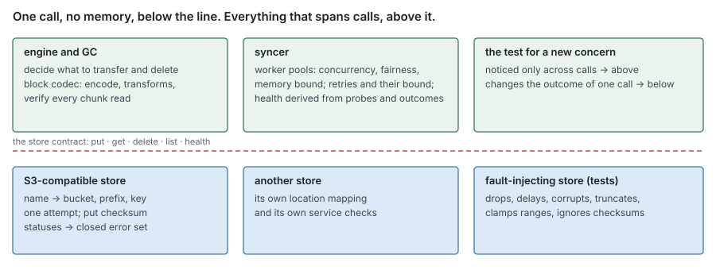
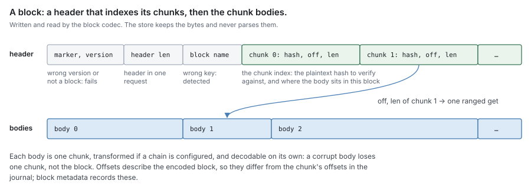
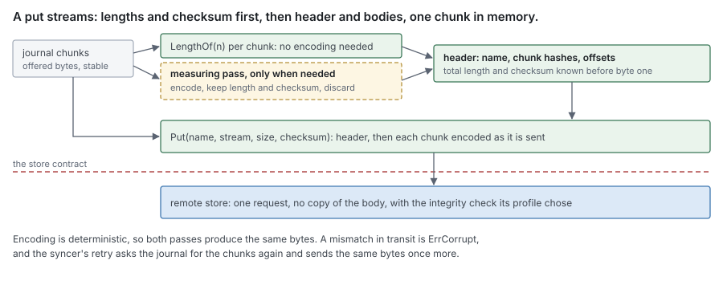

# RFC 4 — the remote block store: block format and store contract

**Audience:** anyone implementing a remote block store, or reading or writing
blocks. Conventions and test tiers are in [the RFC index](rfc-index.md).

This document specifies behaviour, not the current code. Where the code differs,
[Appendix A](#Appendix%20A%20%E2%80%94%20where%20the%20current%20code%20differs) lists it for the refactor.

---

## In short

- A **block** is the unit the remote tier stores: a header that indexes its
  chunks, then the chunk bodies. The engine composes and encodes it; the store
  never parses it.
- A **remote block store** keeps encoded blocks by name. It has six operations:
  put a whole block, get a whole block or one byte range, delete, list, check
  health, close.
- The store makes one attempt per call and remembers nothing between calls; the
  syncer owns retries, concurrency and health state. The block codec verifies
  every chunk read.
- Each backend lists the service features it needs and, on opening, exercises
  every one against the real service, refusing to open if any is missing.

## 1. Purpose

Two things need specifying:

- **the block format**: what an encoded block looks like, so that everything
  reading or writing blocks agrees on it;
- **the store contract**: what any remote block store (S3-compatible, a
  filesystem, anything else) must do, so the syncer ([RFC 3](rfc-3-syncer.md)) and garbage
  collection ([RFC 9](rfc-9-gc.md)) can rely on it without knowing which store they hold.

### 1.1 Non-goals

This document **MUST NOT** be read as specifying:

- when to transfer, or what: that is offload and eviction policy ([RFC 0 §5.2](rfc-0-data-lifecycle.md#5.2%20Offload), [RFC 0 §8.1](rfc-0-data-lifecycle.md#8.1%20Evict));
- what to delete: that is sweep ([RFC 9](rfc-9-gc.md));
- concurrency, retry or health state: that is the syncer ([RFC 3 §2](rfc-3-syncer.md#2.%20What%20both%20halves%20obey));
- how a block's name is derived: that is [RFC 2 §4.2](rfc-2-carver.md#4.2%20A%20block);
- what compression and encryption do to a chunk: that is [RFC 5](rfc-5-transforms.md).

### 1.2 A contract, not a component

Each consumer declares, on its own side, the few methods it needs
([RFC 0 §1.2](rfc-0-data-lifecycle.md#1.2%20Component%20autonomy)). The syncer needs put, get and health; GC needs delete and
list, since its relocation reads and puts go through the syncer
([RFC 3 §1.3](rfc-3-syncer.md#1.3%20Interface)). This document fixes what those methods *mean*, once, so a narrow
interface never silently drops a guarantee. A backend implements the full
interface of [§4.1](#4.1%20Interface) and satisfies every narrow one structurally.

## 2. The dividing line

> **A store performs one operation on one block and remembers nothing between
> operations. Everything that spans operations belongs above it.**

The test for a new concern: if removing it would change the outcome of **one
call**, it belongs in the store; if it would only be noticed **across calls**, it
belongs above.

Both sides earn their place. The syncer exists so that concurrency, retry and
health logic are written once, independently of any particular store. The store
exists so that each service's quirks stay in one place, and so there is a seam
where tests can substitute a store that loses, corrupts, delays and
half-completes ([§7.2](#7.2%20Fault%20transport)).



| Concern | Store | Above the store |
| --- | --- | --- |
| Encoding, compression, encryption | none: receives and returns opaque bytes | block codec ([§3](#3.%20The%20block%20format), [RFC 5](rfc-5-transforms.md)), run by the engine and GC |
| Verifying chunk content | none | block codec, on every read ([§3.4](#3.4%20Every%20read%20is%20verified%20by%20the%20codec)) |
| Transport integrity | protects every put ([§4.3](#4.3%20Put%3A%20a%20whole%20block%2C%20checksummed%2C%20durable%20on%20success)) | none |
| Where a block lives in the service | maps name to location ([§4.2](#4.2%20Names%20in%2C%20locations%20kept%20inside)) | never sees a location |
| Retry | none: one attempt per call ([§4.9](#4.9%20No%20state%20across%20calls)) | syncer ([RFC 3 §2.4](rfc-3-syncer.md#2.4%20Every%20transfer%20terminates%2C%20and%20reports)) |
| An unknown outcome | reports it as a transient error | syncer resolves it as not durable ([RFC 3 §2.5](rfc-3-syncer.md#2.5%20An%20unknown%20outcome%20is%20not%20a%20success)) |
| Concurrency, fairness, memory bound | none | syncer's worker pools ([RFC 3 §2.1](rfc-3-syncer.md#2.1%20A%20worker%20pool%20is%20the%20only%20concurrency%20control)) |
| Connection pool size | derived from the pools at construction ([§4.10](#4.10%20The%20connection%20pool%20is%20derived%20from%20its%20callers)) | pool sizes |
| Health | one probe call ([§4.7](#4.7%20Health%20is%20one%20probe%20call)) | syncer's derived state, and refusing work ([RFC 3 §2.8](rfc-3-syncer.md#2.8%20An%20unhealthy%20store%20refuses%20work)) |
| Listing | walks every block once ([§4.6](#4.6%20List%20is%20a%20complete%2C%20resumable%20walk)) | GC decides what a listed block means ([RFC 9 §5](rfc-9-gc.md#5.%20Unrecorded%20objects)) |
| Deletion | deletes, idempotently ([§4.5](#4.5%20Delete%20is%20batched%20and%20idempotent)) | GC decides what to delete ([RFC 9](rfc-9-gc.md)) |

## 3. The block format

### 3.1 Who writes it

The **block codec** encodes and decodes blocks. The engine uses it when it
assembles a block ([RFC 8 §5.1](rfc-8-engine.md#5.1%20Blocks%20are%20assembled%20here%2C%20as%20a%20fold%20over%20the%20carver%27s%20output)), and GC uses it, through the syncer, when it relocates chunks
([RFC 9 §4.2](rfc-9-gc.md#4.2%20Read%20verified%2C%20name%20by%20content%2C%20put%2C%20then%20move)). The store receives the encoded bytes and returns them unchanged.

### 3.2 Layout

A block is a **header** followed by the **chunk bodies**, in order.

| Element | Where | Why it is there |
| --- | --- | --- |
| Format marker and version | first bytes | a reader built for another version, or handed something that is not a block, fails loudly instead of misparsing |
| Header length | first bytes | a reader fetches the whole header in one ranged request, rarely two |
| Block name, encoding generation, chain ID | header | a block served under the wrong key is detected instead of used. The name is the block's identity in block metadata too ([RFC 2 §4.2](rfc-2-carver.md#4.2%20A%20block)), so it links the stored bytes back to their record; the generation and chain ID are the name's inputs besides the hashes and the key scope, so a whole-block read can recompute it. |
| Chunk index | header | for each chunk: its plaintext hash, and the offset and length of its body. One chunk can then be read with one ranged request, without reading the others. |
| Chunk bodies | after the header | each chunk's bytes, transformed if a chain is configured ([§3.3](#3.3%20Transforms)) |

Three requirements on the layout:

- Each body **MUST** be decodable on its own, so one corrupt body loses one chunk,
  not the block.
- The header length **MUST** be bounded by a fixed maximum: the largest number of
  chunks a block may hold ([RFC 2 §5](rfc-2-carver.md#5.%20Packing%3A%20three%20rules%2C%20not%20a%20component)) times the size of one index entry. A reader
  rejects a larger declared length before allocating for it.
- The name **MUST** be known before encoding starts, because it is written into
  the header. [RFC 8 §5.4](rfc-8-engine.md#5.4%20A%20block%27s%20name%20is%20derived%20here%2C%20and%20checked%20before%20the%20put) derives it from the chunk hashes, which exist before
  any byte is encoded.

The header comes first, so every body's length is known before the first byte is
sent: from each transform's declared length, or from a measuring pass when the
chain cannot declare it ([§4.3](#4.3%20Put%3A%20a%20whole%20block%2C%20checksummed%2C%20durable%20on%20success)). Only the header and one chunk are held in memory.

The byte-level encoding is left to the codec: field widths, integer encoding and
field order are not part of this contract. Changing them is a migration ([§3.5](#3.5%20Format%20changes%20are%20migrations)).



### 3.3 Transforms

A chunk body **MAY** pass through a chain of transforms, such as compression and
encryption ([RFC 5](rfc-5-transforms.md)). Three rules hold for any chain:

1. **Decode inverts encode exactly.** For every chunk,
   `decode(encode(plaintext)) == plaintext`, byte for byte.
2. **Identity is over plaintext.** A chunk's hash and a block's name are
   functions of plaintext ([RFC 2 §4.1](rfc-2-carver.md#4.1%20A%20chunk), [RFC 2 §4.2](rfc-2-carver.md#4.2%20A%20block)). If they depended on
   transformed bytes, a compression level or key change would re-key the corpus
   and stop deduplication.
3. **The chain travels with the block.** How a body was transformed **MUST** be
   recoverable from the body itself ([RFC 5 §2.4](rfc-5-transforms.md#2.4%20Every%20body%20records%20what%20was%20applied)), not from configuration. Configuration describes
   the next write only; otherwise changing it would make stored data unreadable.

Transforms change body lengths, so a chunk's offset inside an encoded block
differs from its offset in the journal. That is expected: block metadata records
a chunk's offset in the encoded block, not in the journal ([RFC 6 §2.2](rfc-6-block-metadata.md#2.2%20Chunk)), and nothing
compares the two. Above the codec, behaviour **MUST NOT** differ with transforms
on or off, apart from these offsets and timing.


### 3.4 Every read is verified by the codec

The codec **MUST** check every chunk it returns against the plaintext hash the
caller expects, after undoing every transform, and **MUST** return an error rather
than unverified bytes. A whole-block read also recomputes the block's name from
the header's chunk hashes, encoding generation and chain ID, with its key scope
([RFC 2 §4.2](rfc-2-carver.md#4.2%20A%20block)), and checks it against the name it was fetched under. Comparing
the header's name field alone would accept a header whose index was altered.

No consumer reads block bytes except through the codec. Verification then happens
in one place, and every consumer (the engine's fetch, relocation, snapshot
verification) inherits it.

**A recorded position never goes stale.** One name is only ever stored as one
byte sequence ([§4.3](#4.3%20Put%3A%20a%20whole%20block%2C%20checksummed%2C%20durable%20on%20success)), so the position block metadata records for a chunk
([RFC 6 §2.2](rfc-6-block-metadata.md#2.2%20Chunk)) stays right for the life of the block. A ranged read that fails
verification, or runs past the end, is corrupt: the codec does not re-read the
header to look for the chunk elsewhere.

### 3.5 Format changes are migrations

A change to the layout **MUST** advance the version, and readers **MUST** accept
every version that may still be stored. Stored blocks are already durable and
have no rewrite point, so an incompatible reader fails at the next read, not at
the change.

## 4. The store contract

### 4.1 Interface

Signatures are indicative; the obligations in [§4.2](#4.2%20Names%20in%2C%20locations%20kept%20inside)–[§4.11](#4.11%20A%20store%20checks%20its%20service%20before%20it%20opens) are normative.

```go
// Name is a block's name (RFC 2 §4.2): derived from its chunk hashes, key scope,
// encoding generation and chain ID.
type Name [32]byte

// Checksum names the checksum a put carries up front, as the capability check
// chose it (§4.11), or None when the store verifies the service's digest instead.
type Checksum uint8

// Range is a byte range in an encoded block. The zero Range means the whole block.
type Range struct{ Off, Len int64 }

// Info describes one stored block, as a listing reports it.
type Info struct {
	Name    Name
	Size    int64     // GC reports the space an unrecorded block holds
	ModTime time.Time // when the service stored it; GC's age filter
}

type Store interface {
	// Checksum says which checksum Put needs before the first byte, if any.
	Checksum() Checksum

	// Put streams one whole encoded block of exactly size bytes, with sum when
	// Checksum is not None. It returns nil only once the block is durable.
	Put(ctx context.Context, name Name, body io.Reader, size int64, sum []byte) error

	// Get returns exactly the bytes of r, or of the whole block when r is the
	// zero Range. The reader yields exactly that many bytes or fails.
	Get(ctx context.Context, name Name, r Range) (io.ReadCloser, error)

	// Delete removes blocks, as many as the caller passes. It returns one
	// error per name, in order; nil means that block is gone. Deleting an
	// absent block succeeds.
	Delete(ctx context.Context, names []Name) []error

	// List yields every stored block once, in ascending name order, starting
	// after the given name (the zero Name starts at the beginning).
	List(ctx context.Context, after Name) iter.Seq2[Info, error]

	// Health makes one round trip that proves the store is reachable,
	// authorised and writable.
	Health(ctx context.Context) error

	// Close releases the client. Stores are shared across shares; only the
	// owner that opened one closes it.
	Close() error
}

// Errors: every failure wraps exactly one of these (§4.8).
var (
	ErrNotFound  = errors.New("remote: block not found")
	ErrInvalid   = errors.New("remote: invalid request")
	ErrDenied    = errors.New("remote: denied")
	ErrTransient = errors.New("remote: transient")
	ErrCorrupt   = errors.New("remote: corrupt in transit")
)
```

A backend is opened by its own constructor, which takes its settings, the pool
sizes ([§4.10](#4.10%20The%20connection%20pool%20is%20derived%20from%20its%20callers)) and a context, and runs the capability check ([§4.11](#4.11%20A%20store%20checks%20its%20service%20before%20it%20opens)) before it
returns.

### 4.2 Names in, locations kept inside

Callers name blocks; they never see where a block lives. The store maps a name to
its own location deterministically: a key, a path, whatever the service
addresses by; each backend profile states its mapping ([§5](#5.%20Backend%20profiles)). The location is
opaque above the store, and nothing records it, because the name and the store's
configuration always recompute it.

A store **MUST NOT** invent names, and **MUST NOT** store anything under its
configured namespace other than blocks and its own health and check objects.
Two stores **MUST NOT** share a namespace, since each would list the other's
blocks as its own ([RFC 9 §5.3](rfc-9-gc.md#5.3%20It%20runs%20only%20where%20the%20namespace%20is%20proven)).

### 4.3 Put: a whole block, checksummed, durable on success

- **A put stores a whole block.** There is no partial or appending put, and a put
  that does not complete **MUST NOT** leave the block readable ([RFC 3 §3.4](rfc-3-syncer.md#3.4%20One%20put%20per%20block)).
- **The body is a stream of known length.** The caller hands over a reader and
  the block's exact size, header first, then each chunk encoded as it is read
  ([§3.2](#3.2%20Layout)). No one holds the whole block: not the caller, not the store, and
  not a file on disk. The store reads the stream once; a retry is the syncer's,
  which streams the block again from the journal ([RFC 3 §2.4](rfc-3-syncer.md#2.4%20Every%20transfer%20terminates%2C%20and%20reports)).
- **The size, and a checksum when needed, come before the first byte.** Each
  transform declares the exact length it will produce for an input, when it can
  know it without encoding ([RFC 5 §3.1](rfc-5-transforms.md#3.1%20Interfaces)). When every transform in the chain can,
  and the store needs no up-front checksum, the lengths come from those
  declarations and the block is encoded once, while it is sent. Otherwise the
  engine runs a **measuring pass** first: it encodes each chunk, keeps only its
  length and folds it into the checksum, and discards the bytes; then it encodes
  again while sending. The two passes produce the same bytes, because encoding is
  deterministic ([RFC 5 §2.1](rfc-5-transforms.md#2.1%20A%20transform%20acts%20on%20one%20chunk)). The checksum covers the header, which is built only
  once every length is known: a checksum that can be combined from parts
  (CRC32C) is taken per body and joined to the header's, and one that cannot
  (MD5) needs a second measuring pass when the lengths also had to be measured.
- **A put is verified in transit.** Either the service checks the body against a
  checksum the store sends and refuses a mismatch, or the service reports a digest
  of what it stored and the store compares it with the one it computed while
  streaming. Either way a mismatch returns `ErrCorrupt`, and the syncer's retry
  puts the same bytes again. Without this, bytes corrupted in transit are found
  only at a later read, possibly after the journal released its copy. Which
  mechanism a service supports is the backend profile's to find out ([§5](#5.%20Backend%20profiles)); a
  service offering neither is refused.
- **Success means durable.** Every store is durable: `nil` from `Put` means the
  block survives the loss of this machine. A service that acknowledges before
  that point is not admitted, and there is no setting that marks a store as
  non-durable.
- **One name is one byte sequence.** The name covers everything that decides a
  body's length ([RFC 2 §4.2](rfc-2-carver.md#4.2%20A%20block)), and encoding is deterministic, so every put of a
  name writes the same bytes. The writer checks block metadata for the name
  before putting and skips the put when the block is already recorded
  ([RFC 8 §5.1](rfc-8-engine.md#5.1%20Blocks%20are%20assembled%20here%2C%20as%20a%20fold%20over%20the%20carver%27s%20output)). A put under an existing name therefore arises only from a retry
  after an unknown outcome ([RFC 3 §2.5](rfc-3-syncer.md#2.5%20An%20unknown%20outcome%20is%20not%20a%20success)), or from two passes that both missed that
  check, and it rewrites identical bytes: positions recorded from either put stay
  right.

  > decision: an overwrite *intends* identical bytes, but bytes corrupted in
  > transit are caught before storage only by a service that checks the put's
  > checksum. On a service that only reports a digest after storing, a corrupt
  > overwrite of a block already committed stays until the syncer's retry
  > rewrites it; a crash before that retry leaves it corrupt, and reads report
  > the chunk corrupt. The window needs two passes to race past the pre-put
  > check and a transit error on the losing put. Withdraw this exemption, by
  > refusing digest-only services or making a service-checked put mandatory,
  > if a digest-only service is ever observed corrupting a put.

A store **MUST NOT** require a conditional put (put-if-absent): services that
claim the same protocol differ on it ([Appendix B](#Appendix%20B%20%E2%80%94%20measurements)). Doing without it rests on
content-derived names, on the pre-put check above, and on GC's deletion fence,
which keeps a put from re-creating a block while GC deletes it
([RFC 9 §3.4](rfc-9-gc.md#3.4%20A%20retired%20key%20is%20not%20re-created%20underneath%20its%20delete)).



### 4.4 Get: a whole block or one range, exactly

A get returns exactly the bytes asked for, or an error. There is no third outcome:

- a range that extends past the end of the block **MUST** fail with `ErrInvalid`,
  not return fewer bytes. Some services clamp such a range silently ([Appendix B](#Appendix%20B%20%E2%80%94%20measurements)), so the store
  **MUST** check the length it received against the length it asked for;
- a body that ends early **MUST** fail with `ErrTransient`;
- an absent block **MUST** fail with `ErrNotFound`.

The caller merges ranges that are adjacent in the block into one request, which
is why a get takes one range and not a list. Where the service returns a checksum
for what it sent, the store **SHOULD** check it. The codec's hash check ([§3.4](#3.4%20Every%20read%20is%20verified%20by%20the%20codec))
remains the one that decides.

### 4.5 Delete is batched and idempotent

`Delete` takes many names in one call, because sweep deletes blocks by the
thousand and a request per block would make the request count, not the service,
the limit: at the one second per request measured on one service ([Appendix B](#Appendix%20B%20%E2%80%94%20measurements)),
a million blocks is a million seconds of requests one at a time and a thousand
requests in batches of a thousand. A single delete is a batch of one.

- **Each name succeeds or fails on its own.** A batch is not atomic, and the
  store returns one result per name. The caller clears whatever records it keeps
  for a name ([RFC 9 §3.2](rfc-9-gc.md#3.2%20A%20retirement%20not%20yet%20deleted%20is%20durably%20recorded)) only for names whose result is `nil`.
- **Deleting an absent block succeeds.** GC retries a delete after an unknown
  outcome and re-runs a pass after a crash; a delete that failed because it had
  already happened would turn recovery into an error.
- **A batch whose outcome is unknown fails every name in it** with
  `ErrTransient`. The retry is safe, since each delete is idempotent.
- **The store splits a batch** into as many service requests as its service's
  limit requires ([Appendix C.1](#C.1%20Required%20service%20features)), and a service without a batch operation deletes
  one name per request. The caller never needs to know the limit.

### 4.6 List is a complete, resumable walk

GC must find blocks that no record names: a put whose commit never landed leaves
one ([RFC 9 §5.1](rfc-9-gc.md#5.1%20How%20they%20arise)). Only the store can see those, so the contract includes a
listing. GC decides what a listed block means, and when it may be deleted
([RFC 9 §5](rfc-9-gc.md#5.%20Unrecorded%20objects)). No correctness depends on a listing: a block it misses is leaked
space, not lost data.

A listing:

- **MUST** yield exactly once every block that exists for the whole walk. A block
  put or deleted during the walk may or may not appear;
- **MUST** yield blocks in ascending name order and accept a starting point
  (`after`), so a walk interrupted by a crash or a cancelled context resumes where
  it stopped instead of restarting over millions of blocks;
- **MUST** report each block's size and the time the service stored it;
- **MUST** stop when the caller breaks out of the loop or cancels `ctx`;
- **MUST** skip an entry under the block namespace whose key is not a block name,
  and count it ([§4.12](#4.12%20What%20a%20store%20makes%20observable)). It does not guess what such an entry is.

Paging is internal. The store fetches pages as the caller iterates and holds at
most one page in memory.

### 4.7 Health is one probe call

`Health` makes one bounded round trip that proves the store can still do its job:
the service is reachable, the credentials are accepted, and the namespace is
writable. A probe that only proves the service answers can report healthy while
every put fails. The backend profile names the call ([§5](#5.%20Backend%20profiles)).

The store returns the probe's outcome and nothing else. It keeps no health
status. The syncer calls `Health` on an interval, derives healthy or unhealthy
from recent outcomes, and refuses work for an unhealthy store ([RFC 3 §2.8](rfc-3-syncer.md#2.8%20An%20unhealthy%20store%20refuses%20work)).

### 4.8 Errors are a closed set

Every failure **MUST** wrap exactly one error of [§4.1](#4.1%20Interface), and a caller **MUST
NOT** need to interpret a native error. A caller that has to recognise a
service's status codes contains a second store implementation, and gets wrong
whichever service it was not written against.

| Error | Meaning | What the caller does |
| --- | --- | --- |
| `ErrNotFound` | this block is absent; the store itself is fine | fails the read; the engine re-resolves the chunk ([RFC 8 §6.7](rfc-8-engine.md#6.7%20An%20absent%20object%20is%20re-resolved%20while%20its%20location%20moves)) |
| `ErrInvalid` | the request was wrong: a range past the end, or an operation the service does not support | fails the call; not retried |
| `ErrDenied` | the store refused, or does not exist: credentials, permissions, a missing bucket | fails the call; the syncer's health rules decide what follows ([RFC 3 §2.8](rfc-3-syncer.md#2.8%20An%20unhealthy%20store%20refuses%20work)) |
| `ErrTransient` | retrying may help: network, timeout, a server error, throttling, a short body | the syncer retries within its bound ([RFC 3 §2.4](rfc-3-syncer.md#2.4%20Every%20transfer%20terminates%2C%20and%20reports)) |
| `ErrCorrupt` | a put's checksum or digest mismatched in transit, or the codec's verification of a chunk failed ([§3.4](#3.4%20Every%20read%20is%20verified%20by%20the%20codec)) | a put is retried; a chunk that failed verification is corrupt and is not retried |

A local failure (the context cancelled, the body's reader failing) is returned
as itself. It is not the service's fault and does not count against the store's
health. A mismatching checksum the service returns with a get is
`ErrTransient`: the codec's hash check is the one that decides ([§4.4](#4.4%20Get%3A%20a%20whole%20block%20or%20one%20range%2C%20exactly)). The
syncer uses this set as it is, plus one error for material ([RFC 3 §1.3](rfc-3-syncer.md#1.3%20Interface)).

### 4.9 No state across calls

A store **MUST NOT** carry a retry loop, a circuit breaker, a health status, a
concurrency limit of its own or a queue. Each request makes one attempt; only a
batch delete makes more than one request per call ([§4.5](#4.5%20Delete%20is%20batched%20and%20idempotent)), and those run one
after another.

State below the syncer is invisible to it: a retry loop there multiplies with the
syncer's budget, a health flag can latch unobserved, a queue holds requests the
syncer cannot schedule or count. With one attempt per call, the syncer's bound ([RFC 3 §2.4](rfc-3-syncer.md#2.4%20Every%20transfer%20terminates%2C%20and%20reports)) is the only one.

### 4.10 The connection pool is derived from its callers

A store's client usually limits concurrent requests somewhere: connections per
host for HTTP/1.1, streams per connection for HTTP/2, an SDK's in-flight cap. A
request past that limit does not fail. It waits inside the client, where no
caller can see it. So:

- the limit **MUST** be derived at construction from the concurrency of
  everything that calls the store: the syncer's `upload_workers + fetch_workers`
  ([RFC 3 §2.10](rfc-3-syncer.md#2.10%20Two%20settings%2C%20and%20everything%20else%20fixed)), GC's delete and list bound ([RFC 9 §7.1](rfc-9-gc.md#7.1%20GC%20bounds%20its%20own%20work)), and one for the probe. A store
  has no connection setting of its own. Set below its callers it is a hidden
  second limit; set above them it is never reached;
- any client-wide cap on connections **MUST** be at least the same value, or it
  silently lowers the per-host one;
- idle connections kept for reuse **SHOULD** be sized the same way, so a
  connection released by one request is reused by the next rather than reopened
  with a new handshake.

[Appendix B](#Appendix%20B%20%E2%80%94%20measurements) measured both on loopback. A cap below the callers cut throughput 4×. A
small idle pool reopened 37 times more connections than needed, which cost
nothing on loopback; its cost over a WAN is not yet measured, hence **SHOULD**.

### 4.11 A store checks its service before it opens

Services that claim the same protocol differ on exactly the features this
contract relies on ([Appendix B](#Appendix%20B%20%E2%80%94%20measurements)). This contract does not list those features or
how to test them: they are specific to each backend and live in its profile
([§5](#5.%20Backend%20profiles)). It requires only that:

- each backend **MUST** declare, in its profile, the service features it needs
  to meet [§4.2](#4.2%20Names%20in%2C%20locations%20kept%20inside)–[§4.10](#4.10%20The%20connection%20pool%20is%20derived%20from%20its%20callers), and how each is verified;
- its constructor **MUST** verify them against the real service and refuse to
  open, naming every missing feature, if any is absent;
- a feature is verified by provoking what it exists to do and seeing it happen.
  A service accepting a request is not evidence that it honoured it.

The check runs whenever a store is opened, since an endpoint can be upgraded or
repointed between runs. It cleans up what it wrote; a failed cleanup is logged,
not fatal.

### 4.12 What a store makes observable

Every store exports the same metrics, labelled by store. A backend adds none of
its own, so a dashboard works for every backend. The codec's metrics are
exported by the codec, whichever store it reads from. Each event has one owner:
a verification is counted here, once, and neither the syncer nor the transforms
count it again ([RFC 3 §2.12](rfc-3-syncer.md#2.12%20What%20the%20syncer%20makes%20observable),
[RFC 5 §6](rfc-5-transforms.md#6.%20Observability)).

| Answers | Metric | Type |
| --- | --- | --- |
| calls, labelled `op` (`put`, `get`, `delete`, `list`, `health`) and `result` (`ok` or the error of [§4.8](#4.8%20Errors%20are%20a%20closed%20set)) | `dittofs_remote_requests_total` | counter |
| time per call, by `op` | `dittofs_remote_request_seconds` | histogram |
| bytes moved, by `op` | `dittofs_remote_bytes_total` | counter |
| connections opened; against requests, how well the pool reuses them ([§4.10](#4.10%20The%20connection%20pool%20is%20derived%20from%20its%20callers)) | `dittofs_remote_connections_opened_total` | counter |
| entries under the block namespace that are not blocks ([§4.6](#4.6%20List%20is%20a%20complete%2C%20resumable%20walk)) | `dittofs_remote_list_foreign_total` | counter |
| the last capability check, per feature: 1 if present ([§4.11](#4.11%20A%20store%20checks%20its%20service%20before%20it%20opens)) | `dittofs_remote_capability` | gauge |
| chunks the codec returned verified | `dittofs_codec_chunks_verified_total` | counter |
| blocks encoded with a measuring pass ([§4.3](#4.3%20Put%3A%20a%20whole%20block%2C%20checksummed%2C%20durable%20on%20success)); against blocks encoded, how often a put encodes twice | `dittofs_codec_measuring_passes_total` | counter |
| chunks that failed verification, labelled `kind` = `hash`, `name`, `version`, `malformed`. Any of these is an alert | `dittofs_codec_verify_failures_total` | counter |
| encode and decode time per block, by direction | `dittofs_codec_seconds` | histogram |

Logs: a refused open logs every missing feature at `Error`, once. `ErrCorrupt`,
a verification failure and a skipped foreign entry log at `Warn` with the block
name. Every other per-call outcome is a metric, not a log line, since the syncer
already logs what it does about it.

## 5. Backend profiles

Each backend has a profile: the service features it requires, how it maps the
contract onto its service, and the steps of its capability check ([§4.11](#4.11%20A%20store%20checks%20its%20service%20before%20it%20opens)). A
profile is an appendix, so this contract stays independent of any one service.
S3-compatible object storage, the primary backend, is profiled in
[Appendix C](#Appendix%20C%20%E2%80%94%20the%20S3-compatible%20block%20store).

## 6. Invariants

| # | Invariant |
| --- | --- |
| R1 | A block is interpretable from its own bytes: marker, version, name and index are in its header. |
| R2 | Every chunk returned by the codec was verified against its plaintext hash. |
| R3 | Decode inverts encode exactly; identity is over plaintext; the chain is recorded in the block. |
| R4 | The store never parses a block, and nothing above the codec observes a transform. |
| R5 | A put is whole, streamed at a length known before its first byte, checksummed, and `nil` only once durable. |
| R6 | A get returns exactly the requested bytes or an error. |
| R7 | Delete is idempotent per name, and reports per name. |
| R8 | A listing yields every block once, in order, resumably. |
| R9 | Every failure wraps one error of the closed set. |
| R10 | A store holds no state across calls and makes one attempt per call. |
| R11 | A store's client limits are derived from the worker pools. |
| R12 | A store does not open against a service missing a required feature. |
| R13 | Every put of one name writes the same bytes, so a recorded position never goes stale. |

## 7. Test plan and benchmarks

The set-wide test rules and tiers are in [the RFC index](rfc-index.md#Test%20tiers).

### 7.1 Conformance suite

One suite, run against every store implementation. Rows marked **T** need the
fault transport of [§7.2](#7.2%20Fault%20transport), and are skipped for a store without one (the
in-memory store).

| Section | Check | T |
| --- | --- | --- |
| [§4.3](#4.3%20Put%3A%20a%20whole%20block%2C%20checksummed%2C%20durable%20on%20success) | Put, then get whole: bytes equal. | |
| [§4.3](#4.3%20Put%3A%20a%20whole%20block%2C%20checksummed%2C%20durable%20on%20success) | A put cut off part-way through its stream: a get afterwards returns `ErrNotFound`, never a partial block. A stream shorter or longer than its declared size fails the put. | T |
| [§4.3](#4.3%20Put%3A%20a%20whole%20block%2C%20checksummed%2C%20durable%20on%20success) | A put of a new name through a transport that flips one byte fails with `ErrCorrupt`. Where the service checks the put, a get afterwards returns `ErrNotFound`; where the store compares the digest, the corrupt block exists until the retry, and a retry without the fault makes a get return the original bytes. | T |
| [§4.4](#4.4%20Get%3A%20a%20whole%20block%20or%20one%20range%2C%20exactly) | Get of each range inside the block returns exactly its bytes. A range starting past the end fails with `ErrInvalid`. | |
| [§4.4](#4.4%20Get%3A%20a%20whole%20block%20or%20one%20range%2C%20exactly) | A transport that clamps a range ending past the end: the get fails with `ErrInvalid`, never returns fewer bytes. | T |
| [§4.4](#4.4%20Get%3A%20a%20whole%20block%20or%20one%20range%2C%20exactly) | A transport that truncates a body: the get fails with `ErrTransient`. | T |
| [§4.5](#4.5%20Delete%20is%20batched%20and%20idempotent) | Delete a batch twice, including a never-written name: every result is `nil`. A batch of 2,500 (above the service's limit): every block gone. | |
| [§4.5](#4.5%20Delete%20is%20batched%20and%20idempotent) | A transport that fails one key inside a batch: exactly that name's result is an error, the others `nil`. A batch whose response is dropped: every result is `ErrTransient`. | T |
| [§4.6](#4.6%20List%20is%20a%20complete%2C%20resumable%20walk) | Write 2,500 blocks; list with pages of 1,000; stop after 1,200 and resume from the last name: every block seen exactly once, in order, with size and time. | |
| [§4.6](#4.6%20List%20is%20a%20complete%2C%20resumable%20walk) | Put a key that is not a block name under the block namespace: the listing skips it and counts it. Cancel mid-listing: iteration ends with the context's error. | |
| [§4.2](#4.2%20Names%20in%2C%20locations%20kept%20inside) | After the whole suite, list the store's raw namespace: nothing but blocks and check or health objects. | |
| [§4.8](#4.8%20Errors%20are%20a%20closed%20set) | For every failure the fault transport can produce, the error wraps exactly one sentinel and no service error type is reachable with `errors.As`. A cancelled context comes back as `context.Canceled`. | T |
| [§4.9](#4.9%20No%20state%20across%20calls) | One failing call makes exactly one request. | T |
| [§4.10](#4.10%20The%20connection%20pool%20is%20derived%20from%20its%20callers) | Construct with syncer pools of 8 and 8 and a GC bound of 4: every client limit is at least 21. | |
| [§4.11](#4.11%20A%20store%20checks%20its%20service%20before%20it%20opens) | Against each fault profile of [§7.2](#7.2%20Fault%20transport), open fails and names the missing feature. A cleanup that fails does not fail the open. | T |
| [§4.7](#4.7%20Health%20is%20one%20probe%20call) | Health fails while the namespace is read-only, and succeeds on the next call once write access returns. | |

The in-memory store **MUST NOT** be the only store these run against. It cannot
lose an acknowledged write, half-complete or delay.

### 7.2 Fault transport

A fault-injecting transport sits under a real store's client, at the request
level, and can, per request: drop it, delay it, fail it with a
chosen status and error code, truncate the response body, flip a byte in either
direction, clamp a range, ignore a checksum header, or pretend a bucket setting
(versioning, lifecycle rules) is on. Each failure the contract names can then be
produced without a misbehaving service.

It also emulates the service faults measured in [Appendix B](#Appendix%20B%20%E2%80%94%20measurements): a service that
ignores every put checksum, and one with versioning or an expiring lifecycle
rule, **MUST** make the capability check refuse. No real service is available
with those faults, so these profiles are the negative tests.

### 7.3 Codec tests

| Section | Check |
| --- | --- |
| [§3.3](#3.3%20Transforms) | Round-trip random chunk sets (1 byte to the chunk maximum) under every transform configuration: decode equals the input. |
| [§3.3](#3.3%20Transforms) | Encode under one transform configuration, change the configuration, decode: equal. |
| [§3.4](#3.4%20Every%20read%20is%20verified%20by%20the%20codec) | Flip every byte of an encoded block in turn: every read either fails or returns only chunks whose hash matched. |
| [§3.2](#3.2%20Layout) | Corrupt one body: every other chunk of the block still reads. |
| [§3.2](#3.2%20Layout) | A block fetched under a different name fails the name check. An unknown version fails with a version error, not a parse error. |
| [§3.2](#3.2%20Layout) | Fuzz the decoder: no panic, and no allocation larger than the fixed header maximum before the header is validated. |
| [§3.3](#3.3%20Transforms) | Run the engine's read and write tests with and without transforms: no difference observable apart from offsets and timing. |
| [§3.4](#3.4%20Every%20read%20is%20verified%20by%20the%20codec) | A ranged read at a wrong offset or length fails with `ErrCorrupt`, and nothing re-reads the header. |
| [§4.3](#4.3%20Put%3A%20a%20whole%20block%2C%20checksummed%2C%20durable%20on%20success) | Encode the same block twice, once from declared lengths and once after a measuring pass, under every transform configuration: the bytes, the header and the checksum are identical, and the declared size equals the bytes streamed. |
| [§3.5](#3.5%20Format%20changes%20are%20migrations) | A stored fixture of every released version decodes. |

### 7.4 Services

| Service | Expected | When |
| --- | --- | --- |
| In-memory store | passes the rows of [§7.1](#7.1%20Conformance%20suite) not marked T | every change |
| A local emulator of the remote service, current version, under the fault transport | passes [§7.1](#7.1%20Conformance%20suite) and the capability check | every change |
| Each supported production service ([Appendix B](#Appendix%20B%20%E2%80%94%20measurements)) | passes the capability check and [§7.1](#7.1%20Conformance%20suite) | nightly, in a disposable namespace |

A new service is supported once it passes the nightly row. Its results go into
[Appendix B](#Appendix%20B%20%E2%80%94%20measurements).

### 7.5 Benchmarks and targets

Run against the local emulator after merge and against a real service daily
([the RFC index](rfc-index.md#Test%20tiers)). Record the service, region, block size and pool sizes
with every result.

| Benchmark | Measures | Target |
| --- | --- | --- |
| Codec encode and decode, no transform | MB/s per core | within 10% of plaintext hashing on the same box: verification is its only per-byte cost |
| Put of one full block, 1 to N workers | MB/s at each step | at the service's saturation point, within 10% of the same curve measured with raw client calls; the pool-sizing tool uses this curve ([RFC 3 §2.11](rfc-3-syncer.md#2.11%20Pool%20sizes%20are%20measured%20once%2C%20by%20a%20tool)) |
| Ranged get of one chunk (4 KiB to 1 MiB) | requests, p50 and p99 latency | one request per chunk, and within 10% of a raw client call of the same size |
| Whole-block get | MB/s | within 10% of a raw client call |
| Put of one block with and without a measuring pass | MB/s | report; the gap is what the second encode costs |
| Steady load at a fixed pool size for 10 minutes | connections opened | no more than the pool size, plus one per connection the service closed (counted from the transport's close events) |
| Health probe | requests | exactly one |
| List of 100,000 blocks | requests, peak memory | one per page of 1,000, and at most one page held |

## 8. Decisions and open questions

Settled in this revision, with the evidence in [Appendix B](#Appendix%20B%20%E2%80%94%20measurements):

1. **Conditional put is not required** ([§4.3](#4.3%20Put%3A%20a%20whole%20block%2C%20checksummed%2C%20durable%20on%20success)): services that claim the same
   protocol disagree on whether they honour it.
2. **Put integrity comes from the service's check or the store's** ([§4.3](#4.3%20Put%3A%20a%20whole%20block%2C%20checksummed%2C%20durable%20on%20success)).
   Services disagree on which put checksum they enforce, and some enforce none,
   but every service measured returns a digest of the bytes it stored, so the
   store can verify what was stored.
3. **Health is a probe put**, not an existence check on the namespace ([§4.7](#4.7%20Health%20is%20one%20probe%20call)).
   It is the only one of the two that proves writability, at a cost comparable
   to the existence check.
4. **Versioning, object lock and expiring lifecycle rules are refused, not
   supported** ([Appendix C.1](#C.1%20Required%20service%20features)). Each stops sweep from freeing space or deletes
   durable blocks behind the store's back.

Settled with them:

5. **Request latency does not change the design.** A slow service needs more
   workers, and the sizing tool measures that on the host that will run it
   ([RFC 3 §2.11](rfc-3-syncer.md#2.11%20Pool%20sizes%20are%20measured%20once%2C%20by%20a%20tool)). The figure in [Appendix B](#Appendix%20B%20%E2%80%94%20measurements) is one host's path, recorded, not a
   property of the service.
6. **Probe cost is removed where it would matter.** One put per store every 5 s
   is 17,280 puts a day; at 10⁴ stores that is 2,000 puts a second of pure
   probing. A successful upload stands in for the probe, and stores sharing an
   endpoint, credential and bucket share one ([RFC 3 §2.8](rfc-3-syncer.md#2.8%20An%20unhealthy%20store%20refuses%20work)), so a busy installation
   sends almost none and an idle one sends one per bucket.

7. **What "durable" means is cited per service**, since no check can provoke a
   durability failure ([§4.3](#4.3%20Put%3A%20a%20whole%20block%2C%20checksummed%2C%20durable%20on%20success)). [Appendix C.1](#C.1%20Required%20service%20features) records, per measured service, when a
   put is acknowledged and across which failure domains. A storage class that
   keeps data in one failure domain is allowed: the capability check reports the
   class's failure domain at open and through health, and a deployment that
   configures such a class accepts what it promises.

Nothing is left open.

---

## Appendix A — where the current code differs

Descriptive, for the refactor, one line per requirement. None of it is a rule to
build around.

| # | The contract says | The implementation today |
| --- | --- | --- |
| A1 | The codec encodes blocks, with a header indexing every chunk ([§3](#3.%20The%20block%20format)) | each body carries its own small header, with no index up front |
| A2 | Every read is verified by the codec ([§3.4](#3.4%20Every%20read%20is%20verified%20by%20the%20codec)) | each consumer re-hashes on its own; relocation checks only a whole-block hash; an unverified range read is exported |
| A3 | One attempt per call ([§4.9](#4.9%20No%20state%20across%20calls)) | the client retries up to ten times with backoff |
| A4 | The connection pool is derived from the worker pools ([§4.10](#4.10%20The%20connection%20pool%20is%20derived%20from%20its%20callers)) | a fixed connection limit, shared by one syncer per share |
| A5 | A put is verified in transit ([§4.3](#4.3%20Put%3A%20a%20whole%20block%2C%20checksummed%2C%20durable%20on%20success)) | request checksums are disabled and no digest is compared |
| A6 | Health is a probe put ([§4.7](#4.7%20Health%20is%20one%20probe%20call)) | an existence check, which does not prove writability |
| A7 | A store checks its service before opening ([§4.11](#4.11%20A%20store%20checks%20its%20service%20before%20it%20opens)) | no capability check |
| A8 | Consumers declare narrow interfaces ([§1.2](#1.2%20A%20contract%2C%20not%20a%20component)) | GC and many other consumers take the whole store interface |
| A9 | The syncer's boundary is a component boundary ([§2](#2.%20The%20dividing%20line)) | the upload window and the fetch, health and prefetch logic live in different components |
| A10 | Block names are content-derived ([RFC 2 §4.2](rfc-2-carver.md#4.2%20A%20block)) | names are random, so a retried put after an unknown outcome leaves an orphan |
| A11 | Stores are tested against the service versions they claim to support ([§7.4](#7.4%20Services)) | one test suite pins an emulator version that ignores checksums and conditional puts, while others use a current one |

## Appendix B — measurements

Run on 2026-09-28 with aws-sdk-go-v2 (service/s3 v1.113.1), retries off. Where
the SDK might add or drop headers, a raw SigV4-signed request confirmed the
result. Scaleway Object Storage (`fr-par`) and Cubbit DS3 (`s3.cubbit.eu`) were
each tested in a disposable bucket, deleted afterwards; LocalStack ran in
Docker. MinIO could not be pulled in this environment and was not measured.

**Service semantics**

| Behaviour | Scaleway | Cubbit DS3 | LocalStack 4.13.1 | LocalStack 3.0 |
| --- | --- | --- | --- | --- |
| Put with `If-None-Match: *` on an existing key | `412`, original kept | **`200`, overwritten** | `412`, original kept | **`200`, overwritten** |
| 16 concurrent conditional puts to one new key | 1 succeeds, 15 get `412` | **all 16 succeed** | 1 succeeds, 15 get `412` | **all 16 succeed** |
| Put with a wrong `x-amz-checksum-crc32c` | `400 InvalidRequest`, nothing stored | **`200`, stored** | `400 BadDigest`, nothing stored | **`200`, stored** |
| Put with a wrong `Content-MD5` | **`200`, stored** | **`200`, stored** | `400 BadDigest`, nothing stored | `400 InvalidDigest`, nothing stored |
| Put with a wrong signed payload hash | **`200`, stored** | **`200`, stored** | — | — |
| ETag of a single-part put | MD5 of the stored bytes | MD5 of the stored bytes, also when a wrong `Content-MD5` was sent | — | — |
| Range `bytes=2-5` of a 10-byte object | `206`, 4 bytes | `206`, 4 bytes | — | `206`, 4 bytes |
| Range starting past the end | `416 InvalidRange` | `416 InvalidRange` | — | `416 InvalidRange` |
| Range `bytes=8-15` of a 10-byte object | **`206`, 2 bytes (clamped)** | **`206`, 2 bytes (clamped)** | — | `206`, 2 bytes |
| Range on an absent key | `404 NoSuchKey` | `404 NoSuchKey` | — | `404 NoSuchKey` |
| Delete of an absent key | `204` | success | — | `204` |
| `DeleteObjects` of 3 keys plus one never written | all 4 reported deleted, the 3 keys gone | same | — | — |
| 2,500 keys, pages of 1,000, resumed with `start-after` | each key once, ascending, `LastModified` present | same | — | same |
| `HeadBucket` / 0-byte put, median of 20 | 50 ms / 122 ms | 1.2 s / 945 ms | — | 2.5 ms / 2.7 ms |

**Connection pool** (net/http client against a local TLS server adding 20 ms per
request, 64 workers for 5 s each, 64 KiB responses)

| Client setting | Requests/s | New connections | p50 | p99 |
| --- | --- | --- | --- | --- |
| net/http default (idle per host 2, no cap) | 2,956 | 2,382 | 21 ms | 30 ms |
| idle 64, no cap | 2,817 | 64 | 22 ms | 33 ms |
| idle 64, cap 64 | 2,826 | 64 | 22 ms | 31 ms |
| idle 16, cap 16 | 695 | 16 | 91 ms | 118 ms |

On loopback a new TLS handshake is nearly free, which is why the default's churn
does not cost throughput here. The AWS SDK's own client keeps 10 idle
connections per host, not 2. The churn's cost over a WAN is not measured.

## Appendix C — the S3-compatible block store

S3-compatible object storage is the primary backend. This appendix is its
profile ([§5](#5.%20Backend%20profiles)): what it requires of the service, how it maps [§4](#4.%20The%20store%20contract) onto it, and
its capability check.

### C.1 Required service features

| Feature | Used for | Required behaviour | Verified |
| --- | --- | --- | --- |
| `PutObject`, single part | put, health | atomic replace; readers never see a partial object | from the service's documentation; it cannot be provoked |
| Put integrity: an enforced `x-amz-checksum-crc32c` or `Content-MD5`, or else an ETag equal to the MD5 of the stored bytes | put | a corrupted body is rejected, or detected from the ETag | check step 1 |
| `GetObject` with `Range` | get | `206` with the bytes asked for; `416` when the range starts past the end. A clamped overlong range is tolerated: the store checks lengths itself ([§4.4](#4.4%20Get%3A%20a%20whole%20block%20or%20one%20range%2C%20exactly)) | check step 2 |
| `DeleteObjects` (batch, up to 1,000 keys) with `Content-MD5` | delete | every key, absent ones included, listed as deleted; per-key errors reported per key | check step 3 |
| `ListObjectsV2` with `prefix`, `max-keys`, `start-after` | list | ascending key order, every key once across pages, `LastModified` present | check step 4 |
| `GetBucketVersioning` | open | versioning never enabled: no status in the reply. A `Suspended` bucket still keeps the versions written while it was on, and object lock requires versioning, so this one check covers both | check step 5 |
| `GetBucketLifecycleConfiguration` | open | no rule that expires or transitions objects under the store's prefix: expiry deletes durable blocks, and a transition to an archive class makes gets fail | check step 5 |

For the two bucket-setting calls, "no configuration" (`404` with the service's
not-found code) passes, `501 NotImplemented` passes (a service without the
feature cannot have it enabled), and `403` refuses: the credential must be
allowed to read both settings, or the check cannot tell.

**When a put is durable, per service.** Cited from each service's own
statement, not measured ([§8](#8.%20Decisions%20and%20open%20questions), item 7):

| Service | A `200` on put means | Failure domains |
| --- | --- | --- |
| Cubbit DS3 | every shard of the object's erasure code (N+K per site, across the redundancy class's sites) is stored | the sites of the bucket's redundancy class |
| Scaleway, Standard Multi-AZ | stored under the service's multi-zone redundancy | three availability zones, in regions that offer it |
| Scaleway, One Zone | stored under the service's single-zone redundancy | one availability zone: allowed, reported at open |

A service is added to this table before it is supported.

Not required: conditional put, multipart upload ([RFC 3 §3.4](rfc-3-syncer.md#3.4%20One%20put%20per%20block) rules it out), trailing checksums,
`HeadObject`, `HeadBucket`, `CopyObject`, bucket creation.

### C.2 Layout in the bucket

| Object | Key |
| --- | --- |
| a block | `<prefix>blocks/<name in lowercase hex>` |
| the health object | `<prefix>check/health` |
| capability-check objects | `<prefix>check/<random>/…` |

Block names are uniformly distributed hashes, so keys spread across the service's
partitions without a sharding scheme. A listing walks `<prefix>blocks/` only.
Several stores may share a bucket under different prefixes, never one prefix
([§4.2](#4.2%20Names%20in%2C%20locations%20kept%20inside)).

### C.3 How the contract maps to S3

| Contract | S3 |
| --- | --- |
| one attempt per call ([§4.9](#4.9%20No%20state%20across%20calls)) | SDK retries off (maximum attempts 1) |
| client configuration | the SDK's automatic request checksums off (`WhenRequired`), so the store sends exactly the integrity header its profile chose and nothing else. The capability check runs with this same configuration |
| connection pool ([§4.10](#4.10%20The%20connection%20pool%20is%20derived%20from%20its%20callers)) | `http.Transport`: `MaxConnsPerHost`, `MaxIdleConnsPerHost` and `MaxIdleConns` all set to the derived limit |
| put integrity ([§4.3](#4.3%20Put%3A%20a%20whole%20block%2C%20checksummed%2C%20durable%20on%20success)) | send the checksum header chosen by the check, computed by the measuring pass. If the service enforces none, `Checksum` is `None`: compute the MD5 while streaming, compare the returned ETag with it, and return `ErrCorrupt` on a mismatch; the retry puts the same bytes again |
| exact get ([§4.4](#4.4%20Get%3A%20a%20whole%20block%20or%20one%20range%2C%20exactly)) | compare `Content-Range` and the body's length with the request |
| `ErrNotFound` | `404 NoSuchKey` |
| `ErrInvalid` | `416`; a received length that differs from the request; `400` codes not listed elsewhere; `501` |
| `ErrDenied` | `401`, `403`, `404 NoSuchBucket`, `400 ExpiredToken`, `400 InvalidToken` |
| `ErrTransient` | `400 RequestTimeout`, `408`, `409 OperationAborted`, `429`, `500`, `502`, `503 SlowDown`, `504`, network errors, timeouts, short bodies |
| `ErrCorrupt` | `400 BadDigest`, `400 InvalidDigest`, `400 XAmzContentSHA256Mismatch`; the exact status and code the check recorded for its chosen checksum, only on puts that carried that checksum; an ETag mismatch; a mismatching response checksum |

`404 NoSuchBucket` is `ErrDenied`, not `ErrNotFound`: a missing bucket is the
store's failure, and reading it as a missing block would make every read
re-resolve its chunk ([RFC 8 §6.7](rfc-8-engine.md#6.7%20An%20absent%20object%20is%20re-resolved%20while%20its%20location%20moves)) and then report it absent, while the
store's health never counted the outage.

S3 throttles above a few thousand requests per second per key prefix and answers
`503 SlowDown`. That limit is the service's, not the client's: the store reports
it as `ErrTransient` and the syncer backs off.

### C.4 The capability check

The S3 profile's check ([§4.11](#4.11%20A%20store%20checks%20its%20service%20before%20it%20opens)). In a fresh `<prefix>check/<random>/`
namespace, with the production client configuration of [Appendix C.3](#C.3%20How%20the%20contract%20maps%20to%20S3), in order:

1. **Put integrity.** For `x-amz-checksum-crc32c`, then `Content-MD5`: put a small
   object with the correct value and expect success, then put another with a
   wrong value and expect a rejection with nothing stored. The first that passes
   both is the one the store sends, and the status and error code of its rejection
   are recorded for [§4.8](#4.8%20Errors%20are%20a%20closed%20set)'s `ErrCorrupt`. Scaleway, for one, rejects a wrong
   CRC32C with `400 InvalidRequest`, not `BadDigest`. If neither is enforced, put
   a known body with a wrong `Content-MD5` and expect `200` with an ETag equal to
   the MD5 of the body actually sent; that proves the ETag is computed from the
   stored bytes, not echoed. If that fails too, refuse.
2. Put a 10-byte object; get bytes 2–5 and expect exactly 4 bytes; get from
   offset 20 and expect `416`.
3. Batch-delete two keys that exist and one that was never written, and expect
   all three reported deleted and the two keys gone from a listing. A service that
   rejects the batch operation is recorded, and the store deletes one key per
   `DeleteObject` request instead.
4. Put three keys and list with `max-keys=1` using `start-after`; expect each key
   once, in order, with `LastModified`.
5. Read the bucket's versioning status and lifecycle rules, as [Appendix C.1](#C.1%20Required%20service%20features) states.
6. Delete what the check wrote.

Against the services of [Appendix B](#Appendix%20B%20%E2%80%94%20measurements), step 1 chooses CRC32C on Scaleway and LocalStack
4.13.1, `Content-MD5` on LocalStack 3.0, and the ETag on Cubbit DS3.
