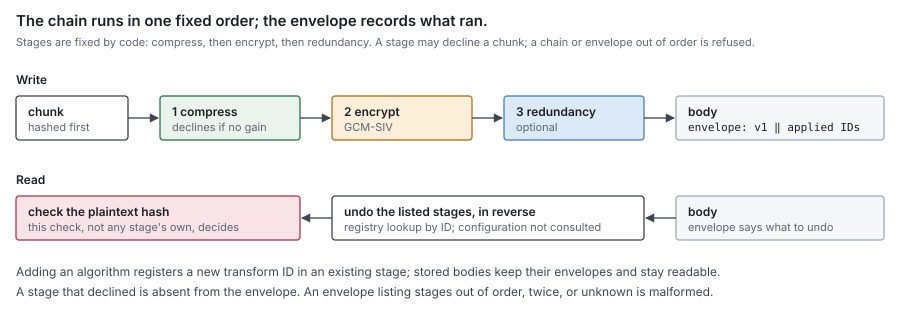
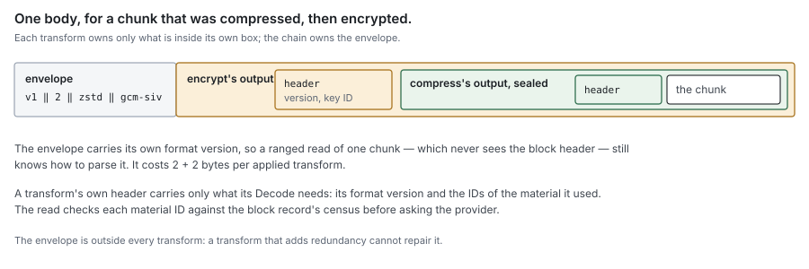

# RFC 5 — transforms

**Audience:** anyone writing a transform, configuring a store's transforms, or
deciding what a deployment that enables one is protected against. Conventions
and test tiers are in [the RFC index](rfc-index.md).

This document specifies behaviour, not the current code. Where the code differs,
[Appendix D](#Appendix%20D%20%E2%80%94%20where%20the%20current%20code%20differs) lists it for the refactor.

---

## In short

- A **transform** is an invertible function over one chunk's bytes: compression
  and encryption are the two that ship, and anyone can add another.
- A store's **chain** is the list of transforms its operator configures. The
  order is fixed in code — compress, then encrypt, then redundancy — and a
  configuration in any other order is refused.
- Every chunk body records which transforms were applied to it, so reading needs
  no configuration, and a transform may skip a chunk it cannot help.
- The chain runs inside the block codec ([RFC 4 §3](rfc-4-remote-tier.md#3.%20The%20block%20format)), per chunk, after the chunk's
  hash is taken and before the body is written. Nothing else sees it.
- After the chain is undone, the codec checks the plaintext hash. That check, not
  any transform's own, decides whether a chunk is correct.
- Encoding is deterministic within one put attempt, and the chain's identity, its
  **chain ID**, is part of every block name, so one name is always one byte
  sequence.

## 1. Purpose

Data leaving the machine may need to be smaller, secret, or both, and what "both"
means differs per deployment. This document specifies the generic mechanism: what
a transform is, how transforms are stacked and configured, where they run, and
what any transform must guarantee. Compression ([Appendix A](#Appendix%20A%20%E2%80%94%20compression)) and encryption
([Appendix B](#Appendix%20B%20%E2%80%94%20encryption)) are the two transforms that ship, and serve as worked
examples.

### 1.1 Non-goals

This document **MUST NOT** be read as specifying:

- the block format, the chunk index or where a body sits: [RFC 4 §3](rfc-4-remote-tier.md#3.%20The%20block%20format);
- a chunk's hash or a block's name: [RFC 2 §4](rfc-2-carver.md#4.%20Identity). A transform never changes either;
- when a chunk is encoded, or whether a block is relocated: [RFC 8](rfc-8-engine.md) and [RFC 9](rfc-9-gc.md);
- protection of data in the journal, in metadata or on the wire to the remote
  store: those are disk, database and transport concerns.

## 2. The model

### 2.1 A transform acts on one chunk

A transform takes one chunk's bytes and returns one body, and can turn that body
back into the same bytes. It never sees a block, a file, an offset or another
chunk. Within that, it may do anything: make the body smaller (compression),
unreadable (encryption), larger (padding, parity for error correction), or
anything else invertible.

Per-chunk scope is what keeps ranged reads working: a get for one chunk's body
([RFC 4 §4.4](rfc-4-remote-tier.md#4.4%20Get%3A%20a%20whole%20block%20or%20one%20range%2C%20exactly)) returns something the chain can undo on its own, without the rest of
the block. It also means one corrupt body loses one chunk.

A transform **MUST** be:

- **invertible**: `Decode(Encode(p)) == p`, byte for byte, for every input,
  including inputs chosen to look like the transform's own output. A lossy
  transform is not a transform;
- **self-contained**: everything `Decode` needs is in the body it wrote, apart
  from **material** held outside it: a key, a dictionary, any versioned input the
  transform names by ID ([§2.5](#2.5%20Reading%20needs%20no%20configuration%2C%20only%20material));
- **size-bounded**: it declares `MaxEncodedLen(n)`, the largest body it can
  produce from `n` bytes, and never exceeds it. `Decode` **MUST NOT** allocate or
  produce more than the `max` it is given, however large a body claims its output
  to be;
- **stateless per call**: safe to call concurrently, with no memory between calls
  other than read-only configuration and material;
- **deterministic**: `Encode` of the same input, with the same settings,
  material and format version, returns the same body every time. Anything that
  would otherwise be random, such as an encryption salt, is derived from the
  chunk's hash ([Appendix B.1](#B.1%20How%20a%20chunk%20is%20encrypted)). What correctness needs is narrower: a block's
  name is minted fresh for each put attempt ([RFC 2 §4.2](rfc-2-carver.md#4.2%20A%20block)), and within that
  attempt the measuring pass, the put and any retry of the put **MUST** produce
  the same bytes, so the positions planned by the first pass are the positions
  stored ([RFC 4 §4.3](rfc-4-remote-tier.md#4.3%20Put%3A%20a%20whole%20block%2C%20checksummed%2C%20durable%20on%20success)). Two attempts, or two builds, need not agree for any name
  to stay right; the transform's fixtures ([§4](#4.%20Writing%20a%20custom%20transform), item 7) still hold its
  output fixed across builds within one format version;
- **honest about length**: `LengthOf(n)` returns the exact body length for an
  `n`-byte input and whether that is known without encoding. Encryption, parity
  and the identity know it; compression does not. When every transform in the
  chain knows it, a put is encoded once; otherwise it takes a measuring pass
  ([RFC 4 §4.3](rfc-4-remote-tier.md#4.3%20Put%3A%20a%20whole%20block%2C%20checksummed%2C%20durable%20on%20success)).

A transform **MAY** decline a chunk: compression declines one that would not
shrink. A declined chunk passes to the next transform unchanged, and the body
records that the transform was not applied ([§2.4](#2.4%20Every%20body%20records%20what%20was%20applied)).

What does not fit, by design: a transform that loses information, one that needs
another chunk (delta encoding against a neighbour), and one that turns a chunk
into several bodies stored in different places (erasure coding across failure
domains). The last belongs to the store layer, as a store that spreads shards
over several backends, not to the chain.

Nor does encryption meant to be computed on, such as homomorphic encryption. Its
point is to let a party without the key compute on ciphertext, and no such party
exists here: the remote store only keeps bytes, and every computation on content
happens in the process that holds the keys. Its schemes are also randomised by
construction and expand data by orders of magnitude, against determinism and a
bounded `MaxEncodedLen`. A design in which the store computes on content is a
different architecture, not a transform.

### 2.2 Where it runs

The chain runs inside the block codec, which the engine owns ([RFC 4 §3.1](rfc-4-remote-tier.md#3.1%20Who%20writes%20it)).



- The hash is taken over plaintext **before** the chain, so identity never
  depends on a transform's settings, material or library version ([RFC 4 §3.3](rfc-4-remote-tier.md#3.3%20Transforms)).
- The hash is checked **after** the whole chain is undone ([§2.6](#2.6%20The%20plaintext%20hash%20is%20the%20final%20check)).
- Every consumer of block bytes goes through the codec, so every consumer gets
  the chain: the engine's reads and writes, and GC's relocation, which re-encodes
  under the current chain ([§5.2](#5.2%20Relocation%20re-encodes)).

The syncer and the remote store never see a transform. Apart from the byte
offsets a transform changes, nothing above the codec behaves differently with a
chain on or off.

### 2.3 The chain order is fixed

Every transform declares one **stage**, and the stages run in one order, fixed in
code:

| Stage | Transforms | Why there |
| --- | --- | --- |
| 1. compress | compression | needs the plaintext's redundancy |
| 2. encrypt | encryption | covers everything before it |
| 3. redundancy | parity | protects the stored bytes, so it must see them last |

A chain holds at most one transform per stage. `Encode` runs them in stage order
and `Decode` in reverse. A configuration that lists transforms out of stage
order, two in one stage, or one transform twice **MUST** be refused when the
chain is built ([§2.7](#2.7%20Failures)); the system never reorders it silently. A custom
transform ([§4](#4.%20Writing%20a%20custom%20transform)) declares one of these stages.

Every other order is at best ineffective — compressing after encrypting saves
nothing, parity before encryption cannot repair what a flipped ciphertext bit
breaks — and none is worth a configuration surface or the tests to cover it.

The envelope ([§2.4](#2.4%20Every%20body%20records%20what%20was%20applied)) and the registry ([§2.5](#2.5%20Reading%20needs%20no%20configuration%2C%20only%20material)) stay: they are what
lets a transform be skipped per chunk, and what lets an algorithm be replaced by
another in the same stage ([§5.4](#5.4%20Changing%20an%20algorithm%20is%20adding%20a%20transform)).

### 2.4 Every body records what was applied

Each body starts with a short **envelope**: its own version, then, in order, the
IDs of the transforms that were applied to it:

```
body = envelope version (1 byte) ‖ count (1 byte) ‖ transform ID (2 bytes) × count ‖ output of the last applied transform
```

This is what makes the chain self-describing, per chunk, independently of
configuration:

- a declined transform is simply absent from the list;
- the list, not each transform, says whether a transform ran, so no transform
  needs a marker of its own and no input can be mistaken for a transform's output;
- a reader undoes exactly the listed transforms, whatever the chain is configured
  to do now.

A transform **MAY** still write a header of its own inside its output: its
format version, and the IDs of the material it used. The envelope costs 2 + 2n
bytes per chunk.

The envelope carries its own version because a ranged read of one chunk's body
([RFC 4 §4.4](rfc-4-remote-tier.md#4.4%20Get%3A%20a%20whole%20block%20or%20one%20range%2C%20exactly)) never sees the block header, and so cannot learn the block format
version from it. A new envelope layout is a new envelope version; a reader keeps
decoding every version it may still meet, and rejects a version it does not know
with `ErrMalformed`. Version 1 is the layout above.



A reader **MUST** reject with `ErrMalformed`, before decoding anything, an
envelope with an unknown version, or one that lists an unregistered ID, the same
ID twice, two IDs of one stage, or IDs out of stage order ([§2.3](#2.3%20The%20chain%20order%20is%20fixed)). An
envelope therefore lists at most one transform per stage. Otherwise a bucket
writer could wrap a body in hundreds of layers that each decode correctly and
cost a full decode on every read.

The envelope is outside every transform, so a redundancy transform cannot repair
it: a damaged envelope fails the chunk loudly, as it would without one. Giving
the envelope its own protection is deferred until a redundancy transform ships.

### 2.5 Reading needs no configuration, only material

Every transform compiled into the binary is registered by its ID at start, and
`Decode` looks transforms up by the IDs in the envelope, not in the configured
chain. For each store, the registry builds every transform once for decoding,
with its default settings and the store's material.

**Material is configured on the store, apart from the chain** ([§3.2](#3.2%20Configuration)). A
material provider holds it by kind (`key`, `dictionary`, whatever a transform
declares) and ID. Removing a transform from the chain therefore stops it for new
writes but keeps its material, and bodies written under it stay readable.
Removing material is a separate act, allowed only once the census shows nothing
uses it and no encode in flight is using it ([§5.3](#5.3%20Retiring%20material%20or%20a%20transform%20needs%20a%20census)).

**Material carries a fingerprint.** Each piece of material is stored with its ID
and a **fingerprint** of its content, `HMAC-SHA256(material, "dittofs key check
v1")`. The provider **MUST** refuse to serve an ID whose material no longer
matches its recorded fingerprint — a key file replaced under the same ID, a key
service returning a different key — and reports it as `ErrMaterialUnavailable`
with a health condition: the right material may come back, and decoding with the
wrong one would only turn every body under it into a verification failure.
Everything that names material outside the provider names it by (ID,
fingerprint): the chain ID ([§2.8](#2.8%20The%20chain%20ID)), the census ([§5.3](#5.3%20Retiring%20material%20or%20a%20transform%20needs%20a%20census)) and a namespace
export.

**A read asks only for material its block recorded.** The codec hands the chain
the block record's census ([§5.3](#5.3%20Retiring%20material%20or%20a%20transform%20needs%20a%20census)), and `Decode` **MUST** check that every
material ID a body names appears there before asking the provider for it. An ID
that does not is `ErrMalformed`, without a provider call. Otherwise a bucket
writer could plant an ID in a body and send every read of it to a key service,
or turn a corrupt body into a remote that looks unavailable.

**Not every kind is consumed by a transform.** The provider also holds the
namespace's **chunking key** (kind `chunking-key`), which the carver consumes
for keyed boundaries ([RFC 2 §6](rfc-2-carver.md#6.%20Boundaries%20are%20public)), and its **header key** (kind `header-key`),
which seals the chunk hashes in block headers ([Appendix B.5](#B.5%20What%20a%20bucket%20reader%20still%20learns)). Both carry
fingerprints like any material, are carried in a namespace export with them, and
are checked against them at import.

**Material says what it is for.** A kind is specific to what consumes it — a key
for one cipher is not a key for another, whatever their lengths — so a transform
declares the kinds it accepts and **MUST** refuse, at construction, material of
any other kind. Handing one cipher's key to another is then a failure to start,
not a body written under a key used for two purposes.

Because reading does not consult the chain, a store accepts a body without a
transform its chain now applies: an old plaintext body after encryption was
turned on, for example. An operator who wants to refuse such bodies lists the
transform under `require`; a body missing a required transform is then
`ErrMalformed`. Turn it on only once the census shows no body lacks it.

An ID is assigned once and never reused ([§4](#4.%20Writing%20a%20custom%20transform)). A format change inside a
transform is a new version in that transform's own header, not a new ID, and the
transform **MUST** keep decoding every version it may still meet.

### 2.6 The plaintext hash is the final check

After the chain is undone, the codec compares the result with the chunk's
plaintext hash from block metadata ([RFC 4 §3.4](rfc-4-remote-tier.md#3.4%20Every%20read%20is%20verified%20by%20the%20codec)). That check decides; no
transform's own check stands in for it. An encryption tag proves a body was
sealed for that hash, not that decompression then reproduced it; a parity
transform that "repairs" a body can still repair it wrongly.

It also makes a tampered envelope harmless to integrity. Someone who can write
the bucket can strip a transform from an envelope or swap a body, but the result
must still hash to what local metadata expects, and producing that requires
knowing the plaintext already.

### 2.7 Failures

- **A chain that cannot be built is a construction failure.** If a store is
  configured with a transform that cannot start (an unknown name, bad settings,
  material it needs and cannot get), the store **MUST NOT** open, and **MUST
  NOT** fall back to writing without it. Writing plaintext because encryption
  failed to load is the failure this rule exists for.
- **`Decode` errors are one of four.**

  | Error | Meaning | Reported by the codec as |
  | --- | --- | --- |
  | `ErrMalformed` | the body is not something this transform wrote, fails its own integrity check, or names material the store never had or its block record does not list | `ErrCorrupt`: a verification failure of the chunk |
  | `ErrTooLarge` | the output would exceed `max` | `ErrCorrupt`: a verification failure of the chunk |
  | `ErrMaterialUnavailable` | material the store holds cannot be reached now | the remote being unavailable: retryable, never zeros, never an absent chunk ([RFC 0 §10](rfc-0-data-lifecycle.md#10.%20Failure%20model)) |
  | `ErrMaterialDestroyed` | material the store once held is gone for good | `ErrCorrupt`, and the chunk is **Lost** ([RFC 0 §4.2](rfc-0-data-lifecycle.md#4.2%20The%20residency%20function)); not retried |

  The distinctions matter. A material ID planted by a bucket writer must not
  turn a corrupt body into a remote that looks unavailable forever — which is
  why the census check of [§2.5](#2.5%20Reading%20needs%20no%20configuration%2C%20only%20material) runs before the provider is asked — and a key
  that is gone for good must not be retried forever as if it might return.
  `ErrCorrupt` is the remote store's ([RFC 4 §4.8](rfc-4-remote-tier.md#4.8%20Errors%20are%20a%20closed%20set)); `ErrMaterialUnavailable` is the
  one error the syncer adds to that set ([RFC 3 §1.3](rfc-3-syncer.md#1.3%20Interface)).
- **`Encode` errors** fail the put. A declined chunk is not an error.

A transform's own error types **MUST NOT** cross the codec. Callers see only the
codec's errors, so nothing above it can tell which transforms are configured.

### 2.8 The chain ID

A block's name includes a **chain ID** ([RFC 2 §4.2](rfc-2-carver.md#4.2%20A%20block)): a hash of everything in
the chain that decides a body's bytes or length, taken under its own versioned
domain, `transform chain id v1`, as the block name is ([RFC 2 §4.2](rfc-2-carver.md#4.2%20A%20block)). For each
configured transform, in order, it covers:

- the transform's ID and the format version it writes;
- its **length-affecting settings**: a compression level is one; a setting that
  changes only speed, such as a thread count, is not. Each transform declares
  which of its settings count;
- the (ID, fingerprint) of the current material it uses ([§2.5](#2.5%20Reading%20needs%20no%20configuration%2C%20only%20material)), so a key
  rotation changes the ID.

The stage order is fixed ([§2.3](#2.3%20The%20chain%20order%20is%20fixed)), so order is not an input of its own.

A block's name is not derived from its content alone: it also carries a
nonce minted fresh for each put attempt ([RFC 2 §4.2](rfc-2-carver.md#4.2%20A%20block)), so two writers of the
same chunks produce two names and two objects. The chain ID stays in the name
for what is left: an attempt fixes its chain when it starts, and the name it
mints records that chain, so one name is one layout even if the configuration
changes between the measuring pass and the put, and a recorded position never
goes stale ([RFC 4 §3.4](rfc-4-remote-tier.md#3.4%20Every%20read%20is%20verified%20by%20the%20codec)). The block header carries the chain ID with the nonce, so
a whole-block read can recompute and check the name. The chain ID is not needed
to decode: a body's envelope says how ([§2.4](#2.4%20Every%20body%20records%20what%20was%20applied)).

**Every layer carries its own version, so each can change alone.** A change is
made at one of five points, and each is read from the stored bytes, not from
configuration:

| What changes | Where its version is | What a change costs |
| --- | --- | --- |
| the block layout | the block header's format marker and version ([RFC 4 §3.2](rfc-4-remote-tier.md#3.2%20Layout)) | readers keep every stored version ([RFC 4 §3.5](rfc-4-remote-tier.md#3.5%20Format%20changes%20are%20migrations)); relocation rewrites old blocks when they are to go |
| the envelope layout | the envelope's own version byte ([§2.4](#2.4%20Every%20body%20records%20what%20was%20applied)), readable from a ranged get | readers keep every envelope version they may meet |
| one transform's output format | that transform's header ([§2.5](#2.5%20Reading%20needs%20no%20configuration%2C%20only%20material)) | the transform decodes every version it wrote |
| the algorithm | a new transform, with a new ID ([§5.4](#5.4%20Changing%20an%20algorithm%20is%20adding%20a%20transform)) | configuration, then retirement by census |
| how the chain ID, the block name or a key is derived | the versioned labels: `transform chain id v1`, the block name's domain ([RFC 2 §4.2](rfc-2-carver.md#4.2%20A%20block)), and each derivation label of [Appendix B.1](#B.1%20How%20a%20chunk%20is%20encrypted) | new names or keys for new blocks only; a stored block keeps its name, which is recorded, never recomputed to find it, and a body keeps the derivation its transform version names |

A golden test vector pins each derivation, as for the block name: a changed
vector fails the build.

## 3. API surface

### 3.1 Interfaces

Signatures are indicative; the obligations of [§2](#2.%20The%20model) are normative.

```go
// ID names a transform in every body it was applied to. Assigned once, never reused.
type ID uint16

// Stage is a transform's fixed place in every chain (§2.3).
type Stage uint8

const (
	StageCompress Stage = iota + 1
	StageEncrypt
	StageRedundancy
)

// Transform is one invertible, per-chunk step.
type Transform interface {
	ID() ID
	Stage() Stage

	// MaxEncodedLen is the largest body Encode can produce from n bytes.
	MaxEncodedLen(n int) int

	// LengthOf is the exact body length for n bytes, and whether it is known
	// without encoding. A declined chunk is never known in advance.
	LengthOf(n int) (int, bool)

	// LengthKey encodes, canonically, the format version and the settings
	// that decide the body's length: this transform's part of the chain ID.
	LengthKey() []byte

	// Encode transforms plain, deterministically (§2.1). Applied=false declines the
	// chunk: plain passes on unchanged. hash is the plaintext hash, for
	// transforms that bind to it or derive from it.
	Encode(ctx context.Context, dst []byte, hash [32]byte, plain []byte) (Encoded, error)

	// Decode inverts Encode. It never produces more than max bytes, and asks m
	// only for material the block's census lists (§2.5).
	Decode(ctx context.Context, dst []byte, hash [32]byte, body []byte, max int, m Materials) (plain []byte, err error)
}

// Encoded is one transform's output, and what the census records about it.
type Encoded struct {
	Body     []byte
	Applied  bool
	Version  uint8        // the transform's own format version
	Material []MaterialID // the material used, if any
}

// MaterialID names one piece of material of one kind: a key, a dictionary.
type MaterialID struct {
	Kind        string
	ID          string
	Fingerprint [32]byte // HMAC-SHA256(material, "dittofs key check v1") (§2.5)
}

// Materials holds a store's material. A transform asks it for what it needs.
type Materials interface {
	// Current is the material new bodies of this kind use.
	Current(ctx context.Context, kind string) (MaterialID, error)
	// Get returns material by ID: ErrUnknownMaterial for an ID the store never
	// had, ErrMaterialUnavailable for one it cannot reach now or whose content
	// no longer matches its fingerprint, ErrMaterialDestroyed for one it once
	// had and has lost for good.
	Get(ctx context.Context, id MaterialID) ([]byte, error)
	// Remove destroys material: it refuses while the material is current in
	// any open chain, waits for encodes in flight that hold it, then checks
	// the census, all under one fence (§5.3).
	Remove(ctx context.Context, id MaterialID) error
}

// Factory builds a transform from its settings and the store's material. It
// fails rather than returning a transform that cannot work.
type Factory func(ctx context.Context, settings map[string]any, m Materials) (Transform, error)

// Register makes a transform available for configuration and for decoding.
// Called at init; a duplicate ID panics.
func Register(id ID, name string, f Factory)

// Chain is a store's configured list of transforms.
type Chain struct{ /* ... */ }

// NewChain builds the configured transforms. It refuses a duplicate, two
// transforms of one stage, or a list out of stage order (§2.3).
func NewChain(ctx context.Context, cfg []Config, m Materials) (*Chain, error)

// MaxEncodedLen composes the transforms' bounds, in stage order, plus the
// envelope. It sizes writes.
func (c *Chain) MaxEncodedLen(n int) int

// MaxDecodeLen is the largest body any registered transforms could have
// written from n bytes, one per stage, plus the envelope. It sizes reads.
func MaxDecodeLen(n int) int

// LengthOf composes the transforms' LengthOf; false if any one is false.
func (c *Chain) LengthOf(n int) (int, bool)

// ID is the chain ID (§2.8), from each transform's ID, LengthKey and current material.
func (c *Chain) ID() [32]byte

// Encode writes the envelope and returns the body with one Encoded per applied
// transform, which the codec collects into the block's census (§5.3).
func (c *Chain) Encode(ctx context.Context, dst []byte, hash [32]byte, plain []byte) ([]byte, []Encoded, error)

// Decode undoes the envelope's transforms. census is the block record's
// (§5.3): a body naming material outside it is ErrMalformed.
func (c *Chain) Decode(ctx context.Context, dst []byte, hash [32]byte, body []byte, max int, census []Encoded) ([]byte, error)

type Config struct {
	Name     string         // a registered transform's name
	Settings map[string]any // passed to its Factory
}

var (
	ErrMalformed           = errors.New("transform: malformed body")
	ErrMaterialUnavailable = errors.New("transform: material unavailable")
	ErrMaterialDestroyed   = errors.New("transform: material destroyed")
	ErrTooLarge            = errors.New("transform: output exceeds its bound")
)
```

`Chain.Decode` uses the registry, not the configured list ([§2.5](#2.5%20Reading%20needs%20no%20configuration%2C%20only%20material)), so a chain
decodes what an older configuration wrote. It gives each step the chunk maximum
([RFC 2 §3.2](rfc-2-carver.md#3.2%20One%20setting%2C%20and%20the%20bounds%20derived%20from%20it)) passed through the `MaxEncodedLen` of the steps applied before it, so
a step that legitimately enlarges the body is not refused by the next one. `dst`
**MUST NOT** overlap the input; the result may be `dst` resliced or a new slice.
`ErrUnknownMaterial` from `Materials` is reported as `ErrMalformed`. The
`Materials` a transform's `Decode` receives is a view that answers only for the
material IDs in `census`, and returns `ErrUnknownMaterial` for any other.

Two bounds size everything downstream. `Chain.MaxEncodedLen` of the chunk
maximum bounds what this chain writes: the largest encoded block on a put. A
read may meet a body any earlier chain wrote, so the read side — the syncer's
memory bound ([RFC 3 §2.2](rfc-3-syncer.md#2.2%20The%20pool%20size%20is%20a%20memory%20bound)), the block header's bound ([RFC 4 §3.2](rfc-4-remote-tier.md#3.2%20Layout)) and the
per-body length check before allocating — uses `MaxDecodeLen`, the maximum over
every registered transform, never the current chain's bound. Removing parity
from a chain must not make the parity bodies still stored unreadable.

### 3.2 Configuration

A chain is part of a remote block store's configuration, which the control plane
holds ([RFC 13](rfc-13-configuration.md)); every share on that store inherits it. The engine reads the
record and builds the chain from it when it opens the store ([RFC 8 §2.4](rfc-8-engine.md#2.4%20Settings%20are%20validated%20once%2C%20and%20refused%20rather%20than%20replaced)). No
file on the host describes it. The record holds:

| Field | Meaning |
| --- | --- |
| `transforms` | the transforms, each a registered name and its settings, at most one per stage and listed in stage order ([§2.3](#2.3%20The%20chain%20order%20is%20fixed)) |
| `materials` | the material provider and how to reach it; a reference to secret material, never the material itself ([RFC 13](rfc-13-configuration.md)) |
| `require` | transforms every body must carry ([§2.5](#2.5%20Reading%20needs%20no%20configuration%2C%20only%20material)); optional |

A change to the record governs the next write only ([§5.1](#5.1%20Configuration%20governs%20the%20next%20write)).

A share that needs a different chain, or different master keys, uses a different
store. Within a store each namespace has its own data key ([Appendix B.2](#B.2%20Keys)), and
deduplication never spans namespaces ([RFC 2 §4.3](rfc-2-carver.md#4.3%20Key%20scope)), so it never spans two
data keys either: a chunk encrypted under one is readable only where that key is
held.

## 4. Writing a custom transform

A transform is compiled in and registers itself at start. It **MUST**:

1. take an ID from the range reserved for custom transforms (`0x8000`–`0xFFFF`;
   `0x0000`–`0x7FFF` is reserved for shipped ones) and never reuse it;
2. declare its stage ([§2.3](#2.3%20The%20chain%20order%20is%20fixed)), an honest `MaxEncodedLen` and `LengthOf`,
   encode deterministically, and put in `LengthKey` every setting that changes
   its output: [§8.1](#8.1%20Transform%20conformance) checks all of them;
3. give every value it derives from material its own versioned label, never
   shared with another derivation ([Appendix B.1](#B.1%20How%20a%20chunk%20is%20encrypted));
4. put a format version in its own header if its format can ever change, and
   decode every version it has written;
5. bound `Decode` by `max` before allocating;
6. return only the errors of [§2.7](#2.7%20Failures);
7. pass the transform conformance suite ([§8.1](#8.1%20Transform%20conformance)), and ship a fixture: inputs,
   settings, material and the bodies its first version wrote from them. Every
   later build **MUST** decode every fixture body, and **MUST** encode each
   fixture input to exactly its recorded body; an encoder whose output differs
   is a new format version of the transform, never a silent change.

Custom transforms are compiled in. Loading them at run time would put foreign
code in the data path with nothing to check it before it writes; revisit if an
operator needs one that is not built in.

## 5. Changing a chain over time

### 5.1 Configuration governs the next write

Adding, removing or re-configuring transforms changes only what is
written from then on. Every stored body keeps the envelope it was written with,
and [§2.5](#2.5%20Reading%20needs%20no%20configuration%2C%20only%20material) keeps it readable as long as its material is held.

### 5.2 Relocation re-encodes

GC relocation reads chunks through the codec and writes them into a new block
under the current chain ([RFC 9 §4.2](rfc-9-gc.md#4.2%20Read%20verified%2C%20mint%2C%20put%2C%20then%20move)). This is how old bodies migrate to a new chain:
each relocated chunk leaves its old transforms, and its old material, behind. A
relocation that copied bodies unchanged would keep every retired key in use for
as long as its chunks live.

### 5.3 Retiring material or a transform needs a census

To stop holding material, or to stop compiling a transform in, no stored body may
still need it. That takes a **census**: which blocks use which transform, version
and material.

- **It is written with the block.** The codec collects the `Encoded` descriptors
  of every body ([§3.1](#3.1%20Interfaces)). The engine's `Store` returns the distinct ones with the
  put, beside the chunk ranges ([RFC 3 §1.3](rfc-3-syncer.md#1.3%20Interface)), and the block's commit records
  them in the block record ([RFC 6 §2.3](rfc-6-block-metadata.md#2.3%20Block)). A block's census never changes, since
  a block is never re-encoded in place.
- **It counts every block record until it is pruned**, `retired` and `deleted`
  ones included. A retired block can be resurrected by an adoption and read
  again ([RFC 9 §3.3](rfc-9-gc.md#3.3%20Adoption%20resurrects%20a%20retired%20block)), so its material is still needed; a `deleted` one cannot,
  but is counted until its prune so the census never depends on timing. To empty
  a census, compaction moves the live blocks, and the retention of their retired
  sources is waited out or those sources are recounted and moved too.

> [!important] Pending review — the census counts retired blocks
> Because a retired block can come back to life, material is in use until every
> block that names it is pruned, not only until it retires.
- **Retirement is ordinary relocation.** GC lists the blocks whose census names
  what is being retired and relocates each ([RFC 9 §4.2](rfc-9-gc.md#4.2%20Read%20verified%2C%20mint%2C%20put%2C%20then%20move)): its chunks are
  re-encoded under the current chain into a block under a freshly minted name
  ([RFC 2 §4.2](rfc-2-carver.md#4.2%20A%20block)); the chunks move and the move retires the source. Retirement
  relocates a block even when it is fully live, the one exception to
  [RFC 9 §4.4](rfc-9-gc.md#4.4%20When%20to%20compact%20is%20policy).
- **Removal waits for an empty census, and for encodes in flight.** A census
  says only what committed blocks use; a put already encoding under the
  material commits a block the census does not yet show. So removal, under one
  fence against new encodes, **MUST** first make sure the material is current in
  no open chain, then wait for every encode in flight that took it, and only then
  check that the census is empty. An encode that starts after the fence finds the
  material not current and cannot take it. Removed material is destroyed: the
  provider keeps its ID and reports it `ErrMaterialDestroyed` ([§2.7](#2.7%20Failures)).

### 5.4 Changing an algorithm is adding a transform

A transform ID names an algorithm and its body format, not a library. So:

- **A new algorithm is a new transform.** Moving from AES-256-GCM-SIV to another
  deterministic AEAD — AES-SIV, or one standardised later — registers a
  transform with a new ID, in the same stage, and its own material kind. The move is then [§5.1](#5.1%20Configuration%20governs%20the%20next%20write)
  and [§5.3](#5.3%20Retiring%20material%20or%20a%20transform%20needs%20a%20census): put it in the chain, and old bodies stay readable through their
  envelopes until relocation retires the old transform.
- **A new library for the same algorithm is not a change.** Replacing the
  library that implements AES-256-GCM-SIV keeps the ID, provided it produces
  identical bodies. The transform's fixtures ([§4](#4.%20Writing%20a%20custom%20transform), item 7) decide, and a library
  that fails them is a new format version or a new transform, never a silent
  swap.
- **Post-quantum.** The chain's symmetric primitives — a 256-bit cipher key, and
  HMAC and HKDF over SHA-256 — keep a security margin against quantum search
  that is the recommended posture, and need no change. The quantum exposure is
  in how master keys reach the process: a key service's transport and key
  wrapping, which are the material provider's ([Appendix B.2](#B.2%20Keys)). A provider that
  moves to a post-quantum key encapsulation changes nothing in stored bodies.

## 6. Observability

Each transform is labelled by its name. A custom transform gets these metrics
without writing any: the chain exports them around each call.

| Answers | Metric | Type |
| --- | --- | --- |
| chunks encoded, labelled `applied` = `true` or `false` | `dittofs_transform_chunks_total` | counter |
| bytes in and out, labelled `direction` = `encode` or `decode`; their ratio is what the transform costs or saves | `dittofs_transform_bytes_total` | counter |
| time per call, by direction | `dittofs_transform_seconds` | histogram |
| decode failures, labelled `error` = `malformed`, `material_unavailable`, `material_destroyed` or `too_large`. `malformed` and `material_destroyed` are alerts | `dittofs_transform_decode_failures_total` | counter |
| bodies written per transform ID, version and material ID, from block metadata ([§5.3](#5.3%20Retiring%20material%20or%20a%20transform%20needs%20a%20census)) | `dittofs_transform_census_blocks` | gauge |

A chain that fails to build logs the transform and the reason at `Error` and
refuses the store ([§2.7](#2.7%20Failures)). A transform logs nothing per chunk: its outcomes
are metrics. A transform with outcomes of its own exports them under its name, as
encryption does ([Appendix B.6](#B.6%20What%20it%20adds%20to%20observability)) and a parity transform would with a count of
repaired bodies ([Appendix C](#Appendix%20C%20%E2%80%94%20example%2C%20a%20parity%20transform)). A transform that earns nothing shows here: a
compressor whose `applied=false` share is near 100%, or a repair count that
never moves.

## 7. Invariants

| # | Invariant |
| --- | --- |
| T1 | A transform never changes a chunk's hash or a block's name, and never sees more than one chunk. |
| T2 | `Decode(Encode(p)) == p` for every input. |
| T3 | Every body lists the transforms applied to it; reading needs the registry and material, never the configured chain. The one exception is `require` ([§2.5](#2.5%20Reading%20needs%20no%20configuration%2C%20only%20material)), which can only refuse a body, never change how one decodes. |
| T4 | No body exceeds its transform's `MaxEncodedLen`, and no step of `Decode` produces or allocates more than the bound the chain gives it. |
| T5 | A store whose chain cannot be built does not open, and never writes without its chain. |
| T6 | The plaintext hash is checked after the whole chain is undone, before any byte is returned. |
| T7 | A material failure is never zeros and never an absent chunk: unavailable material is the remote being unavailable, destroyed material makes the chunk Lost. |
| T8 | No transform error type crosses the codec. |
| T9 | Within one put attempt, `Encode` returns the same bytes on every call; within one format version, it returns each fixture's recorded body. `LengthOf`, when it answers, is exact. |
| T10 | The chain ID changes whenever a body's bytes or length could; nothing else changes it. |
| T11 | A chain and an envelope list at most one transform per stage, in stage order; anything else is refused. |
| T12 | A read asks the material provider only for material its block record's census lists, and the provider never serves material whose fingerprint no longer matches. |
| T13 | Material is destroyed only after it is current in no open chain, no encode in flight holds it, and the census is empty, checked under one fence. |

## 8. Test plan and benchmarks

The set-wide test rules and tiers are in [the RFC index](rfc-index.md#Test%20tiers).

### 8.1 Transform conformance

One suite that every registered transform passes, shipped ones and custom ones
alike. A new transform gets it by registering.

| Invariant | Check |
| --- | --- |
| T2 | Round-trip 10,000 inputs: random, all zeros, all one byte, 1 byte to the chunk maximum, and inputs that begin with this transform's own header and with any envelope. |
| T2 | Every body in the transform's fixture decodes to the recorded plaintext. |
| T4 | Fuzz `Decode`: no panic, and no allocation above `max` before the header is validated. A body declaring an output of `max + 1` fails with `ErrTooLarge`. |
| [§2.1](#2.1%20A%20transform%20acts%20on%20one%20chunk) | For every round-trip input, the body is no longer than `MaxEncodedLen(len(input))`, and an input built to hit the worst case reaches it. |
| concurrency | Encode and decode from 64 goroutines under the race detector: same results as sequential. |
| [§2.7](#2.7%20Failures) | Flip every byte of a body in turn: `Decode` returns an error of [§2.7](#2.7%20Failures) or bytes the codec's hash check rejects, and never panics. A transform that authenticates (encryption) **MUST** return `ErrMalformed` itself for every flip. |
| [§2.7](#2.7%20Failures) | For an authenticating transform: decode chunk A's body with chunk B's hash, and a body naming material the store never had: both `ErrMalformed`. A body naming destroyed material: `ErrMaterialDestroyed`. |
| T9 | Encode every round-trip input twice, and from two chains built from the same configuration: identical bodies. Where `LengthOf` answers, the body's length equals it. |
| T9 | Encode every fixture input with its recorded settings and material: exactly the recorded body. |
| [Appendix B.1](#B.1%20How%20a%20chunk%20is%20encrypted) | Two different chunks under one key get different salts; one chunk under two data keys gets two different bodies. Two different inputs under one plaintext hash (the same chunk compressed at two levels, or declined then compressed) encrypt to bodies that both decode and share no keystream: XOR of the two ciphertexts is not XOR of the two inputs. |
| [Appendix B.1](#B.1%20How%20a%20chunk%20is%20encrypted) | Every derivation label of Appendix B.1 is distinct, and each is pinned by a golden vector. |
| [§2.5](#2.5%20Reading%20needs%20no%20configuration%2C%20only%20material) | Replace a key under its ID with different bytes: the provider refuses it (`ErrMaterialUnavailable`, availability gauge 0), and no body is decoded or written with it. |
| [§3.1](#3.1%20Interfaces) | A transform that enlarges its input (a test transform adding 50%) before another: a chunk of exactly the maximum round-trips. |

### 8.2 Chain tests

| Invariant | Check |
| --- | --- |
| T11 | A chain listing transforms out of stage order, two of one stage, or one twice fails to build, and nothing is written. |
| T3 | Write under chain A, reconfigure to chain B (a transform removed, another added), read everything back. |
| T3 | A declined chunk's envelope omits the transform, and decodes. |
| T3 | Remove the encryption transform from the chain, keeping the store's material: every encrypted body still decodes. |
| [§2.4](#2.4%20Every%20body%20records%20what%20was%20applied) | Envelopes with an unknown version, an unregistered ID, a duplicate ID, two IDs of one stage, or IDs out of stage order: `ErrMalformed` before any decode runs. A ranged get of one body decodes without the block header. |
| [§2.5](#2.5%20Reading%20needs%20no%20configuration%2C%20only%20material) | With `require: [aes-gcm-siv]`, a body without it is `ErrMalformed`; without `require`, it decodes. |
| T12 | A body naming a material ID the store holds but its block record's census does not list: `ErrMalformed`, and the provider records no call. |
| T13 | Start a put under key K and hold it mid-encode; retire K concurrently: removal waits for the put, then finds K in the census and refuses. Make K not current first: an encode starting after the fence uses the new key. |
| [§3.1](#3.1%20Interfaces) | Write parity-protected bodies, remove parity from the chain, restart: the read-side bound still admits them and they decode. |
| [§5.3](#5.3%20Retiring%20material%20or%20a%20transform%20needs%20a%20census) | Write blocks under two keys and two chains: the census each put returns, and the block records it reaches, list exactly the transform IDs, versions and material IDs used. Retire one key: every block naming it is relocated to a new name, fully live ones included, and the census then shows none. |
| T10 | Build chains that differ in a transform's version, in a length-affecting setting and in current material: three different IDs. Change only a setting that is not length-affecting: the same ID. |
| T5 | Make a transform's factory fail: the store does not open, and no body is written. |
| T6 | A fake transform that decodes to wrong bytes: every read through the codec fails. |
| T7 | A decode that returns `ErrMaterialUnavailable` reaches the engine as the remote being unavailable, is retried, and never yields zeros or an absent chunk. One that returns `ErrMaterialDestroyed` is not retried and reports the chunk Lost. |
| T8 | Force each decode error: the codec returns only its own errors. |
| [§5.2](#5.2%20Relocation%20re-encodes) | Relocate a block written under an old chain: every body in the new block carries the current envelope. |
| [Appendix B.5](#B.5%20What%20a%20bucket%20reader%20still%20learns) | With encryption on, write a known file: no chunk's plaintext hash appears anywhere in the stored block, and every read still verifies. With encryption off, the header lists plaintext hashes. |

### 8.3 Benchmarks and targets

Run after merge ([the RFC index](rfc-index.md#Test%20tiers)), over three
corpora: random bytes, a text and source tree, and a mixed VM image. Record the
corpus, chunk size distribution and CPU with each result.

| Benchmark | Measures | Target |
| --- | --- | --- |
| Each transform, encode and decode | MB/s per core | report, per transform, against the previous run |
| The chain around its transforms | overhead | within 2% of the sum of its transforms' own times, median of 10 runs |
| Envelope size | bytes per chunk | 2 + 2n |
| `Chain.MaxEncodedLen` against the largest body seen | ratio | at most 1: the declared bound is never exceeded on any corpus |
| Compression ratio per corpus | bytes out / in | report; tracked against the previous run |
| A put and a whole-block get with the default chain | MB/s | within 10% of the same without a chain, on the reference link, or the chain is what the link waits on and pool sizing must say so ([RFC 3 §2.11](rfc-3-syncer.md#2.11%20Pool%20sizes%20are%20measured%20once%2C%20by%20a%20tool)) |

## 9. Open questions

1. **Hiding chunk hashes from the service** — closed. When encryption is on,
   header hashes are sealed under the namespace's header key ([Appendix B.5](#B.5%20What%20a%20bucket%20reader%20still%20learns)).

2. **External key services that never release a key.** The key provider of
   [Appendix B.2](#B.2%20Keys) holds master keys in memory. A service that only unwraps remotely
   would cost a round trip per chunk; measure before supporting one.
3. **Padding.** A transform that pads bodies to fixed sizes would hide compressed
   sizes ([Appendix A](#Appendix%20A%20%E2%80%94%20compression)) at a cost in space; none is specified until a deployment asks.

---

## Appendix A — compression

A shipped transform, and an example of one that makes bodies smaller.

**What it does.** Compresses a chunk with zstd (ID `0x0001`) or LZ4 (ID `0x0002`).
The algorithm is the transform, so the envelope records it; the level is not
recorded, because decoding does not need it.

**It declines what does not shrink.** If the output, header included, would save
less than 1/16 of the input, `Encode` returns `applied=false` and the chunk passes on unchanged.
Already-compressed data (media, archives, encrypted files) then costs one attempt
and no stored overhead.

**Its header.** A format version (1 byte) and the decompressed length (varint).
`Decode` refuses a declared length above `max` before allocating, and runs the
decoder with its window capped at the chunk maximum, so a body cannot make it
allocate more than one chunk however it was crafted.

**Bound.** `MaxEncodedLen(n) = n`: a chunk that would not shrink, header included, is declined.

**Length.** Not known without compressing: `LengthOf` returns false, so a chain
with compression takes a measuring pass on every put ([RFC 4 §4.3](rfc-4-remote-tier.md#4.3%20Put%3A%20a%20whole%20block%2C%20checksummed%2C%20durable%20on%20success)).

**Settings.** `level` (default 3 for zstd). It changes the output, so it is in the
chain ID ([§2.8](#2.8%20The%20chain%20ID)). Changing it affects the next write only.

**Leaks.** Compression makes a body's size depend on its content, and
encryption does not hide sizes. On an encrypted share, a chunk's stored size
says how compressible it was, and a writer who can place data of their own next
to a secret inside one chunk, then watch the stored size, can recover the secret
a guess at a time — the attack family known from compressed, encrypted web
traffic. Encryption **MUST NOT** be described as protecting a share with
compression on against writers of mixed trust: one whose writers do not all
trust each other with each other's data **SHOULD** turn compression off, or
accept that sizes leak content to a writer who can also see the bucket.

## Appendix B — encryption

A shipped transform (ID `0x0010`, stage encrypt), and an example of one that
needs material: a namespace's data keys, of kind `data-key`.

### B.1 How a chunk is encrypted

Keys are layered ([Appendix B.2](#B.2%20Keys)): master keys, held by the provider, wrap one or
more **data keys** per namespace. A chunk is sealed under a key derived from the
namespace's current data key and a salt derived from the chunk's hash, with
AES-256-GCM-SIV (IETF RFC 8452), a deterministic, nonce-misuse-resistant AEAD:

```
salt key  = HKDF-SHA256(data key, info = "dittofs chunk salt v2")
salt      = HMAC-SHA256(salt key, plaintext hash)
chunk key = HKDF-SHA256(data key, salt, info = "dittofs chunk key v2")
body      = AES-256-GCM-SIV(chunk key, nonce = 0, input,
                            AAD = transform ID ‖ version ‖ data key ID ‖ plaintext hash)
```

`input` is what reaches the encrypt stage: the compressed chunk, or the chunk
itself when compression declined or is off.


**Every derivation has its own versioned label.** Nothing derived from a key is
derived under a label another derivation uses:

| Label | Derived from | Used for |
| --- | --- | --- |
| `dittofs chunk salt v2` | data key | the salt key |
| `dittofs chunk key v2` | data key and salt | the chunk key |
| `dittofs header hash v1` | header key | sealing chunk hashes in block headers ([Appendix B.5](#B.5%20What%20a%20bucket%20reader%20still%20learns)) |
| `dittofs chunking key v1` | chunking key | keyed boundaries ([RFC 2 §6](rfc-2-carver.md#6.%20Boundaries%20are%20public)) |
| `dittofs key check v1` | any material | its fingerprint ([§2.5](#2.5%20Reading%20needs%20no%20configuration%2C%20only%20material)) |

A change to any derivation is a new label and a new transform format version; a
golden vector pins each.

In plain terms:

- **one chunk hash does not mean one input.** The chunk key depends only on the
  data key and the plaintext hash, but what it encrypts is the compression
  stage's output, which can differ for the same chunk: a new compression level,
  a chunk declined once and compressed later, a compression library upgrade, or
  a relocation, which re-encodes by design ([§5.2](#5.2%20Relocation%20re-encodes)). Two different inputs under
  one key and one fixed nonce are exactly what a nonce-based AEAD must never see.
  AES-GCM-SIV derives its internal IV from the key, the nonce and the exact bytes
  encrypted, so two different inputs get two unrelated keystreams, and the most
  a repeat leaks is that two inputs were identical.
- **deterministic, as [§2.1](#2.1%20A%20transform%20acts%20on%20one%20chunk) requires.** The same input under one data key
  encrypts identically. The salt is an HMAC under a key only the data key
  derives, so no one without it can compute the salt.
- **everything is authenticated.** The header fields and the plaintext hash are
  all in the AAD, so changing any byte of the body, or presenting it as a
  different chunk, fails decryption.
- **master keys never leave the key provider's process memory**, and a data key
  is stored only wrapped. Bodies store the data key's ID; the salt is not
  stored: `Decode` derives it again from the hash it is given.

**Its header:** version (1 byte), data key ID length (1 byte), data key ID. Then
the ciphertext and its 16-byte tag. `MaxEncodedLen(n) = n + 273`, the worst case
with a 255-byte key ID: 1 + 1 + 255 + 16. `LengthOf(n)` is exact: `n + 18` plus
the current data key ID's length. The data key's (ID, fingerprint) is in the
chain ID ([§2.8](#2.8%20The%20chain%20ID)).

### B.2 Keys

Keys are layered, as envelope encryption:

| Kind | One per | Rotates | Held as |
| --- | --- | --- | --- |
| `master-key` | store (one or more) | yes, by re-wrapping | in the provider's memory only |
| `data-key` | namespace, one current at a time | yes, by relocation | wrapped under a master key |
| `header-key` | namespace, for its life | never | wrapped under a master key |
| `chunking-key` | namespace, for its life | never | wrapped under a master key |

A namespace that encrypts gets its first data key, its header key and its
chunking key when it is created. Encryption asks the store's `Materials` for the
namespace's current data key when it encodes and for the data key a body names
when it decodes; the provider unwraps it with the master key that wrapped it.
Every piece of material carries its fingerprint ([§2.5](#2.5%20Reading%20needs%20no%20configuration%2C%20only%20material)), checked after
unwrapping.

The provider keeps a list of every key ID it has ever issued, marking a key
destroyed once it is retired ([§5.3](#5.3%20Retiring%20material%20or%20a%20transform%20needs%20a%20census)) or declared lost by the operator, so it can
tell a key it never had, one it cannot reach now, and one that is gone for good. Two providers
ship: a key file, and a KMIP server whose keys are fetched at start and held in
memory. Encryption **MUST** fail its construction if it cannot get the current
data key ([§2.7](#2.7%20Failures)).

### B.3 Rotation

There are two rotations, and they cost different things:

- **Rotating a master key re-wraps.** A new master key becomes current; every
  data, header and chunking key wrapped under the old one is unwrapped and
  wrapped again under the new one. No stored body changes, no block is
  relocated, and the old master key can be destroyed once nothing is wrapped
  under it. This is the rotation a compliance schedule usually asks for.
- **Rotating a data key re-encrypts.** A new data key becomes current for its
  namespace: it is new material with a new ID, so the chain ID changes and new
  chunks use it. Existing chunks name their data key ID and stay readable as long
  as the provider holds that key. To stop holding the old one, relocate the
  blocks whose census names it ([§5.3](#5.3%20Retiring%20material%20or%20a%20transform%20needs%20a%20census)); this is the rotation for a data key
  thought exposed.

The header key and the chunking key never rotate: changing either re-cuts or
re-seals everything, which is a migration ([RFC 2 §3.6](rfc-2-carver.md#3.6%20Changing%20any%20of%20this%20is%20a%20migration)).

### B.4 Losing a key loses the data

Every chunk encrypted under a data key is unreadable without it, and a data key
is unreadable without the master key that wraps it. There is no
recovery path, by design: a recovery path is a second key. Backing up master keys
is the operator's job; the system can only make the dependency visible.

| What happens | Result |
| --- | --- |
| The provider is unreachable at start | the store does not open ([§2.7](#2.7%20Failures)) |
| The provider becomes unreachable, or a key is missing, when reading | the read fails as the remote being unavailable, and recovers when the key returns. Never zeros |
| A tag fails | a verification failure of the chunk |
| A key's material no longer matches its fingerprint ([§2.5](#2.5%20Reading%20needs%20no%20configuration%2C%20only%20material)) | refused, and handled as a missing key |
| A master or data key is lost for good, and the provider records it destroyed ([Appendix B.2](#B.2%20Keys)) | `ErrMaterialDestroyed`: every chunk it covered is **Lost** ([RFC 0 §4.2](rfc-0-data-lifecycle.md#4.2%20The%20residency%20function)) |

Each of these is a health condition of the store, not only a log line.

### B.5 What a bucket reader still learns

Encryption keeps chunk contents secret from anyone who can read the bucket but
not the key. It does not hide everything.

| Who | Can | What encryption protects |
| --- | --- | --- |
| Someone who can read the bucket (a leaked credential, the provider's staff) | read every stored byte | the content of every chunk whose content they cannot already guess |
| Someone who can also write the bucket | alter, delete or replace blocks | nothing is silently corrupted: any change fails the tag or the plaintext hash. Deletion is still loss |
| Someone on the host running the system | read memory and keys | nothing; they hold the keys |

**Header hashes are sealed when encryption is on.** Each block's header lists
its chunks' hashes ([RFC 4 §3.2](rfc-4-remote-tier.md#3.2%20Layout)). Plain, they let anyone holding a file chunk it
the same way, hash the chunks and look for them: a match proves the file is
stored, and the same works for a chunk with few possible contents, such as a
form with one field. So when a namespace encrypts, the header **MUST** list
`HMAC-SHA256(header key, "dittofs header hash v1" ‖ plaintext hash)` for each
chunk instead of the plaintext hash. Block metadata still keys chunks by their
plaintext hash internally; only the stored header is sealed, and a reader that
checks the header seals the hash it expects and compares. With boundaries also
keyed ([RFC 2 §6](rfc-2-carver.md#6.%20Boundaries%20are%20public)), a bucket reader can no longer confirm a known file by
its hashes or predict its chunk lengths.

What a bucket reader can still see:

- **sizes**: of blocks, of chunks, and with compression, how compressible each
  chunk was ([Appendix A](#Appendix%20A%20%E2%80%94%20compression));
- **repetition**: which content is written more than once;
- **timing**: what is written and read, and when;
- with encryption off, **the plaintext chunk hashes**, and so which known files
  are stored.

### B.6 What it adds to observability

| Answers | Metric | Type |
| --- | --- | --- |
| chunks encrypted, labelled by data key ID | `dittofs_encryption_chunks_total` | counter |
| the data key ID new chunks use, per namespace | `dittofs_encryption_current_key` | gauge (1 on the current key's label) |
| whether the provider can currently return each configured key with a matching fingerprint | `dittofs_encryption_key_available` | gauge (0/1) |

## Appendix C — example, a parity transform

Not shipped. An example of a transform that makes bodies **larger**, written the
way a custom transform would be ([§4](#4.%20Writing%20a%20custom%20transform)).

**What it does.** Splits the body into `k` data shards, adds `m` Reed-Solomon
parity shards, and stores all of them in the one body. `Decode` rebuilds the
body from any `k` intact shards, so it can repair damage to up to `m` shards
without fetching anything else. A per-shard CRC32C tells it which shards are
damaged.

**Its header.** Version, `k`, `m`, the original length, and one CRC per shard.

**Bound.** `MaxEncodedLen(n) = ceil(n / k) × (k + m) + header`: with `k = 4`,
`m = 2`, a 16 MiB chunk encodes to about 24 MiB. The chain's bound grows with it,
and so do the block size and the syncer's memory bound ([§3.1](#3.1%20Interfaces)). `LengthOf`
is exact, so parity needs no measuring pass.

**Stage.** Redundancy, last in every chain ([§2.3](#2.3%20The%20chain%20order%20is%20fixed)), so it protects the bytes
actually stored. Placed before encryption, a flipped ciphertext bit would fail
decryption before parity could repair it, which is why no other place is
allowed.

**What it cannot protect.** The envelope and the block header, which are outside
every transform ([§2.4](#2.4%20Every%20body%20records%20what%20was%20applied)). A repaired body is still checked against the
plaintext hash ([§2.6](#2.6%20The%20plaintext%20hash%20is%20the%20final%20check)).

**Observability.** `dittofs_transform_parity_repaired_total`, bodies repaired
on decode. A value that never moves on a store means the parity costs space for
nothing.

**Whether to use it.** Only for a store with no redundancy of its own, such as a
single disk. Object stores already store data redundantly, and corruption in
transit is caught by the put check ([RFC 4 §4.3](rfc-4-remote-tier.md#4.3%20Put%3A%20a%20whole%20block%2C%20checksummed%2C%20durable%20on%20success)); there it costs `m / k` more
storage and bandwidth on every chunk for nothing.

## Appendix D — where the current code differs

Descriptive, for the refactor.

| # | This document says | The code today |
| --- | --- | --- |
| D1 | The envelope records what was applied ([§2.4](#2.4%20Every%20body%20records%20what%20was%20applied)) | each layer marks its own output; compression stores declined chunks unmarked, so an incompressible chunk that begins with the compression marker is read back as a frame and is unreadable. Data loss |
| D2 | Decoding is bounded by the chunk maximum (T4) | the declared-size ceiling is 64 MiB against a 16 MiB chunk maximum, the buffer is allocated before decoding, and the zstd window is unbounded |
| D3 | The stage order is fixed, and a chain or envelope out of it is refused ([§2.3](#2.3%20The%20chain%20order%20is%20fixed)) | compression then encryption is fixed in code, as specified, but nothing refuses a stored body layered otherwise, since there is no envelope (D1) |
| D4 | Reading needs only the registry and keys (T3) | decoders exist only for configured layers: disabling compression fails every compressed body, enabling encryption rejects existing plaintext bodies, and disabling encryption is refused |
| D5 | Chunks are sealed with AES-256-GCM-SIV under a key derived from a per-namespace data key wrapped by a master key, and every header field is authenticated ([Appendix B.1](#B.1%20How%20a%20chunk%20is%20encrypted), [Appendix B.2](#B.2%20Keys)) | a random data key per chunk is wrapped under the master key with AES-GCM; frame fields are outside the AAD, and nothing counts the master key's nonces |
| D6 | Relocation re-encodes ([§5.2](#5.2%20Relocation%20re-encodes)) | relocation copies encrypted bodies unchanged |
| D7 | No transform error crosses the codec (T8) | encryption and compression errors reach callers as their own types |
| D8 | The hash is checked once, in the codec (T6) | each consumer re-hashes; relocation does not |
| D9 | A chain that cannot be built stops the store (T5) | the offload finds its encryptor by type assertion, and a missing one writes unencrypted bodies |
| D11 | A key failure is the remote being unavailable, and recovers ([Appendix B.4](#B.4%20Losing%20a%20key%20loses%20the%20data)) | a provider failure at start fails the share's whole block store, journal included; a retired key that fails to load is logged and skipped, with no health condition |
| D12 | Material lost for good is told apart and makes a chunk Lost ([§2.7](#2.7%20Failures)) | no such outcome exists |
| D13 | Retirement relocates through a census ([§5.3](#5.3%20Retiring%20material%20or%20a%20transform%20needs%20a%20census)) | no census is recorded |
| D14 | Encoding is deterministic within a put attempt and pinned by encoder fixtures, and the chain ID is in the block name ([§2.1](#2.1%20A%20transform%20acts%20on%20one%20chunk), [§2.8](#2.8%20The%20chain%20ID)) | a random data key per chunk (D5), so re-encoding one block for a retry writes different bytes, and no fixture pins an encoder |
| D15 | Material carries a fingerprint, and a read asks only for material its block record lists ([§2.5](#2.5%20Reading%20needs%20no%20configuration%2C%20only%20material)) | not yet checked against the code; to verify during the refactor |
| D16 | Header hashes are sealed when encryption is on ([Appendix B.5](#B.5%20What%20a%20bucket%20reader%20still%20learns)) | not yet checked against the code; to verify during the refactor |
| D17 | Read-side bounds come from every registered transform ([§3.1](#3.1%20Interfaces)) | not yet checked against the code; to verify during the refactor |
| D18 | Material removal is fenced against in-flight encodes ([§5.3](#5.3%20Retiring%20material%20or%20a%20transform%20needs%20a%20census)) | not yet checked against the code; to verify during the refactor |
