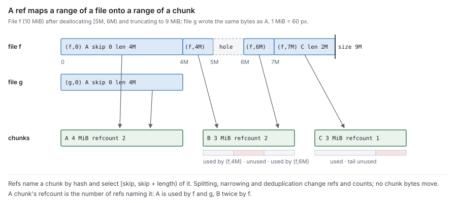
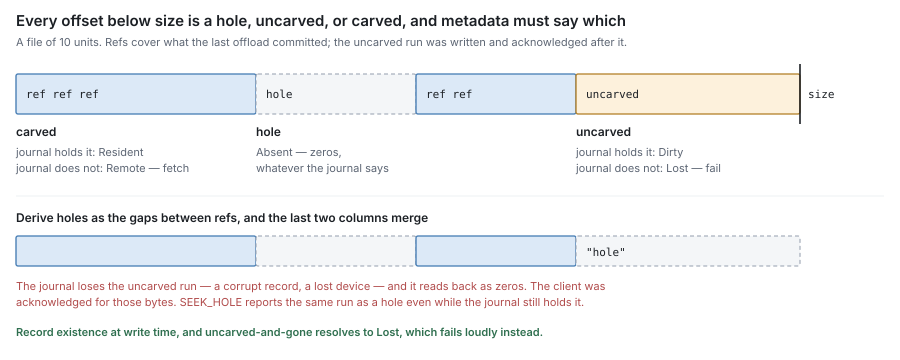
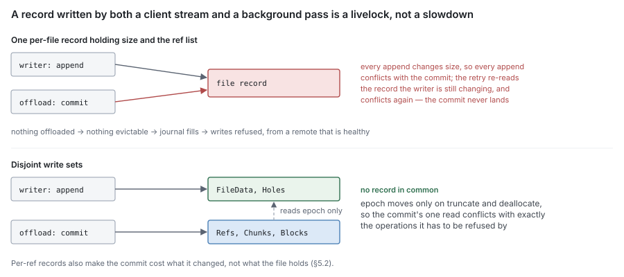
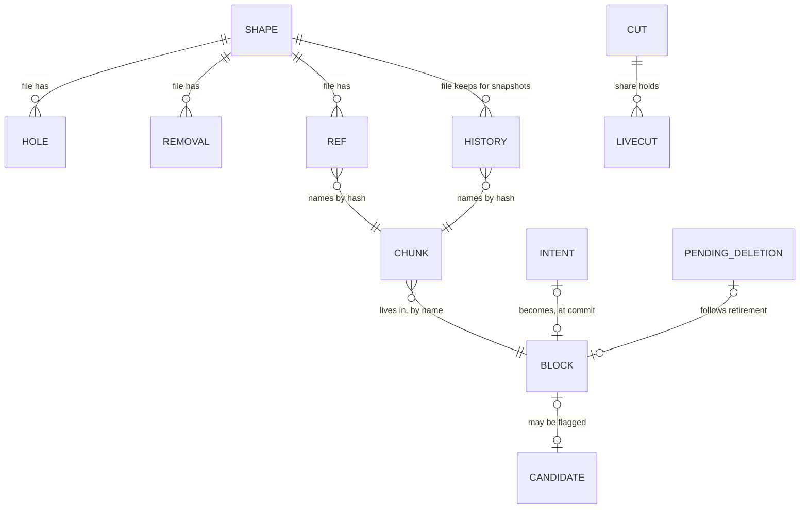

# RFC 6 — block metadata

**Status:** draft.
**Audience:** anyone changing a metadata backend's content records, or anything
that reads them — the read path, offload, sweep.

Conventions, RFC 2119 keywords and test tiers are set once in the
[index](rfc-index.md). This document specifies behaviour, not the current code;
[Appendix A](#Appendix%20A%20%E2%80%94%20where%20the%20current%20code%20differs) lists where the code differs, as defects to fix, never
rules to build around.

---

## 1. Purpose

Block metadata is the source of truth for file content: which chunks make up each
file, which block holds each chunk, which blocks exist remotely, and what state
each of them is in. It is the second oracle of [RFC 0 §4.1](rfc-0-data-lifecycle.md#4.1%20The%20two%20oracles), and it answers, for any
offset of any file:

> **Does content exist here, which chunk holds it, which block holds that chunk,
> and is that block durable?**

It also counts references, so that sweep can tell what is safe to delete
([RFC 0 §8.3](rfc-0-data-lifecycle.md#8.3%20Sweep)).

It is a **ledger**, not an observer. Every fact in it was observed by another
component and delivered by the engine — existence by the write path, chunks by
the carver, durability by the syncer. Its job is to record those facts atomically
and answer from them without distortion.

The engine is its caller on the content path: write, offload, read, truncate,
clone. Two other components hold narrow views, wired by whoever composes them
([RFC 8 §2.1](rfc-8-engine.md#2.1%20The%20engine%20is%20the%20composition%20root%2C%20and%20the%20only%20one)): the namespace reads `size`, write-time attributes and allocation
([RFC 7 §2.5](rfc-7-namespace-metadata.md#2.5%20Where%20%60size%60%20lives)), and GC retires blocks, relocates and audits ([§7](#7.%20What%20sweep%20needs%20from%20this%20component)). Releasing an
inode reaches this component only through the engine's `Release`, which drops the
refs and the journal's copy together ([RFC 8 §9.1](rfc-8-engine.md#9.1%20One%20facade%2C%20shaped%20like%20content), [RFC 7 §4.3](rfc-7-namespace-metadata.md#4.3%20Release%20is%20what%20block%20metadata%20sees)).

### 1.1 Non-goals

Block metadata **MUST NOT**:

- record where bytes sit on local disk, or whether they are local at all — that
  is the journal's question, and residency is computed, not stored
  ([RFC 0 §4.2](rfc-0-data-lifecycle.md#4.2%20The%20residency%20function)). It knows which content has a durable remote copy (a carved
  offset, [§3.2](#3.2%20Every%20offset%20is%20in%20exactly%20one%20class)); it **MUST NOT** try to know whether that content is also local;
- observe durability — it records reports ([RFC 0 §4.3](rfc-0-data-lifecycle.md#4.3%20Reporting), [RFC 3 §2.7](rfc-3-syncer.md#2.7%20It%20reports%3B%20it%20does%20not%20persist));
- own names, directories, attributes, handles, permissions or locks — those are
  [RFC 7](rfc-7-namespace-metadata.md)'s;
- decide what to offload, evict or sweep — it supplies the atomic operations those
  decisions need and nothing more;
- import another component in this set ([RFC 0 §1.2](rfc-0-data-lifecycle.md#1.2%20Component%20autonomy)).

### 1.2 Why it is a separate RFC from the namespace

RFC 7 and this document are one database and two sets of records. Neither writes
the other's records. They are specified separately because their write patterns
differ in kind:

| | Namespace metadata ([RFC 7](rfc-7-namespace-metadata.md)) | Block metadata (this RFC) |
| --- | --- | --- |
| Written by | client operations | client writes *and* background offload |
| Unit | one entry | one extent, one chunk, one block |
| Rate | per operation | per stability point, and per chunk at offload |
| Grows with | directory size | file size |

Both **MUST** live in one physical database, because two rules need a
transaction or a consistent read that spans them: `GETATTR` joins the inode with
the shape record ([RFC 7 §9.1](rfc-7-namespace-metadata.md#9.1%20Attributes%20are%20answers%2C%20not%20caches)), and an unlink that ends an inode's life records its
pending release in the transaction that removes the last entry ([RFC 7 §4.3](rfc-7-namespace-metadata.md#4.3%20Release%20is%20what%20block%20metadata%20sees)).
Across two databases each needs a cross-store protocol whose failure modes are the
torn states this document forbids. One database does not require one keyspace: a
backend **MAY** give each side its own tables or key prefix. Splitting them onto
separate servers is open ([§12](#12.%20Open%20questions)).

A transaction that crosses the boundary **SHOULD** stay small and local: the
namespace and block-metadata records of one file **SHOULD** share a key prefix
built from its `FileID`, so that a release, a `GETATTR` join or an existence
commit touches one contiguous range, and on a store that shards its keyspace
usually one shard. [§5.4](#5.4%20Reads%20that%20gate%20a%20commit) gives the key layout as a backend note.

> [!important] Pending review — one file's keys co-located
> Cross-boundary transactions stay cheap only if one file's records sit together.
> The concrete layout is a non-normative backend note in §5.4.

## 2. The records

Block metadata holds three things — a file's **existence**, its **content map**,
and the **blocks** the content lives in — in six kinds of content record, plus
the records ownership, snapshots and sweep need. Each record is keyed by exactly
one thing, answers exactly one question, and none holds a list that grows with
its file.


| Concept | Record | Keyed by | Holds | Answers |
| --- | --- | --- | --- | --- |
| Existence ([§3](#3.%20Existence)) | **Shape** | `FileID` | size, `applied` version, write-time `mtime` and `ctime` | how long is the file, when was it written, and up to which journal version is that recorded? |
| | **Hole** | `(FileID, start)` | end | was this range never written? |
| | **Removal** | `(FileID, version)` | removed range, kind, cursor, done | what did a truncate, deallocate, release or clone remove, at which version, and how far has dropping its refs got? |
| Content map ([§2.1](#2.1%20Ref)) | **Ref** | `(FileID, offset)` | chunk hash, skip, length, content versions, `born` | which bytes of which chunk are these? |
| | **History** | `(FileID, died, offset)` | a ref as it was, and the cut number its superseding transaction read | which bytes did a snapshot see here? |
| | **Chunk** | chunk hash | block name, position in block, refcount, change stamp | where is this chunk, and who uses it? |
| Blocks ([§7](#7.%20What%20sweep%20needs%20from%20this%20component)) | **Block** | block name | live-chunk count, encodings | may this remote object be deleted, and how was it written? |
| Ownership ([§5.4](#5.4%20Reads%20that%20gate%20a%20commit)) | **Fence** `F_x`, `F_o` | `FileID` | owner epoch | is the writer on this path still the file's owner? |
| Snapshots ([§6.5](#6.5%20Who%20owns%20a%20ref)) | **Cut** | `ShareID` | latest cut number `k`, newest live cut `klatest` | which cut does a commit fall after, and must a superseded ref move to history? |
| | **LiveCut** | `(ShareID, k)` | — | which cuts do live snapshots hold? |
| Sweep ([§7](#7.%20What%20sweep%20needs%20from%20this%20component)) | **Put intent** | block name | owner epoch of the attempt | which minted names may still be put and committed? |
| | **Pending deletion** | block name | — | which names await their remote delete? |
| | **Candidate** | block name | — | which blocks may have `live` at zero ([RFC 9 §3.5](rfc-9-gc.md#3.5%20Finding%20candidates%20costs%20what%20is%20retirable))? |

Who writes each record:

| | Shape, Hole | Removal | Ref, History | Chunk | Block | `F_x` | `F_o` | Cut, LiveCut | Put intent | Pending deletion | Candidate |
| --- | --- | --- | --- | --- | --- | --- | --- | --- | --- | --- | --- |
| Existence commit | writes | — | — | — | — | reads | — | — | — | — | — |
| Writer before a put ([§7.6](#7.6%20Put%20intents)) | — | — | — | — | — | — | — | — | creates | — | — |
| Offload commit | — | reads | writes | creates, counts | creates, counts | — | reads | reads `Cut` | deletes | — | writes |
| Removal, phase 1 ([§6.2](#6.2%20Truncation%20and%20deallocation)) | writes | writes | — | — | — | writes | writes | — | — | — | — |
| Removal, phase 2 | — | advances | writes | counts | counts | — | reads | reads `Cut` | — | — | writes |
| New owner ([§5.4](#5.4%20Reads%20that%20gate%20a%20commit)) | — | — | — | — | — | writes | writes | — | — | — | — |
| Snapshot cut or deletion ([§6.5](#6.5%20Who%20owns%20a%20ref)) | — | — | drops History | counts | counts | — | — | writes | — | — | writes |
| Retirement, relocation, abandonment, delete ([§7](#7.%20What%20sweep%20needs%20from%20this%20component)) | — | — | — | moves, deletes | creates, deletes | — | — | — | creates, deletes | writes, deletes | deletes |

The offload commit writes three records in one transaction because it records one
event — a block became durable — and those are its three consequences ([§4.1](#4.1%20What%20one%20commit%20records)).
Each merge that would remove a record kind moves a cost somewhere this document
forbids: a list that grows with the file (I7), a keyspace the write path and the
offload share ([§5.1](#5.1%20No%20record%20is%20written%20by%20both%20paths)), or a location rewritten in every ref on relocation ([§2.5](#2.5%20Refs%20name%20hashes%2C%20never%20blocks)).
The block's `live` is derivable from chunk records; it is kept materialised
because it is the one key retirement and adoption conflict on ([§7.1](#7.1%20Conditional%20retirement)).

> [!important] Pending review — record set after intents, history and batching
> Ref sets and deletion generations are gone. New: History (snapshots count through
> superseded refs), Cut, the per-file fences `F_x`/`F_o`, Put intent, and the
> Candidate record RFC 9 §3.5 already required. Removal gains cursor and done for
> batched drops. The write-set table now shows `F_x` and `F_o` keep the two paths
> disjoint.

### 2.1 Ref

A ref says: *these bytes of this file are that range of that chunk.* It is
[RFC 0](rfc-0-data-lifecycle.md)'s **chunk ref**:

    Ref(file, offset) = { hash, skip, length, oldest, newest, born }

- `file` is the inode that owns the ref, never a name ([§6.5](#6.5%20Who%20owns%20a%20ref)). A ref a
  snapshot still sees after the file superseded it moves to History, keyed by
  the same file ([§6.5](#6.5%20Who%20owns%20a%20ref)).
- `offset` is where in the file the ref's bytes begin.
- `hash` names the chunk, never a block ([§2.5](#2.5%20Refs%20name%20hashes%2C%20never%20blocks)). A **zero ref** names no chunk:
  its bytes are all zeros, and it reads as zeros without a fetch ([§3.5](#3.5%20Operations%20that%20make%20holes)).
- `skip` and `length` select `[skip, skip + length)` of the chunk's bytes.
- `oldest` and `newest` bound the journal content versions of what the ref
  describes (below).
- `born` is the share's cut number when the ref was committed; it alone decides
  which snapshots see the ref ([§6.5](#6.5%20Who%20owns%20a%20ref)).

To read offset *x*, take the ref with the greatest `offset` ≤ *x*. If
*x* < `offset + length`, the byte at *x* is byte `skip + (x − offset)` of chunk
`hash`. Otherwise no ref covers *x*, and existence says whether it is a hole or
uncarved ([§3.2](#3.2%20Every%20offset%20is%20in%20exactly%20one%20class)).



A ref **MUST** be able to name a strict sub-range of its chunk, because truncate
narrows the tail of one and deallocating the middle of a chunk leaves two refs to
it with different `skip`. Refs of one file **MUST NOT** overlap: in offset order
they tile the parts of the file that have been carved and committed.

**Why a ref carries content versions.** Every operation the journal stages gets a
version higher than any before it for that file ([RFC 1 §5.3](rfc-1-journal.md#5.3%20Versions)). An offload pass is
offered extents whose versions lie in `[Oldest, Newest]` ([RFC 1 §3.3](rfc-1-journal.md#3.3%20Offload)), and the
commit records that range on every ref the pass writes. It has three uses:
ordering commits ([§4.4](#4.4%20Commits%20for%20one%20file%20apply%20in%20order)), dropping refs a removal covers ([§6.2](#6.2%20Truncation%20and%20deallocation)), and checking
the journal's offloaded bits after a crash ([RFC 1 §9.2](rfc-1-journal.md#9.2%20Offload%20state%20after%20recovery)). The last is why position
alone is not enough:

1. Write version 1 over `[0, 4M)` and offload it. The ref `(f, 0)` records
   `newest = 1`.
2. Write version 2 over `[0, 1M)`. The journal holds it; it is not offloaded yet.
3. Crash and recover. The journal holds version 2 at `[0, 1M)`, and the ref still
   covers `[0, 4M)`.
4. Judged by position, the ref covers `[0, 1M)`, so it is durable, and eviction
   may drop version 2. The next read fetches version 1: an acknowledged write is
   gone, and nothing reports it.

With the versions, `MarkDurable(f, [0, 4M), 1, 1)` leaves `[0, 1M)` unmarked,
because the journal holds version 2 there.

**A ref is its own record.** An implementation **MUST NOT** store a file's refs as
one value, one document or one row holding the list. A list costs a rewrite of
the whole list per commit — O(*N*²) to write a file of *N* chunks — and makes it
a key every offload and writer contend on ([§5](#5.%20Write%20sets)). A backend that holds a list at
all **MUST** satisfy I7 ([RFC 0 §9.1](rfc-0-data-lifecycle.md#9.1%20Records%20and%20their%20reclamation)) at the list's worst-case encoded size.

### 2.2 Chunk

    Chunk(hash) = { block, position, length, refcount, stamp }

A chunk is keyed by its content hash and by nothing else ([RFC 2 §4](rfc-2-carver.md#4.%20Identity)). There is
**one chunk record per hash** in a namespace ([RFC 2 §4.3](rfc-2-carver.md#4.3%20Key%20scope)), however many files and
offsets use it.

`block` and `position` locate the chunk's bytes: the block that carries it, and
the offset and length of its body in the encoded block, as the block's header
records them ([RFC 4 §3.2](rfc-4-remote-tier.md#3.2%20Layout)). They are recorded from the encoder's output at commit,
never computed from local offsets, because transforms change body lengths.
A name is minted for one put attempt and put only by it, and a retry within the
attempt writes the same bytes ([§7.6](#7.6%20Put%20intents), [RFC 5](rfc-5-transforms.md)); a recorded position is
therefore never stale, and nothing rewrites it except relocation ([§7.3](#7.3%20Relocation)). A
ranged read that fails verification is corrupt.

`stamp` is replaced with a fresh value by every transaction that creates,
deletes, moves or narrows a ref naming this chunk, whether or not the refcount
changes. It lets the audit tell that the record changed under its walk
([§7.5](#7.5%20Audit)). A random 64-bit value suffices; it **MUST NOT** be a counter shared
across chunks.

> [!important] Pending review — chunk change stamp
> Added so the audit can lower a count without a whole-store consistent read.
> Every ref transaction already writes the chunk record when it counts; moves to
> history and narrowings now write it too.

### 2.3 Block

    Block(name) = { live, encodings }

`live` is the number of chunk records that name this block and whose refcount is
nonzero. A chunk this block carries whose record names another block is dead
weight here and is not counted ([§4.1](#4.1%20What%20one%20commit%20records)). A block is sweepable when, and only when,
`live` is zero ([RFC 0 §8.3](rfc-0-data-lifecycle.md#8.3%20Sweep)).

The name is minted per put attempt from a fresh nonce ([RFC 2 §4.2](rfc-2-carver.md#4.2%20A%20block),
[§7.6](#7.6%20Put%20intents)), so nothing about a later name needs deriving from this record: a block
records no generation.

> [!important] Pending review — no encoding generation
> The generation existed so relocation could derive a name distinct from its
> sources and re-derive it after a crash. A per-attempt nonce gives the first by
> construction; a crashed relocation mints again and its orphan is found by its
> intent (§7.3).

`encodings` lists the transform IDs and versions the block's bodies use, and the
material each used as (material ID, fingerprint), as the store reported them at
the put ([RFC 5 §5.3](rfc-5-transforms.md#5.3%20Retiring%20material%20or%20a%20transform%20needs%20a%20census)). The transform census and exports read it
([RFC 12 §3.1](rfc-12-snapshots.md#3.1%20A%20backup%20is%20an%20export%20of%20one%20snapshot%27s%20metadata)); the read path never does.

> [!important] Pending review — census entries carry fingerprints
> A material ID alone cannot show that a provider still holds the same key; the
> fingerprint beside it can, so the census and every export carry both.

A block record has **no durability flag**: by [§4.2](#4.2%20Only%20after%20durability) it exists only once its block
is durable.

### 2.4 Shape and holes

    Shape(file)            = { size, applied, mtime, ctime }
    Hole(file, start)      = { end }
    Removal(file, version) = { start, end, kind, cursor, done }

A hole record is one extent `[start, end)` below `size` that was never written,
or was deallocated. A file's holes never overlap or touch — adjacent holes merge
— and a dense file has none. A hole is its own record for the reason a ref is.

`mtime` and `ctime` are the times of the last write, stored here so that a write
touches one record ([RFC 7 §2.5](rfc-7-namespace-metadata.md#2.5%20Where%20%60size%60%20lives)).

`applied` is the newest journal version whose existence change this shape
records. A commit of pending existence advances it, which makes the commit
idempotent and tells recovery where to resume ([§3.4](#3.4%20Ordering%20against%20the%20journal)).

A removal record names a range removed by a truncate (`[new size, ∞)`), a
deallocate, a release (`[0, ∞)`) or a clone's destination, at the **journal
version of that operation** ([§6.2](#6.2%20Truncation%20and%20deallocation)). An offload commit drops any of its refs
whose `newest` is below the version of an overlapping removal: that content was
offered before the removal and is gone. A version, not a clock, because two
operations in one tick look identical; and not the file's latest version, which
every write advances, so every offload would conflict with every write — the
livelock [§5.1](#5.1%20No%20record%20is%20written%20by%20both%20paths) forbids.

It is also the durable intent of the removal's second phase: `kind` says which
operation wrote it, `cursor` is the offset up to which its refs have been dropped,
and `done` says the drop finished ([§6.2](#6.2%20Truncation%20and%20deallocation)). While `done` is false, the removal
masks the refs it will drop ([§8.1](#8.1%20Covering%20lookup)).

### 2.5 Refs name hashes, never blocks

A ref **MUST NOT** carry a block key or a position in a block. The indirection is
what lets a chunk move: relocating it rewrites one chunk record ([§7.3](#7.3%20Relocation)). If refs
carried the location, the same move would rewrite every ref of every file sharing
the chunk, and any copy of the refs taken earlier would name a block that no
longer exists.

### 2.6 The scope of a count

A refcount is only as good as the set of refs it counts. If a ref exists that the
count does not include, the count is low, and sweep deletes referenced content.

The records of [§2](#2.%20The%20records) **MUST** therefore be held in one store per remote key
namespace ([RFC 2 §4.3](rfc-2-carver.md#4.3%20Key%20scope)). A deployment **MUST** do one of two things:

- **One store per namespace.** Every share whose blocks can share a remote key
  records its refs in the store that counts them.
- **One namespace per store.** Key derivation includes the store's identity, so
  two stores can never name one object.

Two stores that can name one key, each keeping its own count, are forbidden.

**The absence of a record here MUST NOT be taken as evidence that a remote object
is unreferenced.** It shows only that this store does not reference it. How an
unrecorded object is collected is [RFC 9](rfc-9-gc.md)'s problem.

### 2.7 A file's life, record by record

One file `f`, from create to delete. Block positions ignore framing.

**t0 — create.** `Shape(f)`: size 0, applied 0.

**t1 — write 4 MiB at 0, version v1.** The journal stages the bytes and the
client is acknowledged. No record changes yet: until the stability point the
journal is the authority for this write, and the engine answers `size` from it
([§3.4](#3.4%20Ordering%20against%20the%20journal)).

**t2 — write 1 MiB at 10M, v2, then `COMMIT`.** The stability point commits both
writes' existence in one transaction. The gap before 10M becomes a hole.

| Record | Value |
| --- | --- |
| Shape(f) | size **11M**, applied **2**, mtime and ctime of v2 |
| Hole(f, 4M) | end 10M |

`[0, 4M)` and `[10M, 11M)` are **uncarved**: below `size`, not a hole, no ref
([§3.2](#3.2%20Every%20offset%20is%20in%20exactly%20one%20class)). Only the journal holds the bytes, and `size` is the only record that
says they exist. If the journal loses them, a read fails as **Lost**; it does not
return zeros.

**t3 — offload.** The journal offers both extents, `Oldest` v1 and `Newest` v2.
The carver cuts chunk A (4 MiB) and chunk B (1 MiB), and the engine packs both
into one block and mints its name K1 from a fresh nonce. One transaction writes
`Intent(K1)` with the owner epoch; then the engine puts K1, and one commit writes:

| Record | Value |
| --- | --- |
| Intent(K1) | **deleted** — consumed by the commit |
| Ref(f, 0) | A, skip 0, length 4M, oldest 1, newest 2 |
| Ref(f, 10M) | B, skip 0, length 1M, oldest 1, newest 2 |
| Chunk(A) | block K1, position `[0, 4M)`, refcount 1 |
| Chunk(B) | block K1, position `[4M, 5M)`, refcount 1 |
| Block(K1) | live 2 |

The commit read `F_o(f)` and found the epoch current, read the file's removals
and found none, and found `Intent(K1)` present. The journal marks both extents
durable; they are **Resident** and evictable.

**t4 — overwrite 1 MiB at 1M, v3, and `COMMIT`.** Shape's `applied` becomes 3 and
`size` is unchanged. No ref changes. The journal holds v3 at `[1M, 2M)`, newer
than the ref's `newest`, so that extent is **Dirty** again.

**t5 — offload the overwrite.** The carver cuts chunk C into block K2, minted and
intended like K1, and the commit splits the ref around it:

| Record | Value |
| --- | --- |
| Intent(K2) | deleted |
| Ref(f, 0) | A, skip 0, length **1M**, 1–2 |
| Ref(f, 1M) | **C**, skip 0, length 1M, 3–3 |
| Ref(f, 2M) | A, skip **2M**, length 2M, 1–2 |
| Ref(f, 10M) | B, skip 0, length 1M, 1–2 |
| Chunk(A) | K1, `[0, 4M)`, refcount **2** |
| Chunk(C) | K2, `[0, 1M)`, refcount 1 |
| Block(K2) | live 1 |

A was not rewritten. Its middle MiB is dead weight in K1 that no ref uses.

**t6 — truncate to 3 MiB, v4.** The journal truncates and assigns v4; then the
removal runs in two phases ([§6.2](#6.2%20Truncation%20and%20deallocation)). Phase 1, one transaction, touches no ref:

| Record | Change |
| --- | --- |
| Shape(f) | size **3M**, applied **4** |
| Removal(f, 4) | `[3M, ∞)`, truncate, cursor 3M, not done |
| Hole(f, 4M) | deleted — past the new end of file |
| `F_x(f)`, `F_o(f)` | rewritten at the current epoch |

The truncate returns. Until phase 2 finishes, a read masks `Ref(f, 2M)` past 3M
and `Ref(f, 10M)` ([§8.1](#8.1%20Covering%20lookup)); both lie past `size` anyway. Phase 2, one
sub-transaction here since both refs fit in one batch:

| Record | Change |
| --- | --- |
| Ref(f, 2M) | narrowed to A, skip 2M, length **1M** |
| Ref(f, 10M) | deleted, so B's refcount goes 1 → **0** |
| Block(K1) | live 2 → **1** |
| Removal(f, 4) | cursor ∞, **done** |

A pass that had been offered the 11 MiB file at versions up to 3 and commits now
finds `Removal(f, 4)` and drops its refs that overlap `[3M, ∞)`. Once no pass
offered below v4 is in flight, the owner prunes the removal.

**t7 — delete.** The namespace releases the inode through the engine's `Release`
([RFC 7 §4.3](rfc-7-namespace-metadata.md#4.3%20Release%20is%20what%20block%20metadata%20sees)). Phase 1 deletes the shape and writes `Removal(f, 5) = [0, ∞)`,
kind release; phase 2 drops the three refs. K1's and K2's `live` reach 0, and the
sub-transaction that takes each to zero writes its candidate. Sweep's `Retire(K1)`
checks `live == 0` and, in one transaction, deletes Block(K1), Chunk(A),
Chunk(B) and the candidate and records the pending deletion of K1; only then does
it delete the object ([§7.1](#7.1%20Conditional%20retirement)). No intent names K1 and no record can again,
so the delete needs no fence ([§7.6](#7.6%20Put%20intents)). With phase 2 done and no pass in
flight, `Removal(f, 5)` is pruned.

> [!important] Pending review — walk-through after intents and batching
> t3 and t5 now show the intent written before the put and consumed by the
> commit; t6 and t7 show a removal's two phases and the candidate written when
> `live` reaches zero.

## 3. Existence

### 3.1 The gap this closes

[RFC 0 §4.2](rfc-0-data-lifecycle.md#4.2%20The%20residency%20function) resolves an extent that no chunk covers to **Absent**, and reads it as
zeros. That is right for a hole and wrong for content that was written but not yet
carved. If the journal loses such an extent — a corrupt record, a lost device —
metadata has no chunk, and the system serves zeros for acknowledged data: I1's
violation. **Existence is therefore recorded independently of carving.**

### 3.2 Every offset is in exactly one class

For an offset below `size`, block metadata answers with one of three classes,
disjoint and exhaustive. These are [RFC 0 §4.2](rfc-0-data-lifecycle.md#4.2%20The%20residency%20function)'s metadata inputs:

| Class | Meaning | Residency with journal present | Residency with journal absent |
| --- | --- | --- | --- |
| **hole** | in the hole set | — | **Absent** |
| **uncarved** | not a hole, no ref covers it | **Dirty** | **Lost** |
| **carved** | a ref covers it | **Resident** | **Remote** |

An offset at or beyond `size` is past end of file. A zero ref is carved and reads
as zeros without a fetch.



An implementation **MUST** distinguish *hole* from *uncarved*. Deriving holes as
"gaps between refs" classes every uncarved byte as a hole, and every such byte
the journal loses reads back as zeros; it also gives `SEEK_HOLE` wrong answers.

### 3.3 Holes, not written extents

Existence records **holes**, not written extents: an overwrite or an append — almost
every write — then changes nothing but `size`, and a dense file has an empty hole
set however it was written. Holes are still routine: clients send one file's
writes as many concurrent requests that arrive in any order, so a sequential copy
creates and fills holes continuously, and the per-write cost bound of [§5.2](#5.2%20Cost%20per%20commit%20is%20bounded%20by%20what%20changed)
applies to them.

### 3.4 Ordering against the journal

An extent leaving the hole set, or `size` growing past it, is a claim that its
bytes exist. That claim becomes durable at the protocol's **stability point** —
`COMMIT`, `fsync`, a stable write, a close where the protocol requires one — not
at every write:

1. The namespace authorises the write ([RFC 7](rfc-7-namespace-metadata.md)).
2. The journal stages the bytes and assigns the write its version ([RFC 1 §3.1](rfc-1-journal.md#3.1%20Write)).
3. The write is acknowledged. Until its existence is committed, **the journal is
   the authority for it**: the engine answers reads, `size`, times and allocation
   by applying the journal's uncommitted operations of the file over these
   records ([RFC 8 §4.1](rfc-8-engine.md#4.1%20The%20facade%20orders%20a%20write%3B%20adapters%20do%20not)).
4. At the stability point, existence is committed — `size` grown, holes shrunk,
   times set, `applied` advanced to the newest version covered — **group-committed
   across files**: one transaction per journal for every file with pending
   existence, not one per write. The stability reply waits for it.

The rules:

- Existence **MUST NOT** be committed for a version the journal does not yet hold
  durably, and a stability reply **MUST NOT** precede the commit that covers it.
- **Recovery re-applies existence from the journal.** Before serving a file after a
  crash, the engine applies to existence every operation the journal holds for it
  above `applied` ([RFC 8 §2.5](rfc-8-engine.md#2.5%20Start%20in%20order%2C%20stop%20in%20reverse%2C%20and%20join%20before%20closing)). This is the only place existence is derived
  from the journal, and it covers only what was never committed. Content whose
  existence was committed and that the journal then loses resolves **Lost** —
  which is what existence is recorded for.
- A write acknowledged but not yet stable whose journal copy is lost disappears
  without trace. That is what an unstable write permits; the server's write
  verifier changes on restart, so clients resend.
- **Truncate, deallocate, release and clone are synchronous in their first
  phase**: each commits the file's pending existence and its own existence change
  in one transaction before it returns; dropping its refs follows in batches
  ([§6.2](#6.2%20Truncation%20and%20deallocation)).
- **`applied` only moves forward.** Every write of it is `applied = max(applied,
  v)`. An existence commit applies a file's journal operations in version order;
  when it reaches a removal it applies that removal's phase 1 itself, and it
  **MUST NOT** advance `applied` past a removal whose phase 1 it has not applied.
  A phase 1 that finds `applied ≥ v` and `Removal(file, v)` present is a no-op, so
  recovery, a group commit and the removal's own call can each reach it and only
  the first has effect.
- **Every drop is checked by version, never by position.** A removal drops only
  refs whose `newest` is below its version, so a re-run, a resumed phase 2 or a
  replay after a crash never removes content written after it.
- **An offer covers only committed existence**: the engine commits a file's
  pending existence before capturing an offer of it ([RFC 8 §4.3](rfc-8-engine.md#4.3%20The%20offload%20guard%20is%20narrow)), so no ref
  ever lies outside recorded existence.

> [!important] Pending review — removal idempotence
> With removals split into two phases, recovery, group commits and the removal
> itself can each meet the same removal. `max()` on `applied`, in-order
> application and version-checked drops make every path converge.

### 3.5 Operations that make holes

| Operation | Effect on existence |
| --- | --- |
| Write starting past `size` | `size` grows; `[old size, write offset)` becomes a hole |
| Truncate up | `size` grows; `[old size, new size)` becomes a hole |
| Truncate down | `size` shrinks; holes past it are dropped; a removal is recorded |
| Deallocate | the range becomes a hole; refs over it are dropped or narrowed ([§6](#6.%20Reference%20counting)); a removal is recorded |
| Allocate | none — see below |

**Allocate MUST NOT remove a hole** unless the zeros it promises are staged in
the journal first. Removing a hole claims bytes exist; with nothing staged the
range becomes uncarved and journal-absent — **Lost**. Reporting allocation to
`SEEK_DATA` is RFC 7's, and **MUST NOT** be done by editing existence.

**All-zero chunks are not stored.** The engine commits a zero ref for a chunk whose
bytes are all zeros ([RFC 8 §5.1](rfc-8-engine.md#5.1%20Blocks%20are%20assembled%20here%2C%20as%20a%20fold%20over%20the%20carver%27s%20output)): it names no chunk, carries versions like any
ref, is ordered and dropped by the same rules, and is reported to `SEEK_HOLE` as a
hole. No zero chunk is stored or counted, so the commonest chunk of any deployment
is never a hot refcount ([§5.3](#5.3%20Hot%20records%20that%20are%20not%20per-file)). A zero ref is written by the offload commit,
not the write path, so it keeps [§5.1](#5.1%20No%20record%20is%20written%20by%20both%20paths)'s write sets disjoint.

## 4. The offload commit

### 4.1 What one commit records

An offload pass ([RFC 0 §5.2](rfc-0-data-lifecycle.md#5.2%20Offload)) ends in one commit per block. A commit records, in
**one transaction**:

- the deletion of the block name's put intent ([§7.6](#7.6%20Put%20intents)) — the commit **MUST**
  fail if the intent is absent;
- the block record, with its encodings ([§2.3](#2.3%20Block));
- a chunk record for each chunk the block carries **that has none yet**, naming
  this block;
- the refs for the extents the pass carved, replacing what they overlap, and the
  history moves that replacement requires ([§6.5](#6.5%20Who%20owns%20a%20ref));
- the refcount and `live` changes those refs imply ([§6](#6.%20Reference%20counting)), including for chunks
  the pass adopted from earlier blocks.

Partial application **MUST NOT** be observable: a ref without its chunk, a
refcount without its ref, or a chunk without its block each turns a later read or
sweep into a guess.

**The first block to commit a chunk owns its record.** A later commit that carries
the same chunk adopts it: it adds its refs and their counts, and leaves `block`
and `position` as they are. The copy the later block carries is dead weight, not
counted in its `live`. A block all of whose chunks were adopted, or whose refs
were all dropped, commits with `live` at zero; its creating commit **MUST** make
it a sweep candidate ([RFC 9 §3.5](rfc-9-gc.md#3.5%20Finding%20candidates%20costs%20what%20is%20retirable)), since no later refcount change can reach it.

> [!important] Pending review — a block born with `live` zero
> Added with RFC 9 §3.5's born-dead rule; see there. Two writers that carry the
> same chunks now always produce two objects, and the second is born dead: one
> extra put and one sweep.

**A block record is created once.** The intent is consumed by the commit, and a
name is never minted twice ([§7.6](#7.6%20Put%20intents)), so a commit never finds its block record
already present; one that does has met a corrupt store and **MUST** fail as
`ErrInconsistent`. There is no "recorded, skip the put" path: deduplication is
by chunk, through `Durable(hash)` ([§8.2](#8.2%20Deduplication%20lookup)), never by block name.

> [!important] Pending review — commit consumes the intent
> Replaces "a commit is idempotent per block name". Identical chunk lists no
> longer derive one name, so the case the rule covered cannot arise.

**The commit checks, per file and inside its transaction:**

- **the owner epoch.** Each file's share of the commit carries the owner epoch the
  pass ran under; the commit **MUST** fail for that file if `F_o(file)`, read with
  conflict tracking, no longer holds that epoch ([§5.4](#5.4%20Reads%20that%20gate%20a%20commit), [RFC 11 §8](rfc-11-ownership.md#8.%20Metadata%20consistency)).
  Existence commits check `F_x(file)` the same way; removals check and write both;
- **the file's removals**: a ref overlapping a removal of higher version than the
  ref's `newest` is dropped ([§6.2](#6.2%20Truncation%20and%20deallocation)); a file with no shape — released — has all
  its refs dropped ([§6.4](#6.4%20Delete)). Because every removal writes `F_o`, an offload
  commit's read of `F_o` conflicts with any removal that lands during it, and
  the removals scan need not itself be conflict-tracked;
- **the put intent** for the block name: present, with an epoch that is not
  superseded. Reading and deleting the intent key in one transaction is the
  conflict point with an abandonment of it ([§7.6](#7.6%20Put%20intents)).

A dropped ref leaves the rest of the commit to apply. The block is durable either
way; a chunk it carries only for dropped refs is dead weight.

**An adoption that fails SHOULD NOT fail the whole commit.** If a chunk the pass
adopted was retired ([§7.2](#7.2%20Adoption%20is%20conditional%20on%20existence)), the commit **SHOULD** apply the block record, the
chunks it carries and their refs, and fail only the adopting refs, which are
re-offered; failing the whole commit leaves the put block with no record and
all its carried content re-uploaded.

> [!important] Pending review — per-file fences and partial adoption failure
> The epoch is read from per-path fence records so the check conflicts on both
> isolation models the backends offer (§5.4). A retired adoption now fails only
> the adopting refs, stated as SHOULD.

### 4.2 Only after durability

A commit **MUST NOT** run before the syncer has reported the block durable
([RFC 3 §2.6](rfc-3-syncer.md#2.6%20Durability%20is%20observed%2C%20never%20inferred)). Chunk and block records are
therefore records of durable content, and no record says "this chunk exists but
its block might not". Recording refs before the put would let a crash leave refs
to a block never written. A share with no remote tier never commits: its content
stays uncarved and **Dirty** for its lifetime ([RFC 0 §8.1](rfc-0-data-lifecycle.md#8.1%20Evict)).

### 4.3 The commit is the report's return edge

The extents a commit covers are the extents the offload callback returns as
durable ([RFC 0 §5.2](rfc-0-data-lifecycle.md#5.2%20Offload)). The callback **MUST NOT** return an extent whose commit has not
succeeded, so an offloaded bit is never set for content that metadata does not
hold ([RFC 1 §9.2](rfc-1-journal.md#9.2%20Offload%20state%20after%20recovery)).

### 4.4 Commits for one file apply in order

A commit **MUST NOT** replace refs written by a commit of content offered later.

Two passes of one file can be in flight at once — the engine's guard is held
only while capturing an offer and while committing ([RFC 8 §4.3](rfc-8-engine.md#4.3%20The%20offload%20guard%20is%20narrow)) — and they can
commit in either order. If an older pass's refs overwrote a newer pass's, the
journal, having marked the newer bytes durable, may release them, and a later read
fetches the older content. For each ref it would replace, a commit compares the
new ref's `newest` with the existing ref's range:

| New `newest` | The commit |
| --- | --- |
| above the existing `newest` | replaces the ref |
| inside the existing `[oldest, newest]` | treats the content as already committed: writes nothing for that ref and reports its extent durable |
| below the existing `oldest` | refuses that ref, and applies the rest |

Only strictly older content is refused. This suffices: content at an offset that
differs between two passes was written after the earlier pass was offered, so its
version, and the later pass's `newest`, exceeds every version the earlier pass
holds.

## 5. Write sets

### 5.1 No record is written by both paths

The write path — existence commits — and the offload commit **MUST NOT** write a
common record. [§2](#2.%20The%20records) tabulates who writes what.



A record written by both is a conflict between a client stream and a background
pass on every offload. Under optimistic concurrency the pass retries, re-reads the
record the client is still writing, conflicts again, and never commits. Nothing
becomes evictable, the journal fills, and writes are refused. That is livelock,
and backoff does not fix it, because the collision comes from the structure.

The offload commit *reads* the file's removals, shape existence and `F_o`.
Removals' and `F_o`'s only writers are the removal operations and a change of
owner, so those reads conflict only with the operations they must conflict with.
The epoch is split into `F_x` and `F_o` for the same reason: one epoch record
read by both paths would be harmless, but a single per-file record that every
commit of either path also writes is the shared key this section forbids
([§5.4](#5.4%20Reads%20that%20gate%20a%20commit)). `size` and `mtime` belong to the write path; the offload commit
**MUST NOT** touch them.

### 5.2 Cost per commit is bounded by what changed

An offload commit **MUST** write O(refs replaced + chunks committed + blocks
committed) records, and **MUST** read no more than O(log *n*) records per ref it
replaces, where *n* is the number of refs in the file. An existence commit
**MUST** write O(holes changed) records per file it covers. No per-commit cost may
grow with the size of the file: a commit that is O(file) makes a file of *N*
chunks O(*N*²) to write. A record that packs many refs into one value counts as
the refs it holds: loading and re-encoding a file's whole ref list to change its
tail is an O(file) read, however few records it writes.

**Operations over many refs are batched.** A removal, a release, a clone, a
restore and a snapshot deletion each touch O(refs) records, which no single
transaction may do: every backend bounds a transaction's size, and a large one
also conflicts with everything it spans. Each **MUST** run as one O(1)
transaction that records its durable intent, followed by sub-transactions of at
most **K** refs each ([§6.2](#6.2%20Truncation%20and%20deallocation)). K is derived at open from the backend's
per-transaction limits — entry count and byte size, at the worst-case encoding of
a ref, its chunk record and any history record it writes — and **MUST NOT** be
configured. A sub-transaction's cost is O(K), whatever the file's size.

> [!important] Pending review — one batching pattern, K derived
> Removals, releases, clones, restores and snapshot deletions previously claimed
> one transaction each, which a large file cannot fit. K is derived from backend
> limits so no deployment can set it past what its store accepts.

> [!important] Pending review — packed ref records count as their refs
> Added after a field report where a 160 GB sequential write decayed as every
> block commit loaded, merged and re-encoded the file's whole ref list. Its write
> count was small; its reads were not. Check the rule and the new Group B row.

### 5.3 Hot records that are not per-file

[§5.1](#5.1%20No%20record%20is%20written%20by%20both%20paths) removes the per-file hot record. Others remain:

- **A popular chunk's refcount.** Every file that references a common chunk
  increments one record. Zero chunks are not counted ([§3.5](#3.5%20Operations%20that%20make%20holes)), which removes
  the worst case; a snapshot adds no count at all, since a superseded ref moves
  to history with its count ([§6.5](#6.5%20Who%20owns%20a%20ref)).
- **A popular block's `live`.** Moves only when a refcount crosses zero.
- **Usage accounting.** A per-owner byte or quota counter is one record shared by
  all of that owner's files. It belongs to the write path and RFC 7, and the
  offload commit **MUST NOT** update it.

Contention on the first **MUST** be measured under a deduplicating workload
before shipping; it is a release gate, not an open item. If it shows, one
remedy is to decline adoption above a refcount ceiling and write a fresh chunk.
With one record per hash ([§2.2](#2.2%20Chunk)) a fresh copy still counts on the same record,
so the remedy needs a way to key it apart; that is open ([§12](#12.%20Open%20questions)).

> [!important] Pending review — hot refcounts are a release gate
> Measurement moves from SHOULD to a gate. Declining adoption above a ceiling is
> recorded as a candidate remedy, with the reason it is not yet a rule.

### 5.4 Reads that gate a commit

**A read whose result decides whether a commit may apply MUST conflict with
every concurrent write that would change that result.** A scan over a key range
is not such a read: the backends this set targets detect conflicts on point keys
at most, not on ranges, and one of them validates no reads at all. A rule that
needs "nothing in this range changed" **MUST** be restated as a point key that
every writer of the range also writes.

The gating reads in this document, and the key each conflicts on:

| Rule | Read | Written by, so the read conflicts |
| --- | --- | --- |
| owner epoch, existence path | `F_x(file)` | a new owner; removals and releases |
| owner epoch, offload path and pruning | `F_o(file)` | a new owner; removals and releases |
| removals an offload commit honours ([§4.1](#4.1%20What%20one%20commit%20records)) | the removals scan, covered by `F_o(file)` | every removal writes `F_o` |
| put intent ([§7.6](#7.6%20Put%20intents)) | `Intent(name)` | the commit and an abandonment both delete it |
| conditional retirement, adoption ([§7.1](#7.1%20Conditional%20retirement), [§7.2](#7.2%20Adoption%20is%20conditional%20on%20existence)) | `Block(name)`, `Chunk(hash)` | both transactions write the record they read |
| audit lowering a count ([§7.5](#7.5%20Audit)) | `Chunk(hash)` stamp | every ref change writes it |

`Cut(share)` is not in this table: it is ordered against commits by the cut gate
of [§6.5](#6.5%20Who%20owns%20a%20ref), and read plainly.

**Owner fences are per file and per path.** A file carries two fence records,
`F_x(file)` for the existence path and `F_o(file)` for the offload path, each
holding the owner epoch. A new owner writes both, before its first operation on
the file under the new epoch ([RFC 11 §8](rfc-11-ownership.md#8.%20Metadata%20consistency)). An existence commit reads `F_x` with
conflict tracking; an offload commit and removal pruning read `F_o`; a removal
or release reads and writes both, so a removal and an offload commit conflict
in both directions without a range lock. A check that forces every commit of an
ownership unit through one record **MUST NOT** be used: it serialises every
file of the unit on one key. A fenced commit covers only operations durable on
the unit's replica set ([RFC 10](rfc-10-journal-replication.md)).

The engine's per-file guard ([RFC 8 §4.3](rfc-8-engine.md#4.3%20The%20offload%20guard%20is%20narrow)) keeps a process's own commits from
conflicting; it is an optimisation, and no rule here depends on it.

**Backend notes (non-normative).** On a backend that tracks point reads in an
update transaction, a conflict-tracked read is a plain get there; a blind write
detects nothing, so a guarded write also gets its key first. On a backend with
snapshot isolation that validates no reads, a conflict-tracked read is a key lock
(optimistic or pessimistic; pessimistic suits a contended key), and a
transaction locking several files takes them in file-identity order. Per-
transaction entry and size limits give K ([§5.2](#5.2%20Cost%20per%20commit%20is%20bounded%20by%20what%20changed)). A long read transaction holds
back the store's version garbage collection, so no transaction spans an upload.
A key layout that keeps one file's records together ([§1.2](#1.2%20Why%20it%20is%20a%20separate%20RFC%20from%20the%20namespace)):

| Prefix | Records |
| --- | --- |
| `F ‖ FileID ‖ {shape, hole, removal, ref, history, fence}` | one file's existence, content map and fences, next to its namespace records |
| `C ‖ hash` | Chunk |
| `B ‖ name` | Block |
| `I ‖ name` | Put intent |
| `D ‖ name` | Pending deletion |
| `K ‖ name` | Candidate |

> [!important] Pending review — isolation rule and per-file fences
> New section. States the rule every gate must meet on backends that detect no
> range conflicts, replaces the single epoch read with per-path fence records,
> and gives the non-normative backend notes and key layout.

## 6. Reference counting

### 6.1 A refcount is exactly its refs

A chunk's refcount **MUST** equal the number of live refs naming it plus the
number of history refs naming it ([§6.5](#6.5%20Who%20owns%20a%20ref)), at every commit point. It **MUST**
change in the same transaction as the refs that change it — never in a second
transaction a crash can separate from the first. Moving a ref to history does not
change the count. A block's `live` **MUST** move in the same transaction as every
refcount crossing between zero and nonzero, for a chunk that block carries, and
the transaction that leaves `live` at zero **MUST** write the block's candidate
record ([RFC 9 §3.5](rfc-9-gc.md#3.5%20Finding%20candidates%20costs%20what%20is%20retirable)).

A removal's refs stay counted while it masks them ([§6.2](#6.2%20Truncation%20and%20deallocation)): a ref is uncounted
in the sub-transaction that deletes it, never before.

> [!important] Pending review — refcount is live refs plus history refs
> Replaces "file refs plus ref sets". A snapshot takes no count of its own; the
> counts it needs are the ones superseded refs already held.

A refcount that drifts high leaks a chunk forever. One that drifts low lets sweep
delete a chunk that is still referenced — I3's violation, and the only failure in
this system that destroys the last copy of content ([RFC 0 §8.3](rfc-0-data-lifecycle.md#8.3%20Sweep)).

### 6.2 Truncation and deallocation

Truncate down, deallocate, release ([§6.4](#6.4%20Delete)) and a clone's destination ([§6.6](#6.6%20Clone%20and%20server-side%20copy))
are **removals**. Under the file's guard ([RFC 8 §4.3](rfc-8-engine.md#4.3%20The%20offload%20guard%20is%20narrow)), the journal removes the
range first and assigns the removal its version *v* ([RFC 1 §3.6](rfc-1-journal.md#3.6%20Truncate%2C%20deallocate%20and%20delete)). The metadata
change then runs in two phases.

**Phase 1 — one transaction, O(1) plus holes changed, writes no ref:**

- commits the file's pending existence ([§3.4](#3.4%20Ordering%20against%20the%20journal));
- updates existence ([§3.5](#3.5%20Operations%20that%20make%20holes)) and sets `applied = max(applied, v)`;
- writes `Removal(file, v)` with its range and kind, `cursor` at the range's
  start, `done` false;
- reads and writes `F_x(file)` and `F_o(file)` at the current epoch ([§5.4](#5.4%20Reads%20that%20gate%20a%20commit)).

Phase 1 is an existence commit, so it keeps [§5.1](#5.1%20No%20record%20is%20written%20by%20both%20paths)'s write sets disjoint, and the
operation returns once it commits.

**Phase 2 — sub-transactions of at most K refs, in offset order from `cursor`**
([§5.2](#5.2%20Cost%20per%20commit%20is%20bounded%20by%20what%20changed)). Each one, for the refs it reaches:

- drops a ref wholly inside the range whose `newest` is below *v*, and decrements
  its chunk (or moves it to history, [§6.5](#6.5%20Who%20owns%20a%20ref));
- narrows a ref with `newest` below *v* that straddles the range's edge, by
  adjusting `skip` or `length`;
- splits a ref with `newest` below *v* that spans a deallocated range into two
  refs to the same chunk, and increments that chunk;
- **never touches a ref whose `newest` is at or above *v***: that content was
  written after the removal;
- advances `cursor`; the last sub-transaction sets `done`.

A re-run of a sub-transaction finds nothing left to drop below *v*, so it is
harmless, and a restart resumes every removal not done from its `cursor` before
serving the file ([RFC 8 §2.5](rfc-8-engine.md#2.5%20Start%20in%20order%2C%20stop%20in%20reverse%2C%20and%20join%20before%20closing)).

**While not done, a removal masks.** A covering lookup treats every ref in the
removal's range with `newest` below *v* as absent, clipping a straddler at the
range's edge, and the offset resolves by existence: a hole, past end of file, or
uncarved if a later write covers it ([§8.1](#8.1%20Covering%20lookup)). A masked ref stays counted until
the sub-transaction that deletes it ([§6.1](#6.1%20A%20refcount%20is%20exactly%20its%20refs)). Offload commits apply the rules
of [§4.4](#4.4%20Commits%20for%20one%20file%20apply%20in%20order) and this section unchanged while a removal is in phase 2: a ref they
write carries a `newest` at or above *v* if it was offered after the removal, and
phase 2 leaves it alone.

A crash between the journal step and phase 1 is recovered like any uncommitted
operation: the journal's record of the removal ([RFC 1 §3.6](rfc-1-journal.md#3.6%20Truncate%2C%20deallocate%20and%20delete)) lies above
`applied`, and recovery applies its phase 1 ([§3.4](#3.4%20Ordering%20against%20the%20journal)). A crash inside phase 2 is
resumed from `cursor`.

The same pattern — an O(1) intent, then version-checked batches that resume from
a cursor — serves every operation over many refs: truncate, deallocate, release
([§6.4](#6.4%20Delete)), a clone's destination ([§6.6](#6.6%20Clone%20and%20server-side%20copy)), restore staging ([§7.4](#7.4%20Restore)) and the
history drop of a snapshot deletion ([§6.5](#6.5%20Who%20owns%20a%20ref)).

> [!important] Pending review — two-phase removals
> A removal was one transaction over every ref it touched. Phase 1 now commits
> existence and the durable intent; phase 2 drops refs in K-sized batches, masked
> from readers until done, and never touches content newer than the removal.

**A transfer survives a removal under it.** A pass offered before the removal
keeps uploading from the bytes it was offered. Its commit drops each ref whose
`newest` is below an overlapping removal's version and applies the rest. Without
that check, a pass that carved `[0, 10 MiB)` commits refs after a concurrent
truncate to 5 MiB, and a later truncate up turns them back into readable content
where the user was promised zeros. A dropped extent is not reported durable, and
what the journal still holds there is offered again.

**Removal records are pruned by the file's owner.** A removal matters while its
phase 2 is not done and while a pass offered before it can still commit, so the
owner deletes a file's removals that are done and at or below the file's
**durable floor**: the lowest `Newest` of its passes in flight, or every done
removal when none is in flight, as at startup ([RFC 8 §2.5](rfc-8-engine.md#2.5%20Start%20in%20order%2C%20stop%20in%20reverse%2C%20and%20join%20before%20closing)). No other process
prunes them: only the owner can see its passes, and a stale owner's pruning fails
on `F_o` ([§5.4](#5.4%20Reads%20that%20gate%20a%20commit)).

### 6.3 Underflow is corruption, not a boundary

A decrement that would take a refcount or `live` below zero **MUST** fail the
transaction and **MUST** be reported as a consistency error naming the record. It
**MUST NOT** clamp at zero: a count about to go negative was already too low, so
something else still references the chunk.

An underflow **MUST NOT** wedge the operation that met it ([RFC 0 §10.2](rfc-0-data-lifecycle.md#10.2%20No%20state%20requires%20intervention%20to%20leave)). It
schedules a **targeted recount** of the named chunk or block — the audit of
[§7.5](#7.5%20Audit) restricted to that record — and suspends retirement of the blocks the
record touches until the recount commits. The failed batch is retried once the
recount has corrected the count; a phase 2 that keeps underflowing on the same
record after a recount is reported as a health condition, and the rest of the
store proceeds.

> [!important] Pending review — underflow schedules a recount
> A failed transaction alone left a removal stuck forever on one bad count. The
> recount repairs the count from the refs, and sweep stays off the block until it
> has.

### 6.4 Delete

Releasing a file is a removal of `[0, ∞)` ([§6.2](#6.2%20Truncation%20and%20deallocation)). Phase 1 deletes its shape and
writes `Removal(file, v) = [0, ∞)`, kind release, at the journal's delete
version; phase 2 drops all its refs, decrementing their chunks or moving them to
history ([RFC 0 §7](rfc-0-data-lifecycle.md#7.%20Mutation%20and%20removal)). It checks and writes both fences like any removal. An
offload commit for a file with no shape drops that file's refs.

Phase 2 leaks rather than loses:

- the removal record is the durable record of the pending drop: a restart finds
  shapeless files by it and resumes from its cursor, without a full scan. It is
  pruned only once done and with no pass in flight;
- a refcount decremented before its ref is removed is a sweep hazard, and **MUST
  NOT** happen.

### 6.5 Who owns a ref

Refs belong to an **inode**, not to a name. Hard links, renames, trash and a file
unlinked while open are namespace states of one inode, and none changes a ref.
Block metadata learns of a deletion only when [RFC 7](rfc-7-namespace-metadata.md) releases the inode through
the engine's `Release`.

A **snapshot** holds counted content through the refs its files had at its cut,
and writes nothing per file when it is taken:

- **A snapshot is its cut number** *k*. Each share keeps one record
  `Cut(share) = { k, klatest }`: `k` is the number of the share's latest cut,
  starting at 0 and raised by one each time a snapshot is taken, and `klatest`
  is the newest cut a live snapshot still holds (0 when none does). Each live
  snapshot also has a `LiveCut(share, k)` record. The cut is taken on a drained,
  frozen share ([RFC 12 §2.3](rfc-12-snapshots.md#2.3%20The%20cut%20is%20a%20drained%2C%20frozen%20instant)). `Cut(share)` is written only by the cut and by a
  snapshot deletion.
- **Every ref carries `born`**, the value of `k` its committing transaction read.
  The share's **cut gate** orders every such transaction against every change
  to `Cut(share)`: each transaction that writes a ref — a client operation, an
  offload commit, a removal batch — is admitted through the gate, and a change
  to `Cut(share)` closes the gate, waits for every admitted transaction to
  finish, commits, and reopens it. So each ref-writing transaction either
  finished before the change or began after it, and a plain read of `Cut(share)`
  gives it the right value: `born < k` means exactly "committed before cut *k*".
  The gate is held in memory by each owner of the share's units
  ([RFC 11 §2](rfc-11-ownership.md#2.%20Ownership%20units)); it orders commits, it does not guard a count. A narrowed or
  split ref keeps its `born`.
- **A superseded ref a snapshot can see moves to history.** Any transaction that
  drops or replaces a live ref — an offload commit overwriting it, a removal's
  phase 2, a release — **MUST**, when `born < klatest`, move it in the same
  transaction to `History(file, died, offset)`, where `died` is the value of `k`
  the superseding transaction read. The chunk's count does not change: a history
  ref counts like a live one ([§6.1](#6.1%20A%20refcount%20is%20exactly%20its%20refs)). A narrowed ref moves its removed part.
  When `born ≥ klatest` no live snapshot can see the ref, and it is dropped as
  before.
- **Snapshot *k* sees exactly the refs with `born < k ≤ died`**, where a live ref
  has `died = ∞`. The namespace records a snapshot reads — entries, inodes, shape
  and hole records — are captured per record on first change after the cut
  ([RFC 12 §2.4](rfc-12-snapshots.md#2.4%20Capture%20is%20copy%20on%20first%20write)); refs are never captured, because history keeps them.
- **Deleting snapshot *k*** drops the history refs no other live snapshot sees.
  Let *kp* < *k* < *kn* be its nearest live neighbours. A history ref visible to
  *k* has `born < k ≤ died`; the live cuts it is visible to form a run of
  consecutive live cuts containing *k*, so it is visible to another one exactly
  when it is visible to *kp* (`born < kp`) or to *kn* (`kn ≤ died`). The deletion
  therefore drops the history refs with

      kp ≤ born < k ≤ died < kn

  reading an absent *kp* as 0 and an absent *kn* as ∞. It runs as the batched
  pattern of [§6.2](#6.2%20Truncation%20and%20deallocation): one transaction, through the cut gate, first deletes
  `LiveCut(share, k)` and recomputes `klatest` in `Cut(share)` — so no ref-writing
  transaction still running can move a ref to history for *k* alone after the
  drop has passed it — then sub-transactions of K history refs, found by
  `died` in `[k, kn)`, drop each ref that meets the condition and decrement its
  chunk.
- **Freezing a share pauses its phase-2 executors**, so no removal drops a ref
  between the drain and the cut.

For example, a share takes cuts 1, 2 and 3, all live, so `klatest` is 3.

| Ref | `born` | `died` | Seen by | Deleting 2 (*kp* 1, *kn* 3) |
| --- | --- | --- | --- | --- |
| r1 | 0 | 2 | 1, 2 | kept: `born < 1` |
| r2 | 1 | 2 | 2 | dropped: `1 ≤ 1 < 2 ≤ 2 < 3` |
| r3 | 1 | 3 | 2, 3 | kept: `died ≥ 3` |
| r4 | 2 | ∞ (live) | 3, and the share | untouched: live |
| r5 | 3 | not moved | the share | superseded at `k` 3 with `born` 3 = `klatest`: dropped, never in history |

After the deletion the live cuts are 1 and 3, and r1 and r3 are each still seen
by one of them.

A share with no live snapshot writes no history. `Cut(share)` changes only at a
cut and at a snapshot deletion, each behind the cut gate, so reading it needs no
conflict tracking and no lock: it is not a key every commit of the share
contends on, on either kind of backend ([§5.4](#5.4%20Reads%20that%20gate%20a%20commit)).

Journal versions keep only their per-file roles — ordering commits for one file
([§4.4](#4.4%20Commits%20for%20one%20file%20apply%20in%20order)), the removal checks of [§6.2](#6.2%20Truncation%20and%20deallocation), and reseeding the journal after a crash. They
do not order a share: versions are per journal ([RFC 1 §5.3](rfc-1-journal.md#5.3%20Versions)), and a share's
files may live in the journals of several nodes.

> ponytail: a snapshot read resolves each offset by scanning that file's history
> for the entry with `born < k ≤ died`, O(history of the file). Upgrade to an
> interval index on (`born`, `died`) when snapshot reads of heavily rewritten
> files show it in a profile.

> [!important] Pending review — snapshot cut numbers replace cut versions
> The previous text compared a ref's journal `newest` against a cut version and
> assumed versions are monotone per share. They are not: each journal numbers its
> own files, and a share's files can sit in several nodes' journals, so no
> version orders a share. A per-share cut number does. It is ordered against
> commits by the cut gate (the freeze of RFC 12 §2.3, plus a brief gate at
> snapshot deletion), not by a conflict-tracked read: on a backend where such a
> read is a key lock, that read would serialise every commit of the share.

Nothing else keeps content alive: a hold list or pin set consulted beside the
count fails open ([RFC 9 §2.1](rfc-9-gc.md#2.1%20The%20count%20is%20the%20only%20authority)). Any future holder of content holds refs and is
counted.

> [!important] Pending review — snapshots as cut plus history
> Replaces ref sets and holder counts. Taking a snapshot writes one record; the
> cost moves to overwrites of refs a snapshot can see, which move them to
> history in the transaction that supersedes them. Deleting a snapshot drops
> only the history no neighbouring cut sees.

### 6.6 Clone and server-side copy

Cloning carved content copies refs, not bytes. A clone is a **removal of the
destination range and an adoption**, run as the batched pattern of [§6.2](#6.2%20Truncation%20and%20deallocation):

1. **Before phase 1**, the clone **MUST** offload every source extent the journal
   holds with a version newer than the `newest` of the ref that covers it — not
   only the uncarved ones — so the source's refs are its current content. It
   then holds the source's guard until the clone is done.
2. **Phase 1**, under the destination's guard: the journal removes the
   destination range at version *v*; one transaction deallocates the destination
   range as [§6.2](#6.2%20Truncation%20and%20deallocation)'s phase 1 does, writing `Removal(dst, v)` with kind clone,
   and records the destination's existence over the range. Source holes stay
   holes in the destination.
3. **Phase 2**, sub-transactions of at most K refs in source-offset order: drop
   the destination's refs below *v* in the batch's range, then write the cloned
   refs **re-versioned** with `oldest = newest = v`, and increment their chunks —
   failing the batch if any chunk has been retired ([§7.2](#7.2%20Adoption%20is%20conditional%20on%20existence)). The cursor
   advances; the last batch sets `done`.

Until the clone's removal is done, the destination range **MUST NOT** be served:
a read of it waits for the clone or fails at its deadline, rather than reading a
half-copied range. Unfinished clones resume at startup before their destination
is served ([RFC 8 §2.5](rfc-8-engine.md#2.5%20Start%20in%20order%2C%20stop%20in%20reverse%2C%20and%20join%20before%20closing)). The cloned refs are counted refs from the batch that
writes them; a clone that fails for good is undone by a removal of the
destination range, batched the same way.

When source and destination are one file and the ranges overlap, the clone
**MUST** read each batch's source refs before applying the destination drop that
could remove them.

Re-versioning makes the cloned refs outrank anything a destination pass in flight
carries, and the removal drops what that pass would have committed there.

**Uncarved content cannot be cloned by reference**, because no chunk covers it
yet. Step 1 offloads it; a share with no remote tier copies the bytes through the
destination's write path instead. A clone **MUST NOT** record the destination
range as existing unless its bytes are staged or its refs written.

> [!important] Pending review — clone as a batched removal and adoption
> A clone was one transaction over every ref. It now runs phase 1 as a
> deallocate, copies refs in batches, keeps the destination range unserved until
> done, and offloads every source extent newer than its ref first, not only
> uncarved ones: a stale source ref would clone old content.

## 7. What sweep needs from this component

Sweep and relocation are [RFC 9](rfc-9-gc.md)'s. They need the atomic operations below,
and cannot be made safe without them.

### 7.1 Conditional retirement

    Retire(block) — if live == 0: delete the block record, every chunk record
                    that names it and the block's candidate, and write the block's
                    pending deletion; else delete the candidate and refuse

A chunk record that names another block is not this block's to delete ([§4.1](#4.1%20What%20one%20commit%20records)).
This **MUST** be one transaction, and the condition **MUST** be evaluated inside
it: a sweep that reads `live`, decides, and deletes in a separate step deletes a
block a commit re-adopted in between.

The pending-deletion record makes the remote delete resumable ([RFC 9 §3.2](rfc-9-gc.md#3.2%20A%20retirement%20not%20yet%20deleted%20is%20durably%20recorded)).
Retiring the records before deleting the object means a crash between the two
leaves an unreferenced object recorded for deletion; the reverse order leaves
records naming an object that no longer exists, which is **Lost** for content
that was durable.

### 7.2 Adoption is conditional on existence

An offload commit that references a chunk it did not carry **MUST** fail if that
chunk's record no longer exists when the commit applies, and **MUST NOT**
recreate it. With [§7.1](#7.1%20Conditional%20retirement) this closes the race without a clock: an adoption before
retirement makes `live` nonzero and retirement refuses; an adoption after it
fails, and the pass retries carrying the chunk. An implementation **MUST NOT**
substitute a grace period for either operation ([RFC 0 §4.3](rfc-0-data-lifecycle.md#4.3%20Reporting)).

### 7.3 Relocation

Relocation rewrites the surviving chunks of one or more blocks into a new block,
so the sources can be retired. When to do it is RFC 9's; this section covers the
record change.

GC reads and puts through a syncer flow of its own ([RFC 9 §4.2](rfc-9-gc.md#4.2%20Read%20verified%2C%20mint%2C%20put%2C%20then%20move)). The target
name is minted from a fresh nonce like any other ([§7.6](#7.6%20Put%20intents)), so it never equals a
source's; before the put, GC records its put intent. A relocation re-run after a
crash mints a new name; the target the crashed run put is found by its intent
and collected ([RFC 9 §5](rfc-9-gc.md#5.%20Unrecorded%20objects)).

After the new block is durable, one transaction:

- deletes the target's put intent, failing if it is absent;
- points each moved chunk record that still names a source at the new block and
  position;
- creates the new block record, with its encodings;
- counts, inside the transaction, the moved chunks whose refcount is nonzero,
  adds that to the new block's `live` and subtracts each source's share from it,
  writing the candidate of any block it leaves at zero.

> [!important] Pending review — relocation mints its target
> The generation rule and `ErrSameName` are gone: a nonce cannot collide with a
> source. A crashed relocation's target is no longer re-derived; its intent names
> it for collection.

Refs are untouched ([§2.5](#2.5%20Refs%20name%20hashes%2C%20never%20blocks)). A source whose `live` reaches zero is retirable. A
chunk adopted by a racing commit is counted in whichever block its record names
when the adoption applies; both transactions read and write that record, so they
cannot interleave.

### 7.4 Restore

Restoring block metadata from a copy — a snapshot, a backup — is a batch of
adoptions, not a write of old records:

- every chunk a restored ref names **MUST** exist when the restore applies ([§7.2](#7.2%20Adoption%20is%20conditional%20on%20existence));
  a restore that would write a ref to a retired chunk **MUST** fail;
- chunk and block records **MUST** be taken from the live store, never from the
  copy, whose locations may predate a relocation and whose counts describe a
  store that no longer exists;
- refcounts and `live` **MUST** change by the refs the restore adds and removes.

A restore of more than K refs runs as the batched pattern of [§6.2](#6.2%20Truncation%20and%20deallocation) into
staging: each batch writes counted refs, so a staged ref holds its chunk like any
other, and a restore that fails for good is undone by a batched removal of what
it staged. Nothing is published until the last batch is done ([RFC 12 §5.2](rfc-12-snapshots.md#5.2%20Import%20is%20staged%20and%20published%20atomically)).

A restore from a counted snapshot cannot fail the first check, because the
snapshot's live and history refs held its chunks.

> [!important] Pending review — staged restore refs are counted
> Staged refs are counted from the batch that writes them and dropped by the
> batching pattern on failure, so a failed restore leaks nothing and a
> half-staged one holds its chunks.

### 7.5 Audit

Refcounts are sweep's only authority, so there **MUST** be a way to check them. An
audit recomputes each chunk's refcount from the live and history refs naming it,
and each block's `live` from its chunks, and reports every mismatch. It needs no
consistent read of the whole store: a store-sized read transaction is either
refused or holds back the store's version reclamation for its whole length.

- **The walk is bounded reads.** The audit reads refs and history in bounded
  batches. Before it reads any ref, it notes the `stamp` of every chunk it will
  count in this walk ([§2.2](#2.2%20Chunk)); a store too large for one walk is audited as
  several walks over disjoint ranges of chunk hashes.
- **A correction MAY raise a count at any time.** Raising a count that was right
  only leaks.
- **A correction MAY lower a count only in a transaction that finds the chunk
  record's `stamp` unchanged since before the walk began counting it.** Every
  transaction that creates, deletes, moves or narrows a ref naming the chunk
  changes the stamp ([§2.2](#2.2%20Chunk)), so an unchanged stamp proves no ref naming it
  changed under the walk. A changed stamp means re-walk that chunk.
- **`live` is corrected per block, in one transaction** that reads the block's
  chunk records and sets `live` from them.

A targeted recount ([§6.3](#6.3%20Underflow%20is%20corruption%2C%20not%20a%20boundary)) is this audit restricted to one chunk or block.

> [!important] Pending review — audit without a whole-store consistent read
> The old rule required one consistent read of the store, which no backend can
> give at scale. The change stamp makes lowering safe per chunk; the second
> (holder-count) level is gone with ref sets.

### 7.6 Put intents

A block name is minted once, for one put attempt: it hashes a fresh nonce of at
least 128 bits with the domain, the key scope, the chain ID and the chunk hashes
([RFC 2 §4.2](rfc-2-carver.md#4.2%20A%20block)), and the nonce is written into the block header so a whole-block
read still recomputes and verifies the name. A name **MUST NOT** be minted twice.
A retry within the attempt reuses its name and plan and writes the same bytes; no
other put of the name is ever issued.

**Before any put** — an offload's or a relocation's — the writer durably records a
**put intent** for the name, carrying the owner epoch it runs under:

    Intent(name) = { epoch }

The commit that creates the block record **MUST** delete the intent in the same
transaction and **MUST** fail if the intent is absent ([§4.1](#4.1%20What%20one%20commit%20records)). A name's state
only moves forward:

    absent → intended → recorded | abandoned

**An object may be deleted only when no block record and no intent names it.**
That state is final: nothing can put or commit that name again. So a delete needs
no fence and no delay, and a delete that lands late — after a retry, after a
crash — can reach no committed block.

**Abandoning an intent.** An intent whose epoch is superseded — its writer lost
ownership or crashed — **MAY** be removed in a transaction that reads and deletes
the intent key, which conflicts with a commit consuming it ([§5.4](#5.4%20Reads%20that%20gate%20a%20commit)); the same
transaction writes the name's pending deletion, and the object is then deleted
([RFC 9 §5](rfc-9-gc.md#5.%20Unrecorded%20objects)). A put still in flight that lands after the delete leaves an object
with neither intent nor record: it can never be committed, and a listing
backstop collects it.

The pending-deletion record is only the delete backlog: it makes a remote delete
resumable after a crash ([RFC 9 §3.2](rfc-9-gc.md#3.2%20A%20retirement%20not%20yet%20deleted%20is%20durably%20recorded)). No writer reads it; it gates nothing.

Two writers carrying the same chunks mint two names and put two objects; the
second commit adopts every chunk, and its block is born dead ([§4.1](#4.1%20What%20one%20commit%20records)). Encoding
needs to be deterministic only within one attempt — the measuring pass and any
retry ([RFC 5](rfc-5-transforms.md)).

> [!important] Pending review — put intents replace the deletion fence
> Names were derived from content, so a put could re-create a name under its own
> delete, and a fence (pending-deletion check, generation array, pre-put check)
> kept them apart. A per-attempt name with an intent recorded before the put makes
> the deleted state final instead. Deleted: `Precheck`, the generation array,
> `ErrFenced`, "recorded, skip the put", and pending deletion as a writer gate.

## 8. Queries

### 8.1 Covering lookup

    Covering(file, offset, n) → the refs, holes and uncarved runs over [offset, offset + n), in order

This is the read path's question, asked per extent the journal does not hold
([RFC 0 §6.1](rfc-0-data-lifecycle.md#6.1%20Resolution)). It **MUST** cost O(log *n* + results) in the number of refs and
holes of that file, and **MUST** be a method on the declared interface
([RFC 0 §1.2](rfc-0-data-lifecycle.md#1.2%20Component%20autonomy)).

It applies the file's removals that are not done ([§6.2](#6.2%20Truncation%20and%20deallocation)): a ref inside such a
removal's range whose `newest` is below its version is absent, a straddler is
clipped at the range's edge, and the offset resolves by existence. A file has at
most a handful of removals not done, so the mask adds O(removals) to the lookup.

A snapshot's covering lookup at cut *k* reads live refs with `born` < *k* and
history refs with `born` < *k* ≤ `died` ([§6.5](#6.5%20Who%20owns%20a%20ref)).

> [!important] Pending review — covering applies the removal mask
> A removal that has returned but whose refs are still being dropped must not
> read back as the removed content.

### 8.2 Deduplication lookup

    Durable(hash) → chunk | none

Returns the chunk record for `hash`, if any. By [§4.2](#4.2%20Only%20after%20durability) a record implies a durable
block, so this is the complete answer to "may this chunk be referenced rather than
uploaded" ([RFC 2 §5](rfc-2-carver.md#5.%20Packing%3A%20three%20rules%2C%20not%20a%20component)). It **MUST NOT** consult anything that knows about a block
not yet committed. The answer is advisory: [§7.2](#7.2%20Adoption%20is%20conditional%20on%20existence) makes a stale one safe, and it
**MUST NOT** be treated as a reservation.

### 8.3 A file's refs and the version floor

    Refs(file)           → refs in offset order
    VersionFloor(shares) → version

`Refs` lets the engine check the journal's offloaded bits against the refs after
a restart ([RFC 8 §2.5](rfc-8-engine.md#2.5%20Start%20in%20order%2C%20stop%20in%20reverse%2C%20and%20join%20before%20closing)), for the files the journal holds and no others. It
**MUST** cost O(log *n* + results) for that file.

`VersionFloor` is the highest version this store records for any file of the
given shares — every ref's `newest` and every shape's `applied`. The journal is
opened with it, over every share it may serve, so that a journal restored from an
old copy cannot reissue a version metadata already holds ([RFC 1 §9.1](rfc-1-journal.md#9.1%20Rebuilding)). It
**MUST** be answered from an index ordered by version, in one lookup per share,
and **MUST NOT** be a counter record that every commit rewrites, which would be
the hottest record in the store. The index is not free: every commit that writes
a ref or advances `applied` also writes one index entry and deletes the one it
supersedes, so an offload commit writes up to two more records per ref.

> ponytail: a secondary index entry per ref and per shape, paid on every commit to
> answer a question asked once per open. Upgrade to a per-share high-water mark
> reserved in ranges (write a new high mark only when a commit crosses the
> current reservation) when the index's write cost shows in the commit profile.

## 9. Invariants

| # | Invariant |
| --- | --- |
| M1 | Existence is committed at the stability point, never for bytes the journal does not hold durably, and a hole is distinguishable from uncarved content. |
| M2 | Existence is derived from the journal only at recovery, and only above `applied`. |
| M3 | A chunk or block record exists only for content reported durable. |
| M4 | A chunk's refcount equals the live and history refs naming it, and `live` equals the referenced chunk records naming the block, at every commit point. A masked ref stays counted until the transaction that deletes it. |
| M5 | A count that would go negative fails the transaction and schedules a targeted recount; it never clamps and never wedges. |
| M6 | A block is retired only by a conditional operation that evaluates `live` inside its own transaction and records its pending deletion; retirement deletes only chunk records naming that block. Every transaction that leaves `live` at zero writes the block's candidate. |
| M7 | Adoption of a chunk fails if its record is gone, and never recreates it. |
| M8 | No record is written by both an existence commit and an offload commit. |
| M9 | A transaction's cost is bounded by what it changed, not by the file: an operation over many refs runs as an O(1) intent and batches of at most K refs. |
| M10 | A commit never replaces a ref with strictly older content, never applies a ref below an overlapping removal's version, and never applies under a stale owner epoch read from its path's fence record. |
| M11 | Block metadata records nothing about local placement. |
| M12 | Every holder of content — a file, a snapshot through history, a staged restore or clone — holds counted refs. Nothing keeps content alive outside the count. |
| M13 | No two stores that can name one remote key keep separate counts, and the absence of a record is never evidence that an object is unreferenced. |
| M14 | Refs name hashes, never blocks. |
| M15 | A restore or clone is an adoption, and never copies a count or a location. |
| M16 | A name is minted once, put only by its attempt, and committed only by the transaction that consumes its put intent. An object is deleted only when neither a block record nor an intent names it. |
| M17 | No zero chunk is stored or counted. |
| M18 | A removal drops only refs whose `newest` is below its version, masks what it has not yet dropped, and `applied` never moves backwards. |
| M19 | Every read that gates a commit conflicts with every concurrent write that would change it; no gate depends on a range scan or on an in-process guard. |

> [!important] Pending review — invariants after intents, history, batching and isolation
> M3, M4, M5, M6, M9, M10, M12 and M16 restated; M18 (removals) and M19
> (gating reads) added.

## 10. API surface and observability

### 10.1 Interface

Signatures are indicative; the obligations are normative. Each caller holds only
the view it declares: the engine `Existence` and `Content`, the namespace `Size`,
`Times` and `Allocation`, GC `Blocks` ([RFC 9 §8](rfc-9-gc.md#8.%20API%20surface)).

```go
type Ref struct {
    Offset         int64
    Hash           Hash // zero value: a zero ref (§3.5)
    Skip, Length   int64
    Oldest, Newest Version
}

// FileCommit is one file's share of a block commit.
type FileCommit struct {
    File  FileID
    Epoch uint64 // owner epoch the pass ran under (§4.1)
    Refs  []Ref
}

type BlockCommit struct {
    Name      BlockName  // minted per attempt; its intent is consumed (§7.6)
    Encodings []Encoding // as the store reported them (RFC 5 §5.3)
    Chunks    []ChunkAt  // hash and position of every chunk the block carries
    Files     []FileCommit
}

// CommitResult says, per file, which extents are now durable: applied refs and
// refs found already committed (§4.4). Dropped and refused refs are absent.
type CommitResult map[FileID][]Extent

type Existence interface {
    // Commit applies pending existence for many files in one transaction (§3.4).
    Commit(ctx context.Context, pending []PendingExistence) error
    // Remove applies phase 1 of a truncate, deallocate or release at the journal's
    // version (§6.2, §6.4). Phase 2 runs through Content.Resume.
    Remove(ctx context.Context, file FileID, epoch uint64, r Removal, pending PendingExistence) error
    Size(ctx context.Context, file FileID) (int64, error)
    Times(ctx context.Context, file FileID) (mtime, ctime time.Time, err error)
    Allocation(ctx context.Context, file FileID, off int64) (Span, error) // SEEK_DATA / SEEK_HOLE
    Applied(ctx context.Context, file FileID) (Version, error)             // §3.4 recovery
}

type Content interface {
    // Intend durably records a put intent for a freshly minted name (§7.6).
    Intend(ctx context.Context, name BlockName, epoch uint64) error
    Commit(ctx context.Context, c BlockCommit) (CommitResult, error)              // §4.1
    // Resume runs phase 2 of every removal, clone or restore not done, K refs per transaction (§6.2).
    Resume(ctx context.Context, file FileID, epoch uint64) error
    PruneRemovals(ctx context.Context, file FileID, atOrBelow Version) error      // §6.2
    Covering(ctx context.Context, file FileID, off, n int64) iter.Seq2[Span, error] // §8.1
    SnapshotCovering(ctx context.Context, file FileID, cut CutNumber, off, n int64) iter.Seq2[Span, error] // §6.5
    Durable(ctx context.Context, hash Hash) (ChunkAt, bool, error)                // §8.2
    Clone(ctx context.Context, src, dst FileID, epoch uint64, srcOff, dstOff, n int64, v Version) error // §6.6
    Cut(ctx context.Context, share ShareID) (CutNumber, error)                    // §6.5, share frozen
    DropCut(ctx context.Context, share ShareID, k CutNumber) error                // §6.5, batched
    Refs(ctx context.Context, file FileID) iter.Seq2[Ref, error]                  // §8.3
    VersionFloor(ctx context.Context, shares []ShareID) (Version, error)          // §8.3
}

// Blocks is RFC 9 §8's view, satisfied here.
type Blocks interface {
    Candidates(ctx context.Context) iter.Seq2[BlockName, error]                   // live may be zero
    Retire(ctx context.Context, b BlockName) error                                // §7.1
    Intend(ctx context.Context, name BlockName, epoch uint64) error               // §7.6, relocation target
    // AbandonedIntents yields intents whose epoch is superseded (§7.6).
    AbandonedIntents(ctx context.Context) iter.Seq2[BlockName, error]
    // Abandon deletes a superseded intent and writes the name's pending deletion,
    // conflicting with a commit that consumes it (§7.6).
    Abandon(ctx context.Context, name BlockName) error
    PendingDeletions(ctx context.Context) iter.Seq2[BlockName, error]             // RFC 9 §3.2
    Deleted(ctx context.Context, names []BlockName) error                         // RFC 9 §3.2
    LiveChunks(ctx context.Context, b BlockName) iter.Seq2[ChunkLoc, error]
    Relocate(ctx context.Context, src []BlockName, dst NewBlock) error            // §7.3
    Audit(ctx context.Context) iter.Seq2[Mismatch, error]                         // §7.5
    Recount(ctx context.Context, hash Hash) error                                 // §6.3
    Unrecorded(ctx context.Context, name BlockName) error                         // RFC 9 §5, backstop
    Census(ctx context.Context) iter.Seq2[EncodingCount, error]                   // RFC 5 §5.3
}

var (
    ErrLive         = errors.New("blockmeta: block still live")        // Retire refused
    ErrChunkRetired = errors.New("blockmeta: adopted chunk retired")   // §7.2
    ErrNoIntent     = errors.New("blockmeta: put intent absent")       // §7.6
    ErrStaleEpoch   = errors.New("blockmeta: owner epoch not current") // §4.1
    ErrInconsistent = errors.New("blockmeta: count underflow")         // §6.3
)
```

> [!important] Pending review — API after intents, history and batching
> Removed `Precheck`, `Fence`, `ErrFenced`, `ErrSameName`, `Generation`,
> `Snapshot`/`DropSnapshot` returning a ref set. Added `Intend`, `Abandon`,
> `AbandonedIntents`, `Resume`, `Cut`/`DropCut`, `SnapshotCovering`, `Recount`
> and `ErrNoIntent`.

A serialisation conflict is retried inside the call under the caller's deadline
and never returned ([RFC 0 §9.2](rfc-0-data-lifecycle.md#9.2%20Conflicts%20and%20their%20retries)).

### 10.2 Observability

| Answers | Metric | Type |
| --- | --- | --- |
| commits, labelled `result` = `ok`, `adoption_refused`, `no_intent`, `stale_epoch` or `error` | `dittofs_blockmeta_commits_total` | counter |
| refs a commit did not apply, labelled `reason` = `removed`, `older`, `released` or `already_committed` | `dittofs_blockmeta_refs_skipped_total` | counter |
| existence commits and the files each covered | `dittofs_blockmeta_existence_commits_total`, `dittofs_blockmeta_existence_files_per_commit` | counter, histogram |
| time per commit, lookup and existence commit, by `op` | `dittofs_blockmeta_op_seconds` | histogram |
| put intents held, and abandoned intents removed | `dittofs_blockmeta_intents`, `dittofs_blockmeta_intents_abandoned_total` | gauge, counter |
| retirements, labelled `result` = `ok` or `live` | `dittofs_blockmeta_retire_total` | counter |
| underflows ([§6.3](#6.3%20Underflow%20is%20corruption%2C%20not%20a%20boundary)); any nonzero value is an alert | `dittofs_blockmeta_underflow_total` | counter |
| audit mismatches, labelled `kind` = `refcount` or `live` and `direction` = `high` or `low`; and lowerings deferred because the stamp changed | `dittofs_blockmeta_audit_mismatches_total`, `dittofs_blockmeta_audit_stamp_changed_total` | counter, counter |
| conflicts retried, by `op` | `dittofs_blockmeta_conflict_retries_total` | counter |
| removal records held, and those not done; a value that only grows means pruning or phase 2 stopped | `dittofs_blockmeta_removals`, `dittofs_blockmeta_removals_pending` | gauge, gauge |
| phase-2 sub-transactions, by `kind`, and refs per sub-transaction | `dittofs_blockmeta_batches_total`, `dittofs_blockmeta_batch_refs` | counter, histogram |
| history refs held, per share | `dittofs_blockmeta_history_refs` | gauge |

An underflow logs the record at `Error`. An audit mismatch logs the record, its
stored and recomputed counts, at `Error` when low (sweep hazard) and `Warn` when
high (leak). A skipped or refused commit logs at `Debug`: the counter says how
routine it is. A `no_intent` commit logs at `Warn`: its intent was abandoned
while its writer was still running.

> [!important] Pending review — metrics after intents, history and batching
> `prechecks_total` and the `fenced` result are gone; intents, removals pending,
> batches, history size and stamp-deferred lowerings are new.

## 11. Conformance

Every check runs against every backend through one shared conformance suite, in
the tiers and under the rules of the [index](rfc-index.md).

### 11.1 Group A — wrong content, lost content

| Requirement | Check |
| --- | --- |
| [§3.2](#3.2%20Every%20offset%20is%20in%20exactly%20one%20class) hole vs uncarved | Write past EOF, commit existence, do not offload, drop the journal's extent. Assert the gap reads zeros and the written range **fails**. A rig that only checks the zeros passes the build that serves zeros for both. |
| [§3.4](#3.4%20Ordering%20against%20the%20journal) recovery replay | Write, crash before the stability point. Assert recovery re-applies existence from the journal and the write reads back. Then commit, crash, drop the journal extent. Assert the read fails as **Lost**. |
| [§3.4](#3.4%20Ordering%20against%20the%20journal) group commit | Write to 64 files, then `COMMIT` one. Assert one transaction covered every file with pending existence. |
| [§3.5](#3.5%20Operations%20that%20make%20holes) allocate | Allocate a range with nothing staged. Assert it reads zeros, not a failure. |
| [§3.5](#3.5%20Operations%20that%20make%20holes) zero chunks | Write and offload an all-zero region. Assert zero refs, no chunk record, no refcount change, `SEEK_HOLE` reports a hole, and reads return zeros with no fetch. |
| [§4.4](#4.4%20Commits%20for%20one%20file%20apply%20in%20order) commit order | Commit B, then A over the same offsets with a lower `newest`. Assert B's refs survive. Commit again with a `newest` inside B's range. Assert nothing changes and the extent is reported durable. |
| [§4.1](#4.1%20What%20one%20commit%20records) two writers, one chunk list | Through the real carver, put the same chunks from two files in two attempts. Assert two names, the second block born with `live` zero and a candidate, and both files' refs applied. |
| [§4.1](#4.1%20What%20one%20commit%20records) owner epoch | Commit with an epoch below `F_o`. Assert `ErrStaleEpoch` and no record changed; repeat for an existence commit against `F_x` and a removal against both. |
| [§4.1](#4.1%20What%20one%20commit%20records) partial adoption failure | Retire an adopted chunk before the commit. Assert the carried chunks and their refs apply and only the adopting refs fail. |
| [§5.4](#5.4%20Reads%20that%20gate%20a%20commit) gating reads | For each row of §5.4's table, run the gated commit and the conflicting write concurrently on each backend. Assert one fails or retries. Then replace the gating read with a range scan or a plain snapshot read. Assert the check fails, so the rig sees the defect. |
| [§6.1](#6.1%20A%20refcount%20is%20exactly%20its%20refs) refcount | Over random interleavings of commit, truncate, deallocate, clone, snapshot, snapshot deletion and delete, with phase 2 batches interleaved, assert after every transaction that each refcount equals its live plus history refs. |
| [§6.2](#6.2%20Truncation%20and%20deallocation) versioned removal | Offer at versions ≤ 3, truncate at 4, commit. Assert refs past the new size are dropped, others apply, and no ref lies past `size`. Then offer, deallocate a range the pass did not carve, commit. Assert every ref applies. |
| [§6.2](#6.2%20Truncation%20and%20deallocation) batching and masking | With K forced to 2, truncate a file of 100 refs. Between every sub-transaction, read the removed range and assert it reads as existence says, never the removed content; write into the range and assert the write survives phase 2. Crash at every sub-transaction; assert restart resumes from the cursor and counts end exact. |
| [§3.4](#3.4%20Ordering%20against%20the%20journal), [§6.2](#6.2%20Truncation%20and%20deallocation) removal idempotence | Crash between the journal step and phase 1, and again after phase 1. Assert recovery, a group commit and the removal's own call each reach phase 1 and only the first has effect, and `applied` never moves backwards. |
| [§6.2](#6.2%20Truncation%20and%20deallocation) pruning | With a pass in flight at `Newest` 5, prune. Assert removals above 5, and removals not done, survive and done ones at or below 5 are gone. |
| [§6.3](#6.3%20Underflow%20is%20corruption%2C%20not%20a%20boundary) underflow | Force a double decrement. Assert the transaction fails, the count is unchanged, a recount is scheduled and repairs it, and the removal then completes with no operator action. |
| [§6.4](#6.4%20Delete) release | Release a file with a pass in flight, then commit the pass. Assert the pass's refs are dropped, and that a restart resumes phase 2. |
| [§6.5](#6.5%20Who%20owns%20a%20ref) snapshot through history | Snapshot a file, overwrite and truncate it, delete it. Assert every overwritten ref moved to history with its count unchanged, the snapshot reads its cut content, and the chunks' blocks are not retirable. Take snapshots 1, 2 and 3, delete 2. Assert exactly the history refs with 1 ≤ `born` < 2 ≤ `died` < 3 were dropped. Put the share's files in two journals whose versions interleave and assert every snapshot still reads its cut. |
| [§6.6](#6.6%20Clone%20and%20server-side%20copy) clone | Clone over a destination range with a pass in flight. Assert the pass's refs there are dropped and the cloned refs, versioned at the clone's version, survive. Clone content the journal holds newer than its ref, drop the source's journal extent. Assert the destination reads the newer bytes. Crash mid-clone; assert the destination is not served until resumed. Clone a range onto an overlapping range of the same file; assert the source bytes are copied. |
| [§7.1](#7.1%20Conditional%20retirement), [§7.2](#7.2%20Adoption%20is%20conditional%20on%20existence) sweep race | Interleave `Retire` and an adopting commit in every order. Assert that either the block survives with the new ref, or the commit fails, and never a ref to a retired chunk. |
| [§7.1](#7.1%20Conditional%20retirement) retire only its own | Commit a chunk in K1, commit the same chunk carried in K2, retire K2. Assert the chunk record survives, naming K1. |
| [§7.3](#7.3%20Relocation) relocation | Relocate two blocks into one. Assert no ref changed, every read resolves, the target name is fresh with its intent consumed, and the sources are retirable. Crash after the put; assert the re-run mints a new name and the first target's intent is found as abandoned. |
| [§7.4](#7.4%20Restore) restore after retire | Take an uncounted copy, retire one of its chunks, restore. Assert the restore fails and every staged ref is dropped. |
| [§7.5](#7.5%20Audit) audit under load | Corrupt a chunk's refcount low and another high while commits run. Assert the audit raises the low one, lowers the high one only when its stamp is unchanged, and never lowers a count a concurrent commit changed. |
| [§7.6](#7.6%20Put%20intents) put intents | Commit a name with no intent; assert `ErrNoIntent`. Abandon an intent while its put is in flight, then commit; assert the commit fails and the object is deleted. Land the put after the delete; assert no record names it and the listing backstop collects it. |
| [§2.6](#2.6%20The%20scope%20of%20a%20count) two stores | Point two stores at one remote namespace. Assert the configuration is refused, or that keys differ. |
| [§8.3](#8.3%20A%20file%27s%20refs%20and%20the%20version%20floor) floor | Commit refs up to version 7 and existence up to 9. Assert `VersionFloor` returns 9. |

### 11.2 Group B — cost

| Requirement | Check |
| --- | --- |
| [§5.2](#5.2%20Cost%20per%20commit%20is%20bounded%20by%20what%20changed) amplification | Write a file of *N* chunks for several *N*. Assert records **written** per commit are constant in *N*. A correctness assertion on the refs passes a quadratic implementation. |
| [§5.2](#5.2%20Cost%20per%20commit%20is%20bounded%20by%20what%20changed) read side | Same files, appended sequentially so every commit extends the tail. Assert records **read and decoded** per commit grow at most logarithmically in *N*, counting a record that packs many refs as the refs it decodes. A commit that loads the file's whole ref list writes one record and passes the check above. |
| [§3.3](#3.3%20Holes%2C%20not%20written%20extents) out-of-order writes | Write a file of *N* MiB as shuffled 1 MiB writes, for several *N*. Assert no hole records remain and records written per write are constant in *N*. |
| [§5.1](#5.1%20No%20record%20is%20written%20by%20both%20paths) write sets | Stream appends to one file while its offload commits. Assert no commit retries because of the writer. A single-writer rig cannot fail this. |
| [§8.1](#8.1%20Covering%20lookup) lookup | Assert records **read** per covering lookup grow at most logarithmically in *N*, counting index iterator steps as well as row loads. |
| [§8.3](#8.3%20A%20file%27s%20refs%20and%20the%20version%20floor) floor index | Assert `VersionFloor` reads O(1) records per share, and that no commit writes a per-share record. |
| [RFC 0 §9.1](rfc-0-data-lifecycle.md#9.1%20Records%20and%20their%20reclamation) (I7) | Store a file's refs across a range of sizes. Assert no stored value reaches the storage engine's inline threshold at the refs' worst-case encoding, not a fixture's. |
| [§5.2](#5.2%20Cost%20per%20commit%20is%20bounded%20by%20what%20changed) K | Truncate, release, clone and delete a snapshot of files of 10³ to 10⁷ refs. Assert every transaction stays within the backend's limits and touches at most K refs, and K is not a configuration key. |
| [§5.3](#5.3%20Hot%20records%20that%20are%20not%20per-file) hot refcount | Adopt one chunk from many writers at once. Report commit latency and conflict retries; the release gate reads this. |

> [!important] Pending review — conformance after intents, history, batching and isolation
> Group A drops the idempotent-commit, two-level-audit and fence checks and adds
> two writers per chunk list, gating reads, batching and masking, removal
> idempotence, snapshot history, audit under load and put intents. Group B adds K
> and the hot-refcount gate.

### 11.3 Benchmarks and targets

| Benchmark | Measures | Target |
| --- | --- | --- |
| Covering lookup, files of 10^3 to 10^7 refs | p50, p99 latency | p99 ≤ 100 µs at 10^7 refs, within 2× of the 10^3 figure |
| Offload commit of one 64-chunk block, into files of 10^3 to 10^7 refs | records written, p99 latency | records written constant; p99 ≤ 5 ms |
| Existence group commit over 64 files | p99 latency | ≤ 2 ms |
| Appends to one file during its offload | commit retries caused by the writer | zero |
| Snapshot of a share of 10^6-ref files | records written | one |
| Overwrite of a ref a snapshot sees | records written over the same overwrite with no snapshot | at most one more |
| Truncate of a 10^7-ref file | time to return; phase 2 refs/s | return ≤ 2 ms; report refs/s |
| Consistency-check walk ([§8.3](#8.3%20A%20file%27s%20refs%20and%20the%20version%20floor)) | time per ref | ≤ 2 µs per ref |
| Audit ([§7.5](#7.5%20Audit)) of 10^8 refs | refs/s | ≥ 10^6 refs/s |

## 12. Open questions

1. **Group-commit window** ([§3.4](#3.4%20Ordering%20against%20the%20journal)). Stability points bound the window; how
   much further grouping across a busy journal pays is unmeasured.
2. **Serving a clone's destination early** ([§6.6](#6.6%20Clone%20and%20server-side%20copy)). The destination range waits
   until the clone is done. Reading through the source's refs until then would
   remove the wait; whether large clones make it worth the complexity is
   unmeasured.
3. **Hot refcounts past the gate** ([§5.3](#5.3%20Hot%20records%20that%20are%20not%20per-file)). If the release-gate measurement shows
   contention, declining adoption above a ceiling needs a second record for one
   hash, which [§2.2](#2.2%20Chunk)'s one-record-per-hash rule forbids today.
4. **Separate metadata servers.** [§1.2](#1.2%20Why%20it%20is%20a%20separate%20RFC%20from%20the%20namespace) keeps both sides in one database. High
   availability, or data servers apart from a metadata server, may want them on
   separate machines; that needs an answer for the two operations [§1.2](#1.2%20Why%20it%20is%20a%20separate%20RFC%20from%20the%20namespace) names,
   across this document, [RFC 7](rfc-7-namespace-metadata.md) and [RFC 8](rfc-8-engine.md).

> [!important] Pending review — open questions
> Deferred ref drops is closed: every release now defers its drops through phase
> 2. Added: serving a clone's destination early, and hot refcounts past the gate.

## Appendix A — where the current code differs

One line per requirement.

| Requirement | Code today |
| --- | --- |
| [§2.1](#2.1%20Ref) refs are records | a per-file list: segmented on one backend, loaded whole on another |
| [§2.1](#2.1%20Ref), [§4.4](#4.4%20Commits%20for%20one%20file%20apply%20in%20order) refs carry versions | no content versions |
| [§2.2](#2.2%20Chunk) one chunk per hash | chunk rows keyed by file and offset carry the refcount |
| [§2.3](#2.3%20Block) encodings | not recorded |
| [§7.6](#7.6%20Put%20intents) minted names and intents | block names are random but carry no nonce in the header, and no intent is recorded before a put |
| [§2.6](#2.6%20The%20scope%20of%20a%20count) scope of a count | shares on one remote config share an unnamespaced key space |
| [§3](#3.%20Existence) existence | not recorded: size grown from the journal at startup, holes derived from gaps |
| [§3.5](#3.5%20Operations%20that%20make%20holes) zero chunks | stored and counted like any chunk |
| [§5.1](#5.1%20No%20record%20is%20written%20by%20both%20paths) disjoint write sets | every offload commit rewrites the per-file record |
| [§6.1](#6.1%20A%20refcount%20is%20exactly%20its%20refs) refcount is its refs | never incremented; decrements in separate transactions; `live` set once |
| [§5.4](#5.4%20Reads%20that%20gate%20a%20commit) gating reads, fences | no owner epoch or per-file fence records; guards are in-process |
| [§6.2](#6.2%20Truncation%20and%20deallocation) versioned, batched removals | none; removals run in one transaction or several unrelated ones |
| [§6.3](#6.3%20Underflow%20is%20corruption%2C%20not%20a%20boundary) underflow fails and recounts | clamped at zero |
| [§6.5](#6.5%20Who%20owns%20a%20ref) the count is the authority, snapshots through history | a mark phase with hold lists for snapshots and open files |
| [§6.6](#6.6%20Clone%20and%20server-side%20copy) clone | the refcount increment is missing; local-only clone copies bytes; one transaction |
| [§7.1](#7.1%20Conditional%20retirement) conditional retirement | read, decide, delete the object, then the record |
| [§7.2](#7.2%20Adoption%20is%20conditional%20on%20existence) no grace period | a grace window and an in-process adoption guard |
| [§7.4](#7.4%20Restore) restore adopts | restore writes the copy's records, counts and locations included |
| [§7.5](#7.5%20Audit) audit | checks only that every ref has a chunk row; no change stamp |
| [§7.6](#7.6%20Put%20intents) deletion only when neither record nor intent names the object | unrecorded objects are deleted by age |
| [§8.1](#8.1%20Covering%20lookup) declared, O(log n) | reached by type assertion with a scan fallback |
| [§8.3](#8.3%20A%20file%27s%20refs%20and%20the%20version%20floor) refs check and floor | neither exists |

> [!important] Pending review — deviations
> Rows added or restated for minted names and intents, gating reads, batched
> removals, underflow recount, history, clone and the audit stamp.

## Appendix B — data model

A reference view of every record this document stores, as an ordered key-value
store holds them: the keyspace, each key's encoding, each value's fields, and
what points at what. It restates the records of [§2](#2.%20The%20records); where the two
differ, §2 and the section it cites decide. The byte layout is illustrative —
any encoding that keeps the orderings below works — and names no backend.

Conventions: integers are big-endian, so byte order is numeric order and a
prefix scan returns records in the order the queries need. `‖` is concatenation.
Tags are one byte. A `FileID` is 16 bytes, a chunk hash 32, a block name 32, a
`ShareID` 16.

### B.1 Keyspace

```
F ‖ FileID ─┬─ 0x01                       Shape
            ├─ 0x02 ‖ start:u64           Hole
            ├─ 0x03 ‖ version:u128        Removal
            ├─ 0x04 ‖ offset:u64          Ref
            ├─ 0x05 ‖ died:u64 ‖ offset   History
            ├─ 0x06                       Fence F_x
            └─ 0x07                       Fence F_o
S ‖ ShareID ─┬─ 0x01                      Cut
             └─ 0x02 ‖ k:u64              LiveCut
C ‖ hash                                  Chunk
B ‖ name                                  Block
I ‖ name                                  Put intent
D ‖ name                                  Pending deletion
K ‖ name                                  Candidate
```

One file's records share a prefix, and sit next to its namespace records
([§1.2](#1.2%20Why%20it%20is%20a%20separate%20RFC%20from%20the%20namespace)), so every per-file operation reads and writes one contiguous range:
the covering lookup is a scan of `F‖FileID‖0x04` from the offset down
([§8.1](#8.1%20Covering%20lookup)); a removal's batches scan refs in offset order from their cursor;
a snapshot deletion scans `0x05` by `died`. Chunk, block and the three sweep
prefixes are keyed by hash-like values, so they spread evenly and no key is
sequential.

### B.2 Records

| Record | Key | Value fields | Written by |
| --- | --- | --- | --- |
| **Shape** | `F‖FileID‖01` | `size` u64 · `applied` version (u128) · `mtime`, `ctime` (i64 ns) | existence commit, removal phase 1 |
| **Hole** | `F‖FileID‖02‖start` | `end` u64 | existence commit, removal phase 1 and 2 |
| **Removal** | `F‖FileID‖03‖version` | `start`, `end` u64 · `kind` (truncate, deallocate, release, clone) · `cursor` u64 · `done` bool | removal phase 1 creates; phase 2 advances; owner prunes |
| **Ref** | `F‖FileID‖04‖offset` | `hash` (32 B, or zero ref) · `skip`, `length` u64 · `oldest`, `newest` versions · `born` u64 | offload commit, removal phase 2, clone |
| **History** | `F‖FileID‖05‖died‖offset` | the Ref's fields as they were | a transaction superseding a ref a live snapshot sees |
| **Fence F_x / F_o** | `F‖FileID‖06` / `07` | `epoch` u64 | new owner; removals and releases |
| **Cut** | `S‖ShareID‖01` | `k` u64 · `klatest` u64 | snapshot cut, snapshot deletion (behind the cut gate) |
| **LiveCut** | `S‖ShareID‖02‖k` | — | snapshot cut creates, deletion removes |
| **Chunk** | `C‖hash` | `block` name · `position` u64 · `length` u32 · `refcount` u64 · `stamp` u64 | offload commit creates; every ref change counts and stamps; relocation moves; retirement deletes |
| **Block** | `B‖name` | `live` u32 · `encodings` list of (transform ID, version, material ID, fingerprint) | offload commit, relocation create; retirement deletes |
| **Put intent** | `I‖name` | `epoch` u64 | writer before a put; commit or abandonment deletes |
| **Pending deletion** | `D‖name` | — | retirement, collection; removed after the remote delete |
| **Candidate** | `K‖name` | — | any transaction leaving a block's `live` at zero; retirement deletes |

### B.3 What points at what



Refs and history name chunks by hash, never blocks, so relocation rewrites one
chunk record ([§2.5](#2.5%20Refs%20name%20hashes%2C%20never%20blocks)). A chunk's `refcount` counts the refs and history refs that
name it ([§6.1](#6.1%20A%20refcount%20is%20exactly%20its%20refs)); a block's `live` counts the chunk records that name it
with a nonzero refcount ([§2.3](#2.3%20Block)). A block name exists as a put intent, then a
block record, then a pending deletion, never as two at once and never again
after ([§7.6](#7.6%20Put%20intents)).

> [!important] Pending review — data model appendix
> New. A single reference view of the records for review; an interactive version
> of the same view is published separately.
