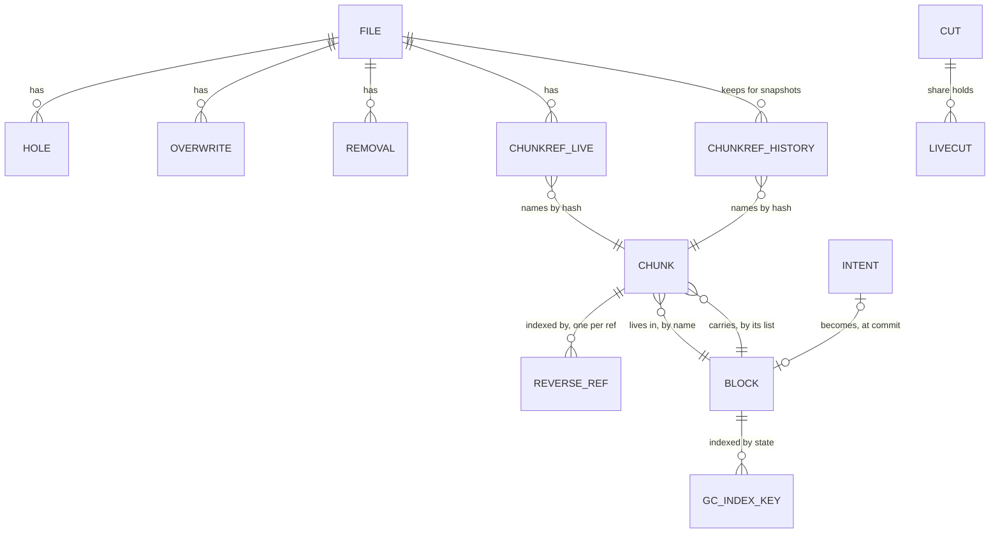

# RFC 6 — block metadata

**Status:** draft.
**Audience:** anyone changing a metadata backend's content records, or anything
that reads them — the read path, offload, sweep.

Conventions, RFC 2119 keywords and test tiers are set once in the
[index](rfc-index.md). This document specifies behaviour, not the current code;
[Appendix A](#Appendix%20A%20%E2%80%94%20where%20the%20current%20code%20differs) lists where the code differs, as defects to fix, never
rules to build around.

---

## Start here

*Explanatory. The rules are in §1 onward; where this section and a rule differ, the rule wins.*

Block metadata is the ledger of what each file's content is made of. For every
byte offset of every file it answers: was anything ever written here, which
chunk holds it, which block in the remote store holds that chunk, and how many
files still use that chunk. The read path asks it where bytes are; GC (garbage
collection) asks it what is safe to delete. It lives in the metadata store, the
same transactional database as the names and directories ([RFC 7](rfc-7-namespace-metadata.md)).

In outline: clients write over NFS (Network File System) or SMB (Server Message
Block) into a local journal and are acknowledged from there; later the bytes
are cut into chunks of about 256 KiB, each named by the hash of its content,
packed into blocks of about 4 MiB and uploaded to an S3 (Simple Storage Service)
bucket; then the local copy may be dropped ([RFC 0](rfc-0-data-lifecycle.md)).
Block metadata records each step only once it has happened.

### The problem, in one example

alice's profile disk is `profiles/alice/ODFC_alice.vhdx`, a 30 GB virtual hard
disk file on node N1. Its journal is on one NVMe disk; its blocks go to the
bucket `dfs-data`. Every write the journal stages gets a **version**, higher
than any before it for that file.

1. **09:00.** alice-pc writes 1 MiB at offset 4 GiB, version v1, into a part of
   the disk never written before, then sends an SMB flush. The flush is answered
   once the journal has synced the bytes; within a second the journal's group
   commit records in metadata that the extent exists. Only the journal holds the
   bytes.
2. **09:02.** The extent is uploaded. Chunk `A` goes into block `K1`, and once
   the store reports `K1` stored, so it is offloaded, one transaction records: a **ref** saying
   "these bytes are chunk `A`, from version v1"; a chunk record saying `A` sits
   in `K1` at a given offset, used once; a block record saying `K1` holds one
   used chunk.
3. **09:05.** Her mail client rewrites 64 KiB at 4 GiB + 128 KiB, version v2,
   and flushes. The file's size does not change, and the ref still says `A`,
   v1. This write replaces content whose existence is committed, so the flush
   waits for the existence commit, which writes an **overwrite record**: this
   64 KiB was replaced at v2.
4. **09:06.** Before v2 is uploaded, the NVMe disk fails. v2 is gone.
5. **09:10.** The mail client reads those 64 KiB back.
   - **Without the overwrite record**, a ref covers the extent and the journal
     has nothing, so the read fetches `A` from `K1` and returns the 09:00 bytes
     as current. The mailbox database gets a page five minutes old, and nothing
     reports it.
   - **With it**, the overwrite's v2 is newer than the ref's v1, so the extent
     counts as *uncarved*: written, with no current chunk. With no journal copy
     that is **Lost**, and the read fails with an error. The rest of the 1 MiB
     is still fetched from `K1`.
6. **Had the disk survived**, the next upload would write a ref with version v2
   over the extent, which makes it current again, and N1 would later delete the
   overwrite record. The upload itself never touches that record, so uploads
   and alice's writes never contend for one record.

```text
 ODFC_alice.vhdx  4 GiB ─────────────────────────────── 4 GiB + 1 MiB
 refs             [ chunk A, from v1 .......................... ]
 overwrite set           [ 64 KiB, v2 ]
                               │ v2 newer than v1: uncarved
                   journal has it ──► serve it locally
                   journal lost it ─► fail as Lost, never A's old bytes

 ref ──by hash──► Chunk(A) ──by name──► Block(K1) ──► object in dfs-data
                  where A sits,          chunks still in use,
                  refcount 1             retired at zero, then deleted
```

### The words you need

- **[Ref](rfc-0-data-lifecycle.md#Glossary)**: "these bytes of this file are
  that extent of that chunk", with the versions they came from. It names the
  chunk by hash, never the block ([§2.1](#2.1%20ChunkRef)).
- **Chunk record** and **block record**: where a chunk's bytes sit and how many
  refs name it; how many of a block's chunks are still in use, and its state on
  the way to deletion ([§2.2](#2.2%20Chunk), [§2.3](#2.3%20Block)).
- **Hole, uncarved, carved**: the three answers for an offset inside the file —
  never written; written but with no current chunk; covered by a current chunk
  ([§3.2](#3.2%20Every%20offset%20is%20in%20exactly%20one%20class)).
- **Overwrite set**: the extents where a committed write replaced content whose
  existence was already committed — carved or not yet — each with the version
  that replaced it ([§3.3](#3.3%20Holes%2C%20not%20written%20extents)).
- **[Version](rfc-0-data-lifecycle.md#2.1%20Entities)**: the number the journal
  gives each write and removal of one file; where two cover the same byte, the
  higher wins.
- **Refcount**: the number of refs naming a chunk, live or kept for a snapshot;
  an index of those refs is the authority it is checked against
  ([§6.1](#6.1%20A%20refcount%20is%20exactly%20its%20refs)).
- **Removal**: a truncate, deallocate, delete or clone target, recorded in one
  small transaction and then applied to refs in batches bounded by a key budget
  ([§6.2](#6.2%20Truncation%20and%20deallocation)).

### What this RFC promises

- A flushed write whose local copy is lost before upload reads back as an
  error, never as zeros and never as older content — in the file, in a
  snapshot, and in a clone of either — once its existence has committed: before
  the flush is answered for an overwrite of committed content, within the
  existence age for an append or a hole fill. A flushed overwrite never reads
  back as the content it replaced.
- An extent never written reads as zeros with no fetch.
- No chunk or block is recorded until its block is stored.
- A chunk's refcount is exactly the refs naming it, changed in the same
  transaction; a block is deleted only after a check finds no ref to any chunk it
  holds.
- Uploads and client writes never write the same record, and a commit costs what
  it changed, not the size of the file, so a 30 GB disk rewritten all day stays
  cheap to commit; a truncate or delete returns after one small transaction.

### How the rest is organised

[§2](#2.%20The%20records) lists the records, and
[§2.7](#2.7%20A%20file%27s%20life%2C%20record%20by%20record) follows one file
through them from create to delete: read it first.
[§3](#3.%20Existence) is existence, holes and the overwrite set;
[§4](#4.%20The%20offload%20commit) the commit after an upload;
[§5](#5.%20Write%20sets) why uploads and writes never collide, and cost bounds;
[§6](#6.%20Reference%20counting) counting, removals, snapshots and clones;
[§7](#7.%20What%20sweep%20needs%20from%20this%20component) what GC relies on;
[§8](#8.%20Queries) the read-side queries. [§9](#9.%20Invariants) lists the
invariants and [§11](#11.%20Conformance) the checks. On a first read, skip
[§6.5](#6.5%20Who%20owns%20a%20ref) (snapshots), §7, §10 and the appendices.

## 1. Purpose

Block metadata is the source of truth for file content: which chunks make up each
file, which block holds each chunk, which blocks exist remotely, and what state
each of them is in. It is the second oracle of [RFC 0 §4.1](rfc-0-data-lifecycle.md#4.1%20The%20two%20oracles), and it answers, for any
offset of any file:

> **Does content exist here, which chunk holds it, which block holds that chunk,
> and is that block stored?**

It also counts references, so that sweep can tell what is safe to delete
([RFC 0 §8.3](rfc-0-data-lifecycle.md#8.3%20Sweep)).

It is a **ledger**, not an observer. Every fact in it was observed by another
component and delivered by the engine — existence by the write path, chunks by
the carver, offloads by the syncer. Its job is to record those facts atomically
and answer from them without distortion.

The engine is its caller on the content path: write, offload, read, truncate,
clone. Two other components hold narrow views, wired by whoever composes them
([RFC 15](rfc-15-topology.md)): the filesystem service reads `size` and write-time attributes as fields of
`File`, joined with the engine's overlay ([RFC 7 §2.5](rfc-7-namespace-metadata.md#2.5%20Where%20%60size%60%20lives)), and GC retires blocks, relocates and audits ([§7](#7.%20What%20sweep%20needs%20from%20this%20component)). Releasing a
file reaches this component only through the engine's `Release`, which drops the
refs and the journal's copy together ([RFC 8 §12.1](rfc-8-engine.md#12.1%20One%20content%20facade%2C%20called%20by%20the%20filesystem%20service), [RFC 7 §4.3](rfc-7-namespace-metadata.md#4.3%20Release%20is%20what%20block%20metadata%20sees)).

### 1.1 Non-goals

Block metadata **MUST NOT**:

- record where bytes sit on local disk, or whether they are local at all — that
  is the journal's question, and residency is computed, not stored
  ([RFC 0 §4.2](rfc-0-data-lifecycle.md#4.2%20The%20residency%20function)). It knows which content has an offloaded copy (a carved
  offset, [§3.2](#3.2%20Every%20offset%20is%20in%20exactly%20one%20class)); it **MUST NOT** try to know whether that content is also local;
- observe offload — it records reports ([RFC 0 §4.3](rfc-0-data-lifecycle.md#4.3%20Reporting), [RFC 3 §2.7](rfc-3-syncer.md#2.7%20It%20reports%3B%20it%20does%20not%20persist));
- own names, directories, attributes, handles, permissions or locks — those are
  [RFC 7](rfc-7-namespace-metadata.md)'s;
- decide what to offload, evict or sweep — it supplies the atomic operations those
  decisions need and nothing more;
- import another component in this set ([RFC 0 §1.2](rfc-0-data-lifecycle.md#1.2%20Component%20autonomy)).

### 1.2 Why it is a separate RFC from the namespace

RFC 7 and this document describe one file from two sides, in one database.
RFC 7 owns the `File` value and the entries naming it; this document owns what
the file's content is made of. Neither writes the other's records, with one
seam: the `File` value carries fields only the write path sets — `size`, the
write-time `Modify` and `Change`, and `applied` — which this document calls
**FileData** ([§2.4](#2.4%20FileData%20and%20holes)) and RFC 7 reads but never writes ([RFC 7 §2.5](rfc-7-namespace-metadata.md#2.5%20Where%20%60size%60%20lives)).

They are specified separately because their write patterns differ in kind:

| | Namespace metadata ([RFC 7](rfc-7-namespace-metadata.md)) | Block metadata (this RFC) |
| --- | --- | --- |
| Written by | client operations | client writes *and* background offload |
| Unit | one entry | one extent, one chunk, one block |
| Rate | per operation | per stability point, and per chunk at offload |
| Grows with | directory size | file size |

**One database.** Both **MUST** live in one physical database, because two
rules need a transaction or a consistent read that spans them: `GETATTR` reads
the `File` with its FileData fields ([RFC 7 §9.1](rfc-7-namespace-metadata.md#9.1%20Attributes%20are%20answers%2C%20not%20caches)), and an unlink that ends a file's
life records its pending release in the transaction that removes the last entry
([RFC 7 §4.3](rfc-7-namespace-metadata.md#4.3%20Release%20is%20what%20block%20metadata%20sees)). Across two databases each needs a cross-store protocol whose failure
modes are the torn states this document forbids.

**The real boundary is per-file against content-addressed**, not namespace
against content. Every record in this document is one of two kinds:

| | Per-file | Content-addressed |
| --- | --- | --- |
| Records | FileData, Hole, Overwrite, Removal, ChunkRef (live and history), fences | Chunk, Block, put intent, GC index keys |
| Keyed by | `FileID` | chunk hash or block name |
| Written by | the write path, removals, and the offload commit for the refs it adds | the offload commit, relocation and GC |
| Reached by a client operation | yes | never directly |

Per-file records of one file — namespace and block metadata alike — **MUST**
share one key prefix built from the file's `ShareID` and `FileID`, so a release,
a `GETATTR` or an existence commit touches one contiguous range, and on a store
that splits its keyspace into ranges usually one range. A share's records are then one
range too, which makes deleting or exporting a share a prefix operation rather
than a tree walk. Content-addressed records are global to their namespace
([§2.6](#2.6%20The%20scope%20of%20a%20count)) and cannot be co-located with any file: a chunk is shared by
every file that references it. Only the offload commit, a removal's batches
and GC cross from per-file records to content-addressed ones, and none of them
is on a client's path.

That is also where a future split would cut ([§12](#12.%20Open%20questions)). The concrete key layout
is [RFC 16 §4.2](rfc-16-metadata-store.md#4.2%20Keys%3A%20per-file%2C%20per-share%2C%20content-addressed).

## 2. The records

Block metadata holds three things — a file's **existence**, its **content map**,
and the **blocks** the content lives in — in seven kinds of content record, plus
the records shard placement, snapshots and sweep need. Each record is keyed by exactly
one thing, answers exactly one question, and none holds a list that grows with
its file.

Callers see three **entities** from this document
([RFC 16 §2](rfc-16-metadata-store.md#2.%20Entities)): `ChunkRef`, `Chunk` and `Block`. The rest — FileData (fields of
RFC 7's `File`), Hole, Overwrite, Removal, the fences, Cut and LiveCut, put intents,
the reverse ref index, the GC index keys and the chunk change stamp — are **bookkeeping
records**: they exist for this document's guarantees, stay behind its
interfaces ([§10.1](#10.1%20Interface)), and are not entities. Holes reach a caller only as the answer
to `Allocation`.

```go
type (
	ChunkHash      [32]byte // keyed hash of a chunk's plaintext under its namespace's chunk-ID key (RFC 2 §4)
	BlockName      [32]byte // one remote object, minted per put attempt (§7.6)
	JournalVersion [16]byte // orders content writes inside one journal (RFC 1 §5.3)
	SnapshotCut    uint64   // numbers a share's snapshots in order (§6.5); defined here only
)

// ChunkRef: these bytes of this file are that run of that chunk's bytes (§2.1).
// Died is zero for a live ref; a ref a snapshot still sees after it was
// superseded has Died set to its successor's Born — that is a
// History record (§6.5).
type ChunkRef struct {
	File           FileID
	Offset, Length int64
	Chunk          ChunkHash      // zero: a zero ref, never counted (§3.5)
	Skip           int64          // offset into the chunk
	Oldest, Newest JournalVersion // journal versions the bytes came from
	Born, Died     SnapshotCut
	NSGen          uint32         // namespace generation the chunk is counted in (§2.6)
}

// Chunk: one content-addressed chunk and where its bytes are (§2.2).
type Chunk struct {
	Hash     ChunkHash
	Block    BlockName
	Position int64
	Length   int64
	Refcount int64 // live refs plus history refs (§6.1)
}

// Block: one remote object (§2.3).
type Block struct {
	Name       BlockName
	State      BlockState // live, retired or deleted (§2.3, RFC 9 §3.1)
	NotBefore  time.Time  // store time; earliest the deleter may delete it, set at retirement (§2.3)
	Live       int64      // chunk records naming it with a nonzero refcount
	Dead       int64      // bytes of carried chunks dead here (§2.3)
	DeadAt     time.Time  // store time Dead last grew (§2.3)
	Size       int64      // the block's encoded bytes (§2.3)
	Carried    []Carried  // every chunk it carries, in order; written once (§2.3)
	Generation uint8      // 0 from offload; one above its highest source from compaction
	Encodings  []Encoding // how it was written (RFC 5 §5.3)
}

// BlockState: GC's state machine for one block (RFC 9 §3.1).
type BlockState uint8

const (
	BlockLive BlockState = iota
	BlockRetired
	BlockDeleted
)

// Carried: one chunk a block carries, and its body's encoded length there.
type Carried struct {
	Hash   ChunkHash
	Length int64
}

// Span: one run of a covering lookup or an allocation answer (§3.2, §8.1). The
// one definition: RFC 8's facade returns it from Allocation too.
type Span struct {
	Offset, Length int64
	Class          Class          // Hole, Uncarved or Carved (§3.2)
	Ref            ChunkRef       // the covering ref, when Carved
	Overwrite      JournalVersion // when an overwrite record made it Uncarved, that record's version (§8.1)
	Applied        JournalVersion // the file's applied when the lookup read it, on every Span (§8.1)
}

// Pure methods: no I/O, no store. Each states one rule of this document once,
// following [RFC 16 §2.4](rfc-16-metadata-store.md#2.4%20Methods%20on%20entities)'s convention.
func (c ChunkRef) End() int64                   // Offset + Length
func (c ChunkRef) IsLive() bool                 // Died == 0
func (c ChunkRef) VisibleAt(k SnapshotCut) bool // Born < k ≤ Died, or live and Born < k (§6.5)
func (b Block) Retired() bool                   // Live == 0; its state is retired or later (§7.1)
```

"Ref" in the rest of this document is shorthand for `ChunkRef`, and a history
ref is a `ChunkRef` with `Died` set.


| Concept | Record | Keyed by | Holds | Answers |
| --- | --- | --- | --- | --- |
| Existence ([§3](#3.%20Existence)) | **FileData** | `FileID` — fields of RFC 7's `File` value | size, `applied` version, `Version`, `Charged`, write-time `Modify` and `Change` | how long is the file, when was it written, what is it charged, and up to which journal version is that recorded? |
| | **Hole** | `(FileID, start)` | end | was this extent never written? |
| | **Overwrite** | `(FileID, start)` | end, overwriting version, `born` | did a committed write replace content here whose existence committed before it, and at which version? ([§3.3](#3.3%20Holes%2C%20not%20written%20extents)) |
| | **Removal** | `(FileID, version)` | removed extent, kind, `cut`, cursor, done, and for a clone its clone spec | what did a truncate, deallocate, release or clone remove, at which version and which snapshot cut, what does a clone adopt from, and how far has dropping its refs got? |
| | **Version index** | `(ShareID, bucket, version, FileID)`, one entry per File at its stored `Version`, plus one per unfolded directory delta | — | what is the highest version this store records for a share? ([§8.3](#8.3%20A%20file%27s%20refs%20and%20the%20version%20floor)) |
| Content map ([§2.1](#2.1%20ChunkRef)) | **ChunkRef** | `(FileID, offset)` | chunk hash, skip, length, content versions, `born` | which bytes of which chunk are these? |
| | **History** | `(FileID, died, offset)` | a `ChunkRef` as it was, with `Died` set to its successor's `born` | which bytes did a snapshot see here? |
| | **Chunk** | `(namespace, chunk hash)` | block name, position in block, refcount, change stamp | where is this chunk, and how many refs name it? |
| | **Reverse ref** | `(namespace, chunk hash, share, file, offset, died)` | — | which refs name this chunk? Authoritative; the refcount is its cache ([§6.1](#6.1%20A%20refcount%20is%20exactly%20its%20refs)) |
| Blocks ([§7](#7.%20What%20sweep%20needs%20from%20this%20component)) | **Block** | `(namespace, block name)` | GC state and `not_before`, live-chunk count, dead bytes and when they last grew, generation, size, encodings, carried chunk list | may this remote object be deleted, when, what does it carry, and how was it written? |
| Placement ([§5.4](#5.4%20Reads%20that%20gate%20a%20commit)) | **Fence** `F_x`, `F_o` | `FileID` | the (shard, epoch) of the file's primary | is the writer on this path, or the namespace transaction guarding it, still the file's primary? |
| Snapshots ([§6.5](#6.5%20Who%20owns%20a%20ref)) | **Cut** | `ShareID` | latest cut number `k`, newest live cut `klatest`, latest cut time, the cut a running deletion removes | which cut does a commit fall after, and must a superseded ref move to history? |
| | **LiveCut** | `(ShareID, k)` | — | which cuts do live snapshots hold? |
| | **Died index** | `(ShareID, died, FileID, suffix)` | — | which history must a snapshot deletion visit? One key per history record, ref or namespace ([RFC 12 §2.2](rfc-12-snapshots.md#2.2%20A%20snapshot%20is%20counted%20content%20and%20a%20frozen%20tree)) |
| Sweep ([§7](#7.%20What%20sweep%20needs%20from%20this%20component)) | **Put intent** | `(namespace, block name)` | domain, domain ID and epoch of the attempt, and the writer's node and node epoch for a shard | which minted names may still be put and committed? |
| | **GC index keys** | `(namespace, block name)`, the retired one by `not_before` first, the compaction one by dead-ratio bucket first | — | which blocks are in the trash, await their delete, or are compaction candidates ([RFC 9 §7.2](rfc-9-gc.md#7.2%20Every%20record%20GC%20stores%20names%20its%20reclamation))? Derived from the block records and rebuildable ([RFC 9 §7.4](rfc-9-gc.md#7.4%20The%20index%20can%20be%20dropped%20and%20rebuilt)) |

Who writes each record:

| | FileData, Hole, Overwrite | Removal | ChunkRef, History | Chunk | Block | `F_x` | `F_o` | Cut, LiveCut | Put intent | GC index keys |
| --- | --- | --- | --- | --- | --- | --- | --- | --- | --- | --- |
| Existence commit | writes | — | — | — | — | reads | — | — | — | — |
| Overwrite pruning ([§3.3](#3.3%20Holes%2C%20not%20written%20extents)) | deletes Overwrite | — | reads | — | — | — | reads | — | — | — |
| Writer before a put ([§7.6](#7.6%20Put%20intents)) | — | — | — | — | — | — | — | — | creates | — |
| Offload commit | — | reads | writes | creates, counts | creates, counts | — | reads, writes | reads `Cut` | deletes | writes |
| Removal, phase 1 ([§6.2](#6.2%20Truncation%20and%20deallocation)) | writes FileData and Hole | writes | — | — | — | writes | writes | reads `Cut` | — | — |
| Removal, phase 2 | drops Hole; drops and narrows Overwrite, point-reading each key it rewrites; the last batch of a deallocate writes its merged Hole | advances | writes | counts | counts | — | reads | reads `Cut` | — | writes |
| Primary under a new epoch ([§5.4](#5.4%20Reads%20that%20gate%20a%20commit)), lazily per file | — | — | — | — | — | writes | writes | — | — | — |
| Namespace transaction ([RFC 7](rfc-7-namespace-metadata.md)) | — | — | — | — | — | guards | — | — | — | — |
| Snapshot cut or deletion ([§6.5](#6.5%20Who%20owns%20a%20ref)) | — | — | drops History | counts | counts | — | — | writes | — | writes |
| Relocation, abandonment, the deleter, prune ([§7](#7.%20What%20sweep%20needs%20from%20this%20component)) | — | — | — | moves, prunes | creates, changes state, prunes | — | — | — | creates, deletes | writes, deletes |

Reverse ref keys are written and deleted by exactly the transactions that write
ChunkRef and History records, and by nothing else. Retirement and resurrection
are not rows of their own: they are part of whichever transaction moves a
block's `live` across zero.

The offload commit writes three records in one transaction because it records one
event — a block became stored — and those are its three consequences ([§4.1](#4.1%20What%20one%20commit%20records)).
Each merge that would remove a record kind moves a cost somewhere this document
forbids: a list that grows with the file (I7), a keyspace the write path and the
offload share ([§5.1](#5.1%20No%20record%20is%20written%20by%20both%20paths)), or a location rewritten in every ref on relocation ([§2.5](#2.5%20Refs%20name%20hashes%2C%20never%20blocks)).
The block's `live` is derivable from chunk records, and a chunk's refcount from
its reverse keys; both are kept materialised because they are what a
transaction tests in O(1), and the block record is the one key resurrection and
the deleter conflict on ([§7.1](#7.1%20Conditional%20retirement)).

### 2.1 ChunkRef

A ref says: *these bytes of this file are that extent of that chunk.* It is
[RFC 0](rfc-0-data-lifecycle.md)'s **chunk ref**:

    ChunkRef(file, offset) = { chunk, nsgen, skip, length, oldest, newest, born, died }

- `file` is the file that owns the ref, never a name ([§6.5](#6.5%20Who%20owns%20a%20ref)). A ref a
  snapshot still sees after the file superseded it moves to History, keyed by
  the same file ([§6.5](#6.5%20Who%20owns%20a%20ref)).
- `offset` is where in the file the ref's bytes begin.
- `chunk` is the `ChunkHash` naming the chunk, never a block ([§2.5](#2.5%20Refs%20name%20hashes%2C%20never%20blocks)). A **zero ref** names no chunk:
  its bytes are all zeros, and it reads as zeros without a fetch ([§3.5](#3.5%20Operations%20that%20make%20holes)).
- `nsgen` is the generation of the share's namespace the chunk is counted in
  ([§2.6](#2.6%20The%20scope%20of%20a%20count)). A share has one generation outside a re-home and two during one
  ([RFC 27 §2.7](rfc-27-namespace-migration.md#2.7%20Moving%20one%20share%20out%20of%20a%20shared%20namespace)).
- `skip` and `length` select `[skip, skip + length)` of the chunk's bytes.
- `oldest` and `newest` bound the journal content versions of what the ref
  describes (below).
- `born` is the cut the existence commit of its bytes read, and `died` its
  successor's `born` (zero while the ref is live); they
  alone decide which snapshots see the ref ([§6.5](#6.5%20Who%20owns%20a%20ref)).

To read offset *x*, take the ref with the greatest `offset` ≤ *x*. If
*x* < `offset + length`, the byte at *x* is byte `skip + (x − offset)` of chunk
`chunk`. Otherwise no ref covers *x*, and existence says whether it is a hole or
uncarved ([§3.2](#3.2%20Every%20offset%20is%20in%20exactly%20one%20class)).


A ref **MUST** be able to name a strict sub-extent of its chunk, because truncate
narrows the tail of one and deallocating the middle of a chunk leaves two refs to
it with different `skip`. Refs of one file **MUST NOT** overlap: in offset order
they tile the parts of the file that have been carved and committed.

**Why a ref carries content versions.** Every operation the journal stages gets a
version higher than any before it for that file ([RFC 1 §5.3](rfc-1-journal.md#5.3%20Versions)). An offload pass is
offered extents whose versions lie in `[Oldest, Newest]` ([RFC 1 §3.3](rfc-1-journal.md#3.3%20Offload)), and the
commit records that version range on every ref the pass writes. It has three uses:
ordering commits ([§4.4](#4.4%20Commits%20for%20one%20file%20apply%20in%20order)), dropping refs a removal covers ([§6.2](#6.2%20Truncation%20and%20deallocation)), and checking
the journal's offloaded bits after a crash ([RFC 1 §9.2](rfc-1-journal.md#9.2%20Offload%20state%20after%20recovery)). The last is why position
alone is not enough:

1. Write version 1 over `[0, 4M)` and offload it. The ref `(f, 0)` records
   `newest = 1`.
2. Write version 2 over `[0, 1M)`. The journal holds it; it is not offloaded yet.
3. Crash and recover. The journal holds version 2 at `[0, 1M)`, and the ref still
   covers `[0, 4M)`.
4. Judged by position, the ref covers `[0, 1M)`, so it is offloaded, and eviction
   may drop version 2. The next read fetches version 1: an acknowledged write is
   gone, and nothing reports it.

With the versions, `MarkOffloaded(f, [0, 4M), 1, 1)` leaves `[0, 1M)` unmarked,
because the journal holds version 2 there.

**A ref is its own record.** An implementation **MUST NOT** store a file's refs as
one value, one document or one row holding the list. A list costs a rewrite of
the whole list per commit — O(*N*²) to write a file of *N* chunks — and makes it
a key every offload and writer contend on ([§5](#5.%20Write%20sets)). A backend that holds a list at
all **MUST** satisfy I7 ([RFC 0 §9.1](rfc-0-data-lifecycle.md#9.1%20Records%20and%20their%20reclamation)) at the list's worst-case encoded size.

### 2.2 Chunk

    Chunk(hash) = { block, position, length, refcount, stamp }   // stamp is internal, not on the entity

A chunk is keyed by its content hash and by nothing else ([RFC 2 §4](rfc-2-carver.md#4.%20Identity)). There is
**one chunk record per hash** in a namespace ([RFC 2 §4.3](rfc-2-carver.md#4.3%20Key%20scope)), however many files and
offsets use it.

`block` and `position` locate the chunk's bytes: the block that carries it, and
the offset and length of its body in the encoded block, as the block's header
records them ([RFC 4 §3.2](rfc-4-remote-tier.md#3.2%20Layout)). They are recorded from the encoder's output at commit,
never computed from local offsets, because transforms change body lengths.
A name is minted for one put attempt and put only by it, and a retry within the
attempt writes the same bytes ([§7.6](#7.6%20Put%20intents), [RFC 5](rfc-5-transforms.md)); a recorded position is
therefore never stale, and nothing rewrites it except relocation ([§7.3](#7.3%20Relocation)). A
ranged read that fails verification is corrupt.

`stamp` is replaced with a fresh value by every transaction that creates,
deletes, moves or narrows a ref naming this chunk, whether or not the refcount
changes. It lets the audit tell that the record changed under its walk
([§7.5](#7.5%20Audit)), and every transaction that adds a ref writes the record, which is what
the deleter's check guards on ([§7.1](#7.1%20Conditional%20retirement)). A random 64-bit value suffices; it **MUST NOT** be a counter shared
across chunks.

A chunk record outlives its block's retirement: it keeps naming a `retired` or
`deleted` block until that block is pruned or a carrying commit repoints it
([§7.2](#7.2%20Adoption%20is%20conditional%20on%20existence)).

### 2.3 Block

    Block(name) = { state, not_before, live, dead, dead_at, generation, size, encodings, carried }

`state` is `live`, `retired` or `deleted`: GC's state machine for the block,
kept on the record itself ([RFC 9 §3.1](rfc-9-gc.md#3.1%20Retire%20the%20records%2C%20then%20delete%20the%20object)). `not_before` is set at retirement, in
store time, and is the earliest time the deleter may delete the object
([RFC 9 §3.7](rfc-9-gc.md#3.7%20Trash)). `dead` is the bytes of the chunks this block carries that are dead
here — whose refcount is zero, or whose record names another block — maintained
in every transaction that moves one of its refcounts across zero, and `dead_at`
is the store time `dead` last grew; with `size`, the block's encoded bytes, they
give the compactor's score ([RFC 9 §4.4](rfc-9-gc.md#4.4%20When%20to%20compact%20is%20policy)). `generation` is 0 for a block an
offload wrote, and one above its highest source, capped at 2, for a compaction
target ([RFC 9 §4.5](rfc-9-gc.md#4.5%20Where%20survivors%20are%20placed)). Each transaction that changes these writes or deletes the
block's GC index keys ([RFC 9 §7.2](rfc-9-gc.md#7.2%20Every%20record%20GC%20stores%20names%20its%20reclamation)).

`carried` lists every chunk the block carries — hash and encoded body length —
in the block's order, whether the block owns the chunk's record or carries a dead
copy. It is written once by the commit or relocation that creates the record and
never changes. It is bounded by the format's chunk-count cap `N`
([RFC 2 §5](rfc-2-carver.md#5.%20The%20block%20assembler)): 36 bytes an entry, at most 36 KiB at `N` = 1,024. The deleter's
check, pruning, the compactor's plan and the audit's block walk read chunk
records by point reads of these hashes, and never scan chunk records or read the
remote header.

`live` is the number of chunk records that name this block and whose refcount is
nonzero. A chunk this block carries whose record names another block is dead
weight here and is not counted ([§4.1](#4.1%20What%20one%20commit%20records)). A block is `retired` when, and only when,
`live` is zero ([§7.1](#7.1%20Conditional%20retirement), [RFC 0 §8.3](rfc-0-data-lifecycle.md#8.3%20Sweep)).

The name is minted per put attempt from a fresh nonce ([RFC 2 §4.2](rfc-2-carver.md#4.2%20A%20block),
[§7.6](#7.6%20Put%20intents)), so nothing about a later name needs deriving from this record:
`generation` is the block's compaction depth and is never an input to a name.

`encodings` lists the transform IDs and versions the block's bodies use, and the
material each used as (material ID, fingerprint), as the store reported them at
the put ([RFC 5 §5.3](rfc-5-transforms.md#5.3%20Retiring%20material%20or%20a%20transform%20needs%20a%20census)). The transform census and exports read it
([RFC 26 §2.1](rfc-26-catalog-backups.md#2.1%20A%20backup%20is%20an%20export%20of%20one%20snapshot%27s%20metadata)); the read path never does.

A block record has **no offloaded flag**: by [§4.2](#4.2%20Only%20after%20the%20block%20is%20stored) it exists only once its block
is offloaded.

**Where a block is.** Not on the block record: it is the share's remote store (a
setting, [RFC 13](rfc-13-configuration.md)) plus the block name, which is the object key ([RFC 4 §4.2](rfc-4-remote-tier.md)).
Every block of one namespace lives in one store, so a field on each block would
repeat that on every record. If one namespace ever spans several stores —
tiering, or moving between buckets — `Block` gains a `Store` field then.

### 2.4 FileData and holes

    FileData(file)         = { size, applied, Version, Charged, Modify, Change }   // fields of RFC 7's File value
    Hole(file, start)      = { end }
    Overwrite(file, start) = { end, version, born }
    Removal(file, version) = { start, end, kind, cut, cursor, done, clone }   // clone: { src, srcOff, dstOff, len, asOf }, kind clone only

**FileData is not a record of its own.** It names the fields of the one `File`
value ([RFC 7 §2.1](rfc-7-namespace-metadata.md#2.1%20File)) that only the write path sets: `size`, `applied`, the
write-time `Modify` and `Change`, and, with every other writer of the File,
`Version` and `Charged`. They are persisted in the File's one key
([RFC 16 §4.2](rfc-16-metadata-store.md#4.2%20Keys%3A%20per-file%2C%20per-share%2C%20content-addressed)); what makes them this document's is who may write them, not where
they sit. Every rule below that says "FileData" means those fields.

A hole record is one extent `[start, end)` below `size` that was never written,
or was deallocated. A file's holes never overlap or touch — adjacent holes merge
— and a dense file has none. A hole is its own record for the reason a ref is.

An overwrite record is one extent `[start, end)` whose existing content a
committed write replaced, and `version`, the journal version of the newest write
that did; `born` versions it for snapshots like every namespace record
([§6.5](#6.5%20Who%20owns%20a%20ref)). The file's overwrite records are its **overwrite set**; they never
overlap one another, and a dense file that is only appended to has none. An
offset in the overwrite set whose covering ref's `newest` is below the record's
`version` is uncarved, whatever that ref says ([§3.3](#3.3%20Holes%2C%20not%20written%20extents)).

`Modify` and `Change` are the times of the last write, set here so that a write
touches one record ([RFC 7 §2.5](rfc-7-namespace-metadata.md#2.5%20Where%20%60size%60%20lives)).

**An existence commit advances `Version`** ([RFC 7 §2.1](rfc-7-namespace-metadata.md#2.1%20File)), as any content
change must, so a client's change attribute moves with size and mtime; the
engine's overlay reports `Version` beside size and times for bytes not yet
committed ([RFC 8](rfc-8-engine.md)). It also sets `Charged`, the file's logical bytes
excluding holes, and writes the change as a usage delta
([RFC 16 §4.4](rfc-16-metadata-store.md#4.4%20Counters%20that%20many%20writers%20change)); a removal's phase 1 lowers it the same way.

`applied` is the newest journal version whose existence change this FileData
records. A commit of pending existence advances it, which makes the commit
idempotent and tells recovery where to resume ([§3.4](#3.4%20Ordering%20against%20the%20journal)).

A removal record names an extent removed by a truncate (`[new size, ∞)`), a
deallocate, a release (`[0, ∞)`) or a clone's destination, at the **journal
version of that operation** ([§6.2](#6.2%20Truncation%20and%20deallocation)). An offload commit drops any of its refs
whose `newest` is below the version of an overlapping removal: that content was
offered before the removal and is gone. A version, not a clock, because two
operations in one tick look identical; and not the file's latest version, which
every write advances, so every offload would conflict with every write — the
livelock [§5.1](#5.1%20No%20record%20is%20written%20by%20both%20paths) forbids.

`cut` is the share's cut number `k` that the removal's phase 1 read
([§6.5](#6.5%20Who%20owns%20a%20ref)). It is the snapshot boundary of the removal: every ref the removal
drops dies at `cut`, unless an earlier overwrite already superseded it
([§6.2](#6.2%20Truncation%20and%20deallocation)), and a snapshot after `cut` must not see what the removal
removed even while phase 2 has not reached it ([§8.1](#8.1%20Covering%20lookup)). A clone's
destination refs are born at it ([§6.6](#6.6%20Clone%20and%20server-side%20copy)).

It is also the durable intent of the removal's second phase: `kind` says which
operation wrote it, `cursor` is the offset up to which its refs have been dropped,
and `done` says the drop finished ([§6.2](#6.2%20Truncation%20and%20deallocation)). While `done` is false, the removal
masks the refs it will drop ([§8.1](#8.1%20Covering%20lookup)). A clone's removal also carries the **clone
spec** — source file, source offset, destination offset, length and the source
journal position `asOf` — so its adoption resumes from this record alone
([§6.6](#6.6%20Clone%20and%20server-side%20copy)).

### 2.5 Refs name hashes, never blocks

A ref **MUST NOT** carry a block key or a position in a block. The indirection is
what lets a chunk move: relocating it rewrites one chunk record ([§7.3](#7.3%20Relocation)). If refs
carried the location, the same move would rewrite every ref of every file sharing
the chunk, and any copy of the refs taken earlier would name a block that no
longer exists.

### 2.6 The scope of a count

A refcount is only as good as the set of refs it counts. If a ref exists that the
count does not include, the count is low, and sweep deletes referenced content.

The records of [§2](#2.%20The%20records) **MUST** therefore be counted in **one keyspace partition per
remote key namespace** ([RFC 2 §4.3](rfc-2-carver.md#4.3%20Key%20scope)). One database holds every share and
every namespace ([RFC 16](rfc-16-metadata-store.md)), so the partition is in the key: every
content-addressed record — chunk, block, put intent, GC index key — is keyed by `(namespace, …)` ([RFC 16 §4.2](rfc-16-metadata-store.md#4.2%20Keys%3A%20per-file%2C%20per-share%2C%20content-addressed)),
and a share's refs are counted only in the partition of its namespace. While a
share is re-homed it has two ([RFC 27 §2.7](rfc-27-namespace-migration.md#2.7%20Moving%20one%20share%20out%20of%20a%20shared%20namespace)): each ref's `nsgen` names the
one its chunk is counted in, and a read, an adoption or a drop of the ref
resolves the chunk in that namespace only. The
namespace ID is the key scope that key derivation mixes in ([RFC 8](rfc-8-engine.md)), so two
namespaces can never name one object, and no chunk record, count, adoption or
GC pass spans two namespaces. A deduplication lookup, once deduplication is
added ([§8.2](#8.2%20Deduplication%20lookup)), reads only its own namespace's partition.

Two partitions that can name one key, each keeping its own count, are forbidden.

**The absence of a record here MUST NOT be taken as evidence that a remote object
is unreferenced.** It shows only that this store does not reference it. How an
unrecorded object is collected is [RFC 9](rfc-9-gc.md)'s problem.

### 2.7 A file's life, record by record

One file `f`, from create to delete. Block positions ignore framing.

**t0 — create.** `FileData(f)`: size 0, applied 0.

**t1 — write 4 MiB at 0, version v1.** The journal stages the bytes and the
client is acknowledged. No record changes yet: until the stability point the
journal is the authority for this write, and the engine answers `size` from it
([§3.4](#3.4%20Ordering%20against%20the%20journal)).

**t2 — write 1 MiB at 10M, v2, then `COMMIT`.** Both writes only grow the file,
so the `COMMIT` is answered after the journal sync, and the journal's group
commit records both writes' existence in one transaction within the existence
age. The gap before 10M becomes a hole.

| Record | Value |
| --- | --- |
| FileData(f) | size **11M**, applied **2**, mtime and ctime of v2 |
| Hole(f, 4M) | end 10M |

`[0, 4M)` and `[10M, 11M)` are **uncarved**: below `size`, not a hole, no ref
([§3.2](#3.2%20Every%20offset%20is%20in%20exactly%20one%20class)). Only the journal holds the bytes, and `size` is the only record that
says they exist. If the journal loses them, a read fails as **Lost**; it does not
return zeros.

**t3 — offload.** The journal offers both extents, `Oldest` v1 and `Newest` v2.
The carver cuts chunk A (4 MiB) and chunk B (1 MiB), and the engine packs both
into one block and mints its name K1 from a fresh nonce. One transaction writes
`Intent(K1)` with the primary's epoch; then the engine puts K1, and one commit writes:

| Record | Value |
| --- | --- |
| Intent(K1) | **deleted** — consumed by the commit |
| Ref(f, 0) | A, skip 0, length 4M, oldest 1, newest 2 |
| Ref(f, 10M) | B, skip 0, length 1M, oldest 1, newest 2 |
| Chunk(A) | block K1, position `[0, 4M)`, refcount 1 |
| Chunk(B) | block K1, position `[4M, 5M)`, refcount 1 |
| Block(K1) | live 2 |

The commit read `F_o(f)` and found the epoch current, read the file's removals
and found none, and found `Intent(K1)` present. The journal marks both extents
offloaded; they are **Resident** and evictable.

**t4 — overwrite 1 MiB at 1M, v3, and `COMMIT`.** The write replaced content whose
existence was committed, so the `COMMIT` waits for its existence commit
([§3.4](#3.4%20Ordering%20against%20the%20journal)). FileData's `applied` becomes 3 and `size` is unchanged. No ref
changes. The commit records the overwrite:

| Record | Value |
| --- | --- |
| Overwrite(f, 1M) | end 2M, version **3** |

The journal holds v3 at `[1M, 2M)`, newer than the ref's `newest`, so that extent
is **Dirty** again. `Ref(f, 0)` still covers it with `newest` 2, below the
overwrite's 3, so metadata calls it **uncarved**: if the journal now loses v3, a
read fails as **Lost** instead of fetching A's old bytes.

**t5 — offload the overwrite.** The carver cuts chunk C into block K2, minted and
intended like K1, and the commit splits the ref around it:

| Record | Value |
| --- | --- |
| Intent(K2) | deleted |
| Ref(f, 0) | A, skip 0, length **1M**, 1–2 |
| Ref(f, 1M) | **C**, skip 0, length 1M, 3–3 |
| Ref(f, 2M) | A, skip **2M**, length 2M, 1–2 |
| Ref(f, 10M) | B, skip 0, length 1M, 1–2 |
| Chunk(A) | K1, `[0, 4M)`, refcount **2** |
| Chunk(C) | K2, `[0, 1M)`, refcount 1 |
| Block(K2) | live 1 |

A was not rewritten. Its middle MiB is dead weight in K1 that no ref uses.
`Ref(f, 1M)` has `newest` 3, not below the overwrite's version, so `[1M, 2M)` is
carved again from this commit on; the offload commit wrote nothing for that, and
the primary's next pruning deletes `Overwrite(f, 1M)`.

**t6 — truncate to 3 MiB, v4.** The journal truncates and assigns v4; then the
removal runs in two phases ([§6.2](#6.2%20Truncation%20and%20deallocation)). Phase 1, one transaction, touches no ref:

| Record | Change |
| --- | --- |
| FileData(f) | size **3M**, applied **4** |
| Removal(f, 4) | `[3M, ∞)`, truncate, cut 0, cursor 3M, not done |
| Hole(f, 4M) | deleted — past the new end of file |
| `F_x(f)`, `F_o(f)` | rewritten at the current epoch |

The truncate returns. Until phase 2 finishes, a read masks `Ref(f, 2M)` past 3M
and `Ref(f, 10M)` ([§8.1](#8.1%20Covering%20lookup)); both lie past `size` anyway. Phase 2, one
sub-transaction here since both refs fit in one batch:

| Record | Change |
| --- | --- |
| Ref(f, 2M) | narrowed to A, skip 2M, length **1M** |
| Ref(f, 10M) | deleted, so B's refcount goes 1 → **0** |
| Block(K1) | live 2 → **1** |
| Removal(f, 4) | cursor ∞, **done** |

A pass that had been offered the 11 MiB file at versions up to 3 and commits now
finds `Removal(f, 4)` and drops its refs that overlap `[3M, ∞)`. Once no pass
offered below v4 is in flight, the primary prunes the removal.

**t7 — delete.** The namespace releases the file through the engine's `Release`
([RFC 7 §4.3](rfc-7-namespace-metadata.md#4.3%20Release%20is%20what%20block%20metadata%20sees)). Phase 1 deletes the File record, and with it the FileData fields, and writes `Removal(f, 5) = [0, ∞)`,
kind release; phase 2 drops the three refs and their reverse keys. K1's and K2's
`live` reach 0, and the sub-transaction that takes each to zero retires it:
Block(K1) moves to `retired` with `not_before` one trash retention ahead
(`gc.trash_retention`, [RFC 9 §3.7](rfc-9-gc.md#3.7%20Trash); 48 h by default), and Chunk(A) and
Chunk(B) stay, still naming K1, so a clone or restore that names A or B within
that time resurrects K1. An offload of the same content does not: it carries the
bytes, and its commit repoints Chunk(A) and Chunk(B) to its own block
([§7.2](#7.2%20Adoption%20is%20conditional%20on%20existence)). After `not_before` the deleter finds no
reverse key under A or B, moves K1 to `deleted`, deletes the object, and prunes
Block(K1) with Chunk(A) and Chunk(B) ([§7.1](#7.1%20Conditional%20retirement)). No intent names K1 and no record can again,
so the delete needs no fence ([§7.6](#7.6%20Put%20intents)). With phase 2 done and no pass in
flight, `Removal(f, 5)` is pruned.

## 3. Existence

### 3.1 The gap this closes

[RFC 0 §4.2](rfc-0-data-lifecycle.md#4.2%20The%20residency%20function) resolves an extent that no chunk covers to **Absent**, and reads it as
zeros. That is right for a hole and wrong for content that was written but not yet
carved. If the journal loses such an extent — a corrupt record, a lost device —
metadata has no chunk, and the system serves zeros for acknowledged data: I1's
violation. **Existence is therefore recorded independently of carving.**

### 3.2 Every offset is in exactly one class

For an offset below `size`, block metadata answers with one of three classes,
disjoint and exhaustive. These are [RFC 0 §4.2](rfc-0-data-lifecycle.md#4.2%20The%20residency%20function)'s metadata inputs:

| Class | Meaning | Residency with journal present | Residency with journal absent |
| --- | --- | --- | --- |
| **hole** | in the hole set | — | **Absent** |
| **uncarved** | not a hole, and either no ref covers it, or an overwrite record covers it whose `version` is above the covering ref's `newest` | **Dirty** | **Lost** |
| **carved** | a ref covers it, and no overwrite record above that ref's `newest` does | **Resident** | **Remote** |

An offset at or beyond `size` is past end of file. A zero ref is carved and reads
as zeros without a fetch, unless an overwrite record makes the offset uncarved.

A ref covering an offset in the overwrite set at a lower version describes
content the file no longer holds there. The offset **MUST** be classed uncarved,
so that with no journal copy it resolves as **Lost**, never as **Remote**: a
fetch would return the older bytes as though they were current.


An implementation **MUST** distinguish *hole* from *uncarved*. Deriving holes as
"gaps between refs" classes every uncarved byte as a hole, and every such byte
the journal loses reads back as zeros; it also gives `SEEK_HOLE` wrong answers.

### 3.3 Holes, not written extents

Existence records **holes**, not written extents: an overwrite or an append — almost
every write — then changes nothing but `size`, and a dense file has an empty hole
set however it was written. Holes are still routine: clients send one file's
writes as many concurrent requests that arrive in any order, so a sequential copy
creates and fills holes continuously, and the per-write cost bound of [§5.2](#5.2%20Cost%20per%20commit%20is%20bounded%20by%20what%20changed)
applies to them.

**Holes alone cannot tell a stale ref.** An overwrite of content that was
already offloaded changes only `size`, if anything, and leaves the old ref in
place until the next offload replaces it. If the journal loses the newer bytes
in between, the offset is still covered by a ref, the journal holds nothing, and
[RFC 0 §4.2](rfc-0-data-lifecycle.md#4.2%20The%20residency%20function) would resolve it as **Remote** and serve the old chunk with no
error. Existence therefore also records the **overwrite set**
([§2.4](#2.4%20FileData%20and%20holes)):

- **An existence commit writes an overwrite record for every run of a write it
  covers that overlaps content whose existence was committed before it** —
  below the earlier `size` and outside the hole set — with `version` the
  newest version covering that run. It writes none for a first write into a
  hole or past `size`, so appends and first writes write nothing new. Where the
  run overlaps an existing overwrite record, the overlapped part takes the new
  version and the record is split around it; records of different versions are
  never merged, since a merged record would hold back an extent already carved
  past its own version. A record that a removal not done masks
  ([§6.2](#6.2%20Truncation%20and%20deallocation)) counts as absent here; where the new record reuses its key, the
  commit first moves the masked one to history if a live cut sees it, as any
  superseded namespace record moves ([§6.5](#6.5%20Who%20owns%20a%20ref)), so the removal's phase 2 can
  still date the refs under it.
- **The test is existence, not refs.** The commit does not read refs: content
  whose existence is committed may be under an offer in flight
  ([§3.4](#3.4%20Ordering%20against%20the%20journal)), whose commit can land after this one with an older ref,
  so "no ref covers it yet" does not mean "no ref will". Existence is already
  in the commit's read set, so the decision costs no extra read.
- **An offset leaves the overwrite set by version, not by deletion.** It is
  carved again the moment a ref whose `newest` is at or above the record's
  `version` commits over it ([§3.2](#3.2%20Every%20offset%20is%20in%20exactly%20one%20class)); the offload commit that writes that ref
  touches no overwrite record ([§5.1](#5.1%20No%20record%20is%20written%20by%20both%20paths)).
- **The file's primary prunes superseded records, and only those.** It deletes
  a record only when every part of its extent is either **covered by a ref**
  whose `newest` is at or above the record's `version`, or lies in a hole or
  past `size`. A part that no ref covers keeps the record, however the rest
  reads: it may be under an offer in flight of content older than the record,
  and that pass's commit, finding no ref there to compare against
  ([§4.4](#4.4%20Commits%20for%20one%20file%20apply%20in%20order)), would make the extent carved with the older bytes once the
  record was gone. The prune runs in a transaction of the existence path,
  guarded by `F_x` ([§5.4](#5.4%20Reads%20that%20gate%20a%20commit)), and reads `F_o` with conflict tracking; every
  offload commit writes `F_o` ([§4.1](#4.1%20What%20one%20commit%20records)), so no commit lands between the
  prune's read of the refs and its delete. It moves the record to history as a
  hole moves when a live cut still sees it ([§6.5](#6.5%20Who%20owns%20a%20ref)). Refs over the extent
  only ever gain versions ([§4.4](#4.4%20Commits%20for%20one%20file%20apply%20in%20order)) or leave with a removal, whose phase 2
  drops the record with them. Pruning is housekeeping: a record never pruned
  costs lookup work, never a wrong answer.
- **A removal masks the overwrite records in its extent from phase 1, and its
  phase-2 batches drop them** ([§6.2](#6.2%20Truncation%20and%20deallocation)): a record of a version below the
  removal's is treated as absent by every current read from phase 1 on, and is
  deleted, or moved to history, by the batch that reaches its offset. Records
  never merge, so a file overwritten all day holds many; dropping them in phase
  1 would make that one transaction O(records), which phase 1 forbids. Phase 2
  reads them before it drops them, to date the death of the refs under them.

The cost is one record per overwritten run per commit, bounded as holes are
([§5.2](#5.2%20Cost%20per%20commit%20is%20bounded%20by%20what%20changed)). A read adds no lookup: the covering lookup already reads the file's
per-file range, and the overwrite records sit in it beside the holes
([§8.1](#8.1%20Covering%20lookup)).

> ponytail: an overwrite record is written for any overwrite of committed
> content, carved or not, because existence cannot see an offer in flight. A
> workload that rewrites the same uncarved extent at every stability point pays
> one record write per stability point it would otherwise not. Narrow it to
> "carved, or under an offer in flight" — which needs the engine to pass its
> in-flight offer extents into the existence commit — when that write shows in
> the existence-commit profile.

### 3.4 Ordering against the journal

An extent leaving the hole set, or `size` growing past it, is a claim that its
bytes exist, and an overwrite record is a claim that older content is gone.
Those claims are committed around the protocol's **stability point** —
`COMMIT`, `fsync`, a stable write, a close where the protocol requires one — not
at every write:

1. The namespace authorises the write ([RFC 7](rfc-7-namespace-metadata.md)).
2. The journal stages the bytes and assigns the write its version ([RFC 1 §3.1](rfc-1-journal.md#3.1%20Write)).
3. The write is acknowledged. Until its existence is committed, **the journal is
   the authority for it**: the engine answers reads, `size`, times and allocation
   by applying the journal's uncommitted operations of the file over these
   records ([RFC 8 §4.1](rfc-8-engine.md#4.1%20A%20write%20is%20staged%20and%20acknowledged%2C%20and%20nothing%20more)).
4. Existence is committed — `size` grown, holes shrunk, overwrite records
   written, times set, `applied` advanced to the newest version covered —
   **group-committed across files**: one transaction per journal for every file
   with pending existence, not one per write. A stability reply waits for it when
   a pending write in its extent overwrites committed content, joining the next
   group commit rather than issuing its own; otherwise the group commit runs
   within a bounded age of the sync ([RFC 8 §5.1](rfc-8-engine.md#5.1%20Commit%20is%20answered%20by%20the%20journal)).

The rules:

- Existence **MUST NOT** be committed for a version the journal does not yet hold
  durably. The one exception is a synced write a loss event dropped: its
  existence is committed from the journal's durable loss record, which makes the
  extent uncarved with nothing held, so it reads **Lost** rather than as zeros or
  older content ([RFC 8 §5.1](rfc-8-engine.md#5.1%20Commit%20is%20answered%20by%20the%20journal)).
- **A stability reply MUST NOT precede the existence commit of any pending write
  in its extent that overwrites committed content** — any write covering an
  offset below the committed `size` and outside the committed holes, which is
  exactly a write whose commit writes an overwrite record ([§3.3](#3.3%20Holes%2C%20not%20written%20extents)). Answered
  before it, the journal can lose the write while the old ref still covers the
  extent, which then reads the superseded chunk as current, with no error.
  Appends and hole fills are committed lazily: losing one before its commit
  leaves the extent reading as before the write, never as older content. Under a
  store that commits nothing, a reply that must wait answers retry-later; that
  rule is stated once, in [RFC 8 §11.2](rfc-8-engine.md#11.2%20Every%20condition%20in%20RFC%200%20%C2%A710%20has%20its%20engine%20behaviour%20here).
- **Recovery re-applies existence from the journal.** Before serving a file after a
  crash, the engine applies to existence every operation the journal holds for it
  above `applied` ([RFC 8 §2.5](rfc-8-engine.md#2.5%20Start%20in%20order%2C%20stop%20in%20reverse%2C%20and%20join%20before%20closing)). This is the only place existence is derived
  from the journal, and it covers only what was never committed. Content whose
  existence was committed and that the journal then loses resolves **Lost** —
  which is what existence is recorded for.
- A write acknowledged but not yet stable whose journal copy is lost disappears
  without trace. That is what an unstable write permits; the server's write
  verifier changes on restart and on every journal loss
  ([RFC 8 §4.1](rfc-8-engine.md#4.1%20A%20write%20is%20staged%20and%20acknowledged%2C%20and%20nothing%20more)), so clients resend.
- **Truncate, deallocate, release and clone are synchronous in their first
  phase**: each commits the file's pending existence and its own existence change
  in one transaction before it returns; dropping its refs follows in batches
  ([§6.2](#6.2%20Truncation%20and%20deallocation)). A clone is answered later still, once its batches are done
  ([§6.6](#6.6%20Clone%20and%20server-side%20copy)).
- **`applied` only moves forward.** Every write of it is `applied = max(applied,
  v)`. An existence commit applies a file's journal operations in version order;
  when it reaches a removal it applies that removal's phase 1 itself, and it
  **MUST NOT** advance `applied` past a removal whose phase 1 it has not applied.
  A clone's phase 1 is applied only by the clone, or by recovery rebuilding it
  from its spec, since its copies must be staged first ([§6.6](#6.6%20Clone%20and%20server-side%20copy)); a group commit
  stops below it.
  A phase 1 that finds `applied ≥ v` is a no-op, whether or not
  `Removal(file, v)` is still present: by the rule above `applied` reaches *v*
  only once that phase 1 is applied, and pruning may since have deleted the
  record ([§6.2](#6.2%20Truncation%20and%20deallocation)), so a stale call never re-applies the removal. Recovery, a
  group commit and the removal's own call can each reach it and only the first
  has effect.
- **Every drop is checked by version, never by position.** A removal drops only
  refs whose `newest` is below its version, so a re-run, a resumed phase 2 or a
  replay after a crash never removes content written after it.
- **An offer covers only committed existence**: the engine commits a file's
  pending existence before capturing an offer of it ([RFC 8 §6.4](rfc-8-engine.md#6.4%20The%20offload%20guard%20is%20narrow)), so no ref
  ever lies outside recorded existence.

### 3.5 Operations that make holes

| Operation | Effect on existence |
| --- | --- |
| Write starting past `size` | `size` grows; `[old size, write offset)` becomes a hole |
| Write over committed content | an overwrite record covers the overwritten runs ([§3.3](#3.3%20Holes%2C%20not%20written%20extents)) |
| Truncate up | `size` grows; `[old size, new size)` becomes a hole |
| Truncate down | `size` shrinks; a removal is recorded, which masks the holes and overwrite records past it until phase 2 drops them |
| Deallocate | the extent reads as a hole at once; a removal is recorded, which masks the holes and overwrite records in the extent, and phase 2 drops them, writes the merged hole and drops or narrows the refs over it ([§6](#6.%20Reference%20counting)) |
| Allocate | none — see below |

**Allocate MUST NOT remove a hole** unless the zeros it promises are staged in
the journal first. Removing a hole claims bytes exist; with nothing staged the
extent becomes uncarved and journal-absent — **Lost**. Reporting allocation to
`SEEK_DATA` is RFC 7's, and **MUST NOT** be done by editing existence.

**All-zero chunks are not stored.** The engine commits a zero ref for a chunk whose
bytes are all zeros ([RFC 2 §5](rfc-2-carver.md#5.%20The%20block%20assembler)): it names no chunk, carries versions like any
ref, is ordered and dropped by the same rules, and is reported to `SEEK_HOLE`,
`READ_PLUS` and every allocated-range answer as a hole — except where an
overwrite record above its `newest` covers it. There the offset is uncarved
([§3.2](#3.2%20Every%20offset%20is%20in%20exactly%20one%20class)): its current bytes are the overwrite's, held in the journal, and every
such answer **MUST** report them as data. Reporting them as a hole until the
next offload tells a sparse-aware copy to skip bytes a client wrote. No zero chunk is stored or counted, so the commonest chunk of any deployment
is never a hot refcount ([§5.3](#5.3%20Hot%20records%20that%20are%20not%20per-file)). A zero ref is written by the offload commit,
not the write path, so it keeps [§5.1](#5.1%20No%20record%20is%20written%20by%20both%20paths)'s write sets disjoint.

## 4. The offload commit

### 4.1 What one commit records

An offload pass ([RFC 0 §5.2](rfc-0-data-lifecycle.md#5.2%20Offload)) ends in one commit per block. A commit records, in
**one transaction**:

- the deletion of the block name's put intent ([§7.6](#7.6%20Put%20intents)) — the commit **MUST**
  fail if the intent is absent;
- the block record, with its encodings ([§2.3](#2.3%20Block));
- a chunk record for each chunk the block carries **that has none yet**, naming
  this block;
- the refs for the extents the pass carved, replacing what they overlap, and the
  history moves that replacement requires ([§6.5](#6.5%20Who%20owns%20a%20ref));
- the refcount and `live` changes those refs imply ([§6](#6.%20Reference%20counting)), including for chunks
  whose record an earlier block already holds.

Partial application **MUST NOT** be observable: a ref without its chunk, a
refcount without its ref, or a chunk without its block each turns a later read or
sweep into a guess.

**The first block to commit a chunk owns its record.** A later commit that carries
the same chunk adopts it: it adds its refs and their counts, and leaves `block`
and `position` as they are. The copy the later block carries is dead weight, not
counted in its `live`. A block all of whose chunks were adopted, or whose refs
were all dropped, commits with `live` at zero; its creating commit **MUST**
retire it ([§7.1](#7.1%20Conditional%20retirement)), since no later refcount change can reach it. A commit
that carries a chunk whose record names a `retired` or `deleted` block repoints
the record to itself ([§7.2](#7.2%20Adoption%20is%20conditional%20on%20existence)). Counting on a record the commit's own block also
carries is not deduplication: the bytes were put, and no lookup decided
anything, so it stays in the first release ([RFC 0 §3.1](rfc-0-data-lifecycle.md#3.1%20Deduplication)).

**One copy per hash is trusted.** Two carriers of one hash hold identical bytes,
because a chunk's ID is a keyed hash of its plaintext ([RFC 2 §4](rfc-2-carver.md#4.%20Identity)). So every
ref to the hash reads the owning block's copy, and a later carrier's copy is dead
weight that its block may be retired and deleted with. A file whose bytes only a
later block carried therefore depends on the first carrier's object. That is
safe by the rules already here: the owning block is stored before its
record exists ([§4.2](#4.2%20Only%20after%20the%20block%20is%20stored)); its count includes the later file's refs, so it is not
retired while they live ([§7.1](#7.1%20Conditional%20retirement)); and a carrying commit that finds the record
naming a `retired` or `deleted` block repoints it to its own copy
([§7.2](#7.2%20Adoption%20is%20conditional%20on%20existence)), so no commit counts on a copy the deleter may take. A copy that fails
verification on a read is corrupt ([§2.2](#2.2%20Chunk)), whichever file's write put it.

> decision: a chunk record points at one copy, the first carrier's, and a later
> carrier's copy is dead weight. Pointing each commit's refs at its own copy
> would need a second record per hash and would make every duplicate cost its
> own block's lifetime. Overturn it if a remote store is found to lose single
> objects while reporting them stored: then one object's loss reaches every
> file that carried the hash, and each commit should point at its own copy.

**A block record is created once.** The intent is consumed by the commit, and a
name is never minted twice ([§7.6](#7.6%20Put%20intents)), so a commit never finds its block record
already present; one that does has met a corrupt store and **MUST** fail as
`ErrInconsistent`. There is no "recorded, skip the put" path: deduplication,
once added, is by chunk, through `Offloaded(hash)` ([§8.2](#8.2%20Deduplication%20lookup)), never by block name.

**The commit checks, per file and inside its transaction:**

- **the primary's epoch.** Each file's share of the commit carries the (shard, epoch) the
  pass ran under; **(cluster)** the commit **MUST** fail for that file if `F_o(file)`, read with
  conflict tracking, does not hold exactly that (shard, epoch) ([§5.4](#5.4%20Reads%20that%20gate%20a%20commit), [RFC 11 §8](rfc-11-ownership.md#8.%20Metadata%20consistency)).
  Existence commits check `F_x(file)` the same way; removals check and write both.
  On a single node the comparison is skipped and the read still made, so a
  journal attach, which raises no epoch the fences hold, refuses nothing.
  Every offload commit also **writes** `F_o(file)` for each file it covers,
  rewriting the value it read, so two offload commits of one file conflict on a
  point key and serialise whichever processes run them, and the comparison of
  [§4.4](#4.4%20Commits%20for%20one%20file%20apply%20in%20order) reads refs that no concurrent commit is changing. This write orders
  commits; it is not an epoch check, and it applies on a single node as in a
  cluster: there only the epoch comparison is skipped, and the fences are still
  read and written ([§5.4](#5.4%20Reads%20that%20gate%20a%20commit), [RFC 0 §1.4](rfc-0-data-lifecycle.md#1.4%20The%20single-node%20profile));
- **the file's removals**: a ref overlapping a removal of higher version than the
  ref's `newest` is dropped ([§6.2](#6.2%20Truncation%20and%20deallocation)); a file with no File record — released — has all
  its refs dropped ([§6.4](#6.4%20Delete)). Because every removal writes `F_o`, an offload
  commit's read of `F_o` conflicts with any removal that lands during it, and
  the removals scan need not itself be conflict-tracked;
- **the put intent** for the block name: present, with an epoch that is not
  superseded. Reading and deleting the intent key in one transaction is the
  conflict point with an abandonment of it ([§7.6](#7.6%20Put%20intents)).

A dropped ref leaves the rest of the commit to apply. The block is stored either
way; a chunk it carries only for dropped refs is dead weight.

**An adoption that fails SHOULD NOT fail the whole commit.** This applies once
deduplication is added; in the first release an offload commit adopts nothing
it did not carry. If a chunk the pass
adopted is gone — its block `deleted` ([§7.2](#7.2%20Adoption%20is%20conditional%20on%20existence)) — the commit **SHOULD** apply the block record, the
chunks it carries and their refs, and fail only the adopting refs, which are
re-offered; failing the whole commit leaves the put block with no record and
all its carried content re-uploaded.

### 4.2 Only after the block is stored

A commit **MUST NOT** run before the syncer has reported the block stored
([RFC 3 §2.6](rfc-3-syncer.md#2.6%20A%20stored%20block%20is%20observed%2C%20never%20inferred)). Chunk and block records are
therefore records of offloaded content, and no record says "this chunk exists but
its block might not". Recording refs before the put would let a crash leave refs
to a block never written. Every share **MUST** have a remote store, so every
share's content reaches a commit ([RFC 8 §2.1](rfc-8-engine.md#2.1%20Content%20composition)).

### 4.3 The commit is the report's return edge

The extents a commit covers are the extents the offload callback returns as
offloaded ([RFC 0 §5.2](rfc-0-data-lifecycle.md#5.2%20Offload)). The callback **MUST NOT** return an extent whose commit has not
succeeded, so an offloaded bit is never set for content that metadata does not
hold ([RFC 1 §9.2](rfc-1-journal.md#9.2%20Offload%20state%20after%20recovery)).

**After a restart, a file is reseeded before its first offer.** A crash can land
between a commit and the journal's offloaded record of its report: the refs are
committed, and the journal still holds those extents as not offloaded. Before the
engine offers any extent of a file after a restart, it **MUST** check the file's
extents against its refs ([§8.3](#8.3%20A%20file%27s%20refs%20and%20the%20version%20floor), [RFC 8 §2.5](rfc-8-engine.md#2.5%20Start%20in%20order%2C%20stop%20in%20reverse%2C%20and%20join%20before%20closing)): an extent a ref covers whose
`newest` is at or above the extent's version is reported offloaded and not offered
again. Offering it again uploads its chunks into a new block whose commit adopts
every one of them and is born dead ([§4.1](#4.1%20What%20one%20commit%20records)): the content is put twice and the
second copy swept, for every extent of every file the crash interrupted.

### 4.4 Commits for one file apply in order

A commit **MUST NOT** replace refs written by a commit of content offered later.

Two passes of one file can be in flight at once — the engine's guard is held
only while capturing an offer and while committing ([RFC 8 §6.4](rfc-8-engine.md#6.4%20The%20offload%20guard%20is%20narrow)) — and they can
commit in either order. Their commits serialise on `F_o(file)`, which each one
writes ([§4.1](#4.1%20What%20one%20commit%20records)), not on that guard: two processes, or a guard that a
defect skips, still cannot apply two commits of one file against the same
read of its refs. If an older pass's refs overwrote a newer pass's, the
journal, having marked the newer bytes offloaded, may release them, and a later read
fetches the older content. For each ref it would replace, a commit compares the
new ref's `newest` with the existing ref's version range:

| New `newest` | The commit |
| --- | --- |
| above the existing `newest` | replaces the ref |
| inside the existing `[oldest, newest]` | treats the content as already committed: writes nothing for that ref and reports its extent offloaded |
| below the existing `oldest` | refuses that ref as live, and applies the rest — unless it is a held version a live cut sees, which is recorded into history instead ([§6.5](#6.5%20Who%20owns%20a%20ref)) |

Only strictly older content is refused, and only as a live ref: the table
governs live refs ([M10](#9.%20Invariants)). The one exception is a version the journal held for
a snapshot that commits after a newer ref replaced its extent; it never
displaces the newer ref, and goes straight to history with `died` the newer
ref's `born`, or is dropped when no live cut sees it. This suffices: content at an offset that
differs between two passes was written after the earlier pass was offered, so its
version, and the later pass's `newest`, exceeds every version the earlier pass
holds.

## 5. Write sets

### 5.1 No record is written by both paths

The write path — existence commits — and the offload commit **MUST NOT** write a
common record. [§2](#2.%20The%20records) tabulates who writes what.


A record written by both is a conflict between a client stream and a background
pass on every offload. Under optimistic concurrency the pass retries, re-reads the
record the client is still writing, conflicts again, and never commits. Nothing
becomes evictable, the journal fills, and writes are refused. That is livelock,
and backoff does not fix it, because the collision comes from the structure.

The offload commit *reads* the file's removals and FileData existence, and reads
and writes `F_o`. Removals' only writers are the removal operations, and `F_o`'s
are those, a change of primary and the offload commits themselves, none of them
on the write path, so those reads conflict only with the operations they must
conflict with.
The epoch is split into `F_x` and `F_o` for the same reason: one epoch record
read by both paths would be harmless, but a single per-file record that every
commit of either path also writes is the shared key this section forbids
([§5.4](#5.4%20Reads%20that%20gate%20a%20commit)). `size` and `mtime` belong to the write path; the offload commit
**MUST NOT** touch them.

The overwrite set is the write path's too. An offload commit that carves an
overwritten extent again **MUST NOT** delete or rewrite its overwrite record:
the record leaves the set by version comparison ([§3.3](#3.3%20Holes%2C%20not%20written%20extents)), and the primary's
pruning deletes it later on the existence path. A commit that cleared it would
share a key with every stability point of a client rewriting that extent — a
database page, a log rewritten in place — which is this section's livelock.

### 5.2 Cost per commit is bounded by what changed

An offload commit **MUST** write O(refs replaced + chunks committed + blocks
committed) records, and **MUST** read no more than O(log *n*) records per ref it
replaces, where *n* is the number of refs in the file. An existence commit
**MUST** write O(holes changed + overwritten runs) records per file it covers:
one overwrite record per run of a write that replaced committed content, plus
at most two for the existing records it splits ([§3.3](#3.3%20Holes%2C%20not%20written%20extents)). No per-commit cost may
grow with the size of the file: a commit that is O(file) makes a file of *N*
chunks O(*N*²) to write. A record that packs many refs into one value counts as
the refs it holds: loading and re-encoding a file's whole ref list to change its
tail is an O(file) read, however few records it writes.

**Operations over many refs are batched by a key budget.** A removal, a
release, a clone, a restore and a snapshot deletion each touch O(refs) records,
which no single transaction may do: every backend bounds a transaction's size,
and a large one also conflicts with everything it spans. Each **MUST** run as one
O(1) transaction that records its durable intent, followed by sub-transactions
each writing or deleting at most **K** keys ([§6.2](#6.2%20Truncation%20and%20deallocation)). K is the **key budget**,
derived at open from the transaction limits the backend reports
([RFC 16 §4.1](rfc-16-metadata-store.md#4.1%20One%20small%20interface%20per%20backend)): the largest value, the largest key, the
largest transaction — counted the way the backend counts it, conflict ranges
included — and, where the backend has one, the number of entries per
transaction. The symbols map to `TxnLimits` fields and to this RFC's encodings:

| Symbol | Source | Meaning |
| --- | --- | --- |
| *T* | `TxnLimits.TxnBytes` | bytes one transaction may hold, keys, values and conflict ranges counted |
| *E* | `TxnLimits.TxnEntries` | keys one transaction may write or delete; ∞ when it reports 0 (unbounded), so the second term drops |
| *b* | derived: worst-case encoded key bytes + value bytes + the conflict-range bytes the backend charges for writing or guarding that key, over every key kind an item writes ([RFC 16 §4.2.1](rfc-16-metadata-store.md#4.2.1%20Key%20encoding)); its key and value terms are at most `TxnLimits.Key` and `TxnLimits.Value` | cost of one key |
| *F*, *e* | derived the same way for the sub-transaction's fixed records (the removal or intent record, both fences, `Cut` and the `LiveCut` reads, with their conflict ranges) | their bytes and their entry count |

    K = min( ⌊(T − F) / b⌋ , E − e )

K **MUST NOT** be configured. The other two limits bound records, not K: every
record's worst-case key and value **MUST** fit `TxnLimits.Key` and
`TxnLimits.Value`, or the store refuses to open. The transaction age limit,
`TxnLimits.Age`, bounds a batch's wall
time, not its size: a batch reads only its own items and holds no transaction
across an upload or a fetch, so a K-key batch commits far inside it.

A batch takes its work in offset order and stops before the next item whose keys
would pass K. Its cursor is a **byte offset**, which may fall inside a ref: the
batch then narrows or splits that ref at the cursor, and the next batch resumes
there. An item's keys are, for a ref piece, the ref; its history record and
died-index key; its reverse keys, deleted and written; its chunk record; and the
block record its chunk names, with that block's GC index keys deleted and
written as it retires or resurrects — and, for each overwrite record over that
piece, the record or its narrowed remainder, with its history record and
died-index key. A budget counted in refs fails here: overwrite records are
written per overwritten run and never merge ([§3.3](#3.3%20Holes%2C%20not%20written%20extents)), so a 1 MiB ref rewritten
by 256 scattered 4 KiB writes between offloads lies under 256 records, and a
batch sized by a count of such refs exceeds the transaction limit on every retry and never
commits. The smallest item — one ref piece under one overwrite record piece —
fits K by construction, so every batch makes progress, and a sub-transaction's
cost is O(K), whatever the file's size.

**Every other transaction fits K too.** An existence commit whose pending
existence for one file needs more than K keys — many scattered overwrites since
its last commit — is committed over several transactions in version order, each
advancing `applied` only to the newest version it wholly applies, which keeps
it idempotent and resumable ([§3.4](#3.4%20Ordering%20against%20the%20journal), [RFC 8 §5.2](rfc-8-engine.md#5.2%20Group%20commit%20is%20bounded%2C%20and%20retries%20only%20the%20files%20that%20conflict)). An offload commit **MUST**
fit K: the engine closes a block early when the refs its commit would write and
replace would pass it, and a commit that meets more than it planned for applies
the files that fit and leaves the rest unreported, to be offered again
([RFC 8 §6.3](rfc-8-engine.md#6.3%20The%20offload%20pipeline)).

**Keys written per chunk are bounded.** Counting every put and every delete,
from the offload commit that creates a chunk's record to the prune that deletes
it, an implementation **MUST** write no more than:

| Over a chunk's life | Keys written, at most | Which |
| --- | --- | --- |
| one ref, no snapshot sees it superseded | **10** | created: ref, reverse key, chunk record; dropped: ref, reverse key, chunk record, block record, compaction index key moved (2); pruned: chunk record |
| each further ref or ref piece (adoption, clone, split) | **+6** | ref, reverse key, chunk record, when written and again when dropped |
| each ref a snapshot sees superseded | **+7** | moved to history: ref, history record, died-index key, reverse key re-keyed (2), chunk record; the history record's drop then writes what the ref's would, plus its died-index key |

A block adds at most 9 keys over its life, shared by the chunks it carries
(about 16 at the 4 MiB default): its record created, retired, moved to
`deleted` and pruned, its put intent deleted, and its GC index keys
([RFC 9 §7.2](rfc-9-gc.md#7.2%20Every%20record%20GC%20stores%20names%20its%20reclamation)). Per-commit and per-file records — `F_o`, FileData, overwrite and
version-index records — are written per commit, not per chunk, and are bounded
above. At 2 PB without snapshots that is about 9×10¹⁰ keys written per full
turnover of the store's chunks. A path that writes a key per chunk not listed
here — a second index, a per-ref version entry — breaks the bound and fails
[§11.2](#11.2%20Group%20B%20%E2%80%94%20cost)'s check.

### 5.3 Hot records that are not per-file

[§5.1](#5.1%20No%20record%20is%20written%20by%20both%20paths) removes the per-file hot record. Others remain:

- **A popular chunk's refcount.** Every file that references a common chunk
  increments one record. Zero chunks are not counted ([§3.5](#3.5%20Operations%20that%20make%20holes)), which removes
  the worst case. A ref moved whole into history keeps its count; a narrowed
  ref whose cut part moves to history adds one, as a split does
  ([§6.1](#6.1%20A%20refcount%20is%20exactly%20its%20refs), [§6.5](#6.5%20Who%20owns%20a%20ref)).
- **A popular block's `live`.** Moves only when a refcount crosses zero.
- **Usage accounting.** A per-share, per-principal or per-project counter is
  shared by many files. It is not kept as one record read and rewritten per
  transaction: the write path writes a delta record, and the shard's primary folds
  deltas into the totals ([RFC 16 §4.4](rfc-16-metadata-store.md#4.4%20Counters%20that%20many%20writers%20change)). The offload commit **MUST NOT** change
  charged usage — live bytes are charged by the existence commit and a
  removal's phase 1, which set `Charged`. When it moves a ref to history, drops a history
  ref, or replaces a ref still at a re-homed share's old generation, it writes
  the change to `history_bytes` or `old_refs` in its own usage delta, as every
  such transaction does ([RFC 16 §4.4](rfc-16-metadata-store.md#4.4%20Counters%20that%20many%20writers%20change)); a delta is a key unique to the
  transaction, so this shares no key with the write path. Refcounts are not usage and stay transactional: a chunk's count moves
  in the same transaction as the refs that change it ([§6.1](#6.1%20A%20refcount%20is%20exactly%20its%20refs)).

Contention on the first **MUST** be measured before shipping, under many files
carrying the same content and many clones of one file — a popular chunk still
has one record without deduplication ([§4.1](#4.1%20What%20one%20commit%20records)) — and again under a deduplicating
workload before deduplication is added; it is a release gate, not an open item.

If it shows, the remedy is a **striped count**, not a second record per hash. The
chunk record keeps the location; the refcount becomes the sum of a fixed number
*S* of stripe records under the chunk's key, each with its own stamp, and a
transaction that adds or drops a ref changes only the stripe the file's identity
selects. One that takes its stripe to or from zero also reads every other stripe
with conflict tracking, so the chunk's crossing of zero, and the block's `live`
with it, is still decided inside one transaction ([§6.1](#6.1%20A%20refcount%20is%20exactly%20its%20refs)). The deleter's check and
the audit's lowering guard all *S* stripes where they now guard one record
([§7.1](#7.1%20Conditional%20retirement), [§7.5](#7.5%20Audit)). Writers of a popular chunk then contend on one stripe in *S*,
and on all of them only while the chunk's count is near zero, which a popular
chunk's is not.

> decision: the first release keeps one count per chunk record. Striping costs
> *S* reads in every deleter check and audit lowering, and is worth it only for
> a chunk shared by enough concurrently committing files to show conflict
> retries. Adopt it when the release-gate row of [§11.2](#11.2%20Group%20B%20%E2%80%94%20cost) shows commit
> latency or retries on one chunk record above the commit targets of [§11.3](#11.3%20Benchmarks%20and%20targets).

### 5.4 Reads that gate a commit

**A read whose result decides whether a commit may apply MUST conflict with
every concurrent write that would change that result.** Such a read is a
**guard read**, a tracked read that returns no value ([RFC 16 §4.1](rfc-16-metadata-store.md#4.1%20One%20small%20interface%20per%20backend)): the
gated transaction aborts if a write to the key committed after its snapshot. A
guard is **shared**: two guards of one key never conflict, whatever order they
commit in. So the many transactions that gate on one key — every create in one
directory, every namespace transaction on one file — run concurrently, and only
the write that changes the key serialises against them.

**A guard binds only its own transaction.** It refuses the gated commit when the
write committed first; a write that commits after the gated commit is ordered
after it and is not refused. Every gate **MUST** therefore be correct in both
orders: either both sides write the key, or the write ordered second is correct
after the gated commit. Every row below meets this. A takeover's fence or lease
mark committed after an old primary's commit only orders that commit before the
takeover, which is what the fence means. A removal ordered after an existence
commit masks that commit's refs by version and drops them in batches that read
after it ([§6.2](#6.2%20Truncation%20and%20deallocation)). An adoption ordered after the deleter's move writes
`Block(name)`, which the move also wrote, so it aborts and re-reads the block as
`deleted`. A guard also binds only a transaction that writes: a read-only commit
is not checked, and no gate here is read-only.

> decision: guards are specified one-sided — a guard refuses its own commit
> when the write came first, and nothing refuses a later writer. The optimistic
> backends this set targets check a committing transaction's reads against
> earlier commits only, and a symmetric guard needs an anti-dependency check none
> of them offers. Each gate is argued in both orders instead. Revisit if a gate
> is added whose writer, ordered after the guarded commit, would act on a stale
> premise without writing a key the guarded side wrote.

An untracked scan is not such a read. A rule that needs "nothing in this key
range changed" **MUST** either guard the range itself (`GuardRange`, [RFC 16 §4.1](rfc-16-metadata-store.md#4.1%20One%20small%20interface%20per%20backend))
in the transaction that relies on it, or be restated as a point key that every
writer of the key range also writes. This document uses the second form.

The gating reads in this document, and the key each conflicts on:

| Rule | Read | Written by, so the read conflicts |
| --- | --- | --- |
| primary's epoch, existence path | `F_x(file)` | a primary under a new epoch, before its first commit on the file; removals and releases |
| primary's epoch, namespace transactions ([RFC 7](rfc-7-namespace-metadata.md)) | `F_x(file)` for each file it changes, and the parent's for a create, link or rename-into | a primary under a new epoch, before its first commit on the file; removals and releases |
| primary's epoch, offload path and pruning | `F_o(file)` | a primary under a new epoch, before its first commit on the file; removals and releases; every offload commit of the file, which serialises them ([§4.4](#4.4%20Commits%20for%20one%20file%20apply%20in%20order)) |
| primary's node lease, every fenced commit **(cluster)** ([RFC 0 §1.4](rfc-0-data-lifecycle.md#1.4%20The%20single-node%20profile)) | `Node(primary)`, guarded | the claim of a takeover, which marks it lapsed; the node acquiring a new lease |
| removals an offload commit honours ([§4.1](#4.1%20What%20one%20commit%20records)) | the removals scan, covered by `F_o(file)` | every removal writes `F_o` |
| put intent ([§7.6](#7.6%20Put%20intents)) | `Intent(name)` | the commit and an abandonment both delete it |
| the deleter's move, resurrection by adoption ([§7.1](#7.1%20Conditional%20retirement), [§7.2](#7.2%20Adoption%20is%20conditional%20on%20existence)) | `Block(name)` | both transactions write it |
| the deleter's check that no ref names a chunk ([§7.1](#7.1%20Conditional%20retirement)) | `Chunk(hash)`, guarded; the reverse prefix itself is not tracked | every transaction adding a ref writes `Chunk(hash)` |
| audit lowering a count ([§7.5](#7.5%20Audit)) | `Chunk(hash)` stamp | every ref change writes it |

`Cut(share)` is not in this table: it is ordered against commits by the cut gate
of [§6.5](#6.5%20Who%20owns%20a%20ref), and read plainly. The structural guards of the namespace — create,
link and rename-into guard the parent's record, the rename loop check guards
every ancestor it reads, rmdir writes the directory's record — are [RFC 7](rfc-7-namespace-metadata.md)'s,
under the same primitive.

**Primary fences are per file and per path.** A shard has one primary and one epoch
([RFC 11](rfc-11-ownership.md)), serving both the namespace and the content of its files. A file
carries two fence records, `F_x(file)` for the existence path and `F_o(file)`
for the offload path, each holding the (shard, epoch) its commits must carry;
a commit matches only if both are equal, so a fence from another shard never
matches whatever its number. Every namespace transaction
guards `F_x` of the files it changes, so a former primary paused past its lease
can commit no create, unlink, rename, ACL change or pending release once its
successor has written the fences. Every fenced commit also guards its primary's
node record, which the successor's claim marks lapsed, so such a commit is
refused before then too, even for a file the successor never touches
([RFC 11 §8](rfc-11-ownership.md#8.%20Metadata%20consistency)). A primary writes both, at (its shard, current epoch), before its
first fenced commit on a file under that epoch — a new primary, and equally one
that stays through a raise of its own shard's epoch. The write is lazy, per file,
at the moment the primary raises that file's journal epoch, so a raise costs
nothing for files that never commit; a commit the primary began under the old
epoch meets its own rewritten fence, is refused, and is re-run under the new one
([RFC 11 §8](rfc-11-ownership.md#8.%20Metadata%20consistency)). An existence commit reads `F_x` with
conflict tracking; an offload commit and removal pruning read `F_o`; a removal
or release reads and writes both, so a removal and an offload commit conflict
in both directions without a range lock. A check that forces every commit of a
shard through one record **MUST NOT** be used: it serialises every
file of the shard on one key. In a cluster, a fenced commit covers only operations durable on
the shard's replica set ([RFC 10](rfc-10-journal-replication.md)); the node-lease guard and the replica set are
**(cluster)** rules, and the single-node profile of [RFC 0 §1.4](rfc-0-data-lifecycle.md#1.4%20The%20single-node%20profile) states which apply
on one node.

A file is never split across shards, so these two records fence every commit
for it. **On a single node the fences are still read and written; only the epoch
comparison is skipped** ([RFC 0 §1.4](rfc-0-data-lifecycle.md#1.4%20The%20single-node%20profile)). One process runs concurrent offload commits,
removals and group commits, and no rule here depends on its in-process guard, so
the conflicts on `F_x` and `F_o` that order removals against offload commits, and
offload commits against each other, are what orders them there too: without
`F_o`, two passes of one file could commit at once and the older overwrite a
newer ref after its overwrite record was pruned. The comparison of the fenced
(shard, epoch) is the **(cluster)** rule; a single node has one writer per shard
and nothing to compare. Per-file and range shards, with fence records of their own, are deferred
to [RFC 11 Appendix C](rfc-11-ownership.md#Appendix%20C%20%E2%80%94%20later%3A%20per-file%20and%20range%20shards).

The engine's per-file guard ([RFC 8 §6.4](rfc-8-engine.md#6.4%20The%20offload%20guard%20is%20narrow)) keeps a process's own commits from
conflicting; it is an optimisation, and no rule here depends on it.

**Backend notes (non-normative).** Every supported backend gives snapshot
isolation, detects write-write conflicts on every key including blind writes,
and tracks point reads ([RFC 16 §4.1](rfc-16-metadata-store.md#4.1%20One%20small%20interface%20per%20backend)). On a backend that tracks reads
natively, a conflict-tracked read is a plain get and a guard a read conflict on
the key. On one that implements tracking with key locks, a shared lock meets the
guard rule only if it stays shared whatever the commit order: a lock store that
fails a transaction's guard because another guard of the same key committed
after its start does not meet it, and the KV conformance suite's guard-order
cases (two guards committing in each order, a guard and a write in each order)
are the test. A guard binds only its own writing transaction; a backend need not
refuse a writer that commits after a guarded commit. A backend that detects no
blind write-write conflict adds a read conflict on every key a transaction
writes, which costs no extra request. A transaction locking several files takes
them in file-identity order. The backend's value, key, transaction-size and
transaction-age limits give K ([§5.2](#5.2%20Cost%20per%20commit%20is%20bounded%20by%20what%20changed)). A long read transaction holds
back the store's version garbage collection, so no transaction spans an upload.
The key layout that keeps one file's records together ([§1.2](#1.2%20Why%20it%20is%20a%20separate%20RFC%20from%20the%20namespace)) is
[RFC 16 §4.2](rfc-16-metadata-store.md#4.2%20Keys%3A%20per-file%2C%20per-share%2C%20content-addressed): per-file records under `F‖ShareID‖FileID`, chunks, blocks, intents
and GC index keys under their own prefixes, each scoped by
namespace ([§2.6](#2.6%20The%20scope%20of%20a%20count)).

## 6. Reference counting

### 6.1 A refcount is exactly its refs

A chunk's refcount **MUST** equal the number of live refs naming it plus the
number of history refs naming it ([§6.5](#6.5%20Who%20owns%20a%20ref)), at every commit point. It **MUST**
change in the same transaction as the refs that change it — never in a second
transaction a crash can separate from the first. Moving a whole ref to history does
not change the count; leaving one ref as a live part and a history part adds
one ([§6.5](#6.5%20Who%20owns%20a%20ref)). A block's `live` **MUST** move in the same transaction as every
refcount crossing between zero and nonzero, for a chunk whose record names that
block; the transaction that leaves `live` at zero **MUST** retire the block, and
one that moves it off zero from `retired` **MUST** resurrect it ([§7.1](#7.1%20Conditional%20retirement),
[RFC 9 §3.1](rfc-9-gc.md#3.1%20Retire%20the%20records%2C%20then%20delete%20the%20object)).

**The reverse ref index is the authority; the counts are its cache.** Every
transaction that creates, deletes or moves a live or history ref **MUST** write
or delete, in the same transaction, its reverse key
`CR‖ns‖hash‖share‖file‖offset‖died` (`died` zero for a live ref; [RFC 16 §4.2](rfc-16-metadata-store.md#4.2%20Keys%3A%20per-file%2C%20per-share%2C%20content-addressed)).
A chunk's refcount is, by definition, the number of its reverse keys, and is kept
equal to it by that same transaction; it is materialised because a transaction
tests it in O(1) to retire or resurrect a block. Where the two disagree, the
index is right: the deleter checks it before every delete, and the audit and a
targeted recount correct the count from it ([RFC 9 §2.1](rfc-9-gc.md#2.1%20References%20are%20the%20only%20authority)).

A removal's refs stay counted while it masks them ([§6.2](#6.2%20Truncation%20and%20deallocation)): a ref is uncounted
in the sub-transaction that deletes it, never before.

A refcount that drifts high leaks a chunk until the audit lowers it. One that
drifts low retires a block that is still referenced; the deleter's check of the
reverse index refuses to delete it, and the trash holds it while the audit
finds the cause. A low count is still an I3 hazard ([RFC 0 §8.3](rfc-0-data-lifecycle.md#8.3%20Sweep)) and is reported
as one.

### 6.2 Truncation and deallocation

Truncate down, deallocate, release ([§6.4](#6.4%20Delete)) and a clone's destination ([§6.6](#6.6%20Clone%20and%20server-side%20copy))
are **removals**. Under the file's guard ([RFC 8 §6.4](rfc-8-engine.md#6.4%20The%20offload%20guard%20is%20narrow)), the journal removes the
extent first and assigns the removal its version *v* ([RFC 1 §3.6](rfc-1-journal.md#3.6%20Truncate%2C%20deallocate%20and%20delete)). The metadata
change then runs in two phases.

**Phase 1 — one transaction, O(1) plus holes changed, writes no ref:**

- commits the file's pending existence ([§3.4](#3.4%20Ordering%20against%20the%20journal));
- updates existence ([§3.5](#3.5%20Operations%20that%20make%20holes)) in O(1): sets `size` for a truncate, narrows
  at most the two holes that straddle the extent's edges, and sets
  `applied = max(applied, v)`. The holes and overwrite records inside the extent
  stay, masked, for phase 2 ([§3.3](#3.3%20Holes%2C%20not%20written%20extents)): a TRIM-fragmented file holds 10⁵ holes, and
  dropping them here would put O(holes) keys in one transaction, past `K` on
  every retry. While the removal is not done, a masked hole counts as absent to
  every reader and writer, as a masked overwrite record does, and a
  deallocate's extent reads as one hole;
- writes `Removal(file, v)` with its extent, kind and `cut` — the `k` it reads
  from `Cut(share)`, admitted through the share's cut gate like any transaction
  that orders against a cut ([§6.5](#6.5%20Who%20owns%20a%20ref)) — with `cursor` at the extent's start and
  `done` false;
- reads and writes `F_x(file)` and `F_o(file)` at the current epoch ([§5.4](#5.4%20Reads%20that%20gate%20a%20commit)).

Phase 1 is an existence commit, so it keeps [§5.1](#5.1%20No%20record%20is%20written%20by%20both%20paths)'s write sets disjoint, and the
operation returns once it commits.

**Phase 2 — sub-transactions within the key budget K, in offset order from
`cursor`**, a byte offset that may fall inside a ref ([§5.2](#5.2%20Cost%20per%20commit%20is%20bounded%20by%20what%20changed)). Each one, for the
part of the extent it reaches, from `cursor` to its own end:

- drops a ref wholly inside the extent whose `newest` is below *v*, and decrements
  its chunk (or moves it to history, [§6.5](#6.5%20Who%20owns%20a%20ref));
- narrows a ref with `newest` below *v* that straddles the extent's edge, by
  adjusting `skip` or `length`;
- splits a ref with `newest` below *v* that spans a deallocated extent into two
  refs to the same chunk, and increments that chunk;
- **never touches a ref whose `newest` is at or above *v***: that content was
  written after the removal;
- dates what it moves to history: a ref, or the part of one, it drops dies at
  the removal's `cut`, **except a part that an overwrite record covers whose
  `version` is above the ref's `newest` and below *v***. That part was superseded
  when the first such overwrite's existence committed, so it dies at the `born`
  of the **lowest-version** overwrite record over it with `version` above the
  ref's `newest`, and the ref moves to history as separate pieces split at the
  records' edges, each piece counted on the chunk like a split ref. The batch
  reads the overwrite records over the refs it reaches — live ones, and masked
  or superseded ones an existence commit moved to history ([§3.3](#3.3%20Holes%2C%20not%20written%20extents)) — because a
  second overwrite of the same extent re-stamps the live record with its own
  version and `born`: dated by the live record, the piece would die at the
  second overwrite's `born` and share a history key with the first overwrite's
  held version. A held version written to history late ([§6.5](#6.5%20Who%20owns%20a%20ref)) is dated by
  the same rule. Dating the whole ref at the
  removal's `cut` would show a snapshot taken between the overwrite and the
  removal the older bytes, and the held overwrite's own history record
  ([§6.5](#6.5%20Who%20owns%20a%20ref)) would then share a key with it;
- drops each overwrite record inside the extent whose `version` is below *v*,
  and narrows one that straddles the extent's edge, moving the removed part to
  history when a live cut sees it ([§6.5](#6.5%20Who%20owns%20a%20ref));
- **never drops an overwrite record past its own end.** A record that reaches
  beyond the batch's end is narrowed to the part past it — rewritten at the
  batch's end with its `version` and `born` unchanged — so the next batch still
  reads it and dates the refs under that part at the record's `born`, not at the
  removal's `cut`. The rewrite is not blind: the batch point-reads the key it
  rewrites with conflict tracking, and where an existence commit has written a
  newer record there since, it clips the remainder around that record and
  leaves it, so a later overwrite is never replaced by a masked remainder.
  Dropping the whole record with the batch that reached its
  start would leave the next batch's refs under it dated at the cut, and show a
  snapshot taken between the overwrite and the removal the superseded bytes;
- drops each hole inside the extent, and, for a deallocate, the last
  sub-transaction writes the extent's one merged hole, joined with any hole it
  touches;
- advances `cursor` to its end; the last sub-transaction sets `done`.

A re-run of a sub-transaction finds nothing left to drop below *v*, so it is
harmless, and a restart resumes every removal not done from its `cursor` before
serving the file ([RFC 8 §2.5](rfc-8-engine.md#2.5%20Start%20in%20order%2C%20stop%20in%20reverse%2C%20and%20join%20before%20closing)).

**While not done, a removal masks.** A covering lookup treats every ref in the
removal's extent with `newest` below *v*, and every overwrite record there with
`version` below *v*, as absent, clipping a straddler at the extent's edge, and
the offset resolves by existence: a hole, past end of file, or uncarved if a
later write covers it ([§8.1](#8.1%20Covering%20lookup)). The mask applies to the file's current
content and to every snapshot taken after the removal's `cut`; a snapshot at or
before it still sees what the removal removes ([§8.1](#8.1%20Covering%20lookup)). A masked ref stays counted until
the sub-transaction that deletes it ([§6.1](#6.1%20A%20refcount%20is%20exactly%20its%20refs)). Offload commits apply the rules
of [§4.4](#4.4%20Commits%20for%20one%20file%20apply%20in%20order) and this section unchanged while a removal is in phase 2: a ref they
write carries a `newest` at or above *v* if it was offered after the removal, and
phase 2 leaves it alone.

A crash between the journal step and phase 1 is recovered like any uncommitted
operation: the journal's record of the removal ([RFC 1 §3.6](rfc-1-journal.md#3.6%20Truncate%2C%20deallocate%20and%20delete)) lies above
`applied`, and recovery applies its phase 1 ([§3.4](#3.4%20Ordering%20against%20the%20journal)). A crash inside phase 2 is
resumed from `cursor`.

The same pattern — an O(1) intent, then version-checked batches that resume from
a cursor — serves every operation over many refs: truncate, deallocate, release
([§6.4](#6.4%20Delete)), a clone's destination ([§6.6](#6.6%20Clone%20and%20server-side%20copy)), restore staging ([§7.4](#7.4%20Restore)) and the
history drop of a snapshot deletion ([§6.5](#6.5%20Who%20owns%20a%20ref)).

**A transfer survives a removal under it.** A pass offered before the removal
keeps uploading from the bytes it was offered. Its commit drops each ref whose
`newest` is below an overlapping removal's version and applies the rest. Without
that check, a pass that carved `[0, 10 MiB)` commits refs after a concurrent
truncate to 5 MiB, and a later truncate up turns them back into readable content
where the user was promised zeros. A dropped extent is not reported offloaded, and
what the journal still holds there is offered again.

**Removal records are pruned by the file's primary.** A removal matters while its
phase 2 is not done and while a pass offered before it can still commit, so the
primary deletes a file's removals that are done and at or below the file's
**in-flight floor**: the lowest `Newest` of its passes in flight, or every done
removal when none is in flight, as at startup ([RFC 8 §2.5](rfc-8-engine.md#2.5%20Start%20in%20order%2C%20stop%20in%20reverse%2C%20and%20join%20before%20closing)). No other process
prunes them: only the primary can see its passes, and a stale primary's pruning fails
on `F_o` ([§5.4](#5.4%20Reads%20that%20gate%20a%20commit)).

### 6.3 Underflow is corruption, not a boundary

A decrement that would take a refcount or `live` below zero **MUST** fail the
transaction and **MUST** be reported as a consistency error naming the record. It
**MUST NOT** clamp at zero: a count about to go negative was already too low, so
something else still references the chunk.

An underflow **MUST NOT** wedge the operation that met it ([RFC 0 §10.2](rfc-0-data-lifecycle.md#10.2%20No%20state%20requires%20intervention%20to%20leave)). It
schedules a **targeted recount** of the named chunk or block — the audit of
[§7.5](#7.5%20Audit) restricted to that record, counting its reverse ref prefix. Nothing is
suspended meanwhile: the deleter's check refuses any block a low count would
expose ([§7.1](#7.1%20Conditional%20retirement)). The recount runs at once, inside the failing call and
under its deadline, not on the audit's schedule, and it starts from the ref being
dropped: if that ref's own reverse key is missing — the one defect a recount of
the index cannot see, since the index then agrees with the low count — it writes
the key first, in a transaction that re-reads the ref, and reports a
reverse-index defect ([RFC 9 §6.1](rfc-9-gc.md#6.1%20Coverage)). The recount then raises the count to at
least one, and the retried batch succeeds. Without that first step a ref written
without its reverse key underflows its drop on every retry until the forward
walk reaches it, up to a whole audit period. An underflow on the same record
after the recount means a concurrent defect: it is reported as a health
condition, the batch is retried with backoff under I8, and the rest of the store
proceeds.

**Dropping a ref whose chunk record is absent** drops the ref and its reverse
key, changes no count, and is counted as Lost-dropped ([RFC 9 §6.3](rfc-9-gc.md#6.3%20A%20ref%20with%20no%20live%20chunk%20record%20is%20found%20by%20one%20read)). The
content was already lost; failing the drop would only wedge the removal.

### 6.4 Delete

Releasing a file is a removal of `[0, ∞)` ([§6.2](#6.2%20Truncation%20and%20deallocation)). Phase 1 deletes its File record, FileData fields included, and
writes `Removal(file, v) = [0, ∞)`, kind release, at the journal's delete
version; phase 2 drops all its refs, decrementing their chunks or moving them to
history ([RFC 0 §7](rfc-0-data-lifecycle.md#7.%20Mutation%20and%20removal)). It checks and writes both fences like any removal. An
offload commit for a file with no File record drops that file's refs.

Phase 2 leaks rather than loses:

- the removal record is the durable record of the pending drop: a restart finds
  shapeless files by it and resumes from its cursor, without a full scan. It is
  pruned only once done and with no pass in flight;
- a refcount decremented before its ref is removed is a sweep hazard, and **MUST
  NOT** happen.

### 6.5 Who owns a ref

Refs belong to an **file**, not to a name. Hard links, renames, trash and a file
unlinked while open are namespace states of one file, and none changes a ref.
Block metadata learns of a deletion only when [RFC 7](rfc-7-namespace-metadata.md) releases the file through
the engine's `Release`.

A **snapshot** holds counted content through the refs its files had at its cut,
and writes nothing per file when it is taken:

- **A snapshot is its cut number** *k*. Each share keeps one record
  `Cut(share) = { k, klatest, cut time, deleting }`: `k` is the number of the
  share's latest cut, starting at 0 and raised by one each time a snapshot is
  taken; `klatest` is the newest cut a live snapshot still holds (0 when none
  does); `cut time` is the latest cut's, which the next cut exceeds by at least
  one second; and `deleting` names the cut a running deletion removes, empty
  when none runs, so a share's deletions run one at a time. Each live
  snapshot also has a `LiveCut(share, k)` record. The cut is one transaction behind the share's cut gate ([RFC 12 §2.3](rfc-12-snapshots.md#2.3%20The%20cut%20is%20one%20transaction%20behind%20a%20brief%20gate)) **without draining** the journal. A
  write is in the cut only if its existence commit came before it, as a size
  change is, so before closing its gate each shard's primary commits that
  shard's pending existence, in journal order ([RFC 12 §2.3](rfc-12-snapshots.md#2.3%20The%20cut%20is%20one%20transaction%20behind%20a%20brief%20gate)): every write flushed
  before the snapshot was requested is in it, and across files no snapshot holds
  a later write while missing an earlier flushed one. The cut transaction itself
  commits no existence. Content whose existence committed before the cut but is
  not yet offloaded stays in the journal, under a **snapshot hold** for the cut,
  until offloaded ([RFC 12 §2.4](rfc-12-snapshots.md#2.4%20A%20snapshot%20hold%20bridges%20dirty%20content%20to%20history)). `Cut(share)` is written only by the cut and by a snapshot deletion.
- **Every ref carries `born`**, the value of `k` read by the existence commit that
  made its bytes part of the file ([§3.4](#3.4%20Ordering%20against%20the%20journal)), not when they were written: the
  journal keeps it with the versions that commit covered
  ([RFC 1 §3.11](rfc-1-journal.md#3.11%20Snapshot%20holds)) and the offload commit copies it, so content committed
  before cut *k* and offloaded after it still has `born < k`, and content
  acknowledged before cut *k* but committed after it has `born ≥ k`. A transaction that writes refs from no journal write
  does not use the `k` it reads: every batch of one clone writes its refs with
  `born` equal to the clone's removal `cut` ([§6.6](#6.6%20Clone%20and%20server-side%20copy)), and every batch of one
  restore with the `k` its first transaction read ([§7.4](#7.4%20Restore)), so a cut that falls
  between two batches sees all of the operation or none of it.
  The share's **cut gate** orders every such transaction against every change
  to `Cut(share)`: each transaction that writes a ref — a client operation, an
  offload commit, a removal batch — is admitted through the gate, and a change
  to `Cut(share)` closes the gate, waits for every admitted transaction to
  finish, commits, and reopens it. So each ref-writing transaction either
  finished before the change or began after it, and a plain read of `Cut(share)`
  gives it the right value: `born < k` means exactly "written before cut *k*".
  The gate is held in memory by the primary of each of the share's shards
  ([RFC 11 §2](rfc-11-ownership.md#2.%20Shards)); it orders commits, it does not guard a count. A narrowed or
  split ref keeps its `born`. One ref writer is exempt: a re-home's switch
  ([RFC 27 §2.7](rfc-27-namespace-migration.md#2.7%20Moving%20one%20share%20out%20of%20a%20shared%20namespace)) rewrites a ref's `nsgen` with the same `born` and `died`,
  which changes the namespace that counts the chunk and nothing a snapshot reads,
  so it passes no gate.
- **A superseded ref a snapshot can see moves to history.** A ref's `died` is its
  successor's `born`; for a removal it is the removal record's `cut`, whichever
  later batch drops the ref, except for a part an earlier overwrite superseded,
  which dies at the `born` of the lowest-version overwrite record above the
  ref's `newest` ([§6.2](#6.2%20Truncation%20and%20deallocation)). Any transaction that drops
  or replaces a live ref — an offload commit overwriting it, a removal's phase 2,
  a release — **MUST**, when some live cut *c* has `born < c ≤ died`, move it in
  the same transaction to `History(file, died, offset)`, and otherwise drop it.
  A history ref counts like a live one ([§6.1](#6.1%20A%20refcount%20is%20exactly%20its%20refs)), so the chunk's count
  changes by the number of refs naming it after the transaction minus the
  number before: moving a whole ref changes nothing, and a narrowed ref whose
  removed part moves to history becomes two refs — the live remainder and the
  history piece — and increments its chunk once, as a split does
  ([§6.2](#6.2%20Truncation%20and%20deallocation)); a ref that moves as several pieces counts each one. A live cut here is
  one that covers the ref's shard: a share cut covers every shard, a subtree cut
  only its covered set ([RFC 12 §2.10](rfc-12-snapshots.md#2.10%20Subtree%20snapshots)). Every move to history
  **MUST** read, with conflict tracking, the `LiveCut` record that justifies it,
  keeping only records whose covered set holds the ref's shard, and retest
  against the remaining live cuts when it is gone. In the common case `died` is
  the current `k` and the test is `born < max(klatest, SubCut(share, shard).klatest)`,
  the second term being the newest live subtree cut covering the shard; the
  record read is that maximum's `LiveCut`. When `died` is older — a held version
  offloaded late, a removal batch — it reads the `LiveCut` records in
  `(born, died]`. Either way the read conflicts with a deletion's first
  transaction, which deletes the `LiveCut` it read, so a snapshot deleted
  meanwhile leaves nothing behind that no walk visits; the cut gate orders the
  read of `Cut(share)`, not the move against a deletion. A drop needs no tracked
  read: a deletion only lowers `klatest`, so a ref judged unseen stays unseen
  ([RFC 12 §2.2](rfc-12-snapshots.md#2.2%20A%20snapshot%20is%20counted%20content%20and%20a%20frozen%20tree)). A held version that commits after a newer ref
  already replaced its extent is recorded straight into history, with `born` its
  own and `died` the newer ref's `born`, rather than refused as older
  ([M10](#9.%20Invariants) governs live refs) — or dropped, when no live cut is left in its
  extent ([RFC 12 §2.4](rfc-12-snapshots.md#2.4%20A%20snapshot%20hold%20bridges%20dirty%20content%20to%20history)). Where a removal, not a newer ref, ended its extent, its
  `died` is the removal's `cut`.
- **A history key is written once.** A transaction that would write a
  `History(file, died, offset)` key, or its reverse or died-index key, that
  already exists **MUST** fail as `ErrInconsistent` and report the key; it
  **MUST NOT** overwrite it. Two records at one key mean two contents claimed
  one snapshot interval, and overwriting one drops a ref the count still includes.
- **Namespace records are versioned the same way.** `File` (FileData
  included), `Entry`, `ACL`, `Xattr`, stream links, holes and overwrite records
  carry `born`. A
  transaction that supersedes or deletes one a live cut can see
  (some live *c* with `born < c ≤ died`) moves its old value, in the same
  transaction, to history under `F‖id‖H‖died‖…` ([RFC 16 §4.2](rfc-16-metadata-store.md#4.2%20Keys%3A%20per-file%2C%20per-share%2C%20content-addressed)), `died` being
  its successor's `born`. So a
  snapshot sees ACLs, xattrs and streams as they were at its cut, and a cut
  costs one record whatever the tree's size. Directory-time deltas carry `born`
  and fold by [RFC 16 §4.4](rfc-16-metadata-store.md#4.4%20Counters%20that%20many%20writers%20change)'s rule.
- **Snapshot *k* sees exactly the records with `born < k ≤ died`**, refs and
  namespace records alike, where a live record has `died = ∞`. Nothing is
  captured and no tree is walked: history keeps what a cut sees.
- **Deleting snapshot *k*** drops the history records — refs and namespace
  records by one rule — no other live snapshot sees. A use record or an unexpired
  lock on the snapshot refuses the deletion ([RFC 12 §2.8](rfc-12-snapshots.md#2.8%20Deleting)).
  Let *kp* < *k* < *kn* be its nearest live neighbours. A history ref visible to
  *k* has `born < k ≤ died`; the live cuts it is visible to form a run of
  consecutive live cuts containing *k*, so it is visible to another one exactly
  when it is visible to *kp* (`born < kp`) or to *kn* (`kn ≤ died`). The deletion
  therefore drops the history refs with

      kp ≤ born < k ≤ died < kn

  reading an absent *kp* as 0 and an absent *kn* as ∞. It runs as the batched
  pattern of [§6.2](#6.2%20Truncation%20and%20deallocation): one transaction, through the cut gate, first requires
  `deleting` empty and sets it to *k*, deletes `LiveCut(share, k)` and recomputes
  `klatest` in `Cut(share)` — so no ref-writing transaction still running can
  move a ref to history for *k* alone after the drop has passed it — then
  sub-transactions within K keys walk the
  share's died index from `k`. Each re-reads the live cuts, stops at the next one
  above its cursor, and drops each record no live cut *c* sees
  (`born < c ≤ died`), decrementing a ref's chunk; so a deletion resumed after
  its neighbours changed — a cut taken meanwhile — stays correct. Deletions of
  one share never run at once: `deleting` admits one. The final transaction recomputes `klatest` again and clears
  `deleting` ([RFC 12 §2.8](rfc-12-snapshots.md#2.8%20Deleting)), so no deletion leaves `Cut(share)`
  naming a cut that is gone.


For example, a share takes cuts 1, 2 and 3, all live, so `klatest` is 3.

| Ref | `born` | `died` | Seen by | Deleting 2 (*kp* 1, *kn* 3) |
| --- | --- | --- | --- | --- |
| r1 | 0 | 2 | 1, 2 | kept: `born < 1` |
| r2 | 1 | 2 | 2 | dropped: `1 ≤ 1 < 2 ≤ 2 < 3` |
| r3 | 1 | 3 | 2, 3 | kept: `died ≥ 3` |
| r4 | 2 | ∞ (live) | 3, and the share | untouched: live |
| r5 | 3 | not moved | the share | superseded at `k` 3 with `born` 3 = `klatest`: dropped, never in history |

After the deletion the live cuts are 1 and 3, and r1 and r3 are each still seen
by one of them.

A share with no live snapshot writes no history. `Cut(share)` changes only at a
cut and at a snapshot deletion, each behind the cut gate, so reading it needs no
conflict tracking and no lock — a deletion only lowers `klatest`, and the history
path guards itself by its tracked `LiveCut` read: it is not a key every commit of the share
contends on, on either kind of backend ([§5.4](#5.4%20Reads%20that%20gate%20a%20commit)).

Journal versions keep only their per-file roles — ordering commits for one file
([§4.4](#4.4%20Commits%20for%20one%20file%20apply%20in%20order)), the removal checks of [§6.2](#6.2%20Truncation%20and%20deallocation), and reseeding the journal after a crash. They
do not order a share: versions are per journal ([RFC 1 §5.3](rfc-1-journal.md#5.3%20Versions)), and a share's
files may live in the journals of several nodes.

> ponytail: a snapshot read resolves each offset by scanning that file's history
> for the entry with `born < k ≤ died`, O(history of the file). Upgrade to an
> interval index on (`born`, `died`) when snapshot reads of heavily rewritten
> files show it in a profile.

Nothing else keeps content alive: a hold list or pin set consulted beside the
count fails open ([RFC 9 §2.1](rfc-9-gc.md#2.1%20References%20are%20the%20only%20authority)). Any future holder of content holds refs and is
counted.

### 6.6 Clone and server-side copy

Cloning carved content copies refs, not bytes. There is one clone design, the
engine's ([RFC 8 §9.1](rfc-8-engine.md#9.1%20Clone%20adopts%20carved%20refs%20and%20copies%20the%20rest%20locally)): it refuses an overlapping clone within one file and a
clone across namespaces, freezes the source extent by a registration so the
source reads as it was at one journal position `asOf`, copies the source's
journal-held bytes into the destination through the journal and syncs them
before phase 1, and never waits on the remote tier. A server-side copy is a
series of bounded clones. This section specifies only the metadata
transactions. A clone is a **removal of the destination extent and an
adoption**, run as the batched pattern of [§6.2](#6.2%20Truncation%20and%20deallocation):

1. **Phase 1**, under the destination's guard, after the journal removes the
   destination extent at version *v* and the engine has staged and synced the
   source's journal-held runs into the destination above *v*: one transaction
   commits the destination's pending existence — those copies included —
   deallocates the destination extent as [§6.2](#6.2%20Truncation%20and%20deallocation)'s phase 1 does, writes
   `Removal(dst, v)` with kind clone and the **clone spec** `{src, srcOff,
   dstOff, len, asOf}` ([§2.4](#2.4%20FileData%20and%20holes)), and records the destination's existence over
   the extent, with the source's holes at `asOf` as holes. Every byte it records
   as existing is staged and synced, adopted from a ref by phase 2, or **Lost**
   at the source.
2. **Phase 2**, sub-transactions within the key budget K in source-offset order,
   run by `Resume` from the `Removal` record alone: no journal bytes are read or
   written. Each reads its source extent **through the covering lookup**
   ([§8.1](#8.1%20Covering%20lookup)), never by reading refs directly, so the source's overwrite set and
   its removals not done apply: a ref the lookup does not return as carved is
   not the source's current content, and copying it re-versioned at *v* would
   make it current in the destination. For each run of the answer:
   - **carved:** the batch drops the destination's refs below *v* there, then
     writes the cloned ref **re-versioned** with `oldest = newest = v` and `born`
     the removal's `cut` ([§6.5](#6.5%20Who%20owns%20a%20ref)), and increments its chunk, resurrecting a
     retired chunk's block ([§7.2](#7.2%20Adoption%20is%20conditional%20on%20existence)). The source ref keeps the chunk counted, so
     its block is live and the adoption cannot meet a deleted one;
   - **uncarved** — held by the journal at `asOf` and copied before phase 1, or
     not held at `asOf` — the batch drops the destination's refs below *v* there
     and writes nothing else. A copied run reads from the destination's journal
     copy, whose existence phase 1 committed; a run not held resolves **Lost**,
     as the source's does;
   - **a ref whose chunk record is gone, or names a `deleted` block**, is carried
     as Lost the same way, counted and logged. The counted source ref makes this
     unreachable in a correct store; it is a backstop, never a failed batch;
   - **a hole or a zero ref** stays a hole or a zero ref.

   Each cloned ref is applied by [§4.4](#4.4%20Commits%20for%20one%20file%20apply%20in%20order)'s table against the destination's refs:
   a destination ref whose `newest` is at or above *v* holds content written
   after the clone, and is left alone, and the cloned ref is not written over it.
   The cursor advances; the last batch sets `done`, and only then is the clone
   answered.

**A clone fails only before it changes anything.** Every failure the design
admits — an overlapping extent, an over-length clone, a clone across namespaces,
a capacity refusal for the bytes it will copy — is found before the journal
removes the destination extent, and leaves the destination's prior content.
After it, nothing fails for good: copies are re-made from the spec on the
journal's marker until phase 1 commits, an adoption's block is live, a Lost run
is carried, and a crash or a store error resumes from the cursor. So no undo
path exists, and none zeroes a destination.

Until the clone's removal is done, the destination extent **MUST NOT** be served,
in the file or in any snapshot taken after the clone's `cut`: a read of it waits
for the clone or fails at its deadline, rather than reading a half-copied extent.
Unfinished clones resume at startup before either file is served, the source
freeze rebuilt from the spec ([RFC 8 §2.5](rfc-8-engine.md#2.5%20Start%20in%20order%2C%20stop%20in%20reverse%2C%20and%20join%20before%20closing)). The cloned refs are counted refs
from the batch that writes them, and a snapshot taken between two batches sees
the whole clone or none of it: the adopted refs are born at the removal's `cut`,
and the copies' existence committed in phase 1, under that same `cut`.

Re-versioning makes the cloned refs outrank anything a destination pass in flight
carries, and the removal drops what that pass would have committed there.

**A clone stays within a namespace.** A cloned ref adopts its chunk in the
namespace the source ref's `nsgen` names, and the engine admits a clone only
when the destination's share lists every namespace the source's share lists, so
the cloned ref carries the generation it has there. Between namespaces a clone or
copy is refused with `ErrCrossNamespace`, and the client copies the bytes itself
([RFC 27 §2.7](rfc-27-namespace-migration.md#2.7%20Moving%20one%20share%20out%20of%20a%20shared%20namespace)).

A clone **MUST NOT** record the destination extent as existing unless its bytes
are staged and synced, its refs are written by phase 2, or the source run there
was **Lost** at `asOf`, so that the destination reads **Lost** where the source
does and zeros nowhere the source held data.

## 7. What sweep needs from this component

Sweep and relocation are [RFC 9](rfc-9-gc.md)'s. They need the atomic operations below,
and cannot be made safe without them.

### 7.1 Conditional retirement

    Retire(block) — in the transaction that leaves live == 0: set state =
                    retired and not_before = store time + trash retention (or
                    store time if no chunk record names the block and no
                    relocation emptied it), delete its
                    compaction index key, write its retired index key
    Delete(block) — the deleter's: if state == retired and not_before has
                    passed and, for every carried hash whose chunk record names
                    the block, the reverse ref prefix CR‖ns‖hash is empty: set
                    state = deleted; else refuse

Retirement is not a separate operation: it is part of every transaction that
leaves a block's `live` at zero — a ref drop, a relocation, an audit lowering,
or the commit that creates a block with `live` = 0 ([RFC 9 §2.2](rfc-9-gc.md#2.2%20Retirement%20is%20decided%20where%20the%20count%20reaches%20zero)). That
transaction already writes the block record, so the condition is evaluated inside
it by construction. Retirement deletes no chunk record: each still names the
block, which is what lets an adoption resurrect it ([§7.2](#7.2%20Adoption%20is%20conditional%20on%20existence)). A block is therefore
`retired` exactly when its `live` is zero.

The move to `deleted` is the irreversible step, and it **MUST** be one
transaction that evaluates its conditions inside it: it guards each chunk record
it checks, and every transaction that adds a ref writes that chunk record, so a
ref committed concurrently conflicts with it ([RFC 9 §3.5](rfc-9-gc.md#3.5%20The%20deleter%20verifies%20before%20it%20deletes)). Several blocks
**MAY** move in one transaction of up to K records written, each block's
condition evaluated on its own. A block found referenced is not deleted: the
transaction raises the offending counts instead, which resurrects it.

The block record stays, in state `retired` and then `deleted`, until the
object's delete succeeds, which makes the delete resumable
([RFC 9 §3.2](rfc-9-gc.md#3.2%20A%20retirement%20not%20yet%20deleted%20is%20durably%20recorded)). Recording before deleting the object means a crash between the
two leaves an unreferenced object recorded for deletion; the reverse order leaves
records naming an object that no longer exists, which is **Lost** for content
that was offloaded. Pruning removes the block record together with every chunk
record in its carried list that still names it.

### 7.2 Adoption is conditional on existence

A clone, a restore or a re-home's switch ([RFC 27 §2.7](rfc-27-namespace-migration.md#2.7%20Moving%20one%20share%20out%20of%20a%20shared%20namespace)) that references a
chunk it did not carry — and, once deduplication is added, an offload commit
that does — reads the chunk record and the block it names, and acts on that
block's state:

- `live`: counts as usual;
- `retired`: counts, and **resurrects** the block in the same transaction — its
  `live` raised by one for each chunk record naming it whose count leaves zero
  in that transaction, state `live`, retired index key deleted, `not_before`
  cleared;
- `deleted`, or no chunk record: the adopting ref **MUST** fail, and the
  transaction **MUST NOT** recreate the record. A clone carries that run into
  the destination as **Lost**, counted and logged, and its batch goes on
  ([§6.6](#6.6%20Clone%20and%20server-side%20copy)); a restore fails ([§7.4](#7.4%20Restore)); a pass re-offers the chunk carrying its
  bytes.

**In the first release offload adopts nothing** ([RFC 0 §3.1](rfc-0-data-lifecycle.md#3.1%20Deduplication)): an offload
commit references only chunks its own block carries, so it takes the carrying
path below and never resurrects a block. A block whose count has reached zero is
then raised again only by a clone, a restore or a re-home, which take their
chunks from refs or exported records that already exist, and by a count
correction ([§7.5](#7.5%20Audit)). Resurrection for those paths is normative in the first
release: a re-home that switches a share after the source namespace dropped its
last ref meets a `retired` block. A clone does not in a correct store — the
source ref it adopts from keeps the chunk counted and its block live, and the
source extent stays frozen until the clone is done ([§6.6](#6.6%20Clone%20and%20server-side%20copy)) — but resurrects
one if a count was wrong. Only adoption by an offload commit waits for deduplication.

A commit that **carries** a chunk whose record names a `retired` or `deleted`
block repoints the record to its own block, as a first writer does, and leaves
the old block as it is.

With [§7.1](#7.1%20Conditional%20retirement) this closes the race without a clock: an adoption and the
deleter's move both write the block record, so an adoption before the move
resurrects the block and the move refuses, and an adoption after it fails and
the pass carries the chunk. An implementation **MUST NOT** substitute a grace
period for either operation ([RFC 0 §4.3](rfc-0-data-lifecycle.md#4.3%20Reporting)).

### 7.3 Relocation

Relocation rewrites the surviving chunks of one or more blocks into a new block,
so the sources can be retired. When to do it is RFC 9's; this section covers the
record change.

GC reads and puts through a syncer flow of its own ([RFC 9 §4.2](rfc-9-gc.md#4.2%20Read%20verified%2C%20mint%2C%20put%2C%20then%20move)). The target
name is minted from a fresh nonce like any other ([§7.6](#7.6%20Put%20intents)), so it never equals a
source's; before the put, GC records its put intent. A relocation re-run after a
crash mints a new name; the target the crashed run put is found by its intent
and collected ([RFC 9 §5](rfc-9-gc.md#5.%20Unrecorded%20objects)).

After the new block is stored, one transaction:

- deletes the target's put intent, failing if it is absent;
- points each moved chunk record that still names a source at the new block and
  position;
- creates the new block record, with its encodings;
- counts, inside the transaction, the moved chunks whose refcount is nonzero,
  adds that to the new block's `live` and subtracts each source's share from it,
  retiring any source it leaves at zero ([§7.1](#7.1%20Conditional%20retirement)).

Refs are untouched ([§2.5](#2.5%20Refs%20name%20hashes%2C%20never%20blocks)). The target's carried list is the moved chunks; a
source's list does not change. A
chunk adopted by a racing commit is counted in whichever block its record names
when the adoption applies; both transactions read and write that record, so they
cannot interleave.

### 7.4 Restore

Restoring block metadata from a copy — a snapshot, a backup — is a batch of
adoptions, not a write of old records:

- every chunk a restored ref names **MUST** exist when the restore applies ([§7.2](#7.2%20Adoption%20is%20conditional%20on%20existence));
  a ref to a chunk of a `retired` block resurrects it, and one whose chunk
  record is gone or names a `deleted` block **MUST** fail;
- chunk and block records **MUST** be taken from the live store, never from the
  copy, whose locations may predate a relocation and whose counts describe a
  store that no longer exists;
- refcounts and `live` **MUST** change by the refs the restore adds and removes.

A restore larger than one transaction runs as the batched pattern of [§6.2](#6.2%20Truncation%20and%20deallocation) into
staging: each batch writes counted refs, with `born` the `k` the restore's first
transaction read ([§6.5](#6.5%20Who%20owns%20a%20ref)), so a staged ref holds its chunk like any
other, and a restore that fails for good is undone by a batched removal of what
it staged. Nothing is published until the last batch is done ([RFC 26 §3.2](rfc-26-catalog-backups.md#3.2%20Import%20is%20staged%20and%20published%20atomically)).

A restore from a counted snapshot cannot fail the first check, because the
snapshot's live and history refs held its chunks.

### 7.5 Audit

The counts are a cache of the reverse ref index ([§6.1](#6.1%20A%20refcount%20is%20exactly%20its%20refs)), so there **MUST** be a
way to check them against it. [RFC 9 §6](rfc-9-gc.md#6.%20Audit)'s audit, run by GC, merges the chunk
records with the reverse index in hash order and walks the block records; this
section states only what it requires of block metadata:

- **Bounded reads.** No consistent read of the whole store: a store-sized read
  transaction is either refused or holds back the store's version reclamation
  for its whole length.
- **A correction writes max(current, computed)**, in a transaction that re-reads
  the record, and maintains `live`, `dead`, the index keys and the block's state
  as any count change does ([§6.1](#6.1%20A%20refcount%20is%20exactly%20its%20refs)).
- **A lowering needs an unchanged `stamp`.** Every transaction that creates,
  deletes, moves or narrows a ref naming the chunk changes the stamp ([§2.2](#2.2%20Chunk)),
  so an unchanged stamp proves no ref naming it changed under the walk. A
  lowering also needs two agreeing walks, recorded durably ([RFC 9 §6.2](rfc-9-gc.md#6.2%20Corrections)).
- **A lowering never trusts the reverse index alone.** Two walks of the index
  agree with each other when a ref was written without its key, and the lowered
  count would then retire a block that ref still reads. A lowering **MUST** also
  require that a **full** forward walk — every ref to its key, writing any key it finds
  missing — completed over every share of the namespace between the two walks
  ([RFC 9 §6.2](rfc-9-gc.md#6.2%20Corrections)).
- **Every record is covered within a stated period** ([RFC 9 §6.1](rfc-9-gc.md#6.1%20Coverage)).
- **A ref whose chunk record is absent, or names a block that is `deleted` or
  absent, MUST be reported as Lost**; one whose record names a `retired` block
  raises the count, which resurrects the block ([RFC 9 §6.3](rfc-9-gc.md#6.3%20A%20ref%20with%20no%20live%20chunk%20record%20is%20found%20by%20one%20read)).

A targeted recount ([§6.3](#6.3%20Underflow%20is%20corruption%2C%20not%20a%20boundary)) counts one hash's reverse index prefix, O(refs of that
hash), and applies the same max rule.

### 7.6 Put intents

A block name is minted once, for one put attempt: it hashes a fresh nonce of at
least 128 bits with the domain, the key scope, the chain ID and the chunk hashes
([RFC 2 §4.2](rfc-2-carver.md#4.2%20A%20block)), and the nonce is written into the block header so a whole-block
read still recomputes and verifies the name. A name **MUST NOT** be minted twice.
A retry within the attempt reuses its name and plan and writes the same bytes; no
other put of the name is ever issued.

**Before any put** — an offload's or a relocation's — the writer durably records a
**put intent** for the name, naming the domain whose epoch it runs under and, for
a shard, the node and node epoch of the primary that wrote it:

    Intent(name) = { domain, id, epoch, node, nodeEpoch }   // domain: a shard or a GC partition; node, nodeEpoch: shard intents only

One transaction **MAY** record every intent of a pass.

The commit that creates the block record **MUST** delete the intent in the same
transaction and **MUST** fail if the intent is absent ([§4.1](#4.1%20What%20one%20commit%20records)). A name's state
only moves forward:

    absent → intended → recorded | abandoned

**An object may be deleted only when no block record not yet `deleted` and no
intent names it.** A `retired` record still holds the name ([§7.1](#7.1%20Conditional%20retirement)); a `deleted`
one is the delete's own backlog. That state is final: nothing can put or commit that name again. So a delete needs
no fence and no delay, and a delete that lands late — after a retry, after a
crash — can reach no committed block.

**Abandoning an intent.** A shard intent is superseded **(cluster)** only once
the shard record no longer names the (node, node epoch) it was written under as
the shard's primary ([RFC 11 §8](rfc-11-ownership.md#8.%20Metadata%20consistency)). A re-claim after a restart therefore supersedes
the intents the earlier process left, and a raise of the shard's epoch under a
live primary — a replica joining, a learner cleared — supersedes none: its puts
are still in flight and will commit under the new epoch once the primary has
rewritten the file's fences ([§5.4](#5.4%20Reads%20that%20gate%20a%20commit)). A GC partition's intent is superseded
when the partition lease's durable epoch is greater than the intent's. Any
intent is superseded when its domain no longer exists. The abandoning
transaction guards the record it read. **On a single node** the node is the only
writer of its shards, and a restart need not raise a shard's epoch: there the
node **MUST**, on every start and before its first offload, abandon every
put intent whose domain is one of its own shards. No writer of the previous run
survives it, so none of those intents can still be committed, and an intent left
to wait for an epoch that never moves leaks its object for good.
A superseded intent **MAY** be removed, and so **MAY** an intent a live writer
recorded for an attempt it has itself given up
([RFC 8 §6.3](rfc-8-engine.md#6.3%20The%20offload%20pipeline), O4): the writer knows no put of that attempt will be
committed, because a retry mints a new name. Every such removal runs in a transaction that reads and deletes
the intent key, which conflicts with a commit consuming it ([§5.4](#5.4%20Reads%20that%20gate%20a%20commit)); the same
transaction writes the name's block record in state `retired`, with an empty
carried list and `not_before` past the longest put deadline, so a put still in
flight lands before the delete ([RFC 9 §3.4](rfc-9-gc.md#3.4%20A%20retired%20key%20is%20not%20re-created%20underneath%20its%20delete)). A put that outlives even that leaves
an object with neither intent nor record: it can never be committed, and a
listing backstop collects it.

A `deleted` block record is only the delete backlog: it makes a remote delete
resumable after a crash ([RFC 9 §3.2](rfc-9-gc.md#3.2%20A%20retirement%20not%20yet%20deleted%20is%20durably%20recorded)). No writer reads it; it gates nothing.

Two writers carrying the same chunks mint two names and put two objects; the
second commit adopts every chunk, and its block is born dead ([§4.1](#4.1%20What%20one%20commit%20records)). Encoding
needs to be deterministic only within one attempt — the measuring pass and any
retry ([RFC 5](rfc-5-transforms.md)).

## 8. Queries

### 8.1 Covering lookup

    Covering(file, offset, n) → the refs, holes and uncarved runs over [offset, offset + n), in order

This is the read path's question, asked per extent the journal does not hold
([RFC 0 §6.1](rfc-0-data-lifecycle.md#6.1%20Resolution)). It **MUST** cost O(log *n* + results) in the number of refs,
holes and overwrite records of that file, and **MUST** be a method on the
declared interface ([RFC 0 §1.2](rfc-0-data-lifecycle.md#1.2%20Component%20autonomy)).

It applies the file's overwrite set ([§3.3](#3.3%20Holes%2C%20not%20written%20extents)): where an overwrite record's
`version` is above the `newest` of the ref covering an offset, that part of the
ref is not returned, and the offset is returned as uncarved. The records are
read from the same per-file range as the refs and holes, so this adds results,
not a lookup. An uncarved run that an overwrite record made **MUST** carry that
record's `version`. Every span the lookup returns carries the file's `applied` as the
lookup read it. A read that missed the journal and then meets an uncarved run in
a file whose `applied` is above the journal position it read at re-asks the
journal instead of failing as **Lost**: existence committed after the read's
journal lookup — an overwrite, a hole fill or growth past the end the reader
saw — and the bytes may be in the journal still
([RFC 8 §7.1](rfc-8-engine.md#7.1%20Resolution%20asks%20the%20journal%20first%2C%20then%20metadata)). An overwrite record alone cannot carry this: a hole fill and
an append write none.

It applies the file's removals that are not done ([§6.2](#6.2%20Truncation%20and%20deallocation)): a ref inside such a
removal's extent whose `newest` is below its version is absent, and so is an
overwrite record there below its version; a straddler is clipped at the extent's
edge, and the offset resolves by existence. A file has at
most a handful of removals not done, so the mask adds O(removals) to the lookup.

A snapshot's covering lookup at cut *k* reads live refs with `born` < *k* and
history refs with `born` < *k* ≤ `died` ([§6.5](#6.5%20Who%20owns%20a%20ref)), and applies the overwrite
records visible at *k* by the same rule against them. It also applies the masks
of the file's removals not done whose `cut` is below *k*: such a removal took
effect before the snapshot, and a ref it has not yet dropped is still live with
`born` < *k*, so without the mask the snapshot would show content removed before
it was taken. A removal whose `cut` is at or above *k* is not applied: the
snapshot predates it, and the refs it drops move to history where the snapshot
still sees them. A clone reads its source through the same lookup
([§6.6](#6.6%20Clone%20and%20server-side%20copy)). Content whose overwrite
committed before the cut and is held for it in the journal
([RFC 12 §2.4](rfc-12-snapshots.md#2.4%20A%20snapshot%20hold%20bridges%20dirty%20content%20to%20history)) therefore resolves as **Lost** at *k* if the journal loses it,
never as the older ref the cut can also see.

### 8.2 Deduplication lookup

    Offloaded(hash) → chunk | none

**Not in the first release; this is the design for re-adding deduplication**
([RFC 0 §3.1](rfc-0-data-lifecycle.md#3.1%20Deduplication)). In the first release nothing calls it: an offload carries
every chunk it cuts, and its commit finds an existing record for a carried hash
inside its own transaction ([§4.1](#4.1%20What%20one%20commit%20records)), never by asking first. A backend
**MAY** leave it unimplemented until deduplication is added; the key layout it
needs — one chunk record per hash per namespace ([§2.2](#2.2%20Chunk)) — is already the
first release's.

Returns the chunk record for `hash`, if any. By [§4.2](#4.2%20Only%20after%20the%20block%20is%20stored) a record implies an offloaded
block, so this is the complete answer to "may this chunk be referenced rather than
uploaded" ([RFC 2 §5](rfc-2-carver.md#5.%20The%20block%20assembler)). It **MUST NOT** consult anything that knows about a block
not yet committed. The answer is advisory: [§7.2](#7.2%20Adoption%20is%20conditional%20on%20existence) makes a stale one safe, and it
**MUST NOT** be treated as a reservation.

### 8.3 A file's refs and the version floor

    Inspect.Refs(file)   → refs in offset order
    VersionFloor(shares) → version

`Refs` is [RFC 16 §3.1](rfc-16-metadata-store.md#3.1%20Lookups%20by%20ID%2C%20listings%2C%20and%20who%20may%20use%20them)'s `Inspect.Refs`, its one home; the engine's restart
check holds `Inspect` for it. It lets the engine check the journal's offloaded bits against the refs after
a restart ([RFC 8 §2.5](rfc-8-engine.md#2.5%20Start%20in%20order%2C%20stop%20in%20reverse%2C%20and%20join%20before%20closing)), for the files the journal holds and no others. It
**MUST** cost O(log *n* + results) for that file.

`VersionFloor` is the highest version this store records for any file of the
given shares: the highest `Version` any File stores, and any unfolded directory
delta carries. That covers every ref's `newest` and every FileData's `applied`,
since an existence commit and a removal raise `Version` to at least the newest
version they cover, and an offer covers only committed existence; and it covers
what refs and `applied` miss — the `Version` a `chmod`, a link or a directory
change draws from the counter ([RFC 7 §2.1](rfc-7-namespace-metadata.md#2.1%20File)), which moves no ref and no `applied`. A
floor read from refs and `applied` alone lets a `chmod` that drew 100 over a
file applied at 90 be followed, after a restart, by a write at a version below
100, and the change attribute does not move. The journal is
opened with it, over every share it may serve, so that a journal restored from an
old copy cannot reissue a version metadata already holds ([RFC 1 §9.1](rfc-1-journal.md#9.1%20Rebuilding)). A
journal that begins to serve a share it did not serve when it opened — a share
moved to it, recovered onto it, or created by a clone or a restore — **MUST**
read the share's floor and raise its version counter above it before it serves
the share: otherwise a new write there can carry a version below an imported
ref's `newest`, lose to it in [§4.4](#4.4%20Commits%20for%20one%20file%20apply%20in%20order), be reported offloaded and released, and
read back as the imported older chunk.

It **MUST** be answered from the **version index**, and **MUST NOT** be a counter
record that every commit rewrites, which would be the hottest record in the
store. The index holds **one entry per File, at its stored `Version`**, and one
per unfolded directory delta, keyed `(share, bucket, version, file)`, where
`bucket` is the file's identity hashed into a fixed number *B* of buckets
([RFC 16 §4.2](rfc-16-metadata-store.md#4.2%20Keys%3A%20per-file%2C%20per-share%2C%20content-addressed)). Every transaction that raises a File's `Version` — an existence commit, a
removal's phase 1, a namespace transaction ([RFC 7](rfc-7-namespace-metadata.md)) — **MUST** write the entry at
the new `Version` and delete the one it supersedes, in the same transaction; a
directory delta writes its own entry under its own unique key, and the fold that
absorbs it deletes it. An offload commit and a removal's phase 2 raise no
`Version` and write no entry. Every commit writes near the top of the version
order, so an index keyed by version alone puts every commit of a share into one
hot key range, which a store that splits its keyspace into ranges serves from
one range; the bucket spreads those writes over *B* ranges. `VersionFloor` reads
the highest key of each bucket: *B* point lookups per share.

> ponytail: one index entry per File, rewritten by every transaction that raises
> its `Version`, to answer a question asked when a journal opens or attaches a
> share. Upgrade to a per-share high-water mark reserved in ranges (write a new
> high mark only when a version crosses the current reservation) when the
> entry's write cost shows in the commit profile.

## 9. Invariants

| # | Invariant |
| --- | --- |
| M1 | Existence is never committed for bytes the journal does not hold durably; a stability reply follows the existence commit of every pending write in its extent that overwrites committed content, and other existence commits within a bounded age; a snapshot cut commits each shard's pending existence before its gate closes; a hole is distinguishable from uncarved content. |
| M2 | Existence is derived from the journal only at recovery, and only above `applied`. |
| M3 | A chunk or block record exists only for content reported offloaded. |
| M4 | A chunk's refcount equals its reverse ref keys, which equal the live and history refs naming it, and `live` equals the referenced chunk records naming the block, at every commit point. A masked ref stays counted until the transaction that deletes it. |
| M5 | A count that would go negative fails the transaction and runs a targeted recount at once, starting from the dropped ref's own reverse key; it never clamps and never wedges. |
| M6 | A block is `retired` exactly when its `live` is zero, by the transaction that took it there, and is resurrected by any transaction that raises it while `retired`. It moves to `deleted` only in a transaction that finds no reverse ref key for any chunk whose record names it, and its object is deleted only once the record is `deleted`. |
| M7 | Adoption of a chunk resurrects its block if `retired`, fails if its record is gone or its block `deleted`, and never recreates a record. In the first release an offload commit adopts no chunk it did not carry, so only a clone, a restore, a re-home or a count correction can resurrect a block, and resurrection for those is normative. |
| M8 | No record is written by both an existence commit and an offload commit. |
| M9 | A transaction's cost is bounded by what it changed, not by the file: an operation over many refs runs as an O(1) intent and batches within the key budget K, counted in keys, never in refs. |
| M10 | A commit never replaces a ref with strictly older content, never applies a ref below an overlapping removal's version, and never applies under a stale primary epoch read from its path's fence record. |
| M11 | Block metadata records nothing about local placement. |
| M12 | Every holder of content — a file, a snapshot through history, a staged restore or clone — holds counted refs. Nothing keeps content alive outside the count. |
| M13 | Content records are counted in one keyspace partition per remote key namespace; no two partitions that can name one remote key keep separate counts, and the absence of a record is never evidence that an object is unreferenced. |
| M14 | Refs name hashes, never blocks. |
| M15 | A restore or clone is an adoption, and never copies a count or a location. |
| M16 | A name is minted once, put only by its attempt, and committed only by the transaction that consumes its put intent, which names its domain, its epoch and, for a shard, its primary's node and node epoch. An object is deleted only when no block record not yet `deleted` and no intent names it. On a single node, every start abandons the intents of the node's own shards before its first offload. |
| M17 | No zero chunk is stored or counted. |
| M18 | A removal drops only refs whose `newest` is below its version, masks what it has not yet dropped, and `applied` never moves backwards. |
| M19 | Every read that gates a commit refuses the commit when a write that would change it committed first, and every gate is correct when that write commits after it instead; two guards of one key never conflict, in either commit order; no gate depends on an untracked scan or on an in-process guard. |
| M20 | A ref never makes an offset carved while an overwrite record of higher version than the ref's `newest` covers it; every write over content whose existence was committed records one at its stability point, and no offload commit writes one. A record is pruned only where refs at or above its version actually cover it, or where its extent lies in a hole or past `size`; every allocated-range answer counts its extent as data. |
| M21 | A removal records the cut it read. A ref it drops dies at that cut, except a part an earlier overwrite superseded, which dies at the `born` of the lowest-version overwrite above the ref's `newest`, history records included; a snapshot after the cut applies its mask while it is not done; a history key is written once, and a second write of it fails as an inconsistency. |
| M22 | Offload commits of one file serialise on a point key each of them writes, never on an in-process guard. |
| M23 | A clone copies only what the covering lookup returns as carved, carries a source run uncarved and not held at `asOf` into the destination as uncarved, so it reads **Lost** there, never zeros and never a stale ref, carries a ref whose chunk record is gone as **Lost**, records existence in phase 1 only for bytes staged and synced, adopted or Lost at the source, carries its clone spec on its `Removal` so phase 2 resumes from block metadata alone, fails only before the journal removes its destination extent, writes every cloned ref born at its removal's cut, and never writes over a destination ref whose `newest` is at or above its version. |
| M24 | After a restart no extent is offered that a committed ref already covers at or above its version, and a journal raises its version counter above a share's floor before it serves a share it did not serve when it opened. |
| M25 | Overwrite records in a removal's extent are masked from its phase 1 and dropped by its phase-2 batches, never past a batch's end; every transaction — batch, existence commit, offload commit — writes at most the key budget K, and a batch's cursor may fall inside a ref. |
| M26 | The version floor is the highest `Version` a File stores or an unfolded directory delta carries, read from one index entry per File, written by every transaction that raises that `Version`. |
| M27 | On a single node the fences are read and written as in a cluster; only the comparison of the fenced epoch is skipped. A shard intent is superseded only once the shard record no longer names its (node, node epoch) as primary. |

## 10. API surface and observability

### 10.1 Interface

Signatures are indicative; the obligations are normative. Each caller holds only
the view it declares: the engine `Existence` and `Content`, GC `Blocks`
([RFC 9 §8](rfc-9-gc.md#8.%20API%20surface)). No view here answers a file's size or times: the one read path
is `Files.Get` joined with the engine's overlay ([RFC 16 §3](rfc-16-metadata-store.md#3.%20Interfaces%2C%20by%20consumer)). The entities
are §2's; reads by ID without authorisation for internal tools — `Refs`,
`Chunk`, `Block` — are RFC 16's `Inspect` view ([RFC 16 §3.1](rfc-16-metadata-store.md#3.1%20Lookups%20by%20ID%2C%20listings%2C%20and%20who%20may%20use%20them)), not these. Every listing is an iterator
that resumes from a cursor the caller holds.

```go
// FileCommit is one file's share of a block commit.
type FileCommit struct {
    File  FileID
    Epoch uint64 // primary's epoch the pass ran under (§4.1)
    Refs  []ChunkRef // File, Offset, Length, Chunk, Skip, Oldest, Newest; Born and Died are the commit's
}

type BlockCommit struct {
    Name      BlockName  // minted per attempt; its intent is consumed (§7.6)
    Encodings []Encoding // as the store reported them (RFC 5 §5.3)
    Chunks    []ChunkAt  // hash and position of every chunk the block carries
    Files     []FileCommit
}

// CommitResult says, per file, which extents are now offloaded: applied refs and
// refs found already committed (§4.4). Dropped and refused refs are absent.
type CommitResult map[FileID][]Extent

type Existence interface {
    // Commit applies pending existence for many files in one transaction (§3.4).
    Commit(ctx context.Context, pending []PendingExistence) error
    // Remove applies phase 1 of a truncate, deallocate or release at the journal's
    // version (§6.2, §6.4). For a release, in the same transaction, it re-checks the
    // file's holders and aborts if an open has arrived, and deletes the file's
    // namespace records: the File, its ACL, its xattrs, its delete-pending record
    // and its pending release, writing one pending release per named stream
    // (RFC 7 §4.5). Phase 2 runs through Content.Resume.
    Remove(ctx context.Context, file FileID, epoch uint64, r Removal, pending PendingExistence) error
    // Allocation answers SEEK_DATA, SEEK_HOLE and allocated-range queries; a zero ref
    // under a newer overwrite record is data (§3.5).
    Allocation(ctx context.Context, file FileID, off int64) (Span, error)
    Applied(ctx context.Context, file FileID) (JournalVersion, error)             // §3.4 recovery
    // Overwrites reports whether any run covers committed content — below the
    // committed size and outside the committed holes (§3.3) — in one read, for a
    // stability point's wait (RFC 8 §5.1).
    Overwrites(ctx context.Context, file FileID, runs []Extent) (bool, error)
    // PruneOverwrites deletes the file's overwrite records that refs at or above
    // their version actually cover, or that lie in a hole or past size (§3.3);
    // housekeeping, never needed for a right answer.
    PruneOverwrites(ctx context.Context, file FileID, epoch uint64) error
}

type Content interface {
    // Intend durably records a put intent for a freshly minted name (§7.6).
    Intend(ctx context.Context, name BlockName, epoch uint64) error
    Commit(ctx context.Context, c BlockCommit) (CommitResult, error)              // §4.1
    // Resume runs phase 2 of every removal, clone or restore not done, within K keys per
    // transaction (§6.2); a clone's from the spec its Removal record carries (§6.6).
    Resume(ctx context.Context, file FileID, epoch uint64) error
    PruneRemovals(ctx context.Context, file FileID, atOrBelow JournalVersion) error      // §6.2
    Covering(ctx context.Context, file FileID, off, n int64) iter.Seq2[Span, error] // §8.1
    SnapshotCovering(ctx context.Context, file FileID, cut SnapshotCut, off, n int64) iter.Seq2[Span, error] // §6.5
    Offloaded(ctx context.Context, hash ChunkHash) (ChunkAt, bool, error)              // §8.2; deferred with deduplication
    // Clone applies phase 1 of a clone the engine admitted and whose copies it synced
    // (§6.6, RFC 8 §9.1), recording spec — RFC 1 §3.6's CloneSpec — on the Removal; its
    // batches run through Resume.
    Clone(ctx context.Context, dst FileID, epoch uint64, spec CloneSpec, v JournalVersion, pending PendingExistence) error
    Cut(ctx context.Context, share ShareID) (SnapshotCut, error)                    // §6.5, behind the cut gate
    DropCut(ctx context.Context, share ShareID, k SnapshotCut) error                // §6.5, batched
    VersionFloor(ctx context.Context, shares []ShareID) (JournalVersion, error)          // §8.3
}

// Blocks is RFC 9 §8's view, satisfied here, one per namespace: every call
// reads and writes only that namespace's partition (§2.6). Retirement and
// resurrection are not calls: they happen inside count changes (§7.1).
type Blocks interface {
    Due(ctx context.Context, part Partition) iter.Seq2[BlockName, error]          // RFC 9 §3.1
    MarkDeleted(ctx context.Context, bs []BlockName) []error                   // §7.1, verified
    Deleting(ctx context.Context, part Partition) iter.Seq2[Deleting, error]      // RFC 9 §3.2
    Deleted(ctx context.Context, bs []BlockName) error                         // RFC 9 §3.1 step 4
    Prune(ctx context.Context, bs []BlockName, before time.Time) error         // RFC 9 §3.1 step 5
    Intend(ctx context.Context, intents []Intent) error                        // §7.6, relocation targets
    // AbandonedIntents yields intents whose domain's epoch moved on or whose
    // domain is gone (§7.6).
    AbandonedIntents(ctx context.Context, part Partition) iter.Seq2[BlockName, error]
    // Abandon deletes an intent and writes the name's record retired, due after
    // the put bound, conflicting with a commit that consumes it (§7.6).
    Abandon(ctx context.Context, names []BlockName) error
    Unrecorded(ctx context.Context, names []BlockName) []error                 // RFC 9 §5, backstop
    Names(ctx context.Context, after BlockName) iter.Seq2[NameState, error]    // RFC 9 §5.2 merge-join
    LiveChunks(ctx context.Context, b BlockName) iter.Seq2[ChunkLoc, error]
    Holders(ctx context.Context, h ChunkHash) iter.Seq2[Holder, error]         // reverse index prefix
    CompactionCandidates(ctx context.Context, part Partition) iter.Seq2[Candidate, error] // RFC 9 §4.4
    Relocate(ctx context.Context, src []BlockName, dst NewBlock) error         // §7.3
    Audit(ctx context.Context, part Partition) iter.Seq2[Mismatch, error]         // §7.5
    Recount(ctx context.Context, hash ChunkHash) error                         // §6.3
    Census(ctx context.Context) iter.Seq2[EncodingCount, error]                // RFC 5 §5.3
    RebuildIndex(ctx context.Context, check bool) iter.Seq2[Mismatch, error]   // RFC 9 §7.4
    RebuildReverse(ctx context.Context, share ShareID, check bool) iter.Seq2[Mismatch, error] // RFC 9 §7.4
    Hold(ctx context.Context, reason string, on bool) error                    // RFC 9 §6.4
}

var (
    ErrReferenced   = errors.New("blockmeta: retired block referenced") // MarkDeleted refused, block resurrected
    ErrChunkDeleted = errors.New("blockmeta: adopted chunk deleted")   // §7.2
    ErrNoIntent     = errors.New("blockmeta: put intent absent")       // §7.6
    ErrStaleEpoch   = errors.New("blockmeta: primary epoch not current") // §4.1
    ErrInconsistent = errors.New("blockmeta: store inconsistent")      // §6.3 underflow, §6.5 history key, §4.1 block exists
)
```

A serialisation conflict is retried inside the call under the caller's deadline
and never returned ([RFC 0 §9.2](rfc-0-data-lifecycle.md#9.2%20Conflicts%20and%20their%20retries)).

### 10.2 Observability

Metric names are shown without the deployment's prefix.

| Answers | Metric | Type |
| --- | --- | --- |
| commits, labelled `result` = `ok`, `adoption_refused`, `no_intent`, `stale_epoch` or `error` | `blockmeta_commits_total` | counter |
| refs a commit did not apply, labelled `reason` = `removed`, `older`, `released` or `already_committed` | `blockmeta_refs_skipped_total` | counter |
| existence commits and the files each covered | `blockmeta_existence_commits_total`, `blockmeta_existence_files_per_commit` | counter, histogram |
| time per commit, lookup and existence commit, by `op` | `blockmeta_op_seconds` | histogram |
| put intents held, and abandoned intents removed | `blockmeta_intents`, `blockmeta_intents_abandoned_total` | gauge, counter |
| retirements and resurrections made inside count changes, labelled `op` | `blockmeta_retire_total` | counter |
| underflows ([§6.3](#6.3%20Underflow%20is%20corruption%2C%20not%20a%20boundary)); any nonzero value is an alert | `blockmeta_underflow_total` | counter |
| lowerings deferred because the stamp changed (the mismatches themselves are GC's metric, [RFC 9 §10](rfc-9-gc.md#10.%20Observability)) | `blockmeta_audit_stamp_changed_total` | counter |
| conflicts retried, by `op` | `blockmeta_conflict_retries_total` | counter |
| removal records held, and those not done; a value that only grows means pruning or phase 2 stopped | `blockmeta_removals`, `blockmeta_removals_pending` | gauge, gauge |
| phase-2 sub-transactions, by `kind`, and refs per sub-transaction | `blockmeta_batches_total`, `blockmeta_batch_refs` | counter, histogram |
| history refs held, per share | `blockmeta_history_refs` | gauge |

An underflow logs the record at `Error`. An audit mismatch logs the record, its
stored and recomputed counts, at `Error` when low (sweep hazard) and `Warn` when
high (leak). A skipped or refused commit logs at `Debug`: the counter says how
routine it is. A `no_intent` commit logs at `Warn`: its intent was abandoned
while its writer was still running.

## 11. Conformance

Every check runs against every backend through one shared conformance suite, in
the tiers and under the rules of the [index](rfc-index.md).

### 11.1 Group A — wrong content, lost content

| Requirement | Check |
| --- | --- |
| [§3.2](#3.2%20Every%20offset%20is%20in%20exactly%20one%20class) hole vs uncarved | Write past EOF, commit existence, do not offload, drop the journal's extent. Assert the gap reads zeros and the written extent **fails**. A rig that only checks the zeros passes the build that serves zeros for both. |
| [§3.3](#3.3%20Holes%2C%20not%20written%20extents) overwrite of carved content | Write `[0, 4M)`, commit, offload; overwrite `[1M, 2M)`, commit existence, do not offload, then drop the journal's extent. Assert `[1M, 2M)` **fails** as **Lost** and the rest reads the first write. A design that records only holes passes every other row and serves the old chunk here. Repeat with an offload of the first write in flight across the overwrite's commit, landing after it: assert the same. Then offload the overwrite; assert the extent reads the new bytes with the journal's copy dropped, and that the offload commit wrote no overwrite record. |
| [§3.3](#3.3%20Holes%2C%20not%20written%20extents) overwrite under a snapshot | Snapshot after the overwrite's existence commit and before its offload; drop the held journal copy. Assert the snapshot's read of the extent fails as **Lost**, not the older ref it also sees. |
| [§3.3](#3.3%20Holes%2C%20not%20written%20extents) pruning against an older pass | Write `[0, 4M)` at v1, commit, and offer it, holding the pass before its commit. Overwrite `[1M, 2M)` at v2 and commit existence, so no ref covers the record's extent. Run pruning, then commit the held pass. Assert the record survived the prune, and `[1M, 2M)` then reads v2 from the journal, or fails as **Lost** with the journal's copy dropped — never v1. A prune that counts an uncovered extent as covered deletes the record, and the pass's commit makes v1 current. |
| [§3.5](#3.5%20Operations%20that%20make%20holes) zero ref under an overwrite | Offload an all-zero region, overwrite part of it with nonzero bytes and commit existence, without offloading. Assert `SEEK_HOLE`, `READ_PLUS` and the allocated-range answer report the overwritten part as data, and a sparse-aware copy carries its bytes. |
| [§8.1](#8.1%20Covering%20lookup) overwrite after the journal lookup | Hold a read between its journal miss and its covering lookup; commit an overwrite of the extent and keep its bytes in the journal. Assert the lookup's uncarved run carries the overwrite's version and the file's `applied`, and the read re-asks the journal and returns the new bytes rather than failing as **Lost**. Repeat with a write that fills a hole the read saw, and one that grows the file past it: assert the same. A re-ask keyed on overwrite records alone fails both as **Lost**. |
| [§3.4](#3.4%20Ordering%20against%20the%20journal) recovery replay | Write, crash before the stability point. Assert recovery re-applies existence from the journal and the write reads back. Then commit, crash, drop the journal extent. Assert the read fails as **Lost**. |
| [§3.4](#3.4%20Ordering%20against%20the%20journal) group commit | Write to 64 files, then `COMMIT` one. Assert one transaction covered every file with pending existence. |
| [§3.5](#3.5%20Operations%20that%20make%20holes) allocate | Allocate an extent with nothing staged. Assert it reads zeros, not a failure. |
| [§3.5](#3.5%20Operations%20that%20make%20holes) zero chunks | Write and offload an all-zero region. Assert zero refs, no chunk record, no refcount change, `SEEK_HOLE` reports a hole, and reads return zeros with no fetch. |
| [§4.4](#4.4%20Commits%20for%20one%20file%20apply%20in%20order) commit order | Commit B, then A over the same offsets with a lower `newest`. Assert B's refs survive. Commit again with a `newest` inside B's version range. Assert nothing changes and the extent is reported offloaded. |
| [§4.1](#4.1%20What%20one%20commit%20records) two writers, one chunk list | Through the real carver, put the same chunks from two files in two attempts. Assert two names, the second block born with `live` zero and `retired`, due at once, and both files' refs applied. |
| [§4.1](#4.1%20What%20one%20commit%20records) primary epoch | Commit with an epoch below `F_o`, and with `F_o`'s epoch under another shard. Assert `ErrStaleEpoch` and no record changed; repeat for an existence commit against `F_x` and a removal against both. |
| [§4.1](#4.1%20What%20one%20commit%20records), [§4.4](#4.4%20Commits%20for%20one%20file%20apply%20in%20order) commits serialise without the guard | From two processes, with no in-process guard, run two offload commits of one file over overlapping extents at different versions. Assert one retries on `F_o`, the refs never overlap, and the newer content survives. Replace the `F_o` write with a plain read; assert the check fails. |
| [§4.3](#4.3%20The%20commit%20is%20the%20report%27s%20return%20edge) reseed after a crash | Commit an offload and crash before the journal records its report. Restart. Assert the extent is reported offloaded from its ref, no put is issued for it, and no born-dead block appears. Skip the check; assert the rig sees the second put and its born-dead block. |
| [§4.1](#4.1%20What%20one%20commit%20records) partial adoption failure | Once deduplication is added: delete an adopted chunk's block before the commit. Assert the carried chunks and their refs apply and only the adopting refs fail. |
| [§7.2](#7.2%20Adoption%20is%20conditional%20on%20existence) offload never resurrects | Commit chunk A in K1, release its file so K1 retires, then offload another file carrying A. Assert K1 stays `retired`, Chunk(A) names the new block, and `MarkDeleted` on K1 then succeeds. A build that lets offload adopt instead resurrects K1 and uploads nothing for A. |
| [§5.4](#5.4%20Reads%20that%20gate%20a%20commit) gating reads | For each row of §5.4's table, run the gated commit and the conflicting write concurrently on each backend, forcing each commit order. With the write first, assert the gated commit fails or retries; with the gated commit first, assert the writer is ordered after it and every invariant of §9 holds. Commit two guards of one key in each order and assert neither aborts. Then replace the gating read with an untracked scan or a plain snapshot read. Assert the check fails, so the rig sees the defect. |
| [§6.1](#6.1%20A%20refcount%20is%20exactly%20its%20refs) refcount | Over random interleavings of commit, truncate, deallocate, clone, snapshot, snapshot deletion and delete, with phase 2 batches interleaved, assert after every transaction that each refcount equals its reverse keys and its live plus history refs, and that a block is `retired` exactly when its `live` is zero. |
| [§6.2](#6.2%20Truncation%20and%20deallocation) versioned removal | Offer at versions ≤ 3, truncate at 4, commit. Assert refs past the new size are dropped, others apply, and no ref lies past `size`. Then offer, deallocate an extent the pass did not carve, commit. Assert every ref applies. |
| [§6.2](#6.2%20Truncation%20and%20deallocation) batching and masking | With K forced to 2, truncate a file of 100 refs. Between every sub-transaction, read the removed extent and assert it reads as existence says, never the removed content; write into the extent and assert the write survives phase 2. Crash at every sub-transaction; assert restart resumes from the cursor and counts end exact. |
| [§3.4](#3.4%20Ordering%20against%20the%20journal), [§6.2](#6.2%20Truncation%20and%20deallocation) removal idempotence | Crash between the journal step and phase 1, and again after phase 1. Assert recovery, a group commit and the removal's own call each reach phase 1 and only the first has effect, and `applied` never moves backwards. |
| [§6.2](#6.2%20Truncation%20and%20deallocation) pruning | With a pass in flight at `Newest` 5, prune. Assert removals above 5, and removals not done, survive and done ones at or below 5 are gone. |
| [§6.2](#6.2%20Truncation%20and%20deallocation), [§6.5](#6.5%20Who%20owns%20a%20ref) removal after a snapshot, part superseded earlier | Write `[0, 4M)` at v1 and offload it; snapshot 1; overwrite `[1M, 2M)` at v2 and commit existence; snapshot 2; truncate to 0 before v2 is offloaded; then let the held v2 offload. Assert snapshot 1 reads v1 throughout, snapshot 2 reads v1 at `[0, 1M)` and `[2M, 4M)` and v2 at `[1M, 2M)`, and no history key was written twice. Dating the whole ref at the removal's cut shows snapshot 2 the v1 bytes, and with the ref at offset 1M its history key collides with v2's. |
| [§6.2](#6.2%20Truncation%20and%20deallocation), [§8.1](#8.1%20Covering%20lookup) snapshot during phase 2 | With K forced to 2, truncate a 100-ref file. Take a snapshot after phase 1 and before phase 2 ends; assert it reads the truncated file at every point of phase 2. Assert a snapshot taken before the truncate reads the whole file before, during and after phase 2. |
| [§6.5](#6.5%20Who%20owns%20a%20ref) history key written once | Force a second history write at an existing `(file, died, offset)`. Assert `ErrInconsistent`, the first record unchanged and the count unchanged. |
| [§6.3](#6.3%20Underflow%20is%20corruption%2C%20not%20a%20boundary) underflow | Force a double decrement. Assert the transaction fails, the count is unchanged, a recount is scheduled and repairs it, and the removal then completes with no operator action. |
| [§6.3](#6.3%20Underflow%20is%20corruption%2C%20not%20a%20boundary) underflow from a missing reverse key | Write a ref without its reverse key, with its chunk's count at zero, then release the file. Assert the drop completes within the call's deadline with no audit run, the key was written first and a reverse-index defect reported, and the count ends exact. |
| [§6.4](#6.4%20Delete) release | Release a file with a pass in flight, then commit the pass. Assert the pass's refs are dropped, and that a restart resumes phase 2. |
| [§6.5](#6.5%20Who%20owns%20a%20ref) snapshot through history | Snapshot a file, overwrite and truncate it, delete it. Assert every ref moved whole to history kept its count, every ref the truncate narrowed added one for the piece it moved to history, the snapshot reads its cut content, and the chunks' blocks are not retirable. Take snapshots 1, 2 and 3, delete 2. Assert exactly the history refs with 1 ≤ `born` < 2 ≤ `died` < 3 were dropped. Put the share's files in two journals whose versions interleave and assert every snapshot still reads its cut. |
| [§6.6](#6.6%20Clone%20and%20server-side%20copy) clone | Clone over a destination extent with a pass in flight. Assert the pass's refs there are dropped and the cloned refs, versioned at the clone's version, survive. Clone content the journal holds newer than its ref, drop the source's journal extent. Assert the destination reads the newer bytes. Crash mid-clone; assert the destination is not served until resumed, and the clone completes rather than fails, its phase 2 driven by the `Removal` record's clone spec alone. Delete the chunk record under a source ref before a batch; assert the run reads **Lost**, the carry is counted, and the batch does not fail. Clone an extent onto an overlapping extent of the same file; assert `ErrInvalid` and nothing changed. |
| [§6.6](#6.6%20Clone%20and%20server-side%20copy) clone of a Lost extent | Write `[0, 4M)` and offload it; overwrite `[1M, 2M)`, commit existence and drop the journal's copy; clone the file onto a destination holding other data. Assert the clone completes, the destination's `[1M, 2M)` fails as **Lost**, and the rest reads the source. A clone that reads refs directly writes the v1 ref re-versioned and serves it as current; one that writes a hole there serves zeros; one that undoes itself by a removal leaves the destination zeroed. |
| [§6.6](#6.6%20Clone%20and%20server-side%20copy) clone against a newer destination ref | With K forced to 2, clone into an extent; after phase 1, commit a destination ref at a version above the clone's into the extent before phase 2 reaches it — the engine refuses such writes, and this rule must hold without that refusal. Assert phase 2 leaves that ref, and the destination reads the write once the clone is done. |
| [§6.6](#6.6%20Clone%20and%20server-side%20copy), [§6.5](#6.5%20Who%20owns%20a%20ref) one cut per clone | With K forced to 2, clone a source part carved and part held only by the journal, and take a snapshot between two clone batches. Assert every cloned ref carries `born` equal to the clone's removal `cut`, and the snapshot reads either the whole clone or none of it, the journal-held runs included and never **Lost**. A clone that copies journal-held runs during phase 2 leaves them above the snapshot's hold mark. |
| [§7.2](#7.2%20Adoption%20is%20conditional%20on%20existence) resurrection counts every chunk | Restore two chunks of one retired block in one batch. Assert the block's `live` is 2, not 1, and a later drop of one leaves it `live`. |
| [§7.1](#7.1%20Conditional%20retirement), [§7.2](#7.2%20Adoption%20is%20conditional%20on%20existence) resurrection race | Interleave `MarkDeleted` and an adopting commit on a retired block in every order. Assert that either the block is resurrected with the new ref and not deleted, or the adoption fails, and never a ref to a chunk of a `deleted` block. |
| [§7.1](#7.1%20Conditional%20retirement) verified delete | Decrement a refcount without dropping its ref, then run `MarkDeleted`. Assert `ErrReferenced`, the block `live`, the count raised. |
| [§7.1](#7.1%20Conditional%20retirement) prune only its own | Commit a chunk in K1, commit the same chunk carried in K2, retire and prune K2. Assert the chunk record survives, naming K1. |
| [§7.3](#7.3%20Relocation) relocation | Relocate two blocks into one. Assert no ref changed, every read resolves, the target name is fresh with its intent consumed, and the sources are retirable. Crash after the put; assert the re-run mints a new name and the first target's intent is found as abandoned. |
| [§7.4](#7.4%20Restore) restore after delete | Take an uncounted copy, retire one of its chunks' blocks, restore: assert the block is resurrected. Delete another's block, restore: assert the restore fails and every staged ref is dropped. |
| [§7.5](#7.5%20Audit) audit under load | Corrupt a chunk's refcount low and another high while commits run. Assert the audit raises the low one, lowers the high one only when its stamp is unchanged, and never lowers a count a concurrent commit changed. |
| [§7.5](#7.5%20Audit) lowering needs the forward walk | Write a ref without its reverse key and raise its chunk's count by one. Run two lowering walks. Assert no lowering before a forward walk completes; the forward walk restores the key, and the count is never lowered below the refs. |
| [§7.6](#7.6%20Put%20intents) put intents | Commit a name with no intent; assert `ErrNoIntent`. Abandon an intent while its put is in flight, then commit; assert the commit fails and the object is deleted after the put bound. Record intents under a shard at epoch 41 and a GC partition at epoch 50; assert neither is judged by the other's epoch. |
| [§7.6](#7.6%20Put%20intents) single-node restart | On one node, record intents for puts, kill the process and restart it without raising any shard's epoch. Assert every intent of the node's own shards is abandoned before the first offload, and each object is deleted after the put bound. A design that waits for an epoch change leaks them for good. |
| [§2.6](#2.6%20The%20scope%20of%20a%20count) two stores | Point two stores at one remote namespace. Assert the configuration is refused, or that keys differ. |
| [§8.3](#8.3%20A%20file%27s%20refs%20and%20the%20version%20floor) floor | Commit refs up to version 7 and existence up to 9. Assert `VersionFloor` returns 9. Then `chmod` the file, drawing `Version` 100 with no ref change and `applied` at 90; restart and open the journal. Assert `VersionFloor` is 100 and the next write's version is above it. A floor indexed by refs and `applied` returns 90, and the change attribute repeats. |
| [§8.3](#8.3%20A%20file%27s%20refs%20and%20the%20version%20floor) attach above the floor | Open a journal whose counter is below a share's floor, then attach that share and write to a file whose ref came from import at a higher version. Assert the write's version is above the floor, it wins over the imported ref, and the read returns it. |

**Model-based interleavings.** This is the block-metadata model test the
[index](rfc-index.md) names. A reference model holds, per file, existence (`size`, holes, the overwrite set),
the journal's contents and offloaded marks, every live and history ref with its
versions, `born` and `died`, every removal with its `cut`, and the share's cuts.
A driver generates random sequences of writes, overwrites, stability points,
offers and their commits — several passes of one file in flight, committing in
any order — overwrite pruning, truncates, deallocates, releases, clones
(overlapping ones within one file, which must be refused), snapshot cuts and deletions, journal losses and
crashes with restart, and applies each to the system and the model. Phase-2
batches run with K forced small, interleaved with everything else.

After every step it asserts:

| Invariant | Check |
| --- | --- |
| reads | Every offset of every file, read now and at every live snapshot, returns the model's bytes, or fails as **Lost** exactly where the model's journal lost content whose existence was committed; never zeros, never older content. |
| allocation | `SEEK_HOLE`, `READ_PLUS` and allocated-range answers equal the model's, counting uncarved runs as data. |
| refs | A file's refs never overlap; every ref's `newest` is at or above every overwrite record that leaves its extent carved. |
| counts | [§6.1](#6.1%20A%20refcount%20is%20exactly%20its%20refs)'s row: refcounts equal reverse keys and refs; `live` and state agree. |
| history | No history key was written twice; every history ref's `died` equals the model's supersession cut. |

The sequences **MUST** include, as fixed seeds kept as regression cases: overwrite
pruning while an older pass of the extent is in flight, its commit landing after
the prune; a clone of an extent whose overwrite's journal copy was lost; a removal
after a snapshot over a ref part of which an earlier overwrite superseded; two
overwrites of one extent between two snapshots, then a truncate, so the
superseded piece is dated by the first overwrite and not the re-stamped record;
a deallocate over a file of many holes, with phase 2 interleaved with a truncate
up and an overwrite into the extent; two
offload commits of one file from two processes; and a crash between a commit and
the journal's record of its report; a removal whose batches split an
overwrite record and a ref; and a hole fill committed between a read's journal
lookup and its covering lookup. A model that only truncates covers none of
these. Shrink every failing sequence to a minimal one and keep it.

### 11.2 Group B — cost

| Requirement | Check |
| --- | --- |
| [§5.2](#5.2%20Cost%20per%20commit%20is%20bounded%20by%20what%20changed) keys per chunk | Through the real carver, write files of 10³ chunks, once without dedup and once repeating content; offload, release, sweep and prune them; repeat with a snapshot taken between a full overwrite and the release, then deleted. Count keys written from the backend's own counter ([RFC 16 §8.1](rfc-16-metadata-store.md#8.1%20Metrics), `metadata_txn_keys`), not from the code's intent. Assert keys per chunk stay within the table's bound for each case, including the block's share. A redundant per-ref index write passes every correctness check and fails this one. |
| [§5.2](#5.2%20Cost%20per%20commit%20is%20bounded%20by%20what%20changed) amplification | Write a file of *N* chunks for several *N*. Assert records **written** per commit are constant in *N*. A correctness assertion on the refs passes a quadratic implementation. |
| [§5.2](#5.2%20Cost%20per%20commit%20is%20bounded%20by%20what%20changed) read side | Same files, appended sequentially so every commit extends the tail. Assert records **read and decoded** per commit grow at most logarithmically in *N*, counting a record that packs many refs as the refs it decodes. A commit that loads the file's whole ref list writes one record and passes the check above. |
| [§3.3](#3.3%20Holes%2C%20not%20written%20extents) out-of-order writes | Write a file of *N* MiB as shuffled 1 MiB writes, for several *N*. Assert no hole records remain and records written per write are constant in *N*. |
| [§3.3](#3.3%20Holes%2C%20not%20written%20extents) overwrite records | Append *N* MiB with a stability point per MiB; assert no overwrite record is written. Overwrite one 1 MiB run per stability point at random offsets; assert each existence commit writes at most three overwrite records, and that after offload and pruning none remains. Stream overwrites of one extent while its offload commits; assert no offload commit retries because of the writer. |
| [§5.1](#5.1%20No%20record%20is%20written%20by%20both%20paths) write sets | Stream appends to one file while its offload commits. Assert no commit retries because of the writer. A single-writer rig cannot fail this. |
| [§8.1](#8.1%20Covering%20lookup) lookup | Assert records **read** per covering lookup grow at most logarithmically in *N*, counting index iterator steps as well as row loads. |
| [§8.3](#8.3%20A%20file%27s%20refs%20and%20the%20version%20floor) floor index | Assert `VersionFloor` reads *B* records per share, that no commit writes a per-share record, that no offload commit writes a floor entry, and that a File holds exactly one entry. Commit to many files of one share at once on a range-splitting backend; assert the index writes spread over the *B* buckets' key ranges, not one. |
| [RFC 0 §9.1](rfc-0-data-lifecycle.md#9.1%20Records%20and%20their%20reclamation) (I7) | Store a file's refs across a range of sizes. Assert no stored value reaches the storage engine's inline threshold at the refs' worst-case encoding, not a fixture's. |
| [§5.2](#5.2%20Cost%20per%20commit%20is%20bounded%20by%20what%20changed) K | Truncate, release, clone and delete a snapshot of files of 10³ to 10⁷ refs. Assert every transaction stays within the backend's limits and writes at most K keys, and K is not a configuration key. Open the store against backends reporting different value, key, transaction-size and entry limits, and assert K equals `min(⌊(T − F)/b⌋, E − e)` for each, that a batch of K keys at worst-case encoding with its conflict ranges commits and one of K + 1 exceeds the size limit, and that a backend whose key or value limit is below a record's worst case is refused at open. Repeat at the worst case: every ref on its own block that the batch retires, every ref moved to history under a live snapshot, and an overwrite record over every ref. Then rewrite one 1 MiB ref with 256 scattered 4 KiB writes between offloads, and a 64 MiB ref with 10⁵, and truncate the file to 0: assert every batch commits within K keys, a batch's cursor falls inside the ref, and the removal completes. A budget counted in refs exceeds the limits on that ref and never commits. Overwrite one file at 10⁵ scattered runs between existence commits: assert its existence commit spans several transactions within K and `applied` ends at the newest version. |
| [§6.2](#6.2%20Truncation%20and%20deallocation), [§6.5](#6.5%20Who%20owns%20a%20ref) overwrite record across batches | With K forced small, offload `[0, 4M)` as one ref, snapshot 1, overwrite `[0, 3M)` and commit existence, snapshot 2, truncate to 0 before the overwrite is offloaded, so phase 2's batches split the overwrite record. Assert snapshot 2 reads the overwrite throughout `[0, 3M)` and every history piece under the record dies at its `born`. A batch that drops the record whole when it reaches its start dates the later pieces at the removal's cut. |
| [§3.3](#3.3%20Holes%2C%20not%20written%20extents) overwrite records under a removal | Overwrite one file at 10⁵ distinct runs between offloads, then truncate it to 0. Assert phase 1 writes O(1) records whatever the count, and every phase-2 transaction stays within K. |
| [§5.3](#5.3%20Hot%20records%20that%20are%20not%20per-file) hot refcount | Commit one chunk from many writers at once, each carrying it, and clone one file many times at once. Report commit latency and conflict retries; the release gate reads this. |

### 11.3 Benchmarks and targets

> decision: the latency and rate targets below (100 µs, 2×, 5 ms, 2 ms, 2 µs,
> 10^6 refs/s) are release bars proposed from the record counts §5.2 bounds, not
> measured figures; they are fixed, not settings, because they gate a release
> rather than tune a deployment. The first baseline run on the reference
> hardware replaces each with its measured value plus headroom, and a target
> that the bounded record count cannot meet on that run is a design finding,
> not a number to relax. The structural targets — constant, zero, one, at most
> one more — follow from §5.1 and §5.2 and are not proposals.

| Benchmark | Measures | Target |
| --- | --- | --- |
| Covering lookup, files of 10^3 to 10^7 refs | p50, p99 latency | p99 ≤ 100 µs at 10^7 refs, within 2× of the 10^3 figure |
| Offload commit of one 64-chunk block, into files of 10^3 to 10^7 refs | records written, p99 latency | records written constant; p99 ≤ 5 ms |
| Existence group commit over 64 files | p99 latency | ≤ 2 ms |
| Appends to one file during its offload | commit retries caused by the writer | zero |
| Snapshot of a share of 10^6-ref files | records written | one |
| Overwrite of a ref a snapshot sees | records written over the same overwrite with no snapshot | at most one more |
| Truncate of a 10^7-ref file | time to return; phase 2 refs/s | return ≤ 2 ms; report refs/s |
| Consistency-check walk ([§8.3](#8.3%20A%20file%27s%20refs%20and%20the%20version%20floor)) | time per ref | ≤ 2 µs per ref |
| Audit ([§7.5](#7.5%20Audit)) of 10^8 refs | refs/s | ≥ 10^6 refs/s |

## 12. Open questions

1. **Group-commit window** ([§3.4](#3.4%20Ordering%20against%20the%20journal)). Stability points bound the window; how
   much further grouping across a busy journal pays is unmeasured.
2. **Serving a clone's destination early** ([§6.6](#6.6%20Clone%20and%20server-side%20copy)). The destination extent waits
   until the clone is done. Reading through the source's refs until then would
   remove the wait; whether large clones make it worth the complexity is
   unmeasured.
3. **Stripe count** ([§5.3](#5.3%20Hot%20records%20that%20are%20not%20per-file)). If the release gate adopts the striped count,
   *S* follows from the measured contention on one chunk record; 16 is proposed.
4. **Separate metadata servers.** [§1.2](#1.2%20Why%20it%20is%20a%20separate%20RFC%20from%20the%20namespace) keeps both sides in one database. If
   metadata is ever split across servers, the proposed cut falls between
   per-file and content-addressed records, never between namespace and
   content: the first puts only background work (offload commits, removal
   batches, GC) across the split, the second puts `GETATTR` and unlink on it.
   Roles and shard placement in a split deployment are [RFC 15](rfc-15-topology.md)'s.

## Appendix A — where the current code differs

One line per requirement.

| Requirement | Code today |
| --- | --- |
| [§2.1](#2.1%20ChunkRef) refs are records | a per-file list: segmented on one backend, loaded whole on another |
| [§2.1](#2.1%20ChunkRef), [§4.4](#4.4%20Commits%20for%20one%20file%20apply%20in%20order) refs carry versions | no content versions |
| [§2.2](#2.2%20Chunk) one chunk per hash | chunk rows keyed by file and offset carry the refcount |
| [§2.3](#2.3%20Block) encodings | not recorded |
| [§7.6](#7.6%20Put%20intents) minted names and intents | block names are random but carry no nonce in the header, and no intent is recorded before a put |
| [§2.6](#2.6%20The%20scope%20of%20a%20count) scope of a count | shares on one remote config share an unnamespaced key space |
| [§3](#3.%20Existence) existence | not recorded: size grown from the journal at startup, holes derived from gaps |
| [§3.3](#3.3%20Holes%2C%20not%20written%20extents) overwrite set | none; a covering chunk is served whatever the journal lost above it |
| [§3.5](#3.5%20Operations%20that%20make%20holes) zero chunks | stored and counted like any chunk |
| [§5.1](#5.1%20No%20record%20is%20written%20by%20both%20paths) disjoint write sets | every offload commit rewrites the per-file record |
| [§6.1](#6.1%20A%20refcount%20is%20exactly%20its%20refs) refcount is its refs | never incremented; decrements in separate transactions; `live` set once |
| [§5.4](#5.4%20Reads%20that%20gate%20a%20commit) gating reads, fences | no primary epoch or per-file fence records; guards are in-process |
| [§6.2](#6.2%20Truncation%20and%20deallocation) versioned, batched removals | none; removals run in one transaction or several unrelated ones |
| [§6.3](#6.3%20Underflow%20is%20corruption%2C%20not%20a%20boundary) underflow fails and recounts | clamped at zero |
| [§6.5](#6.5%20Who%20owns%20a%20ref) the count is the authority, snapshots through history | a mark phase with hold lists for snapshots and open files |
| [§6.6](#6.6%20Clone%20and%20server-side%20copy) clone | the refcount increment is missing; one transaction |
| [§6.1](#6.1%20A%20refcount%20is%20exactly%20its%20refs) reverse ref index | none |
| [§2.3](#2.3%20Block) carried list | none; a block's chunks are found only from its remote header |
| [§7.1](#7.1%20Conditional%20retirement) conditional retirement | read, decide, delete the object, then the record; no check of the refs before the delete |
| [§7.2](#7.2%20Adoption%20is%20conditional%20on%20existence) no grace period | a grace window and an in-process adoption guard |
| [§7.4](#7.4%20Restore) restore adopts | restore writes the copy's records, counts and locations included |
| [§7.5](#7.5%20Audit) audit | checks only that every ref has a chunk row; no change stamp, no reverse index to merge |
| [§7.6](#7.6%20Put%20intents) deletion only when neither record nor intent names the object | unrecorded objects are deleted by age |
| [§8.1](#8.1%20Covering%20lookup) declared, O(log n) | reached by type assertion with a scan fallback |
| [§8.3](#8.3%20A%20file%27s%20refs%20and%20the%20version%20floor) refs check and floor | neither exists |

## Appendix B — data model

A reference view of every record this document stores: each value's fields,
who writes it, and what points at what. It restates the records of [§2](#2.%20The%20records); where the two
differ, §2 and the section it cites decide. A `FileID` is 16 bytes, a
`ChunkHash` 32, a `BlockName` 32, a `ShareID` 16.

### B.1 Keyspace

The key layout — prefixes, encodings, and where these records sit beside
RFC 7's — is [RFC 16 §4.2](rfc-16-metadata-store.md#4.2%20Keys%3A%20per-file%2C%20per-share%2C%20content-addressed), the one place it is defined. What this document
requires of it: one file's per-file records form one contiguous range under
`F‖ShareID‖FileID`; live refs scan in offset order (the covering lookup reads
from an offset down, [§8.1](#8.1%20Covering%20lookup)); history records scan by `died`; chunk, block and put
intent records are keyed by namespace, then by hash-like values, so within a
namespace they spread evenly. The GC index is the exception: the retired index
`BR‖ns‖not_before‖name` is ordered by time, so every retirement inserts near the
same key range's tail, and the compaction index `BC‖ns‖bucket‖name` buckets by
dead ratio in sixteenths, so its writes fall in a handful of ranges. Each is one insert or delete
per retirement, resurrection or bucket change, written in that transaction
([RFC 9 §7.4](rfc-9-gc.md#7.4%20The%20index%20can%20be%20dropped%20and%20rebuilt)); the keys are distinct, so they contend on no record, only on a
range-splitting backend's tail range.

> ponytail: a time-ordered retired index puts every retirement in one namespace
> on one key range. Upgrade to a hash-bucketed prefix (`BR‖ns‖h‖not_before‖name`,
> the deleter scanning the buckets in parallel) when that range's write rate
> shows in a profile of a delete-heavy workload.

### B.2 Records

| Record | Value fields | Written by |
| --- | --- | --- |
| **FileData** (fields of `File`) | `size` u64 · `applied` version (u128) · `Version` u64 · `Charged` u64 · `Modify`, `Change` (i64 ns) · the `File`'s `born` u64 | existence commit, removal phase 1 |
| **Hole** | `end` u64 | existence commit, removal phase 1 and 2 |
| **Overwrite** | `end` u64 · `version` (u128) · `born` u64 | existence commit creates and splits; a removal masks from phase 1 and drops or narrows in phase 2; the primary's pruning deletes |
| **Removal** | `start`, `end` u64 · `kind` (truncate, deallocate, release, clone) · `cut` u64 (`SnapshotCut`) · `cursor` u64 · `done` bool · for kind clone, the clone spec: `src` FileID, `srcOff`, `dstOff`, `len` u64, `asOf` version | removal phase 1 creates; phase 2 advances; primary prunes |
| **Version index** | — (the key is `share‖bucket‖version‖file`): one entry per File at its stored `Version`, and one per unfolded directory delta | every transaction that raises a File's `Version`, deleting the entry it supersedes; a directory delta writes its own and its fold deletes it; never an offload commit |
| **ChunkRef** (live) | `hash` (32 B, or zero ref) · `nsgen` u32 · `skip`, `length` u64 · `oldest`, `newest` versions · `born` u64 (`SnapshotCut`) | offload commit, removal phase 2, clone |
| **ChunkRef** (history) | the ref's fields as they were, `died` set | a transaction superseding a ref a live snapshot sees |
| **Namespace history** (RFC 7's records) | the record's value as it was, `died` in the key | a transaction superseding a record a live snapshot sees ([§6.5](#6.5%20Who%20owns%20a%20ref)) |
| **Fence F_x / F_o** | `shard` ShardID and `epoch` u64: the (shard, epoch) of the file's primary | new primary; removals and releases; guarded by namespace transactions |
| **Cut** | `k` u64 · `klatest` u64 · `cut time` (i64 ns) · `deleting` cut u64 (zero when none runs) | snapshot cut, snapshot deletion (behind the cut gate) |
| **LiveCut** | — | snapshot cut creates, deletion removes |
| **Chunk** | `block` name · `position` u64 · `length` u32 · `refcount` u64 · `stamp` u64 | offload commit creates; every ref change counts and stamps; relocation and a carrying commit repoint; prune of its block deletes |
| **Reverse ref** | — (the key is `hash‖share‖file‖offset‖died`) | every transaction that writes or deletes a ChunkRef or History record, in the same transaction |
| **Block** | `state` (live, retired, deleted) · `not_before` (i64 ns, store time) · `live` u32 · `dead` u64 · `dead_at` (i64 ns) · `generation` u8 · `size` u64 · `encodings` list of (transform ID, version, material ID, fingerprint) · `carried` list of (hash 32 B, length u32), at most `N` | offload commit, relocation create; abandonment and the listing backstop create as `retired`; every count change across zero retires or resurrects; the deleter moves to `deleted`; pruning deletes |
| **Put intent** | `domain` u8 · `id` (shard ID or GC partition) · `epoch` u64 · `node` NodeID and `nodeEpoch` u64 (shard intents) | writer before a put; commit or abandonment deletes |
| **GC index keys** (retired, deleted, compaction) | the deleted key's value: store time the delete succeeded | every transaction that changes a block's state or compaction bucket; derived, rebuildable ([RFC 9 §7.4](rfc-9-gc.md#7.4%20The%20index%20can%20be%20dropped%20and%20rebuilt)) |

### B.3 What points at what



Refs and history name chunks by hash, never blocks, so relocation rewrites one
chunk record ([§2.5](#2.5%20Refs%20name%20hashes%2C%20never%20blocks)). A chunk's `refcount` counts the refs and history refs that
name it ([§6.1](#6.1%20A%20refcount%20is%20exactly%20its%20refs)); a block's `live` counts the chunk records that name it
with a nonzero refcount ([§2.3](#2.3%20Block)); a reverse ref key mirrors each ref under its
chunk's hash, so the refs of one chunk are one prefix ([§6.1](#6.1%20A%20refcount%20is%20exactly%20its%20refs)). A block name exists
as a put intent, then a block record — `live`, `retired`, `deleted` — never as two
at once and never again after it is pruned ([§7.6](#7.6%20Put%20intents)).
