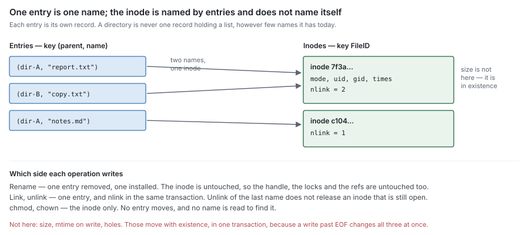

# RFC 7 — namespace metadata

**Status:** draft.
**Audience:** anyone changing a metadata backend's namespace records, the
handle format, the permission path, or lock state — and anyone writing a
protocol adapter that consumes them.

[RFC 6](rfc-6-block-metadata.md) owns the records that describe a file's content; this document owns the
records that describe the file. Conventions, RFC 2119 keywords and test tiers are
set once in the [index](rfc-index.md). This document specifies behaviour, not the
current code; [Appendix A](#Appendix%20A%20%E2%80%94%20where%20the%20current%20code%20differs) lists where the code differs, as defects to
fix, never rules to build around.

---

## 1. Purpose

Namespace metadata answers, for any client operation:

> **What entries exist, what are they called, which inode does a name resolve
> to, may this caller do this, and who is holding it open?**

Everything a client can name, it names through this component. It is the only
component that knows about paths, and it is the only component that decides
whether an operation is allowed to happen at all.

It is also the component that decides when an inode stops existing, which is
what releases its content, through the engine's `Release` ([§4.3](#4.3%20Release%20is%20what%20block%20metadata%20sees)). Nothing else in the set may make that
decision, and nothing else may keep content alive behind this component's back
([§4.4](#4.4%20There%20is%20no%20third%20holder)).

### 1.1 Non-goals

Namespace metadata **MUST NOT**:

- hold content bytes, or know where they are — local placement is [RFC 1](rfc-1-journal.md)'s,
  residency is computed and never stored ([RFC 0 §4.2](rfc-0-data-lifecycle.md#4.2%20The%20residency%20function));
- hold chunks, refs, blocks or refcounts — those are [RFC 6](rfc-6-block-metadata.md)'s, and this component
  learns of them only through the interfaces it declares ([§2.5](#2.5%20Where%20%60size%60%20lives), [§4.3](#4.3%20Release%20is%20what%20block%20metadata%20sees));
- decide what to offload, evict or sweep;
- encode or decode a wire protocol. A handle is opaque at this boundary and
  *stays* opaque above it ([§6](#6.%20Handles));
- import another component in this set ([RFC 0 §1.2](rfc-0-data-lifecycle.md#1.2%20Component%20autonomy)).

### 1.2 Why it is a separate RFC from block metadata

[RFC 6 §1.2](rfc-6-block-metadata.md#1.2%20Why%20it%20is%20a%20separate%20RFC%20from%20the%20namespace) gives the reason and the table: the two are usually one database,
often one transaction, and they are specified apart because their write patterns
differ in kind. This document does not restate it.

The consequence that matters here is directional. Block metadata **MUST NOT** be
told about names ([RFC 6 §6.5](rfc-6-block-metadata.md#6.5%20Who%20owns%20a%20ref)); it learns of a deletion only when this component
releases an inode. So every rule below about what keeps an inode alive is also a
rule about when content may be destroyed.

## 2. The records

Namespace metadata holds three kinds of record.

| Record | Keyed by | Holds | Written by |
| --- | --- | --- | --- |
| **Inode** | `FileID` | type, generation, mode, owner, group, times, `nlink`, parent (directories only) | attribute operations, link and unlink ([§4](#4.%20What%20keeps%20an%20inode%20alive)) |
| **Entry** | `(parent FileID, name)` | child `FileID`, child type | create, link, unlink, rename ([§3](#3.%20Names), [§5](#5.%20Rename)) |
| **Pending release** | `FileID` | the open holders and their lease | the unlink that leaves an open inode with no entry ([§4.3](#4.3%20Release%20is%20what%20block%20metadata%20sees)) |



### 2.1 Inode

    Inode(id) = { type, generation, mode, uid, gid, atime, ctime, nlink, mtime?, parent?, unit? }

`id` is [RFC 0 §3](rfc-0-data-lifecycle.md#3.%20Identity)'s `ID`: a UUID, stable for the life of the file, unchanged by
rename, relink or rewriting the contents.

`generation` goes into every handle ([§6.1](#6.1%20A%20handle%20names%20an%20inode%2C%20never%20a%20path)). A new inode's generation **MUST**
exceed that of every earlier inode with the same `id`, including released ones,
whose records are gone. The store therefore draws generations from a per-share
counter that only increases and outlives every release; it **MAY** allocate them
in batches, so that the counter is not a record every create writes.

`mtime` is on the inode for directories only. A regular file's `mtime`, and the
`ctime` a write sets, live on [RFC 6](rfc-6-block-metadata.md)'s shape record ([§2.5](#2.5%20Where%20%60size%60%20lives)).

An inode **MUST NOT** carry its own name, its own path, or a list of the entries
that name it. It is named *by* entries; it does not name itself. A name stored
on the inode is a second copy of the entry, and rename then has to keep two
records in step for no gain.

`parent` exists only for directories, and only because `..` has to resolve
without a search. It is exact, because a directory has exactly one entry naming
it ([§4.1](#4.1%20%60nlink%60%20is%20exactly%20its%20entries)).

`unit` is the inode's ownership unit ([RFC 11 §2](rfc-11-ownership.md#2.%20Ownership%20units)), fixed at create and unchanged by
rename. The default unit is the share, which the handle already names, so `unit`
is stored only when a finer unit is configured.

### 2.2 Entry

    Entry(parent, name) = { child, type }

One entry is one name in one directory. The child type is carried so that a
listing does not have to read every inode it returns; it is a copy, and it
**MUST** be written in the same transaction as the entry, never refreshed later.

**An entry is its own record.** An implementation **MUST NOT** store a
directory's entries as one value, one document or one row holding the list. This
is [RFC 6 §2.1](rfc-6-block-metadata.md#2.1%20Ref)'s rule with a different key, and it fails the same two ways: a
directory of *N* entries costs O(*N*²) to fill, and the list becomes a key that
every concurrent create, unlink and rename in that directory contends on.

A directory is large because a user made it large. Nothing else in this system
lets one client's behaviour choose the cost of another's.

### 2.3 The name is not the identity

Every other component in the set keys content by `FileID` ([RFC 0 §3](rfc-0-data-lifecycle.md#3.%20Identity)). This is
the component that owns the mapping from a name to that identity, and it is the
only one allowed to hold it.

A path **MUST NOT** appear in a handle ([§6.1](#6.1%20A%20handle%20names%20an%20inode%2C%20never%20a%20path)), in a lock ([§8.2](#8.2%20A%20lock%20is%20held%20against%20an%20inode)), in a ref
([RFC 6 §6.5](rfc-6-block-metadata.md#6.5%20Who%20owns%20a%20ref)) or in a journal key ([RFC 1](rfc-1-journal.md)). Each of those outlives a rename, and a
path does not.

### 2.4 Attributes, and who writes them

| Attribute | Changed by | Written in the transaction of |
| --- | --- | --- |
| `mode`, `uid`, `gid` | chmod, chown, ACL change | its own operation |
| `atime` | read, and only if the policy records it ([§9.2](#9.2%20Timestamps)) | its own operation |
| `mtime`, `ctime` on write, and an explicit set of a file's `mtime` | a client write, a set-attribute | **existence**, on the shape record ([§2.5](#2.5%20Where%20%60size%60%20lives)) |
| `ctime` on attribute change | chmod, chown, link, unlink, rename | its own operation |
| `nlink` | link, unlink, rename over an existing entry | the entry change that caused it ([§4.1](#4.1%20%60nlink%60%20is%20exactly%20its%20entries)) |
| `size` | a client write, truncate, deallocate | **not stored here** ([§2.5](#2.5%20Where%20%60size%60%20lives)) |

The offload commit appears nowhere in that table, and **MUST NOT** ([RFC 6 §5.1](rfc-6-block-metadata.md#5.1%20No%20record%20is%20written%20by%20both%20paths)).
Offloading changes where content is, not what it is, and an inode record it could
write would be a record the client path and a background pass share, which
[RFC 6 §5](rfc-6-block-metadata.md#5.%20Write%20sets) forbids.

### 2.5 Where `size` lives

**`size` is not a namespace record.** This component does not store it, and
reads it through an interface it declares for the need:

    Size(file)  → bytes
    Times(file) → mtime, ctime

The engine supplies it at composition time, answering from [RFC 6](rfc-6-block-metadata.md)'s shape record
([RFC 6 §2.4](rfc-6-block-metadata.md#2.4%20Shape%20and%20holes)) with the journal's not-yet-committed writes applied over it
([RFC 6 §3.4](rfc-6-block-metadata.md#3.4%20Ordering%20against%20the%20journal)).
Per [RFC 0 §1.2](rfc-0-data-lifecycle.md#1.2%20Component%20autonomy) this **MUST** be a declared interface; a backend that does not
supply it **MUST** fail to build.

Three reasons, in order of how much they cost to get wrong:

1. **`size` and the hole set move together.** A write past EOF grows `size` *and*
   adds a hole for the gap it skipped ([RFC 6 §3.5](rfc-6-block-metadata.md#3.5%20Operations%20that%20make%20holes)). Split across two records,
   the crash between them leaves a `size` covering a range no hole records and
   no journal holds — content claimed to exist that was never written, which
   resolves **Lost** and fails a read that should have returned zeros.
2. **`size` carries the write path's durability.** It is group-committed at each
   stability point, and answered from the journal until then
   ([RFC 6 §3.4](rfc-6-block-metadata.md#3.4%20Ordering%20against%20the%20journal)). An inode record holding it would inherit that schedule, and
   every write would contend with every chmod.
3. **Two copies drift and nothing notices.** `GETATTR` and a read would answer
   from different records, and the disagreement is silent in both directions.

The same applies to a file's `mtime` and to the `ctime` a write sets: this
component defines what they mean, and they are stored on the shape record,
written in the transaction that records existence. On the inode they would make
every write rewrite the record `chmod` writes. `GETATTR` reports the shape's
`mtime`, and as `ctime` the later of the shape's and the inode's.

What this component **MUST NOT** do is keep a second `size` "for `GETATTR`
speed". That is the drift in reason 3 with a justification attached.

## 3. Names

### 3.1 Lookup resolves a name to an inode, and that is all it does

    Lookup(parent, name) → inode | none

A lookup **MUST** be O(log *n*) or better in the number of entries in the
directory, and **MUST NOT** be answered by enumerating it. A backend that
answers lookup with a scan turns every path resolution into a directory read,
so a deep path in a large tree costs the sum of every directory along it.

Resolution of a multi-component path is the caller's loop over this operation,
one directory at a time, with a permission check on each ([§7.2](#7.2%20Two%20timings%2C%20both%20allowed%3B%20one%20owner%2C%20always)). This component
**MUST NOT** offer a whole-path resolve that skips the intermediate checks.

### 3.2 A name is bytes, and it is validated at the boundary

A name is a byte string. This component **MUST** reject:

- the empty name;
- a name containing the path separator or a NUL;
- `.` and `..` as stored entries — they are resolved, never recorded ([§3.4](#3.4%20Enumeration));
- a name longer than the configured maximum.

It **MUST NOT** normalise, case-fold, transcode or otherwise rewrite a name it
was given. A name that comes back different from the one that went in is a name
the client cannot use, and the client has no way to discover the rule that
changed it.

Validation happens here, not in the adapters, because there is more than one
adapter and a rule enforced in one of them is a rule the other does not have.

### 3.3 Case

Case sensitivity is a property of the share, decided once at configuration, and
**MUST NOT** vary between adapters reaching the same share. A case-insensitive
share **MUST** preserve the case it was given and compare without it: the entry
records what the client sent, the index answers either way.

Two adapters disagreeing about case on one share is not a cosmetic difference.
Under SMB semantics `README` and `readme` are one entry and the second create
fails; under POSIX semantics they are two, and a client that made both then
sees one of them disappear the next time the other adapter writes.

### 3.4 Enumeration

    List(parent, cursor, n) → entries, next cursor

A listing **MUST** be answered by a scan bounded by the entries returned —
O(log *n* + results) — never by reading the directory whole to return a page of
it.

`.` and `..` are synthesised at the boundary that needs them, from the directory
itself and its `parent` ([§2.1](#2.1%20Inode)). They **MUST NOT** be stored, because a stored
`..` is a second copy of the parent pointer that rename then has to move.

### 3.5 A cookie survives concurrent mutation

A listing cursor **MUST NOT** be a positional index. It **MUST** be derived from
the ordering key of the last entry returned, so that an insert or a delete
elsewhere in the directory does not shift what the next page contains.

With a positional cursor, deleting an entry before the cursor shifts every later
entry down one, and the client silently skips one; inserting shifts them up, and
the client sees one twice. Neither is an error anyone observes — the listing just
comes back wrong, in a directory that was being written while it was read.

An entry that is created or removed during a listing **MAY** be returned or
omitted. An entry present and untouched throughout **MUST** be returned exactly
once.

Where a protocol has a cookie verifier, it identifies the directory's ordering
generation and **MUST** change only when that ordering changes — not on every
mutation, which would restart every listing of a busy directory forever.

## 4. What keeps an inode alive

### 4.1 `nlink` is exactly its entries

An inode's `nlink` **MUST** equal the number of entries naming it, at every
commit point, and **MUST** change in the same transaction as the entry that
changes it.

This is [RFC 6 §6.1](rfc-6-block-metadata.md#6.1%20A%20refcount%20is%20exactly%20its%20refs)'s rule for refcounts, one level up, and it fails the same two
ways. Drifting high leaks an inode and everything it references. Drifting low
releases an inode a name still resolves to, so the entry survives pointing at
nothing.

A decrement that would take `nlink` below zero **MUST** fail the transaction and
be reported as a consistency error naming the inode. It **MUST NOT** be clamped:
the count was already too low before the decrement, so something else still
names the inode ([RFC 6 §6.3](rfc-6-block-metadata.md#6.3%20Underflow%20is%20corruption%2C%20not%20a%20boundary)).

Hard links to directories **MUST** be refused, which is what makes `parent`
exact and what makes the rename loop check terminate ([§5.2](#5.2%20The%20loop%20check%20is%20inside%20the%20transaction)).

### 4.2 Open state is the second holder

An inode with `nlink` zero that is still open **MUST NOT** be released. Its
entries are gone and no name resolves to it; its content is still readable
through the handles that were opened before the unlink, and stays so until the
last of them closes.

Open state is therefore a holder of the inode in exactly the sense `nlink` is,
and the release condition is both:

> An inode is released when `nlink` is zero **and** no open state references it.

**Open state is recorded lazily.** It is held in memory by the file's owner
([RFC 11 §7](rfc-11-ownership.md#7.%20Protocol%20state)) and becomes a durable record only when it keeps content alive: when
an unlink removes the last entry of an open inode ([§4.3](#4.3%20Release%20is%20what%20block%20metadata%20sees)). Opens and closes of
linked files write nothing. An open of an inode that already has a pending
release adds its holder to that record.

### 4.3 Release is what block metadata sees

Releasing an inode drops its refs and decrements the chunks they name
([RFC 0 §7](rfc-0-data-lifecycle.md#7.%20Mutation%20and%20removal), [RFC 6 §6.4](rfc-6-block-metadata.md#6.4%20Delete)), and drops the journal's copy of its content. This
component **MUST** perform it through the engine's `Release` ([RFC 8 §9.1](rfc-8-engine.md#9.1%20One%20facade%2C%20shaped%20like%20content)),
declared here as a need, and never through block metadata directly: a release
that drops the refs and leaves the journal holding the file is half a release.
Block metadata is never told the name that was removed ([RFC 6 §6.5](rfc-6-block-metadata.md#6.5%20Who%20owns%20a%20ref)).

**An unlink that leaves an open inode with no entry writes a pending-release
record** in the same transaction that removes the entry, naming the open holders
and a lease. The last close releases the inode and deletes the record. After a
restart, or a change of owner, in-memory open state is gone; the record's lease is
extended by the grace period ([§8.3](#8.3%20Lock%20state%20is%20volatile%2C%20and%20the%20grace%20period%20is%20what%20makes%20that%20safe)), and when it ends the inode is released unless
a reclaimed open references it. Only the file's owner releases it. A
pending-release record is not a holder: it keeps nothing alive, it only remembers
a release that open state deferred.

Release **MAY** otherwise be deferred past the namespace removal, and **MUST**
then be recorded the same way, so that a restart resumes it. An unlink that
returns to the client before the release is recorded, and is then forgotten,
leaks every chunk of the file with nothing left to find them by.

### 4.4 There is no third holder

`nlink` and open state are the only things that keep an inode alive. An
implementation **MUST NOT** add a second mechanism — a hold list, a pin set, a
protected-inode table, an extra root consulted by a sweep. [RFC 6 §6.5](rfc-6-block-metadata.md#6.5%20Who%20owns%20a%20ref) (M12)
gives the reason: a second mechanism fails open. A snapshot holds counted refs,
and an open-but-unlinked file is an ordinary inode with zero entries; both are
already alive by the rules above.

## 5. Rename

### 5.1 One transaction

Rename removes the source entry, installs the destination entry, and adjusts
every count those two changes imply — in **one transaction**:

- the source entry is removed;
- the destination entry is installed, replacing an existing entry if one is
  there;
- the replaced entry's inode has `nlink` decremented, and is released if [§4.2](#4.2%20Open%20state%20is%20the%20second%20holder)'s
  condition now holds;
- a renamed directory's `parent` is updated;
- both directories' `mtime` and `ctime` advance, and the renamed inode's `ctime`
  advances.

Partial application **MUST NOT** be observable. A rename visible at neither name
loses a file that was never deleted; a rename visible at both makes one inode
reachable by two paths with `nlink` one, and the first unlink of either then
releases content the other still names.

### 5.2 The loop check is inside the transaction

Renaming a directory into its own descendant **MUST** be refused, and the check
**MUST** be evaluated in the same transaction that performs the rename.

A check made before the transaction is vacuous: it walks the ancestors of the
destination, finds the source absent, and by the time the rename applies a
concurrent rename has moved the destination under the source. The result is a
cycle of directories that no path reaches, that `nlink` says are alive, and that
nothing will ever release.

This is the same failure as [RFC 6 §7.1](rfc-6-block-metadata.md#7.1%20Conditional%20retirement)'s blind delete — a condition read before
the operation that changes it — and it needs the same remedy, not a lock taken
around the read.

### 5.3 Rename moves an entry and nothing else

A rename **MUST NOT** change a handle ([§6.1](#6.1%20A%20handle%20names%20an%20inode%2C%20never%20a%20path)), invalidate a lock ([§8.2](#8.2%20A%20lock%20is%20held%20against%20an%20inode)), touch a
ref ([RFC 6 §6.5](rfc-6-block-metadata.md#6.5%20Who%20owns%20a%20ref)), or move a byte. Everything below this component keys on the
inode, which did not change.

An implementation that has to do work proportional to a file's size or its lock
count on rename has put the name somewhere it does not belong, and [§2.3](#2.3%20The%20name%20is%20not%20the%20identity) names
where to look.

## 6. Handles

### 6.1 A handle names an inode, never a path

A handle is opaque ([RFC 0](rfc-0-data-lifecycle.md)'s rule for the set, and this component's to keep). It
is generated here and resolved here. No adapter parses one, constructs one, or
derives one from another.

A handle **MUST** encode:

- the **share** it belongs to, so the runtime can route without interpreting the
  rest;
- the **inode**, by `FileID`;
- a **generation**, so that a handle to a released inode is refused rather than
  answered ([§6.3](#6.3%20Staleness%20is%20reported%2C%20never%20guessed)).

A handle **MUST NOT** encode a path, a name, a parent, or an offset into a
directory. All four change while the inode does not, so a handle carrying one is
a handle that breaks on an operation that was supposed to be invisible to it.

**A handle has one spelling.** Decoding a handle **MUST** accept exactly one
byte form for each inode, or canonicalise before the handle is used, and handles
**MUST** be compared by what they decode to. A parser that accepts several
spellings of one identity turns byte comparison into a lie: two handles for one
directory compare unequal, a lock keyed on the handle stops serialising, and a
rename between them takes the wrong path.

> [!important] Pending review — one spelling per handle
> From an open issue: the handle parser accepted several spellings of one ID and
> comparisons were byte equality, so rename took the wrong path and lock shards
> stopped serialising. New Group A row in [§12.1](#12.1%20Group%20A%20%E2%80%94%20wrong%20file%2C%20lost%20file%2C%20wrong%20caller).


### 6.2 A handle is stable across restart

A handle **MUST** remain valid across a server restart for any inode that still
exists. It follows from `FileID` being durable ([RFC 0 §3](rfc-0-data-lifecycle.md#3.%20Identity)) and from the
generation being durable with it.

A handle derived from anything a restart re-derives — a table index, a pointer,
a hash of in-memory state — is a handle that every client has to rediscover
after a restart it was not told about.

### 6.3 Staleness is reported, never guessed

Resolving a handle returns one of three answers, and they are distinct:

| Answer | When | Reported as |
| --- | --- | --- |
| the inode | it exists and the generation matches | success |
| **stale** | the inode was released, or the generation does not match | stale-handle error |
| **not this share** | the handle's share is not the one asked | access error |

A handle whose inode is gone **MUST NOT** resolve to a new inode that reused its
`FileID`, which is what the generation is for, and **MUST NOT** be reported as a
missing file. "Not found" tells a client to create; "stale" tells it to look the
name up again. Answering the first for the second makes a client recreate a file
that a rename had merely moved.

### 6.4 Resolution does not touch the namespace

Handle resolution **MUST** be a direct lookup of the inode, O(1) or O(log *n*),
and **MUST NOT** walk directories, resolve a path, or consult an entry record.

Every operation on an open file resolves a handle first. A resolution that walks
the namespace makes the cost of reading a file depend on how deep it was put and
how large the directories above it are, for the whole time it is open.

### 6.5 A protocol's numeric file id is derived, and collisions are its problem

Some protocols report a fixed-width integer identifying a file, narrower than
the handle. Where one is derived by truncating or hashing the handle, the
derivation **MUST** be one of:

- injective over the inodes of a share — a counter or a stored column; or
- accompanied by a collision check that refuses or re-derives.

A truncated hash with neither is a silent aliasing of two files. Clients that
treat the id as identity — hard-link detection, `find -samefile`, backup tools
deciding two paths are one file — then conclude that two unrelated files are
one, and back up or restore only one of them.

## 7. Permissions

### 7.1 One chokepoint

Every permission decision is **made** in this component. A protocol handler
**MUST NOT** evaluate a mode, an ACL or a share's read-only flag itself, and
**MUST NOT** be able to reach an operation that was never authorised.

There is more than one adapter. A check that lives in an adapter is a check the
other adapter does not have, and the only way anyone discovers that is a client
reaching data through the protocol nobody audited.

### 7.2 Two timings, both allowed; one owner, always

Protocols differ on *when* they check, and this component accommodates both:

| Timing | The check | Later operations |
| --- | --- | --- |
| **per operation** | runs on every call, against the inode | each is checked |
| **at open** | runs once, and the granted access is the result | gated on the grant |

Neither is wrong. An open-time grant is how a handle-oriented protocol is
specified, and re-deriving it per operation would change the semantics the
client was promised — an access revoked after the open would start failing
writes that the protocol says must keep succeeding.

What **MUST NOT** differ is the owner. A grant computed at open is a decision,
so this component computes it, stores it against the open state it belongs to
([§8.1](#8.1%20Four%20kinds%20of%20state%2C%20one%20owner)), and evaluates it on the operations it gates. An adapter that computes
its own grant and passes the verdict back in as a flag has moved the decision
out of the one place [§7.1](#7.1%20One%20chokepoint) requires it to be, and the other adapter cannot see
the grant at all.

A grant **MUST** name the inode it was computed against, and an operation
**MUST NOT** be gated on a grant computed against a different one.

### 7.3 The decision is against the inode, not the name

A check **MUST** read the inode the operation will act on, in the state the
operation will act on it. Checking a name, then acting on whatever that name
resolves to later, is two observations of a thing that can change between them.

For a path of several components, each directory is checked for traversal as it
is resolved ([§3.1](#3.1%20Lookup%20resolves%20a%20name%20to%20an%20inode%2C%20and%20that%20is%20all%20it%20does)). The checks are not collapsible into one check on the leaf:
a caller with no right to enter a directory has no right to what is inside it,
however the leaf's own mode reads.

### 7.4 The identity arrives resolved

This component receives a resolved identity and applies it. It **MUST NOT** know
about export policy, squashing, authentication flavours or netgroups. Those are
adapter concerns, applied before the call, and the identity that arrives here is
what the caller already is.

An identity **MUST** carry every field any check reads — including the ones a
particular backend's checks do not read — because the component that builds it
cannot know which check runs.

### 7.5 A cached decision is keyed by everything it read

An implementation **MAY** cache a resolved identity or an authorisation result.
The key **MUST** include every field the cached value was derived from.

This is the failure that has to be named rather than implied. A key written
against the fields an identity had at the time it was written stays compiling,
stays passing, and silently starts colliding the moment the identity grows a
field — two callers whose old fields match are served one another's decision.
It fails **open**, and it is invisible to a search for the new field's name,
because the defect is in the key and the key never mentions it.

Adding a field to an identity is therefore an edit to every key derived from
one, and a key that cannot be shown to include the whole identity **MUST** be
replaced by one that does.

## 8. Locks and open state

### 8.1 Four kinds of state, one owner

| State | Granted by | Conflicts with | Lifetime |
| --- | --- | --- | --- |
| **open** | an open | a deny mode ([§8.4](#8.4%20A%20deny%20mode%20is%20checked%20at%20open)) | until close |
| **byte-range lock** | a lock request | an overlapping lock on the same extent | until unlock, close, or lease expiry |
| **deny mode** | an open | an open asking for denied access | until close |
| **delegation** | the server, unasked | any conflicting access by another client ([§8.5](#8.5%20A%20delegation%20MUST%20be%20revocable%20within%20a%20bounded%20time)) | until recalled, revoked, or expired |

All four are held against an inode and all four are this component's, because
all four are consulted by operations this component authorises. An implementation
**MUST NOT** hold one of them in an adapter, where the other adapter cannot see
it: a byte-range lock that one protocol grants and the other does not observe is
not a lock.

### 8.2 A lock is held against an inode

Lock state is keyed by the inode, never by a name or a handle. A rename does not
disturb it ([§5.3](#5.3%20Rename%20moves%20an%20entry%20and%20nothing%20else)), and two hard links to one inode are one lockable object, not
two.

Keying by handle is the subtler error: one client may hold several handles to
one inode, and a lock that one handle can see and another cannot is a lock the
same client can take twice.

### 8.3 Lock state is volatile, and the grace period is what makes that safe

Lock state **MAY** be held in memory and lost on restart. It **MUST NOT** be the
reason an operation blocks on a holder that no longer exists.

An implementation that discards lock state on restart **MUST** then run a grace
period of at least one lease period. During it, this component **MUST** refuse
every request for lock or open state that is not a reclaim — a new lock, a new
open, a deny mode, a delegation — whether or not it appears to conflict: the
state it would be checked against is what the restart lost, so a conflict cannot
be decided. A client reclaiming what it held before the restart then finds it
available, and a client that did not hold it cannot take it first. Without that
window, two clients that were correctly serialised before the restart are both
granted the same lock after it, and neither is told. Open-state leases are
extended by the grace period, so a client is not expired for time the server
spent restarting.

The window **MUST** end on its own ([RFC 0 §10.2](rfc-0-data-lifecycle.md#10.2%20No%20state%20requires%20intervention%20to%20leave)). A server that will not leave a
grace period until an operator acts has replaced one wedge with another.

**An expired lease releases everything it held, everywhere.** When a client's
lease expires or its state is revoked, every lock, open, deny mode and delegation
it held **MUST** be released in every view that records it — including state
shared across protocols — in the same step. State one protocol dropped and
another still counts refuses conflicting requests against an owner that no longer
exists, until a restart.

> [!important] Pending review — lease expiry, and a freed name
> From open issues: an expired lease left the shared lock manager holding the
> delegation until restart; and a create right after an acknowledged unlink
> occasionally got "exists" on a slow backend. Both have new Group A rows.

### 8.4 A deny mode is checked at open

A deny mode is evaluated once, when an open is granted, against the opens
already held. It **MUST NOT** be re-evaluated per read or per write: the open
that was granted was granted, and a later open cannot retroactively forbid it.

An open that conflicts is refused. It **MUST NOT** be downgraded silently to a
weaker access than the client asked for — a client that asked for write and got
read discovers it on the first write, having already decided the file was
writable.

### 8.5 A delegation MUST be revocable within a bounded time

A delegation is a promise that no one else is touching a file, and it is only
safe if it can be taken back. A recall **MUST** have a deadline, and a client
that does not return the delegation by the deadline **MUST** have it revoked.

Waiting indefinitely for a client that has stopped answering blocks every other
client of that file, on nothing but a promise the server made unprompted. A
revoked delegation costs one client its cache; an unbounded recall costs every
other client the file.

### 8.6 Locks do not pin bytes

Holding a lock, a deny mode or a delegation **MUST NOT** make an extent
ineligible for eviction ([RFC 0 §8.1](rfc-0-data-lifecycle.md#8.1%20Evict)) or for reclamation ([RFC 0 §8.2](rfc-0-data-lifecycle.md#8.2%20Reclaim)). All three
are statements about who may act on a file, not about where its bytes are.

Coupling them is how a local tier fills up with content that is durable remotely
and cannot be released because a client left a handle open.

## 9. Attributes and what is not one

### 9.1 Attributes are answers, not caches

`GETATTR` joins this component's inode record with `Size` and `Times` ([§2.5](#2.5%20Where%20%60size%60%20lives)). The join
happens per request. An implementation **MUST NOT** hold a materialised attribute
row that a background pass refreshes: it is a cache that can outlive its inputs,
and [RFC 0 §4.2](rfc-0-data-lifecycle.md#4.2%20The%20residency%20function) forbids exactly that shape for residency for exactly this reason.

### 9.2 Timestamps

`mtime` and `ctime` on write are written with existence ([§2.5](#2.5%20Where%20%60size%60%20lives)). `ctime` advances
on every attribute and link change, `mtime` only on content change. An
implementation **MUST NOT** advance `mtime` for an operation that changed no
content — an offload, an eviction, a fill and a relocation all leave it untouched,
because none of them changed what the file is.

`atime` **MAY** be omitted, or updated on a coarse schedule. An implementation
that updates it on every read has made every read a write, on a record shared by
every reader of that file. If it is updated at all, the policy **MUST** be
configured, not per-adapter.

### 9.3 Residency is not an attribute

There **MUST NOT** be an attribute, extended attribute or flag reporting whether
a file is local, cached, evicted or remote.

Residency is computed from two oracles at the moment it is asked ([RFC 0 §4.2](rfc-0-data-lifecycle.md#4.2%20The%20residency%20function)).
Anything stored is a third answer that can disagree with both, and the first
consumer of it will be something that decides whether to read.

Reporting *allocation* to `SEEK_DATA` and `SEEK_HOLE` is this component's, and
it **MUST** be answered from [RFC 6](rfc-6-block-metadata.md)'s hole set through a declared interface. It
**MUST NOT** be answered from the journal, which cannot tell "never written"
from "no longer held" ([RFC 0 §4.1](rfc-0-data-lifecycle.md#4.1%20The%20two%20oracles)), and **MUST NOT** be implemented by editing
existence ([RFC 6 §3.5](rfc-6-block-metadata.md#3.5%20Operations%20that%20make%20holes)).

## 10. Invariants

| # | Invariant |
| --- | --- |
| N1 | An inode's `nlink` equals the number of entries naming it, changes in the transaction that changes them, and fails the transaction rather than going negative. |
| N2 | An inode is released when, and only when, `nlink` is zero and no open state references it. Nothing else keeps an inode alive. |
| N3 | Release goes through the engine's `Release`, and a deferred one — including an open, unlinked inode — is recorded in the transaction that removed its last entry, with its holders' lease, so a restart or a new owner resumes it. Open state of a linked inode is never written. |
| N4 | A rename applies wholly or not at all, and its loop check is evaluated inside its transaction. |
| N5 | A handle names an inode, its generation and a share, is stable across restart, and resolves to stale — never to another inode and never to "not found" — when its inode is gone. Generations never repeat for one `FileID`. |
| N6 | No name, path or parent appears in a handle, a lock, a ref or a journal key. |
| N7 | Every permission decision is made in this component, against the inode the operation will act on, and a grant made at open is stored and evaluated here rather than in an adapter. |
| N8 | A cached authorisation or identity is keyed by every field it was derived from. |
| N9 | Lock state is keyed by inode, visible to every adapter, and never blocks on a holder that no longer exists; after its loss, every non-reclaim request is refused until grace ends. |
| N10 | A grace period, a recall and every other wait in this component ends without operator action. |
| N11 | Lock state never makes an extent ineligible for eviction or reclamation. |
| N12 | `size`, a file's `mtime` and its write `ctime` are stored once, in existence, and this component reads them through a declared interface. |
| N13 | An entry is its own record, and no operation's cost grows with the size of its directory beyond the results it returns. |
| N14 | Residency is not an attribute. |

## 11. API surface and observability

### 11.1 Interface

Signatures are indicative; the obligations are normative. Every call takes the
resolved identity ([§7.4](#7.4%20The%20identity%20arrives%20resolved)) and is authorised inside this component ([§7.1](#7.1%20One%20chokepoint)).

```go
type Namespace interface {
    // Names (§3). Lookup and List never enumerate more than they return.
    Lookup(ctx context.Context, id Identity, dir Handle, name []byte) (Handle, Attr, error)
    List(ctx context.Context, id Identity, dir Handle, after Cursor, n int) ([]Entry, Cursor, error)
    Create(ctx context.Context, id Identity, dir Handle, name []byte, a SetAttr) (Handle, Attr, error)
    Link(ctx context.Context, id Identity, dir Handle, name []byte, target Handle) error
    Unlink(ctx context.Context, id Identity, dir Handle, name []byte) error      // §4
    Rename(ctx context.Context, id Identity, from Handle, fromName []byte, to Handle, toName []byte) error // §5

    // Handles and attributes (§6, §9).
    Resolve(ctx context.Context, h Handle) (FileID, error)                       // ErrStale, ErrWrongShare
    GetAttr(ctx context.Context, id Identity, h Handle) (Attr, error)
    SetAttr(ctx context.Context, id Identity, h Handle, a SetAttr) (Attr, error)
    Authorize(ctx context.Context, id Identity, h Handle, want Access) error     // per-operation timing (§7.2)

    // Open and lock state (§8).
    Open(ctx context.Context, id Identity, h Handle, want Access, deny Access, reclaim bool) (OpenID, Access, error)
    Close(ctx context.Context, o OpenID) error                                   // last close may release (§4.3)
    Lock(ctx context.Context, o OpenID, r ByteRange, exclusive, reclaim bool) error
    Unlock(ctx context.Context, o OpenID, r ByteRange) error
    Delegate(ctx context.Context, o OpenID) (Delegation, error)
    Return(ctx context.Context, d Delegation) error
}

// Content is what this component needs from the engine, declared here (§2.5,
// §4.3, §9.3). The engine supplies it at construction.
type Content interface {
    Size(ctx context.Context, file FileID) (int64, error)
    Times(ctx context.Context, file FileID) (mtime, ctime time.Time, err error)
    Allocation(ctx context.Context, file FileID, off int64) (Span, error)
    Release(ctx context.Context, file FileID) error
}

var (
    ErrStale      = errors.New("namespace: stale handle")      // §6.3
    ErrWrongShare = errors.New("namespace: handle of another share")
    ErrGrace      = errors.New("namespace: in grace period")   // §8.3
    ErrInconsistent = errors.New("namespace: nlink underflow") // §4.1
)
```

A serialisation conflict is retried inside the call under the caller's deadline
and never returned ([RFC 0 §9.2](rfc-0-data-lifecycle.md#9.2%20Conflicts%20and%20their%20retries)).

### 11.2 Observability

| Answers | Metric | Type |
| --- | --- | --- |
| operations, labelled `op` and `result` | `dittofs_namespace_ops_total` | counter |
| time per operation, by `op` | `dittofs_namespace_op_seconds` | histogram |
| handles resolved stale ([§6.3](#6.3%20Staleness%20is%20reported%2C%20never%20guessed)) | `dittofs_namespace_stale_handles_total` | counter |
| `nlink` underflows ([§4.1](#4.1%20%60nlink%60%20is%20exactly%20its%20entries)); any nonzero value is an alert | `dittofs_namespace_nlink_underflow_total` | counter |
| pending-release records held ([§4.3](#4.3%20Release%20is%20what%20block%20metadata%20sees)) | `dittofs_namespace_pending_releases` | gauge |
| releases, labelled `result`; a failure is retried, not dropped | `dittofs_namespace_releases_total` | counter |
| requests refused during grace, and grace periods entered ([§8.3](#8.3%20Lock%20state%20is%20volatile%2C%20and%20the%20grace%20period%20is%20what%20makes%20that%20safe)) | `dittofs_namespace_grace_refusals_total`, `dittofs_namespace_grace_periods_total` | counter |
| delegations recalled, and revoked at the deadline ([§8.5](#8.5%20A%20delegation%20MUST%20be%20revocable%20within%20a%20bounded%20time)) | `dittofs_namespace_delegation_recalls_total`, `dittofs_namespace_delegation_revocations_total` | counter |
| conflicts retried, by `op` | `dittofs_namespace_conflict_retries_total` | counter |

An `nlink` underflow logs the inode at `Error`. A revoked delegation logs the
client at `Warn`. Entering and leaving grace log at `Info`. A stale handle is
routine for clients and logs at `Debug`.

## 12. Conformance

Every check runs against every backend through one shared conformance suite, in
the tiers and under the rules of the [index](rfc-index.md).

### 12.1 Group A — wrong file, lost file, wrong caller

| Requirement | Check |
| --- | --- |
| [§4.1](#4.1%20%60nlink%60%20is%20exactly%20its%20entries) `nlink` | Over random interleavings of create, link, unlink and rename-over, assert `nlink` equals the entries naming the inode after every transaction. |
| [§4.2](#4.2%20Open%20state%20is%20the%20second%20holder) open-unlinked | Open a file, unlink it, read through the handle. Assert the content is served and the refs are still counted. Close, assert release. |
| [§4.4](#4.4%20There%20is%20no%20third%20holder) no third holder | Delete every hold list. Assert the open-unlinked and snapshot checks still pass. A suite that passes only with the list present is testing the list. |
| [§5.1](#5.1%20One%20transaction) rename atomicity | Crash between the two entry writes. Assert the file is visible at exactly one name. |
| [§5.2](#5.2%20The%20loop%20check%20is%20inside%20the%20transaction) loop check | Rename A under B and B under A concurrently. Assert one fails and no unreachable cycle exists. |
| [§6.3](#6.3%20Staleness%20is%20reported%2C%20never%20guessed) staleness | Release an inode, create until its `FileID` is reused, resolve the old handle. Assert stale, not the new inode and not "not found". |
| [§7.2](#7.2%20Two%20timings%2C%20both%20allowed%3B%20one%20owner%2C%20always) grant ownership | Grant an open through one adapter, then reach the same inode through the other. Assert the other adapter observes the grant. A single-adapter rig cannot fail this. |
| [§7.3](#7.3%20The%20decision%20is%20against%20the%20inode%2C%20not%20the%20name) inode check | Look a name up, replace the entry, then act. Assert the check ran against the inode acted on. |
| [§7.5](#7.5%20A%20cached%20decision%20is%20keyed%20by%20everything%20it%20read) cache key | Two identities differing only in a field the key omits. Assert the second is not served the first's decision. A test that adds no field to the identity cannot fail. |
| [§8.3](#8.3%20Lock%20state%20is%20volatile%2C%20and%20the%20grace%20period%20is%20what%20makes%20that%20safe) grace | Grant a lock, restart, have a different client request the conflicting lock immediately. Assert refusal for the lease period. Then request a lock on an inode nobody held. Assert it is refused too, and that a reclaim is granted. |
| [§4.3](#4.3%20Release%20is%20what%20block%20metadata%20sees) pending release | Open a file, unlink it, crash. Assert the refs are still counted until grace ends, and released after it unless the open was reclaimed. |
| [§4.2](#4.2%20Open%20state%20is%20the%20second%20holder) lazy open state | Open and close a linked file 10^4 times. Assert no namespace record was written. |
| [§4.3](#4.3%20Release%20is%20what%20block%20metadata%20sees) release through the engine | Unlink a file the journal still holds dirty. Assert the refs are dropped and the journal holds nothing of it. |
| [§2.1](#2.1%20Inode) generation outlives release | Release an inode, restart, create an inode with the same `FileID`. Assert the old handle is stale. |
| [§2.5](#2.5%20Where%20%60size%60%20lives) `ctime` | `chmod` a file, then write it; then write it and `chmod` it. Assert `GETATTR`'s `ctime` is the later change both times. |
| [§3.5](#3.5%20A%20cookie%20survives%20concurrent%20mutation) cookie | Delete an entry before the cursor mid-listing. Assert no untouched entry is skipped or repeated. Then evict every cached cookie and assert the listing resumes rather than restarting. |
| [§6.5](#6.5%20A%20protocol%27s%20numeric%20file%20id%20is%20derived%2C%20and%20collisions%20are%20its%20problem) file id | Generate ids for a large share. Assert no two live inodes share one, or that the derivation refuses on collision. |
| [§5.2](#5.2%20The%20loop%20check%20is%20inside%20the%20transaction) loop, sequential | Rename a directory under its own child with no concurrency at all. Assert refusal — the concurrent check above passes a build that has no check, because one of the two renames fails on the entry re-read. |
| [§6.1](#6.1%20A%20handle%20names%20an%20inode%2C%20never%20a%20path) one spelling | For each handle, derive every other byte form the decoder's underlying parser accepts. Assert each is refused, or resolves to the same inode and compares equal, and that rename and locking through the alias behave as through the original. |
| [§8.3](#8.3%20Lock%20state%20is%20volatile%2C%20and%20the%20grace%20period%20is%20what%20makes%20that%20safe) lease expiry | Grant a delegation through one adapter, let the lease expire, then open the file conflictingly through the other. Assert the open is granted without a restart. |
| [§4.1](#4.1%20%60nlink%60%20is%20exactly%20its%20entries) name freed | Unlink a name and create it again as soon as the unlink is acknowledged, on every backend including a slow remote one. Assert the create never sees the name as taken and the parent's change attribute moved. |

### 12.2 Group B — cost

| Requirement | Check |
| --- | --- |
| [§2.2](#2.2%20Entry) entry records | Create *N* entries in one directory. Assert records **written** per create is constant in *N*. A correctness assertion on the resulting listing passes a quadratic implementation. |
| [§3.1](#3.1%20Lookup%20resolves%20a%20name%20to%20an%20inode%2C%20and%20that%20is%20all%20it%20does) lookup | Assert records **read** per lookup grow at most logarithmically in *N*. |
| [§3.4](#3.4%20Enumeration) listing | Assert records read per page are bounded by the page size. |
| [§6.4](#6.4%20Resolution%20does%20not%20touch%20the%20namespace) resolution | Assert handle resolution reads no entry record, at any path depth. |
| [§2.5](#2.5%20Where%20%60size%60%20lives) declared interface | Build a backend with no `Size`. Assert it **MUST** fail to compile. |

### 12.3 What must not stand in

- **A single-client rig MUST NOT stand in for [§3.5](#3.5%20A%20cookie%20survives%20concurrent%20mutation) or [§8.3](#8.3%20Lock%20state%20is%20volatile%2C%20and%20the%20grace%20period%20is%20what%20makes%20that%20safe).** Both failures need
  two clients on one object at once.
- **A single-adapter rig MUST NOT stand in for [§7.2](#7.2%20Two%20timings%2C%20both%20allowed%3B%20one%20owner%2C%20always) or [§8.1](#8.1%20Four%20kinds%20of%20state%2C%20one%20owner).** A grant or a lock
  that only one protocol can see passes every test that only speaks that
  protocol.
- **A concurrent rig MUST NOT stand in for [§5.2](#5.2%20The%20loop%20check%20is%20inside%20the%20transaction).** The sequential case is the
  one a build with no check fails; the concurrent one is passed by the entry
  re-read that is already there for a different reason.
- **A correctness assertion MUST NOT stand in for [§2.2](#2.2%20Entry).** A quadratic directory
  returns the right listing.
- **A test that never revokes MUST NOT stand in for [§8.5](#8.5%20A%20delegation%20MUST%20be%20revocable%20within%20a%20bounded%20time).** A recall that is
  always answered never exercises the deadline, which is the whole requirement.

### 12.4 Benchmarks and targets

| Benchmark | Measures | Target |
| --- | --- | --- |
| Lookup in directories of 10^2 to 10^7 entries | p99 latency | ≤ 100 µs at 10^7, within 2× of the 10^2 figure |
| Create into directories of 10^2 to 10^7 entries, 64 clients | creates/s, records written per create | records written constant; creates/s within 20% across sizes |
| List a page of 1,000 entries | p99 latency | ≤ 5 ms at any directory size |
| `GETATTR`, the inode joined with existence | p99 latency | ≤ 1.3× a read of the inode record alone; the input to [§13](#13.%20Open%20questions) question 1 |
| Handle resolution at path depth 1 and 64 | p99 latency | ≤ 50 µs, independent of depth |
| Rename across directories of 10^6 entries | p99 latency | ≤ 5 ms |
| Grace refusal and reclaim of 10^4 locks after restart | time to leave grace | one lease period, not more |

## 13. Open questions

1. **Whether the `size` cut is affordable.** [§2.5](#2.5%20Where%20%60size%60%20lives) keeps `size` and a file's
   write times off the inode, so `GETATTR` is a join, and `GETATTR` is the hottest
   namespace operation on both protocols. What the join costs on each backend is
   unmeasured ([§12.4](#12.4%20Benchmarks%20and%20targets)), and it is the one number that could send [§2.5](#2.5%20Where%20%60size%60%20lives) back to
   "one record serves both".
2. **Where lock state lives under more than one server.** [§8.3](#8.3%20Lock%20state%20is%20volatile%2C%20and%20the%20grace%20period%20is%20what%20makes%20that%20safe) makes lock state
   volatile and held by the file's owner. Whether it moves with ownership
   ([RFC 11 §7](rfc-11-ownership.md#7.%20Protocol%20state)) or lives in the metadata store is open, and belongs with the
   protocol rules, not in a second lock table added beside the first.
3. **What a case-insensitive share should cost.** [§3.3](#3.3%20Case) requires preserving case
   and comparing without it, which means a folded index or a folded key column.
   Which one, and what it costs on writes, is unmeasured.
4. **Directory `mtime` as a hot record.** Every create, unlink and rename in a
   directory writes its inode for `mtime`. That is one record per directory
   under a workload that creates files in parallel — [RFC 6 §5.3](rfc-6-block-metadata.md#5.3%20Hot%20records%20that%20are%20not%20per-file)'s problem with a
   different key. Coalescing it out of the transaction trades a correctness
   property for cost, and what the uncoalesced cost is has not been measured.
5. **`atime` cost.** [§9.2](#9.2%20Timestamps) allows a coarse schedule and does not choose one.
   Whether any consumer reads `atime` at all is unmeasured; if none does,
   omitting it removes a write from the read path.
6. **Whether `parent` is enough.** [§2.1](#2.1%20Inode) stores one parent per directory, which
   is exact because directory hard links are refused. Whether anything needs the
   reverse direction for files — "which names resolve to this inode" — is
   unmeasured; nothing in the set asks for it, and adding it would add a
   record that link and unlink both write.
7. **Where a recycle bin sits.** A recycle bin turns an unlink into a rename,
   stamping a deletion time, an original path and a deleting user. Nothing below
   the namespace has to know a file is in it, so it is not engine policy
   ([RFC 8 §1.1](rfc-8-engine.md#1.1%20Non-goals)); whether it belongs here or above this component is open.

## Appendix A — where the current code differs

Descriptive, for the refactor. None is a rule to build around, and a difference
**MUST NOT** be closed by amending the requirement. The entry/inode split of
[§2](#2.%20The%20records) already holds: inodes keyed by `FileID`, entries by parent and name, no
stored path, cursor-paged listing.

| Requirement | Code today |
| --- | --- |
| [§2.4](#2.4%20Attributes%2C%20and%20who%20writes%20them) the offload commit writes no namespace record | every offload rewrites the inode's attributes with the refs |
| [RFC 0 §9.1](rfc-0-data-lifecycle.md#9.1%20Records%20and%20their%20reclamation) (I7) | on one backend the inode's attribute value embeds extended attributes with no cap on their count, and can outgrow what the store reclaims |
| [§2.5](#2.5%20Where%20%60size%60%20lives) `size` stored once, write times on the shape | `size` has three sources reconciled at run time and is grown from the journal at every share start; write times are on the inode |
| [RFC 0 §9.2](rfc-0-data-lifecycle.md#9.2%20Conflicts%20and%20their%20retries) (I8) conflicts retried under the caller's deadline | retried under a fixed budget, after which a conflict reaches the client as an I/O error |
| [§2.5](#2.5%20Where%20%60size%60%20lives) declared interface | one transaction type spans namespace and content records |
| [§9.3](#9.3%20Residency%20is%20not%20an%20attribute) residency is not an attribute | a content-derived identity is an inode column with a unique index |
| [§4.1](#4.1%20%60nlink%60%20is%20exactly%20its%20entries) one `nlink` | a second, silently dropped copy on the attribute struct |
| [§4.3](#4.3%20Release%20is%20what%20block%20metadata%20sees) release through the engine, recorded | adapters release refs best-effort outside the transaction; no pending-release record |
| [§4.4](#4.4%20There%20is%20no%20third%20holder) no third holder | open-but-unlinked files are protected by a hold list read by GC |
| [§5.1](#5.1%20One%20transaction) one transaction | parent directories' timestamps are coalesced outside the transaction and can be lost |
| [§5.2](#5.2%20The%20loop%20check%20is%20inside%20the%20transaction) loop check | inside the transaction, but not serialisable on one backend's isolation level |
| [§6.1](#6.1%20A%20handle%20names%20an%20inode%2C%20never%20a%20path) opaque, one spelling, generation | a plaintext share-and-UUID string, accepting several spellings of one UUID, with no generation |
| [§6.3](#6.3%20Staleness%20is%20reported%2C%20never%20guessed) stale, not missing | a released inode resolves as not found |
| [§6.5](#6.5%20A%20protocol%27s%20numeric%20file%20id%20is%20derived%2C%20and%20collisions%20are%20its%20problem) numeric file id | a truncated hash of the handle, no collision check |
| [§3.2](#3.2%20A%20name%20is%20bytes%2C%20and%20it%20is%20validated%20at%20the%20boundary) validation at the boundary | duplicated in protocol handlers; the share's maximum is not consulted |
| [§3.3](#3.3%20Case) case | the unique key is byte-exact on a case-insensitive share |
| [§3.1](#3.1%20Lookup%20resolves%20a%20name%20to%20an%20inode%2C%20and%20that%20is%20all%20it%20does) lookup is not an enumeration | a case-insensitive miss scans the directory |
| [§3.5](#3.5%20A%20cookie%20survives%20concurrent%20mutation) the cookie is an ordering key | a hash held in a bounded in-process cache |
| [§7.2](#7.2%20Two%20timings%2C%20both%20allowed%3B%20one%20owner%2C%20always) the grant's owner | one adapter computes and stores the open-time grant and passes it back as bypass flags |
| [§8.1](#8.1%20Four%20kinds%20of%20state%2C%20one%20owner) one owner per lock kind | byte-range locks in two tables that every check must consult |
| [§8.2](#8.2%20A%20lock%20is%20held%20against%20an%20inode) keyed by inode | keyed by handle string, and can outlive the inode |
| [§8.3](#8.3%20Lock%20state%20is%20volatile%2C%20and%20the%20grace%20period%20is%20what%20makes%20that%20safe) grace | a grace period exists; the durable mirror of lock state is best-effort |
| [§9.2](#9.2%20Timestamps) `mtime` reflects the content change | frozen per file while writes are pending, so a second client's overwrite may not advance it |
