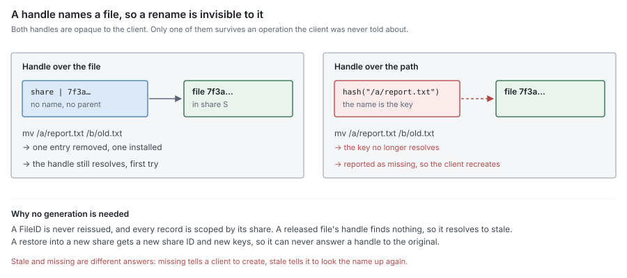

# RFC 7 — namespace metadata

**Status:** draft.
**Audience:** anyone changing the namespace entities, the handle format or the
permission path — and anyone writing the filesystem service ([RFC 17](rfc-17-vfs.md)) that
consumes them.

[RFC 6](rfc-6-block-metadata.md) owns the records that describe a file's content; this document owns the
entities that describe the file. [RFC 16](rfc-16-metadata-store.md) owns how every metadata entity is
persisted — the store contract, key layout and codecs — and [RFC 14](rfc-14-open-state.md) owns open
state and locks. Conventions, RFC 2119 keywords and test tiers are set once in
the [index](rfc-index.md). This document specifies behaviour, not the current code;
[Appendix A](#Appendix%20A%20%E2%80%94%20where%20the%20current%20code%20differs) lists where the code differs, as defects to fix, never rules to
build around.

---

## 1. Purpose

Namespace metadata answers, for any client operation:

> **What entries exist, what are they called, which file does a name resolve
> to, and may this caller do this?**

Everything a client can name, it names through this component. It is the only
component that knows about paths, and it is the only component that decides
whether an operation is allowed to happen at all.

It is also the component that decides when a file stops existing, and records
that decision as a pending release; the release that drops its content is the
engine's `Release` ([§4.3](#4.3%20Release%20is%20what%20block%20metadata%20sees)). Nothing else in the set may make that
decision, and nothing else may keep content alive behind this component's back
([§4.4](#4.4%20There%20is%20no%20third%20holder)).

**This component is a leaf.** It calls no other component and declares no
interface on one: the store holds its records and answers for them, and every
join with content or open state — `GETATTR`'s overlay, the release, `SEEK_HOLE`
— is made by the filesystem service ([RFC 17](rfc-17-vfs.md)) at the file's owner.

Every entity here is **protocol-neutral**. NFS and SMB vocabulary — uid, SID,
DOS attributes, security descriptors, `fsid`, volume serials — is translated by
the adapters and the filesystem service ([RFC 17](rfc-17-vfs.md)); nothing in this document is
shaped by one protocol.

### 1.1 Non-goals

Namespace metadata **MUST NOT**:

- hold content bytes, or know where they are — local placement is [RFC 1](rfc-1-journal.md)'s,
  residency is computed and never stored ([RFC 0 §4.2](rfc-0-data-lifecycle.md#4.2%20The%20residency%20function));
- hold chunks, refs, blocks or refcounts — those are [RFC 6](rfc-6-block-metadata.md)'s, and this component
  never reads them: the filesystem service joins the two ([§2.5](#2.5%20Where%20%60size%60%20lives), [§4.3](#4.3%20Release%20is%20what%20block%20metadata%20sees));
- hold opens, locks, caching grants or watches — those are [RFC 14](rfc-14-open-state.md)'s; this
  component only asks whether an open keeps a file alive ([§8](#8.%20Open%20state%2C%20as%20the%20namespace%20sees%20it));
- decide what to offload, evict or sweep;
- encode or decode a wire protocol. A handle is opaque at this boundary and
  *stays* opaque above it ([§6](#6.%20Handles));
- choose keys or encodings — that is [RFC 16](rfc-16-metadata-store.md)'s;
- import another component in this set ([RFC 0 §1.2](rfc-0-data-lifecycle.md#1.2%20Component%20autonomy)).

### 1.2 Why it is a separate RFC from block metadata

[RFC 6 §1.2](rfc-6-block-metadata.md#1.2%20Why%20it%20is%20a%20separate%20RFC%20from%20the%20namespace) gives the reason and the table: the two are usually one database,
often one transaction, and they are specified apart because their write patterns
differ in kind. This document does not restate it.

The consequence that matters here is directional. Block metadata **MUST NOT** be
told about names ([RFC 6 §6.5](rfc-6-block-metadata.md#6.5%20Who%20owns%20a%20ref)); it learns of a deletion only when this component
releases a file. So every rule below about what keeps a file alive is also a
rule about when content may be destroyed.

## 2. The entities

The namespace is specified as Go entities in package `metadata`: plain structs a
caller reads whole. How many records hold each one, and under which keys, is
[RFC 16](rfc-16-metadata-store.md)'s choice and invisible here. What a *write* touches is decided by the
operation, never by the struct: no interface offers `Put(File)`, because a
caller that could write the whole struct would read-modify-write it and conflict
with every change to fields it never meant to touch.

| Entity | Identified by | Holds | Written by |
| --- | --- | --- | --- |
| **File** ([§2.1](#2.1%20File)) | `FileID` | type, owner, group, mode, flags, times, version, `Nlink`, parent (directories), size, charged bytes, applied version and write times (write path) | attribute operations, link and unlink ([§4](#4.%20What%20keeps%20a%20file%20alive)); size, charge, applied version and write times only by an existence commit ([§2.5](#2.5%20Where%20%60size%60%20lives)) |
| **Entry** ([§2.2](#2.2%20Entry)) | `(parent FileID, name)` — the folded name on a case-insensitive share ([§3.3](#3.3%20Case)) | the name as given, child `FileID`, child type | create, link, unlink, rename ([§3](#3.%20Names), [§5](#5.%20Rename)) |
| **ACL** ([§2.6](#2.6%20ACL%2C%20and%20how%20it%20agrees%20with%20the%20mode)) | `FileID` | the file's one access-control list | set-ACL, and `chmod` on a file that has one |
| **Xattr** ([§2.7](#2.7%20Extended%20attributes%20and%20named%20streams)) | `(FileID, name)` | one small named value | set and remove xattr |
| **Pending release** | `FileID` | nothing but its existence | the unlink or rename that removes a file's last entry; deleted only by the release transaction ([§4.3](#4.3%20Release%20is%20what%20block%20metadata%20sees)) |

A named stream is a `File` ([§2.7](#2.7%20Extended%20attributes%20and%20named%20streams)); a share's root is a `File`, and its capacity
and quotas are `FilesystemInfo`, `Usage` and `Quota` ([§2.8](#2.8%20A%20share%20is%20one%20filesystem)).


### 2.1 File

One struct for every object a name can resolve to: regular file, directory,
symlink, device, FIFO, socket, and a named stream.

```go
type File struct {
	ID    FileID // RFC 0 §3: a UUID, never reissued, stable across rename and relink
	Share ShareID
	Type  FileType

	// Owner and permissions. Mode agrees with the ACL when one exists (§2.6).
	Owner, Group Principal
	Mode         uint32    // permission bits only; the type is Type
	Flags        FileFlags // hidden, system, archive, read-only, immutable, append-only, …

	// Times. Birth is set once at create; Change advances on every metadata
	// or content change; Modify only on content change (§9.2).
	Birth, Access, Modify, Change time.Time

	// Version increments on every change to the file, metadata or content:
	// every existence commit advances it, as every attribute change does.
	// It is the NFSv4 change attribute and what SMB change detection compares.
	// It is not a journal version: those order content writes inside one
	// journal (RFC 1 §5.3).
	Version uint64

	// Size, Charged, Applied, Modify and the Change a write sets are owned by
	// the write path: only an existence commit sets them (§2.5, RFC 6 §3).
	Size int64

	// Charged is the bytes this file charges to Owner, Group and Project
	// (§2.8): its logical bytes, holes excluded, in full whether or not its
	// chunks are shared. The existence commit that moves Size or the holes
	// moves Charged with them, so no charge is ever computed by a hole scan.
	Charged int64

	// Applied is the newest journal version whose existence change this File
	// records (RFC 6 §2.4); it only moves forward.
	Applied uint64

	// Nlink is the number of entries naming this file: its hard links (§4.1).
	// A symlink pointing at the file is not a link to it and is not counted.
	Nlink uint32

	Parent FileID // Type Directory only: the directory holding its one entry, so ".." needs no search

	// OwnershipUnit is the group of files one owner serves at a time
	// (RFC 11). Zero, the default, means the whole share is one unit. Set at
	// create; unchanged by rename; changed only by an ownership move (RFC 11
	// §4), which rewrites it in bounded batches, never in one transaction. A
	// per-child or range unit (RFC 11 §2.2, §2.3) is created the same way.
	OwnershipUnit OwnershipUnitID

	// Project is the tree quota this file is charged to (§2.8): inherited
	// from the parent at create. Zero: none.
	Project ProjectID

	// Type-specific fields: each is set for its type only and empty otherwise.
	Target   []byte   // Type Symlink: the target, stored as given, never resolved here
	Device   DeviceID // Type BlockDevice, CharDevice: major and minor
	StreamOf FileID   // Type Stream: the file it belongs to (§2.7)
}

type FileType uint8

const (
	Regular FileType = iota + 1
	Directory
	Symlink
	BlockDevice
	CharDevice
	FIFO
	Socket
	Stream // a named stream (§2.7); never has an entry
)
```

**It is protocol-neutral.** Owners are principals ([RFC 16](rfc-16-metadata-store.md)), not uid/gid pairs.
A `Principal` is an **opaque ID minted by the store and never reissued**, as a
`FileID` is: a UID, GID or SID is a row of the store's protocol-ID index that
maps to a principal, never the principal itself, and the adapter resolves
through that index. So a file, an ACL entry or a quota never carries a number
another installation may have given to someone else, and an import maps
principals by ID and refuses one that collides ([RFC 12 §5.1](rfc-12-snapshots.md#5.1%20Layout)).

because both protocols expose it, but it is not the authority when an ACL
exists ([§2.6](#2.6%20ACL%2C%20and%20how%20it%20agrees%20with%20the%20mode)). SMB's DOS attributes are generic `Flags`, and `Birth` is SMB's
creation time and NFSv4's `time_create`. SMB symlinks and junctions map to
`Symlink`; other SMB reparse points are out of scope, and an adapter refuses to
create them.

**There is no generation.** A generation exists where file IDs are reused, to
tell a handle to a released file from one to its successor. A `FileID` is a
UUID that is never reissued, and every per-file key is scoped by its share
([RFC 16](rfc-16-metadata-store.md)), so a handle to a released file finds nothing and resolves stale
([§6.3](#6.3%20Staleness%20is%20reported%2C%20never%20guessed)). A restore into a new share gets a new `ShareID` and so new keys, and
cannot alias a handle to the original; an in-place rollback revives the same
files, whose old handles rightly resolve again. What clients do need is a
per-file change counter, and that is `Version`.

A file **MUST NOT** carry its own name, its own path, or a list of the entries
that name it. It is named *by* entries; it does not name itself. A name stored
on the File is a second copy of the entry, and rename then has to keep two
records in step for no gain.

`Parent` exists only for directories, and only because `..` has to resolve
without a search. It is exact, because a directory has exactly one entry naming
it ([§4.1](#4.1%20%60nlink%60%20is%20exactly%20its%20entries)).

Whether a file has an ACL is not a field: it is the store's own flag. A caller
asks for the ACL, and always gets one ([§2.6](#2.6%20ACL%2C%20and%20how%20it%20agrees%20with%20the%20mode)).

### 2.2 Entry

```go
// Entry is one name in one directory. A file with two hard links has two
// entries and one File.
type Entry struct {
	Parent FileID
	Name   []byte   // the bytes as given, validated at the boundary (§3.2); the key may be folded (§3.3)
	Child  FileID
	Type   FileType // copy of the child's type, written with the entry
}
```

One entry is one name in one directory. The child type is carried so that a
listing does not have to read every file it returns; it is a copy, and it
**MUST** be written in the same transaction as the entry, never refreshed later.

An entry points at its file (`Child`); a file does not point back at its
entries. The one exception is a directory's `Parent`. Nothing on a request path
needs the reverse: NFS works from handles, and an SMB open carries the path it
was opened by. No reverse index — the names of a file — is written or reserved
([§13](#13.%20Open%20questions)).

**An entry is its own record.** An implementation **MUST NOT** store a
directory's entries as one value, one document or one row holding the list. This
is [RFC 6 §2.1](rfc-6-block-metadata.md#2.1%20ChunkRef)'s rule with a different key, and it fails the same two ways: a
directory of *N* entries costs O(*N*²) to fill, and the list becomes a key that
every concurrent create, unlink and rename in that directory contends on.

**The entry is not merged into the file, and this was measured.** Creating a file
writes two records, a `File` and an `Entry`, in one transaction. Inlining the
file into its entry was benchmarked against it ([RFC 16](rfc-16-metadata-store.md), Appendix A):

- **Creates:** no difference within noise, serial or parallel. What limits a
  create is the parent directory's times ([§9.2](#9.2%20Timestamps)), not the number of keys.
- **Reads:** inlining is faster — `LOOKUP` 2.2×, a listing with attributes 5.5×.
- **What inlining cannot keep:** clients address files by handle, not by name,
  so an inlined layout still needs a key from `FileID` to its entry, written on
  every create and rewritten on every rename — the second record returns, and
  `GETATTR` by handle becomes two reads. A hard link forces the file out of the
  entry into its own record: a second code path for one file.

So the split stays, and the one real cost — a listing with attributes reading
each child — is paid down by reading the children in one batched pass
(`EntriesPlus`, [§3.4](#3.4%20Enumeration)), not by changing the records.

A directory is large because a user made it large. Nothing else in this system
lets one client's behaviour choose the cost of another's.

### 2.3 The name is not the identity

Every other component in the set keys content by `FileID` ([RFC 0 §3](rfc-0-data-lifecycle.md#3.%20Identity)). This is
the component that owns the mapping from a name to that identity, and it is the
only one allowed to hold it.

A path **MUST NOT** appear in a handle ([§6.1](#6.1%20A%20handle%20names%20a%20file%2C%20never%20a%20path)), in a lock ([RFC 14](rfc-14-open-state.md)), in a ref
([RFC 6 §6.5](rfc-6-block-metadata.md#6.5%20Who%20owns%20a%20ref)) or in a journal key ([RFC 1](rfc-1-journal.md)). Each of those outlives a rename, and a
path does not.

### 2.4 Attributes, and who writes them

| Attribute | Changed by | Written in the transaction of |
| --- | --- | --- |
| `Mode`, `Owner`, `Group`, `Flags` | chmod, chown, set-flags, ACL change | its own operation |
| `Access` | read, and only if the policy records it ([§9.2](#9.2%20Timestamps)) | its own operation |
| `Size`, `Charged`, `Applied`, `Modify`, and `Change` and `Version` on write, and an explicit set of size or `Modify` | a client write, truncate, deallocate, a set-attribute | **existence** ([§2.5](#2.5%20Where%20%60size%60%20lives)) |
| `Change`, `Version` on attribute change | chmod, chown, link, unlink, rename | its own operation |
| `Nlink` | link, unlink, rename over an existing entry | the entry change that caused it ([§4.1](#4.1%20%60nlink%60%20is%20exactly%20its%20entries)) |
| a directory's `Modify`, `Change`, `Version` | create, unlink, rename in it | the entry change, as a delta ([§9.2](#9.2%20Timestamps)) |

The offload commit appears nowhere in that table, and **MUST NOT** ([RFC 6 §5.1](rfc-6-block-metadata.md#5.1%20No%20record%20is%20written%20by%20both%20paths)).
Offloading changes where content is, not what it is, and a File it could write
would be a record the client path and a background pass share, which
[RFC 6 §5](rfc-6-block-metadata.md#5.%20Write%20sets) forbids.

### 2.5 Where `size` lives

**`size` is a field of `File`, stored once, and read with the rest of it.**
`Files.Get` is one read of the file's record ([RFC 16](rfc-16-metadata-store.md)): nothing is joined
and nothing is computed. It is the write path's field — only an existence commit
sets `Size`, `Charged`, `Applied`, `Modify` and the `Change` a write causes, and
advances `Version` with them ([RFC 6 §3](rfc-6-block-metadata.md#3.%20Existence)) — and every other operation leaves
the write fields alone.

Until the journal's writes to a file are committed, the committed `Size` lags
them. `GETATTR` is therefore the filesystem service's join ([RFC 17](rfc-17-vfs.md)), made at the
file's owner: `Files.Get`, then, while the owner's engine holds uncommitted
writes to the file, the engine's overlay of their size, write times and
`Version` applied over it. When the engine holds none, which is the usual case,
the File record is the whole answer. This component never asks for the overlay:
it is a leaf ([§1](#1.%20Purpose)), and one join, in one place, is the only read path for
size.

Three rules, in order of how much they cost to get wrong:

1. **`size` and the hole set move together.** A write past EOF grows `size` *and*
   adds a hole for the gap it skipped ([RFC 6 §3.5](rfc-6-block-metadata.md#3.5%20Operations%20that%20make%20holes)). Both **MUST** be written by
   the same existence commit. Written apart, the crash between them leaves a
   `size` covering a range no hole records and no journal holds — content
   claimed to exist that was never written, which resolves **Lost** and fails a
   read that should have returned zeros.
2. **Only the write path writes `size`.** A `SetAttrs` that changes size is
   applied through an existence commit, never by writing the File directly. A
   `chmod` and a write to one file therefore both write its record, and conflict;
   the conflict is retried ([RFC 0 §9.2](rfc-0-data-lifecycle.md#9.2%20Conflicts%20and%20their%20retries)). Keeping the two halves in separate
   records to avoid that rare conflict cost 25% on `GETATTR` and 60% on listings
   with attributes when measured, and is not done.
3. **There is one copy.** An implementation **MUST NOT** keep a second `size`
   anywhere — "for `GETATTR` speed", in a cache refreshed in the background, or
   on an entry. `GETATTR` and a read would answer from different records, and
   the disagreement is silent in both directions.

### 2.6 ACL, and how it agrees with the mode

```go
// ACL is the one access-control list a file has. Its semantics —
// evaluation, inheritance, and the NFSv4 and Windows mappings — are RFC 19's.
// This component stores it, keeps Mode in agreement with it, and evaluates it
// at the one chokepoint (§7.1).
type ACL struct {
	Entries []ACE
	Flags   ACLFlags // protected, auto-inherited, …
	Audit   []ACE    // audit and alarm entries: never grant or deny; they select audit events (§7.6)
}

type ACE struct {
	Type  ACEType // allow, deny, audit, alarm
	Flags ACEFlags
	Mask  AccessMask
	Who   Principal
}
```

**`Mode` and the ACL always agree, and neither is updated alone.**

- A file with no stored ACL is governed by `Mode`. Asked for its ACL, this
  component returns the one `Mode` implies (`ACLFromMode`), so there is always an
  ACL to evaluate and never a flag to check first.
- Setting an ACL writes the ACL and the `Mode` it implies in one transaction.
- `chmod` on a file with an ACL **merges**, exactly as [RFC 8881 §6.4.1.1](https://www.rfc-editor.org/rfc/rfc8881.html#section-6.4.1.1)
  specifies, and stores the ACL and `Mode` in one transaction:
  - the owner, group and everyone entries are rewritten to match the new mode;
  - every allow entry for a named principal is limited to the new mode's group
    bits, so `chmod 600` leaves no named user or group with access;
  - an inherit-only entry is left untouched: it governs children, not this file;
  - an entry that is both effective and inheritable is split into an
    inherit-only copy, unchanged, and an effective copy, limited as above;
  - deny, audit and alarm entries are left untouched.
- `Mode` lives on the File, so `GETATTR` never reads the ACL.

An implementation **MUST NOT** use "last writer wins" — whichever of `Mode` or
the ACL was set last being the authority, the other silently stale. NFSv4
requires the two to agree ([RFC 8881 §6.4](https://www.rfc-editor.org/rfc/rfc8881.html#section-6.4)), and a client that reads one and acts
on the other gets a permission it was never granted. A merge that rewrote only
the owner, group and everyone entries would fail the same way: `chmod 600`
would keep granting a named user access, and the ACL's implied mode would no
longer equal `Mode`.

### 2.7 Extended attributes and named streams

```go
// Xattr is one small named value on a file.
type Xattr struct {
	File  FileID
	Name  []byte
	Value []byte // bounded by a setting (RFC 13); larger data is a named stream
}
```

Each xattr is its own record, never a list on the File ([§2.2](#2.2%20Entry)'s rule, again).

A **named stream** (SMB's alternate data stream) has content, so it is a `File`
with its own `FileID`, `Type` `Stream` and `StreamOf` set. Its bytes go through
the journal and [RFC 6](rfc-6-block-metadata.md) like any file's; nothing in the content path learns that
it is a stream. Where identity shows, it follows the file it belongs to:

- it has no entry, and is reached only by listing its file's streams;
- it has no owner, group, mode or ACL of its own: every check on it is a check
  on its base file;
- the file id reported for it is its base file's;
- releasing the base file releases its streams in the same release.

### 2.8 A share is one filesystem

**Its root is a File.** A share's root is a `File` of type `Directory` with no
entry: the share names it, and its `Parent` is itself, so `..` at the root
stays at the root. Each share reports its own filesystem identity — NFS's
`fsid`, SMB's volume serial — derived from its `ShareID`. SMB's several shares
are several tree connects, one share each. NFSv4's pseudo-filesystem, the
synthetic tree joining every export, is **not stored**: the adapter builds it
from the share list, and a `LOOKUP` that crosses from it into a share lands on
that share's root. Shares are disjoint trees; one share is never an entry in
another.

```go
// FilesystemInfo is what a share reports about itself: statfs, FSSTAT,
// FSINFO and SMB volume information.
type FilesystemInfo struct {
	Share        ShareID
	Capabilities Capabilities // from configuration (RFC 13), fixed while mounted
	Usage        Usage        // counted (RFC 16)
	Quota        Quota        // the share-wide limit, if any
}

type Capabilities struct {
	CaseSensitive, CasePreserving bool
	MaxNameBytes                  int
	ACLs, Xattrs, Streams, Links  bool
	TimeGranularity               time.Duration
}

type Usage struct {
	Bytes, Files int64
}

// Quota is one limit: on the share, on a user or group in it, or on a tree.
// Limits are written by the management API; usage is counted. They are
// separate because they have different writers.
type Quota struct {
	Share     ShareID
	Principal Principal     // a user or group quota; zero otherwise
	Project   ProjectID     // a tree quota; zero otherwise
	Hard      Limit         // refused beyond it
	Soft      Limit         // allowed beyond it for Grace, then refused as Hard
	Grace     time.Duration // how long usage may stay above Soft
	Advisory  Limit         // never refused: crossing it only emits an event
}

// Limit is a byte and a file count; zero in either means no limit on it.
type Limit struct {
	Bytes, Files int64
}

// PrincipalUsage is one principal's usage in one share: what NFS rquota
// and SMB per-user quotas report and enforce.
type PrincipalUsage struct {
	Share     ShareID
	Principal Principal
	Usage
}
```

**What is charged is logical bytes, per file**: a file's size with its holes
excluded, held in `File.Charged` and charged to its `Owner`, its `Group` and its
`Project`. Each file is charged **in full**, whether its chunks are shared with
another file — by a clone, a copy or a deduplication hit — or not. Deduplication
and compression **MUST NOT** reduce a principal's usage; their savings are
reported for the share. A user's usage then depends neither on other users' data
nor on when GC runs. The existence commit that changes the size or the holes
changes `Charged` and the usage by the same delta, so truncating or punching a
hole lowers the charge without scanning holes.

`chown` and `chgrp` move exactly `Charged` from the old principal to the new one
in the transaction that changes the owner. A tree quota is carried by
`Project`: inherited from the parent at create, and a rename or link into a
different project **MUST** be refused (cross-device), so a tree's usage is one
counter and never a walk of ancestors. How usage is counted without a hot key
is [RFC 16](rfc-16-metadata-store.md)'s. Enforcement is the filesystem service's, at the file's owner
and at write time, against an in-memory reservation per principal and project
released when the write's existence commits ([RFC 17](rfc-17-vfs.md)): a write is checked
before the charge exists, so the overshoot is bounded by each owner's
reservation slack, and that bound is stated, not hidden.

**Soft and advisory limits.** Usage above `Soft` is allowed for `Grace`,
measured from when it first rose above `Soft`, a time recorded with the usage
([RFC 16](rfc-16-metadata-store.md)) and cleared when it falls back; after that, `Soft` is refused as
`Hard` is. `Advisory` is never refused. Crossing any limit, a grace that
expires, and every refusal emit a quota event through the event hook
([§7.6](#7.6%20Decisions%20are%20observable)), so an operator learns of a full tree before its users do.

### 2.9 Methods on File and Entry

Entities carry **pure** methods — no I/O, no context, no store — so that a rule
stated once here is written once in code:

```go
func (f File) IsDir() bool                      // and IsRegular, IsSymlink, IsStream, IsSpecial
func (f File) IsRoot() bool                     // Type Directory and Parent == ID
func (f File) HasContent() bool                 // Regular or Stream: goes through the content path
func (f File) HasFlag(x FileFlags) bool         // and IsHidden, IsReadOnly, IsImmutable, IsAppendOnly
func (f File) FSMode() fs.FileMode              // type bits plus Mode, for io/fs and logs
func (f File) Validate() error                  // type-specific fields set only for their type
func (f File) Apply(a Attrs) File               // the File a SetAttrs would produce

func (t FileType) String() string               // "regular", "directory", …

// Entry implements io/fs.DirEntry.
func (e Entry) Name() string
func (e Entry) IsDir() bool
func (e Entry) Type() fs.FileMode

func ACLFromMode(mode uint32, owner, group Principal) ACL // the ACL a file with no ACL has
func (a ACL) Mode() uint32                                // the Mode this ACL implies
func (a ACL) WithMode(mode uint32) ACL                    // chmod's merge (§2.6)

func (a Attrs) WithMode(m uint32) Attrs         // builders set the mask; and WithOwner, WithTimes, WithSize, …
func (u Usage) Exceeds(l Limit) bool            // and Add
```

Permission evaluation is deliberately not a method: it needs the principal's
groups and the share's grant, so it happens behind the one chokepoint ([§7.1](#7.1%20One%20chokepoint)).
No entity has `Save`, `Reload` or a pointer to the store.

## 3. Names

### 3.1 Lookup resolves a name to a file, and that is all it does

    Lookup(parent, name) → file | none

A lookup **MUST** be O(log *n*) or better in the number of entries in the
directory, and **MUST NOT** be answered by enumerating it. A backend that
answers lookup with a scan turns every path resolution into a directory read,
so a deep path in a large tree costs the sum of every directory along it. A
lookup reads the entry, then the file it names: two reads, which is the price
of the split [§2.2](#2.2%20Entry) keeps for handles and hard links.

Resolution of a multi-component path is the caller's loop over this operation,
one directory at a time, with a permission check on each ([§7.2](#7.2%20Two%20timings%2C%20both%20allowed%3B%20one%20owner%2C%20always)). This component
**MUST NOT** offer a whole-path resolve that skips the intermediate checks.

### 3.2 A name is bytes, and it is validated at the boundary

A name is a byte string. This component **MUST** reject:

- the empty name;
- a name containing the path separator or a NUL;
- `.` and `..` as stored entries — they are resolved, never recorded ([§3.4](#3.4%20Enumeration));
- a name longer than the configured maximum.

It **MUST NOT** normalise, case-fold, transcode or otherwise rewrite a name it
was given: the name stored in the entry and returned by a listing is the one
that went in. A name that comes back different is a name the client cannot use,
and the client has no way to discover the rule that changed it. Folding the
*key* on a case-insensitive share ([§3.3](#3.3%20Case)) is not a rewrite of the name.

Validation happens here, not in the adapters, because there is more than one
adapter and a rule enforced in one of them is a rule the other does not have.

### 3.3 Case

Case sensitivity is a property of the share, decided once at configuration, and
**MUST NOT** vary between adapters reaching the same share. A case-insensitive
share **MUST** preserve the case it was given and compare without it.

**On a case-insensitive share the entry is keyed by the folded name**; the
entry's value holds the name as given. The fold rule is the share's, fixed when
the share is created and recorded in the store's format record
([RFC 16](rfc-16-metadata-store.md)), so every node and every restart folds the same way. A lookup
folds the name it is given and reads one key: there is no second index, a miss
is one read, and a create of `readme` beside `README` conflicts on the key
itself. A listing is ordered by the folded key and returns the stored names. On
a case-sensitive share the key is the name.

Two adapters disagreeing about case on one share is not a cosmetic difference.
Under SMB semantics `README` and `readme` are one entry and the second create
fails; under POSIX semantics they are two, and a client that made both then
sees one of them disappear the next time the other adapter writes.

### 3.4 Enumeration

    Entries(parent, cursor)     → entries, in order, resumable
    EntriesPlus(parent, cursor) → each entry with its File

A listing **MUST** be answered by a scan bounded by the entries returned —
O(log *n* + results) — never by reading the directory whole to return a page of
it. `EntriesPlus` serves listings that need attributes (NFS `READDIRPLUS`, SMB
directory queries): it **MUST** read the children's File records in batches, not
one read per name.

`.` and `..` are synthesised at the boundary that needs them, from the directory
itself and its `Parent` ([§2.1](#2.1%20File)). They **MUST NOT** be stored, because a stored
`..` is a second copy of the parent pointer that rename then has to move.

### 3.5 A cookie survives concurrent mutation

A listing cursor **MUST NOT** be a positional index. It **MUST** be derived from
the ordering key of the last entry returned, so that an insert or a delete
elsewhere in the directory does not shift what the next page contains.

With a positional cursor, deleting an entry before the cursor shifts every later
entry down one, and the client silently skips one; inserting shifts them up, and
the client sees one twice. Neither is an error anyone observes — the listing just
comes back wrong, in a directory that was being written while it was read.

An entry that is created or removed during a listing **MAY** be returned or
omitted. An entry present and untouched throughout **MUST** be returned exactly
once.

Where a protocol has a cookie verifier, it identifies the directory's ordering
generation and **MUST** change only when that ordering changes — not on every
mutation, which would restart every listing of a busy directory forever.

### 3.6 A structural change guards the directory it depends on

A directory's times change by delta ([§9.2](#9.2%20Timestamps)), so no create, link or rename
rewrites its parent's record, and the parent's record is no longer a write
every structural change in the directory collides on. What those changes still
depend on has to be made a conflict explicitly:

- **Create, link and rename-into** **MUST** guard the parent directory's File
  record ([RFC 16](rfc-16-metadata-store.md)'s `Guard`), in their own transaction. A guard is **shared**:
  guards do not conflict with each other, only with a write of the guarded
  record. Parallel creates in one directory therefore do not serialise.
- **Removing a directory** **MUST** write the directory's File record in the
  transaction that proves it empty. That write conflicts with every concurrent
  guard of it, so a create racing the removal either commits first — and the
  emptiness scan sees its entry, or the removal's write conflicts with its guard
  — or aborts.
- **The rename loop check** guards every ancestor it reads ([§5.2](#5.2%20The%20loop%20check%20is%20inside%20the%20transaction)).

A read inside the transaction is not enough. A range scan is not conflict-tracked
on every backend, and one backend validates no reads at all ([RFC 6 §5.4](rfc-6-block-metadata.md#5.4%20Reads%20that%20gate%20a%20commit)). On
it, a removal that only scanned for entries commits beside a create that only
wrote one, and leaves an entry, and a file with `Nlink` 1, under a deleted
directory.

## 4. What keeps a file alive

### 4.1 `nlink` is exactly its entries

A file's `Nlink` **MUST** equal the number of entries naming it, at every
commit point, and **MUST** change in the same transaction as the entry that
changes it.

This is [RFC 6 §6.1](rfc-6-block-metadata.md#6.1%20A%20refcount%20is%20exactly%20its%20refs)'s rule for refcounts, one level up, and it fails the same two
ways. Drifting high leaks a file and everything it references. Drifting low
releases a file a name still resolves to, so the entry survives pointing at
nothing.

A decrement that would take `Nlink` below zero **MUST** fail the transaction and
be reported as a consistency error naming the file. It **MUST NOT** be clamped:
the count was already too low before the decrement, so something else still
names the file ([RFC 6 §6.3](rfc-6-block-metadata.md#6.3%20Underflow%20is%20corruption%2C%20not%20a%20boundary)).

Hard links to directories **MUST** be refused, which is what makes `Parent`
exact and what makes the rename loop check terminate ([§5.2](#5.2%20The%20loop%20check%20is%20inside%20the%20transaction)). A directory's
`Nlink` is therefore 1; the adapter reports whatever its protocol expects.

### 4.2 Open state is the second holder

A file with `Nlink` zero that is still open **MUST NOT** be released. Its
entries are gone and no name resolves to it; its content is still readable
through the handles that were opened before the unlink, and stays so until the
last of them closes.

Open state is therefore a holder of the file in exactly the sense `Nlink` is,
and the release condition is both:

> A file is released when `Nlink` is zero **and** no open state references it.

**Open state is recorded lazily**, and it is [RFC 14](rfc-14-open-state.md)'s: held in memory by the
file's owner ([RFC 11 §7](rfc-11-ownership.md#7.%20Protocol%20state)), and made a durable open record only when it keeps
content alive — when an unlink removes the last entry of an open file, or when
a file with no entry is opened ([RFC 14 §9.1](rfc-14-open-state.md#9.1%20An%20open%20keeps%20a%20file%20alive)). Opens and closes of linked files
write nothing. The durable open records are the only record of who holds an
unlinked file; this component keeps no second list ([§4.3](#4.3%20Release%20is%20what%20block%20metadata%20sees)).

### 4.3 Release is what block metadata sees

Releasing a file drops its refs and decrements the chunks they name
([RFC 0 §7](rfc-0-data-lifecycle.md#7.%20Mutation%20and%20removal), [RFC 6 §6.4](rfc-6-block-metadata.md#6.4%20Delete)), drops the journal's copy of its content, and deletes
its File, ACL, xattrs and named streams ([§2.7](#2.7%20Extended%20attributes%20and%20named%20streams)). It is the engine's `Release`
([RFC 8 §12.1](rfc-8-engine.md#12.1%20One%20content%20facade%2C%20called%20by%20the%20filesystem%20service)), called by the filesystem service at the file's owner; this component
never calls it ([§1](#1.%20Purpose)) and never drops a ref itself. A release that drops the
refs and leaves the journal holding the file is half a release. Block metadata is
never told the name that was removed ([RFC 6 §6.5](rfc-6-block-metadata.md#6.5%20Who%20owns%20a%20ref)).

**The removal of a file's last entry always writes a pending-release record**,
in the transaction that removes the entry — an unlink, or a rename over the
file's last name — whether or not the file is open. The record names the file
and holds nothing else: no holder list and no lease. If the file is open, the
same transaction makes its opens durable ([RFC 14 §9.1](rfc-14-open-state.md#9.1%20An%20open%20keeps%20a%20file%20alive)).

When the entry's directory and the file are in different units, the transaction
runs at the directory's owner, which cannot see the file's opens: it writes the
pending release all the same and leaves the decision to the file's owner
([RFC 15 §4.2](rfc-15-topology.md#4.2%20Calls%20that%20touch%20two%20owners)).

**Only the release transaction deletes it.** The file's owner releases the file
once no open references it: at once when none does, at the last close, or when
grace ends with no reclaimed open ([RFC 14 §9.2](rfc-14-open-state.md#9.2%20A%20new%20owner%20releases%20nothing%20before%20grace%20ends)). That transaction is the first transaction of the engine's `Release`
([RFC 8 §8.1](rfc-8-engine.md#8.1%20A%20removal%20is%20one%20transaction%2C%20then%20batches)): it records the removal, deletes the namespace records and
deletes the pending release `F‖id‖rel` ([RFC 16 §4.2](rfc-16-metadata-store.md#4.2%20Keys%3A%20per-file%2C%20per-share%2C%20content-addressed)); the removal then masks
the refs, and its batches drop them. A crash
anywhere between the unlink and that transaction leaves the record, and the
owner's recovery releases every recorded file that no open holds. An unlink
acknowledged with nothing recorded, and then forgotten, would leak every chunk
of the file with nothing left to find them by — which is why the record is
written even when the release follows at once.

A pending-release record is not a holder: it keeps nothing alive, it only
remembers a release that has not yet run.

### 4.4 There is no third holder

`Nlink` and open state are the only things that keep a file alive. An
implementation **MUST NOT** add a second mechanism — a hold list, a pin set, a
protected-file table, an extra root consulted by a sweep. [RFC 6 §6.5](rfc-6-block-metadata.md#6.5%20Who%20owns%20a%20ref) (M12)
gives the reason: a second mechanism fails open. A snapshot's content is held by
counted history refs ([RFC 6 §6.5](rfc-6-block-metadata.md#6.5%20Who%20owns%20a%20ref)), and an open-but-unlinked file is an ordinary
file with zero entries; both are already alive by the rules above.

## 5. Rename

### 5.1 One transaction

Rename removes the source entry, installs the destination entry, and adjusts
every count those two changes imply — in **one transaction**:

- the source entry is removed;
- the destination entry is installed, replacing an existing entry if one is
  there;
- the replaced entry's file has `Nlink` decremented, and, if that was its last
  entry, its pending release is written ([§4.3](#4.3%20Release%20is%20what%20block%20metadata%20sees));
- a renamed directory's `Parent` is updated;
- both directories' `Modify`, `Change` and `Version` advance (as deltas, [§9.2](#9.2%20Timestamps)),
  and the renamed file's `Change` and `Version` advance;
- the destination directory is guarded ([§3.6](#3.6%20A%20structural%20change%20guards%20the%20directory%20it%20depends%20on));
- a rename into a different `Project` is refused ([§2.8](#2.8%20A%20share%20is%20one%20filesystem)).

Partial application **MUST NOT** be observable. A rename visible at neither name
loses a file that was never deleted; a rename visible at both makes one file
reachable by two paths with `Nlink` one, and the first unlink of either then
releases content the other still names.

### 5.2 The loop check is inside the transaction

Renaming a directory into its own descendant **MUST** be refused, and the check
**MUST** be evaluated in the same transaction that performs the rename. The
check walks the destination's ancestors through their `Parent`, and **MUST**
guard every ancestor it reads ([§3.6](#3.6%20A%20structural%20change%20guards%20the%20directory%20it%20depends%20on)).

Guarding is what makes the check hold concurrently. Renaming A under B writes
A's record and reads B's ancestors; renaming B under A writes B's and reads A's.
The write sets are disjoint, and on a backend that validates no reads both
would commit and leave a cycle. With the ancestors guarded, each rename's write
conflicts with the other's guard, and one of them retries and is refused.

A check made before the transaction is vacuous: it walks the ancestors of the
destination, finds the source absent, and by the time the rename applies a
concurrent rename has moved the destination under the source. The result is a
cycle of directories that no path reaches, that `Nlink` says are alive, and that
nothing will ever release.

This is the same failure as [RFC 6 §7.1](rfc-6-block-metadata.md#7.1%20Conditional%20retirement)'s blind delete — a condition read before
the operation that changes it — and it needs the same remedy, not a lock taken
around the read.

### 5.3 Rename moves an entry and nothing else

A rename **MUST NOT** change a handle ([§6.1](#6.1%20A%20handle%20names%20a%20file%2C%20never%20a%20path)), invalidate a lock ([RFC 14](rfc-14-open-state.md)), touch a
ref ([RFC 6 §6.5](rfc-6-block-metadata.md#6.5%20Who%20owns%20a%20ref)), or move a byte. Everything below this component keys on the
file, which did not change.

An implementation that has to do work proportional to a file's size or its lock
count on rename has put the name somewhere it does not belong, and [§2.3](#2.3%20The%20name%20is%20not%20the%20identity) names
where to look.

## 6. Handles

### 6.1 A handle names a file, never a path

A handle is opaque ([RFC 0](rfc-0-data-lifecycle.md)'s rule for the set, and this component's to keep). It
is generated here and resolved here. No adapter parses one, constructs one, or
derives one from another.

A handle **MUST** encode:

- the **share** it belongs to, so the runtime can route without interpreting the
  rest;
- the **file**, by `FileID`.

**A `FileID` MUST be unguessable**: minted from a random source, never derived
from a counter, a clock or its parent's ID. A handle is a bearer token for an
NFSv3 client, and a guessable `FileID` lets a client that learned one handle
reach its neighbours without ever looking a name up. Minting IDs near their
parent's, to keep a create's records on one shard, is not adopted unless handles
are authenticated by a MAC the store keeps.

Nothing else is needed to refuse a handle to a released file: a `FileID` is
never reissued, and every per-file record is scoped by its share, so a released
file's handle finds no file and resolves stale ([§6.3](#6.3%20Staleness%20is%20reported%2C%20never%20guessed)). A restore into a new
share gets new keys under a new `ShareID`, so it can never answer a handle to the
original ([§2.1](#2.1%20File)).

A handle **MUST NOT** encode a path, a name, a parent, or an offset into a
directory. All four change while the file does not, so a handle carrying one is
a handle that breaks on an operation that was supposed to be invisible to it.

**A handle has one spelling.** Decoding a handle **MUST** accept exactly one
byte form for each file, or canonicalise before the handle is used, and handles
**MUST** be compared by what they decode to. A parser that accepts several
spellings of one identity turns byte comparison into a lie: two handles for one
directory compare unequal, a lock keyed on the handle stops serialising, and a
rename between them takes the wrong path.



### 6.2 A handle is stable across restart

A handle **MUST** remain valid across a server restart for any file that still
exists. It follows from `FileID` and `ShareID` being durable ([RFC 0 §3](rfc-0-data-lifecycle.md#3.%20Identity)).

A handle derived from anything a restart re-derives — a table index, a pointer,
a hash of in-memory state — is a handle that every client has to rediscover
after a restart it was not told about.

### 6.3 Staleness is reported, never guessed

Resolving a handle returns one of three answers, and they are distinct:

| Answer | When | Reported as |
| --- | --- | --- |
| the file | it exists in the handle's share | success |
| **stale** | no file with that `FileID` exists in that share: it was released | stale-handle error |
| **not this share** | the handle's share is not the one asked | access error |

A handle whose file is gone **MUST NOT** resolve to another file, and **MUST
NOT** be reported as a missing file. "Not found" tells a client to create;
"stale" tells it to look the name up again. Answering the first for the second
makes a client recreate a file that a rename had merely moved.

### 6.4 Resolution does not touch the namespace

Handle resolution **MUST** be a direct lookup of the file, O(1) or O(log *n*),
and **MUST NOT** walk directories, resolve a path, or consult an entry record.

Every operation on an open file resolves a handle first. A resolution that walks
the namespace makes the cost of reading a file depend on how deep it was put and
how large the directories above it are, for the whole time it is open.

### 6.5 A protocol's numeric file id is derived, and collisions are its problem

Some protocols report a fixed-width integer identifying a file, narrower than
the handle. Where one is derived by truncating or hashing the handle, the
derivation **MUST** be one of:

- injective over the files of a share — a counter or a stored column; or
- accompanied by a collision check that refuses or re-derives.

A truncated hash with neither is a silent aliasing of two files. Clients that
treat the id as identity — hard-link detection, `find -samefile`, backup tools
deciding two paths are one file — then conclude that two unrelated files are
one, and back up or restore only one of them. A named stream reports its base
file's id ([§2.7](#2.7%20Extended%20attributes%20and%20named%20streams)).

## 7. Permissions

### 7.1 One chokepoint

Every permission decision is **made** in this component. A protocol handler
**MUST NOT** evaluate a mode, an ACL or a share's read-only flag itself, and
**MUST NOT** be able to reach an operation that was never authorised.

There is more than one adapter. A check that lives in an adapter is a check the
other adapter does not have, and the only way anyone discovers that is a client
reaching data through the protocol nobody audited.

### 7.2 Two timings, both allowed; one owner, always

Protocols differ on *when* they check, and this component accommodates both:

| Timing | The check | Later operations |
| --- | --- | --- |
| **per operation** | runs on every call, against the file | each is checked |
| **at open** | runs once, and the granted access is the result | gated on the grant |

Neither is wrong. An open-time grant is how a handle-oriented protocol is
specified, and re-deriving it per operation would change the semantics the
client was promised — an access revoked after the open would start failing
writes that the protocol says must keep succeeding.

What **MUST NOT** differ is the owner. A grant computed at open is a decision,
so this component computes it; it is stored with the open it belongs to
([RFC 14](rfc-14-open-state.md)) and evaluated here on the operations it gates. An adapter that
computes its own grant and passes the verdict back in as a flag has moved the
decision out of the one place [§7.1](#7.1%20One%20chokepoint) requires it to be, and the other adapter
cannot see the grant at all.

A grant **MUST** name the file it was computed against, and an operation
**MUST NOT** be gated on a grant computed against a different one.

### 7.3 The decision is against the file, not the name

A check **MUST** read the file the operation will act on, in the state the
operation will act on it. Checking a name, then acting on whatever that name
resolves to later, is two observations of a thing that can change between them.

For a path of several components, each directory is checked for traversal as it
is resolved ([§3.1](#3.1%20Lookup%20resolves%20a%20name%20to%20a%20file%2C%20and%20that%20is%20all%20it%20does)). The checks are not collapsible into one check on the leaf:
a caller with no right to enter a directory has no right to what is inside it,
however the leaf's own mode reads.

### 7.4 The identity arrives resolved

This component receives a resolved identity and applies it. It **MUST NOT** know
about export policy, squashing, authentication flavours or netgroups. Those are
adapter concerns, applied before the call, and the identity that arrives here is
what the caller already is.

**The share grant is not export policy.** A `ShareGrant` ([RFC 16](rfc-16-metadata-store.md)) is a record
of this store naming a principal's access to a share, and `Authorize` **MUST**
evaluate it on every call, not only at mount or tree connect, before the file's
mode or ACL. A client removed from a grant is then refused on its next call,
whatever handles it has cached. `Root` takes the identity, and is authorised
against the grant like every other call.

An identity **MUST** carry every field any check reads — including the ones a
particular backend's checks do not read — because the component that builds it
cannot know which check runs.

### 7.5 A cached decision is keyed by everything it read

An implementation **MAY** cache a resolved identity or an authorisation result.
The key **MUST** include every field the cached value was derived from.

This is the failure that has to be named rather than implied. A key written
against the fields an identity had at the time it was written stays compiling,
stays passing, and silently starts colliding the moment the identity grows a
field — two callers whose old fields match are served one another's decision.
It fails **open**, and it is invisible to a search for the new field's name,
because the defect is in the key and the key never mentions it.

Adding a field to an identity is therefore an edit to every key derived from
one, and a key that cannot be shown to include the whole identity **MUST** be
replaced by one that does. A cached authorisation result is derived from the
share grant too, so its key **MUST** include the grant's version: a changed or
removed grant is a different key.

### 7.6 Decisions are observable

The chokepoint **MUST** emit an access-audit event for every decision an audit
or alarm entry of the file's ACL selects ([§2.6](#2.6%20ACL%2C%20and%20how%20it%20agrees%20with%20the%20mode)), and for every decision a
share-level audit setting selects: principal, file, access asked, outcome.
Quota events ([§2.8](#2.8%20A%20share%20is%20one%20filesystem)) go through the same hook. The hook is a
declared sink the filesystem service supplies ([RFC 17](rfc-17-vfs.md)); this component
emits to it and never waits on it, so a slow consumer drops events, counted,
rather than delaying a decision. The event stream's format and delivery — to a
log, an antivirus scanner or a ransomware detector — are a planned RFC's
([index](rfc-index.md)).

Because every decision is made here ([§7.1](#7.1%20One%20chokepoint)), one hook sees every access through
every protocol; an audit emitted by an adapter would miss the others.

## 8. Open state, as the namespace sees it

Opens, byte-range locks, deny modes, caching grants (delegations, oplocks,
leases), watches, client leases, grace and reclaim — including how locks are
keyed and that they never pin bytes — are specified in [RFC 14](rfc-14-open-state.md), and only
there.

### 8.1 An open keeps a file alive

Open state is the second holder of a file ([§4.2](#4.2%20Open%20state%20is%20the%20second%20holder), N2). This component does not
ask open state anything: it writes the pending release when a file loses its last
entry ([§4.3](#4.3%20Release%20is%20what%20block%20metadata%20sees)), and the filesystem service consults open state before running
the release ([RFC 14 §9](rfc-14-open-state.md#9.%20Open%20state%20and%20the%20life%20of%20a%20file)).

## 9. Attributes and what is not one

### 9.1 Attributes are answers, not caches

`GETATTR` reads the File ([§2.5](#2.5%20Where%20%60size%60%20lives)), and the filesystem service applies the
engine's write overlay over it while writes are uncommitted. An implementation **MUST NOT** hold a materialised attribute row
that a background pass refreshes: it is a cache that can outlive its inputs, and
[RFC 0 §4.2](rfc-0-data-lifecycle.md#4.2%20The%20residency%20function) forbids exactly that shape for residency for exactly this reason.

### 9.2 Timestamps

`Modify`, and `Change` on write, are written with existence ([§2.5](#2.5%20Where%20%60size%60%20lives)). `Change`
and `Version` advance on every attribute and link change, `Modify` only on
content change. An implementation **MUST NOT** advance `Modify` for an operation
that changed no content — an offload, an eviction, a fill and a relocation all
leave it untouched, because none of them changed what the file is.

**A directory's times change by delta.** Every create, unlink and rename in a
directory advances its `Modify`, `Change` and `Version`. Read and rewritten in
every such transaction, the directory's record is the key every parallel create
in it contends on: measured, parallel creates in one directory fell from 111k/s
to 28k/s whatever the file layout ([RFC 16](rfc-16-metadata-store.md), Appendix A). The change is
therefore written as a delta record under the directory, in the entry change's
own transaction, without reading or rewriting the directory's record; the
transaction guards it instead, and guards do not conflict with each other
([§3.6](#3.6%20A%20structural%20change%20guards%20the%20directory%20it%20depends%20on)). The store folds deltas into the directory, and reading the directory
applies any not yet folded ([RFC 16](rfc-16-metadata-store.md)). The change is never coalesced out of its
transaction.

`Access` **MAY** be omitted, or updated on a coarse schedule. An implementation
that updates it on every read has made every read a write, on a record shared by
every reader of that file. If it is updated at all, the policy **MUST** be
configured, not per-adapter.

### 9.3 Residency is not an attribute

There **MUST NOT** be an attribute, extended attribute or flag reporting whether
a file is local, cached, evicted or remote.

Residency is computed from two oracles at the moment it is asked ([RFC 0 §4.2](rfc-0-data-lifecycle.md#4.2%20The%20residency%20function)).
Anything stored is a third answer that can disagree with both, and the first
consumer of it will be something that decides whether to read.

Reporting *allocation* to `SEEK_DATA` and `SEEK_HOLE` is the filesystem
service's, and it **MUST** be answered from [RFC 6](rfc-6-block-metadata.md)'s hole set through the engine
([RFC 8](rfc-8-engine.md)); this component holds no allocation. It **MUST NOT** be answered from
the journal, which cannot tell "never written"
from "no longer held" ([RFC 0 §4.1](rfc-0-data-lifecycle.md#4.1%20The%20two%20oracles)), and **MUST NOT** be implemented by editing
existence ([RFC 6 §3.5](rfc-6-block-metadata.md#3.5%20Operations%20that%20make%20holes)).

## 10. Invariants

| # | Invariant |
| --- | --- |
| N1 | A file's `Nlink` equals the number of entries naming it, changes in the transaction that changes them, and fails the transaction rather than going negative. |
| N2 | A file is released when, and only when, `Nlink` is zero and no open state references it. Nothing else keeps a file alive. |
| N3 | The transaction that removes a file's last entry writes its pending release, always, holding no holder list; only the release transaction — the engine's `Release`, which drops the refs — deletes it, so a restart or a new owner resumes it. Holders of an unlinked file are its durable opens ([RFC 14](rfc-14-open-state.md)); open state of a linked file is never written. |
| N4 | A rename applies wholly or not at all, and its loop check is evaluated inside its transaction and guards every ancestor it reads. Create, link and rename-into guard the parent; removing a directory writes it. |
| N5 | A handle names a file and a share, is stable across restart, and resolves to stale — never to another file and never to "not found" — when its file is gone. A `FileID` is unguessable and never reissued; so is a principal's ID. |
| N6 | No name, path or parent appears in a handle, a lock, a ref or a journal key. |
| N7 | Every permission decision is made in this component, against the file the operation will act on, and a grant made at open is computed and evaluated here rather than in an adapter. |
| N8 | A cached authorisation or identity is keyed by every field it was derived from, the share grant included; the grant is evaluated on every call. |
| N10 | Every wait in this component ends without operator action. |
| N12 | `Size`, `Charged`, `Applied`, a file's `Modify` and its write `Change` are fields of the File, stored once, written only by an existence commit, which also advances `Version`; `GETATTR` is `Files.Get` with the engine's overlay applied by the filesystem service. This component calls no other component. |
| N13 | An entry is its own record, and no operation's cost grows with the size of its directory beyond the results it returns. |
| N14 | Residency is not an attribute. |
| N15 | `Mode` and the ACL agree after every transaction; `chmod` merges into the ACL as [RFC 8881 §6.4.1.1](https://www.rfc-editor.org/rfc/rfc8881.html#section-6.4.1.1) specifies and never replaces it. |
| N16 | A principal's usage is the sum of its files' `Charged`: each file's logical bytes, holes excluded, in full whether shared or not, unchanged by deduplication, compression or GC. |
| N17 | On a case-insensitive share an entry is keyed by its folded name under the share's recorded fold rule, and stores the name as given. |

## 11. API surface and observability

### 11.1 Interface

Signatures are indicative; the obligations are normative. Every call takes the
resolved identity ([§7.4](#7.4%20The%20identity%20arrives%20resolved)) and is authorised inside this component ([§7.1](#7.1%20One%20chokepoint)).
These are the filesystem service's views ([RFC 17](rfc-17-vfs.md)); adapters never hold them.
How they are assembled into one store is [RFC 16](rfc-16-metadata-store.md)'s.

```go
type Namespace interface {
	// Names (§3). Lookup and the listings never enumerate more than they return.
	Lookup(ctx context.Context, id Identity, dir Handle, name []byte) (Handle, File, error)
	Entries(ctx context.Context, id Identity, dir Handle, after Cursor) iter.Seq2[Entry, error]
	EntriesPlus(ctx context.Context, id Identity, dir Handle, after Cursor) iter.Seq2[EntryFile, error] // §3.4
	Create(ctx context.Context, id Identity, dir Handle, name []byte, a Attrs) (Handle, File, error) // guards dir (§3.6)
	Link(ctx context.Context, id Identity, dir Handle, name []byte, target Handle) error
	// Unlink and Rename report a file whose last entry they removed; its
	// pending release is already written (§4.3), and the filesystem service
	// runs the release once no open holds it.
	Unlink(ctx context.Context, id Identity, dir Handle, name []byte) (Orphaned, error)                                // §4
	Rename(ctx context.Context, id Identity, from Handle, fromName []byte, to Handle, toName []byte) (Orphaned, error) // §5
	PendingReleases(ctx context.Context, share ShareID) iter.Seq2[FileID, error] // recovery (§4.3)
}

// Orphaned names the file an operation left with no entry; zero when none.
type Orphaned struct{ File FileID }

type Files interface {
	Get(ctx context.Context, id Identity, h Handle) (File, error) // GETATTR: one record read (§2.5)
	SetAttrs(ctx context.Context, id Identity, h Handle, a Attrs) (File, error)
	ACL(ctx context.Context, id Identity, h Handle) (ACL, error) // synthesised from Mode if none stored (§2.6)
	SetACL(ctx context.Context, id Identity, h Handle, acl ACL) (File, error)
	Xattrs(ctx context.Context, id Identity, h Handle) iter.Seq2[Xattr, error]
	SetXattr(ctx context.Context, id Identity, h Handle, x Xattr) error
	RemoveXattr(ctx context.Context, id Identity, h Handle, name []byte) error
	Streams(ctx context.Context, id Identity, h Handle) iter.Seq2[File, error] // §2.7
	Authorize(ctx context.Context, id Identity, h Handle, want Access) error  // share grant, then mode or ACL, every call (§7.2, §7.4)
	Root(ctx context.Context, id Identity, share ShareID) (Handle, File, error) // authorised against the share grant (§7.4)
	Resolve(ctx context.Context, h Handle) (FileID, error)                     // ErrStale, ErrWrongShare
}

type Capacity interface {
	Info(ctx context.Context, share ShareID) (FilesystemInfo, error)
	Usage(ctx context.Context, share ShareID, p Principal) (PrincipalUsage, error) // rquota, SMB quota
}

// Attrs names the fields a SetAttrs changes; unset fields are untouched.
// Size and Modify here are a client's explicit set, applied through an
// existence commit, never written to the File directly (§2.5).
type Attrs struct {
	Mask                  AttrMask
	Owner, Group          Principal
	Mode                  uint32
	Flags                 FileFlags
	Birth, Access, Modify time.Time
	Size                  int64
}

// Events is the hook the filesystem service supplies (§7.6). Emit never
// blocks; an event it cannot take is dropped and counted.
type Events interface {
	Emit(e Event)
}

var (
	ErrStale        = errors.New("namespace: stale handle") // §6.3
	ErrWrongShare   = errors.New("namespace: handle of another share")
	ErrInconsistent = errors.New("namespace: nlink underflow") // §4.1
	ErrCrossProject = errors.New("namespace: rename or link across tree quotas") // §2.8
)
```

A serialisation conflict is retried inside the call under the caller's deadline
and never returned ([RFC 0 §9.2](rfc-0-data-lifecycle.md#9.2%20Conflicts%20and%20their%20retries)).

This component declares no interface on the engine or on open state: `Events` is
a sink, not a dependency, and a store built with none emits nothing. The joins
that need content or open state are the filesystem service's ([§1](#1.%20Purpose)).

### 11.2 Observability

| Answers | Metric | Type |
| --- | --- | --- |
| handles resolved stale ([§6.3](#6.3%20Staleness%20is%20reported%2C%20never%20guessed)) | `dittofs_namespace_stale_handles_total` | counter |
| `Nlink` underflows ([§4.1](#4.1%20%60nlink%60%20is%20exactly%20its%20entries)); any nonzero value is an alert | `dittofs_namespace_nlink_underflow_total` | counter |
| pending-release records held ([§4.3](#4.3%20Release%20is%20what%20block%20metadata%20sees)) | `dittofs_namespace_pending_releases` | gauge |
| releases, labelled `result`; a failure is retried, not dropped | `dittofs_namespace_releases_total` | counter |
| audit and quota events dropped by a slow sink ([§7.6](#7.6%20Decisions%20are%20observable)) | `dittofs_namespace_events_dropped_total` | counter |
| conflicts retried, by `op` | `dittofs_namespace_conflict_retries_total` | counter |

No metric carries a share or principal label: at 10⁴ shares a share label
multiplies every series by 10⁴. Per-share figures are read through the
management API ([RFC 16](rfc-16-metadata-store.md)). Operation counts and latency are the filesystem
service's (`dittofs_vfs_op_seconds`), and quota refusals are counted where the
quota is enforced, both in [RFC 17](rfc-17-vfs.md); this component does not count them again.

An `Nlink` underflow logs the file at `Error`. A stale handle is routine for
clients and logs at `Debug`.

## 12. Conformance

Every check runs against every backend through one shared conformance suite, in
the tiers and under the rules of the [index](rfc-index.md). Checks go through the
interfaces of [§11.1](#11.1%20Interface) and never read a key.

### 12.1 Group A — wrong file, lost file, wrong caller

| Requirement | Check |
| --- | --- |
| [§4.1](#4.1%20%60nlink%60%20is%20exactly%20its%20entries) `Nlink` | Over random interleavings of create, link, unlink and rename-over, assert `Nlink` equals the entries naming the file after every transaction. |
| [§4.2](#4.2%20Open%20state%20is%20the%20second%20holder) open-unlinked | Open a file, unlink it, read through the handle. Assert the content is served and the refs are still counted. Close, assert release. |
| [§4.4](#4.4%20There%20is%20no%20third%20holder) no third holder | Delete every hold list. Assert the open-unlinked and snapshot checks still pass. A suite that passes only with the list present is testing the list. |
| [§5.1](#5.1%20One%20transaction) rename atomicity | Crash between the two entry writes. Assert the file is visible at exactly one name. |
| [§5.2](#5.2%20The%20loop%20check%20is%20inside%20the%20transaction) loop check | Rename A under B and B under A concurrently, on the backend that validates no reads. Assert one fails and no unreachable cycle exists. Remove the ancestor guards: the check fails. |
| [§3.6](#3.6%20A%20structural%20change%20guards%20the%20directory%20it%20depends%20on) rmdir against create | Remove directory D while creating in it, repeatedly, on the backend that validates no reads. Assert exactly one commits and no entry or file is left under a deleted directory. Remove the rmdir's write of D: the check fails. |
| [§6.3](#6.3%20Staleness%20is%20reported%2C%20never%20guessed) staleness | Release a file, create 10⁶ more, resolve the old handle. Assert stale, not another file and not "not found". |
| [§6.1](#6.1%20A%20handle%20names%20a%20file%2C%20never%20a%20path) restore does not alias | Restore a share into a new share. Assert no handle from the original resolves in the restored one, and a handle from the restored one is refused by the original. |
| [§7.2](#7.2%20Two%20timings%2C%20both%20allowed%3B%20one%20owner%2C%20always) grant ownership | Grant an open through one adapter, then reach the same file through the other. Assert the other adapter observes the grant. A single-adapter rig cannot fail this. |
| [§7.3](#7.3%20The%20decision%20is%20against%20the%20file%2C%20not%20the%20name) file check | Look a name up, replace the entry, then act. Assert the check ran against the file acted on. |
| [§7.5](#7.5%20A%20cached%20decision%20is%20keyed%20by%20everything%20it%20read) cache key | Two identities differing only in a field the key omits. Assert the second is not served the first's decision. A test that adds no field to the identity cannot fail. |
| [§4.3](#4.3%20Release%20is%20what%20block%20metadata%20sees) pending release | Open a file, unlink it, crash. Assert the refs are still counted until grace ends, and released after it unless the open was reclaimed. Then unlink a closed file and crash before its release runs: assert the record survives and recovery releases it. |
| [§4.2](#4.2%20Open%20state%20is%20the%20second%20holder) lazy open state | Open and close a linked file 10⁴ times. Assert no namespace record was written. |
| [§4.3](#4.3%20Release%20is%20what%20block%20metadata%20sees) release through the engine | Unlink a file the journal still holds dirty. Assert the refs are dropped and the journal holds nothing of it. |
| [§2.5](#2.5%20Where%20%60size%60%20lives) `Change` | `chmod` a file, then write it; then write it and `chmod` it. Assert `GETATTR`'s `Change` is the later change both times. |
| [§2.5](#2.5%20Where%20%60size%60%20lives) overlay | Write past EOF without committing, `GETATTR` through the filesystem service, crash, recover. Assert `GETATTR` showed the new size before the crash and the committed size and holes agree after it. |
| [§2.5](#2.5%20Where%20%60size%60%20lives) `Version` on write | Write and commit a file with no attribute change. Assert `Version` advanced, both through the overlay before the commit and in the File after it. |
| [§2.6](#2.6%20ACL%2C%20and%20how%20it%20agrees%20with%20the%20mode) `chmod` merge | Set an ACL holding a named-user allow entry granting write, an inherit-only entry, and an entry both effective and inheritable; `chmod 600`. Assert the named user is granted nothing, the inherit-only entry is unchanged, the other is split into an unchanged inherit-only copy and a limited effective one, and `Mode` equals the ACL's implied mode. |
| [§2.7](#2.7%20Extended%20attributes%20and%20named%20streams) stream identity | Create a stream, `chown` its base file, release the base. Assert the stream is checked against the new owner, reports the base's file id, and is released with it. |
| [§2.8](#2.8%20A%20share%20is%20one%20filesystem) root | Resolve `..` at a share's root. Assert it is the root. |
| [§2.8](#2.8%20A%20share%20is%20one%20filesystem) logical charging | Write the same content into two files owned by two users, clone one of them to a third user, let dedup and GC run. Assert each user is charged the full logical size. Punch a hole and truncate: assert `Charged` and usage fall by the bytes removed. `chown`: assert exactly `Charged` moves. |
| [§2.8](#2.8%20A%20share%20is%20one%20filesystem) soft quota | Exceed `Soft`, write within `Grace`, then after it. Assert the first succeeds, the second is refused, and an event was emitted at each crossing. |
| [§7.4](#7.4%20The%20identity%20arrives%20resolved) share grant | Remove a principal's grant while it holds cached handles and a cached authorisation. Assert its next call on each handle is refused. |
| [§3.3](#3.3%20Case) case | On a case-insensitive share, create `README`, then `readme`. Assert the second conflicts, a lookup of `ReadMe` reads one key, and a listing returns `README` as given. |
| [§3.5](#3.5%20A%20cookie%20survives%20concurrent%20mutation) cookie | Delete an entry before the cursor mid-listing. Assert no untouched entry is skipped or repeated. Then evict every cached cookie and assert the listing resumes rather than restarting. |
| [§6.5](#6.5%20A%20protocol%27s%20numeric%20file%20id%20is%20derived%2C%20and%20collisions%20are%20its%20problem) file id | Generate ids for a large share. Assert no two live files share one, or that the derivation refuses on collision. |
| [§5.2](#5.2%20The%20loop%20check%20is%20inside%20the%20transaction) loop, sequential | Rename a directory under its own child with no concurrency at all. Assert refusal. This is the one check that fails a build with no loop check on every backend, independent of how the backend detects conflicts. |
| [§6.1](#6.1%20A%20handle%20names%20a%20file%2C%20never%20a%20path) one spelling | For each handle, derive every other byte form the decoder's underlying parser accepts. Assert each is refused, or resolves to the same file and compares equal, and that rename and locking through the alias behave as through the original. |
| [§4.1](#4.1%20%60nlink%60%20is%20exactly%20its%20entries) name freed | Unlink a name and create it again as soon as the unlink is acknowledged, on every backend including a slow remote one. Assert the create never sees the name as taken and the parent's `Version` moved. |

### 12.2 Group B — cost

| Requirement | Check |
| --- | --- |
| [§2.2](#2.2%20Entry) entry records | Create *N* entries in one directory. Assert records **written** per create is constant in *N*. A correctness assertion on the resulting listing passes a quadratic implementation. |
| [§3.1](#3.1%20Lookup%20resolves%20a%20name%20to%20a%20file%2C%20and%20that%20is%20all%20it%20does) lookup | Assert records **read** per lookup grow at most logarithmically in *N*. |
| [§3.4](#3.4%20Enumeration) listing | Assert records read per page are bounded by the page size, and that `EntriesPlus` issues batched reads, not one per entry. |
| [§2.5](#2.5%20Where%20%60size%60%20lives) `GETATTR` | Assert one record read when no writes are uncommitted. |
| [§9.2](#9.2%20Timestamps) directory times | 64 clients create in one directory. Assert no transaction reads the directory's record to update its times. |
| [§6.4](#6.4%20Resolution%20does%20not%20touch%20the%20namespace) resolution | Assert handle resolution reads no entry record, at any path depth. |
| [§1](#1.%20Purpose) leaf | Assert the namespace package imports no engine, journal, block-metadata or open-state package. |
| [§3.6](#3.6%20A%20structural%20change%20guards%20the%20directory%20it%20depends%20on) shared guards | 64 clients create in one directory on each backend. Assert creates/s is within 20% of creates into 64 directories, so guards did not serialise them. |

### 12.3 What must not stand in

- **A single-client rig MUST NOT stand in for [§3.5](#3.5%20A%20cookie%20survives%20concurrent%20mutation).** The failure needs two
  clients on one directory at once.
- **A single-adapter rig MUST NOT stand in for [§7.2](#7.2%20Two%20timings%2C%20both%20allowed%3B%20one%20owner%2C%20always).** A grant that only one
  protocol can see passes every test that only speaks that protocol.
- **A read-validating backend MUST NOT stand in for [§5.2](#5.2%20The%20loop%20check%20is%20inside%20the%20transaction) or [§3.6](#3.6%20A%20structural%20change%20guards%20the%20directory%20it%20depends%20on).** There,
  the ancestor reads and the emptiness scan already conflict, so a build that
  forgot the guards passes. The concurrent checks run on the backend that
  validates no reads, where only a guard makes the conflict.
- **A concurrent rig MUST NOT stand in for the sequential loop check.** The
  concurrent case exercises the guards; only the sequential one isolates the
  check itself.
- **A correctness assertion MUST NOT stand in for [§2.2](#2.2%20Entry).** A quadratic directory
  returns the right listing.

### 12.4 Benchmarks and targets

| Benchmark | Measures | Target |
| --- | --- | --- |
| Lookup in directories of 10² to 10⁷ entries | p99 latency | ≤ 100 µs at 10⁷, within 2× of the 10² figure |
| Create into directories of 10² to 10⁷ entries, 64 clients | creates/s, records written per create | records written constant; creates/s within 20% across sizes |
| Create into one directory, 64 clients | creates/s, retries per create | retries per create near zero ([§9.2](#9.2%20Timestamps)) |
| List a page of 1,000 entries | p99 latency | ≤ 5 ms at any directory size |
| `GETATTR` | p99 latency | one record read; ≤ 1.3× a raw read of the File record |
| Handle resolution at path depth 1 and 64 | p99 latency | ≤ 50 µs, independent of depth |
| Rename across directories of 10⁶ entries | p99 latency | ≤ 5 ms |

## 13. Open questions

1. ~~**What a case-insensitive share should cost.**~~ Closed: the entry key is
   the folded name and the value holds the name as given ([§3.3](#3.3%20Case)); no second
   index is written.
2. **`Access` cost.** [§9.2](#9.2%20Timestamps) allows a coarse schedule and does not choose one.
   Whether any consumer reads `Access` at all is unmeasured; if none does,
   omitting it removes a write from the read path.
3. ~~**Placing a new file near its parent.**~~ Closed: `FileID`s are unguessable
   ([§6.1](#6.1%20A%20handle%20names%20a%20file%2C%20never%20a%20path)); placement near the parent returns only with MACed handles.
4. **Where a recycle bin sits.** A recycle bin turns an unlink into a rename,
   stamping a deletion time, an original path and a deleting user. Nothing below
   the namespace has to know a file is in it, so it is not engine policy
   ([RFC 8 §1.1](rfc-8-engine.md#1.2%20Non-goals)); whether it belongs here or above this component is open.
5. **A reverse-name index** — a file's names, for repair and auditing — is not
   written and no key is reserved for it; add one, at one write per create, link
   and rename, when a consumer needs it.

## Appendix A — where the current code differs

Descriptive, for the refactor. None is a rule to build around, and a difference
**MUST NOT** be closed by amending the requirement. The Entry/File split of
[§2](#2.%20The%20entities) already holds: File records keyed by `FileID`, entries by parent and name, no
stored path, cursor-paged listing.

| Requirement | Code today |
| --- | --- |
| [§2.4](#2.4%20Attributes%2C%20and%20who%20writes%20them) the offload commit writes no namespace record | every offload rewrites the file's attributes with the refs |
| [RFC 0 §9.1](rfc-0-data-lifecycle.md#9.1%20Records%20and%20their%20reclamation) (I7) | on one backend the file's attribute value embeds extended attributes with no cap on their count, and can outgrow what the store reclaims |
| [§2.5](#2.5%20Where%20%60size%60%20lives) `size` stored once, written only by existence | `size` has three sources reconciled at run time and is grown from the journal at every share start |
| [§2.1](#2.1%20File) protocol-neutral File | uid and gid on the file; SMB attributes and SIDs carried beside them |
| [§2.6](#2.6%20ACL%2C%20and%20how%20it%20agrees%20with%20the%20mode) `Mode` and ACL agree | the ACL records how it was created and which protocol set it last |
| [RFC 0 §9.2](rfc-0-data-lifecycle.md#9.2%20Conflicts%20and%20their%20retries) (I8) conflicts retried under the caller's deadline | retried under a fixed budget, after which a conflict reaches the client as an I/O error |
| [§1](#1.%20Purpose) the store is a leaf | one transaction type spans namespace and content records |
| [§9.3](#9.3%20Residency%20is%20not%20an%20attribute) residency is not an attribute | a content-derived identity is a File-record column with a unique index |
| [§4.1](#4.1%20%60nlink%60%20is%20exactly%20its%20entries) one `Nlink` | a second, silently dropped copy on the attribute struct |
| [§4.3](#4.3%20Release%20is%20what%20block%20metadata%20sees) release through the engine, recorded | adapters release refs best-effort outside the transaction; no pending-release record |
| [§4.4](#4.4%20There%20is%20no%20third%20holder) no third holder | open-but-unlinked files are protected by a hold list read by GC |
| [§5.1](#5.1%20One%20transaction), [§9.2](#9.2%20Timestamps) directory times in the transaction | parent directories' timestamps are coalesced outside the transaction and can be lost |
| [§5.2](#5.2%20The%20loop%20check%20is%20inside%20the%20transaction) loop check | inside the transaction, but not serialisable on one backend's isolation level |
| [§6.1](#6.1%20A%20handle%20names%20a%20file%2C%20never%20a%20path) opaque, one spelling | a plaintext share-and-UUID string, accepting several spellings of one UUID |
| [§6.3](#6.3%20Staleness%20is%20reported%2C%20never%20guessed) stale, not missing | a released file resolves as not found |
| [§6.5](#6.5%20A%20protocol%27s%20numeric%20file%20id%20is%20derived%2C%20and%20collisions%20are%20its%20problem) numeric file id | a truncated hash of the handle, no collision check |
| [§3.2](#3.2%20A%20name%20is%20bytes%2C%20and%20it%20is%20validated%20at%20the%20boundary) validation at the boundary | duplicated in protocol handlers; the share's maximum is not consulted |
| [§3.3](#3.3%20Case) case | the unique key is byte-exact on a case-insensitive share |
| [§3.1](#3.1%20Lookup%20resolves%20a%20name%20to%20a%20file%2C%20and%20that%20is%20all%20it%20does) lookup is not an enumeration | a case-insensitive miss scans the directory |
| [§3.5](#3.5%20A%20cookie%20survives%20concurrent%20mutation) the cookie is an ordering key | a hash held in a bounded in-process cache |
| [§7.2](#7.2%20Two%20timings%2C%20both%20allowed%3B%20one%20owner%2C%20always) the grant's owner | one adapter computes and stores the open-time grant and passes it back as bypass flags |
| [§9.2](#9.2%20Timestamps) `Modify` reflects the content change | frozen per file while writes are pending, so a second client's overwrite may not advance it |
