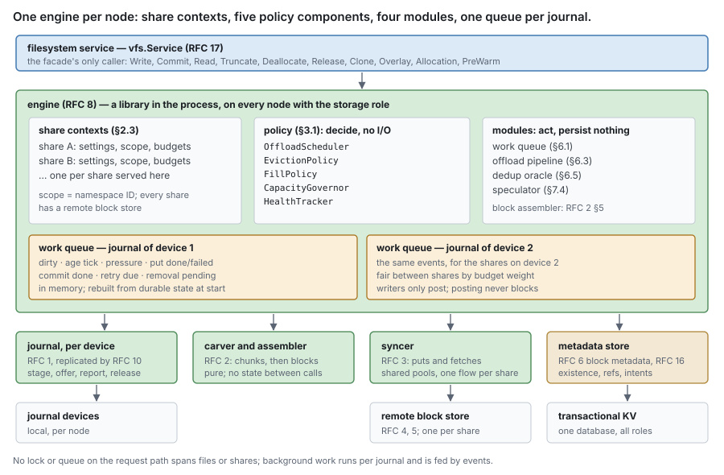
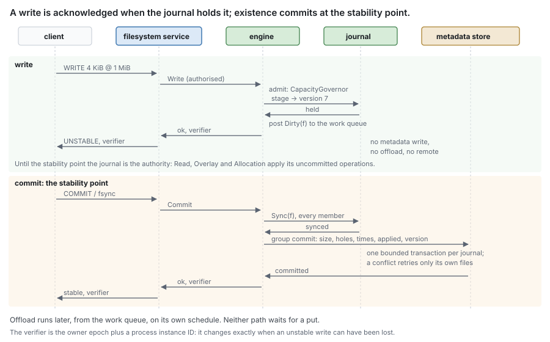
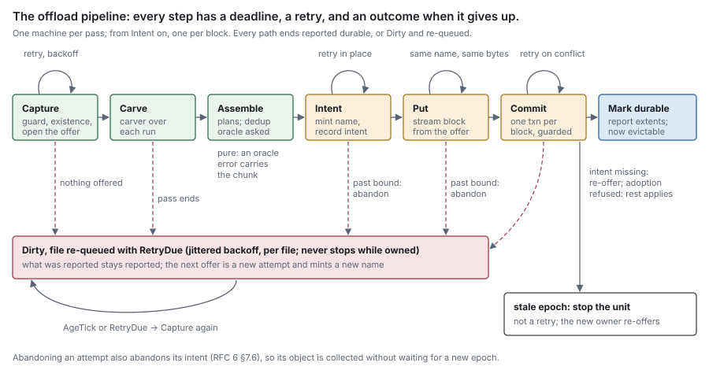
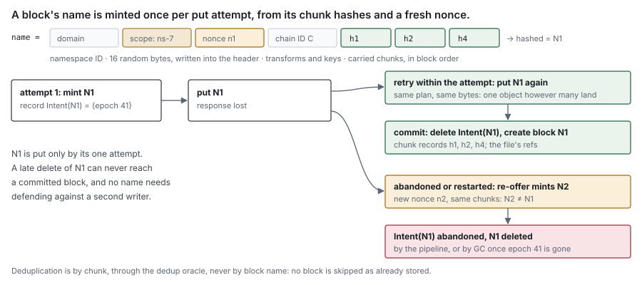
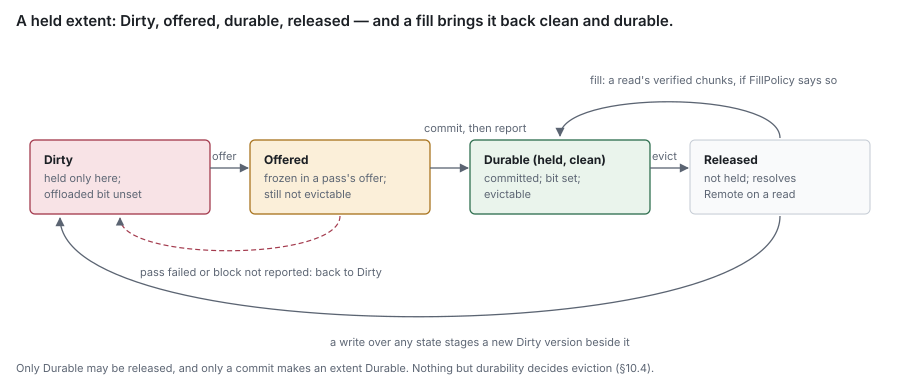

# RFC 8 — the engine

**Status:** draft.
**Audience:** anyone changing the engine, the content composition, or the
content surface the filesystem service ([RFC 17](rfc-17-vfs.md)) calls.

Conventions, RFC 2119 keywords and test tiers are set once in the
[index](rfc-index.md). This document specifies behaviour, not the current code;
[Appendix A](#Appendix%20A%20%E2%80%94%20where%20the%20current%20code%20differs) lists where the code differs, as defects to fix, never
rules to build around. Where it chooses a policy the set left open, the choice is
labelled **proposal** and names the measurement that would overturn it.

---

## In short

- The engine holds no bytes and no facts. Every byte is the journal's or the
  remote tier's; every fact is block metadata's or the namespace's.
- It is the content data path, one per node with the storage role, serving every
  share whose units that node owns. It decides policy through five small policy
  components, runs four modules — the work queue, the offload pipeline, the
  dedup oracle and the speculator — and is the content **facade** the filesystem
  service calls ([RFC 17](rfc-17-vfs.md)). Adapters never call it.
- It is a library in the process, not a service, and never on the byte path.
- It owns the joins no component can own alone: residency resolution on read, the
  offload pipeline, and the ordering of a write and its stability point. Blocks
  are packed by the block assembler ([RFC 2 §5](rfc-2-carver.md#5.%20The%20block%20assembler)), which the pipeline
  drives.
- Every share has a remote block store. There is no local-only share.
- Policy chooses among safe actions. It is never the thing that makes an action
  safe.
- It persists nothing. Its queue, plans and policy state are rebuilt from the
  journal and the records after a crash; losing them costs time, never content.

This document has one section per operation — write ([§4](#4.%20Write)), commit
([§5](#5.%20Commit%3A%20the%20stability%20point)), offload ([§6](#6.%20Offload)), read ([§7](#7.%20Read)), truncate and deallocate
([§8](#8.%20Truncate%2C%20deallocate%20and%20release)), clone ([§9](#9.%20Clone)) — each stating its rules first, then explaining them.

> [!important] Pending review — one section per operation
> The engine is reorganised around its operations, each rules-first with its
> diagram. The four modules are specified where their operation is, each with
> its own inputs, outputs, invariants and checks. Block assembly moved to RFC 2
> §5 as the block assembler.

---

## 1. Purpose

[RFC 0 §1.1](rfc-0-data-lifecycle.md#1.1%20The%20component%20set) gives the engine *the content data path: composition, policy, and the content facade the filesystem service calls*, and
nothing else. It answers the one question no component can:

> **Given what the two oracles say, what happens next?**

The two oracles are the two sources of truth about content ([RFC 0 §4.1](rfc-0-data-lifecycle.md#4.1%20The%20two%20oracles)):

- the **journal**, which says whether this node holds a file's bytes locally, and
  where;
- the **metadata store**, which says whether content exists, which chunk and
  block hold it, and whether that block is durable remotely.

Neither may answer the other's question; the engine is where their answers are
joined. A read has two answers to join. An offload has a carver, an assembler, a
syncer and a metadata commit to sequence. A full journal has to be told what to
evict. A write has steps owned by three components. Each needs someone who sees
all the parties and belongs to none of them.

### 1.1 Neither a single point of failure nor a bottleneck

Seeing every party makes the engine a coordinator, and a coordinator is where a
system usually loses its availability or its throughput. Four rules keep it
from being either:

- **It is a library, not a service.** The engine is code in the process that
  owns the content, reached by a function call. There is no engine server to
  lose: each node runs its own engine, over the units it owns
  ([RFC 15](rfc-15-topology.md), [RFC 11](rfc-11-ownership.md)).
- **It is never on the byte path.** It sequences; bytes flow from the journal
  through the carver to the syncer and back, and a write is a journal append
  and an acknowledgement ([§4.1](#4.1%20A%20write%20is%20staged%20and%20acknowledged%2C%20and%20nothing%20more)). No payload is copied through engine state.
- **Nothing on the request path spans shares or files.** The engine **MUST NOT**
  hold a lock, a queue or any other serialisation point shared by more than one
  file, or by more than one share, on the path of a write, a read or a commit.
  Per-file state is keyed by file and per-share state by share ([§2.3](#2.3%20One%20engine%20per%20node%3B%20a%20share%20is%20a%20context)).
  Background work runs per journal ([§6.1](#6.1%20The%20work%20queue)), and the events that feed it
  never block the request that posts them. The table of share contexts is read
  without a lock on the hot path.
- **Failover is not its job.** When a node dies, what its engine served moves
  with ownership: another node takes the units over and replays from a replica
  ([RFC 10](rfc-10-journal-replication.md), [RFC 11](rfc-11-ownership.md)). The engine's state is memory by design ([§3.3](#3.3%20Policy%20state%20is%20memory%2C%20and%20disposable)), so
  the new node's engine starts correct from nothing.

[§14](#14.%20Observability) measures the third rule, and [§15.2](#15.2%20Group%20B%20%E2%80%94%20wedging) checks it.

### 1.2 Non-goals

The engine **MUST NOT**:

- define a format, an encoding or an algorithm ([RFC 1](rfc-1-journal.md), [RFC 2](rfc-2-carver.md), [RFC 4](rfc-4-remote-tier.md), [RFC 5](rfc-5-transforms.md)) —
  how chunks are packed into blocks included ([RFC 2 §5](rfc-2-carver.md#5.%20The%20block%20assembler));
- move bytes to or from the remote tier itself — that is the syncer ([RFC 3](rfc-3-syncer.md));
- hold a copy of any oracle's answer that outlives the operation that asked — no
  residency cache, no durability record ([RFC 0 §4.2](rfc-0-data-lifecycle.md#4.2%20The%20residency%20function));
- persist anything. Every durable fact is recorded by the component that owns it;
- decide when a file stops existing ([RFC 7 §4](rfc-7-namespace-metadata.md#4.%20What%20keeps%20a%20file%20alive)), or schedule GC ([RFC 9](rfc-9-gc.md)), which
  runs once per remote namespace, not per share ([§10.5](#10.5%20GC%20is%20not%20scheduled%20here));
- carry namespace features nothing below the namespace needs, such as a recycle
  bin ([RFC 7](rfc-7-namespace-metadata.md)).

## 2. Composition



### 2.1 Content composition

The process's one composition root is [RFC 15](rfc-15-topology.md)'s: it builds a node by role, and
it alone names concrete component types. This section specifies what it builds
for content, on a node with the storage role: one **journal per device**, the
syncer, block metadata's view, and one engine over them with a context per share
([§2.3](#2.3%20One%20engine%20per%20node%3B%20a%20share%20is%20a%20context)). Everything else — the filesystem service, the runtime, other
components — holds a declared interface; adapters hold only the filesystem
service. [RFC 0 §1.2](rfc-0-data-lifecycle.md#1.2%20Component%20autonomy)'s import rule binds the components composed; the
composition code imports them and nothing imports it.

**Every share has a remote block store.** The root **MUST** refuse to add a share
whose configuration names no remote block store, with an error naming the share.
There is no local-only share and no code path for one: offload always has a
target, clone always adopts refs, and a durability report always has a commit
behind it. A deployment that wants no remote service configures a remote block
store of its own ([RFC 4](rfc-4-remote-tier.md)).

**The key scope is the namespace.** Each share context carries its namespace ID as
its key scope ([RFC 2 §4.3](rfc-2-carver.md#4.3%20Key%20scope)): block names are minted under it ([§6.6](#6.6%20A%20block%27s%20name%20is%20minted%2C%20and%20its%20intent%20recorded%2C%20before%20the%20put)) and
the dedup oracle answers within it ([§6.5](#6.5%20The%20dedup%20oracle)). Content-addressed records are
partitioned by namespace ([RFC 6 §2.6](rfc-6-block-metadata.md#2.6%20The%20scope%20of%20a%20count)), so two shares of one namespace deduplicate
against each other and shares of two namespaces never do.

Composition **MUST** happen at construction. A capability **MUST NOT** be wired
onto a serving engine by a setter: that makes "this capability is absent" a
reachable state of a live share. Changing a share's backends replaces its context.

The engine supplies and consumes, at construction:

| Declared by | Need | Supplied from |
| --- | --- | --- |
| [RFC 3](rfc-3-syncer.md) | a `Store`: streamed put, verified read, health ([RFC 3 §1.3](rfc-3-syncer.md#1.3%20Interface)) | the block codec with the store's transform chain ([RFC 4 §3](rfc-4-remote-tier.md#3.%20The%20block%20format), [RFC 5](rfc-5-transforms.md)), over the share's remote block store |
| [RFC 17](rfc-17-vfs.md) | the content facade, including the one read path for size, times and version, `Overlay` ([§12.1](#12.1%20One%20content%20facade%2C%20called%20by%20the%20filesystem%20service)) | the engine |

Every capability **MUST** be a method on an interface held by declaration, and an
absent one **MUST** fail the build or construction with an error naming it
([RFC 0 §1.2](rfc-0-data-lifecycle.md#1.2%20Component%20autonomy)). A production constructor that accepts `nil` for a capability "so
tests can omit it" has made a silent fallback a production path; fixtures supply
stubs of the whole interface.

> [!important] Pending review — content composition, and no share without a remote store
> The composition root moves to RFC 15; this section keeps only what the root
> builds for content. A share without a remote block store is refused at
> composition, and every no-remote path is deleted. The key scope is the
> namespace ID.

### 2.2 Capabilities are parameters, never assertions

The engine **MUST NOT** negotiate a capability by type assertion, nor fall back to
a degraded behaviour when one is missing ([RFC 0 §1.2](rfc-0-data-lifecycle.md#1.2%20Component%20autonomy)). Here each such fallback
yields a working share and no error: an assertion failing on the remote tier
disables offload, on a transform chain uploads plaintext, on a lookup makes every
cold read linear.

### 2.3 One engine per node; a share is a context

A node with the storage role runs **one engine**, and each share it serves is a
**share context** in it, not an engine of its own:

```go
// ShareContext is everything the engine keeps that belongs to one share.
type ShareContext struct {
	Share    metadata.ShareID
	Scope    metadata.NamespaceID // the key scope (§2.1)
	Settings Settings             // validated at add (§2.4)
	Policy   PolicyState          // access pattern, dirty ages, backoff, frontiers (§3.3)
	Health   ShareHealth          // per direction (§11.1)
	Budgets  Budgets              // its share of journal capacity, transfers and pacing
	State    ShareState           // adding, serving, quiescing, removing
}
```

Everything below the engine is already shared: the journal is per device and
accounts capacity per share ([RFC 1 §7](rfc-1-journal.md#7.%20Capacity)), the syncer's pools are shared and schedule
by class ([RFC 3](rfc-3-syncer.md)), and the remote store and the metadata store **MAY** serve many
shares. What is truly per share is small — settings, policy state, lifecycle,
health and budgets — and the context holds exactly that.

**Background work runs per journal, not per share.** Each device journal has one
work queue ([§6.1](#6.1%20The%20work%20queue)), which drives offload, removal batches, eviction, repack
and the consistency check for every share on it, weighted by their budgets and
fair between them. A node serving 10⁴ shares runs one set of loops per device,
not 10⁴ sets.

**Isolation comes from state, budgets and fairness, not from separate
engines.** A share cannot starve another because its capacity, transfers and
pacing draw on its own budgets and the queue serves shares fairly
([§1.1](#1.1%20Neither%20a%20single%20point%20of%20failure%20nor%20a%20bottleneck)); a share's failure is its context's health, not the engine's. Adding,
removing or quiescing a share changes one context and never restarts the
engine.

Per-file state is keyed by file within its ownership unit. A file whose byte
ranges are separate units ([RFC 11](rfc-11-ownership.md)) has that state per range, at each range's
owner, and each range's owner offloads its own range.

### 2.4 Settings are validated once, and refused rather than replaced

The engine validates every setting it composes at construction, and **MUST**
refuse an invalid one with an error rather than substitute a default
([RFC 2 §3.7](rfc-2-carver.md#3.7%20Bad%20settings%20must%20be%20refused%2C%20not%20replaced)). It **MUST** record which chunking settings produced a share's content,
and **MUST** report a change to them as a migration rather than apply it
([RFC 2 §3.6](rfc-2-carver.md#3.6%20Changing%20any%20of%20this%20is%20a%20migration)).

### 2.5 Start in order, stop in reverse, and join before closing

**Start.** Each step completes before the next begins.

1. **Open the journal.** Read the version floor for every share the device
   journal may serve ([RFC 6 §8.3](rfc-6-block-metadata.md#8.3%20A%20file%27s%20refs%20and%20the%20version%20floor)), and open the journal with it ([RFC 1 §9.1](rfc-1-journal.md#9.1%20Rebuilding)). The
   journal recovers its index and its offloaded-bit ledger alone.
2. **Re-apply existence.** For each file the journal lists ([RFC 1 §3.7](rfc-1-journal.md#3.7%20State%20introspection)), read
   the operations above the file's `applied` version with `Since(id, applied)` —
   held extents and removal markers, each with its version ([RFC 1 §3.10](rfc-1-journal.md#3.10%20Settle%20and%20Since)) —
   and apply them to existence in version order: writes acknowledged but never
   stabilised, and removals whose metadata step a crash cut off
   ([RFC 6 §3.4](rfc-6-block-metadata.md#3.4%20Ordering%20against%20the%20journal)). The existence commit syncs the file first, like every existence
   commit ([§5.1](#5.1%20Commit%20is%20answered%20by%20the%20journal)). Once it commits, call `Settle(id, applied)` with the new
   `applied`, so the journal drops the markers it covers.
3. **Resume removals and clones.** Resume every removal not done, batch by batch,
   and every unfinished clone ([RFC 6 §6.2](rfc-6-block-metadata.md#6.2%20Truncation%20and%20deallocation), [§9.1](#9.1%20Clone%20adopts%20refs%2C%20and%20offloads%20uncarved%20content%20first)); a clone's destination range
   is not served until its clone is done. Then prune every done removal: no pass
   is in flight.
4. **Rebuild the work queue** ([§6.1](#6.1%20The%20work%20queue)): a `Dirty` event for every file the
   journal holds with an extent whose offloaded bit is unset.
5. **Start background work**: the work queue's consumer, eviction and the
   **consistency check**. Eviction may run at once: the ledger restored the
   offloaded bits ([RFC 1 §9.2](rfc-1-journal.md#9.2%20Offload%20state%20after%20recovery)). The check compares them with the refs
   ([RFC 6 §8.3](rfc-6-block-metadata.md#8.3%20A%20file%27s%20refs%20and%20the%20version%20floor)) through `MarkDurable`, and reports and clears any bit no ref justifies.
   It is a check, not a gate.
6. **Serve.** No file is served before step 2 has run for it.

**Restart re-offers everything without an offloaded bit.** Pipeline state lives
in memory only ([§6.3](#6.3%20The%20offload%20pipeline)). After a restart, every held extent without an
offloaded bit is offered again:

- a re-offer is a new attempt and mints a new name ([§6.6](#6.6%20A%20block%27s%20name%20is%20minted%2C%20and%20its%20intent%20recorded%2C%20before%20the%20put)). Chunks a block
  committed before the crash are found by the dedup oracle and adopted; the rest
  are carried again;
- a block that was put and never committed is named by an intent under the
  previous epoch and by no block record. Its name is never used again, and the
  object is an **orphan: leaked space, not lost content**, which collection
  reclaims from its intent ([RFC 9 §5](rfc-9-gc.md#5.%20Unrecorded%20objects)).

**A new owner settles before serving.** When a unit changes owner — takeover or
handover ([RFC 11](rfc-11-ownership.md)) — the new owner settles each file to the sealed or drained
point ([RFC 10](rfc-10-journal-replication.md)) and runs steps 2 to 4 for it before serving it.

**Stop.**

1. Stop accepting facade calls.
2. Stop the work queue dispatching new passes and batches.
3. Cancel in-flight passes and background loops, then join them.
4. Close the components in the reverse of the order they were built — only after
   every join has completed. A component **MUST NOT** be closed while any work
   that uses it is still running ([RFC 1 §10.7](rfc-1-journal.md#10.7%20Shutdown)).
5. A join that does not complete within its bound **MUST** leave the components
   it depends on open and report the failure, rather than close them under a
   live loop.

## 3. Policy

### 3.1 Policy is decided here and executed below

Policy is five small components. Each takes plain inputs — statistics, the
clock, a share's settings and budgets — and returns a decision. None does I/O,
holds a reference to a component or calls a mechanism, so each is tested alone
with a table of inputs and expected decisions:

```go
type OffloadScheduler interface { Next(now time.Time, s JournalStats, shares []ShareView) []OffloadPass } // eligibility, urgency
type EvictionPolicy   interface { Evict(now time.Time, s JournalStats, need int64) []EvictUnit; Repack(s JournalStats) bool }
type FillPolicy       interface { Fill(r ReadInfo, s JournalStats) bool }                                    // fill a demanded extent or not
type CapacityGovernor interface { Admit(s JournalStats, share ShareView, n int64) Admission }          // accept, pace, or refuse
type HealthTracker    interface { Observe(o Outcome); Health(share metadata.ShareID) ShareHealth }     // per direction
```

The engine **only sequences**: it gathers the inputs, asks the component, and
calls the mechanism the decision names. It **MUST NOT** fold these into one
policy evaluator — that is the monolith this split removes, renamed — and a
component **MUST NOT** call another; where one decision needs another's output,
the engine passes it in.

| Decision | Decided by | Carried out by |
| --- | --- | --- |
| When to offload a file | `OffloadScheduler`: eligibility and urgency ([§6.2](#6.2%20When%20a%20file%20is%20offered)) | the offload pipeline ([§6.3](#6.3%20The%20offload%20pipeline)) over journal `Offload` ([RFC 1 §3.3](rfc-1-journal.md#3.3%20Offload)) |
| What goes in a block | the block assembler ([RFC 2 §5](rfc-2-carver.md#5.%20The%20block%20assembler)) — a fold, not a policy | the offload pipeline |
| When to put a block | as soon as it is assembled — no decision | syncer uploader ([RFC 3 §3.1](rfc-3-syncer.md#3.1%20It%20is%20triggered%2C%20not%20scheduled)) |
| Whether to fill | `FillPolicy` ([§7.3](#7.3%20Filling%20is%20a%20decision)) | journal `Fill` ([RFC 1 §3.4](rfc-1-journal.md#3.4%20Fill)) |
| What to read ahead, pre-warm | the speculator ([§7.4](#7.4%20The%20speculator)) | syncer fetcher ([RFC 3 §4.5](rfc-3-syncer.md#4.5%20Speculation%20is%20executed%20here%20and%20decided%20elsewhere)) |
| What to evict, and when | `EvictionPolicy` ([§10.1](#10.1%20Eviction%20is%20chosen%20here%2C%20and%20needs%20no%20new%20record)) | journal `Release` ([RFC 1 §3.5](rfc-1-journal.md#3.5%20Release)) |
| When to repack | `EvictionPolicy` ([§10.3](#10.3%20Repack%20is%20triggered%20here)) | journal repack ([RFC 1 §8.2](rfc-1-journal.md#8.2%20Repack)) |
| Whether to keep accepting writes | `CapacityGovernor` ([§10.2](#10.2%20A%20capacity%20refusal%20comes%20back%20here)) | journal capacity ([RFC 1 §7](rfc-1-journal.md#7.%20Capacity)) |
| What follows from ill health | `HealthTracker` ([§11.1](#11.1%20Health%20is%20derived%20from%20recent%20outcomes%2C%20offload%20included)) | — |

A threshold that lives in a component's configuration is engine policy absorbed
by that component.

**Policy components decide; modules act.** Four modules carry work the policy
components only decide on. Each is specified where its operation is, with its
inputs, outputs, invariants and checks:

| Module | Does | Section |
| --- | --- | --- |
| work queue | turns events into offload passes, removal batches and retries, per journal | [§6.1](#6.1%20The%20work%20queue) |
| offload pipeline | runs a pass as an explicit state machine, with per-step retries | [§6.3](#6.3%20The%20offload%20pipeline) |
| dedup oracle | says whether a chunk may be adopted instead of carried | [§6.5](#6.5%20The%20dedup%20oracle) |
| speculator | plans read-ahead and pre-warm fetches | [§7.4](#7.4%20The%20speculator) |

A module **MAY** hold memory state and call mechanisms. It **MUST NOT** persist
anything, and **MUST** be testable with each component it calls replaced by a
stub of that component's whole interface.

### 3.2 Policy never makes an action safe

Every mechanism the engine calls is safe by its own definition: `Release` refuses
an extent whose offloaded bit is unset ([RFC 1 §3.5](rfc-1-journal.md#3.5%20Release)), `Fill` refuses to overwrite held
bytes ([RFC 1 §3.4](rfc-1-journal.md#3.4%20Fill)), an offloaded bit is set only on a durability report. A
policy gate **MUST NOT** be the only thing standing between the system and data
loss. The test: disable every gate — evict as eagerly as possible, fill
everything, offload constantly — and the Group A checks still pass ([§15](#15.%20Conformance)).

### 3.3 Policy state is memory, and disposable

Access patterns, dirty ages, offload backoff, readahead frontiers, pipeline
state, the work queue and derived health **MUST** live in memory. A restart
**MAY** lose all of it, and the engine **MUST** behave correctly from an empty
state.

## 4. Write



### 4.1 A write is staged and acknowledged, and nothing more

**Rules.**

- A write is one facade call, made by the filesystem service after it has
  authorised the write and checked open state and quota ([RFC 17 §5.1](rfc-17-vfs.md#5.1%20Write)). No
  adapter **MAY** perform its steps, and no caller but the filesystem service
  **MAY** call it.
- A write **MUST NOT** wait for a metadata transaction, an offload or the remote
  tier. It waits only for admission and for the journal.
- Until the file's next stability point ([§5](#5.%20Commit%3A%20the%20stability%20point)), the journal is the authority
  for the write: `Read`, `Overlay` and `Allocation` apply the journal's
  uncommitted operations of the file over committed existence.
- The reply carries the **write verifier** (below).

**Steps.**

1. **Admit.** `CapacityGovernor` accepts, paces or refuses the write
   ([§10.2](#10.2%20A%20capacity%20refusal%20comes%20back%20here)).
2. **Stage.** The journal stores the bytes and assigns the write its version
   ([RFC 1 §3.1](rfc-1-journal.md#3.1%20Write)); where replication is composed, every member holds them durably
   ([RFC 10 §4](rfc-10-journal-replication.md#4.%20The%20write%20path)).
3. **Post** a `Dirty` event for the file to its journal's work queue
   ([§6.1](#6.1%20The%20work%20queue)). Posting never blocks.
4. **Acknowledge**, returning the verifier.

> **Example.** File `f` is empty: size 0. A client writes 4 KiB at offset 1 MiB.
> The journal stages it at content version 7, and the engine acknowledges. A
> `GETATTR` now joins `f`'s File record (size 0) with the engine's overlay, which
> reports size 1 MiB + 4 KiB and the new mtime; `SEEK_DATA` from 0 lands at
> 1 MiB, because `[0, 1 MiB)` is a hole in the overlay. Nothing in metadata has
> changed. At the client's `COMMIT`, [§5](#5.%20Commit%3A%20the%20stability%20point) writes the size, the hole, the times
> and `applied = 7` in one transaction. If the node crashes before that, recovery
> re-applies version 7 from the journal before `f` is served ([§2.5](#2.5%20Start%20in%20order%2C%20stop%20in%20reverse%2C%20and%20join%20before%20closing)).

**The write verifier.** `Write` and `Commit` return a verifier derived from the
owner epoch of the file's unit and a **process instance ID** drawn at random when
the process starts. It changes whenever an acknowledged but unstable write might
have been lost — a restart, or the unit moving to another owner — which is when a
client must resend its unstable writes ([RFC 14 §10](rfc-14-open-state.md#10.%20Ownership), [RFC 11](rfc-11-ownership.md)). The engine
**MUST** return one verifier for every call under one epoch in one process, and
**MUST NOT** derive it from the clock alone.

> [!important] Pending review — the write verifier comes from the engine
> `Write` and `Commit` return a verifier derived from the owner epoch and a
> per-process instance ID, so it changes exactly when an unstable write can
> have been lost.

## 5. Commit: the stability point

### 5.1 Commit is answered by the journal

**Rules.**

- A client's flush — NFS `COMMIT`, SMB `FLUSH`, `fsync`, a stable write — is a
  **stability point** and reaches the facade as `Commit`.
- `Commit` **MUST** call the journal's `Sync` on the file — at every member,
  where replication is composed ([RFC 10](rfc-10-journal-replication.md)) — before it commits the file's
  pending existence, and **MUST** answer only once both are done.
- **Every existence commit** — a stability point, an offer's capture, a removal's
  first transaction, recovery — **MUST** `Sync` the file first. The journal
  publishes an extent once its record is written, not once it is durable
  ([RFC 1 §10.4](rfc-1-journal.md#10.4%20What%20must%20be%20atomic)), so existence committed over unsynced records could outlive them.
- A stability point **MUST NOT** wait for an offload, and does not schedule one,
  carve, or touch the remote tier.
- A failed existence commit fails the reply; the operations stay pending and the
  next stability point retries them.

**Steps.**

1. `Sync(file)` in the journal.
2. Join the journal's next group commit ([§5.2](#5.2%20Group%20commit%20is%20bounded%2C%20and%20retries%20only%20the%20files%20that%20conflict)), which writes, under the
   owner epoch: `size`, holes, `mtime`, `ctime`, `applied` advanced to the newest
   version covered, and the file's version advanced ([RFC 6 §3.4](rfc-6-block-metadata.md#3.4%20Ordering%20against%20the%20journal)).
3. Answer, with the verifier.

This is the only acknowledgement policy: the journal is required to be durable
([RFC 1 §6.2](rfc-1-journal.md#6.2%20Sync%20policy)), so what it has synced survives a crash, and offload carries it to
the remote on its own schedule. A remote-acknowledged commit would bound every
`fsync` by a put and turn a remote outage into client write errors.

### 5.2 Group commit is bounded, and retries only the files that conflict

**Rules.**

- Stability points of one journal that are due together **MUST** be committed in
  one transaction, not one per write.
- A batch **MUST** be bounded: at most `G` files, and within the store's
  transaction limits ([RFC 16](rfc-16-metadata-store.md)). **Proposal:** `G` = 256. Overturned by E5's
  transactions per stability point rising at the bound.
- A conflict **MUST NOT** fail or delay a file that did not conflict. When the
  store names the conflicting keys, the engine resubmits the other files at once
  and retries the conflicting ones alone. When it does not, the engine splits the
  batch in halves and resubmits each, until every conflicting file stands alone.

**Why.** An existence commit rewrites the file's record, which a namespace
operation — `chmod`, a rename's `ctime`, an unlink — also writes. Without the
split, one `chmod` anywhere on the journal aborts the whole batch and delays every
pending `fsync` behind it.

> **Example.** 64 writers each `fsync`, and one batch carries their 64 files. A
> `chmod` on file 17 commits between the batch's reads and its commit, and the
> store reports a conflict without naming a key. The engine splits 32 / 32: the
> half without file 17 commits; the other splits 16 / 16, and so on. File 17
> ends alone and retries; the other 63 files were delayed by at most
> log₂ 64 = 6 extra transactions, and file 17 by one retry more. A store that
> names the key costs two transactions.

> [!important] Pending review — bounded group commit
> A group commit is bounded and retries only the conflicting files, split and
> resubmitted, so a `chmod` storm no longer stalls every `fsync` of a journal.
> Benchmark E7 measures it.

## 6. Offload

Offload is how dirty content becomes durable and therefore evictable
([RFC 0 §5.2](rfc-0-data-lifecycle.md#5.2%20Offload)). **A failure anywhere in offload leaves bytes neither offloaded nor
evictable**, and a journal that cannot evict fills and refuses writes. So:

- every dirty extent **MUST** be offered again until it is reported durable, for
  as long as its unit is owned here;
- every failure **MUST** end in one of two states: the extent reported durable,
  or the extent **Dirty** with its file re-queued for a retry;
- no step **MAY** wait without a deadline;
- a file that cannot be offloaded **MUST** be reported by name ([§11.1](#11.1%20Health%20is%20derived%20from%20recent%20outcomes%2C%20offload%20included)).

Five parts carry this out: the work queue decides when to look ([§6.1](#6.1%20The%20work%20queue)),
`OffloadScheduler` which files ([§6.2](#6.2%20When%20a%20file%20is%20offered)), the pipeline runs a pass
([§6.3](#6.3%20The%20offload%20pipeline)), the dedup oracle decides what to carry ([§6.5](#6.5%20The%20dedup%20oracle)), and the guard
and the fences order the commits ([§6.4](#6.4%20The%20offload%20guard%20is%20narrow)).

### 6.1 The work queue

Offload, removal batches and their retries are driven by one **in-process work
queue per device journal**: events in, work handed to the journal's workers out.

**Inputs.**

| Event | Posted by | Effect |
| --- | --- | --- |
| `Dirty(file)` | the write path, after staging ([§4.1](#4.1%20A%20write%20is%20staged%20and%20acknowledged%2C%20and%20nothing%20more)) | marks the file as holding dirty bytes |
| `AgeTick(now)` | a timer per journal | asks `OffloadScheduler` with fresh `JournalStats`; re-derives due work from the journal |
| `Pressure(level)` | `CapacityGovernor`, crossing the soft threshold or the limit ([§10.2](#10.2%20A%20capacity%20refusal%20comes%20back%20here)) | makes every file with dirty bytes eligible; shortens backoff |
| `PutDone(block)`, `PutFailed(block, outcome)` | the pipeline's put step | advances or retries that block's attempt |
| `CommitDone(block, result)` | the pipeline's commit step | reports, retries or re-offers |
| `RetryDue(step)` | the queue's own timer | re-runs a failed step once its backoff expires |
| `RemovalPending(file, v)` | a removal's first transaction ([§8.1](#8.1%20A%20removal%20is%20one%20transaction%2C%20then%20batches)), recovery | runs the removal's next batch |

**Outputs.** Offload passes handed to the pipeline, removal batches, and eviction
and repack requests from `EvictionPolicy`.

**Rules.**

- **One queue per journal**, serving every share on it, fair between shares by
  budget weight. It is not on the request path: a writer only posts.
- **Posting never blocks and never grows with bytes.** Events for one file
  coalesce into one entry, so the queue holds at most one entry per file with
  pending work plus one per block in flight.
- **The queue is not durable.** Every event is a hint about state the journal,
  the put intents and the records already hold durably. At start it **MUST** be
  rebuilt from them ([§2.5](#2.5%20Start%20in%20order%2C%20stop%20in%20reverse%2C%20and%20join%20before%20closing)): a `Dirty` for every file the journal holds with
  an unset offloaded bit, a `RemovalPending` for every removal not done.
- **A lost event costs latency, never offload.** `AgeTick` asks the journal for
  its dirty files and their oldest dirty byte ([RFC 1 §3.7](rfc-1-journal.md#3.7%20State%20introspection)) and posts what is
  due, so every dirty byte is offered within the maximum age even if every other
  event were dropped.
- **Retries are scheduled events, never sleeps.** A failed step posts `RetryDue`
  at its backoff deadline and frees its worker.
- **Handlers do no I/O.** A handler asks a policy component and hands the work
  to a worker, so a slow put never delays another file's event.
- **Dispatch is the shared work scheduler's** ([§6.1.1](#6.1.1%20The%20shared%20work%20scheduler)). The queue is the
  engine's source; batching, retry timing, concurrency, fairness and rate limits
  are the scheduler's.

**Checks.**

| Requirement | Check |
| --- | --- |
| a lost event costs latency | Drop every `Dirty`, `PutDone` and `CommitDone` event at random with probability ½ under sustained writes. Assert every dirty extent is offered within the maximum age, and reported durable once its commit lands. |
| posting never blocks | Stall the consumer; write at full rate. Assert no write waits on the queue, memory stays within one entry per file, and writes are slowed only by capacity pacing. |
| rebuild | Crash with 10⁵ dirty files, passes in flight and removals between batches; restart. Assert every dirty file is offered, every removal resumes, and nothing else is needed to reach both. |
| fairness | Two shares on one journal, one with 10⁵ small dirty files, the other with one. Assert the other share's file is offered within one age tick. |

> [!important] Pending review — offload is driven by a work queue
> Replaces callbacks and per-share loops with one in-process queue per journal.
> It is not durable: the journal, the intents and the records are, and the
> queue is rebuilt from them, with the age tick as the backstop for a lost event.

### 6.1.1 The shared work scheduler

Background work in the set — the engine's offload, removal batches and retries,
and GC's deleter, compactor, audit and collection ([RFC 9 §7.1](rfc-9-gc.md#7.1%20GC%20bounds%20its%20own%20work)) — is dispatched by
one **work scheduler**, specified here once. It is a library, not a component:
each component runs its own instance, so no component imports another
([RFC 0 §1.2](rfc-0-data-lifecycle.md#1.2%20Component%20autonomy)) and a stalled GC never holds up offload.

A **source** supplies the work and owns its durability:

```go
// Source is one kind of background work. The scheduler holds no durable state;
// the source rebuilds its pending work from its own durable records.
type Source interface {
	// Rebuild re-derives pending work from durable state at start.
	Rebuild(ctx context.Context, post func(Item)) error
	// Run performs one batch of items and returns one result per item.
	Run(ctx context.Context, batch []Item) []error
	// Limits states the source's batch size, concurrency, rate and weight.
	Limits() Limits
}

type Limits struct {
	Batch       int           // items per Run
	Concurrency int           // Runs in flight
	Rate        float64       // items or bytes per second; 0 is unlimited
	Weight      int           // share of the instance under contention
	Deadline    time.Duration // bound on one item's retries (I8)
}
```

| Source | Durable state it rebuilds from |
| --- | --- |
| engine offload and removals | the journal's dirty files, the put intents and the removals not done ([§6.1](#6.1%20The%20work%20queue)) |
| GC deleter, compactor, audit, collection | the GC index keys and cursors of each lease shard it holds ([RFC 9 §3.1](rfc-9-gc.md#3.1%20Retire%20the%20records%2C%20then%20delete%20the%20object)) |

The scheduler **MUST**:

- **coalesce and batch**: items posted for one key merge into one entry, and a
  `Run` receives up to `Batch` items;
- **retry per item**: a failed item is re-posted at a backoff deadline with jitter,
  bounded by `Deadline`, never by an attempt count ([RFC 0 §9.2](rfc-0-data-lifecycle.md#9.2%20Conflicts%20and%20their%20retries)); a batch's
  successes are never retried with its failures;
- **bound concurrency and memory**: at most `Concurrency` runs per source and
  one entry per key, so posting never blocks and never grows with bytes;
- **share fairly**: under contention, sources and the tenants within them (shares,
  namespaces) receive work in proportion to `Weight`;
- **rate-limit**: a source with a `Rate` is paced to it, and a throttled result
  lowers the pace until successes return.

It **MUST NOT** hold state a restart needs: every item is a hint about durable
state its source already holds, and a lost item costs latency only.

> [!important] Pending review — one shared work scheduler
> The engine's work queue and GC's queues share one scheduler, specified here;
> each source owns its durability, and the scheduler owns batching, retries,
> concurrency, fairness and rate limits.

### 6.2 When a file is offered

**Rules.** `OffloadScheduler` decides. A file becomes eligible for an offload
pass when:

- its dirty bytes reach the block target;
- its oldest dirty byte reaches the offload **maximum age**; or
- the journal is under capacity pressure ([§10.2](#10.2%20A%20capacity%20refusal%20comes%20back%20here)).

A client's request for durability is not a trigger ([§5.1](#5.1%20Commit%20is%20answered%20by%20the%20journal)).

**Proposal:** a dirty-byte threshold of one block target and a maximum age of a
few seconds, with capacity pressure making every file with dirty bytes eligible.
Overturned by a measurement showing the age bound, not the byte bound, fragments
blocks under a streaming workload.

**A pass offers at most `upload_workers` block targets of dirty bytes**, across
the files it covers, through the journal's `limit` ([RFC 1 §3.3](rfc-1-journal.md#3.3%20Offload)). A large file is
offloaded as a sequence of passes, and small files are gathered into one pass up
to the same bound, their chunks packed into shared blocks ([RFC 2 §5](rfc-2-carver.md#5.%20The%20block%20assembler)).

### 6.3 The offload pipeline



A pass is run by the **offload pipeline**: an explicit state machine per pass,
with one sub-machine per block from the intent on. It is the one place bytes
become durable, so every transition names what happens when it fails.

**Inputs:** a pass from `OffloadScheduler` (files, `limit`, `widen`), the share
context, and the components it drives — journal, carver, block assembler, dedup
oracle, syncer flow, block metadata. **Outputs:** per block, a report of the
extents it made durable; per pass, an outcome for `HealthTracker`; `RetryDue`
events for what failed.

| State | Does | Holds | When it fails |
| --- | --- | --- | --- |
| **Capture** | under the files' guards ([§6.4](#6.4%20The%20offload%20guard%20is%20narrow)), syncs the files and commits their pending existence ([§5.1](#5.1%20Commit%20is%20answered%20by%20the%20journal)), then opens the offer with `OffloadMany` | guards, briefly; then the offer | nothing was offered; the pass is retried after backoff |
| **Carve** | runs the carver over each run of the offer ([§6.7](#6.7%20A%20run%20is%20what%20the%20journal%20offers%2C%20widened%20only%20to%20re-tile)) | the offer | the pass ends; blocks already reported stay reported, the rest stay **Dirty**; retried |
| **Assemble** | folds the chunks into block plans with the block assembler ([RFC 2 §5](rfc-2-carver.md#5.%20The%20block%20assembler)), asking the dedup oracle ([§6.5](#6.5%20The%20dedup%20oracle)) | plans: hashes and positions, no bytes | pure; an oracle error carries the chunk, which costs bytes and never correctness |
| **Intent** | mints the block's name and durably records its put intent ([§6.6](#6.6%20A%20block%27s%20name%20is%20minted%2C%20and%20its%20intent%20recorded%2C%20before%20the%20put)) | the intent | retried in place; past the step bound, the block's attempt is abandoned |
| **Put** | streams the block from the offer through the syncer ([RFC 3 §3.4](rfc-3-syncer.md#3.4%20One%20put%20per%20block)) | one chunk per worker | retried under the same name within the attempt; past the bound, abandoned |
| **Commit** | under the guard, one metadata transaction per block ([RFC 6 §4.1](rfc-6-block-metadata.md#4.1%20What%20one%20commit%20records)) | guard, briefly | conflict: retried; intent missing: abandoned and re-offered; adoption refused: the rest applies and the adopting refs are re-offered; stale epoch: the unit's pipeline stops |
| **Mark durable** | reports the block's committed extents through `report` ([§6.8](#6.8%20The%20callback%20returns%20only%20what%20committed)) | — | cannot fail inside the pass; a crash here is recovered by a re-offer that adopts every chunk |

A pass is done when every block has been reported or abandoned. What was not
reported stays **Dirty**, and the file is re-queued with a `RetryDue`.

**Rules.**

- **O1 — every step has a deadline.** A step that passes its bound fails; none
  waits forever. A stuck step is the worst failure there is: it pins its offer
  and holds nothing durable. **Proposal:** Capture and Commit are bounded by the
  metadata deadline; Put by the offload maximum age for its queue wait
  ([RFC 3 §2.9](rfc-3-syncer.md#2.9%20Workers%20are%20shared%20fairly%20across%20flows)) plus a transfer bound proportional to the block's size.
- **O2 — retries never stop.** A failed step is retried with jittered
  exponential backoff, per file, for as long as the unit is owned here.
  **Proposal:** from 1 s to a cap of 60 s, and a cap of 5 s under capacity
  pressure while the store is healthy; the first success resets it. Overturned by
  a measurement showing the cap either hammers a failing store or leaves a
  recovered one idle.
- **O3 — a retry within an attempt reuses its name, plan and bytes;** an attempt
  abandoned mints a new name when its content is offered again ([§6.6](#6.6%20A%20block%27s%20name%20is%20minted%2C%20and%20its%20intent%20recorded%2C%20before%20the%20put)).
- **O4 — the pipeline abandons its own intents.** When it gives up an attempt it
  **SHOULD** abandon the attempt's intent through [RFC 6 §7.6](rfc-6-block-metadata.md#7.6%20Put%20intents)'s abandonment
  transaction at once, rather than leave it until the epoch is superseded: a
  long-lived owner would otherwise hold every abandoned object for its tenure.
- **O5 — a block's report never waits for another block**, and a failed block
  holds back no other ([§6.8](#6.8%20The%20callback%20returns%20only%20what%20committed)).
- **O6 — one file cannot sink another.** A file that fails repeatedly is backed
  off alone; while it backs off, its chunks are offered in passes of their own,
  so a block shared with other files never carries it. After five consecutive
  failed passes (**proposal**) it is a health condition naming the file
  ([§11.1](#11.1%20Health%20is%20derived%20from%20recent%20outcomes%2C%20offload%20included)).
- **O7 — a stale epoch stops, it does not retry.** A commit or intent refused on
  the owner epoch means the unit has moved: the unit's passes end without
  reporting, and the new owner offers the content again.
- **O8 — it holds no bytes and persists nothing.** Its state is rebuilt by
  re-offering ([§2.5](#2.5%20Start%20in%20order%2C%20stop%20in%20reverse%2C%20and%20join%20before%20closing)).

**The put streams from the offer.** The put's source walks the plan and reads
each chunk from the offer's `Offered` reader ([RFC 1 §3.3](rfc-1-journal.md#3.3%20Offload)), and the store puts
the block as a stream — header, then bodies — with one chunk in memory per worker.
When a transform's output length is not known in advance, or the service checks a
checksum sent up front, the store walks the plan twice: once to measure, once to
send ([RFC 5](rfc-5-transforms.md)). The offered bytes stay stable for both walks, which is why the
put runs inside the `Offload` callback that offered them. The source **MUST**
recompute each chunk's hash as it reads and fail the put on a mismatch
([RFC 3 §3.5](rfc-3-syncer.md#3.5%20The%20bytes%20are%20stable%20for%20the%20duration)).

**Before a pass, the engine checks `Healthy(Put)`** on the share's flow
([RFC 3 §2.8](rfc-3-syncer.md#2.8%20An%20unhealthy%20store%20refuses%20work)) and skips the pass while the store is put-unhealthy; the skipped
pass is a `RetryDue`, not a stop.

**Checks.** The pipeline is tested with every component it drives replaced by a
fault-injecting stub, and again as production composes it.

| Requirement | Check |
| --- | --- |
| O1, O2 every step | For each state, inject in turn: one failure, failures past the step bound, a hang, and a process crash. Assert that once the fault clears, every extent is reported durable and evictable within the maximum age plus the backoff cap; no extent is reported without its commit; and every orphaned object is named by an intent that is later abandoned. |
| O3 unknown outcome | Lose a put's response. Assert the retry reuses the name and the bytes, and one object results. |
| O4 own intents | Abandon an attempt past its put bound with the owner still live. Assert its intent is abandoned and its object deleted without an epoch change. |
| O6 poison file | One file's offered reader fails every read, among 10³ other dirty files. Assert the others become durable at the unloaded rate, and the failing file is backed off alone and reported by name. |
| O7 stale epoch | Move the unit mid-pass. Assert the pass stops, reports nothing more, and the new owner offloads the content. |
| O2 long outage | Make the remote unavailable for 24 simulated hours. Assert retries continue at the cap, the share reports the condition, and offload resumes within one backoff of recovery with no intervention. |
| soak | Run for hours with random faults at every step, and partitions to the store and to metadata. Assert every stabilised byte reads back throughout; once the faults stop, the oldest unoffloaded age falls below the maximum age; and no abandoned attempt's intent outlives its bound. |

> [!important] Pending review — the offload pipeline is an explicit state machine
> Capture, carve, assemble, intent, put, commit, mark durable: each step has a
> deadline, a retry with backoff and a stated outcome on failure, and every path
> ends reported durable or Dirty and re-queued. Adds the pipeline abandoning its
> own intents, poison-file isolation and reliability checks.

**Snapshot pins.** The journal stores the share's current cut with each write's
version, and the commit step copies it into every ref it writes as `born`
([RFC 6 §6.5](rfc-6-block-metadata.md#6.5%20Who%20owns%20a%20ref)). A version pinned to a cut and superseded before its offload — by
an overwrite, a truncate, a deallocate or a release — is still offered while its
pin holds ([RFC 1](rfc-1-journal.md)); its commit writes the ref straight to history, with `born`
the cut its existence committed under and `died` the cut of the superseding
transaction, and never as a live ref ([RFC 12 §2.3](rfc-12-snapshots.md#2.3%20The%20cut%20is%20one%20transaction%20behind%20a%20brief%20gate)). Offloading the version
releases its pin.

### 6.4 The offload guard is narrow

**Rules.**

- The engine holds a per-file guard **only while capturing an offer and while
  committing**, never across the upload.
- Capturing an offer first commits the file's pending existence
  ([RFC 6 §3.4](rfc-6-block-metadata.md#3.4%20Ordering%20against%20the%20journal)), so no ref is ever written for content existence does not record.
- `Truncate`, `Deallocate`, `Release` and `Clone` hold the destination file's
  guard across their journal step and their removal's first metadata transaction
  ([§8.1](#8.1%20A%20removal%20is%20one%20transaction%2C%20then%20batches)), so no offer is captured between the two. A clone also holds its
  source's guard until it is done ([§9.1](#9.1%20Clone%20adopts%20refs%2C%20and%20offloads%20uncarved%20content%20first)).
- A pass over several files takes their guards in file-identity order.
- The guard **SHOULD** be keyed by file: a striped guard serialises unrelated
  files that collide on it.
- Every metadata commit the engine makes for a file — existence, offload,
  removal — carries the **owner epoch** of the file's unit, and block metadata
  refuses it when the epoch is stale ([RFC 6 §4.1](rfc-6-block-metadata.md#4.1%20What%20one%20commit%20records), [RFC 11 §8](rfc-11-ownership.md#8.%20Metadata%20consistency)).

Two passes of one file may therefore upload at once; block metadata orders their
commits by content version ([RFC 6 §4.4](rfc-6-block-metadata.md#4.4%20Commits%20for%20one%20file%20apply%20in%20order)), and the guard only keeps two commits
of one file from conflicting with each other.

**The guard is an optimisation, not a fence.** It saves commits from
conflicting and retrying; correctness **MUST NOT** depend on it. Two processes
that each believe they own a file hold two guards, and what orders their commits
is the metadata store's conflict on the file's fence records ([RFC 11 §8](rfc-11-ownership.md#8.%20Metadata%20consistency)).

### 6.5 The dedup oracle

The dedup oracle says whether a chunk may be **adopted** — referenced where it is
already stored — instead of carried again. It is the one place where a wrong
answer loses data: a ref to a chunk that is stored nowhere reads as **Lost**. So
it is its own module, with its own adversarial checks.

**Input:** a chunk hash and the share's key scope. **Output:** the chunk record
— its block and position — or none, or an error.

```go
type DedupOracle interface {
	Lookup(ctx context.Context, scope metadata.NamespaceID, h ChunkHash) (Chunk, bool, error)
}
```

It is built over block metadata's `Durable(hash)` ([RFC 6 §8.2](rfc-6-block-metadata.md#8.2%20Deduplication%20lookup)) in the
namespace's partition, and nothing else.

**Rules.**

- **D1 — it answers only from committed chunk records.** It **MUST NOT** answer
  from anything that knows about a block not yet committed — a pending plan, a
  block in flight, a put whose commit has not landed, an abandoned attempt.
- **D2 — a chunk repeated across blocks in flight is carried in each.** The
  earlier block may fail after the later one commits. The first to commit owns
  the chunk record, and the other adopts it ([RFC 6 §4.1](rfc-6-block-metadata.md#4.1%20What%20one%20commit%20records)). A chunk repeated
  *within* one block is the assembler's, and is carried once: both refs and the
  bytes commit in one transaction ([RFC 2 §5](rfc-2-carver.md#5.%20The%20block%20assembler)).
- **D3 — its answer is advisory.** It answers a chunk whose block is `live` or
  `retired`: adopting a retired block's chunk resurrects the block, which costs
  a record write instead of an upload ([RFC 9 §3.3](rfc-9-gc.md#3.3%20Adoption%20resurrects%20a%20retired%20block)). A chunk it reports may
  have its block deleted before the adopting commit applies; that commit then
  refuses the adopting refs ([RFC 6 §7.2](rfc-6-block-metadata.md#7.2%20Adoption%20is%20conditional%20on%20existence)), and the pipeline **MUST** re-offer
  them with the chunk carried. The engine **MUST NOT** hold a lock, a
  reservation or an in-process guard to make the answer binding.
- **D4 — nothing outlives the pass.** An answer **MAY** be memoised within one
  pass and **MUST NOT** be kept across passes.
- **D5 — an error is not an answer.** A lookup that fails carries the chunk; it
  **MUST NOT** adopt.
- **D6 — it answers within one namespace.** A chunk stored under another
  namespace is not found.

Rule D1 has a second line of defence — the adopting commit checks the chunk's
existence ([RFC 6 §7.2](rfc-6-block-metadata.md#7.2%20Adoption%20is%20conditional%20on%20existence)) — and neither **MAY** be relaxed on the strength of
the other: a bug in either alone would then lose data.

**Checks.** Each is adversarial: it drives the interleaving the rule exists for,
against the production oracle and block metadata, and asserts the read.

| Requirement | Check |
| --- | --- |
| D1, D2 in flight | Carve one chunk into two blocks in flight; fail the first put after the second commits. Assert the second block carried the chunk and a read succeeds. |
| D1 abandoned | Abandon an attempt whose block carried chunk X, after its put and before its commit. Assert a later lookup of X returns none, the next pass carries X, and a read succeeds. |
| D3 resurrected | Answer a chunk of a retired block. Assert the commit resurrects the block, uploads nothing for the chunk, and a read succeeds. |
| D3 deleted | Delete a chunk's block between the oracle's answer and the adopting commit. Assert the adopting refs are refused, the rest of the block commits, the refs are re-offered carrying the chunk, and a read succeeds. |
| relocated | Relocate a chunk between the oracle's answer and the adopting commit. Assert the adoption commits, and a read fetches the chunk from its new block. |
| D2 within a block | Repeat one chunk three times in one run. Assert the block carries it once and holds three refs to it. |
| D5 error | Fail every lookup. Assert every chunk is carried and nothing is adopted. |
| D6 scope | Store chunk X under namespace A; offload it under namespace B. Assert B carries it. |
| model | Generate random interleavings of passes, failures, retirements and relocations against a reference model. Assert after each step that every committed ref names a chunk whose record points to a committed, durable block. |

> [!important] Pending review — the dedup oracle is a module with adversarial checks
> Its rules gain "an error carries the chunk", "nothing outlives the pass" and
> "one namespace", and it is checked against in-flight, abandoned, retired and
> relocated chunks and a model-based interleaving test.

> [!important] Pending review — the oracle answers retired chunks
> A chunk of a retired block is adoptable and resurrects the block instead of
> being carried again; only a deleted block's chunk is refused. Intents name
> their owner unit.

### 6.6 A block's name is minted, and its intent recorded, before the put



**Rules.**

- The pipeline mints a block's name **once per put attempt**, by
  [RFC 2 §4.2](rfc-2-carver.md#4.2%20A%20block)'s construction, before framing begins. The scope is the share's
  namespace ID ([§2.1](#2.1%20Content%20composition)).
- Before the put, it durably records a **put intent** for the name, carrying the
  owner epoch ([RFC 6 §7.6](rfc-6-block-metadata.md#7.6%20Put%20intents)). Nothing else precedes the put.
- The commit that creates the block record deletes the intent in the same
  transaction, and fails if it is absent — the intent was abandoned — and the
  pipeline then re-offers the content.
- A retry within the attempt reuses the name, the plan and the bytes; nothing
  else ever puts that name. A new attempt — after abandonment, after a restart —
  mints a new name, even over identical chunks.
- No block is skipped as already stored: deduplication is by chunk, through the
  oracle ([§6.5](#6.5%20The%20dedup%20oracle)), never by block name.

> **Example.** A pass offers `[0, 8 MiB)` of file `f` in namespace `ns-7`. The
> assembler returns one block plan carrying chunks with hashes `h1`, `h2` and
> `h4`; `h3` was adopted and an all-zero chunk became a zero ref, so neither is in
> the block.
>
> 1. **Mint.** Draw a 16-byte nonce `n1`. The name is
>    `N1 = H(domain ‖ ns-7 ‖ n1 ‖ C ‖ h1 ‖ h2 ‖ h4)`, where `C` is the chain ID,
>    and `n1` is written into the block header so a whole-block read recomputes
>    and checks `N1`.
> 2. **Intent.** Record `Intent(N1) = {unit U, epoch 41}`.
> 3. **Put.** The response is lost. The retry puts `N1` again, from the same plan
>    and the same bytes, so however many copies land, they are one object.
> 4. **Commit.** One transaction deletes `Intent(N1)`, creates block `N1`, the
>    chunk records of `h1`, `h2`, `h4`, and `f`'s refs.
>
> Had the put kept failing past its bound, the attempt is abandoned and so is
> `Intent(N1)`; the next pass draws `n2` and puts `N2 ≠ N1`, though the chunks are
> the same. Had the process crashed after step 3, the restarted owner runs under
> epoch 42 and mints `N3`; `Intent(N1)` is under an epoch of *U* that has moved on, and
> collection deletes `N1` through it ([RFC 9 §5](rfc-9-gc.md#5.%20Unrecorded%20objects)). In no case is `N1` put by
> anyone but its one attempt, so a delete of `N1` that lands late can never reach
> a committed block.

**Why a fresh name per attempt.** A name nobody else can put needs no defence: not
against a second writer, a late delete, or a service without conditional puts.
The price is that two passes carrying the same chunks put two objects; the second
to commit adopts every chunk and is born dead, retired in its own commit and
deleted without waiting out the trash ([RFC 9 §2.2](rfc-9-gc.md#2.2%20Retirement%20is%20decided%20where%20the%20count%20reaches%20zero)), and the oracle keeps that rare.

> [!important] Pending review — naming, explained; block assembly moved to RFC 2
> Block assembly is now RFC 2 §5's block assembler, which the pipeline drives;
> this section keeps minting and the intent, with a worked example and a
> diagram. The key scope is the namespace ID.

### 6.7 A run is what the journal offers, widened only to re-tile

**Rules.**

- The engine offers each maximal dirty stretch the journal holds as one carver
  call, and never joins two stretches ([RFC 2 §2.1](rfc-2-carver.md#2.1%20One%20unbroken%20stretch%20per%20call)).
- It **MAY** widen a run over contiguous held bytes that are already durable,
  **only** so the new chunking re-tiles a ref the run partially replaces. It widens
  by passing `widen` to `Offload`, which offers those durable neighbours frozen,
  like the dirty bytes, and counts them in the offer's `Oldest`, so a release or
  repack cannot pull them from under the pass ([RFC 1 §3.3](rfc-1-journal.md#3.3%20Offload)).
- The engine **MUST NOT** read durable neighbours outside an offer.
- The engine tells `Cut` how each stretch ends, through `realEnd`
  ([RFC 2 §2.4](rfc-2-carver.md#2.4%20An%20artificial%20end%20leaves%20the%20tail%20uncut)). The end is real at a hole, at the file's settled end or at a
  durable neighbour; it is artificial where the offer's `limit` or age cut the
  stretch short.
- On an artificial end `Cut` returns `consumed`, the bytes it cut; the engine
  reports nothing past `consumed`, and the tail stays **Dirty** and is offered
  again from there. Once the tail's oldest byte reaches the maximum age
  ([§6.2](#6.2%20When%20a%20file%20is%20offered)), the engine passes the end as real, forcing the final cut, so no
  tail waits forever.

### 6.8 The callback returns only what committed

The offload callback **MUST** report, through the journal's `report`, exactly the
extents whose commits succeeded, as each block's commit lands, and **MUST NOT**
report any other ([RFC 1 §3.3](rfc-1-journal.md#3.3%20Offload), [RFC 6 §4.3](rfc-6-block-metadata.md#4.3%20The%20commit%20is%20the%20report%27s%20return%20edge)). A put that succeeded and whose
commit did not is not durable. Order does not matter: one failed block holds back
no other. Refs found already committed are reported like applied ones. A block
that carries chunks of several files makes all of them durable at once, and the
callback reports each file's share then.

## 7. Read

### 7.1 Resolution asks the journal first, then metadata


**Rules.**

- The engine **MUST** ask the journal before block metadata, and ask metadata
  only about what the journal does not hold.
- It **MUST** compute the resolution per request and **MUST NOT** keep it.
- It **MUST NOT** return zeros for any part but a hole or a zero ref.
- It issues a fetch per missing extent, never per window.

**Steps.** For a read of `(file, off, len)`, the engine:

1. asks the journal, and receives the bytes it holds, the exact extents it does
   not, and the version `asOf` it answered at ([RFC 1 §3.2](rfc-1-journal.md#3.2%20Read));
2. for each missing extent, asks block metadata which class covers it
   ([RFC 6 §8.1](rfc-6-block-metadata.md#8.1%20Covering%20lookup));
3. resolves each part by [RFC 0 §4.2](rfc-0-data-lifecycle.md#4.2%20The%20residency%20function):

| Metadata | Residency | The engine |
| --- | --- | --- |
| hole, or a zero ref | **Absent** | returns zeros |
| uncarved | **Lost** | fails the read, and reports data loss naming the file and extent |
| carved | **Remote** | gets the chunk, verified ([RFC 3 §4.1](rfc-3-syncer.md#4.1%20One%20fetch%2C%20two%20consumers)) |
| past end of file | — | returns a short read |

"Uncarved" and "past end of file" are judged against existence with the
journal's uncommitted operations applied ([§4.1](#4.1%20A%20write%20is%20staged%20and%20acknowledged%2C%20and%20nothing%20more)).

**Why the journal first.** Three reasons, and the third decides it:

- **The journal holds the newest bytes.** A write not yet offloaded is known only
  to the journal; whatever it holds supersedes what metadata says.
- **Most reads end there.** A read the journal answers whole costs no metadata
  lookup at all.
- **Only this order survives an offload and a release between the two steps.**
  The journal releases an extent only after its offloaded bit is set, and the bit
  only after the offload's commit ([§10.1](#10.1%20Eviction%20is%20chosen%20here%2C%20and%20needs%20no%20new%20record)). So if the journal does not hold
  an extent at step 1, anything that made it durable had already committed, and
  step 2, which runs later, sees that commit.

> **Example — the other order reports false data loss.** Suppose metadata were
> asked first. At step 1 it says `[0, 4 MiB)` of `f` is **uncarved**: the bytes
> were written and are only in the journal. Before step 2, a pass commits them as
> block `B`, reports them, and eviction releases them. Step 2 asks the journal,
> which no longer holds them. The engine now holds "uncarved" and "not in the
> journal" — which is **Lost** — for content that is safe in `B`. Journal first,
> the same interleaving is harmless: either step 1 finds the bytes, or they were
> released after `B`'s commit and step 2 finds `B`.

Anything else that lands between the two steps makes the read concurrent with
that operation, and either result is one it may return: a write that lands after
step 1 is not in the reply; a truncate is seen by step 2 as past end of file.

> [!important] Pending review — why the journal is asked first
> States the order as a rule and gives the reason: only journal-first is safe
> against an offload and a release between the two steps.

### 7.2 The reply streams, one verified chunk at a time

**Rules.**

- The engine writes the reply to the caller's writer in file order, as each part
  is ready: held bytes at once, zeros for holes, and each remote chunk as soon as
  it has been fetched **and verified** ([RFC 3 §4.1](rfc-3-syncer.md#4.1%20One%20fetch%2C%20two%20consumers)).
- It **MUST NOT** write any byte of a chunk before the whole chunk has verified. A
  chunk that verifies before an earlier one is held until the earlier one is
  written.
- It answers from the verified bytes the fetch returned, and **MUST NOT** answer
  by re-reading the journal after a fill: that makes the reply wait on the fill,
  and makes a fill failure fail a read whose bytes were correct in hand.
- A read that fails part-way returns the count of bytes written and the error;
  every byte written was verified. Whether a protocol can return that as a short
  read is [RFC 17](rfc-17-vfs.md)'s.

So time to first byte is the first chunk's fetch and verification, not the whole
read's. A whole-block fetch streams the same way: the block's chunks arrive in
order, each verified against its hash as its last byte arrives.

> **Example.** A cold 8 MiB read covers 32 chunks of about 256 KiB in two
> blocks. The first chunk arrives and verifies after one round trip plus 256 KiB
> of transfer, and the caller has its first 256 KiB then, while the other 31 are
> still in flight. Waiting for the whole read would add the transfer of the other
> 7.75 MiB to the first byte.

**The fill takes the same chunks.** When `FillPolicy` says fill ([§7.3](#7.3%20Filling%20is%20a%20decision)), the
engine passes `Fill` exactly the verified bytes it fetched, with the `asOf`
version of step 1. The journal refuses the fill if the file changed after it, so a
write that landed meanwhile wins ([RFC 1 §3.4](rfc-1-journal.md#3.4%20Fill)). A refused fill is not an error,
and a fill never delays or fails the reply.

> [!important] Pending review — reads stream per verified chunk
> The reply is written chunk by chunk as each verifies, never an unverified
> byte, so time to first byte is one chunk's fetch.

### 7.3 Filling is a decision

A **fill** copies bytes a read fetched from the remote into the journal, so the
next read of them is local. It costs journal capacity, which writes also need,
and a fill of bytes nobody reads again evicts bytes somebody would have.
[RFC 0 §6.2](rfc-0-data-lifecycle.md#6.2%20Fill) gives the decision to the engine, and `FillPolicy` makes it, per
demanded extent.

**Proposal — fill a demanded extent unless:**

1. the journal's free capacity is below a **low-water mark** reserved for writes;
2. the read is part of a sequential scan longer than the read-ahead window; or
3. the fetch served a pre-warm that has been asked to yield ([§7.4](#7.4%20The%20speculator)).

A declined fill still answers the read. Overturned by a hit-rate and
write-refusal measurement comparing fill-always, this rule and fill-never on a
large-file workload.

> **Examples.**
>
> - A user opens a 20 MiB spreadsheet evicted last week. Its reads fetch, and
>   fill: the next open is local. This is the case fill exists for.
> - A backup job reads a 2 TB disk image once, front to back. Once the scan runs
>   past the read-ahead window, rule 2 declines the fills: filling would push the
>   whole working set out of the journal for bytes read once. The scan is served
>   from the remote, and the working set stays.
> - The journal is 92 % full and writes are being paced. Rule 1 declines every
>   fill until eviction frees space: reads are served, and writes keep the
>   capacity.
> - A fetch for `[0, 1 MiB)` starts at `asOf` version 10; a client writes the same
>   range at version 11 before the fetch returns. The fill is refused, and the
>   written bytes stay ([§7.2](#7.2%20The%20reply%20streams%2C%20one%20verified%20chunk%20at%20a%20time)).

### 7.4 The speculator

The **speculator** plans fetches nobody has asked for yet: read-ahead for a
reader it has seen go sequentially, and pre-warm of a set of files an operator
names. It plans; the syncer's fetcher executes ([RFC 3 §4.5](rfc-3-syncer.md#4.5%20Speculation%20is%20executed%20here%20and%20decided%20elsewhere)); `FillPolicy`
still decides whether each fetched extent fills ([§7.3](#7.3%20Filling%20is%20a%20decision)).

**Inputs:** each read's `(file, off, len, time)`; pre-warm requests, each a list
of files the filesystem service enumerated from a share or a subtree; the share's
speculation budget; the journal's free capacity and the write low-water mark.
**Output:** fetch hints — `(file, block)` — each labelled speculation, and
cancellations of hints not yet issued.

```go
type Speculator interface {
	Observe(r ReadInfo) []FetchHint                            // read-ahead
	PreWarm(share metadata.ShareID, files FileIter) PreWarmID  // plan a pre-warm
	Next(s JournalStats, budget Budget) []FetchHint            // hints to issue now
	Yield(reason YieldReason) []FetchHint                      // hints to cancel
}
```

**Rules.**

- **S1 — speculation never delays demand.** Every hint is issued as the
  speculation class, which the fetcher schedules after demand and background
  ([RFC 3 §4.4](rfc-3-syncer.md#4.4%20Speculation%20does%20not%20delay%20demand)). The engine sets no other priority.
- **S2 — speculation never refuses a write.** Speculative fills stop while free
  capacity is below the write low-water mark, and queued hints are cancelled when
  a write meets capacity pressure.
- **S3 — it is bounded.** Bytes of speculation in flight per share **MUST** stay
  within the share's speculation budget, and read-ahead ahead of one reader within
  its window.
- **S4 — it is memory only.** A frontier lost to a restart is relearnt from the
  next reads; a pre-warm reports how far it got and is re-issuable.
- **S5 — speculative fetches ask for whole blocks** ([§7.8](#7.8%20A%20cold%20read%20asks%20for%20chunks%2C%20or%20for%20the%20block)).

**Read-ahead.** The speculator keeps, per open file, the end of the last read and
a window.

> **Example — sequential detection.** A reader reads `f` at `[0, 1)`, `[1, 2)`,
> `[2, 3)` MiB. The second read starts where the first ended, so the speculator
> opens a window of one block ahead; each further read that continues where the
> last ended doubles the window, up to its cap. **Proposal:** a cap of 8 blocks or
> 64 MiB, whichever is smaller. A read at 900 MiB does not continue, and resets
> the window to zero; a second read continuing from 900 MiB opens it again.
>
>     read [0,1)    → window 0            (nothing known yet)
>     read [1,2)    → window 1 block      → hint block 1
>     read [2,3)    → window 2 blocks     → hint blocks 2, 3
>     read [3,4)    → window 4 blocks     → hint blocks 4–7
>     read [900,901)→ window 0            → cancel queued hints for f

**Pre-warm.** An explicit request over a set of files, run on a flow of its own so
it never holds the share's demand reads.

> **Example — pre-warming a directory.** An operator pre-warms
> `/datasets/train`, 10⁴ files of 64 KiB, with a budget of 2 GiB. The filesystem
> service enumerates the files and hands the list to the speculator, which plans
> by block, not by file: packed small files share blocks ([RFC 2 §5](rfc-2-carver.md#5.%20The%20block%20assembler)), so the
> 10⁴ files resolve to about 160 whole-block fetches at a 4 MiB block target. It
> issues them within the budget; the fetched blocks fill. When free capacity
> falls to the low-water mark, it pauses; when a write meets pacing, it cancels
> its queued hints. It reports the files done so far, and a re-issued pre-warm
> skips files the journal already holds.

**Proposal:** pre-warm fills only while free capacity is above the write
low-water mark, pauses below it, and cancels its queued fetches on a write that
meets capacity pressure. Overturned by a measurement showing a fixed reservation
churns less.

**Checks.**

| Requirement | Check |
| --- | --- |
| S1 | Saturate the fetcher with read-ahead for one file; issue a demand read of another. Assert the demand read's latency stays within its unloaded bound. |
| S2 | Pre-warm more than free capacity while writing. Assert no write is refused, and the pre-warm pauses at the low-water mark. |
| S3 | Read 10³ files sequentially at once. Assert speculative bytes in flight never exceed the share's budget. |
| read-ahead | Replay a sequential read, a random read and a strided read. Assert the window opens only for the sequential one, and a random read cancels queued hints. |
| pre-warm resume | Restart during a pre-warm; re-issue it. Assert it skips files already held and completes. |

> [!important] Pending review — speculation is its own module
> Read-ahead and pre-warm move out of `FillPolicy` into the speculator, a
> planner with its own budget, rules and checks, explained with examples.

### 7.5 An unreachable remote fails the read, distinguishably

A **Remote** extent whose fetch cannot complete — the remote is unreachable, or
the demand deadline expires — **MUST** fail the read with an error distinguishable
from **Lost** ([RFC 0 §10](rfc-0-data-lifecycle.md#10.%20Failure%20model)). The first is transient; the second is data loss.

### 7.6 Allocation answers from the hole set

`SEEK_DATA`, `SEEK_HOLE` and sparse-read replies are answered from block
metadata's hole set and zero refs, with the journal's uncommitted operations
applied ([RFC 7 §9.3](rfc-7-namespace-metadata.md#9.3%20Residency%20is%20not%20an%20attribute)). They **MUST NOT** be answered from what the journal holds,
which cannot tell a hole from an evicted extent.

### 7.7 An absent object is re-resolved while its location moves

**Rules.**

- When the remote tier reports the object a chunk's get named as **absent**, the
  engine **MUST** run the covering lookup for the extent again
  ([RFC 6 §8.1](rfc-6-block-metadata.md#8.1%20Covering%20lookup)) and act on its new answer.
- It **MUST** keep doing so **while each answer names a different location**,
  bounded by the read's deadline.
- If the new answer is a hole or past end of file, a removal landed meanwhile,
  and the engine answers accordingly.
- It **MUST** fail the read as **Lost** when an answer names a location that
  already missed, or names a chunk with no chunk record.
- A ranged read that fails verification is **corrupt**, not stale, and **MUST
  NOT** trigger re-resolution; neither does a transport error or a timeout.

**Why a chunk moves under a reader.** GC relocates chunks out of mostly-dead
blocks into new ones, then deletes the old block ([RFC 9 §4.3](rfc-9-gc.md#4.3%20A%20reader%20can%20hold%20the%20old%20location)). A ref names
its chunk by hash, never by block ([RFC 6 §2.5](rfc-6-block-metadata.md#2.5%20Refs%20name%20hashes%2C%20never%20blocks)), so a move changes only the
chunk record, and the content is still there — at the new location. A reader
that resolved the old location before the move can find the old object gone.

> **Example.** A read of `f` resolves chunk `X` to block `B1` at 3 MiB. GC then
> moves `X` into `B2`, commits the move, and deletes `B1`. The read's get of
> `B1` finds it absent. The engine asks metadata again: `X` is in `B2` at
> 0.5 MiB, a different location, so it gets it there. Had GC moved `X` again,
> into `B3`, and deleted `B2` before that get, the get misses again, and the next
> answer, `B3`, is again different, so it tries once more. If an answer ever names
> `B1` or `B2` again, the location is not moving; it is gone, and the read fails
> as **Lost**.

A verification failure is different: a name is put only by its one attempt, whose
retries write the same bytes, so a recorded position always holds the right bytes
while its object exists ([RFC 6 §2.2](rfc-6-block-metadata.md#2.2%20Chunk)). Bytes that do not verify are corrupt,
and asking again cannot fix them.

> [!important] Pending review — re-resolution re-runs the covering lookup
> Re-resolution now repeats the covering lookup, not only the chunk lookup, so a
> removal that lands mid-read answers as a hole or past end of file instead of
> **Lost**. Explained with an example.

### 7.8 A cold read asks for chunks, or for the block

A fetch names the chunks it needs, or asks for the whole block ([RFC 3 §1.3](rfc-3-syncer.md#1.3%20Interface)).
Every request pays a round trip; every byte fetched and not read is bandwidth
spent for nothing.

**Proposal:** a read asks for **only the chunks it covers** when its missing bytes
are at most a quarter of the block **and** it is not sequential — it neither
starts at the block's beginning nor continues where the file's previous read
ended. Otherwise it asks for **the whole block**. Read-ahead and pre-warm always
ask for whole blocks. The quarter is borrowed from prior art; overturned by
comparing bytes fetched and read latency across a few thresholds.

## 8. Truncate, deallocate and release

Truncate down, deallocate, release and a clone's destination are **removals**
([RFC 6 §6.2](rfc-6-block-metadata.md#6.2%20Truncation%20and%20deallocation)).

### 8.1 A removal is one transaction, then batches

**Rules.**

- A removal holds the file's guard ([§6.4](#6.4%20The%20offload%20guard%20is%20narrow)) across its journal step and its
  first metadata transaction, and returns once that transaction commits.
- Its first transaction commits the file's pending existence with it, and syncs
  the file first ([§5.1](#5.1%20Commit%20is%20answered%20by%20the%20journal)).
- The refs it drops are dropped later, in batches of bounded size, by version,
  never by position; until they are, the removal masks them from every read.
- After the first transaction commits, the engine calls `Settle(id, v)` at the
  removal's version ([RFC 1 §3.10](rfc-1-journal.md#3.10%20Settle%20and%20Since)), so the journal drops its marker. A crash
  before that leaves the marker for recovery ([§2.5](#2.5%20Start%20in%20order%2C%20stop%20in%20reverse%2C%20and%20join%20before%20closing)).
- A removal record is pruned by the file's owner once it is done and at or below
  the file's durable floor ([RFC 6 §6.2](rfc-6-block-metadata.md#6.2%20Truncation%20and%20deallocation)).

**Steps.**

1. Take the file's guard.
2. The journal removes the range, and assigns the removal its version *v*
   ([RFC 1 §3.6](rfc-1-journal.md#3.6%20Truncate%2C%20deallocate%20and%20delete)). A release is `Delete`, a removal of `[0, ∞)`.
3. Phase 1: one transaction commits pending existence, the existence change and
   `Removal(file, v)`, and checks and writes the file's fences. For a release it
   also deletes the file's FileData ([RFC 6 §6.4](rfc-6-block-metadata.md#6.4%20Delete)) and its release record
   ([RFC 7 §4.3](rfc-7-namespace-metadata.md#4.3%20Release%20is%20what%20block%20metadata%20sees)).
4. Release the guard, `Settle(id, v)`, post `RemovalPending(file, v)` ([§6.1](#6.1%20The%20work%20queue)),
   and return.
5. Phase 2, from the work queue: batches of at most K refs from the removal's
   cursor, until done.

### 8.2 Deallocate records a hole; it does not write zeros

The journal stops holding the range at a new version, then one transaction adds
the hole, drops or narrows the refs over it and records the removal
([RFC 6 §3.5](rfc-6-block-metadata.md#3.5%20Operations%20that%20make%20holes), [§6.2](rfc-6-block-metadata.md#6.2%20Truncation%20and%20deallocation)). It **MUST NOT** stage zeros through the write path:
zeros staged as data consume journal capacity in proportion to the range, so a
large deallocation could refuse writes.

### 8.3 A pass in flight survives a removal under it

**Rule.** A removal that lands while a pass is uploading **MUST NOT** wait for the
pass or cancel it, and the pass's commit **MUST** drop every ref it would write
that overlaps a removal of higher version than the ref's `newest`, report none of
those refs' extents, and apply the rest. A pass whose offered content was
entirely removed **MAY** abort before uploading.

**The argument.** Four facts, each owned elsewhere, make this safe:

- **F1 — the pass's refs are older than the removal.** A pass's refs carry the
  offer's `Newest` ([RFC 1 §3.3](rfc-1-journal.md#3.3%20Offload)). The offer was captured under the guard, and the
  removal's journal step ran under the guard afterwards, so the journal assigned
  the removal a version *v* above every version offered ([RFC 1 §5.3](rfc-1-journal.md#5.3%20Versions)).
- **F2 — the commit and phase 1 are ordered.** Both take the guard, and, whatever
  the guard does, both touch the file's fence: phase 1 writes `F_o` and the
  commit reads it with conflict tracking ([RFC 6 §4.1](rfc-6-block-metadata.md#4.1%20What%20one%20commit%20records)). So the commit
  serialises either before phase 1 or after it.
- **F3 — the removal is visible for as long as the pass can commit.** Its record
  is pruned only once done and at or below the durable floor, the lowest `Newest`
  of the passes in flight ([RFC 6 §6.2](rfc-6-block-metadata.md#6.2%20Truncation%20and%20deallocation)). A pass of a previous process or owner
  cannot commit at all: its epoch is stale.
- **F4 — the upload's bytes do not move.** The offer's records stay on disk,
  unpunched, until the callback returns, whatever the removal did to `ReadAt`
  ([RFC 1 §3.3](rfc-1-journal.md#3.3%20Offload)).

Then, by F2, one of two cases:

1. **The commit runs first.** Its refs land and are reported, before the journal
   step (the guard orders them). Phase 1 then records the removal, which masks
   those refs at once, and phase 2 drops them, since their `newest` is below *v*
   (F1).
2. **Phase 1 runs first.** The commit finds `Removal(file, v)` (F3), and drops each
   of its refs that overlaps the range (F1). For a release it finds no FileData,
   and drops all of the file's refs. A report naming a removed extent marks
   nothing in the journal ([RFC 1 §3.3](rfc-1-journal.md#3.3%20Offload)).

Either way no ref older than *v* survives inside the range, so a later truncate up
reads zeros where the user was promised zeros, and the upload read stable bytes
throughout (F4). What the pass carried only for dropped refs is dead weight in its
block, for GC to reclaim; a block with nothing live commits as a sweep candidate.

**A straddling ref is dropped whole.** A ref that crosses the removal's edge
overlaps it, so the commit drops all of it, including the part outside the range.
That part is not reported, stays **Dirty** in the journal, and is offered again:
it costs at most one chunk's re-upload per edge, and loses nothing.

**Where the argument would break**, and what forbids it: pruning a removal while
an older pass is in flight (F3 forbids it); a ref recording a version older than
its content (every ref records the offer's `Newest`); and a stale owner's commit
(the fence refuses it).

> [!important] Pending review — "transfers survive removals" checked
> The argument is stated from four facts and both commit orders. One correction:
> the commit drops a ref that straddles the removal's edge whole, and the part
> outside is re-offered; E16 now says so.

## 9. Clone

### 9.1 Clone adopts refs, and offloads uncarved content first

A clone is a batched removal of the destination range, followed by adopting the
source's refs ([RFC 6 §6.6](rfc-6-block-metadata.md#6.6%20Clone%20and%20server-side%20copy)).

**Steps.**

1. Offload every source extent the journal holds newer than its covering ref's
   `newest` — not only uncarved extents: a durable extent the metadata has not
   caught up with would otherwise be cloned stale.
2. Under the source's and the destination's guards, taken in file-identity
   order, remove the destination range in the journal at version *v*, and record
   the removal as a deallocate of that range (phase 1).
3. In batches of at most K refs in source-offset order, drop the destination's
   refs below *v* in the batch's range, then write the source's refs re-versioned
   at *v* and count their chunks, resurrecting a retired chunk's block; a batch
   fails if any chunk's block has been deleted ([RFC 6 §7.2](rfc-6-block-metadata.md#7.2%20Adoption%20is%20conditional%20on%20existence)). Source holes stay
   holes (phase 2).

**Rules.**

- When source and destination are one file and the ranges overlap, each batch
  reads its source refs before applying the destination drop that could remove
  them.
- A clone that fails for good is undone by a removal of the destination range,
  batched the same way.
- The source's guard is held until the clone is done, and the destination range
  is not served until then. An unfinished clone resumes at startup before the
  destination is served ([§2.5](#2.5%20Start%20in%20order%2C%20stop%20in%20reverse%2C%20and%20join%20before%20closing)).

**Proposal:** offload first rather than copy bytes, so clone has one path and the
destination shares content from its first byte.

## 10. Local space



Capacity is the device journal's, shared by the shares on it with per-share
accounting and fair limits ([RFC 1 §7](rfc-1-journal.md#7.%20Capacity)). The engine decides per share, from each share
context's budgets ([§2.3](#2.3%20One%20engine%20per%20node%3B%20a%20share%20is%20a%20context)); pressure on the journal is pressure on every share using it. An
upload holds one chunk per worker in memory and needs no local space.

A held extent moves through four states. **Dirty**: written, held only here.
**Offered**: frozen in a pass's offer, still Dirty as far as eviction is
concerned. **Durable**: its commit landed and its offloaded bit is set, so it may
be evicted. **Released**: evicted; it is no longer held, and resolves **Remote**.
A fill brings a released extent back held and already durable. A write over an
extent in any state stages a new, Dirty version beside it; a failed or partly
reported pass returns what it did not report to Dirty.

### 10.1 Eviction is chosen here, and needs no new record

`EvictionPolicy` selects what to evict, and the engine calls `Release` on it. **Proposal:** coldest
first by last access, in units the journal can free ([RFC 1 §8.1](rfc-1-journal.md#8.1%20Releasing%20storage)), until a
target set by capacity pressure is met.

The record that makes eviction safe is the offload commit, made before the
offloaded bit was set ([RFC 6 §4.3](rfc-6-block-metadata.md#4.3%20The%20commit%20is%20the%20report%27s%20return%20edge)); a carved extent the journal does not hold
resolves to **Remote**. Eviction therefore writes nothing to metadata.

### 10.2 A capacity refusal comes back here

The journal refuses a write it cannot reserve for, and does not evict for itself
([RFC 1 §7](rfc-1-journal.md#7.%20Capacity)). `CapacityGovernor` decides, and the engine answers:

1. evict ([§10.1](#10.1%20Eviction%20is%20chosen%20here%2C%20and%20needs%20no%20new%20record)), then retry;
2. if what is held is dirty and the remote is available, post `Pressure` so it is
   offloaded at once, evict what that made durable, then retry;
3. if still nothing frees space, repack ([§10.3](#10.3%20Repack%20is%20triggered%20here)), then retry;
4. otherwise refuse the write with a distinguishable error.

The retry is bounded by the caller's deadline ([RFC 0 §10.3](rfc-0-data-lifecycle.md#10.3%20Every%20wait%20on%20a%20request%20ends%20at%20a%20deadline)). The refusal names
its cause as space, so a protocol answers it as "no space" and not as an I/O error.

### 10.2.1 Writes are paced before the limit, not stopped at it

Between a **soft threshold** of dirty bytes and the limit, the engine delays each
write in proportion to how far past the threshold the journal is, scaled to the
measured drain rate, so writes slow to the drain rate instead of running into a
wall. Above the soft threshold every file with dirty bytes is offload-eligible.
The delay is bounded by the caller's deadline, and is computed from
the drain rate, not refreshed by it: a trickle of progress does not extend it. **Proposal:** a soft threshold at
half the journal's capacity and a delay rising linearly to the drain rate at the
limit. Overturned by a curve that keeps p99 submission latency lower at the same
throughput.

### 10.3 Repack is triggered here

`EvictionPolicy` requests a repack when the journal's statistics show recoverable
storage ([RFC 1 §8.3](rfc-1-journal.md#8.3%20Accounting), [§8.4](rfc-1-journal.md#8.4%20Open%20descriptors), [§5.2](rfc-1-journal.md#5.2%20The%20index%20is%20bounded%20by%20extent%20count%2C%20not%20by%20bytes)). It **MUST** request one when the
journal is at capacity and nothing is evictable ([RFC 1 §8.2](rfc-1-journal.md#8.2%20Repack)).

### 10.4 Nothing but durability makes an extent unevictable

Locks, deny modes, delegations, open handles and snapshots **MUST NOT** make an
extent ineligible for eviction ([RFC 14 §9.3](rfc-14-open-state.md#9.3%20Locks%20do%20not%20pin%20bytes), [RFC 6 §6.5](rfc-6-block-metadata.md#6.5%20Who%20owns%20a%20ref)). An operator's retention
pin **MAY** exclude a share from eviction, and the engine **MAY** suspend eviction
while the remote is unreachable. Both are availability policy, never what keeps
content safe ([§3.2](#3.2%20Policy%20never%20makes%20an%20action%20safe)).

### 10.5 GC is not scheduled here

GC is one service per remote namespace, sharded by prefix across storage nodes,
and it schedules itself: cadence, the trash retention and the space target are
its own ([RFC 9](rfc-9-gc.md)). Retirement is not GC's to schedule at all: it happens
inside the block metadata transactions the engine's removals and commits run. It runs its own instance of the shared work scheduler
([§6.1.1](#6.1.1%20The%20shared%20work%20scheduler)). Compaction is on by default. The engine neither composes nor schedules it; GC
reaches block metadata and the remote store through its own views, and opens its
own syncer flow for the compactor.

## 11. Health and failure

### 11.1 Health is derived from recent outcomes, offload included

`HealthTracker` derives the engine's view of health. Whether a store is usable is the syncer's to say ([RFC 3 §2.8](rfc-3-syncer.md#2.8%20An%20unhealthy%20store%20refuses%20work)); the engine reads
it through its flow's `Healthy(d)` and **MUST NOT** probe the store itself. The
engine opens one flow per share and **SHOULD** skip an offload pass for a share
whose store is put-unhealthy.

Health is per direction. The engine gates offload on `Healthy(Put)` and nothing
else; reads go to the syncer, which fails them at once only while the store is
get-unhealthy. A put-unhealthy store never refuses a read, and the share reports
the two directions as separate conditions.

**A drifted service setting stops puts.** When the store's `Recheck` reports drift
([RFC 4 §4.11](rfc-4-remote-tier.md#4.11%20A%20store%20checks%20its%20service%20before%20it%20opens)), puts and deletes to the store stop until a later `Recheck` passes. The
engine treats that as put-unhealthy — it skips offload passes — and reports a
share condition naming the drifted setting; reads carry on.

Share health adds what only the engine sees:

- sustained inability to offload **MUST** be a health condition of the share
  ([RFC 0 §10.2](rfc-0-data-lifecycle.md#10.2%20No%20state%20requires%20intervention%20to%20leave)), distinguishable from the remote being unreachable — an offload
  that fails on metadata with the remote healthy is a wedge a probe cannot see;
- a file the pipeline has backed off as failing ([§6.3](#6.3%20The%20offload%20pipeline), O6) is a condition
  naming the file.

The engine **MAY** slow offload attempts under ill health, and **MUST NOT** stop
them without something independent that will observe recovery.

### 11.2 Every condition in RFC 0 §10 has its engine behaviour here

Only what the engine adds to [RFC 0 §10](rfc-0-data-lifecycle.md#10.%20Failure%20model):

| Condition | The engine |
| --- | --- |
| Remote unavailable | keeps accepting writes while capacity allows; backs off offloads; fails **Remote** reads distinguishably ([§7.5](#7.5%20An%20unreachable%20remote%20fails%20the%20read%2C%20distinguishably)) |
| Journal at capacity | runs [§10.2](#10.2%20A%20capacity%20refusal%20comes%20back%20here) |
| Metadata unwritable | fails stability replies; offload fails and reports the offload condition ([§11.1](#11.1%20Health%20is%20derived%20from%20recent%20outcomes%2C%20offload%20included)) |
| Crash | recovers, re-applies existence, rebuilds the queue, then re-offers ([§2.5](#2.5%20Start%20in%20order%2C%20stop%20in%20reverse%2C%20and%20join%20before%20closing)) |
| Unit moved | the unit's passes stop on the stale epoch ([§6.3](#6.3%20The%20offload%20pipeline), O7) |

### 11.3 The engine surfaces no serialization conflict

A metadata conflict **MUST** be retried under the caller's deadline and **MUST
NOT** reach a client as an I/O error (RFC 0 I8). An offload commit's deadline is
its pass's own.

### 11.4 How far behind durability is, is observable

The engine **MUST** report, per share and summed: dirty bytes, the drain rate
over a recent window, and the time to drain at that rate; and **MUST** offer a way
to wait until every byte written before the call is durable remotely. A benchmark
of the write path **MUST** stop its clock at that wait, not at the last
acknowledgement ([§15.4](#15.4%20Benchmarks)).

The engine **MUST** also report the age of the oldest unoffloaded extent each
share's journal holds, from the journal's `OldestDirty` ([RFC 1 §3.7](rfc-1-journal.md#3.7%20State%20introspection)), and raise an alert when it passes a configured
bound. Drain time says how long the backlog would take; the oldest age says
whether one extent is stuck behind it — a file whose offload keeps failing while
the rest drains stays invisible to every sum.

## 12. The facade

### 12.1 One content facade, called by the filesystem service

The filesystem service ([RFC 17](rfc-17-vfs.md)) reaches content through one surface, never
through a component. It is the facade's only caller; adapters never reach it:

| Operation | Section |
| --- | --- |
| `Write(file, off, bytes)` | [§4](#4.%20Write) |
| `Commit(file)` | the stability point, [§5](#5.%20Commit%3A%20the%20stability%20point) |
| `Read(file, off, len)` | [§7](#7.%20Read) |
| `Truncate(file, size)`, `Deallocate(file, off, len)`, `Release(file)` | [§8](#8.%20Truncate%2C%20deallocate%20and%20release) |
| `Clone(src, dst, …)` | [§9](#9.%20Clone) |
| `Overlay(file)` | size, times and version: committed existence with the journal's uncommitted operations applied ([§4.1](#4.1%20A%20write%20is%20staged%20and%20acknowledged%2C%20and%20nothing%20more)) |
| `Allocation(file, off)` | [§7.6](#7.6%20Allocation%20answers%20from%20the%20hole%20set) |
| `PreWarm(share, files)` | [§7.4](#7.4%20The%20speculator) |
| `WaitDurable()` | [§11.4](#11.4%20How%20far%20behind%20durability%20is%2C%20is%20observable) |

**`Overlay` is the one read path for size, times and version.** The filesystem
service answers an attribute request by joining the namespace's File record with
it ([RFC 17](rfc-17-vfs.md)); nothing else answers those three, and the metadata store calls
no engine method.

Offload, eviction and removal batches are not facade operations: the work queue
runs them under the hood ([§6.1](#6.1%20The%20work%20queue)), and the facade only posts events.

The facade **MUST NOT** return a component to its caller: a caller holding one can
do what the facade orders, out of order.

The routed operations are callable across a network, because a request can
arrive at a node that does not own the file's unit ([RFC 11](rfc-11-ownership.md), [RFC 15](rfc-15-topology.md)), and the
filesystem service forwards it to the owner: bodies are streamed and no operation
takes a callback. `Stats`, `Health` and `Close` are node-local and are never
routed.

Signatures are indicative; the obligations are normative.

```go
// Engine is the routed content facade. Every call's ctx carries RFC 15's route
// envelope: the owner epoch it expects and, for a mutation, a request ID.
type Engine interface {
    Write(ctx context.Context, file FileID, off int64, r io.Reader, n int64) (Verifier, error) // authorised by the caller (RFC 17 §5.1)
    Commit(ctx context.Context, file FileID) (Verifier, error)                               // the stability point (§5)
    Read(ctx context.Context, file FileID, off, n int64, w io.Writer) (int64, error)         // streams verified chunks; ErrLost, ErrUnavailable, ErrCorrupt
    Truncate(ctx context.Context, file FileID, size int64) error
    Deallocate(ctx context.Context, file FileID, off, n int64) error
    Release(ctx context.Context, file FileID) error
    Clone(ctx context.Context, src, dst FileID, srcOff, dstOff, n int64) error
    Overlay(ctx context.Context, file FileID) (Overlay, error) // Size, Mtime, Ctime, Version
    Allocation(ctx context.Context, file FileID, off int64) (Span, error)
    PreWarm(ctx context.Context, share metadata.ShareID, files FileIter) (Progress, error)
    WaitDurable(ctx context.Context) error // every byte written before the call is durable remotely (§11.4)
}

// Local is node-local and never routed.
type Local interface {
    Stats() Stats
    Health() Health
    Close() error
}

var (
    ErrLost        = errors.New("engine: content lost")       // §7.1, reported as data loss
    ErrUnavailable = errors.New("engine: remote unavailable") // §7.5, transient
    ErrCorrupt     = errors.New("engine: content corrupt")    // §7.7
    ErrNoSpace     = errors.New("engine: journal full")       // §10.2
)
```

> [!important] Pending review — one read path for attributes, and a routed facade
> `Size` and `Times` become `Overlay` (size, times, version), the only source
> the filesystem service joins with the File record. The node-local calls move
> to `Local`, and the facade names the work queue as what runs offload.

### 12.2 A retried call is recognised, not re-applied

A mutation repeated after a lost reply is **not** safe to apply twice: if write A's
reply is lost and write B lands on the same range, a re-applied A overwrites B.
So every routed mutation carries a request ID and the owner epoch in
[RFC 15](rfc-15-topology.md)'s route envelope, and the owner keeps a short table of recent results
keyed by (request ID, epoch). A retry that finds its entry is answered with the
original result — including the version and the verifier — and **MUST NOT** be
applied again. A retry under a different epoch finds no entry and is refused as
stale by the epoch check, which makes the caller re-route it.

A replica's `Apply` recognises a repetition by its version instead
([RFC 10 §2.5](rfc-10-journal-replication.md#2.5%20The%20journal%20extension)); that is the journal's retry rule, not the facade's.

> [!important] Pending review — retries deduplicated by request ID
> Replaces "every operation is safe to retry", which was false for a retry after
> an intervening write, with RFC 15's route envelope and the owner's dedup table.

### 12.3 The facade writes no residency

The facade **MUST NOT** offer an operation that tells the journal an extent is
remote, cold, or pinned. Residency is computed ([RFC 0 §4.2](rfc-0-data-lifecycle.md#4.2%20The%20residency%20function)).

## 13. Invariants

| # | Invariant |
| --- | --- |
| E1 | The engine persists nothing, and no answer it gives outlives the request that asked. |
| E2 | Every capability is a declared parameter, supplied at construction; none is negotiated at run time. |
| E3 | No policy gate is the only thing preventing data loss. |
| E4 | An offload reports exactly the extents whose commits succeeded, block by block, in any order. |
| E5 | Every share has a remote block store; a share without one is refused at composition. |
| E6 | The offload guard is held only to capture an offer and to commit; removals hold it across their journal step and first metadata transaction, and a clone holds its source's until done; every commit carries the owner epoch. |
| E7 | The dedup oracle answers only from committed chunk records in the share's namespace; a chunk repeated across blocks in flight is carried in each; an error never adopts. |
| E8 | A block's name is minted once per put attempt from domain, namespace scope, a fresh nonce, chain ID and ordered chunk hashes; no other put ever uses it, and a durable intent carrying the owner epoch precedes the put. |
| E9 | A read returns zeros only for a hole or a zero ref, and fails distinguishably for **Lost**, corruption and an unreachable remote. |
| E10 | A read's reply never depends on the fill, and never contains a byte of a chunk that has not verified. |
| E11 | Only durability decides whether an extent may be evicted. |
| E12 | Sustained offload failure is a health condition, distinct from an unreachable remote. |
| E13 | No background work outlives a component it uses. |
| E14 | A get that finds its object absent re-runs the covering lookup while the location changes, and fails as **Lost** only when a location misses twice or a named chunk has no record. |
| E15 | Existence is answered from the journal until the stability point, committed there, and re-applied from the journal at recovery before a file is served; an offer covers only committed existence. |
| E16 | An upload survives a removal under it; its commit drops every ref overlapping a removal of higher version than the ref's `newest`, straddlers whole, and reports none of their extents. |
| E17 | Correctness never depends on the per-file guard; the metadata store's conflicts order commits. |
| E18 | Widening reads only durable neighbours the journal offered frozen. |
| E19 | Every existence commit syncs the file in the journal first. |
| E20 | An artificial stretch end leaves its tail Dirty and re-offered from `consumed`, except past the age ceiling. |
| E21 | A put-unhealthy or drifted store stops offload and never refuses a read. |
| E22 | Every offload failure ends with the extent reported durable or Dirty and re-queued; no step waits without a deadline, and retries never stop while the unit is owned here. |
| E23 | The work queue is rebuilt from durable state; a lost event delays an offer by at most the maximum age. |
| E24 | A group-commit conflict delays only the conflicting files. |
| E25 | Speculation never delays a demand read and never causes a write to be refused. |
| E26 | A routed mutation retried with the same request ID and epoch is answered with its original result, never applied twice. |

## 14. Observability

The engine exports what only it can see; each component exports its own. No
per-operation metric carries a share label: one engine serves every share of its
node, and at 10⁴ shares a share label multiplies every histogram by 10⁴
([RFC 16 §8.1](rfc-16-metadata-store.md#8.1%20Metrics)). Per-share figures — offload backlog, oldest unoffloaded age,
health — are gauges exported for the shares a stated rule selects (the worst
*n* by each figure), and every share's are readable through the management API.

| Answers | Metric | Type |
| --- | --- | --- |
| dirty bytes, drain rate, time to drain ([§11.4](#11.4%20How%20far%20behind%20durability%20is%2C%20is%20observable)) | `dittofs_engine_dirty_bytes`, `dittofs_engine_drain_bytes_per_second`, `dittofs_engine_drain_seconds` | gauge |
| age of the oldest unoffloaded extent the journal holds; alert past the share's bound | `dittofs_engine_oldest_unoffloaded_seconds` | gauge |
| work-queue entries and events, labelled `event` ([§6.1](#6.1%20The%20work%20queue)) | `dittofs_engine_queue_entries`, `dittofs_engine_queue_events_total` | gauge, counter |
| offload passes, labelled `result` ([§6.3](#6.3%20The%20offload%20pipeline)) | `dittofs_engine_offload_passes_total` | counter |
| time in each pipeline state, and step failures and retries, labelled `state` | `dittofs_engine_pipeline_state_seconds`, `dittofs_engine_pipeline_retries_total` | histogram, counter |
| attempts abandoned, and the intents the pipeline abandoned itself | `dittofs_engine_attempts_abandoned_total`, `dittofs_engine_intents_abandoned_total` | counter |
| files backed off as failing ([§6.3](#6.3%20The%20offload%20pipeline), O6) | `dittofs_engine_failing_files` | gauge |
| passes aborted as wholly removed; commits that found their intent gone | `dittofs_engine_passes_aborted_total`, `dittofs_engine_intent_missing_total` | counter |
| busy time of each stage — carve, assemble, put, commit ([§15.4](#15.4%20Benchmarks)) | `dittofs_engine_stage_busy_ratio` | gauge |
| dedup lookups, labelled `result` = `adopted`, `carried` or `error`; adoptions refused at commit ([§6.5](#6.5%20The%20dedup%20oracle)) | `dittofs_engine_dedup_lookups_total`, `dittofs_engine_adoptions_refused_total` | counter |
| stability points, the operations each committed, and group-commit splits ([§5.2](#5.2%20Group%20commit%20is%20bounded%2C%20and%20retries%20only%20the%20files%20that%20conflict)) | `dittofs_engine_stability_points_total`, `dittofs_engine_pending_existence_ops`, `dittofs_engine_group_commit_splits_total` | counter, histogram, counter |
| reads, labelled `class` = `journal`, `hole`, `remote`, `lost`, `corrupt` or `unavailable`; time to first byte ([§7.2](#7.2%20The%20reply%20streams%2C%20one%20verified%20chunk%20at%20a%20time)) | `dittofs_engine_reads_total`, `dittofs_engine_read_first_byte_seconds` | counter, histogram |
| fetches, labelled `shape` = `chunks` or `block` ([§7.8](#7.8%20A%20cold%20read%20asks%20for%20chunks%2C%20or%20for%20the%20block)), and bytes fetched against bytes read | `dittofs_engine_fetches_total`, `dittofs_engine_fetch_bytes_total` | counter |
| fills, labelled `result` = `done`, `declined` or `refused` ([§7.3](#7.3%20Filling%20is%20a%20decision)) | `dittofs_engine_fills_total` | counter |
| speculative bytes fetched, and those read before eviction ([§7.4](#7.4%20The%20speculator)) | `dittofs_engine_speculation_bytes_total`, `dittofs_engine_speculation_used_bytes_total` | counter |
| re-resolutions after an absent object ([§7.7](#7.7%20An%20absent%20object%20is%20re-resolved%20while%20its%20location%20moves)) | `dittofs_engine_reresolves_total` | counter |
| evictions and bytes freed; pacing delays; refusals ([§10](#10.%20Local%20space)) | `dittofs_engine_evicted_bytes_total`, `dittofs_engine_pacing_seconds`, `dittofs_engine_write_refusals_total` | counter, histogram, counter |
| offloaded bits cleared by the consistency check ([§2.5](#2.5%20Start%20in%20order%2C%20stop%20in%20reverse%2C%20and%20join%20before%20closing)) | `dittofs_engine_ledger_mismatches_total` | counter |
| time waiting on engine-internal locks, labelled `area` (file state, share context table, work queue); not labelled by share ([§1.1](#1.1%20Neither%20a%20single%20point%20of%20failure%20nor%20a%20bottleneck)) | `dittofs_engine_lock_wait_seconds` | histogram |

A **Lost** or corrupt read logs the file and extent at `Error`, once per extent.
A share entering or leaving an offload health condition logs at `Warn`, and so
does a file backed off as failing. A refused write logs at `Warn`, rate-limited.
A ledger mismatch logs the file and extent at `Warn`.

## 15. Conformance

Every check runs against the engine as production composes it, in the tiers and
under the rules of the [index](rfc-index.md). The modules' own checks are with them:
the work queue [§6.1](#6.1%20The%20work%20queue), the offload pipeline [§6.3](#6.3%20The%20offload%20pipeline), the dedup oracle
[§6.5](#6.5%20The%20dedup%20oracle), the speculator [§7.4](#7.4%20The%20speculator); the block assembler's are
[RFC 2 §5](rfc-2-carver.md#5.%20The%20block%20assembler)'s.

### 15.1 Group A — lost or wrong content

| Requirement | Check |
| --- | --- |
| [§3.2](#3.2%20Policy%20never%20makes%20an%20action%20safe) no gate is safety | Disable suspension, pins and health gating; evict as eagerly as possible; run every other Group A check. Assert all pass. |
| [§2.1](#2.1%20Content%20composition) remote required | Add a share whose configuration names no remote block store. Assert the add fails naming the share, and no context is created. |
| [§6.8](#6.8%20The%20callback%20returns%20only%20what%20committed) per-block reporting | Fail the second of three block commits. Assert the journal marks exactly the first and third blocks' extents. |
| [§4.1](#4.1%20A%20write%20is%20staged%20and%20acknowledged%2C%20and%20nothing%20more) journal authority | Write without a stability point; assert `Overlay`, `Allocation` and reads reflect the write. Crash; assert recovery re-applies it before the file is served. |
| [§4.1](#4.1%20A%20write%20is%20staged%20and%20acknowledged%2C%20and%20nothing%20more) verifier | Write, restart the process, write again. Assert the verifiers differ. Move the unit; assert they differ. Two writes in one process and epoch; assert they match. |
| [§6.4](#6.4%20The%20offload%20guard%20is%20narrow) guard across a removal | Stall a truncate between its journal step and its transaction; trigger an offload. Assert the offer waits, and no ref lies past `size` after both finish. |
| [§8.3](#8.3%20A%20pass%20in%20flight%20survives%20a%20removal%20under%20it) transfer survives a removal | Stall a pass's upload; truncate the file below the offered range; release the upload. Assert the upload completes, the commit drops the refs past the new size, drops a straddler whole and re-offers its outside part, applies the rest, and the truncated range reads as past end of file. Run both commit orders. Repeat with deallocate, release and a clone onto the file. |
| [§2.5](#2.5%20Start%20in%20order%2C%20stop%20in%20reverse%2C%20and%20join%20before%20closing) restart re-offer | Crash after a put and before its commit; restart. Assert the extents are offered again under a new name, the first object stays unrecorded with its intent, collection removes both once the epoch is superseded, and reads are correct. Crash after a commit, before `report`; assert the re-offer adopts every chunk and the extents become evictable. |
| [§2.5](#2.5%20Start%20in%20order%2C%20stop%20in%20reverse%2C%20and%20join%20before%20closing) recovery through `Since` | Crash after a truncate's journal step, before its removal record. Restart; assert `Since` yields the marker, existence applies it before the file is served, and `Settle` drops it. Crash a removal between batches; assert it resumes and the range reads as removed throughout. |
| [§6.6](#6.6%20A%20block%27s%20name%20is%20minted%2C%20and%20its%20intent%20recorded%2C%20before%20the%20put) minted names and intents | Retry a put with an unknown outcome; assert the same name and bytes. Re-offer the same content in a new pass; assert a new name. Remove the intent before the commit; assert the commit fails and the content is re-offered. Delete an object once record and intent are gone, then land a delayed delete of it; assert no committed block is touched. |
| [§6.7](#6.7%20A%20run%20is%20what%20the%20journal%20offers%2C%20widened%20only%20to%20re-tile) widening | Widen a run over a durable neighbour and release the neighbour mid-pass; assert the release waits for the pass and the new refs read correctly. |
| [§6.7](#6.7%20A%20run%20is%20what%20the%20journal%20offers%2C%20widened%20only%20to%20re-tile) stretch ends | Stream a file across passes cut by `limit`. Assert no pass reports bytes past `consumed`, the next pass starts at a content boundary, and the chunking equals one pass over the whole file. Stop writing: assert the tail is cut and durable within the age ceiling. |
| [§6.4](#6.4%20The%20offload%20guard%20is%20narrow) guard is not a fence | Run two engines, each believing it owns one file, with separate guards. Assert the store refuses the stale owner's commits on both paths. |
| [§7.1](#7.1%20Resolution%20asks%20the%20journal%20first%2C%20then%20metadata) the join | Drive every row of [§7.1](#7.1%20Resolution%20asks%20the%20journal%20first%2C%20then%20metadata), including an uncarved extent the journal lost. Assert **Lost** fails — a check of the other rows passes a build that serves zeros. |
| [§7.1](#7.1%20Resolution%20asks%20the%20journal%20first%2C%20then%20metadata) the order | Between the journal step and the metadata step of a read, commit, report and release the extent. Assert the read returns the bytes, not **Lost**. Swap the two steps in a test build; assert the check fails. |
| [§7.2](#7.2%20The%20reply%20streams%2C%20one%20verified%20chunk%20at%20a%20time) streaming, verified | Corrupt the fifth chunk of a cold read. Assert the first four chunks' bytes reach the writer, no byte of the fifth does, and the read fails as corrupt. |
| [§7.2](#7.2%20The%20reply%20streams%2C%20one%20verified%20chunk%20at%20a%20time) fill cannot fail a read | Make `Fill` fail. Assert the read returns the fetched bytes. |
| [§7.2](#7.2%20The%20reply%20streams%2C%20one%20verified%20chunk%20at%20a%20time) fill loses to a write | Stall a fetch; write the extent; release the stall. Assert the written bytes survive. |
| [§7.7](#7.7%20An%20absent%20object%20is%20re-resolved%20while%20its%20location%20moves) re-resolution | Relocate a chunk twice between a reader's resolution and its gets, sweeping each old block. Assert the read succeeds. Truncate the range between resolution and get; assert past end of file, not **Lost**. Make a ranged read fail verification; assert a corruption error and no re-resolution. |
| [§8.2](#8.2%20Deallocate%20records%20a%20hole%3B%20it%20does%20not%20write%20zeros) deallocate | Deallocate a range larger than free journal capacity. Assert it succeeds, reads as zeros, and consumes no journal capacity. |
| [§5.1](#5.1%20Commit%20is%20answered%20by%20the%20journal) sync before existence | Write, then `Commit`, a truncate and an offer capture, each with the storage seam dropping unsynced records at a host crash injected right after the existence commit. Assert every committed `size` is backed by synced records: no read of committed existence fails as **Lost**. Remove the `Sync`: the check fails. |
| [§12.2](#12.2%20A%20retried%20call%20is%20recognised%2C%20not%20re-applied) retried mutation | Forward write A and drop its reply; land write B on the same range; retry A with its request ID. Assert A is answered with its original version and B's bytes survive. |

### 15.2 Group B — wedging

| Requirement | Check |
| --- | --- |
| [§11.1](#11.1%20Health%20is%20derived%20from%20recent%20outcomes%2C%20offload%20included) health per direction | Fail every put while gets succeed. Assert offload passes stop, reads of **Remote** extents succeed, and the share reports a put condition only. Make `Recheck` report drift: assert puts stop and reads continue until a later `Recheck` passes. |
| [§11.1](#11.1%20Health%20is%20derived%20from%20recent%20outcomes%2C%20offload%20included) offload health | Make every offload commit conflict with the remote healthy. Assert an offload condition, distinct from remote-unreachable, before the journal fills. |
| [§10.2](#10.2%20A%20capacity%20refusal%20comes%20back%20here) refusal loop | Fill to capacity with durable content. Assert a write succeeds after the engine evicts. Repeat with dirty content and the remote available; assert the engine offloads, evicts and accepts. |
| [§5.2](#5.2%20Group%20commit%20is%20bounded%2C%20and%20retries%20only%20the%20files%20that%20conflict) group commit | Run 64 writers with `fsync` while `chmod` hits random files of the same journal. Assert no `fsync` waits on a conflict of another file beyond the split bound. |
| [§2.3](#2.3%20One%20engine%20per%20node%3B%20a%20share%20is%20a%20context) shared journal | Two shares on one device journal; fill one. Assert the other's writes are not refused. |
| [§1.1](#1.1%20Neither%20a%20single%20point%20of%20failure%20nor%20a%20bottleneck) no cross-share slowdown | Run N shares with M writers each on one node; saturate one share with writes and cold reads. Assert every other share's p99 write and read latency stays within its unloaded baseline's bound, and `dittofs_engine_lock_wait_seconds` shows no area whose wait grows with the loaded share's rate. |
| [§2.5](#2.5%20Start%20in%20order%2C%20stop%20in%20reverse%2C%20and%20join%20before%20closing) join | Close with an offload parked in a stalled put. Assert no component is closed while the pass runs. |

### 15.3 Group C — composition

| Requirement | Check |
| --- | --- |
| [§2.2](#2.2%20Capabilities%20are%20parameters%2C%20never%20assertions) no assertions | Remove one method from each capability's provider. Assert the build fails, not the behaviour. |
| [§2.4](#2.4%20Settings%20are%20validated%20once%2C%20and%20refused%20rather%20than%20replaced) settings | Configure `Min ≥ Target`. Assert construction fails. Change a share's profile. Assert it is reported as a migration. |
| [§2.5](#2.5%20Start%20in%20order%2C%20stop%20in%20reverse%2C%20and%20join%20before%20closing) consistency check | Restart with a ledger bit no ref justifies. Assert eviction was not delayed, and the bit is reported and cleared before that extent is released. |

A sink that always succeeds **MUST NOT** stand in for Group A or for the
pipeline's checks, and a single-file rig **MUST NOT** stand in for [§8.3](#8.3%20A%20pass%20in%20flight%20survives%20a%20removal%20under%20it) or
[§6.5](#6.5%20The%20dedup%20oracle): both need two passes or blocks in flight at once.

### 15.4 Benchmarks

These measure the pipeline, against a local emulator of the remote service per
change and each real service daily.

| # | Measures | Setup | Target |
| --- | --- | --- | --- |
| E1 | offload to durable | sustained writes of non-deduplicating data larger than the journal | durable MiB/s ≥ 80% of the sizing tool's raw figure ([RFC 3 §2.11](rfc-3-syncer.md#2.11%20Pool%20sizes%20are%20measured%20once%2C%20by%20a%20tool)) for the same store and pool sizes |
| E2 | small files | create, write and close 10^4 and 10^5 files of 64 KiB | files/s within 20% across directory sizes; puts per file ≤ 64 KiB / block target, rounded up |
| E3 | pacing | E1 below and above the soft threshold ([§10.2.1](#10.2.1%20Writes%20are%20paced%20before%20the%20limit%2C%20not%20stopped%20at%20it)) | p99 submission latency ≤ 50 ms, max ≤ 500 ms, durable throughput within 10% of E1 |
| E4 | cold reads | random 4 KiB and sequential reads of evicted content | random: one request per read, p99 ≤ 2 store round trips; sequential: bytes fetched per byte read ≤ 1.1 |
| E5 | group commit | 64 writers, `fsync` every 1 MiB | metadata transactions per stability point ≤ 1 per journal |
| E6 | one large file | one file sequentially written to 20× the journal's capacity | durable MiB/s over the last tenth within 10% of the first tenth; extents made durable while the file is still being written, block by block ([§6.8](#6.8%20The%20callback%20returns%20only%20what%20committed)), never only at the end of a pass |
| E7 | group commit under a `chmod` storm | E5, with 10³ `chmod`/s on random files of the same journal | `fsync` p99 within 2× of E5's; transactions per stability point ≤ 1 + conflicting files × log₂ `G` |
| E8 | time to first byte | cold sequential 8 MiB reads | p99 first byte ≤ one chunk's fetch and verification plus 10% |

Method: measure the raw link, raw object storage and the full stack on the same
hosts at the same time, and report each as a fraction of the one below; use data
that does not deduplicate; stop the clock at durability ([§11.4](#11.4%20How%20far%20behind%20durability%20is%2C%20is%20observable)); report every
stage's occupancy beside E1; record the network distance to the store; run long
enough to exhaust the local device's write cache.

## 16. Open questions

1. **Fill policy parameters** ([§7.3](#7.3%20Filling%20is%20a%20decision)): the low-water mark and scan threshold
   are unmeasured.
2. **Pre-warm's yield mechanism** ([§7.4](#7.4%20The%20speculator)): pause-and-cancel against a fixed
   reservation has not been run; the read-ahead cap is unmeasured.
3. **Randomised assembly** ([RFC 2 §5](rfc-2-carver.md#5.%20The%20block%20assembler)): what an observer recovers from object
   sizes at this system's block sizes is unmeasured.
4. **Offload thresholds and backoff** ([§6.2](#6.2%20When%20a%20file%20is%20offered), [§6.3](#6.3%20The%20offload%20pipeline)): the proposed bounds are
   historical defaults, and the backoff caps are unmeasured.
5. **Group-commit bound** ([§5.2](#5.2%20Group%20commit%20is%20bounded%2C%20and%20retries%20only%20the%20files%20that%20conflict)): `G` is unmeasured.
6. **Unspecified policy**: upload delay for data young enough to be overwritten,
   and manual sync.

## Appendix A — where the current code differs

One line per requirement.

| Requirement | Code today |
| --- | --- |
| [§2.1](#2.1%20Content%20composition) one composition root, no setters | split between the runtime and the engine; setters wire the remote store and metrics on a serving engine |
| [§2.1](#2.1%20Content%20composition) every share has a remote store | a share may run with a local sink that reports extents durable |
| [§2.2](#2.2%20Capabilities%20are%20parameters%2C%20never%20assertions) no type assertions | about fifteen capabilities negotiated by assertion, each with a silent fallback |
| [§2.3](#2.3%20One%20engine%20per%20node%3B%20a%20share%20is%20a%20context) one journal per device | one journal per share |
| [§2.4](#2.4%20Settings%20are%20validated%20once%2C%20and%20refused%20rather%20than%20replaced) settings refused | invalid chunking settings replaced by defaults; no profile record |
| [§2.5](#2.5%20Start%20in%20order%2C%20stop%20in%20reverse%2C%20and%20join%20before%20closing) start order | no floor, no existence replay, no ledger; a bounded join, then close under running loops |
| [§3.1](#3.1%20Policy%20is%20decided%20here%20and%20executed%20below), [§6.2](#6.2%20When%20a%20file%20is%20offered) offload policy here | thresholds are journal configuration |
| [§4.1](#4.1%20A%20write%20is%20staged%20and%20acknowledged%2C%20and%20nothing%20more) the facade orders a write; existence at the stability point | adapters call authorise and existence around a stage-only write |
| [§6.2](#6.2%20When%20a%20file%20is%20offered), [§11.1](#11.1%20Health%20is%20derived%20from%20recent%20outcomes%2C%20offload%20included) offload never stopped | passes skipped while the remote is unhealthy, cleared only by the probe |
| [§6.4](#6.4%20The%20offload%20guard%20is%20narrow) narrow per-file guard | a journal shard lock and a striped engine lock; removals do not take it |
| [§8.3](#8.3%20A%20pass%20in%20flight%20survives%20a%20removal%20under%20it) transfers survive removals | no removal is checked at commit |
| [RFC 2 §5](rfc-2-carver.md#5.%20The%20block%20assembler) assembly streamed | assembly in the carver; chunks copied through three buffers; adopted chunks count toward the target |
| [§6.5](#6.5%20The%20dedup%20oracle) no binding guard | an in-process adoption guard |
| [§6.6](#6.6%20A%20block%27s%20name%20is%20minted%2C%20and%20its%20intent%20recorded%2C%20before%20the%20put) minted name, intent before put | random names, no intent; the name is not recomputable from the header |
| [§7.1](#7.1%20Resolution%20asks%20the%20journal%20first%2C%20then%20metadata) per missing extent, hole vs uncarved | the whole window fetched; an uncovered extent reads as zeros |
| [§7.2](#7.2%20The%20reply%20streams%2C%20one%20verified%20chunk%20at%20a%20time), [§7.3](#7.3%20Filling%20is%20a%20decision) reply independent of fill | every fetch fills and the read re-reads the journal |
| [§7.4](#7.4%20The%20speculator) pre-warm yields | runs until the journal refuses |
| [§7.6](#7.6%20Allocation%20answers%20from%20the%20hole%20set) allocation from the hole set | answered from the journal joined with the refs |
| [§7.7](#7.7%20An%20absent%20object%20is%20re-resolved%20while%20its%20location%20moves) re-resolution | once only; a second resolution naming no location reads as "not uploaded yet" |
| [§10.1](#10.1%20Eviction%20is%20chosen%20here%2C%20and%20needs%20no%20new%20record), [§10.2](#10.2%20A%20capacity%20refusal%20comes%20back%20here) eviction and refusal here | the journal evicts and refuses for itself |
| [§10.5](#10.5%20GC%20is%20not%20scheduled%20here) GC not scheduled here | a process-wide ticker in the engine layer |
| [§11.1](#11.1%20Health%20is%20derived%20from%20recent%20outcomes%2C%20offload%20included) offload in health | a failed pass reaches no health state |
| [§12.1](#12.1%20One%20content%20facade%2C%20called%20by%20the%20filesystem%20service) no component returned | the facade returns its journal and remote store |
| [§8.2](#8.2%20Deallocate%20records%20a%20hole%3B%20it%20does%20not%20write%20zeros) deallocate records a hole | writes zeros through the journal |
| [§5.1](#5.1%20Commit%20is%20answered%20by%20the%20journal) commit answered by the journal | a per-share setting makes commit wait for an inline offload |
| [§12.3](#12.3%20The%20facade%20writes%20no%20residency) no residency writes | the facade marks ranges remote and pins journal versions |
| E1 no dead state | a read cache is started and never consulted |
