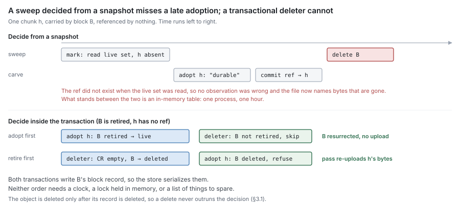

# RFC 9 — GC: sweep, relocation and remote deletion

**Status:** draft.
**Audience:** anyone changing sweep, relocation or collection, a metadata
backend's block and chunk records, or adding a way to keep content alive.

This document specifies behaviour, not the current code. [Appendix A](#Appendix%20A%20%E2%80%94%20where%20the%20current%20code%20differs) lists
where the code differs.

---

## 1. Purpose

GC answers one question:

> **Which remote objects may be deleted, and when is deleting one safe?**

It is the only component in the set that destroys the last copy of content
([RFC 0 §8.3](rfc-0-data-lifecycle.md#8.3%20Sweep)). Every other failure in the system can lose a local copy, serve a
stale answer or stop accepting writes. A GC defect deletes data that a file still
names, and nothing downstream can recover it.

GC performs four operations, all on the remote tier:

| Operation | What it destroys | Section |
| --- | --- | --- |
| **sweep** | a block nothing references | [§3](#3.%20Sweep) |
| **relocation** | nothing — it moves referenced chunks out of blocks | [§4](#4.%20Relocation) |
| **collection** | an object no record names | [§5](#5.%20Unrecorded%20objects) |
| **audit** | nothing — it recomputes counts and reports | [§6](#6.%20Audit) |

### 1.1 Non-goals

GC **MUST NOT**:

- recover local space. Eviction and reclamation are the journal's ([RFC 0 §8.1](rfc-0-data-lifecycle.md#8.1%20Evict),
  [RFC 0 §8.2](rfc-0-data-lifecycle.md#8.2%20Reclaim); [RFC 1](rfc-1-journal.md)). GC never reads, writes or unlinks a segment;
- decide what is referenced. Refcounts are block metadata's ([RFC 6 §6](rfc-6-block-metadata.md#6.%20Reference%20counting)), and an
  inode's release is the namespace's ([RFC 7 §4.3](rfc-7-namespace-metadata.md#4.3%20Release%20is%20what%20block%20metadata%20sees)). GC reads the count; it does not
  keep one of its own;
- keep content alive by any means other than the count ([§2.1](#2.1%20The%20count%20is%20the%20only%20authority));
- restate what a put, a read or a delete means. That is [RFC 4](rfc-4-remote-tier.md)'s ([RFC 4 §1.2](rfc-4-remote-tier.md#1.2%20A%20contract%2C%20not%20a%20component));
- name a block by any means other than [RFC 2 §4.2](rfc-2-carver.md#4.2%20A%20block), or frame, seal or parse an
  object ([RFC 4 §3](rfc-4-remote-tier.md#3.%20The%20block%20format));
- import another component in this set ([RFC 0 §1.2](rfc-0-data-lifecycle.md#1.2%20Component%20autonomy)).

### 1.2 Words this document uses, and two it does not

[RFC 0 §1.1](rfc-0-data-lifecycle.md#1.1%20The%20component%20set) assigns this component "mark/sweep". **Sweep** keeps its meaning:
deleting a remote block that nothing references ([RFC 0 §2.3](rfc-0-data-lifecycle.md#2.3%20Operations)). **Mark** survives
only as the audit of [§6](#6.%20Audit), which recomputes counts and decides nothing ([§2.4](#2.4%20Why%20not%20mark%20from%20a%20snapshot)).

**Relocation** is [RFC 6 §7.3](rfc-6-block-metadata.md#7.3%20Relocation)'s word for rewriting blocks' surviving chunks into
a new block. "Compaction" is not used, because in an LSM it names an operation
that discards content, and relocation discards none. **Collection** is [§5](#5.%20Unrecorded%20objects)'s
deletion of objects no record names.

## 2. What is safe to delete

### 2.1 The count is the only authority

A block **MAY** be deleted only when its `live` count is zero ([RFC 6 §2.3](rfc-6-block-metadata.md#2.3%20Block)), and
only by the conditional retirement of [§3.1](#3.1%20Retire%20the%20records%2C%20then%20delete%20the%20object). Nothing else permits a delete, and
nothing else prevents one.

In particular, an implementation **MUST NOT** consult, in deciding whether to
delete:

- a hold set, a pin list, or an extra root for a snapshot, an open file or any
  other holder. Every holder of content holds counted references ([RFC 6 §6.5](rfc-6-block-metadata.md#6.5%20Who%20owns%20a%20ref);
  [RFC 7 §4.4](rfc-7-namespace-metadata.md#4.4%20There%20is%20no%20third%20holder));
- elapsed time. A grace period **MUST NOT** substitute for conditional retirement
  or conditional adoption ([RFC 6 §7.2](rfc-6-block-metadata.md#7.2%20Adoption%20is%20conditional%20on%20existence));
- any state held in process memory, a lock or a lease. Two passes in two
  processes **MUST** be as safe as two in one.

A second liveness mechanism fails open. Every path that decides liveness has to
remember it, the one that forgets deletes held content, and the audit reports
nothing wrong because by the counts nothing was.

### 2.2 Zero is a candidate, not a verdict

`live` is read at one instant and the delete happens at another. Between them an
offload commit can adopt one of the block's chunks ([RFC 6 §7.2](rfc-6-block-metadata.md#7.2%20Adoption%20is%20conditional%20on%20existence)), a clone can copy a
ref to one, and a relocation can move one in or out. So a zero read outside a
transaction **MUST** be treated as a candidate only. The verdict is taken inside
the retirement transaction, which re-reads `live` and refuses if it is nonzero
([RFC 6 §7.1](rfc-6-block-metadata.md#7.1%20Conditional%20retirement)).

A sweep therefore has no beginning that matters: each retirement is its own
decision, taken on the state at its own commit, which is how [RFC 0 §8.3](rfc-0-data-lifecycle.md#8.3%20Sweep) holds.

### 2.3 The absence of a record proves nothing

A block with no record in this store is not thereby unreferenced ([RFC 6 §2.6](rfc-6-block-metadata.md#2.6%20The%20scope%20of%20a%20count)).
Another store, another process or another deployment writing into the same key
namespace can reference it. Sweep therefore acts only on blocks this store
records. Objects no store records are [§5](#5.%20Unrecorded%20objects)'s, and [§5](#5.%20Unrecorded%20objects) runs only where the namespace
is proven to belong to the stores it enumerated.

The namespace is fixed by the key scope of [RFC 2 §4.3](rfc-2-carver.md#4.3%20Key%20scope). A deployment **MUST**
satisfy one of the two options of [RFC 6 §2.6](rfc-6-block-metadata.md#2.6%20The%20scope%20of%20a%20count) before any GC operation runs. Where
the scope makes one object reachable from several shares, the stores of all those
shares are one counting domain, and GC **MUST** treat them as one.

### 2.4 Why not mark from a snapshot

The alternative to a count is a mark: walk every ref, collect the chunks they
name, and delete what the walk did not see. A mark reads a live set at one instant
and deletes at a later one, and a ref written between the two names a chunk the
live set does not contain. Closing that window needs a second mechanism that
records adoptions made after the mark began, which is exactly what [§2.1](#2.1%20The%20count%20is%20the%20only%20authority) forbids.



## 3. Sweep

### 3.1 Retire the records, then delete the object

Sweeping one block is two steps, in this order:

1. **Retire** ([RFC 6 §7.1](rfc-6-block-metadata.md#7.1%20Conditional%20retirement)): in one transaction, if `live` is zero, delete the
   block record and every chunk record whose `block` names it, and write the
   pending-deletion record of [§3.2](#3.2%20A%20retirement%20not%20yet%20deleted%20is%20durably%20recorded); otherwise refuse.
2. **Delete** the object through the remote store ([RFC 4 §4.5](rfc-4-remote-tier.md#4.5%20Delete%20is%20batched%20and%20idempotent)). Sweep
   **SHOULD** collect retired blocks and delete them in batches, since a request
   per block makes the request count the limit.

The order is not a preference. Retiring first means a crash between the two
leaves an object that no record names, which is a leak. Deleting first means a
crash, or a failed metadata write, leaves records that name an object that no
longer exists. Every read of those chunks then fails, and every adoption of them
succeeds, so new files acquire refs to content that is gone. That is **Lost**
for content that was durable.

**Deletes go directly to the remote store**, not through the syncer ([RFC 3 §5](rfc-3-syncer.md#5.%20What%20belongs%20elsewhere)).
A delete is not a transfer: it **MUST NOT** occupy the syncer's pool or wait on
its fairness, and a store the syncer reports unhealthy only makes deletes fail,
which [§3.6](#3.6%20Failures%20resolve%20on%20their%20own) handles. Relocation's reads and puts are transfers and do go
through the syncer ([§4.2](#4.2%20Read%20verified%2C%20name%20by%20content%2C%20put%2C%20then%20move)).

### 3.2 A retirement not yet deleted is durably recorded

The retirement transaction **MUST** write a pending-deletion record naming the
block; collection installs the same record ([§5.4](#5.4%20Age%20is%20not%20the%20guard)). The record is removed only
after the delete returns success for that block's name, in the transaction that
also advances the name's deletion generation ([§3.4](#3.4%20A%20retired%20key%20is%20not%20re-created%20underneath%20its%20delete)); in a batch, each name's
result is its own. A restart **MUST** resume every pending deletion it finds.

This is what removes enumeration from sweep's correctness. Without the record, a
crash between [§3.1](#3.1%20Retire%20the%20records%2C%20then%20delete%20the%20object)'s steps leaves an object that can only be found by listing the
store, and nothing's correctness may depend on a listing ([RFC 4 §4.6](rfc-4-remote-tier.md#4.6%20List%20is%20a%20complete%2C%20resumable%20walk)). With it,
the object is named by a record until the moment it is gone.

### 3.3 The race with adoption is closed by transactions, not by time

Adoption is an offload commit referencing a chunk it did not carry ([RFC 6 §7.2](rfc-6-block-metadata.md#7.2%20Adoption%20is%20conditional%20on%20existence)).
Retirement and adoption are the only two operations that can disagree about
whether a chunk is alive, and both touch the same two records:

| Order | Adoption | Retirement | Outcome |
| --- | --- | --- | --- |
| adopt, then retire | refcount 0→1, `live` 0→1 | reads `live` = 1, refuses | block survives with the new ref |
| retire, then adopt | finds no chunk record, fails | deletes block and chunk records | pass retries carrying the chunk's bytes |

The table is correct only if the store serializes the two. An implementation
**MUST** guarantee that, of two transactions writing the same record, at most one
commits on a pre-state the other changed. Serializable and snapshot isolation
both provide this for a record both transactions write. Under a weaker level —
a read-committed default, for one — the conditions **MUST** be part of the write
statements themselves:

- retirement's "`live` is zero" **MUST** be the predicate of the delete, not a
  prior read;
- adoption **MUST** detect a missing chunk record from the write it issues — the
  count of rows it updated — and not from a read made earlier in the transaction.

A retried adoption carries the chunk's bytes, which the journal still holds: the
extent was offered because it is **Dirty** ([RFC 0 §5.2](rfc-0-data-lifecycle.md#5.2%20Offload)), and nothing reports it
durable until a commit succeeds ([RFC 6 §4.3](rfc-6-block-metadata.md#4.3%20The%20commit%20is%20the%20report%27s%20return%20edge)). So losing this race costs one
upload and never a client-visible error.

### 3.4 A retired key is not re-created underneath its delete

A block's name is derived from its content and encoding ([RFC 2 §4.2](rfc-2-carver.md#4.2%20A%20block)), so an
offload or a relocation can derive the name of a block whose deletion is
pending. Unfenced, this sequence is reachable:

1. A writer puts name *K*, which GC has retired or is collecting.
2. GC, resuming the pending deletion of *K*, deletes *K*.
3. The writer commits a block record for *K*.

The records then name a deleted object. **A delete of name *K* MUST NOT run
concurrently with a put of *K* whose commit can succeed.** A check made only at
commit time cannot provide this: the put runs outside any transaction, and the
commit cannot tell whether the delete came before or after it. So the commit is
conditioned on state the writer read *before* its put.

Block metadata keeps a fixed array of **deletion generations**, indexed by a hash
of the block name ([RFC 6](rfc-6-block-metadata.md)). The **deletion fence** is three rules:

- **Before any put** — an offload's or a relocation's — the writer reads the
  name's state:
  - if a block record exists, it **MUST NOT** put; its commit adopts the existing
    block, which has the same bytes ([RFC 6 §4.1](rfc-6-block-metadata.md#4.1%20What%20one%20commit%20records), [RFC 5](rfc-5-transforms.md));
  - if a pending-deletion record exists, it **MUST NOT** put or commit now; the
    content stays where it is and the attempt is retried later;
  - otherwise it reads the name's deletion generation and puts.
- **A commit that creates a block record MUST fail** if the name's deletion
  generation differs from the one read before the put, or if a pending-deletion
  record for the name exists. A failed commit starts again from the pre-put read.
- **GC removes a pending-deletion record and increments the name's deletion
  generation in one transaction**, after the delete has returned success.

Every order is then safe. A writer that read before a retirement found the block
record and put nothing; its adoption races the retirement under [§3.3](#3.3%20The%20race%20with%20adoption%20is%20closed%20by%20transactions%2C%20not%20by%20time). A writer
that read while the deletion was pending put nothing. A writer that read after
GC's transaction put after the delete. A writer that read before a pending
deletion was installed, and put before the delete, fails its commit on the
record or, once the record is gone, on the generation, and puts again.

The fence holds only if its reads cannot miss a concurrent write. The commit's
reads of the generation and the pending-deletion record, and collection's read
that no block record exists ([§5.4](#5.4%20Age%20is%20not%20the%20guard)), **MUST** each conflict with a concurrent
write of the record read, whatever the store's isolation level: a read the store
tracks for conflicts, a lock on the key, or a predicate in the write statement, as
in [§3.3](#3.3%20The%20race%20with%20adoption%20is%20closed%20by%20transactions%2C%20not%20by%20time). A plain read under snapshot isolation is not a fence.

The array is bounded, so I7 holds. A commit is refused spuriously only when an
unrelated name in the same bucket was deleted during its put, and that costs one
put.

### 3.5 Finding candidates costs what is retirable

A sweep pass **SHOULD** cost O(blocks retired), not O(blocks recorded). An
implementation meets this with **candidate records**: every transaction that
**leaves** a block's `live` at zero writes a candidate record for the block in
the same transaction, sweep consumes candidates, and a retirement that refuses
([§3.3](#3.3%20The%20race%20with%20adoption%20is%20closed%20by%20transactions%2C%20not%20by%20time)) deletes the candidate. The list is a hint and never an authority:
retirement re-reads `live` whatever it says. `live` crosses zero far less often
than a refcount changes ([RFC 6 §5.3](rfc-6-block-metadata.md#5.3%20Hot%20records%20that%20are%20not%20per-file)), so the candidate write does not add a hot
record.

**A block can be born dead.** The commit that creates a block record can leave
its `live` at zero: every chunk it carries was committed first by another block
in flight and is adopted ([RFC 6 §4.1](rfc-6-block-metadata.md#4.1%20What%20one%20commit%20records), [RFC 8 §5.3](rfc-8-engine.md#5.3%20The%20dedup%20oracle%20never%20sees%20an%20uncommitted%20block)), or every ref it carried was
dropped because its file was released or truncated during the pass. That block
never moves from one to zero, so a rule written as "one to zero" never names it,
and nothing else ever will: it holds no chunk record, so no refcount change can
reach it. The creating commit is a transaction that leaves `live` at zero, and
it **MUST** write the candidate.

> [!important] Pending review — born-dead blocks
> Added after a field leak where the same hash packed into several blocks in
> flight left all but one block unreachable by sweep. The earlier wording ("moves
> from one to zero") had the same hole. Check the rule and the Group B check in
> [§11.2](#11.2%20Group%20B%20%E2%80%94%20leaks%20and%20stalls).

An implementation **MAY** instead scan the block records. The scan is correct and
proportional to the store, and on a large store it is the reason a pass does not
finish.

### 3.6 Failures resolve on their own

| Condition | Behaviour |
| --- | --- |
| Delete reports the object absent | Success. A delete is idempotent ([RFC 4 §4.5](rfc-4-remote-tier.md#4.5%20Delete%20is%20batched%20and%20idempotent)), and a sweep resuming after a crash will see this. |
| Delete refused or failed | The pending-deletion record stays, and the next pass retries it. |
| Remote tier unavailable | Retirements continue, pending deletions accumulate, and nothing is lost. A backlog that does not drain **MUST** be reported as a health condition, not only logged ([RFC 0 §10.2](rfc-0-data-lifecycle.md#10.2%20No%20state%20requires%20intervention%20to%20leave)). |
| Metadata unwritable | Nothing retires, so nothing is deleted. |
| Retirement conflicts | Retried under I8: bounded by the pass's deadline, not an attempt count, with randomised backoff ([RFC 0 §9.2](rfc-0-data-lifecycle.md#9.2%20Conflicts%20and%20their%20retries)). The retry re-reads `live`; it **MUST NOT** re-propose a decision taken on the pre-conflict state. |
| Crash anywhere | Every step is either inside a transaction or recorded by a pending-deletion record, so a restart resumes and does not re-decide. |

A failure in one block **MUST NOT** stop the pass for others. No failure in this
table requires an operator to clear it.

## 4. Relocation

### 4.1 A block that is mostly dead pins its dead bytes

A block is deleted only when every chunk it carries is unreferenced. A block with
one referenced chunk and forty dead ones keeps all forty-one on the remote tier
indefinitely. Relocation copies the referenced chunks into a new block so that
the old one reaches `live` = 0 and sweep can take it. It is also the only way a
chunk is re-encoded ([RFC 5 §5.2](rfc-5-transforms.md#5.2%20Relocation%20re-encodes)): there is no in-place re-encode.

Relocation destroys nothing. It **MUST NOT** delete an object, and **MUST NOT**
retire a record. It moves chunk records and counts ([RFC 6 §7.3](rfc-6-block-metadata.md#7.3%20Relocation)), and the old
blocks are swept by [§3](#3.%20Sweep) exactly like any other block that reached zero.

### 4.2 Read verified, name by content, put, then move

GC opens a syncer flow on the store for relocation ([RFC 3 §1.3](rfc-3-syncer.md#1.3%20Interface)). Its reads and
puts are transfers, so the pool's memory bound, retries and health refusal apply
to them ([RFC 3 §2.8](rfc-3-syncer.md#2.8%20An%20unhealthy%20store%20refuses%20work)), and they share the pool fairly with offload ([RFC 3 §2.9](rfc-3-syncer.md#2.9%20Workers%20are%20shared%20fairly%20across%20flows)).

Relocation takes one or more **source** blocks and writes one target; merging
several sources is how the survivors of many mostly dead blocks become one block
of the target size. Relocating sources *B₁…Bₙ*:

1. **Read** each chunk of the sources whose refcount is nonzero through the flow,
   which decodes each body and verifies each chunk ([RFC 4 §3.4](rfc-4-remote-tier.md#3.4%20Every%20read%20is%20verified%20by%20the%20codec)). GC **MUST NOT**
   parse the block or verify it itself.
2. **Assemble** the chunks into a block under [RFC 2 §5](rfc-2-carver.md#5.%20Packing%3A%20three%20rules%2C%20not%20a%20component): whole chunks only (P1), the
   target size (P2), and only the chunks whose bytes it carries (P3).
3. **Name** the block by [RFC 2 §4.2](rfc-2-carver.md#4.2%20A%20block) at an encoding generation one more than the
   highest source generation ([RFC 6 §2.3](rfc-6-block-metadata.md#2.3%20Block)). The name **MUST NOT** be generated,
   and relocation **MUST** refuse a name equal to any source's. The generation is
   deterministic, so a re-run over the same chunks derives the same name.
4. **Check, then put.** Run [§3.4](#3.4%20A%20retired%20key%20is%20not%20re-created%20underneath%20its%20delete)'s pre-put read on the name. A block record
   means the target already exists and the put is skipped; a pending deletion
   means the relocation stops and is retried later. Otherwise put the block
   through the flow, encoded under the store's current transform chain
   ([RFC 5 §5.2](rfc-5-transforms.md#5.2%20Relocation%20re-encodes)).
5. **Move**, after the put is reported durable or the target was found to exist,
   in one transaction that [§3.4](#3.4%20A%20retired%20key%20is%20not%20re-created%20underneath%20its%20delete)'s fence conditions ([RFC 6 §7.3](rfc-6-block-metadata.md#7.3%20Relocation)): point each
   moved chunk record that still names a source at the target, create the
   target's block record with its generation (idempotent per name,
   [RFC 6 §4.1](rfc-6-block-metadata.md#4.1%20What%20one%20commit%20records)), and move `live` from each source to the target by the number of
   its moved chunk records whose refcount is nonzero, counted inside the
   transaction.

| Crash after | State | Outcome |
| --- | --- | --- |
| 1–3 | nothing written | no effect |
| 4 | an object no record names | a re-run over the same chunks derives the same name and writes identical bytes, because encoding is deterministic ([RFC 5](rfc-5-transforms.md)); one over different chunks leaves the object to [§5](#5.%20Unrecorded%20objects) |
| 5 | chunks moved, every source's `live` at zero | the sources are ordinary sweep candidates |

A chunk whose refcount is zero is not moved. Its record stays pointing at its
source until the source retires. If it is adopted in between, the source's `live`
becomes nonzero again, the source survives, and the next relocation moves it.
That is a leak for one pass, not a loss.

### 4.3 A reader can hold the old location

A reader that resolved a chunk to *B* before step 5 can issue its read after *B*
is swept, and find the object absent. Refs name hashes ([RFC 6 §2.5](rfc-6-block-metadata.md#2.5%20Refs%20name%20hashes%2C%20never%20blocks)), so the
chunk is still reachable, at its new block, and can move again while a slow read
is in flight.

When the remote store reports a block absent, the read path **MUST** resolve the
chunk again and retry **while the resolved block name keeps changing**, bounded
by the read's deadline, and **MUST** report **Lost** only when the same block name
misses twice or no chunk record for the chunk exists ([RFC 8](rfc-8-engine.md)). A fixed retry
count turns two relocations in a row into a spurious error; retrying a name that
did not change turns a lost chunk into a hung read.

A ranged read that fails verification is **corrupt**: one name always holds the
same bytes ([RFC 5](rfc-5-transforms.md)).

Relocation is safe only while these rules hold.

### 4.4 When to relocate is policy

Relocation is **on by default**. A block is a candidate when its **dead-byte
ratio** — the bytes of its chunks whose refcount is zero, over its bytes —
exceeds a configured threshold. GC **MUST** expose the threshold as
configuration, and **MUST** select on bytes, not chunks, because chunk sizes vary
several-fold ([RFC 2 §3](rfc-2-carver.md#3.%20The%20boundary%20function)). A deployment **MAY** turn relocation off, stated in its
configuration; such a namespace keeps every block with one live chunk
indefinitely.

GC **MUST NOT** relocate a block whose chunks are all referenced, with one
exception: retiring material or a transform ([RFC 5 §5.3](rfc-5-transforms.md#5.3%20Retiring%20material%20or%20a%20transform%20needs%20a%20census)) relocates every block
whose bodies use it, fully live or not. The generation bump of [§4.2](#4.2%20Read%20verified%2C%20name%20by%20content%2C%20put%2C%20then%20move) step 3
gives such a block a new name even though its chunk list is unchanged.

The default threshold, and where dead bytes are counted, are open ([§12](#12.%20Open%20questions)).

### 4.5 What relocation races

| Concurrent operation | Why it is safe |
| --- | --- |
| Adoption of a moved chunk | Both transactions read and write that chunk's record, so they serialize. The adoption counts in whichever block the record names when it applies ([RFC 6 §7.3](rfc-6-block-metadata.md#7.3%20Relocation)). |
| Sweep of a source | Retirement reads the source's `live` inside its transaction. It is zero only once relocation has committed. |
| Snapshot or restore | Refs name hashes, so a snapshot's refs survive the move. A restore takes locations from the live store, never from its copy ([RFC 6 §7.4](rfc-6-block-metadata.md#7.4%20Restore)). |
| A second relocation of the same sources | Over the same chunks, both derive one name: the second's pre-put read finds the first's block record and skips its put, and if the two miss each other both write identical bytes. A chunk record the first already moved names another block, and the second leaves it alone; its target's `live` counts only what it moved. |

## 5. Unrecorded objects

### 5.1 How they arise

An object no record names comes from one of:

- a put whose commit never ran — a crash, or a pass abandoned after the put
  ([RFC 6 §4.2](rfc-6-block-metadata.md#4.2%20Only%20after%20durability));
- a re-offer after a restart that packs content differently from a pass whose
  put landed and whose commit did not ([RFC 8](rfc-8-engine.md));
- a relocation that put and did not commit ([§4.2](#4.2%20Read%20verified%2C%20name%20by%20content%2C%20put%2C%20then%20move));
- anything written into the namespace by a process this store does not know
  about.

A retirement does not produce one, because [§3.2](#3.2%20A%20retirement%20not%20yet%20deleted%20is%20durably%20recorded) records it until the delete
completes.

### 5.2 Collection is housekeeping

An unrecorded object is a leak of storage, not a threat to content: no record
names it, so no read reaches it. Collecting it is worth running but not required
for correctness ([RFC 4 §4.6](rfc-4-remote-tier.md#4.6%20List%20is%20a%20complete%2C%20resumable%20walk)). An implementation **MUST NOT** depend on
collection for correctness, and a deployment that never runs it **MUST** only
leak.

### 5.3 It runs only where the namespace is proven

Collection deletes an object because no record names it, which is exactly the
inference [§2.3](#2.3%20The%20absence%20of%20a%20record%20proves%20nothing) forbids unless every store that could name it has been read. GC
**MUST NOT** delete an unrecorded object unless:

- the deployment meets [RFC 6 §2.6](rfc-6-block-metadata.md#2.6%20The%20scope%20of%20a%20count) — one store per namespace, or key derivation
  that includes the store's identity — and GC can verify which it is from
  configuration, not assume it;
- every store in the counting domain ([§2.3](#2.3%20The%20absence%20of%20a%20record%20proves%20nothing)) was enumerated completely in this
  pass. A store that failed or was skipped **MUST** stop collection for the whole
  namespace.

### 5.4 Age is not the guard

An unrecorded object may be the put half of a commit still in flight. Collection
**MUST** delete only through [§3.4](#3.4%20A%20retired%20key%20is%20not%20re-created%20underneath%20its%20delete)'s fence, as sweep does:

1. install a pending-deletion record for the name, in a transaction conditional
   on no block record for the name existing;
2. delete the object;
3. remove the record and advance the name's deletion generation in one
   transaction.

A commit that landed before step 1 makes step 1 refuse. One still in flight
fails on the record or the generation and puts again.

An implementation **MAY** additionally skip objects younger than some age, to
avoid churning on puts that are about to commit. That is an efficiency filter. It
**MUST NOT** be the only thing between an in-flight commit and a delete, because
nothing bounds how long a commit can take: a pass can stall behind a saturated
pool or a metadata store that is refusing writes ([RFC 0 §10](rfc-0-data-lifecycle.md#10.%20Failure%20model)).

## 6. Audit

Counts are sweep's only authority ([§2.1](#2.1%20The%20count%20is%20the%20only%20authority)), so they are checked by
[RFC 6 §7.5](rfc-6-block-metadata.md#7.5%20Audit)'s audit, which GC runs. What GC adds is how it acts on the result:
a block whose `live`, or any of whose chunks' refcounts, the audit found low
**MUST NOT** be retired until the count is repaired. Suspending the named block
costs one leaked block per mismatch; retiring on a low count costs the content.

The audit decides nothing else, and its scratch state obeys [§7.2](#7.2%20Every%20record%20GC%20stores%20names%20its%20reclamation).

## 7. Bounds, records and scheduling

### 7.1 GC bounds its own work

GC **MUST** bound, per process, the deletes it has in flight and the memory it
holds for them, and **MUST** state the bound where it is configured. Relocation's
transfers are bounded by the syncer instead: they run on GC's flow ([§4.2](#4.2%20Read%20verified%2C%20name%20by%20content%2C%20put%2C%20then%20move)), so
the pool's memory bound applies, and fairness, counted in encoded bytes, keeps a
relocation from starving the offloads that make content evictable.

The memory a pass holds **MUST NOT** grow with the size of the store. A pass that
needs a set of every referenced hash, in memory or on disk, has become a mark
([§2.4](#2.4%20Why%20not%20mark%20from%20a%20snapshot)).

### 7.2 Every record GC stores names its reclamation

I7 applies to GC's records as to any other ([RFC 0 §9.1](rfc-0-data-lifecycle.md#9.1%20Records%20and%20their%20reclamation)).

| Record | Maximum size | Reclaimed by |
| --- | --- | --- |
| pending deletion ([§3.2](#3.2%20A%20retirement%20not%20yet%20deleted%20is%20durably%20recorded)) | one per retired or collected, undeleted block | the transaction after that block's successful delete |
| candidate ([§3.5](#3.5%20Finding%20candidates%20costs%20what%20is%20retirable)) | one per block at `live` = 0 | the retirement, or the refusal, that consumes it |
| deletion generation ([§3.4](#3.4%20A%20retired%20key%20is%20not%20re-created%20underneath%20its%20delete)) | a fixed array of counters | not reclaimed; bounded by construction |
| GC lease ([§7.3](#7.3%20GC%20is%20one%20service%20per%20namespace)) | one per namespace | overwritten by each holder |
| per-pass summary | one per namespace, overwritten | the next pass |
| audit scratch ([§6](#6.%20Audit)) | proportional to the audit's consistent read | the end of the audit, on success or failure |

A record not in this table **MUST NOT** be added without a row. Where a pass
leaves scratch state on disk, what removes it after a crash is part of the row,
and "the next pass" is an answer only if a pass is guaranteed to run.

### 7.3 GC is one service per namespace

GC is a service of the remote namespace ([§2.3](#2.3%20The%20absence%20of%20a%20record%20proves%20nothing)), not a policy of any share's
engine: one namespace can hold the blocks of many shares, and a pass covers all
of them. One instance runs per namespace, the holder of the namespace's **GC
lease** in the configuration store ([RFC 10 §2.2](rfc-10-journal-replication.md#2.2%20Roles)); on one node the lease is
local. Cadence, triggers and the relocation threshold are GC's own configuration.
GC **SHOULD** run a pass periodically, and sooner when candidates ([§3.5](#3.5%20Finding%20candidates%20costs%20what%20is%20retirable)) exceed a
configured count.

The lease is for efficiency, not safety. A holder can pause past its lease while
a successor runs, so GC **MUST** be correct with two passes over one namespace at
once, from one process or two ([§2.1](#2.1%20The%20count%20is%20the%20only%20authority)). Removing the lease **MUST NOT** make a
pass unsafe.

A pass **MUST NOT** require quiescence. Writes, offloads, clones, snapshots and
reads continue during it, and [§3.3](#3.3%20The%20race%20with%20adoption%20is%20closed%20by%20transactions%2C%20not%20by%20time), [§3.4](#3.4%20A%20retired%20key%20is%20not%20re-created%20underneath%20its%20delete) and [§4.5](#4.5%20What%20relocation%20races) are what make that safe.

## 8. API surface

Signatures are indicative; the obligations above are normative. GC declares an
interface for each dependency, named for the need ([RFC 0 §1.2](rfc-0-data-lifecycle.md#1.2%20Component%20autonomy)).

```go
// Blocks is what GC needs from block metadata (RFC 6 §7).
type Blocks interface {
	// Candidates yields blocks whose live count may be zero. A hint, never an authority.
	Candidates(ctx context.Context) iter.Seq2[BlockName, error]
	// Retire, in one transaction and only if live is zero, deletes the block record
	// and the chunk records naming it and writes a pending deletion. ErrLive otherwise.
	Retire(ctx context.Context, b BlockName) error
	// Unrecorded installs a pending deletion for name only if no block record names it.
	Unrecorded(ctx context.Context, name BlockName) error
	// PendingDeletions yields every retired or collected block not yet deleted.
	PendingDeletions(ctx context.Context) iter.Seq2[BlockName, error]
	// Deleted, in one transaction, removes the pending-deletion records of names
	// whose delete succeeded and advances each name's deletion generation (§3.4).
	Deleted(ctx context.Context, names []BlockName) error
	// Fence reads a name's state before a put (§3.4).
	Fence(ctx context.Context, name BlockName) (Fence, error)
	// LiveChunks yields b's chunks whose refcount is nonzero, and b's generation.
	LiveChunks(ctx context.Context, b BlockName) (gen uint64, chunks iter.Seq2[ChunkLoc, error])
	// Relocate moves chunk records from srcs to dst and moves live, in one
	// transaction that fails if f no longer holds (§4.2).
	Relocate(ctx context.Context, srcs []BlockName, dst NewBlock, f Fence) error
	// Audit recomputes counts from one consistent read and yields every mismatch.
	Audit(ctx context.Context) iter.Seq2[Mismatch, error]
}

// Fence is a name's state before a put (§3.4).
type Fence struct {
	Recorded bool   // a block record exists: adopt it, do not put
	Pending  bool   // a pending deletion exists: neither put nor commit now
	Gen      uint64 // the deletion generation the commit is conditioned on
}

// Remote is the part of the remote store GC calls directly (RFC 4 §4.1).
type Remote interface {
	Delete(ctx context.Context, names []BlockName) []error // one result per name
	List(ctx context.Context, after BlockName) iter.Seq2[Info, error] // collection only
}

// Transfers is the syncer flow GC opens for relocation (RFC 3 §1.3).
type Transfers interface {
	Fetch(ctx context.Context, name BlockName, want []ChunkRange) iter.Seq2[Chunk, error]
	Upload(ctx context.Context, name BlockName, src func() iter.Seq2[Chunk, error]) ([]Range, error)
}

// Lease is the namespace's GC lease in the configuration store (§7.3).
type Lease interface {
	Hold(ctx context.Context, ns NamespaceID, d time.Duration) (bool, error)
}

// Config is GC's own configuration (§7.3).
type Config struct {
	DeleteBatch       int           // names per delete call
	DeletesInFlight   int           // concurrent delete calls per process
	Interval          time.Duration // between passes
	CandidateTrigger  int           // candidates that start a pass early
	RelocateDeadRatio float64       // dead-byte ratio that makes a block a candidate; 0 turns relocation off (§4.4)
	LeaseDuration     time.Duration
}

func New(b Blocks, r Remote, t Transfers, l Lease, cfg Config) (*GC, error)

func (g *GC) Sweep(ctx context.Context) (SweepReport, error)
// Relocate merges each group of sources into one target (§4.2).
func (g *GC) Relocate(ctx context.Context, groups iter.Seq[[]BlockName], reason Reason) (RelocateReport, error)
func (g *GC) Collect(ctx context.Context, domain []StoreID) (CollectReport, error)
func (g *GC) Audit(ctx context.Context) (AuditReport, error)
```

## 9. Invariants

| # | Invariant |
| --- | --- |
| G1 | A remote object is deleted only after a transaction that re-read its block's `live` as zero has retired its records, or, for an unrecorded object, after a transaction that found no record has installed its pending deletion. |
| G2 | Nothing but the count keeps content alive or permits a delete: no hold list, no grace period, no state in process memory, no lease. |
| G3 | A name is never deleted concurrently with a put of that name whose commit can succeed: every put follows the pre-put read, and every commit that creates a block record is fenced by the name's pending-deletion record and deletion generation. |
| G4 | Every retirement or collection not yet followed by a successful delete is durably recorded, and a restart resumes it. |
| G5 | Relocation deletes nothing. It moves chunk records and counts, and sweep deletes. |
| G6 | A block GC writes is named from its content, its chain and an encoding generation one more than its highest source's; never generated, and never with a source's name. |
| G7 | Collection deletes only through the fence, only in a namespace whose every store was enumerated completely, and correctness never depends on it. |
| G8 | A conflict is retried under I8, and a failed delete never loses its pending record. |
| G9 | Every record GC stores has a named reclamation path at its maximum size. |

## 10. Observability

Every metric is labelled by namespace. Per-block outcomes are metrics, not log
lines.

| Answers | Metric | Type |
| --- | --- | --- |
| retirements, labelled `result` = `retired` or `refused` | `dittofs_gc_retirements_total` | counter |
| retired blocks not yet deleted; with the next row, whether the backlog drains | `dittofs_gc_pending_deletions` | gauge |
| age of the oldest pending deletion | `dittofs_gc_pending_deletion_oldest_seconds` | gauge |
| delete results per name, labelled `result` = `ok` or the error of [RFC 4 §4.8](rfc-4-remote-tier.md#4.8%20Errors%20are%20a%20closed%20set) | `dittofs_gc_deletes_total` | counter |
| sweep lag: time from `live` reaching zero to the object deleted | `dittofs_gc_sweep_lag_seconds` | histogram |
| relocations, labelled `reason` = `dead_bytes` or `retirement` and `result` = `moved`, `adopted`, `deferred` (pending deletion) or `fenced` | `dittofs_gc_relocations_total` | counter |
| encoded bytes relocated | `dittofs_gc_relocated_bytes_total` | counter |
| space amplification: remote bytes over referenced bytes | `dittofs_gc_space_amplification_ratio` | gauge |
| audit mismatches, labelled `record` = `chunk` or `block` and `direction` = `high` or `low`. Any `low` is an alert | `dittofs_gc_audit_mismatches_total` | counter |
| collection outcomes, labelled `result` = `deleted`, `skipped_young` or `refused` | `dittofs_gc_collection_total` | counter |
| retirement and relocation conflicts retried | `dittofs_gc_conflicts_total` | counter |
| whether this process holds the namespace's GC lease | `dittofs_gc_lease_held` | gauge |
| pass duration, labelled `op` = `sweep`, `relocate`, `collect` or `audit` | `dittofs_gc_pass_seconds` | histogram |

Logs: a low count logs the block at `Error`. A pending-deletion backlog that
stops draining raises a health condition and logs once at `Warn` on entry and on
exit. A collection refused because a store was not enumerated logs that store at
`Warn`. Taking or losing the GC lease logs at `Info`.

## 11. Test plan and benchmarks

The set's test rules apply ([Test tiers](rfc-index.md#Test%20tiers)). Every check
runs against every metadata backend, and every Group A check runs against a
remote backend that can fail a delete after performing it ([RFC 4 §7.1](rfc-4-remote-tier.md#7.1%20Conformance%20suite)).

### 11.1 Group A — deleting referenced content

| Requirement | Check |
| --- | --- |
| [§3.3](#3.3%20The%20race%20with%20adoption%20is%20closed%20by%20transactions%2C%20not%20by%20time) adoption race | Interleave `Retire` and an adopting commit at every step boundary, in both orders. Assert that either the block survives with the new ref, or the commit fails and the retry uploads. Assert that no ref ever names a chunk whose object is gone. |
| [§3.3](#3.3%20The%20race%20with%20adoption%20is%20closed%20by%20transactions%2C%20not%20by%20time) isolation | Run the interleaving on each backend at its configured isolation level, with the conditions forced into separate statements. Assert the check fails, so the rig can see the defect it guards. |
| [§3.1](#3.1%20Retire%20the%20records%2C%20then%20delete%20the%20object) order | Fail the metadata write after the delete, then adopt the chunk. Assert the adoption fails. A rig that only crashes between steps misses the failure that needs no crash. |
| [§3.4](#3.4%20A%20retired%20key%20is%20not%20re-created%20underneath%20its%20delete) fence | For each writer (an offload, a relocation) and each deleter (a resumed sweep deletion, a collection), run the pre-put read, the put, the delete, GC's generation transaction and the commit in every order. Assert no block record ever names a deleted object, and that a writer whose put preceded the delete fails its commit and puts again. |
| [§3.4](#3.4%20A%20retired%20key%20is%20not%20re-created%20underneath%20its%20delete) isolation | Make the commit's fence reads plain snapshot reads. Assert the fence check fails, so the rig can see the write skew it guards. |
| [§2.1](#2.1%20The%20count%20is%20the%20only%20authority) no hold | Snapshot a file, delete the file, sweep with no hold provider configured. Assert every block the snapshot names survives. Repeat with the sweep running between the snapshot's metadata capture and its completion. |
| [§2.1](#2.1%20The%20count%20is%20the%20only%20authority) no process state | Run two sweeps against one store from two processes that both believe they hold the GC lease, with an adopting offload in a third. Assert no referenced block is deleted. |
| [§4.2](#4.2%20Read%20verified%2C%20name%20by%20content%2C%20put%2C%20then%20move) name | Relocate a fully live block for a retirement; assert the target name differs and records generation + 1. Merge sources of generations 0, 2 and 1; assert generation 3. Force a target name equal to a source's; assert relocation refuses it. |
| [§4.2](#4.2%20Read%20verified%2C%20name%20by%20content%2C%20put%2C%20then%20move) pre-put | Relocate the same sources twice; assert the second skips its put. Install a pending deletion for the target name; assert relocation neither puts nor moves. |
| [§4.2](#4.2%20Read%20verified%2C%20name%20by%20content%2C%20put%2C%20then%20move) counts | Drop a moved chunk's refcount to zero between steps 1 and 5. Assert every block's `live` counts only nonzero refcounts. |
| [§4.3](#4.3%20A%20reader%20can%20hold%20the%20old%20location) re-resolution | Relocate a chunk twice while a read holds its first location; assert the read returns the right bytes. Make one name miss twice; assert **Lost**. Delete the chunk record; assert **Lost**. |
| [§4.5](#4.5%20What%20relocation%20races) relocation race | Relocate a block while adopting one of its chunks and reading another. Assert every read returns the right bytes. Run two relocations of one block at once; assert the same. |
| [§5.3](#5.3%20It%20runs%20only%20where%20the%20namespace%20is%20proven) namespace | Point two stores at one bucket and prefix, run collection from one. Assert it refuses. |
| [§5.4](#5.4%20Age%20is%20not%20the%20guard) in-flight commit | Put a block, stall its commit past any age filter, run collection. Assert the object survives, or the commit fails and puts again. |

### 11.2 Group B — leaks and stalls

| Requirement | Check |
| --- | --- |
| [§3.2](#3.2%20A%20retirement%20not%20yet%20deleted%20is%20durably%20recorded) resume | Crash after retirement and before the delete, restart, disable listing. Assert the object is deleted. |
| [§3.5](#3.5%20Finding%20candidates%20costs%20what%20is%20retirable) cost | Grow the store with no garbage, sweep. Assert records read per pass do not grow with the store. |
| [§3.5](#3.5%20Finding%20candidates%20costs%20what%20is%20retirable) born dead | Through the real carver, not hand-built records: write content that repeats one chunk, so that two blocks in flight carry it and one adopts; separately, release a file while its pass is in flight. Delete everything and sweep with candidates only. Assert every block is deleted and remote bytes return to zero. |
| [§3.6](#3.6%20Failures%20resolve%20on%20their%20own) no intervention | Fail every delete until the backlog is reported, then restore the remote. Assert the backlog drains and the health condition clears with no operator action. |
| [§3.6](#3.6%20Failures%20resolve%20on%20their%20own) I8 | Drive retirements and adoptions at one shared chunk. Assert conflicts occur and that none reaches a caller as an error. |
| [§3.1](#3.1%20Retire%20the%20records%2C%20then%20delete%20the%20object) deletes direct | Saturate the syncer's pool with offloads. Assert deletes still complete. Mark the store unhealthy: assert relocation transfers are refused by the flow, and failed deletes stay pending. |
| [§4.4](#4.4%20When%20to%20relocate%20is%20policy) default | With default configuration, churn files until blocks cross the threshold. Assert they are relocated and swept with no configuration change. |
| [§7.1](#7.1%20GC%20bounds%20its%20own%20work) bound | Stall the remote at full GC concurrency. Assert in-flight deletes and memory stay within the stated bound, and offload keeps its fair share during relocation. |
| [§7.2](#7.2%20Every%20record%20GC%20stores%20names%20its%20reclamation) I7 | Run many passes with retirements, relocations and failed deletes. Assert each record kind stays within its table row. |
| [§7.3](#7.3%20GC%20is%20one%20service%20per%20namespace) lease | Stop the lease holder mid-pass. Assert another instance takes the lease and drains the pending deletions. |

### 11.3 What must not stand in

- **A single-process rig MUST NOT stand in for [§2.1](#2.1%20The%20count%20is%20the%20only%20authority).** A guard held in memory
  passes every check run in the process that holds it.
- **Hand-built block and chunk records MUST NOT be the only input to a sweep
  check.** Synthetic records encode the author's model of what the carver
  produces; a leak that exists only for repeated or all-zero content, or only
  when two blocks race, passes every such check. At least one check per group
  carves real content, including repeated and all-zero data.
- **A crash-only rig MUST NOT stand in for [§3.1](#3.1%20Retire%20the%20records%2C%20then%20delete%20the%20object).** The ordering defect needs a
  write that fails and a process that keeps running.
- **A correctness check on surviving data MUST NOT stand in for [§3.3](#3.3%20The%20race%20with%20adoption%20is%20closed%20by%20transactions%2C%20not%20by%20time) or
  [§3.4](#3.4%20A%20retired%20key%20is%20not%20re-created%20underneath%20its%20delete).** A run in which the race never interleaves passes with no guard at
  all. Assert that the interleaving happened.

### 11.4 Benchmarks and targets

Run on the reference box ([Test tiers](rfc-index.md#Test%20tiers)), against a
local emulator of the remote service and the reference metadata backend.

| Benchmark | Measures | Target |
| --- | --- | --- |
| Sweep throughput | blocks retired and deleted per second, batches of 1,000 names | ≥ 1,000/s |
| Sweep cost against store size | records read per pass, fixed garbage, 10⁵ to 10⁷ recorded blocks | flat within 10% (with [§3.5](#3.5%20Finding%20candidates%20costs%20what%20is%20retirable)'s candidates) |
| Sweep lag | p99 of `dittofs_gc_sweep_lag_seconds`, remote healthy | ≤ one pass interval + 60 s |
| Backlog drain | time to empty 10⁶ pending deletions after the remote returns | ≤ 10⁶ / sweep throughput, with no operator action |
| Pass memory | peak memory, 10⁵ to 10⁷ recorded blocks | flat within 10% |
| Fence refusals | spurious commit refusals per 10⁶ commits under sustained sweep | report, per bucket count ([§12](#12.%20Open%20questions) item 2) |
| Relocation throughput | encoded MB/s through the flow | report, against the previous run |
| Offload during relocation | offload MB/s with relocation running, against offload alone | within 10% of its fair share |
| Space amplification | remote bytes over referenced bytes under a churn workload, per threshold | report; feeds [§12](#12.%20Open%20questions) item 1 |
| Audit | seconds per 10⁶ refs | report |

## 12. Open questions

1. **Relocation's default threshold, and where dead bytes are counted** ([§4.4](#4.4%20When%20to%20relocate%20is%20policy)).
   A byte count on the block record, or a read of its chunk records. What settles
   it is the space amplification of a churning workload under each threshold,
   against the transfer cost each spends.
2. **The deletion-generation bucket count** ([§3.4](#3.4%20A%20retired%20key%20is%20not%20re-created%20underneath%20its%20delete)). It trades spurious commit
   refusals against the array's size, and is unmeasured.
3. **Whether a low count should halt sweep** ([§6](#6.%20Audit)). Suspending only the named
   block is the rule. Whether one low count is evidence enough to distrust the
   rest of the store wants a decision once the audit has run on a real store.
4. **The counting domain under one key scope** ([§2.3](#2.3%20The%20absence%20of%20a%20record%20proves%20nothing)). With one scope for several
   shares, the stores of those shares are one counting domain, which [RFC 6 §2.6](rfc-6-block-metadata.md#2.6%20The%20scope%20of%20a%20count)
   forbids unless they are one store. Which of its two options a deployment takes
   is [RFC 2 §4.3](rfc-2-carver.md#4.3%20Key%20scope)'s to settle, and GC's scope follows from it.

---

## Appendix A — where the current code differs

Descriptive, for the refactor. D1–D4 can delete content a file names; the
migration is not scheduled here, and a difference **MUST NOT** be closed by
amending the requirement.

| # | This document says | The code today |
| --- | --- | --- |
| D1 | Retire, then delete ([§3.1](#3.1%20Retire%20the%20records%2C%20then%20delete%20the%20object)) | deletes the object first, then the block record and the durable marker in separate steps; one transient metadata error leaves records naming a deleted object, which later adoptions reference. Data loss |
| D2 | No state in memory, no time ([§2.1](#2.1%20The%20count%20is%20the%20only%20authority), [§3.3](#3.3%20The%20race%20with%20adoption%20is%20closed%20by%20transactions%2C%20not%20by%20time)) | adoptions after the mark are protected by a process-wide in-memory table, for one hour only |
| D3 | Holders are counted ([§2.1](#2.1%20The%20count%20is%20the%20only%20authority)) | a snapshot is held only once its manifest exists, written after the backup it summarises; a sweep in between can delete its content |
| D4 | Proven namespace ([§5.3](#5.3%20It%20runs%20only%20where%20the%20namespace%20is%20proven)) | orphan reclaim deletes any object no record under one remote configuration names, once older than a grace window; a second server on the same bucket and prefix loses its objects |
| D5 | The count is the authority ([§2.1](#2.1%20The%20count%20is%20the%20only%20authority)) | sweep is decided by a mark over every ref; snapshots and open-unlinked files are extra roots |
| D6 | Conditional retirement ([§3.1](#3.1%20Retire%20the%20records%2C%20then%20delete%20the%20object)) | the count is read, decided on and decremented in separate steps under a process-local lock |
| D7 | Underflow fails ([RFC 6 §6.3](rfc-6-block-metadata.md#6.3%20Underflow%20is%20corruption%2C%20not%20a%20boundary)) | the `live` decrement clamps at zero, and the last-chunk path relies on it |
| D8 | Pending deletion recorded ([§3.2](#3.2%20A%20retirement%20not%20yet%20deleted%20is%20durably%20recorded)) | none; an object left by a crash is found only by listing |
| D9 | Age is not the guard ([§5.4](#5.4%20Age%20is%20not%20the%20guard)) | orphan reclaim is guarded only by age |
| D10 | Relocation deletes nothing ([§4.1](#4.1%20A%20block%20that%20is%20mostly%20dead%20pins%20its%20dead%20bytes)) | relocation deletes the old object and its record itself |
| D11 | Name by content and generation ([§4.2](#4.2%20Read%20verified%2C%20name%20by%20content%2C%20put%2C%20then%20move)) | relocation generates a random name |
| D12 | Transfers through a flow, verified by the codec ([§4.2](#4.2%20Read%20verified%2C%20name%20by%20content%2C%20put%2C%20then%20move)) | relocation fetches whole objects directly, verifies them and parses the format itself |
| D13 | No lock or lease is a safety input ([§7.3](#7.3%20GC%20is%20one%20service%20per%20namespace)) | the run lock and the per-remote lock are process-local; multi-server operation is unsafe |
| D14 | Declared, not asserted ([§8](#8.%20API%20surface)) | GC imports the metadata layer, takes the remote store's full interface, and finds its dependencies by type assertion |
| D15 | I8 ([§3.6](#3.6%20Failures%20resolve%20on%20their%20own)) | the `live` retry is bounded by an attempt count, with jitter derived from the attempt number |
| D16 | Every block with `live` zero is found ([§3.5](#3.5%20Finding%20candidates%20costs%20what%20is%20retirable)) | the carver can pack one hash into several blocks in flight; the chunk locator is written last-wins and sweep decrements only the block it names, so the other blocks keep a nonzero count with no locator. Only an operator-run reconcile finds them. Leak |
| D17 | Reclamation is reported ([§10](#10.%20Observability)) | a hash held by the in-memory adoption guard is skipped silently; a pass reports nothing swept and no reason, and a dry run counts the hash as freeable |
| D16 | Audit recomputes counts ([§6](#6.%20Audit)) | the audit checks only that every ref has a chunk record |
