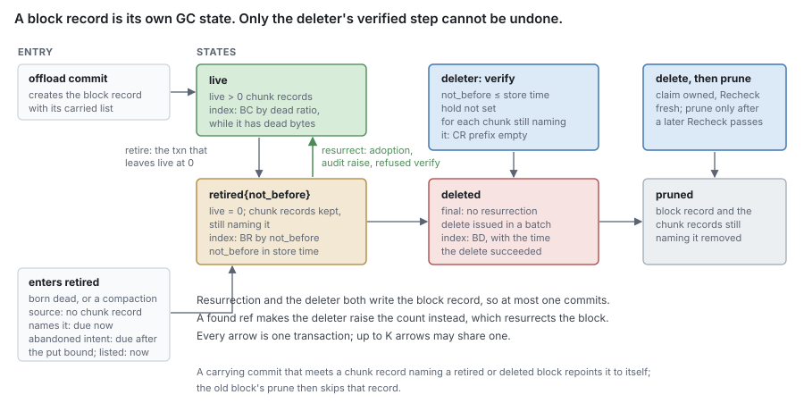
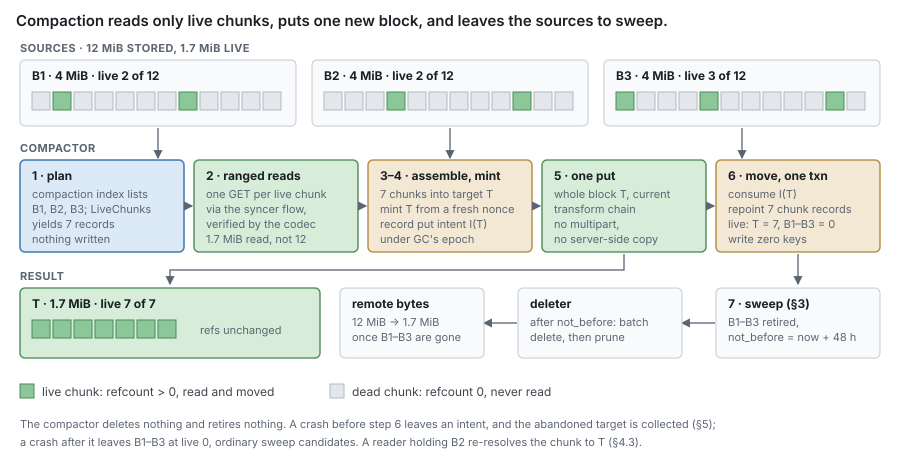

# RFC 9 — GC: retirement, trash, compaction and remote deletion

**Status:** draft.
**Audience:** anyone changing the deleter, the compactor, the audit or collection,
a metadata backend's block, chunk and reverse-ref records, or adding a way to
keep content alive.

This document specifies behaviour, not the current code. [Appendix A](#Appendix%20A%20%E2%80%94%20where%20the%20current%20code%20differs) lists
where the code differs.

---

## 1. Purpose

GC answers one question about the remote tier:

> **Which remote objects may be deleted, and when is deleting one safe?**

It is the only component in the set that destroys the last copy of content
([RFC 0 §8.3](rfc-0-data-lifecycle.md#8.3%20Sweep)). Every other failure in the system can lose a local copy, serve a
stale answer or stop accepting writes. A GC defect deletes data that a file still
names, and nothing downstream can recover it once the object is gone.

GC is one of three reclaimers. Each owns one kind of space, and none reclaims
another's:

| Space | Reclaimed by | When | Destroys |
| --- | --- | --- | --- |
| **Local journal space** | the journal's release and repack ([RFC 1 §8.1](rfc-1-journal.md#8.1%20Releasing%20storage), [§8.2](rfc-1-journal.md#8.2%20Repack)) | when the engine's `EvictionPolicy` and `CapacityGovernor` decide ([RFC 8 §10](rfc-8-engine.md#10.%20Local%20space)) | only local copies of content already durable remotely ([RFC 8 §10.4](rfc-8-engine.md#10.4%20Nothing%20but%20durability%20makes%20an%20extent%20unevictable)) |
| **Metadata records** | removals, releases and snapshot deletion ([RFC 6 §6](rfc-6-block-metadata.md#6.%20Reference%20counting)) | when a file is truncated or released or a snapshot deleted, in batches of at most K refs; the batch that leaves a block unreferenced also retires it ([§3.1](#3.1%20Retire%20the%20records%2C%20then%20delete%20the%20object)) | refs and counts; never an object |
| **Remote objects** | this RFC | once a block is retired, its trash delay has passed, and a check of the reverse ref index finds no ref to any chunk it still holds | the object |

GC runs four operations, all on the remote tier. None of them decides that a
block is dead: block metadata does that, in the transaction that drops its last
reference.

| Operation | What it destroys | Section |
| --- | --- | --- |
| **deleter** | a `retired` block past its `not_before`, after verifying that no ref names a chunk it holds | [§3](#3.%20A%20block%27s%20life) |
| **compactor** | nothing — it rewrites the live chunks of mostly dead or small blocks into new blocks; the move retires the sources | [§4](#4.%20Compactor) |
| **collection** | an object no record names, or one whose put intent was abandoned | [§5](#5.%20Unrecorded%20objects) |
| **audit** | nothing — it compares counts with the reverse ref index, raises what is low, and reports | [§6](#6.%20Audit) |

**From a dead block to a deleted object.** Nothing deletes a block record
directly, and no pass looks for dead blocks:

1. A file is released, truncated or superseded, or a snapshot is deleted
   ([RFC 7 §4.3](rfc-7-namespace-metadata.md#4.3%20Release%20is%20what%20block%20metadata%20sees)). Block metadata drops the refs in batches of at most K
   ([RFC 6 §6.2](rfc-6-block-metadata.md#6.2%20Truncation%20and%20deallocation)), deleting each ref's reverse index key with it.
2. Each dropped ref decrements its chunk's refcount in the same transaction. A
   refcount that reaches zero decrements the `live` of the block its chunk record
   names.
3. The transaction that leaves a block's `live` at zero **retires** it: the block
   record moves to `retired` with `not_before` = store time + the trash
   retention, and its retired index key is written ([§3.1](#3.1%20Retire%20the%20records%2C%20then%20delete%20the%20object)). Its chunk records
   stay, still naming it.
4. Until `not_before`, an adoption of one of its chunks **resurrects** it to
   `live` at the cost of one record write, not an upload ([§3.3](#3.3%20Adoption%20resurrects%20a%20retired%20block)).
5. After `not_before`, the **deleter** verifies that no ref names any chunk still
   recorded in the block ([§3.5](#3.5%20The%20deleter%20verifies%20before%20it%20deletes)), moves it to `deleted`, deletes the object in a
   batch, and prunes the block record and its chunk records once a later check
   of the service's settings has passed.



### 1.1 Non-goals

GC **MUST NOT**:

- recover local space. Eviction and reclamation are the journal's ([RFC 0 §8.1](rfc-0-data-lifecycle.md#8.1%20Evict),
  [RFC 0 §8.2](rfc-0-data-lifecycle.md#8.2%20Reclaim); [RFC 1](rfc-1-journal.md)). GC never reads, writes or unlinks a segment;
- decide what is referenced. Refs, counts and the reverse ref index are block
  metadata's ([RFC 6 §6](rfc-6-block-metadata.md#6.%20Reference%20counting)), and a file's release is the namespace's
  ([RFC 7 §4.3](rfc-7-namespace-metadata.md#4.3%20Release%20is%20what%20block%20metadata%20sees)). GC reads them; it keeps no liveness state of its own;
- keep content alive by any means other than its refs ([§2.1](#2.1%20References%20are%20the%20only%20authority));
- restate what a put, a read or a delete means. That is [RFC 4](rfc-4-remote-tier.md)'s ([RFC 4 §1.2](rfc-4-remote-tier.md#1.2%20A%20contract%2C%20not%20a%20component));
- name a block by any means other than [RFC 2 §4.2](rfc-2-carver.md#4.2%20A%20block), or frame, seal or parse an
  object ([RFC 4 §3](rfc-4-remote-tier.md#3.%20The%20block%20format));
- import another component in this set ([RFC 0 §1.2](rfc-0-data-lifecycle.md#1.2%20Component%20autonomy)).

### 1.2 Words this document uses

[RFC 0 §1.1](rfc-0-data-lifecycle.md#1.1%20The%20component%20set) assigns this component "mark/sweep". **Sweep** keeps its [RFC 0 §2.3](rfc-0-data-lifecycle.md#2.3%20Operations)
meaning — deleting a remote block nothing references — and is carried out here
by retirement and the deleter together; no component of that name remains.
**Mark** survives only as the audit of [§6](#6.%20Audit), which recomputes counts and never
permits a delete ([§2.4](#2.4%20A%20snapshot%20holds%20its%20blocks%20without%20a%20pin)).

**Retirement** is the state change `live` → `retired`, made by the transaction
that leaves a block's `live` at zero. **Resurrection** is `retired` → `live`,
made by any transaction that raises it again. **Deletion** is `retired` →
`deleted`, made only by the deleter. **Pruning** removes a `deleted` record once
its object is gone.

**Relocation** is [RFC 6 §7.3](rfc-6-block-metadata.md#7.3%20Relocation)'s word for the record change that moves chunks into
a new block. The **compactor** ([§4](#4.%20Compactor)) decides when to relocate and performs the
transfers.

**Trash** is the interval between a block's retirement and its deletion
([§3.7](#3.7%20Trash)). "Grace period" is not used: trash postpones a delete that the refs
already permit, and never permits one.

**Store time** is the metadata store's own clock for a transaction
([RFC 16 §4.1](rfc-16-metadata-store.md#4.1%20One%20small%20interface%20per%20backend)). Every time GC records or compares is store time.

## 2. What is safe to delete

### 2.1 References are the only authority

A block's object **MAY** be deleted only when no ref, live or history, names a
chunk whose record names that block, and only through the verified transition of
[§3.5](#3.5%20The%20deleter%20verifies%20before%20it%20deletes). Nothing else permits a delete, and nothing but refs prevents one.

Two structures state the refs, and both change in the transaction that changes a
ref ([RFC 6 §6.1](rfc-6-block-metadata.md#6.1%20A%20refcount%20is%20exactly%20its%20refs)):

- the **reverse ref index** `CR‖ns‖hash‖…`, one key per ref naming the hash. It
  is **authoritative**: the deleter's verification reads it, and the audit
  measures the counts against it;
- the **refcount** on the chunk record and `live` on the block record. They are
  a **cache** of the index, kept equal to it in the same transaction, because a
  count is what a transaction can test in O(1) to decide retirement and
  resurrection.

In particular, an implementation **MUST NOT** consult, in deciding whether a
delete is permitted:

- a hold set, a pin list, or an extra root for a snapshot, an open file or any
  other holder. Every holder of content holds counted references ([RFC 6 §6.5](rfc-6-block-metadata.md#6.5%20Who%20owns%20a%20ref);
  [RFC 7 §4.4](rfc-7-namespace-metadata.md#4.4%20There%20is%20no%20third%20holder));
- elapsed time. Elapsed time **MUST NOT** permit a delete, and **MUST NOT**
  substitute for a conditional transaction. It **MAY** postpone one: the trash
  of [§3.7](#3.7%20Trash) and the put-bound wait of [§5.2](#5.2%20Collection%20is%20housekeeping) do exactly that;
- any state held in process memory, a lock or a lease. Two deleters in two
  processes **MUST** be as safe as two in one.

A second liveness mechanism fails open. Every path that decides liveness has to
remember it, the one that forgets deletes held content, and the audit reports
nothing wrong because by the counts nothing was.

> [!note] Prior art (non-normative)
> Most systems that delete shared content guard the delete with time, a trace,
> or both:
>
> - **Time as the guard.** Git prunes unreachable loose objects only once older than
>   `gc.pruneExpire`, so a concurrent writer's not-yet-referenced objects survive
>   ([git-gc](https://git-scm.com/docs/git-gc)). Delta Lake's `VACUUM` removes
>   unreferenced files only past a retention threshold, and warns that shortening it
>   can break concurrent readers and writers ([Delta utility](https://docs.delta.io/latest/delta-utility.html)).
>   Ceph RGW holds a deleted object's tail for a minimum wait before its garbage
>   collector removes it, so in-flight reads finish ([RGW config](https://docs.ceph.com/en/latest/radosgw/config-ref/)).
>   Kopia deletes unreferenced blobs only after safety margins sized for
>   concurrent snapshot writers ([Kopia maintenance](https://kopia.io/docs/advanced/maintenance/)).
> - **Trace as the guard.** restic `prune` builds the used set from every snapshot,
>   writes repacked packs and the new index, and deletes old packs only after
>   both, under an exclusive lock ([restic references](https://restic.readthedocs.io/en/latest/100_references.html)).
>   Guo and Efstathopoulos chose grouped mark-and-sweep over reference counts
>   because counts updated outside a transaction drift under crashes and lost
>   updates ([ATC '11](https://www.usenix.org/events/atc11/tech/final_files/GuoEfstathopoulos.pdf)).
>   Windows Server Data Deduplication pairs its regular garbage collection with a
>   periodic full collection that reclaims what the regular one misses
>   ([advanced settings](https://learn.microsoft.com/en-us/windows-server/storage/data-deduplication/advanced-settings)).
> - **Counts plus trash.** JuiceFS counts slice references, holds deleted files in a
>   trash for a configurable number of days, and offers a separate `gc` that
>   compares a bucket listing with metadata to find leaks
>   ([internals](https://juicefs.com/docs/community/internals/), [trash](https://juicefs.com/docs/community/security/trash/)).
>
> This RFC keeps refs as the sole authority because every ref, its reverse
> index key and its count change in one transaction ([RFC 6 §6.1](rfc-6-block-metadata.md#6.1%20A%20refcount%20is%20exactly%20its%20refs)), which
> removes the drift the ATC '11 authors measured; and it checks the count against
> the index before every delete, so a count that drifts anyway cannot delete
> anything ([§3.5](#3.5%20The%20deleter%20verifies%20before%20it%20deletes)). The adoption race that the time-guarded systems close with a
> grace window is closed here by transactions ([§3.3](#3.3%20Adoption%20resurrects%20a%20retired%20block)), which a stalled writer
> cannot outlast. From the others it takes a trash that postpones deletes
> ([§3.7](#3.7%20Trash)), a periodic full audit ([§6](#6.%20Audit)), and a listing backstop for leaks
> ([§5](#5.%20Unrecorded%20objects)) — none of which permits a delete.

### 2.2 Retirement is decided where the count reaches zero

A block is retired in the transaction that leaves its `live` at zero, and in no
other way. That transaction already writes the block record, to decrement
`live`, so retirement adds no record and no hot key to it. The transactions that
can leave `live` at zero are exactly:

- a ref drop — removal phase 2, a release, a snapshot's history drop, an offload
  commit's supersession — that takes the last nonzero refcount among the chunks
  naming the block to zero ([RFC 6 §6.1](rfc-6-block-metadata.md#6.1%20A%20refcount%20is%20exactly%20its%20refs));
- the commit that creates the block with `live` = 0: a **born-dead** block
  ([RFC 6 §4.1](rfc-6-block-metadata.md#4.1%20What%20one%20commit%20records));
- the relocation that moves a source's last live chunk out ([§4.2](#4.2%20Read%20verified%2C%20mint%2C%20put%2C%20then%20move));
- an audit lowering that takes `live` to zero ([§6.2](#6.2%20Corrections)).

A block therefore never rests in state `live` with `live` = 0 at a commit point,
and no pass has to find such blocks. A block can be born dead in three ways:

- two writers carry the same chunk list [*x*, *y*] and mint two names. *W1*
  commits *Ka* first, `live` = 2. *W2* commits *Kb*: both chunk records already
  name *Ka*, so *W2* adopts them, and *Kb*'s copies are dead weight;
- content that repeats one chunk puts it in two blocks in flight, and the second
  to commit adopts it;
- every ref a pass carried was dropped because its file was released or
  truncated while the pass was in flight.

Retirement is reversible and deletes nothing, so deciding it inside the
transaction needs no second check. What is irreversible — the move to `deleted`
— is decided later, inside its own transaction, against the reverse ref index
([§3.5](#3.5%20The%20deleter%20verifies%20before%20it%20deletes)).

### 2.3 The absence of a record proves nothing

A block with no record in this store is not thereby unreferenced ([RFC 6 §2.6](rfc-6-block-metadata.md#2.6%20The%20scope%20of%20a%20count)).
Another store, another process or another deployment writing into the same key
namespace can reference it. The deleter therefore acts only on blocks this store
records. Objects no store records are [§5](#5.%20Unrecorded%20objects)'s, and [§5](#5.%20Unrecorded%20objects)'s listing runs only where
the namespace is proven to belong to the stores it enumerated.

The namespace is fixed by the key scope of [RFC 2 §4.3](rfc-2-carver.md#4.3%20Key%20scope). A deployment **MUST**
meet [RFC 6 §2.6](rfc-6-block-metadata.md#2.6%20The%20scope%20of%20a%20count) — one keyspace partition per namespace — before any GC operation
runs. The shares of one namespace are one counting domain, their refs counted
in its one partition, and GC reads only that partition.


### 2.4 A snapshot holds its blocks without a pin

A snapshot needs no pin, hold list or extra root, because it already holds counted
refs; its snapshot hold keeps journal bytes until they are offloaded, never a block
([RFC 12 §2.4](rfc-12-snapshots.md#2.4%20A%20snapshot%20hold%20bridges%20dirty%20content%20to%20history)). When a live ref that a snapshot sees is superseded or released, it moves to
history in the same transaction instead of being dropped, and a history ref
counts exactly as a live one and has its own reverse index key ([RFC 6 §6.5](rfc-6-block-metadata.md#6.5%20Who%20owns%20a%20ref)).
So every chunk a live snapshot can read has refcount ≥ 1, the block its record
names has `live` > 0 and is never retired, and the deleter's verification would
refuse it even if it were. Deleting the snapshot drops the history refs no other
live snapshot sees; only then can their counts reach zero. A catalog backup is an
export of one snapshot's metadata ([RFC 12 §3.1](rfc-12-snapshots.md#3.1%20A%20backup%20is%20an%20export%20of%20one%20snapshot%27s%20metadata)), held by a use record on that
snapshot until it expires ([RFC 12 §3.2](rfc-12-snapshots.md#3.2%20A%20backup%20holds%20its%20snapshot)): the use record refuses the
snapshot's deletion, so the refs it sees keep every block the backup names
counted, and GC needs no second liveness mechanism for it.

**Tracing is not the delete authority.** A mark reads the live set at one instant
and deletes at a later one; a ref committed in between names a chunk the mark did
not see. Making that safe needs a second mechanism for adoptions made after the
mark began, which [§2.1](#2.1%20References%20are%20the%20only%20authority) forbids. The trace survives as the audit ([§6](#6.%20Audit)), which
checks the counts and never deletes.

## 3. A block's life

### 3.1 Retire the records, then delete the object

A block record carries its own GC state, and that state is the state machine
([RFC 6 §2.3](rfc-6-block-metadata.md#2.3%20Block)):

    offload commit ──▶ live ──retire──▶ retired{not_before} ──deleter, verified──▶ deleted ──object gone, later Recheck──▶ (pruned)
                        ▲                      │
                        └──────resurrect───────┘   adoption, audit raise, refused verification

| State | Meaning | Index key written with it | Left by |
| --- | --- | --- | --- |
| `live` | at least one chunk record naming it has a nonzero refcount | the **compaction index** key `BC‖ns‖bucket‖name`, while it has dead bytes or is small ([§4.4](#4.4%20When%20to%20compact%20is%20policy)) | retirement |
| `retired` | `live` = 0; its chunk records still name it; the object waits until `not_before` | the **retired index** key `BR‖ns‖not_before‖name` | resurrection, or the deleter |
| `deleted` | the object is being deleted; nothing can resurrect it | the **deleted index** key `BD‖ns‖name`, whose value records when the delete succeeded | pruning |

Every transition is one transaction, and each writes the index key of the state
it enters and deletes the one of the state it leaves. Up to K transitions and
prunes **MAY** share one transaction ([RFC 6 §5.2](rfc-6-block-metadata.md#5.2%20Cost%20per%20commit%20is%20bounded%20by%20what%20changed)); each block's condition is
evaluated on its own, and one block's refusal does not fail the others.

1. **Retire** (live → retired). In the transaction that leaves `live` at zero
   ([§2.2](#2.2%20Retirement%20is%20decided%20where%20the%20count%20reaches%20zero)): set the state to `retired` and `not_before` to store time plus the
   trash retention, or to store time if **no chunk record names the block**
   ([§3.7](#3.7%20Trash)); delete its `BC` key; write its `BR` key. Chunk records are not
   touched: each still names the block, and a chunk is retired because the block
   its record names is.
2. **Resurrect** (retired → live). Any transaction that takes the refcount of a
   chunk whose record names a `retired` block from zero to nonzero also sets that
   block's `live` to one, its state to `live`, clears `not_before`, deletes its
   `BR` key, and writes its `BC` key ([§3.3](#3.3%20Adoption%20resurrects%20a%20retired%20block)).
3. **Mark deleted** (retired → deleted). The deleter reads the `BR` prefix in
   `not_before` order up to store time and, per batch, in one transaction, moves
   each record still `retired` with `not_before` ≤ store time to `deleted` —
   only after the verification of [§3.5](#3.5%20The%20deleter%20verifies%20before%20it%20deletes) passes for it.
4. **Delete** the objects through the remote store's multi-object delete
   ([RFC 4 §4.5](rfc-4-remote-tier.md#4.5%20Delete%20is%20batched%20and%20idempotent)), after reading the namespace claim and confirming that the last
   `Recheck` passed ([§7.5](#7.5%20Service%20settings%20are%20rechecked%20on%20their%20own%20period)). The store splits the call as its service needs, and
   each name's result is its own; a name missing from the service's reply is a
   failure ([RFC 4 §4.5](rfc-4-remote-tier.md#4.5%20Delete%20is%20batched%20and%20idempotent)). For each success, one batched transaction records the
   store time of the success in the name's `BD` value.
5. **Prune.** A `deleted` record whose delete succeeded before the start of a
   later `Recheck` that passed is pruned, in batches: one transaction deletes
   the block record, conditional on state `deleted`, every chunk record in its
   carried list that still names it, and its `BD` key. Waiting for the later
   `Recheck` is what lets a versioning drift be repaired by version ID
   ([§7.5](#7.5%20Service%20settings%20are%20rechecked%20on%20their%20own%20period)).

The order is not a preference. Recording first means a crash between the steps
leaves an object that a `retired` or `deleted` record still names, which the
deleter resumes. Deleting first means a crash, or a failed metadata write, leaves
records that name an object that no longer exists. Every read of those chunks then
fails, and every adoption of them succeeds, so new files acquire refs to content
that is gone. That is **Lost** for content that was durable.

`deleted` is final. Resurrection acts only on `retired`, and step 3 is
conditional on `retired`; both write the block record, so at most one commits. A
delete is issued only for a name whose record is already `deleted`.

**The block record carries its chunk list.** Written once at the commit that
creates the block, and never changed, it lists every chunk the block carries —
hash and body length — whether the block owns its record or carried a dead copy
([RFC 6 §2.3](rfc-6-block-metadata.md#2.3%20Block)). It is bounded by the format's chunk-count cap `N` ([RFC 2 §5](rfc-2-carver.md#5.%20The%20block%20assembler)),
so at most 36 KiB at `N` = 1,024. Verification, prune, the compactor's plan and the
audit's per-block check are point reads of those hashes, never a scan of chunk
records and never a remote read.

**Deletes go directly to the remote store**, not through the syncer ([RFC 3 §5](rfc-3-syncer.md#5.%20What%20belongs%20elsewhere)).
A delete is not a transfer: it **MUST NOT** occupy the syncer's pool or wait on
its fairness, and a store the syncer reports unhealthy only makes deletes fail,
which [§3.6](#3.6%20Failures%20resolve%20on%20their%20own) handles. The compactor's reads and puts are transfers and do go
through the syncer ([§4.2](#4.2%20Read%20verified%2C%20mint%2C%20put%2C%20then%20move)).

**Scheduling is the shared work scheduler's** ([RFC 8 §6.1.1](rfc-8-engine.md#6.1.1%20The%20shared%20work%20scheduler)). The deleter,
the compactor, the audit and collection are its sources. The scheduler batches,
retries with backoff and jitter, bounds concurrency and applies rate limits; each
source owns its durability, and GC's is the index keys. A restart resumes from
them — `BD` first, then `BR` up to store time — with no scan of block records.

### 3.2 A retirement not yet deleted is durably recorded

A retired block keeps its block record until its object is gone: in state
`retired` through the trash, then `deleted` until the delete succeeds and a later
`Recheck` passes. Abandoning an intent and collection write a record in state
`retired` for their name ([§5.4](#5.4%20Age%20is%20not%20the%20guard)). A restart **MUST** resume every `deleted` record
and every `retired` one whose `not_before` has passed, and finds them through the
index keys.

This is what removes enumeration from GC's correctness. Without the record, a
crash between [§3.1](#3.1%20Retire%20the%20records%2C%20then%20delete%20the%20object)'s steps leaves an object that can only be found by listing the
store, and nothing's correctness may depend on a listing ([RFC 4 §4.6](rfc-4-remote-tier.md#4.6%20List%20is%20a%20complete%2C%20resumable%20walk)). With it,
the object is named by a record until the moment it is gone.

A `deleted` record gates no put or commit: a name it holds can never be put or
committed again ([§3.4](#3.4%20A%20retired%20key%20is%20not%20re-created%20underneath%20its%20delete)). A `retired` record gates only resurrection.

### 3.3 Adoption resurrects a retired block

Adoption is an offload commit, a clone or a restore referencing a chunk it did
not carry ([RFC 6 §7.2](rfc-6-block-metadata.md#7.2%20Adoption%20is%20conditional%20on%20existence)). It reads the chunk record and the block the record
names, and acts on that block's state:

| Block state | Adoption | Cost |
| --- | --- | --- |
| `live` | refcount +1; `live` +1 if the refcount left zero | one record each |
| `retired` | refcount 0→1; the block is resurrected: `live` 0→1, state `live`, `BR` key deleted | one record each, no upload |
| `deleted` | the adopting refs are refused and re-offered carrying the chunk ([RFC 8 §6.5](rfc-8-engine.md#6.5%20The%20dedup%20oracle)) | one upload |

A commit that **carries** a chunk whose record names a `retired` or `deleted`
block does not resurrect it: it repoints the chunk record to itself, as the
first home of fresh bytes. The old block stays retired, and its prune skips the
record because it no longer names it.

Resurrection is what makes content that dies and comes back within the trash —
an atomic save that writes a temporary file and renames it over the old one, a
rewrite in place, a copy made just after a delete — cost a record write instead
of an upload. Without it, every such write would upload again while the old
copy sat in the trash.

**The race with the deleter is closed by transactions, not by time.** An
adoption and the deleter's transition both write the block record, so the store
serializes them ([RFC 16 §4.1](rfc-16-metadata-store.md#4.1%20One%20small%20interface%20per%20backend)): each reads the record and writes it, and of two
transactions writing one key at most one commits on a pre-state the other
changed. No statement-level condition, isolation level or lock is involved.

**Example: resurrection against the deleter.** Block *B* holds chunk *h*; the
file naming *h* was released at t = 0, so *B* is `retired` with `not_before` =
48 h. A user saves the same content again at t = 48 h.

| t | Adopting commit *W* | Deleter *D* | Result |
| --- | --- | --- | --- |
| 48 h | dedup oracle: *h* is at *B* | reads `BR`, finds *B* due | — |
| 48 h + 1 | reads `C‖h` → *B*, reads `B‖B` = `retired` | reads `B‖B` = `retired`, verifies `CR‖h` empty | both read the same pre-state |
| 48 h + 2 | commits: refcount(*h*) 0→1, *B* → `live` | tries to commit *B* → `deleted`: conflict on `B‖B`, aborts | *B* live; no delete issued |
| 48 h + 3 | — | retries: `B‖B` = `live`, drops *B* from the batch | — |

In the other order *D* commits first: *B* is `deleted`. *W*'s transaction
conflicts, retries, reads `B‖B` = `deleted`, and refuses its adopting ref to *h*.
*W*'s pass re-offers *h* carrying its bytes, which the journal still holds: the
extent was offered because it is **Dirty** ([RFC 0 §5.2](rfc-0-data-lifecycle.md#5.2%20Offload)), and nothing reports it
durable until a commit succeeds ([RFC 6 §4.3](rfc-6-block-metadata.md#4.3%20The%20commit%20is%20the%20report%27s%20return%20edge)). Losing the race costs one upload,
never a client-visible error.

### 3.4 A retired key is not re-created underneath its delete

The danger this section rules out: GC deletes object *K*, and at the same moment,
or later, something puts a new object under the same name *K* and commits a block
record for it. The delete, landing late, would remove content a record names.

Block metadata rules it out by construction, not by a fence ([RFC 6 §7.6](rfc-6-block-metadata.md#7.6%20Put%20intents)):

- **A name is minted once, for one put attempt**, from a fresh nonce
  ([RFC 2 §4.2](rfc-2-carver.md#4.2%20A%20block)). No two attempts, and no two writers, ever put one name, and a
  retry within the attempt writes the same bytes.
- **Before any put** — an offload's or a compaction's — the writer durably records
  a **put intent** for the name: `Intent = {domain, id, epoch}`, where the
  domain is a shard or a GC partition, the id is that shard's or
  partition's ID, and the epoch is the one the writer runs under. One transaction
  **MAY** record every intent of a pass.
- **The commit that creates the block record consumes the intent** in the same
  transaction, and fails if it is absent.

A name's state only moves forward:

    absent → intended → recorded (live ⇄ retired → deleted) | abandoned (retired → deleted)

GC deletes an object only when its record is `deleted` and no intent names it.
Nothing can put or commit that name again.

**An intent is abandoned by reading its domain.** An intent is superseded when its
domain's durable epoch — the shard record's for a shard ([RFC 11 §2](rfc-11-ownership.md#2.%20Shards)), the lease
partition's for GC ([§7.3](#7.3%20GC%20is%20one%20service%20per%20namespace%2C%20partitioned%20by%20prefix)) — is greater than the intent's, or when the domain no longer
exists. Abandonment is one transaction that guards the domain's epoch record,
reads and deletes the intent key, and writes the name's block record in state
`retired`, with an empty chunk list and `not_before` = store time + the longest
put deadline a writer may use ([RFC 8 §6.3](rfc-8-engine.md#6.3%20The%20offload%20pipeline), O1) + the clock bound ([§3.7](#3.7%20Trash)).
A live writer that gives up an attempt abandons that intent itself, at once,
through the same transaction; the offload pipeline does so ([RFC 8 §6.3](rfc-8-engine.md#6.3%20The%20offload%20pipeline), O4),
and so does the compactor ([§4.2](#4.2%20Read%20verified%2C%20mint%2C%20put%2C%20then%20move)).

**A commit racing an abandonment.** *W* puts *K* under shard *U*, epoch 7, and
stalls before its commit; the primary of *U* moves and the epoch becomes 8.

| t | *W* (epoch 7) | GC | Result |
| --- | --- | --- | --- |
| 5 | — | reads `SH‖U` epoch 8 > 7; deletes `I(K)`, writes `B(K)` = `retired` | *K* is final |
| 6 | commit reads `I(K)`: absent | — | commit fails; *W* re-offers under a new name |

In the other order, *W*'s commit consumes `I(K)` first and the abandonment finds
no intent and does nothing. Both transactions read and delete the intent key, so
they conflict and at most one commits ([RFC 6 §5.4](rfc-6-block-metadata.md#5.4%20Reads%20that%20gate%20a%20commit)). The commit also guards its
shard's fence, which the new primary wrote, so a stale commit fails on the fence
even before it reaches the intent.

**Example: an abandoned intent and a put that lands late.** The put deadline is
10 min and the clock bound 1 min.

| t | Event | State of *K* |
| --- | --- | --- |
| 0 | *W* records `I(K, U, 7)` and starts a slow put | intended |
| 2 min | *U* moves to epoch 8; GC abandons `I(K)` | `retired`, `not_before` = 13 min, no chunks |
| 9 min | *W*'s put lands | object present, record `retired` |
| 13 min | the deleter verifies (nothing to check), marks `deleted`, deletes *K* | object gone |
| 14 min | a later `Recheck` passes; the record is pruned | gone |

Had the deleter deleted *K* at 2 min, the put landing at 9 min would have left
an object with neither intent nor record, found only by listing the whole store.
The wait postpones the delete past every put the writer could still have in
flight, so the listing is left with foreign objects and puts that outlived their
own deadline. Time here only postpones a delete that the missing intent already
permitted ([§2.1](#2.1%20References%20are%20the%20only%20authority)).

**A late delete.** The deleter's batch holding *K* times out and the process
restarts. The same content is written again and offloaded; the new attempt mints
*K′* ≠ *K*. The retried delete of *K* lands after *K′* is committed. It removes
*K* only.

So:

- a delete needs no fence;
- a delete that lands late — resumed after a crash, retried after a timeout —
  can reach no committed block;
- a writer whose commit fails for want of its intent re-offers its content, as
  any failed commit does; the object it put is already scheduled for deletion.

### 3.5 The deleter verifies before it deletes

Retirement trusts the counts, which is safe because it is reversible. The move
to `deleted` is not reversible, so the deleter checks the authority itself. In
the transaction that moves a block *B* to `deleted`, for each hash *h* in *B*'s
carried list:

1. read `C‖ns‖h`. If it is absent or names another block, *B*'s copy of *h* is
   dead weight: skip it;
2. otherwise guard `C‖ns‖h` and read the first key under the prefix
   `CR‖ns‖h‖`. It **MUST** be absent.

The guard on the chunk record, not a guard on the prefix, is what makes the check
sound: every transaction that adds a ref to *h* writes `C‖ns‖h`, to count it and
to change its stamp ([RFC 6 §2.2](rfc-6-block-metadata.md#2.2%20Chunk)), so any ref committed concurrently conflicts
with the deleter's transaction. The transaction also guards the namespace's hold
key `NS‖ns‖gc‖hold` and refuses while it is set ([§6.4](#6.4%20A%20store-wide%20trip%20holds%20the%20deleter)).

**A ref found is a count defect, and the block is resurrected.** If any prefix is
nonempty, the transaction does not mark *B* deleted. Instead it raises each
offending chunk's refcount to the number of reverse keys it read (at least one),
which takes *B*'s `live` off zero and so resurrects it, schedules a targeted
recount of each such hash ([§6.2](#6.2%20Corrections)), and counts a low-count mismatch for the trip
([§6.4](#6.4%20A%20store-wide%20trip%20holds%20the%20deleter)). A refusal is an alert: it means a count drifted low and would otherwise
have deleted referenced content.

**Example: a refusal.** A defect in some removal path decremented chunk *h*'s
refcount without deleting its ref from file *f*.

| t | Event | `C‖h` refcount | `CR‖h‖…` | `B` |
| --- | --- | --- | --- | --- |
| 0 | *f* refers to *h* in *B*; the defective path decrements | 1 → 0 | `CR‖h‖f‖0‖0` | `live` 1 → 0, `retired` |
| 48 h | the deleter reaches *B*: `C‖h` names *B*; `CR‖h‖` is not empty | 0 → 1 | unchanged | `retired` → `live` |
| 48 h | refusal counted; `dittofs_gc_verify_refusals_total` +1; recount scheduled | 1 | — | `live` |

*f* reads back. Without the check, the count alone would have deleted *B* at
48 h, and the audit — whichever day it covered *h* — would have found a ref with
no content.

**What it costs.** One point read of `C‖h` per hash the block carries, and one
seek of a short prefix for each chunk the block still owns: for a 4 MiB block of
256 KiB chunks, sixteen of each, per delete. No remote read and no key material.

### 3.6 Failures resolve on their own

| Condition | Behaviour |
| --- | --- |
| Delete reports the object absent | Success. A delete is idempotent ([RFC 4 §4.5](rfc-4-remote-tier.md#4.5%20Delete%20is%20batched%20and%20idempotent)), and a deleter resuming after a crash will see this. |
| Some names in a batch fail, or are missing from the reply | Each name's result is its own: the successes are recorded, the failures stay `deleted` and are retried by the scheduler with backoff. |
| Delete refused or throttled | The records stay `deleted`; the scheduler backs off, with jitter, and lowers the rate for that store. |
| Remote tier unavailable | Retirements continue, `deleted` and due `retired` records accumulate, and nothing is lost. A backlog that does not drain **MUST** be reported as a health condition, not only logged ([RFC 0 §10.2](rfc-0-data-lifecycle.md#10.2%20No%20state%20requires%20intervention%20to%20leave)). |
| `Recheck` failing or stale, or the claim not naming this installation | No delete is issued and nothing is pruned; the records wait ([§7.5](#7.5%20Service%20settings%20are%20rechecked%20on%20their%20own%20period)). |
| Metadata unwritable | Nothing retires or moves to `deleted`, so nothing is deleted. |
| A conflict on a transition | Retried under I8: bounded by a deadline, not an attempt count, with randomised backoff ([RFC 0 §9.2](rfc-0-data-lifecycle.md#9.2%20Conflicts%20and%20their%20retries)). The retry re-reads the record; it **MUST NOT** re-propose a decision taken on the pre-conflict state. |
| The local clock differs from store time by more than the clock bound | The deleter stops and raises a health condition until it is back within the bound ([§3.7](#3.7%20Trash)). |
| Crash anywhere | Every step is either inside a transaction or recorded by a block state and its index key, so a restart resumes and does not re-decide. |

A failure in one block **MUST NOT** stop the deleter for others. No failure in
this table requires an operator to clear it.

### 3.7 Trash

Retirement sets `not_before` = store time + `gc.trash_retention` (default
**48 h**, [RFC 13](rfc-13-configuration.md)), and the deleter leaves the object until then. The trash serves
two purposes:

- **resurrection** ([§3.3](#3.3%20Adoption%20resurrects%20a%20retired%20block)): content that comes back within the retention costs a
  record write, not an upload;
- **a second net under the verification.** A defect that the reverse index
  cannot see — one that dropped a ref and its reverse key together while
  something still needed them — is found by the audit or by a failed read within
  the retention, and repaired by raising the count ([§6.3](#6.3%20A%20ref%20with%20no%20live%20chunk%20record%20is%20found%20by%20one%20read)).

It is not a safety input — the refs and the conditional transactions are
([§2.1](#2.1%20References%20are%20the%20only%20authority)) — and a deployment that sets it to zero loses only these two.

**Store time.** `not_before` is stamped from store time and compared with store
time inside the deleter's transaction ([RFC 16 §4.1](rfc-16-metadata-store.md#4.1%20One%20small%20interface%20per%20backend)), so no node's clock can
shorten the trash. The deleter still computes durations locally — the freshness
of the last `Recheck`, the put-bound wait — so it **MUST** refuse to run while
its local clock differs from store time by more than a fixed **clock bound**
(proposed: 1 min).

**Restoring is recounting.** There is no restore that rebuilds a block from its
header. A `retired` block comes back to `live` exactly when some chunk it still
owns gains a count: an adoption, the audit's correction of a low count
([§6.2](#6.2%20Corrections)), a refused verification ([§3.5](#3.5%20The%20deleter%20verifies%20before%20it%20deletes)), or an operator's targeted recount of the
block's hashes. A block whose chunks no ref names stays retired, because there is
nothing to restore it for. Every path is one metadata transaction, needs no remote
read and no key material, and conflicts with the deleter on the block record.

**What skips the trash.** A block that no chunk record names at retirement has
nothing to resurrect and nothing to recover, so it is retired with `not_before`
= store time:

- a born-dead block whose chunks were all adopted from earlier blocks;
- a compaction source whose every chunk record was moved to the target;
- an object found only by listing ([§5.4](#5.4%20Age%20is%20not%20the%20guard)).

An abandoned intent's object waits only the put bound ([§3.4](#3.4%20A%20retired%20key%20is%20not%20re-created%20underneath%20its%20delete)). Without this rule a
dedup storm of *n* writers of the same content would hold *n* copies for the
whole retention, and every compaction would hold its sources' space twice.

**What it costs.** Trash holds, at steady state, the bytes retired over one
retention period: about churn × retention. At 1% of stored bytes retired per day,
each day of retention costs about 1% of stored bytes in extra remote space and one
block record per retired block. The default 48 h costs about 2%.

## 4. Compactor



Retirement and the deleter reclaim blocks that are wholly dead; the compactor
rewrites for space. It is an optimisation: it is paced by the syncer's fair share,
may be turned off, and a namespace without it only holds more dead bytes.

### 4.1 A block that is mostly dead pins its dead bytes

A block is deleted only when every chunk it carries is unreferenced. A block with
one referenced chunk and forty dead ones keeps all forty-one on the remote tier
indefinitely. The compactor copies the referenced chunks into a new block so that
the old one reaches `live` = 0 and retires. It is also the only way a chunk is
re-encoded ([RFC 5 §5.2](rfc-5-transforms.md#5.2%20Relocation%20re-encodes)): there is no in-place re-encode.

The compactor destroys nothing. It **MUST NOT** delete an object, and **MUST NOT**
move a block to `deleted`. It moves chunk records and counts ([RFC 6 §7.3](rfc-6-block-metadata.md#7.3%20Relocation)), and the
move that empties a source retires it like any transaction that leaves `live` at
zero ([§2.2](#2.2%20Retirement%20is%20decided%20where%20the%20count%20reaches%20zero)).

### 4.2 Read verified, mint, put, then move

The compactor opens a syncer flow on the store ([RFC 3 §1.3](rfc-3-syncer.md#1.3%20Interface)). Its reads and puts
are transfers, so the pool's memory bound, retries and health refusal apply to
them ([RFC 3 §2.8](rfc-3-syncer.md#2.8%20An%20unhealthy%20store%20refuses%20work)), and they share the pool fairly with offload ([RFC 3 §2.9](rfc-3-syncer.md#2.9%20Workers%20are%20shared%20fairly%20across%20flows)).

**Transfers.** The compactor reads only live chunks, each by a ranged read of its
body at the position its chunk record gives ([RFC 4 §4.1](rfc-4-remote-tier.md#4.1%20Interface)), and writes each
target with one whole-block put. It uses no multipart upload and no server-side
copy: a block is small enough for one put ([RFC 4 §4.3](rfc-4-remote-tier.md#4.3%20Put%3A%20a%20whole%20block%2C%20checksummed%2C%20durable%20on%20success)), and a copy would carry
the source's encoding and header, which the target must not reuse. Dead bytes are
never read.

**Example.** Three 4 MiB blocks, *B1*, *B2* and *B3*, of twelve chunks each, hold
two, two and three live chunks: about 1.7 MiB live of 12 MiB stored.

1. **Plan.** The compactor takes *B1*–*B3* from the compaction index ranked by
   [§4.4](#4.4%20When%20to%20compact%20is%20policy), whose live bytes together fit one target. For each, `LiveChunks`
   reads the chunk records of the hashes in its carried list and yields the seven
   that name it with a nonzero refcount. Nothing is written; a crash here costs
   nothing.
2. **Read.** Seven ranged reads, one per live chunk, through the flow, which
   decodes each body and verifies each chunk ([RFC 4 §3.4](rfc-4-remote-tier.md#3.4%20Every%20read%20is%20verified%20by%20the%20codec)). The compactor
   **MUST NOT** parse a block or verify it itself. It reads 1.7 MiB, not 12. A
   chunk that fails verification is reported **corrupt**, naming its hash and
   block, and left where it is; the rest of the group moves.
3. **Assemble** the seven chunks into target *T* under [RFC 2 §5](rfc-2-carver.md#5.%20The%20block%20assembler): whole chunks
   only (P1), the target size (P2), and only the chunks whose bytes it carries
   (P3), placed by [§4.5](#4.5%20Where%20survivors%20are%20placed).
4. **Mint** *T*'s name by [RFC 2 §4.2](rfc-2-carver.md#4.2%20A%20block), from a fresh nonce, and record its put
   intent under the compactor's lease partition and epoch ([§3.4](#3.4%20A%20retired%20key%20is%20not%20re-created%20underneath%20its%20delete), [RFC 6 §7.6](rfc-6-block-metadata.md#7.6%20Put%20intents)). A
   nonce never equals a source's name, so no check against the sources is
   needed.
5. **Put** *T* in one put, encoded under the store's current transform chain
   ([RFC 5 §5.2](rfc-5-transforms.md#5.2%20Relocation%20re-encodes)). A retry within this attempt reuses the name and the plan. A
   compactor that gives the attempt up abandons its intent at once ([§3.4](#3.4%20A%20retired%20key%20is%20not%20re-created%20underneath%20its%20delete)).
6. **Move**, after the put is reported durable, in one transaction
   ([RFC 6 §7.3](rfc-6-block-metadata.md#7.3%20Relocation)) that consumes *T*'s intent and fails if it is absent, points each
   moved chunk record that still names a source at *T*, creates *T*'s block
   record with its carried list, and moves `live` from each source to *T* by the
   number of its moved chunk records whose refcount is nonzero, counted inside
   the transaction. Here `live`(T) = 7 and *B1*–*B3* reach 0, so the same
   transaction retires them ([§3.1](#3.1%20Retire%20the%20records%2C%20then%20delete%20the%20object)): into the trash if a dead chunk record still
   names them, straight to due if none does.
7. **Delete.** The deleter takes *B1*–*B3* once due. Remote bytes fall from
   12 MiB to 1.7 MiB.

A reader that resolved a chunk to *B2* before step 6 still finds *B2* until it is
deleted, and after that re-resolves ([§4.3](#4.3%20A%20reader%20can%20hold%20the%20old%20location)).

**State machine.** A compaction's durable state is the put intent and the chunk
records; nothing else is written.

| Crash after | State | Outcome |
| --- | --- | --- |
| 1–3 | nothing written | no effect; the index still lists the sources |
| 4 | an intent, no object | a re-run mints a new name; the intent is abandoned when the partition's epoch moves on, which a restart does ([§7.3](#7.3%20GC%20is%20one%20service%20per%20namespace%2C%20partitioned%20by%20prefix)) |
| 5 | an intent and an object no record names | the same; the object is deleted through its abandoned intent ([§5](#5.%20Unrecorded%20objects)) |
| 6 | chunks moved, every source retired | ordinary `retired` blocks |

A chunk whose refcount is zero is not moved. Its record stays pointing at its
source until the source is pruned. If it is adopted in between, the source is
resurrected, and the next compaction moves it. That is a leak for one pass, not a
loss.

### 4.3 A reader can hold the old location

A reader that resolved a chunk to *B* before step 6 can issue its read after *B*
is deleted, and find the object absent. Refs name hashes ([RFC 6 §2.5](rfc-6-block-metadata.md#2.5%20Refs%20name%20hashes%2C%20never%20blocks)), so the
chunk is still reachable, at its new block, and can move again while a slow read
is in flight.

When the remote store reports a block absent, the read path **MUST** resolve the
chunk again and retry **while the resolved block name keeps changing**, bounded
by the read's deadline, and **MUST** report **Lost** only when the same block name
misses twice or no chunk record for the chunk exists ([RFC 8 §7.7](rfc-8-engine.md#7.7%20An%20absent%20object%20is%20re-resolved%20while%20its%20location%20moves)). A fixed retry
count turns two compactions in a row into a spurious error; retrying a name that
did not change turns a lost chunk into a hung read.

A ranged read that fails verification is **corrupt**: one name always holds the
same bytes ([RFC 5](rfc-5-transforms.md)).

Compaction is safe only while these rules hold.

### 4.4 When to compact is policy

Compaction is **on by default** and is driven by one namespace-wide target, not a
per-block threshold. **Space amplification** is the namespace's stored bytes in
`live` blocks over their referenced bytes (stored minus `dead`). While it exceeds
`gc.space_amp_target` ([RFC 13](rfc-13-configuration.md); proposed 1.25), the compactor picks the
candidates with the best **cost-benefit score**

    score(B) = dead(B) × age(B) ÷ max(size(B) − dead(B), one chunk)

— bytes reclaimed times how long the block has been cooling, over the live bytes
it must read and rewrite — and stops once the projected amplification is back
under the target. `age` is store time minus `dead_at`, the time `dead` last grew
([RFC 6 §2.3](rfc-6-block-metadata.md#2.3%20Block)): a block whose chunks are still dying is left to die further, and
a block that stopped changing long ago is worth rewriting even at a lower dead
fraction. A block whose `dead` grew within the last pass interval is not a
candidate. GC **MUST** measure bytes, not chunks, because chunk sizes vary
several-fold ([RFC 2 §3](rfc-2-carver.md#3.%20The%20boundary%20function)). A target of 0 turns compaction off, stated in the
namespace's configuration; such a namespace keeps every block with one live chunk
indefinitely.

> ponytail: the score takes age from the last increase of `dead`, one timestamp
> per block. Replace it with a decayed death rate when the space-amplification
> benchmark (§11.6) shows blocks rewritten and then dying again within a period.

**Small blocks are candidates too.** A fully live block under a quarter of the
block target — left by fsync-driven offloads and small files — costs a block
record, a request per read and, on some services, a minimum billable size. It
is a candidate in its own bucket and merged into full targets with other small
blocks.

GC **MUST NOT** compact a block whose chunks are all referenced and which is not
small, with one exception: retiring material or a transform ([RFC 5 §5.3](rfc-5-transforms.md#5.3%20Retiring%20material%20or%20a%20transform%20needs%20a%20census))
compacts every block whose bodies use it, fully live or not. The target's minted
name ([§4.2](#4.2%20Read%20verified%2C%20mint%2C%20put%2C%20then%20move) step 4) differs from the source's even though its chunk list is
unchanged.

**Finding candidates MUST NOT cost a scan of every block per pass.** A block's
dead bytes change only in a transaction that moves one of its chunks' refcounts
across zero, which already writes the block record. That transaction **MUST**
maintain `dead` and `dead_at`, and the **compaction index** key
`BC‖ns‖bucket‖name`, where `bucket` is the block's dead-byte ratio in sixteenths
(1–15), or `small` for a fully live small block; a block with no dead bytes that
is not small has no key. The key does not depend on any setting, so changing the
target invalidates nothing. The compactor reads the buckets from the highest
down, scores the blocks it reads, and stops once the best remaining bucket
cannot beat what it holds; its cost is O(candidates read).

**Bounds.** The compactor's transfers run on GC's syncer flow at its fair share
([§7.1](#7.1%20GC%20bounds%20its%20own%20work)), and it **MUST** yield to offload: under capacity pressure on any journal
feeding the store it pauses. It holds one target in memory per worker.

### 4.5 Where survivors are placed

Chunks that survive a compaction are likely to survive the next one; chunks that
only a snapshot holds die together when that snapshot is deleted. Mixing either
with young content makes the target compactable again soon. So the compactor
**SHOULD** place:

- **survivors in old targets.** A target written by a compaction has a
  `generation` one above its highest source, capped at 2 ([RFC 6 §2.3](rfc-6-block-metadata.md#2.3%20Block)); a
  group's live chunks go into targets of that generation, never mixed with
  content of a lower one;
- **history-only chunks by the snapshot that holds them.** A chunk whose every
  reverse key is a history ref is grouped with others whose newest `died` cut is
  the same, so the target dies whole when that snapshot's history is dropped. The
  compactor learns this from the chunk's `CR` prefix, which it reads anyway only
  for chunks it moves.

Placement changes which chunks share a target, never whether a chunk moves or
what a move records.

### 4.6 What compaction races

| Concurrent operation | Why it is safe |
| --- | --- |
| Adoption of a moved chunk | Both transactions write that chunk's record, so they serialize. The adoption counts in whichever block the record names when it applies ([RFC 6 §7.3](rfc-6-block-metadata.md#7.3%20Relocation)). |
| Adoption of a dead chunk left in a retired source | The adoption resurrects the source ([§3.3](#3.3%20Adoption%20resurrects%20a%20retired%20block)); it is a live block with one live chunk, and a later compaction moves it. |
| The deleter on a source | A source is `live` until the move retires it; the deleter acts only on `retired` records past `not_before`, and verifies them. |
| Snapshot or restore | Refs name hashes, so a snapshot's refs survive the move. A restore takes locations from the live store, never from its copy ([RFC 6 §7.4](rfc-6-block-metadata.md#7.4%20Restore)). |
| A second compaction of the same sources | Each mints its own target and puts it. A chunk record the first already moved names another block, and the second leaves it alone; its target's `live` counts only what it moved, and a target that moved nothing is born dead ([§2.2](#2.2%20Retirement%20is%20decided%20where%20the%20count%20reaches%20zero)). |

## 5. Unrecorded objects

### 5.1 How they arise

An object no live block record names comes from one of:

- a put whose commit never ran — a crash, or a pass abandoned after the put
  ([RFC 6 §4.2](rfc-6-block-metadata.md#4.2%20Only%20after%20durability)). Its intent still names it;
- a compaction that put and did not commit ([§4.2](#4.2%20Read%20verified%2C%20mint%2C%20put%2C%20then%20move)). Its intent still names it;
- a put that landed after its intent was abandoned and after the put-bound wait
  ([§3.4](#3.4%20A%20retired%20key%20is%20not%20re-created%20underneath%20its%20delete)): a writer that outlived its own deadline. Neither intent nor record names it;
- anything written into the namespace by a process this store does not know
  about.

A retirement does not produce one, because [§3.2](#3.2%20A%20retirement%20not%20yet%20deleted%20is%20durably%20recorded) keeps its record until the
delete completes. A re-offer after a restart mints new names, so it never
re-derives one of these ([RFC 8 §2.5](rfc-8-engine.md#2.5%20Start%20in%20order%2C%20stop%20in%20reverse%2C%20and%20join%20before%20closing)).

### 5.2 Collection is housekeeping

An unrecorded object is a leak of storage, not a threat to content: no record
names it, so no read reaches it. Collecting it is worth running but not required
for correctness ([RFC 4 §4.6](rfc-4-remote-tier.md#4.6%20List%20is%20a%20complete%2C%20resumable%20walk)). An implementation **MUST NOT** depend on
collection for correctness, and a deployment that never runs it **MUST** only
leak.

Collection has two sources:

- **Abandoned intents — the primary source.** An intent whose domain's epoch has
  moved on, or whose domain no longer exists, names its object exactly. GC
  abandons it ([§3.4](#3.4%20A%20retired%20key%20is%20not%20re-created%20underneath%20its%20delete)): one transaction deletes the intent and writes the name's
  block record `retired`, due once the put-bound wait has passed, so that a put
  still in flight has landed before the delete. A live writer that gives up an
  attempt abandons its intent itself, so a long-lived writer leaves no intent for
  GC to wait on. This needs no listing and no proof of the namespace: the intent
  is this store's own record of the name.
- **A listing — a rare backstop** for the last two cases of [§5.1](#5.1%20How%20they%20arise), which no
  record names. It runs only under [§5.3](#5.3%20It%20runs%20only%20where%20the%20namespace%20is%20proven).

**The listing is a merge-join.** The store lists in ascending name order
([RFC 4 §4.6](rfc-4-remote-tier.md#4.6%20List%20is%20a%20complete%2C%20resumable%20walk)), and the `B‖ns‖` and `I‖ns‖` prefixes are in the same order, so the
backstop streams the three together and needs a transaction only for a listed
name found in neither: one sequential scan of each, not a point read per object.

### 5.3 It runs only where the namespace is proven

The listing backstop deletes an object because no record names it, which is
exactly the inference [§2.3](#2.3%20The%20absence%20of%20a%20record%20proves%20nothing) forbids unless every store that could name it has
been read. GC **MUST NOT** delete an object found only by listing unless:

- the deployment meets [RFC 6 §2.6](rfc-6-block-metadata.md#2.6%20The%20scope%20of%20a%20count) — one keyspace partition per namespace, and key
  derivation that includes the namespace ID — and GC can verify it from
  configuration, not assume it;
- the namespace claim names this installation as its holder ([RFC 12 §4.1](rfc-12-snapshots.md#4.1%20One%20installation%20per%20namespace%2C%20proven%20by%20a%20claim));
- every store in the counting domain ([§2.3](#2.3%20The%20absence%20of%20a%20record%20proves%20nothing)) was enumerated completely in this
  pass. A store that failed or was skipped **MUST** stop the backstop for the
  whole namespace.

### 5.4 Age is not the guard

An object may be the put half of a commit still in flight. What protects it is
its intent, not its age:

- **An object named by an intent** is deleted only after the intent is abandoned,
  in a transaction that conflicts with the commit consuming it ([§3.4](#3.4%20A%20retired%20key%20is%20not%20re-created%20underneath%20its%20delete)). GC
  abandons only an intent whose domain's epoch has moved on or whose domain is
  gone; a live writer's intent is never touched by GC, however old.
- **An object named by neither an intent nor a block record** is in the final
  state ([§3.4](#3.4%20A%20retired%20key%20is%20not%20re-created%20underneath%20its%20delete)): no put of its name can ever commit. The backstop writes its
  block record `retired`, with an empty chunk list and `not_before` = store
  time, in a transaction that finds neither record nor intent for the name; the
  deleter then deletes it.

A listed object's modification time is not consulted, not even as an efficiency
filter: a put is always preceded by a durable intent, so an object found with
neither intent nor record can never be committed, however long a stalled writer
takes ([RFC 0 §10](rfc-0-data-lifecycle.md#10.%20Failure%20model)), and one whose commit is about to land is still named by its
intent.

## 6. Audit

The counts are a cache of the reverse ref index ([§2.1](#2.1%20References%20are%20the%20only%20authority)); the audit keeps them
honest, and finds what the deleter's verification cannot. It is [RFC 6 §7.5](rfc-6-block-metadata.md#7.5%20Audit)'s
audit, run by GC.

**The walk is a merge, in hash order.** The chunk records `C‖ns‖hash` and the
reverse index `CR‖ns‖hash‖…` are both ordered by hash, so the audit streams the
two together over a range of hashes in bounded reads: for each hash, the number
of `CR` keys is the computed refcount, compared with the stored one. It needs no
consistent read of the whole store, no scratch rows, and memory bounded by one
hash's keys. A second walk, over `B‖ns‖`, reads each block's carried list and the
chunk records it names, and computes `live`, `dead` and the index keys. A third
walk, the **forward walk**, streams each share's refs and history refs in file
order and point-reads the `CR` key each one implies; it catches the one defect the
merge cannot see, a ref written without its reverse key, which would otherwise let
the deleter's verification pass over a referenced chunk.

### 6.1 Coverage

The audit **MUST** cover every chunk record, every block record and every ref at
least once per `gc.audit.period` (default 7 days). Its rate is derived, not set: records
remaining over time remaining in the period, and a derived rate above the
scheduler's cap for the source **MUST** raise a health condition. It **MUST**
report the time since each hash range was last covered, and a range not covered
within the period **MUST** raise a health condition. A cursor per walk lets a
restarted walk resume its range ([§7.2](#7.2%20Every%20record%20GC%20stores%20names%20its%20reclamation)).

Each walk checks:

| Check | Reads | A mismatch is |
| --- | --- | --- |
| refcount against the `CR` keys of the hash | the merge | low: a count defect, corrected at once; high: a leak, lowered by [§6.2](#6.2%20Corrections)'s path |
| chunk → block: the record names a block that is missing, or `deleted` while `CR` keys remain | one point read per chunk | **Lost** ([§6.3](#6.3%20A%20ref%20with%20no%20live%20chunk%20record%20is%20found%20by%20one%20read)) |
| `CR` keys for a hash with no chunk record | the merge | **Lost** ([§6.3](#6.3%20A%20ref%20with%20no%20live%20chunk%20record%20is%20found%20by%20one%20read)) |
| a history `CR` key visible to no live cut of its share | the share's `LiveCut` keys, read once per share per walk | an orphan history ref: a leak, reported |
| each block's `live` and `dead` against its chunk records | the block walk | corrected like a count |
| index keys against the block records | the block walk | an index mismatch, repaired in place ([§7.4](#7.4%20The%20index%20can%20be%20dropped%20and%20rebuilt)) |
| a ref or history ref with no `CR` key | the forward walk, one point read per ref | a **reverse-index defect**: the key is written in a transaction that re-reads the ref, the chunk's count is recounted, a block retired or `deleted` meanwhile is resurrected or reported **Lost**, and the defect is reported at `Error` |
| a `CR` key with no ref or history ref behind it | the forward walk's share range, merged with the `CR` keys of that share | a stale reverse key: deleted in a transaction that re-reads both, then the count is recounted |

### 6.2 Corrections

- **A correction writes max(current, computed).** A count found low is raised at
  once, in a transaction that re-reads the record and writes the maximum of its
  current value and the computed one; a count that rose since the walk read it is
  left alone. A raise that takes a refcount off zero resurrects the block its
  record names if that block is `retired` ([§3.1](#3.1%20Retire%20the%20records%2C%20then%20delete%20the%20object)). Raising a count that was right
  only leaks.
- **Lowering has one path.** A count is lowered only when two consecutive walks
  computed the same lower value and the correcting transaction finds the chunk
  record's `stamp` unchanged since before the second walk counted it
  ([RFC 6 §2.2](rfc-6-block-metadata.md#2.2%20Chunk)). The first walk's value is recorded durably in
  `NS‖ns‖gc‖suspect‖hash` = {computed, stamp}; the second walk reads it, and
  lowers or deletes it. No other transaction lowers a count on the audit's
  behalf.
- **Every correcting transaction maintains the dependents.** A refcount change
  that crosses zero changes the block's `live`, `dead` and `dead_at`, its
  compaction key, and its state — retiring it if `live` reaches zero, resurrecting
  it if `live` leaves zero — exactly as a ref change would ([RFC 6 §6.1](rfc-6-block-metadata.md#6.1%20A%20refcount%20is%20exactly%20its%20refs)).

A count underflow met by any transaction schedules a **targeted recount** of that
chunk ([RFC 6 §6.3](rfc-6-block-metadata.md#6.3%20Underflow%20is%20corruption%2C%20not%20a%20boundary)): the count of its `CR` prefix, O(refs of that hash), applied by
the same max rule. Nothing suspends retirement while it waits: the deleter's
verification already refuses any block a low count would expose ([§3.5](#3.5%20The%20deleter%20verifies%20before%20it%20deletes)).

### 6.3 A ref with no live chunk record is found by one read

A ref's hash is looked up in its chunk record, and the record's block in its
block record. Four outcomes:

| Chunk record | Its block | Meaning | Action |
| --- | --- | --- | --- |
| present | `live` | normal | — |
| present | `retired` | a count defect caught inside the trash | raise the count ([§6.2](#6.2%20Corrections)); the block is resurrected |
| present | `deleted` or absent | the content is gone | **Lost** |
| absent | — | the content is gone | **Lost** |

A **Lost** ref **MUST** be reported, naming the file and offset, and is a health
condition. There is no search: chunk records survive until prune, so a record
that still names a retired block is the whole search, and a record that is gone
means its block's object is gone too. The same lookup runs when a read reports a
chunk absent ([§4.3](#4.3%20A%20reader%20can%20hold%20the%20old%20location)), so a defect met by a reader inside the trash is repaired
without waiting for the audit.

**Dropping a Lost ref never wedges.** A removal, release or snapshot deletion
that drops a ref whose chunk record is absent drops the ref and its reverse key,
changes no count, and counts the drop in `dittofs_gc_lost_dropped_total`
([RFC 6 §6.3](rfc-6-block-metadata.md#6.3%20Underflow%20is%20corruption%2C%20not%20a%20boundary)). The file's content there was already lost; refusing to release it
would only add a stuck removal.

### 6.4 A store-wide trip holds the deleter

Suspending one block per mismatch is right for one defect. Many low counts in one
namespace mean a defect in a path, and every retirement that path made is
suspect. So when more than a fixed number of low-count mismatches (proposed: 16)
— from the audit or from refused verifications — accumulate within one audit
period, GC **MUST** set the namespace's hold key `NS‖ns‖gc‖hold` and raise a
health condition. While the hold is set the deleter moves nothing to `deleted`
([§3.5](#3.5%20The%20deleter%20verifies%20before%20it%20deletes)); retirements and resurrections continue, and the trash grows. The hold
clears itself once a full audit period completes under the threshold, so no
operator action is needed to leave it ([RFC 0 §10.2](rfc-0-data-lifecycle.md#10.2%20No%20state%20requires%20intervention%20to%20leave)).

The hold is a durable record, read by every deleter through a guard, so two GC
holders see the same hold.

## 7. Bounds, records and scheduling

### 7.1 GC bounds its own work

GC schedules through the shared work scheduler ([RFC 8 §6.1.1](rfc-8-engine.md#6.1.1%20The%20shared%20work%20scheduler)), one instance
per process, with one source each for the deleter, the compactor, the audit and
collection of every lease partition it holds. The scheduler supplies the bounds; GC
**MUST** configure and state them:

- deletes in flight per process;
- the memory held for them;
- the compactor's share of the syncer, counted in encoded bytes;
- fairness between namespaces, so one namespace's deletion storm does not starve
  another's.

The compactor's transfers are bounded by the syncer as well: they run on GC's
flow ([§4.2](#4.2%20Read%20verified%2C%20mint%2C%20put%2C%20then%20move)), so the pool's memory bound applies, and fairness keeps compaction
from starving the offloads that make content evictable.

The memory a pass holds **MUST NOT** grow with the size of the store. A pass that
needs a set of every referenced hash, in memory or on disk, has become a mark
([§2.4](#2.4%20A%20snapshot%20holds%20its%20blocks%20without%20a%20pin)).

**Concurrency is bounded per conflict domain, not per namespace.** Deferred work
— removal phase 2 and snapshot history drops ([RFC 6 §6.2](rfc-6-block-metadata.md#6.2%20Truncation%20and%20deallocation)), intent abandonment,
the deleter's transitions and prunes, audit corrections — runs as
sub-transactions of at most K writes. Two of them conflict only if they write a
common record, so:

- ref drops run in parallel across files, one in flight per file;
- the deleter, the compactor and the audit partition their work by name or hash
  prefix, one in flight per (namespace, source, prefix);
- each node spends at most a fixed budget of metadata transaction time per
  interval on deferred work, and yields the rest to client operations.

Popular chunks are the one record many files' drops share; their conflicts are
retried under I8 like any other. A user's quota is not what waits: usage drops
when the file is released, not when its chunks are.

> ponytail: per-file and per-prefix slots plus a node budget, with conflicts on
> hot chunk records left to retry. Add ordering of drops by chunk hash bucket when
> the deletion-storm benchmark (§11.6) shows retries on popular chunks moving
> client latency past its bound.

### 7.2 Every record GC stores names its reclamation

I7 applies to GC's records as to any other ([RFC 0 §9.1](rfc-0-data-lifecycle.md#9.1%20Records%20and%20their%20reclamation)).

Every row is a key of [RFC 16 §4.2](rfc-16-metadata-store.md#4.2%20Keys%3A%20per-file%2C%20per-share%2C%20content-addressed), inside the namespace's partition; the
key column is that table's, repeated so a reader of this one need not switch.
**Derived** rows can be dropped and rebuilt from the authoritative ones
([§7.4](#7.4%20The%20index%20can%20be%20dropped%20and%20rebuilt)).

| Record | Key | Kind | Maximum size | Reclaimed by |
| --- | --- | --- | --- | --- |
| block record, any state ([§3.1](#3.1%20Retire%20the%20records%2C%20then%20delete%20the%20object)) | `B‖ns‖name` | authoritative | one per recorded block, with a carried list of at most `N` entries | pruning, after the object's successful delete and a later `Recheck` |
| chunk record ([RFC 6 §2.2](rfc-6-block-metadata.md#2.2%20Chunk)) | `C‖ns‖hash` | authoritative | one per hash | pruning of the block it names, or a repoint by a carrying commit |
| reverse ref index ([§2.1](#2.1%20References%20are%20the%20only%20authority)) | `CR‖ns‖hash‖share‖file‖offset‖died` | authoritative | one per live or history ref | the transaction that drops or moves its ref |
| put intent ([§3.4](#3.4%20A%20retired%20key%20is%20not%20re-created%20underneath%20its%20delete)) | `I‖ns‖name` | authoritative | one per put in flight, plus one per put abandoned since the last pass | the commit that consumes it, or its abandonment |
| retired index ([§3.1](#3.1%20Retire%20the%20records%2C%20then%20delete%20the%20object)) | `BR‖ns‖not_before‖name` | derived | one per `retired` block | resurrection or the move to `deleted` |
| deleted index ([§3.1](#3.1%20Retire%20the%20records%2C%20then%20delete%20the%20object)) | `BD‖ns‖name` | derived | one per `deleted` block | pruning |
| compaction index ([§4.4](#4.4%20When%20to%20compact%20is%20policy)) | `BC‖ns‖bucket‖name` | derived | one per `live` block with dead bytes, or small | the transaction that changes its bucket, or retirement |
| GC lease partition ([§7.3](#7.3%20GC%20is%20one%20service%20per%20namespace%2C%20partitioned%20by%20prefix)) | `NS‖ns‖gc‖lease‖partition` | authoritative | one per partition, a fixed count | overwritten by each holder; the epoch only grows |
| `Recheck` result ([§7.5](#7.5%20Service%20settings%20are%20rechecked%20on%20their%20own%20period)) | `NS‖ns‖gc‖recheck` | authoritative | one per namespace | overwritten by each `Recheck` |
| hold ([§6.4](#6.4%20A%20store-wide%20trip%20holds%20the%20deleter)) | `NS‖ns‖gc‖hold` | authoritative | one per namespace, listing its reasons | cleared when its last reason clears |
| lowering suspect ([§6.2](#6.2%20Corrections)) | `NS‖ns‖gc‖suspect‖hash` | authoritative | one per hash found high by the last walk | the next walk over its range, which lowers or deletes it; a walk runs every period, so its removal is guaranteed |
| walk cursor | `NS‖ns‖gc‖cursor‖walk‖partition` | derived | one per kind of walk (audit, block walk, index rebuild) per partition: the last key done | overwritten as the walk advances; deleted when it completes |

A record not in this table **MUST NOT** be added without a row. Where a pass
leaves state on disk, what removes it after a crash is part of the row, and "the
next pass" is an answer only if a pass is guaranteed to run.

### 7.3 GC is one service per namespace, partitioned by prefix

GC is a service of the remote namespace ([§2.3](#2.3%20The%20absence%20of%20a%20record%20proves%20nothing)), not a policy of any share's
engine: one namespace can hold the blocks of many shares, and GC covers all of
them. Its work is split into a fixed number of **partitions** by prefix — a partition
covers a range of block names for the deleter, collection and the compactor's
sources, and the same range of chunk hashes for the audit; names and hashes are
both uniform, so partitions are even. Each partition has a **lease**, a record in the
metadata store (`NS‖ns‖gc‖lease‖partition`), held by a node with the `storage` role
([RFC 15](rfc-15-topology.md)) and spread across them; on one node every lease is local. Cadence,
the trash retention, the space target and the audit period are GC's own
configuration ([RFC 13](rfc-13-configuration.md)).

**Each lease carries a monotonic epoch**, raised by every acquisition, a
restart of the same holder included. The compactor's put intents carry their
partition and its epoch ([§3.4](#3.4%20A%20retired%20key%20is%20not%20re-created%20underneath%20its%20delete)), so a crashed compaction's intent is superseded as
soon as the partition is taken again, and a partition that no longer exists supersedes
all of its intents.

The lease is for efficiency, not safety. A holder can pause past its lease while
a successor runs, so GC **MUST** be correct with two holders of one partition at
once, from one process or two ([§2.1](#2.1%20References%20are%20the%20only%20authority)). Every decision GC makes is a conditional
transaction on a record; removing the lease **MUST NOT** make GC unsafe.

GC **MUST NOT** require quiescence. Writes, offloads, clones, snapshots and
reads continue while it runs, and [§3.3](#3.3%20Adoption%20resurrects%20a%20retired%20block), [§3.4](#3.4%20A%20retired%20key%20is%20not%20re-created%20underneath%20its%20delete), [§3.5](#3.5%20The%20deleter%20verifies%20before%20it%20deletes) and [§4.6](#4.6%20What%20compaction%20races) are what make that
safe.

### 7.4 The index can be dropped and rebuilt

GC's records are of two kinds, and only one kind may be rebuilt freely:

| Kind | Records | Rebuilt from | Who may rebuild |
| --- | --- | --- | --- |
| **derived** | `BR`, `BD`, `BC`, walk cursors | the block records' state, `not_before`, delete time, `dead`, size and generation | the audit's block walk, in place; or an operator's rebuild |
| **authoritative, derivable** | `CR` | the forward refs and history refs, which it mirrors | an operator's rebuild, with the deleter held |
| **authoritative** | block, chunk and intent records, the lease, `Recheck` result, hold and suspect rows | nothing | never dropped by GC |

**Derived keys are repaired where they are found.** The audit's block walk
compares each block record with its index keys and repairs a wrong key in a
transaction that guards the block record, so a concurrent transition either
commits first and is re-read, or conflicts. A key the walk finds for a block that
no longer needs it is deleted in the same way. The deleter and the compactor
re-read the block record before acting on any key, so a wrong key can cause a
wasted read, never an early delete: `not_before` is always read from the record,
never from the key.

**An operator's rebuild** drops the derived prefixes (`BR‖ns`, `BD‖ns`,
`BC‖ns`, and the walk cursors) and rewrites them in one resumable walk over
`B‖ns‖`, each batch in a transaction that guards the block records it reads. It
needs no pause: a transition committed during the rebuild writes the key the
rebuild would write, and the guard makes each batch see it. Its check mode runs
the same walk and writes nothing.

**The reverse index is authoritative even though it is derivable**, because the
deleter's verification trusts its absence: a missing `CR` key would let a
referenced block be deleted. So a `CR` rebuild — for a share whose index is
suspected damaged — **MUST** set the hold ([§6.4](#6.4%20A%20store-wide%20trip%20holds%20the%20deleter)) before it starts and keep it until it
completes; it writes every missing key from a walk of the share's refs and
history before deleting any key without a ref, and each batch guards the refs'
file fences so a concurrent ref change serialises with it.

Both rebuilds are exposed through the management API ([RFC 23](rfc-index.md)) and its
client, each with a check mode. A mismatch found by either, or by the audit,
increments `dittofs_gc_index_mismatches_total` and emits an event naming the key.

### 7.5 Service settings are rechecked on their own period

Some service settings can drift after a store opens: versioning, object lock,
lifecycle rules ([RFC 4 §4.11](rfc-4-remote-tier.md#4.11%20A%20store%20checks%20its%20service%20before%20it%20opens)). GC runs `Recheck` on every store of the namespace on
a fixed short period (proposed: 5 min), independent of any other GC work, and
also reads the namespace claim ([RFC 12 §4.1](rfc-12-snapshots.md#4.1%20One%20installation%20per%20namespace%2C%20proven%20by%20a%20claim)). The holder of the first partition runs
it and records `NS‖ns‖gc‖recheck` = {started, finished, passed, drift}.

- **Before each batch of deletes**, the deleter reads the claim itself and reads
  the `Recheck` record, and issues the batch only if the claim names this
  installation as `owned` and the last `Recheck` passed and finished within two
  periods. On drift the syncer refuses puts and deletes to that store until a
  later `Recheck` passes ([RFC 4 §4.11](rfc-4-remote-tier.md#4.11%20A%20store%20checks%20its%20service%20before%20it%20opens)).
- **The GC process fences itself.** It **MUST NOT** issue a delete more than two
  `Recheck` periods, by its own clock, after its last read of the claim naming this
  installation `owned`, whatever batch it is in; a process paused or partitioned
  past that bound stops before its next delete rather than acting on a claim it
  can no longer see ([RFC 12 §4.1](rfc-12-snapshots.md#4.1%20One%20installation%20per%20namespace%2C%20proven%20by%20a%20claim)).
- **A paused namespace gets no relocation, delete or collection.** While the
  namespace's GC pause record exists — written by a move between installations
  ([RFC 12 §4.2](rfc-12-snapshots.md#4.2%20The%20move%2C%20step%20by%20step)) and kept across a restart — GC **MUST** read it before every
  pass and before every batch, and start neither. Each relocation commit **MUST**
  read it with conflict tracking, so writing it aborts every relocation not yet
  committed. Retirement continues while paused: it is decided where a count
  reaches zero ([§2.2](#2.2%20Retirement%20is%20decided%20where%20the%20count%20reaches%20zero)), and an adoption undoes it; only its delete waits.
- **Pruning waits for a later `Recheck`.** A `deleted` record is pruned only
  once a `Recheck` that started after its delete succeeded has passed
  ([§3.1](#3.1%20Retire%20the%20records%2C%20then%20delete%20the%20object)). Until then the record still names the object.
- **Versioning drift is repaired by version ID.** If a `Recheck` finds
  versioning on, every delete since the last good `Recheck` left a noncurrent
  version. Those names are exactly the `deleted` records not yet pruned, so GC
  deletes every version of each through the store's version delete
  ([RFC 4 §4.5](rfc-4-remote-tier.md#4.5%20Delete%20is%20batched%20and%20idempotent)) and prunes them only after that.
- **Recovery from a suspended setting.** A bucket whose versioning was turned on
  and then suspended cannot return to never-versioned. `Recheck` accepts it once
  the store's version listing under the prefix finds no version other than
  current ones ([RFC 4 §4.11](rfc-4-remote-tier.md#4.11%20A%20store%20checks%20its%20service%20before%20it%20opens)), which the repair above produces; puts and deletes
  then resume without an operator.

A lifecycle rule that expires objects destroys content on the service's
schedule, which no check can prevent; the short period bounds how long puts
continue into such a store once it drifts.

## 8. API surface

Signatures are indicative; the obligations above are normative. GC declares an
interface for each dependency, named for the need ([RFC 0 §1.2](rfc-0-data-lifecycle.md#1.2%20Component%20autonomy)).

```go
// Blocks is what GC needs from block metadata (RFC 6 §7). GC holds one per
// namespace, and every call reads and writes only that namespace's partition.
// Retirement and resurrection are not here: block metadata makes them inside
// the transactions that change counts (§2.2, §3.3).
type Blocks interface {
	// Due yields retired blocks in a prefix range whose notBefore is at or
	// before store time, in notBefore order.
	Due(ctx context.Context, part Partition) iter.Seq2[BlockName, error]
	// MarkDeleted moves each still-retired, due block to deleted after the
	// verification of §3.5, in one transaction per batch. One result per name:
	// nil, ErrNotDue, ErrHeld, or ErrReferenced (the block was resurrected).
	MarkDeleted(ctx context.Context, bs []BlockName) []error
	// Deleting yields deleted blocks in a prefix range, with the store time
	// their delete succeeded, zero if not yet.
	Deleting(ctx context.Context, part Partition) iter.Seq2[Deleting, error]
	// Deleted records the success of each name's object delete.
	Deleted(ctx context.Context, bs []BlockName) error
	// Prune deletes deleted records whose delete succeeded before `before`,
	// with the chunk records that still name them (§3.1 step 5).
	Prune(ctx context.Context, bs []BlockName, before time.Time) error
	// Intend durably records put intents for freshly minted targets (§3.4).
	Intend(ctx context.Context, intents []Intent) error
	// AbandonedIntents yields intents whose domain's epoch moved on or whose
	// domain is gone (§3.4).
	AbandonedIntents(ctx context.Context, part Partition) iter.Seq2[BlockName, error]
	// Abandon deletes an intent and writes its name's record retired, due after
	// the put-bound wait, conflicting with a commit that consumes it (§3.4).
	Abandon(ctx context.Context, names []BlockName) error
	// Unrecorded writes a retired record, due now, for a listed name only if
	// neither a block record nor an intent names it (§5.4).
	Unrecorded(ctx context.Context, names []BlockName) []error
	// Names yields block records and intents in name order from after, for
	// the listing merge-join (§5.2).
	Names(ctx context.Context, after BlockName) iter.Seq2[NameState, error]
	// LiveChunks yields b's chunks whose records name it with a nonzero
	// refcount, from its carried list.
	LiveChunks(ctx context.Context, b BlockName) iter.Seq2[ChunkLoc, error]
	// Holders yields the reverse index keys of one hash (§4.5, §6.2).
	Holders(ctx context.Context, h Hash) iter.Seq2[Holder, error]
	// CompactionCandidates yields blocks from the compaction index, highest
	// bucket first, with the fields the score needs (§4.4).
	CompactionCandidates(ctx context.Context, part Partition) iter.Seq2[Candidate, error]
	// Relocate consumes dst's intent, moves chunk records from srcs to dst,
	// moves live and retires emptied sources, in one transaction (§4.2).
	Relocate(ctx context.Context, srcs []BlockName, dst NewBlock) error
	// Audit merges chunk records with the reverse index over a hash range and
	// walks block records over a name range, correcting and yielding every
	// mismatch (§6).
	Audit(ctx context.Context, part Partition) iter.Seq2[Mismatch, error]
	// Recount recounts one chunk from its reverse index, by the max rule (§6.2).
	Recount(ctx context.Context, h Hash) error
	// RebuildIndex rewrites the derived keys; RebuildReverse rewrites one
	// share's reverse index under the hold. check writes nothing (§7.4).
	RebuildIndex(ctx context.Context, check bool) iter.Seq2[Mismatch, error]
	RebuildReverse(ctx context.Context, share ShareID, check bool) iter.Seq2[Mismatch, error]
	// Hold sets or clears one reason on the namespace's hold (§6.4).
	Hold(ctx context.Context, reason string, on bool) error
}

// Remote is the part of the remote store GC calls directly (RFC 4 §4.1).
type Remote interface {
	Delete(ctx context.Context, names []BlockName) []error         // one result per name
	DeleteVersions(ctx context.Context, names []BlockName) []error // after versioning drift only
	List(ctx context.Context, after BlockName) iter.Seq2[Info, error] // collection only
	Recheck(ctx context.Context) error
	Claim(ctx context.Context) (Claim, error)
}

// Transfers is the syncer flow GC opens for the compactor (RFC 3 §1.3).
type Transfers interface {
	Fetch(ctx context.Context, name BlockName, want []ChunkRange) iter.Seq2[Chunk, error]
	Upload(ctx context.Context, name BlockName, size int64, src func() iter.Seq2[Chunk, error]) (Stored, error)
}

// Lease is one partition's GC lease, a metadata-store record (§7.3). Hold returns
// the epoch this acquisition raised the partition to.
type Lease interface {
	Hold(ctx context.Context, ns NamespaceID, part Partition) (epoch uint64, held bool, err error)
}

// Config is GC's own configuration (§7.3, RFC 13).
type Config struct {
	Interval       time.Duration // between compaction and collection passes
	TrashRetention time.Duration // default 48 h (§3.7)
	SpaceAmpTarget float64       // proposed 1.25; 0 turns compaction off (§4.4)
	AuditPeriod    time.Duration // default 7 days (§6.1)
}

func New(b Blocks, r Remote, t Transfers, l Lease, s *sched.Scheduler, cfg Config) (*GC, error)

func (g *GC) Drain(ctx context.Context) (DeleteReport, error)
// Compact merges each group of sources into one target (§4.2).
func (g *GC) Compact(ctx context.Context, groups iter.Seq[[]BlockName], reason Reason) (CompactReport, error)
func (g *GC) Collect(ctx context.Context, domain []StoreID) (CollectReport, error)
func (g *GC) Audit(ctx context.Context) (AuditReport, error)
// Restore recounts every hash in b's carried list whose record names it (§3.7).
func (g *GC) Restore(ctx context.Context, b BlockName) error
func (g *GC) RebuildIndex(ctx context.Context, check bool) (IndexReport, error)
func (g *GC) RebuildReverse(ctx context.Context, share ShareID, check bool) (IndexReport, error)
```

The partition count, lease duration, `Recheck` period, clock bound and trip threshold
are constants of the implementation, not settings.

## 9. Invariants

| # | Invariant |
| --- | --- |
| G1 | A remote object is deleted only once its block record is `deleted`, reached from `retired` after `not_before` by a transaction that found, for every chunk whose record names the block, no reverse ref key. |
| G2 | Nothing but refs keeps content alive or permits a delete: no hold list, no state in process memory, no lease. Elapsed time only postpones a permitted delete. |
| G3 | An object is deleted only when its record is `deleted` and no intent names it, which is final: every name is minted once, every put follows a durable intent, and a commit creates a block record only by consuming that intent. |
| G4 | A block is `retired` exactly when its `live` is zero, from the transaction that took it there; it is resurrected by any transaction that raises it, and only while `retired`. |
| G5 | The compactor deletes nothing. It moves chunk records and counts; retirement follows from the move, and only the deleter deletes. |
| G6 | A block GC writes is named like any other: minted once from a fresh nonce, with an intent carrying its partition and epoch recorded before the put. |
| G7 | Collection takes abandoned intents first; its listing backstop deletes only objects with neither intent nor record, only in a namespace whose claim names this installation and whose every store was enumerated completely; correctness never depends on either. |
| G8 | A conflict is retried under I8, and a failed delete never loses its `deleted` record. |
| G9 | Every record GC stores has a named reclamation path at its maximum size. |
| G10 | Deferred work is bounded per conflict domain: one sub-transaction in flight per file, per (namespace, source, prefix), within a per-node transaction-time budget. |
| G11 | Every time GC stores or compares is store time; the deleter does not run while its clock is outside the clock bound. |
| G12 | Derived index keys are functions of block records, and repairing or rebuilding them changes no block record and deletes nothing early. The reverse index is authoritative, and is rebuilt only under the hold. |
| G13 | The audit covers every chunk and block record within its period; it corrects by the maximum, lowers only by two agreeing walks with an unchanged stamp, and reports a ref with no live chunk record as Lost. |
| G14 | No delete batch is issued, and no `deleted` record is pruned, unless the claim names this installation and a `Recheck` passed recently enough; a prune waits for a `Recheck` that began after its delete. |

## 10. Observability

Every metric is labelled by namespace. Per-block outcomes are metrics, not log
lines.

| Answers | Metric | Type |
| --- | --- | --- |
| retirements, labelled `cause` = `drop`, `born_dead`, `compaction`, `audit`, `abandoned` or `listed` | `dittofs_gc_retirements_total` | counter |
| resurrections, labelled `cause` = `adoption`, `audit` or `verify` | `dittofs_gc_resurrections_total` | counter |
| verifications that found a ref; any nonzero value is an alert | `dittofs_gc_verify_refusals_total` | counter |
| blocks and bytes in the trash | `dittofs_gc_trash_blocks`, `dittofs_gc_trash_bytes` | gauge |
| blocks due or `deleted` and not yet pruned, and the age past `not_before` of the oldest | `dittofs_gc_pending_deletions`, `dittofs_gc_pending_deletion_oldest_seconds` | gauge |
| delete results per name, labelled `result` = `ok` or the error of [RFC 4 §4.8](rfc-4-remote-tier.md#4.8%20Errors%20are%20a%20closed%20set) | `dittofs_gc_deletes_total` | counter |
| compactions, labelled `reason` = `space`, `small` or `retirement` and `result` = `moved`, `born_dead`, `corrupt` or `no_intent` | `dittofs_gc_compactions_total` | counter |
| encoded bytes read and written by the compactor | `dittofs_gc_compacted_bytes_total` | counter |
| space amplification: stored bytes of live blocks over their referenced bytes | `dittofs_gc_space_amplification_ratio` | gauge |
| audit mismatches, labelled `check` (the rows of [§6.1](#6.1%20Coverage)) and `direction` = `high`, `low` or `lost`. Any `low` or `lost` is an alert | `dittofs_gc_audit_mismatches_total` | counter |
| refs dropped whose chunk record was absent | `dittofs_gc_lost_dropped_total` | counter |
| time since each hash range was last audited | `dittofs_gc_audit_coverage_age_seconds` | gauge |
| index keys missing, extra or in the wrong state, labelled `source` = `audit` or `check` | `dittofs_gc_index_mismatches_total` | counter |
| collection outcomes, labelled `source` = `intent` or `listing` and `result` = `retired` or `refused` | `dittofs_gc_collection_total` | counter |
| put intents older than one pass interval; one that only grows means abandonment stopped | `dittofs_gc_intents_stale` | gauge |
| pass duration, labelled `op` = `delete`, `compact`, `collect` or `audit` | `dittofs_gc_pass_seconds` | histogram |

Logs: a verification refusal, a low count or a Lost ref logs the block or file at
`Error`. The hold, a deletion backlog that stops draining and a clock outside the
bound each raise a health condition and log once at `Warn` on entry and on exit.
A collection refused because a store was not enumerated logs that store at `Warn`.
Taking or losing a lease partition, an operator restore and a rebuild log at `Info`.

## 11. Test plan and benchmarks

The set's test rules apply ([Test tiers](rfc-index.md#Test%20tiers)). Every check
runs against every metadata backend, and every Group A check runs against a
remote backend that can fail a delete after performing it ([RFC 4 §7.1](rfc-4-remote-tier.md#7.1%20Conformance%20suite)).

### 11.1 Group A — adversarial interleavings

Each row **MUST** assert that the interleaving it names happened, by a hook in
the implementation, not by timing.

| Requirement | Check |
| --- | --- |
| [§3.3](#3.3%20Adoption%20resurrects%20a%20retired%20block) resurrection against the deleter | Interleave an adopting commit and `MarkDeleted` on one retired block at every step boundary, in both orders. Assert either the block is `live` with the new ref and no delete is issued, or the block is `deleted`, the adopting ref is refused, and the re-offer uploads the chunk. Assert no ref ever names a chunk whose object is gone. |
| [§3.3](#3.3%20Adoption%20resurrects%20a%20retired%20block) serialisation | Make the adoption's and the deleter's reads of the block record untracked, with neither writing it. Assert the check fails, so the rig can see the race it guards. |
| [§3.5](#3.5%20The%20deleter%20verifies%20before%20it%20deletes) verification | Decrement a refcount without dropping its ref, let the block retire, run the deleter. Assert it refuses, resurrects the block, raises the count and counts the refusal. Commit a ref to a chunk of a due block while `MarkDeleted` is in flight; assert one of them retries. |
| [§3.4](#3.4%20A%20retired%20key%20is%20not%20re-created%20underneath%20its%20delete) intents | For each writer (an offload, a compaction) and each abandoner (epoch moved on, domain deleted, the writer itself), run the intent write, the put, the abandonment, the delete and the commit in every order. Assert no `live` block record ever names a deleted object and a commit whose intent was abandoned fails. |
| [§3.4](#3.4%20A%20retired%20key%20is%20not%20re-created%20underneath%20its%20delete) late put | Abandon an intent while its put is in flight and land the put before the put-bound wait ends. Assert the object is deleted with no listing. Land it after the delete; assert only the backstop finds it. |
| [§3.4](#3.4%20A%20retired%20key%20is%20not%20re-created%20underneath%20its%20delete) epoch domain | Run offload intents under a shard at epoch 41 while the GC partition is at epoch 50. Assert no offload intent is abandoned. Restart a compactor on the same partition; assert its earlier intents are abandoned. |
| [§2.1](#2.1%20References%20are%20the%20only%20authority) two holders | Run two deleters and two compactors on one partition from two processes that both believe they hold the lease, with adopting offloads in a third. Assert no referenced block is deleted. |
| [§2.1](#2.1%20References%20are%20the%20only%20authority) time never permits | Set the retention to zero and stall an adopting commit past it. Assert the adoption resurrects or is refused; the clock changes only when the object goes. Skew a deleter's clock past the bound; assert it stops. |
| [§7.5](#7.5%20Service%20settings%20are%20rechecked%20on%20their%20own%20period) drift | Turn versioning on between two deletes. Assert the next batch waits for `Recheck`, the noncurrent versions of the deleted names are deleted by version ID, nothing is pruned before, and puts and deletes resume after, with no operator action. Change the claim to another installation; assert no further delete. |
| [§3.1](#3.1%20Retire%20the%20records%2C%20then%20delete%20the%20object) reply | Return a multi-delete reply that omits one requested name. Assert that name stays `deleted` and is retried. |
| [§5.3](#5.3%20It%20runs%20only%20where%20the%20namespace%20is%20proven) namespace | Point two stores at one bucket and prefix, run collection from one. Assert it refuses. |
| [§6.2](#6.2%20Corrections) raise never lowers | Let a count rise between the walk's read and its correction. Assert the correction leaves it. Change a ref under the first of two lowering walks; assert no lowering. |

### 11.2 Group B — model-based, with crashes

A reference model holds, per namespace, every ref and reverse key, every chunk's
refcount and block, every block's `live`, `dead`, state and carried list, every
intent, and the set of objects in the store. A driver generates random sequences
of writes, overwrites, truncates, releases, clones, snapshot cuts and deletions,
offload commits including adoptions, carried repeats and born-dead blocks,
deleter drains, compactions, collections, audits, index rebuilds, lease changes,
`Recheck` drift and clock advances, and applies each to the system and the model.
At every transition the implementation exposes a crash hook; the driver kills the
process at a random one, restarts it, and continues.

| Invariant, checked after every step | Check |
| --- | --- |
| no loss | Every ref, live or history, resolves to a chunk record whose block's object exists and returns the ref's bytes. |
| no leak | After the sequence ends and a full drain past the retention, the store holds exactly the objects of `live` blocks, and no `retired` or `deleted` record, intent or suspect row remains. |
| counts equal the index | Every refcount equals its `CR` keys; every `live` equals its nonzero chunk records; every `dead` equals its dead bytes. |
| index equals derivation | The `BR`, `BD` and `BC` keys equal those computed from the block records. |
| state machine | Every block record's state changed only along `live` → `retired` → `deleted`, or `retired` → `live`, and is `retired` exactly when its `live` is zero. |

The crash hooks cover, at least: each transition of [§3.1](#3.1%20Retire%20the%20records%2C%20then%20delete%20the%20object) and between the delete
call and the record of its success; each step of [§4.2](#4.2%20Read%20verified%2C%20mint%2C%20put%2C%20then%20move); abandonment, before and
after; each batch of both rebuilds; and a failing metadata write that leaves the
process running. Shrink every failing sequence to a minimal one and keep it as a
regression case.

### 11.3 Group C — store faults

The emulator of [RFC 4 §7.1](rfc-4-remote-tier.md#7.1%20Conformance%20suite) injects each fault while the Group B driver runs.

| Fault | Assert |
| --- | --- |
| a multi-object delete that fails some names and omits others | the successes are recorded, the rest stay `deleted` and are retried until they succeed |
| throttling on every delete for a period | the scheduler backs off with jitter, no name is lost, the backlog drains after |
| a delete that succeeds but whose reply is lost | the retry reports absent, which is success; the record is pruned once |
| a listing that lags recent puts and deletes | the backstop retires nothing a record or intent names; a lagged object is collected on a later pass |
| versioning, object lock or a lifecycle rule that drifts mid-drain | no delete is issued until a `Recheck` passes; versions are purged; nothing is pruned early |
| a ranged read returning the wrong bytes during compaction | verification fails, the chunk is reported corrupt, the rest of the group moves |

### 11.4 Group D — cost and leaks

| Requirement | Check |
| --- | --- |
| [§2.2](#2.2%20Retirement%20is%20decided%20where%20the%20count%20reaches%20zero) no scan | Grow the store with no garbage and run every GC source. Assert records read per pass do not grow with the store. |
| [§2.2](#2.2%20Retirement%20is%20decided%20where%20the%20count%20reaches%20zero) born dead | Through the real carver, not hand-built records: write content that repeats one chunk, write one file from two writers, release a file while its pass is in flight. Delete everything. Assert every block is deleted and remote bytes return to zero, and that fully adopted blocks skip the trash. |
| [§3.3](#3.3%20Adoption%20resurrects%20a%20retired%20block) atomic save | Save a file by writing a temporary copy and renaming it over the original, 1,000 times. Assert uploads equal the changed chunks, not the file, and resurrections count the rest. |
| [§5.2](#5.2%20Collection%20is%20housekeeping) intents collect crashes | Crash offloads and compactions after their puts, many times, with listing disabled. Assert every orphan is deleted from its abandoned intent. |
| [§3.6](#3.6%20Failures%20resolve%20on%20their%20own) no intervention | Fail every delete until the backlog is reported, then restore the remote; trip the hold, then let a clean period pass. Assert both clear with no operator action. |
| [§4.4](#4.4%20When%20to%20compact%20is%20policy) default | With default configuration, churn files until amplification passes the target. Assert it returns under the target with no configuration change, and small blocks are merged. |
| [§6.1](#6.1%20Coverage) coverage | Run the audit on a store sized so one period covers it. Assert every record is covered and the gauge says so; shorten the period below what the cap allows and assert the health condition. |
| [§7.1](#7.1%20GC%20bounds%20its%20own%20work) deletion storm | Delete a snapshot of a heavily rewritten share and release a 10⁷-ref file while clients run. Assert client p99 latency stays within the budget's bound and the drops still finish. |
| [§7.2](#7.2%20Every%20record%20GC%20stores%20names%20its%20reclamation) I7 | Run many passes with retirements, resurrections, compactions and failed deletes. Assert each record kind stays within its row. |

### 11.5 What must not stand in

- **A single-process rig MUST NOT stand in for [§2.1](#2.1%20References%20are%20the%20only%20authority).** A guard held in memory
  passes every check run in the process that holds it.
- **Hand-built records MUST NOT be the only input to a GC check.** Synthetic
  records encode the author's model of what the carver produces; a leak that
  exists only for repeated or all-zero content, or only when two blocks race,
  passes every such check. At least one check per group carves real content.
- **A crash-only rig MUST NOT stand in for [§3.1](#3.1%20Retire%20the%20records%2C%20then%20delete%20the%20object)'s order.** The ordering defect
  needs a write that fails and a process that keeps running.
- **A run in which the race never interleaves MUST NOT stand in for Group A.** It
  passes with no guard at all.
- **Neither the trash nor the verification MUST stand in for a correct count.**
  Group A and B run with the retention at zero, and once with verification
  disabled to show the counts alone hold.

### 11.6 Benchmarks, scale and soak

Run on the reference box ([Test tiers](rfc-index.md#Test%20tiers)), against a
local emulator of the remote service and the reference metadata backend, except
where a row names the scale tier.

| Benchmark | Measures | Target |
| --- | --- | --- |
| Deleter throughput | objects verified, deleted and pruned per second, batches of 1,000 names | ≥ 1,000/s per partition |
| Verification cost | reads per delete, against chunks per block | ≤ 2 per carried chunk |
| GC cost against store size | records read per pass, fixed garbage, 10⁵ to 10⁸ recorded blocks | flat within 10% |
| Backlog drain | time to empty 10⁶ due deletions after the remote returns | ≤ 10⁶ / deleter throughput, with no operator action |
| Pass memory | peak memory, 10⁵ to 10⁸ recorded blocks | flat within 10% |
| Deletion storm | client p99 while 10⁶ files are released and their blocks deleted, against the same load idle | within 20% of idle |
| Resurrection | uploads saved per 10⁶ commits of an atomic-save workload | report |
| Compaction under load | offload MB/s and client p99 with the compactor at its share, against neither running | within 10% of offload's fair share; p99 within 20% |
| Space amplification | stored over referenced bytes under a churn workload, per target, and bytes rewritten to hold it | report; feeds [§12](#12.%20Open%20questions) item 1 |
| Audit coverage at scale | projected time to merge 2 PB's chunk records and reverse keys at measured throughput | ≤ `gc.audit.period` |
| Partition scaling | deleter and audit throughput with 1, 4 and 16 storage nodes | report; near linear |
| Index rebuild | seconds per 10⁶ block records | report |
| Soak | 72 h of mixed writes, releases, snapshots, compaction and audit, with Group B's invariants checked hourly and Group C's faults on | zero invariant failures; memory and backlog flat |

## 12. Open questions

1. **The default space-amplification target** ([§4.4](#4.4%20When%20to%20compact%20is%20policy)). 1.25 is proposed; what
   settles it is the amplification of a churning workload under each target
   against the bytes each rewrites.
2. **The forward walk's cost** ([§6](#6.%20Audit)). It adds one point read per ref per period —
   about 10¹⁰ reads a week at 2 PB, some 17,000 per second. Sampling it, or
   checking only files changed since the last walk, is the upgrade if a profile
   shows it; until then it covers every ref.
3. **The trip threshold** ([§6.4](#6.4%20A%20store-wide%20trip%20holds%20the%20deleter)). 16 low counts per period is proposed; it wants a
   decision once the audit has run on a real store.
4. **The counting domain under one key scope** ([§2.3](#2.3%20The%20absence%20of%20a%20record%20proves%20nothing)). With one scope for several
   shares, the stores of those shares are one counting domain, which [RFC 6 §2.6](rfc-6-block-metadata.md#2.6%20The%20scope%20of%20a%20count)
   forbids unless they are one store. Which of its two options a deployment takes
   is [RFC 2 §4.3](rfc-2-carver.md#4.3%20Key%20scope)'s to settle, and GC's scope follows from it.
5. **Trash retention per namespace or per store** ([§3.7](#3.7%20Trash)). 48 h is proposed for
   every namespace; whether a namespace on a costly store wants less, traded
   against resurrection and the second net, waits for measured resurrection rates.
6. **The partition count** ([§7.3](#7.3%20GC%20is%20one%20service%20per%20namespace%2C%20partitioned%20by%20prefix)). A fixed count per namespace is proposed; how many
   follows from the deleter and audit throughput per node at 10⁴ namespaces.

---

## Appendix A — where the current code differs

Descriptive, for the refactor. D1–D4 can delete content a file names; the
migration is not scheduled here, and a difference **MUST NOT** be closed by
amending the requirement.

| # | This document says | The code today |
| --- | --- | --- |
| D1 | Record, then delete ([§3.1](#3.1%20Retire%20the%20records%2C%20then%20delete%20the%20object)) | deletes the object first, then the block record and the durable marker in separate steps; one transient metadata error leaves records naming a deleted object, which later adoptions reference. Data loss |
| D2 | No state in memory, no time ([§2.1](#2.1%20References%20are%20the%20only%20authority), [§3.3](#3.3%20Adoption%20resurrects%20a%20retired%20block)) | adoptions after the mark are protected by a process-wide in-memory table, for one hour only |
| D3 | Holders are counted ([§2.4](#2.4%20A%20snapshot%20holds%20its%20blocks%20without%20a%20pin)) | a snapshot is held only once its manifest exists, written after the backup it summarises; a sweep in between can delete its content |
| D4 | Proven namespace ([§5.3](#5.3%20It%20runs%20only%20where%20the%20namespace%20is%20proven)) | orphan reclaim deletes any object no record under one remote configuration names, once older than a grace window; a second server on the same bucket and prefix loses its objects |
| D5 | Refs are the authority ([§2.1](#2.1%20References%20are%20the%20only%20authority)) | liveness is decided by a mark over every ref; snapshots and open-unlinked files are extra roots |
| D6 | Retirement inside the count's transaction ([§2.2](#2.2%20Retirement%20is%20decided%20where%20the%20count%20reaches%20zero)) | the count is read, decided on and decremented in separate steps under a process-local lock |
| D7 | Underflow fails ([RFC 6 §6.3](rfc-6-block-metadata.md#6.3%20Underflow%20is%20corruption%2C%20not%20a%20boundary)) | the `live` decrement clamps at zero, and the last-chunk path relies on it |
| D8 | Block states and index keys ([§3.2](#3.2%20A%20retirement%20not%20yet%20deleted%20is%20durably%20recorded)) | no block state and no index; an object left by a crash is found only by listing |
| D9 | Intents, not age, guard collection ([§5.4](#5.4%20Age%20is%20not%20the%20guard)) | orphan reclaim is guarded only by age; no intent is recorded before a put |
| D10 | The compactor deletes nothing ([§4.1](#4.1%20A%20block%20that%20is%20mostly%20dead%20pins%20its%20dead%20bytes)) | relocation deletes the old object and its record itself |
| D11 | Mint a name with its nonce in the header, and record its intent ([§4.2](#4.2%20Read%20verified%2C%20mint%2C%20put%2C%20then%20move)) | relocation generates a random name, carries no nonce in the header and records nothing before the put |
| D12 | Ranged reads of live chunks through a flow, verified by the codec ([§4.2](#4.2%20Read%20verified%2C%20mint%2C%20put%2C%20then%20move)) | relocation fetches whole objects directly, verifies them and parses the format itself |
| D13 | No lock or lease is a safety input ([§7.3](#7.3%20GC%20is%20one%20service%20per%20namespace%2C%20partitioned%20by%20prefix)) | the run lock and the per-remote lock are process-local; multi-server operation is unsafe |
| D14 | Declared, not asserted ([§8](#8.%20API%20surface)) | GC imports the metadata layer, takes the remote store's full interface, and finds its dependencies by type assertion |
| D15 | I8 ([§3.6](#3.6%20Failures%20resolve%20on%20their%20own)) | the `live` retry is bounded by an attempt count, with jitter derived from the attempt number |
| D16 | Every block at `live` zero retires ([§2.2](#2.2%20Retirement%20is%20decided%20where%20the%20count%20reaches%20zero)) | the carver can pack one hash into several blocks in flight; the chunk locator is written last-wins and sweep decrements only the block it names, so the other blocks keep a nonzero count with no locator. Only an operator-run reconcile finds them. Leak |
| D17 | Reclamation is reported ([§10](#10.%20Observability)) | a hash held by the in-memory adoption guard is skipped silently; a pass reports nothing swept and no reason |
| D18 | The audit merges counts with a reverse index ([§6](#6.%20Audit)) | no reverse index; the audit checks only that every ref has a chunk record |
| D19 | Concurrency per conflict domain ([§7.1](#7.1%20GC%20bounds%20its%20own%20work)) | no bound; a pass runs until done |
| D20 | Trash with resurrection ([§3.7](#3.7%20Trash)) | none; a retired object is deleted in the same pass, and a later write of the same content uploads again |
| D21 | Verify before delete ([§3.5](#3.5%20The%20deleter%20verifies%20before%20it%20deletes)) | none; the count alone decides |
| D22 | Space-amplification target and cost-benefit ranking ([§4.4](#4.4%20When%20to%20compact%20is%20policy)) | relocation is run by an operator, per block |
| D23 | `Recheck` on its own period, gating deletes and prunes ([§7.5](#7.5%20Service%20settings%20are%20rechecked%20on%20their%20own%20period)) | bucket settings are checked only when the store opens |
