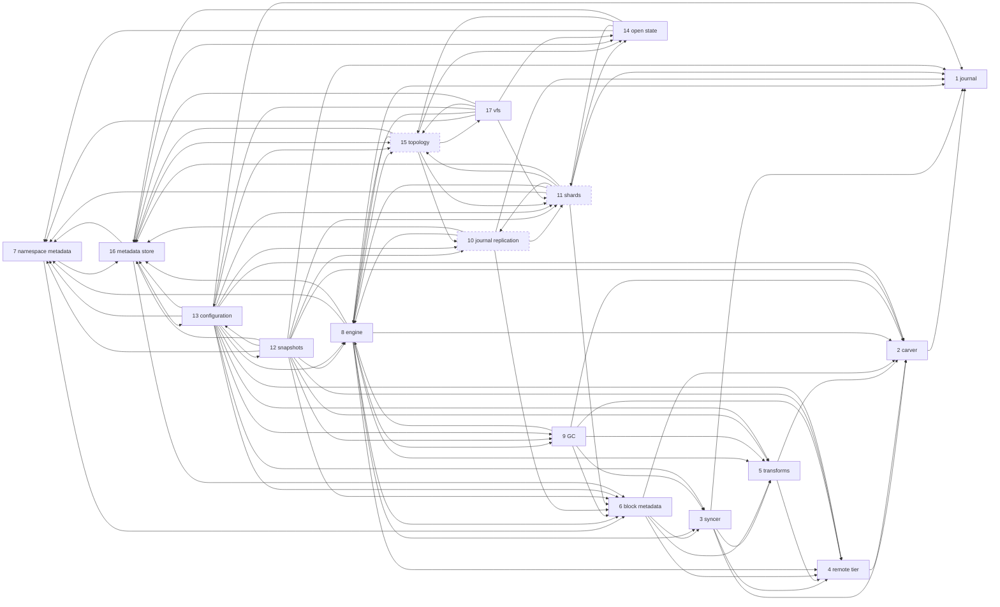

---
tags:
  - rfc-index
aliases:
  - RFCs
  - DittoFS RFCs
---

# DittoFS RFCs

The specification of DittoFS, from the bytes a client writes to the objects in the remote tier,
and the layers around them. [RFC 0](rfc-0-data-lifecycle.md) is the root: it defines the terms ([Glossary](rfc-0-data-lifecycle.md#Glossary)),
the residency function and the invariants every other RFC inherits. Start there, and read in
order: each part builds on the ones before it.

| RFC | Component | Status | Owns |
| --- | --- | --- | --- |
| **Foundations** | | | |
| [RFC 0](rfc-0-data-lifecycle.md) | data lifecycle | draft | terms, data model, residency, invariants, failure model |
| **Content**, in write-path order | | | |
| [RFC 1](rfc-1-journal.md) | journal | draft | local bytes, one journal per device: on-disk format, placement, crash safety, capacity |
| [RFC 2](rfc-2-carver.md) | carver | draft | bytes → chunks → blocks: boundaries, identity, packing |
| [RFC 3](rfc-3-syncer.md) | syncer | draft | transferring blocks to and from the remote tier |
| [RFC 4](rfc-4-remote-tier.md) | remote tier | draft | object format and backend contract |
| [RFC 5](rfc-5-transforms.md) | transforms | draft | compression, encryption, threat model |
| **Metadata** | | | |
| [RFC 6](rfc-6-block-metadata.md) | block metadata | draft | FileData, holes, refs, chunks, blocks, refcounts |
| [RFC 16](rfc-16-metadata-store.md) | metadata store | draft | the entity model and its Go package, the rules that keep it honest, interfaces by consumer and how they are assembled, control-plane and identity entities, the KV contract, key layout, codecs, counters, store format; testing, benchmarks and observability of the store |
| [RFC 7](rfc-7-namespace-metadata.md) | namespace metadata | draft | files, directories, handles, permissions, what keeps a file alive |
| [RFC 14](rfc-14-open-state.md) | open state and locks | draft | client leases, opens and deny modes, byte-range locks, caching grants (delegations, oplocks, leases), pNFS layouts, grace and per-shard reclaim, conflicts across protocols |
| **Composition** | | | |
| [RFC 17](rfc-17-vfs.md) | filesystem service (VFS) | draft | the one protocol-neutral API adapters call: operations, callbacks, errors, what stays in adapters; orchestration at one primary, quota enforcement by in-memory reservation, soft-quota and access-audit event hooks |
| [RFC 8](rfc-8-engine.md) | engine | draft | the content data path: the facade over journal, carver, syncer and block metadata, and its policy |
| [RFC 9](rfc-9-gc.md) | GC | draft | retirement and resurrection, trash, verified remote deletion, compaction policy, audit against the reverse ref index |
| **Cluster**, deferred past the first release ([RFC 0 §1.4](rfc-0-data-lifecycle.md#1.4%20The%20single-node%20profile)) | | | |
| [RFC 10](rfc-10-journal-replication.md) | journal replication | deferred | a primary and its replicas, fencing, seal, joining learners, catch-up, reads |
| [RFC 11](rfc-11-ownership.md) | shards | deferred | shards (a share by default, subtree and automatic per-child shards; per-file and range shards deferred), the primary of each, node leases, handover, batched moves, cross-shard operations, failover, forwarding |
| [RFC 15](rfc-15-topology.md) | topology and roles | deferred | one binary, two roles chosen at deployment (`protocol` and `storage`, both by default), the composition root: what each role composes, one primary per shard, the route envelope, routing calls to the primary that serves them, split and collocated deployments, pNFS metadata and data servers |
| **Data management** | | | |
| [RFC 12](rfc-12-snapshots.md) | snapshots, backups and share migration | draft | snapshots (a per-share cut number plus counted history refs; read-only, writable clones, scheduled with retention), metadata backup, restore to a new share, moving a share between installations on one bucket |
| **Configuration** | | | |
| [RFC 13](rfc-13-configuration.md) | configuration | draft | what is a setting and what is fixed, scopes, which settings bind content, validation, change, secrets |
| **Security** | | | |
| RFC 18 | identity and authentication | planned | principals, authentication flavours, identity mapping, squashing |
| RFC 19 | authorization | planned | one abstract ACL model, its protocol mappings, evaluation |
| **Protocols** | | | |
| RFC 20 | adapter model | planned | the protocol handler contract, auth context, error mapping, dispatch |
| RFC 21 | NFS | planned | decisions the NFS standards leave open |
| RFC 22 | SMB | planned | decisions the SMB standards leave open |
| **Operations** | | | |
| RFC 23 | control plane | planned | runtime, share lifecycle, management API; applies RFC 13's configuration |
| RFC 24 | resources and concurrency | planned | memory budgets, buffer pools, admission, backpressure |
| RFC 25 | observability | planned | metric and label conventions, health derivation, and the event streams: delivery, retention and export of the access-audit and quota events [RFC 17](rfc-17-vfs.md) emits |

[The block data-flow split](rfc-block-dataflow.md) is the earlier plan the storage RFCs grew out of.

## Dependencies

Generated from every RFC's `depends_on` frontmatter; regenerate it whenever one
changes, never edit it by hand. An arrow reads "builds on". Every RFC builds on
RFC 0; those edges are left out. A deferred RFC is drawn dashed. Two RFCs that
build on each other form a cycle, listed under the graph: they are reviewed
together, and neither is marked reviewed before the other.

Cycles: RFC 7 ↔ RFC 16, RFC 8 ↔ RFC 9, RFC 8 ↔ RFC 15, RFC 10 ↔ RFC 11, RFC 11 ↔ RFC 14, RFC 11 ↔ RFC 15, RFC 12 ↔ RFC 13, RFC 13 ↔ RFC 16, RFC 14 ↔ RFC 15, RFC 14 ↔ RFC 16, RFC 15 ↔ RFC 16, RFC 15 ↔ RFC 17.

## Conventions

The key words **MUST**, **MUST NOT**, **SHOULD**, **SHOULD NOT** and **MAY** in
every RFC of this set are to be interpreted as in RFC 2119.

- Each RFC's frontmatter carries its status and what it builds on
  (`depends_on`); the body does not repeat them, and the table and graph above
  are generated from it.
- **Status** is one of: `planned` (no text yet); `draft` (rules still moving);
  `reviewed` (an external review's findings are closed in the normative text);
  `frozen` (reviewed, and a change to it is made only together with every RFC
  that cites the changed rule); `deferred` (not built in the first release; its
  rules bind only once a second storage node can serve a share,
  [RFC 0 §1.4](rfc-0-data-lifecycle.md#1.4%20The%20single-node%20profile)). An RFC is never marked `reviewed` or `frozen` while an RFC
  it builds on is `draft`: a reviewed rule resting on a moving one is not
  reviewed.
- A rule that binds only in a cluster is marked **(cluster)** where it is
  stated, and links the single-node profile.
- Normative text names no product, package, file or function. Products appear
  only in appendices labelled as a profile, an example, prior art, a measurement
  or where the current code differs.
- **Every RFC opens with `## Start here`**, written for a reader who knows
  neither the codebase nor the problem: what the component is for, the problem
  shown through one worked example, one drawing, the few terms needed, what it
  promises, and how the rest is organised. It is explanatory; the numbered
  sections hold the rules, and where the two differ the rule wins. Examples
  across RFCs use one cast — the `profiles` share of per-user profile
  containers over SMB, the `builds` share over NFS, users alice and bob — so a
  story started in one RFC continues in the next.
- Signatures are indicative; the obligations around them are normative.
- `ponytail:` notes mark a deliberately simple design and name what would justify
  replacing it; `decision:` notes mark a deliberately narrow rule and name what
  would overturn it.

## Test tiers

Every RFC's test plan follows the rules here; an RFC states only what is
specific to its component.

**What conformance is.** An implementation conforms when every **MUST** in its
RFC holds. Each RFC's named checks are not that definition: they are evidence
for the requirements that fail *silently*, where nothing errors and no test goes
red by accident. Passing them is necessary, not sufficient.

**How a check is validated.**

- Test at the consumer of a value, not its producer: a test beside the producer
  passes while the value is dropped downstream.
- Revert the code and watch the check fail on its own assertion. A check that has
  never failed is unverified; a build error is not a failure.
- Where the defect and the correct behaviour look alike at the point they happen
  (zeros instead of a fetch, a bit set too early), assert on the observation
  that tells them apart.

**What must not stand in.**

- A substitute that cannot exhibit a failure is not evidence of its absence: a
  sink whose writes always succeed, or an in-memory backend, is never the only
  backend under test for a check about durability, cost or crashes.
- The remote tier under test is a local emulator of the remote service, and at
  least one real service in the daily tier.
- A harness that constructs a component differently from production is never the
  only path under test.
- Records built by hand are never the only input to a component whose input
  another component produces in production. A hand-built fixture encodes its
  author's model of the producer; the leak that exists only for repeated or
  all-zero content, or only when two producers race, passes every such check.
  Fixtures include repeated and all-zero content.
- A cache between the check and the thing checked is disabled or bypassed, and
  the check asserts that the thing was reached: a "cold" read served from a
  client's page cache proves nothing about the remote fetch it was written for.

**A check that did not run is a failure.** Every tier knows how many checks it
was meant to run and fails when it ran fewer: a filter that matches nothing, a
package no job includes, a check gated on an environment variable nothing sets,
or a skip because a service was absent all report green otherwise. A skip is
reported with its reason, and a check skipped in every tier is deleted or moved
to a tier that runs it. A check that timed out or was aborted is a failure,
never a skip. A known-failure list names checks, not outcomes: an entry excuses
one named check, and a check that fails in a way it does not name still fails
the tier.

**When tests run.**

| Tier | Runs | Contains |
| --- | --- | --- |
| **Per change** | on every proposed change | unit, conformance, property and fuzz seeds, model-based tests at a fixed budget, and each RFC's counted checks; minutes, no timing, no external service |
| **After merge** | after each merge to the integration branch | benchmarks on the reference box, recorded; a result more than 10% worse than the last is reported and blocks the next change to that path until explained (below) |
| **Daily** | once a day on the integration branch | benchmarks that need space or hours, soaks, longer fuzz and model runs, and tests against real backends |

**Model tests.** A rule whose failure needs an interleaving — work split into
batches, a race between two writers, a crash between two steps — is checked by a
model-based test that drives random sequences against a reference and compares
after every step. A model that applies each step atomically cannot see these
failures. The model tests the set specifies:

| RFC | Model test | Drives |
| --- | --- | --- |
| [RFC 1 §11.1](rfc-1-journal.md#11.1%20Kinds%20of%20test) | the journal | writes, fills, offloads, releases, truncates, deallocates, deletes, settles, repack, crash and reopen |
| [RFC 6 §11.1](rfc-6-block-metadata.md#11.1%20Group%20A%20%E2%80%94%20wrong%20content%2C%20lost%20content) | block metadata | commits, truncates, deallocates, clones, snapshots and their deletion, with removal batches interleaved; a removal must mask what it has not yet dropped, and a count must never fall below its refs. It must also drive overwrite records and their pruning against offloads in flight |
| [RFC 9 §11.2](rfc-9-gc.md#11.2%20Group%20B%20%E2%80%94%20model-based%2C%20with%20crashes) | GC | retirement, resurrection, deletion and compaction, with crashes |
| [RFC 16 §6.2](rfc-16-metadata-store.md#6.2%20Model-based%20and%20property%20tests) | the metadata store | transactions, conflicts and the KV contract |
| [RFC 10](rfc-10-journal-replication.md) **(cluster)** | replication | its invariants as properties of a cluster model |

An RFC that adds a batched or racing rule adds it to its model test, or names
the counted check that stands in for it.

No timed check runs per change: a shared runner's device changes between runs,
so a timing gate either fails on noise or is set so wide it misses the
regressions that matter. Each RFC states the regressions it catches by counting
instead.

**Recording results.** Every benchmark result is recorded in absolute numbers,
with the commit, the box (CPU, memory, device and the device's own raw figures
for the run), the operating system and filesystem with its mount options, and
each row's concurrency. One named **reference box** carries the series over
time, so a change between two commits reads as a change in the code and not in
the hardware; results from other boxes are compared only with themselves. A
target is stated against something measured on the same box (the filesystem,
the hash, the link), so it holds on any hardware.

**The reference box.** The reference box is the pair of machines set aside for
the benchmark series. Before any decision that depends on numbers, three
measurements **MUST** be recorded there:

1. **Raw stage costs**: hash, compression, encryption, journal append with its
   fsync, and remote put and get at rising concurrency, the last measured with
   the sizing tool of [RFC 3 §2.11](rfc-3-syncer.md#2.11%20Pool%20sizes%20are%20measured%20once%2C%20by%20a%20tool).
2. **The dedup ratio** on a real customer corpus.
3. **The journal-shape benchmark** on three workloads: many small files, each
   closed by a COMMIT; one large sequential stream; random in-place overwrites
   inside a large file behind one long-lived handle. The gate is one-sided:
   shape B, staging files, is adopted only if it is no more than 5% worse than
   shape A, segments, on each gate measure — COMMIT latency, small-file
   throughput, recovery time after a crash with the journal full, and space
   amplification (bytes on the device over bytes held) — at the median and at
   p99, on every workload. Better on some and more than 5% worse on any one keeps
   A ([RFC 1 §4.6](rfc-1-journal.md#4.6%20Segments%20or%20staging%20files%2C%20chosen%20by%20benchmark)).

**A regression blocks until explained.** A row more than 10% worse on a measured
path, against the last recorded result on the reference box, blocks the change
that caused it — or, where only the after-merge run sees it, the next change to
that path — until the regression is explained: fixed, or accepted with its reason
recorded beside the result. The after-merge run does not undo a merge; the
explanation is what it waits for.

## Reference workloads

*Non-normative.* The workloads below are what the benchmarks and capacity
targets are sized against. They describe deployments, not requirements; an RFC
that cites one states the property it derives from it.

**Per-user profile containers on an SMB share.** The first enterprise
deployment stores each user's profile as a virtual disk inside one file (a
profile-container product such as FSLogix). Per user:

- one container file, about 10.5 GB on the share in steady state for a 5 GB
  mailbox (to be confirmed), presented to Windows as a 30 GB logical disk —
  the product's default cap, which can be grown;
- one read/write handle on it, held open for the whole desktop session;
- a small metadata file (under 1 MB), read at sign-in and at sign-out and then
  released, with no handle held.

What follows from it:

- Few large files, written by random in-place overwrites behind a long-lived
  handle — not many small files closed after each write.
- Sign-in storms: many users open their containers at once, each a cold read of
  the container's header and its hot blocks. The journal must hold the active
  users' working sets.
- SMB durable handles and leases matter, because the handle outlives network
  blips and the session lasts hours.
- 30 GB per file is the test size; larger files are a stretch target.
- Many users, and many shares.
- At sign-out the product may compact the container, ending in one truncate
  that drops gigabytes (30 GB to 24 GB in one test). The truncate returns at
  once; the dropped tail is left for GC.

**Read-mostly ingestion for a retrieval and indexing pipeline.** A pipeline
reads a share of documents to build a search or embedding index, and rereads
what changed. On one install: about 7,000 files totalling 1.1 GB, read at about
67 MB/s cold and 122 MB/s warm.

- Many small files, read whole, mostly once per pass: cold-read latency per file
  and pre-warm decide the pass time, not write throughput.
- A read that returned zeros instead of failing would poison the index with no
  error anywhere downstream. The reader cannot tell, so **Lost** must fail the
  read ([RFC 0 §9](rfc-0-data-lifecycle.md#9.%20Invariants), I1).
- Open question: whether a share-wide change feed, so the pipeline reads only
  what changed without walking the tree, is in scope — beyond per-directory
  watches ([RFC 14 §2.5](rfc-14-open-state.md#2.5%20Watch)).

## Reading them in Obsidian

- Every `RFC N §x.y` is a link to that section. Hover for a preview; the backlinks pane shows
  every place that cites the section you are reading.
- Each RFC carries properties (`rfc`, `component`, `status`, `depends_on`), and
  [rfcs.base](rfcs.base) tabulates them.
- The Google Docs copies are generated from these files; comment in either place.
