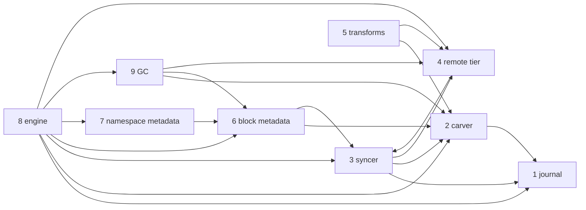

---
tags:
  - rfc-index
aliases:
  - RFCs
  - DittoFS RFCs
---

# DittoFS RFCs

The specification of DittoFS, from the bytes a client writes to the objects in the remote tier,
and the layers around them. [RFC 0](rfc-0-data-lifecycle.md) is the root: it defines the terms,
the residency function and the invariants every other RFC inherits. Start there, and read in
order: each part builds on the ones before it.

| RFC | Component | Owns |
| --- | --- | --- |
| **Foundations** | | |
| [RFC 0](rfc-0-data-lifecycle.md) | data lifecycle | terms, data model, residency, invariants, failure model |
| **Content**, in write-path order | | |
| [RFC 1](rfc-1-journal.md) | journal | local bytes, one journal per device: on-disk format, placement, crash safety, capacity |
| [RFC 2](rfc-2-carver.md) | carver | bytes → chunks → blocks: boundaries, identity, packing |
| [RFC 3](rfc-3-syncer.md) | syncer | transferring blocks to and from the remote tier |
| [RFC 4](rfc-4-remote-tier.md) | remote tier | object format and backend contract |
| [RFC 5](rfc-5-transforms.md) | transforms | compression, encryption, threat model |
| **Metadata** | | |
| [RFC 6](rfc-6-block-metadata.md) | block metadata | FileData, holes, refs, chunks, blocks, refcounts |
| [RFC 16](rfc-16-metadata-store.md) | metadata store | *draft* — the entity model and its Go package, the rules that keep it honest, interfaces by consumer and how they are assembled, control-plane and identity entities, the KV contract, key layout, codecs, counters, store format; testing, benchmarks and observability of the store |
| [RFC 7](rfc-7-namespace-metadata.md) | namespace metadata | files, directories, handles, permissions, what keeps a file alive |
| [RFC 14](rfc-14-open-state.md) | open state and locks | *draft* — client leases, opens and deny modes, byte-range locks, caching grants (delegations, oplocks, leases), pNFS layouts, grace and per-unit reclaim, conflicts across protocols |
| **Composition** | | |
| [RFC 17](rfc-17-vfs.md) | filesystem service (VFS) | *draft* — the one protocol-neutral API adapters call: operations, callbacks, errors, what stays in adapters; orchestration at one owner, quota enforcement by in-memory reservation, soft-quota and access-audit event hooks |
| [RFC 8](rfc-8-engine.md) | engine | the content data path: the facade over journal, carver, syncer and block metadata, and its policy |
| [RFC 9](rfc-9-gc.md) | GC | sweep, trash, compaction, remote deletion, index rebuild |
| **Cluster** | | |
| [RFC 10](rfc-10-journal-replication.md) | journal replication | *draft* — owner-driven replication, fencing, seal, catch-up, reads from replicas |
| [RFC 11](rfc-11-ownership.md) | ownership | *draft* — ownership units (a share by default, automatic per-child units, byte-range units), leases, handover, failover, forwarding |
| [RFC 15](rfc-15-topology.md) | topology and roles | *draft* — one binary, two roles chosen at deployment (`protocol` and `storage`, both by default), the composition root: what each role composes, one owner per unit, striping by range units, the route envelope, routing calls to the owner that serves them, split and collocated deployments, pNFS metadata and data servers |
| **Data management** | | |
| [RFC 12](rfc-12-snapshots.md) | snapshots, backups and share migration | *draft* — snapshots (a per-share cut number plus counted history refs; read-only, writable clones, scheduled with retention), metadata backup, restore to a new share, moving a share between installations on one bucket |
| **Configuration** | | |
| [RFC 13](rfc-13-configuration.md) | configuration | *draft* — what is a setting and what is fixed, scopes, which settings bind content, validation, change, secrets |
| **Security** | | |
| RFC 18 | identity and authentication | *planned, next* — principals, authentication flavours, identity mapping, squashing |
| RFC 19 | authorization | *planned* — one abstract ACL model, its protocol mappings, evaluation |
| **Protocols** | | |
| RFC 20 | adapter model | *planned* — the protocol handler contract, auth context, error mapping, dispatch |
| RFC 21 | NFS | *planned* — decisions the NFS standards leave open |
| RFC 22 | SMB | *planned* — decisions the SMB standards leave open |
| **Operations** | | |
| RFC 23 | control plane | *planned* — runtime, share lifecycle, management API; applies RFC 13's configuration |
| RFC 24 | resources and concurrency | *planned* — memory budgets, buffer pools, admission, backpressure |
| RFC 25 | observability | *planned* — metric and label conventions, health derivation, and the event streams: delivery, retention and export of the access-audit and quota events [RFC 17](rfc-17-vfs.md) emits |

[The block data-flow split](rfc-block-dataflow.md) is the earlier plan the storage RFCs grew out of.

## Dependencies

An arrow reads "builds on". Every RFC builds on RFC 0; those edges are left out.

## Conventions

The key words **MUST**, **MUST NOT**, **SHOULD**, **SHOULD NOT** and **MAY** in
every RFC of this set are to be interpreted as in RFC 2119.

- Each RFC's frontmatter carries its status and what it builds on
  (`depends_on`); the body does not repeat them.
- Normative text names no product, package, file or function. Products appear
  only in appendices labelled as a profile, an example, prior art, a measurement
  or where the current code differs.
- Signatures are indicative; the obligations around them are normative.
- `ponytail:` notes mark a deliberately simple design and name what would justify
  replacing it; `decision:` notes mark a deliberately narrow rule and name what
  would overturn it.

## Test tiers

Every RFC's test plan follows the rules here; an RFC states only what is
specific to its component.

**What conformance is.** An implementation conforms when every **MUST** in its
RFC holds. Each RFC's named checks are not that definition: they are evidence
for the requirements that fail *silently*, where nothing errors and no test goes
red by accident. Passing them is necessary, not sufficient.

**How a check is validated.**

- Test at the consumer of a value, not its producer: a test beside the producer
  passes while the value is dropped downstream.
- Revert the code and watch the check fail on its own assertion. A check that has
  never failed is unverified; a build error is not a failure.
- Where the defect and the correct behaviour look alike at the point they happen
  (zeros instead of a fetch, a bit set too early), assert on the observation
  that tells them apart.

**What must not stand in.**

- A substitute that cannot exhibit a failure is not evidence of its absence: a
  sink whose writes always succeed, or an in-memory backend, is never the only
  backend under test for a check about durability, cost or crashes.
- The remote tier under test is a local emulator of the remote service, and at
  least one real service in the daily tier.
- A harness that constructs a component differently from production is never the
  only path under test.
- Records built by hand are never the only input to a component whose input
  another component produces in production. A hand-built fixture encodes its
  author's model of the producer; the leak that exists only for repeated or
  all-zero content, or only when two producers race, passes every such check.
  Fixtures include repeated and all-zero content.
- A cache between the check and the thing checked is disabled or bypassed, and
  the check asserts that the thing was reached: a "cold" read served from a
  client's page cache proves nothing about the remote fetch it was written for.

**A check that did not run is a failure.** Every tier knows how many checks it
was meant to run and fails when it ran fewer: a filter that matches nothing, a
package no job includes, a check gated on an environment variable nothing sets,
or a skip because a service was absent all report green otherwise. A skip is
reported with its reason, and a check skipped in every tier is deleted or moved
to a tier that runs it.

**When tests run.**

| Tier | Runs | Contains |
| --- | --- | --- |
| **Per change** | on every proposed change | unit, conformance, property and fuzz seeds, model-based tests at a fixed budget, and each RFC's counted checks; minutes, no timing, no external service |
| **After merge** | after each merge to the integration branch | benchmarks on the reference box, recorded; a result more than 10% worse than the last is reported, not blocking |
| **Daily** | once a day on the integration branch | benchmarks that need space or hours, soaks, longer fuzz and model runs, and tests against real backends |

**The model test covers batching and masking.** The metadata model test
([RFC 6 §11.1](rfc-6-block-metadata.md#11.1%20Group%20A%20%E2%80%94%20wrong%20content%2C%20lost%20content)) drives removals, clones and snapshot deletions that span many
batches, crashes between any two, and reads through every partly applied one: a
removal must mask what it has not yet dropped, and a count must never fall below
its refs. A model that applies each removal in one step cannot see either.

No timed check runs per change: a shared runner's device changes between runs,
so a timing gate either fails on noise or is set so wide it misses the
regressions that matter. Each RFC states the regressions it catches by counting
instead.

**Recording results.** Every benchmark result is recorded in absolute numbers,
with the commit, the box (CPU, memory, device and the device's own raw figures
for the run), the operating system and filesystem with its mount options, and
each row's concurrency. One named **reference box** carries the series over
time, so a change between two commits reads as a change in the code and not in
the hardware; results from other boxes are compared only with themselves. A
target is stated against something measured on the same box (the filesystem,
the hash, the link), so it holds on any hardware.

## Reading them in Obsidian

- Every `RFC N §x.y` is a link to that section. Hover for a preview; the backlinks pane shows
  every place that cites the section you are reading.
- Each RFC carries properties (`rfc`, `component`, `status`, `depends_on`), and
  [rfcs.base](rfcs.base) tabulates them.
- The Google Docs copies are generated from these files; comment in either place.
