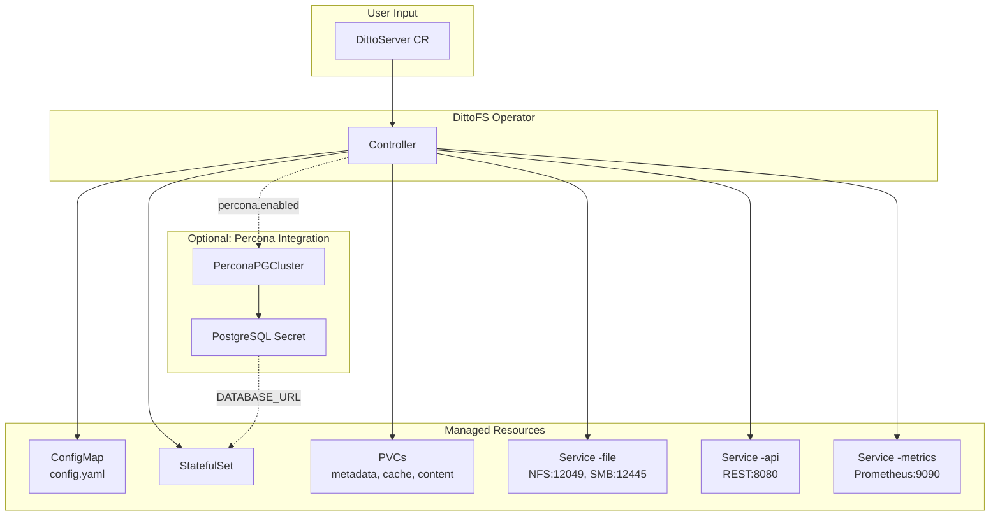

# DittoFS Kubernetes Operator

A Kubernetes operator for deploying and managing DittoFS distributed filesystem servers.

## Overview

The DittoFS Operator automates deployment, configuration, and lifecycle management of DittoFS servers on Kubernetes. It provides a declarative API through Custom Resource Definitions (CRDs) to manage DittoFS instances, automatically handling StatefulSets, Services, ConfigMaps, and persistent storage.

## Architecture



## Quick Start

```bash
# 1. Install CRDs
kubectl apply -f https://raw.githubusercontent.com/marmos91/dittofs/main/k8s/dittofs-operator/config/crd/bases/dittofs.dittofs.com_dittoservers.yaml

# 2. Install operator
kubectl apply -k 'https://github.com/marmos91/dittofs//k8s/dittofs-operator/config/default?ref=main'

# 3. Create secrets (JWT and admin password)
kubectl create secret generic dittofs-jwt-secret \
  --from-literal=jwt-signing-key="$(openssl rand -base64 32)"
kubectl create secret generic dittofs-admin-secret \
  --from-literal=password-hash="$(htpasswd -nbB '' admin | cut -d: -f2)"

# 4. Create a DittoServer
kubectl apply -f - <<EOF
apiVersion: dittofs.dittofs.com/v1alpha1
kind: DittoServer
metadata:
  name: my-dittofs
spec:
  storage:
    metadataSize: "10Gi"
    cacheSize: "5Gi"
  identity:
    jwt:
      secretRef:
        name: dittofs-jwt-secret
        key: jwt-signing-key
    admin:
      username: admin
      passwordSecretRef:
        name: dittofs-admin-secret
        key: password-hash
  service:
    type: LoadBalancer
EOF

# 5. Wait for ready
kubectl wait --for=condition=Ready dittoserver/my-dittofs --timeout=300s

# 6. Mount via NFS (default port 12049)
EXTERNAL_IP=$(kubectl get svc my-dittofs-file -o jsonpath='{.status.loadBalancer.ingress[0].ip}')
sudo mount -t nfs -o tcp,port=12049,mountport=12049 $EXTERNAL_IP:/export /mnt/dittofs
```

## Documentation

| Guide | Description |
|-------|-------------|
| [Installation](docs/INSTALL.md) | kubectl and Helm installation methods |
| [CRD Reference](docs/CRD_REFERENCE.md) | Complete field reference with examples |
| [Percona Integration](docs/PERCONA.md) | PostgreSQL metadata store via Percona |
| [Troubleshooting](docs/TROUBLESHOOTING.md) | Common issues and solutions |

## Features

- **Declarative Management** - Define DittoFS configuration as Kubernetes resources
- **Automatic Resource Management** - StatefulSets, Services, ConfigMaps, PVCs
- **Protocol Support** - NFS and SMB with configurable ports
- **S3 Credentials Injection** - Automatic AWS SDK environment variables
- **Percona PostgreSQL Integration** - Production-grade metadata store
- **Status Conditions** - Ready, Available, ConfigReady, DatabaseReady
- **Observability** - Prometheus metrics, events, structured logging
- **Graceful Lifecycle** - Finalizers, probes, preStop hooks

## Prerequisites

- Kubernetes 1.26+
- kubectl 1.26+
- Storage provisioner (for PVCs)
- Optional: Percona Operator (for PostgreSQL metadata store)

## Sample Configurations

The `config/samples/` directory contains example DittoServer configurations:

| Sample | Description |
|--------|-------------|
| `ditto.io_v1alpha1_dittoserver.yaml` | Basic configuration with identity |
| `dittofs_v1alpha1_dittofs_memory.yaml` | Complete configuration with secrets |
| `dittofs_v1alpha1_dittoserver_percona.yaml` | Percona PostgreSQL integration |
| `ditto.io_v1alpha1_dittoserver_aws_s3.yaml` | S3 backend preparation |
| `dittofs-s3-smb-server.yaml` | SMB with S3 configuration |

## Development

```bash
# Build and install CRDs
make install

# Run operator locally
make run

# Run tests
make test

# Build container image
make docker-build IMG=<registry>/dittofs-operator:tag
```

## License

Apache License 2.0. See [LICENSE](LICENSE) for details.
